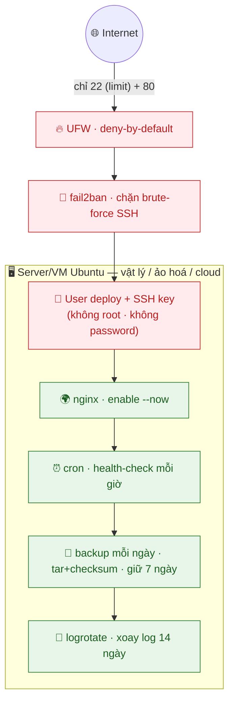

# Giai đoạn 1 — Nền tảng Hệ thống & Linux (SysOps Foundation)

> **Ngày 1–12** · Làm chủ Linux, dòng lệnh, mạng, bảo mật cơ bản — nền móng của mọi SysOps/DevOps.
>
> **Cách dùng tài liệu:** Mỗi ngày dành 60–90 phút. **Gõ tay tất cả lệnh** (không copy-paste) để cơ tay nhớ. Mỗi ngày có 4 phần:
> - 📘 **Lý thuyết** — nắm khái niệm
> - 🧪 **Lab cơ bản** — làm tay theo từng bước để hiểu
> - 🚀 **Lab nâng cao (best-practice)** — làm sát production, đúng chuẩn vận hành thật
> - 📝 **Bài ôn tập + Demo đối chiếu** — tự kiểm tra
>
> Chưa hiểu ngày nào thì học lại trước khi đi tiếp — DevOps là kiến thức tích lũy.

---

## Mục lục

| Ngày | Chủ đề |
|------|--------|
| [1](#ngày-1--devops--sysops-là-gì-tổng-quan-toàn-ngành) | DevOps & SysOps là gì? Tổng quan toàn ngành |
| [2](#ngày-2--linux-cơ-bản--điều-hướng--quản-lý-file) | Linux cơ bản — Điều hướng & Quản lý file |
| [3](#ngày-3--linux--quản-lý-tiến-trình--phần-mềm) | Linux — Quản lý tiến trình & phần mềm |
| [4](#ngày-4--linux--người-dùng-nhóm--phân-quyền) | Linux — Người dùng, nhóm & phân quyền |
| [5](#ngày-5--bash-scripting--cơ-bản) | Bash Scripting — Cơ bản |
| [6](#ngày-6--bash-scripting--nâng-cao--tự-động-hóa) | Bash Scripting — Nâng cao & tự động hóa |
| [7](#ngày-7--mạng-máy-tính-cho-devops--cơ-bản) | Mạng máy tính cho DevOps — Cơ bản |
| [8](#ngày-8--ssh--kết-nối--quản-lý-server-từ-xa) | SSH — Kết nối & quản lý server từ xa |
| [9](#ngày-9--tường-lửa-bảo-mật--hardening) | Tường lửa, bảo mật & hardening |
| [10](#ngày-10--quản-lý-log--giám-sát-hệ-thống) | Quản lý log & giám sát hệ thống |
| [11](#ngày-11--lưu-trữ-backup--khôi-phục) | Lưu trữ, backup & khôi phục |
| [12](#ngày-12--milestone--lab-tổng-hợp-giai-đoạn-1) | **Milestone — LAB tổng hợp Giai đoạn 1** |

---

## Ngày 1 — DevOps & SysOps là gì? Tổng quan toàn ngành

> ⏱️ ~90 phút · Loại: Khái niệm

### 📘 Lý thuyết

- **SysOps (System Operations):** vận hành, duy trì, giám sát hệ thống máy chủ — đảm bảo hệ thống chạy ổn định 24/7.
- **DevOps = Development + Operations:** phá vỡ rào cản giữa lập trình viên (Dev) và vận hành (Ops), tự động hóa toàn bộ quy trình.
- **Khác biệt cốt lõi:** SysOps thiên về vận hành thủ công/bán tự động; DevOps nhấn mạnh **tự động hóa (automation)**, CI/CD, Infrastructure as Code.
- **Vấn đề DevOps giải quyết:** Dev muốn release nhanh, Ops muốn ổn định → mâu thuẫn kinh điển *"works on my machine"*.
- **Vòng đời DevOps (8 bước):** `Plan → Code → Build → Test → Release → Deploy → Operate → Monitor` (vòng lặp vô tận ∞).
- **CI/CD:** Continuous Integration (tích hợp liên tục) + Continuous Delivery/Deployment (chuyển giao/triển khai liên tục).
- **Bộ công cụ DevOps phổ biến:** Git, Docker, Kubernetes, Terraform, Ansible, Jenkins, GitHub Actions, Prometheus, Grafana.
- **Lộ trình nghề nghiệp:** Linux Admin → SysOps → DevOps Engineer → SRE (Site Reliability Engineer) / Cloud Architect / Platform Engineer.

### 📖 Hiểu rõ hơn (giải thích cho người mới)

**DevOps thực ra là gì? (bằng một câu chuyện)**
Ngày xưa, lập trình viên (Dev) viết code xong "ném" cho bộ phận vận hành (Ops) đem lên server. Code chạy được trên máy Dev nhưng lên server thì lỗi → hai bên đổ lỗi nhau (*"works on my machine!"*). **DevOps** sinh ra để xóa bức tường đó: cùng một quy trình, tự động hóa, ai cũng chịu trách nhiệm từ lúc viết code đến lúc chạy thật.

**SysOps vs DevOps — khác gì?**
- **SysOps** = người trông server: cài đặt, theo dõi, sửa khi hỏng (nhiều thao tác tay).
- **DevOps** = SysOps + **tự động hóa mọi thứ bằng code** (CI/CD, Infrastructure as Code). Thay vì click chuột tạo 10 server, bạn viết 1 file code để máy tự tạo.
> Bạn sẽ đi: SysOps (nền tảng — Giai đoạn 1) → DevOps (tự động hóa — Giai đoạn 2–3) → SRE (độ tin cậy — Giai đoạn 4).

**Vòng đời DevOps (8 bước) — như dây chuyền nhà máy chạy vòng ∞:**
`Plan` (lên kế hoạch) → `Code` (viết) → `Build` (đóng gói) → `Test` (kiểm thử) → `Release` (phát hành) → `Deploy` (đưa lên server) → `Operate` (vận hành) → `Monitor` (giám sát) → quay lại Plan. **CI/CD** chính là cái máy tự động chạy dây chuyền này.

**CI/CD nói thật đơn giản:**
- **CI** = mỗi lần bạn sửa code, máy tự *kiểm tra + đóng gói* ngay (bắt lỗi sớm).
- **CD** = sau khi kiểm tra xong, máy tự *đưa lên server*. Bạn chỉ `git push`, phần còn lại máy lo.

> 🧠 **Một câu để nhớ:** DevOps không phải một công cụ, mà là **văn hóa "tự động hóa mọi việc lặp lại"**. Mọi công cụ bạn học (Git, Docker, K8s...) chỉ là phương tiện cho triết lý đó.

### 🧪 Lab cơ bản

1. Tạo tài khoản GitHub miễn phí tại [github.com](https://github.com).
2. Tải & cài Git từ [git-scm.com/downloads](https://git-scm.com/downloads), kiểm tra:
   ```bash
   git --version          # mong đợi: git version 2.x.x
   ```
3. Vẽ sơ đồ vòng đời DevOps 8 bước ra giấy, ghi chú từng giai đoạn làm gì.
4. Đọc 1 bài về DevOps culture (Google: *"Netflix DevOps culture"* hoặc *"Spotify engineering culture"*).
5. Tạo file kế hoạch học tập 60 ngày bằng Notion / Obsidian / file `.md` để theo dõi tiến độ.

### 🚀 Lab nâng cao (best-practice)

> Mục tiêu: thiết lập "tư thế" làm việc đúng chuẩn ngay từ ngày 0.

1. **Cấu hình Git định danh + ký commit:**
   ```bash
   git config --global user.name "Tên Bạn"
   git config --global user.email "ban@example.com"
   git config --global init.defaultBranch main
   git config --global pull.rebase true        # lịch sử commit gọn, tránh merge commit rác
   ```
2. **Tạo SSH key cho GitHub ngay** (sẽ dùng cả khóa học) — `ed25519` an toàn hơn RSA:
   ```bash
   ssh-keygen -t ed25519 -C "ban@example.com"
   ```
   Thêm `~/.ssh/id_ed25519.pub` vào GitHub → Settings → SSH keys, rồi test: `ssh -T git@github.com`.
3. **Tạo repo theo dõi tiến độ** `devops-60-days` trên GitHub, clone về, tạo `README.md` dạng bảng checklist 60 ngày → commit đầu tiên. Đây là **portfolio** của bạn trong 60 ngày tới.
4. **Liên hệ thực tế:** với bất kỳ hệ thống nào bạn đang/sẽ vận hành (server vật lý, VM, hay cloud), hãy liệt kê ra giấy: phần nào đang làm **thủ công** (tạo máy, cấu hình, deploy, backup)? Đó chính là các "toil" mà DevOps sẽ tự động hóa dần.

### 🧭 Hướng dẫn làm lab & giải nghĩa lệnh (cho người tự học)

> Đọc khi làm để hiểu *vì sao*, không chỉ chép theo.

**Trình tự nên làm:** cài Git → khai báo định danh (`git config`) → tạo SSH key → gắn key lên GitHub → test kết nối. Mỗi bước xong hãy *thấy kết quả* rồi mới đi tiếp.

**Giải nghĩa & kết quả mong đợi:**
- `git --version` — kiểm tra Git đã cài chưa. *Kết quả:* `git version 2.x.x`. Nếu "command not found" → chưa cài (Ubuntu/Debian: `sudo apt install -y git`; Fedora/RHEL: `sudo dnf install -y git`).
- `git config --global user.name/.email` — gắn tên + email vào MỌI commit. **Vì sao `--global`:** áp dụng cho mọi repo trên máy (lưu ở `~/.gitconfig`), khỏi khai lại. *Kết quả:* `git config --global --list` in đúng tên/email.
- `git config --global pull.rebase true` — khi `git pull` thì rebase thay vì merge. **Vì sao:** lịch sử thẳng, không rác "Merge branch...".
- `ssh-keygen -t ed25519 -C "email"` — tạo *cặp* khóa: `id_ed25519` (private — GIỮ KÍN) + `id_ed25519.pub` (public — đem chia sẻ). **Vì sao ed25519:** ngắn, nhanh, an toàn tương đương RSA dài. *Kết quả:* 2 file trong `~/.ssh/`.
- `ssh -T git@github.com` — test danh tính SSH với GitHub (không mở shell). *Kết quả:* `Hi <user>! You've successfully authenticated...`.

**🧪 Thử nghiệm (tự khám phá):**
- `cat ~/.ssh/id_ed25519.pub` (public — OK để copy) rồi nhìn `cat ~/.ssh/id_ed25519` (private). **Bài học:** chỉ copy file `.pub`; private không bao giờ rời máy.
- `git config --global --list` — thấy mọi cấu hình vừa đặt nằm gọn một chỗ.

⚠️ **Dễ sai:** dán nhầm **private key** lên GitHub (phải là file `.pub`). Lộ private key = phải tạo lại key.

💡 **Hiểu sâu:** SSH key dùng mã hóa bất đối xứng — server giữ public key, chỉ ai có private key tương ứng mới chứng minh được danh tính. Bạn dùng lại nguyên lý này ở Ngày 8 và mọi lần `git push`.

### 📝 Bài ôn tập & Demo đối chiếu

- **Câu hỏi:** Khác biệt cốt lõi giữa SysOps và DevOps? (gợi ý: mức độ tự động hóa)
- Liệt kê 8 bước vòng đời DevOps theo thứ tự, **không nhìn tài liệu**.
- Tự giải thích CI và CD khác nhau ở điểm nào.

| Demo đối chiếu | Kết quả mong đợi |
|---|---|
| Chạy `git --version` | `git version 2.x.x` |
| Truy cập `github.com/<username>` | Trang profile mở được |
| `ssh -T git@github.com` | `Hi <user>! You've successfully authenticated...` |

✅ **Kết quả đạt được:** Hiểu bức tranh tổng thể SysOps/DevOps, có GitHub + SSH key, cài Git thành công, có kế hoạch học.

---

## Ngày 2 — Linux cơ bản: Điều hướng & Quản lý file

> ⏱️ ~90 phút (30 cài đặt + 60 luyện tập) · Loại: Linux

### 📘 Lý thuyết

- **Linux là gì:** HĐH mã nguồn mở, chạy ~90% server toàn cầu, nền tảng của cloud.
- **Cấu trúc thư mục (FHS):**
  | Đường dẫn | Vai trò |
  |---|---|
  | `/` | root — gốc của toàn hệ thống |
  | `/home` | file của user |
  | `/etc` | file cấu hình |
  | `/var` | log, dữ liệu biến đổi (database, cache) |
  | `/tmp` | file tạm (xóa khi reboot) |
  | `/usr` | chương trình, thư viện |
  | `/opt` | phần mềm bên thứ ba |
- **Lệnh điều hướng:** `pwd` (vị trí hiện tại), `ls` (liệt kê), `ls -la` (chi tiết + file ẩn), `cd` (chuyển thư mục), `cd ..` (lên 1 cấp), `cd ~` (về home), `cd -` (về thư mục trước đó).
- **Quản lý thư mục/file:** `mkdir`, `mkdir -p a/b/c` (tạo lồng nhau), `touch` (tạo file rỗng), `rmdir` (xóa thư mục rỗng).
- **Sao chép & di chuyển:** `cp nguồn đích`, `cp -r` (cả thư mục), `mv` (di chuyển/đổi tên), `rm` (xóa), `rm -rf` (xóa đệ quy — ⚠️ cẩn thận, không có thùng rác!).
- **Xem nội dung:** `cat` (in cả file), `less` (xem từng trang, `q` để thoát), `head -n 10`, `tail -n 10`, `tail -f` (theo dõi log real-time).
- **Đường dẫn:** tuyệt đối (`/home/user/file`) vs tương đối (`./file`, `../file`).

### 📖 Hiểu rõ hơn (giải thích cho người mới)

**Linux là gì, và vì sao DevOps bắt buộc học?**
Linux là hệ điều hành giống Windows nhưng **điều khiển bằng cách gõ lệnh** thay vì bấm chuột. Nghe khó hơn, nhưng chính vì ra lệnh bằng chữ nên ta **viết sẵn lệnh thành script cho máy tự làm** — gốc rễ của tự động hóa. ~90% server, toàn bộ cloud và container đều chạy Linux → đây là kỹ năng nền không thể bỏ.

**Cây thư mục — như một cái cây úp ngược (khác hẳn Windows).**
Windows chia ổ rời `C:`, `D:`. Linux gom **tất cả vào MỘT cây**, gốc là `/` ("root"). Các nhánh chính:
- `/home` = đồ của bạn (≈ thư mục Users/Documents).
- `/etc` = file cấu hình hệ thống (≈ "Settings", nhưng là file text).
- `/var` = log + dữ liệu thay đổi liên tục (database, cache).
- `/tmp` = file tạm (xóa khi khởi động lại).

**Các nhóm lệnh — bức tranh lớn:**
- *Đi lại*: `pwd` (đang ở đâu), `ls` (nhìn quanh), `cd` (di chuyển) — như đi bộ giữa các thư mục.
- *Tạo/xóa*: `mkdir`, `touch`, `rm` — như tạo/xóa trong Explorer.
- *Sao chép/di chuyển*: `cp` (giữ gốc), `mv` (chuyển/đổi tên) — như Ctrl+C / Ctrl+X.
- *Xem nội dung*: `cat` (in cả file), `less` (xem từng trang), `tail -f` (xem log chạy real-time).

**Đường dẫn tuyệt đối vs tương đối — như chỉ đường.**
- *Tuyệt đối* (`/home/ban/file`) = **địa chỉ nhà đầy đủ**, đi từ đâu cũng tới.
- *Tương đối* (`./file`, `../file`) = **"rẽ trái 2 nhà"**, chỉ đúng khi đang đứng đúng chỗ. `.` = thư mục hiện tại, `..` = lùi ra 1 cấp.

> 🧠 **Một câu để nhớ:** *"Trong Linux, gần như mọi thứ đều là file"* — kể cả thiết bị, cấu hình, tiến trình. Hiểu điều này thì về sau mọi thứ đều quy về "thao tác với file".

### 🧪 Lab cơ bản

1. Cài Ubuntu trên VirtualBox HOẶC WSL2 trên Windows (PowerShell: `wsl --install`).
2. Luyện điều hướng:
   ```bash
   pwd; ls; cd /home; ls -la; cd ~; pwd
   ```
3. Tạo cấu trúc thư mục một lệnh:
   ```bash
   mkdir -p ~/devops-lab/{scripts,configs,logs,backups}
   ```
4. Tạo file bằng nano: `nano ~/devops-lab/ngay2.txt` — viết vài dòng, lưu `Ctrl+O`, thoát `Ctrl+X`.
5. Thực hành `cp` và `mv` qua lại giữa các thư mục.

### 🚀 Lab nâng cao (best-practice)

> Mục tiêu: thao tác file an toàn, hiểu rủi ro `rm -rf` ở mức "đã từng xóa nhầm production".

1. **Bật "phanh an toàn" cho rm** — tập thói quen xác nhận:
   ```bash
   alias rm='rm -i'        # thêm vào ~/.bashrc; hỏi trước khi xóa
   alias cp='cp -i'
   alias mv='mv -i'
   ```
   > ⚠️ Quy tắc vàng: **không bao giờ** chạy `rm -rf` với biến chưa kiểm tra. `rm -rf "$DIR/"` mà `$DIR` rỗng = `rm -rf /`. Luôn `echo` đường dẫn ra trước khi xóa.
2. **So sánh `cp` vs `rsync`** khi sao chép thư mục lớn — rsync chỉ copy phần thay đổi, có progress, an toàn hơn:
   ```bash
   rsync -avh --progress ~/devops-lab/ ~/devops-lab-copy/
   ```
3. **Dùng `tree` để hình dung cấu trúc** (chuẩn khi viết tài liệu):
   ```bash
   sudo apt install -y tree && tree ~/devops-lab
   ```
4. **Liên hệ thực tế:** trên server thật, dữ liệu nằm ở `/var` (database, log) và cấu hình ở `/etc`. Hãy `ls -la /etc | head` và `du -sh /var/*` để cảm nhận một server thật chứa gì.

### 💡 Bổ sung thực tế: `find`, glob & symlink

> `find` là **lệnh bạn sẽ gõ nhiều nhất** khi điều tra ("file log nào vừa đổi?", "ai bỏ file 5GB ở đâu?").

```bash
# Tìm theo tên / phần mở rộng
find /var/log -name "*.log" -type f

# Tìm file lớn hơn 100MB (truy vết đầy đĩa)
find / -type f -size +100M 2>/dev/null

# Tìm file sửa trong 24h qua (điều tra "vừa có gì thay đổi?")
find /etc -mtime -1

# Tìm RỒI hành động (cực mạnh — xóa, đổi quyền hàng loạt)
find . -name "*.tmp" -delete
find . -name "*.sh" -exec chmod +x {} \;
```

- **Globbing (ký tự đại diện của shell):** `*` (mọi ký tự), `?` (1 ký tự), `[abc]`, `{jpg,png}`. Ví dụ `ls *.log`, `rm file{1,2,3}.txt`.
- **Symlink (liên kết mềm):** `ln -s /đường/dẫn/thật link` — dùng nhiều cho cấu hình (`/etc/nginx/sites-enabled` thực ra là symlink tới `sites-available`).
- **Xem chi tiết file:** `stat file` (thời gian, inode, quyền), `file ảnh.bin` (đoán loại file), `type ls` / `which python3` (lệnh này ở đâu, là alias hay binary).

### 🧭 Hướng dẫn làm lab & giải nghĩa lệnh (cho người tự học)

> Đọc khi làm để hiểu *vì sao* gõ từng lệnh — không chỉ chép theo.

**Trình tự nên làm:** vào môi trường Linux → tập điều hướng (`pwd`/`ls`/`cd`) → tạo cây thư mục → tạo/sửa file → sao chép & di chuyển. Làm xong mỗi bước *nhìn kết quả* rồi mới sang bước sau.

**Giải nghĩa & kết quả mong đợi:**
- `pwd` *(print working directory)* — in thư mục hiện tại. *Kết quả:* `/home/<user>`. **Vì sao cần:** luôn biết "đang đứng ở đâu" trước khi chạy lệnh xóa/sửa.
- `ls -la` — `-a` gồm file ẩn (bắt đầu bằng `.`), `-l` dạng chi tiết (quyền/chủ/kích thước/ngày). *Kết quả:* mỗi dòng `drwxr-xr-x ... tên`. **Vì sao `-la`:** SysOps cần thấy file ẩn (`.ssh`, `.bashrc`) + cột quyền.
- `mkdir -p ~/devops-lab/{scripts,configs,logs,backups}` — `-p` tạo cả cha (không lỗi nếu đã có); `{a,b,c}` là *brace expansion*. *Kết quả:* `ls ~/devops-lab` → `backups configs logs scripts`. **Vì sao gọn:** 1 lệnh thay 4.
- `cp` (giữ gốc) vs `mv` (mất gốc). **Ý nghĩa:** chọn nhầm = mất file gốc.
- `alias rm='rm -i'` (nâng cao) — `rm` hỏi trước khi xóa. **Vì sao:** Linux *không có Thùng rác*, xóa là mất.
- `rsync -avh --progress nguồn/ đích/` — `-a` giữ quyền/thời gian, `-v` chi tiết, `-h` đơn vị dễ đọc, `--progress` thanh tiến trình. **Vì sao thay `cp -r`:** chỉ copy phần khác biệt, tiếp tục được khi đứt.

**🧪 Thử nghiệm (tự khám phá):**
- `rsync -avh nguồn/ d1/` rồi `rsync -avh nguồn d2/` (một có `/`, một không), so sánh `ls d1 d2`. **Bài học:** `/` cuối = copy *nội dung*; không `/` = copy *cả thư mục*.
- `touch ~/.an` rồi `ls ~` và `ls -a ~`. **Bài học:** file bắt đầu bằng `.` bị `ls` thường giấu.

⚠️ **Dễ sai:** quen tay `rm -rf` — không có hoàn tác. Luôn `ls` đường dẫn trước khi xóa.

💡 **Hiểu sâu:** `{a,b,c}` do **shell (bash)** bung ra *trước khi* `mkdir` chạy — `mkdir` chỉ nhận 4 tên đã bung. Hiểu "ai xử lý cái gì" giúp debug khi lệnh không như ý.

### 📝 Bài ôn tập & Demo đối chiếu

- **Bài ôn:** tạo thư mục `project/`, bên trong tạo 3 file, copy 1 file sang `backups/`, đổi tên 1 file.
- Phân biệt `rm` và `rm -rf` — khi nào dùng cái nào, rủi ro của `rm -rf /`.
- Giải thích đường dẫn tuyệt đối vs tương đối qua ví dụ.

| Demo đối chiếu | Kết quả mong đợi |
|---|---|
| `pwd` | `/home/<user>` |
| `ls ~/devops-lab` | `scripts configs logs backups` |
| `cat ~/devops-lab/ngay2.txt` | In đúng nội dung đã viết |

✅ **Kết quả đạt được:** Chạy được lệnh Linux cơ bản, có môi trường thực hành, hiểu cây thư mục Linux.

---

## Ngày 3 — Linux: Quản lý tiến trình & phần mềm

> ⏱️ ~90 phút · Loại: Linux

### 📘 Lý thuyết

- **Tiến trình (process):** mỗi chương trình đang chạy có 1 **PID** (Process ID) riêng.
- **Xem process:** `ps aux` (tất cả), `top` (real-time, `q` thoát), `htop` (đẹp hơn — `sudo apt install htop`).
- **Quản lý process:** `kill PID` (gửi tín hiệu dừng — TERM), `kill -9 PID` (ép buộc — KILL), `jobs`, `bg` (chạy nền), `fg` (đưa về trước), `Ctrl+Z` (tạm dừng), `Ctrl+C` (hủy).
- **Package manager APT (Ubuntu/Debian):** `sudo apt update` (cập nhật danh sách), `sudo apt upgrade`, `sudo apt install <gói>`, `sudo apt remove <gói>`, `sudo apt autoremove`.
- **Biến môi trường:** `echo $PATH`, `export MYVAR='giá trị'`, `env` (xem tất cả), `unset MYVAR`.
- **Systemd & dịch vụ:** `systemctl status/start/stop/restart/enable <dịch vụ>`; `journalctl -u <dịch vụ>` để xem log.
- **Theo dõi tài nguyên:** `free -h` (RAM), `df -h` (đĩa), `du -sh <thư mục>` (dung lượng), `uptime` (tải hệ thống).

### 📖 Hiểu rõ hơn (giải thích cho người mới)

**Tiến trình (process) là gì?**
Mỗi chương trình đang chạy là 1 **tiến trình**, có số định danh riêng gọi là **PID** (như số căn cước). Trên Windows bạn mở Task Manager để xem/tắt chương trình; trên Linux bạn dùng `ps`/`top`/`htop` để xem và `kill <PID>` để tắt. Hiểu process là nền để sau này điều tra "máy chậm vì cái gì đang chạy".

**`kill` không phải lúc nào cũng là "giết" — đó là "gửi tín hiệu".**
- `kill <PID>` gửi tín hiệu **TERM** = "dừng giúp, dọn dẹp xong rồi tắt" (lịch sự).
- `kill -9 <PID>` gửi **KILL** = "tắt ngay lập tức" (ép buộc, không cho dọn dẹp → có thể mất dữ liệu). Chỉ dùng khi cách lịch sự không ăn thua.

**Package manager (apt) — như "App Store" của Linux.**
Thay vì lên web tải file `.exe` về cài như Windows, Linux có kho phần mềm trung tâm. `sudo apt install nginx` = "lên store tải + cài nginx". `apt update` = cập nhật *danh sách* phần mềm (chưa cài gì); `apt upgrade` = *nâng cấp* phần mềm đã cài. (Fedora/RHEL dùng `dnf` thay `apt`.)

**systemd — "người quản lý dịch vụ" của Linux.**
Dịch vụ chạy nền liên tục (nginx, database...) gọi là *service*. `systemctl` điều khiển chúng: `start` (chạy ngay), `stop`, `restart`, và quan trọng — `enable` (tự bật khi máy khởi động lại). Đây là cách server tự "sống lại" sau reboot.

> 🧠 **Một câu để nhớ:** `start` = chạy bây giờ; `enable` = nhớ bật mỗi lần khởi động. Quên `enable` là lỗi kinh điển khiến dịch vụ "biến mất" sau reboot.

### 🧪 Lab cơ bản

1. Cài và chạy htop:
   ```bash
   sudo apt update && sudo apt install -y htop && htop
   ```
2. Chạy lệnh nền và quản lý:
   ```bash
   sleep 300 &
   jobs
   ps aux | grep sleep
   kill %1                 # hoặc kill <PID>
   ```
3. Tạo biến môi trường:
   ```bash
   export MY_NAME='DevOps'; echo $MY_NAME
   ```
4. Kiểm tra tài nguyên: `free -h`, `df -h`, `uptime` — ghi lại kết quả.
5. Cài nginx: `sudo apt install -y nginx`, rồi `systemctl status nginx`.

### 🚀 Lab nâng cao (best-practice)

> Mục tiêu: hiểu systemd ở mức quản trị thật, biết enable dịch vụ tự khởi động.

1. **Phân biệt `start` vs `enable`** (lỗi kinh điển của người mới):
   ```bash
   sudo systemctl start nginx     # chạy NGAY nhưng KHÔNG tự bật khi reboot
   sudo systemctl enable nginx    # tự bật khi reboot (KHÔNG chạy ngay)
   sudo systemctl enable --now nginx   # chuẩn: vừa chạy vừa enable
   ```
2. **Đọc log dịch vụ đúng cách** thay vì đoán:
   ```bash
   journalctl -u nginx --since "10 min ago" --no-pager
   systemctl status nginx          # xem PID, memory, 3 dòng log cuối
   ```
3. **Tìm tiến trình ngốn tài nguyên** — kỹ năng xử lý sự cố:
   ```bash
   ps aux --sort=-%mem | head -5   # top 5 ngốn RAM
   ps aux --sort=-%cpu | head -5   # top 5 ngốn CPU
   ```
4. **Tự động dọn dẹp & cập nhật an toàn:**
   ```bash
   sudo apt update && sudo apt list --upgradable   # XEM trước khi nâng cấp
   ```
   > Trên production: không bao giờ `apt upgrade` mù quáng. Luôn xem danh sách, đọc changelog gói quan trọng (kernel, openssh) trước.

### 💡 Bổ sung thực tế: tmux + viết systemd service riêng (BẮT BUỘC biết)

> Đây là 2 kỹ năng mà **ngày đầu đi làm** bạn đã cần, nhưng giáo trình cơ bản hay bỏ quên.

**1. `tmux` — terminal không chết khi SSH rớt.** Bạn chạy lệnh dài (apt upgrade, backup, copy 50GB) qua SSH, mạng rớt một cái → job chết giữa chừng, hỏng dữ liệu. tmux giải quyết triệt để:
```bash
sudo apt install -y tmux
tmux new -s deploy        # tạo phiên tên "deploy"
# ... chạy lệnh dài ...
# Nhấn Ctrl+b rồi d  → "detach" (thoát ra, lệnh VẪN chạy)
# Mạng rớt cũng không sao. Đăng nhập lại:
tmux attach -t deploy     # quay lại đúng phiên đó
tmux ls                   # liệt kê các phiên đang chạy
```
> Quy tắc vàng: **mọi tác vụ dài trên server đều chạy trong tmux.** (Hoặc `screen` — tương tự.)

**2. Chạy app của mình thành dịch vụ systemd** — thay vì `nohup ./app &` rồi mất dấu. Tạo `/etc/systemd/system/myapp.service`:
```ini
[Unit]
Description=My App
After=network.target

[Service]
User=appuser
WorkingDirectory=/opt/myapp
ExecStart=/usr/bin/python3 /opt/myapp/app.py
Restart=always           # app chết → tự khởi động lại
RestartSec=5

[Install]
WantedBy=multi-user.target
```
```bash
sudo systemctl daemon-reload          # nạp lại sau khi sửa unit file
sudo systemctl enable --now myapp     # bật + chạy
journalctl -u myapp -f                # xem log app (systemd tự gom log!)
```
> Lợi ích: app **tự khởi động lại khi crash**, tự lên khi reboot, log gom sẵn vào journald. Đây là cách production chạy app, không phải `&`.

**3. Tín hiệu & tiến trình nền (khi không có systemd):**
- `nohup lệnh &` rồi `disown` — chạy nền, không chết khi đóng terminal.
- `kill -l` xem danh sách tín hiệu; `SIGTERM` (15, lịch sự) → `SIGKILL` (9, ép buộc, chỉ khi bất đắc dĩ).
- `nice`/`renice` hạ ưu tiên tiến trình ngốn CPU để không làm nghẽn server.

### 🧭 Hướng dẫn làm lab & giải nghĩa lệnh (cho người tự học)

**Trình tự nên làm:** cài & mở htop → chạy tiến trình nền và quản lý → đặt biến môi trường → xem tài nguyên → cài & kiểm tra dịch vụ (nginx) bằng systemctl.

**Giải nghĩa & kết quả mong đợi:**
- `sudo apt install -y htop` (Fedora: `sudo dnf install -y htop`) — `-y` tự đồng ý. *Kết quả:* gõ `htop` mở bảng tiến trình màu, `q` để thoát.
- `sleep 300 &` — chạy "ngủ 300s" ở **nền** (`&`). `jobs` liệt kê job nền; `ps aux | grep sleep` tìm PID. **Vì sao `&`:** giải phóng terminal để làm việc khác.
- `kill %1` (theo job) hoặc `kill <PID>` — gửi tín hiệu **TERM** (lịch sự, cho tiến trình tự dọn dẹp). *Kết quả:* `jobs` không còn job đó.
- `free -h` / `df -h` / `uptime` — `-h` = đơn vị dễ đọc (MB/GB). *Kết quả:* RAM trống / đĩa trống / load average.
- `systemctl status nginx` — trạng thái dịch vụ. *Kết quả:* `active (running)`. `start` chạy ngay, `enable` bật tự khởi động khi reboot, `enable --now` = cả hai.
- `journalctl -u nginx` — đọc log dịch vụ. **Vì sao không đoán mò:** log nói chính xác vì sao dịch vụ lỗi.

**🧪 Thử nghiệm:**
- `systemctl is-enabled nginx` sau khi chỉ `start` (chưa `enable`). **Bài học:** `start` KHÔNG tự lên sau reboot — phải `enable`. Lỗi #1 của người mới.
- `ps aux --sort=-%mem | head -5` — 5 tiến trình ngốn RAM nhất (kỹ năng điều tra "máy chậm").

⚠️ **Dễ sai:** dùng `kill -9` (SIGKILL) ngay — *ép chết* không cho dọn dẹp, dễ hỏng dữ liệu. Chỉ dùng khi `kill` thường không ăn thua.

💡 **Hiểu sâu:** `|` (pipe) nối output lệnh này thành input lệnh kia: `ps aux | grep sleep` = "liệt kê mọi tiến trình" → "lọc dòng có chữ sleep". Triết lý Unix: ghép công cụ nhỏ làm việc lớn.

### 📝 Bài ôn tập & Demo đối chiếu

- **Bài ôn:** tìm PID của nginx và viết lệnh dừng nó an toàn (không dùng `-9`).
- Phân biệt `apt update` và `apt upgrade`.
- Giải thích `kill` (TERM, cho dọn dẹp) vs `kill -9` (KILL, ép buộc — mất dữ liệu chưa lưu).

| Demo đối chiếu | Kết quả mong đợi |
|---|---|
| `htop` | Hiện danh sách process, %CPU, %MEM |
| `ps aux \| grep nginx` → `kill <PID>` | Tiến trình dừng, không lỗi |
| `systemctl status nginx` | `active (running)` |

✅ **Kết quả đạt được:** Quản lý được tiến trình, cài/gỡ phần mềm, hiểu systemd và biến môi trường.

---

## Ngày 4 — Linux: Người dùng, nhóm & phân quyền

> ⏱️ ~90 phút · Loại: Linux

### 📘 Lý thuyết

- **User & group:** mỗi user thuộc 1+ nhóm; `root` là superuser quyền tối cao.
- **Quản lý user:** `sudo adduser <tên>`, `sudo usermod -aG <nhóm> <user>` (thêm vào nhóm), `sudo deluser <tên>`, `su <user>` (đổi user), `whoami`, `id`.
- **Sudo:** cho phép user thường chạy lệnh quyền root; cấu hình trong `/etc/sudoers` (sửa bằng `visudo`, **không** sửa trực tiếp).
- **Phân quyền file:** `r` (read=4), `w` (write=2), `x` (execute=1); 3 nhóm: **owner – group – other**.
- **chmod:** `chmod 755 file` (rwxr-xr-x), `chmod 644` (rw-r--r--), `chmod 600` (rw-------, dùng cho secret), `chmod +x script.sh`.
- **chown:** `chown user:group file`, `chown -R` (đệ quy cho thư mục).
- **Đọc `ls -la`:** ký tự đầu `d`=thư mục, `-`=file, `l`=symlink; 9 ký tự tiếp theo là phân quyền.

### 📖 Hiểu rõ hơn (giải thích cho người mới)

**Vì sao Linux khắt khe về user & quyền?**
Server thường có nhiều người dùng và chạy nhiều dịch vụ. Nếu ai cũng làm được mọi thứ thì 1 sai lầm (hoặc 1 hacker) phá sạch. Nên Linux chia **user** (người dùng) và **quyền** (ai được đọc/ghi/chạy cái gì) rất rõ. `root` là "siêu admin" có mọi quyền — như Administrator của Windows nhưng quyền lực hơn nhiều.

**Quyền file đọc thế nào? (dễ khi nắm mẹo)**
Mỗi file có quyền cho 3 nhóm: **owner** (chủ) – **group** (nhóm) – **other** (người khác). Mỗi nhóm có 3 quyền: `r` đọc (=4), `w` ghi (=2), `x` chạy (=1). Cộng lại ra số:
- `7` = 4+2+1 = `rwx` (đọc+ghi+chạy)
- `5` = 4+0+1 = `r-x` (đọc+chạy, không ghi)
- `0` = cấm hết.
→ `chmod 750` = chủ `7` (rwx), nhóm `5` (r-x), người khác `0` (cấm).

**`sudo` — "mượn quyền admin trong chốc lát".**
Đừng đăng nhập thẳng bằng root (1 lệnh sai = phá hệ thống, không có lớp bảo vệ). Hãy dùng user thường rồi thêm `sudo` trước lệnh khi *thực sự cần* quyền cao — như "xin phép admin làm 1 việc cụ thể".

> 🧠 **Một câu để nhớ:** dùng `600` cho file chứa bí mật (SSH key) — chỉ mình chủ đọc; `chmod 777` ("ai cũng làm mọi thứ") nghe tiện nhưng là **lỗ hổng bảo mật** — đừng dùng.

### 🧪 Lab cơ bản

1. Tạo user mới và thêm vào nhóm sudo:
   ```bash
   sudo adduser devuser
   sudo usermod -aG sudo devuser
   ```
2. Tạo `test.sh`, xem quyền `ls -la`, cấp quyền chạy `chmod +x test.sh`.
3. Thực hành chmod số: tạo file rồi đặt 644, 755, 600 và quan sát `ls -la` thay đổi.
4. Đổi chủ sở hữu: `sudo chown devuser:devuser <file>`.
5. Đăng nhập thử user mới: `su - devuser`, chạy `whoami` và `id`, rồi `exit`.

### 🚀 Lab nâng cao (best-practice)

> Mục tiêu: dựng user vận hành chuẩn — không dùng root, sudo có kiểm soát.

1. **Tạo user dịch vụ không-login** cho ứng dụng (chuẩn production — app không bao giờ chạy bằng root):
   ```bash
   sudo useradd -r -s /usr/sbin/nologin appuser   # -r: system user, không shell
   ```
2. **Cấu hình sudo có giới hạn** thay vì cấp full sudo — chỉ cho phép vài lệnh:
   ```bash
   sudo visudo -f /etc/sudoers.d/deploy
   # nội dung: deploy ALL=(ALL) NOPASSWD: /bin/systemctl restart myapp
   ```
   > Nguyên tắc **least privilege**: cấp đúng cái cần, không hơn.
3. **Hiểu quyền đặc biệt:**
   - `chmod 600 ~/.ssh/id_ed25519` — private key **bắt buộc** 600, nếu không SSH từ chối.
   - `umask 027` — file mới tạo mặc định kín hơn (group chỉ đọc, other không gì).
4. **Audit quyền nguy hiểm** — tìm file có SUID (hay bị khai thác leo thang quyền):
   ```bash
   find / -perm -4000 -type f 2>/dev/null
   ```

### 🧭 Hướng dẫn làm lab & giải nghĩa lệnh (cho người tự học)

**Trình tự nên làm:** tạo user → thêm vào nhóm sudo → tập đọc & đổi quyền (`chmod`) → đổi chủ sở hữu (`chown`) → đăng nhập thử user mới.

**Giải nghĩa & kết quả mong đợi:**
- `sudo adduser devuser` — tạo user (hỏi mật khẩu, tạo home). *Kết quả:* `id devuser` in uid/gid/groups.
- `sudo usermod -aG sudo devuser` — `-aG` = **append** vào **G**roup (thêm, không ghi đè). **⚠️ Thiếu `-a`** = xóa hết nhóm cũ → lỗi nguy hiểm.
- `chmod 750 file` — quyền dạng số: r=4 w=2 x=1, mỗi chữ số cho owner/group/other. `750` = `rwx`(7)/`r-x`(5)/`---`(0). *Kết quả:* `ls -l` hiện `-rwxr-x---`.
- `chmod +x script.sh` — thêm quyền chạy (file mới mặc định không chạy được).
- `chmod 600 ~/.ssh/id_ed25519` — chỉ owner đọc/ghi. **Vì sao bắt buộc:** SSH *từ chối* private key nếu quyền quá mở.
- `sudo chown devuser:devuser file` — đổi chủ:nhóm. *Kết quả:* `ls -l` cột owner đổi.
- `su - devuser` — chuyển user (dấu `-` nạp môi trường login đầy đủ); `whoami`/`id` xác nhận; `exit` quay về.

**🧪 Thử nghiệm:**
- Tạo file rồi đặt lần lượt `chmod 644`, `755`, `600`, mỗi lần `ls -l`. **Bài học:** đọc `rwxr-xr-x` ↔ `755` mà không cần tính.
- `find / -perm -4000 -type f 2>/dev/null` — tìm file SUID. **Bài học:** đây là chỗ hacker hay nhắm để leo quyền.

⚠️ **Dễ sai:** `chmod 777` "cho nhanh" = ai cũng đọc/ghi/chạy = lỗ hổng. Luôn cấp quyền tối thiểu.

💡 **Hiểu sâu:** ký tự đầu `ls -l`: `d`=thư mục, `-`=file, `l`=symlink; 9 ký tự sau chia 3 nhóm rwx (owner-group-other). Hiểu cái này là hiểu 80% phân quyền Linux.

### 📝 Bài ôn tập & Demo đối chiếu

- **Bài ôn:** giải mã quyền `rwxr-x---` sang số → **đáp án: 750**.
- Khi nào dùng 600 cho file? (gợi ý: file chứa secret / SSH key).
- Vì sao không nên làm việc thường xuyên dưới quyền root? (1 lệnh sai = phá cả hệ thống, không có lớp bảo vệ).

| Demo đối chiếu | Kết quả mong đợi |
|---|---|
| `id devuser` | Hiện uid, gid, groups |
| `ls -l` sau `chmod 755` | `-rwxr-xr-x` |
| `ls -l` sau `chown` | owner = devuser |

✅ **Kết quả đạt được:** Quản lý user/group, hiểu sâu phân quyền — kỹ năng cốt lõi của SysOps.

---

## Ngày 5 — Bash Scripting: Cơ bản

> ⏱️ ~90 phút · Loại: Bash

### 📘 Lý thuyết

- **Shebang:** `#!/bin/bash` ở dòng đầu cho biết dùng trình thông dịch nào.
- **Biến:** `TEN='giá trị'` (**không khoảng trắng** quanh `=`), dùng `$TEN` hoặc `${TEN}`.
- **Đọc input:** `read -p 'Nhập tên: ' name`; tham số dòng lệnh: `$1`, `$2`, `$@` (tất cả tham số), `$#` (số lượng tham số).
- **Điều kiện:** `if [ điều_kiện ]; then ... elif ... else ... fi`.
- **So sánh:** số (`-eq -ne -gt -lt -ge -le`), chuỗi (`= != -z`), file (`-f` tồn tại file, `-d` thư mục, `-e` tồn tại).
- **Vòng lặp:** `for i in 1 2 3; do ...; done`; `while [ điều_kiện ]; do ...; done`.
- **Hàm:** `ten() { ... }`; gọi: `ten arg1 arg2`.
- **Exit code:** `$?` (kết quả lệnh trước, `0`=thành công); `exit 0` / `exit 1`.

### 📖 Hiểu rõ hơn (giải thích cho người mới)

**Bash script là gì? Vì sao DevOps sống nhờ nó?**
Một **script** chỉ là 1 file text chứa các lệnh bạn vốn gõ tay, xếp theo thứ tự, để máy *tự chạy hết một lượt*. Thay vì gõ 20 lệnh mỗi sáng, bạn viết 1 script rồi chạy 1 lần. Đây là bước đầu tiên của "tự động hóa" — linh hồn DevOps.

**Vài viên gạch cơ bản (giống mọi ngôn ngữ lập trình):**
- **Biến** = cái hộp đựng giá trị: `TEN='An'` rồi dùng `$TEN`. (⚠️ Bash khó tính: **không** khoảng trắng quanh dấu `=`.)
- **Điều kiện** `if` = "nếu... thì..." (vd "nếu file tồn tại thì in ra").
- **Vòng lặp** `for` = "làm đi làm lại" (vd "tạo file1 đến file5").
- **Hàm** = gói 1 nhóm lệnh để gọi lại nhiều lần.

**`#!/bin/bash` (shebang) — dòng đầu kỳ lạ đó là gì?**
Nó báo cho máy: "file này chạy bằng bash". Nhờ nó mà gõ `./script.sh` máy biết dùng bash thông dịch. Còn `chmod +x` cấp "quyền chạy" cho file (mặc định file mới không chạy được).

**Exit code — cách script biết lệnh trước thành công hay thất bại.**
Mỗi lệnh chạy xong trả về 1 số: `0` = thành công, khác `0` = lỗi. Xem bằng `echo $?`. Đây là cách script tự "ra quyết định": nếu bước trước lỗi thì dừng, không làm bừa bước sau.

> 🧠 **Một câu để nhớ:** script chỉ là "gõ tay nhưng viết sẵn ra giấy cho máy đọc". Bắt đầu bằng việc gói những lệnh bạn hay lặp lại thành 1 file `.sh`.

### 🧪 Lab cơ bản

1. `hello.sh` in `Hello DevOps`, cấp `chmod +x`, chạy `./hello.sh`.
2. Script nhận tên qua `read` và chào: `Xin chào, <tên>!`.
3. Script dùng vòng `for` tạo 5 file: `file1.txt` → `file5.txt`.
4. Script kiểm tra file tồn tại không, in thông báo tương ứng (dùng `-f`).
5. Lưu tất cả vào `~/devops-lab/scripts/` và push lên GitHub.

### 🚀 Lab nâng cao (best-practice)

> Mục tiêu: viết script **an toàn** như script chạy production, không phải script đồ chơi.

1. **Header chuẩn cho mọi script** — bật chế độ nghiêm ngặt:
   ```bash
   #!/usr/bin/env bash
   set -euo pipefail        # -e: dừng khi lỗi | -u: báo biến chưa khai báo | pipefail: bắt lỗi trong pipe
   IFS=$'\n\t'
   ```
   > Đây là dòng đầu **bắt buộc** của script production. Không có nó, script chạy tiếp sau lỗi và phá dữ liệu.
2. **Dùng biến có dấu ngoặc kép** để tránh lỗi khoảng trắng:
   ```bash
   rm -rf "${DIR}/old"      # ĐÚNG — luôn quote biến
   # rm -rf $DIR/old        # SAI — nếu DIR rỗng/có space = thảm họa
   ```
3. **Viết hàm `usage` và kiểm tra tham số:**
   ```bash
   usage() { echo "Dùng: $0 <tên>"; exit 1; }
   [ $# -eq 1 ] || usage
   ```
4. **Kiểm tra script bằng ShellCheck** (linter — phát hiện lỗi trước khi chạy):
   ```bash
   sudo apt install -y shellcheck && shellcheck hello.sh
   ```

### 🧭 Hướng dẫn làm lab & giải nghĩa lệnh (cho người tự học)

**Trình tự nên làm:** viết `hello.sh` → cấp quyền chạy → chạy → thêm biến/đọc input → thêm vòng lặp/điều kiện → bọc header an toàn (nâng cao).

**Giải nghĩa & kết quả mong đợi:**
- `#!/bin/bash` (shebang) — dòng đầu báo "dùng bash chạy file này". **Vì sao cần:** để `./hello.sh` biết trình thông dịch.
- `chmod +x hello.sh` rồi `./hello.sh` — phải cấp quyền chạy trước. *Kết quả:* in `Hello DevOps`.
- `TEN='giá trị'` — **không khoảng trắng** quanh `=`. Dùng lại bằng `$TEN`.
- `read -p 'Nhập tên: ' name` — đọc input vào biến `name`. *Kết quả:* gõ tên → script chào lại.
- `for i in 1 2 3; do ...; done` / `if [ -f file ]; then ...; fi` — vòng lặp / kiểm tra; `-f` = "file tồn tại?".
- `echo $?` — exit code lệnh trước (`0` = thành công). **Vì sao quan trọng:** script tự động dựa vào đây để biết bước trước có ổn không.

**🧪 Thử nghiệm:**
- `if [ -f /etc/hostname ]; then echo có; else echo không; fi` rồi đổi sang file không tồn tại. **Bài học:** thấy `[ -f ]` hoạt động.
- (Nâng cao) Thêm `set -euo pipefail` đầu script rồi cố dùng 1 biến chưa khai báo → script dừng ngay. **Bài học:** vì sao dòng này là "đai an toàn" của script production.

⚠️ **Dễ sai:** viết `TEN = 'x'` (có khoảng trắng) → lỗi. Bash hiểu khoảng trắng là phân tách lệnh/tham số.

💡 **Hiểu sâu:** `$((n % 2))` là *arithmetic expansion* — bash tính số học trong `$(( ))`; `%` là chia lấy dư, `n % 2 == 0` → chẵn. Kiểm cú pháp script bằng `shellcheck file.sh` trước khi chạy.

### 📝 Bài ôn tập & Demo đối chiếu

- **Bài ôn:** viết script nhận 1 số, in `Chẵn` hoặc `Lẻ` (gợi ý: `$((n % 2))`).
- Giải thích ý nghĩa exit code 0 và khác 0.
- Phân biệt `$@` (danh sách tham số) và `$#` (số lượng tham số).

| Demo đối chiếu | Kết quả mong đợi |
|---|---|
| `./hello.sh` | In `Hello DevOps` |
| `echo $?` sau lệnh thành công | `0` |
| `./greet.sh An` | `Xin chào, An!` |

✅ **Kết quả đạt được:** Viết được script Bash với biến, điều kiện, vòng lặp, hàm.

---

## Ngày 6 — Bash Scripting: Nâng cao & tự động hóa

> ⏱️ ~90 phút · Loại: Bash

### 📘 Lý thuyết

- **Pipe & redirect:** `|` (nối lệnh), `>` (ghi đè), `>>` (nối thêm), `2>` (ghi lỗi), `&>` (cả output + lỗi), `<` (đầu vào).
- **Lệnh xử lý văn bản:** `grep` (tìm), `sed` (thay thế), `awk` (xử lý cột), `cut`, `sort`, `uniq`, `wc -l` (đếm dòng).
- **Kết hợp:** `ps aux | grep nginx | awk '{print $2}'` → lấy PID.
- **Xử lý lỗi:** `set -e`, `set -u`, `trap` (bắt tín hiệu — dọn dẹp khi thoát).
- **Mảng:** `arr=(a b c)`; `${arr[0]}`; `${arr[@]}` (tất cả); `${#arr[@]}` (số phần tử).
- **Cron job:** tự động chạy script theo lịch; `crontab -e` để sửa. Cú pháp: `phút giờ ngày tháng thứ lệnh`.
- **Logging:** ghi log có timestamp bằng `date` trong script để debug sau này.

> **Cú pháp cron** — 5 trường: `* * * * *` = phút (0–59) · giờ (0–23) · ngày (1–31) · tháng (1–12) · thứ (0–6, 0=CN)
> Ví dụ: `0 2 * * *` = 2h sáng mỗi ngày · `*/15 * * * *` = mỗi 15 phút · `0 3 * * 0` = 3h sáng Chủ Nhật.

### 📖 Hiểu rõ hơn (giải thích cho người mới)

**Pipe (`|`) — triết lý "ghép các công cụ nhỏ" của Unix.**
Dấu `|` lấy *kết quả* lệnh bên trái làm *đầu vào* lệnh bên phải — như dây chuyền. Ví dụ `ps aux | grep nginx | awk '{print $2}'` đọc là: "liệt kê mọi tiến trình → lọc dòng có nginx → lấy cột số 2 (PID)". Mỗi lệnh làm 1 việc nhỏ thật giỏi, ghép lại làm việc lớn — tư duy cốt lõi của Linux.

**Redirect (`>`, `>>`) — chuyển hướng kết quả vào file.**
- `>` = ghi đè (xóa cũ, ghi mới) — như "Save As" đè file.
- `>>` = nối thêm vào cuối — như viết thêm vào sổ.
- `2>&1` = "gộp cả thông báo lỗi vào chung" — quan trọng khi ghi log.

**3 công cụ xử lý văn bản phải biết:**
- `grep` = tìm dòng chứa chữ gì đó (như Ctrl+F).
- `awk` = cắt lấy cột (như lấy cột B trong Excel).
- `sed` = tìm-và-thay-thế hàng loạt.

**Cron — "đồng hồ hẹn giờ" của Linux.**
Muốn máy *tự* chạy script lúc 2h sáng mỗi ngày? Đó là việc của cron. Cú pháp 5 ô: `phút giờ ngày tháng thứ` + lệnh. `0 2 * * *` = "phút 0, giờ 2, mọi ngày" = 2h sáng hằng ngày. Dấu `*` = "mọi giá trị".

> 🧠 **Một câu để nhớ:** Linux không có 1 công cụ khổng lồ làm mọi thứ — nó có **trăm công cụ nhỏ** mà bạn *ghép* lại bằng pipe. Học cách ghép quan trọng hơn nhớ từng lệnh.

### 🧪 Lab cơ bản

1. Script backup: nén `~/devops-lab` thành `.tar.gz` có timestamp trong tên.
2. Dùng `grep + awk` lấy danh sách PID các tiến trình của 1 user.
3. Script kiểm tra dung lượng đĩa, nếu >80% thì in cảnh báo (`df + awk`).
4. Tạo cron job chạy backup 2h sáng mỗi ngày: `0 2 * * * /path/backup.sh`.
5. Thêm logging có timestamp vào script, ghi ra `~/devops-lab/logs/backup.log`.

### 🚀 Lab nâng cao (best-practice)

> Mục tiêu: viết một script backup "chạy thật được", có log, có dọn dẹp, có khóa chống chạy chồng.

1. **Script backup production-grade:**
   ```bash
   #!/usr/bin/env bash
   set -euo pipefail
   readonly SRC="$HOME/devops-lab"
   readonly DEST="$HOME/devops-lab/backups"
   readonly LOG="$HOME/devops-lab/logs/backup.log"
   readonly STAMP="$(date +%F_%H%M%S)"
   log() { echo "[$(date '+%F %T')] $*" >> "$LOG"; }

   log "Bắt đầu backup"
   tar -czf "${DEST}/backup-${STAMP}.tar.gz" -C "$SRC" . 2>>"$LOG"
   log "Hoàn tất: backup-${STAMP}.tar.gz"

   # Dọn backup cũ hơn 7 ngày (retention policy)
   find "$DEST" -name 'backup-*.tar.gz' -mtime +7 -delete
   log "Đã dọn backup cũ >7 ngày"
   ```
2. **Chống chạy chồng (lock)** — tránh 2 lần cron đè nhau:
   ```bash
   exec 9>/tmp/backup.lock
   flock -n 9 || { echo "Backup đang chạy, bỏ qua"; exit 0; }
   ```
3. **Cron có log lỗi** — đừng để cron "chạy âm thầm rồi hỏng":
   ```cron
   0 2 * * * /home/user/devops-lab/scripts/backup.sh >> /home/user/devops-lab/logs/cron.log 2>&1
   ```
4. **Cảnh báo đĩa đầy** — script gửi cảnh báo khi `>85%` (nền tảng monitoring sau này):
   ```bash
   USAGE=$(df / | awk 'NR==2{print $5}' | tr -d '%')
   [ "$USAGE" -gt 85 ] && echo "⚠️ Đĩa / đầy ${USAGE}%"
   ```

### 💡 Bổ sung thực tế: systemd timer — "cron hiện đại" + `xargs`/`tee`

**systemd timer** đang dần thay thế cron ở môi trường production vì có log (journald), quản lý phụ thuộc, và `Persistent=true` (chạy bù nếu lỡ giờ do máy tắt). Cron không làm được mấy cái đó.

Tạo `backup.service` + `backup.timer`:
```ini
# /etc/systemd/system/backup.service
[Service]
Type=oneshot
ExecStart=/home/user/scripts/backup.sh
```
```ini
# /etc/systemd/system/backup.timer
[Timer]
OnCalendar=*-*-* 02:00:00     # 2h sáng mỗi ngày
Persistent=true               # chạy bù nếu máy đang tắt lúc 2h
[Install]
WantedBy=timers.target
```
```bash
sudo systemctl enable --now backup.timer
systemctl list-timers          # xem lịch chạy kế tiếp của TẤT CẢ timer
journalctl -u backup.service   # log của lần backup gần nhất
```

**Vài "đôi đũa thần" xử lý văn bản còn thiếu:**
- `xargs` — biến output thành tham số: `find . -name "*.log" | xargs gzip` (nén hàng loạt).
- `tee` — vừa in màn hình vừa ghi file: `./deploy.sh | tee deploy.log`.
- `bash -x script.sh` — chạy ở chế độ debug, in từng lệnh được thực thi (cứu tinh khi script lỗi khó hiểu).
- `cmd1 || cmd2` (chạy cmd2 nếu cmd1 lỗi), `cmd1 && cmd2` (chạy cmd2 nếu cmd1 ok) — nền tảng của script tự phục hồi.

### 🧭 Hướng dẫn làm lab & giải nghĩa lệnh (cho người tự học)

**Trình tự nên làm:** viết script backup (tar) → lọc văn bản (grep/awk) → kiểm tra đĩa → hẹn giờ bằng cron → thêm logging.

**Giải nghĩa & kết quả mong đợi:**
- `tar -czf backup-$(date +%F).tar.gz ~/devops-lab` — `c`=create, `z`=nén gzip, `f`=tên file; `$(date +%F)` chèn ngày YYYY-MM-DD vào tên. *Kết quả:* file `.tar.gz` xuất hiện.
- `ps aux | grep nginx | awk '{print $2}'` — `awk '{print $2}'` in **cột 2** (PID). **Vì sao:** trích đúng dữ liệu từ output lộn xộn.
- `df / | awk 'NR==2{print $5}' | tr -d '%'` — lấy % dùng đĩa, bỏ `%` để so sánh số. *Kết quả:* ra số như `42`.
- `crontab -e` — sửa bảng hẹn giờ. 5 trường: `phút giờ ngày tháng thứ`. `0 2 * * *` = 2h sáng mỗi ngày; `*/15 * * * *` = mỗi 15 phút.
- `>> file 2>&1` — ghi cả output (`>>` nối thêm) lẫn lỗi (`2>&1`) vào log. **Vì sao cron cần:** cron chạy âm thầm, không log thì hỏng cũng không biết.

**🧪 Thử nghiệm:**
- `echo x > f` (2 lần) vs `echo x >> f` (2 lần) rồi `cat f`. **Bài học:** `>` ghi đè (1 dòng), `>>` nối thêm (2 dòng).
- `grep -c -i error /var/log/syslog` — đếm dòng chứa "error". **Bài học:** `grep` + đếm = công cụ điều tra log.

⚠️ **Dễ sai:** cron không có `$PATH` đầy đủ như terminal → dùng **đường dẫn tuyệt đối** cho lệnh/script trong cron, nếu không "chạy tay được mà cron thì không".

💡 **Hiểu sâu:** `$(lệnh)` là *command substitution* — bash chạy lệnh bên trong rồi thay bằng kết quả: `backup-$(date +%F).tar.gz` → `backup-2026-06-22.tar.gz`. Hiện đại hơn cron là **systemd timer** (xem 💡 Bổ sung).

### 📝 Bài ôn tập & Demo đối chiếu

- **Bài ôn:** viết cron chạy mỗi 15 phút → **đáp án: `*/15 * * * *`**.
- Giải thích khác nhau giữa `>` (ghi đè) và `>>` (nối thêm).
- Dùng `grep + wc -l` đếm số dòng chứa từ `error` trong 1 file log.

| Demo đối chiếu | Kết quả mong đợi |
|---|---|
| Chạy `backup.sh` | Tạo `backup-YYYYMMDD_HHMMSS.tar.gz` |
| `crontab -l` | Hiện dòng lịch chạy script |
| Xem log | Mỗi dòng dạng `[2026-06-05 10:00:00] ...` |

✅ **Kết quả đạt được:** Tự động hóa tác vụ với Bash, cron, xử lý văn bản — kỹ năng SysOps thực chiến.

---

## Ngày 7 — Mạng máy tính cho DevOps: Cơ bản

> ⏱️ ~90 phút · Loại: Network

### 📘 Lý thuyết

- **Mô hình TCP/IP:** tầng ứng dụng (HTTP, DNS) → giao vận (TCP, UDP) → Internet (IP) → liên kết.
- **Địa chỉ IP:** IPv4 (`192.168.1.1`), public vs private; CIDR (`192.168.1.0/24`); localhost (`127.0.0.1`).
- **Port (cổng dịch vụ):**
  | Dịch vụ | Port |
  |---|---|
  | SSH | 22 |
  | HTTP | 80 |
  | HTTPS | 443 |
  | DNS | 53 |
  | MySQL | 3306 |
  | PostgreSQL | 5432 |
- **DNS:** phân giải tên miền → IP; bản ghi A, CNAME, MX; lệnh `nslookup`, `dig`.
- **TCP vs UDP:** TCP đáng tin cậy (bắt tay 3 bước), UDP nhanh nhưng không đảm bảo.
- **Công cụ kiểm tra:** `ping` (kết nối), `curl` (gửi HTTP request), `wget` (tải), `netstat`/`ss` (xem cổng đang mở), `traceroute`.
- **HTTP status:** 2xx (OK), 3xx (redirect), 4xx (lỗi client, vd 404 không tìm thấy), 5xx (lỗi server, vd 500).

### 📖 Hiểu rõ hơn (giải thích cho người mới)

**Mạng máy tính — hình dung như gửi thư.**
- **Địa chỉ IP** = địa chỉ nhà của mỗi máy (vd `192.168.1.10`). *Private IP* = địa chỉ trong nhà (mạng nội bộ); *Public IP* = địa chỉ ngoài đường (Internet thấy được).
- **Port (cổng)** = số căn hộ trong tòa nhà. 1 máy (1 IP) chạy nhiều dịch vụ, mỗi dịch vụ ngồi ở 1 cổng: web ở 80/443, SSH ở 22, database ở 3306/5432. Gửi request tới `IP:port` = "giao thư tới đúng căn hộ".
- **DNS** = danh bạ điện thoại: đổi tên dễ nhớ (`google.com`) thành IP (`142.250.x.x`). `nslookup`/`dig` = "tra danh bạ".

**TCP vs UDP — 2 cách gửi:**
- **TCP** = thư bảo đảm, có xác nhận đã nhận (đáng tin, chậm hơn) — dùng cho web, SSH.
- **UDP** = thả thư vào hòm, không xác nhận (nhanh, có thể rớt) — dùng cho video call, DNS.

**HTTP status code — câu trả lời của server:**
- `2xx` = OK, thành công.
- `3xx` = chuyển hướng đi chỗ khác.
- `4xx` = lỗi do **client** (vd `404` = không tìm thấy trang).
- `5xx` = lỗi do **server** (vd `500` = server hỏng).
Phân biệt 4xx/5xx giúp bạn biết "lỗi tại mình hay tại server".

> 🧠 **Một câu để nhớ:** `ping` được ≠ mọi thứ OK. Ping chỉ kiểm tra "máy có sống không", còn dịch vụ ở cổng 80/443 vẫn có thể chết. Phải kiểm cả tầng dịch vụ (`curl`, `nc`).

### 🧪 Lab cơ bản

1. Kiểm tra IP máy: `ip addr` (hoặc `ip a`).
2. Ping thử: `ping -c 4 google.com`, quan sát thời gian phản hồi.
3. Gọi API công khai: `curl https://api.github.com`, xem JSON trả về.
4. Xem cổng đang lắng nghe: `ss -tuln`.
5. Phân giải DNS: `nslookup github.com` và `dig github.com` — so sánh.

### 🚀 Lab nâng cao (best-practice)

> Mục tiêu: dùng mạng như khi debug sự cố thật ("app không gọi được API").

1. **Debug HTTP đầy đủ với curl** — xem status, header, thời gian:
   ```bash
   curl -v https://api.github.com 2>&1 | head -20       # verbose: xem bắt tay TLS, header
   curl -o /dev/null -s -w "HTTP %{http_code} | %{time_total}s\n" https://github.com
   ```
2. **Kiểm tra cổng từ xa** (port có mở không?) — thay vì đoán:
   ```bash
   nc -zv github.com 443        # netcat kiểm tra cổng 443
   curl -v telnet://10.0.0.5:5432   # kiểm tra DB nội bộ có nghe không
   ```
3. **Hiểu CIDR thực tế** — quan trọng khi chia mạng cho VM/cluster:
   - `/24` = 256 IP (vd `192.168.1.0` → `.255`)
   - `/16` = 65536 IP — dùng `ipcalc 192.168.1.0/24` để tính nhanh.
4. **Liên hệ thực tế:** các server trong một hệ thống thường giao tiếp qua mạng nội bộ. Hãy `ss -tlnp` trên một máy bất kỳ để xem những dịch vụ nào đang lắng nghe cổng nào (vd web 80/443, SSH 22, database 5432/3306, các dịch vụ quản trị...). Hiểu "máy này đang mở cổng gì" là bước đầu tiên khi tiếp quản một hệ thống lạ.

### 💡 Bổ sung thực tế: cấu hình mạng Ubuntu thật (netplan, hosts, routing)

> Lý thuyết IP/port là một chuyện — cấu hình mạng cho một VM mới là chuyện bạn làm thật.

- **netplan** — Ubuntu hiện đại cấu hình mạng bằng YAML ở `/etc/netplan/*.yaml` (đặt IP tĩnh cho server là việc hàng ngày):
  ```yaml
  network:
    version: 2
    ethernets:
      eth0:
        addresses: [10.0.0.20/24]
        routes:
          - to: default
            via: 10.0.0.1          # gateway
        nameservers:
          addresses: [1.1.1.1, 8.8.8.8]
  ```
  Áp dụng: `sudo netplan try` (tự rollback sau 120s nếu mất mạng — an toàn!) → `sudo netplan apply`.
- **`/etc/hosts`** — ánh xạ tên → IP thủ công, ưu tiên cao hơn DNS. Dùng để test trước khi trỏ domain thật.
- **`/etc/resolv.conf`** — server DNS đang dùng (`cat` xem thử).
- **Định tuyến:** `ip route` (xem bảng route), `ip route get 8.8.8.8` (gói này đi đường nào).
- **`mtr google.com`** — `ping` + `traceroute` gộp lại, real-time: chỉ ra mạng nghẽn ở chặng nào (vàng cho điều tra "mạng chậm").
- **Phân biệt cổng đóng:** `Connection refused` = cổng đóng/không có dịch vụ nghe; `timeout` = firewall chặn im lặng. Hai lỗi này hướng debug hoàn toàn khác nhau.

### 🧭 Hướng dẫn làm lab & giải nghĩa lệnh (cho người tự học)

**Trình tự nên làm:** xem IP máy → ping kiểm tra kết nối → gọi API bằng curl → xem cổng đang mở → phân giải DNS.

**Giải nghĩa & kết quả mong đợi:**
- `ip a` (hoặc `ip addr`) — xem IP các card mạng. *Kết quả:* dòng `inet 192.168.x.x` là IP nội bộ của bạn.
- `ping -c 4 google.com` — gửi 4 gói thử (`-c 4` để không ping vô hạn). *Kết quả:* `64 bytes ... time=..ms`.
- `curl https://api.github.com` — gửi HTTP GET, in nội dung trả về (JSON). **Vì sao curl:** công cụ test API/website từ dòng lệnh.
- `ss -tuln` — cổng đang **lắng nghe**: `-t` TCP, `-u` UDP, `-l` listening, `-n` hiện số. *Kết quả:* danh sách LISTEN trên 22, 80...
- `nslookup github.com` / `dig github.com` — phân giải tên miền → IP. *Kết quả:* ra địa chỉ IP của domain.

**🧪 Thử nghiệm:**
- `nc -zv github.com 443` (mở) vs `nc -zv github.com 444` (đóng). **Bài học:** phân biệt "cổng mở" với "đóng/timeout" — kỹ năng debug cốt lõi.
- `curl -o /dev/null -s -w "HTTP %{http_code} | %{time_total}s\n" https://github.com` — chỉ in mã trạng thái + thời gian. **Bài học:** đo nhanh website sống/chậm.

⚠️ **Dễ sai:** nhầm "ping được = mọi thứ OK". Ping (ICMP) chạy nhưng cổng dịch vụ (80/443) vẫn có thể chết. Phải kiểm cả tầng dịch vụ (`curl`/`nc`).

💡 **Hiểu sâu:** port là "cánh cửa" dịch vụ trên 1 IP: SSH 22, HTTP 80, HTTPS 443, MySQL 3306, PostgreSQL 5432. `ss -tlnp` (thêm `p`) cho biết *tiến trình nào* giữ cổng — vàng khi điều tra "ai chiếm cổng 80".

### 📝 Bài ôn tập & Demo đối chiếu

- **Bài ôn:** liệt kê port mặc định của SSH, HTTP, HTTPS, MySQL.
- 404 vs 500 khác nhau ý nghĩa thế nào? (404 = client gọi sai đường dẫn; 500 = server lỗi).
- Khi nào dùng TCP, khi nào dùng UDP?

| Demo đối chiếu | Kết quả mong đợi |
|---|---|
| `ip a` | Hiện inet `192.168.x.x` |
| `ping google.com` | `64 bytes... time=..ms` |
| `ss -tlnp` | Liệt kê LISTEN trên 22, 80... |

✅ **Kết quả đạt được:** Hiểu IP, port, DNS, HTTP — kiến thức mạng nền tảng để làm việc với server.

---

## Ngày 8 — SSH: Kết nối & quản lý server từ xa

> ⏱️ ~90 phút · Loại: Network

### 📘 Lý thuyết

- **SSH (Secure Shell):** giao thức kết nối an toàn tới server từ xa, mặc định cổng 22.
- **Đăng nhập:** `ssh user@host` hoặc `ssh -p 2222 user@host`.
- **Khóa SSH:** cặp khóa public/private; xác thực bằng khóa an toàn hơn mật khẩu.
- **Tạo khóa:** `ssh-keygen -t ed25519 -C 'email'`; lưu ở `~/.ssh/`.
- **Copy khóa lên server:** `ssh-copy-id user@host` (thêm public key vào `~/.ssh/authorized_keys`).
- **Chuyển file:** `scp file user@host:/path`, `rsync -avz` (đồng bộ, hiệu quả hơn).
- **File config `~/.ssh/config`:** đặt alias cho server để gõ gọn.
- **Bảo mật SSH:** tắt đăng nhập root, đổi cổng mặc định, chỉ dùng key (sửa `/etc/ssh/sshd_config`).

### 📖 Hiểu rõ hơn (giải thích cho người mới)

**SSH là gì?**
SSH (*Secure Shell*) là cách **đăng nhập vào server từ xa qua mạng một cách an toàn** — như Remote Desktop của Windows nhưng bằng dòng lệnh và được mã hóa. Gõ `ssh user@địa-chỉ-server` là bạn "ngồi vào" server đó dù nó ở cách nửa vòng trái đất.

**Khóa SSH (key) — vì sao tốt hơn mật khẩu?**
Khi tạo key, bạn được **một cặp**: khóa *private* (giữ kín trên máy bạn, KHÔNG bao giờ chia sẻ) và khóa *public* (đem dán lên server). Cơ chế: chỉ ai giữ private key tương ứng mới "mở" được ổ khóa public trên server. Mật khẩu có thể bị đoán/brute-force; key thì dài và không gõ qua mạng → an toàn hơn nhiều. (Đây cũng đúng là cách `git push` lên GitHub hoạt động.)

**Vài thao tác bạn sẽ dùng hằng ngày:**
- `ssh-keygen` = tạo cặp khóa.
- `ssh-copy-id user@host` = dán public key lên server (lần sau khỏi nhập mật khẩu).
- `scp file user@host:~/` = copy file qua mạng (như kéo-thả file giữa 2 máy).
- File `~/.ssh/config` = "danh bạ server": đặt biệt danh để gõ `ssh web-01` thay vì IP dài.

> 🧠 **Một câu để nhớ:** chỉ chia sẻ file `.pub` (public). Lộ private key = mất chìa khóa nhà → ai cũng vào được server của bạn.

### 🧪 Lab cơ bản

1. Tạo cặp khóa: `ssh-keygen -t ed25519 -C 'devops-lab'`.
2. Xem public key: `cat ~/.ssh/id_ed25519.pub`.
3. Thêm SSH key vào GitHub, test: `ssh -T git@github.com`.
4. Tạo `~/.ssh/config` với 1 alias mẫu cho server.
5. Thực hành `scp` copy file giữa các thư mục / máy.

### 🚀 Lab nâng cao (best-practice)

> Mục tiêu: cấu hình SSH như một SysOps quản nhiều server — gõ gọn, an toàn, không nhập mật khẩu.

1. **File `~/.ssh/config` chuẩn nhiều server:**
   ```ssh-config
   Host web-01
       HostName 10.0.0.11
       User admin
       Port 22
       IdentityFile ~/.ssh/id_ed25519

   Host *-prod
       ServerAliveInterval 60       # giữ kết nối, tránh rớt
       ServerAliveCountMax 3
   ```
   Giờ chỉ cần `ssh web-01` thay vì gõ đầy đủ.
2. **ProxyJump (bastion host)** — vào server nội bộ qua 1 máy trung gian (rất phổ biến ở production):
   ```ssh-config
   Host internal-db
       HostName 10.0.1.50
       ProxyJump web-01            # nhảy qua web-01 (bastion) để vào internal-db
   ```

   **Sơ đồ — SSH bastion & tunnel (laptop → bastion → dịch vụ nội bộ):**
   ```mermaid
   flowchart LR
       Laptop["💻 Laptop của bạn"] -->|"ssh / ProxyJump<br/>(qua cổng 22)"| Bastion["🛡️ Bastion · web-01<br/>máy duy nhất lộ ra ngoài"]
       Bastion -->|"-L 5432"| DB[("🗄️ internal-db<br/>10.0.1.50:5432")]
       Bastion -->|"-L 3000"| Dash["📊 Dashboard nội bộ<br/>:3000"]
       classDef pub fill:#e3f2fd,stroke:#1976d2,color:#0d47a1;
       classDef priv fill:#fff3e0,stroke:#f57c00,color:#e65100;
       class Bastion pub;
       class DB,Dash priv;
   ```
   > Chỉ bastion mở cổng ra ngoài; database/dashboard nằm trong mạng riêng, chỉ với tới được qua đường hầm SSH.
3. **Hardening sshd** (sửa `/etc/ssh/sshd_config`) — sẽ đào sâu Ngày 9:
   ```
   PermitRootLogin no
   PasswordAuthentication no       # chỉ cho phép key
   ```
   Sau khi sửa: `sudo sshd -t` (test config) → `sudo systemctl reload ssh`.
   > ⚠️ Luôn giữ **1 session SSH đang mở** khi sửa sshd, để nếu khóa nhầm còn cứu được.
4. **rsync qua SSH** — backup/đồng bộ giữa các server:
   ```bash
   rsync -avz --progress -e ssh ./data/ web-01:/backup/data/
   ```

### 💡 Bổ sung thực tế: SSH tunneling — "vũ khí bí mật" của SysOps

> SSH không chỉ để vào shell — nó là đường hầm mã hóa để chọc tới dịch vụ nội bộ mà không cần mở thêm cổng firewall. Cực kỳ hữu ích với mọi hạ tầng (on-prem lẫn cloud).

```bash
# Local forward (-L): truy cập DB nội bộ qua máy bạn
# Mở pgAdmin trên laptop trỏ tới localhost:5432, thực ra là DB trong mạng nội bộ
ssh -L 5432:10.0.1.50:5432 admin@web-01

# Mở dashboard nội bộ (Grafana, web admin...) trên trình duyệt laptop mà không cần expose ra ngoài
ssh -L 3000:localhost:3000 admin@web-01    # rồi mở http://localhost:3000

# Dynamic forward (-D): tạo SOCKS proxy, định tuyến cả trình duyệt qua server
ssh -D 1080 admin@web-01
```
- **ssh-agent** — nhập passphrase của key 1 lần, dùng cả phiên: `eval $(ssh-agent); ssh-add ~/.ssh/id_ed25519`.
- **ControlMaster (multiplexing)** — tái dùng 1 kết nối cho nhiều phiên SSH cùng host → vào server tức thì:
  ```ssh-config
  Host *
      ControlMaster auto
      ControlPath ~/.ssh/cm-%r@%h:%p
      ControlPersist 10m
  ```
- **`known_hosts`** — cảnh báo "host key changed" KHÔNG nên bỏ qua: có thể là man-in-the-middle (hoặc server vừa cài lại). Hiểu trước khi xóa dòng cũ.

### 🧭 Hướng dẫn làm lab & giải nghĩa lệnh (cho người tự học)

**Trình tự nên làm:** tạo SSH key → xem & copy public key → gắn lên GitHub → tạo `~/.ssh/config` alias → tập scp/rsync.

**Giải nghĩa & kết quả mong đợi:**
- `ssh-keygen -t ed25519 -C 'devops-lab'` — tạo cặp khóa. *Kết quả:* `~/.ssh/id_ed25519` (private) + `.pub` (public).
- `ssh user@host` / `ssh -p 2222 user@host` — kết nối; `-p` đổi cổng nếu server không dùng 22. *Kết quả:* vào shell **không hỏi mật khẩu** (nếu đã cài key).
- `ssh-copy-id user@host` — chép public key lên server (vào `~/.ssh/authorized_keys`). **Vì sao:** từ đó đăng nhập bằng key.
- `scp file user@host:~/` — copy 1 file qua SSH. `rsync -avz -e ssh ./d/ host:/d/` — đồng bộ thư mục (copy phần khác biệt).
- File `~/.ssh/config`: đặt `Host web-01 / HostName / User / IdentityFile` → chỉ cần gõ `ssh web-01`.

**🧪 Thử nghiệm:**
- Tạo alias trong `~/.ssh/config` rồi `ssh web-01` thay vì gõ đầy đủ. **Bài học:** quản nhiều server không cần nhớ IP.
- `ssh -v user@host` (verbose) khi bị từ chối — đọc nó dừng ở bước nào (offer key? permission?). **Bài học:** cách debug "không SSH được".

⚠️ **Dễ sai:** quyền `~/.ssh`/key sai → SSH từ chối. Chuẩn: `chmod 700 ~/.ssh`, `chmod 600 ~/.ssh/id_ed25519`.

💡 **Hiểu sâu:** SSH có thể "đào hầm": `ssh -L 5432:10.0.1.50:5432 user@bastion` đưa cổng DB nội bộ về `localhost:5432` của bạn — chọc tới dịch vụ trong mạng riêng mà không mở thêm firewall (xem 💡 Bổ sung).

### 📝 Bài ôn tập & Demo đối chiếu

- **Bài ôn:** viết lệnh SSH kết nối user `admin` tới host `10.0.0.5` qua cổng `2200`. → `ssh -p 2200 admin@10.0.0.5`
- Vì sao xác thực bằng khóa an toàn hơn mật khẩu? (key dài, không brute-force được, không gõ qua mạng).
- Phân biệt `scp` (copy 1 lần) và `rsync` (đồng bộ, chỉ copy phần thay đổi).

| Demo đối chiếu | Kết quả mong đợi |
|---|---|
| `ssh user@host` (đã copy key) | Vào shell, **không hỏi mật khẩu** |
| `ls ~/.ssh` | Có `id_ed25519` và `id_ed25519.pub` |
| `scp file user@host:~/` | `100% transferred` |

✅ **Kết quả đạt được:** Kết nối SSH bằng khóa, truyền file an toàn, cấu hình SSH — kỹ năng vận hành server thiết yếu.

---

## Ngày 9 — Tường lửa, bảo mật & hardening

> ⏱️ ~90 phút · Loại: Security

### 📘 Lý thuyết

- **Tường lửa UFW:** `sudo ufw enable`, `ufw allow 22`, `ufw allow 80/tcp`, `ufw status`, `ufw deny`.
- **Least privilege:** chỉ mở cổng cần thiết, chỉ cấp quyền tối thiểu.
- **Cập nhật bảo mật:** `sudo apt update && sudo apt upgrade` thường xuyên; `unattended-upgrades` cho tự động.
- **Fail2ban:** chặn IP brute-force SSH tự động (`sudo apt install fail2ban`).
- **Quản lý secret:** **KHÔNG** hard-code mật khẩu trong code; dùng biến môi trường, file `.env` (thêm vào `.gitignore`).
- **SSH hardening:** `PermitRootLogin no`, `PasswordAuthentication no`, đổi Port.
- **Quét & kiểm tra:** kiểm tra cổng mở bằng `ss`, xem log đăng nhập `/var/log/auth.log`.
- **Nguyên tắc CIA:** Confidentiality (bảo mật), Integrity (toàn vẹn), Availability (sẵn sàng).

### 📖 Hiểu rõ hơn (giải thích cho người mới)

**Vì sao server cần bảo mật ngay từ phút đầu?**
Một server vừa lên Internet là **bị bot khắp thế giới quét/dò mật khẩu liên tục** (bạn sẽ thấy trong `/var/log/auth.log`). Không bảo mật = sớm muộn bị chiếm. Bảo mật không phải "làm sau" — là việc đầu tiên.

**Tường lửa (UFW) — người gác cổng.**
Tường lửa quyết định *cổng nào mở cho ai*. Triết lý đúng là **"đóng hết, chỉ mở cái cần"** (deny-by-default): chỉ mở 22 (SSH), 80/443 (web), còn lại chặn. `sudo ufw allow 22` = "cho phép khách vào cổng 22".

**Phòng thủ nhiều lớp (defense in depth) — như nhà nhiều ổ khóa:**
1. Tường lửa (UFW) — chặn cổng không cần.
2. fail2ban — tự chặn IP đoán mật khẩu sai nhiều lần.
3. SSH chỉ dùng key, tắt đăng nhập mật khẩu & tắt root.
4. Cập nhật bảo mật thường xuyên.
Không lớp nào đủ một mình; nhiều lớp cộng lại mới chắc.

**Secret (mật khẩu, API key, token) — quy tắc sống còn:**
**KHÔNG BAO GIỜ** viết secret thẳng trong code rồi đẩy lên Git — lịch sử Git lưu vĩnh viễn, xóa sau vẫn còn. Để secret trong file `.env` và thêm `.env` vào `.gitignore`.

> 🧠 **Một câu để nhớ:** nguyên tắc **least privilege** (đặc quyền tối thiểu) — chỉ mở/cấp đúng cái cần, không hơn. Áp dụng cho cổng, quyền file, quyền user, mọi thứ.

### 🧪 Lab cơ bản

1. Bật UFW chỉ mở SSH + HTTP:
   ```bash
   sudo ufw allow 22; sudo ufw allow 80; sudo ufw enable
   ```
2. Kiểm tra: `sudo ufw status verbose`.
3. Cài fail2ban: `sudo apt install -y fail2ban`, kiểm tra `systemctl status fail2ban`.
4. Tạo file `.env` chứa `API_KEY=xxx` và `.gitignore` loại trừ nó.
5. Xem log đăng nhập gần đây: `sudo tail -n 20 /var/log/auth.log`.

### 🚀 Lab nâng cao (best-practice)

> Mục tiêu: hardening một server đúng checklist như khi nhận server mới ở production.

1. **UFW theo chính sách deny-by-default:**
   ```bash
   sudo ufw default deny incoming      # chặn tất cả vào
   sudo ufw default allow outgoing     # cho phép ra
   sudo ufw allow from 10.0.0.0/24 to any port 22   # CHỈ cho SSH từ mạng nội bộ
   sudo ufw limit 22/tcp               # rate-limit chống brute-force
   sudo ufw enable
   ```
2. **Cấu hình fail2ban cho SSH** (`/etc/fail2ban/jail.local`):
   ```ini
   [sshd]
   enabled = true
   maxretry = 3
   bantime = 1h
   findtime = 10m
   ```
   Kiểm tra: `sudo fail2ban-client status sshd`.
3. **Bật cập nhật bảo mật tự động:**
   ```bash
   sudo apt install -y unattended-upgrades
   sudo dpkg-reconfigure -plow unattended-upgrades
   ```
4. **Checklist hardening server mới** (in ra, áp dụng cho mọi server/VM mới — bất kể chạy ở đâu):
   - [ ] User không-root + SSH key, tắt password & root login
   - [ ] UFW deny-by-default, chỉ mở cổng cần
   - [ ] Fail2ban chạy
   - [ ] Cập nhật tự động bật
   - [ ] Không có secret trong code/git
   - [ ] Backup + monitoring (Ngày 10–11)

### 💡 Bổ sung thực tế: audit bảo mật & quản lý secret đúng cách

- **Lynis — quét hardening tự động** (chạy trên mọi server mới, cho điểm + gợi ý khắc phục):
  ```bash
  sudo apt install -y lynis && sudo lynis audit system
  ```
- **AppArmor** (mặc định trên Ubuntu) — giới hạn quyền của từng ứng dụng dù chạy bằng root: `sudo aa-status`. Đây là lớp phòng thủ "trong sâu" (defense in depth) ngoài firewall.
- **auditd** — ghi nhật ký ai làm gì (truy vết khi có sự cố bảo mật): `sudo apt install -y auditd`.
- **Quản lý secret đúng — KHÔNG chỉ là `.env`:** `.env` ổn cho lab, nhưng production dùng:
  - **SOPS + age** — mã hóa file secret để commit an toàn vào Git (sẽ gặp lại ở DevSecOps, Ngày 49).
  - **HashiCorp Vault** — kho secret tập trung, cấp động, tự xoay vòng.
  > Nguyên tắc: secret **không bao giờ** nằm dạng plaintext trong code, log, hay biến môi trường lộ ra `ps`.
- **Kiểm tra lịch sử git có lỡ commit secret chưa:** `git log -p | grep -i -E "password|api_key|secret"` (dùng `gitleaks`/`trufflehog` để quét chuyên nghiệp).

### 🧭 Hướng dẫn làm lab & giải nghĩa lệnh (cho người tự học)

**Trình tự nên làm:** bật UFW chỉ mở cổng cần → kiểm tra trạng thái → cài fail2ban → tạo `.env` + `.gitignore` → xem log đăng nhập.

**Giải nghĩa & kết quả mong đợi:**
- `sudo ufw allow 22` / `allow 80` rồi `sudo ufw enable` — mở cổng cần *trước khi* bật, kẻo khóa luôn SSH của mình. *Kết quả:* `sudo ufw status` → `Status: active` + danh sách rule.
- `sudo ufw default deny incoming` — chặn tất cả vào, chỉ mở cái cho phép (deny-by-default). **Vì sao:** least privilege, an toàn hơn "mở hết rồi chặn dần".
- `sudo ufw limit 22/tcp` — giới hạn tốc độ kết nối SSH (chống brute-force).
- `sudo apt install -y fail2ban` — tự chặn IP đoán mật khẩu sai nhiều lần. *Kết quả:* `sudo fail2ban-client status sshd` hiện jail đang chạy.
- `.env` chứa secret + `.gitignore` loại trừ `.env`. **Vì sao:** secret không bao giờ lên Git.

**🧪 Thử nghiệm:**
- `sudo tail -n 20 /var/log/auth.log` (hoặc `journalctl -u ssh`) — xem các lần đăng nhập/thất bại gần đây. **Bài học:** server thật bị quét SSH liên tục.
- Thêm `.env` vào `.gitignore` rồi `git status` — `.env` biến mất khỏi danh sách. **Bài học:** cơ chế chặn lộ secret.

⚠️ **Dễ sai:** `sudo ufw enable` khi CHƯA `allow 22` qua SSH từ xa = tự khóa mình ngoài server. Luôn mở SSH trước, và giữ 1 phiên đang mở khi đổi firewall.

💡 **Hiểu sâu:** bảo mật là *nhiều lớp* (defense in depth): firewall (UFW) → chặn brute-force (fail2ban) → SSH chỉ-key (Ngày 8) → quản secret. Không lớp nào đủ một mình.

### 📝 Bài ôn tập & Demo đối chiếu

- **Bài ôn:** viết lệnh UFW mở cổng 443 và chặn cổng 23. → `sudo ufw allow 443` / `sudo ufw deny 23`
- Vì sao tuyệt đối không commit `.env` lên Git? (lộ secret vĩnh viễn trong lịch sử git, dù xóa sau).
- Giải thích least privilege qua ví dụ thực tế.

| Demo đối chiếu | Kết quả mong đợi |
|---|---|
| `sudo ufw status` | `Status: active` |
| Quy tắc | `22/tcp ALLOW`, `80/tcp ALLOW` |
| `ssh root@host` | **Bị từ chối** |

✅ **Kết quả đạt được:** Cấu hình tường lửa, hardening SSH, quản lý secret an toàn — tư duy bảo mật của SysOps.

---

## Ngày 10 — Quản lý log & giám sát hệ thống

> ⏱️ ~90 phút · Loại: SysOps

### 📘 Lý thuyết

- **Log hệ thống** nằm ở `/var/log/`: `syslog`, `auth.log`, `kern.log`; dịch vụ thường có thư mục riêng.
- **journalctl (systemd):** `journalctl -u nginx`, `journalctl -f` (theo dõi), `journalctl --since '1 hour ago'`, `journalctl -p err` (chỉ lỗi).
- **Phân tích log:** `grep` tìm lỗi, `awk` lọc cột, `tail -f` theo dõi real-time.
- **logrotate:** tự động xoay/nén log cũ để tránh đầy đĩa (`/etc/logrotate.d/`).
- **Giám sát tài nguyên:** `vmstat`, `iostat`, `sar` (gói `sysstat`); `top`/`htop` real-time.
- **Kiểm tra sức khỏe:** dung lượng đĩa (`df`), inode (`df -i`), RAM (`free`), tải CPU (`uptime`, load average).
- **3 trụ cột observability:** metric · log · trace (học sâu giai đoạn sau).

### 📖 Hiểu rõ hơn (giải thích cho người mới)

**Log là gì, vì sao quan trọng?**
**Log** là "nhật ký" mọi chương trình ghi lại: cái gì xảy ra, lúc nào, lỗi gì. Khi server có vấn đề, log là **nơi đầu tiên** bạn nhìn vào — như đọc hộp đen máy bay sau sự cố. Người mới hay đoán mò; người giỏi *đọc log trước*.

**Log nằm ở đâu, xem bằng gì?**
- File log truyền thống ở `/var/log/` (vd `auth.log` = đăng nhập, `syslog` = hệ thống).
- Hệ thống hiện đại (systemd) dùng `journalctl`: `journalctl -u nginx` (log dịch vụ nginx), `-f` (real-time, cuộn liên tục), `--since "1 hour ago"` (lọc giờ), `-p err` (chỉ lỗi).

**Load average — 3 con số trong `uptime` nghĩa là gì?**
Là mức tải trung bình trong 1 / 5 / 15 phút. **Mẹo đọc:** chia cho số nhân CPU (xem bằng `nproc`). Load `4.0` trên máy 4 nhân = bận 100% (bình thường); trên máy 2 nhân = **quá tải** (việc xếp hàng chờ).

**Metric vs Log — 2 khái niệm khác nhau:**
- **Metric** = con số đo theo thời gian (CPU 70%, RAM 2GB) — trả lời *"có gì đó sai không?"*.
- **Log** = dòng văn bản sự kiện — trả lời *"sai cái gì cụ thể?"*.
Cùng *Trace*, đây là **3 trụ cột observability** bạn sẽ tự động hóa ở Giai đoạn 3 (Prometheus/Grafana/Loki).

> 🧠 **Một câu để nhớ:** đừng để log phình mãi → đầy đĩa → server chết. `logrotate` tự động xoay/nén log cũ giúp tránh điều đó.

### 🧪 Lab cơ bản

1. Theo dõi log nginx real-time: `sudo journalctl -u nginx -f`.
2. Tìm tất cả dòng `error` (không phân biệt hoa thường) trong syslog: `grep -i error /var/log/syslog`.
3. Viết script báo cáo sức khỏe: in CPU load, RAM, disk vào 1 file report.
4. Xem load average và giải thích 3 con số (1, 5, 15 phút) trong `uptime`.
5. Cron hóa script báo cáo chạy mỗi giờ, ghi vào `~/devops-lab/logs/health.log`.

### 🚀 Lab nâng cao (best-practice)

> Mục tiêu: hiểu log như khi điều tra sự cố thật, và chuẩn bị tư duy monitoring.

1. **Đọc load average đúng** — chia cho số core:
   ```bash
   uptime; nproc                # load 4.0 trên 4 core = 100% (OK); trên 2 core = quá tải
   ```
2. **Lọc log có ngữ cảnh** (không chỉ tìm "error" mà xem xung quanh):
   ```bash
   journalctl -u nginx --since "1 hour ago" -p warning..err --no-pager
   grep -i -B2 -A2 "out of memory" /var/log/syslog    # xem 2 dòng trước/sau
   ```
3. **Cấu hình logrotate cho app** (`/etc/logrotate.d/myapp`):
   ```
   /home/user/devops-lab/logs/*.log {
       daily
       rotate 14
       compress
       missingok
       notifempty
   }
   ```
   Test: `sudo logrotate -d /etc/logrotate.d/myapp` (dry-run).
4. **Script health-check production-grade** — kiểm tra cả dịch vụ, không chỉ tài nguyên:
   ```bash
   #!/usr/bin/env bash
   set -euo pipefail
   echo "=== Health $(date '+%F %T') ==="
   echo "Load:  $(uptime | awk -F'load average:' '{print $2}')"
   echo "RAM:   $(free -h | awk 'NR==2{print $3"/"$2}')"
   echo "Disk:  $(df -h / | awk 'NR==2{print $5}')"
   systemctl is-active --quiet nginx && echo "nginx: UP" || echo "nginx: DOWN ⚠️"
   ```

### 🧭 Hướng dẫn làm lab & giải nghĩa lệnh (cho người tự học)

**Trình tự nên làm:** theo dõi log real-time → lọc log tìm lỗi → viết script báo cáo sức khỏe → đọc load average → hẹn giờ chạy báo cáo.

**Giải nghĩa & kết quả mong đợi:**
- `journalctl -u nginx -f` — `-u` lọc theo dịch vụ, `-f` (follow) theo dõi real-time. *Kết quả:* màn hình cuộn khi có log mới (Ctrl+C để dừng).
- `journalctl --since "1 hour ago"` / `-p err` — lọc theo thời gian / mức độ (chỉ lỗi). **Vì sao:** server tạo hàng nghìn dòng, phải lọc đúng cái cần.
- `grep -i error /var/log/syslog` — `-i` không phân biệt hoa/thường. *Kết quả:* các dòng chứa "error/Error/ERROR".
- `free -h` / `df -h` / `uptime` — RAM / đĩa / load. *Kết quả:* `uptime` cho 3 số load (1, 5, 15 phút).

**🧪 Thử nghiệm:**
- `uptime` rồi `nproc` (số core). **Bài học:** load `4.0` trên 4 core = đầy 100% (bình thường); trên 2 core = quá tải. Phải chia cho số core mới hiểu đúng.
- `journalctl -p warning..err --since "10 min ago"` — lọc khoảng mức độ. **Bài học:** điều tra có trọng tâm thay vì đọc hết.

⚠️ **Dễ sai:** để log phình mãi → đầy đĩa → server chết. `logrotate` tự xoay/nén log cũ; `journalctl --vacuum-size=200M` dọn journald.

💡 **Hiểu sâu:** phân biệt **metric** (số đo theo thời gian, vd CPU%) và **log** (sự kiện văn bản). Đây là 2 trong "3 trụ cột observability" (metric/log/trace) bạn sẽ tự động hóa ở Giai đoạn 3.

### 📝 Bài ôn tập & Demo đối chiếu

- **Bài ôn:** viết lệnh journalctl xem log ssh trong 30 phút qua. → `journalctl -u ssh --since "30 min ago"`
- logrotate giải quyết vấn đề gì? (log đầy đĩa → server chết).
- Phân biệt metric (số liệu đo theo thời gian, vd CPU%) và log (sự kiện văn bản).

| Demo đối chiếu | Kết quả mong đợi |
|---|---|
| `tail -f /var/log/syslog` | Cuộn liên tục |
| `journalctl -p err` | Hiện các dòng error |
| Chạy health-check | In CPU/RAM/Disk %, trạng thái dịch vụ |

✅ **Kết quả đạt được:** Đọc/phân tích log, giám sát tài nguyên, tự động hóa báo cáo sức khỏe.

---

## Ngày 11 — Lưu trữ, backup & khôi phục

> ⏱️ ~90 phút · Loại: SysOps

### 📘 Lý thuyết

- **Phân vùng & filesystem:** ext4, xfs; `lsblk` (xem ổ đĩa), `fdisk -l`, `mount`/`umount`.
- **Quản lý dung lượng:** `df -h` (tổng quan), `du -sh *` (theo thư mục), tìm file lớn bằng `du + sort`.
- **Nguyên tắc backup 3-2-1:** 3 bản sao · 2 loại lưu trữ khác nhau · 1 bản off-site (ngoài cơ sở).
- **Công cụ nén:** `tar -czf` (nén), `tar -xzf` (giải nén), `gzip`, `zip`/`unzip`.
- **rsync backup gia tăng:** `rsync -avz --delete nguồn/ đích/` (chỉ copy phần thay đổi).
- **Cron + backup:** lập lịch backup tự động định kỳ.
- **Khôi phục:** kiểm tra tính toàn vẹn, thực hành restore — **backup không test = không có backup**.

### 📖 Hiểu rõ hơn (giải thích cho người mới)

**Vì sao backup là "bảo hiểm" quan trọng nhất của SysOps?**
Đĩa hỏng, xóa nhầm, ransomware, lỗi con người — dữ liệu mất là **mất thật**. Backup là bản sao để cứu vãn. Nhưng có sự thật phũ phàng: **"backup chưa từng test restore = không có backup"** — đến lúc cần mới phát hiện file backup hỏng/thiếu thì đã muộn.

**Nguyên tắc 3-2-1 (chuẩn vàng của backup):**
- **3** bản sao dữ liệu.
- **2** loại lưu trữ khác nhau (vd đĩa cứng + cloud).
- **1** bản **off-site** (ngoài cơ sở — phòng cháy/mất cả tòa nhà).

**Các công cụ bạn sẽ dùng:**
- `tar -czf backup.tar.gz thư-mục/` = nén thư mục thành 1 file (như nén ZIP); `c`=tạo, `z`=nén, `f`=tên file.
- `rsync` = đồng bộ thông minh, **chỉ copy phần thay đổi** → backup định kỳ rất nhanh.
- `sha256sum` = tạo "chữ ký số" để kiểm tra file backup có bị hỏng không.

**RPO & RTO — 2 con số định hình chiến lược:**
- **RPO** (Recovery Point Objective) = chấp nhận mất tối đa bao nhiêu *dữ liệu*? → quyết định backup *bao lâu một lần*.
- **RTO** (Recovery Time Objective) = khôi phục xong trong *bao lâu*? → quyết định *cách* phục hồi.

> 🧠 **Một câu để nhớ:** database đang chạy KHÔNG được backup bằng copy file thẳng (ra dữ liệu hỏng) — phải dùng công cụ riêng (`pg_dump`/`mysqldump`). Và luôn **test restore** định kỳ.

### 🧪 Lab cơ bản

1. Xem ổ đĩa & phân vùng: `lsblk` và `df -h`.
2. Tìm 10 file/thư mục lớn nhất trong `/var`:
   ```bash
   sudo du -ah /var | sort -rh | head -n 10
   ```
3. Nén thư mục lab: `tar -czf backup-$(date +%F).tar.gz ~/devops-lab`.
4. rsync backup gia tăng giữa 2 thư mục, sửa 1 file rồi chạy lại → thấy chỉ sync phần đổi.
5. Thực hành restore: giải nén ra thư mục mới và kiểm tra dữ liệu nguyên vẹn.

### 🚀 Lab nâng cao (best-practice)

> Mục tiêu: backup có kiểm chứng + restore drill — vì backup chưa test là backup giả.

1. **Backup có kiểm tra toàn vẹn (checksum):**
   ```bash
   tar -czf backup.tar.gz -C ~/devops-lab .
   sha256sum backup.tar.gz > backup.tar.gz.sha256    # lưu chữ ký
   # Khi restore: sha256sum -c backup.tar.gz.sha256   # xác minh chưa hỏng
   tar -tzf backup.tar.gz > /dev/null && echo "Archive OK"   # test giải nén được không
   ```
2. **rsync backup gia tăng có retention** (mô phỏng snapshot kiểu hard-link):
   ```bash
   rsync -avz --delete --backup --backup-dir="../deleted-$(date +%F)" \
         ~/devops-lab/ ~/backups/current/
   ```
3. **Restore drill** — quy trình thực tế, không chỉ giải nén:
   ```bash
   mkdir -p /tmp/restore-test
   tar -xzf backup.tar.gz -C /tmp/restore-test
   diff -r ~/devops-lab /tmp/restore-test    # so sánh — phải giống hệt
   ```
4. **Liên hệ thực tế:** với bất kỳ hệ thống nào, hãy ánh xạ nguyên tắc 3-2-1: bản 1 = bản chính/snapshot tại chỗ, bản 2 = lưu trên thiết bị/dịch vụ khác (NAS, server backup), bản 3 = đẩy off-site (S3/cloud/địa điểm khác). Ghi ra điểm yếu hiện tại của chuỗi backup mà hệ thống bạn đang dùng (hoặc thiết kế chuỗi 3-2-1 cho một hệ thống giả định).

### 💡 Bổ sung thực tế: LVM snapshot, backup DB nhất quán & restic/borg

> `tar` thư mục là backup file tĩnh. Backup hệ thống đang chạy (đặc biệt **database**) cần cách khác — nếu không bạn backup ra dữ liệu **hỏng/không nhất quán**.

**1. Backup database PHẢI dùng công cụ chuyên dụng** (copy file `.db` đang chạy = backup rác):
```bash
# PostgreSQL
pg_dump -U postgres mydb | gzip > mydb-$(date +%F).sql.gz
# MySQL/MariaDB
mysqldump --single-transaction -u root -p mydb | gzip > mydb-$(date +%F).sql.gz
```
> `--single-transaction` đảm bảo ảnh chụp nhất quán mà không khóa bảng.

**2. LVM snapshot** — chụp ảnh tức thời cả filesystem để backup an toàn (tương tự snapshot máy ảo, nhưng làm ở tầng hệ điều hành nên áp dụng được trên mọi server có LVM):
```bash
sudo lvcreate -L 2G -s -n snap_root /dev/vg0/root   # tạo snapshot
# ... backup từ snapshot (dữ liệu đứng yên) ...
sudo lvremove /dev/vg0/snap_root                    # xóa sau khi xong
```

**3. restic / borgbackup — backup hiện đại (chuẩn production):**
- **Deduplication** (chỉ lưu phần thay đổi → tiết kiệm dung lượng khủng), **mã hóa**, đẩy thẳng lên S3/B2/SFTP.
```bash
restic init --repo /backup/restic            # khởi tạo kho
restic backup ~/devops-lab --repo /backup/restic
restic snapshots --repo /backup/restic       # xem lịch sử
restic restore latest --target /tmp/restore  # khôi phục
```
> Đây là thứ thay thế script `tar + cron` tự chế khi lên production. Lưu ý phân tầng backup: backup **ở tầng máy ảo/hạ tầng** (snapshot toàn máy) và backup **ở tầng file/ứng dụng** (restic/borg, dump database) bổ trợ cho nhau — một hệ thống tốt thường có cả hai.

**4. RPO & RTO — 2 con số định hình mọi chiến lược backup:**
- **RPO (Recovery Point Objective):** chấp nhận mất tối đa bao nhiêu dữ liệu? (backup mỗi 1h → RPO = 1h).
- **RTO (Recovery Time Objective):** khôi phục xong trong bao lâu? Quyết định bạn chọn snapshot (nhanh) hay restore từ archive (chậm).

### 🧭 Hướng dẫn làm lab & giải nghĩa lệnh (cho người tự học)

**Trình tự nên làm:** xem ổ đĩa/phân vùng → tìm thư mục ngốn dung lượng → nén backup → backup gia tăng bằng rsync → **test restore**.

**Giải nghĩa & kết quả mong đợi:**
- `lsblk` / `df -h` — xem ổ đĩa, phân vùng, dung lượng. *Kết quả:* cây ổ đĩa + % đã dùng.
- `sudo du -ah /var | sort -rh | head -n 10` — `du` đo dung lượng, `sort -rh` sắp xếp giảm dần theo đơn vị, `head` lấy 10 dòng đầu. *Kết quả:* 10 thư mục/file lớn nhất.
- `tar -czf backup-$(date +%F).tar.gz ~/devops-lab` — nén thư mục thành 1 file có ngày trong tên.
- `rsync -avz --delete nguồn/ đích/` — đồng bộ; `--delete` xóa ở đích những gì đã mất ở nguồn. **⚠️ cẩn thận `--delete`:** sai chiều = xóa nhầm.
- `sha256sum file > file.sha256` rồi `sha256sum -c file.sha256` — tạo & kiểm "chữ ký" để biết bản backup không hỏng.

**🧪 Thử nghiệm:**
- `tar -czf b.tar.gz ~/devops-lab` → xóa thư mục gốc → `tar -xzf b.tar.gz` ra chỗ khác → `diff` so sánh. **Bài học:** *backup chưa test restore = backup giả*.
- Sửa 1 file rồi chạy lại `rsync` — thấy nó chỉ đồng bộ phần thay đổi. **Bài học:** vì sao rsync hiệu quả cho backup định kỳ.

⚠️ **Dễ sai:** copy file database đang chạy (vd file `.db`) = backup *không nhất quán*. DB phải dùng `pg_dump`/`mysqldump` (xem 💡 Bổ sung).

💡 **Hiểu sâu:** nguyên tắc **3-2-1**: 3 bản sao · 2 loại lưu trữ khác nhau · 1 bản off-site. Hai con số định hình chiến lược: **RPO** (mất tối đa bao nhiêu dữ liệu → quyết tần suất backup) và **RTO** (khôi phục trong bao lâu → quyết cách phục hồi).

### 📝 Bài ôn tập & Demo đối chiếu

- **Bài ôn:** giải thích nguyên tắc backup 3-2-1.
- Vì sao "backup chưa test restore" là rủi ro lớn? (đến lúc cần mới biết file hỏng/thiếu).
- Viết lệnh tar nén `configs/` → `configs.tar.gz`. → `tar -czf configs.tar.gz configs/`

| Demo đối chiếu | Kết quả mong đợi |
|---|---|
| Tạo backup nén | `data-backup.tar.gz` trong `~/backups` |
| `tar -xzf ...` | File gốc trở lại đầy đủ |
| `crontab -l` | Có dòng `@daily` / `0 2 * * *` |

✅ **Kết quả đạt được:** Quản lý lưu trữ, backup tự động và khôi phục — trách nhiệm cốt lõi của SysOps.

---

## Ngày 12 — MILESTONE: LAB tổng hợp Giai đoạn 1

> ⏱️ ~120 phút · Loại: Milestone (ghép toàn bộ kiến thức Ngày 1–11)

### 📘 Lý thuyết — Tổng kết

- **Mạch kiến thức:** Linux điều hướng → process → user/quyền → bash → mạng → SSH → bảo mật → log → backup.
- **Tư duy SysOps:** **ổn định · bảo mật · tự động hóa · có thể khôi phục.**
- **Checklist một server cơ bản đã sẵn sàng:** user không-root · SSH key · firewall · dịch vụ chạy · backup · monitoring log.
- Chuẩn bị tinh thần cho Giai đoạn 2: Git & Docker — bước vào thế giới DevOps.

### 📖 Hiểu rõ hơn (giải thích cho người mới)

**Milestone là gì, làm để được gì?**
Đây là ngày **ghép tất cả** kiến thức Ngày 1–11 thành 1 sản phẩm thật: biến một server trắng thành server vận hành chuẩn, bằng *script tự động*. Đây là lúc bạn chuyển từ "biết từng lệnh rời rạc" → "làm được việc thật từ đầu đến cuối".

**Tư duy SysOps gói trong 4 chữ:**
- **Ổn định** — dịch vụ chạy 24/7, tự lên lại sau reboot (`systemctl enable`).
- **Bảo mật** — firewall, SSH key, không root (Ngày 9).
- **Tự động hóa** — script + cron thay cho thao tác tay (Ngày 5–6).
- **Khôi phục được** — có backup + test restore (Ngày 11).

**"Idempotent" — từ khóa quan trọng bạn sẽ gặp mãi:**
Nghĩa là **chạy script nhiều lần vẫn an toàn, ra cùng kết quả**. Ví dụ: trước khi tạo user, kiểm tra "đã có chưa", có rồi thì bỏ qua. Script idempotent chạy lần 2 không báo lỗi, không phá thứ đã đúng. Đây là nền tảng tư duy của Infrastructure as Code (Terraform/Ansible) sau này.

> 🧠 **Một câu để nhớ:** bước nhảy lớn nhất ở đây là từ *"gõ lệnh thủ công"* → *"mô tả cả server bằng 1 file script chạy lại được"*. Đó chính là hạt giống của DevOps.

### 🧪 Lab cơ bản (Milestone)

1. Viết `server-setup.sh` tự động: tạo user, cấu trúc thư mục, cài nginx + htop, bật UFW (allow 22, 80).
2. Viết `health-check.sh` báo cáo CPU/RAM/disk + trạng thái nginx, ghi log có timestamp.
3. Cấu hình cron: health-check mỗi giờ, backup mỗi ngày.
4. Đẩy toàn bộ script lên GitHub repo `sysops-foundation` kèm README.
5. Tự kiểm tra theo checklist server sẵn sàng ở trên.

### 🚀 Lab nâng cao (best-practice) — Mô hình hoàn chỉnh

> Đây là "mini dự án" tổng kết Giai đoạn 1: biến server trắng thành server vận hành chuẩn bằng 1 script idempotent.

**Mô hình hệ thống mục tiêu:**


**Yêu cầu best-practice cho `server-setup.sh`:**
1. **Idempotent** — chạy nhiều lần không lỗi (kiểm tra trước khi tạo):
   ```bash
   id deploy &>/dev/null || sudo adduser --disabled-password --gecos "" deploy
   command -v nginx &>/dev/null || sudo apt install -y nginx
   ```
2. `set -euo pipefail` + hàm `log()` ghi mọi bước.
3. Tách cấu hình thành biến ở đầu file (user, cổng, mạng cho phép SSH).
4. Kết thúc script in **báo cáo trạng thái** đối chiếu checklist (mỗi mục ✅/❌).
5. Repo `sysops-foundation` có cấu trúc:
   ```
   sysops-foundation/
   ├── README.md            # mô tả mô hình + cách chạy
   ├── scripts/
   │   ├── server-setup.sh
   │   ├── health-check.sh
   │   └── backup.sh
   ├── configs/
   │   ├── jail.local        # fail2ban
   │   └── myapp.logrotate
   └── docs/
       └── kien-truc.md      # sơ đồ + checklist hardening
   ```

### 🧭 Hướng dẫn làm lab & giải nghĩa lệnh (cho người tự học)

**Trình tự nên làm:** viết `server-setup.sh` (gom Ngày 1–11) → viết `health-check.sh` → hẹn giờ cron → đẩy lên GitHub → tự chấm theo checklist.

**Giải nghĩa & kết quả mong đợi:**
- Mở đầu mọi script: `#!/usr/bin/env bash` + `set -euo pipefail` — dừng ngay khi lỗi, bắt biến chưa khai báo. *Kết quả:* script "an toàn", không chạy tiếp khi đã hỏng.
- **Idempotent** (chạy lại không lỗi): `id deploy &>/dev/null || sudo adduser ... deploy` — chỉ tạo nếu chưa có. **Vì sao:** chạy lần 2 không được phá thứ đã đúng.
- Gom các lệnh đã học: tạo user (Ngày 4) + cấu trúc thư mục (Ngày 2) + cài nginx/htop (Ngày 3) + bật UFW (Ngày 9) + cron backup/health (Ngày 6,10).
- `curl localhost` — kiểm tra nginx phục vụ. *Kết quả:* trang `Welcome to nginx!`.

**🧪 Thử nghiệm:**
- Chạy `server-setup.sh` **2 lần**. **Bài học:** lần 2 phải không lỗi (in "đã tồn tại, bỏ qua") — đó là idempotent thực sự.
- Cho `health-check.sh` in cảnh báo khi đĩa > 85% (tạm hạ ngưỡng xuống thấp để test thấy cảnh báo bật).

⚠️ **Dễ sai:** `rm -rf "$DIR/"` khi `$DIR` rỗng = `rm -rf /`. Trong script luôn `set -u` + `echo` đường dẫn trước khi xóa + quote `"$DIR"`.

💡 **Hiểu sâu:** đây là bước nhảy tư duy: từ "gõ lệnh thủ công" → "mô tả cả server bằng 1 script lặp lại được". Chính là hạt giống của Infrastructure as Code (Terraform/Ansible) ở các giai đoạn sau.

### 📝 Bài ôn tập & Demo đối chiếu

- **Tự chấm:** bạn có thể tự setup 1 server Ubuntu từ đầu mà không cần tra cứu không?
- Giải thích lại quy trình hardening SSH cho 1 server mới.
- **Mở rộng:** thêm tính năng gửi cảnh báo (in ra màn hình) khi disk >85% vào health-check.

| Demo đối chiếu | Kết quả mong đợi |
|---|---|
| Chạy `server-setup.sh` trên VM mới | user, nginx, ufw cấu hình tự động, **không lỗi** |
| `curl localhost` | Trang `Welcome to nginx!` |
| Repo trên GitHub | `github.com/<user>/sysops-foundation` có script + README |
| Chạy script **lần 2** | Không lỗi (idempotent), in "đã tồn tại, bỏ qua" |

✅ **Kết quả đạt được — MỐC 1 HOÀN THÀNH:** Làm chủ nền tảng Linux/SysOps, có repo automation đầu tiên, biết biến server trắng thành server vận hành chuẩn.

---

> ➡️ **Tiếp theo — Giai đoạn 2 (Ngày 13–30):** Git, Docker & Container hóa. Bước vào thế giới DevOps thực thụ.

---

# 📎 Phụ lục — Kiến thức sống còn khi đi làm thật

> Phần này không có trong giáo trình gốc, nhưng là thứ phân biệt người **học vẹt** với người **làm được việc**. Đọc kỹ — đây là những gì bạn dùng vào ngày có sự cố lúc 2h sáng.

## Phụ lục A — Những lỗi người mới hay mắc (và cách tránh)

| Lỗi kinh điển | Hậu quả | Cách làm đúng |
|---|---|---|
| `rm -rf $VAR/` khi `$VAR` rỗng | Xóa sạch `/` | Luôn quote `"$VAR"`, `echo` đường dẫn trước khi xóa, dùng `set -u` |
| `systemctl start` mà quên `enable` | Reboot là dịch vụ không lên | Dùng `enable --now` |
| Chạy lệnh dài qua SSH không có tmux | Mạng rớt → job chết giữa chừng | Mọi tác vụ dài chạy trong `tmux` |
| Sửa `sshd_config` rồi đóng hết session | Tự khóa mình ngoài server | Giữ 1 session mở, `sshd -t` trước khi reload |
| `chmod 777` cho "cho nhanh" | Lỗ hổng bảo mật | Hiểu và cấp đúng quyền tối thiểu (600/644/755) |
| Commit `.env`/key lên Git | Lộ secret **vĩnh viễn** trong lịch sử | `.gitignore` ngay từ đầu; quét bằng gitleaks |
| `apt upgrade` mù trên production | Vỡ kernel/dịch vụ giữa giờ làm | Xem `apt list --upgradable`, lên lịch bảo trì |
| Backup mà chưa từng test restore | Đến lúc cần mới biết backup hỏng | Restore drill định kỳ, kiểm checksum |
| Edit file trực tiếp trên production | Không có đường lùi | Sửa qua Git/IaC, backup file trước (`cp x x.bak`) |
| Tin tưởng `ping` để kết luận "mạng ok" | ping ok nhưng cổng/dịch vụ vẫn chết | Kiểm cả tầng dịch vụ: `nc -zv`, `curl`, `ss` |

## Phụ lục B — Playbook xử lý sự cố (đọc theo triệu chứng)

> Khi server có vấn đề, đừng đoán mò. Đi theo trình tự sau.

**🔴 "Server chậm / tải cao"**
```bash
uptime                          # load average so với nproc (số core)
htop                            # tiến trình nào ngốn CPU/RAM?
ps aux --sort=-%cpu | head      # top CPU
ps aux --sort=-%mem | head      # top RAM
iostat -x 1 3                   # đĩa có nghẽn I/O không? (gói sysstat)
```

**🔴 "Hết dung lượng đĩa" (`No space left on device`)**
```bash
df -h                           # phân vùng nào đầy?
df -i                           # cạn inode? (nhiều file nhỏ — df bình thường vẫn báo đầy)
sudo du -ah / | sort -rh | head -20   # thủ phạm ở đâu?
sudo journalctl --vacuum-size=200M    # log journald phình to là thủ phạm phổ biến
```

**🔴 "Không SSH được vào server"**
1. Server có sống không? `ping <ip>`
2. Cổng SSH có mở? `nc -zv <ip> 22` → `refused` (sshd chết) vs `timeout` (firewall chặn)
3. Sai key/quyền? `ssh -v user@host` (verbose, xem nó từ chối ở bước nào)
4. Còn đường khác? → Dùng **console out-of-band** để vào sửa trực tiếp (mỗi nền tảng có cách riêng: cloud console của AWS/GCP/Azure, VNC/web console của hypervisor, hay IPMI/iDRAC/iLO trên server vật lý).

**🔴 "Dịch vụ không lên" (vd nginx fail)**
```bash
systemctl status nginx          # đọc 3 dòng lỗi cuối
journalctl -u nginx --since "10 min ago" --no-pager
sudo nginx -t                   # test cấu hình (lỗi cú pháp config rất hay gặp)
sudo ss -tlnp | grep :80        # cổng 80 đã bị tiến trình khác chiếm?
```

**🔴 "Website trả lỗi 5xx"**
- 502/504 → backend (app/upstream) chết hoặc quá chậm → check service app + `journalctl`.
- 500 → lỗi trong code app → đọc log ứng dụng.
- 503 → quá tải / đang bảo trì.

## Phụ lục C — Cheat sheet lệnh dùng hàng ngày

```text
# ĐIỀU TRA NHANH MỘT SERVER LẠ
uptime; free -h; df -h; nproc          # tải, RAM, đĩa, số core
ss -tlnp                               # dịch vụ nào đang nghe cổng nào
systemctl --failed                     # dịch vụ nào đang lỗi
journalctl -p err --since today        # lỗi hệ thống hôm nay
who; last -5                           # ai đang/đã đăng nhập

# TÌM KIẾM
find / -type f -size +100M 2>/dev/null # file lớn
find /etc -mtime -1                    # file vừa đổi trong 24h
grep -rn "chuỗi" /đường/dẫn            # tìm chuỗi trong thư mục
history | grep ssh                     # lệnh đã gõ

# TIẾN TRÌNH & DỊCH VỤ
systemctl enable --now <svc>           # bật + chạy + tự lên khi reboot
journalctl -u <svc> -f                 # theo dõi log dịch vụ
kill -TERM <pid>  /  kill -9 <pid>     # dừng lịch sự / ép buộc

# MẠNG
ip a; ip route                         # IP, bảng định tuyến
nc -zv host port                       # cổng có mở không
curl -o /dev/null -s -w "%{http_code} %{time_total}s\n" URL
mtr host                               # traceroute real-time

# AN TOÀN
cp file file.bak                       # backup trước khi sửa
tmux new -s work                       # tác vụ dài luôn trong tmux
<lệnh nguy hiểm> --dry-run             # thử trước nếu công cụ hỗ trợ
```

> 💬 **Lời khuyên cuối Giai đoạn 1:** kỹ năng SysOps thật không nằm ở việc nhớ lệnh — mà ở **tư duy có hệ thống khi sự cố**: quan sát → khoanh vùng → đọc log → sửa → xác minh → ghi lại. Tự động hóa (Giai đoạn 2–4) chỉ có giá trị khi bạn đã hiểu cái mình đang tự động hóa.
