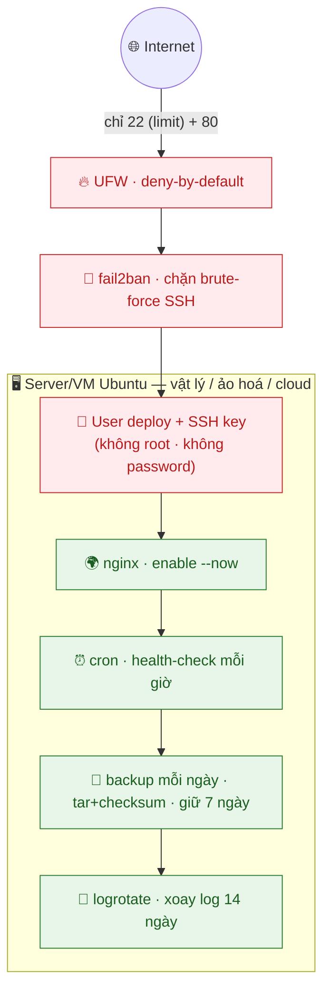

# Giai đoạn 1 — Nền tảng Hệ thống & Linux (SysOps Foundation)

> **Ngày 1–12** · Làm chủ Linux, dòng lệnh, mạng, bảo mật cơ bản — nền móng của mọi SysOps/DevOps.
>
> **Cách dùng tài liệu:** Mỗi ngày dành 60–90 phút. **Gõ tay tất cả lệnh** (không copy-paste) để cơ tay nhớ. Mỗi ngày có 4 phần:
> - 📘 **Lý thuyết** — nắm khái niệm
> - 🧪 **Lab cơ bản** — làm tay theo từng bước để hiểu
> - 🚀 **Lab nâng cao (best-practice)** — làm sát production, đúng chuẩn vận hành thật
> - 📝 **Bài ôn tập + Demo đối chiếu** — tự kiểm tra
>
> Chưa hiểu ngày nào thì học lại trước khi đi tiếp — DevOps là kiến thức tích lũy.

---

## Mục lục

| Ngày | Chủ đề |
|------|--------|
| [1](#ngày-1--devops--sysops-là-gì-tổng-quan-toàn-ngành) | DevOps & SysOps là gì? Tổng quan toàn ngành |
| [2](#ngày-2--linux-cơ-bản--điều-hướng--quản-lý-file) | Linux cơ bản — Điều hướng & Quản lý file |
| [3](#ngày-3--linux--quản-lý-tiến-trình--phần-mềm) | Linux — Quản lý tiến trình & phần mềm |
| [4](#ngày-4--linux--người-dùng-nhóm--phân-quyền) | Linux — Người dùng, nhóm & phân quyền |
| [5](#ngày-5--bash-scripting--cơ-bản) | Bash Scripting — Cơ bản |
| [6](#ngày-6--bash-scripting--nâng-cao--tự-động-hóa) | Bash Scripting — Nâng cao & tự động hóa |
| [7](#ngày-7--mạng-máy-tính-cho-devops--cơ-bản) | Mạng máy tính cho DevOps — Cơ bản |
| [8](#ngày-8--ssh--kết-nối--quản-lý-server-từ-xa) | SSH — Kết nối & quản lý server từ xa |
| [9](#ngày-9--tường-lửa-bảo-mật--hardening) | Tường lửa, bảo mật & hardening |
| [10](#ngày-10--quản-lý-log--giám-sát-hệ-thống) | Quản lý log & giám sát hệ thống |
| [11](#ngày-11--lưu-trữ-backup--khôi-phục) | Lưu trữ, backup & khôi phục |
| [12](#ngày-12--milestone--lab-tổng-hợp-giai-đoạn-1) | **Milestone — LAB tổng hợp Giai đoạn 1** |

---

## Ngày 1 — DevOps & SysOps là gì? Tổng quan toàn ngành

> ⏱️ ~90 phút · Loại: Khái niệm
>
> 🧭 **Bạn đang ở đâu:** **Ngày 1 (bức tranh toàn ngành + dựng môi trường)** → Ngày 2 (Linux cơ bản). Hôm nay chưa cần code nhiều — mục tiêu là *hiểu mình sắp học gì và vì sao*, đồng thời chuẩn bị "đồ nghề" (Git, GitHub, SSH) dùng suốt 60 ngày.
>
> ✅ **Chuẩn bị trước khi làm:** một máy tính có Internet + có thể cài phần mềm. Chưa cần Linux ngay hôm nay (từ Ngày 2 mới cần), nhưng nếu có sẵn máy/VM Linux thì càng tốt.

### 📘 Lý thuyết

#### 1. SysOps và DevOps — hai vai, một dòng chảy

| | **SysOps** (System Operations) | **DevOps** (Development + Operations) |
|---|---|---|
| Làm gì | Vận hành, duy trì, giám sát máy chủ để hệ thống chạy ổn định 24/7 | SysOps + **tự động hóa mọi thứ bằng code** (CI/CD, IaC) |
| Cách làm | Nhiều thao tác tay / bán tự động (SSH vào từng máy, gõ lệnh) | Viết code để máy tự làm (1 file tạo 10 server) |
| Ví dụ | Cài nginx, xem log, khởi động lại dịch vụ khi lỗi | Push code → pipeline tự build, test, deploy |

> DevOps **không thay thế** SysOps — nó *đứng trên nền* SysOps. Bạn phải vững vận hành thủ công (Giai đoạn 1) trước khi tự động hoá nó (Giai đoạn 2–4).

#### 2. Vấn đề DevOps sinh ra để giải quyết

Kịch bản kinh điển: lập trình viên (**Dev**) viết code chạy ngon trên máy mình, "ném" cho bộ phận vận hành (**Ops**) đem lên server → **lỗi**. Hai bên đổ lỗi nhau: *"Works on my machine!"* (máy tôi chạy mà!). Nguyên nhân sâu xa: Dev muốn **release nhanh**, Ops muốn **ổn định** → mâu thuẫn lợi ích. DevOps xoá bức tường này bằng: **cùng một quy trình tự động + cùng chịu trách nhiệm** từ lúc viết code đến lúc chạy thật.

#### 3. Vòng đời DevOps — 8 bước lặp vô tận (∞)

```
      ┌────────────────────────────────────────────┐
      ▼                                            │
   Plan → Code → Build → Test → Release → Deploy → Operate → Monitor
   (lên   (viết) (đóng   (kiểm  (phát    (đưa lên  (vận    (giám sát)
    KH)          gói)    thử)   hành)    server)   hành)        │
      ▲                                                        │
      └────────────────  Monitor học được → Plan lại  ─────────┘
```

Mỗi vòng lặp là một lần cải tiến. **CI/CD chính là "cái máy" tự động chạy dây chuyền này** thay cho làm tay.

#### 4. CI/CD nói cho thật đơn giản

| | Viết tắt | Nghĩa | Bạn làm gì | Máy làm gì |
|---|---|---|---|---|
| **CI** | Continuous Integration | Tích hợp liên tục | `git push` | Tự **build + test + lint** code ngay, báo lỗi sớm |
| **CD** | Continuous Delivery/Deployment | Chuyển giao/Triển khai liên tục | (không làm gì thêm) | Tự **đưa bản đã test lên server** |

→ Bạn chỉ `git push`, phần còn lại máy lo. Đó là đích đến của cả khoá học này.

#### 5. Bộ công cụ & lộ trình nghề

- **Bộ công cụ phổ biến (sẽ học dần):** Git, Docker, Kubernetes, Terraform, Ansible, GitHub Actions/Jenkins, Prometheus, Grafana.
- **Lộ trình nghề:** Linux Admin → **SysOps** → **DevOps Engineer** → **SRE** (Site Reliability Engineer) / Cloud Architect / Platform Engineer. Khoá 60 ngày này đưa bạn đi hết chặng SysOps → DevOps → chạm ngõ SRE.

### 📖 Hiểu rõ hơn (giải thích cho người mới)

**DevOps thực ra là gì? (bằng một câu chuyện)**
Ngày xưa, lập trình viên (Dev) viết code xong "ném" cho bộ phận vận hành (Ops) đem lên server. Code chạy được trên máy Dev nhưng lên server thì lỗi → hai bên đổ lỗi nhau (*"works on my machine!"*). **DevOps** sinh ra để xóa bức tường đó: cùng một quy trình, tự động hóa, ai cũng chịu trách nhiệm từ lúc viết code đến lúc chạy thật.

**SysOps vs DevOps — khác gì?**
- **SysOps** = người trông server: cài đặt, theo dõi, sửa khi hỏng (nhiều thao tác tay).
- **DevOps** = SysOps + **tự động hóa mọi thứ bằng code** (CI/CD, Infrastructure as Code). Thay vì click chuột tạo 10 server, bạn viết 1 file code để máy tự tạo.
> Bạn sẽ đi: SysOps (nền tảng — Giai đoạn 1) → DevOps (tự động hóa — Giai đoạn 2–3) → SRE (độ tin cậy — Giai đoạn 4).

**Vòng đời DevOps (8 bước) — như dây chuyền nhà máy chạy vòng ∞:**
`Plan` (lên kế hoạch) → `Code` (viết) → `Build` (đóng gói) → `Test` (kiểm thử) → `Release` (phát hành) → `Deploy` (đưa lên server) → `Operate` (vận hành) → `Monitor` (giám sát) → quay lại Plan. **CI/CD** chính là cái máy tự động chạy dây chuyền này.

**CI/CD nói thật đơn giản:**
- **CI** = mỗi lần bạn sửa code, máy tự *kiểm tra + đóng gói* ngay (bắt lỗi sớm).
- **CD** = sau khi kiểm tra xong, máy tự *đưa lên server*. Bạn chỉ `git push`, phần còn lại máy lo.

> 🧠 **Một câu để nhớ:** DevOps không phải một công cụ, mà là **văn hóa "tự động hóa mọi việc lặp lại"**. Mọi công cụ bạn học (Git, Docker, K8s...) chỉ là phương tiện cho triết lý đó.

### 🧪 Lab cơ bản

> Mục tiêu: cài Git, tạo GitHub, và nắm vòng đời DevOps. Không cần Linux hôm nay.

**Bước 1 — Tạo tài khoản GitHub** miễn phí tại [github.com](https://github.com) (nhớ username — đây là "địa chỉ" portfolio của bạn).

**Bước 2 — Cài Git và kiểm tra.**
```bash
# Linux (Ubuntu/Debian): sudo apt update && sudo apt install -y git
# Linux (Fedora/RHEL):   sudo dnf install -y git
# (Windows: tải tại git-scm.com/downloads)
git --version
```
Bạn sẽ thấy: `git version 2.x.x`.

**Bước 3 — Vẽ vòng đời DevOps 8 bước** ra giấy, ghi cạnh mỗi bước "bước này làm gì" (xem lại mục Lý thuyết #3).

**Bước 4 — Đọc 1 bài về văn hoá DevOps** (Google: *"Netflix DevOps culture"* hoặc *"Spotify engineering culture"*) — hiểu DevOps là *văn hoá*, không chỉ công cụ.

**Bước 5 — Tạo file kế hoạch học 60 ngày** (Notion / Obsidian / file `.md`) dạng checklist để tự theo dõi tiến độ.

### 🚀 Lab nâng cao (best-practice)

> Mục tiêu: thiết lập "tư thế" làm việc đúng chuẩn ngay từ ngày 0.

1. **Cấu hình Git định danh + ký commit:**
   ```bash
   git config --global user.name "Tên Bạn"
   git config --global user.email "ban@example.com"
   git config --global init.defaultBranch main
   git config --global pull.rebase true        # lịch sử commit gọn, tránh merge commit rác
   ```
2. **Tạo SSH key cho GitHub ngay** (sẽ dùng cả khóa học) — `ed25519` an toàn hơn RSA:
   ```bash
   ssh-keygen -t ed25519 -C "ban@example.com"
   ```
   Thêm `~/.ssh/id_ed25519.pub` vào GitHub → Settings → SSH keys, rồi test: `ssh -T git@github.com`.
3. **Tạo repo theo dõi tiến độ** `devops-60-days` trên GitHub, clone về, tạo `README.md` dạng bảng checklist 60 ngày → commit đầu tiên. Đây là **portfolio** của bạn trong 60 ngày tới.
4. **Liên hệ thực tế:** với bất kỳ hệ thống nào bạn đang/sẽ vận hành (server vật lý, VM, hay cloud), hãy liệt kê ra giấy: phần nào đang làm **thủ công** (tạo máy, cấu hình, deploy, backup)? Đó chính là các "toil" mà DevOps sẽ tự động hóa dần.

### 🧭 Hướng dẫn làm lab & giải nghĩa lệnh (cho người tự học)

> Làm **tuần tự từng bước**. Sau mỗi bước, đối chiếu với "Bạn sẽ thấy" và dừng ở dòng ✅ **Checkpoint** trước khi đi tiếp. Phần này hoàn tất "đồ nghề" Git/GitHub/SSH dùng suốt khoá.

**Bước 1 — Xác nhận Git đã cài.**
```bash
git --version
```
Bạn sẽ thấy: `git version 2.43.0` (số có thể khác).
✅ **Checkpoint:** có dòng `git version 2.x.x`.
⚠️ Nếu báo `command not found` → chưa cài: `sudo apt install -y git` (Ubuntu/Debian) hoặc `sudo dnf install -y git` (Fedora/RHEL).

**Bước 2 — Khai báo định danh** (gắn tên + email vào MỌI commit).
```bash
git config --global user.name "Tên Bạn"
git config --global user.email "ban@example.com"
git config --global init.defaultBranch main
git config --global pull.rebase true
git config --global --list
```
Bạn sẽ thấy các dòng vừa đặt được in ra.
✅ **Checkpoint:** `--list` in đúng `user.name` và `user.email` của bạn.
💡 *Vì sao `--global`:* áp dụng cho mọi repo trên máy (lưu ở `~/.gitconfig`), khỏi khai lại từng dự án. `pull.rebase true` giúp lịch sử thẳng, không rác "Merge branch...".

**Bước 3 — Tạo cặp khoá SSH** (dùng để `git push` không cần gõ mật khẩu, và cho cả Ngày 8).
```bash
ssh-keygen -t ed25519 -C "ban@example.com"
# Nhấn Enter 3 lần để dùng đường dẫn mặc định + không đặt passphrase (lab)
ls ~/.ssh/
```
Bạn sẽ thấy 2 file: `id_ed25519` (private — **GIỮ KÍN**) và `id_ed25519.pub` (public — đem chia sẻ).
✅ **Checkpoint:** có đủ 2 file trong `~/.ssh/`.
💡 *Vì sao ed25519:* ngắn, nhanh, an toàn tương đương RSA loại dài.

**Bước 4 — Gắn public key lên GitHub.**
```bash
cat ~/.ssh/id_ed25519.pub    # copy TOÀN BỘ dòng bắt đầu bằng "ssh-ed25519 ..."
```
Vào GitHub → **Settings → SSH and GPG keys → New SSH key** → dán nội dung vừa copy → Save.
✅ **Checkpoint:** khoá xuất hiện trong danh sách SSH keys trên GitHub.
⚠️ **Chỉ dán file `.pub`** (public). Tuyệt đối không dán `id_ed25519` (private).

**Bước 5 — Test kết nối.**
```bash
ssh -T git@github.com
# Lần đầu hỏi "Are you sure...?" → gõ: yes
```
Bạn sẽ thấy: `Hi <username>! You've successfully authenticated, but GitHub does not provide shell access.`
✅ **Checkpoint:** có dòng `Hi <username>! You've successfully authenticated`.

### 🐛 Gỡ lỗi nhanh

> Khi lệnh Git/SSH không chạy, đây là các lỗi hay gặp nhất ở ngày đầu và cách xử lý.

| Triệu chứng | Nguyên nhân | Cách sửa |
|---|---|---|
| `git: command not found` | Git chưa được cài | `sudo apt install -y git` / `sudo dnf install -y git` |
| `ssh -T` báo `Permission denied (publickey)` | Chưa gắn public key lên GitHub, hoặc gắn nhầm file | Copy lại `id_ed25519.pub` (đúng file `.pub`) và thêm vào GitHub |
| `Could not open a connection to your authentication agent` | ssh-agent chưa chạy | `eval "$(ssh-agent -s)"` rồi `ssh-add ~/.ssh/id_ed25519` |
| `git push` vẫn hỏi username/password | Repo dùng URL `https://` thay vì SSH | Đổi remote sang SSH: `git remote set-url origin git@github.com:user/repo.git` |
| Commit hiện sai tên/email | Chưa `git config` hoặc gõ sai | Chạy lại Bước 2, kiểm tra bằng `git config --global --list` |

### 📝 Bài ôn tập & Demo đối chiếu

**✍️ Tự kiểm tra (nghĩ câu trả lời rồi mới bấm xem đáp án):**

<details>
<summary>1. Khác biệt cốt lõi giữa SysOps và DevOps là gì?</summary>

> **Mức độ tự động hoá.** SysOps thiên về thao tác tay/bán tự động; DevOps tự động hoá mọi thứ bằng code (CI/CD, IaC). DevOps đứng trên nền SysOps.
</details>

<details>
<summary>2. Liệt kê 8 bước vòng đời DevOps theo thứ tự (không nhìn tài liệu).</summary>

> Plan → Code → Build → Test → Release → Deploy → Operate → Monitor → (lặp lại Plan).
</details>

<details>
<summary>3. CI và CD khác nhau ở điểm nào?</summary>

> **CI** = mỗi lần push, máy tự build + test + lint (bắt lỗi sớm). **CD** = sau khi test đạt, máy tự đưa lên server. CI lo "code có ổn không", CD lo "đưa lên đâu".
</details>

<details>
<summary>4. Vì sao chỉ được dán file `.pub` lên GitHub, không dán file kia?</summary>

> `.pub` là public key (chia sẻ được). File `id_ed25519` là private key — bí mật, lộ ra là ai cũng giả danh được bạn, phải tạo lại khoá.
</details>

**🔬 Demo đối chiếu:**

| Demo đối chiếu | Kết quả mong đợi |
|---|---|
| `git --version` | `git version 2.x.x` |
| Truy cập `github.com/<username>` | Trang profile mở được |
| `ssh -T git@github.com` | `Hi <user>! You've successfully authenticated...` |

### 📚 Thuật ngữ Anh–Việt (ngày này)

| Thuật ngữ | Nghĩa |
|---|---|
| **DevOps** | Văn hoá + thực hành tự động hoá toàn bộ vòng đời phần mềm |
| **CI/CD** | Tích hợp liên tục / Chuyển giao–Triển khai liên tục (tự build-test-deploy) |
| **Pipeline** | Dây chuyền tự động chạy các bước build/test/deploy |
| **Repository (repo)** | Kho chứa mã nguồn (kèm lịch sử thay đổi) |
| **SSH key** | Cặp khoá (private + public) để xác thực an toàn không cần mật khẩu |
| **Automation** | Tự động hoá — để máy làm việc lặp lại thay người |
| **Works on my machine** | Câu nói kinh điển khi code chạy ở máy Dev nhưng lỗi trên server |

✅ **Kết quả đạt được:** Hiểu bức tranh tổng thể SysOps/DevOps & vòng đời 8 bước, cài Git thành công, có GitHub + SSH key kết nối được, và có kế hoạch học 60 ngày.

---

## Ngày 2 — Linux cơ bản: Điều hướng & Quản lý file

> ⏱️ ~90 phút (30 cài đặt + 60 luyện tập) · Loại: Linux
>
> 🧭 **Bạn đang ở đâu:** Ngày 1 (tổng quan) → **Ngày 2 (gõ lệnh Linux đầu tiên: đi lại & quản lý file)** → Ngày 3 (tiến trình & phần mềm). Đây là nền của MỌI ngày sau — mọi thứ trong DevOps đều quy về "thao tác với file trên Linux".
>
> ✅ **Chuẩn bị trước khi làm:** một môi trường Linux. Ưu tiên máy/VM Ubuntu hoặc Fedora thật; nếu đang trên Windows có thể dùng WSL2 (`wsl --install` trong PowerShell) như phương án tạm.

### 📘 Lý thuyết

#### 1. Linux là gì và vì sao bắt buộc học

Linux là hệ điều hành **mã nguồn mở**, chạy ~90% server toàn cầu và là nền tảng của toàn bộ cloud + container. Khác Windows ở chỗ điều khiển chính bằng **gõ lệnh** (command line) thay vì bấm chuột — nghe khó hơn, nhưng chính vì ra lệnh bằng chữ nên ta **viết sẵn lệnh thành script cho máy tự chạy** = gốc rễ của tự động hoá.

#### 2. Cây thư mục Linux (FHS) — một cây duy nhất, gốc là `/`

Windows chia ổ rời `C:`, `D:`. Linux gom **tất cả vào MỘT cây**, gốc là `/` ("root"). Các nhánh quan trọng:

| Đường dẫn | Vai trò | Ví như trên Windows |
|---|---|---|
| `/` | root — gốc toàn hệ thống | (không có khái niệm tương đương) |
| `/home` | file của user | `C:\Users` |
| `/etc` | file cấu hình hệ thống (dạng text) | Registry / Settings |
| `/var` | log + dữ liệu biến đổi (database, cache) | — |
| `/tmp` | file tạm (xoá khi reboot) | `%TEMP%` |
| `/usr` | chương trình, thư viện | `C:\Program Files` |
| `/opt` | phần mềm bên thứ ba | — |

> 🔑 SysOps điều tra sự cố hay vào `/var/log` (log) và `/etc` (cấu hình) đầu tiên.

#### 3. Nhóm lệnh #1 — Đi lại (di chuyển giữa thư mục)

| Lệnh | Làm gì | Ví dụ |
|---|---|---|
| `pwd` | In thư mục đang đứng (*print working directory*) | → `/home/ban` |
| `ls` / `ls -la` | Liệt kê / liệt kê chi tiết + file ẩn | `ls -la /etc` |
| `cd <thư_mục>` | Chuyển vào thư mục | `cd /var/log` |
| `cd ..` / `cd ~` / `cd -` | Lên 1 cấp / về home / về chỗ trước đó | |

#### 4. Nhóm lệnh #2 — Tạo / xoá

- `mkdir <tên>` tạo thư mục; `mkdir -p a/b/c` tạo cả cây lồng nhau (không lỗi nếu đã có).
- `touch <file>` tạo file rỗng (hoặc cập nhật thời gian sửa).
- `rmdir` xoá thư mục rỗng; `rm <file>` xoá file; `rm -rf <thư_mục>` xoá đệ quy — ⚠️ **Linux không có Thùng rác, xoá là mất vĩnh viễn**.

#### 5. Nhóm lệnh #3 — Sao chép / di chuyển / xem nội dung

- `cp nguồn đích` (giữ gốc), `cp -r` cho cả thư mục; `mv` di chuyển **hoặc** đổi tên (mất gốc).
- `cat` in cả file; `less` xem từng trang (`q` để thoát); `head -n 10` / `tail -n 10` xem đầu/cuối; `tail -f` theo dõi log **real-time** (rất hay dùng khi debug).

#### 6. Đường dẫn tuyệt đối vs tương đối

- **Tuyệt đối** `/home/ban/file` = địa chỉ đầy đủ, đi từ đâu cũng tới.
- **Tương đối** `./file`, `../file` = tính từ chỗ đang đứng. `.` = thư mục hiện tại, `..` = lùi 1 cấp.

### 📖 Hiểu rõ hơn (giải thích cho người mới)

**Linux là gì, và vì sao DevOps bắt buộc học?**
Linux là hệ điều hành giống Windows nhưng **điều khiển bằng cách gõ lệnh** thay vì bấm chuột. Nghe khó hơn, nhưng chính vì ra lệnh bằng chữ nên ta **viết sẵn lệnh thành script cho máy tự làm** — gốc rễ của tự động hóa. ~90% server, toàn bộ cloud và container đều chạy Linux → đây là kỹ năng nền không thể bỏ.

**Cây thư mục — như một cái cây úp ngược (khác hẳn Windows).**
Windows chia ổ rời `C:`, `D:`. Linux gom **tất cả vào MỘT cây**, gốc là `/` ("root"). Các nhánh chính:
- `/home` = đồ của bạn (≈ thư mục Users/Documents).
- `/etc` = file cấu hình hệ thống (≈ "Settings", nhưng là file text).
- `/var` = log + dữ liệu thay đổi liên tục (database, cache).
- `/tmp` = file tạm (xóa khi khởi động lại).

**Các nhóm lệnh — bức tranh lớn:**
- *Đi lại*: `pwd` (đang ở đâu), `ls` (nhìn quanh), `cd` (di chuyển) — như đi bộ giữa các thư mục.
- *Tạo/xóa*: `mkdir`, `touch`, `rm` — như tạo/xóa trong Explorer.
- *Sao chép/di chuyển*: `cp` (giữ gốc), `mv` (chuyển/đổi tên) — như Ctrl+C / Ctrl+X.
- *Xem nội dung*: `cat` (in cả file), `less` (xem từng trang), `tail -f` (xem log chạy real-time).

**Đường dẫn tuyệt đối vs tương đối — như chỉ đường.**
- *Tuyệt đối* (`/home/ban/file`) = **địa chỉ nhà đầy đủ**, đi từ đâu cũng tới.
- *Tương đối* (`./file`, `../file`) = **"rẽ trái 2 nhà"**, chỉ đúng khi đang đứng đúng chỗ. `.` = thư mục hiện tại, `..` = lùi ra 1 cấp.

> 🧠 **Một câu để nhớ:** *"Trong Linux, gần như mọi thứ đều là file"* — kể cả thiết bị, cấu hình, tiến trình. Hiểu điều này thì về sau mọi thứ đều quy về "thao tác với file".

### 🧪 Lab cơ bản

> Mục tiêu: đi lại thành thạo + tạo/sửa/sao chép file. Gõ tay từng lệnh, đừng copy cả cụm.

**Bước 1 — Vào môi trường Linux** (VM Ubuntu/Fedora, hoặc WSL2: `wsl --install` trong PowerShell).

**Bước 2 — Luyện điều hướng và quan sát mình đang ở đâu.**
```bash
pwd            # đang ở đâu?
ls             # có gì quanh đây?
cd /home; ls -la
cd ~; pwd      # về home
```
Bạn sẽ thấy `pwd` cuối in ra `/home/<user>`.

**Bước 3 — Tạo cây thư mục lab bằng 1 lệnh.**
```bash
mkdir -p ~/devops-lab/{scripts,configs,logs,backups}
ls ~/devops-lab
```
Bạn sẽ thấy: `backups  configs  logs  scripts`.

**Bước 4 — Tạo & sửa file bằng nano.**
```bash
nano ~/devops-lab/ngay2.txt
```
Viết vài dòng → lưu `Ctrl+O` `Enter` → thoát `Ctrl+X`. Kiểm tra: `cat ~/devops-lab/ngay2.txt` in đúng nội dung vừa gõ.

**Bước 5 — Thực hành `cp` và `mv`.**
```bash
cp ~/devops-lab/ngay2.txt ~/devops-lab/backups/
mv ~/devops-lab/ngay2.txt ~/devops-lab/configs/ngay2-doi-ten.txt
ls -R ~/devops-lab      # -R = liệt kê đệ quy, xem toàn cây
```

### 🚀 Lab nâng cao (best-practice)

> Mục tiêu: thao tác file an toàn, hiểu rủi ro `rm -rf` ở mức "đã từng xóa nhầm production".

1. **Bật "phanh an toàn" cho rm** — tập thói quen xác nhận:
   ```bash
   alias rm='rm -i'        # thêm vào ~/.bashrc; hỏi trước khi xóa
   alias cp='cp -i'
   alias mv='mv -i'
   ```
   > ⚠️ Quy tắc vàng: **không bao giờ** chạy `rm -rf` với biến chưa kiểm tra. `rm -rf "$DIR/"` mà `$DIR` rỗng = `rm -rf /`. Luôn `echo` đường dẫn ra trước khi xóa.
2. **So sánh `cp` vs `rsync`** khi sao chép thư mục lớn — rsync chỉ copy phần thay đổi, có progress, an toàn hơn:
   ```bash
   rsync -avh --progress ~/devops-lab/ ~/devops-lab-copy/
   ```
3. **Dùng `tree` để hình dung cấu trúc** (chuẩn khi viết tài liệu):
   ```bash
   sudo apt install -y tree && tree ~/devops-lab
   ```
4. **Liên hệ thực tế:** trên server thật, dữ liệu nằm ở `/var` (database, log) và cấu hình ở `/etc`. Hãy `ls -la /etc | head` và `du -sh /var/*` để cảm nhận một server thật chứa gì.

### 💡 Bổ sung thực tế: `find`, glob & symlink

> `find` là **lệnh bạn sẽ gõ nhiều nhất** khi điều tra ("file log nào vừa đổi?", "ai bỏ file 5GB ở đâu?").

```bash
# Tìm theo tên / phần mở rộng
find /var/log -name "*.log" -type f

# Tìm file lớn hơn 100MB (truy vết đầy đĩa)
find / -type f -size +100M 2>/dev/null

# Tìm file sửa trong 24h qua (điều tra "vừa có gì thay đổi?")
find /etc -mtime -1

# Tìm RỒI hành động (cực mạnh — xóa, đổi quyền hàng loạt)
find . -name "*.tmp" -delete
find . -name "*.sh" -exec chmod +x {} \;
```

- **Globbing (ký tự đại diện của shell):** `*` (mọi ký tự), `?` (1 ký tự), `[abc]`, `{jpg,png}`. Ví dụ `ls *.log`, `rm file{1,2,3}.txt`.
- **Symlink (liên kết mềm):** `ln -s /đường/dẫn/thật link` — dùng nhiều cho cấu hình (`/etc/nginx/sites-enabled` thực ra là symlink tới `sites-available`).
- **Xem chi tiết file:** `stat file` (thời gian, inode, quyền), `file ảnh.bin` (đoán loại file), `type ls` / `which python3` (lệnh này ở đâu, là alias hay binary).

### 🧭 Hướng dẫn làm lab & giải nghĩa lệnh (cho người tự học)

> Làm tuần tự, dừng ở mỗi ✅ **Checkpoint**. Mục tiêu: *biết mình đang ở đâu* và *thấy kết quả* trước khi làm bước sau — thói quen sống còn khi sau này thao tác trên server thật.

**Bước 1 — Luôn biết mình đang đứng đâu.**
```bash
pwd
```
Bạn sẽ thấy: `/home/<user>`.
✅ **Checkpoint:** ra đúng đường dẫn home của bạn.
💡 *Vì sao quan trọng:* trước khi chạy lệnh xoá/sửa, luôn `pwd` để chắc mình không đứng nhầm chỗ.

**Bước 2 — Nhìn kỹ bằng `ls -la`.**
```bash
ls -la ~
```
Bạn sẽ thấy mỗi dòng dạng `drwxr-xr-x ... .bashrc`.
✅ **Checkpoint:** thấy được các file ẩn bắt đầu bằng `.` (như `.bashrc`, `.ssh`).
💡 `-a` = hiện file ẩn, `-l` = chi tiết (quyền/chủ/kích thước/ngày). SysOps cần cả hai.

**Bước 3 — Tạo cây thư mục 1 lệnh.**
```bash
mkdir -p ~/devops-lab/{scripts,configs,logs,backups}
ls ~/devops-lab
```
✅ **Checkpoint:** in ra `backups configs logs scripts`.
💡 `{a,b,c}` là *brace expansion* — **shell** bung nó thành 4 tên *trước khi* `mkdir` chạy. Hiểu "ai xử lý cái gì" giúp debug khi lệnh không như ý.

**Bước 4 — Phân biệt `cp` và `mv` bằng trải nghiệm.**
```bash
touch ~/devops-lab/a.txt
cp ~/devops-lab/a.txt ~/devops-lab/backups/    # a.txt VẪN còn ở chỗ cũ
mv ~/devops-lab/a.txt ~/devops-lab/logs/       # a.txt BIẾN MẤT khỏi chỗ cũ
ls ~/devops-lab ~/devops-lab/backups ~/devops-lab/logs
```
✅ **Checkpoint:** `a.txt` còn trong `backups/` (do cp) và trong `logs/` (do mv), nhưng KHÔNG còn ở `~/devops-lab`.
💡 `cp` giữ gốc, `mv` mất gốc — chọn nhầm là mất file.

**Bước 5 — (Nâng cao) so sánh `cp` với `rsync`.**
```bash
rsync -avh --progress ~/devops-lab/ ~/devops-lab-copy/
```
✅ **Checkpoint:** thấy thanh tiến trình + danh sách file được copy.
💡 `-a` giữ quyền/thời gian, `-v` chi tiết, `-h` đơn vị dễ đọc. `rsync` chỉ copy phần khác biệt và tiếp tục được khi đứt mạng — chuẩn khi copy dữ liệu lớn trên server.

### 🐛 Gỡ lỗi nhanh

| Triệu chứng | Nguyên nhân | Cách sửa |
|---|---|---|
| `No such file or directory` | Gõ sai đường dẫn, hoặc đang đứng nhầm thư mục | `pwd` kiểm tra vị trí; `ls` xem tên file thật |
| `Permission denied` | Không đủ quyền với file/thư mục đó | Xem quyền `ls -l`; cần quyền cao thì thêm `sudo` (học kỹ Ngày 4) |
| `mkdir: cannot create ... File exists` | Thư mục đã tồn tại | Thêm `-p`: `mkdir -p` không báo lỗi nếu đã có |
| Lỡ tay `rm` mất file | Linux không có Thùng rác | Không khôi phục được → **luôn `ls` đường dẫn trước khi `rm`**; đặt `alias rm='rm -i'` |
| `rm -rf $DIR/` xoá nhầm cả `/` | `$DIR` rỗng → thành `rm -rf /` | Luôn `echo "$DIR"` kiểm tra trước; quote biến `"$DIR"` |

### 📝 Bài ôn tập & Demo đối chiếu

**✍️ Tự kiểm tra:**

<details>
<summary>1. Tạo thư mục `project/`, trong đó 3 file, copy 1 file sang `backups/`, đổi tên 1 file. Viết các lệnh.</summary>

> `mkdir -p ~/project` → `touch ~/project/{a,b,c}.txt` → `cp ~/project/a.txt ~/devops-lab/backups/` → `mv ~/project/b.txt ~/project/b-moi.txt`.
</details>

<details>
<summary>2. `rm` và `rm -rf` khác gì? Vì sao `rm -rf /` cực nguy hiểm?</summary>

> `rm` xoá file; `rm -rf` xoá **đệ quy** cả thư mục và mọi thứ bên trong, không hỏi. `rm -rf /` = xoá toàn bộ hệ thống từ gốc. Linux không có hoàn tác.
</details>

<details>
<summary>3. Đường dẫn tuyệt đối vs tương đối — cho ví dụ.</summary>

> Tuyệt đối bắt đầu bằng `/` (vd `/home/ban/a.txt`), đi từ đâu cũng tới. Tương đối tính từ chỗ đang đứng (vd `./a.txt`, `../a.txt`).
</details>

**🔬 Demo đối chiếu:**

| Demo đối chiếu | Kết quả mong đợi |
|---|---|
| `pwd` | `/home/<user>` |
| `ls ~/devops-lab` | `backups configs logs scripts` |
| `cat ~/devops-lab/ngay2.txt` | In đúng nội dung đã viết |

### 📚 Thuật ngữ Anh–Việt (ngày này)

| Thuật ngữ | Nghĩa |
|---|---|
| **Directory** | Thư mục |
| **Path** (absolute/relative) | Đường dẫn (tuyệt đối/tương đối) |
| **Root** (`/`) | Gốc của cây thư mục Linux |
| **FHS** | Filesystem Hierarchy Standard — chuẩn bố trí thư mục Linux |
| **Recursive** (`-r`, `-R`) | Đệ quy — áp dụng cho cả thư mục con |
| **Brace expansion** `{a,b,c}` | Shell bung thành nhiều tên trước khi chạy lệnh |
| **Hidden file** | File ẩn (tên bắt đầu bằng `.`) |

✅ **Kết quả đạt được:** Chạy được lệnh Linux cơ bản, có môi trường thực hành, hiểu cây thư mục Linux và phân biệt cp/mv, đường dẫn tuyệt đối/tương đối.

---

## Ngày 3 — Linux: Quản lý tiến trình & phần mềm

> ⏱️ ~90 phút · Loại: Linux
>
> 🧭 **Bạn đang ở đâu:** Ngày 2 (file & thư mục) → **Ngày 3 (tiến trình đang chạy + cài phần mềm + dịch vụ systemd)** → Ngày 4 (user & phân quyền). Hôm nay bạn học cách *nhìn máy đang làm gì* và *điều khiển dịch vụ* — kỹ năng dùng mỗi ngày khi vận hành server.
>
> ✅ **Chuẩn bị:** môi trường Linux như Ngày 2, có quyền `sudo` để cài phần mềm.

### 📘 Lý thuyết

#### 1. Tiến trình (process) & PID

Mỗi chương trình đang chạy là một **tiến trình (process)**, có số định danh riêng gọi là **PID** (Process ID) — như số căn cước. Trên Windows bạn mở Task Manager; trên Linux dùng lệnh:

| Lệnh | Làm gì |
|---|---|
| `ps aux` | Liệt kê **tất cả** tiến trình (kèm chủ, %CPU, %MEM, PID) |
| `top` | Xem real-time, cập nhật liên tục (`q` để thoát) |
| `htop` | Như top nhưng đẹp/dễ dùng hơn (`sudo apt install htop`) |

#### 2. Điều khiển tiến trình — `kill` là "gửi tín hiệu", không phải "giết"

| Lệnh / phím | Ý nghĩa |
|---|---|
| `kill <PID>` | Gửi tín hiệu **TERM (15)** = "dừng lịch sự, dọn dẹp rồi tắt" |
| `kill -9 <PID>` | Gửi **KILL (9)** = "tắt ngay lập tức", ép buộc — có thể mất dữ liệu. Chỉ dùng khi TERM không ăn thua |
| `Ctrl+C` | Huỷ tiến trình đang chạy ở tiền cảnh |
| `Ctrl+Z` / `bg` / `fg` | Tạm dừng / cho chạy nền / đưa về tiền cảnh |
| `jobs` | Liệt kê job nền của phiên hiện tại |

#### 3. Package manager — "App Store" của Linux

Thay vì tải file `.exe`, Linux có kho phần mềm trung tâm. Ubuntu/Debian dùng `apt`, Fedora/RHEL dùng `dnf`:

| Việc | Ubuntu/Debian (`apt`) | Fedora/RHEL (`dnf`) |
|---|---|---|
| Cập nhật **danh sách** phần mềm | `sudo apt update` | (dnf tự cập nhật) |
| Nâng cấp phần mềm đã cài | `sudo apt upgrade` | `sudo dnf upgrade` |
| Cài / gỡ | `sudo apt install <gói>` / `remove` | `sudo dnf install <gói>` / `remove` |

> ⚠️ `apt update` chỉ cập nhật *danh sách* (chưa cài gì), `apt upgrade` mới thực sự *nâng cấp*. Đừng nhầm.

#### 4. Biến môi trường

Là các "biến" hệ thống mọi chương trình đọc được: `echo $PATH` (danh sách nơi tìm lệnh), `export MYVAR='giá trị'` (đặt biến), `env` (xem tất cả), `unset MYVAR` (xoá). `$PATH` giải thích vì sao gõ `ls` là chạy được mà không cần đường dẫn đầy đủ.

#### 5. systemd — "người quản lý dịch vụ" của Linux

Dịch vụ chạy nền liên tục (nginx, database...) gọi là *service*. `systemctl` điều khiển chúng:

| Lệnh | Làm gì |
|---|---|
| `systemctl status <dv>` | Xem trạng thái (đang chạy? PID? 3 dòng log cuối) |
| `systemctl start/stop/restart <dv>` | Chạy ngay / dừng / khởi động lại |
| `systemctl enable <dv>` | **Tự bật khi máy khởi động lại** (không chạy ngay) |
| `systemctl enable --now <dv>` | Vừa chạy ngay vừa enable (chuẩn) |
| `journalctl -u <dv>` | Đọc log của dịch vụ |

> 🔑 `start` = chạy **bây giờ**; `enable` = nhớ bật **mỗi lần khởi động**. Quên `enable` là lỗi kinh điển khiến dịch vụ "biến mất" sau reboot.

#### 6. Theo dõi tài nguyên

`free -h` (RAM), `df -h` (đĩa còn trống), `du -sh <thư_mục>` (thư mục nặng bao nhiêu), `uptime` (tải hệ thống + máy chạy bao lâu). `-h` = *human-readable* (hiện MB/GB thay vì byte).

### 📖 Hiểu rõ hơn (giải thích cho người mới)

**Tiến trình (process) là gì?**
Mỗi chương trình đang chạy là 1 **tiến trình**, có số định danh riêng gọi là **PID** (như số căn cước). Trên Windows bạn mở Task Manager để xem/tắt chương trình; trên Linux bạn dùng `ps`/`top`/`htop` để xem và `kill <PID>` để tắt. Hiểu process là nền để sau này điều tra "máy chậm vì cái gì đang chạy".

**`kill` không phải lúc nào cũng là "giết" — đó là "gửi tín hiệu".**
- `kill <PID>` gửi tín hiệu **TERM** = "dừng giúp, dọn dẹp xong rồi tắt" (lịch sự).
- `kill -9 <PID>` gửi **KILL** = "tắt ngay lập tức" (ép buộc, không cho dọn dẹp → có thể mất dữ liệu). Chỉ dùng khi cách lịch sự không ăn thua.

**Package manager (apt) — như "App Store" của Linux.**
Thay vì lên web tải file `.exe` về cài như Windows, Linux có kho phần mềm trung tâm. `sudo apt install nginx` = "lên store tải + cài nginx". `apt update` = cập nhật *danh sách* phần mềm (chưa cài gì); `apt upgrade` = *nâng cấp* phần mềm đã cài. (Fedora/RHEL dùng `dnf` thay `apt`.)

**systemd — "người quản lý dịch vụ" của Linux.**
Dịch vụ chạy nền liên tục (nginx, database...) gọi là *service*. `systemctl` điều khiển chúng: `start` (chạy ngay), `stop`, `restart`, và quan trọng — `enable` (tự bật khi máy khởi động lại). Đây là cách server tự "sống lại" sau reboot.

> 🧠 **Một câu để nhớ:** `start` = chạy bây giờ; `enable` = nhớ bật mỗi lần khởi động. Quên `enable` là lỗi kinh điển khiến dịch vụ "biến mất" sau reboot.

### 🧪 Lab cơ bản

> Mục tiêu: xem/điều khiển tiến trình, cài phần mềm, và quản lý dịch vụ bằng systemd.

**Bước 1 — Cài & mở htop.**
```bash
sudo apt update && sudo apt install -y htop    # Fedora: sudo dnf install -y htop
htop                                           # xem bảng tiến trình, nhấn q để thoát
```
Bạn sẽ thấy một bảng màu liệt kê tiến trình, %CPU, %MEM.

**Bước 2 — Chạy tiến trình nền và điều khiển nó.**
```bash
sleep 300 &            # chạy "ngủ 300s" ở nền
jobs                   # thấy [1]+ Running sleep 300 &
ps aux | grep sleep    # tìm PID của nó
kill %1                # dừng job số 1 (hoặc kill <PID>)
jobs                   # job đã biến mất
```

**Bước 3 — Tạo biến môi trường.**
```bash
export MY_NAME='DevOps'
echo $MY_NAME          # in: DevOps
```

**Bước 4 — Kiểm tra tài nguyên** (ghi lại kết quả để so sánh về sau).
```bash
free -h                # RAM
df -h                  # đĩa còn trống
uptime                 # tải hệ thống + thời gian chạy
```

**Bước 5 — Cài & kiểm tra một dịch vụ thật (nginx).**
```bash
sudo apt install -y nginx           # Fedora: sudo dnf install -y nginx
systemctl status nginx              # xem trạng thái
```
Bạn sẽ thấy dòng `Active: active (running)`.

### 🚀 Lab nâng cao (best-practice)

> Mục tiêu: hiểu systemd ở mức quản trị thật, biết enable dịch vụ tự khởi động.

1. **Phân biệt `start` vs `enable`** (lỗi kinh điển của người mới):
   ```bash
   sudo systemctl start nginx     # chạy NGAY nhưng KHÔNG tự bật khi reboot
   sudo systemctl enable nginx    # tự bật khi reboot (KHÔNG chạy ngay)
   sudo systemctl enable --now nginx   # chuẩn: vừa chạy vừa enable
   ```
2. **Đọc log dịch vụ đúng cách** thay vì đoán:
   ```bash
   journalctl -u nginx --since "10 min ago" --no-pager
   systemctl status nginx          # xem PID, memory, 3 dòng log cuối
   ```
3. **Tìm tiến trình ngốn tài nguyên** — kỹ năng xử lý sự cố:
   ```bash
   ps aux --sort=-%mem | head -5   # top 5 ngốn RAM
   ps aux --sort=-%cpu | head -5   # top 5 ngốn CPU
   ```
4. **Tự động dọn dẹp & cập nhật an toàn:**
   ```bash
   sudo apt update && sudo apt list --upgradable   # XEM trước khi nâng cấp
   ```
   > Trên production: không bao giờ `apt upgrade` mù quáng. Luôn xem danh sách, đọc changelog gói quan trọng (kernel, openssh) trước.

### 💡 Bổ sung thực tế: tmux + viết systemd service riêng (BẮT BUỘC biết)

> Đây là 2 kỹ năng mà **ngày đầu đi làm** bạn đã cần, nhưng giáo trình cơ bản hay bỏ quên.

**1. `tmux` — terminal không chết khi SSH rớt.** Bạn chạy lệnh dài (apt upgrade, backup, copy 50GB) qua SSH, mạng rớt một cái → job chết giữa chừng, hỏng dữ liệu. tmux giải quyết triệt để:
```bash
sudo apt install -y tmux
tmux new -s deploy        # tạo phiên tên "deploy"
# ... chạy lệnh dài ...
# Nhấn Ctrl+b rồi d  → "detach" (thoát ra, lệnh VẪN chạy)
# Mạng rớt cũng không sao. Đăng nhập lại:
tmux attach -t deploy     # quay lại đúng phiên đó
tmux ls                   # liệt kê các phiên đang chạy
```
> Quy tắc vàng: **mọi tác vụ dài trên server đều chạy trong tmux.** (Hoặc `screen` — tương tự.)

**2. Chạy app của mình thành dịch vụ systemd** — thay vì `nohup ./app &` rồi mất dấu. Tạo `/etc/systemd/system/myapp.service`:
```ini
[Unit]
Description=My App
After=network.target

[Service]
User=appuser
WorkingDirectory=/opt/myapp
ExecStart=/usr/bin/python3 /opt/myapp/app.py
Restart=always           # app chết → tự khởi động lại
RestartSec=5

[Install]
WantedBy=multi-user.target
```
```bash
sudo systemctl daemon-reload          # nạp lại sau khi sửa unit file
sudo systemctl enable --now myapp     # bật + chạy
journalctl -u myapp -f                # xem log app (systemd tự gom log!)
```
> Lợi ích: app **tự khởi động lại khi crash**, tự lên khi reboot, log gom sẵn vào journald. Đây là cách production chạy app, không phải `&`.

**3. Tín hiệu & tiến trình nền (khi không có systemd):**
- `nohup lệnh &` rồi `disown` — chạy nền, không chết khi đóng terminal.
- `kill -l` xem danh sách tín hiệu; `SIGTERM` (15, lịch sự) → `SIGKILL` (9, ép buộc, chỉ khi bất đắc dĩ).
- `nice`/`renice` hạ ưu tiên tiến trình ngốn CPU để không làm nghẽn server.

### 🧭 Hướng dẫn làm lab & giải nghĩa lệnh (cho người tự học)

> Làm tuần tự, dừng ở mỗi ✅ **Checkpoint**.

**Bước 1 — Chạy tiến trình nền rồi dừng nó an toàn.**
```bash
sleep 300 &
ps aux | grep sleep     # tìm dòng có "sleep 300", cột thứ 2 là PID
kill %1                 # dừng job số 1 (TERM — lịch sự)
```
✅ **Checkpoint:** `jobs` không còn hiện job `sleep`.
💡 `|` (pipe) nối output lệnh này thành input lệnh kia: `ps aux | grep sleep` = "liệt kê mọi tiến trình" → "lọc dòng có chữ sleep". Đây là triết lý Unix: ghép công cụ nhỏ làm việc lớn.

**Bước 2 — Cài nginx và xem trạng thái.**
```bash
sudo apt install -y nginx
systemctl status nginx
```
Bạn sẽ thấy: `Active: active (running)`.
✅ **Checkpoint:** dòng `Active:` là `active (running)`.

**Bước 3 — Hiểu `start` vs `enable` (lỗi #1 của người mới).**
```bash
systemctl is-enabled nginx     # nginx đã enable chưa?
sudo systemctl enable --now nginx
systemctl is-enabled nginx     # giờ phải là: enabled
```
✅ **Checkpoint:** `is-enabled` trả về `enabled`.
💡 Nếu chỉ `start` mà quên `enable`, dịch vụ sẽ KHÔNG tự lên sau khi reboot server.

**Bước 4 — Đọc log dịch vụ (đừng đoán mò).**
```bash
journalctl -u nginx --since "10 min ago" --no-pager
```
✅ **Checkpoint:** thấy các dòng log của nginx (thời gian + thông điệp).
💡 Khi dịch vụ lỗi, `journalctl -u <dv>` cho biết *chính xác* vì sao — nhanh hơn đoán rất nhiều.

**Bước 5 — Tìm tiến trình ngốn tài nguyên (điều tra "máy chậm").**
```bash
ps aux --sort=-%mem | head -5    # 5 tiến trình ngốn RAM nhất
ps aux --sort=-%cpu | head -5    # 5 tiến trình ngốn CPU nhất
```
✅ **Checkpoint:** ra danh sách 5 dòng, sắp theo mức tiêu thụ giảm dần.

### 🐛 Gỡ lỗi nhanh

**🔧 Bộ 3 lệnh điều tra dịch vụ:** `systemctl status <dv>` (tổng quan + 3 log cuối) → `journalctl -u <dv>` (log đầy đủ) → `systemctl restart <dv>` (thử khởi động lại).

| Triệu chứng | Nguyên nhân | Cách sửa |
|---|---|---|
| Dịch vụ `failed` / không lên | Lỗi cấu hình, cổng bị chiếm, thiếu quyền | `journalctl -u <dv>` đọc lý do; sửa rồi `systemctl restart` |
| Dịch vụ mất sau khi reboot | Chỉ `start`, quên `enable` | `sudo systemctl enable <dv>` |
| `apt` báo `Could not get lock` | Có tiến trình apt khác đang chạy | Chờ nó xong, hoặc kiểm tra `ps aux \| grep apt` |
| `kill <PID>` không tắt được | Tiến trình treo cứng, không nhận TERM | Bất đắc dĩ mới `kill -9 <PID>` (ép buộc, có thể mất dữ liệu) |
| Máy chậm bất thường | 1 tiến trình ngốn CPU/RAM | `ps aux --sort=-%cpu \| head` tìm thủ phạm |

### 📝 Bài ôn tập & Demo đối chiếu

**✍️ Tự kiểm tra:**

<details>
<summary>1. Tìm PID của nginx và viết lệnh dừng nó an toàn (không dùng -9).</summary>

> `ps aux | grep nginx` (lấy PID ở cột 2) rồi `kill <PID>`, hoặc chuẩn hơn: `sudo systemctl stop nginx`.
</details>

<details>
<summary>2. Phân biệt `apt update` và `apt upgrade`.</summary>

> `apt update` cập nhật *danh sách* gói (chưa cài/nâng gì). `apt upgrade` mới thực sự *nâng cấp* các gói đã cài lên bản mới.
</details>

<details>
<summary>3. `kill` và `kill -9` khác gì?</summary>

> `kill` gửi TERM (15) — lịch sự, cho tiến trình dọn dẹp rồi tắt. `kill -9` gửi KILL (9) — ép tắt ngay, không cho dọn dẹp, có thể mất dữ liệu chưa lưu. Chỉ dùng -9 khi TERM không ăn thua.
</details>

<details>
<summary>4. `start` và `enable` khác nhau thế nào?</summary>

> `start` = chạy ngay bây giờ. `enable` = tự bật mỗi khi máy khởi động. Muốn cả hai: `enable --now`.
</details>

**🔬 Demo đối chiếu:**

| Demo đối chiếu | Kết quả mong đợi |
|---|---|
| `htop` | Hiện danh sách process, %CPU, %MEM |
| `ps aux \| grep nginx` → `kill <PID>` | Tiến trình dừng, không lỗi |
| `systemctl status nginx` | `active (running)` |
| `systemctl is-enabled nginx` (sau enable) | `enabled` |

### 📚 Thuật ngữ Anh–Việt (ngày này)

| Thuật ngữ | Nghĩa |
|---|---|
| **Process / PID** | Tiến trình / số định danh tiến trình |
| **Signal** (TERM/KILL) | Tín hiệu gửi cho tiến trình (dừng lịch sự / ép tắt) |
| **Package manager** | Trình quản lý gói phần mềm (`apt`, `dnf`) |
| **Service / daemon** | Dịch vụ chạy nền liên tục (nginx, database...) |
| **systemd / systemctl** | Hệ quản lý dịch vụ của Linux / lệnh điều khiển nó |
| **Environment variable** | Biến môi trường (vd `$PATH`) |
| **Foreground / Background** | Tiền cảnh / chạy nền (`&`) |

✅ **Kết quả đạt được:** Quản lý được tiến trình, cài/gỡ phần mềm, hiểu systemd (start vs enable), biến môi trường và biết điều tra tài nguyên hệ thống.

---

## Ngày 4 — Linux: Người dùng, nhóm & phân quyền

> ⏱️ ~90 phút · Loại: Linux
>
> 🧭 **Bạn đang ở đâu:** Ngày 3 (tiến trình & dịch vụ) → **Ngày 4 (ai được làm gì: user, nhóm, quyền)** → Ngày 5 (Bash scripting). Đây là nền **bảo mật** của Linux — hiểu nó là hiểu 80% vì sao server bị/không bị hack.
>
> ✅ **Chuẩn bị:** môi trường Linux có quyền `sudo`. Cẩn thận: các lệnh hôm nay đụng tới user/quyền hệ thống — nên làm trên VM/máy lab, đừng thử trên server thật.

### 📘 Lý thuyết

#### 1. User & Group — vì sao Linux chia quyền chặt

Server có nhiều người dùng + nhiều dịch vụ. Nếu ai cũng làm được mọi thứ thì 1 sai lầm (hoặc 1 hacker) phá sạch. Nên Linux tách bạch **user** (người/dịch vụ dùng máy) và **group** (nhóm gom nhiều user để cấp quyền chung). `root` là *superuser* — quyền tối cao, như Administrator của Windows nhưng mạnh hơn.

| Lệnh | Làm gì |
|---|---|
| `whoami` / `id` | Tôi là ai / uid, gid, các nhóm của tôi |
| `sudo adduser <tên>` | Tạo user mới (hỏi mật khẩu, tạo home) |
| `sudo usermod -aG <nhóm> <user>` | **Thêm** user vào nhóm (`-aG` = append) |
| `su - <user>` | Chuyển sang user khác |
| `sudo deluser <tên>` | Xoá user |

> ⚠️ Luôn có `-a` trong `usermod -aG`. Thiếu `-a` (`usermod -G`) sẽ **xoá hết nhóm cũ** của user — lỗi nguy hiểm.

#### 2. `sudo` — mượn quyền admin trong chốc lát

Đừng đăng nhập thẳng bằng `root` (1 lệnh sai = phá hệ thống, không có lớp bảo vệ). Dùng user thường, thêm `sudo` trước lệnh khi *thực sự cần* quyền cao. Cấu hình ai được sudo nằm ở `/etc/sudoers` — **chỉ sửa bằng `visudo`** (nó kiểm tra cú pháp, tránh khoá mình ra ngoài).

#### 3. Phân quyền file — đọc số quyền không cần tính

Mỗi file có quyền cho **3 nhóm**: owner (chủ) – group (nhóm) – other (người khác). Mỗi nhóm có 3 quyền, mỗi quyền một giá trị số:

| Quyền | Ký tự | Số |
|---|---|---|
| Read (đọc) | `r` | 4 |
| Write (ghi) | `w` | 2 |
| Execute (chạy) | `x` | 1 |

Cộng lại ra một chữ số (0–7):
- `7` = 4+2+1 = `rwx` · `6` = 4+2 = `rw-` · `5` = 4+1 = `r-x` · `0` = `---`

Ba chữ số = ba nhóm. Ví dụ `chmod 750` = owner `rwx`(7) / group `r-x`(5) / other `---`(0).

| Lệnh hay dùng | Kết quả | Dùng khi |
|---|---|---|
| `chmod 644 file` | `rw-r--r--` | File thường (ai cũng đọc, chỉ chủ ghi) |
| `chmod 755 file` | `rwxr-xr-x` | Script/thư mục (ai cũng chạy) |
| `chmod 600 file` | `rw-------` | File bí mật (SSH key) — chỉ chủ đọc |
| `chmod +x script.sh` | thêm quyền chạy | Cho file script chạy được |

#### 4. `chown` & đọc dòng `ls -l`

- `sudo chown user:group file` đổi chủ:nhóm; `chown -R` cho cả thư mục con.
- Dòng `ls -l`: ký tự **đầu** `d`=thư mục, `-`=file, `l`=symlink; **9 ký tự sau** chia 3 cụm rwx (owner-group-other). Hiểu cái này là hiểu 80% phân quyền Linux.

> 🔑 `chmod 777` ("ai cũng làm mọi thứ") nghe tiện nhưng là **lỗ hổng bảo mật** — đừng dùng. Luôn cấp quyền tối thiểu (*least privilege*).

### 📖 Hiểu rõ hơn (giải thích cho người mới)

**Vì sao Linux khắt khe về user & quyền?**
Server thường có nhiều người dùng và chạy nhiều dịch vụ. Nếu ai cũng làm được mọi thứ thì 1 sai lầm (hoặc 1 hacker) phá sạch. Nên Linux chia **user** (người dùng) và **quyền** (ai được đọc/ghi/chạy cái gì) rất rõ. `root` là "siêu admin" có mọi quyền — như Administrator của Windows nhưng quyền lực hơn nhiều.

**Quyền file đọc thế nào? (dễ khi nắm mẹo)**
Mỗi file có quyền cho 3 nhóm: **owner** (chủ) – **group** (nhóm) – **other** (người khác). Mỗi nhóm có 3 quyền: `r` đọc (=4), `w` ghi (=2), `x` chạy (=1). Cộng lại ra số:
- `7` = 4+2+1 = `rwx` (đọc+ghi+chạy)
- `5` = 4+0+1 = `r-x` (đọc+chạy, không ghi)
- `0` = cấm hết.
→ `chmod 750` = chủ `7` (rwx), nhóm `5` (r-x), người khác `0` (cấm).

**`sudo` — "mượn quyền admin trong chốc lát".**
Đừng đăng nhập thẳng bằng root (1 lệnh sai = phá hệ thống, không có lớp bảo vệ). Hãy dùng user thường rồi thêm `sudo` trước lệnh khi *thực sự cần* quyền cao — như "xin phép admin làm 1 việc cụ thể".

> 🧠 **Một câu để nhớ:** dùng `600` cho file chứa bí mật (SSH key) — chỉ mình chủ đọc; `chmod 777` ("ai cũng làm mọi thứ") nghe tiện nhưng là **lỗ hổng bảo mật** — đừng dùng.

### 🧪 Lab cơ bản

> Mục tiêu: tạo user, cấp quyền nhóm, và tập đọc/đổi quyền file cho thành thạo.

**Bước 1 — Tạo user mới và thêm vào nhóm sudo.**
```bash
sudo adduser devuser              # nhập mật khẩu khi được hỏi
sudo usermod -aG sudo devuser     # (Fedora: nhóm là 'wheel' thay vì 'sudo')
id devuser
```
Bạn sẽ thấy `id devuser` in ra uid/gid và danh sách groups (có `sudo`).

**Bước 2 — Tạo file và xem quyền.**
```bash
touch test.sh
ls -l test.sh          # thấy dạng -rw-r--r--
chmod +x test.sh
ls -l test.sh          # giờ có x: -rwxr-xr-x
```

**Bước 3 — Luyện đọc `chmod` số.**
```bash
chmod 644 test.sh && ls -l test.sh    # -rw-r--r--
chmod 755 test.sh && ls -l test.sh    # -rwxr-xr-x
chmod 600 test.sh && ls -l test.sh    # -rw-------
```
Mỗi lần đối chiếu số ↔ chuỗi `rwx` cho tới khi đọc được mà không cần tính.

**Bước 4 — Đổi chủ sở hữu.**
```bash
sudo chown devuser:devuser test.sh
ls -l test.sh          # cột owner giờ là devuser
```

**Bước 5 — Đăng nhập thử user mới.**
```bash
su - devuser
whoami                 # in: devuser
id
exit                   # quay về user cũ
```

### 🚀 Lab nâng cao (best-practice)

> Mục tiêu: dựng user vận hành chuẩn — không dùng root, sudo có kiểm soát.

1. **Tạo user dịch vụ không-login** cho ứng dụng (chuẩn production — app không bao giờ chạy bằng root):
   ```bash
   sudo useradd -r -s /usr/sbin/nologin appuser   # -r: system user, không shell
   ```
2. **Cấu hình sudo có giới hạn** thay vì cấp full sudo — chỉ cho phép vài lệnh:
   ```bash
   sudo visudo -f /etc/sudoers.d/deploy
   # nội dung: deploy ALL=(ALL) NOPASSWD: /bin/systemctl restart myapp
   ```
   > Nguyên tắc **least privilege**: cấp đúng cái cần, không hơn.
3. **Hiểu quyền đặc biệt:**
   - `chmod 600 ~/.ssh/id_ed25519` — private key **bắt buộc** 600, nếu không SSH từ chối.
   - `umask 027` — file mới tạo mặc định kín hơn (group chỉ đọc, other không gì).
4. **Audit quyền nguy hiểm** — tìm file có SUID (hay bị khai thác leo thang quyền):
   ```bash
   find / -perm -4000 -type f 2>/dev/null
   ```

### 🧭 Hướng dẫn làm lab & giải nghĩa lệnh (cho người tự học)

> Làm tuần tự, dừng ở mỗi ✅ **Checkpoint**.

**Bước 1 — Tạo user và xác nhận nhóm.**
```bash
sudo adduser devuser
sudo usermod -aG sudo devuser
id devuser
```
✅ **Checkpoint:** `id devuser` in ra có `sudo` trong danh sách groups.
💡 `-aG` = **a**ppend vào **G**roup (thêm, không ghi đè). Thiếu `-a` là xoá hết nhóm cũ.

**Bước 2 — Đọc quyền thành thạo bằng cách đổi qua lại.**
```bash
touch f && chmod 644 f && ls -l f     # -rw-r--r--
chmod 750 f && ls -l f                # -rwxr-x---
chmod 600 f && ls -l f                # -rw-------
```
✅ **Checkpoint:** bạn đọc được `rwxr-x---` ↔ `750` mà không cần tính.
💡 3 chữ số = owner/group/other; mỗi số = tổng r(4)+w(2)+x(1).

**Bước 3 — Đổi chủ sở hữu.**
```bash
sudo chown devuser:devuser f
ls -l f
```
✅ **Checkpoint:** cột owner đổi thành `devuser`.

**Bước 4 — (Nâng cao) tìm file SUID — nơi hacker hay nhắm để leo quyền.**
```bash
find / -perm -4000 -type f 2>/dev/null
```
✅ **Checkpoint:** ra danh sách vài file (như `/usr/bin/sudo`, `/usr/bin/passwd`).
💡 File SUID chạy với quyền của **chủ file** (thường root) chứ không phải người chạy — tiện nhưng là điểm rủi ro cần audit.

### 🐛 Gỡ lỗi nhanh

| Triệu chứng | Nguyên nhân | Cách sửa |
|---|---|---|
| SSH báo `UNPROTECTED PRIVATE KEY FILE` | Quyền key quá mở | `chmod 600 ~/.ssh/id_ed25519` |
| `Permission denied` khi chạy `./script.sh` | Thiếu quyền `x` | `chmod +x script.sh` |
| User mới không dùng được `sudo` | Chưa thêm vào nhóm sudo/wheel, hoặc chưa đăng nhập lại | `usermod -aG sudo <user>`; đăng xuất/vào lại để áp nhóm |
| Lỡ `usermod -G` (thiếu -a) làm mất nhóm | Ghi đè hết nhóm cũ | Thêm lại từng nhóm: `usermod -aG sudo,docker <user>` |
| Sửa `/etc/sudoers` xong bị khoá sudo | Sai cú pháp | Luôn dùng `visudo` (nó chặn lưu file sai cú pháp) |

### 📝 Bài ôn tập & Demo đối chiếu

**✍️ Tự kiểm tra:**

<details>
<summary>1. Giải mã quyền `rwxr-x---` sang số.</summary>

> `750` (owner rwx=7, group r-x=5, other ---=0).
</details>

<details>
<summary>2. Khi nào dùng `600` cho file?</summary>

> Cho file chứa bí mật như SSH private key — chỉ chủ đọc/ghi, không ai khác đụng được. SSH còn *bắt buộc* key phải 600.
</details>

<details>
<summary>3. Vì sao không nên làm việc thường xuyên dưới quyền root?</summary>

> Root không có lớp bảo vệ: 1 lệnh sai (vd `rm -rf`) phá cả hệ thống. Dùng user thường + `sudo` khi cần để giảm rủi ro.
</details>

**🔬 Demo đối chiếu:**

| Demo đối chiếu | Kết quả mong đợi |
|---|---|
| `id devuser` | Hiện uid, gid, groups (có sudo) |
| `ls -l` sau `chmod 755` | `-rwxr-xr-x` |
| `ls -l` sau `chown` | owner = devuser |

### 📚 Thuật ngữ Anh–Việt (ngày này)

| Thuật ngữ | Nghĩa |
|---|---|
| **User / Group** | Người dùng / nhóm người dùng |
| **root / superuser** | Tài khoản quyền tối cao |
| **Permission** (rwx) | Quyền đọc/ghi/chạy |
| **Owner / Group / Other** | Chủ / nhóm / người khác (3 nhóm quyền) |
| **sudo** | Chạy 1 lệnh với quyền cao (mượn quyền admin) |
| **Least privilege** | Nguyên tắc cấp quyền tối thiểu đủ dùng |
| **SUID** | Cờ đặc biệt: file chạy với quyền của chủ file |

✅ **Kết quả đạt được:** Quản lý user/group, đọc & đổi quyền file thành thạo, hiểu sudo và nguyên tắc least privilege — kỹ năng cốt lõi của SysOps.

---

## Ngày 5 — Bash Scripting: Cơ bản

> ⏱️ ~90 phút · Loại: Bash
>
> 🧭 **Bạn đang ở đâu:** Ngày 4 (user & quyền) → **Ngày 5 (viết script đầu tiên: biến, if, for, hàm)** → Ngày 6 (Bash nâng cao & tự động hoá). Đây là bước chuyển từ "gõ tay từng lệnh" sang "để máy tự chạy" — khởi đầu của tự động hoá.
>
> ✅ **Chuẩn bị:** môi trường Linux + trình soạn thảo (nano/vim). Nên đã quen `chmod +x` từ Ngày 4.

### 📘 Lý thuyết

#### 1. Script là gì & dòng shebang

Một **script** là 1 file text chứa các lệnh xếp theo thứ tự để máy *tự chạy hết một lượt*. Dòng đầu tiên `#!/bin/bash` (gọi là **shebang**) báo cho máy: "chạy file này bằng bash". Sau đó phải `chmod +x file.sh` (cấp quyền chạy) rồi mới gọi được `./file.sh`.

```bash
#!/bin/bash
echo "Hello DevOps"
```

#### 2. Biến

```bash
TEN='An'          # ⚠️ KHÔNG có khoảng trắng quanh dấu =
echo "$TEN"       # dùng bằng $TEN hoặc ${TEN}
```
Bash rất khó tính: `TEN = 'An'` (có khoảng trắng) sẽ **lỗi**, vì bash tưởng `TEN` là một lệnh.

#### 3. Nhận dữ liệu vào

| Cách | Ý nghĩa |
|---|---|
| `read -p 'Nhập tên: ' name` | Hỏi người dùng, lưu vào `$name` |
| `$1`, `$2`, ... | Tham số thứ 1, 2... khi gọi `./script.sh arg1 arg2` |
| `$@` | Tất cả tham số |
| `$#` | Số lượng tham số |

#### 4. Điều kiện `if` & phép so sánh

```bash
if [ "$n" -gt 10 ]; then
  echo "lớn hơn 10"
elif [ "$n" -eq 10 ]; then
  echo "bằng 10"
else
  echo "nhỏ hơn 10"
fi
```

| Loại | Toán tử |
|---|---|
| Số | `-eq` (=), `-ne` (≠), `-gt` (>), `-lt` (<), `-ge` (≥), `-le` (≤) |
| Chuỗi | `=`, `!=`, `-z` (rỗng?) |
| File | `-f` (file tồn tại?), `-d` (thư mục?), `-e` (tồn tại?) |

#### 5. Vòng lặp & hàm

```bash
for i in 1 2 3; do echo "file$i"; done      # lặp qua danh sách
while [ "$n" -lt 5 ]; do n=$((n+1)); done    # lặp theo điều kiện

chao() { echo "Xin chào, $1!"; }             # định nghĩa hàm
chao "An"                                     # gọi hàm → Xin chào, An!
```

#### 6. Exit code — cách script "biết" thành công hay thất bại

Mỗi lệnh chạy xong trả về một số: `0` = thành công, khác `0` = lỗi. Xem bằng `echo $?`. Đây là cách script *ra quyết định*: nếu bước trước lỗi thì dừng, không làm bừa. `exit 0` = kết thúc script báo OK; `exit 1` = báo lỗi.

### 📖 Hiểu rõ hơn (giải thích cho người mới)

**Bash script là gì? Vì sao DevOps sống nhờ nó?**
Một **script** chỉ là 1 file text chứa các lệnh bạn vốn gõ tay, xếp theo thứ tự, để máy *tự chạy hết một lượt*. Thay vì gõ 20 lệnh mỗi sáng, bạn viết 1 script rồi chạy 1 lần. Đây là bước đầu tiên của "tự động hóa" — linh hồn DevOps.

**Vài viên gạch cơ bản (giống mọi ngôn ngữ lập trình):**
- **Biến** = cái hộp đựng giá trị: `TEN='An'` rồi dùng `$TEN`. (⚠️ Bash khó tính: **không** khoảng trắng quanh dấu `=`.)
- **Điều kiện** `if` = "nếu... thì..." (vd "nếu file tồn tại thì in ra").
- **Vòng lặp** `for` = "làm đi làm lại" (vd "tạo file1 đến file5").
- **Hàm** = gói 1 nhóm lệnh để gọi lại nhiều lần.

**`#!/bin/bash` (shebang) — dòng đầu kỳ lạ đó là gì?**
Nó báo cho máy: "file này chạy bằng bash". Nhờ nó mà gõ `./script.sh` máy biết dùng bash thông dịch. Còn `chmod +x` cấp "quyền chạy" cho file (mặc định file mới không chạy được).

**Exit code — cách script biết lệnh trước thành công hay thất bại.**
Mỗi lệnh chạy xong trả về 1 số: `0` = thành công, khác `0` = lỗi. Xem bằng `echo $?`. Đây là cách script tự "ra quyết định": nếu bước trước lỗi thì dừng, không làm bừa bước sau.

> 🧠 **Một câu để nhớ:** script chỉ là "gõ tay nhưng viết sẵn ra giấy cho máy đọc". Bắt đầu bằng việc gói những lệnh bạn hay lặp lại thành 1 file `.sh`.

### 🧪 Lab cơ bản

> Mục tiêu: viết những script đầu tiên có biến, input, vòng lặp, điều kiện. Mỗi script là 1 file đầy đủ copy-chạy được.

**Bước 1 — `hello.sh`.**
```bash
cd ~/devops-lab/scripts
nano hello.sh
```
Nội dung đầy đủ:
```bash
#!/bin/bash
echo "Hello DevOps"
```
Chạy:
```bash
chmod +x hello.sh
./hello.sh          # in: Hello DevOps
```

**Bước 2 — `greet.sh` (nhận tên rồi chào).**
```bash
#!/bin/bash
read -p "Nhập tên của bạn: " name
echo "Xin chào, $name!"
```
Chạy `./greet.sh` → gõ tên → thấy lời chào.

**Bước 3 — `taofile.sh` (vòng for tạo 5 file).**
```bash
#!/bin/bash
for i in 1 2 3 4 5; do
  touch "file$i.txt"
  echo "Đã tạo file$i.txt"
done
```

**Bước 4 — `kiemtra.sh` (kiểm tra file tồn tại).**
```bash
#!/bin/bash
if [ -f "$1" ]; then
  echo "File '$1' tồn tại."
else
  echo "Không tìm thấy '$1'."
fi
```
Chạy: `./kiemtra.sh /etc/hostname` (tồn tại) rồi `./kiemtra.sh /khong/co` (không).

**Bước 5 — Lưu & push.** Đưa hết vào `~/devops-lab/scripts/` rồi commit + push lên GitHub (ôn lại Git ở các ngày sau).

### 🚀 Lab nâng cao (best-practice)

> Mục tiêu: viết script **an toàn** như script chạy production, không phải script đồ chơi.

1. **Header chuẩn cho mọi script** — bật chế độ nghiêm ngặt:
   ```bash
   #!/usr/bin/env bash
   set -euo pipefail        # -e: dừng khi lỗi | -u: báo biến chưa khai báo | pipefail: bắt lỗi trong pipe
   IFS=$'\n\t'
   ```
   > Đây là dòng đầu **bắt buộc** của script production. Không có nó, script chạy tiếp sau lỗi và phá dữ liệu.
2. **Dùng biến có dấu ngoặc kép** để tránh lỗi khoảng trắng:
   ```bash
   rm -rf "${DIR}/old"      # ĐÚNG — luôn quote biến
   # rm -rf $DIR/old        # SAI — nếu DIR rỗng/có space = thảm họa
   ```
3. **Viết hàm `usage` và kiểm tra tham số:**
   ```bash
   usage() { echo "Dùng: $0 <tên>"; exit 1; }
   [ $# -eq 1 ] || usage
   ```
4. **Kiểm tra script bằng ShellCheck** (linter — phát hiện lỗi trước khi chạy):
   ```bash
   sudo apt install -y shellcheck && shellcheck hello.sh
   ```

### 🧭 Hướng dẫn làm lab & giải nghĩa lệnh (cho người tự học)

> Làm tuần tự, dừng ở mỗi ✅ **Checkpoint**.

**Bước 1 — Viết & chạy script đầu tiên.**
```bash
nano hello.sh          # dán 2 dòng ở Lab Bước 1
chmod +x hello.sh
./hello.sh
```
Bạn sẽ thấy: `Hello DevOps`.
✅ **Checkpoint:** in ra đúng dòng chữ.
⚠️ Nếu báo `Permission denied` → chưa `chmod +x`. Nếu `command not found` khi gõ `hello.sh` (thiếu `./`) → phải gõ `./hello.sh` (dấu `./` = "file trong thư mục hiện tại").

**Bước 2 — Hiểu exit code.**
```bash
./hello.sh
echo $?                # in: 0 (thành công)
ls /khong-co-thu-muc-nay
echo $?                # in: 2 (khác 0 = lỗi)
```
✅ **Checkpoint:** thấy `0` sau lệnh thành công, khác `0` sau lệnh lỗi.
💡 Script tự động dùng exit code để quyết định có chạy tiếp hay dừng.

**Bước 3 — Thử điều kiện với file.**
```bash
if [ -f /etc/hostname ]; then echo "có"; else echo "không"; fi
```
✅ **Checkpoint:** in `có`. Đổi sang `/khong/co` → in `không`.

**Bước 4 — (Nâng cao) bọc "đai an toàn".** Thêm dòng đầu `set -euo pipefail` vào script rồi cố dùng một biến chưa khai báo → script **dừng ngay** thay vì chạy bừa.
✅ **Checkpoint:** script thoát với thông báo `unbound variable`.
💡 Đây là dòng đầu bắt buộc của script production (chi tiết ở Lab nâng cao).

### 🐛 Gỡ lỗi nhanh

**🔧 Mẹo debug script:** chạy `bash -x ./script.sh` để in ra từng lệnh được thực thi (thấy chính xác chỗ sai). Và luôn `shellcheck script.sh` trước khi dùng.

| Triệu chứng | Nguyên nhân | Cách sửa |
|---|---|---|
| `Permission denied` | Chưa cấp quyền chạy | `chmod +x script.sh` |
| `command not found` khi gõ tên script | Thiếu `./` (bash không tìm ở thư mục hiện tại) | Gõ `./script.sh` |
| `TEN: command not found` | Viết `TEN = 'x'` có khoảng trắng | Bỏ khoảng trắng: `TEN='x'` |
| `[: too many arguments` | Biến rỗng/có space không quote | Quote biến: `[ "$x" = "y" ]` |
| `bad interpreter` | Sai shebang hoặc file có ký tự Windows (CRLF) | Kiểm tra dòng `#!/bin/bash`; `dos2unix script.sh` |

### 📝 Bài ôn tập & Demo đối chiếu

**✍️ Tự kiểm tra:**

<details>
<summary>1. Viết script nhận 1 số, in "Chẵn" hoặc "Lẻ".</summary>

> ```bash
> #!/bin/bash
> if [ $(( $1 % 2 )) -eq 0 ]; then echo "Chẵn"; else echo "Lẻ"; fi
> ```
> `$(( ))` là *arithmetic expansion* (tính số học), `%` là chia lấy dư.
</details>

<details>
<summary>2. Exit code 0 và khác 0 nghĩa là gì?</summary>

> `0` = lệnh thành công; khác `0` = có lỗi. Xem bằng `echo $?`.
</details>

<details>
<summary>3. `$@` và `$#` khác nhau thế nào?</summary>

> `$@` = danh sách **tất cả** tham số. `$#` = **số lượng** tham số.
</details>

**🔬 Demo đối chiếu:**

| Demo đối chiếu | Kết quả mong đợi |
|---|---|
| `./hello.sh` | In `Hello DevOps` |
| `echo $?` sau lệnh thành công | `0` |
| `./greet.sh` (nhập An) | `Xin chào, An!` |

### 📚 Thuật ngữ Anh–Việt (ngày này)

| Thuật ngữ | Nghĩa |
|---|---|
| **Script** | File chứa chuỗi lệnh để máy tự chạy |
| **Shebang** (`#!/bin/bash`) | Dòng đầu chỉ định trình thông dịch |
| **Variable** | Biến — hộp đựng giá trị |
| **Exit code** (`$?`) | Mã kết thúc: 0 = ok, khác 0 = lỗi |
| **Argument / Parameter** | Tham số truyền vào script (`$1`, `$2`) |
| **Loop / Condition** | Vòng lặp (`for`/`while`) / điều kiện (`if`) |
| **Function** | Hàm — nhóm lệnh gọi lại được |

✅ **Kết quả đạt được:** Viết được script Bash với biến, điều kiện, vòng lặp, hàm, và hiểu exit code.

---

## Ngày 6 — Bash Scripting: Nâng cao & tự động hóa

> ⏱️ ~90 phút · Loại: Bash
>
> 🧭 **Bạn đang ở đâu:** Ngày 5 (Bash cơ bản) → **Ngày 6 (ghép công cụ + xử lý văn bản + hẹn giờ tự động)** → Ngày 7 (mạng). Hôm nay bạn viết được script *tự động hoá thật* (backup theo lịch) — đúng công việc SysOps làm mỗi ngày.
>
> ✅ **Chuẩn bị:** đã nắm Bash cơ bản (Ngày 5). Có thư mục `~/devops-lab` để thực hành backup.

### 📘 Lý thuyết

#### 1. Pipe & Redirect — nối và chuyển hướng dữ liệu

| Ký hiệu | Ý nghĩa | Ví dụ |
|---|---|---|
| `\|` | Nối: output lệnh trái → input lệnh phải | `ps aux \| grep nginx` |
| `>` | Ghi đè ra file (xoá cũ) | `echo hi > f.txt` |
| `>>` | Nối thêm vào cuối file | `echo hi >> f.txt` |
| `2>` | Chuyển hướng **lỗi** (stderr) | `cmd 2> err.log` |
| `2>&1` | Gộp lỗi chung với output | `cmd >> log 2>&1` |
| `<` | Lấy đầu vào từ file | `mysql < dump.sql` |

#### 2. Ba công cụ xử lý văn bản phải thuộc

| Lệnh | Vai trò | Ví như |
|---|---|---|
| `grep` | Tìm dòng chứa chữ gì đó | Ctrl+F |
| `awk` | Cắt lấy **cột** | Lấy cột B trong Excel |
| `sed` | Tìm-và-thay-thế hàng loạt | Find & Replace |

Ghép lại: `ps aux | grep nginx | awk '{print $2}'` = "liệt kê tiến trình → lọc dòng nginx → in cột 2 (PID)".

#### 3. Xử lý lỗi & làm script bền

- `set -e` dừng khi có lệnh lỗi; `set -u` báo lỗi nếu dùng biến chưa khai báo; `set -o pipefail` bắt lỗi giữa pipe. Gộp: `set -euo pipefail`.
- `trap 'dọn_dẹp' EXIT` — chạy hàm dọn dẹp khi script thoát (xoá file tạm, gỡ lock...).
- `cmd1 && cmd2` (chạy cmd2 nếu cmd1 OK), `cmd1 || cmd2` (chạy cmd2 nếu cmd1 lỗi) — nền tảng script tự phục hồi.

#### 4. Mảng

```bash
arr=(web db cache)
echo "${arr[0]}"      # web
echo "${arr[@]}"      # tất cả: web db cache
echo "${#arr[@]}"     # số phần tử: 3
```

#### 5. Cron — hẹn giờ chạy tự động

`crontab -e` để sửa lịch. Cú pháp **5 trường** + lệnh:

```
┌───── phút (0-59)
│ ┌─── giờ (0-23)
│ │ ┌─ ngày trong tháng (1-31)
│ │ │ ┌ tháng (1-12)
│ │ │ │ ┌ thứ (0-6, 0=Chủ Nhật)
* * * * *  <lệnh>
```

| Lịch | Ý nghĩa |
|---|---|
| `0 2 * * *` | 2h sáng **mỗi ngày** |
| `*/15 * * * *` | **Mỗi 15 phút** |
| `0 3 * * 0` | 3h sáng **Chủ Nhật** |

`*` = "mọi giá trị". Xem lịch hiện có: `crontab -l`.

#### 6. Logging trong script

Ghi log có mốc thời gian để sau này điều tra: `echo "[$(date '+%F %T')] thông điệp" >> app.log`. Cron chạy âm thầm — không log thì hỏng cũng không biết.

### 📖 Hiểu rõ hơn (giải thích cho người mới)

**Pipe (`|`) — triết lý "ghép các công cụ nhỏ" của Unix.**
Dấu `|` lấy *kết quả* lệnh bên trái làm *đầu vào* lệnh bên phải — như dây chuyền. Ví dụ `ps aux | grep nginx | awk '{print $2}'` đọc là: "liệt kê mọi tiến trình → lọc dòng có nginx → lấy cột số 2 (PID)". Mỗi lệnh làm 1 việc nhỏ thật giỏi, ghép lại làm việc lớn — tư duy cốt lõi của Linux.

**Redirect (`>`, `>>`) — chuyển hướng kết quả vào file.**
- `>` = ghi đè (xóa cũ, ghi mới) — như "Save As" đè file.
- `>>` = nối thêm vào cuối — như viết thêm vào sổ.
- `2>&1` = "gộp cả thông báo lỗi vào chung" — quan trọng khi ghi log.

**3 công cụ xử lý văn bản phải biết:**
- `grep` = tìm dòng chứa chữ gì đó (như Ctrl+F).
- `awk` = cắt lấy cột (như lấy cột B trong Excel).
- `sed` = tìm-và-thay-thế hàng loạt.

**Cron — "đồng hồ hẹn giờ" của Linux.**
Muốn máy *tự* chạy script lúc 2h sáng mỗi ngày? Đó là việc của cron. Cú pháp 5 ô: `phút giờ ngày tháng thứ` + lệnh. `0 2 * * *` = "phút 0, giờ 2, mọi ngày" = 2h sáng hằng ngày. Dấu `*` = "mọi giá trị".

> 🧠 **Một câu để nhớ:** Linux không có 1 công cụ khổng lồ làm mọi thứ — nó có **trăm công cụ nhỏ** mà bạn *ghép* lại bằng pipe. Học cách ghép quan trọng hơn nhớ từng lệnh.

### 🧪 Lab cơ bản

> Mục tiêu: viết một script backup có log, rồi hẹn giờ cho nó tự chạy bằng cron.

**Bước 1 — Script backup `backup.sh`** (file đầy đủ):
```bash
#!/bin/bash
STAMP="$(date +%F_%H%M%S)"
LOG="$HOME/devops-lab/logs/backup.log"
mkdir -p "$HOME/devops-lab/logs" "$HOME/devops-lab/backups"

echo "[$(date '+%F %T')] Bắt đầu backup" >> "$LOG"
tar -czf "$HOME/devops-lab/backups/backup-$STAMP.tar.gz" -C "$HOME/devops-lab" scripts configs
echo "[$(date '+%F %T')] Xong: backup-$STAMP.tar.gz" >> "$LOG"
```
```bash
chmod +x backup.sh && ./backup.sh
ls ~/devops-lab/backups     # thấy backup-2026-....tar.gz
cat ~/devops-lab/logs/backup.log
```

**Bước 2 — Dùng grep + awk lấy PID.**
```bash
ps aux | grep bash | awk '{print $2}'    # in cột PID của các tiến trình bash
```

**Bước 3 — Kiểm tra dung lượng đĩa (df + awk).**
```bash
USAGE=$(df / | awk 'NR==2{print $5}' | tr -d '%')
echo "Đĩa / đang dùng ${USAGE}%"
[ "$USAGE" -gt 80 ] && echo "⚠️ CẢNH BÁO: đĩa gần đầy!"
```

**Bước 4 — Hẹn giờ backup 2h sáng mỗi ngày.**
```bash
crontab -e
# thêm dòng (đường dẫn TUYỆT ĐỐI):
# 0 2 * * * /home/<user>/devops-lab/scripts/backup.sh >> /home/<user>/devops-lab/logs/cron.log 2>&1
crontab -l                  # xác nhận dòng vừa thêm
```

**Bước 5 — Log đã có sẵn** trong `backup.sh` ở Bước 1 (mỗi dòng có `[thời gian]`). Kiểm tra `cat ~/devops-lab/logs/backup.log`.

### 🚀 Lab nâng cao (best-practice)

> Mục tiêu: viết một script backup "chạy thật được", có log, có dọn dẹp, có khóa chống chạy chồng.

1. **Script backup production-grade:**
   ```bash
   #!/usr/bin/env bash
   set -euo pipefail
   readonly SRC="$HOME/devops-lab"
   readonly DEST="$HOME/devops-lab/backups"
   readonly LOG="$HOME/devops-lab/logs/backup.log"
   readonly STAMP="$(date +%F_%H%M%S)"
   log() { echo "[$(date '+%F %T')] $*" >> "$LOG"; }

   log "Bắt đầu backup"
   tar -czf "${DEST}/backup-${STAMP}.tar.gz" -C "$SRC" . 2>>"$LOG"
   log "Hoàn tất: backup-${STAMP}.tar.gz"

   # Dọn backup cũ hơn 7 ngày (retention policy)
   find "$DEST" -name 'backup-*.tar.gz' -mtime +7 -delete
   log "Đã dọn backup cũ >7 ngày"
   ```
2. **Chống chạy chồng (lock)** — tránh 2 lần cron đè nhau:
   ```bash
   exec 9>/tmp/backup.lock
   flock -n 9 || { echo "Backup đang chạy, bỏ qua"; exit 0; }
   ```
3. **Cron có log lỗi** — đừng để cron "chạy âm thầm rồi hỏng":
   ```cron
   0 2 * * * /home/user/devops-lab/scripts/backup.sh >> /home/user/devops-lab/logs/cron.log 2>&1
   ```
4. **Cảnh báo đĩa đầy** — script gửi cảnh báo khi `>85%` (nền tảng monitoring sau này):
   ```bash
   USAGE=$(df / | awk 'NR==2{print $5}' | tr -d '%')
   [ "$USAGE" -gt 85 ] && echo "⚠️ Đĩa / đầy ${USAGE}%"
   ```

### 💡 Bổ sung thực tế: systemd timer — "cron hiện đại" + `xargs`/`tee`

**systemd timer** đang dần thay thế cron ở môi trường production vì có log (journald), quản lý phụ thuộc, và `Persistent=true` (chạy bù nếu lỡ giờ do máy tắt). Cron không làm được mấy cái đó.

Tạo `backup.service` + `backup.timer`:
```ini
# /etc/systemd/system/backup.service
[Service]
Type=oneshot
ExecStart=/home/user/scripts/backup.sh
```
```ini
# /etc/systemd/system/backup.timer
[Timer]
OnCalendar=*-*-* 02:00:00     # 2h sáng mỗi ngày
Persistent=true               # chạy bù nếu máy đang tắt lúc 2h
[Install]
WantedBy=timers.target
```
```bash
sudo systemctl enable --now backup.timer
systemctl list-timers          # xem lịch chạy kế tiếp của TẤT CẢ timer
journalctl -u backup.service   # log của lần backup gần nhất
```

**Vài "đôi đũa thần" xử lý văn bản còn thiếu:**
- `xargs` — biến output thành tham số: `find . -name "*.log" | xargs gzip` (nén hàng loạt).
- `tee` — vừa in màn hình vừa ghi file: `./deploy.sh | tee deploy.log`.
- `bash -x script.sh` — chạy ở chế độ debug, in từng lệnh được thực thi (cứu tinh khi script lỗi khó hiểu).
- `cmd1 || cmd2` (chạy cmd2 nếu cmd1 lỗi), `cmd1 && cmd2` (chạy cmd2 nếu cmd1 ok) — nền tảng của script tự phục hồi.

### 🧭 Hướng dẫn làm lab & giải nghĩa lệnh (cho người tự học)

> Làm tuần tự, dừng ở mỗi ✅ **Checkpoint**.

**Bước 1 — Chạy backup và kiểm tra kết quả.**
```bash
./backup.sh
ls ~/devops-lab/backups
```
Bạn sẽ thấy file `backup-2026-...tar.gz`.
✅ **Checkpoint:** có file `.tar.gz` mới + log ghi 2 dòng.
💡 `tar -czf`: `c`=create, `z`=nén gzip, `f`=tên file. `$(date +%F_%H%M%S)` là *command substitution* — bash chạy `date` rồi chèn kết quả vào tên file.

**Bước 2 — Hiểu `>` vs `>>` bằng trải nghiệm.**
```bash
echo x > f; echo x > f; cat f      # chỉ 1 dòng (ghi đè)
echo x >> f; echo x >> f; cat f    # thêm 2 dòng (nối thêm)
```
✅ **Checkpoint:** thấy rõ `>` ghi đè, `>>` nối thêm.

**Bước 3 — Trích dữ liệu bằng grep + awk.**
```bash
df / | awk 'NR==2{print $5}' | tr -d '%'
```
Bạn sẽ thấy một con số (vd `42`).
✅ **Checkpoint:** ra số phần trăm đĩa (không có dấu `%`).
💡 `awk 'NR==2'` lấy dòng thứ 2, `{print $5}` in cột 5, `tr -d '%'` xoá dấu `%` để so sánh số được.

**Bước 4 — Hẹn giờ bằng cron.**
```bash
crontab -e     # thêm dòng lịch (dùng đường dẫn TUYỆT ĐỐI)
crontab -l     # xác nhận
```
✅ **Checkpoint:** `crontab -l` in ra dòng lịch vừa thêm.
⚠️ **Cực hay sai:** cron KHÔNG có `$PATH` đầy đủ như terminal → luôn dùng **đường dẫn tuyệt đối** cho script/lệnh, nếu không "chạy tay được mà cron thì không".

### 🐛 Gỡ lỗi nhanh

**🔧 Debug script:** `bash -x ./script.sh` in từng lệnh khi chạy. Debug cron: luôn thêm `>> cron.log 2>&1` vào dòng cron để bắt lỗi.

| Triệu chứng | Nguyên nhân | Cách sửa |
|---|---|---|
| Script chạy tay OK, cron thì không | Cron thiếu `$PATH`, dùng đường dẫn tương đối | Dùng đường dẫn tuyệt đối cho mọi lệnh/file |
| Không biết cron có chạy không | Không ghi log | Thêm `>> /path/cron.log 2>&1` vào dòng cron |
| `tar: Removing leading /` (cảnh báo) | Dùng đường dẫn tuyệt đối trong tar | Bình thường; hoặc dùng `-C <thư_mục>` rồi đường dẫn tương đối |
| So sánh số báo `integer expression expected` | Biến chứa ký tự (vd còn dấu `%`) | Lọc sạch bằng `tr -d '%'` trước khi so sánh |
| Cron chạy sai giờ | Nhầm thứ tự 5 trường, hoặc sai múi giờ | Nhớ `phút giờ ngày tháng thứ`; kiểm `timedatectl` |

### 📝 Bài ôn tập & Demo đối chiếu

**✍️ Tự kiểm tra:**

<details>
<summary>1. Viết dòng cron chạy mỗi 15 phút.</summary>

> `*/15 * * * * <lệnh>`
</details>

<details>
<summary>2. `>` và `>>` khác nhau thế nào?</summary>

> `>` ghi đè (xoá nội dung cũ), `>>` nối thêm vào cuối file.
</details>

<details>
<summary>3. Đếm số dòng chứa "error" trong file log?</summary>

> `grep -c -i error /var/log/syslog` (hoặc `grep -i error file | wc -l`). `-c` đếm, `-i` không phân biệt hoa/thường.
</details>

**🔬 Demo đối chiếu:**

| Demo đối chiếu | Kết quả mong đợi |
|---|---|
| Chạy `backup.sh` | Tạo `backup-YYYY-MM-DD_HHMMSS.tar.gz` |
| `crontab -l` | Hiện dòng lịch chạy script |
| Xem log | Mỗi dòng dạng `[2026-06-05 10:00:00] ...` |

### 📚 Thuật ngữ Anh–Việt (ngày này)

| Thuật ngữ | Nghĩa |
|---|---|
| **Pipe** (`\|`) | Nối output lệnh này vào input lệnh kia |
| **Redirect** (`>`, `>>`) | Chuyển hướng output ra file (ghi đè/nối) |
| **stdout / stderr** | Luồng ra chuẩn / luồng lỗi chuẩn (`2>`) |
| **Cron / crontab** | Trình hẹn giờ chạy lệnh theo lịch / bảng lịch |
| **Command substitution** `$( )` | Chạy lệnh rồi thay bằng kết quả |
| **Retention policy** | Chính sách giữ/xoá backup cũ |
| **Array** | Mảng — danh sách nhiều giá trị |

✅ **Kết quả đạt được:** Tự động hóa tác vụ với Bash, cron, xử lý văn bản (grep/awk/sed), redirect & log — kỹ năng SysOps thực chiến.

---

## Ngày 7 — Mạng máy tính cho DevOps: Cơ bản

> ⏱️ ~90 phút · Loại: Network
>
> 🧭 **Bạn đang ở đâu:** Ngày 6 (tự động hoá Bash) → **Ngày 7 (IP, port, DNS, HTTP — cách các máy nói chuyện)** → Ngày 8 (SSH). Mạng là nền để hiểu vì sao "app không gọi được API", "server không truy cập được" — kỹ năng debug sống còn.
>
> ✅ **Chuẩn bị:** môi trường Linux có Internet. Cài sẵn vài công cụ: `sudo apt install -y iproute2 dnsutils netcat-openbsd curl`.

### 📘 Lý thuyết

#### 1. Mô hình TCP/IP — dữ liệu đi qua các tầng

Dữ liệu đóng gói qua 4 tầng: **Ứng dụng** (HTTP, DNS) → **Giao vận** (TCP, UDP) → **Internet** (IP) → **Liên kết** (mạng vật lý). Bạn chủ yếu làm việc ở tầng ứng dụng và giao vận.

#### 2. Địa chỉ IP — "địa chỉ nhà" của mỗi máy

| Khái niệm | Nghĩa |
|---|---|
| IPv4 | Dạng `192.168.1.10` (4 số 0–255) |
| Private IP | Địa chỉ trong mạng nội bộ (`10.x`, `192.168.x`, `172.16-31.x`) |
| Public IP | Địa chỉ Internet nhìn thấy được |
| `127.0.0.1` (localhost) | Chính máy này |
| CIDR `192.168.1.0/24` | Một dải mạng — `/24` = 256 địa chỉ |

#### 3. Port — "số căn hộ" của dịch vụ

Một máy (1 IP) chạy nhiều dịch vụ, mỗi dịch vụ ngồi ở một **cổng (port)**. Gửi request tới `IP:port` = giao thư tới đúng căn hộ.

| Dịch vụ | Port | Dịch vụ | Port |
|---|---|---|---|
| SSH | 22 | DNS | 53 |
| HTTP | 80 | MySQL | 3306 |
| HTTPS | 443 | PostgreSQL | 5432 |

#### 4. DNS — "danh bạ" đổi tên miền thành IP

`google.com` → `142.250.x.x`. Bản ghi hay gặp: **A** (tên → IPv4), **CNAME** (tên → tên khác), **MX** (mail). Tra bằng `nslookup <domain>` hoặc `dig <domain>`.

#### 5. TCP vs UDP

| | TCP | UDP |
|---|---|---|
| Kiểu | Thư bảo đảm, có xác nhận (bắt tay 3 bước) | Thả vào hòm, không xác nhận |
| Đặc điểm | Đáng tin, chậm hơn | Nhanh, có thể rớt gói |
| Dùng cho | Web, SSH, database | Video call, DNS, game |

#### 6. HTTP status code — câu trả lời của server

| Mã | Nghĩa | Ví dụ |
|---|---|---|
| `2xx` | Thành công | 200 OK |
| `3xx` | Chuyển hướng | 301 Moved |
| `4xx` | Lỗi do **client** | 404 Not Found, 403 Forbidden |
| `5xx` | Lỗi do **server** | 500 Internal Error, 502 Bad Gateway |

> 🔑 Phân biệt 4xx/5xx cho biết "lỗi tại mình (client) hay tại server" — hướng debug khác hẳn nhau.

#### 7. Công cụ kiểm tra mạng

`ping` (máy còn sống?), `curl` (gửi HTTP request), `wget` (tải file), `ss`/`netstat` (cổng nào đang mở), `traceroute`/`mtr` (gói đi qua đâu), `nc` (netcat — kiểm tra cổng).

### 📖 Hiểu rõ hơn (giải thích cho người mới)

**Mạng máy tính — hình dung như gửi thư.**
- **Địa chỉ IP** = địa chỉ nhà của mỗi máy (vd `192.168.1.10`). *Private IP* = địa chỉ trong nhà (mạng nội bộ); *Public IP* = địa chỉ ngoài đường (Internet thấy được).
- **Port (cổng)** = số căn hộ trong tòa nhà. 1 máy (1 IP) chạy nhiều dịch vụ, mỗi dịch vụ ngồi ở 1 cổng: web ở 80/443, SSH ở 22, database ở 3306/5432. Gửi request tới `IP:port` = "giao thư tới đúng căn hộ".
- **DNS** = danh bạ điện thoại: đổi tên dễ nhớ (`google.com`) thành IP (`142.250.x.x`). `nslookup`/`dig` = "tra danh bạ".

**TCP vs UDP — 2 cách gửi:**
- **TCP** = thư bảo đảm, có xác nhận đã nhận (đáng tin, chậm hơn) — dùng cho web, SSH.
- **UDP** = thả thư vào hòm, không xác nhận (nhanh, có thể rớt) — dùng cho video call, DNS.

**HTTP status code — câu trả lời của server:**
- `2xx` = OK, thành công.
- `3xx` = chuyển hướng đi chỗ khác.
- `4xx` = lỗi do **client** (vd `404` = không tìm thấy trang).
- `5xx` = lỗi do **server** (vd `500` = server hỏng).
Phân biệt 4xx/5xx giúp bạn biết "lỗi tại mình hay tại server".

> 🧠 **Một câu để nhớ:** `ping` được ≠ mọi thứ OK. Ping chỉ kiểm tra "máy có sống không", còn dịch vụ ở cổng 80/443 vẫn có thể chết. Phải kiểm cả tầng dịch vụ (`curl`, `nc`).

### 🧪 Lab cơ bản

> Mục tiêu: dùng thành thạo bộ công cụ mạng để tự trả lời "máy có mạng không / cổng có mở không / tên miền ra IP nào".

**Bước 1 — Xem IP của máy.**
```bash
ip addr        # hoặc: ip a
```
Bạn sẽ thấy dòng `inet 192.168.x.x` — đó là IP nội bộ của bạn.

**Bước 2 — Ping kiểm tra kết nối.**
```bash
ping -c 4 google.com
```
Bạn sẽ thấy 4 dòng `64 bytes ... time=..ms` (`-c 4` để không ping vô hạn).

**Bước 3 — Gọi một API công khai.**
```bash
curl https://api.github.com
```
Bạn sẽ thấy một khối JSON trả về.

**Bước 4 — Xem cổng đang lắng nghe trên máy.**
```bash
ss -tuln
```
Bạn sẽ thấy danh sách `LISTEN` trên các cổng (vd `22`, `80`).

**Bước 5 — Phân giải DNS và so sánh 2 công cụ.**
```bash
nslookup github.com
dig github.com +short
```
Cả hai đều ra địa chỉ IP của `github.com`.

### 🚀 Lab nâng cao (best-practice)

> Mục tiêu: dùng mạng như khi debug sự cố thật ("app không gọi được API").

1. **Debug HTTP đầy đủ với curl** — xem status, header, thời gian:
   ```bash
   curl -v https://api.github.com 2>&1 | head -20       # verbose: xem bắt tay TLS, header
   curl -o /dev/null -s -w "HTTP %{http_code} | %{time_total}s\n" https://github.com
   ```
2. **Kiểm tra cổng từ xa** (port có mở không?) — thay vì đoán:
   ```bash
   nc -zv github.com 443        # netcat kiểm tra cổng 443
   curl -v telnet://10.0.0.5:5432   # kiểm tra DB nội bộ có nghe không
   ```
3. **Hiểu CIDR thực tế** — quan trọng khi chia mạng cho VM/cluster:
   - `/24` = 256 IP (vd `192.168.1.0` → `.255`)
   - `/16` = 65536 IP — dùng `ipcalc 192.168.1.0/24` để tính nhanh.
4. **Liên hệ thực tế:** các server trong một hệ thống thường giao tiếp qua mạng nội bộ. Hãy `ss -tlnp` trên một máy bất kỳ để xem những dịch vụ nào đang lắng nghe cổng nào (vd web 80/443, SSH 22, database 5432/3306, các dịch vụ quản trị...). Hiểu "máy này đang mở cổng gì" là bước đầu tiên khi tiếp quản một hệ thống lạ.

### 💡 Bổ sung thực tế: cấu hình mạng Ubuntu thật (netplan, hosts, routing)

> Lý thuyết IP/port là một chuyện — cấu hình mạng cho một VM mới là chuyện bạn làm thật.

- **netplan** — Ubuntu hiện đại cấu hình mạng bằng YAML ở `/etc/netplan/*.yaml` (đặt IP tĩnh cho server là việc hàng ngày):
  ```yaml
  network:
    version: 2
    ethernets:
      eth0:
        addresses: [10.0.0.20/24]
        routes:
          - to: default
            via: 10.0.0.1          # gateway
        nameservers:
          addresses: [1.1.1.1, 8.8.8.8]
  ```
  Áp dụng: `sudo netplan try` (tự rollback sau 120s nếu mất mạng — an toàn!) → `sudo netplan apply`.
- **`/etc/hosts`** — ánh xạ tên → IP thủ công, ưu tiên cao hơn DNS. Dùng để test trước khi trỏ domain thật.
- **`/etc/resolv.conf`** — server DNS đang dùng (`cat` xem thử).
- **Định tuyến:** `ip route` (xem bảng route), `ip route get 8.8.8.8` (gói này đi đường nào).
- **`mtr google.com`** — `ping` + `traceroute` gộp lại, real-time: chỉ ra mạng nghẽn ở chặng nào (vàng cho điều tra "mạng chậm").
- **Phân biệt cổng đóng:** `Connection refused` = cổng đóng/không có dịch vụ nghe; `timeout` = firewall chặn im lặng. Hai lỗi này hướng debug hoàn toàn khác nhau.

### 🧭 Hướng dẫn làm lab & giải nghĩa lệnh (cho người tự học)

> Làm tuần tự, dừng ở mỗi ✅ **Checkpoint**. Trọng tâm ngày này là *phản xạ debug mạng*.

**Bước 1 — Xác định máy có ra Internet không.**
```bash
ping -c 4 8.8.8.8        # ping IP (kiểm tra mạng)
ping -c 4 google.com     # ping tên (kiểm tra cả DNS)
```
✅ **Checkpoint:** cả hai đều có `time=..ms`.
💡 Nếu ping IP được nhưng ping tên fail → mạng OK nhưng **DNS hỏng**. Đây là cách khoanh vùng lỗi.

**Bước 2 — Đo một website "sống & nhanh" không.**
```bash
curl -o /dev/null -s -w "HTTP %{http_code} | %{time_total}s\n" https://github.com
```
Bạn sẽ thấy: `HTTP 200 | 0.35s`.
✅ **Checkpoint:** mã `200` (hoặc `301`), kèm thời gian phản hồi.

**Bước 3 — Kiểm tra một cổng có mở không (mở vs đóng).**
```bash
nc -zv github.com 443     # mở  → "succeeded"
nc -zv github.com 444     # đóng → "timed out" hoặc "refused"
```
✅ **Checkpoint:** thấy rõ khác biệt giữa cổng mở và đóng.
💡 Đây là kỹ năng debug cốt lõi: "app không gọi được DB" thường là cổng đóng/firewall chặn.

**Bước 4 — Xem tiến trình nào giữ cổng nào.**
```bash
sudo ss -tlnp
```
✅ **Checkpoint:** thấy cột `users:(("nginx",pid=...))` — biết *ai* đang nghe cổng 80.

### 🐛 Gỡ lỗi nhanh

**🔧 Phản xạ điều tra mạng theo tầng:** `ping IP` (mạng?) → `ping tên` (DNS?) → `nc -zv host port` (cổng mở?) → `curl -v` (tầng HTTP?).

| Triệu chứng | Nguyên nhân | Cách phân biệt / sửa |
|---|---|---|
| Ping IP được, ping tên fail | DNS hỏng | Kiểm tra `/etc/resolv.conf`; thử `dig @1.1.1.1 <tên>` |
| `Connection refused` | Cổng đóng / không có dịch vụ nghe | Dịch vụ chưa chạy — kiểm `ss -tlnp` trên máy đích |
| `Connection timed out` | Firewall chặn im lặng | Kiểm firewall (Ngày 9), security group cloud |
| Ping được nhưng web không vào | Dịch vụ ở cổng 80/443 chết | `curl -v`; kiểm `systemctl status nginx` |
| `curl` trả 502/504 | Reverse proxy không tới được backend | Kiểm backend có chạy không (học kỹ Ngày 23) |

### 📝 Bài ôn tập & Demo đối chiếu

**✍️ Tự kiểm tra:**

<details>
<summary>1. Port mặc định của SSH, HTTP, HTTPS, MySQL, PostgreSQL?</summary>

> SSH 22, HTTP 80, HTTPS 443, MySQL 3306, PostgreSQL 5432.
</details>

<details>
<summary>2. 404 vs 500 khác nhau thế nào?</summary>

> 404 = lỗi phía **client** (gọi sai đường dẫn, trang không tồn tại). 500 = lỗi phía **server** (server hỏng khi xử lý). 4xx = tại mình, 5xx = tại server.
</details>

<details>
<summary>3. Khi nào dùng TCP, khi nào UDP?</summary>

> TCP khi cần tin cậy (web, SSH, database). UDP khi cần nhanh, chấp nhận rớt gói (video call, DNS, game).
</details>

<details>
<summary>4. "Ping được nghĩa là mọi thứ OK" — đúng hay sai?</summary>

> Sai. Ping (ICMP) chỉ nói máy còn sống; dịch vụ ở cổng 80/443 vẫn có thể chết. Phải kiểm cả tầng dịch vụ bằng `curl`/`nc`.
</details>

**🔬 Demo đối chiếu:**

| Demo đối chiếu | Kết quả mong đợi |
|---|---|
| `ip a` | Hiện inet `192.168.x.x` |
| `ping -c4 google.com` | `64 bytes... time=..ms` |
| `sudo ss -tlnp` | Liệt kê LISTEN + tiến trình trên 22, 80... |

### 📚 Thuật ngữ Anh–Việt (ngày này)

| Thuật ngữ | Nghĩa |
|---|---|
| **IP address** | Địa chỉ máy trên mạng |
| **Port** | Cổng — điểm vào của một dịch vụ trên máy |
| **DNS** | Hệ phân giải tên miền → IP |
| **TCP / UDP** | Hai giao thức giao vận (tin cậy / nhanh) |
| **HTTP status code** | Mã kết quả HTTP (2xx/4xx/5xx) |
| **CIDR** (`/24`) | Cách viết dải mạng |
| **Listening port** | Cổng đang mở chờ kết nối |

✅ **Kết quả đạt được:** Hiểu IP, port, DNS, HTTP và có phản xạ debug mạng theo tầng — nền tảng làm việc với server.

---

## Ngày 8 — SSH: Kết nối & quản lý server từ xa

> ⏱️ ~90 phút · Loại: Network
>
> 🧭 **Bạn đang ở đâu:** Ngày 7 (mạng cơ bản) → **Ngày 8 (đăng nhập & quản lý server từ xa bằng SSH)** → Ngày 9 (hardening bảo mật). SSH là cách bạn "ngồi vào" mọi server trên đời — kỹ năng dùng mỗi ngày suốt sự nghiệp.
>
> ✅ **Chuẩn bị:** đã tạo SSH key ở Ngày 1. Có thể thực hành với GitHub (miễn phí) hoặc một VM Linux thứ hai làm "server".

### 📘 Lý thuyết

#### 1. SSH là gì

**SSH (Secure Shell)** là giao thức đăng nhập vào server từ xa qua mạng **một cách mã hoá an toàn** — như Remote Desktop nhưng bằng dòng lệnh. Mặc định chạy ở cổng 22.

```bash
ssh user@host                 # kết nối cơ bản
ssh -p 2222 user@host         # nếu server đổi cổng SSH sang 2222
```

#### 2. Khoá SSH — vì sao tốt hơn mật khẩu

Khi tạo key bạn được **một cặp**:
- **Private key** (`id_ed25519`) — giữ kín trên máy bạn, KHÔNG bao giờ chia sẻ.
- **Public key** (`id_ed25519.pub`) — đem dán lên server.

Cơ chế: chỉ ai giữ private key tương ứng mới "mở" được ổ khoá public trên server. Mật khẩu có thể bị brute-force; key thì dài và không gõ qua mạng → an toàn hơn nhiều.

#### 3. Các thao tác dùng hằng ngày

| Lệnh | Làm gì |
|---|---|
| `ssh-keygen -t ed25519 -C 'email'` | Tạo cặp khoá |
| `ssh-copy-id user@host` | Dán public key lên server (lần sau khỏi nhập mật khẩu) |
| `scp file user@host:~/` | Copy 1 file qua mạng |
| `rsync -avz ./d/ user@host:/d/` | Đồng bộ thư mục (chỉ copy phần thay đổi) |

#### 4. File `~/.ssh/config` — "danh bạ server"

Thay vì gõ IP dài mỗi lần, đặt biệt danh:
```ssh-config
Host web-01
    HostName 10.0.0.11
    User admin
    IdentityFile ~/.ssh/id_ed25519
```
Giờ chỉ cần `ssh web-01`.

#### 5. Bảo mật SSH (đào sâu Ngày 9)

Sửa `/etc/ssh/sshd_config`: `PermitRootLogin no` (cấm login root), `PasswordAuthentication no` (chỉ dùng key), có thể đổi cổng mặc định. Sau khi sửa: `sudo sshd -t` (test) → `sudo systemctl reload ssh`.

> 🔑 Luôn giữ **1 phiên SSH đang mở** khi sửa cấu hình sshd — nếu lỡ khoá nhầm còn cứu được.

### 📖 Hiểu rõ hơn (giải thích cho người mới)

**SSH là gì?**
SSH (*Secure Shell*) là cách **đăng nhập vào server từ xa qua mạng một cách an toàn** — như Remote Desktop của Windows nhưng bằng dòng lệnh và được mã hóa. Gõ `ssh user@địa-chỉ-server` là bạn "ngồi vào" server đó dù nó ở cách nửa vòng trái đất.

**Khóa SSH (key) — vì sao tốt hơn mật khẩu?**
Khi tạo key, bạn được **một cặp**: khóa *private* (giữ kín trên máy bạn, KHÔNG bao giờ chia sẻ) và khóa *public* (đem dán lên server). Cơ chế: chỉ ai giữ private key tương ứng mới "mở" được ổ khóa public trên server. Mật khẩu có thể bị đoán/brute-force; key thì dài và không gõ qua mạng → an toàn hơn nhiều. (Đây cũng đúng là cách `git push` lên GitHub hoạt động.)

**Vài thao tác bạn sẽ dùng hằng ngày:**
- `ssh-keygen` = tạo cặp khóa.
- `ssh-copy-id user@host` = dán public key lên server (lần sau khỏi nhập mật khẩu).
- `scp file user@host:~/` = copy file qua mạng (như kéo-thả file giữa 2 máy).
- File `~/.ssh/config` = "danh bạ server": đặt biệt danh để gõ `ssh web-01` thay vì IP dài.

> 🧠 **Một câu để nhớ:** chỉ chia sẻ file `.pub` (public). Lộ private key = mất chìa khóa nhà → ai cũng vào được server của bạn.

### 🧪 Lab cơ bản

> Mục tiêu: kết nối bằng key (không mật khẩu), đặt alias server, và copy file qua SSH.

**Bước 1 — Tạo (hoặc dùng lại) cặp khoá.**
```bash
ssh-keygen -t ed25519 -C 'devops-lab'    # Enter 3 lần nếu chưa có key
cat ~/.ssh/id_ed25519.pub                # xem public key
```

**Bước 2 — Gắn key lên GitHub và test.**
Copy nội dung `.pub` vào GitHub → Settings → SSH keys, rồi:
```bash
ssh -T git@github.com
```
Bạn sẽ thấy: `Hi <username>! You've successfully authenticated...`.

**Bước 3 — Tạo file `~/.ssh/config` với 1 alias.**
```ssh-config
Host web-01
    HostName 10.0.0.11
    User admin
    IdentityFile ~/.ssh/id_ed25519
```
(Sửa HostName/User theo server thật của bạn. Nếu chưa có server, cứ tạo để hiểu cú pháp.)

**Bước 4 — (Nếu có VM thứ 2) copy public key sang và đăng nhập không mật khẩu.**
```bash
ssh-copy-id admin@10.0.0.11
ssh admin@10.0.0.11        # lần này KHÔNG hỏi mật khẩu
```

**Bước 5 — Copy file qua SSH.**
```bash
scp ~/devops-lab/scripts/hello.sh admin@10.0.0.11:~/
# hoặc đồng bộ cả thư mục:
rsync -avz ~/devops-lab/scripts/ admin@10.0.0.11:~/scripts/
```

### 🚀 Lab nâng cao (best-practice)

> Mục tiêu: cấu hình SSH như một SysOps quản nhiều server — gõ gọn, an toàn, không nhập mật khẩu.

1. **File `~/.ssh/config` chuẩn nhiều server:**
   ```ssh-config
   Host web-01
       HostName 10.0.0.11
       User admin
       Port 22
       IdentityFile ~/.ssh/id_ed25519

   Host *-prod
       ServerAliveInterval 60       # giữ kết nối, tránh rớt
       ServerAliveCountMax 3
   ```
   Giờ chỉ cần `ssh web-01` thay vì gõ đầy đủ.
2. **ProxyJump (bastion host)** — vào server nội bộ qua 1 máy trung gian (rất phổ biến ở production):
   ```ssh-config
   Host internal-db
       HostName 10.0.1.50
       ProxyJump web-01            # nhảy qua web-01 (bastion) để vào internal-db
   ```

   **Sơ đồ — SSH bastion & tunnel (laptop → bastion → dịch vụ nội bộ):**
   ```mermaid
   flowchart LR
       Laptop["💻 Laptop của bạn"] -->|"ssh / ProxyJump<br/>(qua cổng 22)"| Bastion["🛡️ Bastion · web-01<br/>máy duy nhất lộ ra ngoài"]
       Bastion -->|"-L 5432"| DB[("🗄️ internal-db<br/>10.0.1.50:5432")]
       Bastion -->|"-L 3000"| Dash["📊 Dashboard nội bộ<br/>:3000"]
       classDef pub fill:#e3f2fd,stroke:#1976d2,color:#0d47a1;
       classDef priv fill:#fff3e0,stroke:#f57c00,color:#e65100;
       class Bastion pub;
       class DB,Dash priv;
   ```
   > Chỉ bastion mở cổng ra ngoài; database/dashboard nằm trong mạng riêng, chỉ với tới được qua đường hầm SSH.
3. **Hardening sshd** (sửa `/etc/ssh/sshd_config`) — sẽ đào sâu Ngày 9:
   ```
   PermitRootLogin no
   PasswordAuthentication no       # chỉ cho phép key
   ```
   Sau khi sửa: `sudo sshd -t` (test config) → `sudo systemctl reload ssh`.
   > ⚠️ Luôn giữ **1 session SSH đang mở** khi sửa sshd, để nếu khóa nhầm còn cứu được.
4. **rsync qua SSH** — backup/đồng bộ giữa các server:
   ```bash
   rsync -avz --progress -e ssh ./data/ web-01:/backup/data/
   ```

### 💡 Bổ sung thực tế: SSH tunneling — "vũ khí bí mật" của SysOps

> SSH không chỉ để vào shell — nó là đường hầm mã hóa để chọc tới dịch vụ nội bộ mà không cần mở thêm cổng firewall. Cực kỳ hữu ích với mọi hạ tầng (on-prem lẫn cloud).

```bash
# Local forward (-L): truy cập DB nội bộ qua máy bạn
# Mở pgAdmin trên laptop trỏ tới localhost:5432, thực ra là DB trong mạng nội bộ
ssh -L 5432:10.0.1.50:5432 admin@web-01

# Mở dashboard nội bộ (Grafana, web admin...) trên trình duyệt laptop mà không cần expose ra ngoài
ssh -L 3000:localhost:3000 admin@web-01    # rồi mở http://localhost:3000

# Dynamic forward (-D): tạo SOCKS proxy, định tuyến cả trình duyệt qua server
ssh -D 1080 admin@web-01
```
- **ssh-agent** — nhập passphrase của key 1 lần, dùng cả phiên: `eval $(ssh-agent); ssh-add ~/.ssh/id_ed25519`.
- **ControlMaster (multiplexing)** — tái dùng 1 kết nối cho nhiều phiên SSH cùng host → vào server tức thì:
  ```ssh-config
  Host *
      ControlMaster auto
      ControlPath ~/.ssh/cm-%r@%h:%p
      ControlPersist 10m
  ```
- **`known_hosts`** — cảnh báo "host key changed" KHÔNG nên bỏ qua: có thể là man-in-the-middle (hoặc server vừa cài lại). Hiểu trước khi xóa dòng cũ.

### 🧭 Hướng dẫn làm lab & giải nghĩa lệnh (cho người tự học)

> Làm tuần tự, dừng ở mỗi ✅ **Checkpoint**.

**Bước 1 — Kiểm tra bạn đã có key.**
```bash
ls ~/.ssh/
```
✅ **Checkpoint:** có `id_ed25519` và `id_ed25519.pub`. Nếu chưa → `ssh-keygen -t ed25519`.

**Bước 2 — Đặt đúng quyền cho `.ssh` (rất hay bị lỗi).**
```bash
chmod 700 ~/.ssh
chmod 600 ~/.ssh/id_ed25519
```
✅ **Checkpoint:** không còn cảnh báo quyền khi SSH.
💡 SSH **từ chối** private key nếu quyền quá mở (người khác đọc được). Đây là lỗi #1 khi "không SSH được".

**Bước 3 — Đặt alias và dùng thử.**
```bash
nano ~/.ssh/config      # dán khối Host web-01 ở Lab Bước 3
ssh web-01              # thay vì ssh admin@10.0.0.11
```
✅ **Checkpoint:** gõ `ssh web-01` là kết nối được (nếu server tồn tại).

**Bước 4 — Khi bị từ chối, debug bằng verbose.**
```bash
ssh -v user@host
```
✅ **Checkpoint:** đọc log thấy SSH dừng ở bước nào (offer key? permission denied?).
💡 `-v` (verbose) cho thấy nó thử key nào, bị từ chối ở đâu — chìa khoá để gỡ "không SSH được".

### 🐛 Gỡ lỗi nhanh

| Triệu chứng | Nguyên nhân | Cách sửa |
|---|---|---|
| `Permission denied (publickey)` | Public key chưa lên server, hoặc sai key | `ssh-copy-id` lại; kiểm `~/.ssh/authorized_keys` trên server |
| `UNPROTECTED PRIVATE KEY FILE` | Quyền key quá mở | `chmod 600 ~/.ssh/id_ed25519`, `chmod 700 ~/.ssh` |
| `Connection refused` cổng 22 | Dịch vụ ssh không chạy / sai cổng | Kiểm `systemctl status ssh` trên server; đúng `-p <cổng>` |
| `Connection timed out` | Firewall / security group chặn | Mở cổng 22 (Ngày 9 / cloud security group) |
| `Host key verification failed` | Host key đổi (cài lại server / MITM) | Xác minh rồi xoá dòng cũ: `ssh-keygen -R <host>` |
| Vẫn hỏi mật khẩu dù có key | Key chưa được server chấp nhận | `ssh -v` xem nó có "offer" key không; `ssh-copy-id` lại |

### 📝 Bài ôn tập & Demo đối chiếu

**✍️ Tự kiểm tra:**

<details>
<summary>1. Viết lệnh SSH: user admin, host 10.0.0.5, cổng 2200.</summary>

> `ssh -p 2200 admin@10.0.0.5`
</details>

<details>
<summary>2. Vì sao xác thực bằng key an toàn hơn mật khẩu?</summary>

> Key rất dài (không brute-force nổi) và **không gõ qua mạng**; private key luôn ở lại máy bạn. Mật khẩu ngắn, gõ qua mạng, dễ đoán/lộ.
</details>

<details>
<summary>3. `scp` và `rsync` khác nhau thế nào?</summary>

> `scp` copy toàn bộ file mỗi lần. `rsync` đồng bộ — chỉ copy phần **thay đổi**, tiếp tục được khi đứt, nhanh hơn với thư mục lớn.
</details>

<details>
<summary>4. Vì sao chỉ giữ 1 phiên SSH mở khi sửa sshd_config?</summary>

> Nếu cấu hình sai làm khoá SSH, phiên đang mở vẫn còn để bạn sửa lại. Đóng hết mà lỡ khoá là mất luôn quyền vào server.
</details>

**🔬 Demo đối chiếu:**

| Demo đối chiếu | Kết quả mong đợi |
|---|---|
| `ssh -T git@github.com` | `Hi <user>! You've successfully authenticated...` |
| `ls ~/.ssh` | Có `id_ed25519` và `id_ed25519.pub` |
| `ssh user@host` (đã copy key) | Vào shell, **không hỏi mật khẩu** |

### 📚 Thuật ngữ Anh–Việt (ngày này)

| Thuật ngữ | Nghĩa |
|---|---|
| **SSH** | Giao thức đăng nhập server từ xa an toàn (mã hoá) |
| **Public / Private key** | Khoá công khai (chia sẻ) / khoá bí mật (giữ kín) |
| **`authorized_keys`** | File chứa các public key được phép vào server |
| **scp / rsync** | Copy file qua SSH / đồng bộ thư mục hiệu quả |
| **Bastion / Jump host** | Máy trung gian để vào mạng nội bộ |
| **SSH tunnel** (`-L`) | Đường hầm mã hoá tới dịch vụ nội bộ |
| **known_hosts** | Danh sách host key đã tin tưởng |

✅ **Kết quả đạt được:** Kết nối SSH bằng khoá (không mật khẩu), truyền file an toàn, cấu hình alias & hiểu tunnel — kỹ năng vận hành server thiết yếu.

---

## Ngày 9 — Tường lửa, bảo mật & hardening

> ⏱️ ~90 phút · Loại: Security
>
> 🧭 **Bạn đang ở đâu:** Ngày 8 (SSH) → **Ngày 9 (khoá cửa server: firewall, fail2ban, secret)** → Ngày 10 (log & giám sát). Server vừa lên mạng là bị bot cả thế giới dò ngay — hôm nay bạn học cách phòng thủ nhiều lớp.
>
> ✅ **Chuẩn bị:** VM/máy lab Linux có `sudo`. ⚠️ Nếu thực hành trên server từ xa qua SSH, **mở cổng 22 TRƯỚC** khi bật firewall và giữ 1 phiên SSH đang mở — kẻo tự khoá mình ngoài server.

### 📘 Lý thuyết

#### 1. Nguyên tắc nền: CIA & Least Privilege

- **CIA:** Confidentiality (bí mật — ai được đọc), Integrity (toàn vẹn — dữ liệu không bị sửa lén), Availability (sẵn sàng — dịch vụ luôn chạy). Mọi biện pháp bảo mật đều nhằm bảo vệ 1 trong 3.
- **Least Privilege** (đặc quyền tối thiểu): chỉ mở/cấp đúng cái cần, không hơn. Áp cho cổng, quyền file, quyền user — mọi thứ.

#### 2. Tường lửa UFW — người gác cổng

Triết lý đúng: **"đóng hết, chỉ mở cái cần"** (deny-by-default).

| Lệnh | Làm gì |
|---|---|
| `sudo ufw default deny incoming` | Chặn mọi kết nối vào (mặc định) |
| `sudo ufw allow 22` / `allow 80/tcp` | Mở cổng SSH / web |
| `sudo ufw limit 22/tcp` | Rate-limit cổng 22 (chống brute-force) |
| `sudo ufw enable` / `status verbose` | Bật / xem trạng thái + rule |

#### 3. Phòng thủ nhiều lớp (defense in depth)

Không lớp nào đủ một mình — xếp chồng nhiều lớp:

| Lớp | Công cụ | Chặn gì |
|---|---|---|
| 1. Firewall | UFW | Cổng không cần |
| 2. Chống brute-force | fail2ban | IP đoán mật khẩu sai nhiều lần |
| 3. SSH cứng | sshd_config | Login root, login bằng mật khẩu |
| 4. Vá lỗ hổng | unattended-upgrades | Lỗ hổng phần mềm cũ |

#### 4. fail2ban — tự chặn kẻ dò mật khẩu

`sudo apt install -y fail2ban`. Nó đọc log đăng nhập, thấy 1 IP sai mật khẩu quá số lần cho phép → tự chặn IP đó một khoảng thời gian. Xem: `sudo fail2ban-client status sshd`.

#### 5. SSH hardening

Sửa `/etc/ssh/sshd_config`:
```
PermitRootLogin no            # cấm đăng nhập thẳng bằng root
PasswordAuthentication no     # chỉ cho phép key, cấm mật khẩu
```
Sau khi sửa: `sudo sshd -t` (test cú pháp) → `sudo systemctl reload ssh`.

#### 6. Quản lý secret — quy tắc sống còn

**KHÔNG BAO GIỜ** viết mật khẩu/API key thẳng trong code rồi đẩy lên Git — lịch sử Git lưu **vĩnh viễn**, xoá sau vẫn còn. Để secret trong file `.env` và thêm `.env` vào `.gitignore`. (Production dùng Vault/SOPS — đào sâu Ngày 49.)

### 📖 Hiểu rõ hơn (giải thích cho người mới)

**Vì sao server cần bảo mật ngay từ phút đầu?**
Một server vừa lên Internet là **bị bot khắp thế giới quét/dò mật khẩu liên tục** (bạn sẽ thấy trong `/var/log/auth.log`). Không bảo mật = sớm muộn bị chiếm. Bảo mật không phải "làm sau" — là việc đầu tiên.

**Tường lửa (UFW) — người gác cổng.**
Tường lửa quyết định *cổng nào mở cho ai*. Triết lý đúng là **"đóng hết, chỉ mở cái cần"** (deny-by-default): chỉ mở 22 (SSH), 80/443 (web), còn lại chặn. `sudo ufw allow 22` = "cho phép khách vào cổng 22".

**Phòng thủ nhiều lớp (defense in depth) — như nhà nhiều ổ khóa:**
1. Tường lửa (UFW) — chặn cổng không cần.
2. fail2ban — tự chặn IP đoán mật khẩu sai nhiều lần.
3. SSH chỉ dùng key, tắt đăng nhập mật khẩu & tắt root.
4. Cập nhật bảo mật thường xuyên.
Không lớp nào đủ một mình; nhiều lớp cộng lại mới chắc.

**Secret (mật khẩu, API key, token) — quy tắc sống còn:**
**KHÔNG BAO GIỜ** viết secret thẳng trong code rồi đẩy lên Git — lịch sử Git lưu vĩnh viễn, xóa sau vẫn còn. Để secret trong file `.env` và thêm `.env` vào `.gitignore`.

> 🧠 **Một câu để nhớ:** nguyên tắc **least privilege** (đặc quyền tối thiểu) — chỉ mở/cấp đúng cái cần, không hơn. Áp dụng cho cổng, quyền file, quyền user, mọi thứ.

### 🧪 Lab cơ bản

> Mục tiêu: bật firewall an toàn, cài fail2ban, và chặn lộ secret. ⚠️ Mở cổng 22 TRƯỚC khi enable.

**Bước 1 — Mở cổng cần rồi mới bật UFW.**
```bash
sudo ufw allow 22            # SSH trước tiên!
sudo ufw allow 80
sudo ufw enable              # gõ y khi được hỏi
```
Bạn sẽ thấy: `Firewall is active and enabled on system startup`.

**Bước 2 — Kiểm tra trạng thái.**
```bash
sudo ufw status verbose
```
Bạn sẽ thấy `Status: active` và các rule `22 ALLOW`, `80 ALLOW`.

**Bước 3 — Cài fail2ban.**
```bash
sudo apt install -y fail2ban
sudo systemctl status fail2ban    # thấy active (running)
```

**Bước 4 — Chặn lộ secret bằng `.gitignore`.**
```bash
cd ~/devops-lab
echo "API_KEY=sieu-bi-mat-123" > .env
echo ".env" >> .gitignore
git status                        # .env KHÔNG xuất hiện trong danh sách
```

**Bước 5 — Xem ai đang cố đăng nhập server.**
```bash
sudo tail -n 20 /var/log/auth.log      # hoặc: journalctl -u ssh -n 20
```
Trên server thật, bạn sẽ thấy rất nhiều dòng `Failed password` từ IP lạ — đó là bot đang dò.

### 🚀 Lab nâng cao (best-practice)

> Mục tiêu: hardening một server đúng checklist như khi nhận server mới ở production.

1. **UFW theo chính sách deny-by-default:**
   ```bash
   sudo ufw default deny incoming      # chặn tất cả vào
   sudo ufw default allow outgoing     # cho phép ra
   sudo ufw allow from 10.0.0.0/24 to any port 22   # CHỈ cho SSH từ mạng nội bộ
   sudo ufw limit 22/tcp               # rate-limit chống brute-force
   sudo ufw enable
   ```
2. **Cấu hình fail2ban cho SSH** (`/etc/fail2ban/jail.local`):
   ```ini
   [sshd]
   enabled = true
   maxretry = 3
   bantime = 1h
   findtime = 10m
   ```
   Kiểm tra: `sudo fail2ban-client status sshd`.
3. **Bật cập nhật bảo mật tự động:**
   ```bash
   sudo apt install -y unattended-upgrades
   sudo dpkg-reconfigure -plow unattended-upgrades
   ```
4. **Checklist hardening server mới** (in ra, áp dụng cho mọi server/VM mới — bất kể chạy ở đâu):
   - [ ] User không-root + SSH key, tắt password & root login
   - [ ] UFW deny-by-default, chỉ mở cổng cần
   - [ ] Fail2ban chạy
   - [ ] Cập nhật tự động bật
   - [ ] Không có secret trong code/git
   - [ ] Backup + monitoring (Ngày 10–11)

### 💡 Bổ sung thực tế: audit bảo mật & quản lý secret đúng cách

- **Lynis — quét hardening tự động** (chạy trên mọi server mới, cho điểm + gợi ý khắc phục):
  ```bash
  sudo apt install -y lynis && sudo lynis audit system
  ```
- **AppArmor** (mặc định trên Ubuntu) — giới hạn quyền của từng ứng dụng dù chạy bằng root: `sudo aa-status`. Đây là lớp phòng thủ "trong sâu" (defense in depth) ngoài firewall.
- **auditd** — ghi nhật ký ai làm gì (truy vết khi có sự cố bảo mật): `sudo apt install -y auditd`.
- **Quản lý secret đúng — KHÔNG chỉ là `.env`:** `.env` ổn cho lab, nhưng production dùng:
  - **SOPS + age** — mã hóa file secret để commit an toàn vào Git (sẽ gặp lại ở DevSecOps, Ngày 49).
  - **HashiCorp Vault** — kho secret tập trung, cấp động, tự xoay vòng.
  > Nguyên tắc: secret **không bao giờ** nằm dạng plaintext trong code, log, hay biến môi trường lộ ra `ps`.
- **Kiểm tra lịch sử git có lỡ commit secret chưa:** `git log -p | grep -i -E "password|api_key|secret"` (dùng `gitleaks`/`trufflehog` để quét chuyên nghiệp).

### 🧭 Hướng dẫn làm lab & giải nghĩa lệnh (cho người tự học)

> Làm tuần tự, dừng ở mỗi ✅ **Checkpoint**. ⚠️ Đọc kỹ cảnh báo firewall trước khi enable.

**Bước 1 — Mở SSH TRƯỚC, rồi mới bật firewall.**
```bash
sudo ufw allow 22
sudo ufw enable
sudo ufw status verbose
```
✅ **Checkpoint:** `Status: active` và có rule `22 ALLOW`.
⚠️ **Lỗi tự khoá mình:** `ufw enable` khi chưa `allow 22` (qua SSH từ xa) = mất luôn kết nối. Luôn mở 22 trước + giữ 1 phiên SSH đang mở.

**Bước 2 — Siết theo deny-by-default (nâng cao).**
```bash
sudo ufw default deny incoming
sudo ufw default allow outgoing
sudo ufw limit 22/tcp            # rate-limit chống brute-force
```
✅ **Checkpoint:** `status verbose` hiện `Default: deny (incoming), allow (outgoing)`.

**Bước 3 — Kiểm chứng fail2ban đang canh SSH.**
```bash
sudo fail2ban-client status sshd
```
✅ **Checkpoint:** hiện jail `sshd` với số lần fail và IP bị chặn (nếu có).

**Bước 4 — Kiểm chứng `.env` đã được Git bỏ qua.**
```bash
git status
```
✅ **Checkpoint:** `.env` KHÔNG nằm trong danh sách file được theo dõi.
💡 Secret lỡ commit là lộ **vĩnh viễn** trong lịch sử Git — phòng từ đầu bằng `.gitignore`.

### 🐛 Gỡ lỗi nhanh

| Triệu chứng | Nguyên nhân | Cách sửa |
|---|---|---|
| Mất SSH sau `ufw enable` | Chưa `allow 22` | (Cần console/VM) `sudo ufw allow 22`; lần sau mở cổng trước |
| Sửa sshd_config xong mất SSH | Sai cú pháp / cấm nhầm | Dùng phiên đang mở: `sudo sshd -t` tìm lỗi, sửa, `reload` |
| fail2ban không chặn gì | Chưa bật jail sshd | Tạo `/etc/fail2ban/jail.local` với `[sshd] enabled=true` |
| Lỡ commit secret lên Git | `.gitignore` thêm sau khi đã commit | Gỡ khỏi tracking: `git rm --cached .env`; **xoay (đổi) secret ngay** |
| `ufw status` báo inactive | Chưa `enable` | `sudo ufw enable` |

### 📝 Bài ôn tập & Demo đối chiếu

**✍️ Tự kiểm tra:**

<details>
<summary>1. Viết lệnh UFW mở cổng 443 và chặn cổng 23.</summary>

> `sudo ufw allow 443` và `sudo ufw deny 23`.
</details>

<details>
<summary>2. Vì sao tuyệt đối không commit `.env` lên Git?</summary>

> Lịch sử Git lưu vĩnh viễn — dù xoá file ở commit sau, secret vẫn còn trong lịch sử và ai clone repo cũng lấy được. Lộ 1 lần là phải đổi secret.
</details>

<details>
<summary>3. Giải thích "least privilege" qua ví dụ.</summary>

> Chỉ cấp đúng quyền cần: firewall chỉ mở 22/80/443 (không mở hết), user app chạy không-root, sudo giới hạn vài lệnh. Càng ít quyền dư, thiệt hại khi bị chiếm càng nhỏ.
</details>

<details>
<summary>4. Kể tên 4 lớp phòng thủ nhiều lớp cho một server.</summary>

> Firewall (UFW) → fail2ban → SSH chỉ dùng key (tắt root & password) → cập nhật bảo mật tự động.
</details>

**🔬 Demo đối chiếu:**

| Demo đối chiếu | Kết quả mong đợi |
|---|---|
| `sudo ufw status` | `Status: active`, `22 ALLOW`, `80 ALLOW` |
| `sudo fail2ban-client status sshd` | Jail sshd đang chạy |
| `ssh root@host` (sau hardening) | **Bị từ chối** |

### 📚 Thuật ngữ Anh–Việt (ngày này)

| Thuật ngữ | Nghĩa |
|---|---|
| **Firewall** | Tường lửa — kiểm soát cổng vào/ra |
| **Deny-by-default** | Chặn hết, chỉ mở cái cần |
| **fail2ban** | Tự chặn IP dò mật khẩu |
| **Hardening** | Làm cứng — siết cấu hình cho an toàn |
| **Secret** | Bí mật (mật khẩu, API key, token) |
| **Defense in depth** | Phòng thủ nhiều lớp |
| **CIA** | Confidentiality/Integrity/Availability |

✅ **Kết quả đạt được:** Cấu hình tường lửa deny-by-default, hardening SSH, dùng fail2ban và quản lý secret an toàn — tư duy bảo mật của SysOps.

---

## Ngày 10 — Quản lý log & giám sát hệ thống

> ⏱️ ~90 phút · Loại: SysOps
>
> 🧭 **Bạn đang ở đâu:** Ngày 9 (bảo mật) → **Ngày 10 (đọc log & giám sát sức khoẻ máy)** → Ngày 11 (backup & khôi phục). Khi server có vấn đề, log là nơi đầu tiên bạn nhìn — hôm nay bạn học "đọc hộp đen" thay vì đoán mò.
>
> ✅ **Chuẩn bị:** VM/máy Linux có systemd (`journalctl`), tốt nhất có nginx đã cài từ Ngày 3 để có log thật để xem.

### 📘 Lý thuyết

#### 1. Log nằm ở đâu

| Nguồn | Nơi xem |
|---|---|
| Log truyền thống | `/var/log/` — `syslog` (hệ thống), `auth.log` (đăng nhập), `kern.log` (kernel) |
| Log dịch vụ (systemd) | `journalctl` (journald tự gom log mọi dịch vụ) |

#### 2. `journalctl` — công cụ đọc log của systemd

| Lệnh | Làm gì |
|---|---|
| `journalctl -u nginx` | Log của dịch vụ nginx |
| `journalctl -f` | Theo dõi real-time (cuộn liên tục) |
| `journalctl --since "1 hour ago"` | Lọc theo thời gian |
| `journalctl -p err` | Chỉ mức lỗi trở lên |
| `journalctl -u nginx -p warning..err` | Lọc cả dịch vụ + khoảng mức độ |

#### 3. Phân tích log bằng công cụ text (ôn Ngày 6)

`grep -i error file` (tìm lỗi, không phân biệt hoa/thường), `grep -B2 -A2` (xem 2 dòng trước/sau để có ngữ cảnh), `tail -f` (theo dõi real-time), `awk` (lọc cột).

#### 4. Load average — 3 con số trong `uptime`

Là mức tải trung bình trong **1 / 5 / 15 phút**. **Mẹo đọc:** chia cho số nhân CPU (`nproc`).
- Load `4.0` trên máy **4 nhân** = bận 100% (bình thường).
- Load `4.0` trên máy **2 nhân** = **quá tải** (việc xếp hàng chờ).

#### 5. Metric vs Log — hai thứ khác nhau

| | Metric | Log |
|---|---|---|
| Là gì | Con số đo theo thời gian (CPU 70%, RAM 2GB) | Dòng văn bản sự kiện |
| Trả lời | *"Có gì đó sai không?"* | *"Sai cái gì cụ thể?"* |

Cùng **Trace**, đây là **3 trụ cột observability** — bạn sẽ tự động hoá bằng Prometheus/Grafana/Loki ở Giai đoạn 3.

#### 6. logrotate & kiểm tra sức khoẻ

- **logrotate** tự động xoay/nén log cũ để **tránh đầy đĩa → server chết** (cấu hình ở `/etc/logrotate.d/`).
- Kiểm tra nhanh sức khoẻ: `df -h` (đĩa), `df -i` (inode), `free -h` (RAM), `uptime` (load).

### 📖 Hiểu rõ hơn (giải thích cho người mới)

**Log là gì, vì sao quan trọng?**
**Log** là "nhật ký" mọi chương trình ghi lại: cái gì xảy ra, lúc nào, lỗi gì. Khi server có vấn đề, log là **nơi đầu tiên** bạn nhìn vào — như đọc hộp đen máy bay sau sự cố. Người mới hay đoán mò; người giỏi *đọc log trước*.

**Log nằm ở đâu, xem bằng gì?**
- File log truyền thống ở `/var/log/` (vd `auth.log` = đăng nhập, `syslog` = hệ thống).
- Hệ thống hiện đại (systemd) dùng `journalctl`: `journalctl -u nginx` (log dịch vụ nginx), `-f` (real-time, cuộn liên tục), `--since "1 hour ago"` (lọc giờ), `-p err` (chỉ lỗi).

**Load average — 3 con số trong `uptime` nghĩa là gì?**
Là mức tải trung bình trong 1 / 5 / 15 phút. **Mẹo đọc:** chia cho số nhân CPU (xem bằng `nproc`). Load `4.0` trên máy 4 nhân = bận 100% (bình thường); trên máy 2 nhân = **quá tải** (việc xếp hàng chờ).

**Metric vs Log — 2 khái niệm khác nhau:**
- **Metric** = con số đo theo thời gian (CPU 70%, RAM 2GB) — trả lời *"có gì đó sai không?"*.
- **Log** = dòng văn bản sự kiện — trả lời *"sai cái gì cụ thể?"*.
Cùng *Trace*, đây là **3 trụ cột observability** bạn sẽ tự động hóa ở Giai đoạn 3 (Prometheus/Grafana/Loki).

> 🧠 **Một câu để nhớ:** đừng để log phình mãi → đầy đĩa → server chết. `logrotate` tự động xoay/nén log cũ giúp tránh điều đó.

### 🧪 Lab cơ bản

> Mục tiêu: đọc log có trọng tâm và viết script báo cáo sức khoẻ máy.

**Bước 1 — Theo dõi log real-time.**
```bash
sudo journalctl -u nginx -f
```
Màn hình cuộn khi có log mới. Mở tab khác chạy `curl localhost` để thấy log xuất hiện. `Ctrl+C` để dừng.

**Bước 2 — Tìm lỗi trong syslog.**
```bash
grep -i error /var/log/syslog | tail -20
```
Bạn sẽ thấy các dòng chứa "error/Error/ERROR" (nếu có).

**Bước 3 — Đọc load average đúng cách.**
```bash
uptime          # 3 số load: 1, 5, 15 phút
nproc           # số nhân CPU
```
So sánh load với số nhân để biết máy có quá tải không.

**Bước 4 — Script báo cáo sức khoẻ `health.sh`** (file đầy đủ):
```bash
#!/bin/bash
echo "=== Health $(date '+%F %T') ==="
echo "Load:  $(uptime | awk -F'load average:' '{print $2}')"
echo "RAM:   $(free -h | awk 'NR==2{print $3\"/\"$2}')"
echo "Disk:  $(df -h / | awk 'NR==2{print $5}')"
systemctl is-active --quiet nginx && echo "nginx: UP" || echo "nginx: DOWN"
```
```bash
chmod +x health.sh && ./health.sh
```

**Bước 5 — Hẹn giờ chạy mỗi giờ.**
```bash
crontab -e
# 0 * * * * /home/<user>/devops-lab/scripts/health.sh >> /home/<user>/devops-lab/logs/health.log 2>&1
```

### 🚀 Lab nâng cao (best-practice)

> Mục tiêu: hiểu log như khi điều tra sự cố thật, và chuẩn bị tư duy monitoring.

1. **Đọc load average đúng** — chia cho số core:
   ```bash
   uptime; nproc                # load 4.0 trên 4 core = 100% (OK); trên 2 core = quá tải
   ```
2. **Lọc log có ngữ cảnh** (không chỉ tìm "error" mà xem xung quanh):
   ```bash
   journalctl -u nginx --since "1 hour ago" -p warning..err --no-pager
   grep -i -B2 -A2 "out of memory" /var/log/syslog    # xem 2 dòng trước/sau
   ```
3. **Cấu hình logrotate cho app** (`/etc/logrotate.d/myapp`):
   ```
   /home/user/devops-lab/logs/*.log {
       daily
       rotate 14
       compress
       missingok
       notifempty
   }
   ```
   Test: `sudo logrotate -d /etc/logrotate.d/myapp` (dry-run).
4. **Script health-check production-grade** — kiểm tra cả dịch vụ, không chỉ tài nguyên:
   ```bash
   #!/usr/bin/env bash
   set -euo pipefail
   echo "=== Health $(date '+%F %T') ==="
   echo "Load:  $(uptime | awk -F'load average:' '{print $2}')"
   echo "RAM:   $(free -h | awk 'NR==2{print $3"/"$2}')"
   echo "Disk:  $(df -h / | awk 'NR==2{print $5}')"
   systemctl is-active --quiet nginx && echo "nginx: UP" || echo "nginx: DOWN ⚠️"
   ```

### 🧭 Hướng dẫn làm lab & giải nghĩa lệnh (cho người tự học)

> Làm tuần tự, dừng ở mỗi ✅ **Checkpoint**.

**Bước 1 — Lọc log có trọng tâm (không đọc hết hàng nghìn dòng).**
```bash
journalctl -u ssh --since "30 min ago" --no-pager
journalctl -p err --since "today" --no-pager
```
✅ **Checkpoint:** ra đúng log ssh gần đây / chỉ các dòng lỗi.
💡 Server tạo hàng nghìn dòng log — biết lọc theo dịch vụ (`-u`), thời gian (`--since`), mức độ (`-p`) là chìa khoá.

**Bước 2 — Xem log kèm ngữ cảnh.**
```bash
grep -i -B2 -A2 "error" /var/log/syslog | tail -30
```
✅ **Checkpoint:** mỗi dòng lỗi kèm 2 dòng trước/sau.
💡 `-B2 -A2` cho thấy chuyện gì xảy ra *quanh* lỗi — quan trọng để hiểu nguyên nhân.

**Bước 3 — Đọc load average đúng.**
```bash
uptime; nproc
```
✅ **Checkpoint:** biết so load với số nhân (load 2.0 / 4 nhân = nhàn; / 1 nhân = quá tải gấp đôi).

**Bước 4 — Chạy health-check.**
```bash
./health.sh
```
✅ **Checkpoint:** in ra Load / RAM / Disk% và trạng thái nginx UP/DOWN.

### 🐛 Gỡ lỗi nhanh

**🔧 Phản xạ khi "server có vấn đề":** đọc log TRƯỚC (`journalctl -u <dv> -p err`), rồi mới đoán. `df -h` (đĩa đầy?), `free -h` (hết RAM?), `uptime` (quá tải?).

| Triệu chứng | Nguyên nhân | Cách sửa |
|---|---|---|
| Đĩa đầy 100% | Log phình to không xoay | `du -sh /var/log/*` tìm file to; bật logrotate; `journalctl --vacuum-size=200M` |
| Máy chậm, load cao | Tiến trình ngốn CPU | `ps aux --sort=-%cpu \| head`; xem log dịch vụ đó |
| Hết RAM, app bị kill | OOM (out of memory) | `grep -i "out of memory" /var/log/syslog`; thêm RAM/giảm tải |
| `journalctl` không có log dịch vụ | Sai tên unit | `systemctl list-units \| grep <tên>` để tìm tên đúng |
| Log không có gì bất thường mà vẫn lỗi | Nhìn nhầm mức/nguồn | Thử `-p warning`, hoặc xem log app riêng trong `/var/log/<app>/` |

### 📝 Bài ôn tập & Demo đối chiếu

**✍️ Tự kiểm tra:**

<details>
<summary>1. Viết lệnh journalctl xem log ssh trong 30 phút qua.</summary>

> `journalctl -u ssh --since "30 min ago"`
</details>

<details>
<summary>2. logrotate giải quyết vấn đề gì?</summary>

> Log phình mãi làm đầy đĩa → server chết. logrotate tự xoay (đổi file mới) + nén + xoá log cũ theo lịch.
</details>

<details>
<summary>3. Metric và Log khác nhau thế nào?</summary>

> Metric = con số đo theo thời gian (CPU%, RAM), trả lời "có sai không?". Log = dòng sự kiện văn bản, trả lời "sai cái gì?".
</details>

<details>
<summary>4. Load average 6.0 trên máy 4 nhân nghĩa là gì?</summary>

> Quá tải: cần "6 nhân" nhưng chỉ có 4 → việc phải xếp hàng chờ. Chia load cho nproc để đánh giá.
</details>

**🔬 Demo đối chiếu:**

| Demo đối chiếu | Kết quả mong đợi |
|---|---|
| `journalctl -u nginx -f` | Cuộn liên tục khi có log mới |
| `journalctl -p err` | Hiện các dòng error |
| Chạy `health.sh` | In CPU/RAM/Disk %, trạng thái dịch vụ |

### 📚 Thuật ngữ Anh–Việt (ngày này)

| Thuật ngữ | Nghĩa |
|---|---|
| **Log** | Nhật ký sự kiện của chương trình/hệ thống |
| **journald / journalctl** | Hệ log của systemd / lệnh đọc nó |
| **Load average** | Tải trung bình 1/5/15 phút |
| **logrotate** | Tự xoay/nén/xoá log cũ |
| **Metric / Trace** | Số đo theo thời gian / dấu vết một request |
| **Observability** | Khả năng quan sát hệ thống (metric+log+trace) |
| **OOM** | Out Of Memory — hết RAM, tiến trình bị kill |

✅ **Kết quả đạt được:** Đọc/lọc log có trọng tâm, giám sát tài nguyên, đọc đúng load average và tự động hoá báo cáo sức khoẻ.

---

## Ngày 11 — Lưu trữ, backup & khôi phục

> ⏱️ ~90 phút · Loại: SysOps

### 📘 Lý thuyết

- **Phân vùng & filesystem:** ext4, xfs; `lsblk` (xem ổ đĩa), `fdisk -l`, `mount`/`umount`.
- **Quản lý dung lượng:** `df -h` (tổng quan), `du -sh *` (theo thư mục), tìm file lớn bằng `du + sort`.
- **Nguyên tắc backup 3-2-1:** 3 bản sao · 2 loại lưu trữ khác nhau · 1 bản off-site (ngoài cơ sở).
- **Công cụ nén:** `tar -czf` (nén), `tar -xzf` (giải nén), `gzip`, `zip`/`unzip`.
- **rsync backup gia tăng:** `rsync -avz --delete nguồn/ đích/` (chỉ copy phần thay đổi).
- **Cron + backup:** lập lịch backup tự động định kỳ.
- **Khôi phục:** kiểm tra tính toàn vẹn, thực hành restore — **backup không test = không có backup**.

### 📖 Hiểu rõ hơn (giải thích cho người mới)

**Vì sao backup là "bảo hiểm" quan trọng nhất của SysOps?**
Đĩa hỏng, xóa nhầm, ransomware, lỗi con người — dữ liệu mất là **mất thật**. Backup là bản sao để cứu vãn. Nhưng có sự thật phũ phàng: **"backup chưa từng test restore = không có backup"** — đến lúc cần mới phát hiện file backup hỏng/thiếu thì đã muộn.

**Nguyên tắc 3-2-1 (chuẩn vàng của backup):**
- **3** bản sao dữ liệu.
- **2** loại lưu trữ khác nhau (vd đĩa cứng + cloud).
- **1** bản **off-site** (ngoài cơ sở — phòng cháy/mất cả tòa nhà).

**Các công cụ bạn sẽ dùng:**
- `tar -czf backup.tar.gz thư-mục/` = nén thư mục thành 1 file (như nén ZIP); `c`=tạo, `z`=nén, `f`=tên file.
- `rsync` = đồng bộ thông minh, **chỉ copy phần thay đổi** → backup định kỳ rất nhanh.
- `sha256sum` = tạo "chữ ký số" để kiểm tra file backup có bị hỏng không.

**RPO & RTO — 2 con số định hình chiến lược:**
- **RPO** (Recovery Point Objective) = chấp nhận mất tối đa bao nhiêu *dữ liệu*? → quyết định backup *bao lâu một lần*.
- **RTO** (Recovery Time Objective) = khôi phục xong trong *bao lâu*? → quyết định *cách* phục hồi.

> 🧠 **Một câu để nhớ:** database đang chạy KHÔNG được backup bằng copy file thẳng (ra dữ liệu hỏng) — phải dùng công cụ riêng (`pg_dump`/`mysqldump`). Và luôn **test restore** định kỳ.

### 🧪 Lab cơ bản

1. Xem ổ đĩa & phân vùng: `lsblk` và `df -h`.
2. Tìm 10 file/thư mục lớn nhất trong `/var`:
   ```bash
   sudo du -ah /var | sort -rh | head -n 10
   ```
3. Nén thư mục lab: `tar -czf backup-$(date +%F).tar.gz ~/devops-lab`.
4. rsync backup gia tăng giữa 2 thư mục, sửa 1 file rồi chạy lại → thấy chỉ sync phần đổi.
5. Thực hành restore: giải nén ra thư mục mới và kiểm tra dữ liệu nguyên vẹn.

### 🚀 Lab nâng cao (best-practice)

> Mục tiêu: backup có kiểm chứng + restore drill — vì backup chưa test là backup giả.

1. **Backup có kiểm tra toàn vẹn (checksum):**
   ```bash
   tar -czf backup.tar.gz -C ~/devops-lab .
   sha256sum backup.tar.gz > backup.tar.gz.sha256    # lưu chữ ký
   # Khi restore: sha256sum -c backup.tar.gz.sha256   # xác minh chưa hỏng
   tar -tzf backup.tar.gz > /dev/null && echo "Archive OK"   # test giải nén được không
   ```
2. **rsync backup gia tăng có retention** (mô phỏng snapshot kiểu hard-link):
   ```bash
   rsync -avz --delete --backup --backup-dir="../deleted-$(date +%F)" \
         ~/devops-lab/ ~/backups/current/
   ```
3. **Restore drill** — quy trình thực tế, không chỉ giải nén:
   ```bash
   mkdir -p /tmp/restore-test
   tar -xzf backup.tar.gz -C /tmp/restore-test
   diff -r ~/devops-lab /tmp/restore-test    # so sánh — phải giống hệt
   ```
4. **Liên hệ thực tế:** với bất kỳ hệ thống nào, hãy ánh xạ nguyên tắc 3-2-1: bản 1 = bản chính/snapshot tại chỗ, bản 2 = lưu trên thiết bị/dịch vụ khác (NAS, server backup), bản 3 = đẩy off-site (S3/cloud/địa điểm khác). Ghi ra điểm yếu hiện tại của chuỗi backup mà hệ thống bạn đang dùng (hoặc thiết kế chuỗi 3-2-1 cho một hệ thống giả định).

### 💡 Bổ sung thực tế: LVM snapshot, backup DB nhất quán & restic/borg

> `tar` thư mục là backup file tĩnh. Backup hệ thống đang chạy (đặc biệt **database**) cần cách khác — nếu không bạn backup ra dữ liệu **hỏng/không nhất quán**.

**1. Backup database PHẢI dùng công cụ chuyên dụng** (copy file `.db` đang chạy = backup rác):
```bash
# PostgreSQL
pg_dump -U postgres mydb | gzip > mydb-$(date +%F).sql.gz
# MySQL/MariaDB
mysqldump --single-transaction -u root -p mydb | gzip > mydb-$(date +%F).sql.gz
```
> `--single-transaction` đảm bảo ảnh chụp nhất quán mà không khóa bảng.

**2. LVM snapshot** — chụp ảnh tức thời cả filesystem để backup an toàn (tương tự snapshot máy ảo, nhưng làm ở tầng hệ điều hành nên áp dụng được trên mọi server có LVM):
```bash
sudo lvcreate -L 2G -s -n snap_root /dev/vg0/root   # tạo snapshot
# ... backup từ snapshot (dữ liệu đứng yên) ...
sudo lvremove /dev/vg0/snap_root                    # xóa sau khi xong
```

**3. restic / borgbackup — backup hiện đại (chuẩn production):**
- **Deduplication** (chỉ lưu phần thay đổi → tiết kiệm dung lượng khủng), **mã hóa**, đẩy thẳng lên S3/B2/SFTP.
```bash
restic init --repo /backup/restic            # khởi tạo kho
restic backup ~/devops-lab --repo /backup/restic
restic snapshots --repo /backup/restic       # xem lịch sử
restic restore latest --target /tmp/restore  # khôi phục
```
> Đây là thứ thay thế script `tar + cron` tự chế khi lên production. Lưu ý phân tầng backup: backup **ở tầng máy ảo/hạ tầng** (snapshot toàn máy) và backup **ở tầng file/ứng dụng** (restic/borg, dump database) bổ trợ cho nhau — một hệ thống tốt thường có cả hai.

**4. RPO & RTO — 2 con số định hình mọi chiến lược backup:**
- **RPO (Recovery Point Objective):** chấp nhận mất tối đa bao nhiêu dữ liệu? (backup mỗi 1h → RPO = 1h).
- **RTO (Recovery Time Objective):** khôi phục xong trong bao lâu? Quyết định bạn chọn snapshot (nhanh) hay restore từ archive (chậm).

### 🧭 Hướng dẫn làm lab & giải nghĩa lệnh (cho người tự học)

**Trình tự nên làm:** xem ổ đĩa/phân vùng → tìm thư mục ngốn dung lượng → nén backup → backup gia tăng bằng rsync → **test restore**.

**Giải nghĩa & kết quả mong đợi:**
- `lsblk` / `df -h` — xem ổ đĩa, phân vùng, dung lượng. *Kết quả:* cây ổ đĩa + % đã dùng.
- `sudo du -ah /var | sort -rh | head -n 10` — `du` đo dung lượng, `sort -rh` sắp xếp giảm dần theo đơn vị, `head` lấy 10 dòng đầu. *Kết quả:* 10 thư mục/file lớn nhất.
- `tar -czf backup-$(date +%F).tar.gz ~/devops-lab` — nén thư mục thành 1 file có ngày trong tên.
- `rsync -avz --delete nguồn/ đích/` — đồng bộ; `--delete` xóa ở đích những gì đã mất ở nguồn. **⚠️ cẩn thận `--delete`:** sai chiều = xóa nhầm.
- `sha256sum file > file.sha256` rồi `sha256sum -c file.sha256` — tạo & kiểm "chữ ký" để biết bản backup không hỏng.

**🧪 Thử nghiệm:**
- `tar -czf b.tar.gz ~/devops-lab` → xóa thư mục gốc → `tar -xzf b.tar.gz` ra chỗ khác → `diff` so sánh. **Bài học:** *backup chưa test restore = backup giả*.
- Sửa 1 file rồi chạy lại `rsync` — thấy nó chỉ đồng bộ phần thay đổi. **Bài học:** vì sao rsync hiệu quả cho backup định kỳ.

⚠️ **Dễ sai:** copy file database đang chạy (vd file `.db`) = backup *không nhất quán*. DB phải dùng `pg_dump`/`mysqldump` (xem 💡 Bổ sung).

💡 **Hiểu sâu:** nguyên tắc **3-2-1**: 3 bản sao · 2 loại lưu trữ khác nhau · 1 bản off-site. Hai con số định hình chiến lược: **RPO** (mất tối đa bao nhiêu dữ liệu → quyết tần suất backup) và **RTO** (khôi phục trong bao lâu → quyết cách phục hồi).

### 📝 Bài ôn tập & Demo đối chiếu

- **Bài ôn:** giải thích nguyên tắc backup 3-2-1.
- Vì sao "backup chưa test restore" là rủi ro lớn? (đến lúc cần mới biết file hỏng/thiếu).
- Viết lệnh tar nén `configs/` → `configs.tar.gz`. → `tar -czf configs.tar.gz configs/`

| Demo đối chiếu | Kết quả mong đợi |
|---|---|
| Tạo backup nén | `data-backup.tar.gz` trong `~/backups` |
| `tar -xzf ...` | File gốc trở lại đầy đủ |
| `crontab -l` | Có dòng `@daily` / `0 2 * * *` |

✅ **Kết quả đạt được:** Quản lý lưu trữ, backup tự động và khôi phục — trách nhiệm cốt lõi của SysOps.

---

## Ngày 12 — MILESTONE: LAB tổng hợp Giai đoạn 1

> ⏱️ ~120 phút · Loại: Milestone (ghép toàn bộ kiến thức Ngày 1–11)

### 📘 Lý thuyết — Tổng kết

- **Mạch kiến thức:** Linux điều hướng → process → user/quyền → bash → mạng → SSH → bảo mật → log → backup.
- **Tư duy SysOps:** **ổn định · bảo mật · tự động hóa · có thể khôi phục.**
- **Checklist một server cơ bản đã sẵn sàng:** user không-root · SSH key · firewall · dịch vụ chạy · backup · monitoring log.
- Chuẩn bị tinh thần cho Giai đoạn 2: Git & Docker — bước vào thế giới DevOps.

### 📖 Hiểu rõ hơn (giải thích cho người mới)

**Milestone là gì, làm để được gì?**
Đây là ngày **ghép tất cả** kiến thức Ngày 1–11 thành 1 sản phẩm thật: biến một server trắng thành server vận hành chuẩn, bằng *script tự động*. Đây là lúc bạn chuyển từ "biết từng lệnh rời rạc" → "làm được việc thật từ đầu đến cuối".

**Tư duy SysOps gói trong 4 chữ:**
- **Ổn định** — dịch vụ chạy 24/7, tự lên lại sau reboot (`systemctl enable`).
- **Bảo mật** — firewall, SSH key, không root (Ngày 9).
- **Tự động hóa** — script + cron thay cho thao tác tay (Ngày 5–6).
- **Khôi phục được** — có backup + test restore (Ngày 11).

**"Idempotent" — từ khóa quan trọng bạn sẽ gặp mãi:**
Nghĩa là **chạy script nhiều lần vẫn an toàn, ra cùng kết quả**. Ví dụ: trước khi tạo user, kiểm tra "đã có chưa", có rồi thì bỏ qua. Script idempotent chạy lần 2 không báo lỗi, không phá thứ đã đúng. Đây là nền tảng tư duy của Infrastructure as Code (Terraform/Ansible) sau này.

> 🧠 **Một câu để nhớ:** bước nhảy lớn nhất ở đây là từ *"gõ lệnh thủ công"* → *"mô tả cả server bằng 1 file script chạy lại được"*. Đó chính là hạt giống của DevOps.

### 🧪 Lab cơ bản (Milestone)

1. Viết `server-setup.sh` tự động: tạo user, cấu trúc thư mục, cài nginx + htop, bật UFW (allow 22, 80).
2. Viết `health-check.sh` báo cáo CPU/RAM/disk + trạng thái nginx, ghi log có timestamp.
3. Cấu hình cron: health-check mỗi giờ, backup mỗi ngày.
4. Đẩy toàn bộ script lên GitHub repo `sysops-foundation` kèm README.
5. Tự kiểm tra theo checklist server sẵn sàng ở trên.

### 🚀 Lab nâng cao (best-practice) — Mô hình hoàn chỉnh

> Đây là "mini dự án" tổng kết Giai đoạn 1: biến server trắng thành server vận hành chuẩn bằng 1 script idempotent.

**Mô hình hệ thống mục tiêu:**


**Yêu cầu best-practice cho `server-setup.sh`:**
1. **Idempotent** — chạy nhiều lần không lỗi (kiểm tra trước khi tạo):
   ```bash
   id deploy &>/dev/null || sudo adduser --disabled-password --gecos "" deploy
   command -v nginx &>/dev/null || sudo apt install -y nginx
   ```
2. `set -euo pipefail` + hàm `log()` ghi mọi bước.
3. Tách cấu hình thành biến ở đầu file (user, cổng, mạng cho phép SSH).
4. Kết thúc script in **báo cáo trạng thái** đối chiếu checklist (mỗi mục ✅/❌).
5. Repo `sysops-foundation` có cấu trúc:
   ```
   sysops-foundation/
   ├── README.md            # mô tả mô hình + cách chạy
   ├── scripts/
   │   ├── server-setup.sh
   │   ├── health-check.sh
   │   └── backup.sh
   ├── configs/
   │   ├── jail.local        # fail2ban
   │   └── myapp.logrotate
   └── docs/
       └── kien-truc.md      # sơ đồ + checklist hardening
   ```

### 🧭 Hướng dẫn làm lab & giải nghĩa lệnh (cho người tự học)

**Trình tự nên làm:** viết `server-setup.sh` (gom Ngày 1–11) → viết `health-check.sh` → hẹn giờ cron → đẩy lên GitHub → tự chấm theo checklist.

**Giải nghĩa & kết quả mong đợi:**
- Mở đầu mọi script: `#!/usr/bin/env bash` + `set -euo pipefail` — dừng ngay khi lỗi, bắt biến chưa khai báo. *Kết quả:* script "an toàn", không chạy tiếp khi đã hỏng.
- **Idempotent** (chạy lại không lỗi): `id deploy &>/dev/null || sudo adduser ... deploy` — chỉ tạo nếu chưa có. **Vì sao:** chạy lần 2 không được phá thứ đã đúng.
- Gom các lệnh đã học: tạo user (Ngày 4) + cấu trúc thư mục (Ngày 2) + cài nginx/htop (Ngày 3) + bật UFW (Ngày 9) + cron backup/health (Ngày 6,10).
- `curl localhost` — kiểm tra nginx phục vụ. *Kết quả:* trang `Welcome to nginx!`.

**🧪 Thử nghiệm:**
- Chạy `server-setup.sh` **2 lần**. **Bài học:** lần 2 phải không lỗi (in "đã tồn tại, bỏ qua") — đó là idempotent thực sự.
- Cho `health-check.sh` in cảnh báo khi đĩa > 85% (tạm hạ ngưỡng xuống thấp để test thấy cảnh báo bật).

⚠️ **Dễ sai:** `rm -rf "$DIR/"` khi `$DIR` rỗng = `rm -rf /`. Trong script luôn `set -u` + `echo` đường dẫn trước khi xóa + quote `"$DIR"`.

💡 **Hiểu sâu:** đây là bước nhảy tư duy: từ "gõ lệnh thủ công" → "mô tả cả server bằng 1 script lặp lại được". Chính là hạt giống của Infrastructure as Code (Terraform/Ansible) ở các giai đoạn sau.

### 📝 Bài ôn tập & Demo đối chiếu

- **Tự chấm:** bạn có thể tự setup 1 server Ubuntu từ đầu mà không cần tra cứu không?
- Giải thích lại quy trình hardening SSH cho 1 server mới.
- **Mở rộng:** thêm tính năng gửi cảnh báo (in ra màn hình) khi disk >85% vào health-check.

| Demo đối chiếu | Kết quả mong đợi |
|---|---|
| Chạy `server-setup.sh` trên VM mới | user, nginx, ufw cấu hình tự động, **không lỗi** |
| `curl localhost` | Trang `Welcome to nginx!` |
| Repo trên GitHub | `github.com/<user>/sysops-foundation` có script + README |
| Chạy script **lần 2** | Không lỗi (idempotent), in "đã tồn tại, bỏ qua" |

✅ **Kết quả đạt được — MỐC 1 HOÀN THÀNH:** Làm chủ nền tảng Linux/SysOps, có repo automation đầu tiên, biết biến server trắng thành server vận hành chuẩn.

---

> ➡️ **Tiếp theo — Giai đoạn 2 (Ngày 13–30):** Git, Docker & Container hóa. Bước vào thế giới DevOps thực thụ.

---

# 📎 Phụ lục — Kiến thức sống còn khi đi làm thật

> Phần này không có trong giáo trình gốc, nhưng là thứ phân biệt người **học vẹt** với người **làm được việc**. Đọc kỹ — đây là những gì bạn dùng vào ngày có sự cố lúc 2h sáng.

## Phụ lục A — Những lỗi người mới hay mắc (và cách tránh)

| Lỗi kinh điển | Hậu quả | Cách làm đúng |
|---|---|---|
| `rm -rf $VAR/` khi `$VAR` rỗng | Xóa sạch `/` | Luôn quote `"$VAR"`, `echo` đường dẫn trước khi xóa, dùng `set -u` |
| `systemctl start` mà quên `enable` | Reboot là dịch vụ không lên | Dùng `enable --now` |
| Chạy lệnh dài qua SSH không có tmux | Mạng rớt → job chết giữa chừng | Mọi tác vụ dài chạy trong `tmux` |
| Sửa `sshd_config` rồi đóng hết session | Tự khóa mình ngoài server | Giữ 1 session mở, `sshd -t` trước khi reload |
| `chmod 777` cho "cho nhanh" | Lỗ hổng bảo mật | Hiểu và cấp đúng quyền tối thiểu (600/644/755) |
| Commit `.env`/key lên Git | Lộ secret **vĩnh viễn** trong lịch sử | `.gitignore` ngay từ đầu; quét bằng gitleaks |
| `apt upgrade` mù trên production | Vỡ kernel/dịch vụ giữa giờ làm | Xem `apt list --upgradable`, lên lịch bảo trì |
| Backup mà chưa từng test restore | Đến lúc cần mới biết backup hỏng | Restore drill định kỳ, kiểm checksum |
| Edit file trực tiếp trên production | Không có đường lùi | Sửa qua Git/IaC, backup file trước (`cp x x.bak`) |
| Tin tưởng `ping` để kết luận "mạng ok" | ping ok nhưng cổng/dịch vụ vẫn chết | Kiểm cả tầng dịch vụ: `nc -zv`, `curl`, `ss` |

## Phụ lục B — Playbook xử lý sự cố (đọc theo triệu chứng)

> Khi server có vấn đề, đừng đoán mò. Đi theo trình tự sau.

**🔴 "Server chậm / tải cao"**
```bash
uptime                          # load average so với nproc (số core)
htop                            # tiến trình nào ngốn CPU/RAM?
ps aux --sort=-%cpu | head      # top CPU
ps aux --sort=-%mem | head      # top RAM
iostat -x 1 3                   # đĩa có nghẽn I/O không? (gói sysstat)
```

**🔴 "Hết dung lượng đĩa" (`No space left on device`)**
```bash
df -h                           # phân vùng nào đầy?
df -i                           # cạn inode? (nhiều file nhỏ — df bình thường vẫn báo đầy)
sudo du -ah / | sort -rh | head -20   # thủ phạm ở đâu?
sudo journalctl --vacuum-size=200M    # log journald phình to là thủ phạm phổ biến
```

**🔴 "Không SSH được vào server"**
1. Server có sống không? `ping <ip>`
2. Cổng SSH có mở? `nc -zv <ip> 22` → `refused` (sshd chết) vs `timeout` (firewall chặn)
3. Sai key/quyền? `ssh -v user@host` (verbose, xem nó từ chối ở bước nào)
4. Còn đường khác? → Dùng **console out-of-band** để vào sửa trực tiếp (mỗi nền tảng có cách riêng: cloud console của AWS/GCP/Azure, VNC/web console của hypervisor, hay IPMI/iDRAC/iLO trên server vật lý).

**🔴 "Dịch vụ không lên" (vd nginx fail)**
```bash
systemctl status nginx          # đọc 3 dòng lỗi cuối
journalctl -u nginx --since "10 min ago" --no-pager
sudo nginx -t                   # test cấu hình (lỗi cú pháp config rất hay gặp)
sudo ss -tlnp | grep :80        # cổng 80 đã bị tiến trình khác chiếm?
```

**🔴 "Website trả lỗi 5xx"**
- 502/504 → backend (app/upstream) chết hoặc quá chậm → check service app + `journalctl`.
- 500 → lỗi trong code app → đọc log ứng dụng.
- 503 → quá tải / đang bảo trì.

## Phụ lục C — Cheat sheet lệnh dùng hàng ngày

```text
# ĐIỀU TRA NHANH MỘT SERVER LẠ
uptime; free -h; df -h; nproc          # tải, RAM, đĩa, số core
ss -tlnp                               # dịch vụ nào đang nghe cổng nào
systemctl --failed                     # dịch vụ nào đang lỗi
journalctl -p err --since today        # lỗi hệ thống hôm nay
who; last -5                           # ai đang/đã đăng nhập

# TÌM KIẾM
find / -type f -size +100M 2>/dev/null # file lớn
find /etc -mtime -1                    # file vừa đổi trong 24h
grep -rn "chuỗi" /đường/dẫn            # tìm chuỗi trong thư mục
history | grep ssh                     # lệnh đã gõ

# TIẾN TRÌNH & DỊCH VỤ
systemctl enable --now <svc>           # bật + chạy + tự lên khi reboot
journalctl -u <svc> -f                 # theo dõi log dịch vụ
kill -TERM <pid>  /  kill -9 <pid>     # dừng lịch sự / ép buộc

# MẠNG
ip a; ip route                         # IP, bảng định tuyến
nc -zv host port                       # cổng có mở không
curl -o /dev/null -s -w "%{http_code} %{time_total}s\n" URL
mtr host                               # traceroute real-time

# AN TOÀN
cp file file.bak                       # backup trước khi sửa
tmux new -s work                       # tác vụ dài luôn trong tmux
<lệnh nguy hiểm> --dry-run             # thử trước nếu công cụ hỗ trợ
```

> 💬 **Lời khuyên cuối Giai đoạn 1:** kỹ năng SysOps thật không nằm ở việc nhớ lệnh — mà ở **tư duy có hệ thống khi sự cố**: quan sát → khoanh vùng → đọc log → sửa → xác minh → ghi lại. Tự động hóa (Giai đoạn 2–4) chỉ có giá trị khi bạn đã hiểu cái mình đang tự động hóa.
