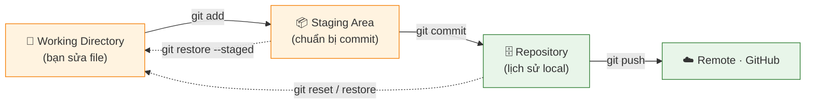
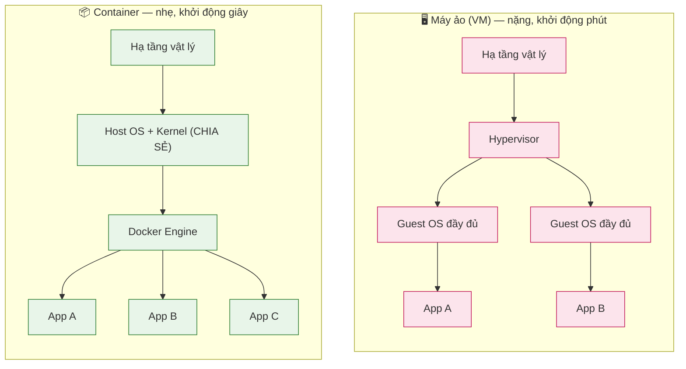
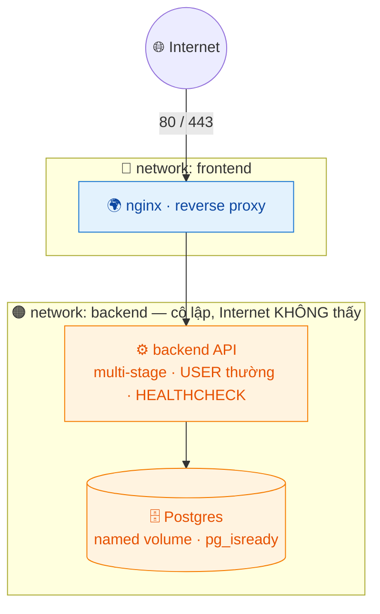
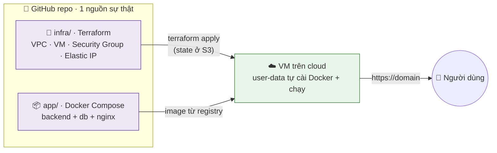

# Giai đoạn 2 — Git, Docker & Container hóa

> **Ngày 13–30** · Quản lý mã nguồn chuyên nghiệp, đóng gói ứng dụng thành container, và lần đầu đưa app lên cloud bằng code.
>
> **Khuôn mỗi ngày:** 📘 Lý thuyết → 🧪 Lab cơ bản → 🚀 Lab nâng cao (best-practice) → 💡 Bổ sung thực tế → 📝 Bài ôn tập.
>
> ✅ Trung lập nền tảng: ví dụ cloud dùng AWS cho cụ thể, nhưng luôn ghi chú **tương đương GCP/Azure** để bạn áp dụng cho bất kỳ nhà cung cấp nào.

---

## Mục lục

| Ngày | Chủ đề |
|------|--------|
| [13](#ngày-13--git-cơ-bản--quản-lý-phiên-bản) | Git cơ bản — Quản lý phiên bản |
| [14](#ngày-14--git-branch-merge--xử-lý-conflict) | Git — Branch, Merge & xử lý Conflict |
| [15](#ngày-15--github-remote-collaboration--pull-request) | GitHub — Remote, Collaboration & Pull Request |
| [16](#ngày-16--docker-khái-niệm--container-đầu-tiên) | Docker — Khái niệm & container đầu tiên |
| [17](#ngày-17--docker-dockerfile--build-image) | Docker — Dockerfile & Build Image |
| [18](#ngày-18--docker-image-tối-ưu--multi-stage-build) | Docker — Image tối ưu & Multi-stage Build |
| [19](#ngày-19--docker-volume-network--dữ-liệu-bền-vững) | Docker — Volume, Network & dữ liệu bền vững |
| [20](#ngày-20--docker-compose--quản-lý-multi-container) | Docker Compose — Quản lý multi-container |
| [21](#ngày-21--milestone--đóng-gói-ứng-dụng-full-stack) | **Milestone — Đóng gói ứng dụng full-stack** |
| [22](#ngày-22--yaml-json--định-dạng-cấu-hình) | YAML, JSON & định dạng cấu hình |
| [23](#ngày-23--reverse-proxy--web-server-nginx-chuyên-sâu) | Reverse Proxy & Web Server (Nginx chuyên sâu) |
| [24](#ngày-24--cơ-sở-dữ-liệu-cho-devops) | Cơ sở dữ liệu cho DevOps |
| [25](#ngày-25--git-nâng-cao--rebase-tag-workflow) | Git nâng cao — Rebase, Tag, Workflow |
| [26](#ngày-26--làm-quen-cloud--khái-niệm--free-tier) | Làm quen Cloud — Khái niệm & Free Tier |
| [27](#ngày-27--máy-chủ-cloud--tạo--quản-lý-vm-ec2) | Máy chủ Cloud — Tạo & quản lý VM (EC2) |
| [28](#ngày-28--triển-khai-app-lên-cloud-docker-trên-vm) | Triển khai App lên Cloud (Docker trên VM) |
| [29](#ngày-29--infrastructure-as-code--giới-thiệu-terraform) | Infrastructure as Code — Giới thiệu Terraform |
| [30](#ngày-30--milestone--lab-tổng-hợp-giai-đoạn-2) | **Milestone — LAB tổng hợp Giai đoạn 2** |

---

## Ngày 13 — Git cơ bản & Quản lý phiên bản

> ⏱️ ~90 phút · Loại: Git

### 📘 Lý thuyết

- **Git là gì:** hệ thống quản lý phiên bản phân tán (DVCS), theo dõi mọi thay đổi của code.
- **3 trạng thái:** Working Directory → Staging Area (`git add`) → Repository (`git commit`).
- **Cấu hình ban đầu:** `git config --global user.name / user.email`.
- **Lệnh cốt lõi:** `git init`, `git status`, `git add <file>` (hoặc `.`), `git commit -m 'msg'`, `git log`.
- **Bỏ qua file:** `.gitignore` liệt kê file/thư mục không theo dõi (`node_modules/`, `.env`, `*.log`).
- **Xem lịch sử & khác biệt:** `git log --oneline`, `git diff`, `git show <commit>`.
- **Quay lui:** `git restore <file>` (bỏ thay đổi working dir), `git restore --staged <file>` (bỏ staging), `git reset`.

**Sơ đồ — vòng đời 1 file qua 3 trạng thái Git:**


### 🧪 Lab cơ bản

1. Cấu hình Git với tên và email của bạn.
2. Tạo repo: `mkdir my-app && cd my-app && git init`.
3. Tạo file → `git add` → `git commit`; lặp lại 3 lần với thay đổi khác nhau.
4. Tạo `.gitignore` loại trừ `.env` và `*.log`, kiểm tra `git status` không còn thấy chúng.
5. Xem lịch sử: `git log --oneline --graph`.

### 🚀 Lab nâng cao (best-practice)

> Mục tiêu: tập thói quen commit "sạch" như khi làm trong team thật.

1. **Commit nhỏ, có ý nghĩa** — mỗi commit là 1 thay đổi logic, không gộp 10 việc vào 1 commit. Dùng `git add -p` để stage **từng phần** của file:
   ```bash
   git add -p          # duyệt từng đoạn thay đổi, chọn y/n — commit có chủ đích
   ```
2. **`.gitignore` chuẩn theo ngôn ngữ** — đừng tự viết tay, lấy template chuẩn:
   ```bash
   curl -sL https://www.toptal.com/developers/gitignore/api/node,python,linux > .gitignore
   ```
3. **Viết commit message tốt** (chuẩn 50/72): dòng đầu ≤50 ký tự, mô tả "làm gì", thân commit giải thích "tại sao".
4. **Xem cấu hình & alias hữu ích:**
   ```bash
   git config --global alias.lg "log --oneline --graph --all --decorate"
   git lg              # giờ xem lịch sử đẹp bằng 1 lệnh
   ```

### 💡 Bổ sung thực tế: cứu vãn khi lỡ tay (reset vs revert vs reflog)

> Câu hỏi #1 của người mới: "Tôi lỡ commit/xóa nhầm, làm sao cứu?" — Git gần như **không bao giờ mất dữ liệu đã commit**.

```bash
# Bỏ commit cuối nhưng GIỮ thay đổi trong working dir (sửa lại rồi commit lại)
git reset --soft HEAD~1

# Bỏ thay đổi chưa commit của 1 file (cẩn thận — mất thật)
git restore file.txt

# Hoàn tác 1 commit đã PUSH mà không viết lại lịch sử (an toàn cho nhánh chung)
git revert <commit>

# "Phao cứu sinh": reflog ghi MỌI thao tác, kể cả commit đã reset/xóa
git reflog                       # tìm commit tưởng đã mất
git reset --hard <hash-từ-reflog>  # quay về đúng điểm đó
```
- **reset** = viết lại lịch sử (chỉ dùng trên nhánh **chưa push**).
- **revert** = tạo commit mới đảo ngược (dùng cho nhánh **đã chia sẻ**).
- **reflog** = sổ ghi toàn bộ — nơi tìm lại mọi thứ "tưởng đã mất".

### 🧭 Hướng dẫn làm lab & giải nghĩa lệnh (cho người tự học)

**Trình tự nên làm:** cấu hình Git → tạo repo → add/commit nhiều lần → `.gitignore` → xem lịch sử → tập cứu vãn (restore/reset/revert).

**Giải nghĩa & kết quả mong đợi:**
- `git init` — biến thư mục thành repo (tạo thư mục ẩn `.git`). *Kết quả:* `git status` báo "No commits yet".
- `git add file` / `git add -p` — đưa vào staging; `-p` chọn **từng đoạn** thay đổi. **Vì sao `-p`:** commit có chủ đích, không gộp 10 việc vào 1.
- `git commit -m "msg"` — lưu ảnh chụp vào lịch sử. *Kết quả:* `git log --oneline` hiện commit.
- `.gitignore` — liệt kê file không theo dõi (`.env`, `*.log`, `node_modules/`). *Kết quả:* `git status` không còn thấy chúng.
- `git log --oneline --graph` — xem lịch sử gọn, có nhánh.

**🧪 Thử nghiệm:**
- Sửa 1 file → `git restore <file>` (thay đổi biến mất). Rồi commit → `git revert <hash>` (tạo commit đảo ngược). **Bài học:** `restore` bỏ thay đổi chưa lưu; `revert` hoàn tác an toàn commit đã có.
- Lỡ `git reset --hard` nhầm? `git reflog` tìm hash cũ → `git reset --hard <hash>`. **Bài học:** Git gần như không mất gì đã commit.

⚠️ **Dễ sai:** `git reset --hard` xóa thay đổi *chưa commit* (không cứu được). Chỉ dùng khi chắc chắn.

💡 **Hiểu sâu:** 3 vùng — Working Directory (sửa) → Staging (`add`) → Repository (`commit`). Biết file đang ở vùng nào quyết định dùng lệnh cứu nào.

### 📝 Bài ôn tập & Demo đối chiếu

- **Bài ôn:** mô tả vòng đời 1 file qua 3 trạng thái của Git.
- Vì sao cần `.gitignore`? Cho 3 ví dụ file nên bỏ qua.
- Phân biệt `git add` (đưa vào staging) và `git commit` (lưu vào lịch sử).

| Demo đối chiếu | Kết quả mong đợi |
|---|---|
| `git log` sau commit đầu | Hiện 1 commit với message của bạn |
| `git status` | `working tree clean` |
| `git log --oneline` | Liệt kê các commit |

✅ **Kết quả đạt được:** Quản lý phiên bản code cục bộ thành thạo với Git.

---

## Ngày 14 — Git: Branch, Merge & xử lý Conflict

> ⏱️ ~90 phút · Loại: Git

### 📘 Lý thuyết

- **Branch (nhánh):** dùng phát triển song song; `main`/`master` là nhánh chính.
- **Lệnh nhánh:** `git branch` (liệt kê), `git switch <tên>` / `git checkout <tên>`, `git switch -c <tên>` (tạo + chuyển).
- **Merge:** `git merge <nhánh>` — hợp nhất nhánh vào nhánh hiện tại; fast-forward vs 3-way merge.
- **Conflict (xung đột):** xảy ra khi 2 nhánh sửa cùng dòng; Git đánh dấu `<<<<`, `====`, `>>>>`.
- **Giải quyết conflict:** sửa file thủ công, `git add`, `git commit`.
- **Workflow phổ biến:** feature branch — mỗi tính năng 1 nhánh, merge vào main qua review.
- **Xóa nhánh:** `git branch -d <tên>` (an toàn), `-D` (ép buộc).
- **git stash:** tạm cất thay đổi chưa commit để chuyển nhánh.

### 🧪 Lab cơ bản

1. Tạo nhánh feature: `git switch -c feature-login`, sửa file, commit.
2. Quay về main và merge: `git switch main && git merge feature-login`.
3. Tạo conflict có chủ ý: sửa cùng 1 dòng ở 2 nhánh rồi merge, giải quyết conflict.
4. Thực hành `git stash`: sửa file, stash, chuyển nhánh, rồi `git stash pop`.
5. Xóa nhánh đã merge và liệt kê lại bằng `git branch`.

### 🚀 Lab nâng cao (best-practice)

> Mục tiêu: làm việc với nhánh như trong team, hạn chế conflict và merge sạch.

1. **Đặt tên nhánh có quy ước:** `feature/login`, `fix/null-pointer`, `chore/update-deps` — đọc là biết mục đích.
2. **Cập nhật nhánh trước khi merge** để giảm conflict:
   ```bash
   git switch feature/login
   git fetch origin
   git rebase origin/main      # đưa feature lên trên main mới nhất
   ```
3. **Dùng merge tool khi conflict phức tạp:**
   ```bash
   git config --global merge.tool vimdiff   # hoặc VS Code: code --wait
   git mergetool
   ```
4. **`git stash` có tên** khi cất nhiều thứ:
   ```bash
   git stash push -m "đang dở phần validate form"
   git stash list; git stash apply stash@{0}
   ```

### 💡 Bổ sung thực tế: hiểu HEAD, detached HEAD & chiến lược nhánh

- **HEAD** là con trỏ "bạn đang ở đâu". `git switch <commit-hash>` đưa bạn vào trạng thái **detached HEAD** (không trên nhánh nào) — commit ở đây sẽ mất nếu không tạo nhánh. Cách thoát: `git switch -c nhánh-mới`.
- **3 chiến lược nhánh phổ biến** (sẽ chọn ở Ngày 25):
  | Chiến lược | Phù hợp |
  |---|---|
  | **GitHub Flow** | nhánh ngắn từ main, deploy liên tục — đa số dự án web |
  | **Git Flow** | có develop/release/hotfix — sản phẩm có nhiều phiên bản |
  | **Trunk-based** | commit thẳng main + feature flag — team CI/CD trưởng thành |
- **Quy tắc vàng giảm đau:** nhánh sống **càng ngắn càng tốt**. Nhánh tồn tại 2 tuần = hội conflict khủng khiếp khi merge.

### 🧭 Hướng dẫn làm lab & giải nghĩa lệnh (cho người tự học)

**Trình tự nên làm:** tạo nhánh feature → commit → merge về main → tạo & giải quyết conflict → tập `git stash`.

**Giải nghĩa & kết quả mong đợi:**
- `git switch -c feature-login` — tạo + chuyển nhánh mới (`-c` = create). *Kết quả:* `git branch` hiện `* feature-login`.
- `git switch main && git merge feature-login` — gộp nhánh vào main. *Kết quả:* `git log --graph` thấy nhánh đã hợp nhất.
- Conflict — khi 2 nhánh sửa **cùng dòng**, Git đánh dấu `<<<<<<` (của bạn) `======` `>>>>>>` (của họ). Sửa tay → `git add` → `git commit`.
- `git stash` / `git stash pop` — tạm cất thay đổi chưa commit để chuyển nhánh, rồi lấy lại.

**🧪 Thử nghiệm:**
- Cố tình sửa cùng 1 dòng ở 2 nhánh rồi merge → gặp conflict thật → sửa → `git status` báo "all conflicts fixed". **Bài học:** conflict không đáng sợ, chỉ là chọn giữ phần nào.
- `git switch <commit-hash>` (vào detached HEAD) rồi `git switch main`. **Bài học:** hiểu HEAD đang trỏ đâu; commit ở detached sẽ mất nếu không tạo nhánh.

⚠️ **Dễ sai:** nhánh sống quá lâu (vài tuần) = conflict khổng lồ khi merge. Nhánh **càng ngắn càng tốt**.

💡 **Hiểu sâu:** nhánh chỉ là 1 con trỏ tới commit — tạo/xóa rất rẻ. Đây là lý do Git khuyến khích mỗi tính năng 1 nhánh.

### 📝 Bài ôn tập & Demo đối chiếu

- **Bài ôn:** viết chuỗi lệnh tạo nhánh `hotfix`, sửa, merge vào main.
- Khi gặp conflict, các dấu `<<<<<<` `======` `>>>>>>` nghĩa là gì?
- `git stash` dùng trong tình huống nào?

| Demo đối chiếu | Kết quả mong đợi |
|---|---|
| Tạo & chuyển nhánh | `git branch` hiện `* feature/...` |
| Merge vào main | `git log --graph` thấy nhánh đã hợp nhất |
| Giải quyết conflict | Sau khi sửa, `git status` → all conflicts fixed |

✅ **Kết quả đạt được:** Làm việc với nhánh, merge và xử lý conflict — kỹ năng cộng tác thiết yếu.

---

## Ngày 15 — GitHub: Remote, Collaboration & Pull Request

> ⏱️ ~90 phút · Loại: Git

### 📘 Lý thuyết

- **Remote repository:** bản sao trên server (GitHub/GitLab); `origin` là tên mặc định.
- **Kết nối:** `git remote add origin <url>`, `git push -u origin main`, `git pull`, `git fetch`, `git clone <url>`.
- **Push & pull:** đẩy commit lên (push), kéo thay đổi về (pull = fetch + merge).
- **Fork & Pull Request (PR):** đóng góp vào dự án người khác; PR để review trước khi merge.
- **Code review:** comment trên PR, yêu cầu thay đổi, approve.
- **Issue & project board:** quản lý công việc, bug, tính năng trên GitHub.
- **README & tài liệu:** file `README.md` là "bộ mặt" của repo (Markdown).
- **GitHub flow:** branch → commit → push → PR → review → merge.

### 🧪 Lab cơ bản

1. Đẩy repo `my-app` lên GitHub: tạo repo trên web, `git remote add origin`, `git push -u origin main`.
2. Viết `README.md` đầy đủ (mô tả, cách cài, cách chạy) bằng Markdown.
3. Tạo nhánh, push lên GitHub, mở Pull Request và tự merge.
4. Tạo 1 Issue mô tả 1 tính năng cần làm, gắn label.
5. Thực hành clone 1 repo công khai bất kỳ về máy.

### 🚀 Lab nâng cao (best-practice)

> Mục tiêu: thiết lập repo như một dự án nghiêm túc, có bảo vệ và tự động hóa cộng tác.

1. **Branch protection cho `main`** (Settings → Branches): bắt buộc PR, bắt buộc review, không cho push thẳng. → không ai (kể cả bạn) phá nhánh chính.
2. **PR template** (`.github/pull_request_template.md`) — chuẩn hóa mô tả PR: làm gì, test thế nào, ảnh hưởng gì.
3. **CODEOWNERS** (`.github/CODEOWNERS`) — tự gán người review theo thư mục.
4. **Dùng `gh` CLI** để làm việc nhanh không rời terminal:
   ```bash
   gh pr create --fill          # tạo PR từ nhánh hiện tại
   gh pr checks                 # xem CI pass chưa
   gh pr merge --squash         # merge gọn lịch sử
   ```

### 💡 Bổ sung thực tế: SSH vs HTTPS, fork workflow & viết README "ăn điểm"

- **Remote dùng SSH thay HTTPS** để khỏi nhập token mỗi lần (đã tạo key ở Ngày 1/8):
  ```bash
  git remote set-url origin git@github.com:user/repo.git
  ```
- **Fork workflow** (đóng góp open-source): fork → clone bản fork → thêm remote `upstream` trỏ repo gốc → `git fetch upstream` để đồng bộ → PR từ fork về gốc.
- **README tối thiểu nên có:** mô tả 1 dòng · ảnh/demo · cách cài đặt · cách chạy · cấu trúc thư mục · giấy phép. README tốt = người khác (và bạn 6 tháng sau) chạy được ngay.
- **Quy tắc bảo mật:** nếu lỡ push secret lên GitHub → **coi như đã lộ vĩnh viễn**, phải **xoay (rotate) ngay** secret đó, không chỉ xóa commit (lịch sử vẫn còn ở fork/cache).

### 🧭 Hướng dẫn làm lab & giải nghĩa lệnh (cho người tự học)

**Trình tự nên làm:** tạo repo trên GitHub → kết nối remote → push → viết README → mở Pull Request → tập clone.

**Giải nghĩa & kết quả mong đợi:**
- `git remote add origin <url>` — gắn repo local với GitHub (`origin` = tên mặc định). `git push -u origin main` — đẩy lần đầu + nhớ liên kết. *Kết quả:* repo online cập nhật.
- `git pull` = `git fetch` (tải về) + `git merge` (gộp). **Vì sao phân biệt:** `fetch` chỉ tải, không động code đang làm; `pull` gộp luôn.
- Pull Request (PR) — đề xuất gộp nhánh, để review trước khi vào main. *Kết quả:* tab Pull requests hiện PR.
- `git clone <url>` — sao chép repo về máy.

**🧪 Thử nghiệm:**
- Đổi remote sang SSH: `git remote set-url origin git@github.com:user/repo.git` rồi `git push` (không hỏi mật khẩu nhờ key Ngày 1). **Bài học:** SSH tiện hơn HTTPS.
- Bật Branch protection cho `main` (Settings → Branches), thử push thẳng → bị chặn. **Bài học:** không ai (kể cả bạn) phá nhánh chính.

⚠️ **Dễ sai:** lỡ push secret lên GitHub = **lộ vĩnh viễn** (còn trong lịch sử/cache). Phải **xoay (rotate)** secret ngay, không chỉ xóa commit.

💡 **Hiểu sâu:** GitHub flow: branch → commit → push → PR → review → merge. Đây là quy trình team thật — và là cái bạn sẽ tự động hóa bằng CI/CD ở Giai đoạn 3.

### 📝 Bài ôn tập & Demo đối chiếu

- **Bài ôn:** phân biệt `git fetch` (chỉ tải về, không merge) và `git pull` (tải + merge).
- Quy trình GitHub flow gồm những bước nào?
- Pull Request dùng để làm gì trong làm việc nhóm?

| Demo đối chiếu | Kết quả mong đợi |
|---|---|
| `git push` | Repo online cập nhật commit mới |
| Tạo 1 PR | Tab Pull requests hiện PR đang mở |
| `git clone <url>` | Thư mục project xuất hiện |

✅ **Kết quả đạt được:** Cộng tác qua GitHub, làm PR, viết README — sẵn sàng làm việc nhóm thực tế.

---

## Ngày 16 — Docker: Khái niệm & container đầu tiên

> ⏱️ ~90 phút · Loại: Docker

### 📘 Lý thuyết

- **Vấn đề Docker giải quyết:** *"works on my machine"* — đóng gói app + dependencies thành 1 đơn vị chạy ở đâu cũng giống nhau.
- **Container vs VM:** container chia sẻ kernel host, nhẹ hơn nhiều, khởi động trong vài giây.
- **Khái niệm:** Image (khuôn mẫu chỉ đọc) → Container (instance đang chạy của image).
- **Docker Hub:** kho chứa image công khai (registry).
- **Lệnh cơ bản:** `docker run`, `docker ps` (`-a` xem cả đã dừng), `docker stop/start`, `docker rm`, `docker images`, `docker rmi`.
- **Tương tác:** `docker exec -it <container> bash`, `docker logs <container>`.
- **Port mapping:** `-p 8080:80` (cổng host : cổng container).
- **Volume cơ bản:** `-v đường_dẫn_host:đường_dẫn_container` để lưu dữ liệu bền vững.

**Sơ đồ — Container vs Máy ảo (vì sao container nhẹ hơn):**


### 🧪 Lab cơ bản

1. Cài Docker (Docker Desktop hoặc trên Ubuntu theo docs.docker.com), kiểm tra `docker --version`.
2. Chạy hello-world: `docker run hello-world`.
3. Chạy nginx: `docker run -d -p 8080:80 --name web nginx`, mở `http://localhost:8080`.
4. Vào trong container: `docker exec -it web bash`, khám phá, `exit`.
5. Xem log & dọn dẹp: `docker logs web`, `docker stop web`, `docker rm web`.

### 🚀 Lab nâng cao (best-practice)

> Mục tiêu: dùng Docker gọn gàng, không để rác chiếm đầy đĩa (lỗi kinh điển sau vài tuần).

1. **Chạy không cần root** — thêm user vào nhóm docker (an toàn hơn `sudo docker`):
   ```bash
   sudo usermod -aG docker $USER   # đăng xuất/đăng nhập lại
   ```
2. **Luôn đặt tên + giới hạn tài nguyên** cho container:
   ```bash
   docker run -d --name web --memory=256m --cpus=0.5 -p 8080:80 nginx
   ```
3. **Dọn rác định kỳ** — image/volume mồ côi ngốn đĩa khủng khiếp:
   ```bash
   docker system df            # xem Docker đang chiếm bao nhiêu đĩa
   docker system prune -a      # dọn image/container/network không dùng
   docker volume prune         # dọn volume mồ côi (cẩn thận dữ liệu!)
   ```
4. **Pin phiên bản image** — `nginx:1.27-alpine` thay vì `nginx:latest` (latest thay đổi bất ngờ, vỡ build).

### 💡 Bổ sung thực tế: kiến trúc Docker & đọc lỗi thường gặp

- **Kiến trúc:** Docker CLI → Docker daemon (dockerd) → containerd → runc. Hiểu điều này giúp bạn debug khi "docker không phản hồi" (thường là daemon chết: `systemctl status docker`).
- **3 lỗi người mới gặp nhiều nhất:**
  | Lỗi | Nguyên nhân & cách xử lý |
  |---|---|
  | `port is already allocated` | Cổng host đã bị chiếm → đổi port hoặc `docker ps` tìm container cũ |
  | `no space left on device` | Image/volume rác → `docker system prune -a` |
  | Container `Exited (0/1)` ngay lập tức | Tiến trình chính kết thúc → xem `docker logs <name>` |
- **Container sống nhờ tiến trình foreground:** container dừng khi tiến trình PID 1 thoát. Đây là lý do `docker run ubuntu` thoát ngay (không có gì chạy), còn `nginx` thì sống (nginx chạy foreground).

### 🧭 Hướng dẫn làm lab & giải nghĩa lệnh (cho người tự học)

**Trình tự nên làm:** cài Docker → chạy hello-world → chạy nginx có map cổng → vào trong container → xem log & dọn dẹp.

**Giải nghĩa & kết quả mong đợi:**
- `docker run hello-world` — kéo image test + chạy. *Kết quả:* `Hello from Docker!` (xác nhận Docker hoạt động).
- `docker run -d -p 8080:80 --name web nginx` — `-d` chạy nền, `-p 8080:80` map cổng host:container, `--name` đặt tên. *Kết quả:* mở `localhost:8080` thấy trang nginx.
- `docker ps` (`-a` cả đã dừng) — liệt kê container; `docker logs web` — xem log; `docker exec -it web bash` — vào shell trong container.
- `docker stop web && docker rm web` — dừng rồi xóa container.

**🧪 Thử nghiệm:**
- `docker run ubuntu` (thoát ngay) vs `docker run nginx` (chạy mãi). **Bài học:** container sống nhờ tiến trình **foreground** (PID 1); ubuntu không có gì chạy nên thoát.
- Chạy `docker run -p 8080:80 nginx` 2 lần → lần 2 lỗi `port is already allocated`. **Bài học:** mỗi cổng host chỉ 1 container giữ.

⚠️ **Dễ sai:** quên dọn → `docker system df` thấy image/volume rác ngốn đĩa; dọn bằng `docker system prune -a` (cẩn thận volume).

💡 **Hiểu sâu:** Image = khuôn (chỉ đọc), Container = instance đang chạy (khuôn bánh vs cái bánh). Container nhẹ vì **chia sẻ kernel host**, không cần Guest OS đầy đủ như VM.

### 📝 Bài ôn tập & Demo đối chiếu

- **Bài ôn:** phân biệt image và container bằng ví dụ đời thực (gợi ý: khuôn bánh vs cái bánh).
- Giải thích `-p 3000:80` nghĩa là gì.
- Vì sao container nhẹ hơn máy ảo (VM)?

| Demo đối chiếu | Kết quả mong đợi |
|---|---|
| `docker run hello-world` | `Hello from Docker!` |
| `docker ps` | Liệt kê CONTAINER ID, IMAGE... |
| `docker run -p 8080:80 nginx` | `localhost:8080` hiện trang nginx |

✅ **Kết quả đạt được:** Hiểu container, chạy được container đầu tiên, thao tác Docker cơ bản.

---

## Ngày 17 — Docker: Dockerfile & Build Image

> ⏱️ ~90 phút · Loại: Docker

### 📘 Lý thuyết

- **Dockerfile:** file "công thức" để build image của riêng bạn.
- **Chỉ thị chính:** `FROM` (image gốc), `WORKDIR` (thư mục làm việc), `COPY`/`ADD`, `RUN` (chạy lệnh khi build).
- **`ENV`** (biến môi trường), **`EXPOSE`** (khai báo cổng), **`CMD`** (lệnh chạy mặc định), **`ENTRYPOINT`**.
- **Build:** `docker build -t tên-image:tag .` (dấu chấm = context hiện tại).
- **Layer caching:** mỗi chỉ thị tạo 1 layer; sắp xếp hợp lý để tận dụng cache, build nhanh hơn.
- **`.dockerignore`:** loại trừ file không cần đưa vào image (như `.gitignore`).
- **CMD vs ENTRYPOINT:** CMD dễ ghi đè, ENTRYPOINT cố định lệnh chính.
- **Tag & push:** `docker tag`, `docker push` lên Docker Hub.

### 🧪 Lab cơ bản

1. Tạo app Node.js (hoặc Python Flask) đơn giản trả về `Hello DevOps`.
2. Viết Dockerfile (FROM, WORKDIR, COPY, RUN npm install, CMD).
3. Build image: `docker build -t my-app:1.0 .`
4. Chạy container từ image vừa build và test trên trình duyệt.
5. Tạo `.dockerignore` loại trừ `node_modules`, đẩy image lên Docker Hub.

### 🚀 Lab nâng cao (best-practice)

> Mục tiêu: viết Dockerfile tận dụng cache đúng cách và không nhồi rác vào image.

1. **Thứ tự layer để tối ưu cache** — copy dependency trước, code sau:
   ```dockerfile
   COPY package*.json ./      # layer này chỉ đổi khi dependency đổi
   RUN npm ci                 # cache lại nếu package.json không đổi
   COPY . .                   # code đổi thường xuyên → để cuối
   ```
   > Sai thứ tự = mỗi lần sửa 1 dòng code phải cài lại toàn bộ dependency (chậm khủng khiếp).
2. **`.dockerignore` đầy đủ** — không copy `.git`, `node_modules`, `.env` vào image.
3. **Dùng `npm ci` thay `npm install`** trong build (cài đúng theo lock file, tái lập được).
4. **Gắn metadata (label)** chuẩn OCI:
   ```dockerfile
   LABEL org.opencontainers.image.source="https://github.com/user/repo"
   ```

### 💡 Bổ sung thực tế: CMD vs ENTRYPOINT & biến lúc build/run

- **CMD vs ENTRYPOINT** (hay nhầm):
  | | Vai trò |
  |---|---|
  | `ENTRYPOINT ["app"]` | lệnh **cố định** — luôn chạy |
  | `CMD ["--port", "80"]` | **tham số mặc định** — dễ ghi đè khi `docker run` |
  | Kết hợp | `docker run img --port 9000` → ghi đè tham số, giữ entrypoint |
- **ARG vs ENV:** `ARG` chỉ tồn tại lúc **build** (vd version), `ENV` tồn tại lúc **chạy**. ⚠️ Đừng truyền secret qua `ARG`/`ENV` — nó nằm trong layer image, ai cũng đọc được bằng `docker history`.
- **BuildKit** (build engine hiện đại, bật mặc định) hỗ trợ `--secret` để dùng secret lúc build mà không nhúng vào image:
  ```bash
  DOCKER_BUILDKIT=1 docker build --secret id=npmrc,src=$HOME/.npmrc .
  ```

### 🧭 Hướng dẫn làm lab & giải nghĩa lệnh (cho người tự học)

**Trình tự nên làm:** viết app nhỏ → viết Dockerfile → build image → chạy & test → thêm `.dockerignore` → push.

**Giải nghĩa & kết quả mong đợi:**
- `FROM node:20` (image gốc) · `WORKDIR /app` (thư mục làm việc) · `COPY` (chép file) · `RUN` (chạy lệnh **lúc build**, vd cài dependency) · `CMD` (lệnh chạy **lúc container start**).
- `docker build -t my-app:1.0 .` — `-t` đặt tên:tag, `.` = build context. *Kết quả:* `Successfully tagged my-app:1.0`.
- `.dockerignore` — loại `.git`, `node_modules`, `.env` khỏi build context.

**🧪 Thử nghiệm:**
- Đặt `COPY . .` TRƯỚC `RUN npm ci`, build; sửa 1 dòng code rồi build lại → cài lại toàn bộ dependency (chậm). Rồi đảo: `COPY package*.json` + `RUN npm ci` TRƯỚC `COPY . .` → build lại nhanh. **Bài học:** thứ tự layer quyết định cache.
- `docker history my-app:1.0` — xem từng layer nặng bao nhiêu.

⚠️ **Dễ sai:** truyền secret qua `ARG`/`ENV` — nằm trong layer image, ai cũng đọc bằng `docker history`. Dùng BuildKit `--secret`.

💡 **Hiểu sâu:** `RUN` chạy *khi build* (tạo layer); `CMD`/`ENTRYPOINT` chạy *khi start*. `ENTRYPOINT` cố định lệnh chính, `CMD` là tham số mặc định dễ ghi đè — kết hợp cho lệnh linh hoạt.

### 📝 Bài ôn tập & Demo đối chiếu

- **Bài ôn:** phân biệt `RUN` (lúc build) và `CMD` (lúc chạy).
- Vì sao nên `COPY package.json` + cài dependency **trước** khi `COPY` toàn bộ code? (cache).
- Viết Dockerfile tối giản cho 1 app Python.

| Demo đối chiếu | Kết quả mong đợi |
|---|---|
| `docker build -t myapp .` | `Successfully tagged myapp:latest` |
| `docker images` | Hiện `myapp` |
| Chạy app từ image | Container chạy, app phản hồi đúng |

✅ **Kết quả đạt được:** Tự build image từ Dockerfile, hiểu layer cache, đẩy image lên registry.

---

## Ngày 18 — Docker: Image tối ưu & Multi-stage Build

> ⏱️ ~90 phút · Loại: Docker

### 📘 Lý thuyết

- **Vấn đề image quá nặng:** chứa cả công cụ build không cần khi chạy.
- **Multi-stage build:** dùng nhiều `FROM`; stage build riêng, stage chạy riêng → image cuối nhẹ gọn.
- **Base image nhỏ:** `alpine` (rất nhỏ), `slim` variants; cân nhắc bảo mật vs kích thước.
- **Giảm số layer:** gộp lệnh `RUN` bằng `&&`, dọn cache apt trong cùng layer.
- **Bảo mật image:** không chạy bằng root (`USER`), không nhúng secret, quét lỗ hổng (trivy/docker scout).
- **Quản lý tag:** dùng tag rõ ràng (`1.0.2`) thay vì chỉ `latest`.
- **`docker history` & `docker inspect`** để phân tích image.

### 🧪 Lab cơ bản

1. Viết multi-stage Dockerfile: stage 1 build, stage 2 chỉ copy artifact sang base nhỏ.
2. So sánh kích thước image trước/sau tối ưu: `docker images`.
3. Thêm chỉ thị `USER` để không chạy bằng root.
4. Cài và chạy trivy quét image tìm lỗ hổng (hoặc docker scout).
5. Dùng `docker history` xem các layer và kích thước từng layer.

### 🚀 Lab nâng cao (best-practice)

> Mục tiêu: image production thật sự — nhỏ, an toàn, chạy bằng user thường.

1. **Multi-stage mẫu cho Node.js:**
   ```dockerfile
   # Stage build
   FROM node:20 AS build
   WORKDIR /app
   COPY package*.json ./
   RUN npm ci
   COPY . .
   RUN npm run build

   # Stage chạy — chỉ lấy artifact, base nhỏ, user thường
   FROM node:20-alpine
   WORKDIR /app
   COPY --from=build /app/dist ./dist
   COPY --from=build /app/node_modules ./node_modules
   USER node
   EXPOSE 3000
   CMD ["node", "dist/server.js"]
   ```
2. **Quét lỗ hổng tự động** trước khi push:
   ```bash
   trivy image myapp:1.0      # liệt kê CVE theo mức độ nghiêm trọng
   ```
3. **Distroless cho mức bảo mật cao nhất** — không có shell, gần như không có gì để khai thác: `FROM gcr.io/distroless/nodejs20`.
4. **HEALTHCHECK** để Docker/orchestrator biết container thực sự khỏe:
   ```dockerfile
   HEALTHCHECK --interval=30s --timeout=3s CMD wget -qO- http://localhost:3000/health || exit 1
   ```

### 💡 Bổ sung thực tế: vì sao image nhỏ quan trọng hơn bạn nghĩ

- **Image 1.2GB vs 80MB** không chỉ là dung lượng: image nhỏ → pull nhanh hơn (deploy/scale nhanh), **bề mặt tấn công nhỏ hơn** (ít gói = ít CVE), khởi động nhanh hơn.
- **Quy tắc:** image production **không nên có** compiler, `curl`, `git`, hay shell nếu không cần. Mỗi binary thừa là một rủi ro bảo mật.
- **Đo và truy vết "image phình":** `docker history --no-trunc myapp` cho thấy layer nào nặng → thường là `RUN` quên dọn cache, hoặc copy nhầm `node_modules`/`.git`.
- **`.dockerignore` là tuyến phòng thủ đầu** — thiếu nó, `docker build` gửi cả `.git` 500MB vào build context.

### 🧭 Hướng dẫn làm lab & giải nghĩa lệnh (cho người tự học)

**Trình tự nên làm:** viết multi-stage Dockerfile → so sánh kích thước → thêm `USER` + `HEALTHCHECK` → quét Trivy → xem layer.

**Giải nghĩa & kết quả mong đợi:**
- Multi-stage: `FROM node:20 AS build` (cài + build) rồi `FROM node:20-alpine` (chỉ `COPY --from=build` artifact). *Kết quả:* `docker images` thấy image cuối nhỏ hơn nhiều (vd 1.2GB → ~150MB).
- `USER node` — chạy bằng user thường, không root. `HEALTHCHECK` — Docker tự kiểm tra container khỏe.
- `trivy image my-app:1.0` — quét lỗ hổng (CVE). *Kết quả:* bảng CVE theo mức độ.

**🧪 Thử nghiệm:**
- Build 1 lần KHÔNG multi-stage, 1 lần CÓ, rồi `docker images` so sánh cột SIZE. **Bài học:** stage build (compiler, dev deps) bị bỏ lại → image chạy nhẹ hẳn.
- `docker history --no-trunc my-app` — tìm layer phình to (thường do quên dọn cache hoặc copy nhầm `.git`).

⚠️ **Dễ sai:** dùng `latest` ở production → "máy nào pull lúc nào ra bản đó", không rollback chính xác. Pin tag rõ ràng (SHA/semver).

💡 **Hiểu sâu:** image nhỏ = pull nhanh (scale nhanh) + bề mặt tấn công nhỏ (ít gói = ít CVE). Mức cao nhất: **distroless** (không có cả shell để khai thác).

### 📝 Bài ôn tập & Demo đối chiếu

- **Bài ôn:** multi-stage build giúp giảm kích thước image bằng cách nào?
- Vì sao không nên chạy container bằng user root?
- Vì sao nên tránh dùng tag `latest` trong production?

| Demo đối chiếu | Kết quả mong đợi |
|---|---|
| `docker images` trước/sau | Image multi-stage nhỏ hơn rõ rệt |
| Build multi-stage | Chỉ stage cuối được giữ, không có toolchain |
| App vẫn chạy với image nhỏ | Phản hồi không đổi |

✅ **Kết quả đạt được:** Tối ưu image nhỏ gọn, bảo mật — kỹ năng Docker chuyên nghiệp.

---

## Ngày 19 — Docker: Volume, Network & dữ liệu bền vững

> ⏱️ ~90 phút · Loại: Docker

### 📘 Lý thuyết

- **Vấn đề:** container bị xóa → mất dữ liệu; cần lưu trữ bền vững.
- **Volume:** `docker volume create`, `-v tên-volume:/path`; do Docker quản lý (khuyến nghị).
- **Bind mount:** `-v /host/path:/container/path`; gắn trực tiếp thư mục host (tốt cho dev).
- **tmpfs:** lưu trong RAM, không bền vững.
- **Docker network:** `bridge` (mặc định), `host`, `none`; container cùng network gọi nhau qua tên.
- **Tạo network:** `docker network create mynet`; `--network mynet` khi run.
- **DNS nội bộ:** trong cùng network, container kết nối nhau bằng **tên container/service**.
- **Inspect:** `docker volume inspect`, `docker network inspect`.

### 🧪 Lab cơ bản

1. Tạo volume, chạy container ghi dữ liệu vào volume, xóa container rồi tạo lại — dữ liệu vẫn còn.
2. Dùng bind mount gắn thư mục code host vào container để chỉnh sửa trực tiếp.
3. Tạo network riêng, chạy 2 container (app + database giả lập) cho giao tiếp qua tên.
4. Chạy MySQL/Postgres container với volume → dữ liệu không mất khi restart.
5. Inspect network xem các container được kết nối.

### 🚀 Lab nâng cao (best-practice)

> Mục tiêu: tách biệt dữ liệu và mạng đúng chuẩn production.

1. **Volume cho dữ liệu, bind mount cho dev** — đừng nhầm vai trò: database production luôn dùng **named volume** (Docker quản lý, backup được), bind mount chỉ cho dev (sửa code nóng).
2. **Tách network theo tầng** — frontend không cần thấy database:
   ```bash
   docker network create frontend
   docker network create backend
   # app nối cả 2; db chỉ nối backend → cô lập, an toàn hơn
   ```
3. **Backup volume đúng cách:**
   ```bash
   docker run --rm -v mydata:/data -v $(pwd):/backup alpine \
     tar -czf /backup/mydata-backup.tar.gz -C /data .
   ```
4. **Không bao giờ** đặt dữ liệu quan trọng trong lớp ghi của container — luôn ra volume.

### 💡 Bổ sung thực tế: network mode & bẫy "dữ liệu biến mất"

- **3 network mode cần biết:**
  | Mode | Dùng khi |
  |---|---|
  | `bridge` (mặc định) | đa số trường hợp — container có IP riêng, cô lập |
  | `host` | cần hiệu năng mạng tối đa, container dùng thẳng mạng host (mất cô lập) |
  | `none` | container không cần mạng (job xử lý offline) |
- **Bẫy kinh điển:** "dữ liệu DB biến mất sau khi `docker compose down`". Lý do: quên khai báo volume, dữ liệu nằm trong lớp ghi của container → xóa container là mất. **Database BẮT BUỘC có volume.**
- **DNS nội bộ là chìa khóa microservice:** app kết nối DB bằng `postgres://db:5432` (tên service `db`), không phải IP. Docker tự phân giải tên trong cùng network.
- **`docker compose down -v` xóa cả volume** — lệnh nguy hiểm, đọc kỹ trước khi gõ trên môi trường có dữ liệu thật.

### 🧭 Hướng dẫn làm lab & giải nghĩa lệnh (cho người tự học)

**Trình tự nên làm:** tạo volume & ghi dữ liệu → xóa container rồi tạo lại (dữ liệu còn) → bind mount cho dev → network riêng cho 2 container nói chuyện qua tên.

**Giải nghĩa & kết quả mong đợi:**
- `docker volume create data` + `-v data:/var/lib/...` — volume do Docker quản (khuyến nghị cho dữ liệu). *Kết quả:* xóa container, tạo lại → dữ liệu vẫn còn.
- `-v $(pwd):/app` (bind mount) — gắn thẳng thư mục host vào container (tốt cho **dev**: sửa code nóng).
- `docker network create mynet` + `--network mynet` — 2 container cùng network gọi nhau bằng **tên** (DNS nội bộ), không cần IP.

**🧪 Thử nghiệm:**
- Chạy postgres KHÔNG volume → ghi dữ liệu → `docker rm` → tạo lại → dữ liệu MẤT. Làm lại CÓ `-v` → dữ liệu CÒN. **Bài học:** vì sao DB bắt buộc có volume.
- 2 container cùng network: từ A `ping <tên-B>` → thông. **Bài học:** DNS nội bộ là nền tảng microservice.

⚠️ **Dễ sai:** `docker compose down -v` xóa cả volume → mất dữ liệu thật. Đọc kỹ cờ `-v`.

💡 **Hiểu sâu:** dữ liệu trong "lớp ghi" container mất khi xóa container; volume nằm NGOÀI vòng đời container nên bền vững. Tách network theo tầng để DB không lộ ra ngoài.

### 📝 Bài ôn tập & Demo đối chiếu

- **Bài ôn:** phân biệt volume và bind mount, khi nào dùng cái nào.
- 2 container làm sao gọi nhau qua tên thay vì IP?
- Vì sao database trong container BẮT BUỘC phải dùng volume?

| Demo đối chiếu | Kết quả mong đợi |
|---|---|
| Tạo volume, gắn vào container | `docker volume ls` hiện volume; dữ liệu còn sau khi xóa container |
| Tạo network riêng | `docker network ls` hiện network |
| 2 container nói chuyện qua tên | ping/curl theo tên service thành công |

✅ **Kết quả đạt được:** Quản lý dữ liệu bền vững và mạng giữa các container.

---

## Ngày 20 — Docker Compose: Quản lý multi-container

> ⏱️ ~90 phút · Loại: Docker

### 📘 Lý thuyết

- **Vấn đề:** app thực tế có nhiều dịch vụ (web + db + cache) — chạy từng `docker run` rất cực.
- **Docker Compose:** định nghĩa nhiều dịch vụ trong 1 file `docker-compose.yml` (YAML).
- **Cấu trúc:** `services`, `image`/`build`, `ports`, `volumes`, `environment`, `depends_on`, `networks`.
- **Lệnh:** `docker compose up -d`, `docker compose down`, `docker compose logs`, `docker compose ps`.
- **Biến môi trường:** file `.env` tự động được Compose đọc.
- **Scale:** `docker compose up --scale web=3`.
- **depends_on & healthcheck:** kiểm soát thứ tự khởi động và tình trạng dịch vụ.

### 🧪 Lab cơ bản

1. Viết `docker-compose.yml` cho stack web (app ngày 17) + database (Postgres) + adminer.
2. Chạy toàn bộ: `docker compose up -d`, kiểm tra `docker compose ps`.
3. Dùng `.env` truyền mật khẩu DB vào Compose.
4. Xem log gộp: `docker compose logs -f`, rồi tắt: `docker compose down`.
5. Thêm volume cho database, test restart vẫn còn dữ liệu.

### 🚀 Lab nâng cao (best-practice)

> Mục tiêu: viết Compose chuẩn — có healthcheck, thứ tự đúng, secret an toàn.

1. **`depends_on` với điều kiện healthcheck** (không chỉ "đã start" mà "đã sẵn sàng"):
   ```yaml
   services:
     app:
       build: .
       depends_on:
         db:
           condition: service_healthy
     db:
       image: postgres:16-alpine
       environment:
         POSTGRES_PASSWORD_FILE: /run/secrets/db_pass
       healthcheck:
         test: ["CMD-SHELL", "pg_isready -U postgres"]
         interval: 5s
         retries: 5
       volumes:
         - dbdata:/var/lib/postgresql/data
   volumes:
     dbdata:
   ```
2. **Tách file theo môi trường:** `docker-compose.yml` (base) + `docker-compose.override.yml` (dev) / `docker-compose.prod.yml`.
3. **Đặt `restart: unless-stopped`** cho dịch vụ production.
4. **Validate trước khi chạy:** `docker compose config` (in cấu hình đã merge, bắt lỗi YAML sớm).

### 💡 Bổ sung thực tế: depends_on KHÔNG đảm bảo gì & profiles

- **Hiểu lầm chết người:** `depends_on` (không kèm condition) chỉ đảm bảo **thứ tự khởi động container**, KHÔNG đảm bảo dịch vụ bên trong đã **sẵn sàng nhận kết nối**. DB container "up" nhưng Postgres còn đang khởi tạo → app connect lỗi. → Luôn cần **healthcheck** hoặc app tự retry kết nối.
- **`profiles`** — bật/tắt nhóm dịch vụ (vd chỉ chạy `adminer`/`mailhog` khi dev):
  ```yaml
  adminer:
    image: adminer
    profiles: ["dev"]      # chỉ lên khi: docker compose --profile dev up
  ```
- **Compose cho dev, không phải production scale:** Compose tuyệt cho local/staging và app nhỏ. Khi cần HA, auto-scaling, self-healing → Kubernetes (Giai đoạn 3). Đừng cố ép Compose làm việc của K8s.
- **`.env` ≠ bảo mật:** `.env` chỉ tiện, không phải kho secret. Thêm `.env` vào `.gitignore`; production dùng secret manager.

### 🧭 Hướng dẫn làm lab & giải nghĩa lệnh (cho người tự học)

**Trình tự nên làm:** viết `docker-compose.yml` (web+db+adminer) → `up -d` → dùng `.env` cho mật khẩu → xem log gộp → thêm volume + healthcheck.

**Giải nghĩa & kết quả mong đợi:**
- `docker compose up -d` — đọc file YAML, tạo & chạy mọi service ở nền. *Kết quả:* `docker compose ps` thấy các service State `Up`.
- `.env` — Compose tự đọc, truyền biến (vd `POSTGRES_PASSWORD`). **Vì sao:** không hard-code mật khẩu trong YAML.
- `depends_on: condition: service_healthy` — chờ DB **sẵn sàng** (qua healthcheck), không chỉ "đã start".
- `docker compose logs -f` — log gộp mọi service; `docker compose down` — tắt (thêm `-v` xóa cả volume).

**🧪 Thử nghiệm:**
- `docker compose config` — in cấu hình đã merge (bắt lỗi YAML + thấy biến `.env` đã thay). **Bài học:** validate trước khi chạy.
- Bỏ `condition: service_healthy` → app connect DB ngay → lỗi vì DB chưa sẵn sàng. **Bài học:** `depends_on` trơn KHÔNG đảm bảo DB sẵn sàng.

⚠️ **Dễ sai:** tưởng `depends_on` đảm bảo DB sẵn sàng — nó chỉ đảm bảo **thứ tự start container**. Cần healthcheck hoặc app tự retry.

💡 **Hiểu sâu:** Compose tuyệt cho dev/local & app nhỏ; cần HA + auto-scale + self-healing thì lên Kubernetes (GĐ3). Đừng ép Compose làm việc của K8s.

### 📝 Bài ôn tập & Demo đối chiếu

- **Bài ôn:** Compose giúp gì so với chạy nhiều lệnh `docker run`?
- `depends_on` đảm bảo điều gì và KHÔNG đảm bảo điều gì?
- Viết 1 service tối giản trong compose chạy nginx cổng 8080.

| Demo đối chiếu | Kết quả mong đợi |
|---|---|
| `docker compose up -d` | `Creating ... done` |
| `docker compose ps` | Liệt kê web, db... State `Up` |
| Truy cập app full-stack | Mở giao diện + đọc/ghi DB |

✅ **Kết quả đạt được:** Định nghĩa và chạy ứng dụng đa container bằng 1 lệnh — nền tảng triển khai thực tế.

---

## Ngày 21 — MILESTONE: Đóng gói ứng dụng full-stack

> ⏱️ ~120 phút · Loại: Milestone

### 📘 Lý thuyết — Tổng kết

- **Mạch Docker:** image → Dockerfile → tối ưu → volume/network → Compose.
- **Kiến trúc 3 tầng điển hình:** Frontend → Backend API → Database.
- **Best practices:** mỗi container 1 nhiệm vụ · dữ liệu trong volume · secret qua env/secret · image nhỏ gọn.

### 🧪 Lab cơ bản (Milestone)

1. Xây stack hoàn chỉnh: backend API (Node/Python) + database (Postgres) + reverse proxy (nginx), tất cả qua Docker Compose.
2. Viết Dockerfile tối ưu (multi-stage) cho backend.
3. Cấu hình volume cho DB, network nội bộ, biến env cho mật khẩu.
4. Viết README hướng dẫn chạy bằng 1 lệnh: `docker compose up`.
5. Đẩy toàn bộ lên GitHub repo `docker-fullstack-app`.

### 🚀 Lab nâng cao (best-practice) — Mô hình hoàn chỉnh

**Mô hình hệ thống mục tiêu:**


**Yêu cầu best-practice:**
1. **2 network tách biệt** (frontend/backend) — DB không lộ ra ngoài.
2. **Mọi service có `healthcheck`** + `restart: unless-stopped`.
3. **Backend chờ DB `service_healthy`** mới khởi động.
4. **Secret qua biến env/`.env`** (trong `.gitignore`), không hard-code.
5. Cấu trúc repo:
   ```
   docker-fullstack-app/
   ├── README.md              # sơ đồ kiến trúc + 1 lệnh chạy
   ├── docker-compose.yml
   ├── docker-compose.prod.yml
   ├── .env.example           # mẫu biến (KHÔNG chứa secret thật)
   ├── backend/
   │   ├── Dockerfile         # multi-stage
   │   └── .dockerignore
   └── nginx/
       └── nginx.conf
   ```

### 🧭 Hướng dẫn làm lab & giải nghĩa lệnh (cho người tự học)

**Trình tự nên làm:** viết Dockerfile multi-stage cho backend → soạn compose (nginx + backend + db) → 2 network tách biệt → volume cho db → README chạy 1 lệnh → push GitHub.

**Giải nghĩa & kết quả mong đợi:**
- Stack 3 tầng: nginx (reverse proxy, lộ 80/443) → backend API → Postgres. *Kết quả:* `docker compose up` → cả 3 cùng lên, mở web tạo/đọc dữ liệu.
- **2 network** (`frontend`/`backend`): nginx+backend ở frontend; backend+db ở backend → DB **không** ở network frontend = Internet không thấy DB.
- Mọi service: `healthcheck` + `restart: unless-stopped`.

**🧪 Thử nghiệm:**
- `docker compose down` rồi `up` lại → dữ liệu DB vẫn còn (named volume). **Bài học:** dữ liệu bền vững qua restart.
- Cho 1 máy khác clone repo + `docker compose up` → chạy được ngay. **Bài học:** *"works on my machine"* đã được giải quyết.

⚠️ **Dễ sai:** đặt DB ở network frontend → lộ DB ra ngoài. Giữ DB chỉ ở network backend.

💡 **Hiểu sâu:** đây là kiến trúc 3 tầng kinh điển. Cùng app này bạn sẽ deploy lên cloud (Ngày 28) rồi lên Kubernetes (GĐ3) — hiểu kỹ ở đây là nền cho mọi thứ sau.

### 📝 Bài ôn tập & Demo đối chiếu

- **Tự chấm:** app chạy được trên máy người khác chỉ bằng `docker compose up` không?
- **Mở rộng:** thêm dịch vụ Redis làm cache vào Compose.
- Vẽ sơ đồ kiến trúc stack (draw.io / excalidraw).

| Demo đối chiếu | Kết quả mong đợi |
|---|---|
| `docker compose up` | frontend + backend + db cùng lên |
| `down` rồi `up` lại | Dữ liệu vẫn còn (volume bền vững) |
| Người khác clone repo | Chạy được ngay, không cần sửa |

✅ **Kết quả đạt được — MỐC 2:** Đóng gói được ứng dụng full-stack đa container — kỹ năng Docker thực chiến.

---

## Ngày 22 — YAML, JSON & định dạng cấu hình

> ⏱️ ~60 phút · Loại: DevOps

### 📘 Lý thuyết

- **YAML:** định dạng cấu hình phổ biến nhất trong DevOps (Compose, K8s, CI/CD, Ansible).
- **Cú pháp YAML:** thụt lề bằng **SPACE (không tab!)**, `key: value`, danh sách bằng `-`, comment bằng `#`.
- **JSON:** dùng cho API, cấu hình (dấu ngoặc nhọn, mảng `[]`, chuỗi trong nháy kép).
- **Validate & xử lý:** `yamllint`, `jq` (xử lý JSON), `yq` (xử lý YAML).
- **Anchor & alias trong YAML** (`&`, `*`) để tái sử dụng.
- **Lỗi thường gặp:** thụt lề sai, dùng tab, thiếu khoảng trắng sau dấu hai chấm.

### 🧪 Lab cơ bản

1. Viết 1 file YAML mô tả cấu hình ứng dụng (server, database, ports) đúng cú pháp.
2. Dùng `jq` lọc dữ liệu từ JSON: `curl https://api.github.com | jq '.current_user_url'`.
3. Validate `docker-compose.yml` bằng yamllint (`pip install yamllint`).
4. Chuyển 1 file JSON sang YAML và ngược lại (dùng `yq`).
5. Cố ý tạo lỗi thụt lề trong YAML và quan sát thông báo lỗi.

### 🚀 Lab nâng cao (best-practice)

> Mục tiêu: dùng jq/yq như công cụ hàng ngày để xử lý output JSON/YAML của mọi công cụ DevOps.

1. **jq thực chiến** — lọc output JSON của các CLI (docker, kubectl, aws đều xuất JSON):
   ```bash
   docker inspect web | jq '.[0].NetworkSettings.IPAddress'
   curl -s api/users | jq '.[] | select(.active==true) | .name'   # lọc + trích
   ```
2. **yq sửa file YAML từ script** (tự động hóa, không sửa tay):
   ```bash
   yq '.services.web.image = "nginx:1.27"' -i docker-compose.yml
   ```
3. **Anchor/alias chống lặp** trong YAML lớn:
   ```yaml
   x-common: &common
     restart: unless-stopped
     logging: { driver: json-file, options: { max-size: "10m" } }
   services:
     web: { image: nginx, <<: *common }
     api: { image: myapi, <<: *common }
   ```
4. **Validate trong CI** — `yamllint .` chặn YAML lỗi trước khi merge.

### 💡 Bổ sung thực tế: vì sao YAML "đau" và cách tránh

- **Thủ phạm #1 gây lỗi YAML: TAB.** YAML cấm tab để thụt lề. Cấu hình editor hiển thị whitespace và auto-convert tab → space.
- **Bẫy "Norway problem":** `country: NO` bị YAML hiểu thành `false` (boolean)! Tương tự `yes/no/on/off`. → Luôn **quote chuỗi** dễ nhầm: `country: "NO"`, `version: "3.9"` (số cũng nên quote khi cần giữ nguyên).
- **JSON là tập con của YAML** — mọi JSON hợp lệ đều là YAML hợp lệ. Tiện khi cần dán nhanh.
- **Quy tắc khi debug cấu hình lạ:** chạy `yamllint` + `docker compose config`/`kubectl --dry-run` để máy validate, đừng soi mắt thường.

### 🧭 Hướng dẫn làm lab & giải nghĩa lệnh (cho người tự học)

**Trình tự nên làm:** viết file YAML đúng cú pháp → dùng jq lọc JSON → validate bằng yamllint → chuyển JSON↔YAML bằng yq → cố tạo lỗi để thấy báo.

**Giải nghĩa & kết quả mong đợi:**
- YAML: thụt lề bằng **space** (không tab), `key: value`, danh sách bằng `-`. *Kết quả:* `yamllint file.yml` không báo lỗi.
- `curl -s api | jq '.field'` — `jq` lọc/trích JSON. *Kết quả:* in đúng giá trị field.
- `yq '.services.web.image = "nginx:1.27"' -i file.yml` — sửa YAML bằng lệnh (tự động hóa).

**🧪 Thử nghiệm:**
- Cố thụt lề bằng **tab** rồi `yamllint` → báo lỗi. **Bài học:** YAML cấm tab.
- Viết `country: NO` rồi để công cụ đọc → ra `false` (boolean)! Sửa thành `"NO"`. **Bài học:** "Norway problem" — quote chuỗi dễ nhầm.

⚠️ **Dễ sai:** thiếu khoảng trắng sau `:` (`key:value` ❌ → `key: value` ✅); trộn tab/space.

💡 **Hiểu sâu:** mọi công cụ DevOps (docker, kubectl, aws...) xuất **JSON**, cấu hình dùng **YAML**. Thạo `jq`/`yq` = tự động hóa nhiều việc mà mắt thường làm vất vả.

### 📝 Bài ôn tập & Demo đối chiếu

- **Bài ôn:** vì sao YAML cấm dùng tab để thụt lề?
- Viết YAML mô tả 1 danh sách 3 server với tên và IP.
- `jq` dùng để làm gì?

| Demo đối chiếu | Kết quả mong đợi |
|---|---|
| `yamllint file.yml` | Không báo lỗi cú pháp |
| Chuyển đổi JSON ↔ YAML | Nội dung tương đương, đúng cấu trúc lồng nhau |
| Giải thích thụt lề | Hiểu vì sao tab gây lỗi, phải dùng space |

✅ **Kết quả đạt được:** Đọc/viết YAML và JSON thành thạo — ngôn ngữ cấu hình của toàn bộ DevOps.

---

## Ngày 23 — Reverse Proxy & Web Server (Nginx chuyên sâu)

> ⏱️ ~90 phút · Loại: SysOps

### 📘 Lý thuyết

- **Reverse proxy:** nhận request từ client, chuyển tiếp tới backend; che giấu, cân bằng tải, SSL termination.
- **Nginx config:** `server` block, `location`, `proxy_pass`, `listen`, `server_name`.
- **Load balancing:** `upstream` với nhiều backend; thuật toán round-robin, least_conn.
- **SSL/TLS:** HTTPS, chứng chỉ; Let's Encrypt + Certbot cho chứng chỉ miễn phí.
- **Serve static + proxy động:** phục vụ file tĩnh và chuyển API tới backend.
- **Cache & gzip** để tăng tốc.
- **Kiểm tra & reload:** `nginx -t` (test config), `systemctl reload nginx`.

### 🧪 Lab cơ bản

1. Cấu hình Nginx làm reverse proxy tới app container (`proxy_pass` tới `localhost:3000`).
2. Tạo `upstream` với 2 backend và bật load balancing round-robin.
3. Test cấu hình: `nginx -t` rồi reload.
4. Cấu hình phục vụ file tĩnh từ 1 thư mục.
5. (Tùy chọn) Dùng Certbot tạo chứng chỉ HTTPS để thực hành SSL.

### 🚀 Lab nâng cao (best-practice)

> Mục tiêu: cấu hình nginx như một reverse proxy production — có HTTPS, header bảo mật, gzip.

1. **Reverse proxy chuẩn với header đầy đủ:**
   ```nginx
   location / {
       proxy_pass http://backend;
       proxy_set_header Host $host;
       proxy_set_header X-Real-IP $remote_addr;
       proxy_set_header X-Forwarded-For $proxy_add_x_forwarded_for;
       proxy_set_header X-Forwarded-Proto $scheme;
   }
   ```
   > Thiếu các header này, app backend không biết IP thật của client (log sai, rate-limit sai).
2. **HTTPS thật miễn phí với Certbot** + tự động gia hạn:
   ```bash
   sudo certbot --nginx -d example.com
   sudo systemctl status certbot.timer   # tự gia hạn chứng chỉ
   ```
3. **Header bảo mật** (HSTS, X-Frame-Options) và **gzip** cho hiệu năng.
4. **Rate limiting** chống lạm dụng:
   ```nginx
   limit_req_zone $binary_remote_addr zone=api:10m rate=10r/s;
   ```

### 💡 Bổ sung thực tế: forward vs reverse proxy & "luôn nginx -t trước reload"

- **Forward proxy vs Reverse proxy:**
  | | Đứng trước | Phục vụ |
  |---|---|---|
  | Forward proxy | client | giấu client (VPN, lọc nội dung) |
  | Reverse proxy | server | giấu server, LB, SSL, cache |
- **`nginx -t` trước `reload` là kỷ luật bắt buộc:** config lỗi + `restart` = nginx **không lên lại** = website chết. `reload` chỉ nạp config mới nếu hợp lệ, giữ kết nối hiện tại liên tục.
- **SSL termination:** nginx giải mã HTTPS rồi nói HTTP với backend nội bộ → backend nhẹ gánh, chứng chỉ quản lý 1 chỗ.
- **Nginx là "dao đa năng":** reverse proxy, load balancer, static server, API gateway, cache — hiểu sâu nó là khoản đầu tư xứng đáng (các ingress controller K8s ở GĐ3 thường chính là nginx).

### 🧭 Hướng dẫn làm lab & giải nghĩa lệnh (cho người tự học)

**Trình tự nên làm:** cấu hình reverse proxy (`proxy_pass`) → upstream load balancing → test `nginx -t` rồi reload → serve static → (tùy chọn) HTTPS certbot.

**Giải nghĩa & kết quả mong đợi:**
- `proxy_pass http://backend;` trong `location /` — nginx nhận request rồi chuyển tới backend. *Kết quả:* mở domain → thấy app backend qua nginx.
- `proxy_set_header X-Forwarded-For ...` — chuyển IP thật của client cho backend (thiếu thì backend log sai IP).
- `nginx -t` — test cú pháp config. *Kết quả:* `syntax is ok, test is successful`. Rồi `nginx -s reload`.
- `certbot --nginx -d example.com` — cấp HTTPS Let's Encrypt + tự sửa config.

**🧪 Thử nghiệm:**
- Cố tình viết sai config (thiếu `;`) rồi `nginx -t` → báo lỗi đúng dòng. **Bài học:** `nginx -t` trước reload là bắt buộc.
- Tạo `upstream` 2 backend, refresh nhiều lần → request luân phiên. **Bài học:** load balancing round-robin.

⚠️ **Dễ sai:** `systemctl restart nginx` khi config lỗi → nginx KHÔNG lên lại = web chết. Dùng `nginx -t` + `reload` (giữ kết nối liên tục).

💡 **Hiểu sâu:** reverse proxy đứng trước *server* (giấu backend, LB, SSL, cache); forward proxy đứng trước *client*. Ingress controller của Kubernetes (GĐ3) thường chính là nginx — kiến thức này dùng lại nguyên.

### 📝 Bài ôn tập & Demo đối chiếu

- **Bài ôn:** reverse proxy khác forward proxy thế nào?
- Giải thích `proxy_pass` làm gì.
- Vì sao luôn chạy `nginx -t` trước khi reload?

| Demo đối chiếu | Kết quả mong đợi |
|---|---|
| Cấu hình reverse proxy | Truy cập domain/port → chuyển tới app backend |
| `nginx -t` | `syntax is ok, test is successful` |
| `nginx -s reload` | Web vẫn phục vụ liên tục |

✅ **Kết quả đạt được:** Cấu hình reverse proxy, load balancing, SSL — kỹ năng vận hành web quan trọng.

---

## Ngày 24 — Cơ sở dữ liệu cho DevOps

> ⏱️ ~90 phút · Loại: SysOps

### 📘 Lý thuyết

- **SQL vs NoSQL:** quan hệ (PostgreSQL, MySQL) vs phi quan hệ (MongoDB, Redis).
- **Vai trò DevOps với DB:** triển khai, backup, restore, giám sát, scaling — không cần là DBA chuyên sâu.
- **Chạy DB bằng container với volume bền vững** (đã học Ngày 19).
- **Backup/restore DB:** `pg_dump` / `mysqldump` để xuất, restore lại từ file.
- **Kết nối & kiểm tra:** `psql`, `mysql` client; biến môi trường chứa thông tin kết nối.
- **Migration:** quản lý thay đổi schema theo phiên bản.
- **Bảo mật:** không expose port DB ra ngoài, mật khẩu mạnh, network nội bộ.

### 🧪 Lab cơ bản

1. Chạy PostgreSQL bằng Docker với volume, kết nối bằng `psql` hoặc adminer.
2. Tạo bảng, chèn dữ liệu mẫu bằng vài câu SQL cơ bản.
3. Backup DB: `docker exec ... pg_dump > backup.sql`.
4. Xóa dữ liệu rồi restore từ file backup, kiểm tra dữ liệu trở lại.
5. Chạy Redis container và test set/get 1 key qua `redis-cli`.

### 🚀 Lab nâng cao (best-practice)

> Mục tiêu: vận hành DB an toàn + quản lý schema bằng migration (không sửa schema bằng tay trên production).

1. **Backup nhất quán + nén + timestamp** (nhắc lại Ngày 11, áp dụng cho DB):
   ```bash
   docker exec db pg_dump -U postgres --single-transaction mydb | gzip > mydb-$(date +%F).sql.gz
   ```
2. **Migration bằng công cụ** thay vì chạy SQL tay — schema được version hóa, rollback được:
   - Flyway / Liquibase (đa ngôn ngữ), hoặc migration tích hợp framework (Prisma, Alembic, Sequelize).
   ```bash
   flyway migrate    # áp dụng các file V1__, V2__... theo thứ tự, idempotent
   ```
3. **Connection pooling** (PgBouncer) — DB có giới hạn kết nối; app scale lên là cạn ngay nếu không pool.
4. **DB tuyệt đối không expose ra internet** — chỉ network nội bộ; truy cập từ xa qua SSH tunnel (Ngày 8).

### 💡 Bổ sung thực tế: chọn SQL/NoSQL & "DB trong container ở production?"

- **Khi nào SQL, khi nào NoSQL:**
  | Chọn | Khi |
  |---|---|
  | **SQL** (Postgres/MySQL) | dữ liệu có quan hệ, cần giao dịch (ACID), báo cáo phức tạp — **mặc định nên chọn cái này** |
  | **Redis** | cache, session, hàng đợi, rate-limit — nhanh, trong RAM |
  | **MongoDB** | document linh hoạt, schema thay đổi nhiều |
- **DB stateful trong container — cẩn trọng:** chạy DB trong Docker tốt cho dev/test. Production thì cân nhắc **managed DB** (RDS/Cloud SQL/Azure DB) để khỏi tự lo backup, HA, patching — hoặc nếu tự host thì phải rất chắc về volume + backup + replication.
- **3 việc DevOps PHẢI làm với mọi DB:** (1) backup tự động + **test restore**, (2) giám sát (kết nối, dung lượng, query chậm), (3) không để mật khẩu mặc định / không expose port.
- **Migration là một chiều an toàn:** luôn viết migration **forward**, có kế hoạch rollback, test trên staging trước. Sửa schema tay trên production là công thức gây sự cố.

### 🧭 Hướng dẫn làm lab & giải nghĩa lệnh (cho người tự học)

**Trình tự nên làm:** chạy Postgres (có volume) → kết nối psql → tạo bảng + chèn dữ liệu → backup `pg_dump` → xóa & restore → thử Redis.

**Giải nghĩa & kết quả mong đợi:**
- `docker run -d -v pgdata:/var/lib/postgresql/data -e POSTGRES_PASSWORD=... postgres` — DB có volume bền vững.
- `psql` / adminer — kết nối, chạy SQL. *Kết quả:* `\l` liệt kê database, `SELECT *` trả bản ghi.
- `docker exec db pg_dump -U postgres --single-transaction mydb | gzip > b.sql.gz` — backup nhất quán + nén. **Vì sao `--single-transaction`:** ảnh chụp nhất quán mà không khóa bảng.
- `redis-cli set k v` / `get k` — test Redis (cache/session, trong RAM).

**🧪 Thử nghiệm:**
- Backup → xóa 1 bảng → restore từ file → dữ liệu trở lại. **Bài học:** backup chỉ có giá trị khi test được restore.
- Thử kết nối DB từ ngoài network nội bộ → không được (nếu cấu hình đúng). **Bài học:** DB không expose ra Internet.

⚠️ **Dễ sai:** copy thẳng file dữ liệu Postgres đang chạy = backup **không nhất quán**. Luôn dùng `pg_dump`/`mysqldump`.

💡 **Hiểu sâu:** 3 việc DevOps PHẢI làm với mọi DB: (1) backup tự động + test restore, (2) giám sát, (3) mật khẩu mạnh + không expose. Sửa schema dùng **migration tool** (Flyway/Alembic), không sửa tay trên production.

### 📝 Bài ôn tập & Demo đối chiếu

- **Bài ôn:** khi nào chọn SQL, khi nào chọn NoSQL?
- Viết lệnh `pg_dump` backup 1 database.
- Vì sao không nên expose cổng database ra Internet?

| Demo đối chiếu | Kết quả mong đợi |
|---|---|
| Kết nối vào database | `psql`/`mysql` đăng nhập được, `\l` / `SHOW DATABASES` chạy |
| Tạo bảng & chèn dữ liệu | `SELECT *` trả về bản ghi vừa thêm |
| Backup & restore | Dump ra file rồi restore lại, dữ liệu khớp |

✅ **Kết quả đạt được:** Triển khai, backup/restore database trong môi trường container.

---

## Ngày 25 — Git nâng cao — Rebase, Tag, Workflow

> ⏱️ ~90 phút · Loại: Git

### 📘 Lý thuyết

- **git rebase:** viết lại lịch sử, làm lịch sử commit gọn gàng tuyến tính (vs merge).
- **Interactive rebase:** `git rebase -i` để squash, sửa, sắp xếp lại commit.
- **Quy tắc vàng:** KHÔNG rebase nhánh đã push/chia sẻ với người khác.
- **Tag:** đánh dấu phiên bản (`git tag v1.0.0`), annotated tag; dùng cho release.
- **Semantic Versioning:** `MAJOR.MINOR.PATCH` (1.2.3).
- **Git workflow:** GitHub Flow, Git Flow, trunk-based — ưu nhược điểm.
- **Conventional Commits:** chuẩn commit message (`feat:`, `fix:`, `docs:`) để tự sinh changelog.
- **git cherry-pick:** lấy 1 commit cụ thể sang nhánh khác.

### 🧪 Lab cơ bản

1. Thực hành `git rebase -i` squash 3 commit nhỏ thành 1 commit gọn.
2. Tạo annotated tag: `git tag -a v1.0.0 -m 'Release 1.0'`, push tag lên GitHub.
3. Viết vài commit theo chuẩn Conventional Commits.
4. Thực hành cherry-pick 1 commit từ nhánh này sang nhánh khác.
5. Tạo 1 GitHub Release từ tag v1.0.0.

### 🚀 Lab nâng cao (best-practice)

> Mục tiêu: dùng Git như team chuyên nghiệp — lịch sử sạch, version có ý nghĩa, changelog tự động.

1. **Conventional Commits + tự sinh changelog/version:**
   ```
   feat: thêm đăng nhập Google      → tăng MINOR
   fix: sửa lỗi tràn bộ nhớ          → tăng PATCH
   feat!: đổi format API (breaking)  → tăng MAJOR
   ```
   Công cụ `semantic-release` / `release-please` đọc commit → tự bump version + viết CHANGELOG + tạo GitHub Release.
2. **Rebase an toàn:** chỉ rebase nhánh **của riêng bạn** trước khi mở PR, để lịch sử sạch khi merge.
3. **`git bisect`** — tìm commit gây bug bằng nhị phân (vàng khi "không biết bug từ đâu"):
   ```bash
   git bisect start; git bisect bad; git bisect good v1.0.0
   # Git tự checkout giữa, bạn test rồi đánh dấu good/bad → ra đúng commit lỗi
   ```
4. **Bảo vệ tag** và ký tag (`git tag -s`) cho release quan trọng.

### 💡 Bổ sung thực tế: merge vs rebase — chọn cái nào?

- **Khác biệt cốt lõi:**
  | | Lịch sử | Dùng khi |
  |---|---|---|
  | **merge** | giữ nguyên, có merge commit | nhánh chung, muốn giữ ngữ cảnh thật |
  | **rebase** | viết lại thành tuyến tính | nhánh riêng, muốn lịch sử sạch trước PR |
- **Quy tắc vàng của rebase:** *"Đừng bao giờ rebase thứ đã công khai."* Rebase nhánh người khác đang dùng = phá lịch sử của họ, gây hỗn loạn.
- **Semantic Versioning quyết định gì:** người dùng nhìn version là biết có **breaking change** (MAJOR) không. `2.3.1 → 2.4.0` = an toàn nâng cấp; `2.4.0 → 3.0.0` = đọc kỹ migration guide.
- **Squash khi merge PR:** nhiều team bật "Squash and merge" → 1 PR = 1 commit gọn trên main, lịch sử main rất sạch để đọc.

### 🧭 Hướng dẫn làm lab & giải nghĩa lệnh (cho người tự học)

**Trình tự nên làm:** squash commit bằng `rebase -i` → tạo annotated tag + push → viết Conventional Commits → cherry-pick → tạo GitHub Release.

**Giải nghĩa & kết quả mong đợi:**
- `git rebase -i HEAD~3` — mở editor để **squash** 3 commit nhỏ thành 1 (đổi `pick` → `squash`). *Kết quả:* `git log` gọn lại.
- `git tag -a v1.0.0 -m 'Release 1.0'` rồi `git push --tags` — annotated tag (có tác giả/ngày/message) cho release.
- Conventional Commits: `feat:`/`fix:`/`docs:` → công cụ tự sinh CHANGELOG + bump version.
- `git cherry-pick <hash>` — lấy 1 commit cụ thể sang nhánh hiện tại.

**🧪 Thử nghiệm:**
- Tạo bug ở 1 commit rồi `git bisect start` / `bad` / `good <tag>` → Git nhị phân tìm đúng commit lỗi. **Bài học:** debug "bug từ đâu" cực nhanh.
- So sánh `git merge` (có merge commit) vs `git rebase` (lịch sử thẳng) trên `git log --graph`. **Bài học:** thấy khác biệt lịch sử.

⚠️ **Dễ sai:** rebase nhánh **đã push/chia sẻ** → phá lịch sử người khác. Quy tắc vàng: chỉ rebase nhánh riêng chưa public.

💡 **Hiểu sâu:** Semantic Versioning `MAJOR.MINOR.PATCH` — MAJOR = breaking change. Người dùng nhìn `2.x → 3.0` là biết phải đọc migration guide. Đây là "hợp đồng" giữa bạn và người dùng.

### 📝 Bài ôn tập & Demo đối chiếu

- **Bài ôn:** khi nào KHÔNG được rebase?
- Giải thích Semantic Versioning qua ví dụ tăng version.
- Phân biệt merge và rebase về lịch sử commit.

| Demo đối chiếu | Kết quả mong đợi |
|---|---|
| Rebase nhánh lên main | `git log` thẳng hàng, lịch sử sạch (linear) |
| Tạo tag phiên bản | `git tag` hiện `v1.0.0`; push lên thành Release |
| Giải thích Git Flow | Mô tả main, develop, feature, release, hotfix |

✅ **Kết quả đạt được:** Sử dụng Git như chuyên gia: rebase, tag, versioning, workflow chuẩn.

---

## Ngày 26 — Làm quen Cloud — Khái niệm & Free Tier

> ⏱️ ~90 phút · Loại: Cloud
>
> 🌐 *Ví dụ dùng AWS; tương đương: **GCP** (Compute Engine/Cloud Storage/IAM), **Azure** (VM/Blob/Entra ID).*

### 📘 Lý thuyết

- **Cloud computing:** thuê tài nguyên tính toán theo nhu cầu thay vì mua server vật lý.
- **Mô hình dịch vụ:** IaaS (hạ tầng), PaaS (nền tảng), SaaS (phần mềm).
- **Nhà cung cấp lớn:** AWS, Google Cloud (GCP), Microsoft Azure; AWS phổ biến nhất.
- **Dịch vụ AWS cốt lõi:** EC2 (máy ảo), S3 (lưu trữ object), VPC (mạng ảo), IAM (quyền), RDS (database).
- **Region & Availability Zone:** phân bố địa lý để dự phòng và độ trễ thấp.
- **Mô hình chi phí:** trả theo sử dụng; cảnh báo chi phí ngoài dự kiến.
- **Free Tier:** AWS 12 tháng miễn phí; Oracle Cloud có VM miễn phí vĩnh viễn (lựa chọn tiết kiệm).
- **IAM:** KHÔNG dùng root account hàng ngày; tạo IAM user, bật MFA.

### 🧪 Lab cơ bản

1. Tạo tài khoản AWS Free Tier (hoặc Oracle Cloud Free Tier nếu lo chi phí).
2. Bật MFA cho tài khoản, tạo 1 IAM user với quyền hạn chế.
3. Thiết lập Billing Alert để tránh bị tính tiền bất ngờ.
4. Khám phá AWS Console: tìm EC2, S3, VPC, IAM.
5. Đọc tài liệu về EC2 instance types & pricing (chỉ đọc, chưa tạo).

### 🚀 Lab nâng cao (best-practice)

> Mục tiêu: thiết lập tài khoản cloud an toàn ngay từ đầu — đây là nơi sai lầm = hóa đơn nghìn đô hoặc bị hack.

1. **Khóa root account, dùng IAM:** bật MFA cho root, **không dùng root hàng ngày**, tạo IAM user/role cho mọi việc.
2. **Least privilege từ đầu:** gán policy tối thiểu, không gán `AdministratorAccess` bừa bãi.
3. **Billing alarm + Budget** nhiều mức ($1, $5, $10) — phát hiện sớm bất thường.
4. **Bật MFA + dùng access key cẩn thận:** access key bị lộ trên GitHub là nguyên nhân #1 của hóa đơn cloud khổng lồ. Đừng commit, dùng `aws configure` lưu cục bộ, xoay key định kỳ.

### 💡 Bổ sung thực tế: tư duy cloud & bẫy chi phí

- **IaaS/PaaS/SaaS qua ví dụ:** IaaS = thuê đất tự xây nhà (EC2/VM); PaaS = thuê nhà có sẵn nội thất (App Engine, Elastic Beanstalk); SaaS = ở khách sạn (Gmail, Notion).
- **Region quan trọng cho 2 thứ:** **độ trễ** (chọn gần người dùng) và **chi phí** (giá khác nhau giữa region) và **tuân thủ** (dữ liệu phải ở quốc gia nào).
- **Bẫy chi phí phổ biến:** quên tắt instance, NAT Gateway chạy 24/7, traffic egress (đẩy dữ liệu RA internet tốn tiền, vào thì free), snapshot/volume mồ côi. → **Billing alert là việc đầu tiên** sau khi tạo tài khoản.
- **Shared responsibility:** nhà cung cấp lo bảo mật "của" cloud (phần cứng, hạ tầng); **bạn** lo bảo mật "trong" cloud (cấu hình, IAM, dữ liệu, patch OS). Đừng tưởng "lên cloud là tự an toàn".

### 🧭 Hướng dẫn làm lab & giải nghĩa lệnh (cho người tự học)

**Trình tự nên làm:** tạo tài khoản cloud → bật MFA cho root → tạo IAM user quyền hạn chế → đặt Billing Alert → khám phá Console.

**Giải nghĩa & kết quả mong đợi:**
- Bật **MFA** cho root account — xác thực 2 lớp. **Vì sao:** root bị chiếm = mất sạch tài khoản + hóa đơn khổng lồ.
- Tạo **IAM user** riêng cho công việc hàng ngày (không dùng root). *Kết quả:* đăng nhập bằng IAM user.
- **Billing Alert / Budget** ($1, $5, $10) — cảnh báo khi chi phí vượt. *Kết quả:* nhận email khi vượt ngưỡng.

**🧪 Thử nghiệm:**
- Gán IAM user quyền chỉ-đọc (ReadOnly) rồi thử tạo tài nguyên → bị từ chối. **Bài học:** least privilege hoạt động thế nào.
- Xem bảng giá 1 instance type ở 2 region khác nhau. **Bài học:** region ảnh hưởng chi phí + độ trễ.

⚠️ **Dễ sai:** commit access key lên GitHub = nguyên nhân #1 của hóa đơn cloud khổng lồ (bot quét GitHub liên tục). Không bao giờ commit key; dùng `aws configure` lưu cục bộ.

💡 **Hiểu sâu:** **Shared responsibility** — nhà cung cấp lo bảo mật *của* cloud (phần cứng); BẠN lo bảo mật *trong* cloud (IAM, cấu hình, dữ liệu). "Lên cloud" không tự an toàn.

### 📝 Bài ôn tập & Demo đối chiếu

- **Bài ôn:** phân biệt IaaS, PaaS, SaaS qua ví dụ.
- EC2, S3, IAM mỗi dịch vụ làm gì?
- Vì sao phải bật billing alert ngay khi tạo tài khoản cloud?

| Demo đối chiếu | Kết quả mong đợi |
|---|---|
| Tạo tài khoản Free Tier | Đăng nhập Console thành công |
| Phân biệt IaaS/PaaS/SaaS | Cho ví dụ đúng từng loại |
| Đặt billing alarm | Budget alert > $1 đã tạo |

✅ **Kết quả đạt được:** Hiểu mô hình cloud, có tài khoản an toàn với MFA và cảnh báo chi phí.

---

## Ngày 27 — Máy chủ Cloud — Tạo & quản lý VM (EC2)

> ⏱️ ~90 phút · Loại: Cloud
>
> 🌐 *EC2 (AWS) ≈ Compute Engine (GCP) ≈ Virtual Machines (Azure). Security Group ≈ Firewall rules ≈ Network Security Group.*

### 📘 Lý thuyết

- **EC2 instance:** máy ảo trên cloud; chọn AMI (OS), instance type (t2.micro free tier), storage.
- **Key pair:** cặp khóa SSH để đăng nhập EC2; tải file `.pem` khi tạo, giữ an toàn.
- **Security Group:** tường lửa ảo cấp instance; chỉ mở cổng cần thiết (22, 80, 443).
- **Elastic IP:** IP tĩnh cho instance (IP mặc định đổi khi restart).
- **Kết nối:** `ssh -i key.pem ubuntu@<public-ip>`.
- **User data:** script chạy tự động khi khởi tạo instance (cài đặt ban đầu).
- **Vòng đời:** start/stop/terminate; stop để tiết kiệm chi phí, terminate để xóa hẳn.

### 🧪 Lab cơ bản

1. Tạo 1 EC2 instance t2.micro (Ubuntu), tạo key pair và tải `.pem`.
2. Cấu hình Security Group mở cổng 22 (SSH) và 80 (HTTP).
3. Đặt quyền cho key: `chmod 400 key.pem`, rồi SSH vào instance.
4. Trên EC2: cài nginx, mở trình duyệt bằng public IP → thấy trang nginx.
5. Thực hành dùng User Data tự động cài nginx khi tạo instance mới.

### 🚀 Lab nâng cao (best-practice)

> Mục tiêu: vận hành VM cloud an toàn — kết hợp đúng kiến thức hardening Giai đoạn 1.

1. **Security Group + UFW = 2 lớp** — Security Group chặn ở tầng cloud, UFW chặn ở tầng OS (defense in depth). Áp checklist hardening (Ngày 9) cho mọi instance mới.
2. **User data tự hardening** ngay khi tạo máy:
   ```bash
   #!/bin/bash
   apt update && apt install -y nginx fail2ban
   ufw allow 22; ufw allow 80; ufw --force enable
   systemctl enable --now nginx fail2ban
   ```
3. **Security Group chỉ mở SSH từ IP của bạn**, không phải `0.0.0.0/0` (cả thế giới quét cổng 22 liên tục).
4. **Tag tài nguyên** (Name, Environment, Owner) — không có tag = không quản lý được chi phí/tài nguyên khi nhiều máy.

### 💡 Bổ sung thực tế: Security Group vs UFW & stop vs terminate

- **Security Group khác UFW thế nào:**
  | | Tầng | Đặc điểm |
  |---|---|---|
  | Security Group | cloud (trước khi gói tới máy) | stateful, mặc định **deny all inbound**, theo instance |
  | UFW | hệ điều hành (trong máy) | lớp phòng thủ thứ 2, vẫn cần dù có SG |
- **stop vs terminate (kẻo mất dữ liệu / tốn tiền):**
  - `stop` = tắt máy, **giữ disk** (vẫn trả tiền storage), bật lại được. Public IP đổi (trừ khi dùng Elastic IP).
  - `terminate` = **xóa hẳn** instance + disk (mặc định) → mất dữ liệu vĩnh viễn.
- **`chmod 400 key.pem` bắt buộc:** SSH **từ chối** key có quyền quá mở (người khác đọc được). Đây là lỗi người mới gặp ngay phút đầu dùng EC2.
- **t2.micro là free tier nhưng có giới hạn CPU credit** — chạy tải nặng liên tục sẽ bị bóp. Hiểu "burstable instance" để khỏi ngạc nhiên khi app chậm bất thường.

### 🧭 Hướng dẫn làm lab & giải nghĩa lệnh (cho người tự học)

**Trình tự nên làm:** tạo VM (t2.micro) + key pair → mở Security Group 22/80 → `chmod 400` key → SSH vào → cài nginx → thử User Data.

**Giải nghĩa & kết quả mong đợi:**
- Tạo VM, tải file key `.pem` (chỉ tải được 1 lần — giữ kỹ). *Kết quả:* instance State `Running`, có Public IP.
- `chmod 400 key.pem` — chỉ owner đọc. **Vì sao bắt buộc:** SSH *từ chối* key quyền quá mở.
- `ssh -i key.pem ubuntu@<public-ip>` — đăng nhập. *Kết quả:* vào shell của VM.
- **Security Group** = firewall tầng cloud; chỉ mở 22 (SSH) + 80 (HTTP). **User Data** = script chạy tự động khi tạo máy.

**🧪 Thử nghiệm:**
- Mở SSH cho `0.0.0.0/0`, sau vài giờ xem `/var/log/auth.log` → đầy lượt quét. Đổi thành chỉ IP của bạn. **Bài học:** đừng mở SSH cho cả thế giới.
- `stop` instance rồi `start` lại → Public IP đổi (trừ khi dùng Elastic IP). **Bài học:** IP động.

⚠️ **Dễ sai:** `terminate` thay vì `stop` → **xóa hẳn** máy + disk → mất dữ liệu. `stop` chỉ tắt, giữ disk.

💡 **Hiểu sâu:** Security Group (tầng cloud) + UFW (tầng OS) = 2 lớp phòng thủ (defense in depth). Áp checklist hardening Ngày 9 cho MỌI instance mới.

### 📝 Bài ôn tập & Demo đối chiếu

- **Bài ôn:** Security Group khác gì với UFW trong instance?
- Vì sao cần `chmod 400` cho file `.pem`?
- Phân biệt stop và terminate instance về chi phí và dữ liệu.

| Demo đối chiếu | Kết quả mong đợi |
|---|---|
| Khởi tạo EC2 | Trạng thái Running, có Public IP |
| SSH vào EC2 | `ssh -i key.pem ubuntu@<ip>` vào được shell |
| Cấu hình Security Group | Chỉ mở 22 và 80, truy cập đúng như mong đợi |

✅ **Kết quả đạt được:** Tạo, kết nối, cấu hình bảo mật và triển khai dịch vụ trên server cloud thật.

---

## Ngày 28 — Triển khai App lên Cloud (Docker trên VM)

> ⏱️ ~90 phút · Loại: Cloud

### 📘 Lý thuyết

- **Quy trình deploy thủ công:** build/pull image → chạy container trên VM → cấu hình proxy.
- **Cài Docker trên VM:** theo docs hoặc dùng user data script.
- **Pull image** từ Docker Hub về VM và chạy với Compose.
- **Cấu hình domain (tùy chọn):** trỏ DNS A record về Elastic IP.
- **HTTPS production:** Let's Encrypt + Certbot cho chứng chỉ miễn phí thật.
- **Quản lý môi trường:** tách biến môi trường dev/prod; secret an toàn.
- **Giới hạn deploy thủ công:** dễ sai, không lặp lại được → lý do cần CI/CD (giai đoạn sau).

### 🧪 Lab cơ bản

1. SSH vào VM, cài Docker + Docker Compose.
2. Đẩy app full-stack (từ ngày 21) lên: pull image từ Docker Hub hoặc clone repo rồi build.
3. Chạy bằng `docker compose up -d`, mở public IP → truy cập app thật trên Internet.
4. Cấu hình nginx reverse proxy trên VM trỏ tới container.
5. (Tùy chọn) Dùng Certbot cấp HTTPS nếu bạn có domain.

### 🚀 Lab nâng cao (best-practice)

> Mục tiêu: deploy thật + cảm nhận "nỗi đau" của deploy thủ công để hiểu vì sao cần CI/CD.

1. **HTTPS thật + domain:** trỏ domain → Elastic IP → `certbot --nginx -d yourdomain.com`. Giờ app của bạn online với khóa xanh.
2. **Tách biến môi trường dev/prod** rõ ràng — đừng để config dev (debug=true, DB test) lọt lên production.
3. **Restart policy + healthcheck** để app tự lên lại khi VM reboot hoặc container chết.
4. **Ghi lại quy trình deploy thành runbook** (từng bước) — rồi tự hỏi: làm thế này 10 lần/ngày có ổn không? Đây chính là động lực của Giai đoạn 3.

### 💡 Bổ sung thực tế: vì sao deploy thủ công không bền vững

- **5 điểm yếu của deploy thủ công** (ghi nhớ để hiểu giá trị CI/CD):
  1. **Dễ sai** — gõ nhầm 1 lệnh giữa 20 bước.
  2. **Không lặp lại** — "máy A chạy được, máy B thì không".
  3. **Phụ thuộc 1 người** — chỉ bạn biết quy trình, bạn nghỉ là tắc.
  4. **Không có dấu vết** — ai deploy gì, lúc nào, không rõ.
  5. **Không rollback nhanh** — hỏng thì cuống cuồng sửa tay.
- **Đây là lúc IaC + CI/CD bước vào:** Ngày 29 (Terraform — tạo hạ tầng bằng code) và Giai đoạn 3 (CI/CD — deploy tự động) giải quyết đúng 5 điểm trên.
- **"Cattle, not pets":** đừng nâng niu 1 server như thú cưng (đặt tên, sửa tay, sợ mất). Coi server như đàn gia súc — hỏng thì thay máy mới bằng code, dữ liệu nằm ở chỗ bền vững (volume/DB/S3).

### 🧭 Hướng dẫn làm lab & giải nghĩa lệnh (cho người tự học)

**Trình tự nên làm:** SSH vào VM → cài Docker → kéo/clone app → `docker compose up -d` → cấu hình nginx/HTTPS → ghi runbook.

**Giải nghĩa & kết quả mong đợi:**
- Cài Docker trên VM (theo docs hoặc User Data). `docker compose up -d` chạy stack. *Kết quả:* `docker ps` thấy container; mở Public IP thấy app **thật trên Internet**.
- `restart: unless-stopped` — app tự lên lại khi VM reboot/container chết.
- `certbot --nginx -d domain` — HTTPS thật (nếu có domain).

**🧪 Thử nghiệm:**
- Đếm số bước phải gõ tay để deploy (SSH, pull, env, up, proxy...). **Bài học:** cảm nhận "nỗi đau" → hiểu vì sao cần CI/CD (GĐ3).
- Reboot VM → kiểm tra app có tự lên lại không (nhờ restart policy).

⚠️ **Dễ sai:** để config dev (debug=true, DB test) lọt lên production. Tách biến môi trường dev/prod rõ ràng.

💡 **Hiểu sâu:** 5 điểm yếu của deploy tay: dễ sai · không lặp lại · phụ thuộc 1 người · không dấu vết · rollback chậm. CI/CD (GĐ3) + IaC (Ngày 29) sinh ra để giải đúng 5 cái này. Tư duy "cattle not pets": server hỏng thì thay bằng code.

### 📝 Bài ôn tập & Demo đối chiếu

- **Bài ôn:** liệt kê các bước deploy thủ công 1 app Docker lên VM.
- Những điểm yếu của deploy thủ công là gì?
- Vì sao cần tách biến môi trường giữa dev và prod?

| Demo đối chiếu | Kết quả mong đợi |
|---|---|
| Cài Docker trên VM & chạy app | `docker ps` trên server hiện container đang chạy |
| Truy cập app qua Public IP | `http://<ip>` mở được ứng dụng |
| App tự khởi động lại | restart policy: container Up sau khi reboot |

✅ **Kết quả đạt được:** Triển khai ứng dụng thật lên cloud, truy cập được từ Internet — cột mốc lớn!

---

## Ngày 29 — Infrastructure as Code — Giới thiệu Terraform

> ⏱️ ~90 phút · Loại: IaC

### 📘 Lý thuyết

- **Infrastructure as Code (IaC):** mô tả hạ tầng bằng code thay vì click thủ công → lặp lại, version, review được.
- **Terraform:** công cụ IaC phổ biến nhất, dùng ngôn ngữ HCL, đa cloud.
- **Khái niệm:** provider (AWS...), resource (EC2, S3...), variable, output, state file.
- **Vòng làm việc:** `terraform init` → `plan` (xem trước thay đổi) → `apply` (thực thi) → `destroy` (xóa).
- **State file (`terraform.tfstate`):** lưu trạng thái hạ tầng hiện tại — rất quan trọng, **không sửa tay**.
- **Biến & output:** tham số hóa cấu hình, xuất giá trị (IP, URL).
- **Tính idempotent:** chạy nhiều lần ra cùng kết quả mong muốn.

### 🧪 Lab cơ bản

1. Cài Terraform, kiểm tra `terraform version`.
2. Viết file `.tf` tạo 1 EC2 instance + Security Group trên AWS.
3. Chạy `terraform init` → `plan` (đọc kỹ thay đổi) → `apply`.
4. SSH vào instance do Terraform tạo để xác nhận hoạt động.
5. Chạy `terraform destroy` xóa sạch hạ tầng (tránh tốn phí), xác nhận đã xóa.

### 🚀 Lab nâng cao (best-practice)

> Mục tiêu: viết Terraform có cấu trúc + state an toàn — nền móng cho IaC nghiêm túc.

1. **Remote state** thay vì file local — bắt buộc khi làm team (state là "sự thật" về hạ tầng):
   ```hcl
   terraform {
     backend "s3" {
       bucket = "my-tfstate"
       key    = "prod/terraform.tfstate"
       region = "ap-southeast-1"
       # + DynamoDB table để khóa state, tránh 2 người apply cùng lúc
     }
   }
   ```
2. **Tham số hóa bằng `variables.tf` + `terraform.tfvars`** — tách config khỏi code, tái dùng cho dev/prod.
3. **Quy trình chuẩn trước khi apply:**
   ```bash
   terraform fmt        # format chuẩn
   terraform validate   # kiểm cú pháp
   terraform plan -out=tfplan   # lưu plan để apply đúng cái đã review
   terraform apply tfplan
   ```
4. **Không bao giờ** commit `.tfstate` hay `*.tfvars` chứa secret lên Git (`.gitignore`).

### 💡 Bổ sung thực tế: vì sao state file là "trái tim" của Terraform

- **State file = bản đồ** giữa code của bạn và tài nguyên thật trên cloud. Terraform so sánh `code ↔ state ↔ thực tế` để biết cần tạo/sửa/xóa gì.
- **3 điều cấm kỵ với state:**
  1. **Sửa tay** `.tfstate` — sai 1 ký tự là Terraform mất dấu tài nguyên.
  2. **Commit lên Git** — chứa secret dạng plaintext (mật khẩu DB, key...).
  3. **Không khóa khi làm team** — 2 người `apply` cùng lúc = state hỏng. → dùng remote backend có locking.
- **`plan` trước `apply` luôn luôn:** `plan` cho bạn xem **chính xác** sẽ tạo/sửa/xóa gì. Đọc kỹ dòng `destroy` — nhiều sự cố production là do `apply` mà không đọc plan, vô tình xóa tài nguyên.
- **IaC giải quyết "5 điểm yếu" của Ngày 28:** lặp lại được, version trong Git, review qua PR, dấu vết đầy đủ, rollback bằng cách revert code. Đây là bước nhảy tư duy lớn nhất của DevOps.

### 🧭 Hướng dẫn làm lab & giải nghĩa lệnh (cho người tự học)

**Trình tự nên làm:** cài Terraform → viết `.tf` (VM + Security Group) → `init` → `plan` (đọc kỹ) → `apply` → SSH kiểm tra → `destroy`.

**Giải nghĩa & kết quả mong đợi:**
- `terraform init` — tải provider (AWS...). *Kết quả:* `Terraform has been successfully initialized`.
- `terraform plan` — xem TRƯỚC sẽ tạo/sửa/xóa gì. *Kết quả:* `X to add, 0 to change, 0 to destroy`. **Đọc kỹ dòng destroy.**
- `terraform apply` — thực thi. *Kết quả:* `Apply complete!`, tài nguyên xuất hiện trên cloud.
- `terraform destroy` — xóa sạch (tránh tốn phí sau khi học).

**🧪 Thử nghiệm:**
- `apply` xong, vào Console **sửa tay** 1 tài nguyên, rồi `terraform plan` → Terraform báo "drift" (lệch). **Bài học:** vì sao không sửa tay khi đã dùng IaC.
- Chạy `apply` 2 lần liên tiếp → lần 2 báo `0 to add/change` (idempotent). **Bài học:** mô tả trạng thái mong muốn, không phải lệnh tuần tự.

⚠️ **Dễ sai:** commit `.tfstate`/`.tfvars` (chứa secret) lên Git, hoặc sửa tay `.tfstate`. Luôn `.gitignore` + remote state có khóa.

💡 **Hiểu sâu:** `.tfstate` là "bản đồ" giữa code ↔ tài nguyên thật. Terraform so sánh `code ↔ state ↔ thực tế` để quyết định hành động. Đây là lý do `plan` trước `apply` là bắt buộc.

### 📝 Bài ôn tập & Demo đối chiếu

- **Bài ôn:** IaC giải quyết vấn đề gì so với click thủ công trên console?
- Giải thích vai trò của `terraform plan` trước `apply`.
- Vì sao không được sửa tay file `tfstate`?

| Demo đối chiếu | Kết quả mong đợi |
|---|---|
| `terraform init` | `Terraform has been successfully initialized` |
| `terraform plan` | `X to add, 0 to change, 0 to destroy` |
| `terraform apply` | `Apply complete!`, tài nguyên xuất hiện trên cloud |

✅ **Kết quả đạt được:** Tạo hạ tầng cloud bằng code với Terraform — kỹ năng DevOps hiện đại cốt lõi.

---

## Ngày 30 — MILESTONE: LAB tổng hợp Giai đoạn 2

> ⏱️ ~120 phút · Loại: Milestone (Git + Docker + Cloud + IaC)

### 📘 Lý thuyết — Tổng kết

- **Mạch kiến thức:** Git/GitHub → Docker → Compose → Cloud (VM) → IaC (Terraform).
- **Bức tranh:** code trên Git → đóng gói Docker → triển khai cloud bằng IaC.
- Đây là **nửa chặng đường** — bạn đã có nền tảng SysOps + container + cloud cơ bản.

### 🧪 Lab cơ bản (Milestone)

1. Dùng Terraform tạo VM + Security Group, sau đó (thủ công hoặc user-data) deploy app Docker Compose lên đó.
2. Toàn bộ code (Dockerfile, compose, terraform) trong 1 repo GitHub có cấu trúc rõ ràng.
3. Viết README với sơ đồ kiến trúc và hướng dẫn deploy từ đầu.
4. Chạy `terraform destroy` sau khi xong để tránh tốn phí.
5. Tự đánh giá: bạn deploy được app lên cloud từ con số 0 bằng code chưa?

### 🚀 Lab nâng cao (best-practice) — Mô hình hoàn chỉnh

**Mô hình: từ code → hạ tầng → app, tất cả bằng code**


**Yêu cầu best-practice:**
1. **Terraform có `variables`** (tên instance, region, instance type) — đổi môi trường không sửa code.
2. **User-data tự cài Docker + hardening** (kết hợp Ngày 9, 27, 28).
3. **Repo cấu trúc tách `infra/` và `app/`**, README có sơ đồ + lệnh chạy từng bước.
4. **`terraform destroy`** sau khi demo để tránh hóa đơn.
5. Bonus: state file để remote (S3) cho đúng chuẩn team.

### 🧭 Hướng dẫn làm lab & giải nghĩa lệnh (cho người tự học)

**Trình tự nên làm:** Terraform dựng VM+SG → user-data cài Docker → deploy compose → README + sơ đồ → `destroy` khi xong.

**Giải nghĩa & kết quả mong đợi:**
- `terraform apply` (có `variables` cho region/instance type) dựng hạ tầng; user-data tự cài Docker + chạy app. *Kết quả:* mở Public IP/domain thấy app full-stack.
- Repo tách `infra/` (Terraform) và `app/` (compose) — rõ ràng, dễ đọc.
- `terraform destroy` sau demo → tránh hóa đơn.

**🧪 Thử nghiệm:**
- `terraform destroy` rồi `apply` lại từ đầu → dựng lại toàn bộ trong 1 lệnh. **Bài học:** hạ tầng "dùng 1 lần rồi vứt", tái tạo bằng code (cattle not pets).
- Đổi `variable region` → `plan` thấy sẽ tạo ở region khác. **Bài học:** tham số hóa = tái dùng cho dev/prod.

⚠️ **Dễ sai:** quên `terraform destroy` sau khi học → instance/NAT chạy 24/7 → hóa đơn bất ngờ. Đặt billing alert.

💡 **Hiểu sâu:** bạn vừa đi trọn "code → hạ tầng → app, tất cả bằng code". Đây là **nửa chặng đường**. GĐ3 tự động hóa nốt phần deploy (CI/CD) và điều phối container quy mô lớn (Kubernetes).

### 📝 Bài ôn tập & Demo đối chiếu

- **Tự chấm:** bạn deploy được app lên cloud từ 0 bằng code chưa?
- **Mở rộng:** tham số hóa Terraform bằng variables cho tên instance và region.
- Chuẩn bị Giai đoạn 3: CI/CD tự động hóa — phần "cốt lõi" của DevOps.

| Demo đối chiếu | Kết quả mong đợi |
|---|---|
| `terraform apply` | Dựng VM + chạy Docker tự động |
| App online | Mở Public IP/domain thấy app full-stack hoạt động |
| `terraform destroy` | `Destroy complete!` — không tốn phí |

✅ **Kết quả đạt được — MỐC 3 (NỬA CHẶNG ĐƯỜNG):** Làm chủ Git + Docker + Cloud + IaC cơ bản.

---

# 📎 Phụ lục Giai đoạn 2 — Kiến thức sống còn

## Phụ lục A — Lỗi thường gặp (Git · Docker · Cloud)

| Lỗi kinh điển | Hậu quả | Cách làm đúng |
|---|---|---|
| `git push --force` lên nhánh chung | Xóa commit của người khác | Dùng `--force-with-lease`, không force nhánh chung |
| Commit `.env`/key/`.tfstate` lên Git | Lộ secret vĩnh viễn | `.gitignore` ngay; nếu lỡ → **rotate secret** |
| Rebase nhánh đã push/chia sẻ | Phá lịch sử của team | Chỉ rebase nhánh riêng chưa push |
| `docker compose down -v` nhầm | Xóa cả volume → mất dữ liệu | Đọc kỹ `-v`; backup volume trước |
| Dùng tag `latest` ở production | Build/deploy ra phiên bản bất ngờ | Pin tag rõ ràng `1.2.3` |
| DB không có volume | Mất dữ liệu khi xóa container | Database luôn gắn named volume |
| Security Group mở `0.0.0.0/0` cổng 22 | Bị brute-force liên tục | Chỉ mở SSH từ IP của bạn |
| Quên tắt instance / NAT GW | Hóa đơn cloud bất ngờ | Billing alert + `terraform destroy` sau demo |
| Sửa tay `.tfstate` hoặc console khi đã dùng IaC | Lệch state ↔ thực tế (drift) | Mọi thay đổi qua code + `apply` |
| Chạy `apply` không đọc `plan` | Vô tình xóa tài nguyên | Luôn `plan -out` rồi review trước `apply` |

## Phụ lục B — Playbook xử lý sự cố

**🔴 "Container chết ngay sau khi chạy"**
```bash
docker logs <container>              # đọc lỗi — 90% nằm ở đây
docker ps -a                         # Exit code? 0=xong việc, 1+=lỗi, 137=OOM/killed
docker run -it --entrypoint sh  # vào shell debug thủ công
```

**🔴 "App không kết nối được database" (trong Compose)**
1. Cùng network chưa? `docker network inspect <net>`
2. Dùng đúng **tên service** chưa? (host = `db`, không phải `localhost`)
3. DB sẵn sàng chưa? → thiếu healthcheck/retry → app connect trước khi DB lên.
4. Sai mật khẩu/biến env? `docker compose config` xem giá trị đã merge.

**🔴 "Build Docker chậm/lặp lại từ đầu mỗi lần"**
- Sai thứ tự layer (copy code trước dependency) → sửa thứ tự Dockerfile.
- Thiếu `.dockerignore` → build context khổng lồ.
- `docker build --progress=plain` xem layer nào không hit cache.

**🔴 "SSH vào EC2 báo lỗi permission / timeout"**
- `Permissions 0644 too open` → `chmod 400 key.pem`.
- `timeout` → Security Group chưa mở 22 từ IP bạn / sai public IP.
- `Connection refused` → instance chưa boot xong / sshd chưa lên.

**🔴 "terraform apply lỗi / state lệch"**
```bash
terraform plan          # xem drift giữa code và thực tế
terraform refresh       # đồng bộ state với thực tế
terraform state list    # xem state đang quản tài nguyên nào
terraform import ...     # đưa tài nguyên tạo tay vào state
```

## Phụ lục C — Cheat sheet

```text
# GIT HÀNG NGÀY
git switch -c feature/x          # tạo + chuyển nhánh
git add -p                       # stage từng phần có chủ đích
git commit -m "feat: ..."        # conventional commits
git rebase origin/main           # cập nhật nhánh trước PR
git reflog                       # cứu commit "đã mất"
git revert <commit>              # hoàn tác an toàn nhánh chung

# DOCKER HÀNG NGÀY
docker compose up -d             # chạy nền
docker compose logs -f <svc>     # theo dõi log 1 service
docker exec -it <ct> sh          # vào trong container
docker system prune -a           # dọn rác (đĩa đầy)
docker stats                     # CPU/RAM realtime các container
docker build --progress=plain .  # debug build

# CLOUD / VM
ssh -i key.pem ubuntu@<ip>       # vào VM (key chmod 400)
chmod 400 key.pem                # quyền bắt buộc cho key
# Security Group: chỉ mở cổng cần, SSH từ IP của bạn

# TERRAFORM
terraform fmt && terraform validate
terraform plan -out=tfplan       # luôn xem trước
terraform apply tfplan           # apply đúng cái đã review
terraform destroy                # dọn để khỏi tốn phí
terraform state list             # tài nguyên đang quản
```

> 💬 **Lời khuyên cuối Giai đoạn 2:** Bạn vừa đi từ "gõ lệnh trên 1 máy" đến "mô tả cả hạ tầng + ứng dụng bằng code, version trong Git". Bước nhảy tư duy quan trọng nhất là: **mọi thứ nên là code, lặp lại được, review được** — không còn "click thủ công rồi quên". Giai đoạn 3 sẽ tự động hóa nốt phần deploy (CI/CD) và điều phối container ở quy mô lớn (Kubernetes).

> ➡️ **Tiếp theo — Giai đoạn 3 (Ngày 31–50):** CI/CD, Kubernetes & Monitoring. Trái tim của DevOps.
