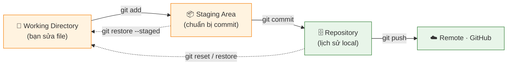
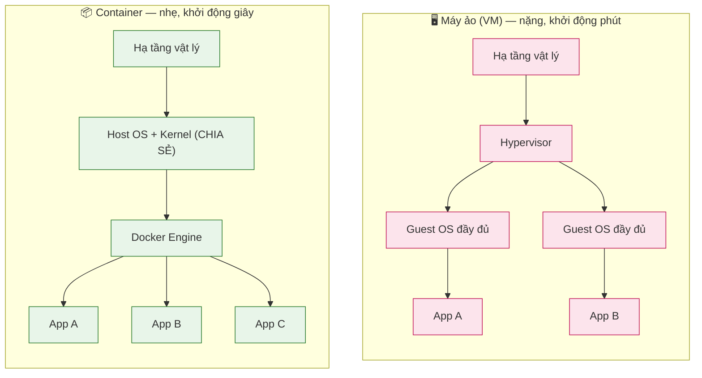
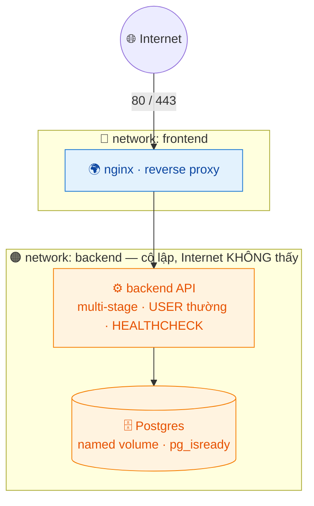
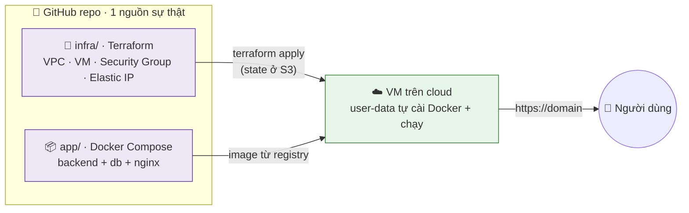

# Giai đoạn 2 — Git, Docker & Container hóa

> **Ngày 13–30** · Quản lý mã nguồn chuyên nghiệp, đóng gói ứng dụng thành container, và lần đầu đưa app lên cloud bằng code.
>
> **Khuôn mỗi ngày:** 📘 Lý thuyết → 🧪 Lab cơ bản → 🚀 Lab nâng cao (best-practice) → 💡 Bổ sung thực tế → 📝 Bài ôn tập.
>
> ✅ Trung lập nền tảng: ví dụ cloud dùng AWS cho cụ thể, nhưng luôn ghi chú **tương đương GCP/Azure** để bạn áp dụng cho bất kỳ nhà cung cấp nào.

---

## Mục lục

| Ngày | Chủ đề |
|------|--------|
| [13](#ngày-13--git-cơ-bản--quản-lý-phiên-bản) | Git cơ bản — Quản lý phiên bản |
| [14](#ngày-14--git-branch-merge--xử-lý-conflict) | Git — Branch, Merge & xử lý Conflict |
| [15](#ngày-15--github-remote-collaboration--pull-request) | GitHub — Remote, Collaboration & Pull Request |
| [16](#ngày-16--docker-khái-niệm--container-đầu-tiên) | Docker — Khái niệm & container đầu tiên |
| [17](#ngày-17--docker-dockerfile--build-image) | Docker — Dockerfile & Build Image |
| [18](#ngày-18--docker-image-tối-ưu--multi-stage-build) | Docker — Image tối ưu & Multi-stage Build |
| [19](#ngày-19--docker-volume-network--dữ-liệu-bền-vững) | Docker — Volume, Network & dữ liệu bền vững |
| [20](#ngày-20--docker-compose--quản-lý-multi-container) | Docker Compose — Quản lý multi-container |
| [21](#ngày-21--milestone--đóng-gói-ứng-dụng-full-stack) | **Milestone — Đóng gói ứng dụng full-stack** |
| [22](#ngày-22--yaml-json--định-dạng-cấu-hình) | YAML, JSON & định dạng cấu hình |
| [23](#ngày-23--reverse-proxy--web-server-nginx-chuyên-sâu) | Reverse Proxy & Web Server (Nginx chuyên sâu) |
| [24](#ngày-24--cơ-sở-dữ-liệu-cho-devops) | Cơ sở dữ liệu cho DevOps |
| [25](#ngày-25--git-nâng-cao--rebase-tag-workflow) | Git nâng cao — Rebase, Tag, Workflow |
| [26](#ngày-26--làm-quen-cloud--khái-niệm--free-tier) | Làm quen Cloud — Khái niệm & Free Tier |
| [27](#ngày-27--máy-chủ-cloud--tạo--quản-lý-vm-ec2) | Máy chủ Cloud — Tạo & quản lý VM (EC2) |
| [28](#ngày-28--triển-khai-app-lên-cloud-docker-trên-vm) | Triển khai App lên Cloud (Docker trên VM) |
| [29](#ngày-29--infrastructure-as-code--giới-thiệu-terraform) | Infrastructure as Code — Giới thiệu Terraform |
| [30](#ngày-30--milestone--lab-tổng-hợp-giai-đoạn-2) | **Milestone — LAB tổng hợp Giai đoạn 2** |

---

## Ngày 13 — Git cơ bản & Quản lý phiên bản

> ⏱️ ~90 phút · Loại: Git
>
> 🧭 **Bạn đang ở đâu:** Giai đoạn 1 (Linux/SysOps) → **Ngày 13 (Git — cỗ máy thời gian cho code)** → Ngày 14 (branch & merge). Đây là ngày mở màn Giai đoạn 2 — Git là công cụ bạn dùng *mỗi ngày* suốt sự nghiệp, nền của mọi CI/CD sau này.
>
> ✅ **Chuẩn bị:** đã cài Git (Ngày 1) và khai báo `user.name`/`user.email`. Một thư mục trống để tập.

### 📘 Lý thuyết

#### 1. Git là gì

**Git** là hệ thống quản lý phiên bản **phân tán** (DVCS) — theo dõi mọi thay đổi của code như một "cỗ máy thời gian". Mỗi lần commit, Git chụp lại toàn bộ trạng thái dự án → quay về bất kỳ điểm nào, xem ai sửa gì, khi nào. Thay cho kiểu đặt tên `baocao_final_v2_that_su_cuoi.docx`.

#### 2. Ba trạng thái — xương sống của Git

| Vùng | Là gì | Đưa vào bằng |
|---|---|---|
| **Working Directory** | Bàn làm việc — nơi bạn sửa file | (bạn sửa file) |
| **Staging Area** | Khay "chuẩn bị đóng gói" — chọn file sẽ lưu | `git add` |
| **Repository** | Kho lịch sử — đóng dấu lưu vĩnh viễn | `git commit` |

Vòng đời: sửa file → `git add` (vào Staging) → `git commit` (vào Repo) → `git push` (lên GitHub).

#### 3. Lệnh cốt lõi

| Lệnh | Làm gì |
|---|---|
| `git init` | Biến thư mục thành repo (tạo `.git`) |
| `git status` | Xem file nào đang ở vùng nào |
| `git add <file>` / `git add .` | Đưa vào staging |
| `git commit -m 'msg'` | Lưu ảnh chụp vào lịch sử |
| `git log --oneline` | Xem lịch sử commit |
| `git diff` / `git show <commit>` | Xem khác biệt / chi tiết 1 commit |

#### 4. `.gitignore` — "đừng theo dõi cái này"

Có file không nên đưa vào Git: secret (`.env`), file rác (`*.log`), thư mục nặng (`node_modules/`). Liệt kê chúng trong `.gitignore` để Git bỏ qua.

#### 5. Quay lui (cứu vãn)

- `git restore <file>` — bỏ thay đổi chưa commit của file.
- `git restore --staged <file>` — gỡ file khỏi staging (chưa mất thay đổi).
- `git reset` / `git revert` / `git reflog` — cứu vãn ở nhiều mức (chi tiết ở 💡 Bổ sung).

**Sơ đồ — vòng đời 1 file qua 3 trạng thái Git:**


### 📖 Hiểu rõ hơn (giải thích cho người mới)

**Git là gì? Vì sao ai làm IT cũng phải biết?**
Git là "cỗ máy thời gian cho code". Mỗi lần bạn lưu (commit), Git chụp lại toàn bộ trạng thái dự án → bạn có thể quay về bất kỳ điểm nào trong quá khứ, xem ai sửa gì, khi nào. Khác hẳn kiểu lưu `baocao_final_v2_thatsu_cuoicung.docx` — Git quản lý lịch sử sạch sẽ và cho nhiều người làm chung 1 dự án mà không đè lên nhau.

**3 vùng — chìa khóa hiểu Git (hơi lạ lúc đầu nhưng rất logic):**
1. **Working Directory** = bàn làm việc, nơi bạn sửa file.
2. **Staging Area** = khay "chuẩn bị đóng gói" — bạn chọn file nào sẽ được lưu (`git add`).
3. **Repository** = kho lịch sử — đóng dấu lưu vĩnh viễn (`git commit`).
→ Vòng đời: sửa file (Working) → `git add` (vào Staging) → `git commit` (vào Repo).

**`.gitignore` — danh sách "đừng theo dõi cái này".**
Có những file không nên đưa vào Git: secret (`.env`), file rác (`*.log`), thư mục nặng (`node_modules/`). Liệt kê chúng trong `.gitignore` để Git bỏ qua.

> 🧠 **Một câu để nhớ:** Git gần như **không bao giờ mất thứ đã commit** — kể cả khi bạn tưởng đã xóa, `git reflog` thường tìm lại được. Nên cứ mạnh dạn commit thường xuyên.

### 🧪 Lab cơ bản

> Mục tiêu: tạo repo, commit nhiều lần, dùng `.gitignore` và xem lịch sử.

**Bước 1 — Tạo repo mới.**
```bash
mkdir my-app && cd my-app
git init
git status        # "No commits yet"
```

**Bước 2 — Commit lần đầu.**
```bash
echo "# My App" > README.md
git add README.md
git commit -m "Khởi tạo dự án"
git log --oneline      # thấy 1 commit
```

**Bước 3 — Commit thêm 2 lần với thay đổi khác nhau.**
```bash
echo "console.log('hi')" > app.js
git add app.js && git commit -m "Thêm app.js"
echo "// ghi chú" >> app.js
git add app.js && git commit -m "Thêm ghi chú vào app.js"
```

**Bước 4 — Dùng `.gitignore`.**
```bash
echo "SECRET=123" > .env
printf ".env\n*.log\n" > .gitignore
git status        # .env KHÔNG xuất hiện
```

**Bước 5 — Xem lịch sử dạng đồ thị.**
```bash
git log --oneline --graph
```
Bạn sẽ thấy danh sách 3 commit theo thứ tự mới → cũ.

### 🚀 Lab nâng cao (best-practice)

> Mục tiêu: tập thói quen commit "sạch" như khi làm trong team thật.

1. **Commit nhỏ, có ý nghĩa** — mỗi commit là 1 thay đổi logic, không gộp 10 việc vào 1 commit. Dùng `git add -p` để stage **từng phần** của file:
   ```bash
   git add -p          # duyệt từng đoạn thay đổi, chọn y/n — commit có chủ đích
   ```
2. **`.gitignore` chuẩn theo ngôn ngữ** — đừng tự viết tay, lấy template chuẩn:
   ```bash
   curl -sL https://www.toptal.com/developers/gitignore/api/node,python,linux > .gitignore
   ```
3. **Viết commit message tốt** (chuẩn 50/72): dòng đầu ≤50 ký tự, mô tả "làm gì", thân commit giải thích "tại sao".
4. **Xem cấu hình & alias hữu ích:**
   ```bash
   git config --global alias.lg "log --oneline --graph --all --decorate"
   git lg              # giờ xem lịch sử đẹp bằng 1 lệnh
   ```

### 💡 Bổ sung thực tế: cứu vãn khi lỡ tay (reset vs revert vs reflog)

> Câu hỏi #1 của người mới: "Tôi lỡ commit/xóa nhầm, làm sao cứu?" — Git gần như **không bao giờ mất dữ liệu đã commit**.

```bash
# Bỏ commit cuối nhưng GIỮ thay đổi trong working dir (sửa lại rồi commit lại)
git reset --soft HEAD~1

# Bỏ thay đổi chưa commit của 1 file (cẩn thận — mất thật)
git restore file.txt

# Hoàn tác 1 commit đã PUSH mà không viết lại lịch sử (an toàn cho nhánh chung)
git revert <commit>

# "Phao cứu sinh": reflog ghi MỌI thao tác, kể cả commit đã reset/xóa
git reflog                       # tìm commit tưởng đã mất
git reset --hard <hash-từ-reflog>  # quay về đúng điểm đó
```
- **reset** = viết lại lịch sử (chỉ dùng trên nhánh **chưa push**).
- **revert** = tạo commit mới đảo ngược (dùng cho nhánh **đã chia sẻ**).
- **reflog** = sổ ghi toàn bộ — nơi tìm lại mọi thứ "tưởng đã mất".

### 🧭 Hướng dẫn làm lab & giải nghĩa lệnh (cho người tự học)

> Làm tuần tự, dừng ở mỗi ✅ **Checkpoint**.

**Bước 1 — Tạo repo và hiểu `git status`.**
```bash
mkdir my-app && cd my-app && git init
git status
```
✅ **Checkpoint:** thấy `No commits yet`.
💡 `git init` tạo thư mục ẩn `.git` — đó là "bộ não" lưu toàn bộ lịch sử.

**Bước 2 — Đi qua 3 vùng bằng mắt.**
```bash
echo "hi" > a.txt
git status                # a.txt màu đỏ (Untracked — ở Working Directory)
git add a.txt
git status                # a.txt màu xanh (Staged)
git commit -m "thêm a.txt"
git status                # working tree clean (đã vào Repository)
```
✅ **Checkpoint:** thấy file đổi trạng thái đỏ → xanh → clean.

**Bước 3 — Xác minh `.gitignore` hoạt động.**
```bash
echo "SECRET=1" > .env && printf ".env\n" > .gitignore
git status                # .env KHÔNG xuất hiện
```
✅ **Checkpoint:** `.env` bị ẩn khỏi danh sách.

**Bước 4 — Tập cứu vãn.**
```bash
echo "sai" >> a.txt
git restore a.txt         # bỏ thay đổi chưa commit
cat a.txt                 # dòng "sai" biến mất
```
✅ **Checkpoint:** file trở về trạng thái đã commit.
💡 Biết file đang ở **vùng nào** quyết định dùng lệnh cứu nào (restore/reset/revert).

### 🐛 Gỡ lỗi nhanh

**🔧 Phao cứu sinh:** `git reflog` ghi MỌI thao tác — commit tưởng đã mất thường tìm lại được. Git gần như không mất thứ đã commit.

| Triệu chứng | Nguyên nhân | Cách sửa |
|---|---|---|
| `Author identity unknown` khi commit | Chưa khai `user.name`/`user.email` | `git config --global user.name/.email` (Ngày 1) |
| Lỡ `git add` file không nên | File vào staging | `git restore --staged <file>` (chưa mất thay đổi) |
| Lỡ commit thiếu/sai message | Commit cuối chưa push | `git commit --amend` sửa lại |
| Lỡ `git reset --hard` mất commit | Reset quá tay | `git reflog` tìm hash → `git reset --hard <hash>` |
| Đã commit nhầm `.env` | `.gitignore` thêm sau khi commit | `git rm --cached .env`; **đổi secret ngay** |

### 📝 Bài ôn tập & Demo đối chiếu

**✍️ Tự kiểm tra:**

<details>
<summary>1. Mô tả vòng đời 1 file qua 3 trạng thái Git.</summary>

> Sửa file (Working Directory) → `git add` (Staging Area) → `git commit` (Repository) → `git push` (Remote/GitHub).
</details>

<details>
<summary>2. Vì sao cần `.gitignore`? Cho 3 ví dụ.</summary>

> Để không đưa file không nên vào Git: `.env` (secret), `*.log` (rác), `node_modules/` (nặng, tái tạo được).
</details>

<details>
<summary>3. `git add` và `git commit` khác nhau thế nào?</summary>

> `git add` đưa file vào **staging** (chọn cái sẽ lưu). `git commit` mới thực sự **lưu** ảnh chụp vào lịch sử.
</details>

<details>
<summary>4. Lỡ `git reset --hard` mất commit, cứu bằng gì?</summary>

> `git reflog` để tìm hash của commit đã mất, rồi `git reset --hard <hash>` quay về.
</details>

**🔬 Demo đối chiếu:**

| Demo đối chiếu | Kết quả mong đợi |
|---|---|
| `git log` sau commit đầu | Hiện commit với message của bạn |
| `git status` (sau commit) | `working tree clean` |
| `git status` (có `.gitignore`) | `.env` không xuất hiện |

### 📚 Thuật ngữ Anh–Việt (ngày này)

| Thuật ngữ | Nghĩa |
|---|---|
| **Repository (repo)** | Kho chứa code + lịch sử |
| **Commit** | Một ảnh chụp trạng thái được lưu |
| **Staging area** | Khu vực chuẩn bị file cho commit |
| **Working directory** | Thư mục làm việc — nơi sửa file |
| **`.gitignore`** | Danh sách file Git bỏ qua |
| **HEAD** | Con trỏ "đang ở commit nào" |
| **reflog** | Sổ ghi mọi thao tác — nơi cứu commit mất |

✅ **Kết quả đạt được:** Quản lý phiên bản code cục bộ thành thạo với Git (3 vùng, commit, gitignore, cứu vãn).

---

## Ngày 14 — Git: Branch, Merge & xử lý Conflict

> ⏱️ ~90 phút · Loại: Git
>
> 🧭 **Bạn đang ở đâu:** Ngày 13 (Git cơ bản) → **Ngày 14 (nhánh, merge, xử lý xung đột)** → Ngày 15 (GitHub & Pull Request). Nhánh là cách cả team làm chung 1 dự án mà không giẫm chân nhau — kỹ năng cộng tác cốt lõi.
>
> ✅ **Chuẩn bị:** một repo Git đã có vài commit (từ Ngày 13).

### 📘 Lý thuyết

#### 1. Branch (nhánh) — "vũ trụ song song" của code

Muốn thử tính năng mới nhưng sợ hỏng code đang chạy? Tạo một **nhánh** — bản sao song song để thử thoải mái. Hỏng thì vứt nhánh; ổn thì **merge** (gộp) về nhánh chính (`main`). Nhánh chỉ là 1 con trỏ tới commit → tạo/xoá cực rẻ, đừng ngại tạo.

| Lệnh | Làm gì |
|---|---|
| `git branch` | Liệt kê nhánh (dấu `*` = đang ở) |
| `git switch -c <tên>` | Tạo + chuyển sang nhánh mới |
| `git switch <tên>` | Chuyển nhánh |
| `git branch -d <tên>` | Xoá nhánh (đã merge); `-D` = ép xoá |

#### 2. Merge — hợp nhất nhánh

`git merge <nhánh>` gộp `<nhánh>` vào nhánh hiện tại. Hai kiểu:
- **Fast-forward:** main không đổi từ khi tách → chỉ "dời con trỏ" tới, lịch sử thẳng.
- **3-way merge:** cả hai nhánh đều có commit mới → Git tạo 1 "merge commit" gộp lại.

#### 3. Conflict (xung đột) — nghe sợ nhưng đơn giản

Khi 2 nhánh sửa **cùng một dòng**, Git không biết giữ bản nào → nhờ bạn quyết. Nó đánh dấu trong file:
```
<<<<<<< HEAD
dòng của bạn (nhánh hiện tại)
=======
dòng của họ (nhánh đang merge vào)
>>>>>>> feature-x
```
Bạn xoá các dấu, giữ lại đoạn đúng, rồi `git add` + `git commit`. Xong.

#### 4. `git stash` — cất tạm

Đang sửa dở mà cần chuyển nhánh gấp? `git stash` cất thay đổi vào "ngăn kéo", chuyển nhánh xong `git stash pop` lấy lại.

#### 5. Workflow feature branch

Mỗi tính năng 1 nhánh (`feature/login`), làm xong merge về `main` (qua review — học ở Ngày 15). **Quy tắc vàng:** nhánh sống *càng ngắn càng tốt* — nhánh để cả tháng = conflict khủng khiếp khi merge.

### 📖 Hiểu rõ hơn (giải thích cho người mới)

**Branch (nhánh) — như vũ trụ song song của code.**
Tưởng tượng bạn muốn thử một tính năng mới nhưng sợ làm hỏng code đang chạy. Bạn tạo 1 **nhánh** — bản sao song song để thử thoải mái. Làm xong: hỏng thì vứt nhánh đó đi; ổn thì **merge** (gộp) trở lại nhánh chính (`main`). Code chính luôn an toàn.

**Vì sao nên dùng nhánh cho mỗi tính năng?**
Trong team, mỗi người làm 1 nhánh riêng → không giẫm chân nhau. Tạo/xóa nhánh trong Git cực rẻ (chỉ là 1 con trỏ), nên đừng ngại tạo.

**Conflict (xung đột) — nghe đáng sợ nhưng đơn giản.**
Khi 2 nhánh sửa **cùng một dòng**, Git không biết giữ bản nào → nhờ bạn quyết định. Nó đánh dấu `<<<<<<<` (phần của bạn) `=======` `>>>>>>>` (phần của họ). Bạn chỉ việc xóa các dấu, giữ lại đoạn đúng, rồi `git add` + `git commit`. Xong.

**`git stash` — "cất tạm".**
Đang sửa dở mà cần chuyển nhánh gấp? `git stash` cất tạm thay đổi vào ngăn kéo; chuyển nhánh xong `git stash pop` lấy lại.

> 🧠 **Một câu để nhớ:** nhánh sống **càng ngắn càng tốt**. Nhánh để cả tháng = hội conflict khủng khiếp khi merge. Làm xong tính năng → merge ngay.

### 🧪 Lab cơ bản

> Mục tiêu: tạo nhánh, merge, và **cố tình tạo conflict rồi tự giải quyết** để hết sợ.

**Bước 1 — Tạo nhánh feature và commit.**
```bash
git switch -c feature-login
echo "login()" > login.js
git add login.js && git commit -m "Thêm login"
git branch          # thấy * feature-login
```

**Bước 2 — Merge về main.**
```bash
git switch main
git merge feature-login
git log --oneline --graph
```

**Bước 3 — Cố tình tạo conflict để tập xử lý.**
```bash
git switch -c feature-a && echo "màu XANH" > style.txt && git commit -am "xanh"
git switch main && echo "màu ĐỎ" > style.txt && git commit -am "đỏ"
git merge feature-a       # → CONFLICT ở style.txt
```
Mở `style.txt`, xoá các dấu `<<<<<<<`, `=======`, `>>>>>>>`, giữ dòng bạn muốn, rồi:
```bash
git add style.txt && git commit -m "Giải quyết conflict style"
```

**Bước 4 — Tập `git stash`.**
```bash
echo "đang dở" >> login.js
git stash              # cất tạm
git switch feature-login
git switch main
git stash pop          # lấy lại thay đổi
```

**Bước 5 — Dọn nhánh đã merge.**
```bash
git branch -d feature-login feature-a
git branch             # danh sách gọn lại
```

### 🚀 Lab nâng cao (best-practice)

> Mục tiêu: làm việc với nhánh như trong team, hạn chế conflict và merge sạch.

1. **Đặt tên nhánh có quy ước:** `feature/login`, `fix/null-pointer`, `chore/update-deps` — đọc là biết mục đích.
2. **Cập nhật nhánh trước khi merge** để giảm conflict:
   ```bash
   git switch feature/login
   git fetch origin
   git rebase origin/main      # đưa feature lên trên main mới nhất
   ```
3. **Dùng merge tool khi conflict phức tạp:**
   ```bash
   git config --global merge.tool vimdiff   # hoặc VS Code: code --wait
   git mergetool
   ```
4. **`git stash` có tên** khi cất nhiều thứ:
   ```bash
   git stash push -m "đang dở phần validate form"
   git stash list; git stash apply stash@{0}
   ```

### 💡 Bổ sung thực tế: hiểu HEAD, detached HEAD & chiến lược nhánh

- **HEAD** là con trỏ "bạn đang ở đâu". `git switch <commit-hash>` đưa bạn vào trạng thái **detached HEAD** (không trên nhánh nào) — commit ở đây sẽ mất nếu không tạo nhánh. Cách thoát: `git switch -c nhánh-mới`.
- **3 chiến lược nhánh phổ biến** (sẽ chọn ở Ngày 25):
  | Chiến lược | Phù hợp |
  |---|---|
  | **GitHub Flow** | nhánh ngắn từ main, deploy liên tục — đa số dự án web |
  | **Git Flow** | có develop/release/hotfix — sản phẩm có nhiều phiên bản |
  | **Trunk-based** | commit thẳng main + feature flag — team CI/CD trưởng thành |
- **Quy tắc vàng giảm đau:** nhánh sống **càng ngắn càng tốt**. Nhánh tồn tại 2 tuần = hội conflict khủng khiếp khi merge.

### 🧭 Hướng dẫn làm lab & giải nghĩa lệnh (cho người tự học)

> Làm tuần tự, dừng ở mỗi ✅ **Checkpoint**. Trọng tâm: hết sợ conflict.

**Bước 1 — Tạo & chuyển nhánh.**
```bash
git switch -c feature-login
git branch
```
✅ **Checkpoint:** dấu `*` nằm ở `feature-login`.

**Bước 2 — Merge và xem đồ thị.**
```bash
git switch main && git merge feature-login
git log --oneline --graph
```
✅ **Checkpoint:** lịch sử cho thấy nhánh đã hợp nhất vào main.

**Bước 3 — Trải nghiệm giải quyết conflict.** (làm theo Lab Bước 3)
```bash
git status        # sau khi merge conflict: "Unmerged paths: style.txt"
# sửa file, xoá dấu <<< === >>>
git add style.txt && git commit
git status        # "working tree clean"
```
✅ **Checkpoint:** sau khi sửa + add + commit → `working tree clean`.
💡 Conflict không đáng sợ — chỉ là Git hỏi "giữ phần nào". Bạn quyết, xoá dấu, commit.

**Bước 4 — Hiểu HEAD & detached HEAD.**
```bash
git switch <một-commit-hash>     # vào detached HEAD
git switch main                  # quay lại nhánh
```
✅ **Checkpoint:** hiểu commit tạo ở detached HEAD sẽ mất nếu không `git switch -c` tạo nhánh.

### 🐛 Gỡ lỗi nhanh

| Triệu chứng | Nguyên nhân | Cách sửa |
|---|---|---|
| `CONFLICT (content)` khi merge | 2 nhánh sửa cùng dòng | Mở file, xoá dấu `<<< === >>>`, giữ đúng, `git add` + `git commit` |
| `git branch -d` báo `not fully merged` | Nhánh chưa merge, sợ mất việc | Merge trước; hoặc chắc chắn bỏ thì `-D` (ép xoá) |
| Lỡ vào "detached HEAD" | `switch` tới commit hash | `git switch -c nhánh-moi` để giữ commit, hoặc `git switch main` |
| Sửa dở, cần đổi nhánh gấp | Git chặn switch khi có thay đổi | `git stash` cất tạm → switch → `git stash pop` |
| Merge nhầm nhánh | Chưa push | `git merge --abort` (khi đang conflict) hoặc `git reset --hard HEAD~1` |

### 📝 Bài ôn tập & Demo đối chiếu

**✍️ Tự kiểm tra:**

<details>
<summary>1. Viết chuỗi lệnh: tạo nhánh hotfix, sửa, merge vào main.</summary>

> `git switch -c hotfix` → sửa file → `git commit -am "fix"` → `git switch main` → `git merge hotfix`.
</details>

<details>
<summary>2. Các dấu `<<<<<<<` `=======` `>>>>>>>` khi conflict nghĩa là gì?</summary>

> `<<<<<<< HEAD` đến `=======` là phần của nhánh hiện tại; `=======` đến `>>>>>>>` là phần của nhánh đang merge vào. Xoá dấu, giữ đoạn đúng.
</details>

<details>
<summary>3. `git stash` dùng khi nào?</summary>

> Khi đang sửa dở (chưa muốn commit) mà cần chuyển nhánh gấp. Cất tạm bằng `stash`, xong việc `stash pop` lấy lại.
</details>

<details>
<summary>4. Vì sao nên giữ nhánh sống ngắn?</summary>

> Nhánh càng lâu, càng khác main nhiều → merge càng dễ conflict lớn. Làm xong tính năng merge ngay.
</details>

**🔬 Demo đối chiếu:**

| Demo đối chiếu | Kết quả mong đợi |
|---|---|
| Tạo & chuyển nhánh | `git branch` hiện `* feature/...` |
| Merge vào main | `git log --graph` thấy nhánh đã hợp nhất |
| Giải quyết conflict | Sau khi sửa, `git status` → all conflicts fixed |

### 📚 Thuật ngữ Anh–Việt (ngày này)

| Thuật ngữ | Nghĩa |
|---|---|
| **Branch** | Nhánh — dòng phát triển song song |
| **Merge** | Hợp nhất nhánh này vào nhánh kia |
| **Conflict** | Xung đột khi 2 nhánh sửa cùng dòng |
| **Fast-forward** | Merge chỉ dời con trỏ (lịch sử thẳng) |
| **stash** | Cất tạm thay đổi chưa commit |
| **Detached HEAD** | Đang ở 1 commit, không trên nhánh nào |
| **Feature branch** | Nhánh riêng cho mỗi tính năng |

✅ **Kết quả đạt được:** Làm việc với nhánh, merge và xử lý conflict tự tin — kỹ năng cộng tác thiết yếu.

---

## Ngày 15 — GitHub: Remote, Collaboration & Pull Request

> ⏱️ ~90 phút · Loại: Git
>
> 🧭 **Bạn đang ở đâu:** Ngày 14 (branch/merge cục bộ) → **Ngày 15 (đưa code lên mây + cộng tác qua Pull Request)** → Ngày 16 (Docker). Đây là quy trình team thật — và chính là cái bạn sẽ *tự động hoá* bằng CI/CD ở Giai đoạn 3.
>
> ✅ **Chuẩn bị:** repo `my-app` local (Ngày 13), tài khoản GitHub + SSH key kết nối được (Ngày 1/8).

### 📘 Lý thuyết

#### 1. Git vs GitHub — đừng nhầm

- **Git** = công cụ chạy trên máy bạn, quản lý lịch sử code (offline vẫn dùng).
- **GitHub** = dịch vụ web *lưu trữ* repo Git trên mây + tính năng cộng tác (PR, issue, CI/CD).
- Ví von: Git là Word, GitHub là Google Docs (lưu online + chia sẻ).

#### 2. Remote — kết nối repo local với GitHub

| Lệnh | Làm gì |
|---|---|
| `git remote add origin <url>` | Gắn repo local với repo GitHub (`origin` = biệt danh mặc định) |
| `git push -u origin main` | Đẩy commit lên, `-u` để nhớ liên kết |
| `git pull` | Kéo thay đổi về (= `fetch` tải về + `merge` gộp) |
| `git fetch` | Chỉ tải về, KHÔNG gộp (an toàn để xem trước) |
| `git clone <url>` | Sao chép repo về máy |

#### 3. Pull Request (PR) — trái tim của cộng tác

Thay vì sửa thẳng nhánh chính, bạn mở một **PR** = *"đề nghị gộp nhánh của tôi vào main, mọi người xem giúp"*. Người khác **review** (comment, yêu cầu sửa, approve) → rồi mới merge. Đây là cách team đảm bảo chất lượng code.

#### 4. GitHub flow — quy trình chuẩn

```
branch → commit → push → mở PR → review → merge → xoá nhánh
```

#### 5. Công cụ hỗ trợ cộng tác

- **Issue**: phiếu ghi việc/bug/tính năng, gắn label để phân loại.
- **README.md**: "bộ mặt" repo (viết bằng Markdown) — mô tả, cách cài, cách chạy.
- **Fork**: sao chép repo người khác về tài khoản mình để đóng góp (open-source).

> 🔑 Lỡ đẩy secret lên GitHub = coi như **lộ vĩnh viễn** (còn trong lịch sử/cache). Việc cần làm không phải xoá commit, mà **đổi (rotate) secret đó ngay**.

### 📖 Hiểu rõ hơn (giải thích cho người mới)

**Git vs GitHub — khác nhau (nhiều người nhầm):**
- **Git** = công cụ chạy trên máy bạn, quản lý lịch sử code (offline vẫn dùng được).
- **GitHub** = dịch vụ web *lưu trữ* repo Git trên mây + thêm tính năng cộng tác (PR, issue, CI/CD). Ví von: Git là Word, GitHub là Google Docs (lưu online + chia sẻ).

**Remote, push, pull — đồng bộ code lên mây:**
- `git remote add origin <url>` = "kết nối repo trên máy với repo trên GitHub" (`origin` là biệt danh mặc định).
- `git push` = đẩy commit từ máy **lên** GitHub.
- `git pull` = kéo thay đổi **về** máy (= `fetch` tải về + `merge` gộp).

**Pull Request (PR) — trái tim của cộng tác.**
Thay vì sửa thẳng nhánh chính, bạn mở 1 **PR** = "đề nghị gộp nhánh của tôi vào main, mọi người xem giúp". Người khác review, góp ý, duyệt → rồi mới merge. Đây là cách team đảm bảo chất lượng code.

> 🧠 **Một câu để nhớ:** lỡ đẩy secret (mật khẩu/token) lên GitHub = coi như **lộ vĩnh viễn** (còn trong lịch sử). Việc cần làm không phải xóa commit, mà **đổi (rotate) secret đó ngay**.

### 🧪 Lab cơ bản

> Mục tiêu: đưa repo lên GitHub và đi trọn 1 vòng Pull Request.

**Bước 1 — Tạo repo trên GitHub** (nút **New**, đặt tên `my-app`, để trống — đừng thêm README để khỏi conflict).

**Bước 2 — Kết nối và đẩy lên.**
```bash
cd my-app
git remote add origin git@github.com:<username>/my-app.git
git push -u origin main
```
Tải lại trang GitHub → thấy code đã lên.

**Bước 3 — Viết README.md.**
```bash
nano README.md      # mô tả 1 dòng + cách cài + cách chạy
git add README.md && git commit -m "Thêm README" && git push
```

**Bước 4 — Đi trọn 1 vòng Pull Request.**
```bash
git switch -c feature/doc
echo "## Hướng dẫn" >> README.md
git commit -am "Bổ sung hướng dẫn" && git push -u origin feature/doc
```
Trên GitHub → nút **Compare & pull request** → mô tả → **Create PR** → **Merge**.

**Bước 5 — Tạo 1 Issue và clone thử 1 repo công khai.**
```bash
git clone https://github.com/git/git.git /tmp/git-source
```
Trên GitHub, mở tab **Issues → New issue**, mô tả 1 tính năng, gắn label.

### 🚀 Lab nâng cao (best-practice)

> Mục tiêu: thiết lập repo như một dự án nghiêm túc, có bảo vệ và tự động hóa cộng tác.

1. **Branch protection cho `main`** (Settings → Branches): bắt buộc PR, bắt buộc review, không cho push thẳng. → không ai (kể cả bạn) phá nhánh chính.
2. **PR template** (`.github/pull_request_template.md`) — chuẩn hóa mô tả PR: làm gì, test thế nào, ảnh hưởng gì.
3. **CODEOWNERS** (`.github/CODEOWNERS`) — tự gán người review theo thư mục.
4. **Dùng `gh` CLI** để làm việc nhanh không rời terminal:
   ```bash
   gh pr create --fill          # tạo PR từ nhánh hiện tại
   gh pr checks                 # xem CI pass chưa
   gh pr merge --squash         # merge gọn lịch sử
   ```

### 💡 Bổ sung thực tế: SSH vs HTTPS, fork workflow & viết README "ăn điểm"

- **Remote dùng SSH thay HTTPS** để khỏi nhập token mỗi lần (đã tạo key ở Ngày 1/8):
  ```bash
  git remote set-url origin git@github.com:user/repo.git
  ```
- **Fork workflow** (đóng góp open-source): fork → clone bản fork → thêm remote `upstream` trỏ repo gốc → `git fetch upstream` để đồng bộ → PR từ fork về gốc.
- **README tối thiểu nên có:** mô tả 1 dòng · ảnh/demo · cách cài đặt · cách chạy · cấu trúc thư mục · giấy phép. README tốt = người khác (và bạn 6 tháng sau) chạy được ngay.
- **Quy tắc bảo mật:** nếu lỡ push secret lên GitHub → **coi như đã lộ vĩnh viễn**, phải **xoay (rotate) ngay** secret đó, không chỉ xóa commit (lịch sử vẫn còn ở fork/cache).

### 🧭 Hướng dẫn làm lab & giải nghĩa lệnh (cho người tự học)

> Làm tuần tự, dừng ở mỗi ✅ **Checkpoint**.

**Bước 1 — Kết nối và đẩy lần đầu.**
```bash
git remote add origin git@github.com:<username>/my-app.git
git remote -v          # kiểm tra URL
git push -u origin main
```
✅ **Checkpoint:** GitHub hiển thị code của bạn.
💡 `-u` liên kết nhánh local với remote, từ đó chỉ cần gõ `git push` là đủ.

**Bước 2 — Hiểu `fetch` vs `pull`.**
```bash
git fetch origin       # chỉ TẢI về, không đụng code đang làm
git pull               # tải + gộp (= fetch + merge)
```
✅ **Checkpoint:** hiểu `fetch` an toàn để xem trước, `pull` gộp luôn.

**Bước 3 — Mở Pull Request (theo Lab Bước 4).**
✅ **Checkpoint:** tab **Pull requests** hiện PR đang mở; sau khi merge, nhánh feature gộp vào main.

**Bước 4 — (Nâng cao) bật Branch protection.**
Settings → Branches → thêm rule cho `main` (bắt buộc PR). Thử `git push` thẳng vào main → **bị chặn**.
✅ **Checkpoint:** không ai (kể cả bạn) push thẳng được vào `main`.

### 🐛 Gỡ lỗi nhanh

| Triệu chứng | Nguyên nhân | Cách sửa |
|---|---|---|
| `push` hỏi username/password | Remote dùng HTTPS thay SSH | `git remote set-url origin git@github.com:user/repo.git` |
| `Permission denied (publickey)` | SSH key chưa lên GitHub | Ôn Ngày 1/8: thêm `.pub` vào GitHub |
| `Updates were rejected (fetch first)` | Remote có commit bạn chưa có | `git pull` (gộp) rồi `push` lại |
| `push` bị chặn vào `main` | Branch protection đang bật (đúng ý!) | Mở PR thay vì push thẳng |
| Lỡ push secret | Lộ vĩnh viễn trong lịch sử | **Rotate secret ngay**; thêm `.gitignore`; cân nhắc `git filter-repo` |

### 📝 Bài ôn tập & Demo đối chiếu

**✍️ Tự kiểm tra:**

<details>
<summary>1. `git fetch` và `git pull` khác nhau thế nào?</summary>

> `fetch` chỉ tải commit mới về (không đụng code đang làm). `pull` = `fetch` + `merge` (gộp luôn vào nhánh hiện tại).
</details>

<details>
<summary>2. Quy trình GitHub flow gồm những bước nào?</summary>

> branch → commit → push → mở PR → review → merge → xoá nhánh.
</details>

<details>
<summary>3. Pull Request dùng để làm gì?</summary>

> Đề nghị gộp nhánh vào main và để đồng đội **review** (góp ý, duyệt) trước khi merge — đảm bảo chất lượng, không sửa thẳng nhánh chính.
</details>

<details>
<summary>4. Lỡ push secret lên GitHub thì làm gì đầu tiên?</summary>

> **Đổi (rotate) secret đó ngay** — vì nó đã lộ vĩnh viễn trong lịch sử. Xoá commit là chưa đủ.
</details>

**🔬 Demo đối chiếu:**

| Demo đối chiếu | Kết quả mong đợi |
|---|---|
| `git push` | Repo online cập nhật commit mới |
| Tạo 1 PR | Tab Pull requests hiện PR đang mở |
| `git clone <url>` | Thư mục project xuất hiện |

### 📚 Thuật ngữ Anh–Việt (ngày này)

| Thuật ngữ | Nghĩa |
|---|---|
| **Remote / origin** | Repo trên server / tên mặc định của remote |
| **push / pull / fetch** | Đẩy lên / kéo về (fetch+merge) / chỉ tải về |
| **clone** | Sao chép repo về máy |
| **Pull Request (PR)** | Đề nghị gộp nhánh + để review |
| **Code review** | Đọc & góp ý code trước khi merge |
| **Fork** | Sao chép repo người khác về tài khoản mình |
| **Branch protection** | Quy tắc bảo vệ nhánh chính |

✅ **Kết quả đạt được:** Cộng tác qua GitHub, đi trọn vòng PR, viết README — sẵn sàng làm việc nhóm thực tế.

---

## Ngày 16 — Docker: Khái niệm & container đầu tiên

> ⏱️ ~90 phút · Loại: Docker
>
> 🧭 **Bạn đang ở đâu:** Ngày 13–15 (Git/GitHub) → **Ngày 16 (Docker — đóng gói app vào "hộp" chạy đâu cũng giống nhau)** → Ngày 17 (tự viết Dockerfile). Docker giải quyết dứt điểm bệnh "works on my machine" — nền tảng của mọi thứ container/K8s về sau.
>
> ✅ **Chuẩn bị:** cài Docker (Docker Desktop, hoặc trên Linux theo docs.docker.com), kiểm tra `docker --version` chạy được.

### 📘 Lý thuyết

#### 1. Vấn đề Docker giải quyết

App chạy ngon trên máy bạn nhưng lên server thì lỗi (thiếu thư viện, khác phiên bản, khác cấu hình) — bệnh *"works on my machine"*. **Docker** đóng gói app *cùng mọi thứ nó cần* vào 1 "hộp" (**container**) → hộp chạy giống hệt nhau ở mọi nơi.

#### 2. Container vs Máy ảo (VM)

| | Máy ảo (VM) | Container |
|---|---|---|
| Đóng gói | Cả 1 hệ điều hành riêng | Chỉ app + thư viện |
| Kernel | Riêng từng VM | **Dùng chung kernel host** |
| Nặng | GB, khởi động phút | MB, khởi động **giây** |
| Ví như | Căn nhà riêng | Căn hộ chung cư |

#### 3. Image vs Container — dễ nhầm nhất

- **Image** = khuôn mẫu **chỉ đọc** (như khuôn bánh / file cài đặt).
- **Container** = một bản **đang chạy** của image (cái bánh làm từ khuôn). Từ 1 image chạy được nhiều container.
- **Docker Hub** = kho chứa image công khai (registry) để `pull` về.

#### 4. Lệnh cơ bản

| Lệnh | Làm gì |
|---|---|
| `docker run <image>` | Tạo + chạy container |
| `docker ps` / `docker ps -a` | Container đang chạy / kể cả đã dừng |
| `docker stop/start/rm <ct>` | Dừng / chạy lại / xoá container |
| `docker images` / `docker rmi` | Liệt kê / xoá image |
| `docker logs <ct>` | Xem log container |
| `docker exec -it <ct> bash` | Vào shell bên trong container |

#### 5. Cờ hay dùng khi `docker run`

- `-d` chạy nền (detached); `--name web` đặt tên.
- `-p 8080:80` map **cổng host : cổng container** (mở `localhost:8080` → tới cổng 80 trong container).
- `-v host_path:container_path` gắn volume để lưu dữ liệu bền vững (Ngày 19).

> 🔑 Container **sống nhờ tiến trình chính (PID 1)**. Tiến trình đó kết thúc → container tắt. Vì thế `docker run ubuntu` thoát ngay (không có gì chạy) còn `nginx` thì sống.

**Sơ đồ — Container vs Máy ảo (vì sao container nhẹ hơn):**


### 📖 Hiểu rõ hơn (giải thích cho người mới)

**Vấn đề Docker giải quyết — "works on my machine".**
App chạy ngon trên máy bạn nhưng lên server thì lỗi vì thiếu thư viện, khác phiên bản, khác cấu hình. **Docker** đóng gói app *cùng tất cả thứ nó cần* (thư viện, runtime, cấu hình) vào 1 "hộp" gọi là **container** — hộp này chạy giống hệt nhau ở mọi nơi.

**Container vs Máy ảo (VM) — vì sao container nhẹ?**
- **VM** = một máy tính ảo hoàn chỉnh, mỗi VM cõng cả 1 hệ điều hành riêng → nặng (GB), khởi động vài phút.
- **Container** = chỉ đóng gói app + thư viện, **dùng chung kernel** máy chủ → nhẹ (MB), khởi động vài giây.
Hình dung: VM là *căn nhà riêng* (móng, tường, mái riêng); container là *căn hộ chung cư* (dùng chung hạ tầng tòa nhà).

**Image vs Container — khái niệm dễ nhầm nhất:**
- **Image** = khuôn mẫu, chỉ đọc (như khuôn bánh, hoặc file cài đặt).
- **Container** = một bản đang chạy của image (như cái bánh làm ra từ khuôn). Từ 1 image chạy được nhiều container.

> 🧠 **Một câu để nhớ:** container sống nhờ "tiến trình chính" của nó. Khi tiến trình đó kết thúc, container tắt. Đây là lý do `docker run ubuntu` thoát ngay (không có gì chạy) còn nginx thì sống.

### 🧪 Lab cơ bản

> Mục tiêu: chạy container đầu tiên, map cổng, vào trong container, xem log và dọn dẹp.

**Bước 1 — Xác nhận Docker chạy.**
```bash
docker --version
docker run hello-world
```
Bạn sẽ thấy `Hello from Docker!` — xác nhận Docker hoạt động.

**Bước 2 — Chạy nginx và mở trên trình duyệt.**
```bash
docker run -d -p 8080:80 --name web nginx
docker ps        # thấy container "web" đang chạy
```
Mở `http://localhost:8080` → trang **Welcome to nginx!**.

**Bước 3 — Vào bên trong container.**
```bash
docker exec -it web bash
# bên trong: ls /usr/share/nginx/html ; cat /etc/nginx/nginx.conf | head
exit
```

**Bước 4 — Xem log.**
```bash
docker logs web         # thấy log request khi bạn mở trình duyệt
```

**Bước 5 — Dọn dẹp.**
```bash
docker stop web
docker rm web
docker ps -a            # không còn "web"
```

### 🚀 Lab nâng cao (best-practice)

> Mục tiêu: dùng Docker gọn gàng, không để rác chiếm đầy đĩa (lỗi kinh điển sau vài tuần).

1. **Chạy không cần root** — thêm user vào nhóm docker (an toàn hơn `sudo docker`):
   ```bash
   sudo usermod -aG docker $USER   # đăng xuất/đăng nhập lại
   ```
2. **Luôn đặt tên + giới hạn tài nguyên** cho container:
   ```bash
   docker run -d --name web --memory=256m --cpus=0.5 -p 8080:80 nginx
   ```
3. **Dọn rác định kỳ** — image/volume mồ côi ngốn đĩa khủng khiếp:
   ```bash
   docker system df            # xem Docker đang chiếm bao nhiêu đĩa
   docker system prune -a      # dọn image/container/network không dùng
   docker volume prune         # dọn volume mồ côi (cẩn thận dữ liệu!)
   ```
4. **Pin phiên bản image** — `nginx:1.27-alpine` thay vì `nginx:latest` (latest thay đổi bất ngờ, vỡ build).

### 💡 Bổ sung thực tế: kiến trúc Docker & đọc lỗi thường gặp

- **Kiến trúc:** Docker CLI → Docker daemon (dockerd) → containerd → runc. Hiểu điều này giúp bạn debug khi "docker không phản hồi" (thường là daemon chết: `systemctl status docker`).
- **3 lỗi người mới gặp nhiều nhất:**
  | Lỗi | Nguyên nhân & cách xử lý |
  |---|---|
  | `port is already allocated` | Cổng host đã bị chiếm → đổi port hoặc `docker ps` tìm container cũ |
  | `no space left on device` | Image/volume rác → `docker system prune -a` |
  | Container `Exited (0/1)` ngay lập tức | Tiến trình chính kết thúc → xem `docker logs <name>` |
- **Container sống nhờ tiến trình foreground:** container dừng khi tiến trình PID 1 thoát. Đây là lý do `docker run ubuntu` thoát ngay (không có gì chạy), còn `nginx` thì sống (nginx chạy foreground).

### 🧭 Hướng dẫn làm lab & giải nghĩa lệnh (cho người tự học)

> Làm tuần tự, dừng ở mỗi ✅ **Checkpoint**.

**Bước 1 — Chạy nginx nền + map cổng.**
```bash
docker run -d -p 8080:80 --name web nginx
docker ps
```
✅ **Checkpoint:** `docker ps` hiện `web` với `0.0.0.0:8080->80/tcp`, mở `localhost:8080` ra trang nginx.
💡 `-p 8080:80` = "khách gõ cổng 8080 của máy → chuyển vào cổng 80 trong container".

**Bước 2 — Hiểu "container sống nhờ tiến trình chính".**
```bash
docker run --name u ubuntu        # thoát NGAY (Exited)
docker ps -a | grep u             # thấy STATUS Exited (0)
```
✅ **Checkpoint:** container ubuntu ở trạng thái `Exited` ngay, còn `web` (nginx) vẫn `Up`.
💡 ubuntu không có tiến trình foreground nào → PID 1 kết thúc → container tắt. nginx chạy foreground nên sống.

**Bước 3 — Vào trong container xem thực tế.**
```bash
docker exec -it web bash
ls /usr/share/nginx/html ; exit
```
✅ **Checkpoint:** vào được shell, thấy file `index.html`.

**Bước 4 — Dọn dẹp gọn gàng.**
```bash
docker stop web && docker rm web u
docker system df        # xem Docker đang chiếm bao nhiêu đĩa
```
✅ **Checkpoint:** `docker ps -a` không còn container lab.
💡 `docker system prune -a` dọn image/container rác — chạy định kỳ kẻo đầy đĩa.

### 🐛 Gỡ lỗi nhanh

| Triệu chứng | Nguyên nhân | Cách sửa |
|---|---|---|
| `port is already allocated` | Cổng host đã bị container khác giữ | Đổi cổng (`-p 8081:80`) hoặc `docker ps` tìm & dừng cái cũ |
| Container `Exited (0)` ngay | Không có tiến trình foreground | Bình thường với ubuntu; app thật thì xem `docker logs` |
| Container `Exited (1/137)` | App crash / bị kill (OOM) | `docker logs <ct>` đọc lỗi; 137 = hết RAM |
| `Cannot connect to the Docker daemon` | Docker daemon chưa chạy | `sudo systemctl start docker`; Docker Desktop mở chưa |
| `permission denied ... docker.sock` | User chưa trong nhóm docker | `sudo usermod -aG docker $USER` rồi đăng nhập lại |
| `no space left on device` | Image/volume rác | `docker system prune -a`; `docker system df` để xem |

### 📝 Bài ôn tập & Demo đối chiếu

**✍️ Tự kiểm tra:**

<details>
<summary>1. Phân biệt image và container bằng ví dụ đời thực.</summary>

> Image = khuôn bánh (chỉ đọc, tạo sẵn). Container = cái bánh làm ra từ khuôn (bản đang chạy). Một khuôn làm được nhiều bánh.
</details>

<details>
<summary>2. `-p 3000:80` nghĩa là gì?</summary>

> Map cổng 3000 của **máy host** vào cổng 80 **trong container**. Truy cập `localhost:3000` sẽ tới dịch vụ nghe cổng 80 bên trong.
</details>

<details>
<summary>3. Vì sao container nhẹ hơn VM?</summary>

> Container dùng chung kernel của host, chỉ đóng gói app + thư viện (MB, khởi động giây). VM cõng cả hệ điều hành riêng (GB, khởi động phút).
</details>

<details>
<summary>4. Vì sao `docker run ubuntu` thoát ngay còn nginx thì chạy mãi?</summary>

> Container sống nhờ tiến trình PID 1. Ubuntu không chạy gì ở foreground → thoát ngay. nginx chạy foreground → giữ container sống.
</details>

**🔬 Demo đối chiếu:**

| Demo đối chiếu | Kết quả mong đợi |
|---|---|
| `docker run hello-world` | `Hello from Docker!` |
| `docker ps` | Liệt kê container đang chạy |
| Mở `localhost:8080` | Trang `Welcome to nginx!` |

### 📚 Thuật ngữ Anh–Việt (ngày này)

| Thuật ngữ | Nghĩa |
|---|---|
| **Image** | Khuôn mẫu chỉ đọc để tạo container |
| **Container** | Bản đang chạy của một image |
| **Registry / Docker Hub** | Kho chứa image |
| **Port mapping** (`-p`) | Ánh xạ cổng host ↔ container |
| **Volume** | Ổ lưu dữ liệu bền vững ngoài container |
| **Daemon** (dockerd) | Tiến trình nền chạy Docker |
| **detached** (`-d`) | Chạy container ở chế độ nền |

✅ **Kết quả đạt được:** Hiểu container vs VM, chạy được container đầu tiên, map cổng, xem log và dọn dẹp Docker.

---

## Ngày 17 — Docker: Dockerfile & Build Image

> ⏱️ ~90 phút · Loại: Docker
>
> 🧭 **Bạn đang ở đâu:** Ngày 16 (chạy image có sẵn) → **Ngày 17 (tự viết Dockerfile để đóng gói app của mình)** → Ngày 18 (tối ưu image nhỏ gọn). Đây là lúc bạn biến app của mình thành image chạy được ở bất kỳ đâu.
>
> ✅ **Chuẩn bị:** Docker chạy được (Ngày 16). Một app nhỏ để đóng gói (Node.js hoặc Python — mình dùng Node ở lab).

### 📘 Lý thuyết

#### 1. Dockerfile là gì

Là file "công thức nấu ăn" mô tả *từng bước* tạo image của riêng app bạn. `docker build` đọc nó → "nấu" ra image.

#### 2. Các chỉ thị chính

| Chỉ thị | Ý nghĩa | Chạy lúc |
|---|---|---|
| `FROM node:20` | Chọn image nền | build |
| `WORKDIR /app` | Thư mục làm việc trong image | build |
| `COPY src dst` | Chép file vào image | build |
| `RUN <lệnh>` | Chạy lệnh (vd cài thư viện) | **build** |
| `ENV KEY=val` | Đặt biến môi trường | build+run |
| `EXPOSE 3000` | Khai báo cổng (tài liệu) | (thông tin) |
| `CMD [...]` | Lệnh chạy mặc định | **start container** |
| `ENTRYPOINT [...]` | Lệnh chính cố định | start container |

> 🔑 `RUN` chạy lúc **build** (tạo image), `CMD`/`ENTRYPOINT` chạy lúc **start** (chạy container). Đừng nhầm — đây là câu hỏi phỏng vấn kinh điển.

#### 3. Build & tag

```bash
docker build -t my-app:1.0 .    # -t đặt tên:tag, dấu . = build context
```

#### 4. Layer caching — vì sao thứ tự dòng lệnh quan trọng

Mỗi chỉ thị tạo 1 **layer**, Docker **nhớ (cache)** các layer không đổi. Mẹo vàng: chép file thư viện + cài **trước**, chép code **sau**:
```dockerfile
COPY package*.json ./     # đổi ít → cache lại được
RUN npm ci
COPY . .                  # code đổi liên tục → để cuối
```
Sai thứ tự = mỗi lần sửa 1 dòng code phải cài lại toàn bộ thư viện (chậm khủng khiếp).

#### 5. `.dockerignore` & CMD vs ENTRYPOINT

- **`.dockerignore`**: loại `.git`, `node_modules`, `.env` khỏi build context (như `.gitignore`).
- **CMD vs ENTRYPOINT**: `ENTRYPOINT` = lệnh cố định luôn chạy; `CMD` = tham số mặc định, dễ ghi đè khi `docker run`.
- **Tag & push**: `docker tag` đặt tên, `docker push` đẩy lên Docker Hub.

### 📖 Hiểu rõ hơn (giải thích cho người mới)

**Dockerfile — "công thức nấu ăn" để tạo image.**
Thay vì tải image có sẵn, bạn viết 1 file tên `Dockerfile` mô tả *từng bước* tạo image của riêng app mình. Mỗi dòng là 1 chỉ thị:
- `FROM` = chọn nền móng (vd `node:20` — đã có sẵn Node).
- `WORKDIR` = chọn thư mục làm việc trong hộp.
- `COPY` = chép code của bạn vào hộp.
- `RUN` = chạy lệnh *lúc xây hộp* (vd cài thư viện).
- `CMD` = lệnh chạy *khi hộp khởi động*.
Rồi `docker build` = "nấu theo công thức" → ra image.

**Layer & cache — vì sao thứ tự dòng lệnh quan trọng:**
Mỗi chỉ thị tạo 1 "lớp" (layer) và Docker **nhớ lại (cache)** các lớp không đổi. Mẹo vàng: chép file thư viện (`package.json`) + cài *trước*, chép code *sau*. Vì code đổi liên tục còn thư viện ít đổi → lần build sau Docker tái dùng lớp cài thư viện → nhanh hơn nhiều.

> 🧠 **Một câu để nhớ:** `RUN` chạy lúc *build* (tạo image), `CMD` chạy lúc *start* (chạy container). Đừng nhầm — đây là câu hỏi phỏng vấn kinh điển.

### 🧪 Lab cơ bản

> Mục tiêu: đóng gói một app Node.js thành image và chạy nó. Các file dưới đây đầy đủ, copy-chạy được.

**Bước 1 — Tạo app nhỏ.** Trong thư mục mới, tạo 3 file:

`package.json`:
```json
{ "name": "my-app", "version": "1.0.0", "main": "server.js" }
```
`server.js`:
```javascript
const http = require('http');
http.createServer((req, res) => res.end('Hello DevOps'))
    .listen(3000, () => console.log('Chạy ở cổng 3000'));
```
`Dockerfile`:
```dockerfile
FROM node:20-alpine
WORKDIR /app
COPY package*.json ./
RUN npm install
COPY . .
EXPOSE 3000
CMD ["node", "server.js"]
```

**Bước 2 — Tạo `.dockerignore`.**
```bash
printf "node_modules\n.git\n.env\n" > .dockerignore
```

**Bước 3 — Build image.**
```bash
docker build -t my-app:1.0 .
```
Bạn sẽ thấy dòng cuối `naming to docker.io/library/my-app:1.0` (build thành công).

**Bước 4 — Chạy và test.**
```bash
docker run -d -p 3000:3000 --name app my-app:1.0
curl localhost:3000        # in: Hello DevOps
```

**Bước 5 — (Tuỳ chọn) đẩy lên Docker Hub.**
```bash
docker login
docker tag my-app:1.0 <dockerhub-user>/my-app:1.0
docker push <dockerhub-user>/my-app:1.0
```

### 🚀 Lab nâng cao (best-practice)

> Mục tiêu: viết Dockerfile tận dụng cache đúng cách và không nhồi rác vào image.

1. **Thứ tự layer để tối ưu cache** — copy dependency trước, code sau:
   ```dockerfile
   COPY package*.json ./      # layer này chỉ đổi khi dependency đổi
   RUN npm ci                 # cache lại nếu package.json không đổi
   COPY . .                   # code đổi thường xuyên → để cuối
   ```
   > Sai thứ tự = mỗi lần sửa 1 dòng code phải cài lại toàn bộ dependency (chậm khủng khiếp).
2. **`.dockerignore` đầy đủ** — không copy `.git`, `node_modules`, `.env` vào image.
3. **Dùng `npm ci` thay `npm install`** trong build (cài đúng theo lock file, tái lập được).
4. **Gắn metadata (label)** chuẩn OCI:
   ```dockerfile
   LABEL org.opencontainers.image.source="https://github.com/user/repo"
   ```

### 💡 Bổ sung thực tế: CMD vs ENTRYPOINT & biến lúc build/run

- **CMD vs ENTRYPOINT** (hay nhầm):
  | | Vai trò |
  |---|---|
  | `ENTRYPOINT ["app"]` | lệnh **cố định** — luôn chạy |
  | `CMD ["--port", "80"]` | **tham số mặc định** — dễ ghi đè khi `docker run` |
  | Kết hợp | `docker run img --port 9000` → ghi đè tham số, giữ entrypoint |
- **ARG vs ENV:** `ARG` chỉ tồn tại lúc **build** (vd version), `ENV` tồn tại lúc **chạy**. ⚠️ Đừng truyền secret qua `ARG`/`ENV` — nó nằm trong layer image, ai cũng đọc được bằng `docker history`.
- **BuildKit** (build engine hiện đại, bật mặc định) hỗ trợ `--secret` để dùng secret lúc build mà không nhúng vào image:
  ```bash
  DOCKER_BUILDKIT=1 docker build --secret id=npmrc,src=$HOME/.npmrc .
  ```

### 🧭 Hướng dẫn làm lab & giải nghĩa lệnh (cho người tự học)

> Làm tuần tự, dừng ở mỗi ✅ **Checkpoint**.

**Bước 1 — Build image.**
```bash
docker build -t my-app:1.0 .
docker images | grep my-app
```
✅ **Checkpoint:** build thành công, `docker images` thấy `my-app 1.0`.
💡 Dấu `.` cuối lệnh là **build context** — thư mục Docker gửi cho daemon (nhớ có `.dockerignore` để không gửi rác).

**Bước 2 — Chạy & kiểm tra app.**
```bash
docker run -d -p 3000:3000 --name app my-app:1.0
curl localhost:3000
```
✅ **Checkpoint:** in `Hello DevOps`.
⚠️ Không thấy gì? `docker logs app` xem app có khởi động không.

**Bước 3 — Trải nghiệm layer cache.**
```bash
docker build -t my-app:1.0 .     # sửa 1 dòng trong server.js rồi build lại
```
✅ **Checkpoint:** lần build lại, các layer `npm install` hiện `CACHED` (không cài lại) vì `package.json` không đổi → nhanh.
💡 Đây là lý do phải `COPY package*.json` + `RUN npm install` TRƯỚC `COPY . .`.

**Bước 4 — Xem cấu tạo image.**
```bash
docker history my-app:1.0
```
✅ **Checkpoint:** thấy từng layer ứng với từng dòng Dockerfile + kích thước.

### 🐛 Gỡ lỗi nhanh

| Triệu chứng | Nguyên nhân | Cách sửa |
|---|---|---|
| Mỗi lần build đều cài lại npm | `COPY . .` đặt trước `RUN npm install` | Đưa `COPY package*.json` + `RUN` lên trước `COPY . .` |
| Build gửi context rất lâu/nặng | Thiếu `.dockerignore` (gửi cả `.git`, `node_modules`) | Tạo `.dockerignore` |
| `CMD` không chạy như mong đợi | Nhầm dạng shell vs exec | Dùng dạng JSON: `CMD ["node","server.js"]` |
| App chạy nhưng `curl` không tới | Chưa `-p` map cổng, hoặc app nghe `127.0.0.1` | `-p 3000:3000`; app nên nghe `0.0.0.0` |
| Secret lộ trong image | Truyền qua `ARG`/`ENV` | Dùng BuildKit `--secret`; không nhúng secret vào layer |

### 📝 Bài ôn tập & Demo đối chiếu

**✍️ Tự kiểm tra:**

<details>
<summary>1. `RUN` và `CMD` khác nhau thế nào?</summary>

> `RUN` chạy lúc **build** (tạo layer trong image, vd cài thư viện). `CMD` chạy lúc **start container** (lệnh mặc định khi container khởi động).
</details>

<details>
<summary>2. Vì sao nên COPY package.json + cài dependency TRƯỚC khi COPY toàn bộ code?</summary>

> Để tận dụng **layer cache**: code đổi liên tục nhưng dependency ít đổi. Đặt cài dependency trước → build lại chỉ tốn thời gian ở bước copy code, không cài lại thư viện.
</details>

<details>
<summary>3. Viết Dockerfile tối giản cho app Python (Flask).</summary>

> ```dockerfile
> FROM python:3.12-slim
> WORKDIR /app
> COPY requirements.txt ./
> RUN pip install -r requirements.txt
> COPY . .
> CMD ["python", "app.py"]
> ```
</details>

<details>
<summary>4. `.dockerignore` để làm gì?</summary>

> Loại file không cần khỏi build context (`.git`, `node_modules`, `.env`) → build nhanh hơn, image gọn hơn, tránh lộ secret.
</details>

**🔬 Demo đối chiếu:**

| Demo đối chiếu | Kết quả mong đợi |
|---|---|
| `docker build -t my-app:1.0 .` | Build thành công, có tag |
| `docker images` | Hiện `my-app` |
| `curl localhost:3000` | `Hello DevOps` |

### 📚 Thuật ngữ Anh–Việt (ngày này)

| Thuật ngữ | Nghĩa |
|---|---|
| **Dockerfile** | Công thức để build image |
| **Build context** | Thư mục gửi cho Docker khi build (dấu `.`) |
| **Layer** | Một tầng của image (mỗi chỉ thị tạo 1 layer) |
| **Cache** | Docker tái dùng layer không đổi để build nhanh |
| **CMD / ENTRYPOINT** | Lệnh mặc định / lệnh chính cố định |
| **Tag** | Nhãn phiên bản của image (`:1.0`) |
| **`.dockerignore`** | Danh sách file bỏ khỏi build context |

✅ **Kết quả đạt được:** Tự build image từ Dockerfile, hiểu layer cache, đẩy image lên registry.

---

## Ngày 18 — Docker: Image tối ưu & Multi-stage Build

> ⏱️ ~90 phút · Loại: Docker
>
> 🧭 **Bạn đang ở đâu:** Ngày 17 (viết Dockerfile) → **Ngày 18 (làm image nhỏ, nhanh, an toàn bằng multi-stage)** → Ngày 19 (Volume & Network). Đây là bước từ "image chạy được" lên "image chuẩn production".
>
> ✅ **Chuẩn bị:** đã build được image ở Ngày 17. Cài `trivy` nếu muốn thử quét lỗ hổng (tuỳ chọn).

### 📘 Lý thuyết

#### 1. Vấn đề: image dễ "béo phì"

Để build app cần compiler, thư viện dev, công cụ... nhưng khi *chạy* thì không cần. Nhét hết vào image → nặng cả GB → chậm tải, nhiều lỗ hổng.

#### 2. Multi-stage build — "nấu ở bếp lớn, dọn ra đĩa nhỏ"

Dùng nhiều `FROM` trong 1 Dockerfile:
- **Stage 1 (bếp):** image to, đủ công cụ → build ra sản phẩm.
- **Stage 2 (đĩa):** image nhỏ → chỉ `COPY --from=build` sản phẩm sang, vứt hết công cụ build.

Kết quả: image cuối nhỏ gọn (vd 1.2GB → 150MB).

#### 3. Chọn base image nhỏ

| Base | Kích thước | Ghi chú |
|---|---|---|
| `node:20` | ~1GB | Đầy đủ, nặng |
| `node:20-slim` | ~200MB | Gọn hơn |
| `node:20-alpine` | ~130MB | Rất nhỏ (Alpine Linux) |
| `distroless` | Nhỏ nhất | Không có cả shell → an toàn nhất |

#### 4. Vì sao image nhỏ quan trọng (không chỉ tiết kiệm chỗ)

- Tải/khởi động nhanh hơn → **scale nhanh**.
- **Ít gói = ít lỗ hổng** (bề mặt tấn công nhỏ).
- Chạy bằng `USER` thường (không root) → bị hack cũng hạn chế thiệt hại.

#### 5. Các kỹ thuật tối ưu & bảo mật khác

- **Giảm layer:** gộp lệnh `RUN a && b && dọn-cache` trong 1 layer.
- **`USER node`:** không chạy bằng root.
- **Pin tag rõ ràng** (`1.0.2`) thay vì `latest` (latest thay đổi bất ngờ, không rollback chính xác được).
- **Quét lỗ hổng:** `trivy image ` hoặc `docker scout`.
- **Phân tích:** `docker history` (layer nào nặng), `docker inspect`.

> 🔑 Image production lý tưởng **không có** compiler, `git`, hay cả shell nếu không cần. Mỗi thứ thừa là 1 rủi ro.

### 📖 Hiểu rõ hơn (giải thích cho người mới)

**Vấn đề: image dễ bị "béo phì".**
Để build app, bạn cần compiler, thư viện dev, công cụ... nhưng khi *chạy* thì không cần mấy thứ đó. Nếu nhét hết vào image, nó nặng cả GB — chậm tải, nhiều lỗ hổng.

**Multi-stage build — "nấu ở bếp lớn, dọn ra đĩa nhỏ".**
Bạn dùng nhiều `FROM` trong 1 Dockerfile:
- *Stage 1 (bếp)*: image to, đầy đủ công cụ → build ra sản phẩm.
- *Stage 2 (đĩa)*: image nhỏ tinh gọn → chỉ **copy sản phẩm** từ stage 1 sang, vứt hết công cụ build.
Kết quả: image cuối nhỏ gọn (vd 1.2GB → 150MB), chạy nhanh, an toàn hơn.

**Vì sao image nhỏ quan trọng (không chỉ tiết kiệm chỗ):**
- Tải/khởi động nhanh hơn → scale nhanh.
- **Ít gói = ít lỗ hổng bảo mật** (bề mặt tấn công nhỏ).
- Thêm `USER` thường (không chạy bằng root) → bị hack cũng hạn chế thiệt hại.

> 🧠 **Một câu để nhớ:** image production lý tưởng **không có** compiler, `git`, hay cả shell nếu không cần. Mỗi thứ thừa là 1 rủi ro.

### 🧪 Lab cơ bản

> Mục tiêu: thấy tận mắt image nhỏ đi nhờ multi-stage, và quét lỗ hổng.

**Bước 1 — Build phiên bản "béo" (1 stage) để so sánh.** Dùng `Dockerfile` của Ngày 17 (FROM node:20 đầy đủ), build:
```bash
docker build -t my-app:fat -f Dockerfile .
docker images my-app
```
Ghi lại cột SIZE (vd ~1GB).

**Bước 2 — Viết multi-stage `Dockerfile.slim`.**
```dockerfile
# Stage build
FROM node:20 AS build
WORKDIR /app
COPY package*.json ./
RUN npm ci
COPY . .

# Stage chạy — base nhỏ, user thường
FROM node:20-alpine
WORKDIR /app
COPY --from=build /app/node_modules ./node_modules
COPY --from=build /app .
USER node
EXPOSE 3000
CMD ["node", "server.js"]
```

**Bước 3 — Build và so sánh kích thước.**
```bash
docker build -t my-app:slim -f Dockerfile.slim .
docker images my-app
```
Bạn sẽ thấy `my-app:slim` **nhỏ hơn rõ rệt** so với `:fat`.

**Bước 4 — Quét lỗ hổng (tuỳ chọn).**
```bash
trivy image my-app:slim        # bảng CVE theo mức độ
```

**Bước 5 — Xem layer nào nặng.**
```bash
docker history my-app:slim
```

### 🚀 Lab nâng cao (best-practice)

> Mục tiêu: image production thật sự — nhỏ, an toàn, chạy bằng user thường.

1. **Multi-stage mẫu cho Node.js:**
   ```dockerfile
   # Stage build
   FROM node:20 AS build
   WORKDIR /app
   COPY package*.json ./
   RUN npm ci
   COPY . .
   RUN npm run build

   # Stage chạy — chỉ lấy artifact, base nhỏ, user thường
   FROM node:20-alpine
   WORKDIR /app
   COPY --from=build /app/dist ./dist
   COPY --from=build /app/node_modules ./node_modules
   USER node
   EXPOSE 3000
   CMD ["node", "dist/server.js"]
   ```
2. **Quét lỗ hổng tự động** trước khi push:
   ```bash
   trivy image myapp:1.0      # liệt kê CVE theo mức độ nghiêm trọng
   ```
3. **Distroless cho mức bảo mật cao nhất** — không có shell, gần như không có gì để khai thác: `FROM gcr.io/distroless/nodejs20`.
4. **HEALTHCHECK** để Docker/orchestrator biết container thực sự khỏe:
   ```dockerfile
   HEALTHCHECK --interval=30s --timeout=3s CMD wget -qO- http://localhost:3000/health || exit 1
   ```

### 💡 Bổ sung thực tế: vì sao image nhỏ quan trọng hơn bạn nghĩ

- **Image 1.2GB vs 80MB** không chỉ là dung lượng: image nhỏ → pull nhanh hơn (deploy/scale nhanh), **bề mặt tấn công nhỏ hơn** (ít gói = ít CVE), khởi động nhanh hơn.
- **Quy tắc:** image production **không nên có** compiler, `curl`, `git`, hay shell nếu không cần. Mỗi binary thừa là một rủi ro bảo mật.
- **Đo và truy vết "image phình":** `docker history --no-trunc myapp` cho thấy layer nào nặng → thường là `RUN` quên dọn cache, hoặc copy nhầm `node_modules`/`.git`.
- **`.dockerignore` là tuyến phòng thủ đầu** — thiếu nó, `docker build` gửi cả `.git` 500MB vào build context.

### 🧭 Hướng dẫn làm lab & giải nghĩa lệnh (cho người tự học)

> Làm tuần tự, dừng ở mỗi ✅ **Checkpoint**.

**Bước 1 — So sánh fat vs slim.**
```bash
docker images my-app
```
✅ **Checkpoint:** `my-app:slim` nhỏ hơn `my-app:fat` rõ rệt (thường vài lần).
💡 Stage build (compiler, dev deps) bị bỏ lại ở stage 1 → chỉ artifact + base nhỏ được giữ.

**Bước 2 — Xác nhận app vẫn chạy với image nhỏ.**
```bash
docker run -d -p 3001:3000 --name app-slim my-app:slim
curl localhost:3001        # vẫn: Hello DevOps
```
✅ **Checkpoint:** app phản hồi y hệt bản fat, dù image nhỏ hơn nhiều.

**Bước 3 — Kiểm chứng chạy bằng user thường.**
```bash
docker exec app-slim whoami     # in: node (không phải root)
```
✅ **Checkpoint:** in `node` — không chạy bằng root.
💡 Bị hack container cũng khó leo quyền vì không phải root.

**Bước 4 — Tìm layer phình (nếu image vẫn to).**
```bash
docker history --no-trunc my-app:slim
```
✅ **Checkpoint:** đọc được layer nào nặng (thường do quên dọn cache hoặc copy nhầm `node_modules`/`.git`).

### 🐛 Gỡ lỗi nhanh

| Triệu chứng | Nguyên nhân | Cách sửa |
|---|---|---|
| Image slim vẫn to | `.dockerignore` thiếu / copy cả `.git`, dev deps | Bổ sung `.dockerignore`; chỉ `COPY --from=build` artifact cần |
| App lỗi trên alpine mà chạy trên node:20 | Alpine thiếu thư viện hệ thống (glibc) | Cài gói còn thiếu, hoặc dùng `-slim` thay `-alpine` |
| `permission denied` sau khi thêm `USER node` | File thuộc root, user node không ghi được | `COPY --chown=node:node` hoặc chỉnh quyền trước |
| `latest` gây lỗi bất ngờ khi deploy | Image `latest` đã đổi | Pin tag semver/SHA rõ ràng |
| trivy báo nhiều CVE | Base image cũ | Cập nhật base (`node:20-alpine` mới), rebuild |

### 📝 Bài ôn tập & Demo đối chiếu

**✍️ Tự kiểm tra:**

<details>
<summary>1. Multi-stage build giảm kích thước image bằng cách nào?</summary>

> Stage build chứa compiler/dev deps để tạo artifact; stage cuối chỉ `COPY --from=build` artifact sang base nhỏ, bỏ hết công cụ build → image cuối nhẹ.
</details>

<details>
<summary>2. Vì sao không nên chạy container bằng root?</summary>

> Nếu container bị khai thác, chạy bằng root cho kẻ tấn công nhiều quyền hơn (dễ leo thang, phá host). Dùng `USER` thường để giới hạn thiệt hại.
</details>

<details>
<summary>3. Vì sao tránh tag `latest` ở production?</summary>

> `latest` không cố định — mỗi lần pull có thể ra bản khác → không tái lập được, không rollback chính xác. Pin `1.0.2`/SHA.
</details>

<details>
<summary>4. Distroless là gì và lợi ích?</summary>

> Base image tối giản, không có shell/package manager → bề mặt tấn công gần như bằng 0, nhưng khó debug (không vào shell được).
</details>

**🔬 Demo đối chiếu:**

| Demo đối chiếu | Kết quả mong đợi |
|---|---|
| `docker images` fat vs slim | slim nhỏ hơn rõ rệt |
| `curl` app slim | Phản hồi không đổi |
| `docker exec ... whoami` | `node` (không phải root) |

### 📚 Thuật ngữ Anh–Việt (ngày này)

| Thuật ngữ | Nghĩa |
|---|---|
| **Multi-stage build** | Build nhiều tầng, tầng cuối chỉ lấy artifact |
| **`COPY --from`** | Chép file từ stage khác |
| **Base image** | Image nền (alpine/slim/distroless) |
| **Alpine** | Bản Linux siêu nhỏ hay dùng làm base |
| **Distroless** | Image không có shell/OS thừa — an toàn nhất |
| **CVE** | Lỗ hổng bảo mật đã được ghi nhận |
| **`USER`** | Chỉ thị chạy container bằng user không-root |

✅ **Kết quả đạt được:** Tối ưu image nhỏ gọn, bảo mật, chạy bằng user thường — kỹ năng Docker chuyên nghiệp.

---

## Ngày 19 — Docker: Volume, Network & dữ liệu bền vững

> ⏱️ ~90 phút · Loại: Docker
>
> 🧭 **Bạn đang ở đâu:** Ngày 18 (tối ưu image) → **Ngày 19 (lưu dữ liệu bền vững + cho container nói chuyện)** → Ngày 20 (Docker Compose). Đây là 2 mảnh còn thiếu để ghép nhiều container thành 1 hệ thống thật.
>
> ✅ **Chuẩn bị:** Docker chạy được. Sẽ dùng image `postgres` để minh hoạ dữ liệu bền vững.

### 📘 Lý thuyết

#### 1. Vấn đề: container "khỏe nhưng hay quên"

Container thiết kế để *dùng xong vứt* (ephemeral). Xoá container = mất sạch dữ liệu bên trong. Vậy database chạy trong container thì sao? → cần **Volume**.

#### 2. Ba cách lưu trữ

| Loại | Cú pháp | Dùng khi |
|---|---|---|
| **Volume** (khuyến nghị) | `-v tên:/path` | Dữ liệu quan trọng (database) — Docker quản lý, backup được |
| **Bind mount** | `-v /host/path:/path` | Dev — gắn thẳng thư mục máy, sửa code thấy ngay |
| **tmpfs** | `--tmpfs /path` | Dữ liệu tạm trong RAM (không bền vững) |

Volume nằm **ngoài** vòng đời container → xoá container, dữ liệu vẫn còn.

#### 3. Docker Network — cách container "nói chuyện"

| Mode | Dùng khi |
|---|---|
| `bridge` (mặc định) | Đa số — container có IP riêng, cô lập |
| `host` | Cần hiệu năng mạng tối đa (mất cô lập) |
| `none` | Container không cần mạng |

- Tạo: `docker network create mynet`; dùng: `--network mynet` khi `run`.
- **DNS nội bộ:** container cùng network gọi nhau bằng **tên** (không cần IP). Vd app gọi DB bằng `db:5432` — Docker tự dịch `db` → IP container database. Đây là nền tảng ghép microservice.

#### 4. Inspect

`docker volume inspect <vol>`, `docker network inspect <net>` để xem chi tiết.

> 🔑 Dữ liệu quan trọng (nhất là database) **bắt buộc** để trong volume. Cẩn thận `docker compose down -v` — chữ `-v` xoá luôn volume = **mất dữ liệu thật**.

### 📖 Hiểu rõ hơn (giải thích cho người mới)

**Vấn đề: container "khỏe nhưng hay quên".**
Container được thiết kế để *dùng xong vứt* (ephemeral). Xóa container = mất sạch dữ liệu bên trong. Vậy database chạy trong container thì sao? → Cần **Volume**.

**Volume — "ổ cứng gắn ngoài" cho container.**
- **Volume** = vùng lưu trữ do Docker quản lý, **nằm ngoài** vòng đời container. Xóa container, dữ liệu trong volume vẫn còn. → Dùng cho database, dữ liệu quan trọng.
- **Bind mount** = gắn thẳng 1 thư mục trên máy bạn vào container → tiện cho **dev** (sửa code trên máy, container thấy ngay).

**Network — cách các container "nói chuyện".**
Khi nhiều container ở **cùng một network**, chúng gọi nhau bằng **tên** (không cần IP). Ví dụ app gọi database bằng `db:5432` — Docker tự dịch tên `db` thành IP container database. Đây là nền tảng để ghép nhiều container thành 1 hệ thống.

> 🧠 **Một câu để nhớ:** dữ liệu quan trọng (nhất là database) **bắt buộc** để trong volume. Và cẩn thận `docker compose down -v` — chữ `-v` xóa luôn cả volume = mất dữ liệu thật.

### 🧪 Lab cơ bản

> Mục tiêu: chứng minh volume giữ dữ liệu qua xoá container, và 2 container gọi nhau qua tên.

**Bước 1 — Chứng minh dữ liệu bền vững với volume.**
```bash
docker volume create dbdata
docker run -d --name pg -v dbdata:/var/lib/postgresql/data \
  -e POSTGRES_PASSWORD=secret postgres:16-alpine
docker exec -it pg psql -U postgres -c "CREATE TABLE t(x int); INSERT INTO t VALUES(42);"
docker rm -f pg          # XOÁ container
docker run -d --name pg -v dbdata:/var/lib/postgresql/data \
  -e POSTGRES_PASSWORD=secret postgres:16-alpine
docker exec -it pg psql -U postgres -c "SELECT * FROM t;"
```
Bạn sẽ thấy `42` vẫn còn dù đã xoá container — nhờ volume.

**Bước 2 — Tạo network riêng và cho 2 container nói chuyện.**
```bash
docker network create mynet
docker run -d --name db --network mynet -e POSTGRES_PASSWORD=secret postgres:16-alpine
docker run -it --rm --network mynet postgres:16-alpine \
  psql -h db -U postgres -c "SELECT 1;"     # gọi DB bằng TÊN "db", không cần IP
```

**Bước 3 — Bind mount cho dev.**
```bash
docker run -d --name web -p 8080:80 -v "$(pwd)":/usr/share/nginx/html:ro nginx
# sửa file index.html trên máy → tải lại trình duyệt thấy đổi ngay
```

**Bước 4 — Inspect.**
```bash
docker volume inspect dbdata
docker network inspect mynet     # thấy các container đang nối
```

**Bước 5 — Dọn dẹp.**
```bash
docker rm -f pg db web; docker network rm mynet
# (giữ hoặc xoá volume: docker volume rm dbdata)
```

### 🚀 Lab nâng cao (best-practice)

> Mục tiêu: tách biệt dữ liệu và mạng đúng chuẩn production.

1. **Volume cho dữ liệu, bind mount cho dev** — đừng nhầm vai trò: database production luôn dùng **named volume** (Docker quản lý, backup được), bind mount chỉ cho dev (sửa code nóng).
2. **Tách network theo tầng** — frontend không cần thấy database:
   ```bash
   docker network create frontend
   docker network create backend
   # app nối cả 2; db chỉ nối backend → cô lập, an toàn hơn
   ```
3. **Backup volume đúng cách:**
   ```bash
   docker run --rm -v mydata:/data -v $(pwd):/backup alpine \
     tar -czf /backup/mydata-backup.tar.gz -C /data .
   ```
4. **Không bao giờ** đặt dữ liệu quan trọng trong lớp ghi của container — luôn ra volume.

### 💡 Bổ sung thực tế: network mode & bẫy "dữ liệu biến mất"

- **3 network mode cần biết:**
  | Mode | Dùng khi |
  |---|---|
  | `bridge` (mặc định) | đa số trường hợp — container có IP riêng, cô lập |
  | `host` | cần hiệu năng mạng tối đa, container dùng thẳng mạng host (mất cô lập) |
  | `none` | container không cần mạng (job xử lý offline) |
- **Bẫy kinh điển:** "dữ liệu DB biến mất sau khi `docker compose down`". Lý do: quên khai báo volume, dữ liệu nằm trong lớp ghi của container → xóa container là mất. **Database BẮT BUỘC có volume.**
- **DNS nội bộ là chìa khóa microservice:** app kết nối DB bằng `postgres://db:5432` (tên service `db`), không phải IP. Docker tự phân giải tên trong cùng network.
- **`docker compose down -v` xóa cả volume** — lệnh nguy hiểm, đọc kỹ trước khi gõ trên môi trường có dữ liệu thật.

### 🧭 Hướng dẫn làm lab & giải nghĩa lệnh (cho người tự học)

> Làm tuần tự, dừng ở mỗi ✅ **Checkpoint**.

**Bước 1 — Kiểm chứng "không volume = mất dữ liệu".**
```bash
docker run -d --name pg-tmp -e POSTGRES_PASSWORD=secret postgres:16-alpine
docker exec -it pg-tmp psql -U postgres -c "CREATE TABLE t(x int);"
docker rm -f pg-tmp
# tạo lại KHÔNG volume → bảng t biến mất
```
✅ **Checkpoint:** hiểu container không volume → xoá là mất sạch.

**Bước 2 — Làm lại CÓ volume (theo Lab Bước 1).**
✅ **Checkpoint:** sau khi xoá & tạo lại container, `SELECT * FROM t;` vẫn ra `42`.
💡 Volume nằm NGOÀI vòng đời container → dữ liệu sống sót.

**Bước 3 — 2 container gọi nhau qua tên.**
```bash
docker network inspect mynet | grep Name
```
✅ **Checkpoint:** `psql -h db` (dùng tên) kết nối được — không cần biết IP.
💡 DNS nội bộ là nền tảng để app gọi `db:5432` trong microservice.

### 🐛 Gỡ lỗi nhanh

| Triệu chứng | Nguyên nhân | Cách sửa |
|---|---|---|
| Dữ liệu DB mất sau khi tái tạo container | Quên gắn volume | `-v tên:/var/lib/postgresql/data` |
| Container A không gọi được B bằng tên | Không cùng network, hoặc dùng default bridge | Tạo network riêng, cùng `--network`; default bridge KHÔNG có DNS theo tên |
| `docker compose down -v` mất dữ liệu | `-v` xoá cả volume | Không dùng `-v` khi có dữ liệu thật cần giữ |
| Bind mount không thấy file | Sai đường dẫn host / quyền | Dùng đường dẫn tuyệt đối; kiểm quyền thư mục |
| Volume ngốn đĩa | Volume mồ côi tích tụ | `docker volume ls`, `docker volume prune` (cẩn thận) |

### 📝 Bài ôn tập & Demo đối chiếu

**✍️ Tự kiểm tra:**

<details>
<summary>1. Volume và bind mount khác nhau, khi nào dùng cái nào?</summary>

> Volume do Docker quản lý, dùng cho dữ liệu quan trọng (database) — backup được, bền vững. Bind mount gắn thẳng thư mục máy vào container, tiện cho dev (sửa code thấy ngay).
</details>

<details>
<summary>2. 2 container gọi nhau qua tên thế nào?</summary>

> Đặt chúng vào **cùng một network do bạn tạo** (`docker network create`), rồi gọi bằng tên container/service (Docker có DNS nội bộ). Default bridge không hỗ trợ DNS theo tên.
</details>

<details>
<summary>3. Vì sao database trong container BẮT BUỘC có volume?</summary>

> Vì container ephemeral — xoá/tái tạo là mất dữ liệu ở lớp ghi. Volume nằm ngoài vòng đời container nên giữ được dữ liệu.
</details>

<details>
<summary>4. `docker compose down -v` nguy hiểm ở chỗ nào?</summary>

> Cờ `-v` xoá luôn các volume → mất dữ liệu thật. Bình thường chỉ `down` (không `-v`).
</details>

**🔬 Demo đối chiếu:**

| Demo đối chiếu | Kết quả mong đợi |
|---|---|
| Tạo volume, xoá container, tạo lại | Dữ liệu vẫn còn (`42`) |
| `docker network ls` | Hiện network vừa tạo |
| `psql -h db` qua tên | Kết nối thành công |

### 📚 Thuật ngữ Anh–Việt (ngày này)

| Thuật ngữ | Nghĩa |
|---|---|
| **Volume** | Ổ lưu dữ liệu bền vững do Docker quản lý |
| **Bind mount** | Gắn thẳng thư mục host vào container |
| **Ephemeral** | Tạm thời — xoá là mất |
| **Network (bridge/host/none)** | Mạng của container |
| **DNS nội bộ** | Gọi container bằng tên trong cùng network |
| **Persistent data** | Dữ liệu bền vững (giữ qua restart) |
| **tmpfs** | Lưu trong RAM, không bền vững |

✅ **Kết quả đạt được:** Quản lý dữ liệu bền vững (volume) và mạng giữa các container — 2 mảnh để ghép hệ thống thật.

---

## Ngày 20 — Docker Compose: Quản lý multi-container

> ⏱️ ~90 phút · Loại: Docker
>
> 🧭 **Bạn đang ở đâu:** Ngày 19 (volume & network) → **Ngày 20 (mô tả cả hệ thống nhiều container trong 1 file)** → Ngày 21 (Milestone full-stack). Compose là công cụ bạn dùng mỗi ngày cho local/dev.
>
> ✅ **Chuẩn bị:** Docker + Docker Compose (`docker compose version`). App Node từ Ngày 17 để ghép với database.

### 📘 Lý thuyết

#### 1. Vấn đề: app thật có nhiều mảnh

Một web app thật gồm frontend + backend + database + cache... Chạy từng `docker run` (kèm cả tá `-p`, `-v`, `--network`) rất cực và dễ sai.

#### 2. Docker Compose — "1 file mô tả cả dàn nhạc"

Viết 1 file `docker-compose.yml` (YAML) liệt kê mọi service, network, volume. Rồi:

| Lệnh | Làm gì |
|---|---|
| `docker compose up -d` | Tạo & chạy tất cả service (nền) |
| `docker compose ps` | Xem trạng thái các service |
| `docker compose logs -f` | Xem log gộp mọi service |
| `docker compose down` | Tắt tất cả (thêm `-v` = xoá cả volume ⚠️) |
| `docker compose config` | In cấu hình đã merge (bắt lỗi YAML sớm) |

#### 3. Cấu trúc file

Các khoá chính: `services` (danh sách dịch vụ), mỗi service có `image` hoặc `build`, `ports`, `volumes`, `environment`, `depends_on`, `networks`.

#### 4. Biến môi trường & scale

- File `.env` được Compose **tự đọc** → không hard-code mật khẩu trong YAML.
- Scale: `docker compose up --scale web=3` (3 bản của service `web`).

#### 5. `depends_on` — cái bẫy người mới

`depends_on` chỉ đảm bảo container khởi động *theo thứ tự*, **KHÔNG** đảm bảo dịch vụ bên trong đã *sẵn sàng*. DB "đã start" nhưng còn đang khởi tạo → app connect lỗi. Giải pháp: thêm **healthcheck** + `condition: service_healthy`.

> 🔑 Compose tuyệt cho **dev và app nhỏ**. Cần tự scale, tự phục hồi, chạy nhiều máy → đó là việc của Kubernetes (Giai đoạn 3). Đừng ép Compose làm việc của K8s.

### 📖 Hiểu rõ hơn (giải thích cho người mới)

**Vấn đề: app thật có nhiều mảnh.**
Một web app thật thường gồm: frontend + backend + database + cache... Chạy từng `docker run` cho mỗi mảnh (kèm cả tá tham số `-p`, `-v`, `--network`) rất cực và dễ sai.

**Docker Compose — "1 file mô tả cả dàn nhạc".**
Bạn viết 1 file `docker-compose.yml` (dạng YAML) liệt kê mọi dịch vụ, mạng, volume. Rồi chỉ 1 lệnh `docker compose up` → tất cả cùng lên đúng thứ tự. `docker compose down` → tắt hết. Như nhạc trưởng điều khiển cả dàn nhạc thay vì gọi từng nhạc công.

**`depends_on` — cái bẫy người mới hay dính:**
`depends_on` chỉ đảm bảo container khởi động *theo thứ tự*, KHÔNG đảm bảo dịch vụ bên trong đã *sẵn sàng*. Database "đã start" nhưng còn đang khởi tạo → app kết nối lỗi. Giải pháp: thêm **healthcheck** + `condition: service_healthy`.

> 🧠 **Một câu để nhớ:** Compose tuyệt cho **dev và app nhỏ**. Khi cần tự scale, tự phục hồi, chạy nhiều máy → đó là việc của Kubernetes (Giai đoạn 3). Đừng ép Compose làm việc của K8s.

### 🧪 Lab cơ bản

> Mục tiêu: dựng stack web + database + adminer chỉ bằng 1 file và 1 lệnh.

**Bước 1 — Tạo `.env`** (Compose tự đọc):
```bash
POSTGRES_PASSWORD=secret123
```

**Bước 2 — Viết `docker-compose.yml`** (file đầy đủ):
```yaml
services:
  db:
    image: postgres:16-alpine
    environment:
      POSTGRES_PASSWORD: ${POSTGRES_PASSWORD}
    volumes:
      - dbdata:/var/lib/postgresql/data
    healthcheck:
      test: ["CMD-SHELL", "pg_isready -U postgres"]
      interval: 5s
      retries: 5
  adminer:
    image: adminer
    ports:
      - "8080:8080"
    depends_on:
      db:
        condition: service_healthy
volumes:
  dbdata:
```

**Bước 3 — Chạy toàn bộ.**
```bash
docker compose up -d
docker compose ps        # thấy db (healthy) + adminer (Up)
```
Mở `http://localhost:8080` (Adminer) → đăng nhập vào Postgres (server `db`, user `postgres`, mật khẩu từ `.env`).

**Bước 4 — Xem log gộp và validate.**
```bash
docker compose config    # in cấu hình đã merge (thấy biến .env đã thay)
docker compose logs -f   # Ctrl+C để dừng theo dõi
```

**Bước 5 — Test dữ liệu bền vững.**
```bash
docker compose down      # KHÔNG có -v → giữ volume
docker compose up -d     # dữ liệu DB vẫn còn
```

### 🚀 Lab nâng cao (best-practice)

> Mục tiêu: viết Compose chuẩn — có healthcheck, thứ tự đúng, secret an toàn.

1. **`depends_on` với điều kiện healthcheck** (không chỉ "đã start" mà "đã sẵn sàng"):
   ```yaml
   services:
     app:
       build: .
       depends_on:
         db:
           condition: service_healthy
     db:
       image: postgres:16-alpine
       environment:
         POSTGRES_PASSWORD_FILE: /run/secrets/db_pass
       healthcheck:
         test: ["CMD-SHELL", "pg_isready -U postgres"]
         interval: 5s
         retries: 5
       volumes:
         - dbdata:/var/lib/postgresql/data
   volumes:
     dbdata:
   ```
2. **Tách file theo môi trường:** `docker-compose.yml` (base) + `docker-compose.override.yml` (dev) / `docker-compose.prod.yml`.
3. **Đặt `restart: unless-stopped`** cho dịch vụ production.
4. **Validate trước khi chạy:** `docker compose config` (in cấu hình đã merge, bắt lỗi YAML sớm).

### 💡 Bổ sung thực tế: depends_on KHÔNG đảm bảo gì & profiles

- **Hiểu lầm chết người:** `depends_on` (không kèm condition) chỉ đảm bảo **thứ tự khởi động container**, KHÔNG đảm bảo dịch vụ bên trong đã **sẵn sàng nhận kết nối**. DB container "up" nhưng Postgres còn đang khởi tạo → app connect lỗi. → Luôn cần **healthcheck** hoặc app tự retry kết nối.
- **`profiles`** — bật/tắt nhóm dịch vụ (vd chỉ chạy `adminer`/`mailhog` khi dev):
  ```yaml
  adminer:
    image: adminer
    profiles: ["dev"]      # chỉ lên khi: docker compose --profile dev up
  ```
- **Compose cho dev, không phải production scale:** Compose tuyệt cho local/staging và app nhỏ. Khi cần HA, auto-scaling, self-healing → Kubernetes (Giai đoạn 3). Đừng cố ép Compose làm việc của K8s.
- **`.env` ≠ bảo mật:** `.env` chỉ tiện, không phải kho secret. Thêm `.env` vào `.gitignore`; production dùng secret manager.

### 🧭 Hướng dẫn làm lab & giải nghĩa lệnh (cho người tự học)

> Làm tuần tự, dừng ở mỗi ✅ **Checkpoint**.

**Bước 1 — Validate cấu hình TRƯỚC khi chạy.**
```bash
docker compose config
```
✅ **Checkpoint:** in ra cấu hình đã merge, thấy `${POSTGRES_PASSWORD}` đã thay bằng giá trị thật từ `.env`.
💡 Bắt lỗi YAML (thụt lề sai) sớm, trước khi tốn công `up`.

**Bước 2 — Chạy và kiểm tra trạng thái.**
```bash
docker compose up -d
docker compose ps
```
✅ **Checkpoint:** `db` hiện `(healthy)`, `adminer` hiện `Up`.

**Bước 3 — Hiểu `depends_on` + healthcheck.**
✅ **Checkpoint:** `adminer` chỉ start SAU khi `db` đã `healthy` (nhờ `condition: service_healthy`).
💡 Bỏ `condition` đi → adminer có thể lên trước khi DB sẵn sàng → lỗi kết nối. `depends_on` trơn chỉ đảm bảo **thứ tự start**, không đảm bảo **sẵn sàng**.

**Bước 4 — Test bền vững & dọn.**
```bash
docker compose down       # giữ volume
docker compose up -d      # dữ liệu còn
docker compose down -v    # ⚠️ chỉ khi muốn XOÁ sạch cả dữ liệu
```
✅ **Checkpoint:** phân biệt được `down` (giữ dữ liệu) vs `down -v` (xoá sạch).

### 🐛 Gỡ lỗi nhanh

| Triệu chứng | Nguyên nhân | Cách sửa |
|---|---|---|
| `yaml: line X: ...` | Thụt lề YAML sai (dùng tab) | Dùng **space** (2 space), `docker compose config` để kiểm |
| App connect DB lỗi lúc khởi động | `depends_on` không chờ DB sẵn sàng | Thêm `healthcheck` + `condition: service_healthy`, hoặc app tự retry |
| Biến `.env` không được thay | `.env` không cùng thư mục / sai tên | Đặt `.env` cạnh compose; kiểm bằng `docker compose config` |
| Mất dữ liệu sau `down` | Lỡ dùng `-v` | Không dùng `-v`; hoặc backup volume trước |
| Port conflict | Cổng host đã bị chiếm | Đổi `ports` sang cổng khác |

### 📝 Bài ôn tập & Demo đối chiếu

**✍️ Tự kiểm tra:**

<details>
<summary>1. Compose giúp gì so với chạy nhiều `docker run`?</summary>

> Mô tả cả hệ thống (nhiều service + network + volume) trong 1 file YAML, khởi động/tắt tất cả bằng 1 lệnh, tái lập được và version hoá được.
</details>

<details>
<summary>2. `depends_on` đảm bảo gì và KHÔNG đảm bảo gì?</summary>

> Đảm bảo **thứ tự khởi động container**. KHÔNG đảm bảo dịch vụ bên trong đã **sẵn sàng nhận kết nối**. Cần healthcheck + `condition: service_healthy`.
</details>

<details>
<summary>3. Viết service Compose tối giản chạy nginx cổng 8080.</summary>

> ```yaml
> services:
>   web:
>     image: nginx
>     ports:
>       - "8080:80"
> ```
</details>

<details>
<summary>4. Khi nào KHÔNG nên dùng Compose mà cần Kubernetes?</summary>

> Khi cần auto-scaling, self-healing, chạy trên nhiều máy, high availability — đó là việc của K8s (GĐ3). Compose hợp cho dev/local & app nhỏ.
</details>

**🔬 Demo đối chiếu:**

| Demo đối chiếu | Kết quả mong đợi |
|---|---|
| `docker compose up -d` | Các service `Creating ... done` |
| `docker compose ps` | db `(healthy)`, adminer `Up` |
| Mở `localhost:8080` | Adminer đăng nhập được vào Postgres |

### 📚 Thuật ngữ Anh–Việt (ngày này)

| Thuật ngữ | Nghĩa |
|---|---|
| **Docker Compose** | Công cụ mô tả & chạy nhiều container bằng 1 file |
| **Service** | Một dịch vụ (container) trong compose |
| **`depends_on`** | Khai báo thứ tự khởi động |
| **healthcheck** | Kiểm tra dịch vụ đã sẵn sàng chưa |
| **`.env`** | File biến môi trường Compose tự đọc |
| **`condition: service_healthy`** | Chờ service kia khoẻ mới start |
| **profiles** | Bật/tắt nhóm service theo môi trường |

✅ **Kết quả đạt được:** Định nghĩa và chạy ứng dụng đa container bằng 1 lệnh, hiểu healthcheck & thứ tự khởi động.

---

## Ngày 21 — MILESTONE: Đóng gói ứng dụng full-stack

> ⏱️ ~120 phút · Loại: Milestone
>
> 🧭 **Bạn đang ở đâu:** Ngày 16–20 (từng mảnh Docker) → **Ngày 21 (ghép thành app 3 tầng hoàn chỉnh)** → Ngày 22+ (YAML, Nginx, DB, Cloud). Đây là lúc chứng minh bạn giải quyết được "works on my machine" từ đầu đến cuối.
>
> ✅ **Chuẩn bị:** đã nắm Dockerfile multi-stage (Ngày 18), volume/network (Ngày 19), Compose + healthcheck (Ngày 20). Tài khoản GitHub để đẩy repo.

### 📘 Lý thuyết — Tổng kết

- **Mạch Docker:** image → Dockerfile → tối ưu → volume/network → Compose.
- **Kiến trúc 3 tầng điển hình:** Frontend → Backend API → Database.
- **Best practices:** mỗi container 1 nhiệm vụ · dữ liệu trong volume · secret qua env/secret · image nhỏ gọn.

### 📖 Hiểu rõ hơn (giải thích cho người mới)

**Milestone này luyện gì?**
Ghép kiến thức Docker (Ngày 16–20) thành 1 app **3 tầng** hoàn chỉnh — kiến trúc kinh điển bạn sẽ gặp ở 90% web app: `Người dùng → [nginx: reverse proxy] → [backend: API] → [database]`.
- **nginx (reverse proxy)** = lễ tân: nhận mọi request từ ngoài, chuyển vào trong.
- **backend** = xử lý logic, đọc/ghi database.
- **database** = kho dữ liệu (có volume để bền vững).

**Tách network = bảo mật.**
Mẹo quan trọng: đặt database ở network **riêng** mà Internet không thấy. Chỉ nginx ở "ngoài"; database "trong cùng" → kẻ tấn công không chọc thẳng vào DB được. Đây là tư duy phân lớp an toàn.

> 🧠 **Một câu để nhớ:** mục tiêu milestone là *"người khác clone repo về, gõ `docker compose up` là chạy được ngay"*. Đạt được điều đó = bạn đã thực sự giải quyết "works on my machine".

### 🧪 Lab cơ bản (Milestone)

1. Xây stack hoàn chỉnh: backend API (Node/Python) + database (Postgres) + reverse proxy (nginx), tất cả qua Docker Compose.
2. Viết Dockerfile tối ưu (multi-stage) cho backend.
3. Cấu hình volume cho DB, network nội bộ, biến env cho mật khẩu.
4. Viết README hướng dẫn chạy bằng 1 lệnh: `docker compose up`.
5. Đẩy toàn bộ lên GitHub repo `docker-fullstack-app`.

### 🚀 Lab nâng cao (best-practice) — Mô hình hoàn chỉnh

**Mô hình hệ thống mục tiêu:**


**Yêu cầu best-practice:**
1. **2 network tách biệt** (frontend/backend) — DB không lộ ra ngoài.
2. **Mọi service có `healthcheck`** + `restart: unless-stopped`.
3. **Backend chờ DB `service_healthy`** mới khởi động.
4. **Secret qua biến env/`.env`** (trong `.gitignore`), không hard-code.
5. Cấu trúc repo:
   ```
   docker-fullstack-app/
   ├── README.md              # sơ đồ kiến trúc + 1 lệnh chạy
   ├── docker-compose.yml
   ├── docker-compose.prod.yml
   ├── .env.example           # mẫu biến (KHÔNG chứa secret thật)
   ├── backend/
   │   ├── Dockerfile         # multi-stage
   │   └── .dockerignore
   └── nginx/
       └── nginx.conf
   ```

### 🧭 Hướng dẫn làm lab & giải nghĩa lệnh (cho người tự học)

**Trình tự nên làm:** viết Dockerfile multi-stage cho backend → soạn compose (nginx + backend + db) → 2 network tách biệt → volume cho db → README chạy 1 lệnh → push GitHub.

**Giải nghĩa & kết quả mong đợi:**
- Stack 3 tầng: nginx (reverse proxy, lộ 80/443) → backend API → Postgres. *Kết quả:* `docker compose up` → cả 3 cùng lên, mở web tạo/đọc dữ liệu.
- **2 network** (`frontend`/`backend`): nginx+backend ở frontend; backend+db ở backend → DB **không** ở network frontend = Internet không thấy DB.
- Mọi service: `healthcheck` + `restart: unless-stopped`.

**🧪 Thử nghiệm:**
- `docker compose down` rồi `up` lại → dữ liệu DB vẫn còn (named volume). **Bài học:** dữ liệu bền vững qua restart.
- Cho 1 máy khác clone repo + `docker compose up` → chạy được ngay. **Bài học:** *"works on my machine"* đã được giải quyết.

⚠️ **Dễ sai:** đặt DB ở network frontend → lộ DB ra ngoài. Giữ DB chỉ ở network backend.

💡 **Hiểu sâu:** đây là kiến trúc 3 tầng kinh điển. Cùng app này bạn sẽ deploy lên cloud (Ngày 28) rồi lên Kubernetes (GĐ3) — hiểu kỹ ở đây là nền cho mọi thứ sau.

### 📝 Bài ôn tập & Demo đối chiếu

**✍️ Tự kiểm tra (tổng hợp Docker):**

<details>
<summary>1. Vì sao đặt database ở network riêng (backend), không chung với nginx?</summary>

> Để Internet không thấy DB. Chỉ nginx ở network "ngoài" (frontend); DB ở network "trong" (backend) → kẻ tấn công không chọc thẳng vào DB được. Phân lớp mạng = bảo mật.
</details>

<details>
<summary>2. Làm sao đảm bảo backend không khởi động trước khi DB sẵn sàng?</summary>

> DB có `healthcheck` (vd `pg_isready`), backend `depends_on: db: condition: service_healthy` → chờ DB khoẻ mới lên.
</details>

<details>
<summary>3. Mục tiêu "thành công" của milestone này là gì?</summary>

> Người khác clone repo về, gõ `docker compose up` là chạy được ngay — không cần sửa gì. Đó là đã thực sự giải quyết "works on my machine".
</details>

<details>
<summary>4. Vì sao backend nên dùng Dockerfile multi-stage?</summary>

> Image nhỏ, nhanh, ít lỗ hổng, chạy bằng user thường — chuẩn production (Ngày 18).
</details>

**🔬 Demo đối chiếu:**

| Demo đối chiếu | Kết quả mong đợi |
|---|---|
| `docker compose up` | frontend + backend + db cùng lên |
| `down` rồi `up` lại | Dữ liệu vẫn còn (volume bền vững) |
| Người khác clone repo | Chạy được ngay, không cần sửa |

### 📚 Thuật ngữ Anh–Việt (tổng hợp Docker)

| Thuật ngữ | Nghĩa |
|---|---|
| **3-tier architecture** | Kiến trúc 3 tầng: frontend → backend → database |
| **Reverse proxy** | nginx đứng trước, nhận request rồi chuyển vào trong |
| **Network segmentation** | Tách mạng theo tầng để cô lập/bảo mật |
| **Named volume** | Volume có tên do Docker quản lý (dữ liệu bền vững) |
| **healthcheck** | Kiểm tra dịch vụ đã sẵn sàng |
| **`.env.example`** | File mẫu biến (không chứa secret thật) |
| **restart: unless-stopped** | Tự khởi động lại container khi lỗi/reboot |

✅ **Kết quả đạt được — MỐC 2:** Đóng gói được ứng dụng full-stack đa container (3 tầng, tách mạng, volume, healthcheck) — kỹ năng Docker thực chiến.

---

## Ngày 22 — YAML, JSON & định dạng cấu hình

> ⏱️ ~60 phút · Loại: DevOps
>
> 🧭 **Bạn đang ở đâu:** Ngày 21 (Milestone Docker) → **Ngày 22 (ngôn ngữ cấu hình của cả ngành: YAML/JSON)** → Ngày 23 (Nginx). Mọi công cụ sau này (Compose, K8s, CI/CD, Ansible) đều viết bằng YAML — nắm chắc hôm nay để đỡ khổ về sau.
>
> ✅ **Chuẩn bị:** cài `jq` và `yq` (`sudo apt install -y jq`; yq tải từ GitHub), và `yamllint` (`pip install yamllint`).

### 📘 Lý thuyết

#### 1. YAML & JSON — hai cách viết cấu hình

| | YAML | JSON |
|---|---|---|
| Dùng ở đâu | Cấu hình (Compose, K8s, CI/CD, Ansible) | Đầu ra API & CLI (`docker inspect`, `kubectl -o json`) |
| Cú pháp | Thụt lề (space), dễ đọc cho người | Ngoặc nhọn `{}`, mảng `[]` |
| Quan hệ | JSON hợp lệ **cũng là** YAML hợp lệ | Tập con của YAML |

#### 2. Cú pháp YAML cốt lõi

```yaml
# comment bắt đầu bằng #
key: value              # cặp khoá-giá trị (nhớ khoảng trắng sau :)
danh_sach:              # danh sách dùng dấu -
  - phan_tu_1
  - phan_tu_2
long_nhau:
  con:                  # cấp bậc thể hiện bằng THỤT LỀ (space, KHÔNG tab)
    chau: 123
```

#### 3. `jq` và `yq` — "dao mổ" JSON/YAML

- `jq` lọc/trích JSON: `curl ... | jq '.field'`.
- `yq` xử lý/sửa YAML: `yq '.services.web.image = "nginx:1.27"' -i file.yml`.

#### 4. Anchor & alias — chống lặp trong YAML

```yaml
x-common: &common          # định nghĩa 1 lần
  restart: unless-stopped
services:
  web: { image: nginx, <<: *common }   # tái dùng bằng *
```

#### 5. Cạm bẫy YAML (ai cũng dính 1 lần)

- **TAB bị cấm** — phải thụt lề bằng **space**. Lỗi #1.
- **"Norway problem":** `country: NO` bị hiểu thành `false`! (cùng `yes/no/on/off`) → quote chuỗi dễ nhầm: `"NO"`.
- Thiếu khoảng trắng sau `:` (`key:value` ❌ → `key: value` ✅).

> 🔑 YAML báo lỗi khó hiểu? Đừng soi mắt thường — dùng `yamllint` hoặc `docker compose config` để máy chỉ ra lỗi.

### 📖 Hiểu rõ hơn (giải thích cho người mới)

**YAML & JSON là gì, vì sao cả khóa học đụng tới?**
Đây là 2 cách *viết cấu hình* (config) cho máy đọc. Gần như mọi công cụ DevOps đều dùng:
- **YAML** = ngôn ngữ cấu hình chính (Docker Compose, Kubernetes, CI/CD, Ansible). Dễ đọc cho người, dùng **thụt lề** để thể hiện cấp bậc.
- **JSON** = thường là *đầu ra* của API và các lệnh (`docker inspect`, `kubectl ... -o json`). Dùng dấu ngoặc nhọn.

**`jq` và `yq` — "dao mổ" cho JSON/YAML.**
Output của các lệnh thường rất dài và lộn xộn. `jq` giúp *lọc/trích* đúng phần cần từ JSON (vd lấy mỗi địa chỉ IP); `yq` làm tương tự cho YAML. Thạo 2 cái này = tự động hóa được rất nhiều việc.

**Cạm bẫy YAML (ai cũng dính 1 lần):**
- **TAB bị cấm** — phải thụt lề bằng dấu cách (space). Lỗi #1.
- **"Norway problem":** `country: NO` bị hiểu thành `false`! (cùng với `yes/on/off`). → quote chuỗi dễ nhầm: `"NO"`.

> 🧠 **Một câu để nhớ:** khi YAML báo lỗi khó hiểu, đừng soi mắt thường — dùng `yamllint` hoặc `docker compose config` để máy chỉ ra lỗi.

### 🧪 Lab cơ bản

> Mục tiêu: viết YAML đúng cú pháp, lọc JSON bằng jq, và thấy tận mắt lỗi thụt lề.

**Bước 1 — Viết file YAML `app.yml`.**
```yaml
app:
  name: my-app
  port: 3000
servers:
  - host: web-01
    ip: 10.0.0.11
  - host: web-02
    ip: 10.0.0.12
```

**Bước 2 — Validate.**
```bash
yamllint app.yml        # không báo lỗi = OK
```

**Bước 3 — Lọc JSON bằng jq.**
```bash
curl -s https://api.github.com | jq '.current_user_url'
echo '{"users":[{"name":"An","active":true},{"name":"Bo","active":false}]}' \
  | jq '.users[] | select(.active) | .name'      # in: "An"
```

**Bước 4 — Chuyển JSON ↔ YAML bằng yq.**
```bash
yq -o=json app.yml          # in ra dạng JSON tương đương
```

**Bước 5 — Cố tạo lỗi để thấy báo.**
```bash
printf "a:\n\tb: 1\n" > loi.yml     # dùng TAB
yamllint loi.yml                    # báo lỗi tab/thụt lề
```

### 🚀 Lab nâng cao (best-practice)

> Mục tiêu: dùng jq/yq như công cụ hàng ngày để xử lý output JSON/YAML của mọi công cụ DevOps.

1. **jq thực chiến** — lọc output JSON của các CLI (docker, kubectl, aws đều xuất JSON):
   ```bash
   docker inspect web | jq '.[0].NetworkSettings.IPAddress'
   curl -s api/users | jq '.[] | select(.active==true) | .name'   # lọc + trích
   ```
2. **yq sửa file YAML từ script** (tự động hóa, không sửa tay):
   ```bash
   yq '.services.web.image = "nginx:1.27"' -i docker-compose.yml
   ```
3. **Anchor/alias chống lặp** trong YAML lớn:
   ```yaml
   x-common: &common
     restart: unless-stopped
     logging: { driver: json-file, options: { max-size: "10m" } }
   services:
     web: { image: nginx, <<: *common }
     api: { image: myapi, <<: *common }
   ```
4. **Validate trong CI** — `yamllint .` chặn YAML lỗi trước khi merge.

### 💡 Bổ sung thực tế: vì sao YAML "đau" và cách tránh

- **Thủ phạm #1 gây lỗi YAML: TAB.** YAML cấm tab để thụt lề. Cấu hình editor hiển thị whitespace và auto-convert tab → space.
- **Bẫy "Norway problem":** `country: NO` bị YAML hiểu thành `false` (boolean)! Tương tự `yes/no/on/off`. → Luôn **quote chuỗi** dễ nhầm: `country: "NO"`, `version: "3.9"` (số cũng nên quote khi cần giữ nguyên).
- **JSON là tập con của YAML** — mọi JSON hợp lệ đều là YAML hợp lệ. Tiện khi cần dán nhanh.
- **Quy tắc khi debug cấu hình lạ:** chạy `yamllint` + `docker compose config`/`kubectl --dry-run` để máy validate, đừng soi mắt thường.

### 🧭 Hướng dẫn làm lab & giải nghĩa lệnh (cho người tự học)

> Làm tuần tự, dừng ở mỗi ✅ **Checkpoint**.

**Bước 1 — Viết & validate YAML.**
```bash
yamllint app.yml
```
✅ **Checkpoint:** không có dòng lỗi nào in ra.
💡 Thụt lề bằng **space** (2 space/cấp), danh sách bằng `-`, nhớ khoảng trắng sau `:`.

**Bước 2 — Lọc JSON có điều kiện.**
```bash
echo '{"users":[{"name":"An","active":true},{"name":"Bo","active":false}]}' \
  | jq '.users[] | select(.active) | .name'
```
✅ **Checkpoint:** in `"An"` (lọc đúng user active).
💡 `jq` xử lý output JSON của mọi CLI DevOps (docker/kubectl/aws đều xuất JSON).

**Bước 3 — Trải nghiệm lỗi TAB.**
```bash
printf "a:\n\tb: 1\n" > loi.yml && yamllint loi.yml
```
✅ **Checkpoint:** yamllint báo lỗi liên quan tab/thụt lề.

**Bước 4 — Bẫy "Norway problem".**
```bash
echo 'country: NO' | yq '.country'      # ra false (boolean)!
echo 'country: "NO"' | yq '.country'    # ra "NO" (đúng)
```
✅ **Checkpoint:** thấy `NO` không quote biến thành `false` — nhớ quote chuỗi dễ nhầm.

### 🐛 Gỡ lỗi nhanh

| Triệu chứng | Nguyên nhân | Cách sửa |
|---|---|---|
| `found character '\t'` | Dùng tab thụt lề | Đổi hết tab → space; cấu hình editor hiện whitespace |
| `mapping values are not allowed` | Thiếu space sau `:` hoặc thụt lề sai | `key: value` (có space); dùng `yamllint` |
| Giá trị `NO`/`yes`/`on` bị đổi thành boolean | Norway problem | Quote chuỗi: `"NO"` |
| `jq: error: Cannot index...` | Truy cập sai đường dẫn JSON | Xem cấu trúc trước: `jq '.'`; rồi đi từng cấp |
| Số phiên bản `3.10` thành `3.1` | YAML hiểu là số | Quote: `version: "3.10"` |

### 📝 Bài ôn tập & Demo đối chiếu

**✍️ Tự kiểm tra:**

<details>
<summary>1. Vì sao YAML cấm dùng tab để thụt lề?</summary>

> YAML dùng thụt lề để thể hiện cấp bậc; tab hiển thị khác nhau trên mỗi editor → gây nhập nhằng. Chuẩn YAML bắt buộc space.
</details>

<details>
<summary>2. Viết YAML mô tả danh sách 3 server (tên + IP).</summary>

> ```yaml
> servers:
>   - {host: web-01, ip: 10.0.0.11}
>   - {host: web-02, ip: 10.0.0.12}
>   - {host: web-03, ip: 10.0.0.13}
> ```
</details>

<details>
<summary>3. `jq` dùng để làm gì?</summary>

> Lọc, trích, biến đổi dữ liệu JSON từ dòng lệnh — rất hữu ích để xử lý output của docker/kubectl/aws.
</details>

<details>
<summary>4. "Norway problem" là gì?</summary>

> `NO` (và `yes/no/on/off`) không quote bị YAML hiểu thành boolean `false/true`. Luôn quote chuỗi dễ nhầm: `"NO"`.
</details>

**🔬 Demo đối chiếu:**

| Demo đối chiếu | Kết quả mong đợi |
|---|---|
| `yamllint app.yml` | Không báo lỗi |
| `jq` lọc JSON | In đúng giá trị cần |
| `yq -o=json app.yml` | JSON tương đương, đúng cấu trúc |

### 📚 Thuật ngữ Anh–Việt (ngày này)

| Thuật ngữ | Nghĩa |
|---|---|
| **YAML** | Định dạng cấu hình dựa trên thụt lề |
| **JSON** | Định dạng dữ liệu ngoặc nhọn (API/CLI output) |
| **jq / yq** | Công cụ lọc/xử lý JSON / YAML |
| **Indentation** | Thụt lề (thể hiện cấp bậc trong YAML) |
| **Anchor & alias** (`&`, `*`) | Định nghĩa 1 lần, tái dùng nhiều nơi |
| **Lint** | Kiểm tra cú pháp tự động (`yamllint`) |
| **Norway problem** | Bẫy `NO` → `false` khi không quote |

✅ **Kết quả đạt được:** Đọc/viết YAML và JSON thành thạo, dùng jq/yq — ngôn ngữ cấu hình của toàn bộ DevOps.

---

## Ngày 23 — Reverse Proxy & Web Server (Nginx chuyên sâu)

> ⏱️ ~90 phút · Loại: SysOps
>
> 🧭 **Bạn đang ở đâu:** Ngày 22 (YAML/JSON) → **Ngày 23 (nginx: reverse proxy, load balancing, HTTPS)** → Ngày 24 (Database). Kiến thức này dùng lại nguyên ở Kubernetes — Ingress Controller thường chính là nginx.
>
> ✅ **Chuẩn bị:** một app backend để proxy tới (vd app Node Ngày 17 chạy cổng 3000). nginx cài trực tiếp hoặc chạy container.

### 📘 Lý thuyết

#### 1. Reverse proxy là gì (hay gây bối rối)

"Proxy" = người trung gian. Hai loại:
- **Forward proxy** đứng trước *client* (giấu người dùng — như VPN).
- **Reverse proxy** đứng trước *server* (giấu máy chủ). nginx ở đây là reverse proxy — "lễ tân" nhận mọi request từ Internet rồi chuyển vào backend phía trong.

#### 2. Reverse proxy làm được gì

| Việc | Lợi ích |
|---|---|
| **Che giấu** backend | Internet chỉ thấy nginx |
| **Load balancing** | Nhiều backend → chia request luân phiên |
| **SSL/HTTPS termination** | nginx lo mã hoá, backend nhẹ gánh, chứng chỉ quản 1 chỗ |
| **Serve static + cache + gzip** | Nhanh hơn |

#### 3. Cấu trúc config nginx

```nginx
server {
    listen 80;
    server_name example.com;
    location / {
        proxy_pass http://localhost:3000;   # chuyển request tới backend
    }
}
```
Các khối chính: `server` (1 site), `location` (đường dẫn), `proxy_pass` (chuyển tiếp), `listen`, `server_name`.

#### 4. Load balancing với `upstream`

```nginx
upstream backend {
    server 127.0.0.1:3001;
    server 127.0.0.1:3002;      # round-robin mặc định; least_conn nếu muốn
}
```

#### 5. Kiểm tra & reload — kỷ luật bắt buộc

`nginx -t` (test cú pháp) → `systemctl reload nginx` (nạp config mới, giữ kết nối liên tục).

> 🔑 Sửa config sai mà `restart` = nginx **không lên lại** = **website chết**. Luôn `nginx -t` TRƯỚC, rồi `reload` (không `restart`). HTTPS miễn phí: Let's Encrypt + `certbot --nginx`.

### 📖 Hiểu rõ hơn (giải thích cho người mới)

**Reverse proxy là gì? (khái niệm hay gây bối rối)**
"Proxy" = người trung gian. Có 2 loại:
- **Forward proxy** đứng trước *client* (giấu người dùng — như VPN).
- **Reverse proxy** đứng trước *server* (giấu máy chủ). nginx ở đây là reverse proxy: là "lễ tân" nhận mọi request từ Internet rồi chuyển vào backend phía trong.

**Reverse proxy làm được gì hay ho?**
1. **Che giấu** backend (Internet chỉ thấy nginx).
2. **Cân bằng tải** (load balancing): nhiều backend → nginx chia request luân phiên.
3. **SSL/HTTPS**: nginx lo mã hóa, backend nhẹ gánh; chứng chỉ quản 1 chỗ (Let's Encrypt + Certbot — miễn phí).
4. **Phục vụ file tĩnh + cache** → nhanh hơn.

**Quy tắc kỷ luật: luôn `nginx -t` trước khi reload.**
Sửa config sai mà `restart` = nginx không lên lại = **website chết**. `nginx -t` kiểm tra cú pháp trước; `reload` chỉ nạp config mới nếu hợp lệ, giữ kết nối liên tục.

> 🧠 **Một câu để nhớ:** nginx là "dao đa năng" (web server, reverse proxy, load balancer, cache). Kiến thức này dùng lại nguyên ở Kubernetes — Ingress Controller thường chính là nginx.

### 🧪 Lab cơ bản

> Mục tiêu: cấu hình nginx làm reverse proxy + load balancing, test config đúng cách.

**Bước 1 — Chạy 2 backend giả để proxy tới.**
```bash
docker run -d --name b1 -p 3001:80 nginxdemos/hello
docker run -d --name b2 -p 3002:80 nginxdemos/hello
```

**Bước 2 — Viết config `/etc/nginx/conf.d/lab.conf`** (hoặc file riêng nếu dùng container):
```nginx
upstream backend {
    server 127.0.0.1:3001;
    server 127.0.0.1:3002;
}
server {
    listen 8080;
    location / {
        proxy_pass http://backend;
        proxy_set_header Host $host;
        proxy_set_header X-Real-IP $remote_addr;
    }
}
```

**Bước 3 — Test config TRƯỚC khi reload.**
```bash
sudo nginx -t
```
Bạn sẽ thấy: `syntax is ok` và `test is successful`.

**Bước 4 — Reload và kiểm tra load balancing.**
```bash
sudo nginx -s reload      # hoặc: systemctl reload nginx
curl localhost:8080       # refresh nhiều lần → server ID luân phiên b1/b2
```

**Bước 5 — (Tuỳ chọn) HTTPS thật.**
```bash
sudo certbot --nginx -d example.com     # cần domain thật trỏ về máy
```

### 🚀 Lab nâng cao (best-practice)

> Mục tiêu: cấu hình nginx như một reverse proxy production — có HTTPS, header bảo mật, gzip.

1. **Reverse proxy chuẩn với header đầy đủ:**
   ```nginx
   location / {
       proxy_pass http://backend;
       proxy_set_header Host $host;
       proxy_set_header X-Real-IP $remote_addr;
       proxy_set_header X-Forwarded-For $proxy_add_x_forwarded_for;
       proxy_set_header X-Forwarded-Proto $scheme;
   }
   ```
   > Thiếu các header này, app backend không biết IP thật của client (log sai, rate-limit sai).
2. **HTTPS thật miễn phí với Certbot** + tự động gia hạn:
   ```bash
   sudo certbot --nginx -d example.com
   sudo systemctl status certbot.timer   # tự gia hạn chứng chỉ
   ```
3. **Header bảo mật** (HSTS, X-Frame-Options) và **gzip** cho hiệu năng.
4. **Rate limiting** chống lạm dụng:
   ```nginx
   limit_req_zone $binary_remote_addr zone=api:10m rate=10r/s;
   ```

### 💡 Bổ sung thực tế: forward vs reverse proxy & "luôn nginx -t trước reload"

- **Forward proxy vs Reverse proxy:**
  | | Đứng trước | Phục vụ |
  |---|---|---|
  | Forward proxy | client | giấu client (VPN, lọc nội dung) |
  | Reverse proxy | server | giấu server, LB, SSL, cache |
- **`nginx -t` trước `reload` là kỷ luật bắt buộc:** config lỗi + `restart` = nginx **không lên lại** = website chết. `reload` chỉ nạp config mới nếu hợp lệ, giữ kết nối hiện tại liên tục.
- **SSL termination:** nginx giải mã HTTPS rồi nói HTTP với backend nội bộ → backend nhẹ gánh, chứng chỉ quản lý 1 chỗ.
- **Nginx là "dao đa năng":** reverse proxy, load balancer, static server, API gateway, cache — hiểu sâu nó là khoản đầu tư xứng đáng (các ingress controller K8s ở GĐ3 thường chính là nginx).

### 🧭 Hướng dẫn làm lab & giải nghĩa lệnh (cho người tự học)

> Làm tuần tự, dừng ở mỗi ✅ **Checkpoint**.

**Bước 1 — Luôn `nginx -t` trước khi reload.**
```bash
sudo nginx -t
```
✅ **Checkpoint:** `syntax is ok` + `test is successful`.
💡 Cố tình bỏ 1 dấu `;` rồi chạy lại `nginx -t` → nó báo **đúng dòng** lỗi. Đây là lý do luôn test trước.

**Bước 2 — Reload (không restart).**
```bash
sudo nginx -s reload
```
✅ **Checkpoint:** web vẫn phục vụ liên tục (không đứt kết nối).
⚠️ `restart` khi config lỗi = nginx không lên lại = **web chết**. Luôn `-t` rồi `reload`.

**Bước 3 — Xem load balancing hoạt động.**
```bash
for i in 1 2 3 4; do curl -s localhost:8080 | grep -i "server address"; done
```
✅ **Checkpoint:** địa chỉ server luân phiên giữa 2 backend (round-robin).

**Bước 4 — Hiểu vai trò header.**
✅ **Checkpoint:** hiểu vì sao cần `proxy_set_header X-Real-IP` — thiếu nó backend log sai IP client (nhìn ai cũng thành IP của nginx).

### 🐛 Gỡ lỗi nhanh

| Triệu chứng | Nguyên nhân | Cách sửa |
|---|---|---|
| Web chết sau khi sửa config | `restart` với config lỗi | Luôn `nginx -t` trước; sửa lỗi rồi `reload` |
| `502 Bad Gateway` | Backend không tới được | Kiểm backend chạy chưa (`curl` trực tiếp); đúng địa chỉ `proxy_pass` |
| `504 Gateway Timeout` | Backend phản hồi chậm/treo | Kiểm backend; tăng `proxy_read_timeout` |
| Backend log toàn 1 IP (của nginx) | Thiếu header X-Real-IP/X-Forwarded-For | Thêm `proxy_set_header` |
| `address already in use` | Cổng `listen` bị chiếm | Đổi cổng hoặc dừng dịch vụ đang giữ |

### 📝 Bài ôn tập & Demo đối chiếu

**✍️ Tự kiểm tra:**

<details>
<summary>1. Reverse proxy khác forward proxy thế nào?</summary>

> Reverse proxy đứng trước **server** (giấu backend, load balance, SSL, cache). Forward proxy đứng trước **client** (giấu người dùng — như VPN/lọc nội dung).
</details>

<details>
<summary>2. `proxy_pass` làm gì?</summary>

> Chuyển tiếp request nginx nhận được tới một backend (địa chỉ/upstream) — trái tim của reverse proxy.
</details>

<details>
<summary>3. Vì sao luôn `nginx -t` trước khi reload?</summary>

> Config lỗi mà reload/restart có thể làm nginx không phục vụ được = web chết. `nginx -t` kiểm cú pháp trước, an toàn.
</details>

<details>
<summary>4. `502` và `504` khác nhau thế nào?</summary>

> 502 Bad Gateway = không kết nối được backend (backend chết/sai địa chỉ). 504 Gateway Timeout = kết nối được nhưng backend phản hồi quá chậm.
</details>

**🔬 Demo đối chiếu:**

| Demo đối chiếu | Kết quả mong đợi |
|---|---|
| `nginx -t` | `syntax is ok, test is successful` |
| Truy cập `localhost:8080` | Chuyển tới backend qua nginx |
| Refresh nhiều lần | Server luân phiên (load balancing) |

### 📚 Thuật ngữ Anh–Việt (ngày này)

| Thuật ngữ | Nghĩa |
|---|---|
| **Reverse proxy** | Proxy đứng trước server |
| **`proxy_pass`** | Chuyển tiếp request tới backend |
| **upstream** | Nhóm backend để load balance |
| **Load balancing** | Chia tải giữa nhiều backend |
| **SSL/TLS termination** | nginx giải mã HTTPS thay backend |
| **`nginx -t`** | Test cú pháp config |
| **Ingress Controller** | "nginx của Kubernetes" (GĐ3) |

✅ **Kết quả đạt được:** Cấu hình reverse proxy, load balancing, hiểu SSL termination — kỹ năng vận hành web quan trọng.

---

## Ngày 24 — Cơ sở dữ liệu cho DevOps

> ⏱️ ~90 phút · Loại: SysOps
>
> 🧭 **Bạn đang ở đâu:** Ngày 23 (Nginx) → **Ngày 24 (vận hành database: chạy, backup, restore, bảo mật)** → Ngày 25 (Git nâng cao). DevOps không cần là DBA, nhưng phải giữ database *chạy an toàn và cứu được khi hỏng*.
>
> ✅ **Chuẩn bị:** Docker chạy được (để chạy Postgres/Redis). Ôn lại volume (Ngày 19) và backup (Ngày 11).

### 📘 Lý thuyết

#### 1. Vai trò DevOps với database

Bạn **không** cần là chuyên gia tối ưu query. Việc của DevOps: **triển khai, backup, khôi phục, giám sát, bảo mật** database. Hiểu đủ để vận hành an toàn.

#### 2. SQL vs NoSQL — chọn cái nào

| Loại | Ví dụ | Dùng khi |
|---|---|---|
| **SQL** (quan hệ) | PostgreSQL, MySQL | Dữ liệu có quan hệ, cần giao dịch (ACID) — **mặc định chọn cái này** |
| **Redis** | (key-value, trong RAM) | Cache, session, hàng đợi, rate-limit — rất nhanh |
| **MongoDB** | (document) | Schema linh hoạt, hay thay đổi |

#### 3. Chạy DB bằng container (ôn Ngày 19)

Luôn kèm **volume** để dữ liệu bền vững:
```bash
docker run -d --name db -v pgdata:/var/lib/postgresql/data \
  -e POSTGRES_PASSWORD=secret postgres:16-alpine
```

#### 4. Backup/restore — KHÁC backup file thường

Không copy thẳng file dữ liệu DB đang chạy (ra bản **không nhất quán**). Dùng công cụ chuyên dụng:
```bash
docker exec db pg_dump -U postgres --single-transaction mydb | gzip > mydb.sql.gz   # backup
gunzip -c mydb.sql.gz | docker exec -i db psql -U postgres mydb                       # restore
```
`--single-transaction` = ảnh chụp nhất quán mà không khoá bảng.

#### 5. Migration — sửa schema an toàn

Đừng sửa cấu trúc bảng bằng tay trên production. Dùng **migration tool** (Flyway, Liquibase, Alembic, Prisma) — schema được version hoá, rollback được, áp dụng theo thứ tự.

#### 6. Bảo mật DB — 3 việc PHẢI làm

1. Backup tự động + **test restore** định kỳ.
2. **Không** expose cổng DB ra Internet (chỉ network nội bộ; truy cập xa qua SSH tunnel — Ngày 8).
3. Mật khẩu mạnh, không dùng mặc định.

> 🔑 Production nên cân nhắc **managed DB** (RDS/Cloud SQL/Azure DB) để khỏi tự lo backup, HA, patching. Tự host thì phải rất chắc về volume + backup + replication.

### 📖 Hiểu rõ hơn (giải thích cho người mới)

**DevOps cần biết gì về database? (không cần thành DBA)**
Bạn không cần là chuyên gia tối ưu query. Việc của DevOps là: **triển khai, backup, khôi phục, giám sát, bảo mật** database. Hiểu đủ để vận hành an toàn.

**SQL vs NoSQL — chọn cái nào?**
- **SQL** (PostgreSQL, MySQL) = dữ liệu có cấu trúc bảng, có quan hệ, đảm bảo giao dịch chính xác (ACID). **Mặc định nên chọn cái này.** Vd: user, đơn hàng, tài chính.
- **Redis** = siêu nhanh, dữ liệu trong RAM → cache, session, hàng đợi.
- **MongoDB** = lưu document linh hoạt, schema hay đổi.

**Backup database — KHÁC backup file thường:**
Không được copy thẳng file dữ liệu của DB đang chạy (sẽ ra bản *không nhất quán*, dùng không được). Phải dùng công cụ riêng: `pg_dump` (Postgres) / `mysqldump` (MySQL) — chúng "chụp" trạng thái nhất quán.

> 🧠 **Một câu để nhớ:** 3 việc PHẢI làm với mọi DB: (1) backup tự động + **test restore**, (2) **không** expose cổng DB ra Internet, (3) mật khẩu mạnh. Sửa cấu trúc bảng thì dùng *migration tool*, không sửa tay trên production.

### 🧪 Lab cơ bản

> Mục tiêu: chạy Postgres có volume, tạo dữ liệu, backup rồi **test restore** — vòng đời DB thật.

**Bước 1 — Chạy Postgres có volume.**
```bash
docker run -d --name db -v pgdata:/var/lib/postgresql/data \
  -e POSTGRES_PASSWORD=secret postgres:16-alpine
```

**Bước 2 — Tạo bảng & chèn dữ liệu.**
```bash
docker exec -it db psql -U postgres -c \
  "CREATE TABLE users(id serial, name text); INSERT INTO users(name) VALUES('An'),('Bo');"
docker exec -it db psql -U postgres -c "SELECT * FROM users;"     # thấy An, Bo
```

**Bước 3 — Backup.**
```bash
docker exec db pg_dump -U postgres --single-transaction postgres > backup.sql
ls -lh backup.sql
```

**Bước 4 — Xoá dữ liệu rồi RESTORE.**
```bash
docker exec -it db psql -U postgres -c "DROP TABLE users;"
cat backup.sql | docker exec -i db psql -U postgres
docker exec -it db psql -U postgres -c "SELECT * FROM users;"     # An, Bo trở lại
```

**Bước 5 — Thử Redis.**
```bash
docker run -d --name cache redis:alpine
docker exec -it cache redis-cli set ten "DevOps"
docker exec -it cache redis-cli get ten        # in: "DevOps"
```

### 🚀 Lab nâng cao (best-practice)

> Mục tiêu: vận hành DB an toàn + quản lý schema bằng migration (không sửa schema bằng tay trên production).

1. **Backup nhất quán + nén + timestamp** (nhắc lại Ngày 11, áp dụng cho DB):
   ```bash
   docker exec db pg_dump -U postgres --single-transaction mydb | gzip > mydb-$(date +%F).sql.gz
   ```
2. **Migration bằng công cụ** thay vì chạy SQL tay — schema được version hóa, rollback được:
   - Flyway / Liquibase (đa ngôn ngữ), hoặc migration tích hợp framework (Prisma, Alembic, Sequelize).
   ```bash
   flyway migrate    # áp dụng các file V1__, V2__... theo thứ tự, idempotent
   ```
3. **Connection pooling** (PgBouncer) — DB có giới hạn kết nối; app scale lên là cạn ngay nếu không pool.
4. **DB tuyệt đối không expose ra internet** — chỉ network nội bộ; truy cập từ xa qua SSH tunnel (Ngày 8).

### 💡 Bổ sung thực tế: chọn SQL/NoSQL & "DB trong container ở production?"

- **Khi nào SQL, khi nào NoSQL:**
  | Chọn | Khi |
  |---|---|
  | **SQL** (Postgres/MySQL) | dữ liệu có quan hệ, cần giao dịch (ACID), báo cáo phức tạp — **mặc định nên chọn cái này** |
  | **Redis** | cache, session, hàng đợi, rate-limit — nhanh, trong RAM |
  | **MongoDB** | document linh hoạt, schema thay đổi nhiều |
- **DB stateful trong container — cẩn trọng:** chạy DB trong Docker tốt cho dev/test. Production thì cân nhắc **managed DB** (RDS/Cloud SQL/Azure DB) để khỏi tự lo backup, HA, patching — hoặc nếu tự host thì phải rất chắc về volume + backup + replication.
- **3 việc DevOps PHẢI làm với mọi DB:** (1) backup tự động + **test restore**, (2) giám sát (kết nối, dung lượng, query chậm), (3) không để mật khẩu mặc định / không expose port.
- **Migration là một chiều an toàn:** luôn viết migration **forward**, có kế hoạch rollback, test trên staging trước. Sửa schema tay trên production là công thức gây sự cố.

### 🧭 Hướng dẫn làm lab & giải nghĩa lệnh (cho người tự học)

> Làm tuần tự, dừng ở mỗi ✅ **Checkpoint**. Trọng tâm: vòng backup → restore.

**Bước 1 — Chạy DB & tạo dữ liệu.**
```bash
docker exec -it db psql -U postgres -c "\dt"    # liệt kê bảng
```
✅ **Checkpoint:** kết nối được, thấy bảng `users` với dữ liệu An/Bo.

**Bước 2 — Backup nhất quán.**
```bash
docker exec db pg_dump -U postgres --single-transaction postgres | gzip > b.sql.gz
```
✅ **Checkpoint:** file `b.sql.gz` được tạo.
💡 `--single-transaction` chụp ảnh nhất quán mà không khoá bảng — an toàn cả khi DB đang chạy.

**Bước 3 — Test restore (bước quan trọng nhất).**
```bash
docker exec -it db psql -U postgres -c "DROP TABLE users;"
gunzip -c b.sql.gz | docker exec -i db psql -U postgres
docker exec -it db psql -U postgres -c "SELECT * FROM users;"
```
✅ **Checkpoint:** An/Bo trở lại → backup thực sự dùng được.
💡 Backup chưa test restore = backup giả (Ngày 11).

**Bước 4 — Kiểm chứng bảo mật.**
✅ **Checkpoint:** DB chỉ nghe trong network nội bộ / không map cổng ra ngoài → máy khác không kết nối thẳng được.

### 🐛 Gỡ lỗi nhanh

| Triệu chứng | Nguyên nhân | Cách sửa |
|---|---|---|
| Restore ra dữ liệu hỏng/nửa vời | Đã copy file DB thay vì dump | Dùng `pg_dump`/`mysqldump` |
| `password authentication failed` | Sai user/mật khẩu | Kiểm biến `POSTGRES_PASSWORD`, user đúng chưa |
| App connect DB `Connection refused` | DB chưa sẵn sàng / sai host | Chờ healthcheck; dùng tên service trong cùng network |
| DB bị dò từ Internet | Lỡ map cổng `-p 5432:5432` ra ngoài | Bỏ map cổng; chỉ để network nội bộ; truy cập xa qua SSH tunnel |
| Đổi schema làm vỡ app | Sửa tay trên production | Dùng migration tool, test staging trước |

### 📝 Bài ôn tập & Demo đối chiếu

**✍️ Tự kiểm tra:**

<details>
<summary>1. Khi nào chọn SQL, khi nào NoSQL?</summary>

> SQL (Postgres/MySQL) khi dữ liệu có quan hệ + cần giao dịch (ACID) — mặc định nên chọn. Redis cho cache/session (nhanh, trong RAM). MongoDB cho document schema linh hoạt.
</details>

<details>
<summary>2. Viết lệnh pg_dump backup database `mydb`.</summary>

> `pg_dump -U postgres --single-transaction mydb | gzip > mydb-$(date +%F).sql.gz`
</details>

<details>
<summary>3. Vì sao không expose cổng database ra Internet?</summary>

> DB lộ ra ngoài là mục tiêu tấn công/dò mật khẩu. Chỉ để network nội bộ; truy cập từ xa qua SSH tunnel hoặc VPN.
</details>

<details>
<summary>4. Vì sao không backup DB bằng copy file thẳng?</summary>

> DB đang ghi → file copy ở trạng thái nửa vời, không nhất quán, restore lỗi. Dùng `pg_dump`/`mysqldump` để có ảnh chụp nhất quán.
</details>

**🔬 Demo đối chiếu:**

| Demo đối chiếu | Kết quả mong đợi |
|---|---|
| Kết nối DB | `psql` đăng nhập, `\dt` liệt kê bảng |
| Tạo bảng & chèn | `SELECT *` trả bản ghi vừa thêm |
| Backup & restore | Dump → drop → restore → dữ liệu khớp |

### 📚 Thuật ngữ Anh–Việt (ngày này)

| Thuật ngữ | Nghĩa |
|---|---|
| **SQL / NoSQL** | CSDL quan hệ / phi quan hệ |
| **ACID** | Đảm bảo giao dịch chính xác |
| **`pg_dump` / `mysqldump`** | Công cụ backup DB nhất quán |
| **Migration** | Thay đổi schema có version, rollback được |
| **Connection pooling** | Tái dùng kết nối DB (PgBouncer) |
| **Managed DB** | DB do cloud vận hành (RDS/Cloud SQL) |
| **Replication** | Nhân bản DB để HA/đọc mở rộng |

✅ **Kết quả đạt được:** Triển khai, backup/restore database trong container, hiểu bảo mật & migration — vận hành DB an toàn.

---

## Ngày 25 — Git nâng cao — Rebase, Tag, Workflow

> ⏱️ ~90 phút · Loại: Git
>
> 🧭 **Bạn đang ở đâu:** Ngày 15 (GitHub/PR) → **Ngày 25 (Git chuyên nghiệp: rebase, tag, versioning)** → Ngày 26 (Cloud). Đây là các kỹ năng Git "level team" — lịch sử sạch, version có ý nghĩa, changelog tự động.
>
> ✅ **Chuẩn bị:** repo Git có nhiều commit để tập rebase/tag (có thể dùng repo `my-app`).

### 📘 Lý thuyết

#### 1. Merge vs Rebase — 2 cách gộp, khác ở "lịch sử"

| | Lịch sử | Dùng khi |
|---|---|---|
| **merge** | Giữ nguyên, có "merge commit" (hình cây) | Nhánh chung, muốn giữ ngữ cảnh thật |
| **rebase** | Viết lại thành **tuyến tính** (thẳng, sạch) | Nhánh riêng, dọn trước khi mở PR |

> ⚠️ **Quy tắc vàng:** KHÔNG rebase nhánh **đã push/chia sẻ**. Rebase nhánh người khác đang dùng = phá lịch sử của họ → hỗn loạn.

#### 2. Interactive rebase — dọn commit

`git rebase -i HEAD~3` mở editor để **squash** (gộp), sửa message, sắp xếp lại commit → lịch sử gọn trước khi merge.

#### 3. Tag & Semantic Versioning

`git tag -a v1.2.3 -m "..."` đánh dấu mốc phát hành. Số `MAJOR.MINOR.PATCH`:

| Phần | Ví dụ | Nghĩa |
|---|---|---|
| **PATCH** | 1.2.3 → 1.2.4 | Sửa lỗi nhỏ, an toàn nâng |
| **MINOR** | 1.2 → 1.3 | Thêm tính năng, vẫn tương thích |
| **MAJOR** | 1.x → 2.0 | **Breaking change** — đọc kỹ migration |

#### 4. Conventional Commits

Viết message theo chuẩn → công cụ tự sinh changelog + tự bump version:
```
feat: thêm đăng nhập Google      → tăng MINOR
fix: sửa lỗi tràn bộ nhớ          → tăng PATCH
feat!: đổi format API (breaking)  → tăng MAJOR
```

#### 5. Công cụ khác

- **`git cherry-pick <hash>`**: lấy 1 commit cụ thể sang nhánh hiện tại.
- **`git bisect`**: tìm commit gây bug bằng nhị phân — vàng khi "không biết bug từ đâu".
- **Workflow**: GitHub Flow (đơn giản, phổ biến), Git Flow (nhiều phiên bản), trunk-based (CI/CD trưởng thành).

### 📖 Hiểu rõ hơn (giải thích cho người mới)

**Merge vs Rebase — 2 cách gộp nhánh, khác ở "lịch sử".**
- **Merge** = nối 2 nhánh lại, tạo 1 "commit gộp" → lịch sử có hình cây phân nhánh (giữ nguyên sự thật).
- **Rebase** = "dời" các commit của nhánh bạn lên trên cùng nhánh chính → lịch sử thẳng tắp, sạch đẹp.
**Quy tắc vàng:** chỉ rebase nhánh **của riêng bạn** (chưa chia sẻ). Rebase nhánh người khác đang dùng = phá lịch sử của họ → hỗn loạn.

**Tag & Semantic Versioning — đánh số phiên bản có ý nghĩa.**
`git tag v1.2.3` đánh dấu 1 mốc phát hành. Số `MAJOR.MINOR.PATCH`:
- **PATCH** (1.2.3→1.2.4) = sửa lỗi nhỏ, an toàn nâng cấp.
- **MINOR** (1.2→1.3) = thêm tính năng, vẫn tương thích.
- **MAJOR** (1.x→2.0) = **thay đổi phá vỡ** (breaking) → phải đọc kỹ trước khi nâng.

**Conventional Commits — commit message có quy tắc.**
Viết `feat:`, `fix:`, `docs:`... → công cụ tự sinh changelog + tự tăng version. Vừa gọn vừa tự động hóa được.

> 🧠 **Một câu để nhớ:** `git bisect` là phép màu khi "không biết bug từ đâu" — dùng nhị phân tìm đúng commit gây lỗi trong vài bước. Nhớ tới nó khi bí.

### 🧪 Lab cơ bản

> Mục tiêu: dọn lịch sử bằng rebase, đánh tag phiên bản, và tập cherry-pick.

**Bước 1 — Tạo vài commit nhỏ để squash.**
```bash
git switch -c dep-clean
for m in "wip 1" "wip 2" "wip 3"; do echo "$m" >> notes.txt; git commit -am "$m"; done
```

**Bước 2 — Squash 3 commit thành 1.**
```bash
git rebase -i HEAD~3
# trong editor: giữ dòng đầu là "pick", đổi 2 dòng sau thành "squash" (hoặc "s")
git log --oneline      # 3 commit gộp còn 1
```

**Bước 3 — Đánh annotated tag & push.**
```bash
git switch main
git tag -a v1.0.0 -m "Release 1.0"
git push origin v1.0.0
git tag           # thấy v1.0.0
```

**Bước 4 — Viết commit theo Conventional Commits.**
```bash
echo x >> f; git commit -am "feat: thêm tính năng x"
echo y >> f; git commit -am "fix: sửa lỗi y"
```

**Bước 5 — Cherry-pick 1 commit sang nhánh khác.**
```bash
git switch -c hotfix
git cherry-pick <hash-commit-fix>    # lấy đúng 1 commit
```
Trên GitHub: tạo **Release** từ tag `v1.0.0`.

### 🚀 Lab nâng cao (best-practice)

> Mục tiêu: dùng Git như team chuyên nghiệp — lịch sử sạch, version có ý nghĩa, changelog tự động.

1. **Conventional Commits + tự sinh changelog/version:**
   ```
   feat: thêm đăng nhập Google      → tăng MINOR
   fix: sửa lỗi tràn bộ nhớ          → tăng PATCH
   feat!: đổi format API (breaking)  → tăng MAJOR
   ```
   Công cụ `semantic-release` / `release-please` đọc commit → tự bump version + viết CHANGELOG + tạo GitHub Release.
2. **Rebase an toàn:** chỉ rebase nhánh **của riêng bạn** trước khi mở PR, để lịch sử sạch khi merge.
3. **`git bisect`** — tìm commit gây bug bằng nhị phân (vàng khi "không biết bug từ đâu"):
   ```bash
   git bisect start; git bisect bad; git bisect good v1.0.0
   # Git tự checkout giữa, bạn test rồi đánh dấu good/bad → ra đúng commit lỗi
   ```
4. **Bảo vệ tag** và ký tag (`git tag -s`) cho release quan trọng.

### 💡 Bổ sung thực tế: merge vs rebase — chọn cái nào?

- **Khác biệt cốt lõi:**
  | | Lịch sử | Dùng khi |
  |---|---|---|
  | **merge** | giữ nguyên, có merge commit | nhánh chung, muốn giữ ngữ cảnh thật |
  | **rebase** | viết lại thành tuyến tính | nhánh riêng, muốn lịch sử sạch trước PR |
- **Quy tắc vàng của rebase:** *"Đừng bao giờ rebase thứ đã công khai."* Rebase nhánh người khác đang dùng = phá lịch sử của họ, gây hỗn loạn.
- **Semantic Versioning quyết định gì:** người dùng nhìn version là biết có **breaking change** (MAJOR) không. `2.3.1 → 2.4.0` = an toàn nâng cấp; `2.4.0 → 3.0.0` = đọc kỹ migration guide.
- **Squash khi merge PR:** nhiều team bật "Squash and merge" → 1 PR = 1 commit gọn trên main, lịch sử main rất sạch để đọc.

### 🧭 Hướng dẫn làm lab & giải nghĩa lệnh (cho người tự học)

> Làm tuần tự, dừng ở mỗi ✅ **Checkpoint**.

**Bước 1 — Squash và xem lịch sử gọn.**
```bash
git rebase -i HEAD~3      # đổi pick → squash cho 2 dòng sau
git log --oneline
```
✅ **Checkpoint:** 3 commit "wip" gộp thành 1.
💡 Chỉ squash nhánh **của riêng bạn**, trước khi mở PR.

**Bước 2 — Đánh tag & push.**
```bash
git tag -a v1.0.0 -m "Release 1.0" && git push origin v1.0.0
```
✅ **Checkpoint:** `git tag` hiện `v1.0.0`, GitHub thấy tag.

**Bước 3 — Đọc version có ý nghĩa.**
✅ **Checkpoint:** nhìn `2.4.0 → 2.4.1` biết là an toàn (PATCH); `2.x → 3.0.0` biết phải đọc migration (MAJOR).

**Bước 4 — (Nâng cao) tìm bug bằng bisect.**
```bash
git bisect start; git bisect bad; git bisect good v1.0.0
# Git checkout giữa, bạn test rồi đánh dấu good/bad → ra đúng commit lỗi
git bisect reset
```
✅ **Checkpoint:** bisect chỉ ra commit đầu tiên gây bug.

### 🐛 Gỡ lỗi nhanh

| Triệu chứng | Nguyên nhân | Cách sửa |
|---|---|---|
| Rebase gây conflict | 2 nhánh sửa cùng chỗ | Sửa file, `git add`, `git rebase --continue`; hoặc `--abort` để huỷ |
| Đồng đội phàn nàn lịch sử bị "lệch" | Rebase nhánh đã public | Không rebase nhánh chung; nếu lỡ, phối hợp `pull --rebase` |
| `push` tag không lên | Chưa push tag riêng | `git push origin <tag>` hoặc `git push --tags` |
| Cherry-pick trùng lặp commit | Lấy commit đã có sẵn ở nhánh | Kiểm `git log` trước; dùng `-x` để ghi nguồn |
| Kẹt trong bisect | Quên reset | `git bisect reset` về trạng thái ban đầu |

### 📝 Bài ôn tập & Demo đối chiếu

**✍️ Tự kiểm tra:**

<details>
<summary>1. Khi nào KHÔNG được rebase?</summary>

> Khi nhánh đã **push/chia sẻ** với người khác. Rebase viết lại lịch sử → phá commit của người đang dùng nhánh đó.
</details>

<details>
<summary>2. Semantic Versioning: 1.4.2 → cần lên số nào nếu thêm tính năng tương thích?</summary>

> Tăng MINOR: `1.4.2 → 1.5.0`. (PATCH cho sửa lỗi, MAJOR cho breaking change.)
</details>

<details>
<summary>3. merge và rebase khác nhau về lịch sử thế nào?</summary>

> merge giữ nguyên lịch sử phân nhánh + tạo merge commit. rebase dời commit lên đầu nhánh chính → lịch sử tuyến tính, sạch.
</details>

<details>
<summary>4. `git bisect` dùng để làm gì?</summary>

> Tìm commit đầu tiên gây bug bằng tìm kiếm nhị phân — nhanh hơn nhiều so với dò từng commit.
</details>

**🔬 Demo đối chiếu:**

| Demo đối chiếu | Kết quả mong đợi |
|---|---|
| Rebase/squash | `git log` gọn, tuyến tính |
| Tạo tag | `git tag` hiện `v1.0.0`, push thành Release |
| Cherry-pick | Commit chỉ định xuất hiện ở nhánh mới |

### 📚 Thuật ngữ Anh–Việt (ngày này)

| Thuật ngữ | Nghĩa |
|---|---|
| **Rebase** | Viết lại lịch sử thành tuyến tính |
| **Squash** | Gộp nhiều commit thành 1 |
| **Tag** | Nhãn đánh dấu phiên bản phát hành |
| **Semantic Versioning** | Đánh số MAJOR.MINOR.PATCH có quy tắc |
| **Conventional Commits** | Chuẩn message (`feat:`/`fix:`) |
| **cherry-pick** | Lấy 1 commit cụ thể sang nhánh khác |
| **bisect** | Tìm commit gây bug bằng nhị phân |

✅ **Kết quả đạt được:** Dùng Git như chuyên gia — rebase, tag, versioning, workflow chuẩn, tìm bug bằng bisect.

---

## Ngày 26 — Làm quen Cloud — Khái niệm & Free Tier

> ⏱️ ~90 phút · Loại: Cloud
>
> 🧭 **Bạn đang ở đâu:** Ngày 25 (Git nâng cao) → **Ngày 26 (bước chân vào Cloud: khái niệm + tài khoản an toàn)** → Ngày 27 (tạo VM thật). Đây là ngày đầu tiên với cloud — làm đúng ngay để tránh hoá đơn nghìn đô và bị hack.
> 🌐 *Ví dụ dùng AWS; tương đương: **GCP** (Compute Engine/Cloud Storage/IAM), **Azure** (VM/Blob/Entra ID).*
>
> ✅ **Chuẩn bị:** một thẻ (Free Tier vẫn yêu cầu thẻ để xác thực) hoặc dùng Oracle Cloud Free Tier nếu lo chi phí. Email để đăng ký.

### 📘 Lý thuyết

#### 1. Cloud là gì — "thuê" thay vì "mua"

Thay vì mua server vật lý (đắt, phải bảo trì), bạn **thuê** tài nguyên của AWS/Google/Azure theo nhu cầu, trả tiền theo lượng dùng — như thuê khách sạn thay vì xây nhà.

#### 2. IaaS / PaaS / SaaS — 3 mức "ăn sẵn"

| Mức | Ví như | Ví dụ |
|---|---|---|
| **IaaS** | Thuê đất, tự xây nhà | EC2/VM — tự cài mọi thứ |
| **PaaS** | Thuê nhà có nội thất | App Engine, Elastic Beanstalk — chỉ đẩy code |
| **SaaS** | Ở khách sạn, dùng luôn | Gmail, Notion |

#### 3. Dịch vụ AWS cốt lõi (tên khác giữa hãng, ý giống)

| Dịch vụ | Làm gì |
|---|---|
| **EC2** | Máy ảo |
| **S3** | Kho lưu trữ file (object storage) |
| **VPC** | Mạng riêng ảo |
| **IAM** | Quản lý quyền/người dùng |
| **RDS** | Database do AWS vận hành |

#### 4. Region & Availability Zone

Region = khu vực địa lý (vd `ap-southeast-1` Singapore). Chọn region ảnh hưởng **độ trễ** (gần người dùng), **chi phí** (giá khác nhau), **tuân thủ** (dữ liệu ở quốc gia nào).

#### 5. ⚠️ 2 việc phải làm NGAY khi tạo tài khoản

1. **Bật MFA + tạo IAM user** — đừng dùng tài khoản **root** hàng ngày; gán quyền tối thiểu (least privilege).
2. **Đặt Billing Alert** — quên tắt máy hoặc lộ access key = hoá đơn nghìn đô.

> 🔑 **Shared Responsibility:** nhà cung cấp lo bảo mật *của* cloud (phần cứng); **BẠN** lo bảo mật *trong* cloud (cấu hình, IAM, dữ liệu). "Lên cloud" không tự an toàn. Access key lộ trên GitHub là nguyên nhân #1 của hoá đơn khổng lồ.

### 📖 Hiểu rõ hơn (giải thích cho người mới)

**Cloud là gì? — "thuê" thay vì "mua".**
Thay vì bỏ tiền mua server vật lý (đắt, phải bảo trì), bạn **thuê** tài nguyên tính toán của AWS/Google/Azure theo nhu cầu, trả tiền theo lượng dùng — như thuê phòng khách sạn thay vì xây nhà.

**IaaS / PaaS / SaaS — 3 mức "ăn sẵn":**
- **IaaS** = thuê đất + vật liệu, tự xây nhà (thuê máy ảo EC2, tự cài mọi thứ).
- **PaaS** = thuê nhà có sẵn nội thất (chỉ đẩy code, nền tảng lo phần còn lại — vd App Engine).
- **SaaS** = ở khách sạn, dùng luôn (Gmail, Notion).

**Vài dịch vụ AWS cốt lõi (tên khác giữa các hãng nhưng ý giống):**
EC2 (máy ảo), S3 (kho lưu trữ file), VPC (mạng riêng), IAM (quản lý quyền), RDS (database).

**⚠️ 2 thứ phải làm NGAY khi tạo tài khoản cloud:**
1. **Bật MFA + tạo IAM user** (đừng dùng tài khoản root hàng ngày).
2. **Đặt cảnh báo chi phí (Billing Alert)** — quên tắt máy hoặc lộ access key = hóa đơn nghìn đô.

> 🧠 **Một câu để nhớ:** *Shared Responsibility* — nhà cung cấp lo bảo mật *của* cloud (phần cứng); **BẠN** lo bảo mật *trong* cloud (cấu hình, mật khẩu, dữ liệu). "Lên cloud" không tự an toàn.

### 🧪 Lab cơ bản

1. Tạo tài khoản AWS Free Tier (hoặc Oracle Cloud Free Tier nếu lo chi phí).
2. Bật MFA cho tài khoản, tạo 1 IAM user với quyền hạn chế.
3. Thiết lập Billing Alert để tránh bị tính tiền bất ngờ.
4. Khám phá AWS Console: tìm EC2, S3, VPC, IAM.
5. Đọc tài liệu về EC2 instance types & pricing (chỉ đọc, chưa tạo).

### 🚀 Lab nâng cao (best-practice)

> Mục tiêu: thiết lập tài khoản cloud an toàn ngay từ đầu — đây là nơi sai lầm = hóa đơn nghìn đô hoặc bị hack.

1. **Khóa root account, dùng IAM:** bật MFA cho root, **không dùng root hàng ngày**, tạo IAM user/role cho mọi việc.
2. **Least privilege từ đầu:** gán policy tối thiểu, không gán `AdministratorAccess` bừa bãi.
3. **Billing alarm + Budget** nhiều mức ($1, $5, $10) — phát hiện sớm bất thường.
4. **Bật MFA + dùng access key cẩn thận:** access key bị lộ trên GitHub là nguyên nhân #1 của hóa đơn cloud khổng lồ. Đừng commit, dùng `aws configure` lưu cục bộ, xoay key định kỳ.

### 💡 Bổ sung thực tế: tư duy cloud & bẫy chi phí

- **IaaS/PaaS/SaaS qua ví dụ:** IaaS = thuê đất tự xây nhà (EC2/VM); PaaS = thuê nhà có sẵn nội thất (App Engine, Elastic Beanstalk); SaaS = ở khách sạn (Gmail, Notion).
- **Region quan trọng cho 2 thứ:** **độ trễ** (chọn gần người dùng) và **chi phí** (giá khác nhau giữa region) và **tuân thủ** (dữ liệu phải ở quốc gia nào).
- **Bẫy chi phí phổ biến:** quên tắt instance, NAT Gateway chạy 24/7, traffic egress (đẩy dữ liệu RA internet tốn tiền, vào thì free), snapshot/volume mồ côi. → **Billing alert là việc đầu tiên** sau khi tạo tài khoản.
- **Shared responsibility:** nhà cung cấp lo bảo mật "của" cloud (phần cứng, hạ tầng); **bạn** lo bảo mật "trong" cloud (cấu hình, IAM, dữ liệu, patch OS). Đừng tưởng "lên cloud là tự an toàn".

### 🧭 Hướng dẫn làm lab & giải nghĩa lệnh (cho người tự học)

**Trình tự nên làm:** tạo tài khoản cloud → bật MFA cho root → tạo IAM user quyền hạn chế → đặt Billing Alert → khám phá Console.

**Giải nghĩa & kết quả mong đợi:**
- Bật **MFA** cho root account — xác thực 2 lớp. **Vì sao:** root bị chiếm = mất sạch tài khoản + hóa đơn khổng lồ.
- Tạo **IAM user** riêng cho công việc hàng ngày (không dùng root). *Kết quả:* đăng nhập bằng IAM user.
- **Billing Alert / Budget** ($1, $5, $10) — cảnh báo khi chi phí vượt. *Kết quả:* nhận email khi vượt ngưỡng.

**🧪 Thử nghiệm:**
- Gán IAM user quyền chỉ-đọc (ReadOnly) rồi thử tạo tài nguyên → bị từ chối. **Bài học:** least privilege hoạt động thế nào.
- Xem bảng giá 1 instance type ở 2 region khác nhau. **Bài học:** region ảnh hưởng chi phí + độ trễ.

⚠️ **Dễ sai:** commit access key lên GitHub = nguyên nhân #1 của hóa đơn cloud khổng lồ (bot quét GitHub liên tục). Không bao giờ commit key; dùng `aws configure` lưu cục bộ.

💡 **Hiểu sâu:** **Shared responsibility** — nhà cung cấp lo bảo mật *của* cloud (phần cứng); BẠN lo bảo mật *trong* cloud (IAM, cấu hình, dữ liệu). "Lên cloud" không tự an toàn.

### 🐛 Gỡ lỗi nhanh

| Triệu chứng | Nguyên nhân | Cách sửa |
|---|---|---|
| Hoá đơn tăng bất ngờ | Quên tắt instance / NAT Gateway / egress traffic | Đặt Billing Alert; tắt/terminate tài nguyên không dùng; xem Cost Explorer |
| Access key bị lạm dụng | Lỡ commit key lên GitHub | **Xoá & xoay key ngay**; bật cảnh báo; không commit key |
| Không tạo được tài nguyên | IAM user thiếu quyền | Gán policy phù hợp (least privilege, không AdminAccess bừa) |
| Bị khoá tài khoản root | Không bật MFA, bị chiếm | Bật MFA ngay; dùng IAM user hàng ngày |
| App chậm/độ trễ cao | Region xa người dùng | Chọn region gần; cân nhắc CDN |

### 📝 Bài ôn tập & Demo đối chiếu

**✍️ Tự kiểm tra:**

<details>
<summary>1. Phân biệt IaaS, PaaS, SaaS qua ví dụ.</summary>

> IaaS = thuê đất tự xây nhà (EC2/VM). PaaS = thuê nhà có nội thất, chỉ đẩy code (App Engine). SaaS = ở khách sạn dùng luôn (Gmail).
</details>

<details>
<summary>2. EC2, S3, IAM mỗi dịch vụ làm gì?</summary>

> EC2 = máy ảo. S3 = kho lưu file (object storage). IAM = quản lý người dùng & quyền.
</details>

<details>
<summary>3. Vì sao bật Billing Alert ngay khi tạo tài khoản?</summary>

> Cloud tính tiền theo dùng; quên tắt máy hoặc lộ key → hoá đơn nghìn đô. Billing Alert cảnh báo sớm khi chi phí vượt ngưỡng.
</details>

<details>
<summary>4. "Shared Responsibility" nghĩa là gì?</summary>

> Nhà cung cấp lo bảo mật *của* cloud (phần cứng, hạ tầng). Bạn lo bảo mật *trong* cloud (IAM, cấu hình, dữ liệu, patch OS). Lên cloud không tự an toàn.
</details>

**🔬 Demo đối chiếu:**

| Demo đối chiếu | Kết quả mong đợi |
|---|---|
| Tạo tài khoản Free Tier | Đăng nhập Console thành công |
| Bật MFA + IAM user | Đăng nhập bằng IAM user, không dùng root |
| Đặt billing alarm | Budget alert > $1 đã tạo |

### 📚 Thuật ngữ Anh–Việt (ngày này)

| Thuật ngữ | Nghĩa |
|---|---|
| **IaaS / PaaS / SaaS** | 3 mức dịch vụ cloud |
| **EC2 / S3 / VPC / IAM / RDS** | Máy ảo / kho file / mạng / quyền / DB |
| **Region / AZ** | Khu vực địa lý / vùng sẵn sàng |
| **Free Tier** | Gói miễn phí để học |
| **IAM user / MFA** | Người dùng có quyền / xác thực 2 lớp |
| **Billing Alert** | Cảnh báo chi phí |
| **Shared Responsibility** | Chia trách nhiệm bảo mật cloud |

✅ **Kết quả đạt được:** Hiểu mô hình cloud (IaaS/PaaS/SaaS), có tài khoản an toàn với MFA, IAM user và cảnh báo chi phí.

---

## Ngày 27 — Máy chủ Cloud — Tạo & quản lý VM (EC2)

> ⏱️ ~90 phút · Loại: Cloud
>
> 🧭 **Bạn đang ở đâu:** Ngày 26 (tài khoản cloud an toàn) → **Ngày 27 (tạo & vận hành 1 VM thật trên cloud)** → Ngày 28 (deploy Docker lên VM). Đây là lúc kiến thức Linux/SSH/hardening (GĐ1) gặp cloud.
> 🌐 *EC2 (AWS) ≈ Compute Engine (GCP) ≈ Virtual Machines (Azure). Security Group ≈ Firewall rules ≈ Network Security Group.*
>
> ✅ **Chuẩn bị:** tài khoản cloud có IAM user + billing alert (Ngày 26). Ôn SSH bằng key (Ngày 8) và hardening (Ngày 9).

### 📘 Lý thuyết

#### 1. EC2 instance — máy ảo thuê trên cloud

Chọn **AMI** (hệ điều hành, vd Ubuntu), **instance type** (`t2.micro` — free tier), **storage**, rồi SSH vào dùng như server Linux thật.

#### 2. Key pair — chìa khoá vào máy

Khi tạo EC2, tải về file khoá `.pem` (chỉ tải được **1 lần** — giữ kỹ, mất là không vào được). Bắt buộc `chmod 400 key.pem`, nếu không SSH từ chối. Kết nối: `ssh -i key.pem ubuntu@<public-ip>`.

#### 3. Security Group — tường lửa của cloud

"Người gác cổng" ở tầng cloud (trước cả khi gói tin tới máy). Mặc định **chặn hết**, mở cổng cần (22, 80, 443). Cùng với UFW bên trong máy = **2 lớp bảo vệ** (defense in depth).

| | Security Group | UFW |
|---|---|---|
| Tầng | Cloud (trước máy) | Hệ điều hành (trong máy) |
| Mặc định | Deny all inbound | Lớp phòng thủ thứ 2 |

#### 4. Elastic IP & User data

- **Elastic IP**: IP tĩnh (IP mặc định đổi mỗi lần stop/start).
- **User data**: script chạy tự động khi khởi tạo instance (cài đặt/hardening ban đầu).

#### 5. Vòng đời — `stop` vs `terminate` (đừng nhầm!)

| Lệnh | Tác dụng |
|---|---|
| `stop` | Tắt máy, **giữ ổ đĩa** (vẫn trả phí storage), bật lại được |
| `terminate` | **Xoá hẳn** máy + ổ đĩa → mất dữ liệu vĩnh viễn |

> 🔑 ĐỪNG mở SSH (cổng 22) cho `0.0.0.0/0` (cả thế giới) — bot sẽ dò mật khẩu liên tục. Chỉ mở cho IP của bạn.

### 📖 Hiểu rõ hơn (giải thích cho người mới)

**EC2 là gì?**
EC2 = một **máy ảo (server) thuê trên cloud** của AWS. Bạn chọn hệ điều hành (Ubuntu...), kích thước (CPU/RAM), rồi SSH vào dùng như một server Linux thật. (Tương đương: Compute Engine của GCP, Virtual Machines của Azure.)

**Key pair — chìa khóa vào máy.**
Khi tạo EC2, bạn tải về 1 file khóa `.pem`. Đây là chìa khóa SSH duy nhất để vào máy → **giữ kỹ** (mất là không vào được). Bắt buộc `chmod 400 key.pem` (chỉ mình đọc), nếu không SSH từ chối.

**Security Group — tường lửa của cloud.**
Là "người gác cổng" ở tầng cloud (trước cả khi gói tin tới máy). Mặc định chặn hết, bạn mở cổng cần (22, 80). **Cùng với UFW bên trong máy = 2 lớp bảo vệ** (defense in depth).

**stop vs terminate — đừng nhầm kẻo mất dữ liệu:**
- `stop` = tắt máy, **giữ ổ đĩa** (vẫn trả phí lưu trữ), bật lại được.
- `terminate` = **xóa hẳn** máy + ổ đĩa → mất dữ liệu vĩnh viễn.

> 🧠 **Một câu để nhớ:** ĐỪNG mở SSH (cổng 22) cho `0.0.0.0/0` (cả thế giới) — bot sẽ dò mật khẩu liên tục. Chỉ mở cho IP của bạn.

### 🧪 Lab cơ bản

1. Tạo 1 EC2 instance t2.micro (Ubuntu), tạo key pair và tải `.pem`.
2. Cấu hình Security Group mở cổng 22 (SSH) và 80 (HTTP).
3. Đặt quyền cho key: `chmod 400 key.pem`, rồi SSH vào instance.
4. Trên EC2: cài nginx, mở trình duyệt bằng public IP → thấy trang nginx.
5. Thực hành dùng User Data tự động cài nginx khi tạo instance mới.

### 🚀 Lab nâng cao (best-practice)

> Mục tiêu: vận hành VM cloud an toàn — kết hợp đúng kiến thức hardening Giai đoạn 1.

1. **Security Group + UFW = 2 lớp** — Security Group chặn ở tầng cloud, UFW chặn ở tầng OS (defense in depth). Áp checklist hardening (Ngày 9) cho mọi instance mới.
2. **User data tự hardening** ngay khi tạo máy:
   ```bash
   #!/bin/bash
   apt update && apt install -y nginx fail2ban
   ufw allow 22; ufw allow 80; ufw --force enable
   systemctl enable --now nginx fail2ban
   ```
3. **Security Group chỉ mở SSH từ IP của bạn**, không phải `0.0.0.0/0` (cả thế giới quét cổng 22 liên tục).
4. **Tag tài nguyên** (Name, Environment, Owner) — không có tag = không quản lý được chi phí/tài nguyên khi nhiều máy.

### 💡 Bổ sung thực tế: Security Group vs UFW & stop vs terminate

- **Security Group khác UFW thế nào:**
  | | Tầng | Đặc điểm |
  |---|---|---|
  | Security Group | cloud (trước khi gói tới máy) | stateful, mặc định **deny all inbound**, theo instance |
  | UFW | hệ điều hành (trong máy) | lớp phòng thủ thứ 2, vẫn cần dù có SG |
- **stop vs terminate (kẻo mất dữ liệu / tốn tiền):**
  - `stop` = tắt máy, **giữ disk** (vẫn trả tiền storage), bật lại được. Public IP đổi (trừ khi dùng Elastic IP).
  - `terminate` = **xóa hẳn** instance + disk (mặc định) → mất dữ liệu vĩnh viễn.
- **`chmod 400 key.pem` bắt buộc:** SSH **từ chối** key có quyền quá mở (người khác đọc được). Đây là lỗi người mới gặp ngay phút đầu dùng EC2.
- **t2.micro là free tier nhưng có giới hạn CPU credit** — chạy tải nặng liên tục sẽ bị bóp. Hiểu "burstable instance" để khỏi ngạc nhiên khi app chậm bất thường.

### 🧭 Hướng dẫn làm lab & giải nghĩa lệnh (cho người tự học)

**Trình tự nên làm:** tạo VM (t2.micro) + key pair → mở Security Group 22/80 → `chmod 400` key → SSH vào → cài nginx → thử User Data.

**Giải nghĩa & kết quả mong đợi:**
- Tạo VM, tải file key `.pem` (chỉ tải được 1 lần — giữ kỹ). *Kết quả:* instance State `Running`, có Public IP.
- `chmod 400 key.pem` — chỉ owner đọc. **Vì sao bắt buộc:** SSH *từ chối* key quyền quá mở.
- `ssh -i key.pem ubuntu@<public-ip>` — đăng nhập. *Kết quả:* vào shell của VM.
- **Security Group** = firewall tầng cloud; chỉ mở 22 (SSH) + 80 (HTTP). **User Data** = script chạy tự động khi tạo máy.

**🧪 Thử nghiệm:**
- Mở SSH cho `0.0.0.0/0`, sau vài giờ xem `/var/log/auth.log` → đầy lượt quét. Đổi thành chỉ IP của bạn. **Bài học:** đừng mở SSH cho cả thế giới.
- `stop` instance rồi `start` lại → Public IP đổi (trừ khi dùng Elastic IP). **Bài học:** IP động.

⚠️ **Dễ sai:** `terminate` thay vì `stop` → **xóa hẳn** máy + disk → mất dữ liệu. `stop` chỉ tắt, giữ disk.

💡 **Hiểu sâu:** Security Group (tầng cloud) + UFW (tầng OS) = 2 lớp phòng thủ (defense in depth). Áp checklist hardening Ngày 9 cho MỌI instance mới.

### 🐛 Gỡ lỗi nhanh

| Triệu chứng | Nguyên nhân | Cách sửa |
|---|---|---|
| SSH `Permission denied (publickey)` | Sai user (dùng `ubuntu`/`ec2-user`) hoặc sai key | Đúng user theo AMI; đúng file `.pem` |
| SSH `UNPROTECTED PRIVATE KEY` | Quyền `.pem` quá mở | `chmod 400 key.pem` |
| SSH `Connection timed out` | Security Group chưa mở 22 / sai IP | Thêm rule cổng 22 cho IP của bạn |
| Web không vào được | Chưa mở 80/443 ở Security Group | Thêm rule 80/443 |
| Public IP đổi sau restart | IP động | Gắn Elastic IP |
| Lỡ `terminate` mất dữ liệu | Nhầm với `stop` | Dùng `stop` để giữ disk; bật "termination protection" |

### 📝 Bài ôn tập & Demo đối chiếu

**✍️ Tự kiểm tra:**

<details>
<summary>1. Security Group khác gì với UFW trong instance?</summary>

> Security Group là firewall ở **tầng cloud** (trước khi gói tới máy, deny-all mặc định). UFW là firewall ở **tầng OS** (trong máy). Dùng cả hai = 2 lớp phòng thủ.
</details>

<details>
<summary>2. Vì sao cần `chmod 400` cho file `.pem`?</summary>

> SSH từ chối private key nếu quyền quá mở (người khác đọc được). `400` = chỉ chủ đọc.
</details>

<details>
<summary>3. `stop` và `terminate` khác nhau về chi phí và dữ liệu?</summary>

> `stop`: tắt máy, giữ ổ đĩa (vẫn trả phí storage), bật lại được. `terminate`: xoá hẳn máy + ổ đĩa → mất dữ liệu vĩnh viễn.
</details>

<details>
<summary>4. Vì sao không mở SSH cho `0.0.0.0/0`?</summary>

> Bot cả thế giới sẽ dò mật khẩu cổng 22 liên tục. Chỉ mở cho IP của bạn (hoặc dùng bastion/VPN).
</details>

**🔬 Demo đối chiếu:**

| Demo đối chiếu | Kết quả mong đợi |
|---|---|
| Khởi tạo EC2 | Trạng thái Running, có Public IP |
| SSH vào EC2 | `ssh -i key.pem ubuntu@<ip>` vào được shell |
| Cấu hình Security Group | Chỉ mở 22 và 80, truy cập đúng như mong đợi |

### 📚 Thuật ngữ Anh–Việt (ngày này)

| Thuật ngữ | Nghĩa |
|---|---|
| **EC2 instance** | Máy ảo trên cloud |
| **AMI** | Ảnh hệ điều hành để tạo máy |
| **Key pair / `.pem`** | Cặp khoá SSH đăng nhập máy |
| **Security Group** | Firewall tầng cloud theo instance |
| **Elastic IP** | IP tĩnh |
| **User data** | Script chạy khi khởi tạo máy |
| **stop / terminate** | Tắt giữ đĩa / xoá hẳn |

✅ **Kết quả đạt được:** Tạo, kết nối, cấu hình bảo mật (Security Group + UFW) và triển khai dịch vụ trên server cloud thật.

---

## Ngày 28 — Triển khai App lên Cloud (Docker trên VM)

> ⏱️ ~90 phút · Loại: Cloud
>
> 🧭 **Bạn đang ở đâu:** Ngày 27 (tạo VM) → **Ngày 28 (đưa app lên VM cloud — app "ra đời thật")** → Ngày 29 (Terraform). Cột mốc lớn: app của bạn online trên Internet. Đồng thời bạn sẽ *cảm nhận nỗi đau* của deploy tay để hiểu vì sao cần CI/CD.
>
> ✅ **Chuẩn bị:** một VM cloud SSH được (Ngày 27) + app full-stack đóng gói bằng Compose (Ngày 21).

### 📘 Lý thuyết

#### 1. Quy trình deploy thủ công

SSH vào VM → cài Docker → pull/clone app → `docker compose up -d` → cấu hình nginx reverse proxy → (tuỳ chọn) HTTPS.

#### 2. Đưa app lên VM

- Cài Docker trên VM (theo docs hoặc User Data script từ Ngày 27).
- **Pull image** từ Docker Hub, hoặc clone repo rồi build tại chỗ.
- Chạy bằng `docker compose up -d`.

#### 3. Domain & HTTPS thật

- Trỏ **DNS A record** của domain về **Elastic IP** của VM.
- Cấp chứng chỉ HTTPS miễn phí thật: `certbot --nginx -d yourdomain.com` (Let's Encrypt, tự gia hạn).

#### 4. Quản lý môi trường

Tách biến môi trường **dev/prod** rõ ràng — đừng để config dev (debug=true, DB test) lọt lên production. Dùng `restart: unless-stopped` + healthcheck để app tự lên lại khi VM reboot.

#### 5. 5 điểm yếu của deploy thủ công (nhớ để hiểu giá trị CI/CD)

| # | Điểm yếu |
|---|---|
| 1 | **Dễ sai** — gõ nhầm 1 lệnh giữa 20 bước |
| 2 | **Không lặp lại** — "máy A chạy, máy B thì không" |
| 3 | **Phụ thuộc 1 người** — chỉ bạn biết quy trình |
| 4 | **Không dấu vết** — ai deploy gì, lúc nào? |
| 5 | **Rollback chậm** — hỏng thì cuống cuồng sửa tay |

> 🔑 Tư duy **"cattle, not pets"** — đừng nâng niu 1 server. Server hỏng thì thay máy mới bằng code; dữ liệu để ở chỗ bền vững (volume/DB/S3). 5 điểm yếu trên chính là lý do tồn tại của IaC (Ngày 29) + CI/CD (Giai đoạn 3).

### 📖 Hiểu rõ hơn (giải thích cho người mới)

**Hôm nay bạn đưa app "ra đời thật" — và cảm nhận nỗi đau của deploy tay.**
Bạn SSH vào server cloud, cài Docker, kéo app về, `docker compose up` → app của bạn online trên Internet, ai cũng truy cập được. Một cột mốc lớn!

**Nhưng hãy để ý: deploy thủ công rất mệt và rủi ro.**
Mỗi lần cập nhật, bạn phải làm lại một chuỗi thao tác. 5 điểm yếu:
1. **Dễ sai** — gõ nhầm 1 lệnh giữa 20 bước.
2. **Không lặp lại được** — "máy A chạy, máy B thì không".
3. **Phụ thuộc 1 người** — chỉ bạn biết quy trình.
4. **Không dấu vết** — ai deploy gì, lúc nào?
5. **Rollback chậm** — hỏng thì cuống cuồng sửa tay.

→ Đây chính là **lý do tồn tại của CI/CD (Giai đoạn 3) và IaC (Ngày 29)**: để máy làm thay, lặp lại được, có dấu vết.

> 🧠 **Một câu để nhớ:** tư duy *"cattle, not pets"* (gia súc, không phải thú cưng) — đừng nâng niu 1 server. Server hỏng thì thay máy mới bằng code; dữ liệu để ở chỗ bền vững (volume/DB/S3).

### 🧪 Lab cơ bản

1. SSH vào VM, cài Docker + Docker Compose.
2. Đẩy app full-stack (từ ngày 21) lên: pull image từ Docker Hub hoặc clone repo rồi build.
3. Chạy bằng `docker compose up -d`, mở public IP → truy cập app thật trên Internet.
4. Cấu hình nginx reverse proxy trên VM trỏ tới container.
5. (Tùy chọn) Dùng Certbot cấp HTTPS nếu bạn có domain.

### 🚀 Lab nâng cao (best-practice)

> Mục tiêu: deploy thật + cảm nhận "nỗi đau" của deploy thủ công để hiểu vì sao cần CI/CD.

1. **HTTPS thật + domain:** trỏ domain → Elastic IP → `certbot --nginx -d yourdomain.com`. Giờ app của bạn online với khóa xanh.
2. **Tách biến môi trường dev/prod** rõ ràng — đừng để config dev (debug=true, DB test) lọt lên production.
3. **Restart policy + healthcheck** để app tự lên lại khi VM reboot hoặc container chết.
4. **Ghi lại quy trình deploy thành runbook** (từng bước) — rồi tự hỏi: làm thế này 10 lần/ngày có ổn không? Đây chính là động lực của Giai đoạn 3.

### 💡 Bổ sung thực tế: vì sao deploy thủ công không bền vững

- **5 điểm yếu của deploy thủ công** (ghi nhớ để hiểu giá trị CI/CD):
  1. **Dễ sai** — gõ nhầm 1 lệnh giữa 20 bước.
  2. **Không lặp lại** — "máy A chạy được, máy B thì không".
  3. **Phụ thuộc 1 người** — chỉ bạn biết quy trình, bạn nghỉ là tắc.
  4. **Không có dấu vết** — ai deploy gì, lúc nào, không rõ.
  5. **Không rollback nhanh** — hỏng thì cuống cuồng sửa tay.
- **Đây là lúc IaC + CI/CD bước vào:** Ngày 29 (Terraform — tạo hạ tầng bằng code) và Giai đoạn 3 (CI/CD — deploy tự động) giải quyết đúng 5 điểm trên.
- **"Cattle, not pets":** đừng nâng niu 1 server như thú cưng (đặt tên, sửa tay, sợ mất). Coi server như đàn gia súc — hỏng thì thay máy mới bằng code, dữ liệu nằm ở chỗ bền vững (volume/DB/S3).

### 🧭 Hướng dẫn làm lab & giải nghĩa lệnh (cho người tự học)

**Trình tự nên làm:** SSH vào VM → cài Docker → kéo/clone app → `docker compose up -d` → cấu hình nginx/HTTPS → ghi runbook.

**Giải nghĩa & kết quả mong đợi:**
- Cài Docker trên VM (theo docs hoặc User Data). `docker compose up -d` chạy stack. *Kết quả:* `docker ps` thấy container; mở Public IP thấy app **thật trên Internet**.
- `restart: unless-stopped` — app tự lên lại khi VM reboot/container chết.
- `certbot --nginx -d domain` — HTTPS thật (nếu có domain).

**🧪 Thử nghiệm:**
- Đếm số bước phải gõ tay để deploy (SSH, pull, env, up, proxy...). **Bài học:** cảm nhận "nỗi đau" → hiểu vì sao cần CI/CD (GĐ3).
- Reboot VM → kiểm tra app có tự lên lại không (nhờ restart policy).

⚠️ **Dễ sai:** để config dev (debug=true, DB test) lọt lên production. Tách biến môi trường dev/prod rõ ràng.

💡 **Hiểu sâu:** 5 điểm yếu của deploy tay: dễ sai · không lặp lại · phụ thuộc 1 người · không dấu vết · rollback chậm. CI/CD (GĐ3) + IaC (Ngày 29) sinh ra để giải đúng 5 cái này. Tư duy "cattle not pets": server hỏng thì thay bằng code.

### 🐛 Gỡ lỗi nhanh

| Triệu chứng | Nguyên nhân | Cách sửa |
|---|---|---|
| Mở Public IP không ra app | Security Group chưa mở 80/443 | Thêm rule 80/443; kiểm `docker ps` app có chạy |
| `docker compose up` lỗi permission | User chưa trong nhóm docker | `sudo usermod -aG docker $USER` rồi đăng nhập lại |
| App chết sau khi VM reboot | Thiếu restart policy | Thêm `restart: unless-stopped` |
| Certbot lỗi cấp chứng chỉ | DNS chưa trỏ về IP / cổng 80 chưa mở | Trỏ A record đúng; mở 80; chờ DNS lan |
| Config dev lọt lên prod | Không tách biến môi trường | Dùng `.env` riêng cho prod; kiểm trước khi up |

### 📝 Bài ôn tập & Demo đối chiếu

**✍️ Tự kiểm tra:**

<details>
<summary>1. Liệt kê các bước deploy thủ công 1 app Docker lên VM.</summary>

> SSH vào VM → cài Docker → pull/clone app → tạo `.env` prod → `docker compose up -d` → cấu hình nginx reverse proxy → (tuỳ chọn) HTTPS bằng certbot.
</details>

<details>
<summary>2. 5 điểm yếu của deploy thủ công là gì?</summary>

> Dễ sai · không lặp lại được · phụ thuộc 1 người · không có dấu vết · rollback chậm. Đây là lý do cần IaC + CI/CD.
</details>

<details>
<summary>3. Vì sao tách biến môi trường dev/prod?</summary>

> Tránh cấu hình dev (debug=true, DB test, secret test) lọt lên production gây lỗi/mất an toàn.
</details>

<details>
<summary>4. "Cattle, not pets" nghĩa là gì?</summary>

> Đừng nâng niu 1 server (sửa tay, sợ mất). Coi server như đàn gia súc — hỏng thì thay máy mới bằng code; dữ liệu để ở chỗ bền vững.
</details>

**🔬 Demo đối chiếu:**

| Demo đối chiếu | Kết quả mong đợi |
|---|---|
| Cài Docker trên VM & chạy app | `docker ps` hiện container đang chạy |
| Truy cập app qua Public IP | `http://<ip>` mở được ứng dụng |
| App tự khởi động lại | restart policy: container Up sau khi reboot |

### 📚 Thuật ngữ Anh–Việt (ngày này)

| Thuật ngữ | Nghĩa |
|---|---|
| **Deploy** | Triển khai app lên môi trường chạy |
| **Runbook** | Tài liệu ghi từng bước vận hành |
| **A record** | Bản ghi DNS trỏ tên miền → IP |
| **Let's Encrypt / Certbot** | Cấp chứng chỉ HTTPS miễn phí, tự gia hạn |
| **restart policy** | Chính sách tự khởi động lại container |
| **Cattle not pets** | Coi server thay được, không nâng niu |
| **Egress traffic** | Lưu lượng ra Internet (tốn phí trên cloud) |

✅ **Kết quả đạt được:** Triển khai ứng dụng thật lên cloud, truy cập từ Internet, và hiểu vì sao deploy thủ công cần được tự động hoá — cột mốc lớn!

---

## Ngày 29 — Infrastructure as Code — Giới thiệu Terraform

> ⏱️ ~90 phút · Loại: IaC
>
> 🧭 **Bạn đang ở đâu:** Ngày 28 (deploy tay — thấy nỗi đau) → **Ngày 29 (tạo hạ tầng bằng CODE — Terraform)** → Ngày 30 (Milestone GĐ2). Đây là bước nhảy tư duy lớn nhất của DevOps: mô tả cả hạ tầng bằng file, chạy lại được.
>
> ✅ **Chuẩn bị:** tài khoản cloud + access key cấu hình cục bộ (`aws configure`, KHÔNG commit key). Cài Terraform (`terraform version`).

### 📘 Lý thuyết

#### 1. Infrastructure as Code (IaC) là gì

Thay vì vào console *click chuột* tạo server (mệt, dễ quên, không lặp lại), bạn **mô tả hạ tầng bằng code**. Chạy file → máy tự tạo đúng y. Cần 10 server giống nhau? Đổi 1 con số. Muốn xoá sạch? 1 lệnh. IaC giải đúng "5 điểm yếu" của Ngày 28: lặp lại được, version trong Git, review qua PR, có dấu vết, rollback bằng revert code.

#### 2. Terraform & các khái niệm

Viết file `.tf` bằng ngôn ngữ HCL, đa cloud. Khái niệm cốt lõi:

| Khái niệm | Nghĩa |
|---|---|
| **provider** | Nhà cung cấp (AWS, GCP, Azure...) |
| **resource** | Tài nguyên cần tạo (EC2, S3...) |
| **variable** | Tham số hoá cấu hình |
| **output** | Giá trị xuất ra (IP, URL) |
| **state file** | Ghi nhớ trạng thái hạ tầng hiện tại |

#### 3. Vòng làm việc

| Lệnh | Làm gì |
|---|---|
| `terraform init` | Chuẩn bị (tải provider) |
| `terraform plan` | **Xem trước** sẽ tạo/sửa/xoá gì (chưa làm gì) |
| `terraform apply` | Thực thi thật |
| `terraform destroy` | Xoá sạch (tránh tốn tiền sau khi học) |

#### 4. State file — "trái tim" của Terraform

Terraform lưu `terraform.tfstate` ghi "nó đang quản những gì". Nó so sánh **code ↔ state ↔ thực tế trên cloud** để quyết định hành động. **3 điều cấm kỵ:**
1. **Sửa tay** `.tfstate` — sai 1 ký tự là mất dấu tài nguyên.
2. **Commit lên Git** — chứa secret plaintext.
3. **Không khoá khi làm team** — 2 người `apply` cùng lúc = state hỏng → dùng remote backend (S3 + DynamoDB lock).

#### 5. Idempotent

Chạy `apply` nhiều lần ra **cùng** kết quả mong muốn (lần 2 báo `0 to add/change`). Bạn mô tả *trạng thái muốn*, Terraform lo *cách đạt*.

> 🔑 **Luôn đọc `terraform plan` TRƯỚC khi `apply`** — đặc biệt để ý dòng `destroy`. Nhiều sự cố production do apply mà không đọc plan, vô tình xoá nhầm tài nguyên.

### 📖 Hiểu rõ hơn (giải thích cho người mới)

**Infrastructure as Code (IaC) là gì? — bước nhảy tư duy lớn nhất.**
Thay vì vào web console *click chuột* tạo server (mệt, dễ quên, không lặp lại được), bạn **mô tả hạ tầng bằng code** trong 1 file. Chạy file → máy tự tạo đúng y. Cần 10 server giống nhau? Đổi 1 con số. Muốn xóa sạch? 1 lệnh.

**Terraform — công cụ IaC phổ biến nhất.**
Bạn viết file `.tf` (mô tả "tôi muốn 1 máy EC2, 1 security group..."). Vòng làm việc:
- `terraform init` = chuẩn bị (tải plugin).
- `terraform plan` = **xem trước** sẽ tạo/sửa/xóa gì (chưa làm gì cả).
- `terraform apply` = thực hiện thật.
- `terraform destroy` = xóa sạch (để khỏi tốn tiền sau khi học).

**State file — "trái tim" của Terraform.**
Terraform lưu 1 file `.tfstate` ghi nhớ "nó đang quản những gì". Nó so sánh: *code bạn viết ↔ state ↔ thực tế trên cloud* để biết cần làm gì. ⚠️ **Không sửa tay** file này, **không** commit nó lên Git (chứa secret).

> 🧠 **Một câu để nhớ:** **luôn đọc `terraform plan` trước khi `apply`** — đặc biệt để ý dòng `destroy`. Nhiều sự cố production do apply mà không đọc plan, vô tình xóa nhầm tài nguyên.

### 🧪 Lab cơ bản

> Mục tiêu: tạo 1 VM bằng code, đi trọn vòng init → plan → apply → destroy.

**Bước 1 — Viết `main.tf`** (file đầy đủ, ví dụ AWS):
```hcl
terraform {
  required_providers {
    aws = { source = "hashicorp/aws", version = "~> 5.0" }
  }
}
provider "aws" {
  region = "ap-southeast-1"
}
resource "aws_instance" "web" {
  ami           = "ami-xxxxxxxx"   # thay bằng AMI Ubuntu của region bạn
  instance_type = "t2.micro"
  tags = { Name = "tf-lab-web" }
}
output "public_ip" {
  value = aws_instance.web.public_ip
}
```

**Bước 2 — Khởi tạo.**
```bash
terraform init
```
Bạn sẽ thấy: `Terraform has been successfully initialized!`.

**Bước 3 — Xem trước (đọc KỸ).**
```bash
terraform plan
```
Bạn sẽ thấy: `Plan: 1 to add, 0 to change, 0 to destroy.`

**Bước 4 — Tạo thật.**
```bash
terraform apply      # gõ yes để xác nhận
```
Kết thúc in `Apply complete!` và `public_ip = ...`.

**Bước 5 — Xoá sạch (tránh tốn phí).**
```bash
terraform destroy    # gõ yes
```
✅ Xác nhận `Destroy complete!` và tài nguyên biến mất khỏi Console.

### 🚀 Lab nâng cao (best-practice)

> Mục tiêu: viết Terraform có cấu trúc + state an toàn — nền móng cho IaC nghiêm túc.

1. **Remote state** thay vì file local — bắt buộc khi làm team (state là "sự thật" về hạ tầng):
   ```hcl
   terraform {
     backend "s3" {
       bucket = "my-tfstate"
       key    = "prod/terraform.tfstate"
       region = "ap-southeast-1"
       # + DynamoDB table để khóa state, tránh 2 người apply cùng lúc
     }
   }
   ```
2. **Tham số hóa bằng `variables.tf` + `terraform.tfvars`** — tách config khỏi code, tái dùng cho dev/prod.
3. **Quy trình chuẩn trước khi apply:**
   ```bash
   terraform fmt        # format chuẩn
   terraform validate   # kiểm cú pháp
   terraform plan -out=tfplan   # lưu plan để apply đúng cái đã review
   terraform apply tfplan
   ```
4. **Không bao giờ** commit `.tfstate` hay `*.tfvars` chứa secret lên Git (`.gitignore`).

### 💡 Bổ sung thực tế: vì sao state file là "trái tim" của Terraform

- **State file = bản đồ** giữa code của bạn và tài nguyên thật trên cloud. Terraform so sánh `code ↔ state ↔ thực tế` để biết cần tạo/sửa/xóa gì.
- **3 điều cấm kỵ với state:**
  1. **Sửa tay** `.tfstate` — sai 1 ký tự là Terraform mất dấu tài nguyên.
  2. **Commit lên Git** — chứa secret dạng plaintext (mật khẩu DB, key...).
  3. **Không khóa khi làm team** — 2 người `apply` cùng lúc = state hỏng. → dùng remote backend có locking.
- **`plan` trước `apply` luôn luôn:** `plan` cho bạn xem **chính xác** sẽ tạo/sửa/xóa gì. Đọc kỹ dòng `destroy` — nhiều sự cố production là do `apply` mà không đọc plan, vô tình xóa tài nguyên.
- **IaC giải quyết "5 điểm yếu" của Ngày 28:** lặp lại được, version trong Git, review qua PR, dấu vết đầy đủ, rollback bằng cách revert code. Đây là bước nhảy tư duy lớn nhất của DevOps.

### 🧭 Hướng dẫn làm lab & giải nghĩa lệnh (cho người tự học)

> Làm tuần tự, dừng ở mỗi ✅ **Checkpoint**. Quy tắc số 1: **đọc plan trước khi apply**.

**Bước 1 — init.**
```bash
terraform init
```
✅ **Checkpoint:** `Terraform has been successfully initialized!`.

**Bước 2 — plan và đọc kỹ.**
```bash
terraform plan
```
✅ **Checkpoint:** `1 to add, 0 to change, 0 to destroy`. Luôn để ý số **destroy** — nếu bất ngờ > 0 thì DỪNG, xem lại.

**Bước 3 — apply và lấy output.**
```bash
terraform apply
terraform output public_ip
```
✅ **Checkpoint:** `Apply complete!`, có IP; tài nguyên xuất hiện trong Console.

**Bước 4 — Chứng minh tính idempotent.**
```bash
terraform apply       # lần 2
```
✅ **Checkpoint:** báo `0 to add, 0 to change, 0 to destroy` — không tạo lại.
💡 Bạn mô tả *trạng thái mong muốn*, Terraform chỉ hành động khi có chênh lệch.

**Bước 5 — destroy.**
```bash
terraform destroy
```
✅ **Checkpoint:** `Destroy complete!` — không còn tốn phí.

### 🐛 Gỡ lỗi nhanh

| Triệu chứng | Nguyên nhân | Cách sửa |
|---|---|---|
| `No valid credential sources` | Chưa cấu hình access key | `aws configure` (không commit key) |
| `plan` báo destroy bất ngờ | Đổi thuộc tính "force new" | Đọc kỹ plan; cân nhắc trước khi apply |
| `Error acquiring the state lock` | Người khác/tiến trình cũ đang giữ lock | Chờ, hoặc `force-unlock` (cẩn thận) |
| State "drift" | Ai đó sửa tay tài nguyên trên Console | Đừng sửa tay; `apply` để đưa về đúng code |
| Lỡ commit `.tfstate` | Chứa secret | Gỡ khỏi Git, thêm `.gitignore`, chuyển remote state |

### 📝 Bài ôn tập & Demo đối chiếu

**✍️ Tự kiểm tra:**

<details>
<summary>1. IaC giải quyết vấn đề gì so với click thủ công?</summary>

> Lặp lại được, version trong Git, review qua PR, có dấu vết, rollback bằng revert code, tạo/xoá hàng loạt bằng 1 thay đổi. Giải đúng 5 điểm yếu của deploy tay.
</details>

<details>
<summary>2. Vai trò của `terraform plan` trước `apply`?</summary>

> Cho xem **chính xác** sẽ tạo/sửa/xoá gì trước khi thực thi — để không vô tình xoá nhầm tài nguyên. Luôn đọc kỹ dòng `destroy`.
</details>

<details>
<summary>3. Vì sao không sửa tay `tfstate`?</summary>

> `.tfstate` là bản đồ giữa code ↔ tài nguyên thật. Sửa sai là Terraform mất dấu, gây tạo trùng/xoá nhầm. Nó cũng chứa secret nên không commit lên Git.
</details>

<details>
<summary>4. "Idempotent" trong Terraform nghĩa là gì?</summary>

> Chạy `apply` nhiều lần ra cùng kết quả; lần sau không tạo lại nếu thực tế đã khớp với code (`0 to add/change`).
</details>

**🔬 Demo đối chiếu:**

| Demo đối chiếu | Kết quả mong đợi |
|---|---|
| `terraform init` | `successfully initialized` |
| `terraform plan` | `1 to add, 0 to change, 0 to destroy` |
| `terraform apply` | `Apply complete!`, tài nguyên xuất hiện |

### 📚 Thuật ngữ Anh–Việt (ngày này)

| Thuật ngữ | Nghĩa |
|---|---|
| **IaC** | Hạ tầng dưới dạng code |
| **Terraform / HCL** | Công cụ IaC / ngôn ngữ của nó |
| **provider / resource** | Nhà cung cấp / tài nguyên cần tạo |
| **state file** | Bản đồ trạng thái hạ tầng |
| **plan / apply / destroy** | Xem trước / thực thi / xoá |
| **Idempotent** | Chạy lại ra cùng kết quả |
| **Drift** | Thực tế lệch khỏi code (do sửa tay) |

✅ **Kết quả đạt được:** Tạo hạ tầng cloud bằng code với Terraform (init→plan→apply→destroy), hiểu state & idempotent — kỹ năng DevOps hiện đại cốt lõi.

---

## Ngày 30 — MILESTONE: LAB tổng hợp Giai đoạn 2

> ⏱️ ~120 phút · Loại: Milestone (Git + Docker + Cloud + IaC)
>
> 🧭 **Bạn đang ở đâu:** Ngày 13–29 (Git, Docker, Cloud, Terraform) → **Ngày 30 (ghép tất cả: code → hạ tầng → app, tất cả bằng code)** → Giai đoạn 3 (CI/CD + Kubernetes). Đây là **nửa chặng đường** — chứng minh bạn làm được end-to-end.
>
> ✅ **Chuẩn bị:** app full-stack (Ngày 21), tài khoản cloud + Terraform (Ngày 29), billing alert đang bật. ⚠️ Nhớ `terraform destroy` sau khi demo.

### 📘 Lý thuyết — Tổng kết

- **Mạch kiến thức:** Git/GitHub → Docker → Compose → Cloud (VM) → IaC (Terraform).
- **Bức tranh:** code trên Git → đóng gói Docker → triển khai cloud bằng IaC.
- Đây là **nửa chặng đường** — bạn đã có nền tảng SysOps + container + cloud cơ bản.

### 📖 Hiểu rõ hơn (giải thích cho người mới)

**Milestone này = nửa chặng đường, ghép mọi thứ Giai đoạn 2.**
Bạn dựng một quy trình hoàn chỉnh, **tất cả bằng code**: `GitHub (code) → Terraform dựng hạ tầng → app Docker chạy trên đó → online`. Từ con số 0, chỉ bằng các file trong 1 repo, bạn tái tạo được cả hệ thống. Đây là khác biệt giữa "biết dùng công cụ" và "làm được việc end-to-end".

**Cấu trúc repo rõ ràng = chuyên nghiệp:**
Tách `infra/` (Terraform — hạ tầng) và `app/` (Docker — ứng dụng), kèm README có sơ đồ. Người lạ nhìn vào hiểu ngay, và bạn 6 tháng sau cũng cảm ơn chính mình.

**Đừng quên `terraform destroy` sau khi demo** — để máy chạy 24/7 trên cloud = hóa đơn bất ngờ.

> 🧠 **Một câu để nhớ:** bạn vừa đi trọn *"code → hạ tầng → app, tất cả bằng code"*. Giai đoạn 3 sẽ tự động hóa nốt phần deploy (CI/CD) và điều phối container ở quy mô lớn (Kubernetes).

### 🧪 Lab cơ bản (Milestone)

1. Dùng Terraform tạo VM + Security Group, sau đó (thủ công hoặc user-data) deploy app Docker Compose lên đó.
2. Toàn bộ code (Dockerfile, compose, terraform) trong 1 repo GitHub có cấu trúc rõ ràng.
3. Viết README với sơ đồ kiến trúc và hướng dẫn deploy từ đầu.
4. Chạy `terraform destroy` sau khi xong để tránh tốn phí.
5. Tự đánh giá: bạn deploy được app lên cloud từ con số 0 bằng code chưa?

### 🚀 Lab nâng cao (best-practice) — Mô hình hoàn chỉnh

**Mô hình: từ code → hạ tầng → app, tất cả bằng code**


**Yêu cầu best-practice:**
1. **Terraform có `variables`** (tên instance, region, instance type) — đổi môi trường không sửa code.
2. **User-data tự cài Docker + hardening** (kết hợp Ngày 9, 27, 28).
3. **Repo cấu trúc tách `infra/` và `app/`**, README có sơ đồ + lệnh chạy từng bước.
4. **`terraform destroy`** sau khi demo để tránh hóa đơn.
5. Bonus: state file để remote (S3) cho đúng chuẩn team.

### 🧭 Hướng dẫn làm lab & giải nghĩa lệnh (cho người tự học)

**Trình tự nên làm:** Terraform dựng VM+SG → user-data cài Docker → deploy compose → README + sơ đồ → `destroy` khi xong.

**Giải nghĩa & kết quả mong đợi:**
- `terraform apply` (có `variables` cho region/instance type) dựng hạ tầng; user-data tự cài Docker + chạy app. *Kết quả:* mở Public IP/domain thấy app full-stack.
- Repo tách `infra/` (Terraform) và `app/` (compose) — rõ ràng, dễ đọc.
- `terraform destroy` sau demo → tránh hóa đơn.

**🧪 Thử nghiệm:**
- `terraform destroy` rồi `apply` lại từ đầu → dựng lại toàn bộ trong 1 lệnh. **Bài học:** hạ tầng "dùng 1 lần rồi vứt", tái tạo bằng code (cattle not pets).
- Đổi `variable region` → `plan` thấy sẽ tạo ở region khác. **Bài học:** tham số hóa = tái dùng cho dev/prod.

⚠️ **Dễ sai:** quên `terraform destroy` sau khi học → instance/NAT chạy 24/7 → hóa đơn bất ngờ. Đặt billing alert.

💡 **Hiểu sâu:** bạn vừa đi trọn "code → hạ tầng → app, tất cả bằng code". Đây là **nửa chặng đường**. GĐ3 tự động hóa nốt phần deploy (CI/CD) và điều phối container quy mô lớn (Kubernetes).

### 📝 Bài ôn tập & Demo đối chiếu

**✍️ Tự kiểm tra (tổng hợp Giai đoạn 2):**

<details>
<summary>1. Mô tả mạch "code → hạ tầng → app, tất cả bằng code".</summary>

> Code + Dockerfile + compose + Terraform nằm trong 1 repo GitHub → `terraform apply` dựng hạ tầng (VM, SG) → user-data cài Docker + chạy app Compose → app online. Xoá sạch bằng `terraform destroy`, dựng lại bất cứ lúc nào.
</details>

<details>
<summary>2. Vì sao nên tách repo thành `infra/` và `app/`?</summary>

> Rõ ràng, dễ đọc, dễ bảo trì: hạ tầng (Terraform) và ứng dụng (Docker) có vòng đời khác nhau. Người lạ (và bạn 6 tháng sau) hiểu ngay.
</details>

<details>
<summary>3. Vì sao milestone nhắc `terraform destroy` sau demo?</summary>

> Để máy chạy 24/7 trên cloud = hoá đơn bất ngờ. `destroy` xoá sạch; cần lại thì `apply` dựng trong 1 lệnh (cattle not pets).
</details>

<details>
<summary>4. Giai đoạn 3 sẽ tự động hoá thêm phần nào?</summary>

> CI/CD (tự build-test-deploy khi push) và Kubernetes (điều phối container ở quy mô lớn) — giải nốt phần deploy thủ công còn lại.
</details>

**🔬 Demo đối chiếu:**

| Demo đối chiếu | Kết quả mong đợi |
|---|---|
| `terraform apply` | Dựng VM + chạy Docker tự động |
| App online | Mở Public IP/domain thấy app full-stack hoạt động |
| `terraform destroy` | `Destroy complete!` — không tốn phí |

### 📚 Thuật ngữ Anh–Việt (tổng hợp Giai đoạn 2)

| Thuật ngữ | Nghĩa |
|---|---|
| **Version control** | Quản lý phiên bản (Git) |
| **Container / Image** | Hộp chạy app / khuôn tạo container |
| **Compose** | Mô tả nhiều container bằng 1 file |
| **IaaS / VM** | Hạ tầng thuê / máy ảo |
| **IaC (Terraform)** | Hạ tầng dưới dạng code |
| **End-to-end** | Trọn quy trình từ đầu đến cuối |
| **Single source of truth** | 1 nguồn sự thật (repo Git) |

✅ **Kết quả đạt được — MỐC 3 (NỬA CHẶNG ĐƯỜNG):** Làm chủ Git + Docker + Cloud + IaC cơ bản, dựng được app lên cloud từ 0 bằng code.

---

# 📎 Phụ lục Giai đoạn 2 — Kiến thức sống còn

## Phụ lục A — Lỗi thường gặp (Git · Docker · Cloud)

| Lỗi kinh điển | Hậu quả | Cách làm đúng |
|---|---|---|
| `git push --force` lên nhánh chung | Xóa commit của người khác | Dùng `--force-with-lease`, không force nhánh chung |
| Commit `.env`/key/`.tfstate` lên Git | Lộ secret vĩnh viễn | `.gitignore` ngay; nếu lỡ → **rotate secret** |
| Rebase nhánh đã push/chia sẻ | Phá lịch sử của team | Chỉ rebase nhánh riêng chưa push |
| `docker compose down -v` nhầm | Xóa cả volume → mất dữ liệu | Đọc kỹ `-v`; backup volume trước |
| Dùng tag `latest` ở production | Build/deploy ra phiên bản bất ngờ | Pin tag rõ ràng `1.2.3` |
| DB không có volume | Mất dữ liệu khi xóa container | Database luôn gắn named volume |
| Security Group mở `0.0.0.0/0` cổng 22 | Bị brute-force liên tục | Chỉ mở SSH từ IP của bạn |
| Quên tắt instance / NAT GW | Hóa đơn cloud bất ngờ | Billing alert + `terraform destroy` sau demo |
| Sửa tay `.tfstate` hoặc console khi đã dùng IaC | Lệch state ↔ thực tế (drift) | Mọi thay đổi qua code + `apply` |
| Chạy `apply` không đọc `plan` | Vô tình xóa tài nguyên | Luôn `plan -out` rồi review trước `apply` |

## Phụ lục B — Playbook xử lý sự cố

**🔴 "Container chết ngay sau khi chạy"**
```bash
docker logs <container>              # đọc lỗi — 90% nằm ở đây
docker ps -a                         # Exit code? 0=xong việc, 1+=lỗi, 137=OOM/killed
docker run -it --entrypoint sh  # vào shell debug thủ công
```

**🔴 "App không kết nối được database" (trong Compose)**
1. Cùng network chưa? `docker network inspect <net>`
2. Dùng đúng **tên service** chưa? (host = `db`, không phải `localhost`)
3. DB sẵn sàng chưa? → thiếu healthcheck/retry → app connect trước khi DB lên.
4. Sai mật khẩu/biến env? `docker compose config` xem giá trị đã merge.

**🔴 "Build Docker chậm/lặp lại từ đầu mỗi lần"**
- Sai thứ tự layer (copy code trước dependency) → sửa thứ tự Dockerfile.
- Thiếu `.dockerignore` → build context khổng lồ.
- `docker build --progress=plain` xem layer nào không hit cache.

**🔴 "SSH vào EC2 báo lỗi permission / timeout"**
- `Permissions 0644 too open` → `chmod 400 key.pem`.
- `timeout` → Security Group chưa mở 22 từ IP bạn / sai public IP.
- `Connection refused` → instance chưa boot xong / sshd chưa lên.

**🔴 "terraform apply lỗi / state lệch"**
```bash
terraform plan          # xem drift giữa code và thực tế
terraform refresh       # đồng bộ state với thực tế
terraform state list    # xem state đang quản tài nguyên nào
terraform import ...     # đưa tài nguyên tạo tay vào state
```

## Phụ lục C — Cheat sheet

```text
# GIT HÀNG NGÀY
git switch -c feature/x          # tạo + chuyển nhánh
git add -p                       # stage từng phần có chủ đích
git commit -m "feat: ..."        # conventional commits
git rebase origin/main           # cập nhật nhánh trước PR
git reflog                       # cứu commit "đã mất"
git revert <commit>              # hoàn tác an toàn nhánh chung

# DOCKER HÀNG NGÀY
docker compose up -d             # chạy nền
docker compose logs -f <svc>     # theo dõi log 1 service
docker exec -it <ct> sh          # vào trong container
docker system prune -a           # dọn rác (đĩa đầy)
docker stats                     # CPU/RAM realtime các container
docker build --progress=plain .  # debug build

# CLOUD / VM
ssh -i key.pem ubuntu@<ip>       # vào VM (key chmod 400)
chmod 400 key.pem                # quyền bắt buộc cho key
# Security Group: chỉ mở cổng cần, SSH từ IP của bạn

# TERRAFORM
terraform fmt && terraform validate
terraform plan -out=tfplan       # luôn xem trước
terraform apply tfplan           # apply đúng cái đã review
terraform destroy                # dọn để khỏi tốn phí
terraform state list             # tài nguyên đang quản
```

> 💬 **Lời khuyên cuối Giai đoạn 2:** Bạn vừa đi từ "gõ lệnh trên 1 máy" đến "mô tả cả hạ tầng + ứng dụng bằng code, version trong Git". Bước nhảy tư duy quan trọng nhất là: **mọi thứ nên là code, lặp lại được, review được** — không còn "click thủ công rồi quên". Giai đoạn 3 sẽ tự động hóa nốt phần deploy (CI/CD) và điều phối container ở quy mô lớn (Kubernetes).

> ➡️ **Tiếp theo — Giai đoạn 3 (Ngày 31–50):** CI/CD, Kubernetes & Monitoring. Trái tim của DevOps.
