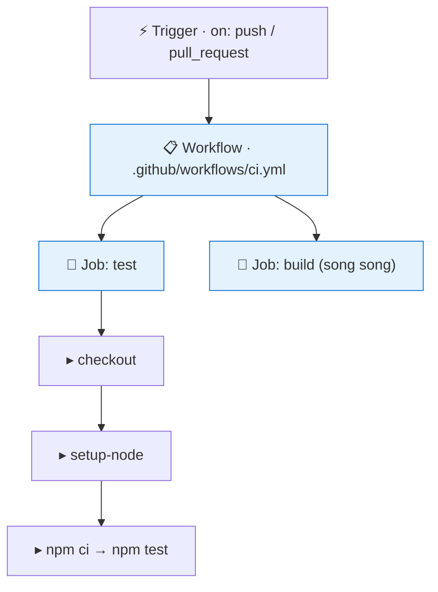
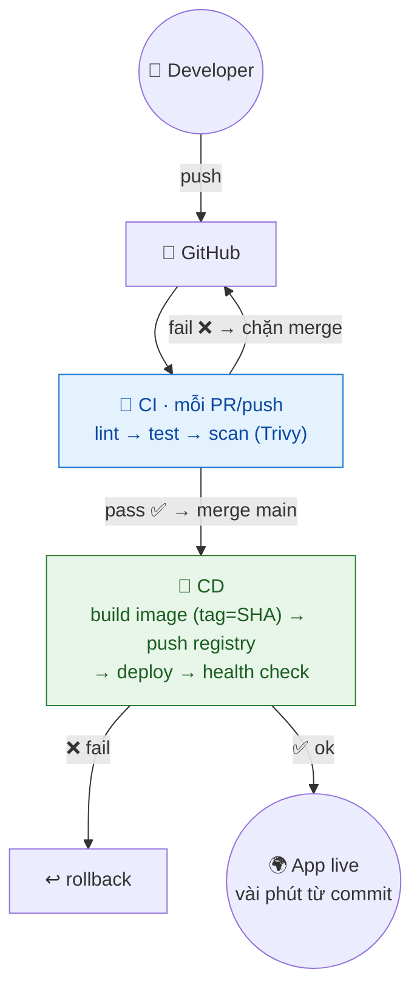
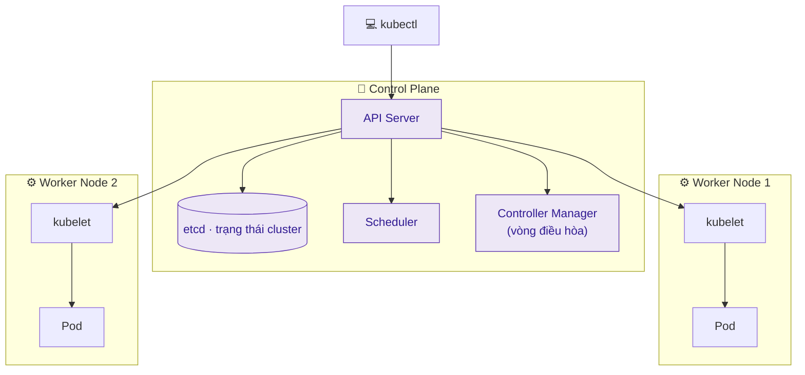
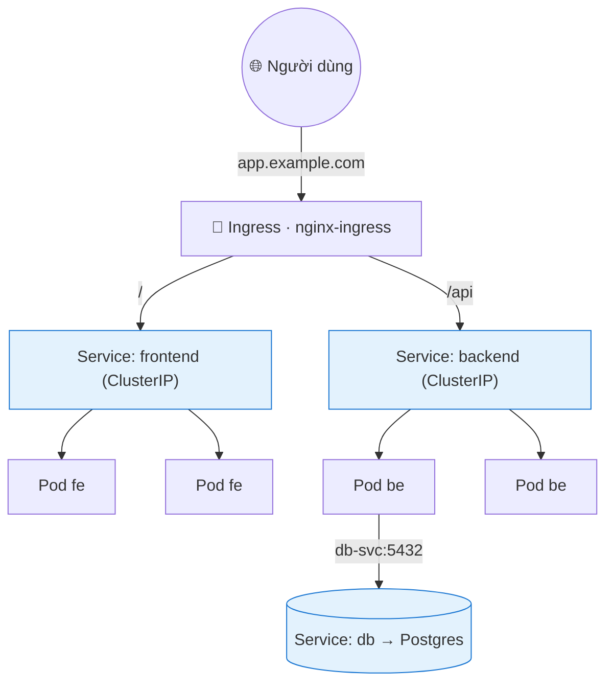
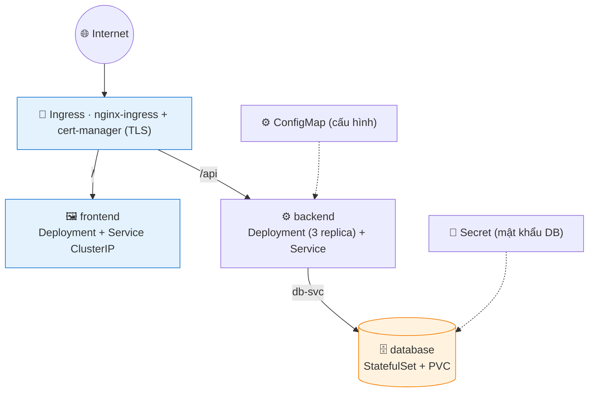
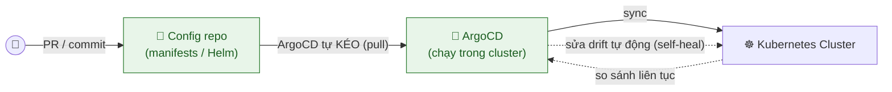
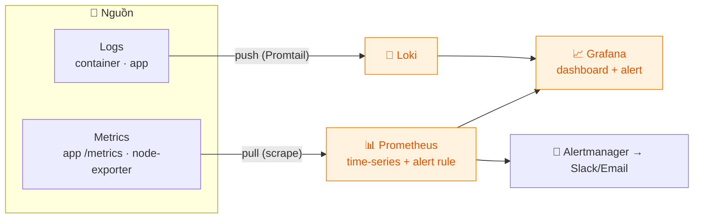
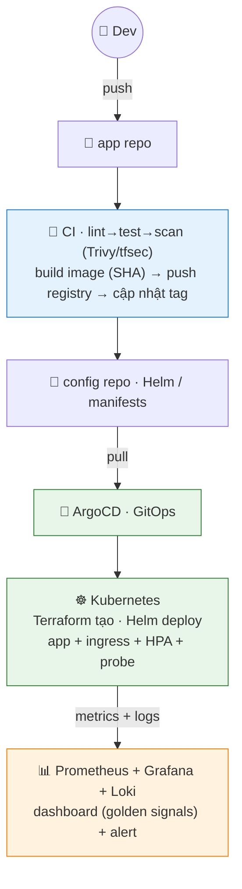

# Giai đoạn 3 — CI/CD, Kubernetes & Tự động hóa nâng cao

> **Ngày 31–50** · Trái tim của DevOps: pipeline tự động và điều phối container ở quy mô lớn.
>
> **Khuôn mỗi ngày:** 📘 Lý thuyết → 🧪 Lab cơ bản → 🚀 Lab nâng cao (best-practice) → 💡 Bổ sung thực tế → 📝 Bài ôn tập.
>
> ✅ Trung lập nền tảng: ví dụ CI dùng GitHub Actions, K8s dùng Minikube/local, cloud dùng ví dụ chung — đều có ghi chú công cụ tương đương (GitLab CI, EKS/GKE/AKS...).

---

## Mục lục

| Ngày | Chủ đề |
|------|--------|
| [31](#ngày-31--cicd-khái-niệm--github-actions-cơ-bản) | CI/CD — Khái niệm & GitHub Actions cơ bản |
| [32](#ngày-32--ci-pipeline--build-test--lint-tự-động) | CI Pipeline — Build, Test & Lint tự động |
| [33](#ngày-33--cd-pipeline--build--push-docker-image) | CD Pipeline — Build & Push Docker Image |
| [34](#ngày-34--cd-pipeline--tự-động-deploy-lên-server) | CD Pipeline — Tự động Deploy lên Server |
| [35](#ngày-35--milestone--pipeline-cicd-hoàn-chỉnh) | **Milestone — Pipeline CI/CD hoàn chỉnh** |
| [36](#ngày-36--kubernetes--khái-niệm--kiến-trúc) | Kubernetes — Khái niệm & Kiến trúc |
| [37](#ngày-37--kubernetes--pod-deployment--replicaset) | Kubernetes — Pod, Deployment & ReplicaSet |
| [38](#ngày-38--kubernetes--service--networking) | Kubernetes — Service & Networking |
| [39](#ngày-39--kubernetes--configmap-secret--storage) | Kubernetes — ConfigMap, Secret & Storage |
| [40](#ngày-40--milestone--deploy-full-stack-lên-kubernetes) | **Milestone — Deploy Full-stack lên Kubernetes** |
| [41](#ngày-41--kubernetes--health-check-resource--autoscaling) | Kubernetes — Health Check, Resource & Autoscaling |
| [42](#ngày-42--helm--package-manager-cho-kubernetes) | Helm — Package Manager cho Kubernetes |
| [43](#ngày-43--gitops--argocd--triển-khai-khai-báo) | GitOps — ArgoCD & Triển khai khai báo |
| [44](#ngày-44--monitoring--prometheus--metrics) | Monitoring — Prometheus & Metrics |
| [45](#ngày-45--monitoring--grafana-dashboard) | Monitoring — Grafana Dashboard |
| [46](#ngày-46--logging-tập-trung--loki) | Logging tập trung — Loki |
| [47](#ngày-47--configuration-management--ansible) | Configuration Management — Ansible |
| [48](#ngày-48--terraform-nâng-cao--module-remote-state--workspace) | Terraform nâng cao — Module, Remote State |
| [49](#ngày-49--bảo-mật-devsecops--best-practices) | Bảo mật DevSecOps & Best Practices |
| [50](#ngày-50--milestone--lab-tổng-hợp-giai-đoạn-3) | **Milestone — LAB tổng hợp Giai đoạn 3** |

---

## Ngày 31 — CI/CD: Khái niệm & GitHub Actions cơ bản

> ⏱️ ~90 phút · Loại: CI/CD
>
> 🧭 **Bạn đang ở đâu:** Giai đoạn 2 (Git, Docker, Cloud, IaC) → **Ngày 31 (CI/CD — robot tự build/test/deploy khi push)** → Ngày 32 (CI pipeline đầy đủ). Đây là kỹ năng "định danh" của DevOps, giải nốt nỗi đau deploy tay ở Ngày 28.
> 🔧 *Ví dụ dùng GitHub Actions; tương đương: **GitLab CI** (`.gitlab-ci.yml`), **Jenkins**, **CircleCI**.*
>
> ✅ **Chuẩn bị:** một repo GitHub (có app/test càng tốt). Không cần cài gì — GitHub cấp runner sẵn.

### 📘 Lý thuyết

#### 1. CI/CD là gì — "robot làm thay việc lặp lại"

| | Viết tắt | Robot làm gì |
|---|---|---|
| **CI** | Continuous Integration | Mỗi lần push → tự **build + test + lint**, bắt lỗi sớm |
| **CD** | Continuous Delivery/Deployment | Sau khi test đạt → tự **đưa lên** staging/production |

Đây chính là lời giải cho 5 điểm yếu của deploy tay (Ngày 28): lặp lại được, có dấu vết, không phụ thuộc 1 người, rollback bằng re-run, ít sai.

#### 2. GitHub Actions — robot có sẵn trong GitHub

Đặt 1 file YAML vào `.github/workflows/`. GitHub tự đọc và chạy mỗi khi có sự kiện (push, mở PR). Không cần cài server CI riêng.

#### 3. Ba tầng khái niệm

| Tầng | Là gì | Cách chạy |
|---|---|---|
| **Workflow** | Cả quy trình (1 file YAML) | Kích bởi trigger |
| **Job** | Nhóm việc chạy trên 1 runner sạch | Các job **song song** mặc định (`needs:` để xếp thứ tự) |
| **Step** | Từng bước (1 lệnh/action) | **Tuần tự** trong job |

#### 4. Các thành phần khác

- **Trigger** (`on: push`, `on: pull_request`): khi nào workflow chạy.
- **Action** (từ Marketplace): khối dựng sẵn — `actions/checkout`, `setup-node`, `docker build`...
- **Runner**: máy ảo GitHub cấp (ubuntu/windows/macos), **sạch mỗi lần chạy**.

#### 5. Secret

Token/mật khẩu phải để trong **GitHub Secrets** (che `***` trong log), đọc bằng `${{ secrets.TÊN }}`. KHÔNG viết thẳng YAML — YAML nằm trong repo, commit = lộ.

> 🔑 Ghim action theo phiên bản (`@v4`, hoặc SHA), đừng dùng `@main` (thay đổi bất ngờ — rủi ro supply chain).

**Sơ đồ — cấu trúc Workflow → Job → Step:**

> Job chạy **song song** mặc định (dùng `needs:` để xếp thứ tự); step trong job chạy **tuần tự**.

### 📖 Hiểu rõ hơn (giải thích cho người mới)

**CI/CD là gì? — "robot làm thay việc lặp lại".**
Nhớ "nỗi đau deploy tay" ở Ngày 28? CI/CD là robot làm những việc đó tự động mỗi khi bạn push code:
- **CI** (Continuous Integration) = mỗi lần push, robot tự *kiểm tra + đóng gói* code (chạy test, build) → bắt lỗi sớm.
- **CD** (Continuous Delivery/Deployment) = sau khi kiểm tra xong, robot tự *đưa lên server*.

**GitHub Actions — robot có sẵn trong GitHub.**
Bạn chỉ cần đặt 1 file YAML vào thư mục `.github/workflows/`. GitHub tự đọc và chạy mỗi khi có sự kiện (push, mở PR). Không cần cài server CI riêng.

**3 tầng khái niệm (đọc từ trên xuống):**
- **Workflow** = cả quy trình (1 file YAML).
- **Job** = một nhóm công việc, chạy trên 1 "máy ảo sạch" (runner). Nhiều job chạy **song song** mặc định.
- **Step** = từng bước nhỏ trong job, chạy **tuần tự** (vd: tải code → cài Node → chạy test).

> 🧠 **Một câu để nhớ:** token/mật khẩu trong pipeline phải để trong **GitHub Secrets** (được che `***` trong log), KHÔNG viết thẳng YAML — vì YAML nằm trong repo, commit = lộ.

### 🧪 Lab cơ bản

> Mục tiêu: tạo workflow đầu tiên, thấy nó tự chạy khi push, và hiểu cơ chế Secret.

**Bước 1 — Tạo `.github/workflows/ci.yml`** (file đầy đủ):
```yaml
name: CI
on: [push]
jobs:
  hello:
    runs-on: ubuntu-latest
    steps:
      - uses: actions/checkout@v4
      - run: echo "Hello CI — commit ${{ github.sha }}"
```

**Bước 2 — Push và xem chạy.**
```bash
git add .github/workflows/ci.yml && git commit -m "Thêm CI" && git push
```
Vào tab **Actions** trên GitHub → thấy 1 run với dấu ✓ xanh.

**Bước 3 — Thêm setup môi trường + test.** Bổ sung vào job:
```yaml
      - uses: actions/setup-node@v4
        with: { node-version: '20' }
      - run: node --version
      - run: echo "chạy test ở đây"   # thay bằng npm test nếu có
```

**Bước 4 — Tạo Secret & in (che).** GitHub → Settings → Secrets and variables → Actions → New secret (tên `MY_SECRET`). Thêm step:
```yaml
      - run: echo "Secret là ${{ secrets.MY_SECRET }}"
```
Xem log → giá trị hiện `***` (bị che).

**Bước 5 — Sửa 1 dòng code rồi push** → xem run mới tự sinh, đọc log từng step.

### 🚀 Lab nâng cao (best-practice)

> Mục tiêu: viết workflow chuẩn — có trigger đúng, tên rõ, dùng action ghim phiên bản.

1. **Workflow CI mẫu có cấu trúc:**
   ```yaml
   name: CI
   on:
     push: { branches: [main] }
     pull_request: { branches: [main] }
   jobs:
     test:
       runs-on: ubuntu-latest
       steps:
         - uses: actions/checkout@v4
         - uses: actions/setup-node@v4
           with: { node-version: '20', cache: 'npm' }
         - run: npm ci
         - run: npm test
   ```
2. **Ghim action theo phiên bản** (`@v4`, hoặc SHA cho bảo mật cao) — không dùng `@main` (thay đổi bất ngờ, rủi ro supply chain).
3. **Quyền tối thiểu cho token:** thêm `permissions: { contents: read }` ở đầu workflow.
4. **Trigger đúng:** PR chạy test, push main mới deploy — không deploy mỗi lần push nhánh.

### 💡 Bổ sung thực tế: vì sao CI/CD là kỹ năng "định danh" của DevOps

- **CI/CD trả lời 5 điểm yếu của deploy thủ công** (Ngày 28): lặp lại được, dấu vết đầy đủ (mỗi run có log), không phụ thuộc 1 người, rollback bằng re-run, ít sai vì máy làm.
- **Quan hệ workflow → job → step:**
  - **Workflow** = cả quy trình (1 file YAML).
  - **Job** = nhóm bước chạy trên 1 runner; các job **chạy song song** mặc định (dùng `needs:` để xếp thứ tự).
  - **Step** = 1 lệnh/action, chạy tuần tự trong job.
- **GitHub Secrets vs biến thường:** secret được **che trong log** (hiện `***`), không lộ ra. Token/key luôn dùng secret, không bao giờ viết thẳng YAML (commit = lộ vĩnh viễn).
- **Runner:** GitHub cấp runner sẵn (ubuntu/windows/macos) — sạch mỗi lần chạy. Khi cần môi trường riêng/mạnh hơn → self-hosted runner.

### 🧭 Hướng dẫn làm lab & giải nghĩa lệnh (cho người tự học)

**Trình tự nên làm:** tạo `.github/workflows/ci.yml` → push → xem tab Actions → thêm checkout + setup → thêm bước test → thử Secret.

**Giải nghĩa & kết quả mong đợi:**
- `.github/workflows/ci.yml` — đặt đúng thư mục này GitHub mới nhận; `on: push` = chạy khi push. *Kết quả:* tab Actions hiện 1 run với dấu ✓ xanh.
- `uses: actions/checkout@v4` — tải code repo vào runner (hầu như workflow nào cũng cần bước này đầu tiên).
- `uses: actions/setup-node@v4` — cài runtime; `run: npm ci`/`npm test` — chạy lệnh shell.
- `${{ secrets.TÊN }}` — đọc GitHub Secret; trong log hiện `***` (che).

**🧪 Thử nghiệm:**
- Sửa 1 dòng code rồi push → xem 1 run mới tự sinh, đọc log từng step. **Bài học:** CI tự kích hoạt mỗi commit.
- Tạo 2 job (test, build) không `needs` → chạy **song song**; thêm `needs: test` vào build → tuần tự. **Bài học:** job song song mặc định.

⚠️ **Dễ sai:** viết token thẳng YAML (commit = lộ vĩnh viễn). Luôn dùng `secrets.*`; ghim action `@v4`, đừng `@main`.

💡 **Hiểu sâu:** Workflow (cả file) → Job (chạy trên 1 runner sạch) → Step (lệnh tuần tự). Runner là máy ảo sạch mỗi lần — lý do CI "không phụ thuộc máy ai".

### 🐛 Gỡ lỗi nhanh

| Triệu chứng | Nguyên nhân | Cách sửa |
|---|---|---|
| Workflow không chạy | File sai chỗ/tên | Phải ở `.github/workflows/*.yml`; kiểm YAML hợp lệ |
| `Error: ... uses: ... not found` | Sai tên/phiên bản action | Đúng `actions/checkout@v4`; xem Marketplace |
| Job đỏ ngay bước đầu | Thiếu `checkout` nên không có code | Thêm `- uses: actions/checkout@v4` đầu tiên |
| Secret in ra rỗng | Chưa tạo secret / sai tên | Tạo ở Settings → Secrets; tên khớp `${{ secrets.X }}` |
| Deploy chạy mỗi lần push nhánh | Trigger quá rộng | Giới hạn `on: push: branches: [main]` |

### 📝 Bài ôn tập & Demo đối chiếu

**✍️ Tự kiểm tra:**

<details>
<summary>1. Phân biệt CI và CD.</summary>

> CI = tự build+test+lint mỗi khi push (bắt lỗi sớm). CD = tự đưa bản đã test lên staging/production. CI lo "code ổn không", CD lo "đưa lên đâu".
</details>

<details>
<summary>2. Workflow, job, step quan hệ thế nào?</summary>

> Workflow (cả file YAML) chứa nhiều job; job chạy trên 1 runner sạch (song song mặc định); mỗi job có nhiều step chạy tuần tự.
</details>

<details>
<summary>3. Vì sao dùng GitHub Secrets thay vì viết token trong YAML?</summary>

> YAML nằm trong repo → commit token = lộ vĩnh viễn. Secret được che `***` trong log và không nằm trong code.
</details>

<details>
<summary>4. Vì sao ghim action `@v4` thay vì `@main`?</summary>

> `@main` có thể đổi bất ngờ (mất tái lập, rủi ro supply chain). Ghim phiên bản/SHA để chạy ổn định & an toàn.
</details>

**🔬 Demo đối chiếu:**

| Demo đối chiếu | Kết quả mong đợi |
|---|---|
| Tạo workflow đầu tiên | Tab Actions hiện job chạy với dấu ✓ xanh |
| Workflow tự kích hoạt khi push | Mỗi commit → 1 run mới |
| Đọc log của job | Xem được output từng step, secret hiện `***` |

### 📚 Thuật ngữ Anh–Việt (ngày này)

| Thuật ngữ | Nghĩa |
|---|---|
| **CI / CD** | Tích hợp / Chuyển giao–Triển khai liên tục |
| **Workflow / Job / Step** | Quy trình / nhóm việc / bước |
| **Runner** | Máy ảo chạy job (sạch mỗi lần) |
| **Trigger** | Sự kiện kích hoạt workflow (push/PR) |
| **Action** | Khối dựng sẵn trên Marketplace |
| **Secret** | Biến bí mật được che trong log |
| **Pipeline** | Chuỗi bước tự động hoá |

✅ **Kết quả đạt được:** Hiểu CI/CD, tạo được pipeline GitHub Actions đầu tiên và biết dùng Secret an toàn.

---

## Ngày 32 — CI Pipeline: Build, Test & Lint tự động

> ⏱️ ~90 phút · Loại: CI/CD
>
> 🧭 **Bạn đang ở đâu:** Ngày 31 (workflow đầu tiên) → **Ngày 32 (CI pipeline đầy đủ: lint → test → build, chặn code lỗi)** → Ngày 33 (CD build & push image). Đây là "hàng rào chất lượng" tự động cho mọi code vào main.
>
> ✅ **Chuẩn bị:** repo có app + test (Ngày 31). Ôn YAML (Ngày 22).

### 📘 Lý thuyết

#### 1. Các bước CI điển hình

`install dependencies → lint (kiểm style) → unit test → build`. Bất kỳ bước nào fail → pipeline dừng, báo đỏ, **chặn merge**.

#### 2. Matrix build

Chạy cùng job trên **nhiều phiên bản/OS song song** (vd Node 18 và 20) để chắc code chạy khắp nơi:
```yaml
strategy:
  matrix: { node: [18, 20] }
```

#### 3. Caching — tăng tốc pipeline

Nhớ lại thư viện đã tải (`node_modules`, pip) → lần sau không tải lại → nhanh hơn nhiều: `cache: 'npm'` trong `setup-node`.

#### 4. Artifact

File kết quả (bản build, test report) được **lưu lại** để tải về hoặc cho job sau dùng: `actions/upload-artifact`.

#### 5. Fail fast & Branch protection

- **Fail fast:** 1 step lỗi → dừng job ngay (tiết kiệm). Muốn xem hết lỗi thì `fail-fast: false`.
- **Branch protection** ("hàng rào chất lượng"): bật cho `main` → bắt buộc CI xanh + có review mới được merge. Không có nó, CI chỉ là trang trí.

> 🔑 Mục tiêu: pipeline **dưới 10 phút**. Chậm → dev ngại push → gom nhiều thay đổi → khó tìm lỗi. Tăng tốc bằng cache + chạy job song song.

### 📖 Hiểu rõ hơn (giải thích cho người mới)

**Một pipeline CI điển hình làm gì?**
Chuỗi bước tự động chạy mỗi khi push: `cài thư viện → lint (kiểm tra style code) → test (chạy unit test) → build (đóng gói)`. Bất kỳ bước nào fail → pipeline dừng, báo đỏ, **chặn merge**.

**Vài khái niệm tăng tốc & chất lượng:**
- **Matrix** = chạy test trên **nhiều phiên bản** cùng lúc (vd Node 18 và 20) để chắc code chạy được khắp nơi.
- **Cache** = nhớ lại thư viện đã tải → lần sau không tải lại → pipeline nhanh hơn nhiều.
- **Artifact** = file kết quả (bản build, báo cáo) được lưu lại để tải về hoặc cho job sau dùng.

**Branch protection — "hàng rào chất lượng".**
Bật cho nhánh `main`: bắt buộc CI xanh + có người review mới được merge. Không có nó, CI chỉ là trang trí — người ta vẫn merge code lỗi vào.

> 🧠 **Một câu để nhớ:** mục tiêu là pipeline **dưới 10 phút**. Pipeline chậm → dev ngại push → gom nhiều thay đổi → khó tìm lỗi. Tăng tốc bằng cache + chạy job song song.

### 🧪 Lab cơ bản

> Mục tiêu: pipeline lint→test→build có matrix + cache + artifact, và chặn merge khi đỏ.

**Bước 1 — Workflow CI đầy đủ `ci.yml`** (file hoàn chỉnh):
```yaml
name: CI
on:
  push: { branches: [main] }
  pull_request: { branches: [main] }
jobs:
  test:
    runs-on: ubuntu-latest
    strategy:
      matrix: { node: [18, 20] }
    steps:
      - uses: actions/checkout@v4
      - uses: actions/setup-node@v4
        with: { node-version: '${{ matrix.node }}', cache: 'npm' }
      - run: npm ci
      - run: npm run lint --if-present
      - run: npm test --if-present
      - run: npm run build --if-present
      - uses: actions/upload-artifact@v4
        with: { name: build-${{ matrix.node }}, path: dist/, if-no-files-found: ignore }
```

**Bước 2 — Push & xem matrix.** Tab Actions hiện **2 job** (Node 18, Node 20) chạy song song.

**Bước 3 — Kiểm chứng cache.** Chạy CI lần 2 → bước `npm ci` nhanh hơn (dùng cache).

**Bước 4 — Xem artifact.** Trong trang run → phần Artifacts có `build-18`, `build-20` tải về được.

**Bước 5 — Bật branch protection.** Settings → Branches → rule cho `main`: require status checks (chọn job `test`) + require PR review.

### 🚀 Lab nâng cao (best-practice)

> Mục tiêu: pipeline CI nhanh, đáng tin, chặn code lỗi trước khi vào main.

1. **Matrix + cache:**
   ```yaml
   strategy:
     matrix: { node: [18, 20] }
   steps:
     - uses: actions/setup-node@v4
       with: { node-version: '${{ matrix.node }}', cache: 'npm' }
   ```
2. **Tách job chạy song song** (lint, test, build độc lập) → pipeline nhanh hơn nhiều.
3. **Concurrency** — hủy run cũ khi push commit mới vào cùng PR (tiết kiệm runner):
   ```yaml
   concurrency: { group: '${{ github.ref }}', cancel-in-progress: true }
   ```
4. **Báo cáo coverage + chặn merge** nếu coverage giảm; thêm status badge vào README.

### 💡 Bổ sung thực tế: pipeline nhanh = team hạnh phúc

- **Pipeline chậm giết năng suất:** CI 30 phút = dev ngại push, batch nhiều thay đổi, khó tìm lỗi. Mục tiêu CI **dưới 10 phút**. Cách tăng tốc: cache, song song hóa job, chỉ test phần thay đổi.
- **Fail fast vs chạy hết:** mặc định 1 step lỗi → dừng job (tiết kiệm). Nhưng đôi khi muốn xem **tất cả** lỗi cùng lúc → `continue-on-error` hoặc `fail-fast: false` trong matrix.
- **Artifact dùng để:** chuyển file giữa job (build job → deploy job), lưu test report/screenshot khi fail để debug, phát hành binary.
- **Branch protection là "hàng rào chất lượng":** không có nó, CI chỉ là trang trí — người ta vẫn merge code lỗi. Bắt buộc: CI pass + ít nhất 1 review + nhánh up-to-date.

### 🧭 Hướng dẫn làm lab & giải nghĩa lệnh (cho người tự học)

**Trình tự nên làm:** thêm lint/test/build → matrix nhiều phiên bản → caching → upload artifact → bật branch protection.

**Giải nghĩa & kết quả mong đợi:**
- `strategy: matrix: { node: [18, 20] }` — chạy cùng job trên **nhiều phiên bản** song song. *Kết quả:* tab Actions hiện 2 job (Node 18, Node 20).
- `cache: 'npm'` trong setup-node — cache dependency giữa các run. *Kết quả:* lần 2 cài nhanh hơn hẳn.
- `actions/upload-artifact` — lưu file build/report để tải về hoặc job sau dùng.
- Branch protection (Settings → Branches): bắt CI pass mới merge.

**🧪 Thử nghiệm:**
- Cố tình để test fail rồi mở PR → CI đỏ + nút merge bị chặn. **Bài học:** branch protection là "hàng rào chất lượng".
- Chạy CI 2 lần, so sánh thời gian bước cài dependency (lần 2 dùng cache nhanh hơn). **Bài học:** cache giảm thời gian pipeline.

⚠️ **Dễ sai:** pipeline > 10 phút → dev ngại push. Tăng tốc: cache + song song hóa job.

💡 **Hiểu sâu:** matrix dùng khi cần đảm bảo code chạy trên **nhiều môi trường** (phiên bản runtime/OS). Artifact = cách chuyển file giữa job (build → deploy).

### 🐛 Gỡ lỗi nhanh

| Triệu chứng | Nguyên nhân | Cách sửa |
|---|---|---|
| Pipeline chậm (>10 phút) | Không cache, không song song | Bật `cache:`; tách job song song |
| `npm ci` lỗi `lock file` | Thiếu `package-lock.json` | Commit lock file; hoặc dùng `npm install` |
| Matrix chỉ chạy 1 job | Cú pháp matrix sai | Kiểm `strategy: matrix:` đúng thụt lề |
| Merge được dù CI đỏ | Chưa bật branch protection | Settings → Branches → require status checks |
| Artifact rỗng | Đường dẫn `path:` sai | Trỏ đúng thư mục build (`dist/`) |

### 📝 Bài ôn tập & Demo đối chiếu

**✍️ Tự kiểm tra:**

<details>
<summary>1. Matrix build hữu ích khi nào?</summary>

> Khi cần đảm bảo code chạy trên **nhiều môi trường** (phiên bản runtime, OS) — chạy cùng test song song trên tất cả.
</details>

<details>
<summary>2. Caching trong CI cải thiện gì?</summary>

> Nhớ thư viện đã tải → không tải lại mỗi lần → pipeline nhanh hơn nhiều (giảm phút build).
</details>

<details>
<summary>3. Artifact dùng để làm gì?</summary>

> Lưu file kết quả (bản build, test report) để chuyển giữa job (build→deploy), tải về debug, hoặc phát hành.
</details>

<details>
<summary>4. Branch protection giải quyết điều gì?</summary>

> Bắt buộc CI xanh + review trước khi merge → không ai lọt code lỗi vào main. Không có nó, CI chỉ là trang trí.
</details>

**🔬 Demo đối chiếu:**

| Demo đối chiếu | Kết quả mong đợi |
|---|---|
| Pipeline tự chạy | Job test passed (xanh) trên cả Node 18 & 20 |
| Test fail | CI đỏ và chặn merge |
| Cache | Lần chạy 2 cài dependency nhanh hơn |

### 📚 Thuật ngữ Anh–Việt (ngày này)

| Thuật ngữ | Nghĩa |
|---|---|
| **Lint** | Kiểm tra style/lỗi code tự động |
| **Matrix build** | Chạy trên nhiều phiên bản/OS song song |
| **Cache** | Lưu dependency để chạy nhanh lần sau |
| **Artifact** | File kết quả build/report được lưu |
| **Fail fast** | Dừng ngay khi 1 bước lỗi |
| **Status check** | Kết quả CI gắn vào PR |
| **Branch protection** | Quy tắc bảo vệ nhánh chính |

✅ **Kết quả đạt được:** Xây dựng CI pipeline hoàn chỉnh — lint + test + build + matrix + cache + bảo vệ nhánh.

---

## Ngày 33 — CD Pipeline: Build & Push Docker Image

> ⏱️ ~90 phút · Loại: CI/CD
>
> 🧭 **Bạn đang ở đâu:** Ngày 32 (CI test) → **Ngày 33 (tự build Docker image + push lên registry)** → Ngày 34 (tự deploy lên server). Đây là mắt xích nối "code đã test" với "image sẵn sàng deploy".
>
> ✅ **Chuẩn bị:** repo có Dockerfile (Ngày 17). Tài khoản Docker Hub hoặc dùng GHCR (`ghcr.io`) miễn phí sẵn trong GitHub.

### 📘 Lý thuyết

#### 1. Mục tiêu

Mỗi khi merge vào `main` → pipeline tự **build Docker image** và **push lên registry** (kho image để server kéo về chạy).

#### 2. Registry & action

- **Registry:** Docker Hub, hoặc **GitHub Container Registry** (`ghcr.io` — tích hợp sẵn).
- **Action:** `docker/login-action` (đăng nhập), `docker/build-push-action` (build + push), `docker/metadata-action` (tự sinh tag).

#### 3. Tag theo commit SHA — KHÔNG dùng `latest`

| Tag | Vấn đề/Lợi ích |
|---|---|
| `latest` | "Mới nhất *lúc nào?*" — không ai biết đang chạy gì, không rollback đúng |
| `myapp:a1b2c3d` (SHA) | Định danh duy nhất của đúng commit → biết ngay code nào, truy vết hoàn hảo |

#### 4. `GITHUB_TOKEN` — token tự sinh, an toàn

Để push lên `ghcr.io`, GitHub tự cấp 1 token tạm mỗi lần chạy (hết hạn ngay sau, quyền giới hạn theo repo) → an toàn hơn Personal Access Token cá nhân. Credential registry luôn để trong **GitHub Secrets**.

#### 5. Cache layer & nâng cao

- **Cache layer** (`cache-from/to: type=gha`): không cache thì mỗi build cài lại từ đầu (chậm).
- **Conditional:** chỉ push khi ở `main` (`if: github.ref == 'refs/heads/main'`).
- **Multi-platform** (buildx): build cho amd64/arm64.

> 🔑 Ở production, **luôn deploy theo tag bất biến** (SHA/version), không bao giờ `latest`. Đây là nền tảng để rollback chính xác.

### 📖 Hiểu rõ hơn (giải thích cho người mới)

**Mục tiêu hôm nay: mỗi lần merge → tự đóng gói thành Docker image và đẩy lên kho.**
"Kho" (registry) là nơi lưu image để server kéo về chạy — như Docker Hub, hoặc GitHub Container Registry (`ghcr.io`). Pipeline tự: build image → đăng nhập registry → push lên.

**Tại sao gắn tag theo "commit SHA" thay vì `latest`?**
- `latest` = "bản mới nhất" — nhưng *mới nhất lúc nào?* Không ai biết server đang chạy phiên bản nào → không rollback đúng được.
- **commit SHA** (vd `myapp:a1b2c3d`) = mã định danh duy nhất của đúng commit đó. Thấy tag là biết ngay code nào, ai viết. Truy vết hoàn hảo.

**`GITHUB_TOKEN` — token tự sinh, an toàn.**
Để push lên `ghcr.io`, GitHub tự cấp 1 token tạm cho mỗi lần chạy (hết hạn ngay sau đó, quyền giới hạn theo repo) → an toàn hơn token cá nhân nhiều.

> 🧠 **Một câu để nhớ:** ở production, **luôn deploy theo tag bất biến** (SHA/version), không bao giờ `latest`. Đây là nền tảng để rollback chính xác.

### 🧪 Lab cơ bản

1. Tạo workflow build Docker image khi push lên main.
2. Cấu hình login vào Docker Hub/ghcr bằng Secrets.
3. Push image với 2 tag: `latest` và commit SHA.
4. Kiểm tra image xuất hiện trên registry sau khi pipeline chạy.
5. Thêm điều kiện chỉ build+push khi nhánh là main.

### 🚀 Lab nâng cao (best-practice)

> Mục tiêu: build image có tag truy vết được, dùng cache layer, đa nền tảng.

1. **Build + push chuẩn với tag tự động:**
   ```yaml
   - uses: docker/login-action@v3
     with: { registry: ghcr.io, username: ${{ github.actor }}, password: ${{ secrets.GITHUB_TOKEN }} }
   - uses: docker/metadata-action@v5
     id: meta
     with: { images: ghcr.io/${{ github.repository }} }
   - uses: docker/build-push-action@v6
     with:
       push: true
       tags: ${{ steps.meta.outputs.tags }}    # tự sinh tag từ branch/sha/version
       cache-from: type=gha
       cache-to: type=gha,mode=max               # cache layer giữa các run
   ```
2. **Dùng `ghcr.io` với `GITHUB_TOKEN`** — không cần tạo secret riêng, quyền theo repo.
3. **Tag theo SHA + semver** để mỗi deploy truy về đúng commit.
4. **Quét image bằng Trivy** ngay trong pipeline trước khi push (xem Ngày 49).

### 💡 Bổ sung thực tế: vì sao KHÔNG dùng `latest` để deploy

- **`latest` là cái bẫy ở production:** "máy nào pull lúc nào ra phiên bản đó" → không ai biết chính xác đang chạy gì, không rollback chính xác được. → Luôn deploy theo **tag bất biến** (SHA/semver).
- **Tag theo commit SHA = truy vết hoàn hảo:** thấy `myapp:a1b2c3d` → biết ngay commit nào, ai viết, PR nào. Khi sự cố, đây là vàng.
- **`GITHUB_TOKEN` vs Personal Access Token:** `GITHUB_TOKEN` tự sinh mỗi run, hết hạn sau run, quyền giới hạn theo repo — an toàn hơn PAT cá nhân nhiều. Ưu tiên dùng nó.
- **Cache layer trong CI** (`type=gha`) — không có cache, mỗi build cài lại từ đầu, rất chậm. Cache đúng = build vài giây thay vì vài phút.

### 🧭 Hướng dẫn làm lab & giải nghĩa lệnh (cho người tự học)

**Trình tự nên làm:** tạo workflow build khi push main → login registry bằng Secrets → push 2 tag (SHA + latest) → kiểm tra trên registry.

**Giải nghĩa & kết quả mong đợi:**
- `docker/login-action` với `${{ secrets.GITHUB_TOKEN }}` — đăng nhập GHCR (token tự sinh, không cần tạo). *Kết quả:* bước login xanh.
- `docker/metadata-action` tự sinh tag từ branch/SHA; `docker/build-push-action` với `push: true` build + đẩy lên registry.
- `cache-from/to: type=gha` — cache layer giữa các lần build CI.

**🧪 Thử nghiệm:**
- Push 2 lần, vào registry xem image có 2 tag SHA khác nhau (mỗi commit 1 tag). **Bài học:** truy vết chính xác phiên bản nào đang chạy.
- Xóa `cache-from/to` rồi so sánh thời gian build. **Bài học:** cache layer tiết kiệm phút.

⚠️ **Dễ sai:** deploy theo `latest` → không biết chính xác đang chạy gì, rollback sai. Deploy theo **tag SHA bất biến**.

💡 **Hiểu sâu:** `GITHUB_TOKEN` tự sinh mỗi run, hết hạn sau run, quyền theo repo → an toàn hơn Personal Access Token cá nhân.

### 🐛 Gỡ lỗi nhanh

| Triệu chứng | Nguyên nhân | Cách sửa |
|---|---|---|
| `denied: permission` khi push GHCR | Thiếu quyền packages cho token | Thêm `permissions: { packages: write }` vào workflow |
| `unauthorized` login registry | Sai secret user/pass | Kiểm secret; GHCR dùng `${{ github.actor }}` + `GITHUB_TOKEN` |
| Build rất chậm mỗi lần | Không cache layer | Thêm `cache-from/to: type=gha` |
| Image push cả khi ở nhánh phụ | Thiếu điều kiện | Thêm `if: github.ref == 'refs/heads/main'` |
| Không biết server chạy bản nào | Deploy theo `latest` | Tag theo SHA/semver bất biến |

### 📝 Bài ôn tập & Demo đối chiếu

**✍️ Tự kiểm tra:**

<details>
<summary>1. Vì sao tag image theo commit SHA thay vì `latest`?</summary>

> `latest` không cho biết chính xác đang chạy code nào → không rollback đúng. SHA (`myapp:a1b2c3d`) định danh duy nhất commit → truy vết & rollback chính xác.
</details>

<details>
<summary>2. Credential registry nên lưu ở đâu?</summary>

> Trong **GitHub Secrets** (che trong log). Với GHCR có thể dùng `GITHUB_TOKEN` tự sinh, khỏi tạo secret riêng.
</details>

<details>
<summary>3. `login-action` làm gì?</summary>

> Đăng nhập vào registry (Docker Hub/GHCR) để pipeline có quyền push image.
</details>

<details>
<summary>4. `GITHUB_TOKEN` an toàn hơn PAT ở điểm nào?</summary>

> Tự sinh mỗi run, hết hạn ngay sau run, quyền giới hạn theo repo — lộ cũng ít hại hơn token cá nhân full quyền.
</details>

**🔬 Demo đối chiếu:**

| Demo đối chiếu | Kết quả mong đợi |
|---|---|
| CI tự build image | Image tạo trong runner |
| Push lên registry | GHCR/Docker Hub hiện image tag mới |
| Tag theo commit | Tag dạng SHA/semver xuất hiện |

### 📚 Thuật ngữ Anh–Việt (ngày này)

| Thuật ngữ | Nghĩa |
|---|---|
| **Registry** | Kho lưu image (Docker Hub, GHCR) |
| **GHCR** | GitHub Container Registry (`ghcr.io`) |
| **build-push-action** | Action build + đẩy image |
| **Immutable tag** | Tag bất biến (SHA/semver) |
| **`GITHUB_TOKEN`** | Token tự sinh mỗi run |
| **Layer cache** | Cache tầng image trong CI |
| **buildx** | Build đa nền tảng (amd64/arm64) |

✅ **Kết quả đạt được:** Tự động build và đẩy Docker image (tag SHA) lên registry mỗi lần merge.

---

## Ngày 34 — CD Pipeline: Tự động Deploy lên Server

> ⏱️ ~90 phút · Loại: CI/CD
>
> 🧭 **Bạn đang ở đâu:** Ngày 33 (build & push image) → **Ngày 34 (tự deploy lên server: push code là app live)** → Ngày 35 (Milestone pipeline hoàn chỉnh). Đây là mắt xích cuối biến `git push` thành "app cập nhật trên production, không động tay".
>
> ✅ **Chuẩn bị:** một VM cloud SSH được (Ngày 27) đã cài Docker, và image đã push lên registry (Ngày 33).

### 📘 Lý thuyết

#### 1. Deploy tự động

Sau khi image ở registry, pipeline **SSH vào server** → pull image mới → `docker compose up -d`. Giờ chỉ cần `git push` → vài phút sau app cập nhật, không thao tác tay.

#### 2. SSH trong CI

Lưu **SSH private key + host** trong GitHub Secrets, dùng action SSH (vd `appleboy/ssh-action`). Dùng **deploy key riêng, quyền tối thiểu** — không dùng key cá nhân full quyền.

#### 3. Continuous Delivery vs Deployment (khác 1 chữ, quan trọng)

| | Cách chạy | Dùng cho |
|---|---|---|
| **Delivery** | Tự động đến *sát* production, cần người **bấm nút duyệt** | Production (an toàn) |
| **Deployment** | Tự động hoàn toàn, không cần duyệt | Staging (nhanh) |

#### 4. Health check & Rollback

- Sau `up -d`, pipeline `curl /health` → fail thì **rollback tự động**.
- Quy tắc: **rollback trước, điều tra sau**. Deploy theo tag bất biến (Ngày 33) → rollback = chạy lại deploy với tag cũ.

#### 5. Ba chiến lược deploy nâng cao (gặp lại ở K8s)

| Chiến lược | Cách làm |
|---|---|
| **Rolling** | Thay dần từng instance (mặc định, đơn giản) |
| **Blue-Green** | Dựng môi trường mới song song, gạt công tắc traffic, rollback tức thì |
| **Canary** | Cho ~10% user thử trước, ổn mới mở rộng |

> 🔑 Production nên có bước **approval** (GitHub Environments + required reviewers) — chặn deploy nhầm giữa đêm. Staging thì tự động hoàn toàn.

### 📖 Hiểu rõ hơn (giải thích cho người mới)

**Bước cuối: tự động đưa image lên server.**
Sau khi image đã ở registry, pipeline tự SSH vào server, kéo image mới, chạy lại container. Giờ bạn chỉ cần `git push` → vài phút sau app cập nhật trên production, **không động tay**.

**Continuous Delivery vs Deployment — khác 1 chữ nhưng quan trọng:**
- **Delivery** = tự động đến *sát* production, nhưng cần 1 người **bấm nút duyệt** mới lên.
- **Deployment** = tự động hoàn toàn, không cần duyệt.
→ Thực tế: **staging** tự động hoàn toàn (nhanh); **production** nên có bước **approval** (đặc biệt giờ cao điểm).

**Rollback — kế hoạch khi deploy hỏng.**
Quy tắc: **rollback trước, điều tra sau**. Vì deploy theo tag bất biến (Ngày 33), rollback chỉ là "chạy lại deploy với tag cũ" — nhanh hơn cuống cuồng sửa.

**3 chiến lược deploy nâng cao:** Rolling (thay dần — mặc định), Blue-Green (dựng môi trường mới song song rồi gạt công tắc), Canary (cho 10% user thử trước, ổn mới mở rộng).

> 🧠 **Một câu để nhớ:** lưu SSH key/secret deploy trong **GitHub Secrets**, dùng key riêng quyền tối thiểu cho deploy — không dùng key cá nhân full quyền.

### 🧪 Lab cơ bản

1. Thêm job deploy: SSH vào VM, pull image mới và chạy lại `docker compose`.
2. Lưu SSH private key và host vào GitHub Secrets.
3. Test pipeline end-to-end: sửa code → push → tự build → deploy → kiểm tra app cập nhật.
4. Cấu hình GitHub Environment cho production cần approval thủ công.
5. Thực hành rollback: deploy version cũ khi phát hiện lỗi.

### 🚀 Lab nâng cao (best-practice)

> Mục tiêu: deploy tự động an toàn — có approval cho production, có health check, rollback được.

1. **GitHub Environments + required reviewers:** production deploy phải có người duyệt → chặn deploy nhầm giữa đêm.
2. **Deploy có health check:** sau khi `up -d`, pipeline `curl /health` — fail thì rollback tự động:
   ```bash
   docker compose up -d
   for i in $(seq 1 10); do curl -fs localhost/health && exit 0; sleep 3; done
   echo "Health check failed, rolling back"; docker compose down; exit 1
   ```
3. **Deploy key least privilege:** SSH key riêng cho deploy, chỉ quyền cần thiết, không phải key cá nhân full quyền.
4. **Tách staging/production:** merge vào `develop` → deploy staging tự động; tag release → deploy production (có approval).

### 💡 Bổ sung thực tế: chiến lược deploy & vì sao cần approval

- **Luồng CD đầy đủ:** `git push → CI test → build image → push registry → deploy server → health check → (fail? rollback)`.
- **Vì sao production cần approval:** CD lên staging nên tự động hoàn toàn (nhanh, an toàn). Nhưng production ảnh hưởng người dùng thật → cần 1 người nhìn lại, đặc biệt giờ cao điểm. Đây là **Continuous Delivery** (sẵn sàng deploy, bấm nút) vs **Continuous Deployment** (tự động hoàn toàn).
- **Các chiến lược deploy nâng cao** (sẽ gặp lại ở K8s):
  | Chiến lược | Cách làm |
  |---|---|
  | **Rolling** | thay dần từng instance — mặc định, đơn giản |
  | **Blue-Green** | 2 môi trường, switch traffic tức thì, rollback nhanh |
  | **Canary** | đẩy cho % nhỏ user trước, theo dõi rồi mở rộng |
- **Rollback phải nhanh hơn fix:** khi production lỗi, **rollback trước, điều tra sau**. Deploy theo tag bất biến giúp rollback = chạy lại deploy với tag cũ.

### 🧭 Hướng dẫn làm lab & giải nghĩa lệnh (cho người tự học)

**Trình tự nên làm:** thêm job deploy (SSH vào VM, pull image, `compose up`) → lưu key/host vào Secrets → test end-to-end → thêm approval cho production → tập rollback.

**Giải nghĩa & kết quả mong đợi:**
- Job deploy: SSH vào server → `docker compose pull && docker compose up -d`. *Kết quả:* `curl` server trả về version mới sau khi push.
- SSH private key + host lưu trong **GitHub Secrets** (không lộ trong log).
- GitHub Environment `production` + required reviewers → deploy chờ người duyệt.
- Health check sau deploy: `curl /health`, fail thì rollback.

**🧪 Thử nghiệm:**
- Sửa 1 dòng → push → đo thời gian từ commit đến app live (vài phút, không thao tác tay). **Bài học:** sức mạnh của CD.
- Deploy 1 version lỗi rồi rollback về tag SHA cũ. **Bài học:** rollback trước, điều tra sau.

⚠️ **Dễ sai:** deploy production tự động hoàn toàn giữa giờ cao điểm. Production nên có **approval** (Continuous Delivery), staging thì tự động (Continuous Deployment).

💡 **Hiểu sâu:** 3 chiến lược deploy: Rolling (thay dần), Blue-Green (2 môi trường switch tức thì), Canary (đẩy % nhỏ trước). Bạn sẽ gặp lại ở K8s.

### 🐛 Gỡ lỗi nhanh

| Triệu chứng | Nguyên nhân | Cách sửa |
|---|---|---|
| SSH trong CI `Permission denied` | Sai key/host trong Secrets | Kiểm secret; đúng user; public key đã ở server chưa |
| Deploy xong app vẫn bản cũ | Quên `docker compose pull` | Pull image mới trước `up -d`; dùng tag SHA mới |
| Deploy giữa đêm gây sự cố | Production auto-deploy không duyệt | Thêm Environment + required reviewers |
| App lỗi sau deploy mà không rollback | Thiếu health check | `curl /health` sau deploy, fail thì rollback |
| Deploy key quyền quá rộng | Dùng key cá nhân full quyền | Tạo deploy key riêng, quyền tối thiểu |

### 📝 Bài ôn tập & Demo đối chiếu

**✍️ Tự kiểm tra:**

<details>
<summary>1. Mô tả luồng CD đầy đủ từ git push đến app bản mới.</summary>

> `git push → CI test → build image → push registry → SSH deploy server (pull + up -d) → health check → (fail? rollback)`.
</details>

<details>
<summary>2. Vì sao production deploy nên có approval?</summary>

> Production ảnh hưởng người dùng thật; cần 1 người nhìn lại trước khi lên, đặc biệt giờ cao điểm. Đây là Continuous Delivery (bấm nút) vs Deployment (tự động hoàn toàn).
</details>

<details>
<summary>3. Rollback hoạt động thế nào?</summary>

> Vì deploy theo tag bất biến, rollback = chạy lại deploy với tag SHA cũ. Nguyên tắc: rollback trước, điều tra sau.
</details>

<details>
<summary>4. Blue-Green và Canary khác nhau thế nào?</summary>

> Blue-Green: 2 môi trường song song, gạt toàn bộ traffic sang bản mới (rollback tức thì). Canary: đẩy cho % nhỏ user trước, theo dõi rồi mới mở rộng.
</details>

**🔬 Demo đối chiếu:**

| Demo đối chiếu | Kết quả mong đợi |
|---|---|
| Pipeline tự deploy | Sau push, server cập nhật bản mới |
| Secrets an toàn | SSH key trong Secrets, không lộ log |
| Xác nhận deploy | `curl` server trả về version mới |

### 📚 Thuật ngữ Anh–Việt (ngày này)

| Thuật ngữ | Nghĩa |
|---|---|
| **CD (Delivery/Deployment)** | Chuyển giao (có duyệt) / triển khai (tự động) |
| **Deploy key** | Khoá SSH riêng cho việc deploy |
| **Health check** | Kiểm tra app khoẻ sau deploy |
| **Rollback** | Quay về bản trước khi lỗi |
| **Rolling / Blue-Green / Canary** | 3 chiến lược triển khai |
| **Environment (GitHub)** | Môi trường có quy tắc duyệt |
| **Zero-downtime** | Triển khai không gián đoạn |

✅ **Kết quả đạt được:** Hoàn chỉnh pipeline CI/CD end-to-end — push code là tự động lên server, có health check & rollback.

---

## Ngày 35 — MILESTONE: Pipeline CI/CD hoàn chỉnh

> ⏱️ ~120 phút · Loại: Milestone
>
> 🧭 **Bạn đang ở đâu:** Ngày 31–34 (từng mảnh CI/CD) → **Ngày 35 (ghép thành 1 dây chuyền hoàn chỉnh: push là app live)** → Ngày 36 (bước vào Kubernetes). Đây là kỹ năng "định danh" của DevOps Engineer.
>
> ✅ **Chuẩn bị:** app full-stack + Dockerfile, VM cloud SSH được, registry. Ghép lại kiến thức Ngày 31–34.

### 📘 Lý thuyết — Tổng kết

- **Mạch CI/CD:** lint/test → build image → push registry → deploy server → rollback.
- **Đây là kỹ năng định danh của 1 DevOps Engineer.**
- **Best practices:** pipeline nhanh, fail fast, secret an toàn, deploy có thể đảo ngược.

### 📖 Hiểu rõ hơn (giải thích cho người mới)

**Milestone này = ghép cả CI + CD thành 1 dây chuyền hoàn chỉnh.**
`push code → lint → test → quét bảo mật → build image (tag SHA) → push registry → deploy → health check`. Một thay đổi nhỏ trong code, vài phút sau tự lên server — đó là "ma thuật" của DevOps.

**Vì sao đây là kỹ năng "định danh" của DevOps Engineer?**
Pipeline tự động giải đúng 5 điểm yếu của deploy tay (Ngày 28): lặp lại được, có dấu vết (mỗi lần chạy có log), không phụ thuộc 1 người, rollback bằng re-run, ít sai vì máy làm.

**Mẹo phỏng vấn:** demo "tôi sửa 1 dòng → quay video pipeline tự chạy đến lúc app live" thuyết phục hơn mọi lời nói. Mỗi stage "kể" 1 năng lực của bạn (test=chất lượng, scan=bảo mật, build=Docker, deploy=orchestration).

> 🧠 **Một câu để nhớ:** tách rõ — **CI chạy mọi PR** (kiểm tra), **CD chỉ chạy khi merge main** (deploy). Đừng để mỗi push nhánh feature cũng deploy lên production.

### 🧪 Lab cơ bản (Milestone)

1. Xây pipeline hoàn chỉnh cho app full-stack — từ push code tới deploy tự động lên VM.
2. Pipeline gồm: lint → test → build Docker → push → deploy qua SSH → health check.
3. Thêm status badge vào README.
4. Demo: thực hiện 1 thay đổi nhỏ và quay video/screenshot toàn bộ pipeline chạy thành công.
5. Đẩy lên repo `cicd-pipeline-demo` với tài liệu đầy đủ.

### 🚀 Lab nâng cao (best-practice) — Mô hình hoàn chỉnh

**Mô hình pipeline CI/CD end-to-end:**


**Yêu cầu best-practice:**
1. **CI và CD tách rõ:** CI chạy mọi PR; CD chỉ chạy khi merge main / tag.
2. **Image tag theo SHA**, cache layer, quét Trivy.
3. **Secret trong GitHub Secrets/Environments**, production có approval.
4. **Health check + rollback tự động.**
5. **Status badge** + README mô tả luồng + sơ đồ.

### 🧭 Hướng dẫn làm lab & giải nghĩa lệnh (cho người tự học)

**Trình tự nên làm:** ghép CI (lint→test→scan) + CD (build→push→deploy→health) cho app full-stack → thêm badge → demo end-to-end.

**Giải nghĩa & kết quả mong đợi:**
- Pipeline đầy đủ: `lint → test → build Docker → push → deploy SSH → health check`. *Kết quả:* push code → vài phút sau app live, không thao tác tay.
- Status badge trong README hiện trạng thái build (xanh/đỏ).

**🧪 Thử nghiệm:**
- Thực hiện 1 thay đổi nhỏ, quay màn hình toàn bộ pipeline chạy từ commit đến live. **Bài học:** đây là "demo ăn điểm" khi phỏng vấn.
- Tách rõ: PR chỉ chạy CI; merge main mới chạy CD. **Bài học:** CI ≠ CD về điều kiện kích hoạt.

⚠️ **Dễ sai:** gộp CI và CD chạy mọi push → deploy cả nhánh feature. CD chỉ nên chạy khi merge main / tag.

💡 **Hiểu sâu:** mỗi stage "kể" một năng lực: test (chất lượng), scan (bảo mật), build SHA (truy vết), deploy (orchestration). 1 pipeline = trình diễn cả Giai đoạn 3.

### 📝 Bài ôn tập & Demo đối chiếu

**✍️ Tự kiểm tra:**

<details>
<summary>1. Kể thứ tự các stage của pipeline CI/CD hoàn chỉnh.</summary>

> push → lint → test → scan bảo mật → build image (tag SHA) → push registry → deploy server → health check → (fail? rollback).
</details>

<details>
<summary>2. Vì sao CI chạy mọi PR nhưng CD chỉ chạy khi merge main?</summary>

> CI kiểm tra chất lượng mọi thay đổi (cả nhánh feature). CD đưa lên production — chỉ nên chạy với code đã được duyệt vào main/tag, không deploy mỗi push nhánh.
</details>

<details>
<summary>3. Pipeline giải 5 điểm yếu của deploy tay thế nào?</summary>

> Lặp lại được, có dấu vết (log mỗi run), không phụ thuộc 1 người, rollback bằng re-run tag cũ, ít sai vì máy làm.
</details>

<details>
<summary>4. Vì sao đây là kỹ năng "định danh" của DevOps?</summary>

> Nó gộp mọi năng lực: test (chất lượng), scan (bảo mật), build (Docker), deploy (orchestration) thành 1 dây chuyền tự động — thứ phân biệt DevOps với chỉ biết từng công cụ rời.
</details>

**🔬 Demo đối chiếu:**

| Demo đối chiếu | Kết quả mong đợi |
|---|---|
| Pipeline end-to-end | push → test → build → push → deploy tự động |
| Thời gian commit → live | Đo được (vài phút), không thao tác tay |
| Repo có workflow đầy đủ | `.github/workflows/*.yml` đủ các stage |

### 📚 Thuật ngữ Anh–Việt (tổng hợp CI/CD)

| Thuật ngữ | Nghĩa |
|---|---|
| **Pipeline** | Dây chuyền tự động lint→test→build→deploy |
| **Stage / Job** | Giai đoạn / nhóm việc trong pipeline |
| **Registry** | Kho image |
| **Immutable tag** | Tag bất biến (SHA) để truy vết |
| **Health check** | Kiểm tra app khoẻ sau deploy |
| **Rollback** | Quay về bản trước |
| **Status badge** | Huy hiệu trạng thái build trên README |

✅ **Kết quả đạt được — MỐC 4:** Làm chủ CI/CD end-to-end — năng lực cốt lõi nhất của DevOps.

---

## Ngày 36 — Kubernetes: Khái niệm & Kiến trúc

> ⏱️ ~90 phút · Loại: Kubernetes
>
> 🧭 **Bạn đang ở đâu:** Ngày 35 (CI/CD hoàn chỉnh) → **Ngày 36 (Kubernetes — nhạc trưởng điều phối container)** → Ngày 37 (chạy app bằng Deployment). Docker chạy vài container 1 máy; K8s quản hàng trăm container trên nhiều máy, tự phục hồi & scale.
> ☸️ *Học trên Minikube/kind/k3s (local); production dùng managed: **EKS** (AWS) / **GKE** (GCP) / **AKS** (Azure).*
>
> ✅ **Chuẩn bị:** cài `kubectl` + Minikube (hoặc kind/k3s). RAM tối thiểu ~4GB cho cluster local.

### 📘 Lý thuyết

#### 1. Vấn đề K8s giải quyết

Docker chạy được vài container trên 1 máy. Nhưng khi có *hàng trăm* container trên *nhiều máy*, cần tự động: máy nào chạy gì, container chết thì tạo lại, tải cao thì thêm bản sao, cập nhật không downtime. Đó là **điều phối (orchestrate)** — việc của Kubernetes.

#### 2. Kiến trúc — như một công ty

| Thành phần | Vai trò |
|---|---|
| **Control Plane** (ban giám đốc) | Ra quyết định, ghi nhớ trạng thái |
| ├ API Server | Lễ tân nhận mọi lệnh (`kubectl` nói chuyện với cái này) |
| ├ etcd | Sổ cái ghi "mọi thứ đang thế nào" |
| ├ Scheduler | Xếp pod cho máy nào chạy |
| └ Controller Manager | Vòng điều hoà — giữ thực tế khớp mong muốn |
| **Worker Node** (nhân viên) | Nơi container thật sự chạy (kubelet, kube-proxy, runtime) |

#### 3. Đối tượng cơ bản

- **Pod**: đơn vị nhỏ nhất, chứa 1+ container.
- **Node**: một máy (VM/vật lý) trong cluster.
- **Cluster**: tập hợp control plane + các node.

#### 4. Declarative — điểm cốt lõi cần "ngấm"

Bạn không ra lệnh từng bước. Bạn **mô tả trạng thái mong muốn** ("tôi muốn 3 bản sao app") trong YAML. K8s tự lo *làm sao đạt* và *giữ* nó.

#### 5. Self-healing & kubectl

- **Self-healing**: pod chết → K8s tự tạo lại để luôn đủ số mong muốn (vòng điều hoà liên tục so sánh thực tế ↔ etcd).
- **kubectl**: công cụ dòng lệnh điều khiển cluster.

> 🔑 Học K8s trên máy mình trước bằng **Minikube/kind/k3s** (miễn phí) — đừng vội thuê cluster cloud (tốn tiền) khi chưa vững cơ bản.

**Sơ đồ — kiến trúc Kubernetes (Control Plane + Worker Nodes):**

> Controller liên tục so sánh *thực tế* với *mong muốn* (trong etcd) → tự điều chỉnh = **self-healing**.

### 📖 Hiểu rõ hơn (giải thích cho người mới)

**Kubernetes (K8s) là gì? — "nhạc trưởng" điều phối container.**
Docker chạy được vài container trên 1 máy. Nhưng khi có *hàng trăm* container trên *nhiều máy*, cần tự động: máy nào chạy cái gì, container chết thì tạo lại, tải cao thì thêm bản sao, cập nhật không downtime... Đó là việc của K8s — *điều phối* (orchestrate) container ở quy mô lớn.

**Kiến trúc — như một công ty:**
- **Control Plane** (ban giám đốc): nhận lệnh, ra quyết định, ghi nhớ trạng thái.
  - *API Server* = lễ tân nhận mọi lệnh (`kubectl` nói chuyện với cái này).
  - *etcd* = sổ cái ghi "mọi thứ đang thế nào".
  - *Scheduler* = xếp pod cho máy nào chạy.
- **Worker Node** (nhân viên): nơi container thật sự chạy.

**Declarative — điểm cốt lõi cần "ngấm":**
Bạn không ra lệnh từng bước. Bạn **mô tả kết quả mong muốn** ("tôi muốn 3 bản sao app") trong YAML. K8s tự lo *làm sao đạt* và *giữ* nó. Pod chết → tự tạo lại để luôn đủ 3 = **self-healing**.

> 🧠 **Một câu để nhớ:** học K8s trên máy mình trước bằng **Minikube/kind/k3s** (miễn phí) — đừng vội thuê cluster cloud (tốn tiền) khi chưa vững cơ bản.

### 🧪 Lab cơ bản

1. Cài Minikube (hoặc kind) và kubectl, khởi động: `minikube start`.
2. Kiểm tra: `kubectl get nodes`, `kubectl cluster-info`.
3. Chạy pod đầu tiên: `kubectl run nginx --image=nginx`, xem `kubectl get pods`.
4. Mô tả pod: `kubectl describe pod <tên>`, xem log: `kubectl logs <tên>`.
5. Xóa pod và quan sát (nếu là deployment thì K8s tạo lại).

### 🚀 Lab nâng cao (best-practice)

> Mục tiêu: làm quen kubectl đúng cách và hiểu mô hình declarative ngay từ đầu.

1. **Declarative ngay từ đầu — không dùng lệnh imperative:** thay vì `kubectl run`, viết YAML và `kubectl apply -f`. Mọi thứ trong file = version hóa được, review được.
2. **`kubectl` thiết yếu:**
   ```bash
   kubectl get all -A              # xem mọi thứ ở mọi namespace
   kubectl describe pod <name>     # điều tra: events, lý do crash
   kubectl logs -f <pod>           # theo dõi log
   kubectl get events --sort-by=.lastTimestamp   # chuyện gì vừa xảy ra
   ```
3. **Dùng `--dry-run=client -o yaml`** để sinh YAML mẫu nhanh:
   ```bash
   kubectl create deployment web --image=nginx --dry-run=client -o yaml > deploy.yaml
   ```
4. **Đặt alias `k=kubectl`** và bật autocomplete — bạn sẽ gõ nó hàng nghìn lần.

### 💡 Bổ sung thực tế: hiểu "vòng điều hòa" (reconciliation loop)

- **Linh hồn của K8s:** controller liên tục so sánh **trạng thái thực tế** với **trạng thái mong muốn** trong etcd, và hành động để khớp. Bạn nói "tôi muốn 3 pod" → 1 pod chết → controller thấy 2≠3 → tạo lại. Đây là **self-healing**.
- **Imperative vs Declarative:**
  | | Ví dụ | Vấn đề/Lợi ích |
  |---|---|---|
  | Imperative | `kubectl run`, `kubectl scale` | nhanh để thử, nhưng không lưu vết |
  | Declarative | `kubectl apply -f file.yaml` | nguồn sự thật trong Git → chuẩn production |
- **etcd là "bộ não":** lưu toàn bộ trạng thái cluster. Mất etcd = mất cluster → backup etcd là việc sống còn ở production (managed K8s lo hộ bạn việc này).
- **Học local trước:** Minikube/kind/k3s đủ để học mọi khái niệm. Đừng vội lên cloud K8s (tốn tiền + phức tạp) khi chưa vững cơ bản.

### 🧭 Hướng dẫn làm lab & giải nghĩa lệnh (cho người tự học)

**Trình tự nên làm:** cài Minikube + kubectl → `minikube start` → xem nodes → chạy pod đầu tiên → describe/logs → xóa & quan sát.

**Giải nghĩa & kết quả mong đợi:**
- `minikube start` — dựng cluster K8s local. *Kết quả:* `kubectl get nodes` → STATUS `Ready`.
- `kubectl cluster-info` — in URL control plane; `kubectl run nginx --image=nginx` — tạo pod nhanh (imperative).
- `kubectl describe pod <tên>` — chi tiết + **Events** (lý do lỗi ở cuối); `kubectl logs <tên>` — log app.

**🧪 Thử nghiệm:**
- `kubectl create deployment web --image=nginx --dry-run=client -o yaml` → sinh YAML mẫu mà KHÔNG tạo thật. **Bài học:** cách viết manifest nhanh + hiểu declarative.
- Xóa 1 pod do Deployment quản → K8s tự tạo lại. **Bài học:** self-healing (vòng điều hòa).

⚠️ **Dễ sai:** quen lệnh imperative (`kubectl run`) → không lưu vết. Chuẩn production: viết YAML + `kubectl apply -f`.

💡 **Hiểu sâu:** linh hồn K8s là **vòng điều hòa** — controller so sánh "thực tế" với "mong muốn" (trong etcd) và tự sửa. Bạn khai báo *cái muốn*, K8s lo *cách đạt*.

### 🐛 Gỡ lỗi nhanh

| Triệu chứng | Nguyên nhân | Cách sửa |
|---|---|---|
| `minikube start` treo/lỗi | Thiếu driver / RAM | Chỉ định driver (`--driver=docker`); tăng RAM |
| `kubectl` báo `connection refused` | Cluster chưa chạy / sai context | `minikube start`; `kubectl config current-context` |
| `kubectl get nodes` không có node | Cluster chưa lên | Chờ `minikube start` xong; `minikube status` |
| Pod kẹt `Pending` | Node hết tài nguyên | `kubectl describe pod` đọc Events; tăng tài nguyên |
| Lệnh áp nhầm cluster | Sai context (nhiều cluster) | `kubectl config use-context minikube` |

### 📝 Bài ôn tập & Demo đối chiếu

**✍️ Tự kiểm tra:**

<details>
<summary>1. Pod là gì và khác container thế nào?</summary>

> Pod là đơn vị nhỏ nhất K8s chạy, bọc 1+ container dùng chung mạng & ổ đĩa. K8s quản lý Pod (không quản container trực tiếp).
</details>

<details>
<summary>2. Control Plane và Worker Node mỗi bên làm gì?</summary>

> Control Plane ra quyết định + ghi nhớ trạng thái (API server, etcd, scheduler, controller). Worker Node là nơi container thật sự chạy (kubelet, runtime).
</details>

<details>
<summary>3. "Declarative" trong K8s nghĩa là gì?</summary>

> Bạn mô tả *trạng thái mong muốn* (YAML), K8s tự điều chỉnh để đạt và giữ nó — không ra lệnh từng bước.
</details>

<details>
<summary>4. Self-healing hoạt động nhờ đâu?</summary>

> Vòng điều hoà (reconciliation loop): controller liên tục so thực tế với mong muốn (trong etcd), pod chết thì tạo lại cho đủ.
</details>

**🔬 Demo đối chiếu:**

| Demo đối chiếu | Kết quả mong đợi |
|---|---|
| `kubectl get nodes` | STATUS `Ready` |
| `kubectl cluster-info` | In control plane URL |
| Chạy pod đầu tiên | `kubectl get pods` → Running |

### 📚 Thuật ngữ Anh–Việt (ngày này)

| Thuật ngữ | Nghĩa |
|---|---|
| **Kubernetes (K8s)** | Hệ điều phối container |
| **Control Plane** | Bộ não cluster (API server, etcd...) |
| **Node** | Máy trong cluster |
| **Pod** | Đơn vị nhỏ nhất chạy container |
| **kubectl** | CLI điều khiển cluster |
| **Declarative** | Khai báo trạng thái mong muốn |
| **Self-healing** | Tự tạo lại pod chết |

✅ **Kết quả đạt được:** Hiểu kiến trúc Kubernetes, chạy được cluster local và pod đầu tiên.

---

## Ngày 37 — Kubernetes: Pod, Deployment & ReplicaSet

> ⏱️ ~90 phút · Loại: Kubernetes
>
> 🧭 **Bạn đang ở đâu:** Ngày 36 (kiến trúc K8s + pod đầu tiên) → **Ngày 37 (chạy app bằng Deployment)** → Ngày 38 (Service — cho app nhận request từ ngoài). Hôm nay bạn học cách *chạy và cập nhật ứng dụng đúng chuẩn*.
>
> ✅ **Chuẩn bị trước khi làm:** cluster local đã chạy từ Ngày 36 (`minikube start`) và `kubectl get nodes` trả về STATUS `Ready`. Nếu chưa, quay lại Ngày 36.

### 📘 Lý thuyết

#### 1. Ba lớp: Pod → ReplicaSet → Deployment

Đây là kiến thức xương sống của K8s. Ba đối tượng này **lồng nhau như búp bê Nga**, mỗi lớp thêm một khả năng:

| Đối tượng | Là gì | Khả năng thêm vào | Bạn có tự tạo không? |
|---|---|---|---|
| **Pod** | Đơn vị nhỏ nhất K8s chạy được, bọc 1 (hoặc vài) container dùng chung mạng + ổ đĩa | Không có gì thêm — chạy trần | ❌ Hầu như không bao giờ |
| **ReplicaSet** | Bộ điều khiển giữ "luôn có đúng **N** pod giống nhau" | **Self-healing** + **scaling** | ❌ Rất hiếm (để Deployment lo) |
| **Deployment** | Bộ điều khiển quản lý ReplicaSet | **Rolling update** + **rollback** | ✅ **Đây là thứ bạn dùng 99% thời gian** |

Khi bạn tạo 1 **Deployment**, chuỗi tự động diễn ra: **Deployment** tạo ra **ReplicaSet**, **ReplicaSet** tạo ra các **Pod**. Bạn chỉ khai báo lớp trên cùng.

```
Bạn khai báo:   Deployment (web, replicas=3)
                      │  tạo & quản lý
                      ▼
                 ReplicaSet (web-7d9f, giữ đúng 3 pod)
                      │  tạo & quản lý
          ┌───────────┼───────────┐
          ▼           ▼           ▼
        Pod web-a   Pod web-b   Pod web-c   ← nơi container thật sự chạy
```

#### 2. Vì sao KHÔNG bao giờ tạo Pod trần

Một Pod tạo trực tiếp (không qua Deployment) chết là **mất vĩnh viễn** — không ai tạo lại. ReplicaSet mới là "người canh gác": nó liên tục đếm pod, thiếu thì tạo bù. Đây chính là **self-healing**. Vì thế quy tắc vàng: *luôn bọc Pod trong một Deployment*.

#### 3. Cấu trúc một manifest (file YAML khai báo)

Mọi đối tượng K8s đều có **4 khối bắt buộc**. Hiểu 4 khối này là đọc được mọi YAML:

| Khối | Ý nghĩa | Ví dụ |
|---|---|---|
| `apiVersion` | Phiên bản API dùng để hiểu đối tượng | `apps/v1` (cho Deployment) |
| `kind` | Loại đối tượng | `Deployment`, `Pod`, `Service`... |
| `metadata` | Tên + nhãn (label) để nhận diện | `name: web`, `labels: {app: web}` |
| `spec` | **Trạng thái mong muốn** — mô tả bạn muốn gì | replicas, image, ports... |

#### 4. Label & Selector — "keo dán" gắn các đối tượng

- **Label** = cái nhãn dán tùy ý lên đối tượng, dạng `key: value` (vd `app: web`).
- **Selector** = câu điều kiện "chọn mọi đối tượng có nhãn này".

Deployment dùng `selector.matchLabels` để biết *"những Pod nào là của tôi"*. Đây cũng là cách Service (Ngày 38) và hệ thống monitoring tìm đúng Pod. **Nhãn ở `selector` phải khớp y hệt nhãn trong `template.metadata.labels`** — sai chỗ này là lỗi kinh điển của người mới.

#### 5. Rolling update — cập nhật không downtime

Khi đổi phiên bản image, K8s **không tắt hết rồi bật lại** (sẽ downtime). Nó thay **từng Pod một**: dựng Pod mới → chờ khỏe → xóa Pod cũ → lặp lại. Luôn còn Pod phục vụ → người dùng không thấy gián đoạn. Hai "van" điều khiển tốc độ:

- `maxSurge`: được phép tạo thừa tối đa bao nhiêu Pod so với mong muốn (vd `1` = tạo trước 1 pod mới).
- `maxUnavailable`: được phép thiếu tối đa bao nhiêu Pod (vd `0` = không bao giờ thiếu → zero-downtime tuyệt đối).

Về mặt cơ chế: mỗi lần đổi image, Deployment tạo một **ReplicaSet mới**, tăng dần pod ở RS mới và giảm dần pod ở RS cũ. Vì RS cũ vẫn còn đó (chỉ scale về 0), nên **rollback = bật lại RS cũ** → nhanh trong vài giây: `kubectl rollout undo`.

#### 6. Scaling — co giãn bằng một con số

`kubectl scale deployment web --replicas=5` chỉ đổi con số `replicas`. ReplicaSet thấy 3≠5 → tạo thêm 2 pod. Đây là nền tảng của autoscaling (Ngày 41).

#### 7. Manifest Deployment tối thiểu (đọc để hình dung, sẽ dùng ở Lab)

```yaml
apiVersion: apps/v1          # Deployment thuộc nhóm API "apps"
kind: Deployment
metadata:
  name: web                  # tên Deployment
  labels:
    app: web
spec:
  replicas: 3                # MUỐN có 3 pod
  selector:
    matchLabels:
      app: web               # "pod của tôi là pod có nhãn app=web"
  template:                  # ← khuôn để đúc ra từng Pod
    metadata:
      labels:
        app: web             # PHẢI khớp selector ở trên
    spec:
      containers:
        - name: web
          image: nginx:1.27  # dùng tag cụ thể, KHÔNG dùng :latest
          ports:
            - containerPort: 80
```

> 🔑 Để ý: từ `template:` trở xuống chính là "định nghĩa một Pod". Deployment = "khuôn đúc Pod (`template`)" + "muốn bao nhiêu cái (`replicas`)" + "nhận diện chúng bằng nhãn nào (`selector`)".

### 📖 Hiểu rõ hơn (giải thích cho người mới)

**Pod, ReplicaSet, Deployment — chuỗi 3 lớp (đừng sợ, rất logic):**
- **Pod** = đơn vị nhỏ nhất K8s chạy, bọc 1 (hoặc vài) container. Nhưng Pod "trần" mong manh: chết là mất luôn.
- **ReplicaSet** = người đảm bảo "luôn có đúng N pod". 1 pod chết → tạo lại cho đủ N.
- **Deployment** = lớp bạn thực sự dùng: quản ReplicaSet + thêm khả năng *cập nhật không downtime* và *rollback*.
→ Bạn khai báo **Deployment**, nó tự tạo ReplicaSet, ReplicaSet tự tạo Pod.

**Rolling update — cập nhật không gián đoạn (cực hay):**
Khi đổi phiên bản, K8s **thay từng pod một**: dựng pod mới → khỏe → xóa pod cũ → lặp lại. Luôn còn pod phục vụ → người dùng không thấy downtime. Hỏng giữa chừng? `kubectl rollout undo` → quay về bản cũ trong vài giây.

**Scale = đổi 1 con số.**
`kubectl scale deployment web --replicas=5` → từ 3 lên 5 bản sao, K8s tự tạo thêm. Đây là sức mạnh "co giãn".

> 🧠 **Một câu để nhớ:** đừng bao giờ tạo Pod trần — luôn dùng **Deployment** để có self-healing + rolling update + rollback miễn phí.

### 🧪 Lab cơ bản

> Mục tiêu: tự tay tạo Deployment 3 pod, scale, rolling update và rollback. Dùng image `nginx` có sẵn nên **không cần build gì**.

**Bước 1 — Tạo thư mục làm việc và file manifest.**
```bash
mkdir -p ~/k8s-lab/ngay37 && cd ~/k8s-lab/ngay37
nano deployment.yaml
```
Dán **toàn bộ** nội dung sau vào file (đây là file hoàn chỉnh, copy-chạy được ngay):
```yaml
apiVersion: apps/v1
kind: Deployment
metadata:
  name: web
  labels:
    app: web
spec:
  replicas: 3
  selector:
    matchLabels:
      app: web
  template:
    metadata:
      labels:
        app: web
    spec:
      containers:
        - name: web
          image: nginx:1.27
          ports:
            - containerPort: 80
```
Lưu lại: `Ctrl+O` → `Enter` → `Ctrl+X`.

**Bước 2 — Áp dụng file lên cluster.**
```bash
kubectl apply -f deployment.yaml
```

**Bước 3 — Xem kết quả.**
```bash
kubectl get deployments
kubectl get pods
```

**Bước 4 — Scale lên 5 rồi xuống 2.**
```bash
kubectl scale deployment web --replicas=5
kubectl get pods          # đếm lại số pod
kubectl scale deployment web --replicas=2
```

**Bước 5 — Rolling update: đổi phiên bản image.**
```bash
kubectl set image deployment/web web=nginx:1.28
kubectl rollout status deployment/web
```

**Bước 6 — Rollback về bản trước.**
```bash
kubectl rollout undo deployment/web
kubectl rollout status deployment/web
```

**Bước 7 — Dọn dẹp (để làm lại từ đầu nếu muốn).**
```bash
kubectl delete -f deployment.yaml
```

### 🚀 Lab nâng cao (best-practice)

> Mục tiêu: viết một Deployment **chuẩn production** — chiến lược rolling update zero-downtime, label chuẩn hoá, và tự quan sát K8s tự chữa lành (self-healing).

**Bước 1 — Tạo manifest production.** Tạo file `deployment-prod.yaml` với **đầy đủ 4 khối** (khác lab cơ bản ở khối `strategy` và bộ label chuẩn):
```yaml
apiVersion: apps/v1
kind: Deployment
metadata:
  name: web
  labels:
    app.kubernetes.io/name: web        # bộ label khuyến nghị của K8s
    app.kubernetes.io/version: "1.27"
spec:
  replicas: 3
  strategy:
    type: RollingUpdate
    rollingUpdate:
      maxSurge: 1            # tạo dư tối đa 1 pod khi update
      maxUnavailable: 0      # KHÔNG bao giờ thiếu pod → zero-downtime
  selector:
    matchLabels:
      app.kubernetes.io/name: web
  template:
    metadata:
      labels:
        app.kubernetes.io/name: web    # PHẢI khớp selector
        app.kubernetes.io/version: "1.27"
    spec:
      containers:
        - name: web
          image: nginx:1.27            # tag cụ thể, KHÔNG dùng :latest
          ports:
            - containerPort: 80
```
```bash
kubectl apply -f deployment-prod.yaml
```

**Bước 2 — Quan sát rolling update zero-downtime.** Mở **2 cửa sổ terminal**:
- Terminal A (theo dõi liên tục): `kubectl get pods -w`
- Terminal B (kích hoạt update): `kubectl set image deployment/web web=nginx:1.28`

Nhìn Terminal A: pod mới `ContainerCreating` → `Running` **rồi** pod cũ mới `Terminating`. Nhờ `maxUnavailable: 0`, luôn đủ 3 pod phục vụ.

**Bước 3 — Thử nghiệm rollback khi update hỏng.** Cố tình đặt tag sai:
```bash
kubectl set image deployment/web web=nginx:khong-ton-tai
kubectl get pods            # pod mới kẹt ở ImagePullBackOff, pod cũ VẪN chạy
kubectl rollout undo deployment/web   # cứu về bản tốt
```

**Bước 4 — Kiểm chứng self-healing.** Xoá tay một pod và xem ReplicaSet tạo lại:
```bash
kubectl get pods
kubectl delete pod <tên-một-pod>      # thay bằng tên thật ở lệnh trên
kubectl get pods                      # thấy pod mới xuất hiện thay thế
```

**Nguyên tắc production rút ra:**
- **Luôn dùng tag bất biến** (số phiên bản hoặc SHA), không dùng `:latest` — `latest` khiến rolling update và rollback không đoán trước được.
- **`maxUnavailable: 0`** cho dịch vụ cần zero-downtime.
- **Bộ label chuẩn** `app.kubernetes.io/*` để Service (Ngày 38) và monitoring (Ngày 44) chọn đúng pod.
- Bộ lệnh `kubectl rollout` để kiểm soát vòng đời triển khai:
  ```bash
  kubectl rollout status  deployment/web   # theo dõi tiến trình update
  kubectl rollout history deployment/web   # xem lịch sử các bản
  kubectl rollout undo    deployment/web   # rollback bản gần nhất
  ```

### 💡 Bổ sung thực tế: chuỗi Deployment → ReplicaSet → Pod & rolling update

- **Chuỗi quản lý:** **Deployment** (bạn khai báo) → tạo **ReplicaSet** (đảm bảo số lượng) → tạo **Pod** (chạy thật). Mỗi lần đổi image, Deployment tạo ReplicaSet mới, dịch dần pod từ cũ sang mới.
- **Rolling update tránh downtime:** thay vì tắt hết rồi bật lại (downtime), K8s thay **từng pod một**, luôn giữ đủ pod phục vụ. `maxUnavailable: 0` = không bao giờ thiếu pod.
- **Vì sao không tạo Pod trực tiếp:** Pod "trần" chết là mất luôn (không tự tạo lại). Luôn dùng Deployment để có self-healing + scaling + rolling update.
- **Rollback trong giây:** `kubectl rollout undo` quay về ReplicaSet cũ tức thì — đây là lý do K8s rollback nhanh hơn deploy thủ công rất nhiều.

### 🧭 Hướng dẫn làm lab & giải nghĩa lệnh (cho người tự học)

> Làm **tuần tự từng bước**. Sau mỗi bước, đối chiếu với "Bạn sẽ thấy" và dừng lại ở dòng ✅ **Checkpoint** trước khi đi tiếp. Chưa qua checkpoint thì đừng vội sang bước sau.

**Bước 1 — Kiểm tra cluster đã sẵn sàng.**
```bash
kubectl get nodes
```
Bạn sẽ thấy (Minikube 1 node):
```
NAME       STATUS   ROLES           AGE   VERSION
minikube   Ready    control-plane   3d    v1.30.x
```
✅ **Checkpoint:** STATUS là `Ready`.
⚠️ Nếu lỗi `connection refused` hoặc không có node → cluster chưa chạy: `minikube start` rồi thử lại.

**Bước 2 — Tạo Deployment từ file.**
```bash
kubectl apply -f deployment.yaml
```
Bạn sẽ thấy:
```
deployment.apps/web created
```
✅ **Checkpoint:** có chữ `created`. (Chạy lại lệnh này lần 2 sẽ thấy `unchanged` — đó là bản chất *declarative*: áp dụng nhiều lần vẫn ra một kết quả.)

**Bước 3 — Xác nhận 3 pod đã chạy.**
```bash
kubectl get deployments
kubectl get pods
```
Bạn sẽ thấy:
```
NAME   READY   UP-TO-DATE   AVAILABLE   AGE
web    3/3     3            3           20s

NAME                   READY   STATUS    RESTARTS   AGE
web-7d9f8c6b5-2xk4p    1/1     Running   0          20s
web-7d9f8c6b5-8fq2m    1/1     Running   0          20s
web-7d9f8c6b5-lp9wz    1/1     Running   0          20s
```
✅ **Checkpoint:** Deployment `READY 3/3` và có đúng **3 pod** `Running`.
⚠️ Nếu pod kẹt ở `Pending`/`ContainerCreating` quá lâu → chạy `kubectl describe pod <tên>`, đọc mục **Events** ở cuối để biết lý do (thường là đang kéo image, chờ chút).
💡 *Vì sao tên pod có hậu tố lạ (`web-7d9f8c6b5-2xk4p`)?* `web-7d9f8c6b5` là tên **ReplicaSet** do Deployment sinh ra, `-2xk4p` là mã ngẫu nhiên của từng Pod. Bạn vừa nhìn thấy chuỗi Deployment → ReplicaSet → Pod bằng mắt thật.

**Bước 4 — Scale và quan sát.**
```bash
kubectl scale deployment web --replicas=5
kubectl get pods        # đếm: giờ phải là 5 pod
kubectl scale deployment web --replicas=2
kubectl get pods        # 3 pod dư bị xoá, còn 2
```
✅ **Checkpoint:** số pod thay đổi theo đúng con số `--replicas`.
💡 *Kết quả cho thấy:* bạn không tạo/xoá pod thủ công — chỉ đổi *mong muốn*, ReplicaSet tự điều chỉnh cho khớp.

**Bước 5 — Rolling update.**
```bash
kubectl set image deployment/web web=nginx:1.28
kubectl rollout status deployment/web
```
Bạn sẽ thấy:
```
Waiting for deployment "web" rollout to finish: 1 out of 2 new replicas have been updated...
deployment "web" successfully rolled out
```
✅ **Checkpoint:** dòng cuối là `successfully rolled out`.
💡 *Muốn thấy tận mắt "không downtime"?* Mở terminal thứ 2 chạy `kubectl get pods -w` **trước khi** gõ lệnh `set image` — bạn sẽ thấy pod mới lên `Running` rồi pod cũ mới `Terminating`.

**Bước 6 — Rollback.**
```bash
kubectl rollout history deployment/web   # xem có mấy revision
kubectl rollout undo deployment/web
kubectl rollout status deployment/web
```
✅ **Checkpoint:** rollout thành công, image quay về `nginx:1.27`. Kiểm chứng:
```bash
kubectl describe deployment web | grep -i image
```
💡 *Vì sao rollback nhanh vậy?* ReplicaSet cũ (chạy `1.27`) không bị xoá, chỉ bị scale về 0. `undo` = bật lại nó → vài giây, không cần kéo lại image.

**Bước 7 — Dọn dẹp.**
```bash
kubectl delete -f deployment.yaml
kubectl get pods        # danh sách trống dần rồi rỗng
```
✅ **Checkpoint:** không còn pod `web` nào.

---

**⚠️ Ba lỗi kinh điển của người mới ở ngày này:**
1. **Nhãn `selector` ≠ nhãn `template`** → `kubectl apply` báo lỗi `selector does not match template labels`. Hai chỗ nhãn PHẢI y hệt nhau.
2. **Tạo Pod trần** (`kind: Pod`) thay vì Deployment → pod chết là mất luôn, không self-healing.
3. **Dùng `image: nginx:latest`** → mỗi lần pull có thể ra bản khác nhau, rolling update/rollback không đoán trước được. Luôn ghi tag cụ thể.

💡 **Hiểu sâu để nhớ lâu:** mỗi lần bạn đổi image, Deployment **không sửa pod cũ** — nó tạo hẳn một **ReplicaSet mới**, rồi dịch dần số pod từ RS cũ sang RS mới (tăng bên mới, giảm bên cũ). Đó là lý do vừa *không downtime* (luôn còn pod phục vụ) vừa *rollback tức thì* (RS cũ vẫn nằm đó chờ được bật lại).

### 🐛 Gỡ lỗi nhanh (kỹ năng dùng cả đời làm K8s)

> Khi có gì đó "không chạy", **đừng đoán mò**. Luôn đi theo đúng 3 lệnh này, theo thứ tự — 90% sự cố lộ ra ngay.

**🔧 3 lệnh debug vạn năng:**
```bash
kubectl get pods                 # 1. NHÌN TỔNG QUAN: pod nào lỗi? STATUS gì?
kubectl describe pod <tên-pod>   # 2. TÌM NGUYÊN NHÂN: đọc mục "Events" ở CUỐI output
kubectl logs <tên-pod>           # 3. XEM APP NÓI GÌ: log bên trong container
```
Quy tắc: `get` để *thấy triệu chứng* → `describe` để *biết vì sao K8s không xếp/chạy được* (Events) → `logs` để *biết app tự chết vì lý do gì*.

**📋 Bảng lỗi thường gặp ở ngày này:**

| STATUS bạn thấy (`get pods`) | Nghĩa là gì | Nguyên nhân hay gặp | Cách sửa |
|---|---|---|---|
| `ImagePullBackOff` / `ErrImagePull` | Không kéo được image | Gõ sai tên/tag image, hoặc tag không tồn tại | Kiểm tra lại chính tả image; dùng tag có thật (vd `nginx:1.27`) |
| `CrashLoopBackOff` | Container khởi động rồi chết, lặp mãi | App lỗi khi chạy, thiếu config/biến môi trường | `kubectl logs <pod>` đọc lý do app chết |
| `Pending` (kẹt lâu) | Chưa được xếp lên node nào | Node hết CPU/RAM, hoặc cluster chưa Ready | `kubectl describe pod` đọc Events; kiểm tra `kubectl get nodes` |
| `apply` báo `selector does not match template labels` | Manifest sai | Nhãn ở `selector.matchLabels` ≠ nhãn ở `template.metadata.labels` | Sửa cho 2 chỗ nhãn **y hệt nhau** |
| `0/3` mãi không lên `3/3` | Pod không sẵn sàng | Thường là 1 trong các lỗi trên | Chạy 3 lệnh debug ở trên để truy nguyên |

### 📝 Bài ôn tập & Demo đối chiếu

**✍️ Tự kiểm tra (nghĩ câu trả lời rồi mới bấm xem đáp án):**

<details>
<summary>1. Giải thích chuỗi Deployment → ReplicaSet → Pod. Vì sao không tạo Pod trần?</summary>

> Bạn khai báo **Deployment**, nó tạo **ReplicaSet** (giữ đúng số pod), ReplicaSet tạo các **Pod** (chạy container). Không tạo Pod trần vì pod trần chết là mất luôn — không ai tạo lại; ReplicaSet mới có self-healing.
</details>

<details>
<summary>2. Rolling update giúp tránh điều gì, và nhờ tham số nào?</summary>

> Tránh **downtime** khi cập nhật. K8s thay từng pod một, luôn giữ đủ pod phục vụ. `maxUnavailable: 0` đảm bảo không bao giờ thiếu pod; `maxSurge` cho phép tạo dư pod mới trong lúc chuyển.
</details>

<details>
<summary>3. Viết lệnh scale deployment "web" lên 4 replica.</summary>

> `kubectl scale deployment web --replicas=4`
</details>

<details>
<summary>4. Thấy pod ở STATUS `ImagePullBackOff` thì làm gì đầu tiên?</summary>

> `kubectl describe pod <tên>` đọc mục Events — thường là gõ sai tên/tag image. Sửa lại tag cho đúng.
</details>

**🔬 Demo đối chiếu (làm xong phải khớp bảng này):**

| Demo đối chiếu | Kết quả mong đợi |
|---|---|
| Tạo Deployment | `kubectl get deploy` → READY 3/3 |
| Xem các Pod | `kubectl get pods` → tất cả Running |
| Thử xóa 1 pod | K8s tự tạo lại pod mới (self-healing) |
| Rolling update rồi rollback | `rollout status` → `successfully rolled out`, image quay về bản cũ |

### 📚 Thuật ngữ Anh–Việt (ngày này)

| Thuật ngữ | Nghĩa |
|---|---|
| **Replica** | Bản sao của pod. `replicas: 3` = muốn 3 bản sao giống nhau |
| **Rolling update** | Cập nhật cuốn chiếu, thay từng pod một để không downtime |
| **Rollback** | Quay về phiên bản trước khi bản mới lỗi |
| **Selector / Label** | Nhãn dán lên đối tượng + câu điều kiện chọn theo nhãn |
| **Manifest** | File YAML mô tả đối tượng K8s (trạng thái mong muốn) |
| **Self-healing** | K8s tự tạo lại pod khi pod chết, để luôn đủ số mong muốn |
| **Declarative** | Khai báo *cái muốn* (YAML), K8s tự lo *cách đạt* |

✅ **Kết quả đạt được:** Triển khai và scale ứng dụng bằng Deployment, rolling update & rollback an toàn, và biết dùng 3 lệnh debug + bảng lỗi để tự gỡ sự cố.

---

## Ngày 38 — Kubernetes: Service & Networking

> ⏱️ ~90 phút · Loại: Kubernetes
>
> 🧭 **Bạn đang ở đâu:** Ngày 37 (chạy app bằng Deployment) → **Ngày 38 (cho app có địa chỉ ổn định + nhận request từ ngoài)** → Ngày 39 (ConfigMap/Secret/Storage). Pod đổi IP liên tục — Service giải bài toán "làm sao gọi nhau ổn định".
>
> ✅ **Chuẩn bị:** cluster local + đã có 1 Deployment chạy (Ngày 37). Bật ingress addon: `minikube addons enable ingress`.

### 📘 Lý thuyết

#### 1. Vấn đề: pod có IP "sớm nắng chiều mưa"

Pod chết & tạo lại liên tục, mỗi lần 1 IP mới. Làm sao các thành phần gọi nhau ổn định? → **Service** cho một **tên + IP ổn định** cho 1 nhóm pod, và tự **chia tải**.

#### 2. Ba loại Service — chọn đúng

| Loại | Phạm vi | Dùng khi |
|---|---|---|
| **ClusterIP** (mặc định) | Nội bộ cluster | Hầu hết (backend, db) — an toàn |
| **NodePort** | Mở cổng trên node | Test nhanh dev — không dùng production |
| **LoadBalancer** | IP công khai từ cloud | Mỗi service 1 IP (tốn) |

#### 3. Service tìm pod bằng label selector

Service định tuyến tới các pod có nhãn khớp `selector`. Nếu selector sai (không khớp label pod) → Service không có endpoint → không tới pod nào.

#### 4. DNS nội bộ — phép màu microservice

Pod gọi service qua **tên**: `db-svc:5432` (đầy đủ: `service.namespace.svc.cluster.local`). K8s tự phân giải tên → IP pod hiện tại, kể cả khi pod đổi IP.

#### 5. Ingress — 1 cửa vào cho nhiều service

Thay vì mỗi service 1 LoadBalancer (tốn), **Ingress** là 1 điểm vào duy nhất, định tuyến theo host/path: `/` → frontend, `/api` → backend.
- Cần **Ingress Controller** (nginx-ingress, traefik) để hoạt động — thường chính là **nginx** (kiến thức Ngày 23 dùng lại).
- **Port:** `port` (của service), `targetPort` (cổng container), `nodePort` (cổng trên node).

> 🔑 Chuẩn production: **ClusterIP + 1 Ingress** cho nhiều service (không NodePort/LoadBalancer tràn lan). TLS qua Ingress + cert-manager (Let's Encrypt tự động).

**Sơ đồ — Ingress định tuyến → Service → Pod:**

> Service cho **IP/DNS ổn định** dù pod đổi IP liên tục; Ingress = 1 điểm vào cho nhiều service.

### 📖 Hiểu rõ hơn (giải thích cho người mới)

**Vấn đề: pod có IP "sớm nắng chiều mưa".**
Pod chết và được tạo lại liên tục, mỗi lần 1 IP mới. Vậy làm sao các thành phần gọi nhau ổn định? → **Service**.

**Service — "số điện thoại cố định" cho 1 nhóm pod.**
Dù pod bên dưới đổi IP thế nào, Service cho 1 **tên + IP ổn định**. App gọi `db-svc:5432` → Service tự định tuyến tới pod database đang sống (và **chia tải** nếu có nhiều pod). K8s phân giải tên này như DNS nội bộ.

**3 loại Service — chọn đúng:**
- **ClusterIP** (mặc định) = chỉ truy cập *trong* cluster. Dùng cho hầu hết (backend, db).
- **NodePort** = mở 1 cổng trên máy node → test nhanh, không dùng production.
- **LoadBalancer** = xin 1 IP công khai từ cloud (mỗi service 1 cái → tốn).

**Ingress — "lễ tân thông minh" cho cả cluster.**
Thay vì mỗi service 1 LoadBalancer (tốn), **Ingress** là 1 cửa vào duy nhất, định tuyến theo đường dẫn: `/` → frontend, `/api` → backend. Ingress Controller thường chính là **nginx** (kiến thức Ngày 23 dùng lại).

> 🧠 **Một câu để nhớ:** Service giải bài toán "pod đổi IP liên tục" bằng cách cho 1 tên DNS ổn định. Đây là nền tảng để các microservice tìm thấy nhau.

### 🧪 Lab cơ bản

1. Tạo Service ClusterIP cho deployment, test truy cập nội bộ từ pod khác.
2. Tạo Service NodePort và truy cập app qua `minikube service <tên>`.
3. Bật ingress addon trong minikube và cài ingress controller.
4. Viết Ingress định tuyến theo path tới service của bạn.
5. Test truy cập app qua Ingress host/path.

### 🚀 Lab nâng cao (best-practice)

> Mục tiêu: hiểu khi nào dùng loại Service nào, expose app đúng chuẩn qua Ingress.

1. **ClusterIP + Ingress là chuẩn production** (không NodePort):
   ```yaml
   apiVersion: networking.k8s.io/v1
   kind: Ingress
   metadata: { name: web, annotations: { nginx.ingress.kubernetes.io/rewrite-target: / } }
   spec:
     rules:
       - host: app.example.com
         http:
           paths:
             - path: /api
               pathType: Prefix
               backend: { service: { name: api-svc, port: { number: 80 } } }
   ```
2. **Service nội bộ dùng ClusterIP** — DB/backend không bao giờ expose ra ngoài.
3. **TLS qua Ingress + cert-manager** — tự động cấp/gia hạn chứng chỉ Let's Encrypt.
4. **Đặt tên service rõ ràng** (`api-svc`, `db-svc`) vì pod gọi nhau qua tên này.

### 💡 Bổ sung thực tế: chọn loại Service & Ingress vs LoadBalancer

- **Khi nào dùng loại nào:**
  | Service | Dùng khi |
  |---|---|
  | **ClusterIP** | giao tiếp nội bộ trong cluster (mặc định, an toàn) — đa số trường hợp |
  | **NodePort** | test local/dev nhanh — không dùng production (port cao, xấu) |
  | **LoadBalancer** | expose 1 service ra ngoài qua LB của cloud — mỗi service 1 LB (tốn tiền) |
  | **Ingress** | 1 điểm vào cho **nhiều** service theo host/path — chuẩn production |
- **Ingress vs LoadBalancer:** LoadBalancer = mỗi service 1 IP/LB ngoài (tốn kém). Ingress = 1 LB + định tuyến thông minh cho hàng chục service (tiết kiệm, linh hoạt). → Production gần như luôn dùng Ingress.
- **DNS nội bộ là phép màu microservice:** backend gọi `http://db-svc:5432` — K8s tự phân giải tên → IP pod hiện tại, kể cả khi pod đổi IP liên tục. Đây là lý do Service tồn tại.
- **Ingress controller chính là nginx/traefik** — kiến thức nginx (Ngày 23) áp dụng thẳng vào đây.

### 🧭 Hướng dẫn làm lab & giải nghĩa lệnh (cho người tự học)

**Trình tự nên làm:** tạo Service ClusterIP → test nội bộ → NodePort → bật ingress addon → viết Ingress định tuyến path → test qua host.

**Giải nghĩa & kết quả mong đợi:**
- Service ClusterIP — IP/DNS ổn định nội bộ cho 1 nhóm pod (qua label selector). *Kết quả:* `kubectl get svc` hiện ClusterIP.
- `kubectl port-forward svc/web 8080:80` — đẩy service ra localhost để test (bỏ qua Ingress).
- Ingress — định tuyến `/` → frontend, `/api` → backend qua 1 điểm vào.

**🧪 Thử nghiệm:**
- `kubectl get svc,endpoints` — nếu Service không có endpoint → **selector sai** (không khớp label pod). **Bài học:** cách debug "service không tới pod".
- Gửi nhiều request → quan sát phân phối tới các pod khác nhau. **Bài học:** Service tự cân bằng tải.

⚠️ **Dễ sai:** dùng NodePort/LoadBalancer cho mọi service ở production (tốn, khó quản). Chuẩn: ClusterIP + 1 Ingress cho nhiều service.

💡 **Hiểu sâu:** pod đổi IP liên tục → không gọi trực tiếp được. Service cho **tên DNS ổn định** (`db-svc:5432`); K8s tự phân giải tên → IP pod hiện tại. Nền tảng microservice.

### 🐛 Gỡ lỗi nhanh

| Triệu chứng | Nguyên nhân | Cách sửa |
|---|---|---|
| Service không tới pod nào | Selector không khớp label pod | `kubectl get endpoints <svc>` (rỗng?); sửa selector = label pod |
| Ingress trả 404 | Path/host sai, hoặc chưa có controller | Kiểm rule Ingress; `minikube addons enable ingress` |
| `curl db-svc` không phân giải | Sai tên/namespace | Dùng đúng `svc.namespace`; kiểm `kubectl get svc` |
| NodePort không vào được | Cổng ngoài dải/SG chặn | `minikube service <svc>`; kiểm firewall |
| Ingress 503 | Backend service không có pod healthy | Kiểm Deployment/pod của service |

### 📝 Bài ôn tập & Demo đối chiếu

**✍️ Tự kiểm tra:**

<details>
<summary>1. Phân biệt ClusterIP, NodePort, LoadBalancer.</summary>

> ClusterIP: nội bộ cluster (mặc định). NodePort: mở cổng trên node (test dev). LoadBalancer: IP công khai từ cloud (mỗi service 1 cái, tốn).
</details>

<details>
<summary>2. Service giải quyết vấn đề gì của IP pod?</summary>

> Pod đổi IP liên tục; Service cho một tên/IP **ổn định** trỏ tới nhóm pod đang sống + chia tải, nên các thành phần gọi nhau ổn định.
</details>

<details>
<summary>3. Ingress khác Service LoadBalancer thế nào?</summary>

> LoadBalancer: mỗi service 1 IP ngoài (tốn). Ingress: 1 điểm vào + định tuyến host/path cho nhiều service (tiết kiệm) → chuẩn production.
</details>

<details>
<summary>4. Service không có endpoint thì nguyên nhân thường là gì?</summary>

> `selector` của Service không khớp `labels` của pod → không "gom" được pod nào. Sửa cho nhãn khớp.
</details>

**🔬 Demo đối chiếu:**

| Demo đối chiếu | Kết quả mong đợi |
|---|---|
| Tạo Service | `kubectl get svc` hiện ClusterIP |
| `kubectl get endpoints <svc>` | Có IP các pod (không rỗng) |
| Truy cập qua Ingress/port-forward | App phản hồi |

### 📚 Thuật ngữ Anh–Việt (ngày này)

| Thuật ngữ | Nghĩa |
|---|---|
| **Service** | Địa chỉ/DNS ổn định cho nhóm pod |
| **ClusterIP / NodePort / LoadBalancer** | 3 loại Service |
| **Endpoint** | Danh sách IP pod mà Service trỏ tới |
| **Ingress** | 1 cửa vào định tuyến host/path |
| **Ingress Controller** | Bộ chạy Ingress (nginx/traefik) |
| **targetPort** | Cổng container mà Service trỏ tới |
| **cert-manager** | Tự cấp/gia hạn TLS trong K8s |

✅ **Kết quả đạt được:** Kết nối & expose ứng dụng trong K8s qua Service (ClusterIP) và Ingress.

---

## Ngày 39 — Kubernetes: ConfigMap, Secret & Storage

> ⏱️ ~90 phút · Loại: Kubernetes
>
> 🧭 **Bạn đang ở đâu:** Ngày 38 (Service) → **Ngày 39 (tách cấu hình/secret khỏi image + lưu trữ bền vững)** → Ngày 40 (Milestone deploy full-stack). Đây là mảnh để app có config linh hoạt và database giữ được dữ liệu.
>
> ✅ **Chuẩn bị:** cluster local + đã quen Deployment/Service (Ngày 37–38).

### 📘 Lý thuyết

#### 1. ConfigMap vs Secret — tách cấu hình khỏi image

| | ConfigMap | Secret |
|---|---|---|
| Lưu gì | Cấu hình **không nhạy cảm** (URL, feature flag) | Thông tin **nhạy cảm** (mật khẩu, token) |
| Mã hoá | Không | Chỉ **base64** (⚠️ KHÔNG phải mã hoá — ai đọc được là giải ra) |

> ⚠️ K8s Secret chỉ base64-encode. An toàn thật cần: RBAC chặt + encryption-at-rest cho etcd + công cụ ngoài (Vault/Sealed Secrets).

#### 2. Đưa config/secret vào pod

- Qua **biến môi trường**: `env` / `envFrom`.
- Mount thành **file** (volume) — hợp cho file config.

Tách config khỏi image nghĩa là: đổi cấu hình không cần build lại image.

#### 3. Lưu trữ trong K8s

| Loại | Đặc điểm |
|---|---|
| **emptyDir** | Tạm, mất khi pod xoá |
| **hostPath** | Gắn thư mục node (ít dùng production) |
| **PV + PVC** | Lưu trữ **bền vững**: PVC "xin" dung lượng, PV "cấp" |
| **StorageClass** | Cấp phát storage động (tự tạo PV khi có PVC) |

#### 4. StatefulSet — cho ứng dụng có trạng thái

Database cần **danh tính + storage ổn định** cho mỗi pod → dùng **StatefulSet** (không phải Deployment). Mỗi pod có tên cố định (`db-0`, `db-1`) và PVC riêng.

#### 5. Namespace — phân vùng cluster

Chia cluster thành vùng logic (`dev`, `prod`) để tổ chức + phân quyền (RBAC). `kubectl ... -n <namespace>`.

> 🔑 Đừng nhét cấu hình/secret cứng vào image — tách ra ConfigMap/Secret để đổi mà không build lại, và để mỗi môi trường (dev/prod) dùng giá trị khác nhau.

### 📖 Hiểu rõ hơn (giải thích cho người mới)

**Tách cấu hình khỏi image — vì sao quan trọng?**
Cùng 1 image app, bạn muốn chạy ở dev (DB test) và prod (DB thật) với cấu hình khác. Đừng "đóng cứng" cấu hình vào image — hãy **tách ra ngoài** rồi "tiêm" vào lúc chạy:
- **ConfigMap** = cấu hình *không nhạy cảm* (URL, log level, tên DB).
- **Secret** = thông tin *nhạy cảm* (mật khẩu, token).

**⚠️ CẢNH BÁO: K8s Secret KHÔNG phải mã hóa!**
Nó chỉ *mã hóa base64* (đổi qua lại, ai cũng giải: `echo ... | base64 -d` ra plaintext). Muốn an toàn thật cần: phân quyền RBAC chặt + bật mã hóa cho etcd + công cụ ngoài (Vault). Đừng tưởng "để vào Secret là an toàn".

**Lưu trữ bền vững: PV & PVC.**
- **PVC** (PersistentVolumeClaim) = "đơn xin dung lượng" của pod. **PV** = ổ đĩa thật cấp cho đơn đó.
- Pod xóa, tạo lại → dữ liệu trong PV vẫn còn (giống volume Docker nhưng ở tầng K8s).

**Stateless vs Stateful:** app web → **Deployment**; database (cần danh tính + ổ đĩa cố định) → **StatefulSet + PVC**. Nhầm = mất dữ liệu.

> 🧠 **Một câu để nhớ:** **Namespace** = chia cluster thành "phòng" riêng (dev/prod) để tổ chức + phân quyền. Mọi thứ của 1 app nên gom vào 1 namespace.

### 🧪 Lab cơ bản

1. Tạo ConfigMap chứa biến cấu hình, inject vào pod qua `env`.
2. Tạo Secret chứa mật khẩu DB, mount vào pod.
3. Tạo PersistentVolumeClaim và gắn vào pod để lưu dữ liệu bền vững.
4. Tạo namespace `dev` và deploy app vào đó: `kubectl apply -n dev`.
5. Xem tài nguyên theo namespace: `kubectl get all -n dev`.

### 🚀 Lab nâng cao (best-practice)

> Mục tiêu: quản lý cấu hình/secret đúng chuẩn, hiểu giới hạn của Secret base64.

1. **Tách config khỏi image hoàn toàn** — cùng 1 image chạy được mọi môi trường nhờ ConfigMap/Secret khác nhau.
2. **Secret KHÔNG dùng base64 thuần ở production** — dùng:
   - **Sealed Secrets / External Secrets Operator** — đồng bộ từ Vault/cloud secret manager.
   - Bật **encryption at rest** cho etcd.
3. **StatefulSet cho database** (không phải Deployment) — pod có danh tính ổn định (`db-0`, `db-1`), storage gắn cố định.
4. **Namespace tách môi trường + ResourceQuota** giới hạn tài nguyên mỗi namespace.

### 💡 Bổ sung thực tế: base64 ≠ mã hóa & ConfigMap vs Secret

- **CẢNH BÁO quan trọng:** K8s Secret chỉ **base64-encode**, ai có quyền đọc Secret là đọc được plaintext (`echo <value> | base64 -d`). Secret an toàn cần: RBAC chặt + encryption-at-rest cho etcd + công cụ ngoài (Vault). Đừng tưởng "đặt vào Secret là an toàn".
- **ConfigMap vs Secret:** dùng giống nhau, khác ở **ý định** — ConfigMap cho config thường (log level, URL), Secret cho nhạy cảm (mật khẩu, token). Secret được xử lý cẩn thận hơn (không hiện trong `describe`, có thể mã hóa).
- **Stateless vs Stateful:** app web (stateless) → Deployment. Database (stateful, cần lưu dữ liệu + danh tính) → StatefulSet + PVC. Nhầm lẫn = mất dữ liệu.
- **Namespace để làm gì:** cô lập logic (dev/staging/prod), phân quyền RBAC theo namespace, giới hạn tài nguyên — không phải bảo mật mạng (cần NetworkPolicy cho việc đó, Ngày 49).

### 🧭 Hướng dẫn làm lab & giải nghĩa lệnh (cho người tự học)

**Trình tự nên làm:** tạo ConfigMap → inject vào pod qua env → tạo Secret → mount → tạo PVC gắn pod → tạo namespace + deploy vào đó.

**Giải nghĩa & kết quả mong đợi:**
- `kubectl create configmap app-config --from-literal=KEY=val` — cấu hình không nhạy cảm; inject qua `envFrom`. *Kết quả:* `kubectl exec pod -- env` thấy biến.
- `kubectl create secret generic db-secret --from-literal=PASS=...` — thông tin nhạy cảm.
- PVC (PersistentVolumeClaim) — "đơn xin" dung lượng; gắn vào pod để lưu bền vững. *Kết quả:* xóa pod, tạo lại → dữ liệu còn.
- `kubectl apply -n dev` — deploy vào namespace `dev`.

**🧪 Thử nghiệm:**
- `kubectl get secret db-secret -o jsonpath='{.data.PASS}' | base64 -d` → ra mật khẩu **plaintext**! **Bài học:** Secret chỉ base64-encode, KHÔNG phải mã hóa.
- Gắn PVC → ghi dữ liệu → xóa pod → tạo lại → dữ liệu còn (so với `emptyDir` mất khi pod chết). **Bài học:** PV bền vững.

⚠️ **Dễ sai:** tưởng K8s Secret an toàn. Cần thêm RBAC + encryption-at-rest etcd + Vault/Sealed Secrets cho production.

💡 **Hiểu sâu:** stateless (web) → Deployment; stateful (database, cần danh tính + storage) → StatefulSet + PVC. Namespace để cô lập logic (dev/prod) + phân quyền RBAC.

### 🐛 Gỡ lỗi nhanh

| Triệu chứng | Nguyên nhân | Cách sửa |
|---|---|---|
| Pod không thấy biến từ ConfigMap | Chưa `envFrom`/`env` đúng, hoặc CM sai namespace | Kiểm `kubectl get cm -n <ns>`; sửa tham chiếu |
| Đổi ConfigMap mà pod không cập nhật | Pod đọc env lúc start | Restart pod (`kubectl rollout restart`) |
| Pod `Pending` vì PVC | Không có PV/StorageClass phù hợp | `kubectl get pvc` (Pending?); cấu hình StorageClass |
| Database mất dữ liệu | Dùng Deployment thay StatefulSet, hoặc emptyDir | Dùng StatefulSet + PVC |
| Tưởng Secret an toàn | Base64 ≠ mã hoá | RBAC + encryption-at-rest + Vault/Sealed Secrets |

### 📝 Bài ôn tập & Demo đối chiếu

**✍️ Tự kiểm tra:**

<details>
<summary>1. Khi nào dùng ConfigMap, khi nào Secret?</summary>

> ConfigMap cho cấu hình không nhạy cảm (URL, log level). Secret cho nhạy cảm (mật khẩu, token). Cùng cách dùng, khác ở ý định + cách xử lý.
</details>

<details>
<summary>2. PVC và PV quan hệ thế nào?</summary>

> PVC là "đơn xin dung lượng" của pod; PV là ổ đĩa thật cấp cho đơn đó. StorageClass tự tạo PV khi có PVC (cấp phát động).
</details>

<details>
<summary>3. Namespace dùng để làm gì?</summary>

> Chia cluster thành vùng logic (dev/prod) để tổ chức + phân quyền RBAC + giới hạn tài nguyên. Không phải cô lập mạng (cần NetworkPolicy).
</details>

<details>
<summary>4. Vì sao K8s Secret không thực sự an toàn?</summary>

> Nó chỉ base64-encode (`base64 -d` là ra plaintext). Cần thêm RBAC chặt + encryption-at-rest cho etcd + Vault/Sealed Secrets.
</details>

**🔬 Demo đối chiếu:**

| Demo đối chiếu | Kết quả mong đợi |
|---|---|
| Tạo ConfigMap & Secret | `kubectl get configmap,secret` liệt kê đúng |
| Pod có config từ env | `kubectl exec ... env` thấy biến |
| Gắn PVC | Dữ liệu còn sau khi pod bị xoá & tạo lại |

### 📚 Thuật ngữ Anh–Việt (ngày này)

| Thuật ngữ | Nghĩa |
|---|---|
| **ConfigMap** | Lưu cấu hình không nhạy cảm |
| **Secret** | Lưu thông tin nhạy cảm (base64) |
| **PV / PVC** | Ổ đĩa thật / đơn xin dung lượng |
| **StorageClass** | Cấp phát storage động |
| **StatefulSet** | Cho app có trạng thái (database) |
| **Namespace** | Vùng logic của cluster |
| **RBAC** | Phân quyền theo vai trò |

✅ **Kết quả đạt được:** Quản lý cấu hình, secret và lưu trữ bền vững (PVC/StatefulSet) trong Kubernetes.

---

## Ngày 40 — MILESTONE: Deploy Full-stack lên Kubernetes

> ⏱️ ~120 phút · Loại: Milestone

### 📘 Lý thuyết — Tổng kết

- **Mạch K8s:** Pod → Deployment → Service → Ingress → ConfigMap/Secret → PVC → Namespace.
- **Kiến trúc:** frontend Deployment + Service, backend Deployment + Service, database StatefulSet + PVC, Ingress định tuyến.

### 📖 Hiểu rõ hơn (giải thích cho người mới)

**Milestone này = đưa app 3 tầng lên K8s thật.**
Ghép mọi mảnh Ngày 36–39 thành 1 hệ thống: `Internet → Ingress → [frontend] + [backend (3 bản sao)] → [database (StatefulSet+PVC)]`, với ConfigMap + Secret tiêm vào. Cùng app CloudNote bạn từng chạy bằng Docker Compose (Ngày 21), giờ chạy trên K8s — nhưng có thêm self-healing, scale, rolling update.

**Cách tổ chức file YAML thực tế:**
Đặt tên file có số thứ tự để `kubectl apply -f k8s/` chạy đúng thứ tự phụ thuộc: `00-namespace`, `10-database`, `20-backend`, `30-frontend`, `40-ingress`.

**Thử nghiệm cho "ngấm" sức mạnh K8s:**
- `kubectl scale ... --replicas=3` → tăng bản sao tức thì.
- Xóa 1 pod giữa lúc đang dùng → K8s tự tạo lại, app không gián đoạn.

> 🧠 **Một câu để nhớ:** database dùng **StatefulSet + PVC** (không phải Deployment) — để giữ dữ liệu + danh tính ổn định. Đây là lỗi nhầm phổ biến nhất khi mới deploy DB lên K8s.

### 🧪 Lab cơ bản (Milestone)

1. Deploy app full-stack (web + backend + database) lên Minikube bằng manifest YAML.
2. Dùng ConfigMap/Secret cho cấu hình, PVC cho database, Service kết nối các tầng.
3. Cấu hình Ingress để truy cập app từ ngoài.
4. Tổ chức tất cả YAML trong thư mục `k8s/` của repo, có README.
5. Test: scale backend lên 3 replica và thực hiện rolling update.

### 🚀 Lab nâng cao (best-practice) — Mô hình hoàn chỉnh

**Mô hình full-stack trên K8s:**

> Tất cả nằm trong 1 **Namespace** riêng; frontend/backend dùng ClusterIP + Ingress, database dùng StatefulSet + PVC.

**Yêu cầu best-practice:**
1. Frontend/backend dùng **Deployment + ClusterIP**, expose qua **Ingress**.
2. Database dùng **StatefulSet + PVC**, mật khẩu qua **Secret**.
3. Cấu hình qua **ConfigMap**, mọi thứ trong **namespace** riêng.
4. Có **liveness/readiness probe** + **resource requests/limits** (chuẩn bị Ngày 41).
5. Toàn bộ YAML trong `k8s/`, README có sơ đồ + lệnh `kubectl apply -k`.

### 🧭 Hướng dẫn làm lab & giải nghĩa lệnh (cho người tự học)

**Trình tự nên làm:** viết manifest frontend/backend (Deploy+Service) + database (StatefulSet+PVC) + ConfigMap/Secret + Ingress → apply → scale + rolling update.

**Giải nghĩa & kết quả mong đợi:**
- Gom kiến thức Ngày 36–39: mỗi tầng 1 bộ manifest. `kubectl apply -f k8s/` (cả thư mục). *Kết quả:* `kubectl get all -n <ns>` thấy frontend/backend/db đều Running.
- Ingress định tuyến `/` và `/api`. *Kết quả:* mở host thấy giao diện app.

**🧪 Thử nghiệm:**
- `kubectl scale deployment backend --replicas=3` rồi `get pods` → 3 pod backend. **Bài học:** scale ngang dễ dàng.
- Xóa 1 pod backend giữa lúc đang truy cập → app không gián đoạn (Service sang pod còn sống + K8s tạo lại). **Bài học:** self-healing + load balancing.

⚠️ **Dễ sai:** dùng Deployment cho database → mất dữ liệu/danh tính. Database = StatefulSet + PVC.

💡 **Hiểu sâu:** đặt tên file có số thứ tự (`00-namespace`, `10-db`, `20-backend`...) để `apply` đúng thứ tự phụ thuộc. Đây là cách tổ chức manifest thực tế.

### 📝 Bài ôn tập & Demo đối chiếu

- **Tự chấm:** bạn deploy được ứng dụng nhiều tầng lên K8s chưa?
- **Mở rộng:** thêm liveness/readiness probe cho các pod.
- Vẽ sơ đồ kiến trúc K8s của bạn.

| Demo đối chiếu | Kết quả mong đợi |
|---|---|
| App full-stack trên K8s | frontend + backend + db đều Running |
| Truy cập từ ngoài cụm | Mở qua Ingress/NodePort thấy giao diện app |
| Manifests trong repo | `k8s/` có deployment, service, configmap... |

✅ **Kết quả đạt được — MỐC 5:** Triển khai ứng dụng full-stack lên Kubernetes — kỹ năng cao cấp.

---

## Ngày 41 — Kubernetes: Health Check, Resource & Autoscaling

> ⏱️ ~90 phút · Loại: Kubernetes

### 📘 Lý thuyết

- **Probe:** liveness (pod còn sống?), readiness (sẵn sàng nhận traffic?), startup (khởi động xong chưa?).
- **Resource requests & limits:** requests (tối thiểu cần), limits (trần tối đa) cho CPU/RAM.
- **QoS class:** Guaranteed, Burstable, BestEffort — ảnh hưởng thứ tự bị evict khi thiếu tài nguyên.
- **Horizontal Pod Autoscaler (HPA):** tự scale số pod theo CPU/metric.
- **Metrics Server:** cần cài để HPA hoạt động.
- **Vertical vs Horizontal scaling.**
- **Node affinity, taints & tolerations** (giới thiệu): điều khiển pod chạy ở node nào.

### 📖 Hiểu rõ hơn (giải thích cho người mới)

**Probe — cách K8s "bắt mạch" pod.**
K8s cần biết pod có *khỏe* không để định tuyến đúng. 3 loại "bắt mạch":
- **livenessProbe** ("còn sống không?"): fail → **restart pod**.
- **readinessProbe** ("sẵn sàng nhận khách chưa?"): fail → *tạm gỡ khỏi Service* (ngừng gửi traffic), KHÔNG restart.
- **startupProbe** ("khởi động xong chưa?"): cho app khởi động chậm thêm thời gian.

**Lỗi kinh điển:** đặt liveness probe quá gắt → app đang bận bị tưởng "chết" → restart → lặp vô tận (**CrashLoopBackOff**). Nhớ: readiness mới là cái để "tạm ngừng nhận traffic".

**Requests & Limits — đặt chỗ tài nguyên:**
- **requests** = mức tối thiểu pod cần (K8s dùng để xếp pod vào máy đủ chỗ).
- **limits** = trần tối đa. Vượt limit RAM → **OOMKilled** (giết vì hết bộ nhớ); vượt limit CPU → bị bóp chậm.
Không đặt limits → 1 pod ngốn RAM có thể làm chết cả máy.

**HPA — tự co giãn theo tải.**
"Nếu CPU > 60% thì tự tăng pod (2→5), tải giảm thì giảm lại". (Cần cài **Metrics Server** trước, nếu không HPA hiện `<unknown>`.)

> 🧠 **Một câu để nhớ:** liveness fail = **restart**; readiness fail = **ngừng nhận traffic** (không restart). Hiểu khác biệt này tránh được lỗi CrashLoopBackOff.

### 🧪 Lab cơ bản

1. Thêm liveness & readiness probe vào deployment, test bằng cách làm pod fail.
2. Đặt resource requests/limits cho container.
3. Cài metrics-server trong minikube (`minikube addons enable metrics-server`).
4. Tạo HPA: `kubectl autoscale deployment <tên> --cpu-percent=50 --min=1 --max=5`.
5. Tạo tải giả để quan sát HPA tự scale pod lên.

### 🚀 Lab nâng cao (best-practice)

> Mục tiêu: cấu hình pod "khỏe mạnh" đúng chuẩn — probe đúng, tài nguyên hợp lý, tự scale.

1. **3 loại probe dùng đúng vai trò:**
   ```yaml
   startupProbe:   { httpGet: { path: /health, port: 8080 }, failureThreshold: 30, periodSeconds: 2 }
   readinessProbe: { httpGet: { path: /ready,  port: 8080 }, periodSeconds: 5 }
   livenessProbe:  { httpGet: { path: /health, port: 8080 }, periodSeconds: 10 }
   ```
2. **Luôn đặt requests/limits** — không có thì 1 pod ngốn RAM có thể làm chết cả node:
   ```yaml
   resources:
     requests: { cpu: 100m, memory: 128Mi }   # scheduler dùng để đặt pod
     limits:   { cpu: 500m, memory: 256Mi }   # trần, vượt RAM → OOMKilled
   ```
3. **HPA dựa trên metric thật** (CPU, hoặc custom metric như request/s).
4. **PodDisruptionBudget** để khi bảo trì node không tắt quá nhiều pod cùng lúc.

### 💡 Bổ sung thực tế: liveness vs readiness (lỗi cấu hình hay gặp)

- **Phân biệt sống còn:**
  | Probe | Hỏi gì | Fail thì sao |
  |---|---|---|
  | **readiness** | "sẵn sàng nhận traffic chưa?" | tạm gỡ pod khỏi Service (không nhận request), KHÔNG restart |
  | **liveness** | "còn sống không, hay treo?" | **restart pod** |
  | **startup** | "khởi động xong chưa?" | hoãn 2 probe kia cho app khởi động chậm |
- **Lỗi cấu hình kinh điển:** đặt liveness probe quá gắt → app đang bận xử lý bị tưởng "chết" → K8s restart → vòng lặp restart vô tận (CrashLoopBackOff). Readiness mới là cái dùng để "tạm ngừng nhận traffic".
- **requests vs limits:** **requests** = K8s dùng để **đặt chỗ** (scheduling). **limits** = trần cứng. Vượt limit RAM → pod bị **OOMKilled**; vượt limit CPU → bị **throttle** (chậm, không chết).
- **HPA cần Metrics Server** — không cài thì HPA hiện `<unknown>` và không scale. Đây là lỗi đầu tiên ai cũng gặp khi thử HPA.

### 🧭 Hướng dẫn làm lab & giải nghĩa lệnh (cho người tự học)

**Trình tự nên làm:** thêm liveness/readiness probe → đặt requests/limits → cài metrics-server → tạo HPA → tạo tải để xem scale.

**Giải nghĩa & kết quả mong đợi:**
- `livenessProbe` (còn sống?) + `readinessProbe` (sẵn sàng nhận traffic?). *Kết quả:* `kubectl describe pod` hiện probe; pod chỉ nhận traffic khi Ready.
- `resources.requests/limits` — đặt chỗ + trần CPU/RAM. *Kết quả:* `describe` hiện limits.
- `minikube addons enable metrics-server` rồi `kubectl autoscale deployment app --cpu-percent=50 --min=1 --max=5`. *Kết quả:* `kubectl get hpa`.

**🧪 Thử nghiệm:**
- Tạo tải (vòng lặp `curl`) → `kubectl get hpa -w` thấy số replica tự tăng khi CPU vượt ngưỡng, rồi giảm khi hết tải. **Bài học:** autoscale thực sự.
- Đặt liveness probe quá gắt (timeout 1s) cho app khởi động chậm → pod restart liên tục (CrashLoopBackOff). **Bài học:** dùng startupProbe cho app chậm.

⚠️ **Dễ sai:** quên cài Metrics Server → HPA hiện `<unknown>`, không scale. Lỗi đầu tiên ai cũng gặp.

💡 **Hiểu sâu:** readiness fail = gỡ khỏi Service (ngừng nhận traffic, KHÔNG restart); liveness fail = **restart pod**. Vượt limit RAM = OOMKilled; vượt limit CPU = throttle (chậm, không chết).

### 📝 Bài ôn tập & Demo đối chiếu

- **Bài ôn:** phân biệt liveness và readiness probe.
- requests và limits khác nhau thế nào?
- HPA tự động làm gì khi CPU tăng cao?

| Demo đối chiếu | Kết quả mong đợi |
|---|---|
| Cấu hình probe | `kubectl describe pod` hiện probe, pod chỉ nhận traffic khi Ready |
| Đặt requests/limits | `kubectl describe` hiện CPU/Memory limits |
| Bật HPA | `kubectl get hpa`; tăng tải → số pod tự tăng |

✅ **Kết quả đạt được:** Cấu hình health check, giới hạn tài nguyên và autoscaling — vận hành K8s production.

---

## Ngày 42 — Helm: Package Manager cho Kubernetes

> ⏱️ ~90 phút · Loại: Kubernetes

### 📘 Lý thuyết

- **Vấn đề:** quản lý nhiều file YAML lặp lại, khó tái sử dụng giữa các môi trường.
- **Helm:** "apt cho Kubernetes" — đóng gói ứng dụng K8s thành **Chart**.
- **Cấu trúc Chart:** `Chart.yaml`, `values.yaml`, `templates/` (YAML có biến).
- **Templating:** dùng `{{ .Values.xxx }}` để tham số hóa.
- **Lệnh:** `helm install`, `helm upgrade`, `helm rollback`, `helm uninstall`, `helm list`.
- **Repository:** kho chart công khai (Artifact Hub); cài app phổ biến chỉ 1 lệnh.
- **values.yaml:** ghi đè cấu hình cho từng môi trường (dev/prod).

### 📖 Hiểu rõ hơn (giải thích cho người mới)

**Vấn đề: quản lý cả đống file YAML rất mệt.**
Một app trên K8s có chục file YAML (deployment, service, configmap, ingress...). Mỗi môi trường (dev/prod) lại cần giá trị khác (số replica, image tag). Copy-sửa thủ công = dễ sai, khó quản.

**Helm — "trình quản lý gói" cho Kubernetes (như apt cho Linux).**
Helm đóng gói toàn bộ YAML của app thành 1 **Chart** có biến. Bạn điền giá trị qua file `values.yaml` → Helm "điền vào khuôn" và tạo YAML thật.
- 1 chart + `values-dev.yaml` → deploy dev.
- Cùng chart + `values-prod.yaml` → deploy prod.
Một khuôn, nhiều môi trường.

**Lệnh chính:**
- `helm install` = cài app · `helm upgrade` = nâng cấp · `helm rollback` = quay về bản cũ.
- `helm repo add ...` = thêm kho chart → cài Prometheus/Grafana/Postgres chỉ 1 lệnh.

> 🧠 **Một câu để nhớ:** `helm upgrade` áp dụng ngay — luôn xem trước bằng `helm diff upgrade` (plugin) hoặc `--dry-run`. Và `helm rollback` cứu bạn khi upgrade hỏng.

### 🧪 Lab cơ bản

1. Cài Helm, thêm repo: `helm repo add bitnami ...`.
2. Cài 1 app có sẵn (vd nginx hoặc postgresql) qua Helm chart.
3. Tạo Helm chart cho app của bạn: `helm create my-chart`.
4. Tham số hóa image và replica trong `values.yaml`, deploy bằng `helm install`.
5. Thực hành `helm upgrade` (đổi giá trị) và `helm rollback`.

### 🚀 Lab nâng cao (best-practice)

> Mục tiêu: dùng Helm để 1 chart deploy được nhiều môi trường, nâng cấp/rollback an toàn.

1. **1 chart + nhiều values file cho mỗi môi trường:**
   ```bash
   helm install web ./chart -f values-dev.yaml
   helm upgrade web ./chart -f values-prod.yaml   # cùng chart, config khác
   ```
2. **`helm diff` trước khi upgrade** (plugin) — xem chính xác sẽ đổi gì, như `terraform plan`.
3. **`helm lint` + `helm template`** để validate chart trước khi deploy.
4. **Versioning chart** (`Chart.yaml`) + đẩy lên chart repo riêng cho team.

### 💡 Bổ sung thực tế: Helm vs Kustomize & bẫy upgrade

- **Helm giải quyết:** YAML lặp lại + tham số hóa + đóng gói + version + rollback. 1 chart deploy được dev/staging/prod chỉ bằng values khác nhau.
- **Helm vs Kustomize** (2 cách quản YAML phổ biến):
  | | Cách tiếp cận | Phù hợp |
  |---|---|---|
  | **Helm** | template + biến | app phức tạp, đóng gói phân phối, nhiều môi trường |
  | **Kustomize** | overlay/patch YAML thuần | đơn giản hơn, tích hợp sẵn `kubectl -k` |
- **Bẫy `helm upgrade`:** nó áp dụng thay đổi ngay — luôn `helm diff upgrade` hoặc `--dry-run` trước. Và `helm rollback <release> <revision>` cứu bạn khi upgrade hỏng.
- **Cài app phổ biến trong 1 lệnh:** Prometheus, Grafana, PostgreSQL, ingress-nginx... đều có chart sẵn. Đây là cách bạn sẽ cài monitoring stack ở Ngày 44.

### 🧭 Hướng dẫn làm lab & giải nghĩa lệnh (cho người tự học)

**Trình tự nên làm:** cài Helm + thêm repo → cài 1 app có sẵn → `helm create` chart riêng → tham số hóa values → upgrade & rollback.

**Giải nghĩa & kết quả mong đợi:**
- `helm repo add bitnami ...` + `helm install pg bitnami/postgresql` — cài app phổ biến trong 1 lệnh. *Kết quả:* `helm list` → STATUS deployed.
- `helm create my-chart` — sinh khung chart (Chart.yaml, values.yaml, templates/).
- `helm install web ./chart -f values-prod.yaml` — deploy với values môi trường.
- `helm upgrade` / `helm rollback web 1` — nâng cấp / quay về revision cũ.

**🧪 Thử nghiệm:**
- `helm install web ./chart -f values-dev.yaml` và `-f values-prod.yaml` → cùng chart, 2 cấu hình khác. **Bài học:** 1 chart deploy nhiều môi trường.
- `helm upgrade` đổi replica rồi `helm rollback`; `helm history web` xem revision. **Bài học:** rollback dễ dàng.

⚠️ **Dễ sai:** `helm upgrade` áp dụng ngay — luôn `helm diff upgrade` (plugin) hoặc `--dry-run` trước.

💡 **Hiểu sâu:** Helm = template (biến) cho YAML K8s, giải bài toán YAML lặp lại + nhiều môi trường. Đối thủ nhẹ hơn: Kustomize (overlay/patch, có sẵn `kubectl -k`).

### 📝 Bài ôn tập & Demo đối chiếu

- **Bài ôn:** Helm giải quyết vấn đề gì so với `kubectl apply` nhiều file?
- `values.yaml` và `templates/` quan hệ thế nào?
- Viết lệnh cài 1 chart với tên release tùy chỉnh.

| Demo đối chiếu | Kết quả mong đợi |
|---|---|
| Cài app bằng Helm | `helm install` → STATUS: deployed |
| Liệt kê release | `helm list` hiện release của bạn |
| Nâng cấp & rollback | `helm upgrade` rồi `helm rollback` chạy thành công |

✅ **Kết quả đạt được:** Đóng gói và quản lý ứng dụng K8s bằng Helm — chuẩn công nghiệp.

---

## Ngày 43 — GitOps: ArgoCD & Triển khai khai báo

> ⏱️ ~90 phút · Loại: GitOps

### 📘 Lý thuyết

- **GitOps:** Git là **nguồn chân lý duy nhất**; trạng thái cluster luôn đồng bộ với repo.
- **Nguyên tắc:** mọi thay đổi qua Git (PR) → tool tự đồng bộ vào cluster.
- **ArgoCD:** công cụ GitOps phổ biến, liên tục so sánh repo với cluster và tự sync.
- **Lợi ích:** audit (lịch sử Git), rollback dễ, không cần cấp quyền cluster cho CI.
- **Pull-based vs push-based deployment.**
- **Application CRD trong ArgoCD:** trỏ tới repo + path + cluster đích.
- **Drift detection:** phát hiện khi cluster lệch khỏi Git và tự sửa.

**Sơ đồ — luồng GitOps (pull-based, tự đồng bộ):**

> Khác CI/CD push: cluster **tự kéo** từ Git → không lộ credential cluster ra ngoài. Rollback = `git revert`.

### 📖 Hiểu rõ hơn (giải thích cho người mới)

**GitOps là gì? — "Git là nguồn chân lý duy nhất".**
Ý tưởng: trạng thái cluster K8s phải **luôn khớp đúng những gì ghi trong Git**. Muốn đổi gì → sửa file trong Git (qua PR) → một công cụ tự đồng bộ vào cluster. Không ai `kubectl` sửa tay trực tiếp nữa.

**ArgoCD — "người gác" sống trong cluster.**
ArgoCD liên tục so sánh "Git nói gì" với "cluster đang thế nào":
- Bạn sửa file trong Git → ArgoCD tự **kéo về** và áp dụng.
- Ai đó lỡ sửa tay trên cluster (drift) → ArgoCD phát hiện và **kéo về đúng Git** (self-heal).

**Push vs Pull — khác biệt cốt lõi:**
- CI/CD truyền thống = **push**: pipeline có *chìa khóa cluster*, đẩy vào (rủi ro lộ chìa khóa).
- GitOps = **pull**: ArgoCD *trong* cluster tự kéo từ Git → cluster không lộ credential ra ngoài. An toàn hơn.

> 🧠 **Một câu để nhớ:** với GitOps, **rollback = `git revert`** (quay lại commit cũ), và mọi thay đổi production đều có dấu vết trong lịch sử Git (ai, lúc nào, vì sao) — tuyệt cho audit.

### 🧪 Lab cơ bản

1. Cài ArgoCD vào cluster minikube, truy cập UI.
2. Tạo repo Git chứa manifest K8s của app.
3. Tạo ArgoCD Application trỏ tới repo, để nó tự sync.
4. Sửa manifest trong Git (đổi replica), commit, quan sát ArgoCD tự áp dụng.
5. Thử thay đổi trực tiếp trên cluster và xem ArgoCD phát hiện drift.

### 🚀 Lab nâng cao (best-practice)

> Mục tiêu: dựng luồng GitOps thật — Git là nguồn sự thật, ArgoCD tự đồng bộ.

1. **Repo cấu hình tách khỏi repo code** (chuẩn GitOps): repo `app` chứa code + CI build image; repo `config` chứa manifest/Helm → ArgoCD theo dõi repo config.
2. **Auto-sync + self-heal:**
   ```yaml
   syncPolicy:
     automated: { prune: true, selfHeal: true }   # tự đồng bộ + tự sửa drift
   ```
3. **App of Apps pattern** — 1 ArgoCD Application quản lý nhiều app con.
4. **Tách quyền:** CI chỉ build/push image + cập nhật tag trong repo config; **không** CI nào có quyền vào cluster → bảo mật tốt hơn push-based.

### 💡 Bổ sung thực tế: GitOps khác CI/CD truyền thống thế nào

- **Push vs Pull:**
  | | CI/CD truyền thống (push) | GitOps (pull) |
  |---|---|---|
  | Ai deploy | CI có credential vào cluster, đẩy lên | Agent (ArgoCD) **trong** cluster tự kéo từ Git |
  | Bảo mật | CI cần quyền cluster (rủi ro) | Cluster không lộ credential ra ngoài |
  | Drift | không tự phát hiện | tự phát hiện + sửa (self-heal) |
  | Rollback | re-run pipeline | `git revert` → tự sync về |
- **Git là nguồn chân lý:** trạng thái cluster = đúng những gì trong Git. Ai đó sửa tay trên cluster (`kubectl edit`) → ArgoCD phát hiện **drift** và kéo về đúng Git. → không còn "cấu hình bí ẩn không ai biết từ đâu".
- **Audit miễn phí:** mọi thay đổi production = 1 commit Git, có tác giả, thời gian, lý do (PR). Khi sự cố: `git log` trên repo config cho biết chính xác ai đổi gì lúc nào.
- **Rollback = git revert:** quay về trạng thái cũ chỉ là revert commit → ArgoCD tự sync. Đơn giản và an toàn nhất trong các phương pháp.

### 🧭 Hướng dẫn làm lab & giải nghĩa lệnh (cho người tự học)

**Trình tự nên làm:** cài ArgoCD → tạo repo manifest → tạo ArgoCD Application trỏ repo → sửa manifest trên Git xem tự sync → thử drift.

**Giải nghĩa & kết quả mong đợi:**
- Cài ArgoCD vào cluster, mở UI; tạo `Application` trỏ tới repo + path. *Kết quả:* UI hiện app `Synced` + `Healthy`.
- Sửa replica trong Git → commit → ArgoCD tự kéo và áp dụng. *Kết quả:* số pod đổi theo Git.

**🧪 Thử nghiệm:**
- `kubectl edit deployment` sửa tay trên cluster (đổi replica) → ArgoCD báo **OutOfSync** (drift) và (nếu bật self-heal) kéo về đúng Git. **Bài học:** Git là nguồn chân lý.
- `git revert` 1 commit → ArgoCD tự rollback về trạng thái trước. **Bài học:** rollback = thao tác Git.

⚠️ **Dễ sai:** vừa dùng GitOps vừa sửa tay cluster → ArgoCD kéo về, "mất" thay đổi tay. Mọi thay đổi PHẢI qua Git.

💡 **Hiểu sâu:** GitOps = **pull** (agent trong cluster tự kéo) vs CI/CD truyền thống = **push** (CI có credential đẩy vào). Pull an toàn hơn (không lộ credential cluster) + tự sửa drift.

### 📝 Bài ôn tập & Demo đối chiếu

- **Bài ôn:** GitOps khác CI/CD truyền thống ở điểm nào?
- Vì sao Git là "nguồn chân lý" giúp rollback dễ?
- Drift detection làm gì?

| Demo đối chiếu | Kết quả mong đợi |
|---|---|
| ArgoCD đồng bộ từ Git | UI ArgoCD hiện app Synced + Healthy |
| Sửa manifest trên Git | ArgoCD tự phát hiện và đồng bộ thay đổi |
| Tự phục hồi khi lệch | Đổi thủ công trên cụm → ArgoCD kéo về đúng Git |

✅ **Kết quả đạt được:** Áp dụng GitOps với ArgoCD — phương pháp triển khai hiện đại nhất.

---

## Ngày 44 — Monitoring: Prometheus & Metrics

> ⏱️ ~90 phút · Loại: Monitoring

### 📘 Lý thuyết

- **3 trụ cột observability:** Metrics (số đo), Logs (nhật ký), Traces (dấu vết request).
- **Prometheus:** hệ thống thu thập & lưu metric dạng time-series, **kéo (pull)** metric từ target.
- **Exporter:** node-exporter (metric hệ thống), cAdvisor (container), app tự expose `/metrics`.
- **PromQL:** ngôn ngữ truy vấn metric (`rate`, `sum`, `avg`...).
- **Alerting:** Alertmanager gửi cảnh báo khi metric vượt ngưỡng.
- **Khái niệm:** counter, gauge, histogram, summary.
- **Service discovery:** Prometheus tự tìm target trong K8s.

**Sơ đồ — luồng observability (metric + log → Grafana → alert):**


### 📖 Hiểu rõ hơn (giải thích cho người mới)

**Observability ("khả năng quan sát") — 3 trụ cột:**
Khi hệ thống có vấn đề, bạn cần "nhìn vào trong":
- **Metrics** (số đo) → *"có gì đó sai không?"* (CPU 95%, lỗi tăng vọt).
- **Logs** (nhật ký) → *"sai cái gì cụ thể?"* (Ngày 46).
- **Traces** (dấu vết) → *"sai ở đâu trong chuỗi service?"*.

**Prometheus — "máy thu thập số đo".**
Chuyên lưu metric theo thời gian. Điểm đặc biệt: Prometheus **chủ động đi "hỏi"** (pull/scrape) từng dịch vụ qua đường `/metrics`, thay vì chờ chúng gửi tới. Lợi: dịch vụ chết → scrape fail → biết ngay là "down".

**4 loại metric cần phân biệt:**
- **Counter** = chỉ tăng (tổng số request) → dùng với `rate()` mới có nghĩa.
- **Gauge** = lên xuống (RAM đang dùng, nhiệt độ).
- **Histogram/Summary** = phân phối (để tính p95, p99 latency).

**PromQL** = ngôn ngữ hỏi Prometheus: `rate(http_requests_total[5m])` = "số request/giây trong 5 phút qua".

> 🧠 **Một câu để nhớ:** đừng alert mọi dao động nhỏ → "alert fatigue" (nhiều quá hóa nhờn, người ta tắt cả cái thật). Alert dựa trên thứ người dùng *thực sự cảm nhận*.

### 🧪 Lab cơ bản

1. Chạy Prometheus + node-exporter bằng Docker Compose (hoặc Helm trên K8s).
2. Truy cập Prometheus UI, chạy vài truy vấn PromQL cơ bản (`up`, `node_memory...`).
3. Quan sát metric CPU/RAM của hệ thống.
4. Cấu hình 1 alert rule đơn giản (vd CPU > 80%).
5. (K8s) Cài `kube-prometheus-stack` bằng Helm để giám sát cluster.

### 🚀 Lab nâng cao (best-practice)

> Mục tiêu: dựng monitoring stack chuẩn cho cả hệ thống + hiểu PromQL đủ để điều tra.

1. **Cài cả stack bằng Helm** (Prometheus + Grafana + Alertmanager + exporters):
   ```bash
   helm install monitoring prometheus-community/kube-prometheus-stack
   ```
2. **App tự expose `/metrics`** (instrument bằng client library) — đo metric nghiệp vụ (request/s, latency, lỗi), không chỉ CPU/RAM.
3. **PromQL điều tra:**
   ```promql
   rate(http_requests_total[5m])                          # request/s
   histogram_quantile(0.95, rate(http_duration_bucket[5m]))  # p95 latency
   sum(rate(http_requests_total{status=~"5.."}[5m]))     # tỉ lệ lỗi 5xx
   ```
4. **Alert rule có ý nghĩa** (dựa trên triệu chứng người dùng thấy, không phải mọi dao động nhỏ).

### 💡 Bổ sung thực tế: pull model & loại metric

- **Vì sao Prometheus dùng pull (kéo):** Prometheus tự đi "hỏi" từng target qua HTTP `/metrics`. Lợi: tự biết target nào chết (scrape fail = down), không cần target biết địa chỉ Prometheus, dễ debug (mở `/metrics` xem trực tiếp). Push model (như StatsD) hợp cho job ngắn hạn → dùng Pushgateway.
- **4 loại metric:**
  | Loại | Ý nghĩa | Ví dụ |
  |---|---|---|
  | **Counter** | chỉ tăng | tổng số request, tổng lỗi |
  | **Gauge** | lên xuống | RAM dùng, số kết nối hiện tại, nhiệt độ |
  | **Histogram** | phân phối theo bucket | phân bố latency (tính p95, p99) |
  | **Summary** | tương tự histogram, tính quantile phía client | |
- **Counter dùng với `rate()`:** counter luôn tăng nên giá trị thô vô nghĩa; `rate(counter[5m])` = tốc độ tăng/giây = thứ bạn thực sự quan tâm.
- **Đừng alert mọi thứ:** alert quá nhiều = "alert fatigue", người ta tắt thông báo. Alert dựa trên **4 golden signals** (Ngày 45) và triệu chứng người dùng cảm nhận được.

### 🧭 Hướng dẫn làm lab & giải nghĩa lệnh (cho người tự học)

**Trình tự nên làm:** chạy Prometheus + node-exporter → mở UI → query PromQL → xem CPU/RAM → tạo alert rule → (K8s) cài kube-prometheus-stack.

**Giải nghĩa & kết quả mong đợi:**
- Prometheus **kéo (scrape)** metric từ target qua HTTP `/metrics`. *Kết quả:* UI → Status > Targets tất cả `UP`; query `up` trả về `1`.
- PromQL: `rate(http_requests_total[5m])` (request/s), `histogram_quantile(0.95, ...)` (p95 latency).
- `helm install monitoring prometheus-community/kube-prometheus-stack` — cài cả stack 1 lệnh.

**🧪 Thử nghiệm:**
- Tắt 1 target (dừng node-exporter) → UI thấy target chuyển `DOWN`. **Bài học:** pull model tự biết target chết.
- Query `node_memory_...` (gauge) vs `rate(...total[5m])` (counter). **Bài học:** counter phải dùng `rate()` mới có nghĩa.

⚠️ **Dễ sai:** alert mọi dao động nhỏ → "alert fatigue", người ta tắt cả alert thật. Alert theo golden signals/SLO.

💡 **Hiểu sâu:** 4 loại metric: Counter (chỉ tăng — tổng request), Gauge (lên xuống — RAM), Histogram (phân phối — tính p95), Summary. 3 trụ cột observability: metric + log + trace.

### 📝 Bài ôn tập & Demo đối chiếu

- **Bài ôn:** 3 trụ cột observability là gì?
- Prometheus dùng cơ chế pull hay push?
- Phân biệt counter và gauge.

| Demo đối chiếu | Kết quả mong đợi |
|---|---|
| Prometheus thu thập metrics | UI, query `up` → giá trị 1 cho target |
| Xem targets | Status > Targets tất cả State UP |
| Truy vấn 1 metric | PromQL trả về biểu đồ/giá trị (vd node_cpu...) |

✅ **Kết quả đạt được:** Thu thập và truy vấn metric với Prometheus — nền tảng giám sát.

---

## Ngày 45 — Monitoring: Grafana Dashboard

> ⏱️ ~90 phút · Loại: Monitoring

### 📘 Lý thuyết

- **Grafana:** công cụ trực quan hóa, tạo dashboard từ nhiều nguồn dữ liệu (Prometheus, Loki...).
- **Data source:** kết nối Grafana với Prometheus.
- **Panel:** biểu đồ (graph, gauge, stat, table) hiển thị metric.
- **Dashboard có sẵn:** import từ Grafana.com bằng ID (vd Node Exporter Full).
- **Variable & template:** dashboard động chọn theo host/service.
- **Alerting trong Grafana:** cảnh báo trực quan, gửi qua nhiều kênh.
- **Best practice:** dashboard cho **4 golden signals** (latency, traffic, errors, saturation).

### 📖 Hiểu rõ hơn (giải thích cho người mới)

**Grafana — "màn hình quan sát" cho hệ thống.**
Prometheus *lưu + tính* số liệu, nhưng nhìn số thô thì khó. **Grafana** vẽ chúng thành biểu đồ đẹp, dashboard real-time. Phân vai rõ: Prometheus = kho dữ liệu; Grafana = người vẽ + cảnh báo. (Grafana không lưu metric, nó *hỏi* Prometheus.)

**4 Golden Signals — nếu chỉ theo dõi 4 thứ, chọn 4 cái này (Google SRE):**
- **Latency** = request mất bao lâu?
- **Traffic** = đang chịu tải bao nhiêu? (request/s)
- **Errors** = tỉ lệ request lỗi?
- **Saturation** = tài nguyên "đầy" tới đâu? (CPU/RAM/disk %)
4 cái này cho biết sức khỏe hệ thống chỉ trong vài giây.

**Mẹo thực tế:**
- Import dashboard có sẵn bằng **ID** (vd `1860` cho Node Exporter) → khỏi vẽ từ đầu.
- Dùng **variable** (`$instance`) → 1 dashboard xem được mọi server qua dropdown.

> 🧠 **Một câu để nhớ:** dashboard tốt **kể một câu chuyện** (khỏe hay không trong 5 giây), không nhồi 50 biểu đồ rối mắt. Bắt đầu từ golden signals, đào sâu khi cần.

### 🧪 Lab cơ bản

1. Chạy Grafana (Docker/Helm), kết nối data source Prometheus.
2. Import dashboard Node Exporter Full (ID 1860) để xem metric hệ thống.
3. Tự tạo 1 dashboard với 3 panel: CPU, RAM, disk.
4. Cấu hình 1 alert trong Grafana khi RAM vượt ngưỡng.
5. Thêm variable để chọn server/instance trên dashboard.

### 🚀 Lab nâng cao (best-practice)

> Mục tiêu: dashboard có ý nghĩa vận hành (golden signals), alert gửi đến đúng kênh.

1. **Dashboard theo 4 golden signals** thay vì nhồi mọi metric:
   - **Latency** (p50/p95/p99) · **Traffic** (request/s) · **Errors** (tỉ lệ 5xx) · **Saturation** (CPU/RAM/disk %).
2. **Alert gửi đến kênh thật** (Slack/Telegram/email) qua contact point — alert không ai thấy = vô dụng.
3. **Dùng variable** (`$instance`, `$namespace`) để 1 dashboard xem được mọi service.
4. **Provisioning dashboard bằng code** (JSON trong Git) — dashboard cũng nên là IaC, không tạo tay.

### 💡 Bổ sung thực tế: 4 golden signals & dashboard cho người, không cho máy

- **4 Golden Signals (Google SRE)** — nếu chỉ theo dõi 4 thứ, hãy chọn 4 cái này:
  | Tín hiệu | Trả lời câu hỏi |
  |---|---|
  | **Latency** | request mất bao lâu? (tách thành công vs lỗi) |
  | **Traffic** | hệ thống đang chịu tải bao nhiêu? |
  | **Errors** | tỉ lệ request thất bại? |
  | **Saturation** | tài nguyên "đầy" đến đâu? (CPU/RAM/disk/queue) |
- **Grafana + Prometheus phối hợp:** Prometheus **lưu + truy vấn** số liệu; Grafana **vẽ + cảnh báo**. Grafana không lưu metric, nó hỏi Prometheus.
- **Dashboard tốt kể một câu chuyện:** nhìn vào là biết "hệ thống có khỏe không" trong 5 giây. Dashboard 50 panel lộn xộn = không ai nhìn. Bắt đầu từ golden signals, đào sâu khi cần.
- **Alert nên gắn với SLO** (Ngày 51): alert khi sắp vi phạm cam kết với người dùng, không phải khi CPU nhích lên 60%.

### 🧭 Hướng dẫn làm lab & giải nghĩa lệnh (cho người tự học)

**Trình tự nên làm:** chạy Grafana → kết nối data source Prometheus → import dashboard có sẵn → tự tạo dashboard 3 panel → thêm alert → thêm variable.

**Giải nghĩa & kết quả mong đợi:**
- Grafana → Add data source → Prometheus (URL). *Kết quả:* "Save & test" → working.
- Import dashboard bằng ID (vd `1860` Node Exporter Full) — có sẵn hàng trăm panel. *Kết quả:* biểu đồ hiện ngay.
- Tự tạo panel với query PromQL (CPU/RAM/disk).

**🧪 Thử nghiệm:**
- Tạo dashboard theo **4 golden signals** (latency/traffic/errors/saturation) thay vì nhồi mọi metric. **Bài học:** dashboard kể 1 câu chuyện sức khỏe trong 5 giây.
- Thêm variable `$instance` → 1 dashboard xem được mọi server qua dropdown. **Bài học:** dashboard động.

⚠️ **Dễ sai:** tưởng Grafana lưu metric. KHÔNG — Grafana chỉ **vẽ + cảnh báo**, dữ liệu nằm ở Prometheus.

💡 **Hiểu sâu:** 4 Golden Signals (Google SRE): Latency (mất bao lâu), Traffic (tải bao nhiêu), Errors (tỉ lệ lỗi), Saturation (tài nguyên đầy đến đâu). Alert nên gắn với SLO (Ngày 51).

### 📝 Bài ôn tập & Demo đối chiếu

- **Bài ôn:** Grafana và Prometheus phối hợp thế nào?
- 4 golden signals là gì?
- Vì sao trực quan hóa metric quan trọng cho vận hành?

| Demo đối chiếu | Kết quả mong đợi |
|---|---|
| Grafana kết nối Prometheus | Data source: Test → working |
| Tạo dashboard | Panel hiển thị CPU/RAM theo thời gian thực |
| Import dashboard có sẵn | Nhập ID → biểu đồ hiện ngay |

✅ **Kết quả đạt được:** Xây dashboard giám sát trực quan với Grafana — kỹ năng SRE/DevOps.

---

## Ngày 46 — Logging tập trung: Loki

> ⏱️ ~90 phút · Loại: Monitoring

### 📘 Lý thuyết

- **Vấn đề:** log nằm rải rác trên nhiều container/server → cần tập trung.
- **Loki:** hệ thống tổng hợp log của Grafana, nhẹ, index theo **label** (như Prometheus cho log).
- **Promtail/agent:** thu thập log và đẩy về Loki.
- **ELK/EFK stack** (Elasticsearch + Logstash/Fluentd + Kibana): giải pháp truyền thống mạnh mẽ.
- **LogQL:** truy vấn log trong Loki.
- **Cấu trúc log:** nên log dạng JSON có cấu trúc để dễ query.
- **Tổng quan log + metric trong Grafana** để debug nhanh.

### 📖 Hiểu rõ hơn (giải thích cho người mới)

**Vấn đề: log nằm rải rác khắp nơi.**
Với hàng chục container trên nhiều máy, log mỗi nơi một kiểu. Khi sự cố, bạn không thể SSH vào từng container đọc log. → Cần **gom log về một chỗ** để tìm kiếm.

**Loki — "Prometheus cho log".**
Loki thu log từ mọi container về 1 nơi, để bạn tìm/lọc trong Grafana. Nó **chỉ đánh index theo nhãn (label)** (như `app="api"`) chứ không index toàn bộ nội dung → nhẹ, rẻ, nhanh. (Đối thủ nặng hơn: ELK/Elasticsearch — mạnh nhưng tốn tài nguyên.)
- **Promtail** = "người đưa thư" gom log đẩy về Loki.
- **LogQL** = ngôn ngữ truy vấn: `{app="api"} |= "error"` = "log của app, dòng nào chứa error".

**Log có cấu trúc (JSON) — vì sao nên dùng:**
Log text thô (`"Error tại dòng 5"`) khó lọc. Log JSON (`{"level":"error","user_id":123}`) cho phép lọc chính xác theo field. App production nên log JSON.

> 🧠 **Một câu để nhớ:** 3 trụ cột phối hợp: **Metric** báo "có sự cố" → **Log** cho biết "lỗi gì" → **Trace** chỉ "lỗi ở đâu". Và TUYỆT ĐỐI không log mật khẩu/thông tin cá nhân (log lưu lâu, ai cũng đọc).

### 🧪 Lab cơ bản

1. Chạy Loki + Promtail + Grafana bằng Docker Compose.
2. Cấu hình Promtail thu thập log của các container.
3. Trong Grafana, thêm data source Loki và xem log.
4. Dùng LogQL lọc log theo label và tìm dòng `error`.
5. Tạo dashboard kết hợp metric (Prometheus) và log (Loki).

### 🚀 Lab nâng cao (best-practice)

> Mục tiêu: gom log toàn hệ thống về một nơi, query nhanh, gắn với metric để debug.

1. **Structured logging (JSON)** từ app — mỗi log là object có field (level, request_id, user...) → query chính xác:
   ```json
   {"level":"error","msg":"db timeout","request_id":"abc","duration_ms":5200}
   ```
2. **LogQL kết hợp lọc + đếm:**
   ```logql
   {app="api"} |= "error" | json | duration_ms > 1000   # log lỗi chậm > 1s
   sum(rate({app="api"} |= "error" [5m]))                # tốc độ lỗi
   ```
3. **Correlation:** thêm `request_id`/`trace_id` vào log → lần theo 1 request qua nhiều service.
4. **Retention + giới hạn dung lượng** — log vô hạn = đầy đĩa; đặt chính sách giữ log hợp lý.

### 💡 Bổ sung thực tế: Loki vs ELK & vì sao log có cấu trúc

- **Loki khác Elasticsearch ở triết lý index:** Loki **chỉ index label** (như Prometheus), nội dung log không index → nhẹ, rẻ, nhanh để vận hành. ELK index **toàn văn** → tìm kiếm mạnh hơn nhưng nặng, tốn tài nguyên. Loki hợp khi đã dùng Grafana/Prometheus; ELK hợp khi cần phân tích log sâu.
- **Vì sao log JSON có cấu trúc:** log text thô (`"Error: something at line 5"`) khó query. Log JSON cho phép lọc theo field chính xác (`level=error AND user_id=123`). → app production nên log JSON.
- **3 trụ cột phối hợp:** **Metric** cho biết *"có gì đó sai"* (alert), **Log** cho biết *"sai cái gì"* (chi tiết lỗi), **Trace** cho biết *"sai ở đâu trong chuỗi service"*. Gom cả 3 vào Grafana = debug nhanh.
- **Đừng log secret/PII:** log thường lưu lâu, ai cũng đọc được — không bao giờ log mật khẩu, token, thông tin cá nhân.

### 🧭 Hướng dẫn làm lab & giải nghĩa lệnh (cho người tự học)

**Trình tự nên làm:** chạy Loki + Promtail + Grafana → Promtail thu log container → thêm data source Loki → query LogQL → dashboard kết hợp metric + log.

**Giải nghĩa & kết quả mong đợi:**
- Promtail thu log → đẩy về Loki; Loki index theo **label** (như Prometheus cho log). *Kết quả:* Grafana → Explore → chọn Loki thấy log chạy về.
- LogQL: `{app="api"}` lọc theo label; `|= "error"` lọc dòng chứa "error"; `| json` parse JSON.

**🧪 Thử nghiệm:**
- App log dạng text thô vs JSON → query `| json | duration_ms > 1000`. **Bài học:** log JSON query chính xác hơn nhiều.
- Đặt cùng `request_id` vào log nhiều service → lần theo 1 request qua các service. **Bài học:** correlation để debug microservice.

⚠️ **Dễ sai:** log secret/PII (mật khẩu, token, thông tin cá nhân) — log lưu lâu, ai cũng đọc được. Không bao giờ log những thứ này.

💡 **Hiểu sâu:** Loki **chỉ index label** (nhẹ, rẻ) vs Elasticsearch index **toàn văn** (mạnh, nặng). 3 trụ cột: Metric "có gì đó sai" → Log "sai cái gì" → Trace "sai ở đâu".

### 📝 Bài ôn tập & Demo đối chiếu

- **Bài ôn:** vì sao cần logging tập trung?
- Loki khác Elasticsearch ở cách index thế nào?
- Vì sao nên log dạng JSON có cấu trúc?

| Demo đối chiếu | Kết quả mong đợi |
|---|---|
| Loki nhận log | Trong Grafana Explore, chọn Loki thấy log chạy về |
| Truy vấn log theo nhãn | `{app="myapp"}` lọc đúng log của app |
| Gộp log nhiều service | Xem được log tập trung từ các container |

✅ **Kết quả đạt được:** Tập trung và truy vấn log toàn hệ thống — hoàn thiện observability.

---

## Ngày 47 — Configuration Management: Ansible

> ⏱️ ~90 phút · Loại: IaC

### 📘 Lý thuyết

- **Ansible:** tự động cấu hình server (cài phần mềm, sửa config) — **agentless**, dùng SSH.
- **Khác Terraform:** Terraform **tạo** hạ tầng, Ansible **cấu hình bên trong** server (bổ trợ nhau).
- **Inventory:** danh sách server cần quản lý (file INI/YAML).
- **Playbook:** file YAML mô tả các task cần thực hiện.
- **Module:** đơn vị tác vụ (`apt`, `copy`, `service`, `template`...).
- **Idempotent:** chạy lại không gây thay đổi nếu đã ở trạng thái mong muốn.
- **Role:** tổ chức playbook tái sử dụng; Ansible Galaxy chia sẻ role.

### 📖 Hiểu rõ hơn (giải thích cho người mới)

**Ansible là gì? — "ra lệnh cho hàng loạt server cùng lúc".**
Bạn có 50 server cần cài nginx + cấu hình giống nhau. SSH vào từng cái gõ tay = ác mộng. Ansible làm việc đó *tự động, đồng loạt*: bạn viết 1 file mô tả "muốn server thế nào", Ansible SSH vào tất cả và làm cho khớp.

**Terraform vs Ansible — bổ trợ, không cạnh tranh:**
- **Terraform** = *tạo* hạ tầng ("dựng 3 máy ảo, 1 network").
- **Ansible** = *cấu hình bên trong* máy ("cài nginx, sửa config, chạy service").
→ Luồng thật: Terraform dựng máy → Ansible cấu hình.

**Các khái niệm:** **Inventory** (danh sách server) · **Playbook** (file YAML mô tả việc cần làm) · **Module** (`apt`, `service`, `copy`... — đơn vị tác vụ, khai báo trạng thái mong muốn).

**Idempotent — đặc tính quan trọng:**
Chạy playbook 10 lần vẫn ra cùng kết quả; lần 2+ báo `changed=0` (không đổi gì vì đã đúng). Đây là lý do dùng module chuyên dụng thay vì `shell` — module tự kiểm tra "đã đúng chưa" trước khi làm.

> 🧠 **Một câu để nhớ:** Ansible **agentless** — chỉ cần SSH + Python trên máy đích, không cài "agent" gì cả. Đó là lý do nó dễ áp dụng cho server có sẵn.

### 🧪 Lab cơ bản

1. Cài Ansible, tạo inventory trỏ tới VM (hoặc localhost).
2. Viết playbook cài nginx và khởi động dịch vụ.
3. Chạy playbook 2 lần, quan sát tính idempotent (lần 2 không thay đổi).
4. Dùng module `template` đẩy 1 file cấu hình có biến lên server.
5. Tổ chức playbook thành role đơn giản.

### 🚀 Lab nâng cao (best-practice)

> Mục tiêu: viết playbook idempotent, có cấu trúc role, dùng vault cho secret.

1. **Playbook idempotent đúng cách** — dùng module chuyên dụng, không `command`/`shell` bừa:
   ```yaml
   - name: Cài và chạy nginx
     hosts: web
     become: true
     tasks:
       - apt: { name: nginx, state: present, update_cache: true }
       - service: { name: nginx, state: started, enabled: true }
       - template: { src: nginx.conf.j2, dest: /etc/nginx/nginx.conf }
         notify: reload nginx
     handlers:
       - name: reload nginx
         service: { name: nginx, state: reloaded }
   ```
2. **Ansible Vault** mã hóa secret trong playbook: `ansible-vault encrypt secrets.yml`.
3. **Cấu trúc role chuẩn** (`roles/web/{tasks,templates,handlers,defaults}`) để tái dùng.
4. **`--check` (dry-run) + `--diff`** xem thay đổi trước khi áp dụng thật.

### 💡 Bổ sung thực tế: Terraform vs Ansible & "agentless"

- **Terraform và Ansible bổ trợ, không cạnh tranh:**
  | | Vai trò | Câu hỏi |
  |---|---|---|
  | **Terraform** | provisioning hạ tầng | "tạo 3 VM, 1 network, 1 load balancer" |
  | **Ansible** | configuration management | "cài nginx + cấu hình + chạy service trên 3 VM đó" |
  - Luồng thật: Terraform dựng máy → Ansible cấu hình bên trong. (Thời container/K8s, vai trò Ansible giảm cho app mới, nhưng vẫn rất mạnh cho cấu hình OS/server truyền thống.)
- **Agentless là lợi thế lớn:** Ansible chỉ cần SSH + Python trên target, **không cài agent**. Khác Puppet/Chef (cần agent + master). → dễ bắt đầu, dễ áp dụng cho server có sẵn.
- **Idempotent là cốt lõi:** chạy playbook 10 lần phải ra cùng kết quả, lần 2+ báo `changed=0`. Đây là lý do dùng module (`apt`, `service`) thay vì `shell` — module biết kiểm tra trạng thái trước khi hành động.
- **Khi nào dùng Ansible thời K8s:** cấu hình node OS, cài đặt bootstrap cluster, quản lý server không-container, chạy các tác vụ vận hành hàng loạt (patch 50 server).

### 🧭 Hướng dẫn làm lab & giải nghĩa lệnh (cho người tự học)

**Trình tự nên làm:** cài Ansible → tạo inventory → viết playbook cài nginx → chạy 2 lần (xem idempotent) → dùng template → tổ chức thành role.

**Giải nghĩa & kết quả mong đợi:**
- `inventory` (file INI/YAML) — danh sách host; `ansible all -m ping` → `SUCCESS`/`pong` (kiểm tra SSH tới host).
- `ansible-playbook site.yml` — chạy các task. *Kết quả:* `PLAY RECAP → ok=N changed=N failed=0`.
- Module `apt`/`service`/`template` — đơn vị tác vụ (khai báo trạng thái mong muốn).

**🧪 Thử nghiệm:**
- Chạy playbook lần 1 (`changed=N`) rồi lần 2 (`changed=0`). **Bài học:** idempotent — chạy lại không đổi gì nếu đã đúng.
- Thay module `apt` bằng `shell: apt install nginx` rồi chạy 2 lần → vẫn "changed". **Bài học:** vì sao dùng module thay `shell`.

⚠️ **Dễ sai:** lạm dụng `shell`/`command` → mất tính idempotent. Ưu tiên module chuyên dụng (tự kiểm tra trạng thái).

💡 **Hiểu sâu:** Terraform **tạo** hạ tầng (VM, network); Ansible **cấu hình bên trong** (cài/sửa config) — bổ trợ nhau. Ansible **agentless** (chỉ cần SSH + Python), khác Puppet/Chef cần agent.

### 📝 Bài ôn tập & Demo đối chiếu

- **Bài ôn:** Terraform và Ansible khác vai trò thế nào?
- Idempotent quan trọng vì sao trong cấu hình server?
- Inventory và Playbook là gì?

| Demo đối chiếu | Kết quả mong đợi |
|---|---|
| Ansible ping được host | `ansible all -m ping` → SUCCESS / pong |
| Chạy playbook | PLAY RECAP → ok=N changed=N failed=0 |
| Idempotent (chạy lại) | Lần 2: changed=0 |

✅ **Kết quả đạt được:** Tự động cấu hình server hàng loạt bằng Ansible — bổ trợ hoàn hảo cho Terraform.

---

## Ngày 48 — Terraform nâng cao: Module, Remote State & Workspace

> ⏱️ ~90 phút · Loại: IaC

### 📘 Lý thuyết

- **Module:** đóng gói tài nguyên tái sử dụng (như hàm); module riêng và từ registry.
- **Remote state:** lưu tfstate trên S3 (hoặc tương đương) + khóa bằng DynamoDB → làm việc nhóm an toàn.
- **State locking:** tránh 2 người apply cùng lúc gây hỏng state.
- **Workspace:** quản lý nhiều môi trường (dev/staging/prod) từ cùng code.
- **Variables nâng cao:** tfvars, biến nhạy cảm, validation.
- **Data source:** tham chiếu tài nguyên đã tồn tại.
- **`terraform fmt` & `validate`; tích hợp Terraform vào CI/CD.**

### 📖 Hiểu rõ hơn (giải thích cho người mới)

**Khi dự án lớn lên, Terraform cần tổ chức tốt hơn.**

**Module — "hàm" cho hạ tầng (DRY).**
Thay vì copy-paste cấu hình 1 máy ảo 10 lần, bạn viết 1 **module** (vd `compute`) rồi gọi lại với tham số khác nhau. Sửa 1 chỗ, áp dụng mọi nơi — như viết hàm trong lập trình.

**Remote state — bắt buộc khi làm nhóm.**
Nhớ file `.tfstate` (Ngày 29)? Để trên máy cá nhân thì cả team không dùng chung được, dễ mất, dễ xung đột. **Remote state** = lưu `.tfstate` ở nơi chung (S3...) + **khóa (lock)** khi ai đó đang `apply` → 2 người không "giẫm chân" làm hỏng state.

**Workspace vs thư mục riêng — quản nhiều môi trường:**
- *Workspace*: cùng code, khác state cho dev/prod — gọn nhưng dễ nhầm "apply nhầm môi trường".
- *Thư mục riêng* (`environments/dev`, `/prod`): rõ ràng hơn, nhiều team production chọn cách này.

> 🧠 **Một câu để nhớ:** đưa `terraform plan` vào CI = "code review cho hạ tầng" — reviewer thấy chính xác PR sẽ tạo/xóa gì *trước khi* merge, chặn được những lệnh xóa nhầm thảm họa.

### 🧪 Lab cơ bản

1. Tách hạ tầng thành module (vd module mạng, module compute).
2. Cấu hình remote state trên S3 với DynamoDB lock.
3. Dùng workspace tạo môi trường dev và prod từ cùng code.
4. Dùng tfvars truyền biến khác nhau cho mỗi môi trường.
5. Thêm bước `terraform plan` vào pipeline CI để review thay đổi hạ tầng.

### 🚀 Lab nâng cao (best-practice)

> Mục tiêu: cấu trúc Terraform quy mô lớn — module tái dùng, state remote khóa, plan trong CI.

1. **Module tái dùng + tham số hóa:**
   ```hcl
   module "web_server" {
     source        = "./modules/compute"
     instance_type = var.instance_type
     environment   = terraform.workspace
   }
   ```
2. **Remote state + locking** (đã giới thiệu Ngày 29) — bắt buộc cho team.
3. **Tách môi trường:** mỗi env một state key/folder + tfvars riêng (nhiều team dùng folder thay vì workspace cho rõ ràng).
4. **Terraform trong CI/CD:** PR chạy `fmt` + `validate` + `plan` (comment plan vào PR); merge main chạy `apply` (có approval). Quét `tfsec`/`checkov` tìm cấu hình sai bảo mật.

### 💡 Bổ sung thực tế: tổ chức Terraform khi dự án lớn lên

- **Module = hàm cho hạ tầng:** thay vì copy-paste cấu hình VM 10 lần, viết 1 module `compute` rồi gọi với tham số khác nhau. DRY (Don't Repeat Yourself) cho hạ tầng.
- **Remote state giải quyết bài toán team:** state local = chỉ 1 người dùng được, dễ mất, dễ xung đột. Remote state (S3/GCS/Terraform Cloud) + **locking** = cả team làm chung an toàn, không ai apply đè ai.
- **Workspace vs thư mục riêng** (tranh luận thật trong ngành):
  - **Workspace:** nhẹ, cùng code khác state — dễ nhầm apply nhầm môi trường.
  - **Thư mục riêng** (`environments/dev`, `environments/prod`): rõ ràng hơn, khó nhầm, nhiều team production chọn cách này.
- **`plan` trong CI là "code review cho hạ tầng":** reviewer thấy chính xác PR sẽ tạo/xóa gì trên cloud trước khi merge — chặn được những `destroy` thảm họa.

### 🧭 Hướng dẫn làm lab & giải nghĩa lệnh (cho người tự học)

**Trình tự nên làm:** tách module → cấu hình remote state (S3 + lock) → dùng workspace/tfvars cho dev/prod → thêm `plan` vào CI.

**Giải nghĩa & kết quả mong đợi:**
- `module "x" { source = "./modules/compute" ... }` — gọi lại cấu hình như hàm. *Kết quả:* `plan` sạch, module dùng lại được.
- `backend "s3" {...}` + DynamoDB lock — state ở remote, khóa khi apply. *Kết quả:* state không nằm local; 2 người không apply đè nhau.
- `terraform workspace new dev/prod` — nhiều môi trường từ cùng code.

**🧪 Thử nghiệm:**
- `terraform workspace list` → chuyển dev/prod, `apply` với tfvars khác → tài nguyên khác nhau. **Bài học:** tham số hóa môi trường.
- Mở 2 terminal cùng `apply` trên state remote có lock → cái thứ 2 bị chặn. **Bài học:** state locking chống hỏng.

⚠️ **Dễ sai:** workspace dễ nhầm apply nhầm môi trường. Nhiều team production dùng **thư mục riêng** (`environments/dev`, `/prod`) cho rõ ràng.

💡 **Hiểu sâu:** module = DRY cho hạ tầng (đừng copy-paste 10 lần). Remote state + lock = bắt buộc khi làm team. `plan` trong CI = "code review cho hạ tầng".

### 📝 Bài ôn tập & Demo đối chiếu

- **Bài ôn:** vì sao cần remote state khi làm việc nhóm?
- Module giúp ích gì cho việc tái sử dụng?
- Workspace giải quyết bài toán nhiều môi trường thế nào?

| Demo đối chiếu | Kết quả mong đợi |
|---|---|
| Tách module Terraform | Module dùng lại được, `plan` sạch |
| Lưu state remote | State nằm trên backend, không phải local |
| Dùng workspace | `terraform workspace list` hiện dev/prod |

✅ **Kết quả đạt được:** Quản lý hạ tầng quy mô lớn với Terraform module, remote state, đa môi trường.

---

## Ngày 49 — Bảo mật DevSecOps & Best Practices

> ⏱️ ~90 phút · Loại: Security

### 📘 Lý thuyết

- **DevSecOps:** tích hợp bảo mật vào toàn bộ pipeline (**shift-left security**).
- **Quét lỗ hổng:** image scanning (Trivy), dependency scanning (SCA), SAST (quét code).
- **Secret management:** Vault, cloud Secrets Manager — không bao giờ hard-code secret.
- **Least privilege:** IAM role tối thiểu, RBAC trong K8s.
- **Supply chain security:** ký image (cosign), SBOM (danh mục thành phần).
- **Network policy trong K8s:** kiểm soát luồng traffic giữa pod.
- **Compliance & audit:** log mọi thay đổi, quét cấu hình sai (tfsec, kube-bench).

### 📖 Hiểu rõ hơn (giải thích cho người mới)

**DevSecOps = nhét bảo mật vào MỌI bước, càng sớm càng tốt.**
Tư duy cũ: làm xong hết rồi mới kiểm tra bảo mật (cuối cùng). Tư duy mới **"shift-left"** (đẩy sang trái = về phía sớm): kiểm tra bảo mật ngay khi viết code/mở PR. Vì sao? Lỗ hổng phát hiện càng muộn càng **đắt** để sửa (gấp hàng nghìn lần khi đã lên production).

**5 loại "quét" tự động trong pipeline:**
- **SCA** = quét thư viện/dependency có lỗ hổng đã biết (Trivy, Dependabot).
- **SAST** = quét code của bạn tìm lỗi bảo mật (Semgrep).
- **Image scan** = quét lỗ hổng trong Docker image (Trivy).
- **IaC scan** = quét cấu hình hạ tầng sai (tfsec — vd "S3 để public").
- **Secret scan** = bắt secret lỡ commit (gitleaks).

**Bảo vệ trong cluster:**
- **NetworkPolicy** = quy định pod nào được nói chuyện với pod nào (vd: chỉ backend được gọi DB).
- **RBAC** = phân quyền tối thiểu cho từng tài khoản (không cấp `cluster-admin` bừa bãi).

> 🧠 **Một câu để nhớ:** bảo mật là **nhiều lớp** (defense in depth): firewall → NetworkPolicy → RBAC → least privilege → quét → quản secret. Không lớp nào đủ một mình.

### 🧪 Lab cơ bản

1. Tích hợp Trivy vào pipeline CI để quét lỗ hổng image, fail nếu có lỗi nghiêm trọng.
2. Quét dependency của app tìm lỗ hổng đã biết.
3. Tạo K8s NetworkPolicy giới hạn pod backend chỉ nhận traffic từ frontend.
4. Cấu hình RBAC: tạo role chỉ đọc trong namespace.
5. Chạy tfsec quét cấu hình Terraform tìm vấn đề bảo mật.

### 🚀 Lab nâng cao (best-practice)

> Mục tiêu: nhúng bảo mật vào mọi tầng — code, image, hạ tầng, runtime.

1. **Quét nhiều tầng trong CI** (mỗi PR):
   ```yaml
   - run: trivy fs --severity HIGH,CRITICAL --exit-code 1 .   # dependency + secret
   - run: trivy image --severity CRITICAL --exit-code 1 myapp # lỗ hổng image
   - run: tfsec ./infra                                        # cấu hình IaC sai
   ```
2. **NetworkPolicy deny-by-default** trong K8s — pod chỉ nói chuyện với pod được phép.
3. **RBAC least privilege** — mỗi service account chỉ quyền tối thiểu; không dùng `cluster-admin` bừa.
4. **Ký image (cosign) + SBOM** — đảm bảo image chạy đúng là image bạn build, biết rõ thành phần bên trong.

### 💡 Bổ sung thực tế: shift-left & 4 loại quét

- **Shift-left nghĩa là gì:** đẩy bảo mật **sớm** về phía dev (trái của pipeline) thay vì kiểm tra cuối (phải). Phát hiện lỗ hổng lúc code/PR rẻ hơn nghìn lần so với lúc đã lên production. Lỗ hổng nằm càng lâu càng đắt để sửa.
- **4 loại quét trong pipeline:**
  | Loại | Quét gì | Công cụ |
  |---|---|---|
  | **SCA** | thư viện/dependency có CVE | Trivy, Dependabot, Snyk |
  | **SAST** | lỗ hổng trong code của bạn | Semgrep, CodeQL |
  | **Image scan** | lỗ hổng trong image OS/lib | Trivy, Grype |
  | **IaC scan** | cấu hình hạ tầng sai (S3 public...) | tfsec, checkov, kube-bench |
  | **Secret scan** | secret lỡ commit | gitleaks, trufflehog |
- **Defense in depth (phòng thủ nhiều lớp):** firewall (SG/UFW) → NetworkPolicy → RBAC → least privilege → image scan → secret management. Không lớp nào đủ một mình; nhiều lớp cộng lại mới an toàn.
- **Supply chain là mặt trận mới:** tấn công qua dependency/image bị nhiễm độc ngày càng nhiều. Ghim version, quét, ký image, dùng SBOM để biết chính xác bạn đang chạy gì.

### 🧭 Hướng dẫn làm lab & giải nghĩa lệnh (cho người tự học)

**Trình tự nên làm:** tích hợp Trivy quét image vào CI → quét dependency → tạo NetworkPolicy → cấu hình RBAC → chạy tfsec.

**Giải nghĩa & kết quả mong đợi:**
- `trivy image myapp` — quét lỗ hổng image; `--exit-code 1` để **chặn** CI nếu có lỗ hổng nghiêm trọng. *Kết quả:* bảng CVE theo mức độ.
- NetworkPolicy — giới hạn pod nào nói chuyện với pod nào (vd backend chỉ nhận từ frontend).
- RBAC — Role + RoleBinding cấp quyền tối thiểu cho service account.
- `tfsec ./infra` — quét cấu hình Terraform sai bảo mật (vd S3 public).

**🧪 Thử nghiệm:**
- Chạy `trivy image` trên image cũ (nhiều CVE) vs image alpine mới. **Bài học:** image nhỏ/mới = ít lỗ hổng.
- Tạo NetworkPolicy deny-all rồi cho phép frontend→backend; thử curl từ pod khác → bị chặn. **Bài học:** cô lập mạng trong cluster.

⚠️ **Dễ sai:** quét bảo mật ở cuối (trước release) thay vì sớm. "Shift-left": quét ngay trong CI mỗi PR — sửa sớm rẻ hơn nghìn lần.

💡 **Hiểu sâu:** 5 loại quét: SCA (dependency), SAST (code), Image scan, IaC scan (tfsec), Secret scan (gitleaks). Defense in depth: firewall → NetworkPolicy → RBAC → least privilege → scan → secret mgmt.

### 📝 Bài ôn tập & Demo đối chiếu

- **Bài ôn:** "shift-left security" nghĩa là gì?
- Liệt kê 3 loại quét bảo mật trong pipeline.
- RBAC và NetworkPolicy bảo vệ cluster thế nào?

| Demo đối chiếu | Kết quả mong đợi |
|---|---|
| Quét lỗ hổng image | `trivy image myapp` → bảng CVE theo mức độ |
| Không hard-code secret | Secret trong vault/secret manager, không trong code |
| Quét secret trong repo | Công cụ scan báo sạch, không lộ key |

✅ **Kết quả đạt được:** Tích hợp bảo mật vào pipeline và hạ tầng — tư duy DevSecOps.

---

## Ngày 50 — MILESTONE: LAB tổng hợp Giai đoạn 3

> ⏱️ ~150 phút · Loại: Milestone

### 📘 Lý thuyết — Tổng kết

- **Mạch kiến thức:** CI/CD → Kubernetes → Helm → GitOps → Monitoring (Prometheus/Grafana/Loki) → Ansible → Terraform nâng cao → DevSecOps.
- **Bạn đã có toàn bộ kỹ năng của 1 DevOps Engineer hiện đại.**
- **Kiến trúc hoàn chỉnh:** Code → CI (test+scan) → build image → push → GitOps deploy K8s → monitor → alert.

### 📖 Hiểu rõ hơn (giải thích cho người mới)

**Milestone lớn nhất: ghép TOÀN BỘ thành 1 vòng khép kín.**
`push code → CI (test + quét bảo mật) → build image → đẩy config repo → ArgoCD tự deploy lên K8s (probe + HPA) → Prometheus/Grafana/Loki giám sát`. Đây là **chân dung một hệ thống DevOps hiện đại hoàn chỉnh**. Bạn đã có đủ kỹ năng của 1 DevOps Engineer.

**Điều quan trọng nhất cần "ngấm":**
Không phải nhớ từng công cụ, mà hiểu **chúng ghép vào nhau thế nào** thành 1 vòng tự động: code → kiểm tra → đóng gói → triển khai → giám sát → (phát hiện vấn đề) → cải tiến → lặp lại. Mỗi công cụ chỉ là 1 mắt xích.

**So sánh để thấy sự trưởng thành:**
- Giai đoạn 1: gõ lệnh tay trên 1 server.
- Giai đoạn 2: đóng gói + đưa lên cloud bằng code.
- Giai đoạn 3 (giờ): **toàn bộ tự động + tự phục hồi + tự giám sát** ở quy mô lớn.

> 🧠 **Một câu để nhớ:** chuẩn hiện đại là **GitOps** — không ai có chìa khóa cluster để push tay; mọi thay đổi qua Git, ArgoCD tự kéo. An toàn + có dấu vết + rollback dễ.

### 🧪 Lab cơ bản (Milestone)

1. Ghép tất cả: pipeline CI build+scan image → push → ArgoCD deploy lên K8s → Prometheus/Grafana giám sát.
2. Dùng Helm chart cho app, Terraform tạo cluster/hạ tầng, Ansible cấu hình node (nếu cần).
3. Thiết lập dashboard giám sát và 1 alert hoạt động.
4. Toàn bộ trong monorepo có cấu trúc rõ ràng + README + sơ đồ kiến trúc.
5. Tự đánh giá theo checklist năng lực DevOps đầy đủ.

### 🚀 Lab nâng cao (best-practice) — Mô hình DevOps hoàn chỉnh

**Mô hình hệ thống DevOps end-to-end:**


**Yêu cầu best-practice:**
1. **CI có quét bảo mật** (shift-left), image tag bất biến.
2. **GitOps (ArgoCD)** — Git là nguồn sự thật, không CI nào có credential cluster.
3. **K8s có probe + resource limits + HPA.**
4. **Monitoring đủ 3 trụ cột** (metric/log + alert đến kênh thật).
5. **Hạ tầng bằng Terraform** (module + remote state), README có sơ đồ.

### 🧭 Hướng dẫn làm lab & giải nghĩa lệnh (cho người tự học)

**Trình tự nên làm:** ghép CI (test+scan→build→push) → ArgoCD deploy K8s → Prometheus/Grafana/Loki giám sát → 1 alert hoạt động → monorepo + README.

**Giải nghĩa & kết quả mong đợi:**
- Liên hoàn: `push → CI (scan) → image → config repo → ArgoCD sync → K8s (probe/HPA) → metrics/log lên Grafana`. *Kết quả:* deploy mới phản ánh trên dashboard real-time.
- Helm chart cho app, Terraform tạo cluster, alert gửi tới kênh thật.

**🧪 Thử nghiệm:**
- Sửa code → push → theo dõi đi qua từng chặng (CI xanh → ArgoCD Synced → pod mới → dashboard cập nhật). **Bài học:** thấy cả vòng đời DevOps chạy.
- Làm backend lỗi → xem alert kích hoạt + dashboard đổi màu. **Bài học:** observability phát hiện sự cố.

⚠️ **Dễ sai:** CI có credential trực tiếp vào cluster (push-based). Chuẩn hiện đại: GitOps (ArgoCD pull) — không lộ credential cluster.

💡 **Hiểu sâu:** điểm mấu chốt không phải biết từng công cụ, mà hiểu **chúng ghép vào nhau** thành vòng khép kín: code → test → build → deploy → giám sát → cải tiến. Đây là năng lực của 1 DevOps Engineer hiện đại.

### 📝 Bài ôn tập & Demo đối chiếu

- **Tự chấm:** bạn vận hành được vòng đời DevOps hoàn chỉnh từ code đến giám sát chưa?
- **Mở rộng:** thêm logging Loki vào hệ thống giám sát.
- Chuẩn bị giai đoạn cuối: SRE, project tốt nghiệp và định hướng nghề.

| Demo đối chiếu | Kết quả mong đợi |
|---|---|
| Pipeline + K8s + Monitoring liên hoàn | push → CI/CD → deploy K8s → metrics/log lên Grafana |
| Thấy sức khỏe hệ thống | Dashboard phản ánh deploy mới theo thời gian thực |
| Toàn bộ khai báo trong Git | Hạ tầng + app + pipeline đều version-controlled |

✅ **Kết quả đạt được — MỐC 6:** Làm chủ toàn bộ stack DevOps hiện đại — sẵn sàng cho dự án tốt nghiệp.

---

# 📎 Phụ lục Giai đoạn 3 — Kiến thức sống còn

## Phụ lục A — Lỗi thường gặp (CI/CD · K8s · Monitoring)

| Lỗi kinh điển | Hậu quả | Cách làm đúng |
|---|---|---|
| Deploy bằng tag `latest` | Không biết đang chạy gì, rollback sai | Tag bất biến (SHA/semver) |
| Hard-code secret trong workflow YAML | Lộ secret vĩnh viễn | GitHub Secrets/Environments |
| Liveness probe quá gắt | CrashLoopBackOff (restart vô tận) | Readiness để ngừng traffic; liveness nới lỏng |
| Pod không có resource limits | 1 pod ngốn RAM giết cả node | Luôn đặt requests + limits |
| Tưởng K8s Secret là mã hóa | Lộ secret (chỉ base64) | RBAC + encryption-at-rest + Vault |
| Sửa tay trên cluster (`kubectl edit`) | Drift, mất đồng bộ với Git | Mọi thay đổi qua Git (GitOps) |
| HPA không scale | Quên cài Metrics Server | Cài metrics-server trước |
| Database dùng Deployment | Mất dữ liệu/danh tính | StatefulSet + PVC |
| Alert mọi dao động nhỏ | Alert fatigue → bỏ qua cả alert thật | Alert theo golden signals/SLO |
| NodePort/LoadBalancer cho mọi service | Tốn kém, khó quản | ClusterIP + Ingress |

## Phụ lục B — Playbook xử lý sự cố

**🔴 "Pod không lên / CrashLoopBackOff"**
```bash
kubectl get pods                       # trạng thái: Pending? CrashLoop? ImagePullBackOff?
kubectl describe pod <pod>             # Events ở cuối — lý do thật
kubectl logs <pod> --previous          # log của lần crash trước
# Pending → thiếu tài nguyên/không có node phù hợp
# ImagePullBackOff → sai tên image / thiếu credential registry
# CrashLoop → app lỗi khi khởi động hoặc liveness probe sai
```

**🔴 "Không truy cập được service"**
```bash
kubectl get svc,endpoints              # Service có endpoint không? (không = selector sai)
kubectl get pods --show-labels         # label pod khớp selector của Service?
kubectl port-forward svc/<name> 8080:80  # test trực tiếp, bỏ qua Ingress
kubectl describe ingress <name>        # Ingress route đúng chưa
```

**🔴 "Pipeline CI/CD fail"**
- Đọc log job — bước nào đỏ? (lint? test? build? deploy?)
- `ImagePullBackOff` khi deploy → registry credential / tag sai.
- Deploy SSH fail → kiểm tra Secret (key/host), quyền key.
- Build chậm/hết cache → kiểm tra cấu hình cache layer.

**🔴 "Metric/dashboard không có dữ liệu"**
- Prometheus: Status > Targets — target có UP không? (DOWN = scrape fail)
- App đã expose `/metrics` chưa? `curl pod:port/metrics`
- Grafana: data source Test có "working"? Time range đúng chưa?

**🔴 "ArgoCD OutOfSync / Degraded"**
- `OutOfSync` → có drift hoặc commit mới chưa sync → xem diff trong UI.
- `Degraded` → tài nguyên K8s lỗi (pod CrashLoop...) → đào vào pod.
- `Unknown` → ArgoCD không truy cập được repo/cluster.

## Phụ lục C — Cheat sheet

```text
# KUBECTL HÀNG NGÀY
kubectl get pods -A                    # mọi pod, mọi namespace
kubectl describe pod <p>               # điều tra (Events ở cuối)
kubectl logs -f <p> [--previous]       # log (lần crash trước)
kubectl exec -it <p> -- sh             # vào trong pod
kubectl apply -f . / -k ./overlay      # declarative apply
kubectl rollout undo deploy/<d>        # rollback
kubectl port-forward svc/<s> 8080:80   # test service nội bộ
kubectl get events --sort-by=.lastTimestamp

# HELM
helm install <name> <chart> -f values-prod.yaml
helm diff upgrade <name> <chart>       # xem trước (plugin)
helm rollback <name> <revision>

# CI/CD (GitHub Actions)
# - tag image theo SHA, KHÔNG latest
# - secret trong Secrets/Environments
# - CI mọi PR; CD khi merge main (production có approval)

# MONITORING (PromQL)
rate(http_requests_total[5m])          # request/s
histogram_quantile(0.95, rate(http_duration_bucket[5m]))  # p95
sum(rate(http_requests_total{status=~"5.."}[5m]))         # lỗi 5xx

# TERRAFORM (team)
terraform fmt && terraform validate
terraform plan -out=tfplan             # review trong CI/PR
# remote state + locking BẮT BUỘC khi làm nhóm

# BẢO MẬT (shift-left, chạy trong CI)
trivy image --severity CRITICAL --exit-code 1 
tfsec ./infra ; gitleaks detect
```

> 💬 **Lời khuyên cuối Giai đoạn 3:** Bạn vừa lắp ráp toàn bộ "dây chuyền" DevOps hiện đại: code tự test → tự build → tự deploy → tự giám sát → tự phục hồi. Điểm mấu chốt không phải biết từng công cụ, mà hiểu **chúng ghép vào nhau như thế nào** để tạo một vòng đời khép kín. Giai đoạn 4 sẽ nâng tư duy lên mức **độ tin cậy** (SRE): không chỉ "chạy được" mà "chạy đáng tin ở quy mô lớn", tối ưu chi phí, và gói tất cả vào một dự án tốt nghiệp.

> ➡️ **Tiếp theo — Giai đoạn 4 (Ngày 51–60):** SRE, HA/DR, FinOps, Service Mesh & Dự án tốt nghiệp.
