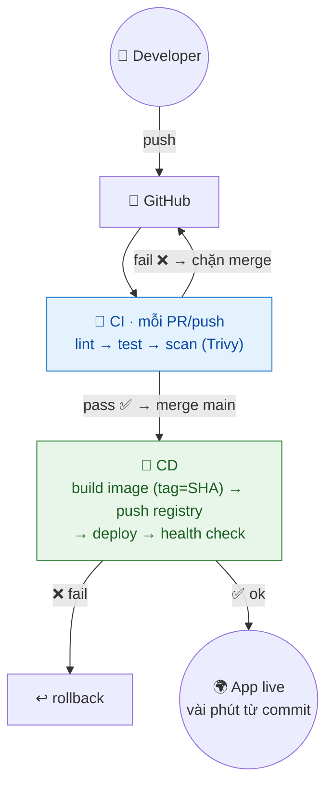
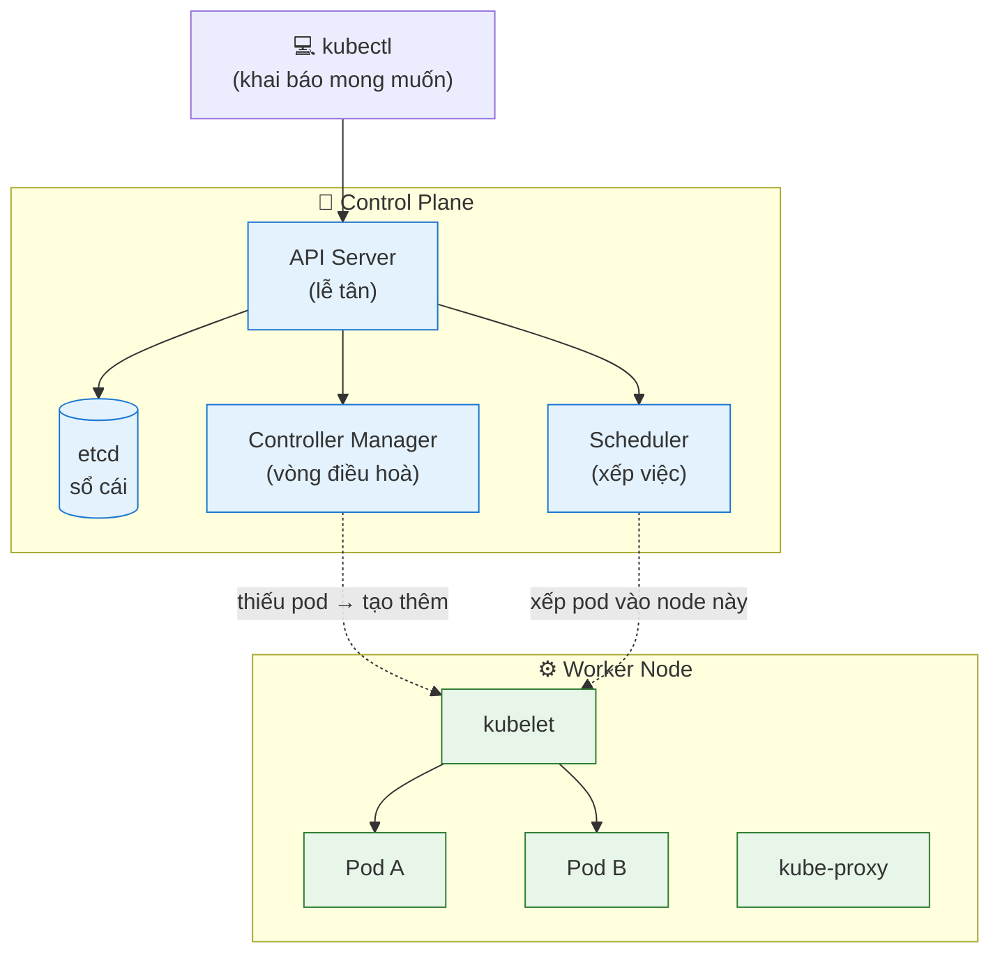
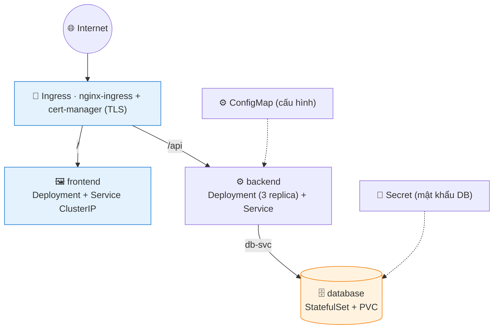
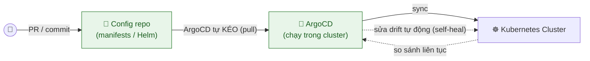
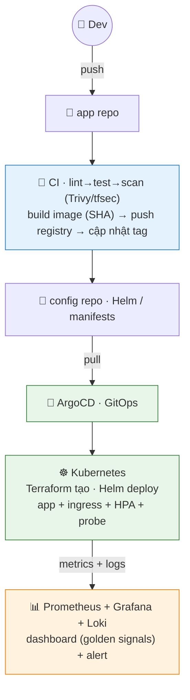

# Giai đoạn 3 — CI/CD, Kubernetes & Tự động hóa nâng cao

> **Ngày 31–50** · Trái tim của DevOps: pipeline tự động và điều phối container ở quy mô lớn.
>
> **Khuôn mỗi ngày:** 📘 Lý thuyết → 🧪 Lab cơ bản → 🚀 Lab nâng cao (best-practice) → 💡 Bổ sung thực tế → 📝 Bài ôn tập.
>
> ✅ Trung lập nền tảng: ví dụ CI dùng GitHub Actions, K8s dùng Minikube/local, cloud dùng ví dụ chung — đều có ghi chú công cụ tương đương (GitLab CI, EKS/GKE/AKS...).

---

## Mục lục

| Ngày | Chủ đề |
|------|--------|
| [31](#ngày-31--cicd-khái-niệm--github-actions-cơ-bản) | CI/CD — Khái niệm & GitHub Actions cơ bản |
| [32](#ngày-32--ci-pipeline--build-test--lint-tự-động) | CI Pipeline — Build, Test & Lint tự động |
| [33](#ngày-33--cd-pipeline--build--push-docker-image) | CD Pipeline — Build & Push Docker Image |
| [34](#ngày-34--cd-pipeline--tự-động-deploy-lên-server) | CD Pipeline — Tự động Deploy lên Server |
| [35](#ngày-35--milestone--pipeline-cicd-hoàn-chỉnh) | **Milestone — Pipeline CI/CD hoàn chỉnh** |
| [36](#ngày-36--kubernetes--khái-niệm--kiến-trúc) | Kubernetes — Khái niệm & Kiến trúc |
| [37](#ngày-37--kubernetes--pod-deployment--replicaset) | Kubernetes — Pod, Deployment & ReplicaSet |
| [38](#ngày-38--kubernetes--service--networking) | Kubernetes — Service & Networking |
| [39](#ngày-39--kubernetes--configmap-secret--storage) | Kubernetes — ConfigMap, Secret & Storage |
| [40](#ngày-40--milestone--deploy-full-stack-lên-kubernetes) | **Milestone — Deploy Full-stack lên Kubernetes** |
| [41](#ngày-41--kubernetes--health-check-resource--autoscaling) | Kubernetes — Health Check, Resource & Autoscaling |
| [42](#ngày-42--helm--package-manager-cho-kubernetes) | Helm — Package Manager cho Kubernetes |
| [43](#ngày-43--gitops--argocd--triển-khai-khai-báo) | GitOps — ArgoCD & Triển khai khai báo |
| [44](#ngày-44--monitoring--prometheus--metrics) | Monitoring — Prometheus & Metrics |
| [45](#ngày-45--monitoring--grafana-dashboard) | Monitoring — Grafana Dashboard |
| [46](#ngày-46--logging-tập-trung--loki) | Logging tập trung — Loki |
| [47](#ngày-47--configuration-management--ansible) | Configuration Management — Ansible |
| [48](#ngày-48--terraform-nâng-cao--module-remote-state--workspace) | Terraform nâng cao — Module, Remote State |
| [49](#ngày-49--bảo-mật-devsecops--best-practices) | Bảo mật DevSecOps & Best Practices |
| [50](#ngày-50--milestone--lab-tổng-hợp-giai-đoạn-3) | **Milestone — LAB tổng hợp Giai đoạn 3** |

---

## Ngày 31 — CI/CD: Khái niệm & GitHub Actions cơ bản

> ⏱️ ~90 phút · Loại: CI/CD
>
> 🧭 **Bạn đang ở đâu:** Giai đoạn 2 (Git, Docker, Cloud, IaC) → **Ngày 31 (CI/CD — robot tự build/test khi bạn push)** → Ngày 32 (pipeline CI đầy đủ). Đây là kỹ năng "định danh" của nghề DevOps, và là lời giải cho nỗi đau deploy tay ở Ngày 28.
>
> 🔧 *Ví dụ dùng GitHub Actions vì miễn phí và không phải cài gì. Tương đương: **GitLab CI** (`.gitlab-ci.yml`), **Jenkins** (`Jenkinsfile`), **CircleCI** — khác cú pháp, giống hệt nhau về tư duy.*
>
> ✅ **Chuẩn bị:** tài khoản GitHub + Git đã cấu hình (Ngày 1), Node.js trên máy (`node --version`, cần ≥ 18). Không cần cài server CI — GitHub cấp máy chạy sẵn.
>
> 🎁 **Cuối ngày bạn có gì:** repo `ci-demo` với một ứng dụng Node nhỏ và workflow đầu tiên tự chạy test mỗi lần bạn push. **Repo này dùng xuyên suốt Ngày 31 → 35**, đừng xoá.

### 📘 Lý thuyết

#### 1. Vấn đề có thật: vì sao cần robot

Nhớ lại Ngày 28 — bạn deploy bằng tay: SSH vào server, `git pull`, `npm install`, restart. Nó chạy được. Nhưng:

- Hôm bạn nghỉ phép, **không ai khác biết thứ tự các bước**.
- Có hôm bạn quên chạy test → đẩy bug lên production, phát hiện sau 3 tiếng.
- Có hôm bạn quên bước `npm install` → app chết vì thiếu thư viện.
- Hỏi "lần deploy tuần trước ai làm, lúc mấy giờ, từ commit nào?" → **không ai trả lời được**.

Điểm chung: quy trình nằm **trong đầu một người**, không nằm trong code. CI/CD là việc lấy quy trình đó ra khỏi đầu bạn và **viết nó thành file**, để máy chạy — mỗi lần y hệt nhau, có log, có dấu vết.

| | Viết tắt | Máy làm gì cho bạn |
|---|---|---|
| **CI** | Continuous Integration | Mỗi lần push → tự **build + test + lint**, báo lỗi trong vài phút |
| **CD** | Continuous Delivery/Deployment | Test đạt → tự **đưa lên** staging/production |

#### 2. GitHub Actions — robot có sẵn ngay trong repo

Bạn đặt một file YAML vào đúng thư mục `.github/workflows/`. GitHub thấy file đó, và mỗi khi có sự kiện (push, mở Pull Request), nó **mượn cho bạn một máy ảo sạch**, tải code về, rồi chạy đúng các bước bạn ghi. Không cần dựng server CI, không tốn tiền với repo cá nhân.

#### 3. Ba tầng: Workflow → Job → Step

| Tầng | Là gì | Chạy thế nào |
|---|---|---|
| **Workflow** | Cả quy trình = 1 file YAML | Khởi động bởi **trigger** (`on:`) |
| **Job** | Một nhóm việc, chạy trên **1 máy ảo riêng** | Các job **chạy song song** mặc định; dùng `needs:` để bắt xếp hàng |
| **Step** | Từng bước trong job | **Tuần tự** từ trên xuống |

> ⚠️ Điểm này người mới hay vấp: **hai job khác nhau = hai máy khác nhau**. Job A tạo file thì job B *không thấy file đó*. Muốn chuyển đồ giữa các job phải dùng **artifact** (Ngày 32).

#### 4. Bốn thứ bạn sẽ gặp trong mọi workflow

- **Trigger** (`on:`) — khi nào chạy: `push`, `pull_request`, `schedule` (theo giờ), `workflow_dispatch` (bấm tay).
- **Runner** (`runs-on:`) — máy ảo GitHub cấp (`ubuntu-latest`), **xoá sạch sau mỗi lần chạy**. Chính vì sạch nên CI không bao giờ dính bệnh "máy tôi chạy được".
- **Action** (`uses:`) — khối dựng sẵn người khác viết, cài bằng 1 dòng: `actions/checkout` (tải code), `actions/setup-node` (cài Node).
- **Lệnh shell** (`run:`) — gõ gì trên Linux thì viết y vậy: `npm ci`, `npm test`.

#### 5. Secret — chỗ cất chìa khoá

Token, mật khẩu **không bao giờ** được viết thẳng vào YAML, vì YAML nằm trong repo — commit lên là lộ vĩnh viễn (kể cả sau này xoá đi, lịch sử Git vẫn còn). Cất ở **Settings → Secrets and variables → Actions**, rồi đọc bằng `${{ secrets.TEN_BIEN }}`. GitHub tự thay giá trị bằng `***` trong log.

### 🧪 LAB — Ứng dụng Node + workflow CI đầu tiên

> **Mục tiêu:** tạo repo `ci-demo`, viết app nhỏ có test, rồi để GitHub tự chạy test mỗi lần push. Toàn bộ file dưới đây đầy đủ, copy là chạy.

**Cây thư mục sẽ tạo:**

```text
ci-demo/
├── .github/
│   └── workflows/
│       └── ci.yml          # workflow đầu tiên
├── src/
│   └── tinh-tien.js        # hàm nghiệp vụ để có cái mà test
├── test/
│   └── tinh-tien.test.js   # test tự động
├── app.js                  # web server nhỏ
└── package.json
```

#### File 1 — `package.json`

```json
{
  "name": "ci-demo",
  "version": "1.0.0",
  "description": "App mẫu để học CI/CD",
  "main": "app.js",
  "scripts": {
    "start": "node app.js",
    "test": "node --test test/"
  },
  "license": "MIT"
}
```

> 📌 `node --test` là bộ chạy test **có sẵn trong Node từ bản 18** — không phải cài thêm thư viện nào. Bớt được một tầng phức tạp cho người mới.

#### File 2 — `src/tinh-tien.js`

```javascript
// Tính tiền đơn hàng: cộng tiền các món rồi áp mã giảm giá (nếu có).
function tinhTien(cacMon, phanTramGiam = 0) {
  if (!Array.isArray(cacMon)) {
    throw new Error('cacMon phải là một mảng');
  }
  const tongTho = cacMon.reduce((tong, mon) => tong + mon.gia * mon.soLuong, 0);
  return Math.round(tongTho * (1 - phanTramGiam / 100));
}

module.exports = { tinhTien };
```

#### File 3 — `test/tinh-tien.test.js`

```javascript
const test = require('node:test');
const assert = require('node:assert');
const { tinhTien } = require('../src/tinh-tien');

test('cộng đúng tiền nhiều món', () => {
  const gioHang = [
    { gia: 20000, soLuong: 2 },
    { gia: 15000, soLuong: 1 },
  ];
  assert.strictEqual(tinhTien(gioHang), 55000);
});

test('áp dụng giảm giá 10%', () => {
  const gioHang = [{ gia: 100000, soLuong: 1 }];
  assert.strictEqual(tinhTien(gioHang, 10), 90000);
});

test('giỏ rỗng thì trả 0', () => {
  assert.strictEqual(tinhTien([]), 0);
});

test('truyền sai kiểu thì báo lỗi', () => {
  assert.throws(() => tinhTien('không phải mảng'));
});
```

#### File 4 — `app.js`

```javascript
const http = require('node:http');
const { tinhTien } = require('./src/tinh-tien');

const PORT = process.env.PORT || 3000;

const server = http.createServer((req, res) => {
  if (req.url === '/health') {
    res.writeHead(200, { 'Content-Type': 'application/json' });
    return res.end(JSON.stringify({ trangThai: 'ok' }));
  }
  const demo = tinhTien([{ gia: 20000, soLuong: 2 }], 10);
  res.writeHead(200, { 'Content-Type': 'application/json' });
  res.end(JSON.stringify({ thongDiep: 'ci-demo đang chạy', donHangMau: demo }));
});

server.listen(PORT, () => console.log(`Đang nghe ở cổng ${PORT}`));
```

#### File 5 — `.github/workflows/ci.yml` ← nhân vật chính hôm nay

```yaml
name: CI

# KHI NÀO chạy
on:
  push:
    branches: [main]
  pull_request:
    branches: [main]

jobs:
  test:                          # tên job, bạn tự đặt
    runs-on: ubuntu-latest       # máy ảo GitHub cấp, sạch mỗi lần chạy

    steps:
      - name: Tải code về runner
        uses: actions/checkout@v4      # thiếu bước này thì runner rỗng, không có gì để test

      - name: Cài Node.js
        uses: actions/setup-node@v4
        with:
          node-version: '20'

      - name: Chạy test
        run: npm test                  # gõ gì trên Linux thì viết y vậy

      - name: Báo cáo kết quả
        run: echo "✅ Test đã chạy xong trên commit ${{ github.sha }}"
```

> 📌 **Về số phiên bản action** (`@v4`): luôn **ghim phiên bản**, đừng dùng `@main`. `@main` nghĩa là "lấy bản mới nhất bất kể nó đổi gì" — hôm nay chạy, mai tác giả sửa là pipeline bạn gãy, tệ hơn là bị chèn mã độc. Muốn biết bản mới nhất hiện tại, tra tên action trên [GitHub Marketplace](https://github.com/marketplace?type=actions).

### 🧭 Hướng dẫn làm LAB — step by step

> Làm **tuần tự**. Sau mỗi bước, đối chiếu khối *"Bạn sẽ thấy"* rồi mới đi tiếp.

#### Bước 1 — Tạo repo trên GitHub

Vào GitHub → **New repository** → tên `ci-demo` → chọn **Private** → **Create repository**.

✅ **Checkpoint:** GitHub hiện trang repo rỗng kèm hướng dẫn `git remote add origin ...`.

💡 *Vì sao Private:* từ Ngày 34 bạn sẽ gắn máy của mình vào repo này làm nơi chạy lệnh. Repo public thì người lạ mở Pull Request cũng có thể khiến code của họ chạy trên máy bạn — rất nguy hiểm. Tập thói quen Private ngay từ đầu.

#### Bước 2 — Tạo project ở máy và viết 5 file

```bash
mkdir -p ~/ci-demo/.github/workflows ~/ci-demo/src ~/ci-demo/test
cd ~/ci-demo
```

Tạo lần lượt 5 file ở phần LAB (dùng `nano` hoặc VS Code). Rồi kiểm tra cây thư mục:

```bash
find . -type f -not -path './.git/*' | sort
```

**Bạn sẽ thấy:**
```text
./.github/workflows/ci.yml
./app.js
./package.json
./src/tinh-tien.js
./test/tinh-tien.test.js
```

✅ **Checkpoint:** đủ 5 file, và `ci.yml` nằm đúng trong `.github/workflows/`.

⚠️ **Sai chỗ này là hỏng cả ngày:** phải đúng `.github/workflows/` — có dấu chấm đầu, `workflows` số nhiều. Đặt vào `.github/workflow/` hay `github/workflows/` thì GitHub **im lặng bỏ qua**, không báo lỗi gì cả, và bạn sẽ ngồi tự hỏi vì sao tab Actions trống trơn.

#### Bước 3 — Chạy test ở máy trước khi đẩy lên

Luôn chạy thử ở máy trước — đừng dùng CI làm nơi thử lần đầu.

```bash
npm install          # không có thư viện ngoài, nhưng lệnh này sinh ra package-lock.json
npm test
```

**Bạn sẽ thấy:**
```text
✔ cộng đúng tiền nhiều món (1.2ms)
✔ áp dụng giảm giá 10% (0.3ms)
✔ giỏ rỗng thì trả 0 (0.2ms)
✔ truyền sai kiểu thì báo lỗi (0.4ms)
# pass 4
# fail 0
```

✅ **Checkpoint:** `# pass 4` và `# fail 0`.

⚠️ **Nếu báo `Cannot find module '../src/tinh-tien'`:** sai đường dẫn hoặc sai tên file. Kiểm tra lại bằng `ls src/`.

💡 *Vì sao chạy `npm install` dù không có thư viện nào:* nó sinh ra `package-lock.json` — file khoá phiên bản. Ngày 32 sẽ dùng `npm ci` (nhanh hơn, chính xác hơn) và lệnh đó **bắt buộc** phải có lock file.

#### Bước 4 — Đẩy lên GitHub

```bash
git init -b main
git add .
git commit -m "Khởi tạo app ci-demo + workflow CI đầu tiên"
git remote add origin git@github.com:<ten-github-cua-ban>/ci-demo.git
git push -u origin main
```

**Bạn sẽ thấy:**
```text
Enumerating objects: 11, done.
...
To github.com:<ten-cua-ban>/ci-demo.git
 * [new branch]      main -> main
```

✅ **Checkpoint:** vào trang repo trên GitHub, thấy đủ 5 file.

⚠️ **Nếu `git push` đòi username/password:** remote đang dùng HTTPS. Đổi sang SSH (bạn đã tạo khoá từ Ngày 1):
```bash
git remote set-url origin git@github.com:<ten-cua-ban>/ci-demo.git
```

#### Bước 5 — Xem robot chạy lần đầu

Mở repo trên GitHub → tab **Actions**.

**Bạn sẽ thấy:** một dòng tên đúng bằng commit message của bạn, có chấm vàng 🟡 đang quay (đang chạy), rồi chuyển ✅ xanh sau khoảng 20–40 giây.

✅ **Checkpoint:** dấu ✅ xanh.

Bấm vào dòng đó → bấm job **test** → mở rộng từng bước. Bạn sẽ thấy đúng 4 bước đã viết, kèm thời gian từng bước và log của `npm test` với `# pass 4`.

⚠️ **Nếu tab Actions trống rỗng:** file đặt sai chỗ (xem lại Bước 2), hoặc YAML sai cú pháp. Kiểm tra ngay tại chỗ: mở file `ci.yml` **trên giao diện GitHub** — nếu YAML hỏng, GitHub hiện cảnh báo đỏ kèm số dòng.

💡 Để ý bước *"Tải code về runner"* mất vài giây: đó là máy ảo đang `git clone` repo về. **Máy này hoàn toàn sạch** — không có code, không có Node, không có gì của bạn. Mọi thứ nó cần đều phải khai trong YAML. Đây chính là lý do CI không bao giờ dính bệnh "trên máy tôi vẫn chạy".

#### Bước 6 — Cố ý làm hỏng để thấy CI bắt lỗi

CI chỉ có giá trị khi nó **chặn được cái sai**. Kiểm chứng ngay:

```bash
# Sửa logic cho sai: đổi dấu trừ thành dấu cộng
sed -i 's|1 - phanTramGiam / 100|1 + phanTramGiam / 100|' src/tinh-tien.js
npm test
```

**Bạn sẽ thấy ở máy:**
```text
✔ cộng đúng tiền nhiều món
✖ áp dụng giảm giá 10%
  ...
  expected: 90000
  actual:   110000
# pass 3
# fail 1
```

Giờ cứ đẩy cái sai đó lên:

```bash
git commit -am "Thử: cố ý làm sai công thức giảm giá"
git push
```

**Bạn sẽ thấy trên tab Actions:** ❌ đỏ. Bấm vào xem log — đúng dòng `expected: 90000 / actual: 110000`, kèm email báo lỗi gửi về hộp thư của bạn.

✅ **Checkpoint:** thấy run ❌ đỏ và đọc được **chính xác test nào hỏng**.

💡 **Đây là toàn bộ giá trị của CI trong một câu:** bug bị bắt sau 30 giây bởi máy, thay vì sau 3 ngày bởi khách hàng.

Sửa lại cho đúng rồi đẩy lên:
```bash
sed -i 's|1 + phanTramGiam / 100|1 - phanTramGiam / 100|' src/tinh-tien.js
git commit -am "Sửa lại công thức giảm giá"
git push
```
Run mới phải ✅ xanh trở lại.

#### Bước 7 — Chứng minh "hai job = hai máy khác nhau"

Đây là hiểu lầm phổ biến nhất về CI. Tự tay kiểm chứng. Thêm vào cuối `ci.yml`:

```yaml
  # THÊM vào cuối file ci.yml, thụt lề ngang hàng với job "test"
  job-a:
    runs-on: ubuntu-latest
    steps:
      - run: echo "xin chào từ job A" > ghichu.txt
      - run: cat ghichu.txt

  job-b:
    runs-on: ubuntu-latest
    steps:
      - run: cat ghichu.txt || echo "❌ Không thấy file — vì đây là MÁY KHÁC"
```

Push lên và xem tab Actions.

**Bạn sẽ thấy:** 3 job (`test`, `job-a`, `job-b`) chạy **cùng lúc**, và `job-b` in ra dòng `❌ Không thấy file — vì đây là MÁY KHÁC`.

✅ **Checkpoint:** hiểu rằng file do `job-a` tạo hoàn toàn không tồn tại ở `job-b`.

💡 Muốn job chạy **xếp hàng** thay vì song song, thêm `needs:`:
```yaml
  job-b:
    needs: job-a        # chờ job-a xong mới chạy
```
Còn muốn **chuyển file** giữa các job thì phải dùng **artifact** — học ở Ngày 32.

Dọn dẹp: xoá `job-a` và `job-b` khỏi `ci.yml` rồi push (đó chỉ là thí nghiệm).

#### Bước 8 — Dùng thử Secret

Tạo secret: repo → **Settings → Secrets and variables → Actions → New repository secret**
- Name: `LOI_CHAO`
- Secret: `xin-chao-tu-secret`

Thêm bước này vào cuối job `test` trong `ci.yml`:

```yaml
      - name: Thử đọc secret
        run: |
          echo "Giá trị secret là: ${{ secrets.LOI_CHAO }}"
          echo "Độ dài chuỗi: ${#LOI_CHAO}"
        env:
          LOI_CHAO: ${{ secrets.LOI_CHAO }}
```

Push và xem log.

**Bạn sẽ thấy:**
```text
Giá trị secret là: ***
Độ dài chuỗi: 18
```

✅ **Checkpoint:** giá trị bị che thành `***`, nhưng độ dài vẫn in ra `18` — chứng tỏ workflow **thực sự đọc được** secret, chỉ là không hiện ra log.

💡 **Bài học quan trọng:** việc che `***` chỉ là lớp bảo vệ cuối. Nếu bạn *biến đổi* secret rồi mới in (ví dụ `base64`, cắt chuỗi), phần đã biến đổi **không được che nữa** → vẫn lộ. Nguyên tắc cứng: không bao giờ in secret ra log.

### 💡 Đi làm mới thấm (sách cơ bản hay bỏ quên)

- **Pull Request từ fork KHÔNG được cấp secrets.** Đây là cố tình, để người lạ không thể mở PR chỉ nhằm `echo` trộm token của bạn. Vì vậy dự án mã nguồn mở phải tách các job cần secret ra khỏi CI chạy trên PR. (`pull_request_target` cấp lại secrets nhưng là con dao hai lưỡi nổi tiếng — đừng dùng khi chưa hiểu kỹ.)
- **`concurrency` chống chạy chồng.** Push liên tiếp 5 commit thì mặc định *cả 5* run cùng chạy — tốn phút runner, và nếu là job deploy thì chúng đè lên nhau. Thêm vào đầu workflow:
  ```yaml
  concurrency:
    group: ${{ github.workflow }}-${{ github.ref }}
    cancel-in-progress: true      # huỷ run cũ, chỉ giữ run mới nhất
  ```
- **Siết quyền của `GITHUB_TOKEN`.** Token mặc định mạnh hơn bạn tưởng. Khai `permissions: { contents: read }` ở đầu workflow rồi chỉ nới đúng thứ cần (`packages: write` khi push image ở Ngày 33). Nếu một action bạn dùng bị chèn mã độc, thiệt hại bị giới hạn lại.
- **Đừng copy-paste YAML giữa các repo.** Khi 5–10 repo cùng một pipeline, tách thành **reusable workflow** (`workflow_call`) — sửa một chỗ, áp dụng mọi nơi. Đúng tư duy "đừng lặp code", chỉ là áp cho pipeline.
- **Phút runner không miễn phí vô hạn.** Repo public thì free thật; repo private có hạn mức tháng. Pipeline chạy 10 phút × 50 lần/ngày là con số thật sự tốn tiền ở công ty — đó là lý do Ngày 32 học **cache** và **xếp bước rẻ lên trước**.
- **Ghim action bằng SHA cho môi trường nhạy cảm.** `@v4` vẫn là một nhãn có thể bị đẩy đi nơi khác. Mức bảo mật cao nhất là ghim nguyên SHA: `uses: actions/checkout@8f4b7f8...`. Đây là chuẩn ở các công ty làm nghiêm về supply chain.

### 🎯 Đúc kết Ngày 31

**3 điều phải mang theo:**

1. **CI/CD là lấy quy trình ra khỏi đầu bạn và viết thành file** để máy chạy lại y hệt mỗi lần, có log, có dấu vết. Công cụ nào cũng chỉ là chi tiết.
2. **Runner là máy sạch** — mọi thứ nó cần phải khai trong YAML. Vì sạch nên "trên máy tôi vẫn chạy" không còn là cái cớ được nữa.
3. **Job song song, mỗi job một máy riêng.** Muốn xếp thứ tự dùng `needs:`, muốn chuyển file dùng artifact.

> 🧠 **Một câu để nhớ:** CI không làm code bạn đúng hơn — nó chỉ đảm bảo **cái sai bị phát hiện trong 30 giây thay vì 3 ngày**.

**✅ Tự chấm** *(đánh dấu khi làm được mà không nhìn tài liệu):*

- [ ] Viết được workflow tối thiểu chạy được: `on:` → `jobs:` → `runs-on:` → `steps:`
- [ ] Nói đúng đường dẫn bắt buộc của file workflow và điều gì xảy ra nếu đặt sai
- [ ] Giải thích vì sao luôn cần `actions/checkout` ở bước đầu
- [ ] Chứng minh được hai job chạy trên hai máy khác nhau
- [ ] Dùng Secret và nói rõ vì sao che `***` không phải bùa hộ mệnh
- [ ] Tự gây lỗi và đọc log CI tìm ra đúng test nào hỏng

✅ **Kết quả đạt được:** Một repo có CI thật — mỗi lần push, máy tự tải code, cài Node, chạy test và báo đỏ/xanh cho bạn.

---

## Ngày 32 — CI Pipeline: Build, Test & Lint tự động

> ⏱️ ~90 phút · Loại: CI/CD
>
> 🧭 **Bạn đang ở đâu:** Ngày 31 (workflow đầu tiên) → **Ngày 32 (pipeline CI nhiều tầng: lint → test nhiều phiên bản → build → lưu sản phẩm)** → Ngày 33 (đóng gói thành Docker image). Hôm nay bạn biến workflow đồ chơi thành pipeline dùng được thật.
>
> ✅ **Chuẩn bị:** repo `ci-demo` của Ngày 31 đang ✅ xanh. Kiểm tra nhanh: `cd ~/ci-demo && npm test`.
>
> 🎁 **Cuối ngày bạn có gì:** pipeline 3 tầng chạy đúng thứ tự, test song song trên 2 phiên bản Node, có cache cho nhanh, đóng gói sản phẩm tải về được — và `main` bị **khoá không cho merge khi CI đỏ**.

### 📘 Lý thuyết

#### 1. Vì sao phải xếp lớp: kinh tế học của thời gian chờ

Pipeline giống nhiều tấm lưới lọc đặt nối tiếp nhau:

| Lớp | Bắt loại lỗi | Mất bao lâu |
|---|---|---|
| **Lint** | Lỗi hình thức: biến thừa, gọi tên không tồn tại, style lộn xộn | ~10 giây |
| **Test** | Lỗi logic: tính sai, xử lý thiếu trường hợp | ~1–5 phút |
| **Build** | Lỗi ghép nối: thiếu file, import sai, không đóng gói được | ~1–10 phút |

Nguyên tắc: **xếp lớp rẻ và nhanh lên trước**. Một lỗi gõ nhầm tên biến bị lint chặn trong 10 giây thì không đáng để chạy hết bộ test 5 phút rồi mới phát hiện. Thứ tự các bước trong pipeline không phải ngẫu nhiên — nó là bài toán tiết kiệm thời gian chờ của cả đội.

#### 2. `needs:` — bắt các job xếp hàng

Ngày 31 bạn đã tự chứng minh job chạy **song song** mặc định. Nhưng build mà chạy song song với test thì vô nghĩa: test còn chưa biết đúng sai, đóng gói làm gì?

```yaml
jobs:
  lint:  { ... }
  test:  { needs: lint }          # chờ lint xong, xanh mới chạy
  build: { needs: test }          # chờ test xong, xanh mới chạy
```

`needs:` vừa xếp thứ tự, vừa có nghĩa "job trước **đỏ thì job sau không chạy**" — tự động dừng dây chuyền khi hỏng.

#### 3. Matrix — cùng công thức, nhiều loại bếp

Bạn viết code trên Node 20. Nhưng server công ty đang chạy Node 18. Nó có chạy được không? Đừng đoán — hãy thử cả hai **cùng lúc**:

```yaml
strategy:
  matrix:
    node: [18, 20]
```

GitHub sẽ nhân job đó ra thành 2 bản chạy song song, một bản Node 18, một bản Node 20. Thêm một phiên bản vào danh sách = thêm một bản chạy, không phải viết lại gì.

#### 4. Cache — đừng tải lại thứ đã tải

Runner sạch mỗi lần chạy, nghĩa là mỗi lần đều phải tải lại toàn bộ thư viện từ Internet. Dự án thật có vài trăm thư viện → 2–3 phút chỉ để chờ tải, mỗi lần push.

**Cache** lưu lại thư mục thư viện, lần sau lấy ra dùng. Khoá cache dựa trên `package-lock.json`: file lock không đổi → thư viện không đổi → dùng lại được. Với `actions/setup-node` chỉ cần một dòng `cache: 'npm'`.

#### 5. Artifact — cách duy nhất chuyển đồ giữa các job

Nhớ Ngày 31: hai job = hai máy khác nhau, file không tự đi theo. **Artifact** là nơi gửi đồ: job này `upload-artifact`, job kia `download-artifact`. Nó cũng là cách để **bạn tải sản phẩm về máy** từ giao diện GitHub.

#### 6. `npm ci` khác `npm install` thế nào

| | `npm install` | `npm ci` ← dùng trong CI |
|---|---|---|
| Đọc file nào | `package.json` (khoảng phiên bản) | `package-lock.json` (phiên bản chính xác) |
| Có sửa lock không | Có — âm thầm nâng phiên bản | **Không bao giờ** |
| Thư mục cũ | Cài đè lên | Xoá sạch rồi cài lại |
| Kết quả | Có thể khác nhau giữa các lần | **Luôn giống hệt nhau** |

CI cần tính tái lập → luôn `npm ci`. Nó cũng nhanh hơn đáng kể.

#### 7. Branch protection — biến CI từ trang trí thành rào chắn

CI mà không có branch protection giống như **lắp camera an ninh nhưng vẫn để cửa mở**: bạn *nhìn thấy* code đỏ, nhưng vẫn bấm merge được. Bật branch protection cho `main` là biến kết quả CI thành **điều kiện bắt buộc** — chưa xanh thì nút Merge khoá cứng, không ai phá lệ được, kể cả bạn.

### 🧪 LAB — Pipeline CI 3 tầng hoàn chỉnh

> **Mục tiêu:** nâng cấp `ci-demo` thành pipeline thật. Làm tiếp trên repo cũ.

**Những file sẽ thêm/sửa:**

```text
ci-demo/
├── .github/workflows/ci.yml   # VIẾT LẠI hoàn toàn
├── eslint.config.js           # THÊM — luật cho lint
├── package.json               # SỬA — thêm script lint
└── (các file cũ giữ nguyên)
```

#### File 1 — `eslint.config.js` (thêm mới)

```javascript
// ESLint 9 dùng "flat config" — cấu hình là một mảng các khối luật.
module.exports = [
  {
    files: ['**/*.js'],
    languageOptions: {
      ecmaVersion: 2022,
      sourceType: 'commonjs',
      // Khai báo các biến toàn cục của Node để ESLint không báo "không tồn tại"
      globals: {
        require: 'readonly',
        module: 'writable',
        process: 'readonly',
        console: 'readonly',
        __dirname: 'readonly',
      },
    },
    rules: {
      'no-unused-vars': 'error',   // biến khai rồi không dùng → lỗi
      'no-undef': 'error',         // dùng tên không tồn tại → lỗi
      'eqeqeq': 'error',           // bắt buộc === thay vì == (tránh bẫy so sánh lỏng)
      'no-console': 'off',         // app nhỏ, cho phép console.log
    },
  },
];
```

#### File 2 — `package.json` (sửa lại)

```json
{
  "name": "ci-demo",
  "version": "1.0.0",
  "description": "App mẫu để học CI/CD",
  "main": "app.js",
  "scripts": {
    "start": "node app.js",
    "test": "node --test test/",
    "lint": "eslint ."
  },
  "devDependencies": {
    "eslint": "^9.0.0"
  },
  "license": "MIT"
}
```

> 📌 `devDependencies` = thư viện chỉ cần khi phát triển/kiểm tra, **không đi theo lên production**. ESLint đúng là loại đó.

#### File 3 — `.github/workflows/ci.yml` (viết lại toàn bộ)

```yaml
name: CI

on:
  push:
    branches: [main]
  pull_request:
    branches: [main]

# Push liên tiếp thì huỷ run cũ, chỉ giữ run mới nhất — đỡ tốn phút runner
concurrency:
  group: ${{ github.workflow }}-${{ github.ref }}
  cancel-in-progress: true

# Mặc định chỉ cho đọc; job nào cần hơn thì tự khai thêm
permissions:
  contents: read

jobs:
  # ---------- TẦNG 1: rẻ nhất, chạy trước ----------
  lint:
    name: Kiểm tra chất lượng code
    runs-on: ubuntu-latest
    steps:
      - uses: actions/checkout@v4

      - uses: actions/setup-node@v4
        with:
          node-version: '20'
          cache: 'npm'              # bật cache thư viện npm

      - name: Cài thư viện
        run: npm ci

      - name: Chạy ESLint
        run: npm run lint

  # ---------- TẦNG 2: test trên nhiều phiên bản Node ----------
  test:
    name: Test trên Node ${{ matrix.node }}
    needs: lint                     # lint đỏ thì không chạy
    runs-on: ubuntu-latest
    strategy:
      fail-fast: false              # Node 18 hỏng vẫn chạy nốt Node 20 để biết toàn cảnh
      matrix:
        node: [18, 20]
    steps:
      - uses: actions/checkout@v4

      - uses: actions/setup-node@v4
        with:
          node-version: ${{ matrix.node }}
          cache: 'npm'

      - run: npm ci

      - name: Chạy test
        run: npm test

  # ---------- TẦNG 3: đóng gói sản phẩm ----------
  build:
    name: Đóng gói
    needs: test                     # chỉ đóng gói khi MỌI bản test đều xanh
    runs-on: ubuntu-latest
    steps:
      - uses: actions/checkout@v4

      - uses: actions/setup-node@v4
        with:
          node-version: '20'
          cache: 'npm'

      - run: npm ci

      - name: Tạo thư mục sản phẩm
        run: |
          mkdir -p dist
          cp -r app.js src package.json package-lock.json dist/
          echo "Commit: ${{ github.sha }}"      >  dist/PHIEN-BAN.txt
          echo "Nhánh:  ${{ github.ref_name }}" >> dist/PHIEN-BAN.txt
          ls -la dist/

      - name: Lưu sản phẩm để tải về
        uses: actions/upload-artifact@v4
        with:
          name: ci-demo-build
          path: dist/
          retention-days: 7         # tự xoá sau 7 ngày, đỡ chật kho
```

### 🧭 Hướng dẫn làm LAB — step by step

#### Bước 1 — Cài ESLint ở máy và sinh lại lock file

```bash
cd ~/ci-demo
npm install --save-dev eslint
```

**Bạn sẽ thấy:**
```text
added 90 packages, and audited 91 packages in 6s
found 0 vulnerabilities
```

✅ **Checkpoint:** có thư mục `node_modules/` và `package-lock.json` đã được cập nhật.

💡 `--save-dev` ghi ESLint vào mục `devDependencies`. Đây là lý do `npm ci` trên runner sau này biết phải cài ESLint.

#### Bước 2 — Tạo `eslint.config.js` rồi chạy thử ở máy

Tạo file theo nội dung phần LAB, rồi:

```bash
npm run lint
```

**Bạn sẽ thấy:** không có dòng nào in ra (im lặng = sạch, không lỗi).

✅ **Checkpoint:** lệnh kết thúc, không có lỗi. Kiểm tra mã trả về: `echo $?` phải ra `0`.

Giờ thử cho nó bắt lỗi thật — thêm một biến thừa vào cuối `src/tinh-tien.js`:

```bash
echo "const bienThua = 123;" >> src/tinh-tien.js
npm run lint
```

**Bạn sẽ thấy:**
```text
/home/ban/ci-demo/src/tinh-tien.js
  12:7  error  'bienThua' is assigned a value but never used  no-unused-vars

✖ 1 problem (1 error, 0 warnings)
```

✅ **Checkpoint:** ESLint chỉ đúng số dòng và tên luật bị vi phạm.

Xoá dòng thừa đi trước khi đi tiếp:
```bash
sed -i '/const bienThua/d' src/tinh-tien.js
npm run lint      # phải im lặng trở lại
```

⚠️ **Nếu báo `Cannot find module 'eslint'`:** chưa chạy `npm install --save-dev eslint` ở Bước 1.

#### Bước 3 — Đừng quên `.gitignore`

```bash
printf 'node_modules/\ndist/\n' > .gitignore
git status --short
```

**Bạn sẽ thấy:** danh sách file thay đổi **không có** `node_modules/`.

✅ **Checkpoint:** `node_modules` không xuất hiện trong `git status`.

⚠️ **Lỡ commit `node_modules` là một nỗi khổ kinh điển** — repo phình lên hàng trăm MB và mọi lần pull đều chậm. Nếu lỡ rồi: `git rm -r --cached node_modules` rồi commit lại.

#### Bước 4 — Thay `ci.yml` và đẩy lên

Viết lại `.github/workflows/ci.yml` theo nội dung phần LAB, rồi:

```bash
git add .
git commit -m "Nâng cấp CI: lint -> test (matrix) -> build + artifact"
git push
```

Mở tab **Actions** trên GitHub, bấm vào run mới nhất.

**Bạn sẽ thấy sơ đồ các job như thế này:**
```text
Kiểm tra chất lượng code  ✅
        ↓
Test trên Node 18  ✅        Test trên Node 20  ✅     ← hai ô này chạy SONG SONG
        ↓
Đóng gói  ✅
```

✅ **Checkpoint:** đúng 4 ô job, nối bằng mũi tên, tất cả xanh.

⚠️ **Nếu job `lint` đỏ với `npm ci can only install with an existing package-lock.json`:** bạn chưa commit `package-lock.json`. Kiểm tra: `git ls-files | grep lock`. Nếu trống thì `git add package-lock.json` rồi push lại.

💡 Để ý sơ đồ tự vẽ ra mũi tên đúng như `needs:` bạn khai — GitHub hiểu được thứ tự phụ thuộc và hiển thị thành hình.

#### Bước 5 — Tải sản phẩm về máy

Trong trang run vừa chạy, kéo xuống cuối → mục **Artifacts** → có ô `ci-demo-build`.

Bấm tải về, giải nén, mở file `PHIEN-BAN.txt`.

**Bạn sẽ thấy:**
```text
Commit: 3f7a2c9d8e1b4a6c5f0d9e8b7a6c5d4e3f2a1b0c
Nhánh:  main
```

✅ **Checkpoint:** mã commit trong file khớp đúng với commit bạn vừa push.

💡 **Vì sao phải nhúng mã commit vào sản phẩm:** ba tuần nữa, khi production gặp lỗi lạ, câu hỏi đầu tiên luôn là *"bản đang chạy được build từ commit nào?"*. Không nhúng thì không ai trả lời được. Đây là thói quen nhỏ mà cực kỳ giá trị lúc sự cố.

#### Bước 6 — Đo hiệu quả của cache

Push một commit nhỏ (không đổi thư viện):

```bash
echo "# ci-demo" > README.md
git add README.md && git commit -m "Thêm README" && git push
```

Mở run mới, vào job `lint`, mở rộng bước **Cài Node.js**.

**Bạn sẽ thấy:**
```text
Cache restored successfully
Cache restored from key: node-cache-Linux-x64-npm-8f3d2a...
```

Rồi so sánh thời gian bước `npm ci` giữa run đầu tiên và run này.

✅ **Checkpoint:** run sau nhanh hơn rõ rệt (thường từ ~8 giây xuống ~2 giây).

💡 Dự án thật có 500+ thư viện thì khoản tiết kiệm này là **2–3 phút mỗi lần push**. Nhân với 50 lần push/ngày của cả đội — đó là lý do cache không phải chuyện nhỏ.

#### Bước 7 — Kiểm chứng `needs:` thực sự chặn dây chuyền

Cố ý làm lint đỏ:

```bash
echo "const rac = 999;" >> app.js
git commit -am "Thử: cố ý để biến thừa cho lint bắt"
git push
```

**Bạn sẽ thấy trên tab Actions:**
```text
Kiểm tra chất lượng code  ❌
        ↓
Test trên Node 18  ⊘ Skipped      Test trên Node 20  ⊘ Skipped
        ↓
Đóng gói  ⊘ Skipped
```

✅ **Checkpoint:** 3 job sau đều **Skipped** — không hề chạy.

💡 **Đây chính là "kinh tế học của thời gian":** một biến thừa bị chặn sau 15 giây, thay vì để pipeline chạy hết 6 phút rồi mới báo hỏng. Trên pipeline thật có build Docker và deploy, khoản tiết kiệm này rất lớn.

Sửa lại rồi push:
```bash
sed -i '/const rac/d' app.js
git commit -am "Bỏ biến thừa"
git push
```

#### Bước 8 — Khoá `main`: biến CI thành rào bắt buộc

Vào repo → **Settings → Branches → Add branch protection rule** *(giao diện mới: **Settings → Rules → Rulesets → New branch ruleset**)*.

Điền:
- **Branch name pattern:** `main`
- ✅ **Require a pull request before merging**
- ✅ **Require status checks to pass before merging** → ô tìm kiếm, gõ và chọn: `Kiểm tra chất lượng code`, `Test trên Node 18`, `Test trên Node 20`
- ✅ **Require branches to be up to date before merging**

Bấm **Create** / **Save changes**.

✅ **Checkpoint:** trang Branches hiện luật đang áp cho `main`.

⚠️ **Nếu ô tìm status check không thấy tên job:** GitHub chỉ gợi ý những check **đã từng chạy ít nhất một lần**. Push một commit bất kỳ rồi quay lại.

#### Bước 9 — Thử phá luật để thấy nó chặn thật

```bash
git checkout -b thu-pha-luat
echo "const lai_rac = 1;" >> app.js
git commit -am "Thử: PR có lỗi lint"
git push -u origin thu-pha-luat
```

Vào GitHub → bấm **Compare & pull request** → **Create pull request**.

**Bạn sẽ thấy trong trang PR:**
```text
❌ Some checks were not successful
   ❌ Kiểm tra chất lượng code — Failing after 18s
   ⊘  Test trên Node 18 — Skipped

🔒 Merging is blocked
   Required statuses must pass before merging
```

Và **nút Merge bị làm mờ, không bấm được**.

✅ **Checkpoint:** nút Merge thực sự bị khoá.

💡 **Đây là khoảnh khắc CI đổi vai:** từ chỗ *"một cái đèn để nhìn"* thành *"một cánh cửa có khoá"*. Chất lượng không còn phụ thuộc vào việc có ai nhớ nhìn CI hay không.

Dọn dẹp:
```bash
git checkout main
git branch -D thu-pha-luat
git push origin --delete thu-pha-luat
```

### 💡 Đi làm mới thấm (sách cơ bản hay bỏ quên)

- **`fail-fast: false` — chi tiết nhỏ, khác biệt lớn.** Mặc định matrix là `fail-fast: true`: Node 18 hỏng thì GitHub **huỷ luôn** bản Node 20 đang chạy. Kết quả: bạn chỉ biết "18 hỏng", không biết 20 có hỏng không → sửa xong lại phải chờ một vòng nữa. Đặt `false` để nhìn toàn cảnh ngay lần đầu.
- **Cache có thể "ôi thiu".** Cache đánh khoá theo `package-lock.json`. Nếu pipeline hành xử lạ lùng mà code không sai, hãy nghi cache: xoá ở **Actions → Caches**, chạy lại. Đây là một trong những lỗi tốn thời gian nhất vì nó không giống lỗi tí nào.
- **Đừng đưa bước deploy vào cùng workflow với CI khi chưa cần.** CI chạy trên *mọi* PR, kể cả PR của người lạ. Deploy phải có trigger riêng, hẹp hơn (chỉ `main`, hoặc chỉ khi gắn tag) — Ngày 34 sẽ làm đúng cách.
- **`timeout-minutes` cứu bạn khỏi hoá đơn bất ngờ.** Một test treo có thể chạy đến tận 6 tiếng (giới hạn mặc định của GitHub) rồi mới bị giết. Thêm `timeout-minutes: 10` vào mỗi job là thói quen tốt.
- **Lint và test đo hai thứ khác nhau — đừng gộp.** Lint bảo *"code viết có sạch không"*, test bảo *"code chạy có đúng không"*. Code lint sạch tuyệt đối vẫn có thể tính sai tiền. Nhiều người mới tưởng lint xanh là yên tâm.
- **Test coverage là con dao hai lưỡi.** Ép "phải đạt 80% coverage" thường đẻ ra một đống test rỗng chỉ để chạy qua code chứ không kiểm tra gì. Coverage thấp là tín hiệu đáng xem xét; coverage cao **không** chứng minh chất lượng.

### 🎯 Đúc kết Ngày 32

**3 điều phải mang theo:**

1. **Xếp lớp rẻ-nhanh lên trước** (lint → test → build) và nối bằng `needs:`. Lỗi bị chặn càng sớm càng đỡ tốn thời gian chờ của cả đội.
2. **Runner sạch nên mỗi job phải tự lo lấy đồ:** `checkout` → `setup-node` (kèm `cache`) → `npm ci`. Muốn chuyển sản phẩm sang job khác hay tải về máy thì dùng **artifact**.
3. **CI không có branch protection chỉ là trang trí.** Bật rào bắt buộc thì code đỏ không thể merge, kể cả bạn cũng không phá lệ được.

> 🧠 **Một câu để nhớ:** CI cho bạn *nhìn thấy* code hỏng; **branch protection** mới là thứ *ngăn* code hỏng vào `main`.

**✅ Tự chấm** *(đánh dấu khi làm được mà không nhìn tài liệu):*

- [ ] Giải thích vì sao lint phải đứng trước test, test đứng trước build
- [ ] Viết được `needs:` và chứng minh job sau bị Skipped khi job trước đỏ
- [ ] Dùng matrix test 2 phiên bản Node và nói rõ tác dụng của `fail-fast: false`
- [ ] Bật cache và chỉ ra được dòng `Cache restored` trong log
- [ ] Tạo artifact, tải về, và nói vì sao phải nhúng mã commit vào sản phẩm
- [ ] Phân biệt `npm ci` với `npm install` và biết vì sao CI phải dùng `npm ci`
- [ ] Bật branch protection và tự kiểm chứng nút Merge bị khoá

✅ **Kết quả đạt được:** Một pipeline CI đúng chuẩn đi làm — nhiều tầng, chạy song song hợp lý, có cache, có sản phẩm tải về, và chặn được code hỏng vào nhánh chính.

---

## Ngày 33 — CD Pipeline: Build & Push Docker Image

> ⏱️ ~90 phút · Loại: CI/CD
>
> 🧭 **Bạn đang ở đâu:** Ngày 32 (CI kiểm tra code) → **Ngày 33 (đóng gói thành Docker image và đẩy lên kho)** → Ngày 34 (kéo image đó về server để chạy). Đây là chữ **CD** đầu tiên: từ "code đúng" sang "**có bản chạy được, đánh số rõ ràng, ai cũng kéo về được**".
>
> ✅ **Chuẩn bị:** repo `ci-demo` với CI đang ✅ xanh (Ngày 32); Docker trên máy (Ngày 16–18). Kiểm tra: `docker --version`.
>
> 🎁 **Cuối ngày bạn có gì:** mỗi lần push lên `main`, GitHub tự build Docker image và đẩy lên kho GHCR với tag theo mã commit — bạn kéo về máy chạy được ngay bằng một lệnh.

### 📘 Lý thuyết

#### 1. Vì sao artifact `.zip` của Ngày 32 chưa đủ

Hôm qua bạn đã có sản phẩm tải về được. Nhưng đem cái `.zip` đó lên server thì vẫn phải: cài đúng phiên bản Node, cài thư viện, đặt biến môi trường, viết systemd service... — tức là **vẫn phụ thuộc vào việc server được chuẩn bị đúng cách**.

Docker image giải quyết triệt để: nó gói **cả hệ điều hành nền, runtime, thư viện và code** vào một khối duy nhất. Server chỉ cần biết chạy Docker, không cần biết bên trong là Node hay Python.

| | Artifact `.zip` (Ngày 32) | Docker image (hôm nay) |
|---|---|---|
| Chứa gì | Chỉ code của bạn | Code + Node + thư viện + OS nền |
| Server cần gì | Đúng phiên bản Node, đúng thư viện | Chỉ cần Docker |
| Chạy thế nào | Nhiều bước chuẩn bị | `docker run` một lệnh |
| Chạy chỗ khác | Hay lệch môi trường | Giống hệt nhau ở mọi nơi |

#### 2. Registry — kho chứa image

Build xong image nằm ở máy runner, mà runner thì **bị xoá sau vài phút**. Phải đẩy image lên một cái kho để nó sống tiếp — đó là **registry**.

| Registry | Địa chỉ | Ghi chú |
|---|---|---|
| **GHCR** (GitHub Container Registry) | `ghcr.io` | Nằm ngay trong GitHub, **không cần tạo tài khoản mới** ← dùng hôm nay |
| Docker Hub | `docker.io` | Phổ biến nhất, bản free có giới hạn lượt kéo |
| AWS ECR / Google Artifact Registry | theo cloud | Dùng khi hạ tầng đã ở cloud đó |

Chọn GHCR vì bạn đăng nhập bằng **token có sẵn của workflow** (`GITHUB_TOKEN`) — không phải tạo và cất thêm mật khẩu nào.

#### 3. Tag image — chỗ 90% người mới làm sai

Cám dỗ lớn nhất là tag mọi thứ là `latest`. Nhưng `latest` chỉ là **một cái nhãn dán di động**, không phải một phiên bản:

- Production đang chạy `latest`. Hỏi *"đang chạy code nào?"* → **không ai biết**.
- Cần quay về bản hôm qua → **không có gì để quay về**, vì `latest` đã bị ghi đè.

Cách làm đúng: **mỗi lần build gắn một tag bất biến theo mã commit**, rồi *thêm* `latest` như một bí danh tiện tay:

```text
ghcr.io/ban/ci-demo:3f7a2c9     ← tag bất biến, không bao giờ ghi đè  ✅ dùng để deploy
ghcr.io/ban/ci-demo:latest      ← bí danh trỏ tới bản mới nhất        ⚠️ chỉ để thử nhanh
```

Deploy **luôn dùng tag bất biến**. Khi đó "quay về bản trước" chỉ là đổi một chuỗi ký tự.

#### 4. Multi-stage build — nhắc lại từ Ngày 18, giờ dùng thật

Image cồng kềnh thì chậm đẩy, chậm kéo, và chứa nhiều thứ thừa để kẻ xấu khai thác. **Multi-stage**: tầng đầu dùng image to để cài/biên dịch, tầng cuối chỉ chép sang phần cần thiết.

#### 5. `GITHUB_TOKEN` và `permissions`

Mỗi lần workflow chạy, GitHub tự cấp một token tạm sống đúng trong lần chạy đó. Mặc định nó **chỉ được đọc**. Muốn đẩy image lên GHCR phải xin thêm quyền:

```yaml
permissions:
  contents: read
  packages: write      # ← không có dòng này thì push bị từ chối 403
```

Nguyên tắc **đặc quyền tối thiểu**: xin đúng thứ cần, không xin thừa.

### 🧪 LAB — Tự động build & đẩy image lên GHCR

**Những file sẽ thêm:**

```text
ci-demo/
├── Dockerfile                       # THÊM
├── .dockerignore                    # THÊM
└── .github/workflows/
    ├── ci.yml                       # giữ nguyên từ Ngày 32
    └── cd-image.yml                 # THÊM — workflow đóng gói
```

#### File 1 — `Dockerfile`

```dockerfile
# ---------- Tầng 1: cài thư viện ----------
FROM node:20-alpine AS deps
WORKDIR /app
COPY package.json package-lock.json ./
RUN npm ci --omit=dev          # --omit=dev: BỎ eslint và mọi devDependencies

# ---------- Tầng 2: image cuối, chỉ giữ thứ cần để chạy ----------
FROM node:20-alpine
WORKDIR /app

ENV NODE_ENV=production

# Tạo user thường — KHÔNG chạy app bằng root
RUN addgroup -S nhom && adduser -S ungdung -G nhom

COPY --from=deps /app/node_modules ./node_modules
COPY app.js package.json ./
COPY src ./src

USER ungdung                   # từ đây trở đi container chạy bằng user thường

EXPOSE 3000

# Docker tự kiểm tra sức khoẻ app, không cần chờ người phát hiện
HEALTHCHECK --interval=30s --timeout=3s --start-period=5s --retries=3 \
  CMD wget -qO- http://127.0.0.1:3000/health || exit 1

CMD ["node", "app.js"]
```

#### File 2 — `.dockerignore`

```text
node_modules
.git
.github
test
dist
*.md
.gitignore
eslint.config.js
```

> 📌 **Vì sao cần file này:** không có nó, Docker gửi *toàn bộ* thư mục (kể cả `node_modules` hàng chục MB và cả lịch sử `.git`) sang trình build → build chậm và image có thể lẫn thứ không nên có.

#### File 3 — `.github/workflows/cd-image.yml`

```yaml
name: CD - Đóng gói image

on:
  push:
    branches: [main]          # CHỈ main — không đóng gói cho mọi nhánh nháp
  workflow_dispatch:          # cho phép bấm tay chạy lại từ giao diện

permissions:
  contents: read
  packages: write             # BẮT BUỘC để đẩy image lên GHCR

jobs:
  build-push:
    name: Build & đẩy image
    runs-on: ubuntu-latest
    timeout-minutes: 15

    steps:
      - uses: actions/checkout@v4

      # Tên image trên GHCR BẮT BUỘC viết thường; username có chữ hoa sẽ lỗi
      - name: Chuẩn bị tên image (viết thường)
        run: echo "IMAGE=ghcr.io/$(echo '${{ github.repository }}' | tr '[:upper:]' '[:lower:]')" >> $GITHUB_ENV

      - name: Đăng nhập GHCR
        uses: docker/login-action@v3
        with:
          registry: ghcr.io
          username: ${{ github.actor }}
          password: ${{ secrets.GITHUB_TOKEN }}     # token tự cấp, không cần tự tạo

      - name: Bật Buildx (trình build có cache)
        uses: docker/setup-buildx-action@v3

      - name: Build và đẩy image
        uses: docker/build-push-action@v6
        with:
          context: .
          push: true
          tags: |
            ${{ env.IMAGE }}:${{ github.sha }}
            ${{ env.IMAGE }}:latest
          cache-from: type=gha          # dùng lại cache lớp Docker của lần build trước
          cache-to: type=gha,mode=max

      - name: In ra lệnh để kéo image về
        run: |
          echo "### Image đã sẵn sàng 🎉" >> $GITHUB_STEP_SUMMARY
          echo '```bash' >> $GITHUB_STEP_SUMMARY
          echo "docker pull ${{ env.IMAGE }}:${{ github.sha }}" >> $GITHUB_STEP_SUMMARY
          echo '```' >> $GITHUB_STEP_SUMMARY
```

### 🧭 Hướng dẫn làm LAB — step by step

#### Bước 1 — Build và chạy thử ở máy trước

Luôn kiểm chứng Dockerfile tại chỗ — đừng để CI là nơi thử lần đầu.

```bash
cd ~/ci-demo
docker build -t ci-demo:thu .
```

**Bạn sẽ thấy:**
```text
[+] Building 12.4s (15/15) FINISHED
 => [deps 3/4] COPY package.json package-lock.json ./
 => [deps 4/4] RUN npm ci --omit=dev
 => exporting to image
 => => naming to docker.io/library/ci-demo:thu
```

✅ **Checkpoint:** dòng cuối `FINISHED`, không có `ERROR`.

⚠️ **Nếu lỗi `npm ci ... lock file not found`:** chưa commit/chưa có `package-lock.json`, hoặc bị `.dockerignore` loại nhầm. Kiểm tra: `ls package-lock.json`.

#### Bước 2 — Chạy container và gọi thử

```bash
docker run -d --name thu -p 3000:3000 ci-demo:thu
sleep 2
curl -s localhost:3000/health
echo
curl -s localhost:3000
```

**Bạn sẽ thấy:**
```text
{"trangThai":"ok"}
{"thongDiep":"ci-demo đang chạy","donHangMau":36000}
```

✅ **Checkpoint:** cả 2 lệnh `curl` trả về JSON.

Kiểm tra luôn hai điều best-practice vừa đưa vào Dockerfile:

```bash
docker exec thu whoami            # phải ra: ungdung  (KHÔNG phải root)
docker ps --format '{{.Names}}\t{{.Status}}'
```

**Bạn sẽ thấy:**
```text
ungdung
thu     Up 40 seconds (healthy)
```

✅ **Checkpoint:** user là `ungdung`, và trạng thái có chữ **(healthy)** — đó là `HEALTHCHECK` đang hoạt động.

💡 *Vì sao không chạy bằng root:* nếu app bị khai thác, kẻ tấn công chỉ có quyền của `ungdung` bên trong container, thay vì quyền root. Đây là một trong những mục bị soi đầu tiên khi kiểm tra bảo mật.

Dọn dẹp:
```bash
docker rm -f thu
```

#### Bước 3 — Xem kích thước image (và vì sao multi-stage đáng giá)

```bash
docker images ci-demo:thu --format '{{.Size}}'
docker images node:20 --format '{{.Size}}' 2>/dev/null || echo "(chưa tải node:20 đầy đủ)"
```

**Bạn sẽ thấy:** khoảng `~140MB` cho image của bạn, so với `~1.1GB` của `node:20` đầy đủ.

✅ **Checkpoint:** image dưới 200MB.

💡 Nhỏ hơn không chỉ để đẹp: đẩy nhanh hơn, kéo nhanh hơn, **và ít phần mềm thừa nghĩa là ít lỗ hổng hơn** (Ngày 49 sẽ quét bảo mật chính image này).

#### Bước 4 — Đẩy code lên và xem GitHub tự build

```bash
git add Dockerfile .dockerignore .github/workflows/cd-image.yml
git commit -m "Thêm Dockerfile + workflow tự đẩy image lên GHCR"
git push
```

Mở tab **Actions** → sẽ thấy **hai** workflow cùng chạy: `CI` (của Ngày 32) và `CD - Đóng gói image`.

Bấm vào `CD - Đóng gói image` → job `Build & đẩy image`.

**Bạn sẽ thấy ở bước cuối:**
```text
#15 pushing manifest for ghcr.io/ban/ci-demo:3f7a2c9...
#15 DONE 1.2s
```

✅ **Checkpoint:** workflow ✅ xanh, và ở trang tóm tắt (Summary) có sẵn lệnh `docker pull ...` để copy.

⚠️ **Nếu lỗi `denied: permission_denied: write_package`:** thiếu `permissions: packages: write` trong workflow. Kiểm tra lại đúng phần khai báo.

⚠️ **Nếu lỗi `invalid reference format: repository name must be lowercase`:** username GitHub của bạn có chữ hoa. Bước "Chuẩn bị tên image" đã xử lý việc này — kiểm tra xem bạn có chép thiếu bước đó không.

#### Bước 5 — Tìm image vừa đẩy lên

Vào trang chính của repo → cột bên phải, mục **Packages** → bấm `ci-demo`.

**Bạn sẽ thấy:** trang package liệt kê các tag, trong đó có tag bằng đúng mã commit và tag `latest`.

✅ **Checkpoint:** ít nhất 2 tag, và cột *Published* vừa mới đây.

💡 Mặc định package này là **Private**, kế thừa từ repo. Muốn người khác kéo được thì vào **Package settings → Change visibility → Public**.

#### Bước 6 — Kéo image từ kho về và chạy (đây là lúc thấy CD có nghĩa)

Đăng nhập GHCR ở máy. Cần một **Personal Access Token (classic)** có quyền `read:packages`: GitHub → **Settings → Developer settings → Personal access tokens → Tokens (classic) → Generate new token** → tick `read:packages`.

```bash
echo "<dan-token-vao-day>" | docker login ghcr.io -u <ten-github-cua-ban> --password-stdin
```

**Bạn sẽ thấy:** `Login Succeeded`.

Giờ kéo đúng bản vừa build (thay `<sha>` bằng mã commit trong log workflow):

```bash
docker pull ghcr.io/<ten-cua-ban>/ci-demo:<sha>
docker run -d --name tu-kho -p 3001:3000 ghcr.io/<ten-cua-ban>/ci-demo:<sha>
curl -s localhost:3001/health
```

**Bạn sẽ thấy:**
```text
{"trangThai":"ok"}
```

✅ **Checkpoint:** app chạy từ image **kéo trên Internet về**, không phải image bạn build ở máy.

💡 **Dừng lại một chút và nhận ra điều vừa xảy ra:** bạn push code → máy của GitHub tự đóng gói → đẩy lên kho → máy khác kéo về chạy được ngay. **Không ai chạm tay vào server nào cả.** Đó chính là CD. Ngày mai chỉ còn việc nối bước cuối: tự động kéo về server thật.

Dọn dẹp:
```bash
docker rm -f tu-kho
```

#### Bước 7 — Kiểm chứng vì sao `latest` không đáng tin

Sửa một dòng cho khác đi rồi push:

```bash
sed -i "s/ci-demo đang chạy/ci-demo bản thứ hai/" app.js
git commit -am "Đổi thông điệp để thấy khác biệt giữa hai bản"
git push
```

Chờ workflow xanh, rồi ở máy:

```bash
docker pull ghcr.io/<ten-cua-ban>/ci-demo:latest
docker run --rm -p 3002:3000 -d --name thu-latest ghcr.io/<ten-cua-ban>/ci-demo:latest
curl -s localhost:3002
docker rm -f thu-latest
```

**Bạn sẽ thấy:** `"thongDiep":"ci-demo bản thứ hai"` — `latest` **đã âm thầm trỏ sang bản mới**, dù bạn không đổi gì trong lệnh chạy.

Trong khi đó, chạy lại bằng tag commit **cũ** vẫn ra đúng nội dung cũ:

```bash
docker run --rm -p 3003:3000 -d --name thu-cu ghcr.io/<ten-cua-ban>/ci-demo:<sha-cu>
curl -s localhost:3003          # vẫn là "ci-demo đang chạy"
docker rm -f thu-cu
```

✅ **Checkpoint:** thấy rõ `latest` đổi nội dung sau lưng bạn, còn tag theo commit thì bất biến.

💡 **Bài học đắt giá nhất hôm nay:** production mà chạy `latest` thì bạn **không biết đang chạy gì** và **không có gì để quay về**. Deploy luôn dùng tag bất biến.

### 💡 Đi làm mới thấm (sách cơ bản hay bỏ quên)

- **Image tag bất biến là điều kiện tiên quyết để rollback.** "Quay về bản trước" chỉ đơn giản khi bản trước còn tồn tại dưới một cái tên không đổi. Đây là lý do mọi nơi làm nghiêm túc đều deploy theo SHA hoặc theo version tag, không bao giờ theo `latest`.
- **Build cache của Docker phụ thuộc vào thứ tự dòng.** `COPY package*.json` rồi `RUN npm ci` **trước** `COPY . .` — nhờ vậy sửa code không làm mất cache lớp cài thư viện. Đảo thứ tự là mỗi lần build đều cài lại từ đầu.
- **`cache-from: type=gha` tiết kiệm rất nhiều thời gian.** Không có nó, mỗi lần build trên runner sạch đều làm lại từ số 0. Có nó, các lớp không đổi được lấy lại ngay.
- **Đừng nhét secret vào image.** Mọi `ENV` và mọi file `COPY` vào đều nằm trong lịch sử các lớp — ai kéo image về cũng đọc được bằng `docker history`. Secret phải được đưa vào **lúc chạy** (biến môi trường, file mount), không phải lúc build.
- **Kho image phình rất nhanh.** Mỗi commit một image, vài tháng là hàng nghìn tag chiếm hàng chục GB. Đặt chính sách dọn dẹp (giữ N bản gần nhất) — nếu không, một ngày đẹp trời bạn sẽ nhận hoá đơn hoặc cảnh báo hết dung lượng.
- **Multi-arch khi đội dùng máy Apple Silicon.** Image build trên runner là `amd64`; máy M1/M2/M3 là `arm64` → chạy qua giả lập, chậm hoặc lỗi lạ. Khi cần, thêm `platforms: linux/amd64,linux/arm64` vào `build-push-action`.

### 🎯 Đúc kết Ngày 33

**3 điều phải mang theo:**

1. **Image = code + runtime + thư viện + OS nền trong một khối.** Server chỉ cần biết chạy Docker, hết phụ thuộc vào việc ai đã cài gì trên máy đó.
2. **Tag bất biến theo commit là thứ cho phép bạn rollback.** `latest` chỉ là nhãn dán di động — tiện để thử, không dùng để deploy.
3. **GHCR + `GITHUB_TOKEN` + `permissions: packages: write`** là bộ ba tối thiểu để pipeline tự đẩy image, không phải tự quản lý thêm mật khẩu nào.

> 🧠 **Một câu để nhớ:** deploy bằng `latest` nghĩa là **không biết đang chạy gì, và không có đường lui**.

**✅ Tự chấm** *(đánh dấu khi làm được mà không nhìn tài liệu):*

- [ ] Viết Dockerfile multi-stage có user thường và `HEALTHCHECK`
- [ ] Giải thích vì sao cần `.dockerignore` và điều gì xảy ra nếu thiếu
- [ ] Đăng nhập GHCR trong workflow bằng `GITHUB_TOKEN` và khai đúng `permissions`
- [ ] Gắn 2 tag (SHA + latest) và nói rõ tag nào dùng để deploy
- [ ] Kéo image từ GHCR về máy khác và chạy được
- [ ] Chứng minh `latest` đổi nội dung sau lưng, còn tag SHA thì không

✅ **Kết quả đạt được:** Mỗi lần push lên `main`, hệ thống tự đóng gói ứng dụng thành Docker image có đánh số rõ ràng và đưa lên kho — sẵn sàng cho bất kỳ server nào kéo về chạy.

---

## Ngày 34 — CD Pipeline: Tự động Deploy lên Server

> ⏱️ ~90 phút · Loại: CI/CD
>
> 🧭 **Bạn đang ở đâu:** Ngày 33 (image đã nằm trong kho) → **Ngày 34 (tự động đưa image đó lên server và chạy)** → Ngày 35 (Milestone: ghép cả dây chuyền). Hôm nay là mắt xích cuối: từ `git push` tới "bản mới đang phục vụ người dùng", không ai chạm tay vào server.
>
> ✅ **Chuẩn bị:** repo `ci-demo` với workflow đóng gói image đang ✅ xanh (Ngày 33); máy Linux có Docker + Docker Compose.
>
> 🎁 **Cuối ngày bạn có gì:** push code lên `main` → khoảng 2 phút sau, bản mới **tự chạy** trên "server" của bạn, kèm kiểm tra sức khoẻ tự động và **nút rollback bấm một cái là về bản cũ**.
>
> 💻 **Về chuyện "server":** bài này dùng **chính máy Linux của bạn** làm server, thông qua **self-hosted runner** — miễn phí, không cần thuê cloud, không cần IP public. Cuối bài có phương án SSH tới VM thật khi bạn đã có server.

### 📘 Lý thuyết

#### 1. Hai mô hình deploy — chọn đúng ngay từ đầu

| | **Push** (CI đẩy vào server) | **Pull** (agent trong server tự kéo) |
|---|---|---|
| Cách chạy | CI giữ khoá SSH / kubeconfig, chủ động vào server ra lệnh | Một tiến trình nằm sẵn trong server, tự hỏi "có bản mới không?" rồi tự cập nhật |
| Khoá bí mật | **CI phải giữ chìa khoá vào server** | Server không cần mở cửa cho ai |
| Server cần | Mở cổng SSH cho runner ngoài Internet | Không cần mở cổng vào |
| Học ở | **Hôm nay** | Ngày 43 (GitOps/ArgoCD) |

Hôm nay học mô hình **push** vì nó trực quan và vẫn cực kỳ phổ biến. Nhưng hãy nhớ nhược điểm cốt lõi: **CI phải giữ chìa khoá vào server production** — chìa khoá càng nhiều nơi giữ thì càng dễ lộ. Ngày 43 sẽ cho thấy cách lật ngược chiều để không ai phải giữ chìa khoá.

#### 2. Self-hosted runner — cách để máy bạn trở thành "server"

Đến giờ mọi job đều chạy trên máy ảo GitHub cấp. GitHub cũng cho phép **bạn tự cắm máy của mình vào**: cài một agent nhỏ, nó kết nối *ra ngoài* tới GitHub và hỏi "có việc gì cho tôi không?".

```text
Máy của bạn  ──(kết nối đi ra)──>  GitHub
             <──(giao việc)───────
```

Điểm hay: **không cần IP public, không cần mở cổng firewall nào** — vì chính máy bạn là bên chủ động gọi ra. Job nào khai `runs-on: self-hosted` sẽ chạy ngay trên máy đó, tức là chạy *trên server*.

> ⚠️ **Cảnh báo bảo mật quan trọng:** **tuyệt đối không** gắn self-hosted runner vào repo **public**. Người lạ mở một Pull Request là code của họ chạy thẳng trên máy bạn. Đây là lý do Ngày 31 bắt bạn tạo repo **Private**.

#### 3. Deploy đúng cách nghĩa là gì

Một lần deploy tử tế phải trả lời được 4 câu:

| Câu hỏi | Cách làm hôm nay |
|---|---|
| Đang chạy **bản nào**? | Deploy theo **tag SHA**, ghi lại vào file trên server |
| Bản mới **có sống không**? | Gọi `/health` sau khi khởi động, thất bại thì báo đỏ |
| Có **quay lui** được không? | Giữ lại SHA bản trước → đổi tag, chạy lại |
| **Ai** deploy, **lúc nào**? | Log workflow lưu vĩnh viễn trong GitHub |

Thiếu bất kỳ câu nào thì đó là "chép file lên server", không phải deploy.

#### 4. Environment — cổng có người gác

GitHub có khái niệm **Environment** (`production`, `staging`). Gắn job deploy vào một environment sẽ cho bạn:

- **Yêu cầu người duyệt**: job dừng lại chờ ai đó bấm *Approve* mới chạy tiếp.
- **Secret riêng theo môi trường**: khoá của staging khác khoá của production.
- **Lịch sử deploy**: GitHub hiện rõ bản nào đang chạy ở đâu.

Đây là thứ ngăn một cú `git push` lúc 11 giờ đêm đi thẳng ra production.

### 🧪 LAB — Tự động deploy lên server của chính bạn

**Những file sẽ thêm:**

```text
ci-demo/
├── deploy/
│   └── docker-compose.prod.yml      # THÊM — mô tả cách chạy trên "server"
└── .github/workflows/
    └── deploy.yml                   # THÊM — workflow deploy
```

#### File 1 — `deploy/docker-compose.prod.yml`

```yaml
services:
  app:
    # Tag image được truyền vào lúc deploy qua biến môi trường IMAGE_TAG
    image: ${IMAGE_NAME}:${IMAGE_TAG}
    container_name: ci-demo-prod
    restart: unless-stopped
    ports:
      - "8080:3000"          # máy: 8080  ->  container: 3000
    environment:
      NODE_ENV: production
    healthcheck:
      test: ["CMD", "wget", "-qO-", "http://127.0.0.1:3000/health"]
      interval: 10s
      timeout: 3s
      retries: 3
      start_period: 5s
    logging:
      driver: json-file
      options:
        max-size: "10m"      # chặn log phình vô hạn làm đầy ổ đĩa
        max-file: "3"
```

#### File 2 — `.github/workflows/deploy.yml`

```yaml
name: Deploy lên server

on:
  # Chỉ chạy SAU KHI workflow đóng gói image đã xong và thành công
  workflow_run:
    workflows: ["CD - Đóng gói image"]
    types: [completed]
    branches: [main]
  # Cho phép bấm tay, và nhập SHA cũ để ROLLBACK
  workflow_dispatch:
    inputs:
      image_tag:
        description: 'Tag image cần deploy (để trống = bản mới nhất trên main)'
        required: false
        type: string

permissions:
  contents: read
  packages: read

jobs:
  deploy:
    name: Deploy
    runs-on: self-hosted            # ← chạy trên MÁY CỦA BẠN, không phải máy GitHub
    timeout-minutes: 10
    environment: production         # ← gắn cổng có người gác

    # Nếu được kích bởi workflow_run thì chỉ chạy khi workflow kia THÀNH CÔNG
    if: ${{ github.event_name == 'workflow_dispatch' || github.event.workflow_run.conclusion == 'success' }}

    steps:
      - uses: actions/checkout@v4

      - name: Xác định image cần deploy
        run: |
          IMAGE_NAME="ghcr.io/$(echo '${{ github.repository }}' | tr '[:upper:]' '[:lower:]')"
          # Ưu tiên tag người dùng nhập tay (dùng khi rollback); không có thì lấy commit hiện tại
          TAG="${{ inputs.image_tag }}"
          if [ -z "$TAG" ]; then
            TAG="${{ github.event.workflow_run.head_sha || github.sha }}"
          fi
          echo "IMAGE_NAME=$IMAGE_NAME" >> $GITHUB_ENV
          echo "IMAGE_TAG=$TAG"         >> $GITHUB_ENV
          echo "Sắp deploy: $IMAGE_NAME:$TAG"

      - name: Đăng nhập GHCR
        run: echo "${{ secrets.GITHUB_TOKEN }}" | docker login ghcr.io -u ${{ github.actor }} --password-stdin

      - name: Ghi lại bản ĐANG chạy (để còn đường lui)
        run: |
          mkdir -p ~/trien-khai
          if [ -f ~/trien-khai/tag-hien-tai.txt ]; then
            cp ~/trien-khai/tag-hien-tai.txt ~/trien-khai/tag-truoc-do.txt
          fi

      - name: Kéo image mới
        run: docker pull "$IMAGE_NAME:$IMAGE_TAG"

      - name: Khởi động bản mới
        working-directory: deploy
        run: docker compose -f docker-compose.prod.yml up -d

      - name: Kiểm tra sức khoẻ (thử 10 lần, mỗi lần cách 3 giây)
        run: |
          for i in $(seq 1 10); do
            if curl -fs http://localhost:8080/health > /dev/null; then
              echo "✅ App khoẻ sau $((i*3)) giây"
              curl -s http://localhost:8080/health; echo
              echo "$IMAGE_TAG" > ~/trien-khai/tag-hien-tai.txt
              exit 0
            fi
            echo "Lần $i: chưa sẵn sàng, chờ thêm..."
            sleep 3
          done
          echo "❌ App không phản hồi sau 30 giây — deploy THẤT BẠI"
          docker compose -f deploy/docker-compose.prod.yml logs --tail 50
          exit 1

      - name: Tóm tắt kết quả
        if: success()
        run: |
          echo "### ✅ Deploy thành công" >> $GITHUB_STEP_SUMMARY
          echo "- Image: \`$IMAGE_NAME:$IMAGE_TAG\`" >> $GITHUB_STEP_SUMMARY
          echo "- Bản trước: \`$(cat ~/trien-khai/tag-truoc-do.txt 2>/dev/null || echo 'chưa có')\`" >> $GITHUB_STEP_SUMMARY
```

### 🧭 Hướng dẫn làm LAB — step by step

#### Bước 1 — Cắm máy bạn vào GitHub làm runner

Vào repo → **Settings → Actions → Runners → New self-hosted runner** → chọn **Linux / x64**.

GitHub hiện sẵn một loạt lệnh **có token riêng của bạn**. Chạy đúng theo trang đó, đại ý:

```bash
mkdir -p ~/actions-runner && cd ~/actions-runner
curl -o actions-runner-linux-x64.tar.gz -L <duong-dan-GitHub-cho-san>
tar xzf actions-runner-linux-x64.tar.gz
./config.sh --url https://github.com/<ten-cua-ban>/ci-demo --token <TOKEN-GITHUB-CHO>
```

Khi `config.sh` hỏi, cứ **Enter** để lấy mặc định (nhóm runner, tên runner, thư mục làm việc).

**Bạn sẽ thấy:**
```text
√ Runner successfully added
√ Runner connection is good
√ Settings Saved.
```

✅ **Checkpoint:** dòng `Runner successfully added`.

Giờ cho nó chạy nền như một dịch vụ hệ thống (để tắt terminal vẫn sống):

```bash
sudo ./svc.sh install
sudo ./svc.sh start
sudo ./svc.sh status
```

**Bạn sẽ thấy:**
```text
● actions.runner.<ten-cua-ban>-ci-demo.<ten-may>.service - GitHub Actions Runner
   Active: active (running) since ...
```

✅ **Checkpoint:** quay lại **Settings → Actions → Runners** trên GitHub, runner hiện chấm xanh **Idle**.

⚠️ **Nếu runner báo Offline:** dịch vụ chưa chạy. Xem log: `sudo journalctl -u actions.runner.* -n 50 --no-pager`.

⚠️ **Nhắc lại lần cuối:** repo phải là **Private**. Runner trên repo public = người lạ chạy được code tuỳ ý trên máy bạn.

#### Bước 2 — Cho runner quyền dùng Docker

Runner chạy dưới user của bạn, user đó phải thuộc nhóm `docker`:

```bash
sudo usermod -aG docker $USER
sudo ./svc.sh stop && sudo ./svc.sh start     # khởi động lại để nhận nhóm mới
docker ps                                      # nếu lệnh này chạy được, là ổn
```

✅ **Checkpoint:** `docker ps` chạy không cần `sudo`.

⚠️ Nếu vẫn `permission denied ... docker.sock`, hãy đăng xuất/đăng nhập lại phiên làm việc rồi khởi động lại dịch vụ runner.

#### Bước 3 — Tạo Environment `production` có người duyệt

Vào repo → **Settings → Environments → New environment** → tên `production` → **Configure environment**:

- ✅ **Required reviewers** → thêm chính bạn
- **Save protection rules**

✅ **Checkpoint:** mục Environments hiện `production` kèm dòng *1 required reviewer*.

💡 Bạn tự duyệt chính mình nghe hơi buồn cười, nhưng hãy làm — để **tận mắt thấy pipeline dừng lại chờ**. Ở công ty, đây chính là cánh cổng ngăn một cú push lúc nửa đêm đi thẳng ra production.

#### Bước 4 — Đẩy 2 file mới lên

```bash
cd ~/ci-demo
mkdir -p deploy
# tạo deploy/docker-compose.prod.yml và .github/workflows/deploy.yml theo phần LAB
git add deploy .github/workflows/deploy.yml
git commit -m "Thêm deploy tự động lên self-hosted runner"
git push
```

Vào tab **Actions**, quan sát thứ tự:

**Bạn sẽ thấy:**
```text
1. CI                       ✅  (khoảng 40 giây)
2. CD - Đóng gói image      ✅  (khoảng 1 phút)
3. Deploy lên server        🟡  Waiting for review     ← dừng lại ở đây!
```

✅ **Checkpoint:** workflow deploy dừng ở trạng thái chờ duyệt.

💡 Để ý cơ chế: `workflow_run` khiến deploy **chỉ khởi động sau khi** workflow đóng gói image kết thúc thành công. Đây là cách nối hai workflow rời thành một dây chuyền — image chưa có thì không bao giờ deploy hụt.

#### Bước 5 — Duyệt và xem nó chạy trên máy bạn

Bấm vào run đang chờ → **Review deployments** → tick `production` → **Approve and deploy**.

Mở một terminal khác và xem trực tiếp:

```bash
watch -n 1 'docker ps --format "table {{.Names}}\t{{.Status}}\t{{.Ports}}"'
```

**Bạn sẽ thấy container hiện ra:**
```text
NAME            STATUS                    PORTS
ci-demo-prod    Up 8 seconds (healthy)    0.0.0.0:8080->3000/tcp
```

Và trong log của job:
```text
Lần 1: chưa sẵn sàng, chờ thêm...
✅ App khoẻ sau 6 giây
{"trangThai":"ok"}
```

Tự kiểm chứng:
```bash
curl -s localhost:8080
```

**Bạn sẽ thấy:**
```text
{"thongDiep":"ci-demo bản thứ hai","donHangMau":36000}
```

✅ **Checkpoint:** app đang phục vụ ở cổng 8080, và bạn **chưa gõ một lệnh docker nào** để đưa nó lên.

#### Bước 6 — Deploy lần thứ hai: thấy cả dây chuyền tự chạy

```bash
sed -i 's/ci-demo bản thứ hai/ci-demo bản thứ BA - deploy tự động/' app.js
git commit -am "Bản thứ ba"
git push
```

Giờ chỉ việc ngồi xem: CI ✅ → đóng gói image ✅ → deploy chờ duyệt → bạn Approve → container tự thay bản mới.

```bash
curl -s localhost:8080
cat ~/trien-khai/tag-hien-tai.txt
cat ~/trien-khai/tag-truoc-do.txt
```

**Bạn sẽ thấy:**
```text
{"thongDiep":"ci-demo bản thứ BA - deploy tự động","donHangMau":36000}
9c4e1f2...        <- SHA đang chạy
3f7a2c9...        <- SHA bản trước, chính là đường lui của bạn
```

✅ **Checkpoint:** nội dung đổi, và file ghi lại đủ **bản đang chạy + bản trước đó**.

💡 Hai dòng SHA này chính là câu trả lời cho hai câu hỏi hay gặp nhất lúc sự cố: *"đang chạy bản nào?"* và *"lui về đâu?"*.

#### Bước 7 — Rollback: quay lui trong 30 giây

Giả sử bản vừa lên có bug. Lấy SHA bản trước:

```bash
cat ~/trien-khai/tag-truoc-do.txt
```

Vào GitHub → **Actions** → workflow **Deploy lên server** → **Run workflow** → dán SHA đó vào ô *Tag image cần deploy* → **Run workflow** → Approve.

Sau khoảng 30 giây:

```bash
curl -s localhost:8080
```

**Bạn sẽ thấy:** nội dung **bản cũ** quay trở lại.

✅ **Checkpoint:** rollback xong mà không cần `git revert`, không cần build lại, không cần SSH vào đâu cả.

💡 **Đây chính là phần thưởng của việc gắn tag bất biến ở Ngày 33.** Bản cũ vẫn nằm nguyên trong kho, nên quay lui chỉ là "chạy lại pipeline với một chuỗi ký tự khác". Nếu hôm qua bạn dùng `latest`, lúc này sẽ không có gì để quay về.

#### Bước 8 — Kiểm chứng healthcheck thật sự chặn deploy hỏng

Cố tình làm app chết ngay khi khởi động:

```bash
sed -i "s|const PORT = process.env.PORT || 3000;|const PORT = 9999; // cố ý sai cổng|" app.js
git commit -am "Thử: cố ý deploy bản hỏng"
git push
```

Chờ image build xong, Approve deploy, rồi xem log job.

**Bạn sẽ thấy:**
```text
Lần 1: chưa sẵn sàng, chờ thêm...
Lần 2: chưa sẵn sàng, chờ thêm...
...
Lần 10: chưa sẵn sàng, chờ thêm...
❌ App không phản hồi sau 30 giây — deploy THẤT BẠI
```

Và job chuyển ❌ đỏ.

✅ **Checkpoint:** pipeline **tự phát hiện bản hỏng** và báo đỏ, thay vì lặng lẽ để hệ thống chết.

Quay lui về bản tốt bằng đúng cách ở Bước 7, rồi sửa code:
```bash
sed -i "s|const PORT = 9999; // cố ý sai cổng|const PORT = process.env.PORT \|\| 3000;|" app.js
git commit -am "Sửa lại cổng"
git push
```

💡 **Lưu ý thẳng thắn về giới hạn của bài này:** khi bản mới hỏng, `docker compose up -d` đã thay container cũ rồi mới kiểm tra sức khoẻ → có một khoảng thời gian dịch vụ chết. Đây là kiểu deploy đơn giản nhất. Muốn **không gián đoạn giây nào** thì cần chạy song song bản cũ và bản mới rồi mới chuyển hướng người dùng — đó là **rolling update / blue-green**, học ở Ngày 37 và 41 với Kubernetes.

### 🔁 Phương án B — Deploy tới VM thật qua SSH

Khi bạn đã có server thật (VM cloud từ Ngày 27), đổi job deploy sang chạy trên runner của GitHub và điều khiển server qua SSH.

Tạo 3 secret trong **Settings → Secrets and variables → Actions**: `SSH_HOST`, `SSH_USER`, `SSH_KHOA_RIENG` (nội dung khoá private, phần công khai đã nạp vào `~/.ssh/authorized_keys` trên server).

```yaml
  deploy-ssh:
    runs-on: ubuntu-latest
    environment: production
    steps:
      - name: Nạp khoá SSH
        run: |
          mkdir -p ~/.ssh
          echo "${{ secrets.SSH_KHOA_RIENG }}" > ~/.ssh/id_ed25519
          chmod 600 ~/.ssh/id_ed25519
          ssh-keyscan -H "${{ secrets.SSH_HOST }}" >> ~/.ssh/known_hosts

      - name: Deploy trên server
        run: |
          ssh -i ~/.ssh/id_ed25519 ${{ secrets.SSH_USER }}@${{ secrets.SSH_HOST }} bash -s <<'KETTHUC'
            set -e
            echo "${GHCR_TOKEN}" | docker login ghcr.io -u "${GHCR_USER}" --password-stdin
            docker pull ghcr.io/ban/ci-demo:TAG_CAN_DEPLOY
            docker stop ci-demo-prod 2>/dev/null || true
            docker rm   ci-demo-prod 2>/dev/null || true
            docker run -d --name ci-demo-prod -p 8080:3000 --restart unless-stopped \
              ghcr.io/ban/ci-demo:TAG_CAN_DEPLOY
          KETTHUC

      - name: Kiểm tra sức khoẻ từ xa
        run: curl -fs http://${{ secrets.SSH_HOST }}:8080/health
```

⚠️ **Ba điều bắt buộc khi làm cách này:**
1. **`ssh-keyscan` là bắt buộc** — thiếu nó SSH sẽ treo chờ câu hỏi "Are you sure you want to continue connecting?" cho đến khi job hết giờ. (Tuyệt đối không dùng `StrictHostKeyChecking=no` để né — đó là mở đường cho tấn công xen giữa.)
2. **Khoá riêng phải là khoá dành riêng cho deploy**, chỉ có quyền tối thiểu trên server — không bao giờ dùng khoá cá nhân của bạn.
3. **Server phải mở cổng SSH ra Internet** cho runner vào. Đây chính là nhược điểm của mô hình push mà GitOps (Ngày 43) sinh ra để giải quyết.

### 💡 Đi làm mới thấm (sách cơ bản hay bỏ quên)

- **Deploy thành công ≠ hệ thống khoẻ.** Container `Up` không có nghĩa app phục vụ được — nó có thể đang chờ database, chờ migration, hoặc đã chết bên trong. Vì vậy **bước kiểm tra sức khoẻ sau deploy là bắt buộc**, không phải tuỳ chọn.
- **Rollback phải tập trước khi cần.** Ai cũng nói "có rollback", nhưng lần đầu dùng nó thường là lúc 2 giờ sáng, hệ thống đang chết, tay run. Hãy bấm thử rollback vài lần lúc bình thường để nó thành phản xạ.
- **Migration database là phần không thể rollback dễ dàng.** Code lui về bản cũ được; nhưng một cột đã bị xoá thì không tự mọc lại. Nguyên tắc sống còn: migration phải **tương thích ngược** (thêm cột trước, bỏ cột ở lần triển khai sau), không bao giờ xoá thứ gì bản đang chạy còn cần.
- **Self-hosted runner là con dao hai lưỡi.** Nó không sạch sau mỗi lần chạy như runner GitHub — rác, cache và cả secret của lần trước đều còn đó. Đừng bao giờ gắn vào repo public, và định kỳ dọn: `docker system prune -af --filter "until=168h"`.
- **`concurrency` cho job deploy quan trọng hơn cho CI.** Hai lần deploy chạy chồng nhau có thể để lại hệ thống ở trạng thái nửa vời, khó đoán. Với deploy hãy dùng `cancel-in-progress: false` (xếp hàng, đừng huỷ) — khác với CI.
- **Giữ log deploy như tài sản.** Câu hỏi "ai deploy cái gì lúc mấy giờ" xuất hiện trong *mọi* buổi mổ xẻ sự cố. Lịch sử Actions trả lời được điều đó — đây là một lợi ích của CD mà người mới thường không để ý.

### 🎯 Đúc kết Ngày 34

**3 điều phải mang theo:**

1. **Deploy là một pipeline có kiểm chứng, không phải thao tác chép file.** Đủ bốn thứ: tag bất biến, kiểm tra sức khoẻ, đường lui, và dấu vết ai-làm-gì-lúc-nào.
2. **Push model đơn giản nhưng buộc CI giữ chìa khoá vào server.** Nhớ nhược điểm này — Ngày 43 (GitOps) sinh ra chính là để lật ngược chiều kết nối.
3. **Rollback chỉ dễ khi bản cũ còn tồn tại dưới một cái tên bất biến.** Đây là lúc bạn thu hoạch thành quả của việc tag theo SHA ở Ngày 33.

> 🧠 **Một câu để nhớ:** deploy tự động không phải để **nhanh hơn**, mà để **lặp lại được và quay lui được** — tốc độ chỉ là phần thưởng đi kèm.

**✅ Tự chấm** *(đánh dấu khi làm được mà không nhìn tài liệu):*

- [ ] Cài self-hosted runner và nói rõ vì sao nó không cần IP public
- [ ] Giải thích rủi ro của self-hosted runner trên repo public
- [ ] Dùng `workflow_run` để nối hai workflow thành dây chuyền
- [ ] Gắn Environment có người duyệt và thấy pipeline dừng lại chờ
- [ ] Viết bước kiểm tra sức khoẻ có thử lại, và chứng minh nó chặn được bản hỏng
- [ ] Thực hiện rollback bằng tag SHA cũ, không cần build lại
- [ ] Nói được vì sao migration database không rollback dễ như code

✅ **Kết quả đạt được:** Dây chuyền hoàn chỉnh từ `git push` tới bản đang phục vụ: kiểm tra code → đóng gói image → chờ duyệt → tự deploy → tự kiểm tra sức khoẻ → có đường lui. Đây chính là CD.

---

## Ngày 35 — MILESTONE: Pipeline CI/CD hoàn chỉnh

> ⏱️ ~120 phút · Loại: Milestone
>
> 🧭 **Bạn đang ở đâu:** Ngày 31–34 (từng mảnh CI/CD) → **Ngày 35 (ghép thành 1 dây chuyền hoàn chỉnh: push là app live)** → Ngày 36 (bước vào Kubernetes). Đây là kỹ năng "định danh" của DevOps Engineer.
>
> ✅ **Chuẩn bị:** app full-stack + Dockerfile, VM cloud SSH được, registry. Ghép lại kiến thức Ngày 31–34.

### 📘 Lý thuyết — Tổng kết

- **Mạch CI/CD:** lint/test → build image → push registry → deploy server → rollback.
- **Đây là kỹ năng định danh của 1 DevOps Engineer.**
- **Best practices:** pipeline nhanh, fail fast, secret an toàn, deploy có thể đảo ngược.

### 📖 Hiểu rõ hơn (giải thích cho người mới)

**Milestone này = ghép cả CI + CD thành 1 dây chuyền hoàn chỉnh.**
`push code → lint → test → quét bảo mật → build image (tag SHA) → push registry → deploy → health check`. Một thay đổi nhỏ trong code, vài phút sau tự lên server — đó là "ma thuật" của DevOps.

**Vì sao đây là kỹ năng "định danh" của DevOps Engineer?**
Pipeline tự động giải đúng 5 điểm yếu của deploy tay (Ngày 28): lặp lại được, có dấu vết (mỗi lần chạy có log), không phụ thuộc 1 người, rollback bằng re-run, ít sai vì máy làm.

**Mẹo phỏng vấn:** demo "tôi sửa 1 dòng → quay video pipeline tự chạy đến lúc app live" thuyết phục hơn mọi lời nói. Mỗi stage "kể" 1 năng lực của bạn (test=chất lượng, scan=bảo mật, build=Docker, deploy=orchestration).

### 🧪 Lab cơ bản (Milestone)

1. Xây pipeline hoàn chỉnh cho app full-stack — từ push code tới deploy tự động lên VM.
2. Pipeline gồm: lint → test → build Docker → push → deploy qua SSH → health check.
3. Thêm status badge vào README.
4. Demo: thực hiện 1 thay đổi nhỏ và quay video/screenshot toàn bộ pipeline chạy thành công.
5. Đẩy lên repo `cicd-pipeline-demo` với tài liệu đầy đủ.

### 🚀 Lab nâng cao (best-practice) — Mô hình hoàn chỉnh

**Mô hình pipeline CI/CD end-to-end:**


**Yêu cầu best-practice:**
1. **CI và CD tách rõ:** CI chạy mọi PR; CD chỉ chạy khi merge main / tag.
2. **Image tag theo SHA**, cache layer, quét Trivy.
3. **Secret trong GitHub Secrets/Environments**, production có approval.
4. **Health check + rollback tự động.**
5. **Status badge** + README mô tả luồng + sơ đồ.

### 🧭 Hướng dẫn làm lab & giải nghĩa lệnh (cho người tự học)

**Trình tự nên làm:** ghép CI (lint→test→scan) + CD (build→push→deploy→health) cho app full-stack → thêm badge → demo end-to-end.

**Giải nghĩa & kết quả mong đợi:**
- Pipeline đầy đủ: `lint → test → build Docker → push → deploy SSH → health check`. *Kết quả:* push code → vài phút sau app live, không thao tác tay.
- Status badge trong README hiện trạng thái build (xanh/đỏ).

**🧪 Thử nghiệm:**
- Thực hiện 1 thay đổi nhỏ, quay màn hình toàn bộ pipeline chạy từ commit đến live. **Bài học:** đây là "demo ăn điểm" khi phỏng vấn.
- Tách rõ: PR chỉ chạy CI; merge main mới chạy CD. **Bài học:** CI ≠ CD về điều kiện kích hoạt.

⚠️ **Dễ sai:** gộp CI và CD chạy mọi push → deploy cả nhánh feature. CD chỉ nên chạy khi merge main / tag.

💡 **Hiểu sâu:** mỗi stage "kể" một năng lực: test (chất lượng), scan (bảo mật), build SHA (truy vết), deploy (orchestration). 1 pipeline = trình diễn cả Giai đoạn 3.

### 📝 Bài ôn tập & Demo đối chiếu

**✍️ Tự kiểm tra:**

<details>
<summary>1. Kể thứ tự các stage của pipeline CI/CD hoàn chỉnh.</summary>

> push → lint → test → scan bảo mật → build image (tag SHA) → push registry → deploy server → health check → (fail? rollback).
</details>

<details>
<summary>2. Vì sao CI chạy mọi PR nhưng CD chỉ chạy khi merge main?</summary>

> CI kiểm tra chất lượng mọi thay đổi (cả nhánh feature). CD đưa lên production — chỉ nên chạy với code đã được duyệt vào main/tag, không deploy mỗi push nhánh.
</details>

<details>
<summary>3. Pipeline giải 5 điểm yếu của deploy tay thế nào?</summary>

> Lặp lại được, có dấu vết (log mỗi run), không phụ thuộc 1 người, rollback bằng re-run tag cũ, ít sai vì máy làm.
</details>

<details>
<summary>4. Vì sao đây là kỹ năng "định danh" của DevOps?</summary>

> Nó gộp mọi năng lực: test (chất lượng), scan (bảo mật), build (Docker), deploy (orchestration) thành 1 dây chuyền tự động — thứ phân biệt DevOps với chỉ biết từng công cụ rời.
</details>

**🔬 Demo đối chiếu:**

| Demo đối chiếu | Kết quả mong đợi |
|---|---|
| Pipeline end-to-end | push → test → build → push → deploy tự động |
| Thời gian commit → live | Đo được (vài phút), không thao tác tay |
| Repo có workflow đầy đủ | `.github/workflows/*.yml` đủ các stage |

### 📚 Thuật ngữ Anh–Việt (tổng hợp CI/CD)

| Thuật ngữ | Nghĩa |
|---|---|
| **Pipeline** | Dây chuyền tự động lint→test→build→deploy |
| **Stage / Job** | Giai đoạn / nhóm việc trong pipeline |
| **Registry** | Kho image |
| **Immutable tag** | Tag bất biến (SHA) để truy vết |
| **Health check** | Kiểm tra app khoẻ sau deploy |
| **Rollback** | Quay về bản trước |
| **Status badge** | Huy hiệu trạng thái build trên README |

### 🎯 Đúc kết Ngày 35 (Milestone CI/CD)

**3 điều phải mang theo:**
1. **Cả Giai đoạn CI/CD gói vào 1 dây chuyền:** `push → lint → test → scan → build (tag SHA) → push registry → deploy → health check → (fail? rollback)`. Bạn không học rời từng công cụ — bạn ghép chúng thành một mạch.
2. **CI ≠ CD ở điều kiện kích hoạt:** CI chạy mọi PR (gác chất lượng), CD chỉ chạy khi merge main/tag (đưa lên). Đừng để mỗi push nhánh feature cũng deploy production.
3. **Mỗi stage là một bằng chứng năng lực:** test (chất lượng), scan (bảo mật), build SHA (truy vết), deploy (orchestration) — một pipeline hoàn chỉnh chính là portfolio sống của bạn.

> 🧠 **Một câu để nhớ:** tách rõ — **CI chạy mọi PR** (kiểm tra), **CD chỉ chạy khi merge main** (deploy). Đừng để mỗi push nhánh feature cũng deploy lên production.

**✅ Tự chấm** *(đánh dấu khi làm được mà không cần nhìn tài liệu):*
- [ ] Dựng pipeline end-to-end cho app full-stack: push → tự lên server
- [ ] Kể đúng thứ tự các stage và vai trò từng stage
- [ ] Giải thích vì sao CI chạy mọi PR còn CD chỉ khi merge main
- [ ] Có health check + rollback tự động và production có approval
- [ ] Demo được "sửa 1 dòng → app live" (quay màn hình) + status badge trong README

✅ **Kết quả đạt được — MỐC 4:** Làm chủ CI/CD end-to-end — năng lực cốt lõi nhất của DevOps.

---

## Ngày 36 — Kubernetes: Khái niệm & Kiến trúc

> ⏱️ ~90 phút · Loại: Kubernetes
>
> 🧭 **Bạn đang ở đâu:** Ngày 35 (CI/CD hoàn chỉnh trên một máy) → **Ngày 36 (Kubernetes — bộ não điều phối container trên nhiều máy)** → Ngày 37 (chạy app bằng Deployment). Hôm nay chỉ tập trung vào **cách K8s nghĩ**; Ngày 37 mới đi sâu vào triển khai ứng dụng.
>
> ☸️ *Học trên **Minikube** (miễn phí, ngay trên máy bạn). Cùng một kiến thức áp dụng được cho **kind**, **k3s**, và cluster thật: **EKS** (AWS) / **GKE** (GCP) / **AKS** (Azure).*
>
> ✅ **Chuẩn bị:** máy Linux có Docker đang chạy, còn trống ít nhất **4 GB RAM** và ~10 GB đĩa.
>
> 🎁 **Cuối ngày bạn có gì:** một cluster Kubernetes chạy trên máy, và bạn sẽ **tự tay giết pod nhiều lần để thấy nó tự hồi sinh** — hiểu được thứ làm nên toàn bộ sức mạnh của K8s.

### 📘 Lý thuyết

#### 1. Vấn đề: hôm qua bạn deploy 1 container lên 1 máy

Ngày 34 pipeline của bạn chạy `docker compose up -d` trên một máy. Nó hoạt động tốt. Giờ hãy hỏi tiếp:

| Tình huống | Với Docker Compose một máy | Ai sẽ xử lý? |
|---|---|---|
| Container chết lúc 3 giờ sáng | `restart: unless-stopped` cứu được nếu tiến trình chết, nhưng app "treo mà chưa chết" thì không | **Bạn** |
| Cả máy chủ hỏng | Toàn bộ dịch vụ chết | **Bạn**, bằng tay, lúc nửa đêm |
| Lượng truy cập tăng gấp 10 | Phải tự thêm máy, tự chia tải | **Bạn** |
| Cập nhật không được gián đoạn | Compose thay container → có khoảng chết | **Bạn** |
| 40 dịch vụ trên 8 máy | Ai nhớ nổi cái gì đang chạy ở đâu? | **Không ai** |

Kubernetes sinh ra để những ô đó ghi **"hệ thống tự lo"**. Nó là phần mềm làm thay đúng công việc mà một người trực đêm phải làm: theo dõi, khởi động lại, phân bổ, thay thế.

#### 2. Điểm cốt lõi nhất: khai báo thay vì ra lệnh

Đây là chỗ khác biệt lớn nhất so với mọi thứ bạn đã học, và cũng là chỗ khó chuyển đổi tư duy nhất:

| | **Ra lệnh** (imperative) — Docker, Bash | **Khai báo** (declarative) — Kubernetes |
|---|---|---|
| Bạn nói gì | *"Chạy container này lên"* | *"Tôi muốn **luôn luôn** có 3 bản đang chạy"* |
| Ai chịu trách nhiệm giữ đúng | Bạn | **Hệ thống** |
| Container chết | Nó chết, đến khi bạn phát hiện | K8s tạo cái mới, **trong vài giây** |
| Tài liệu hệ thống nằm đâu | Trong đầu người vận hành | **Trong file YAML**, đọc là biết |

Bạn nộp cho K8s một bản mô tả **trạng thái mong muốn**. K8s nhận lấy và tự xoay xở để biến nó thành sự thật — rồi **giữ mãi như vậy**.

#### 3. Vòng điều hoà — trái tim của Kubernetes

Tất cả sức mạnh của K8s nằm trong một vòng lặp đơn giản đến bất ngờ, chạy không ngừng:

```text
        ┌──────────────────────────────────────────┐
        │                                          │
        ▼                                          │
  Đọc "mong muốn"  ──>  So với "thực tế"  ──>  Khác nhau?
  (bạn khai: 3 pod)     (đang có: 2 pod)      → Tạo thêm 1 pod
        ▲                                          │
        └──────────── lặp lại mỗi vài giây ────────┘
```

Không có phép màu nào cả. Chỉ là một vòng lặp **so sánh mong muốn với thực tế rồi sửa cho khớp**, chạy suốt 24/7. "Tự phục hồi", "tự mở rộng", "cập nhật không gián đoạn" — tất cả đều chỉ là vòng lặp này áp vào các tình huống khác nhau.

#### 4. Kiến trúc — hình dung như một công ty

| Thành phần | Vai trò trong "công ty" |
|---|---|
| **Control Plane** | Ban giám đốc — ra quyết định, không trực tiếp chạy app |
| ├ **API Server** | Lễ tân: mọi yêu cầu đều đi qua đây. `kubectl` nói chuyện với chính nó |
| ├ **etcd** | Sổ cái: ghi *"mọi thứ đang phải như thế nào"*. Mất etcd = mất trí nhớ cluster |
| ├ **Scheduler** | Người xếp việc: pod mới nên chạy trên máy nào (còn RAM? còn CPU?) |
| └ **Controller Manager** | Quản đốc: chạy các **vòng điều hoà** ở mục 3 |
| **Worker Node** | Nhân viên — nơi container thật sự chạy |
| ├ **kubelet** | Tổ trưởng tại chỗ: nhận lệnh từ API Server, bảo Docker chạy container |
| └ **kube-proxy** | Bưu tá: lo đường mạng cho pod |

> 🔑 **Điểm mấu chốt:** `kubectl` của bạn **không bao giờ** nói chuyện trực tiếp với container. Nó chỉ ghi "mong muốn" vào sổ cái qua lễ tân (API Server). Phần còn lại do các vòng điều hoà tự xử lý. Đây là lý do K8s vẫn tiếp tục hoạt động ngay cả khi bạn tắt máy tính đi ngủ.

#### 5. Ba danh từ phải phân biệt được

- **Pod** — đơn vị nhỏ nhất K8s quản lý. Chứa 1 (thường là vậy) hoặc vài container dùng chung mạng và ổ đĩa. **Pod là thứ dùng một lần rồi bỏ** — chết là thay cái mới, không cứu chữa.
- **Node** — một máy (ảo hoặc vật lý) trong cluster, nơi pod chạy.
- **Cluster** — control plane + toàn bộ node.

> ⚠️ Người mới hay coi pod như "một cái máy nhỏ" cần chăm sóc. Sai. Hãy coi pod như **cốc giấy dùng một lần**: bẩn thì vứt, lấy cái mới. Mọi thiết kế trên K8s đều dựa vào giả định này.

**Sơ đồ — kiến trúc Kubernetes:**


### 🧪 LAB — Dựng cluster và tự tay kiểm chứng vòng điều hoà

> **Mục tiêu:** có cluster chạy, hiểu các thành phần bằng cách **nhìn thấy chúng**, rồi giết pod nhiều kiểu để thấy K8s phản ứng.

**File sẽ tạo:**

```text
lab36-k8s/
├── pod-tran.yaml          # Pod trần — để thấy nó KHÔNG tự hồi sinh
└── deployment-web.yaml    # Deployment — để thấy nó CÓ tự hồi sinh
```

#### File 1 — `pod-tran.yaml`

```yaml
apiVersion: v1
kind: Pod                      # Pod "trần" — không ai quản lý nó
metadata:
  name: web-tran
  labels:
    app: thu-nghiem
spec:
  containers:
    - name: web
      image: nginx:1.27        # tag cụ thể, KHÔNG dùng :latest
      ports:
        - containerPort: 80
      resources:               # xin tài nguyên vừa đủ, tránh chiếm hết máy
        requests:
          memory: "64Mi"
          cpu: "50m"
        limits:
          memory: "128Mi"
```

#### File 2 — `deployment-web.yaml`

```yaml
apiVersion: apps/v1
kind: Deployment               # Deployment = có "quản đốc" trông chừng
metadata:
  name: web
  labels:
    app: web
spec:
  replicas: 3                  # ĐÂY là "mong muốn": luôn có 3 bản chạy
  selector:
    matchLabels:
      app: web                 # quản lý những pod mang nhãn app=web
  template:                    # khuôn để đúc ra pod
    metadata:
      labels:
        app: web               # PHẢI khớp selector ở trên
    spec:
      containers:
        - name: web
          image: nginx:1.27
          ports:
            - containerPort: 80
          resources:
            requests:
              memory: "64Mi"
              cpu: "50m"
            limits:
              memory: "128Mi"
```

### 🧭 Hướng dẫn làm LAB — step by step

#### Bước 1 — Cài `kubectl`

```bash
curl -LO "https://dl.k8s.io/release/$(curl -Ls https://dl.k8s.io/release/stable.txt)/bin/linux/amd64/kubectl"
sudo install -o root -g root -m 0755 kubectl /usr/local/bin/kubectl
rm kubectl
kubectl version --client
```

**Bạn sẽ thấy:**
```text
Client Version: v1.31.x
Kustomize Version: v5.x.x
```

✅ **Checkpoint:** in ra được `Client Version`.

💡 `kubectl` chỉ là **cái điều khiển từ xa** — nó chưa cần cluster nào để cài. Bước sau mới dựng cluster cho nó điều khiển.

#### Bước 2 — Cài Minikube và khởi động cluster

```bash
curl -LO https://storage.googleapis.com/minikube/releases/latest/minikube-linux-amd64
sudo install minikube-linux-amd64 /usr/local/bin/minikube
rm minikube-linux-amd64

minikube start --driver=docker --memory=3072 --cpus=2
```

**Bạn sẽ thấy** (mất 2–5 phút lần đầu vì phải tải image):
```text
😄  minikube v1.34.0 on Ubuntu 24.04
✨  Using the docker driver based on user configuration
🔥  Creating docker container (CPUs=2, Memory=3072MB) ...
🐳  Preparing Kubernetes v1.31.0 on Docker 27.x ...
🏄  Done! kubectl is now configured to use "minikube" cluster
```

✅ **Checkpoint:** dòng `Done! kubectl is now configured...`.

⚠️ **Nếu lỗi `Exiting due to RSRC_INSUFFICIENT_MEMORY`:** máy không đủ RAM trống. Hạ xuống `--memory=2048`, đóng bớt ứng dụng khác.

⚠️ **Nếu lỗi `permission denied ... docker.sock`:** user chưa vào nhóm docker (Ngày 34 Bước 2): `sudo usermod -aG docker $USER` rồi đăng xuất/đăng nhập lại.

💡 Minikube dựng **cả một cluster Kubernetes bên trong một container Docker**. Kiểm chứng ngay: `docker ps` sẽ thấy một container tên `minikube` — cả cluster của bạn nằm trong đó.

#### Bước 3 — Nhìn thấy cluster và node

```bash
kubectl get nodes -o wide
```

**Bạn sẽ thấy:**
```text
NAME       STATUS   ROLES           AGE   VERSION   INTERNAL-IP    OS-IMAGE
minikube   Ready    control-plane   62s   v1.31.0   192.168.49.2   Ubuntu 22.04
```

✅ **Checkpoint:** `STATUS` là `Ready`.

⚠️ **Nếu `The connection to the server ... was refused`:** cluster chưa lên. Kiểm tra `minikube status`; nếu `Stopped` thì `minikube start`.

💡 Ở đây chỉ có **một** node và nó vừa là control plane vừa là worker (cluster học tập). Cluster thật thường 3 control plane + N worker — nhưng mọi khái niệm hoàn toàn giống nhau.

#### Bước 4 — Nhìn thấy chính các thành phần ở phần Lý thuyết

Đây là bước làm lý thuyết trở nên có thật. Các thành phần control plane cũng chỉ là... pod:

```bash
kubectl get pods -n kube-system
```

**Bạn sẽ thấy:**
```text
NAME                               READY   STATUS    RESTARTS   AGE
coredns-7db6d8ff4d-x8k2n           1/1     Running   0          2m
etcd-minikube                      1/1     Running   0          2m
kube-apiserver-minikube            1/1     Running   0          2m
kube-controller-manager-minikube   1/1     Running   0          2m
kube-proxy-9lhdw                   1/1     Running   0          2m
kube-scheduler-minikube            1/1     Running   0          2m
storage-provisioner                1/1     Running   0          2m
```

✅ **Checkpoint:** nhận ra đủ 4 thành phần control plane: `etcd`, `kube-apiserver`, `kube-controller-manager`, `kube-scheduler`.

💡 **Đây chính là bảng ở mục Lý thuyết #4, bằng xương bằng thịt.** `-n kube-system` nghĩa là "trong namespace kube-system" — namespace là cách chia ngăn cluster; phần của bạn mặc định nằm ở namespace `default`.

Xem địa chỉ lễ tân (API Server) mà `kubectl` đang gọi:
```bash
kubectl cluster-info
```
**Bạn sẽ thấy:** `Kubernetes control plane is running at https://192.168.49.2:8443`.

#### Bước 5 — Pod đầu tiên, và chứng minh pod trần rất mong manh

```bash
mkdir -p ~/lab36-k8s && cd ~/lab36-k8s
# tạo pod-tran.yaml theo phần LAB
kubectl apply -f pod-tran.yaml
kubectl get pods
```

**Bạn sẽ thấy:**
```text
pod/web-tran created

NAME       READY   STATUS    RESTARTS   AGE
web-tran   1/1     Running   0          8s
```

✅ **Checkpoint:** `STATUS` là `Running`, cột `READY` là `1/1`.

Giờ giết nó đi:

```bash
kubectl delete pod web-tran
kubectl get pods
```

**Bạn sẽ thấy:**
```text
pod "web-tran" deleted

No resources found in default namespace.
```

✅ **Checkpoint:** pod biến mất **vĩnh viễn**, không có gì tạo lại.

💡 **Vì sao:** pod trần không có ai "mong muốn" nó tồn tại cả. Bạn bảo tạo thì K8s tạo; bạn bảo xoá thì nó xoá; nó chết thì cũng chẳng ai quan tâm. **Đây là lý do thực tế gần như không ai tạo Pod trần** — luôn dùng Deployment.

#### Bước 6 — Deployment: giờ mới có người trông chừng

```bash
# tạo deployment-web.yaml theo phần LAB
kubectl apply -f deployment-web.yaml
kubectl get deployments
kubectl get pods -o wide
```

**Bạn sẽ thấy:**
```text
NAME   READY   UP-TO-DATE   AVAILABLE   AGE
web    3/3     3            3           12s

NAME                   READY   STATUS    RESTARTS   AGE   IP           NODE
web-6f8d9c7b5d-2xk4p   1/1     Running   0          12s   10.244.0.5   minikube
web-6f8d9c7b5d-7mnwq   1/1     Running   0          12s   10.244.0.6   minikube
web-6f8d9c7b5d-k9zlt   1/1     Running   0          12s   10.244.0.7   minikube
```

✅ **Checkpoint:** đúng **3 pod**, tên đều bắt đầu bằng `web-` kèm hai đoạn mã ngẫu nhiên.

💡 Bạn chỉ viết `replicas: 3` — **không hề ra lệnh tạo pod nào**. Vòng điều hoà đọc thấy "mong muốn 3, thực tế 0" nên tự tạo đủ 3.

#### Bước 7 — Giết pod và bấm giờ xem nó hồi sinh

Đây là bước quan trọng nhất cả ngày. Mở **hai terminal**.

**Terminal 1** — theo dõi trực tiếp:
```bash
kubectl get pods -w
```

**Terminal 2** — giết một pod (thay tên bằng pod thật của bạn):
```bash
kubectl delete pod web-6f8d9c7b5d-2xk4p
```

**Bạn sẽ thấy ở Terminal 1:**
```text
web-6f8d9c7b5d-2xk4p   1/1     Terminating         0     3m
web-6f8d9c7b5d-vv8qr   0/1     Pending             0     0s
web-6f8d9c7b5d-vv8qr   0/1     ContainerCreating   0     0s
web-6f8d9c7b5d-vv8qr   1/1     Running             0     2s
```

✅ **Checkpoint:** pod mới (tên khác) đạt `Running` trong khoảng **2–3 giây**.

💡 **Hãy dừng lại và ngẫm điều vừa xảy ra:** bạn phá, hệ thống tự sửa, trong 2 giây, lúc 3 giờ sáng cũng vậy, không ai phải thức dậy. **Toàn bộ giá trị của Kubernetes gói gọn ở đây.** Và nó chỉ là vòng lặp ở Lý thuyết #3 đang làm việc: "mong muốn 3, thực tế 2 → tạo thêm 1".

Thử ác hơn — giết sạch cả 3:
```bash
kubectl delete pods --all
kubectl get pods
```

**Bạn sẽ thấy:** 3 pod **mới toanh** đang được tạo. Không cách nào "giết chết" một Deployment bằng cách xoá pod.

#### Bước 8 — Thử cãi lại hệ thống (và thua)

Hãy thử sửa trực tiếp thực tế xem K8s phản ứng ra sao:

```bash
kubectl scale deployment web --replicas=5      # ra lệnh trực tiếp: 5 bản
kubectl get pods --no-headers | wc -l          # đếm: 5
```

Nhưng file YAML của bạn vẫn ghi `replicas: 3`. Giờ áp lại file:

```bash
kubectl apply -f deployment-web.yaml
sleep 3
kubectl get pods --no-headers | wc -l
```

**Bạn sẽ thấy:** quay về `3`.

✅ **Checkpoint:** hiểu rằng **file YAML là nguồn sự thật**, lệnh gõ tay chỉ là sửa tạm.

💡 **Bài học lớn:** nếu ai đó `kubectl scale` lúc nửa đêm để chữa cháy mà không sửa file, thì lần deploy sau con số sẽ âm thầm quay lại — sự cố tái diễn và **không ai hiểu vì sao**. Đây chính là lý do Ngày 43 (GitOps) tồn tại: bắt buộc mọi thay đổi phải đi qua Git.

#### Bước 9 — Ba lệnh điều tra dùng suốt đời làm K8s

```bash
POD=$(kubectl get pods -l app=web -o jsonpath='{.items[0].metadata.name}')

kubectl describe pod $POD | tail -20      # 1) chuyện gì đã xảy ra với pod này
kubectl logs $POD                          # 2) app bên trong nói gì
kubectl get events --sort-by=.lastTimestamp | tail -10   # 3) cluster vừa làm gì
```

**Bạn sẽ thấy ở `describe`** phần `Events` cuối cùng:
```text
Events:
  Type    Reason     Age   From               Message
  ----    ------     ----  ----               -------
  Normal  Scheduled  2m    default-scheduler  Successfully assigned default/web-... to minikube
  Normal  Pulled     2m    kubelet            Container image "nginx:1.27" already present
  Normal  Created    2m    kubelet            Created container web
  Normal  Started    2m    kubelet            Started container web
```

✅ **Checkpoint:** đọc được dòng `Scheduled` (Scheduler xếp việc) rồi `Started` (kubelet chạy container) — đúng luồng ở mục Lý thuyết #4.

💡 **Ghi nhớ thứ tự điều tra này:** `describe` (vì sao pod ở trạng thái đó) → `logs` (app nói gì) → `events` (cluster vừa làm gì). 90% sự cố K8s được khoanh vùng chỉ bằng ba lệnh này.

#### Bước 10 — Mở thử trang web và dọn dẹp

```bash
kubectl port-forward deployment/web 8081:80 &
sleep 2
curl -s localhost:8081 | head -5
kill %1
```

**Bạn sẽ thấy:** đoạn HTML `<title>Welcome to nginx!</title>`.

✅ **Checkpoint:** truy cập được vào pod.

💡 `port-forward` chỉ là **đường hầm tạm cho lập trình viên**, không phải cách người dùng thật vào ứng dụng. Cách đúng là **Service** và **Ingress** — học ở Ngày 38.

Dọn dẹp:
```bash
kubectl delete -f deployment-web.yaml
minikube stop            # dừng cluster, GIỮ nguyên mọi thứ cho Ngày 37
# minikube delete        # chỉ dùng khi muốn xoá sạch cluster làm lại từ đầu
```

⚠️ Dùng `minikube stop`, **đừng** `minikube delete` — Ngày 37 sẽ dùng lại chính cluster này.

### 💡 Đi làm mới thấm (sách cơ bản hay bỏ quên)

- **K8s không tự làm app bạn đáng tin cậy.** Nó chỉ đảm bảo *có đủ số pod đang chạy*. Nếu app khởi động mất 60 giây, hoặc treo mà tiến trình vẫn sống, K8s vẫn tưởng mọi thứ ổn. Muốn nó hiểu đúng thế nào là "khoẻ" thì phải khai **probe** (Ngày 41).
- **`kubectl get` nói *cái gì*, `describe` nói *vì sao*.** Người mới hay dán ảnh `kubectl get pods` rồi hỏi "sao pod lỗi?". Câu trả lời gần như luôn nằm ở phần `Events` cuối `kubectl describe`.
- **Namespace không chỉ để cho gọn.** Nó là ranh giới để đặt **quota tài nguyên** và **phân quyền RBAC**. Ở công ty, mỗi đội/môi trường thường một namespace riêng — một đội không thể vô tình xoá đồ của đội khác.
- **Luôn khai `resources.requests`.** Không khai thì Scheduler không biết pod cần bao nhiêu → xếp nhầm chỗ → các pod tranh nhau RAM → node lăn ra chết kéo theo mọi thứ trên đó. Đây là nguyên nhân sự cố cực kỳ phổ biến ở cluster của đội mới dùng K8s.
- **etcd là thứ phải backup.** Mất etcd = cluster mất trí nhớ hoàn toàn. Với managed K8s (EKS/GKE/AKS), nhà cung cấp lo giúp — đây là một lý do rất chính đáng để **không tự dựng cluster** khi chưa có đội chuyên trách.
- **Đừng vội lên K8s.** Nếu bạn chỉ có 2–3 dịch vụ trên một máy, Docker Compose (Ngày 20) đơn giản hơn nhiều và **hoàn toàn đủ dùng**. K8s bắt đầu đáng giá khi có nhiều dịch vụ, nhiều máy, và yêu cầu không gián đoạn. Chọn công cụ theo bài toán, không theo mốt.

### 🎯 Đúc kết Ngày 36

**3 điều phải mang theo:**

1. **Khai báo, không ra lệnh.** Bạn mô tả trạng thái mong muốn vào YAML; K8s tự làm cho khớp và **giữ mãi**. File YAML là nguồn sự thật, không phải lệnh bạn gõ tay.
2. **Mọi phép màu chỉ là một vòng lặp** so mong muốn với thực tế rồi sửa. Tự phục hồi, tự mở rộng, cập nhật không gián đoạn — cùng một cơ chế.
3. **Pod là đồ dùng một lần.** Đừng chăm sóc pod; hãy mô tả đúng cái bạn muốn có và để Deployment lo phần thay thế.

> 🧠 **Một câu để nhớ:** Kubernetes không chạy container giùm bạn — nó **liên tục sửa cho thực tế khớp với điều bạn đã khai**.

**✅ Tự chấm** *(đánh dấu khi làm được mà không nhìn tài liệu):*

- [ ] Dựng được cluster local và giải thích `kubectl` nói chuyện với thành phần nào
- [ ] Kể tên 4 thành phần control plane và nhìn thấy chúng bằng `kubectl get pods -n kube-system`
- [ ] Giải thích vòng điều hoà bằng lời của mình
- [ ] Chứng minh Pod trần không tự hồi sinh còn Deployment thì có
- [ ] Giết pod và giải thích vì sao pod mới xuất hiện sau 2 giây
- [ ] Nói được vì sao `kubectl scale` bằng tay là nguy hiểm nếu không sửa file
- [ ] Dùng đúng thứ tự điều tra: `describe` → `logs` → `events`

✅ **Kết quả đạt được:** Một cluster Kubernetes chạy trên máy bạn, và quan trọng hơn — bạn đã tận mắt thấy cơ chế tự phục hồi hoạt động, nền tảng cho mọi thứ học trong 14 ngày tới.

---

## Ngày 37 — Kubernetes: Pod, Deployment & ReplicaSet

> ⏱️ ~90 phút · Loại: Kubernetes
>
> 🧭 **Bạn đang ở đâu:** Ngày 36 (kiến trúc K8s + pod đầu tiên) → **Ngày 37 (chạy app bằng Deployment)** → Ngày 38 (Service — cho app nhận request từ ngoài). Hôm nay bạn học cách *chạy và cập nhật ứng dụng đúng chuẩn*.
>
> ✅ **Chuẩn bị trước khi làm:** cluster local đã chạy từ Ngày 36 (`minikube start`) và `kubectl get nodes` trả về STATUS `Ready`. Nếu chưa, quay lại Ngày 36.

### 📘 Lý thuyết

#### 1. Ba lớp: Pod → ReplicaSet → Deployment

Đây là kiến thức xương sống của K8s. Ba đối tượng này **lồng nhau như búp bê Nga**, mỗi lớp thêm một khả năng:

| Đối tượng | Là gì | Khả năng thêm vào | Bạn có tự tạo không? |
|---|---|---|---|
| **Pod** | Đơn vị nhỏ nhất K8s chạy được, bọc 1 (hoặc vài) container dùng chung mạng + ổ đĩa | Không có gì thêm — chạy trần | ❌ Hầu như không bao giờ |
| **ReplicaSet** | Bộ điều khiển giữ "luôn có đúng **N** pod giống nhau" | **Self-healing** + **scaling** | ❌ Rất hiếm (để Deployment lo) |
| **Deployment** | Bộ điều khiển quản lý ReplicaSet | **Rolling update** + **rollback** | ✅ **Đây là thứ bạn dùng 99% thời gian** |

Khi bạn tạo 1 **Deployment**, chuỗi tự động diễn ra: **Deployment** tạo ra **ReplicaSet**, **ReplicaSet** tạo ra các **Pod**. Bạn chỉ khai báo lớp trên cùng.

```
Bạn khai báo:   Deployment (web, replicas=3)
                      │  tạo & quản lý
                      ▼
                 ReplicaSet (web-7d9f, giữ đúng 3 pod)
                      │  tạo & quản lý
          ┌───────────┼───────────┐
          ▼           ▼           ▼
        Pod web-a   Pod web-b   Pod web-c   ← nơi container thật sự chạy
```

#### 2. Vì sao KHÔNG bao giờ tạo Pod trần

Một Pod tạo trực tiếp (không qua Deployment) chết là **mất vĩnh viễn** — không ai tạo lại. ReplicaSet mới là "người canh gác": nó liên tục đếm pod, thiếu thì tạo bù. Đây chính là **self-healing**. Vì thế quy tắc vàng: *luôn bọc Pod trong một Deployment*.

#### 3. Cấu trúc một manifest (file YAML khai báo)

Mọi đối tượng K8s đều có **4 khối bắt buộc**. Hiểu 4 khối này là đọc được mọi YAML:

| Khối | Ý nghĩa | Ví dụ |
|---|---|---|
| `apiVersion` | Phiên bản API dùng để hiểu đối tượng | `apps/v1` (cho Deployment) |
| `kind` | Loại đối tượng | `Deployment`, `Pod`, `Service`... |
| `metadata` | Tên + nhãn (label) để nhận diện | `name: web`, `labels: {app: web}` |
| `spec` | **Trạng thái mong muốn** — mô tả bạn muốn gì | replicas, image, ports... |

#### 4. Label & Selector — "keo dán" gắn các đối tượng

- **Label** = cái nhãn dán tùy ý lên đối tượng, dạng `key: value` (vd `app: web`).
- **Selector** = câu điều kiện "chọn mọi đối tượng có nhãn này".

Deployment dùng `selector.matchLabels` để biết *"những Pod nào là của tôi"*. Đây cũng là cách Service (Ngày 38) và hệ thống monitoring tìm đúng Pod. **Nhãn ở `selector` phải khớp y hệt nhãn trong `template.metadata.labels`** — sai chỗ này là lỗi kinh điển của người mới.

#### 5. Rolling update — cập nhật không downtime

Khi đổi phiên bản image, K8s **không tắt hết rồi bật lại** (sẽ downtime). Nó thay **từng Pod một**: dựng Pod mới → chờ khỏe → xóa Pod cũ → lặp lại. Luôn còn Pod phục vụ → người dùng không thấy gián đoạn. Hai "van" điều khiển tốc độ:

- `maxSurge`: được phép tạo thừa tối đa bao nhiêu Pod so với mong muốn (vd `1` = tạo trước 1 pod mới).
- `maxUnavailable`: được phép thiếu tối đa bao nhiêu Pod (vd `0` = không bao giờ thiếu → zero-downtime tuyệt đối).

Về mặt cơ chế: mỗi lần đổi image, Deployment tạo một **ReplicaSet mới**, tăng dần pod ở RS mới và giảm dần pod ở RS cũ. Vì RS cũ vẫn còn đó (chỉ scale về 0), nên **rollback = bật lại RS cũ** → nhanh trong vài giây: `kubectl rollout undo`.

#### 6. Scaling — co giãn bằng một con số

`kubectl scale deployment web --replicas=5` chỉ đổi con số `replicas`. ReplicaSet thấy 3≠5 → tạo thêm 2 pod. Đây là nền tảng của autoscaling (Ngày 41).

#### 7. Manifest Deployment tối thiểu (đọc để hình dung, sẽ dùng ở Lab)

```yaml
apiVersion: apps/v1          # Deployment thuộc nhóm API "apps"
kind: Deployment
metadata:
  name: web                  # tên Deployment
  labels:
    app: web
spec:
  replicas: 3                # MUỐN có 3 pod
  selector:
    matchLabels:
      app: web               # "pod của tôi là pod có nhãn app=web"
  template:                  # ← khuôn để đúc ra từng Pod
    metadata:
      labels:
        app: web             # PHẢI khớp selector ở trên
    spec:
      containers:
        - name: web
          image: nginx:1.27  # dùng tag cụ thể, KHÔNG dùng :latest
          ports:
            - containerPort: 80
```

> 🔑 Để ý: từ `template:` trở xuống chính là "định nghĩa một Pod". Deployment = "khuôn đúc Pod (`template`)" + "muốn bao nhiêu cái (`replicas`)" + "nhận diện chúng bằng nhãn nào (`selector`)".

### 📖 Hiểu rõ hơn (giải thích cho người mới)

> Phần 📘 ở trên đã liệt kê "cái gì". Mục này cho bạn **một hình dung để nhớ** — không lặp lại bảng.

**Ba lớp giống một cây quản lý theo cấp.** **Deployment** là sếp đặt chính sách: *"luôn có 3 người trực, và khi đổi ca thì thay từ từ"*. **ReplicaSet** là tổ trưởng chỉ chăm chăm đếm đầu người: thiếu một là gọi thêm cho đủ. **Pod** là nhân viên làm việc thật. Cái hay là bạn **chỉ nói chuyện với sếp** (khai Deployment) — tổ trưởng và nhân viên tự sinh ra và tự vận hành theo chính sách đó.

**Rolling update như thay lốp xe khi xe vẫn đang chạy.** Thay vì dừng xe (tắt hết → downtime), K8s thay từng bánh một: lắp bánh mới, chắc nó ăn đường rồi mới tháo bánh cũ, cứ thế. `maxUnavailable: 0` nghĩa là "không lúc nào được thiếu bánh". Và vì bánh cũ (ReplicaSet cũ) vẫn để trong cốp, hỏng giữa chừng thì `rollout undo` lắp lại ngay — rollback tính bằng giây.

**Vì sao Pod "trần" lại nguy hiểm.** Pod tạo trực tiếp không có ai "đếm đầu người" phía trên: nó chết là mất hẳn, không mọc lại. Deployment cho bạn self-healing + rolling update + rollback gần như **miễn phí** — chỉ tốn thêm vài dòng YAML để khai `replicas` và `selector`. Đây là lý do ngoài thực tế gần như không ai chạy Pod trần.

### 🧪 Lab cơ bản

> Mục tiêu: tự tay tạo Deployment 3 pod, scale, rolling update và rollback. Dùng image `nginx` có sẵn nên **không cần build gì**.

**Bước 1 — Tạo thư mục làm việc và file manifest.**
```bash
mkdir -p ~/k8s-lab/ngay37 && cd ~/k8s-lab/ngay37
nano deployment.yaml
```
Dán **toàn bộ** nội dung sau vào file (đây là file hoàn chỉnh, copy-chạy được ngay):
```yaml
apiVersion: apps/v1
kind: Deployment
metadata:
  name: web
  labels:
    app: web
spec:
  replicas: 3
  selector:
    matchLabels:
      app: web
  template:
    metadata:
      labels:
        app: web
    spec:
      containers:
        - name: web
          image: nginx:1.27
          ports:
            - containerPort: 80
```
Lưu lại: `Ctrl+O` → `Enter` → `Ctrl+X`.

**Bước 2 — Áp dụng file lên cluster.**
```bash
kubectl apply -f deployment.yaml
```

**Bước 3 — Xem kết quả.**
```bash
kubectl get deployments
kubectl get pods
```

**Bước 4 — Scale lên 5 rồi xuống 2.**
```bash
kubectl scale deployment web --replicas=5
kubectl get pods          # đếm lại số pod
kubectl scale deployment web --replicas=2
```

**Bước 5 — Rolling update: đổi phiên bản image.**
```bash
kubectl set image deployment/web web=nginx:1.28
kubectl rollout status deployment/web
```

**Bước 6 — Rollback về bản trước.**
```bash
kubectl rollout undo deployment/web
kubectl rollout status deployment/web
```

**Bước 7 — Dọn dẹp (để làm lại từ đầu nếu muốn).**
```bash
kubectl delete -f deployment.yaml
```

### 🚀 Lab nâng cao (best-practice)

> Mục tiêu: viết một Deployment **chuẩn production** — chiến lược rolling update zero-downtime, label chuẩn hoá, và tự quan sát K8s tự chữa lành (self-healing).

**Bước 1 — Tạo manifest production.** Tạo file `deployment-prod.yaml` với **đầy đủ 4 khối** (khác lab cơ bản ở khối `strategy` và bộ label chuẩn):
```yaml
apiVersion: apps/v1
kind: Deployment
metadata:
  name: web
  labels:
    app.kubernetes.io/name: web        # bộ label khuyến nghị của K8s
    app.kubernetes.io/version: "1.27"
spec:
  replicas: 3
  strategy:
    type: RollingUpdate
    rollingUpdate:
      maxSurge: 1            # tạo dư tối đa 1 pod khi update
      maxUnavailable: 0      # KHÔNG bao giờ thiếu pod → zero-downtime
  selector:
    matchLabels:
      app.kubernetes.io/name: web
  template:
    metadata:
      labels:
        app.kubernetes.io/name: web    # PHẢI khớp selector
        app.kubernetes.io/version: "1.27"
    spec:
      containers:
        - name: web
          image: nginx:1.27            # tag cụ thể, KHÔNG dùng :latest
          ports:
            - containerPort: 80
```
```bash
kubectl apply -f deployment-prod.yaml
```

**Bước 2 — Quan sát rolling update zero-downtime.** Mở **2 cửa sổ terminal**:
- Terminal A (theo dõi liên tục): `kubectl get pods -w`
- Terminal B (kích hoạt update): `kubectl set image deployment/web web=nginx:1.28`

Nhìn Terminal A: pod mới `ContainerCreating` → `Running` **rồi** pod cũ mới `Terminating`. Nhờ `maxUnavailable: 0`, luôn đủ 3 pod phục vụ.

**Bước 3 — Thử nghiệm rollback khi update hỏng.** Cố tình đặt tag sai:
```bash
kubectl set image deployment/web web=nginx:khong-ton-tai
kubectl get pods            # pod mới kẹt ở ImagePullBackOff, pod cũ VẪN chạy
kubectl rollout undo deployment/web   # cứu về bản tốt
```

**Bước 4 — Kiểm chứng self-healing.** Xoá tay một pod và xem ReplicaSet tạo lại:
```bash
kubectl get pods
kubectl delete pod <tên-một-pod>      # thay bằng tên thật ở lệnh trên
kubectl get pods                      # thấy pod mới xuất hiện thay thế
```

**Nguyên tắc production rút ra:**
- **Luôn dùng tag bất biến** (số phiên bản hoặc SHA), không dùng `:latest` — `latest` khiến rolling update và rollback không đoán trước được.
- **`maxUnavailable: 0`** cho dịch vụ cần zero-downtime.
- **Bộ label chuẩn** `app.kubernetes.io/*` để Service (Ngày 38) và monitoring (Ngày 44) chọn đúng pod.
- Bộ lệnh `kubectl rollout` để kiểm soát vòng đời triển khai:
  ```bash
  kubectl rollout status  deployment/web   # theo dõi tiến trình update
  kubectl rollout history deployment/web   # xem lịch sử các bản
  kubectl rollout undo    deployment/web   # rollback bản gần nhất
  ```

### 💡 Bổ sung thực tế: những cái đi làm mới thấm

- **Rollback nhanh vì ReplicaSet cũ *được giữ lại*:** `rollout undo` không build hay kéo gì mới — nó chỉ scale ReplicaSet cũ lên và ReplicaSet mới xuống. K8s giữ ~10 bản gần nhất (`revisionHistoryLimit`), đó là lý do rollback tính bằng giây.
- **`maxSurge`/`maxUnavailable` là đánh đổi tốc độ ↔ an toàn:** `maxUnavailable: 0` + `maxSurge: 1` cho zero-downtime nhưng cần dư tài nguyên cho pod thứ N+1; muốn update nhanh hơn thì tăng `maxSurge`, chấp nhận tốn RAM/CPU tạm thời.
- **Rolling update "thành công" vẫn có thể làm user lỗi — nếu thiếu readiness probe:** không có probe, K8s coi pod "sẵn sàng" ngay khi container *khởi động*, rồi dịch traffic vào dù app chưa nạp xong → thỉnh thoảng 502. Luôn kèm **readiness probe** (Ngày 41) để rolling update thật sự an toàn.
- **`kubectl set image` gây "config drift":** đổi image bằng lệnh thì file YAML trong Git *không* đổi → lần `apply` sau sẽ kéo về bản cũ. Ở production, sửa YAML rồi `apply` — đừng dùng lệnh imperative để đổi trạng thái lâu dài.
- **Deployment chỉ hợp app *stateless*:** mọi pod của Deployment là bản sao ngang hàng, thay thế lẫn nhau. App có trạng thái/danh tính riêng (database, hàng đợi) cần **StatefulSet** (Ngày 39) — đừng nhồi database vào Deployment.

### 🧭 Hướng dẫn làm lab & giải nghĩa lệnh (cho người tự học)

> Làm **tuần tự từng bước**. Sau mỗi bước, đối chiếu với "Bạn sẽ thấy" và dừng lại ở dòng ✅ **Checkpoint** trước khi đi tiếp. Chưa qua checkpoint thì đừng vội sang bước sau.

**Bước 1 — Kiểm tra cluster đã sẵn sàng.**
```bash
kubectl get nodes
```
Bạn sẽ thấy (Minikube 1 node):
```
NAME       STATUS   ROLES           AGE   VERSION
minikube   Ready    control-plane   3d    v1.30.x
```
✅ **Checkpoint:** STATUS là `Ready`.
⚠️ Nếu lỗi `connection refused` hoặc không có node → cluster chưa chạy: `minikube start` rồi thử lại.

**Bước 2 — Tạo Deployment từ file.**
```bash
kubectl apply -f deployment.yaml
```
Bạn sẽ thấy:
```
deployment.apps/web created
```
✅ **Checkpoint:** có chữ `created`. (Chạy lại lệnh này lần 2 sẽ thấy `unchanged` — đó là bản chất *declarative*: áp dụng nhiều lần vẫn ra một kết quả.)

**Bước 3 — Xác nhận 3 pod đã chạy.**
```bash
kubectl get deployments
kubectl get pods
```
Bạn sẽ thấy:
```
NAME   READY   UP-TO-DATE   AVAILABLE   AGE
web    3/3     3            3           20s

NAME                   READY   STATUS    RESTARTS   AGE
web-7d9f8c6b5-2xk4p    1/1     Running   0          20s
web-7d9f8c6b5-8fq2m    1/1     Running   0          20s
web-7d9f8c6b5-lp9wz    1/1     Running   0          20s
```
✅ **Checkpoint:** Deployment `READY 3/3` và có đúng **3 pod** `Running`.
⚠️ Nếu pod kẹt ở `Pending`/`ContainerCreating` quá lâu → chạy `kubectl describe pod <tên>`, đọc mục **Events** ở cuối để biết lý do (thường là đang kéo image, chờ chút).
💡 *Vì sao tên pod có hậu tố lạ (`web-7d9f8c6b5-2xk4p`)?* `web-7d9f8c6b5` là tên **ReplicaSet** do Deployment sinh ra, `-2xk4p` là mã ngẫu nhiên của từng Pod. Bạn vừa nhìn thấy chuỗi Deployment → ReplicaSet → Pod bằng mắt thật.

**Bước 4 — Scale và quan sát.**
```bash
kubectl scale deployment web --replicas=5
kubectl get pods        # đếm: giờ phải là 5 pod
kubectl scale deployment web --replicas=2
kubectl get pods        # 3 pod dư bị xoá, còn 2
```
✅ **Checkpoint:** số pod thay đổi theo đúng con số `--replicas`.
💡 *Kết quả cho thấy:* bạn không tạo/xoá pod thủ công — chỉ đổi *mong muốn*, ReplicaSet tự điều chỉnh cho khớp.

**Bước 5 — Rolling update.**
```bash
kubectl set image deployment/web web=nginx:1.28
kubectl rollout status deployment/web
```
Bạn sẽ thấy:
```
Waiting for deployment "web" rollout to finish: 1 out of 2 new replicas have been updated...
deployment "web" successfully rolled out
```
✅ **Checkpoint:** dòng cuối là `successfully rolled out`.
💡 *Muốn thấy tận mắt "không downtime"?* Mở terminal thứ 2 chạy `kubectl get pods -w` **trước khi** gõ lệnh `set image` — bạn sẽ thấy pod mới lên `Running` rồi pod cũ mới `Terminating`.

**Bước 6 — Rollback.**
```bash
kubectl rollout history deployment/web   # xem có mấy revision
kubectl rollout undo deployment/web
kubectl rollout status deployment/web
```
✅ **Checkpoint:** rollout thành công, image quay về `nginx:1.27`. Kiểm chứng:
```bash
kubectl describe deployment web | grep -i image
```
💡 *Vì sao rollback nhanh vậy?* ReplicaSet cũ (chạy `1.27`) không bị xoá, chỉ bị scale về 0. `undo` = bật lại nó → vài giây, không cần kéo lại image.

**Bước 7 — Dọn dẹp.**
```bash
kubectl delete -f deployment.yaml
kubectl get pods        # danh sách trống dần rồi rỗng
```
✅ **Checkpoint:** không còn pod `web` nào.

---

**⚠️ Ba lỗi kinh điển của người mới ở ngày này:**
1. **Nhãn `selector` ≠ nhãn `template`** → `kubectl apply` báo lỗi `selector does not match template labels`. Hai chỗ nhãn PHẢI y hệt nhau.
2. **Tạo Pod trần** (`kind: Pod`) thay vì Deployment → pod chết là mất luôn, không self-healing.
3. **Dùng `image: nginx:latest`** → mỗi lần pull có thể ra bản khác nhau, rolling update/rollback không đoán trước được. Luôn ghi tag cụ thể.

💡 **Hiểu sâu để nhớ lâu:** mỗi lần bạn đổi image, Deployment **không sửa pod cũ** — nó tạo hẳn một **ReplicaSet mới**, rồi dịch dần số pod từ RS cũ sang RS mới (tăng bên mới, giảm bên cũ). Đó là lý do vừa *không downtime* (luôn còn pod phục vụ) vừa *rollback tức thì* (RS cũ vẫn nằm đó chờ được bật lại).

### 🐛 Gỡ lỗi nhanh (kỹ năng dùng cả đời làm K8s)

> Khi có gì đó "không chạy", **đừng đoán mò**. Luôn đi theo đúng 3 lệnh này, theo thứ tự — 90% sự cố lộ ra ngay.

**🔧 3 lệnh debug vạn năng:**
```bash
kubectl get pods                 # 1. NHÌN TỔNG QUAN: pod nào lỗi? STATUS gì?
kubectl describe pod <tên-pod>   # 2. TÌM NGUYÊN NHÂN: đọc mục "Events" ở CUỐI output
kubectl logs <tên-pod>           # 3. XEM APP NÓI GÌ: log bên trong container
```
Quy tắc: `get` để *thấy triệu chứng* → `describe` để *biết vì sao K8s không xếp/chạy được* (Events) → `logs` để *biết app tự chết vì lý do gì*.

**📋 Bảng lỗi thường gặp ở ngày này:**

| STATUS bạn thấy (`get pods`) | Nghĩa là gì | Nguyên nhân hay gặp | Cách sửa |
|---|---|---|---|
| `ImagePullBackOff` / `ErrImagePull` | Không kéo được image | Gõ sai tên/tag image, hoặc tag không tồn tại | Kiểm tra lại chính tả image; dùng tag có thật (vd `nginx:1.27`) |
| `CrashLoopBackOff` | Container khởi động rồi chết, lặp mãi | App lỗi khi chạy, thiếu config/biến môi trường | `kubectl logs <pod>` đọc lý do app chết |
| `Pending` (kẹt lâu) | Chưa được xếp lên node nào | Node hết CPU/RAM, hoặc cluster chưa Ready | `kubectl describe pod` đọc Events; kiểm tra `kubectl get nodes` |
| `apply` báo `selector does not match template labels` | Manifest sai | Nhãn ở `selector.matchLabels` ≠ nhãn ở `template.metadata.labels` | Sửa cho 2 chỗ nhãn **y hệt nhau** |
| `0/3` mãi không lên `3/3` | Pod không sẵn sàng | Thường là 1 trong các lỗi trên | Chạy 3 lệnh debug ở trên để truy nguyên |

### 📝 Bài ôn tập & Demo đối chiếu

**✍️ Tự kiểm tra (nghĩ câu trả lời rồi mới bấm xem đáp án):**

<details>
<summary>1. Giải thích chuỗi Deployment → ReplicaSet → Pod. Vì sao không tạo Pod trần?</summary>

> Bạn khai báo **Deployment**, nó tạo **ReplicaSet** (giữ đúng số pod), ReplicaSet tạo các **Pod** (chạy container). Không tạo Pod trần vì pod trần chết là mất luôn — không ai tạo lại; ReplicaSet mới có self-healing.
</details>

<details>
<summary>2. Rolling update giúp tránh điều gì, và nhờ tham số nào?</summary>

> Tránh **downtime** khi cập nhật. K8s thay từng pod một, luôn giữ đủ pod phục vụ. `maxUnavailable: 0` đảm bảo không bao giờ thiếu pod; `maxSurge` cho phép tạo dư pod mới trong lúc chuyển.
</details>

<details>
<summary>3. Viết lệnh scale deployment "web" lên 4 replica.</summary>

> `kubectl scale deployment web --replicas=4`
</details>

<details>
<summary>4. Thấy pod ở STATUS `ImagePullBackOff` thì làm gì đầu tiên?</summary>

> `kubectl describe pod <tên>` đọc mục Events — thường là gõ sai tên/tag image. Sửa lại tag cho đúng.
</details>

**🔬 Demo đối chiếu (làm xong phải khớp bảng này):**

| Demo đối chiếu | Kết quả mong đợi |
|---|---|
| Tạo Deployment | `kubectl get deploy` → READY 3/3 |
| Xem các Pod | `kubectl get pods` → tất cả Running |
| Thử xóa 1 pod | K8s tự tạo lại pod mới (self-healing) |
| Rolling update rồi rollback | `rollout status` → `successfully rolled out`, image quay về bản cũ |

### 📚 Thuật ngữ Anh–Việt (ngày này)

| Thuật ngữ | Nghĩa |
|---|---|
| **Replica** | Bản sao của pod. `replicas: 3` = muốn 3 bản sao giống nhau |
| **Rolling update** | Cập nhật cuốn chiếu, thay từng pod một để không downtime |
| **Rollback** | Quay về phiên bản trước khi bản mới lỗi |
| **Selector / Label** | Nhãn dán lên đối tượng + câu điều kiện chọn theo nhãn |
| **Manifest** | File YAML mô tả đối tượng K8s (trạng thái mong muốn) |
| **Self-healing** | K8s tự tạo lại pod khi pod chết, để luôn đủ số mong muốn |
| **Declarative** | Khai báo *cái muốn* (YAML), K8s tự lo *cách đạt* |

### 🎯 Đúc kết Ngày 37

**3 điều phải mang theo:**
1. **Chuỗi Deployment → ReplicaSet → Pod:** bạn chỉ khai Deployment, phần còn lại tự sinh. Đừng bao giờ tạo Pod trần.
2. **Rolling update thay từng pod** (`maxUnavailable: 0` = zero-downtime); **rollback = quay về ReplicaSet cũ** trong giây (`rollout undo`).
3. **Scale = đổi một con số** (`--replicas`), nhưng rolling update *an toàn* cần readiness probe (Ngày 41).

> 🧠 **Một câu để nhớ:** đừng bao giờ tạo Pod trần — luôn dùng **Deployment** để có self-healing + rolling update + rollback miễn phí.

**✅ Tự chấm** *(đánh dấu khi làm được mà không cần nhìn tài liệu):*
- [ ] Viết Deployment YAML (replicas / selector / template) và `apply`
- [ ] Scale lên/xuống bằng `kubectl scale`
- [ ] Rolling update đổi image + theo dõi `kubectl rollout status`
- [ ] Rollback bằng `rollout undo` và giải thích vì sao nó nhanh
- [ ] Giải thích chuỗi Deployment → ReplicaSet → Pod qua tên pod

✅ **Kết quả đạt được:** Triển khai và scale ứng dụng bằng Deployment, rolling update & rollback an toàn, và biết dùng 3 lệnh debug + bảng lỗi để tự gỡ sự cố.

---

## Ngày 38 — Kubernetes: Service & Networking

> ⏱️ ~90 phút · Loại: Kubernetes
>
> 🧭 **Bạn đang ở đâu:** Ngày 37 (Deployment chạy nhiều bản sao) → **Ngày 38 (làm sao gọi tới chúng — Service, DNS, Ingress)** → Ngày 39 (ConfigMap, Secret, lưu trữ). Hôm qua bạn có 3 pod nhưng chưa ai vào được; hôm nay mở đường.
>
> ✅ **Chuẩn bị:** cluster đang chạy (`minikube start`) và `kubectl get nodes` ra `Ready`.
>
> 🎁 **Cuối ngày bạn có gì:** một app truy cập được bằng **tên miền** thật (`shop.local`) qua Ingress, hiểu rõ khi nào dùng ClusterIP / NodePort / Ingress — và tự chứng minh được vì sao **không bao giờ gọi pod bằng IP**.

### 📘 Lý thuyết

#### 1. Vấn đề: IP của pod biến mất liên tục

Ngày 36 bạn đã thấy `kubectl get pods -o wide` hiện IP từng pod, ví dụ `10.244.0.5`. Cám dỗ đầu tiên là dùng luôn IP đó để gọi. Đừng.

Pod là đồ dùng một lần: nó chết, bản mới sinh ra với **IP hoàn toàn khác**. Mà pod chết thì xảy ra suốt: cập nhật phiên bản, node bảo trì, tự mở rộng, hết RAM. Ghi IP pod vào cấu hình là tự đặt bom hẹn giờ.

Thêm nữa: có **3 pod** thì gọi cái nào? Ai chia đều tải?

**Service** giải quyết cả hai: nó là **một địa chỉ cố định đứng trước một nhóm pod hay thay đổi**, và tự chia đều yêu cầu cho các pod còn sống.

```text
                    ┌──────────────┐
  Người gọi  ───>   │   Service    │  tên: web-svc, IP không đổi
                    │  (cửa trước) │
                    └──────┬───────┘
                     chia đều tải
              ┌────────────┼────────────┐
              ▼            ▼            ▼
           Pod A        Pod B        Pod C     ← IP thay đổi liên tục, không sao cả
```

#### 2. Service tìm pod bằng nhãn, không bằng IP

Đây là ý tưởng thanh lịch nhất của Kubernetes. Service không giữ danh sách IP nào cả. Nó chỉ khai:

```yaml
selector:
  app: web        # "khách hàng của tôi là MỌI pod mang nhãn app=web"
```

Pod mới sinh ra mang nhãn `app: web` → **tự động** được nhận vào nhóm. Pod chết → tự động bị loại. Không ai phải cập nhật danh sách gì hết.

> ⚠️ **Lỗi số một khi làm việc với Service:** `selector` của Service không khớp `labels` của pod → Service không tìm thấy ai, gọi vào là treo hoặc lỗi kết nối. Bước 4 phần thực hành sẽ dạy bạn cách phát hiện chỉ trong 5 giây.

#### 3. Ba loại Service — chọn đúng loại

| Loại | Ai gọi được | Dùng khi nào |
|---|---|---|
| **ClusterIP** *(mặc định)* | **Chỉ bên trong cluster** | Backend, database, mọi dịch vụ nội bộ — **90% trường hợp** |
| **NodePort** | Bên ngoài, qua `IP-của-node:30000-32767` | Thử nghiệm, lab. Cổng xấu, khó quản |
| **LoadBalancer** | Bên ngoài, qua IP công cộng | Production trên cloud (cloud tự cấp bộ cân bằng tải, **có tính phí**) |

> 🔑 Quy tắc thực tế: **mặc định luôn dùng ClusterIP**. Chỉ mở ra ngoài đúng những gì cần mở, và mở qua **Ingress** (mục 5) thay vì cấp cho mỗi dịch vụ một LoadBalancer riêng.

#### 4. DNS nội bộ — gọi nhau bằng tên

Cluster có sẵn máy chủ DNS riêng (chính là pod `coredns` bạn thấy ở Ngày 36). Nhờ nó, mọi Service đều có một cái **tên** gọi được:

```text
web-svc                          ← cùng namespace, gọi ngắn gọn thế này
web-svc.default                  ← nói rõ namespace
web-svc.default.svc.cluster.local ← tên đầy đủ
```

Nghĩa là trong code backend, bạn viết `http://api-svc:8080` — **không IP, không cấu hình, không cần biết pod nằm đâu**. Đây là thứ khiến kiến trúc nhiều dịch vụ trên K8s trở nên dễ chịu.

#### 5. Ingress — một cửa vào cho tất cả

Có 10 dịch vụ cần mở ra Internet. Cấp 10 LoadBalancer? Đắt và rối.

**Ingress** là **một cửa duy nhất** biết định tuyến theo tên miền và đường dẫn:

```text
                          ┌─────────────────────┐
  shop.local/       ───>  │                     │ ───>  Service web
  shop.local/api    ───>  │  Ingress Controller │ ───>  Service api
  blog.local/       ───>  │   (một cửa vào)     │ ───>  Service blog
                          └─────────────────────┘
```

Nó cũng là nơi tập trung lo **HTTPS/chứng chỉ** — thay vì cấu hình TLS ở từng dịch vụ.

> 📌 **Phân biệt hai thứ hay bị lẫn:** *Ingress* chỉ là **tờ khai luật định tuyến** (một object YAML). *Ingress Controller* mới là **phần mềm thật sự chạy** và thực thi các luật đó (thường là nginx). Khai Ingress mà chưa cài Controller thì **không có gì xảy ra cả** — đây là bẫy kinh điển của người mới.

### 🧪 LAB — Từ pod kín tới tên miền truy cập được

**File sẽ tạo:**

```text
lab38-network/
├── app-web.yaml        # Deployment + Service ClusterIP (trang chủ)
├── app-api.yaml        # Deployment + Service ClusterIP (dịch vụ thứ hai)
└── ingress.yaml        # Luật định tuyến theo tên miền/đường dẫn
```

#### File 1 — `app-web.yaml`

```yaml
apiVersion: apps/v1
kind: Deployment
metadata:
  name: web
spec:
  replicas: 3
  selector:
    matchLabels:
      app: web
  template:
    metadata:
      labels:
        app: web                      # nhãn này là thứ Service sẽ tìm
    spec:
      containers:
        - name: web
          image: nginx:1.27
          ports:
            - containerPort: 80
          resources:
            requests:
              memory: "64Mi"
              cpu: "50m"
            limits:
              memory: "128Mi"
          # Ghi tên pod vào trang chủ để LÁT NỮA THẤY RÕ việc chia tải
          command: ["/bin/sh", "-c"]
          args:
            - echo "Xin chào từ pod $HOSTNAME" > /usr/share/nginx/html/index.html
              && nginx -g 'daemon off;'
          env:
            - name: HOSTNAME
              valueFrom:
                fieldRef:
                  fieldPath: metadata.name
---
apiVersion: v1
kind: Service
metadata:
  name: web-svc
spec:
  type: ClusterIP                     # mặc định — chỉ gọi được từ trong cluster
  selector:
    app: web                          # PHẢI khớp labels của pod ở trên
  ports:
    - port: 80                        # cổng của Service (người khác gọi vào đây)
      targetPort: 80                  # cổng của container
```

#### File 2 — `app-api.yaml`

```yaml
apiVersion: apps/v1
kind: Deployment
metadata:
  name: api
spec:
  replicas: 2
  selector:
    matchLabels:
      app: api
  template:
    metadata:
      labels:
        app: api
    spec:
      containers:
        - name: api
          image: hashicorp/http-echo:1.0    # image nhỏ, trả về đúng một chuỗi
          args:
            - "-text=Đây là dịch vụ API"
            - "-listen=:5678"
          ports:
            - containerPort: 5678
          resources:
            requests:
              memory: "16Mi"
              cpu: "20m"
            limits:
              memory: "64Mi"
---
apiVersion: v1
kind: Service
metadata:
  name: api-svc
spec:
  type: ClusterIP
  selector:
    app: api
  ports:
    - port: 8080          # bên ngoài gọi cổng 8080...
      targetPort: 5678    # ...Service chuyển tới cổng 5678 của container
```

#### File 3 — `ingress.yaml`

```yaml
apiVersion: networking.k8s.io/v1
kind: Ingress
metadata:
  name: cong-vao
  annotations:
    nginx.ingress.kubernetes.io/rewrite-target: /
spec:
  ingressClassName: nginx
  rules:
    - host: shop.local                # truy cập bằng tên miền này
      http:
        paths:
          - path: /api                # shop.local/api  -> api-svc
            pathType: Prefix
            backend:
              service:
                name: api-svc
                port:
                  number: 8080
          - path: /                   # shop.local/     -> web-svc
            pathType: Prefix
            backend:
              service:
                name: web-svc
                port:
                  number: 80
```

> 📌 Thứ tự `paths` có ý nghĩa: đường dẫn **cụ thể hơn phải đứng trước**. Để `/` lên đầu thì nó nuốt hết mọi yêu cầu, `/api` không bao giờ tới lượt.

### 🧭 Hướng dẫn làm LAB — step by step

#### Bước 1 — Chứng minh vì sao không được dùng IP pod

```bash
mkdir -p ~/lab38-network && cd ~/lab38-network
# tạo app-web.yaml theo phần LAB
kubectl apply -f app-web.yaml
kubectl get pods -o wide
```

Ghi lại IP của một pod bất kỳ, rồi giết nó:

```bash
POD=$(kubectl get pods -l app=web -o jsonpath='{.items[0].metadata.name}')
kubectl get pod $POD -o jsonpath='{.status.podIP}'; echo      # IP cũ
kubectl delete pod $POD
sleep 5
kubectl get pods -l app=web -o wide
```

**Bạn sẽ thấy:** pod mới có **IP hoàn toàn khác** IP bạn vừa ghi.

✅ **Checkpoint:** tự mắt thấy IP pod là thứ không bền.

💡 Giờ hãy tưởng tượng bạn đã ghi IP cũ đó vào cấu hình backend. Ứng dụng sẽ chết vào đúng lần cập nhật tiếp theo — và vào lúc 3 giờ sáng thì rất khó đoán ra nguyên nhân.

#### Bước 2 — Service: địa chỉ không bao giờ đổi

Service đã nằm sẵn trong `app-web.yaml`. Xem nó:

```bash
kubectl get svc web-svc
kubectl get endpoints web-svc
```

**Bạn sẽ thấy:**
```text
NAME      TYPE        CLUSTER-IP      PORT(S)   AGE
web-svc   ClusterIP   10.102.33.178   80/TCP    1m

NAME      ENDPOINTS
web-svc   10.244.0.11:80,10.244.0.12:80,10.244.0.13:80
```

✅ **Checkpoint:** `ENDPOINTS` liệt kê đúng **3 địa chỉ** — chính là 3 pod đang sống.

💡 **`kubectl get endpoints` là lệnh chẩn đoán quan trọng nhất về Service.** Nó trả lời: *"Service này có thực sự tìm thấy pod nào không?"* Danh sách trống nghĩa là selector sai — và đó là nguyên nhân của phần lớn lỗi "gọi Service không được".

#### Bước 3 — Gọi Service từ bên trong cluster và thấy chia tải

ClusterIP chỉ gọi được từ trong cluster, nên ta tạo một pod tạm để đứng bên trong mà gọi ra:

```bash
kubectl run thu-nghiem --rm -it --image=curlimages/curl:8.11.0 --restart=Never -- sh
```

Bên trong pod đó, gõ:

```sh
for i in 1 2 3 4 5 6; do curl -s http://web-svc; done
exit
```

**Bạn sẽ thấy:**
```text
Xin chào từ pod web-5d9f7c8b6-k2xqp
Xin chào từ pod web-5d9f7c8b6-vv8qr
Xin chào từ pod web-5d9f7c8b6-t7m3n
Xin chào từ pod web-5d9f7c8b6-k2xqp
...
```

✅ **Checkpoint:** tên pod **thay đổi giữa các lần gọi** — Service đang chia đều tải thật.

💡 Chú ý bạn gọi bằng **`http://web-svc`**, không phải IP. Đó là DNS nội bộ của cluster đang làm việc. Trong code ứng dụng thật, bạn cũng viết đúng như vậy.

#### Bước 4 — Cố ý làm sai selector để học cách chẩn đoán

Đây là lỗi bạn chắc chắn sẽ gặp, nên hãy gặp nó **ngay bây giờ, có chủ đích**:

```bash
kubectl patch svc web-svc -p '{"spec":{"selector":{"app":"web-sai-ten"}}}'
kubectl get endpoints web-svc
```

**Bạn sẽ thấy:**
```text
NAME      ENDPOINTS
web-svc   <none>            ← không tìm thấy pod nào!
```

✅ **Checkpoint:** `ENDPOINTS` là `<none>`.

💡 **Ghi nhớ phản xạ này:** khi "gọi Service mà không được", đừng đoán — chạy `kubectl get endpoints <ten-svc>`. Thấy `<none>` là biết ngay: selector của Service không khớp labels của pod. So hai bên bằng:
```bash
kubectl get svc web-svc -o jsonpath='{.spec.selector}'; echo
kubectl get pods --show-labels | head -3
```

Sửa lại cho đúng:
```bash
kubectl patch svc web-svc -p '{"spec":{"selector":{"app":"web"}}}'
kubectl get endpoints web-svc        # 3 địa chỉ trở lại
```

#### Bước 5 — Dịch vụ nói chuyện với dịch vụ

Triển khai dịch vụ thứ hai và gọi chéo:

```bash
# tạo app-api.yaml theo phần LAB
kubectl apply -f app-api.yaml
kubectl get pods -l app=api

kubectl run thu-nghiem --rm -it --image=curlimages/curl:8.11.0 --restart=Never -- sh
```

Bên trong:
```sh
curl -s http://api-svc:8080        # gọi dịch vụ khác bằng TÊN
nslookup api-svc                   # xem DNS cluster phân giải ra gì
exit
```

**Bạn sẽ thấy:**
```text
Đây là dịch vụ API

Name:   api-svc.default.svc.cluster.local
Address: 10.108.71.24
```

✅ **Checkpoint:** gọi được dịch vụ khác bằng tên, và DNS trả về tên đầy đủ `.default.svc.cluster.local`.

💡 Chú ý cổng: bạn gọi `:8080` nhưng container thật sự nghe ở `:5678`. Service đã dịch giúp (`port` → `targetPort`). Nhờ vậy đổi cổng bên trong app không ảnh hưởng người gọi.

#### Bước 6 — NodePort: mở ra ngoài kiểu thô sơ

```bash
kubectl expose deployment web --type=NodePort --port=80 --name=web-nodeport
kubectl get svc web-nodeport
```

**Bạn sẽ thấy:**
```text
NAME           TYPE       CLUSTER-IP     PORT(S)        AGE
web-nodeport   NodePort   10.98.44.201   80:31673/TCP   3s
```

Số `31673` là cổng được cấp trên node. Mở thử:

```bash
minikube service web-nodeport --url
curl -s $(minikube service web-nodeport --url)
```

**Bạn sẽ thấy:** `Xin chào từ pod web-...`.

✅ **Checkpoint:** truy cập được từ ngoài cluster.

💡 **Vì sao NodePort không dùng cho production:** cổng bị giới hạn trong dải 30000–32767 (không ai muốn địa chỉ web là `example.com:31673`), mỗi dịch vụ chiếm một cổng riêng trên **mọi** node, và không có HTTPS. Nó tiện cho lab, thế thôi.

```bash
kubectl delete svc web-nodeport
```

#### Bước 7 — Bật Ingress Controller

Nhớ mục Lý thuyết #5: khai Ingress mà chưa có Controller thì vô nghĩa. Bật trước:

```bash
minikube addons enable ingress
kubectl get pods -n ingress-nginx
```

**Bạn sẽ thấy** (chờ khoảng 1 phút):
```text
NAME                                      READY   STATUS      RESTARTS   AGE
ingress-nginx-controller-7d4b9f8c-x9k2m   1/1     Running     0          58s
```

✅ **Checkpoint:** pod controller ở trạng thái `Running` (không phải `Pending` hay `ContainerCreating`).

⚠️ Nếu mãi `ContainerCreating` — nó đang tải image, chờ thêm. Theo dõi: `kubectl get pods -n ingress-nginx -w`.

#### Bước 8 — Định tuyến theo tên miền

```bash
# tạo ingress.yaml theo phần LAB
kubectl apply -f ingress.yaml
kubectl get ingress
```

**Bạn sẽ thấy:**
```text
NAME       CLASS   HOSTS        ADDRESS          PORTS   AGE
cong-vao   nginx   shop.local   192.168.49.2     80      20s
```

✅ **Checkpoint:** cột `ADDRESS` **có IP** (chờ ~30 giây nếu đang trống).

Trỏ tên miền `shop.local` về cluster bằng file hosts của máy bạn:

```bash
echo "$(minikube ip) shop.local" | sudo tee -a /etc/hosts
cat /etc/hosts | tail -2
```

Giờ thử cả hai đường dẫn:

```bash
curl -s http://shop.local
curl -s http://shop.local/api
```

**Bạn sẽ thấy:**
```text
Xin chào từ pod web-5d9f7c8b6-k2xqp
Đây là dịch vụ API
```

✅ **Checkpoint:** cùng **một tên miền, một cổng 80**, nhưng hai đường dẫn đi tới hai dịch vụ khác nhau.

💡 **Đây chính là mô hình dùng ở production thật:** một cửa vào, định tuyến theo host/path, và cũng là nơi gắn chứng chỉ HTTPS (Module nâng cao — cert-manager). So với NodePort thì khác một trời một vực.

⚠️ **Nếu nhận `404 Not Found` từ nginx:** thường là sai `ingressClassName` hoặc Service không có endpoint. Kiểm tra theo thứ tự:
```bash
kubectl describe ingress cong-vao | tail -15     # xem phần Rules và Events
kubectl get endpoints web-svc api-svc            # cả hai phải có địa chỉ
```

#### Bước 9 — Nhìn toàn cảnh rồi dọn dẹp

```bash
kubectl get all
```

**Bạn sẽ thấy** đủ bộ: 5 pod, 3 service, 2 deployment, 2 replicaset — toàn bộ hệ thống nhỏ bạn vừa dựng.

Dọn dẹp:
```bash
kubectl delete -f ingress.yaml -f app-api.yaml -f app-web.yaml
sudo sed -i '/shop.local/d' /etc/hosts
minikube stop
```

⚠️ Nhớ xoá dòng trong `/etc/hosts` — để lại sẽ gây bối rối vào một ngày nào đó rất xa.

### 💡 Đi làm mới thấm (sách cơ bản hay bỏ quên)

- **`kubectl get endpoints` là bạn thân lúc sự cố.** Trước khi nghi ngờ mạng, firewall hay DNS, hãy hỏi câu đơn giản nhất: Service này có tìm thấy pod nào không? `<none>` trả lời được 70% ca "gọi không được".
- **Service chia tải ở tầng 4 (TCP), không phải tầng 7 (HTTP).** Nghĩa là nó không hiểu HTTP, không định tuyến theo đường dẫn, và với **kết nối giữ lâu** (gRPC, WebSocket, HTTP keep-alive) thì một kết nối dính chặt vào một pod — tải có thể lệch hẳn. Đây là lý do người ta cần Ingress hoặc service mesh (Ngày 54).
- **Headless Service (`clusterIP: None`) cho database.** Khi bạn cần gọi *đúng một bản* cụ thể (ví dụ node primary của cơ sở dữ liệu) thay vì bản ngẫu nhiên, Service thường không dùng được. Headless trả về IP của từng pod — đây là nền của StatefulSet.
- **Mỗi LoadBalancer trên cloud là một hoá đơn.** 10 dịch vụ mở kiểu `type: LoadBalancer` = 10 bộ cân bằng tải tính tiền theo giờ. Một Ingress đứng trước tất cả rẻ hơn rất nhiều — và đây là lỗi tốn tiền phổ biến của đội mới lên cloud.
- **NetworkPolicy mặc định KHÔNG bật.** Nhiều người tưởng namespace là bức tường bảo mật. Không phải: mặc định **mọi pod gọi được mọi pod**, kể cả khác namespace. Muốn chặn phải khai `NetworkPolicy` (và CNI phải hỗ trợ).
- **DNS trong cluster có bộ nhớ đệm.** Khi Service vừa đổi mà ứng dụng vẫn gọi vào địa chỉ cũ, thủ phạm thường là cache DNS phía client (nhiều thư viện HTTP tự cache). Không phải lúc nào cũng tại K8s.

### 🎯 Đúc kết Ngày 38

**3 điều phải mang theo:**

1. **Không bao giờ gọi pod bằng IP.** Gọi qua Service — một địa chỉ cố định đứng trước nhóm pod, tự chia tải, tự cập nhật thành viên qua **nhãn**.
2. **ClusterIP là mặc định, Ingress là cửa ra.** Giữ mọi thứ kín bên trong; chỉ mở ra ngoài qua một cửa duy nhất biết định tuyến theo tên miền/đường dẫn.
3. **Ingress là tờ khai, Ingress Controller là phần mềm thực thi.** Thiếu Controller thì khai bao nhiêu cũng không có gì xảy ra.

> 🧠 **Một câu để nhớ:** Service không giữ danh sách IP — nó giữ **một câu hỏi** ("pod nào mang nhãn này?") và hỏi lại liên tục. Nhờ vậy pod chết đi sống lại bao nhiêu lần cũng không ai phải sửa cấu hình.

**✅ Tự chấm** *(đánh dấu khi làm được mà không nhìn tài liệu):*

- [ ] Giải thích vì sao IP pod không dùng được, và chứng minh bằng thực nghiệm
- [ ] Viết Service ClusterIP có selector khớp đúng nhãn pod
- [ ] Dùng `kubectl get endpoints` để chẩn đoán Service không tìm thấy pod
- [ ] Gọi dịch vụ khác bằng tên DNS và giải thích `web-svc.default.svc.cluster.local`
- [ ] Phân biệt ClusterIP / NodePort / LoadBalancer và biết khi nào dùng cái nào
- [ ] Dựng Ingress định tuyến 2 đường dẫn về 2 dịch vụ trên cùng một tên miền
- [ ] Nói rõ khác biệt giữa Ingress và Ingress Controller

✅ **Kết quả đạt được:** Hệ thống hai dịch vụ gọi nhau bằng tên trong cluster, và mở ra ngoài qua một tên miền duy nhất — đúng mô hình mạng dùng ở production.

---

## Ngày 39 — Kubernetes: ConfigMap, Secret & Storage

> ⏱️ ~90 phút · Loại: Kubernetes
>
> 🧭 **Bạn đang ở đâu:** Ngày 38 (mạng — gọi được tới app) → **Ngày 39 (cấu hình, bí mật và dữ liệu không được phép mất)** → Ngày 40 (Milestone: ghép full-stack lên K8s). Đây là mảnh ghép cuối trước khi bạn chạy được một hệ thống thật có database.
>
> ✅ **Chuẩn bị:** cluster đang chạy (`minikube start`), đã quen `kubectl apply` (Ngày 36–38).
>
> 🎁 **Cuối ngày bạn có gì:** một app đọc cấu hình từ ConfigMap, mật khẩu từ Secret, và một database **giữ nguyên dữ liệu sau khi bạn xoá pod** — cộng một bài học bảo mật khiến bạn không bao giờ nhìn Secret của K8s như cũ nữa.

### 📘 Lý thuyết

#### 1. Vấn đề: cấu hình không được nằm trong image

Ngày 33 bạn đóng gói app thành image. Giả sử bạn nhét luôn địa chỉ database vào trong đó. Hậu quả:

- Muốn chạy bản staging trỏ database khác → **phải build image mới**.
- Đổi mật khẩu → **build lại image**.
- Ai kéo được image cũng **đọc được mật khẩu** bằng `docker history`.

Nguyên tắc nền tảng (điều số 3 của [12-Factor App](https://12factor.net/config)): **image là bất biến và giống nhau ở mọi môi trường; thứ khác nhau giữa các môi trường phải được tiêm vào lúc chạy**.

Kubernetes cho hai công cụ để tiêm:

| | **ConfigMap** | **Secret** |
|---|---|---|
| Chứa gì | Cấu hình thường: URL, cổng, tên miền, số lượng | Dữ liệu nhạy cảm: mật khẩu, token, khoá API |
| Lưu thế nào | Chữ thường, đọc được ngay | **Base64** — *chỉ là mã hoá dạng, KHÔNG phải mã hoá bảo mật* |
| Dùng thế nào | Hoàn toàn giống nhau: biến môi trường hoặc file |  |

#### 2. Sự thật quan trọng nhất về Secret

**Secret của Kubernetes mặc định KHÔNG được mã hoá.** Nó chỉ được mã hoá dạng base64 — thứ mà bất kỳ ai cũng giải ngược trong một giây.

Vậy nó khác ConfigMap chỗ nào? Ở ba điểm thực tế:

1. Không bị in ra màn hình khi `kubectl get` (đỡ lộ lúc chia sẻ màn hình).
2. Có thể **phân quyền RBAC riêng** — cho phép đọc ConfigMap nhưng cấm đọc Secret.
3. Có thể bật **mã hoá khi lưu trong etcd** (`EncryptionConfiguration`) — nhưng đó là việc quản trị cluster phải làm thêm, không tự có.

> ⚠️ Bước 5 phần thực hành bạn sẽ tự tay giải mã một Secret. Hãy làm thật — nó sẽ thay đổi cách bạn xử lý bí mật mãi mãi.

#### 3. Hai cách tiêm — khác nhau ở một điểm sống còn

| | **Biến môi trường** (`env`) | **Gắn thành file** (`volumeMount`) |
|---|---|---|
| App đọc thế nào | `process.env.TEN_BIEN` | Đọc file trong thư mục |
| Sửa ConfigMap thì sao | **KHÔNG tự cập nhật** — phải khởi động lại pod | **Tự cập nhật** sau ~1 phút |
| Hợp với | Giá trị đơn giản, ngắn | File cấu hình cả khối (`nginx.conf`, `app.yaml`) |

> 🔑 Đây là câu hỏi phỏng vấn kinh điển và cũng là nguồn gốc của rất nhiều sự bối rối: *"Tôi sửa ConfigMap rồi mà app vẫn chạy giá trị cũ?"* — Vì bạn tiêm bằng `env`. Biến môi trường được ấn định **lúc container khởi động** và không bao giờ đổi sau đó.

#### 4. Lưu trữ: pod chết thì dữ liệu đi đâu?

Mặc định, mọi thứ container ghi ra đều **mất sạch khi pod chết**. Với app không trạng thái thì tốt. Với database thì là thảm hoạ.

| Loại | Sống được bao lâu | Dùng cho |
|---|---|---|
| Ổ đĩa của container | Pod chết là mất | File tạm |
| **emptyDir** | Sống theo pod (các container trong pod dùng chung) | Cache, thư mục làm việc tạm |
| **PersistentVolume (PV)** | **Sống độc lập với pod** | Database, file người dùng tải lên |

Cách dùng PV có ba phần, hiểu đúng thì mọi thứ sáng ra:

```text
  PVC  (Yêu cầu)          StorageClass (Nhà cung cấp)        PV (Ổ đĩa thật)
  "Tôi cần 1Gi,      ──>  "Được, để tôi cấp cho"       ──>  Ổ đĩa được tạo
   đọc-ghi"                 (tự động)                        và gắn vào pod
```

Bạn **chỉ viết PVC** — phần còn lại cluster tự lo. Trên cloud, StorageClass sẽ tạo ra ổ đĩa thật (EBS trên AWS, Persistent Disk trên GCP).

#### 5. Access mode — chi tiết hay làm hỏng việc

| Mode | Nghĩa | Thực tế |
|---|---|---|
| **RWO** (ReadWriteOnce) | Chỉ **một node** gắn được để ghi | Mặc định của hầu hết ổ đĩa cloud |
| **ROX** (ReadOnlyMany) | Nhiều node đọc | Ít gặp |
| **RWX** (ReadWriteMany) | Nhiều node cùng ghi | Cần hệ thống file mạng (NFS...), **không phải ổ đĩa cloud thường** |

> ⚠️ Bẫy rất hay gặp: khai `replicas: 3` cho một Deployment gắn PVC kiểu **RWO**. Ba pod rơi vào ba node khác nhau → chỉ pod đầu chạy được, hai pod còn lại kẹt mãi ở trạng thái `ContainerCreating`. Đây là lý do app có trạng thái nên dùng **StatefulSet** (mỗi bản một ổ đĩa riêng), không phải Deployment.

### 🧪 LAB — Cấu hình, bí mật và dữ liệu bền

**File sẽ tạo:**

```text
lab39-config/
├── cau-hinh.yaml       # ConfigMap: dạng biến + dạng file
├── bi-mat.yaml         # Secret
├── app.yaml            # Deployment dùng cả ConfigMap lẫn Secret
└── postgres.yaml       # PVC + Postgres — để kiểm chứng dữ liệu bền
```

#### File 1 — `cau-hinh.yaml`

```yaml
apiVersion: v1
kind: ConfigMap
metadata:
  name: cau-hinh-app
data:
  # Kiểu 1: từng cặp khoá-giá trị đơn giản -> hợp để tiêm làm biến môi trường
  TEN_UNG_DUNG: "Cửa hàng ABC"
  MOI_TRUONG: "staging"
  SO_KET_QUA_MOI_TRANG: "20"

  # Kiểu 2: nguyên một file -> hợp để gắn vào thư mục
  trang-chu.html: |
    <!DOCTYPE html>
    <html lang="vi">
      <head><meta charset="utf-8"><title>Trang từ ConfigMap</title></head>
      <body>
        <h1>Nội dung này đến từ ConfigMap</h1>
        <p>Sửa ConfigMap rồi chờ khoảng 1 phút, trang này tự đổi.</p>
      </body>
    </html>
```

#### File 2 — `bi-mat.yaml`

```yaml
apiVersion: v1
kind: Secret
metadata:
  name: bi-mat-app
type: Opaque
stringData:                     # stringData: viết chữ thường, K8s tự mã hoá base64 giúp
  MAT_KHAU_DB: "MatKhauSieuBiMat123"
  KHOA_API: "sk-abc123xyz789"
```

> 📌 Dùng `stringData` thay vì `data` để khỏi phải tự chạy `base64` — dễ đọc và ít sai hơn hẳn.

#### File 3 — `app.yaml`

```yaml
apiVersion: apps/v1
kind: Deployment
metadata:
  name: app-cau-hinh
spec:
  replicas: 1
  selector:
    matchLabels:
      app: app-cau-hinh
  template:
    metadata:
      labels:
        app: app-cau-hinh
    spec:
      containers:
        - name: web
          image: nginx:1.27
          ports:
            - containerPort: 80

          # ---- Cách 1: tiêm thành BIẾN MÔI TRƯỜNG ----
          envFrom:
            - configMapRef:
                name: cau-hinh-app      # lấy TẤT CẢ khoá làm biến môi trường
          env:
            - name: MAT_KHAU_DB         # lấy đúng MỘT khoá từ Secret
              valueFrom:
                secretKeyRef:
                  name: bi-mat-app
                  key: MAT_KHAU_DB

          # ---- Cách 2: gắn thành FILE ----
          volumeMounts:
            - name: trang-web
              mountPath: /usr/share/nginx/html/index.html
              subPath: trang-chu.html   # chỉ gắn 1 khoá, không đè cả thư mục
            - name: kho-bi-mat
              mountPath: /etc/bi-mat
              readOnly: true

          resources:
            requests:
              memory: "64Mi"
              cpu: "50m"
            limits:
              memory: "128Mi"

      volumes:
        - name: trang-web
          configMap:
            name: cau-hinh-app
        - name: kho-bi-mat
          secret:
            secretName: bi-mat-app
```

#### File 4 — `postgres.yaml`

```yaml
apiVersion: v1
kind: PersistentVolumeClaim
metadata:
  name: du-lieu-postgres
spec:
  accessModes:
    - ReadWriteOnce               # một node gắn để ghi — đúng cho database
  resources:
    requests:
      storage: 1Gi                # xin 1 GB
---
apiVersion: apps/v1
kind: Deployment
metadata:
  name: postgres
spec:
  replicas: 1                     # CHỈ 1 — nhiều bản cùng ghi một ổ RWO sẽ hỏng
  selector:
    matchLabels:
      app: postgres
  strategy:
    type: Recreate                # xoá pod cũ RỒI mới tạo pod mới (không giành ổ đĩa)
  template:
    metadata:
      labels:
        app: postgres
    spec:
      containers:
        - name: postgres
          image: postgres:16-alpine
          env:
            - name: POSTGRES_PASSWORD
              valueFrom:
                secretKeyRef:
                  name: bi-mat-app
                  key: MAT_KHAU_DB
            - name: POSTGRES_DB
              value: cuahang
            - name: PGDATA
              value: /var/lib/postgresql/data/pgdata   # thư mục con, tránh lỗi "not empty"
          ports:
            - containerPort: 5432
          volumeMounts:
            - name: kho-du-lieu
              mountPath: /var/lib/postgresql/data
          resources:
            requests:
              memory: "128Mi"
              cpu: "100m"
            limits:
              memory: "512Mi"
      volumes:
        - name: kho-du-lieu
          persistentVolumeClaim:
            claimName: du-lieu-postgres
---
apiVersion: v1
kind: Service
metadata:
  name: postgres-svc
spec:
  selector:
    app: postgres
  ports:
    - port: 5432
      targetPort: 5432
```

### 🧭 Hướng dẫn làm LAB — step by step

#### Bước 1 — Tạo ConfigMap và Secret

```bash
mkdir -p ~/lab39-config && cd ~/lab39-config
# tạo cau-hinh.yaml và bi-mat.yaml theo phần LAB
kubectl apply -f cau-hinh.yaml -f bi-mat.yaml
kubectl get configmap cau-hinh-app
kubectl get secret bi-mat-app
```

**Bạn sẽ thấy:**
```text
NAME           DATA   AGE
cau-hinh-app   4      5s

NAME         TYPE     DATA   AGE
bi-mat-app   Opaque   2      5s
```

✅ **Checkpoint:** ConfigMap có `DATA = 4`, Secret có `DATA = 2`.

#### Bước 2 — Xem nội dung: một cái đọc được, một cái "có vẻ" không

```bash
kubectl get configmap cau-hinh-app -o yaml | head -12
echo "-----"
kubectl get secret bi-mat-app -o yaml | grep -A3 "^data:"
```

**Bạn sẽ thấy:**
```text
data:
  MOI_TRUONG: staging
  SO_KET_QUA_MOI_TRANG: "20"
  TEN_UNG_DUNG: Cửa hàng ABC
-----
data:
  KHOA_API: c2stYWJjMTIzeHl6Nzg5
  MAT_KHAU_DB: TWF0S2hhdVNpZXVCaU1hdDEyMw==
```

✅ **Checkpoint:** ConfigMap đọc thẳng được; Secret hiện ra chuỗi ký tự lộn xộn.

#### Bước 3 — Triển khai app dùng cả hai

```bash
# tạo app.yaml theo phần LAB
kubectl apply -f app.yaml
kubectl rollout status deployment/app-cau-hinh
```

**Bạn sẽ thấy:** `deployment "app-cau-hinh" successfully rolled out`.

✅ **Checkpoint:** rollout thành công.

⚠️ **Nếu pod kẹt ở `CreateContainerConfigError`:** hầu như luôn là tên ConfigMap/Secret sai hoặc khoá không tồn tại. Xem nguyên nhân chính xác:
```bash
kubectl describe pod -l app=app-cau-hinh | grep -A5 Events
```

#### Bước 4 — Kiểm chứng cả hai cách tiêm

```bash
POD=$(kubectl get pods -l app=app-cau-hinh -o jsonpath='{.items[0].metadata.name}')

echo "--- Tiêm dạng BIẾN MÔI TRƯỜNG ---"
kubectl exec $POD -- printenv TEN_UNG_DUNG MOI_TRUONG MAT_KHAU_DB

echo "--- Tiêm dạng FILE ---"
kubectl exec $POD -- ls -l /etc/bi-mat
kubectl exec $POD -- cat /etc/bi-mat/KHOA_API; echo
kubectl exec $POD -- head -6 /usr/share/nginx/html/index.html
```

**Bạn sẽ thấy:**
```text
--- Tiêm dạng BIẾN MÔI TRƯỜNG ---
Cửa hàng ABC
staging
MatKhauSieuBiMat123

--- Tiêm dạng FILE ---
total 0
lrwxrwxrwx 1 root root 15 ... KHOA_API -> ..data/KHOA_API
lrwxrwxrwx 1 root root 18 ... MAT_KHAU_DB -> ..data/MAT_KHAU_DB
sk-abc123xyz789
<!DOCTYPE html>
<html lang="vi">
...
```

✅ **Checkpoint:** giá trị đến được bên trong container bằng **cả hai** đường, và nội dung trang chủ đúng là HTML từ ConfigMap.

💡 Chú ý: bên trong container, Secret hiện ra là **chữ thường**, không phải base64. Base64 chỉ là cách lưu trong etcd — K8s tự giải mã khi đưa vào pod.

#### Bước 5 — Bài học bảo mật: tự tay giải mã Secret

Làm thật bước này.

```bash
kubectl get secret bi-mat-app -o jsonpath='{.data.MAT_KHAU_DB}' | base64 -d; echo
```

**Bạn sẽ thấy:**
```text
MatKhauSieuBiMat123
```

✅ **Checkpoint:** bạn vừa đọc mật khẩu bằng **một lệnh, không cần quyền gì đặc biệt**.

💡 **Đây là điều phải khắc cốt ghi tâm:** `base64` là **mã hoá dạng**, không phải **mã hoá bảo mật**. Hệ quả thực tế:

- **Không bao giờ commit file Secret vào Git.** Cả thế giới đọc được. Nếu buộc phải để Secret trong Git thì dùng **Sealed Secrets** hoặc **SOPS** (mã hoá thật).
- **Ai có quyền `get secret` trên namespace là có mọi mật khẩu ở đó.** Phải siết bằng RBAC.
- Ở công ty làm nghiêm túc, người ta thường **không lưu bí mật trong K8s** mà dùng **HashiCorp Vault** hoặc dịch vụ bí mật của cloud (Module nâng cao — bài NC2).

#### Bước 6 — Chứng minh `env` KHÔNG tự cập nhật, còn file thì có

Đây là điểm ở Lý thuyết #3. Sửa ConfigMap:

```bash
kubectl patch configmap cau-hinh-app --type merge \
  -p '{"data":{"MOI_TRUONG":"production","trang-chu.html":"<h1>NỘI DUNG ĐÃ ĐỔI</h1>"}}'
```

Kiểm tra ngay lập tức:

```bash
kubectl exec $POD -- printenv MOI_TRUONG            # biến môi trường
kubectl exec $POD -- cat /usr/share/nginx/html/index.html   # file
```

**Bạn sẽ thấy ngay lúc này:**
```text
staging                  ← VẪN GIÁ TRỊ CŨ (biến môi trường không đổi)
<!DOCTYPE html>...       ← file cũng chưa đổi (cần chờ)
```

Chờ khoảng 60–90 giây rồi kiểm tra lại:

```bash
sleep 75
kubectl exec $POD -- printenv MOI_TRUONG
kubectl exec $POD -- cat /usr/share/nginx/html/index.html
```

**Bạn sẽ thấy:**
```text
staging                  ← VẪN CŨ, mãi mãi cũ
<h1>NỘI DUNG ĐÃ ĐỔI</h1> ← file ĐÃ TỰ CẬP NHẬT
```

✅ **Checkpoint:** thấy rõ sự khác biệt — file tự đổi, biến môi trường thì không.

💡 **Cách sửa đúng khi cần biến môi trường mới:** khởi động lại pod theo kiểu cuốn chiếu, không gián đoạn:
```bash
kubectl rollout restart deployment/app-cau-hinh
kubectl rollout status deployment/app-cau-hinh
POD=$(kubectl get pods -l app=app-cau-hinh -o jsonpath='{.items[0].metadata.name}')
kubectl exec $POD -- printenv MOI_TRUONG      # giờ mới ra: production
```

**Bạn sẽ thấy:** `production`.

💡 Ở công ty, người ta thường gắn **hash của ConfigMap vào annotation của pod template** — ConfigMap đổi thì hash đổi, K8s tự coi đó là phiên bản mới và tự khởi động lại. Helm (Ngày 42) có sẵn mẹo này.

#### Bước 7 — Dữ liệu bền: dựng Postgres có PVC

```bash
# tạo postgres.yaml theo phần LAB
kubectl apply -f postgres.yaml
kubectl get pvc
kubectl rollout status deployment/postgres
```

**Bạn sẽ thấy:**
```text
NAME               STATUS   VOLUME          CAPACITY   ACCESS MODES   STORAGECLASS
du-lieu-postgres   Bound    pvc-a3f2...     1Gi        RWO            standard
```

✅ **Checkpoint:** `STATUS` là **`Bound`** (đã được cấp ổ đĩa thật).

⚠️ **Nếu PVC kẹt ở `Pending`:** không có StorageClass nào cấp ổ. Trên minikube thì addon `storage-provisioner` lo việc này — kiểm tra: `kubectl get storageclass`. Không có dòng nào `(default)` thì bật: `minikube addons enable default-storageclass`.

#### Bước 8 — Ghi dữ liệu, giết pod, và kiểm tra dữ liệu còn không

Đây là bước đáng giá nhất hôm nay.

```bash
PG=$(kubectl get pods -l app=postgres -o jsonpath='{.items[0].metadata.name}')

kubectl exec $PG -- psql -U postgres -d cuahang -c \
  "CREATE TABLE khach (id serial primary key, ten text);"
kubectl exec $PG -- psql -U postgres -d cuahang -c \
  "INSERT INTO khach (ten) VALUES ('Chị An'), ('Anh Bình');"
kubectl exec $PG -- psql -U postgres -d cuahang -c "SELECT * FROM khach;"
```

**Bạn sẽ thấy:**
```text
 id |   ten
----+----------
  1 | Chị An
  2 | Anh Bình
(2 rows)
```

Giờ giết pod database:

```bash
kubectl delete pod $PG
kubectl rollout status deployment/postgres
PG=$(kubectl get pods -l app=postgres -o jsonpath='{.items[0].metadata.name}')
kubectl exec $PG -- psql -U postgres -d cuahang -c "SELECT * FROM khach;"
```

**Bạn sẽ thấy:**
```text
 id |   ten
----+----------
  1 | Chị An
  2 | Anh Bình
(2 rows)
```

✅ **Checkpoint:** **pod hoàn toàn mới, dữ liệu vẫn nguyên.**

💡 **Đây chính là ý nghĩa của "bền vững":** pod là đồ dùng một lần, nhưng ổ đĩa thì không. PVC sống độc lập — pod chết, ổ đĩa vẫn nằm đó chờ pod mới gắn vào.

Để so sánh, hãy xem điều gì xảy ra **nếu không có PVC**:
```bash
kubectl run tam-thoi --image=postgres:16-alpine --env="POSTGRES_PASSWORD=abc" --restart=Never
sleep 15
kubectl exec tam-thoi -- psql -U postgres -c "CREATE TABLE t (x int); INSERT INTO t VALUES (42);"
kubectl delete pod tam-thoi
# Pod mất -> dữ liệu mất theo, không có đường lấy lại
```

#### Bước 9 — Dọn dẹp (và một cái bẫy nhỏ)

```bash
kubectl delete -f app.yaml -f postgres.yaml -f cau-hinh.yaml -f bi-mat.yaml
kubectl get pvc
```

**Bạn sẽ thấy:** PVC `du-lieu-postgres` **vẫn còn đó**!

✅ **Checkpoint:** hiểu rằng xoá Deployment **không** xoá PVC.

💡 Đây là **thiết kế có chủ đích** — để bạn không mất database chỉ vì lỡ tay xoá nhầm Deployment. Muốn xoá thật thì phải nói rõ:
```bash
kubectl delete pvc du-lieu-postgres
minikube stop
```

⚠️ Ở công ty, PVC mồ côi (không còn ai dùng nhưng vẫn tồn tại) là **khoản tiền chảy âm thầm** trên hoá đơn cloud. Nên có thói quen rà soát định kỳ.

### 💡 Đi làm mới thấm (sách cơ bản hay bỏ quên)

- **Secret của K8s không phải giải pháp quản lý bí mật.** Nó chỉ là chỗ chứa. Giải pháp thật là Vault / AWS Secrets Manager / GCP Secret Manager, có xoay vòng khoá tự động và nhật ký truy cập. Với Git thì dùng **Sealed Secrets** hoặc **SOPS**.
- **`kubectl rollout restart` là lệnh nên thuộc lòng.** Nó khởi động lại pod theo kiểu cuốn chiếu, **không gián đoạn dịch vụ** — dùng khi đổi ConfigMap dạng `env`, hoặc khi cần pod lấy lại chứng chỉ/khoá mới.
- **PVC `ReadWriteOnce` + `replicas > 1` = kẹt.** Nếu bạn thấy pod đứng mãi ở `ContainerCreating` kèm lỗi `Multi-Attach error`, gần như chắc chắn là lỗi này. App có trạng thái phải dùng **StatefulSet**, mỗi bản một PVC riêng.
- **`strategy: Recreate` cho database, không phải `RollingUpdate`.** Mặc định K8s tạo pod mới trước rồi mới xoá pod cũ — nhưng hai pod database không thể cùng gắn một ổ RWO, nên pod mới sẽ kẹt vĩnh viễn. File `postgres.yaml` ở trên đã xử lý sẵn điều này.
- **PVC không tự thu nhỏ, và thường không tự phình.** Mở rộng được (nếu StorageClass cho phép `allowVolumeExpansion`) nhưng **không bao giờ thu nhỏ lại được**. Xin dung lượng phải tính trước.
- **Đừng để database trong K8s nếu chưa có đội vận hành mạnh.** Đây là lời khuyên thật lòng: sao lưu, khôi phục, nâng cấp phiên bản, chuyển đổi dự phòng — database quản lý bởi cloud (RDS, Cloud SQL) đáng đồng tiền hơn nhiều so với tự vận hành trên K8s. Lab thì cứ làm để hiểu; production thì hãy cân nhắc rất kỹ.

### 🎯 Đúc kết Ngày 39

**3 điều phải mang theo:**

1. **Image bất biến, cấu hình tiêm vào lúc chạy.** Một image duy nhất chạy được ở mọi môi trường — chỉ ConfigMap/Secret thay đổi.
2. **`env` cố định lúc khởi động, file thì tự cập nhật.** Sửa ConfigMap dạng biến môi trường thì phải `kubectl rollout restart`.
3. **Secret chỉ là base64.** Bất kỳ ai có quyền đọc đều lấy được bí mật. Bí mật thật phải nằm ở Vault hoặc dịch vụ bí mật của cloud.

> 🧠 **Một câu để nhớ:** pod là đồ dùng một lần, **PVC thì không** — đó là ranh giới giữa "mất dữ liệu" và "chỉ mất một cái pod".

**✅ Tự chấm** *(đánh dấu khi làm được mà không nhìn tài liệu):*

- [ ] Giải thích vì sao cấu hình không được nằm trong image
- [ ] Tiêm ConfigMap theo cả hai cách: biến môi trường và file
- [ ] Giải mã một Secret bằng `base64 -d` và nói rõ hệ quả bảo mật
- [ ] Chứng minh `env` không tự cập nhật còn file mount thì có
- [ ] Tạo PVC, ghi dữ liệu, xoá pod và xác nhận dữ liệu còn nguyên
- [ ] Nói được vì sao database cần `strategy: Recreate` và `replicas: 1` với ổ RWO
- [ ] Biết rằng xoá Deployment không xoá PVC, và vì sao thiết kế như vậy

✅ **Kết quả đạt được:** Ứng dụng nhận cấu hình và bí mật từ bên ngoài, cùng một database giữ được dữ liệu qua các lần pod sinh-diệt — đủ mảnh ghép để ghép hệ thống full-stack ở Ngày 40.

---

## Ngày 40 — MILESTONE: Deploy Full-stack lên Kubernetes

> ⏱️ ~120 phút · Loại: Milestone
>
> 🧭 **Bạn đang ở đâu:** Ngày 36–39 (từng mảnh K8s) → **Ngày 40 (ghép app 3 tầng lên K8s thật)** → Ngày 41 (health check & autoscaling). Cùng app CloudNote từng chạy Docker Compose (Ngày 21), giờ chạy trên K8s với self-healing + scale.
>
> ✅ **Chuẩn bị:** cluster local + Ingress addon bật. Đã nắm Deployment/Service/ConfigMap/Secret/PVC (Ngày 36–39).

### 📘 Lý thuyết — Tổng kết

- **Mạch K8s:** Pod → Deployment → Service → Ingress → ConfigMap/Secret → PVC → Namespace.
- **Kiến trúc:** frontend Deployment + Service, backend Deployment + Service, database StatefulSet + PVC, Ingress định tuyến.

### 📖 Hiểu rõ hơn (giải thích cho người mới)

**Milestone này = đưa app 3 tầng lên K8s thật.**
Ghép mọi mảnh Ngày 36–39 thành 1 hệ thống: `Internet → Ingress → [frontend] + [backend (3 bản sao)] → [database (StatefulSet+PVC)]`, với ConfigMap + Secret tiêm vào. Cùng app CloudNote bạn từng chạy bằng Docker Compose (Ngày 21), giờ chạy trên K8s — nhưng có thêm self-healing, scale, rolling update.

**Cách tổ chức file YAML thực tế:**
Đặt tên file có số thứ tự để `kubectl apply -f k8s/` chạy đúng thứ tự phụ thuộc: `00-namespace`, `10-database`, `20-backend`, `30-frontend`, `40-ingress`.

**Thử nghiệm cho "ngấm" sức mạnh K8s:**
- `kubectl scale ... --replicas=3` → tăng bản sao tức thì.
- Xóa 1 pod giữa lúc đang dùng → K8s tự tạo lại, app không gián đoạn.

### 🧪 Lab cơ bản (Milestone)

1. Deploy app full-stack (web + backend + database) lên Minikube bằng manifest YAML.
2. Dùng ConfigMap/Secret cho cấu hình, PVC cho database, Service kết nối các tầng.
3. Cấu hình Ingress để truy cập app từ ngoài.
4. Tổ chức tất cả YAML trong thư mục `k8s/` của repo, có README.
5. Test: scale backend lên 3 replica và thực hiện rolling update.

### 🚀 Lab nâng cao (best-practice) — Mô hình hoàn chỉnh

**Mô hình full-stack trên K8s:**

> Tất cả nằm trong 1 **Namespace** riêng; frontend/backend dùng ClusterIP + Ingress, database dùng StatefulSet + PVC.

**Yêu cầu best-practice:**
1. Frontend/backend dùng **Deployment + ClusterIP**, expose qua **Ingress**.
2. Database dùng **StatefulSet + PVC**, mật khẩu qua **Secret**.
3. Cấu hình qua **ConfigMap**, mọi thứ trong **namespace** riêng.
4. Có **liveness/readiness probe** + **resource requests/limits** (chuẩn bị Ngày 41).
5. Toàn bộ YAML trong `k8s/`, README có sơ đồ + lệnh `kubectl apply -k`.

### 🧭 Hướng dẫn làm lab & giải nghĩa lệnh (cho người tự học)

**Trình tự nên làm:** viết manifest frontend/backend (Deploy+Service) + database (StatefulSet+PVC) + ConfigMap/Secret + Ingress → apply → scale + rolling update.

**Giải nghĩa & kết quả mong đợi:**
- Gom kiến thức Ngày 36–39: mỗi tầng 1 bộ manifest. `kubectl apply -f k8s/` (cả thư mục). *Kết quả:* `kubectl get all -n <ns>` thấy frontend/backend/db đều Running.
- Ingress định tuyến `/` và `/api`. *Kết quả:* mở host thấy giao diện app.

**🧪 Thử nghiệm:**
- `kubectl scale deployment backend --replicas=3` rồi `get pods` → 3 pod backend. **Bài học:** scale ngang dễ dàng.
- Xóa 1 pod backend giữa lúc đang truy cập → app không gián đoạn (Service sang pod còn sống + K8s tạo lại). **Bài học:** self-healing + load balancing.

⚠️ **Dễ sai:** dùng Deployment cho database → mất dữ liệu/danh tính. Database = StatefulSet + PVC.

💡 **Hiểu sâu:** đặt tên file có số thứ tự (`00-namespace`, `10-db`, `20-backend`...) để `apply` đúng thứ tự phụ thuộc. Đây là cách tổ chức manifest thực tế.

### 📝 Bài ôn tập & Demo đối chiếu

**✍️ Tự kiểm tra:**

<details>
<summary>1. Mỗi tầng của app 3 tầng dùng đối tượng K8s nào?</summary>

> Frontend/backend: Deployment + Service (ClusterIP), expose qua Ingress. Database: StatefulSet + PVC. Cấu hình: ConfigMap. Mật khẩu: Secret. Gom trong 1 Namespace.
</details>

<details>
<summary>2. Vì sao đặt tên file YAML có số thứ tự (00-, 10-, 20-)?</summary>

> Để `kubectl apply -f k8s/` áp dụng đúng thứ tự phụ thuộc (namespace trước, rồi db, backend, frontend, ingress).
</details>

<details>
<summary>3. Xoá 1 pod backend giữa lúc dùng thì sao?</summary>

> App không gián đoạn: Service chuyển traffic sang pod còn sống, K8s tự tạo lại pod mới (self-healing + load balancing).
</details>

<details>
<summary>4. Vì sao database dùng StatefulSet chứ không Deployment?</summary>

> Database cần danh tính + storage ổn định cho mỗi pod. Deployment không đảm bảo điều đó → dễ mất dữ liệu.
</details>

**🔬 Demo đối chiếu:**

| Demo đối chiếu | Kết quả mong đợi |
|---|---|
| App full-stack trên K8s | frontend + backend + db đều Running |
| Truy cập từ ngoài cụm | Mở qua Ingress thấy giao diện app |
| Manifests trong repo | `k8s/` có deployment, service, configmap... |

### 📚 Thuật ngữ Anh–Việt (tổng hợp K8s cơ bản)

| Thuật ngữ | Nghĩa |
|---|---|
| **Manifest** | File YAML mô tả đối tượng K8s |
| **Deployment / StatefulSet** | Chạy app stateless / stateful |
| **Service / Ingress** | Địa chỉ ổn định / cửa vào định tuyến |
| **ConfigMap / Secret** | Cấu hình / bí mật tách khỏi image |
| **PVC** | Xin lưu trữ bền vững |
| **Namespace** | Vùng logic cluster |
| **Self-healing / Scale** | Tự tạo lại pod / tăng bản sao |

### 🎯 Đúc kết Ngày 40 (Milestone K8s)

**3 điều phải mang theo:**
1. **App 3 tầng lên K8s:** frontend/backend = Deployment + Service (ClusterIP) sau Ingress; database = StatefulSet + PVC; cấu hình qua ConfigMap/Secret; gom vào một Namespace.
2. **Tổ chức manifest theo số thứ tự** (`00-namespace` → `10-db` → `20-backend` → `30-frontend` → `40-ingress`) để `apply` đúng thứ tự phụ thuộc.
3. **Sức mạnh thấy tận mắt:** scale = đổi `replicas`; xoá pod = tự mọc lại (self-healing + load balancing) — thứ Docker Compose không cho.

> 🧠 **Một câu để nhớ:** database dùng **StatefulSet + PVC** (không phải Deployment) — để giữ dữ liệu + danh tính ổn định; đây là lỗi nhầm phổ biến nhất khi mới deploy DB lên K8s.

**✅ Tự chấm** *(đánh dấu khi làm được mà không cần nhìn tài liệu):*
- [ ] Deploy app full-stack (fe + be + db) lên cluster, tất cả `Running`
- [ ] Truy cập app từ ngoài qua Ingress
- [ ] Scale backend lên 3 và làm rolling update
- [ ] Xoá 1 pod và thấy self-healing giữ app không gián đoạn
- [ ] Tổ chức toàn bộ YAML trong `k8s/` theo thứ tự phụ thuộc

✅ **Kết quả đạt được — MỐC 5:** Triển khai ứng dụng full-stack lên Kubernetes — kỹ năng cao cấp.

---

## Ngày 41 — Kubernetes: Health Check, Resource & Autoscaling

> ⏱️ ~90 phút · Loại: Kubernetes
>
> 🧭 **Bạn đang ở đâu:** Ngày 40 (deploy full-stack) → **Ngày 41 (làm pod "khoẻ mạnh": probe, tài nguyên, tự scale)** → Ngày 42 (Helm). Đây là các mảnh biến app "chạy được" thành app "vận hành production được".
>
> ✅ **Chuẩn bị:** cluster local + 1 Deployment. Bật metrics-server: `minikube addons enable metrics-server`.

### 📘 Lý thuyết

#### 1. Probe — cách K8s "bắt mạch" pod

| Probe | Hỏi gì | Fail thì sao |
|---|---|---|
| **readinessProbe** | "Sẵn sàng nhận traffic chưa?" | Tạm gỡ pod khỏi Service (ngừng gửi request), **KHÔNG restart** |
| **livenessProbe** | "Còn sống không, hay treo?" | **Restart pod** |
| **startupProbe** | "Khởi động xong chưa?" | Hoãn 2 probe kia cho app khởi động chậm |

> ⚠️ Lỗi kinh điển: liveness probe quá gắt → app đang bận bị tưởng "chết" → restart lặp vô tận (**CrashLoopBackOff**). Readiness mới là cái để "tạm ngừng nhận traffic".

#### 2. Resource requests & limits

| | Nghĩa | Vượt thì sao |
|---|---|---|
| **requests** | Tối thiểu pod cần (K8s dùng để **xếp pod** vào máy đủ chỗ) | — |
| **limits** | Trần tối đa | Vượt RAM → **OOMKilled**; vượt CPU → bị **throttle** (chậm) |

Không đặt limits → 1 pod ngốn RAM có thể làm chết cả node.

#### 3. Horizontal Pod Autoscaler (HPA)

Tự tăng/giảm **số pod** theo tải: "CPU > 60% → tăng pod (2→5), tải giảm → giảm lại". Cần cài **Metrics Server** trước, nếu không HPA hiện `<unknown>`.

- **Horizontal scaling** = thêm **pod** (K8s giỏi việc này).
- **Vertical scaling** = tăng CPU/RAM cho 1 pod.

#### 4. Điều khiển pod chạy ở node nào (giới thiệu)

**Node affinity** (ưu tiên node), **taints & tolerations** (node "đuổi" pod trừ khi pod chịu được) — dùng để xếp pod đúng loại node (vd pod GPU chỉ chạy node có GPU).

> 🔑 Nhớ khác biệt: **liveness fail = restart**; **readiness fail = ngừng nhận traffic (không restart)**. Hiểu điều này tránh được CrashLoopBackOff.

### 📖 Hiểu rõ hơn (giải thích cho người mới)

> Phần 📘 ở trên đã liệt kê "cái gì". Mục này cho bạn **một hình dung để nhớ** — không lặp lại bảng.

**Hai probe là hai người hỏi hai câu khác nhau.** **livenessProbe** là bác sĩ hỏi *"còn thở không?"* — không thở thì hồi sức (restart). **readinessProbe** là lễ tân hỏi *"tiếp khách được chưa?"* — chưa sẵn sàng thì treo biển "đang bận", ngừng đưa khách vào (gỡ khỏi Service) *nhưng không đuổi đi* (không restart). Lẫn lộn hai câu hỏi này chính là gốc rễ của **CrashLoopBackOff**: dùng liveness để hỏi "sẵn sàng chưa" thì một app chỉ đang bận sẽ bị "hồi sức" oan → restart mãi mãi.

**requests và limits như đặt bàn ở nhà hàng.** `requests` là số ghế bạn đặt trước — nhà hàng (scheduler) dùng con số này để xếp bạn vào bàn còn đủ chỗ. `limits` là trần bạn không được vượt: ăn quá phần RAM thì bị mời ra ngay (**OOMKilled**), dùng quá CPU thì bị phục vụ chậm lại (**throttle**, không chết). Không đặt `limits` chẳng khác nào để một khách ăn sạch đồ cả nhà hàng — một pod ngốn RAM có thể làm đói cả node.

**HPA là thuê thêm người vào giờ cao điểm.** Tải tăng thì tự thêm pod, tải giảm thì cho bớt. Nhưng muốn "thuê theo nhu cầu" thì phải có **đồng hồ đo** (Metrics Server) và phải biết *mức chuẩn của một pod* (`requests`) để tính đang dùng bao nhiêu phần trăm. Thiếu một trong hai, HPA "mù" và chỉ hiện `<unknown>`.

### 🧪 Lab cơ bản

1. Thêm liveness & readiness probe vào deployment, test bằng cách làm pod fail.
2. Đặt resource requests/limits cho container.
3. Cài metrics-server trong minikube (`minikube addons enable metrics-server`).
4. Tạo HPA: `kubectl autoscale deployment <tên> --cpu-percent=50 --min=1 --max=5`.
5. Tạo tải giả để quan sát HPA tự scale pod lên.

### 🚀 Lab nâng cao (best-practice)

> Mục tiêu: cấu hình pod "khỏe mạnh" đúng chuẩn — probe đúng, tài nguyên hợp lý, tự scale.

1. **3 loại probe dùng đúng vai trò:**
   ```yaml
   startupProbe:   { httpGet: { path: /health, port: 8080 }, failureThreshold: 30, periodSeconds: 2 }
   readinessProbe: { httpGet: { path: /ready,  port: 8080 }, periodSeconds: 5 }
   livenessProbe:  { httpGet: { path: /health, port: 8080 }, periodSeconds: 10 }
   ```
2. **Luôn đặt requests/limits** — không có thì 1 pod ngốn RAM có thể làm chết cả node:
   ```yaml
   resources:
     requests: { cpu: 100m, memory: 128Mi }   # scheduler dùng để đặt pod
     limits:   { cpu: 500m, memory: 256Mi }   # trần, vượt RAM → OOMKilled
   ```
3. **HPA dựa trên metric thật** (CPU, hoặc custom metric như request/s).
4. **PodDisruptionBudget** để khi bảo trì node không tắt quá nhiều pod cùng lúc.

### 💡 Bổ sung thực tế: những cái đi làm mới thấm

- **livenessProbe KHÔNG nên phụ thuộc DB hay service ngoài:** nếu `/health` của liveness kiểm luôn cả database, thì DB chập chờn → liveness fail → K8s restart app (dù app chẳng sao) → biến sự cố nhỏ thành bão restart. Quy tắc: **liveness chỉ hỏi "tiến trình này còn tự phục vụ được không"; readiness mới được phép kiểm dependency**.
- **`requests` đặt sai theo cả hai hướng đều hại:** đặt cao thì node "đầy ảo" trong khi thực tế còn rảnh → tốn tiền; đặt thấp thì pod bị dồn, tranh CPU, throttle. Chỉnh theo số liệu quan sát thật (VPA có thể gợi ý mức phù hợp), đừng đoán.
- **Trường phái phổ biến: luôn đặt memory limit, cân nhắc bỏ CPU limit:** vượt RAM là bị giết ngay (OOMKilled) nên *phải* có memory limit; nhưng CPU limit dễ gây throttle oan khi node đang rảnh, nên nhiều team production chỉ đặt CPU *requests*. (Tuỳ hệ thống — biết đánh đổi này để chọn.)
- **HPA theo CPU không phải lúc nào cũng đúng "tải":** app nghẽn ở I/O hay hàng đợi thì CPU vẫn thấp trong khi user đã chờ dài. Khi đó scale theo **custom metric** (độ dài hàng đợi, request/s, p95 latency) mới đúng. HPA lại phản ứng có độ trễ → spike dốc cần đệm sẵn `minReplicas` cao hơn.
- **PodDisruptionBudget cứu bạn lúc bảo trì:** khi drain node để nâng cấp, không có PDB thì K8s có thể tắt *cùng lúc* mọi pod của một app → downtime. PDB đặt "luôn giữ tối thiểu N pod sống" trong các thao tác tự nguyện.

### 🧭 Hướng dẫn làm lab & giải nghĩa lệnh (cho người tự học)

**Trình tự nên làm:** thêm liveness/readiness probe → đặt requests/limits → cài metrics-server → tạo HPA → tạo tải để xem scale.

**Giải nghĩa & kết quả mong đợi:**
- `livenessProbe` (còn sống?) + `readinessProbe` (sẵn sàng nhận traffic?). *Kết quả:* `kubectl describe pod` hiện probe; pod chỉ nhận traffic khi Ready.
- `resources.requests/limits` — đặt chỗ + trần CPU/RAM. *Kết quả:* `describe` hiện limits.
- `minikube addons enable metrics-server` rồi `kubectl autoscale deployment app --cpu-percent=50 --min=1 --max=5`. *Kết quả:* `kubectl get hpa`.

**🧪 Thử nghiệm:**
- Tạo tải (vòng lặp `curl`) → `kubectl get hpa -w` thấy số replica tự tăng khi CPU vượt ngưỡng, rồi giảm khi hết tải. **Bài học:** autoscale thực sự.
- Đặt liveness probe quá gắt (timeout 1s) cho app khởi động chậm → pod restart liên tục (CrashLoopBackOff). **Bài học:** dùng startupProbe cho app chậm.

⚠️ **Dễ sai:** quên cài Metrics Server → HPA hiện `<unknown>`, không scale. Lỗi đầu tiên ai cũng gặp.

💡 **Hiểu sâu:** readiness fail = gỡ khỏi Service (ngừng nhận traffic, KHÔNG restart); liveness fail = **restart pod**. Vượt limit RAM = OOMKilled; vượt limit CPU = throttle (chậm, không chết).

### 🐛 Gỡ lỗi nhanh

| Triệu chứng | Nguyên nhân | Cách sửa |
|---|---|---|
| Pod `CrashLoopBackOff` | Liveness probe quá gắt / app chậm khởi động | Dùng `startupProbe`; nới `initialDelaySeconds`/`failureThreshold` |
| Pod `OOMKilled` | Vượt limit RAM | Tăng `limits.memory`; tối ưu app |
| HPA hiện `<unknown>` | Chưa cài Metrics Server | `minikube addons enable metrics-server` |
| HPA không scale dù tải cao | Chưa đặt `resources.requests` | HPA cần requests để tính % → đặt requests |
| Pod không nhận traffic dù Running | readiness chưa pass | Kiểm endpoint `/ready`; xem `describe pod` |

### 📝 Bài ôn tập & Demo đối chiếu

**✍️ Tự kiểm tra:**

<details>
<summary>1. Liveness và readiness probe khác nhau thế nào?</summary>

> Liveness fail → **restart pod**. Readiness fail → **gỡ pod khỏi Service** (ngừng nhận traffic), không restart.
</details>

<details>
<summary>2. requests và limits khác nhau?</summary>

> requests = mức tối thiểu (K8s dùng để xếp pod). limits = trần cứng (vượt RAM → OOMKilled, vượt CPU → throttle).
</details>

<details>
<summary>3. HPA làm gì khi CPU tăng cao?</summary>

> Tự tăng số pod (trong khoảng min–max) để chia tải; khi tải giảm thì giảm pod lại. Cần Metrics Server + requests.
</details>

<details>
<summary>4. App khởi động chậm bị restart liên tục — sửa thế nào?</summary>

> Thêm `startupProbe` để hoãn liveness/readiness cho tới khi app khởi động xong; nới `failureThreshold`/`initialDelaySeconds`.
</details>

**🔬 Demo đối chiếu:**

| Demo đối chiếu | Kết quả mong đợi |
|---|---|
| Cấu hình probe | `describe pod` hiện probe; pod nhận traffic khi Ready |
| Đặt requests/limits | `describe` hiện CPU/Memory limits |
| Bật HPA + tạo tải | `kubectl get hpa`; số pod tự tăng |

### 📚 Thuật ngữ Anh–Việt (ngày này)

| Thuật ngữ | Nghĩa |
|---|---|
| **liveness / readiness / startup probe** | Bắt mạch: còn sống / sẵn sàng / khởi động xong |
| **requests / limits** | Tài nguyên tối thiểu / trần |
| **OOMKilled** | Bị giết vì vượt limit RAM |
| **Throttle** | Bị bóp CPU khi vượt limit |
| **HPA** | Tự scale số pod theo tải |
| **Metrics Server** | Nguồn số liệu cho HPA |
| **Taints & tolerations** | Điều khiển pod chạy ở node nào |

### 🎯 Đúc kết Ngày 41

**3 điều phải mang theo:**
1. **Ba probe, hai câu hỏi:** liveness ("còn sống?" → restart) vs readiness ("sẵn sàng nhận traffic?" → gỡ khỏi Service, KHÔNG restart); startup cho app khởi động chậm. Lẫn lộn = CrashLoopBackOff.
2. **requests = đặt chỗ để scheduler xếp pod; limits = trần cứng** (vượt RAM → OOMKilled, vượt CPU → throttle). Luôn đặt để một pod không làm chết node.
3. **HPA tự co giãn số pod theo tải**, nhưng cần Metrics Server + `requests` để tính phần trăm.

> 🧠 **Một câu để nhớ:** liveness fail = **restart**; readiness fail = **ngừng nhận traffic** (không restart). Hiểu khác biệt này tránh được lỗi CrashLoopBackOff.

**✅ Tự chấm** *(đánh dấu khi làm được mà không cần nhìn tài liệu):*
- [ ] Thêm đúng liveness / readiness / startup probe và giải thích fail mỗi loại
- [ ] Đặt requests/limits và phân biệt OOMKilled vs throttle
- [ ] Cài Metrics Server và tạo HPA scale theo CPU
- [ ] Tái hiện CrashLoopBackOff do liveness quá gắt rồi sửa bằng startupProbe
- [ ] Giải thích vì sao liveness không nên phụ thuộc DB

✅ **Kết quả đạt được:** Cấu hình health check, giới hạn tài nguyên và autoscaling — vận hành K8s production.

---

## Ngày 42 — Helm: Package Manager cho Kubernetes

> ⏱️ ~90 phút · Loại: Kubernetes
>
> 🧭 **Bạn đang ở đâu:** Ngày 41 (pod khoẻ mạnh) → **Ngày 42 (Helm — đóng gói app K8s, 1 chart nhiều môi trường)** → Ngày 43 (GitOps/ArgoCD). Helm cũng là cách bạn cài Prometheus/Grafana ở Ngày 44 chỉ bằng 1 lệnh.
>
> ✅ **Chuẩn bị:** cluster local + cài Helm (`helm version`).

### 📘 Lý thuyết

#### 1. Vấn đề: quản cả đống YAML rất mệt

Một app trên K8s có chục file YAML; mỗi môi trường (dev/prod) cần giá trị khác (replica, image tag). Copy-sửa thủ công = dễ sai, khó quản.

#### 2. Helm — "apt cho Kubernetes"

Helm đóng gói toàn bộ YAML của app thành 1 **Chart** có biến. Bạn điền giá trị qua `values.yaml` → Helm "điền vào khuôn" tạo YAML thật. **1 chart + nhiều values → nhiều môi trường.**

#### 3. Cấu trúc Chart

| Thành phần | Vai trò |
|---|---|
| `Chart.yaml` | Metadata (tên, version) |
| `values.yaml` | Giá trị mặc định (tham số hoá) |
| `templates/` | YAML có biến `{{ .Values.xxx }}` |

#### 4. Lệnh chính

| Lệnh | Làm gì |
|---|---|
| `helm install` | Cài app (1 release) |
| `helm upgrade` | Nâng cấp |
| `helm rollback <release> <rev>` | Quay về revision cũ |
| `helm list` / `helm history` | Xem release / lịch sử |
| `helm repo add ...` | Thêm kho chart (cài Prometheus/Postgres 1 lệnh) |

#### 5. Helm vs Kustomize

| | Cách tiếp cận | Phù hợp |
|---|---|---|
| **Helm** | Template + biến | App phức tạp, phân phối, nhiều môi trường |
| **Kustomize** | Overlay/patch YAML thuần | Đơn giản, tích hợp sẵn `kubectl -k` |

> 🔑 `helm upgrade` áp dụng **ngay** — luôn xem trước bằng `helm diff upgrade` (plugin) hoặc `--dry-run`. `helm rollback` cứu bạn khi upgrade hỏng.

### 📖 Hiểu rõ hơn (giải thích cho người mới)

> Phần 📘 ở trên đã liệt kê "cái gì". Mục này cho bạn **một hình dung để nhớ** — không lặp lại bảng.

**Chart như một khuôn bánh có chỗ để điền.** `templates/` là chiếc khuôn có sẵn các ô trống (`{{ .Values.x }}`); `values.yaml` là tờ giấy điền *"bánh này 3 cái, nhân sô cô la"*. Cùng một khuôn, đổi tờ điền là ra bánh dev (nhỏ, 1 bản) hay bánh prod (to, 5 bản) — không phải khắc lại khuôn cho mỗi lần. Đây chính là lối thoát khỏi cảnh copy-sửa cả chục file YAML mỗi khi đổi môi trường.

**"apt cho Kubernetes" — vì sao đáng giá đến thế.** Trước Helm, muốn cài Prometheus lên cụm bạn phải tự tải/ghép hàng chục file YAML rồi cầu nguyện chúng khớp nhau. Với Helm, `helm install` một dòng — y hệt `apt install`. Và cả một hệ sinh thái chart công khai (Prometheus, Postgres, ingress-nginx...) nghĩa là bạn *đứng trên vai người khác*, không dựng lại từ số 0. Ngày 44 bạn sẽ cài nguyên bộ monitoring chỉ bằng một lệnh nhờ điều này.

**Điểm ngầm quan trọng: Helm nhớ từng "revision".** Helm không chỉ sinh YAML rồi quên. Mỗi lần `install`/`upgrade` là một **revision** của một **release** được ghi lại. Nhờ vậy `helm rollback` đưa bạn về bản cũ như một cỗ máy thời gian — khác hẳn `kubectl apply` (apply xong là không còn khái niệm "bản trước").

### 🧪 Lab cơ bản

1. Cài Helm, thêm repo: `helm repo add bitnami ...`.
2. Cài 1 app có sẵn (vd nginx hoặc postgresql) qua Helm chart.
3. Tạo Helm chart cho app của bạn: `helm create my-chart`.
4. Tham số hóa image và replica trong `values.yaml`, deploy bằng `helm install`.
5. Thực hành `helm upgrade` (đổi giá trị) và `helm rollback`.

### 🚀 Lab nâng cao (best-practice)

> Mục tiêu: dùng Helm để 1 chart deploy được nhiều môi trường, nâng cấp/rollback an toàn.

1. **1 chart + nhiều values file cho mỗi môi trường:**
   ```bash
   helm install web ./chart -f values-dev.yaml
   helm upgrade web ./chart -f values-prod.yaml   # cùng chart, config khác
   ```
2. **`helm diff` trước khi upgrade** (plugin) — xem chính xác sẽ đổi gì, như `terraform plan`.
3. **`helm lint` + `helm template`** để validate chart trước khi deploy.
4. **Versioning chart** (`Chart.yaml`) + đẩy lên chart repo riêng cho team.

### 💡 Bổ sung thực tế: những cái đi làm mới thấm

- **`helm rollback` không phải cỗ máy thời gian hoàn hảo:** nó khôi phục *manifest* về revision cũ, nhưng những gì đã xảy ra bên ngoài — dữ liệu trong DB, PVC, thay đổi do hook tạo — thì không quay lại. Rollback code/config thì được; rollback dữ liệu thì không.
- **Đừng commit values chứa mật khẩu vào Git:** `values.yaml` rất tiện để nhét cấu hình, nhưng nó là file thường → password trong đó là lộ. Tách secret ra (helm-secrets + SOPS, hoặc External Secrets) đúng tinh thần Ngày 39.
- **`version` (chart) ≠ `appVersion` (app):** trong `Chart.yaml`, `version` là phiên bản của *chart* (khuôn), `appVersion` là phiên bản của *app* bên trong. Bump nhầm chỗ là nguồn lú lẫn kinh điển — nhớ tăng `version` mỗi lần sửa chart.
- **Dùng `--atomic` cho upgrade production:** kèm `--atomic --timeout` thì nếu upgrade fail giữa chừng, Helm **tự rollback** về bản đang chạy, thay vì để lại release "dở dang" (`pending-upgrade`) rất khó gỡ.
- **Helm 3 lưu lịch sử release trong Secret của namespace** (không còn Tiller như Helm 2): xoá nhầm các Secret `sh.helm.release.*` là mất lịch sử revision → `rollback`/`history` mất tác dụng. Trạng thái bám theo namespace, nên cùng một release name ở hai namespace là hai release độc lập.

### 🧭 Hướng dẫn làm lab & giải nghĩa lệnh (cho người tự học)

**Trình tự nên làm:** cài Helm + thêm repo → cài 1 app có sẵn → `helm create` chart riêng → tham số hóa values → upgrade & rollback.

**Giải nghĩa & kết quả mong đợi:**
- `helm repo add bitnami ...` + `helm install pg bitnami/postgresql` — cài app phổ biến trong 1 lệnh. *Kết quả:* `helm list` → STATUS deployed.
- `helm create my-chart` — sinh khung chart (Chart.yaml, values.yaml, templates/).
- `helm install web ./chart -f values-prod.yaml` — deploy với values môi trường.
- `helm upgrade` / `helm rollback web 1` — nâng cấp / quay về revision cũ.

**🧪 Thử nghiệm:**
- `helm install web ./chart -f values-dev.yaml` và `-f values-prod.yaml` → cùng chart, 2 cấu hình khác. **Bài học:** 1 chart deploy nhiều môi trường.
- `helm upgrade` đổi replica rồi `helm rollback`; `helm history web` xem revision. **Bài học:** rollback dễ dàng.

⚠️ **Dễ sai:** `helm upgrade` áp dụng ngay — luôn `helm diff upgrade` (plugin) hoặc `--dry-run` trước.

💡 **Hiểu sâu:** Helm = template (biến) cho YAML K8s, giải bài toán YAML lặp lại + nhiều môi trường. Đối thủ nhẹ hơn: Kustomize (overlay/patch, có sẵn `kubectl -k`).

### 🐛 Gỡ lỗi nhanh

| Triệu chứng | Nguyên nhân | Cách sửa |
|---|---|---|
| `helm install` lỗi template | Biến `{{ .Values.x }}` chưa có trong values | Bổ sung vào `values.yaml`; `helm lint` |
| Upgrade làm hỏng, muốn quay lại | — | `helm rollback <release> <revision>`; `helm history` xem rev |
| Không biết upgrade đổi gì | Áp dụng "mù" | `helm diff upgrade` (plugin) hoặc `--dry-run` trước |
| Release "stuck" pending-upgrade | Upgrade trước bị ngắt | `helm rollback`; hoặc `--force`/xử lý theo tài liệu |
| Values không được áp | Sai `-f` / ưu tiên override | `helm get values <release>` kiểm tra thực tế |

### 📝 Bài ôn tập & Demo đối chiếu

**✍️ Tự kiểm tra:**

<details>
<summary>1. Helm giải quyết gì so với `kubectl apply` nhiều file?</summary>

> Đóng gói + tham số hoá YAML thành chart: 1 chart deploy được nhiều môi trường (values khác nhau), có version + rollback, cài app phổ biến bằng 1 lệnh.
</details>

<details>
<summary>2. `values.yaml` và `templates/` quan hệ thế nào?</summary>

> `templates/` chứa YAML có biến `{{ .Values.x }}`; `values.yaml` cung cấp giá trị. Helm "điền biến" để sinh YAML thật.
</details>

<details>
<summary>3. Viết lệnh cài chart với tên release tuỳ chỉnh.</summary>

> `helm install <tên-release> ./chart -f values-prod.yaml`
</details>

<details>
<summary>4. Trước khi `helm upgrade` production nên làm gì?</summary>

> `helm diff upgrade` (plugin) hoặc `--dry-run` để xem chính xác sẽ đổi gì — như `terraform plan`.
</details>

**🔬 Demo đối chiếu:**

| Demo đối chiếu | Kết quả mong đợi |
|---|---|
| Cài app bằng Helm | `helm install` → STATUS: deployed |
| Liệt kê release | `helm list` hiện release |
| Upgrade & rollback | Chạy thành công, `helm history` thấy các revision |

### 📚 Thuật ngữ Anh–Việt (ngày này)

| Thuật ngữ | Nghĩa |
|---|---|
| **Helm** | Trình quản lý gói cho K8s |
| **Chart** | Gói app K8s (có biến) |
| **values.yaml** | Giá trị cấu hình cho chart |
| **Template** | YAML có biến `{{ .Values.x }}` |
| **Release** | Một lần cài chart vào cluster |
| **Repository** | Kho chart (Artifact Hub) |
| **Kustomize** | Cách quản YAML bằng overlay (đối thủ nhẹ hơn) |

### 🎯 Đúc kết Ngày 42

**3 điều phải mang theo:**
1. **Helm = "apt cho K8s":** đóng gói YAML thành Chart có biến; một chart + nhiều values → nhiều môi trường, thoát cảnh copy-paste.
2. **Cấu trúc chart:** `Chart.yaml` (metadata) + `values.yaml` (giá trị) + `templates/` (YAML có `{{ .Values.x }}`). Cài app phổ biến chỉ bằng một lệnh.
3. **Helm nhớ release theo revision → `helm rollback` quay về bản cũ;** nhưng luôn `diff`/`--dry-run` trước vì `upgrade` áp dụng ngay.

> 🧠 **Một câu để nhớ:** `helm upgrade` áp dụng ngay — luôn xem trước bằng `helm diff upgrade` (plugin) hoặc `--dry-run`; và `helm rollback` cứu bạn khi upgrade hỏng.

**✅ Tự chấm** *(đánh dấu khi làm được mà không cần nhìn tài liệu):*
- [ ] Tạo chart bằng `helm create` và hiểu Chart.yaml / values / templates
- [ ] Deploy một chart cho 2 môi trường bằng values khác nhau
- [ ] `helm upgrade` rồi `helm rollback` + xem `helm history`
- [ ] Cài một app có sẵn từ repo bằng một lệnh
- [ ] Biết `helm rollback` không khôi phục dữ liệu DB/PVC

✅ **Kết quả đạt được:** Đóng gói và quản lý ứng dụng K8s bằng Helm — chuẩn công nghiệp.

---

## Ngày 43 — GitOps: ArgoCD & Triển khai khai báo

> ⏱️ ~90 phút · Loại: GitOps
>
> 🧭 **Bạn đang ở đâu:** Ngày 42 (Helm) → **Ngày 43 (GitOps — Git là nguồn chân lý, ArgoCD tự đồng bộ)** → Ngày 44 (Monitoring). Đây là phương pháp triển khai hiện đại nhất, an toàn hơn CI/CD push-based.
>
> ✅ **Chuẩn bị:** cluster local + 1 repo Git chứa manifest K8s. Cài ArgoCD vào cluster (theo docs).

### 📘 Lý thuyết

#### 1. GitOps là gì — "Git là nguồn chân lý duy nhất"

Trạng thái cluster K8s phải **luôn khớp đúng những gì ghi trong Git**. Muốn đổi gì → sửa file trong Git (qua PR) → công cụ tự đồng bộ vào cluster. Không ai `kubectl` sửa tay trực tiếp nữa.

#### 2. ArgoCD — "người gác" sống trong cluster

ArgoCD liên tục so sánh "Git nói gì" với "cluster đang thế nào":
- Sửa file trong Git → ArgoCD tự **kéo về** và áp dụng.
- Ai lỡ sửa tay trên cluster (**drift**) → ArgoCD phát hiện và kéo về đúng Git (**self-heal**).

#### 3. Push vs Pull — khác biệt cốt lõi

| | CI/CD truyền thống (push) | GitOps (pull) |
|---|---|---|
| Ai deploy | CI có credential cluster, đẩy lên | ArgoCD **trong** cluster tự kéo từ Git |
| Bảo mật | CI cần quyền cluster (rủi ro) | Cluster không lộ credential ra ngoài |
| Drift | Không tự phát hiện | Tự phát hiện + sửa |
| Rollback | Re-run pipeline | `git revert` → tự sync |

#### 4. Application CRD & auto-sync

- **Application**: đối tượng ArgoCD trỏ tới repo + path + cluster đích.
- **Auto-sync + self-heal:**
  ```yaml
  syncPolicy:
    automated: { prune: true, selfHeal: true }
  ```
- **App of Apps**: 1 Application quản nhiều app con.

#### 5. Chuẩn GitOps: tách repo code & repo config

Repo `app` chứa code + CI build image; repo `config` chứa manifest/Helm → ArgoCD theo dõi repo config. CI chỉ cập nhật image tag trong repo config, **không** có quyền vào cluster.

> 🔑 Với GitOps, **rollback = `git revert`**, và mọi thay đổi production đều có dấu vết trong lịch sử Git (ai, lúc nào, vì sao) — audit miễn phí.

**Sơ đồ — luồng GitOps (pull-based, tự đồng bộ):**

> Khác CI/CD push: cluster **tự kéo** từ Git → không lộ credential cluster ra ngoài. Rollback = `git revert`.

### 📖 Hiểu rõ hơn (giải thích cho người mới)

> Phần 📘 ở trên đã liệt kê "cái gì". Mục này cho bạn **một hình dung để nhớ** — không lặp lại bảng.

**Git là bản thiết kế treo tường luôn được thi công đúng.** Không có GitOps, cluster giống một căn nhà bị sửa lung tung mà chẳng ai cập nhật bản vẽ — tới lúc sự cố, không ai biết *thật sự* nhà đang thế nào. GitOps lật ngược: **bản vẽ (Git) là chân lý**, và có một giám sát công trình (ArgoCD) liên tục so bản vẽ với thực địa, thấy lệch là sửa cho khớp. Muốn đổi nhà thì sửa bản vẽ (PR vào Git), không ai được cầm búa đục tường trực tiếp.

**Push vs pull: "giao chìa khoá cho thợ" hay "thợ sống trong nhà".** CI/CD truyền thống là *push* — CI đứng ngoài, cầm chìa khoá cluster thò vào đẩy; chìa lộ là toang. GitOps là *pull* — ArgoCD sống *bên trong* cluster, tự thò tay ra Git kéo bản vẽ về. Không phải đưa chìa khoá cluster ra ngoài cho bất kỳ pipeline nào → bề mặt tấn công co lại rõ rệt.

**Hết thời "cấu hình ma".** Ai từng `kubectl edit` giữa đêm để chữa cháy rồi sáng ra quên mất đã đổi gì — đó là *cấu hình ma*, thứ không ai truy được nguồn. Với self-heal, sửa tay bị kéo về Git ngay, buộc **mọi thay đổi phải đi qua Git**. Hệ quả đẹp: mỗi thay đổi là một commit có tác giả, thời gian, lý do (PR) → nhật ký kiểm toán *miễn phí*, và rollback chỉ còn là `git revert`.

### 🧪 Lab cơ bản

1. Cài ArgoCD vào cluster minikube, truy cập UI.
2. Tạo repo Git chứa manifest K8s của app.
3. Tạo ArgoCD Application trỏ tới repo, để nó tự sync.
4. Sửa manifest trong Git (đổi replica), commit, quan sát ArgoCD tự áp dụng.
5. Thử thay đổi trực tiếp trên cluster và xem ArgoCD phát hiện drift.

### 🚀 Lab nâng cao (best-practice)

> Mục tiêu: dựng luồng GitOps thật — Git là nguồn sự thật, ArgoCD tự đồng bộ.

1. **Repo cấu hình tách khỏi repo code** (chuẩn GitOps): repo `app` chứa code + CI build image; repo `config` chứa manifest/Helm → ArgoCD theo dõi repo config.
2. **Auto-sync + self-heal:**
   ```yaml
   syncPolicy:
     automated: { prune: true, selfHeal: true }   # tự đồng bộ + tự sửa drift
   ```
3. **App of Apps pattern** — 1 ArgoCD Application quản lý nhiều app con.
4. **Tách quyền:** CI chỉ build/push image + cập nhật tag trong repo config; **không** CI nào có quyền vào cluster → bảo mật tốt hơn push-based.

### 💡 Bổ sung thực tế: những cái đi làm mới thấm

- **Bật `selfHeal` thì `kubectl edit` tay sẽ bị "nuốt":** đang chữa cháy khẩn mà sửa trực tiếp trên cluster, ArgoCD kéo về Git ngay lập tức → mất thay đổi. Khi cần can thiệp gấp, phải biết *tạm tắt auto-sync/self-heal* (hoặc sửa thẳng trong Git), đừng vật lộn với ArgoCD.
- **`selfHeal` dễ "đánh nhau" với HPA:** HPA đổi `spec.replicas`, còn Git ghi một con số cứng → ArgoCD thấy lệch, kéo về, HPA lại đổi... thành vòng lặp. Giải pháp chuẩn: khai `ignoreDifferences` cho `spec.replicas` để ArgoCD *bỏ qua* field mà controller khác sở hữu.
- **Mắt xích hay hỏng: ai cập nhật image tag vào repo config?** CI build ra image `:sha-mới` rồi *phải* ghi tag đó vào repo config thì ArgoCD mới deploy. Việc này do CI mở PR bump tag, hoặc **Argo CD Image Updater** làm tự động — quên bước này thì ArgoCD vẫn "Synced" nhưng chạy image cũ.
- **Secret vẫn là bài toán nhức nhối của GitOps:** manifest nằm trong Git nên không được để secret trần → dùng **Sealed Secrets / SOPS / External Secrets** (như Ngày 39, 42). Đây là thứ người mới hay bỏ quên khi hào hứng "mọi thứ vào Git".
- **Không phải app nào cũng nên auto-sync:** môi trường nhạy cảm thường để **manual sync** (người review diff rồi bấm nút), còn dev/staging thì auto-sync cho nhanh. Và `prune: true` (tự xoá tài nguyên không còn trong Git) mạnh nhưng nguy hiểm — chỉ bật khi đã thật sự tin repo là chân lý.

### 🧭 Hướng dẫn làm lab & giải nghĩa lệnh (cho người tự học)

**Trình tự nên làm:** cài ArgoCD → tạo repo manifest → tạo ArgoCD Application trỏ repo → sửa manifest trên Git xem tự sync → thử drift.

**Giải nghĩa & kết quả mong đợi:**
- Cài ArgoCD vào cluster, mở UI; tạo `Application` trỏ tới repo + path. *Kết quả:* UI hiện app `Synced` + `Healthy`.
- Sửa replica trong Git → commit → ArgoCD tự kéo và áp dụng. *Kết quả:* số pod đổi theo Git.

**🧪 Thử nghiệm:**
- `kubectl edit deployment` sửa tay trên cluster (đổi replica) → ArgoCD báo **OutOfSync** (drift) và (nếu bật self-heal) kéo về đúng Git. **Bài học:** Git là nguồn chân lý.
- `git revert` 1 commit → ArgoCD tự rollback về trạng thái trước. **Bài học:** rollback = thao tác Git.

⚠️ **Dễ sai:** vừa dùng GitOps vừa sửa tay cluster → ArgoCD kéo về, "mất" thay đổi tay. Mọi thay đổi PHẢI qua Git.

💡 **Hiểu sâu:** GitOps = **pull** (agent trong cluster tự kéo) vs CI/CD truyền thống = **push** (CI có credential đẩy vào). Pull an toàn hơn (không lộ credential cluster) + tự sửa drift.

### 🐛 Gỡ lỗi nhanh

| Triệu chứng | Nguyên nhân | Cách sửa |
|---|---|---|
| App `OutOfSync` mãi | Cluster lệch Git / sync policy manual | Bấm Sync; bật `automated`; kiểm manifest |
| Thay đổi tay "biến mất" | Self-heal kéo về Git | Đúng thiết kế — mọi thay đổi PHẢI qua Git |
| ArgoCD không thấy repo | Sai URL/credential repo | Thêm repo trong Settings; kiểm quyền |
| App `Healthy` nhưng chưa `Synced` | Có commit mới chưa sync | Chờ auto-sync / bấm Sync |
| Rollback không tự chạy | Chưa revert trên repo config | `git revert` commit lỗi → ArgoCD tự sync về |

### 📝 Bài ôn tập & Demo đối chiếu

**✍️ Tự kiểm tra:**

<details>
<summary>1. GitOps khác CI/CD truyền thống ở điểm nào?</summary>

> GitOps là **pull** (agent trong cluster tự kéo từ Git); CI/CD truyền thống là **push** (CI có credential đẩy vào). Pull an toàn hơn + tự phát hiện/sửa drift.
</details>

<details>
<summary>2. Vì sao Git là "nguồn chân lý" giúp rollback dễ?</summary>

> Mọi trạng thái mong muốn nằm trong Git. Rollback = `git revert` commit → ArgoCD tự đồng bộ về. Có lịch sử đầy đủ để audit.
</details>

<details>
<summary>3. Drift detection làm gì?</summary>

> Phát hiện khi cluster lệch khỏi Git (ai đó sửa tay) → báo OutOfSync và (nếu bật self-heal) kéo về đúng Git.
</details>

<details>
<summary>4. Vì sao GitOps an toàn hơn cho quyền cluster?</summary>

> CI không cần credential vào cluster; chỉ ArgoCD (trong cluster) tự kéo từ Git → không lộ chìa khoá cluster ra pipeline bên ngoài.
</details>

**🔬 Demo đối chiếu:**

| Demo đối chiếu | Kết quả mong đợi |
|---|---|
| ArgoCD đồng bộ từ Git | UI hiện app `Synced` + `Healthy` |
| Sửa manifest trên Git | ArgoCD tự phát hiện & đồng bộ |
| Sửa tay trên cụm | Báo OutOfSync, self-heal kéo về Git |

### 📚 Thuật ngữ Anh–Việt (ngày này)

| Thuật ngữ | Nghĩa |
|---|---|
| **GitOps** | Git là nguồn chân lý, tự đồng bộ vào cluster |
| **ArgoCD** | Công cụ GitOps chạy trong cluster |
| **Pull-based** | Cluster tự kéo cấu hình (vs push) |
| **Drift** | Cluster lệch khỏi Git |
| **Self-heal** | Tự kéo về đúng Git |
| **Application (CRD)** | Đối tượng ArgoCD trỏ repo→cluster |
| **App of Apps** | 1 app quản nhiều app con |

### 🎯 Đúc kết Ngày 43

**3 điều phải mang theo:**
1. **GitOps: Git là nguồn chân lý duy nhất** — mọi thay đổi đi qua PR, ArgoCD tự đồng bộ cluster về đúng Git.
2. **Pull an toàn hơn push:** ArgoCD sống trong cluster tự kéo từ Git → không đưa credential cluster ra ngoài; tự phát hiện & sửa drift (self-heal).
3. **Rollback = `git revert`**, và mỗi thay đổi là một commit có tác giả/lý do → nhật ký kiểm toán miễn phí.

> 🧠 **Một câu để nhớ:** với GitOps, **rollback = `git revert`**, và mọi thay đổi production đều có dấu vết trong lịch sử Git (ai, lúc nào, vì sao) — tuyệt cho audit.

**✅ Tự chấm** *(đánh dấu khi làm được mà không cần nhìn tài liệu):*
- [ ] Cài ArgoCD, tạo Application trỏ repo → thấy `Synced` + `Healthy`
- [ ] Sửa manifest trên Git và thấy ArgoCD tự áp dụng
- [ ] Gây drift bằng `kubectl edit` và thấy `OutOfSync` / self-heal
- [ ] Rollback bằng `git revert` → ArgoCD tự sync về
- [ ] Giải thích push vs pull và vì sao pull an toàn hơn

✅ **Kết quả đạt được:** Áp dụng GitOps với ArgoCD — phương pháp triển khai hiện đại nhất.

---

## Ngày 44 — Monitoring: Prometheus & Metrics

> ⏱️ ~90 phút · Loại: Monitoring
>
> 🧭 **Bạn đang ở đâu:** Ngày 43 (GitOps) → **Ngày 44 (Prometheus — thu thập số đo hệ thống)** → Ngày 45 (Grafana vẽ dashboard từ chính stack bạn dựng hôm nay).
>
> ✅ **Chuẩn bị:** máy Linux có `docker` và `docker compose` (Ngày 16–20). Kiểm tra nhanh: `docker compose version`. Cần 3 cổng còn trống: **9090** (Prometheus), **9100** (node-exporter), **9093** (Alertmanager).
>
> 🎁 **Cuối ngày bạn có gì:** một thư mục `lab44-prometheus/` chạy được bằng 1 lệnh, giám sát chính máy bạn, có 3 cảnh báo thật — và bạn sẽ **tự gây sự cố để thấy cảnh báo bắn**.

### 📘 Lý thuyết

#### 1. Vấn đề có thật trước khi có Prometheus

Bạn có 1 server. Nó chậm. Bạn SSH vào gõ `top`, thấy CPU 90% → khởi động lại dịch vụ → hết chậm. Xong.

Giờ bạn có **30 server và 100 container**. Câu hỏi đổi hẳn:

- Lúc 2 giờ sáng CPU máy nào tăng? (bạn đang ngủ, `top` không ai gõ)
- Tuần trước hệ thống chậm — *chậm bao nhiêu*, so với bình thường thì tệ hơn mấy lần?
- Con số nào cho biết "sắp hỏng" **trước khi** khách hàng gọi điện?

`top` không trả lời được, vì nó chỉ cho biết **ngay lúc này, trên đúng máy này**. Thứ bạn cần là một hệ thống **đi đo liên tục, lưu lại theo thời gian, và tự la lên khi vượt ngưỡng**. Đó chính là Prometheus.

#### 2. Metric là gì — nhìn tận mắt cho dễ hiểu

Metric chỉ là **một con số, kèm nhãn, gắn với một mốc thời gian**. Một dịch vụ "có metric" nghĩa là nó mở một trang web `/metrics` trả về text như thế này:

```text
# HELP node_memory_MemAvailable_bytes RAM còn trống (byte)
# TYPE node_memory_MemAvailable_bytes gauge
node_memory_MemAvailable_bytes 3.221225472e+09

# HELP prometheus_http_requests_total Tổng số request HTTP đã nhận
# TYPE prometheus_http_requests_total counter
prometheus_http_requests_total{code="200",handler="/graph"} 14
prometheus_http_requests_total{code="200",handler="/metrics"} 253
```

Đọc dòng cuối: tên metric là `prometheus_http_requests_total`, **nhãn** (label) là `code="200"` và `handler="/metrics"`, giá trị là `253`. Mỗi tổ hợp nhãn khác nhau = **một chuỗi số riêng biệt** được lưu theo thời gian. Nhớ ý này — mục 💡 cuối bài sẽ cho biết vì sao nó làm sập cả hệ thống nếu đặt nhãn ẩu.

#### 3. Pull — Prometheus tự đi hỏi, không ngồi chờ

| | **Push** (dịch vụ tự gửi lên) | **Pull** (Prometheus tự đi lấy) ← Prometheus chọn cái này |
|---|---|---|
| Ai chủ động | Dịch vụ đẩy metric đi | Prometheus gọi `GET /metrics` mỗi 15 giây |
| Dịch vụ chết thì sao | Im lặng — không ai biết là chết hay chỉ *đang rảnh* | Gọi không được → biết ngay là **DOWN** |
| Debug | Phải xem log phía gửi | Mở thẳng `/metrics` bằng `curl` là thấy |

> 🧠 **Hình dung:** Prometheus như **y tá đi từng phòng đo nhịp tim** đúng giờ, thay vì ngồi chờ bệnh nhân tự gọi điện. Vì y tá tự đi, nên **phòng nào không mở cửa là biết ngay có chuyện** — đó chính là lợi thế lớn nhất của pull.

Việc "đi hỏi" gọi là **scrape**. Nơi bị hỏi gọi là **target**.

#### 4. Exporter — cầu nối cho thứ không biết nói metric

Linux không tự mở trang `/metrics`. Nên cần một chương trình nhỏ đứng cạnh, đọc thông tin hệ thống rồi bày ra dạng metric — gọi là **exporter**:

| Exporter | Bày ra metric về | Dùng ở lab hôm nay |
|---|---|---|
| **node-exporter** | CPU, RAM, disk, network của máy Linux | ✅ có |
| **cAdvisor** | Tài nguyên từng container | (Ngày 45) |
| **App tự expose** | Số request, độ trễ, số lỗi của chính ứng dụng | (dùng chính Prometheus làm ví dụ) |

#### 5. Bốn loại metric — chọn sai là đọc ra số vô nghĩa

| Loại | Đặc điểm | Ví dụ | Cách dùng |
|---|---|---|---|
| **Counter** | **Chỉ tăng**, về 0 khi restart | Tổng số request từ lúc khởi động | **Bắt buộc bọc `rate()`** |
| **Gauge** | Lên xuống tự do | RAM còn trống, số kết nối | Đọc thẳng |
| **Histogram** | Chia giá trị vào các "xô" (bucket) | Độ trễ request | `histogram_quantile()` tính p95/p99 |
| **Summary** | Giống histogram nhưng tính sẵn phía app | Ít dùng hơn | — |

**Vì sao counter phải bọc `rate()`:** biết "hệ thống đã phục vụ 3.000.000 request từ hôm khai trương" thì để làm gì? Cái bạn cần là **tốc độ hiện tại** — "đang 120 request/giây, trong khi bình thường là 40". `rate(x[5m])` chính là phép tính "trung bình mỗi giây tăng bao nhiêu, trong 5 phút qua".

#### 6. PromQL tối thiểu đủ dùng hôm nay

| Câu truy vấn | Đọc là |
|---|---|
| `up` | Mỗi target sống (`1`) hay chết (`0`) |
| `node_memory_MemAvailable_bytes` | RAM còn trống, đơn vị byte |
| `rate(prometheus_http_requests_total[1m])` | Số request mỗi giây, tính trên 1 phút qua |
| `sum by (code) (rate(prometheus_http_requests_total[5m]))` | Gộp lại, tách theo mã HTTP |
| `100 - avg(rate(node_cpu_seconds_total{mode="idle"}[5m])) * 100` | % CPU đang bận (lấy 100 trừ đi phần rảnh) |

#### 7. Alert — biến con số thành tiếng chuông

Bạn viết **alert rule** trong Prometheus: "nếu `up == 0` **kéo dài 1 phút** thì báo động". Chữ *kéo dài* (`for: 1m`) rất quan trọng — nó lọc bỏ những cú nhấp nháy 5 giây rồi tự khỏi. Prometheus phát hiện, rồi đẩy sang **Alertmanager** — bộ phận lo việc gom nhóm và gửi đi (Slack, email, điện thoại).

Vòng đời một alert: **Inactive** (bình thường) → **Pending** (đã vượt ngưỡng, đang đếm đủ `for:`) → **Firing** (báo động thật, gửi đi). Lát nữa bạn sẽ thấy tận mắt cả 3 trạng thái này.

### 🧪 LAB — Dựng hệ thống giám sát chạy thật

> **Mục tiêu:** 3 container chạy bằng 1 lệnh, giám sát chính máy bạn, có 3 cảnh báo. Toàn bộ file dưới đây **đầy đủ, copy là chạy** — không cắt khúc.

**Cây thư mục sẽ tạo:**

```text
lab44-prometheus/
├── docker-compose.yml     # khai báo 3 container
├── prometheus.yml         # Prometheus đi hỏi những ai, bao lâu một lần
├── alert.rules.yml        # 3 luật cảnh báo
└── alertmanager.yml       # nhận cảnh báo rồi làm gì
```

#### File 1 — `docker-compose.yml`

```yaml
services:
  prometheus:
    image: prom/prometheus:v3.0.1          # cố định phiên bản để lab luôn tái lập được
    container_name: prometheus
    restart: unless-stopped
    ports:
      - "9090:9090"
    volumes:
      - ./prometheus.yml:/etc/prometheus/prometheus.yml:ro    # :ro = chỉ đọc, container không sửa được
      - ./alert.rules.yml:/etc/prometheus/alert.rules.yml:ro
      - prom-data:/prometheus                                 # dữ liệu metric nằm trong volume, xoá container không mất
    command:
      - '--config.file=/etc/prometheus/prometheus.yml'
      - '--storage.tsdb.path=/prometheus'
      - '--storage.tsdb.retention.time=15d'   # giữ metric 15 ngày rồi tự xoá
      - '--web.enable-lifecycle'              # cho phép nạp lại config không cần restart

  node-exporter:
    image: prom/node-exporter:v1.8.2
    container_name: node-exporter
    restart: unless-stopped
    pid: host                     # nhìn được tiến trình của MÁY THẬT, không phải của container
    ports:
      - "9100:9100"
    volumes:
      - /:/host:ro,rslave         # gắn toàn bộ ổ đĩa máy thật vào /host, chỉ đọc
    command:
      - '--path.rootfs=/host'     # bảo node-exporter: gốc hệ thống thật nằm ở /host

  alertmanager:
    image: prom/alertmanager:v0.27.0
    container_name: alertmanager
    restart: unless-stopped
    ports:
      - "9093:9093"
    volumes:
      - ./alertmanager.yml:/etc/alertmanager/alertmanager.yml:ro

volumes:
  prom-data:
```

#### File 2 — `prometheus.yml`

```yaml
global:
  scrape_interval: 15s        # cứ 15 giây đi hỏi mỗi target một lần
  evaluation_interval: 15s    # cứ 15 giây kiểm tra lại các luật cảnh báo

rule_files:
  - /etc/prometheus/alert.rules.yml

alerting:
  alertmanagers:
    - static_configs:
        - targets: ['alertmanager:9093']    # gọi bằng TÊN SERVICE, Docker tự phân giải thành IP

scrape_configs:
  # Target 1: chính Prometheus tự giám sát mình
  - job_name: 'prometheus'
    static_configs:
      - targets: ['localhost:9090']

  # Target 2: máy Linux của bạn, qua node-exporter
  - job_name: 'node'
    static_configs:
      - targets: ['node-exporter:9100']
        labels:
          may: 'may-cua-toi'      # nhãn tự đặt, sau này lọc theo máy rất tiện
```

#### File 3 — `alert.rules.yml`

```yaml
groups:
  - name: canh-bao-he-thong
    rules:
      # 1) Một target chết quá 1 phút
      - alert: TargetChet
        expr: up == 0
        for: 1m
        labels:
          severity: critical
        annotations:
          tom_tat: "Target {{ $labels.job }} không phản hồi"
          chi_tiet: "{{ $labels.instance }} đã không scrape được hơn 1 phút."

      # 2) RAM còn trống dưới 15%
      - alert: RamSapCan
        expr: (node_memory_MemAvailable_bytes / node_memory_MemTotal_bytes) * 100 < 15
        for: 2m
        labels:
          severity: warning
        annotations:
          tom_tat: "RAM còn dưới 15%"
          chi_tiet: "Chỉ còn ít RAM trống trên {{ $labels.instance }}."

      # 3) CPU bận trên 80% liên tục 5 phút
      - alert: CpuCao
        expr: 100 - (avg by (instance) (rate(node_cpu_seconds_total{mode="idle"}[5m])) * 100) > 80
        for: 5m
        labels:
          severity: warning
        annotations:
          tom_tat: "CPU trên 80%"
          chi_tiet: "CPU {{ $labels.instance }} bận liên tục suốt 5 phút."
```

#### File 4 — `alertmanager.yml`

```yaml
route:
  receiver: 'mac-dinh'
  group_wait: 10s         # gom các alert nổ cùng lúc, chờ 10s rồi gửi 1 lần
  group_interval: 1m
  repeat_interval: 1h     # cùng 1 alert chưa khỏi thì 1 tiếng nhắc lại, không spam

receivers:
  - name: 'mac-dinh'      # lab này chưa gắn Slack/email — alert chỉ hiện trên UI cổng 9093
```

> 📌 **Vì sao chưa gắn Slack ngay:** để bạn tập trung hiểu *alert sinh ra như thế nào* trước. Gắn kênh gửi thật là việc của Ngày 45 — và chỉ là thêm vài dòng vào đúng file này.

### 🧭 Hướng dẫn làm LAB — step by step

> Làm **tuần tự**. Sau mỗi bước, đối chiếu khối *"Bạn sẽ thấy"* rồi mới đi tiếp. Gặp lỗi thì đọc dòng ⚠️ ngay dưới bước đó.

#### Bước 1 — Tạo thư mục và 4 file

```bash
mkdir -p ~/lab44-prometheus && cd ~/lab44-prometheus
```

Tạo lần lượt 4 file ở trên bằng trình soạn thảo (`nano docker-compose.yml`, dán nội dung, `Ctrl+O` → `Enter` → `Ctrl+X`). Rồi kiểm tra:

```bash
ls -1
```

**Bạn sẽ thấy:**
```text
alert.rules.yml
alertmanager.yml
docker-compose.yml
prometheus.yml
```

✅ **Checkpoint:** đủ 4 file, đúng tên (sai một ký tự là container không lên).

⚠️ **Rất hay sai:** YAML **cấm dùng Tab** để thụt dòng — chỉ được dùng dấu cách. Nếu dán từ nơi khác vào rồi lỗi, chạy `cat -A docker-compose.yml | head`; thấy `^I` nghĩa là có Tab, phải thay bằng dấu cách.

#### Bước 2 — Khởi động cả stack bằng 1 lệnh

```bash
docker compose up -d
```

**Bạn sẽ thấy:**
```text
[+] Running 4/4
 ✔ Network lab44-prometheus_default  Created
 ✔ Container node-exporter           Started
 ✔ Container alertmanager            Started
 ✔ Container prometheus              Started
```

✅ **Checkpoint:** 3 container `Started`, không có dòng `Error`.

⚠️ **Nếu báo `port is already allocated`:** cổng đang bị chiếm. Tìm thủ phạm bằng `sudo ss -tlnp | grep 9090`, rồi hoặc tắt nó, hoặc đổi cổng trong `docker-compose.yml` thành `"9091:9090"`.

💡 *`-d` = detached:* chạy nền, trả lại terminal cho bạn. Bỏ `-d` sẽ thấy log chạy thẳng ra màn hình — hữu ích khi debug.

#### Bước 3 — Xác nhận cả 3 container thực sự sống

```bash
docker compose ps
```

**Bạn sẽ thấy:**
```text
NAME            IMAGE                        STATUS         PORTS
alertmanager    prom/alertmanager:v0.27.0    Up 30 seconds  0.0.0.0:9093->9093/tcp
node-exporter   prom/node-exporter:v1.8.2    Up 30 seconds  0.0.0.0:9100->9100/tcp
prometheus      prom/prometheus:v3.0.1       Up 30 seconds  0.0.0.0:9090->9090/tcp
```

✅ **Checkpoint:** cả 3 đều `Up`.

⚠️ **Nếu một container `Restarting` liên tục** — gần như chắc chắn sai cú pháp file config. Xem lý do thật:
```bash
docker compose logs prometheus | tail -20
```
Dòng `error parsing YAML` sẽ chỉ đúng số dòng bị sai.

#### Bước 4 — Nhìn tận mắt metric thô (bước quan trọng nhất để "vỡ ra")

```bash
curl -s localhost:9100/metrics | grep -A2 "^# HELP node_memory_MemAvailable_bytes"
```

**Bạn sẽ thấy:**
```text
# HELP node_memory_MemAvailable_bytes Memory information field MemAvailable_bytes.
# TYPE node_memory_MemAvailable_bytes gauge
node_memory_MemAvailable_bytes 3.221225472e+09
```

✅ **Checkpoint:** thấy đúng 3 dòng: mô tả, kiểu metric, và con số.

💡 **Đây chính là toàn bộ "phép màu":** không có giao thức bí ẩn nào cả — chỉ là một trang text mà Prometheus đi `GET` mỗi 15 giây rồi lưu lại kèm thời điểm. Muốn biết node-exporter bày ra bao nhiêu metric: `curl -s localhost:9100/metrics | grep -c "^node_"`.

#### Bước 5 — Mở giao diện và kiểm tra target

Mở trình duyệt vào **http://localhost:9090** → menu **Status → Target health**.

**Bạn sẽ thấy:** 2 mục `prometheus (1/1 up)` và `node (1/1 up)`, cả hai nền xanh, cột *Last Scrape* nhỏ hơn 15 giây.

✅ **Checkpoint:** cả 2 target đều **UP**.

⚠️ **Nếu target `node` báo DOWN** kèm `connection refused`: bạn đang khai `localhost:9100` thay vì `node-exporter:9100` trong `prometheus.yml`. Bên trong container, `localhost` là **chính container đó**, không phải máy thật — các container phải gọi nhau bằng **tên service**. Sửa xong thì nạp lại config không cần restart:
```bash
curl -X POST localhost:9090/-/reload
```

#### Bước 6 — Truy vấn đầu tiên: ai còn sống?

Vào tab **Query**, gõ `up` rồi bấm **Execute**.

**Bạn sẽ thấy:**
```text
up{instance="localhost:9090", job="prometheus"}                     1
up{instance="node-exporter:9100", job="node", may="may-cua-toi"}    1
```

✅ **Checkpoint:** 2 dòng, đều bằng `1`. Để ý nhãn `may="may-cua-toi"` — đúng cái bạn tự đặt trong `prometheus.yml`.

💡 `up` là metric **Prometheus tự sinh**, không exporter nào cung cấp: `1` = lần scrape vừa rồi thành công, `0` = thất bại.

#### Bước 7 — Thấy tận mắt vì sao counter phải bọc `rate()`

Chạy truy vấn này, ghi lại con số:
```promql
prometheus_http_requests_total{handler="/api/v1/query"}
```
Bấm **Execute** thêm 3–4 lần nữa. Con số **chỉ tăng, không bao giờ giảm** — vì mỗi lần bấm chính là một request.

Giờ đổi sang:
```promql
rate(prometheus_http_requests_total{handler="/api/v1/query"}[1m])
```

**Bạn sẽ thấy:** một số nhỏ có phần thập phân, ví dụ `0.0666`.

✅ **Checkpoint:** hiểu được `0.0666` nghĩa là **~0,067 request mỗi giây** (khoảng 4 request trong 1 phút vừa rồi).

💡 **Chốt lại:** số thô = "tổng từ lúc khởi động" (gần như vô dụng khi trực hệ thống). `rate()` = "**đang** nhanh chậm thế nào" — đây mới là thứ đưa lên dashboard và đặt cảnh báo.

#### Bước 8 — Đọc gauge: RAM còn trống bao nhiêu

```promql
node_memory_MemAvailable_bytes / 1024 / 1024
```

**Bạn sẽ thấy:** ví dụ `3072.5` — tức còn khoảng 3 GB RAM trống.

Rồi đổi sang dạng phần trăm (chính là biểu thức dùng trong alert của bạn):
```promql
(node_memory_MemAvailable_bytes / node_memory_MemTotal_bytes) * 100
```

✅ **Checkpoint:** ra một số trong khoảng 0–100, khớp với `free -h` chạy ở terminal.

💡 Gauge **đọc thẳng được**, không cần `rate()`. Bọc `rate()` vào gauge sẽ ra số vô nghĩa — lỗi kinh điển của người mới.

#### Bước 9 — Xác nhận 3 luật cảnh báo đã được nạp

Vào menu **Alerts** trên giao diện Prometheus.

**Bạn sẽ thấy:** 3 luật `TargetChet`, `RamSapCan`, `CpuCao`, tất cả đang màu xanh **Inactive**.

✅ **Checkpoint:** đủ 3 luật, không luật nào báo lỗi cú pháp.

⚠️ **Nếu trang Alerts trống rỗng:** Prometheus chưa nạp được file rule. Kiểm tra bằng chính công cụ có sẵn trong container:
```bash
docker compose exec prometheus promtool check rules /etc/prometheus/alert.rules.yml
```
Kết quả đúng: `SUCCESS: 3 rules found`.

#### Bước 10 — Tự gây sự cố để thấy cảnh báo bắn thật

Đây là bước đáng giá nhất cả buổi. Giết node-exporter đi:

```bash
docker compose stop node-exporter
```

Bây giờ **quan sát theo mốc thời gian**, mở sẵn tab **Alerts**:

| Sau khoảng | Bạn sẽ thấy |
|---|---|
| ~15 giây | **Status → Target health**: target `node` chuyển đỏ **DOWN** |
| ~15 giây | Query `up` trả về `0` cho `node-exporter:9100` |
| ~30 giây | Trang **Alerts**: `TargetChet` chuyển vàng **PENDING** (đã vượt ngưỡng, đang đếm đủ `for: 1m`) |
| **sau 1 phút** | `TargetChet` chuyển đỏ **FIRING** |
| thêm ~10 giây | Mở **http://localhost:9093** — alert đã sang tới Alertmanager |

✅ **Checkpoint:** bạn nhìn thấy đủ chuỗi **Inactive → Pending → Firing** và alert xuất hiện ở cổng 9093.

💡 **Đây chính là lý do tồn tại của `for:`.** Không có nó, một cú nhấp nháy mạng 5 giây lúc 3 giờ sáng cũng đủ dựng bạn dậy. Có `for: 1m`, sự cố phải *thật sự kéo dài* mới đánh thức người trực.

Hồi sinh lại và xem alert tự tắt:
```bash
docker compose start node-exporter
```
Sau khoảng 30 giây, `TargetChet` tự quay về **Inactive** — không cần ai bấm nút "đã xử lý".

#### Bước 11 — Dọn dẹp (khi đã xong)

```bash
docker compose down        # tắt container, GIỮ lại dữ liệu metric
# docker compose down -v   # thêm -v để xoá luôn volume prom-data (mất sạch metric đã thu)
```

✅ **Checkpoint:** `docker compose ps` không còn container nào.

⚠️ Giữ nguyên thư mục `lab44-prometheus/` — **Ngày 45 sẽ cắm Grafana vào đúng stack này**.

### 💡 Đi làm mới thấm (sách cơ bản hay bỏ quên)

- **Cardinality explosion — thứ thật sự làm sập Prometheus.** Mỗi tổ hợp nhãn khác nhau = 1 chuỗi time-series riêng, nằm trong RAM. Đặt nhãn `user_id`, `request_id` hay `email` → mỗi người dùng đẻ ra một chuỗi mới → vài triệu chuỗi → Prometheus ngốn hết RAM rồi chết. **Quy tắc vàng:** nhãn chỉ dành cho giá trị **hữu hạn và ít** (mã HTTP, tên service, môi trường). Tuyệt đối không nhét ID vào nhãn.
- **Metric không được giữ mãi mãi.** Mặc định ~15 ngày trên đĩa local (chính là `--storage.tsdb.retention.time` trong file bạn vừa viết). Muốn giữ hàng năm hoặc gộp nhiều cụm → gắn thêm **Thanos** hoặc **Mimir**. Rất nhiều người mới đinh ninh metric còn mãi.
- **Recording rule cho truy vấn nặng.** Dashboard có query lồng nhiều `rate()` sẽ tính lại từ đầu mỗi lần ai đó mở trang. **Recording rule** tính sẵn theo chu kỳ và lưu thành metric mới → dashboard nhẹ hẳn.
- **Pushgateway chỉ dành cho job siêu ngắn.** Cronjob chạy 3 giây rồi tắt thì Prometheus không kịp scrape — *chỉ* trường hợp này mới dùng Pushgateway. Dùng cho service thường trực là sai kiến trúc.
- **Khung để nghĩ khi đặt alert:** **RED** (Rate / Errors / Duration — cho service) hoặc **USE** (Utilization / Saturation / Errors — cho tài nguyên). Có khung thì bạn đặt alert theo hệ thống, không theo cảm tính.
- **Cảnh báo về chính cảnh báo — "alert fatigue".** Báo nhiều quá hoá nhờn, đến lúc có sự cố thật thì không ai buồn nhìn nữa. Chỉ alert vào thứ **người dùng thực sự cảm nhận được** (chậm, lỗi, không vào được) — không alert mọi dao động CPU.

### 🎯 Đúc kết Ngày 44

**3 điều phải mang theo:**

1. **Metric chỉ là một trang text** ở `/metrics` gồm tên + nhãn + số. Prometheus đi `GET` nó mỗi 15 giây rồi lưu theo thời gian — không có gì huyền bí.
2. **Pull nên target chết là biết ngay** (`up == 0`). Đây cũng là alert giá trị nhất mà gần như hệ thống nào cũng nên có.
3. **Counter bọc `rate()`, gauge đọc thẳng.** Và nhãn chỉ dùng cho giá trị hữu hạn — nhét ID vào nhãn là con đường ngắn nhất làm sập Prometheus.

> 🧠 **Một câu để nhớ:** con số thô trả lời *"từ trước tới nay bao nhiêu"*, `rate()` trả lời *"ngay lúc này đang thế nào"* — trực hệ thống thì chỉ câu thứ hai mới có ích.

**✅ Tự chấm** *(đánh dấu khi làm được mà không nhìn tài liệu):*

- [ ] Dựng lại được stack 3 container từ đầu bằng `docker compose up -d`
- [ ] Giải thích được pull vs push và vì sao `up == 0` phát hiện được dịch vụ chết
- [ ] Đọc được một dòng metric thô: đâu là tên, đâu là nhãn, đâu là giá trị
- [ ] Viết được `rate(...)` cho counter và nói rõ vì sao không dùng cho gauge
- [ ] Gây sự cố và kể lại đủ chuỗi **Inactive → Pending → Firing**, giải thích tác dụng của `for:`
- [ ] Nói được 1 nguyên nhân làm Prometheus "nổ" (cardinality) và cách tránh

✅ **Kết quả đạt được:** Một hệ thống giám sát chạy thật trên máy bạn — thu metric, truy vấn bằng PromQL, và cảnh báo đã được kiểm chứng bằng sự cố do chính bạn tạo ra.

---

## Ngày 45 — Monitoring: Grafana Dashboard

> ⏱️ ~90 phút · Loại: Monitoring
>
> 🧭 **Bạn đang ở đâu:** Ngày 44 (Prometheus thu metric) → **Ngày 45 (Grafana vẽ dashboard + cảnh báo)** → Ngày 46 (Loki gom log). Prometheus lưu số, Grafana biến số thành hình để "nhìn 5 giây biết khoẻ hay không".
>
> ✅ **Chuẩn bị:** Prometheus đang chạy (Ngày 44). Grafana thường đi kèm `kube-prometheus-stack`.

### 📘 Lý thuyết

#### 1. Grafana — "màn hình quan sát"

Prometheus *lưu + tính* số liệu; nhìn số thô thì khó. **Grafana** vẽ chúng thành biểu đồ, dashboard real-time. Phân vai: Prometheus = kho dữ liệu; Grafana = người vẽ + cảnh báo. **Grafana KHÔNG lưu metric** — nó *hỏi* Prometheus.

#### 2. Các khái niệm

| Khái niệm | Nghĩa |
|---|---|
| **Data source** | Nguồn dữ liệu (Prometheus, Loki...) |
| **Panel** | 1 biểu đồ (graph, gauge, stat, table) |
| **Dashboard** | Tập hợp panel |
| **Variable** | Biến động (`$instance`) → 1 dashboard xem mọi server |

#### 3. 4 Golden Signals (Google SRE) — theo dõi 4 thứ này là đủ

| Tín hiệu | Trả lời |
|---|---|
| **Latency** | Request mất bao lâu? (tách thành công vs lỗi) |
| **Traffic** | Đang chịu tải bao nhiêu? (request/s) |
| **Errors** | Tỉ lệ request lỗi? |
| **Saturation** | Tài nguyên "đầy" tới đâu? (CPU/RAM/disk %) |

#### 4. Mẹo thực tế

- Import dashboard có sẵn bằng **ID** (vd `1860` Node Exporter Full) → khỏi vẽ từ đầu.
- **Alerting trong Grafana**: gửi qua contact point (Slack/email). Alert không ai thấy = vô dụng.
- **Provisioning dashboard bằng code** (JSON trong Git) — dashboard cũng nên là IaC.

> 🔑 Dashboard tốt **kể một câu chuyện** (khoẻ hay không trong 5 giây), không nhồi 50 biểu đồ rối mắt. Bắt đầu từ golden signals, đào sâu khi cần. Alert nên gắn với **SLO** (Ngày 51), không phải mọi dao động nhỏ.

### 📖 Hiểu rõ hơn (giải thích cho người mới)

> Phần 📘 ở trên đã liệt kê "cái gì". Mục này cho bạn **một hình dung để nhớ** — không lặp lại bảng.

**Prometheus là kho + kế toán, Grafana là bảng đồng hồ trên xe.** Prometheus giữ số và tính toán; Grafana *không tự chế ra số nào* — nó chỉ hiển thị đẹp và bấm còi (alert) khi cần. Hiểu rạch ròi vai này giúp bạn khỏi hoảng khi thấy panel "No data": lỗi gần như luôn nằm ở Prometheus hoặc câu query, chứ không phải Grafana "hỏng". Grafana chỉ hỏi lại những gì Prometheus có.

**4 golden signals như 4 dấu hiệu sinh tồn khi khám bệnh.** Bác sĩ không đo 100 thứ — chỉ cần mạch, huyết áp, nhiệt độ, nhịp thở là nắm được đại thể. Với một dịch vụ, bốn "dấu hiệu sinh tồn" là **Latency** (chờ bao lâu), **Traffic** (tải bao nhiêu), **Errors** (bao nhiêu lỗi), **Saturation** (tài nguyên đầy tới đâu). Bắt đầu từ bốn cái này, chỉ đào sâu khi một trong số chúng bất thường.

**Dashboard là để cứu hoả, không phải triển lãm.** Một dashboard 50 panel là phòng triển lãm số liệu — đẹp nhưng lúc 3 giờ sáng sự cố thì không ai đọc nổi. Dashboard tốt trả lời đúng một câu trong 5 giây: *"hệ thống khoẻ hay không?"*. Hãy thiết kế nó cho **người đang hoảng giữa sự cố**, không phải cho người rảnh rỗi ngắm biểu đồ.

### 🧪 Lab cơ bản

1. Chạy Grafana (Docker/Helm), kết nối data source Prometheus.
2. Import dashboard Node Exporter Full (ID 1860) để xem metric hệ thống.
3. Tự tạo 1 dashboard với 3 panel: CPU, RAM, disk.
4. Cấu hình 1 alert trong Grafana khi RAM vượt ngưỡng.
5. Thêm variable để chọn server/instance trên dashboard.

### 🚀 Lab nâng cao (best-practice)

> Mục tiêu: dashboard có ý nghĩa vận hành (golden signals), alert gửi đến đúng kênh.

1. **Dashboard theo 4 golden signals** thay vì nhồi mọi metric:
   - **Latency** (p50/p95/p99) · **Traffic** (request/s) · **Errors** (tỉ lệ 5xx) · **Saturation** (CPU/RAM/disk %).
2. **Alert gửi đến kênh thật** (Slack/Telegram/email) qua contact point — alert không ai thấy = vô dụng.
3. **Dùng variable** (`$instance`, `$namespace`) để 1 dashboard xem được mọi service.
4. **Provisioning dashboard bằng code** (JSON trong Git) — dashboard cũng nên là IaC, không tạo tay.

### 💡 Bổ sung thực tế: những cái đi làm mới thấm

- **Dashboard cũng nên là code, không phải click chuột:** tạo tay thì mất khi Grafana đổi/khởi động lại và không ai tái lập được. Provisioning bằng JSON trong Git (như 🚀 đã nêu) để dashboard là IaC — versioned, review được, khôi phục được.
- **Đừng nhìn trung bình (mean) — nhìn percentile:** latency trung bình long lanh vẫn có thể giấu một p99 thảm hoạ (1% user chờ 10 giây). Panel latency luôn nên có **p95/p99**, không chỉ avg. "Trung bình" là cách nói dối tử tế nhất của số liệu.
- **KHÔNG được lấy trung bình của các percentile:** p95 của 3 instance rồi `avg()` lại **không** ra p95 toàn hệ thống. Với histogram phải gộp bucket trước rồi mới tính quantile: `histogram_quantile(0.95, sum(rate(...bucket[5m])) by (le))`. Đây là lỗi PromQL tinh vi mà rất nhiều dashboard mắc.
- **Alert có thể đặt ở hai nơi — biết để chọn:** Grafana có hệ alerting riêng, nhưng nhiều team để **Prometheus + Alertmanager** lo alert (gần dữ liệu, độc lập với UI — Grafana sập vẫn còn cảnh báo). Dùng Grafana alert cho tiện, Alertmanager cho hạ tầng nghiêm túc.
- **Time range rộng + auto-refresh dày = đè Prometheus:** một dashboard mở 30 ngày, refresh mỗi 5 giây, nhân với nhiều panel nặng có thể làm Prometheus è cổ. Dùng **recording rule** (Ngày 44) cho query nặng và đặt refresh hợp lý.

### 🧭 Hướng dẫn làm lab & giải nghĩa lệnh (cho người tự học)

**Trình tự nên làm:** chạy Grafana → kết nối data source Prometheus → import dashboard có sẵn → tự tạo dashboard 3 panel → thêm alert → thêm variable.

**Giải nghĩa & kết quả mong đợi:**
- Grafana → Add data source → Prometheus (URL). *Kết quả:* "Save & test" → working.
- Import dashboard bằng ID (vd `1860` Node Exporter Full) — có sẵn hàng trăm panel. *Kết quả:* biểu đồ hiện ngay.
- Tự tạo panel với query PromQL (CPU/RAM/disk).

**🧪 Thử nghiệm:**
- Tạo dashboard theo **4 golden signals** (latency/traffic/errors/saturation) thay vì nhồi mọi metric. **Bài học:** dashboard kể 1 câu chuyện sức khỏe trong 5 giây.
- Thêm variable `$instance` → 1 dashboard xem được mọi server qua dropdown. **Bài học:** dashboard động.

⚠️ **Dễ sai:** tưởng Grafana lưu metric. KHÔNG — Grafana chỉ **vẽ + cảnh báo**, dữ liệu nằm ở Prometheus.

💡 **Hiểu sâu:** 4 Golden Signals (Google SRE): Latency (mất bao lâu), Traffic (tải bao nhiêu), Errors (tỉ lệ lỗi), Saturation (tài nguyên đầy đến đâu). Alert nên gắn với SLO (Ngày 51).

### 🐛 Gỡ lỗi nhanh

| Triệu chứng | Nguyên nhân | Cách sửa |
|---|---|---|
| Panel "No data" | Sai data source / PromQL / khoảng thời gian | Kiểm data source URL; thử query ở Explore; chỉnh time range |
| Data source test fail | Sai URL Prometheus | Đúng URL (trong K8s: tên service:9090) |
| Import dashboard trống | Data source không khớp tên | Chọn đúng data source khi import |
| Alert không gửi | Chưa cấu hình contact point | Thêm Slack/email vào contact point + notification policy |
| Dashboard quá rối | Nhồi mọi metric | Rút gọn về 4 golden signals |

### 📝 Bài ôn tập & Demo đối chiếu

**✍️ Tự kiểm tra:**

<details>
<summary>1. Grafana và Prometheus phối hợp thế nào?</summary>

> Prometheus lưu + truy vấn metric; Grafana vẽ + cảnh báo. Grafana không lưu metric, nó hỏi Prometheus.
</details>

<details>
<summary>2. 4 golden signals là gì?</summary>

> Latency (thời gian), Traffic (tải), Errors (tỉ lệ lỗi), Saturation (mức đầy tài nguyên).
</details>

<details>
<summary>3. Vì sao trực quan hoá metric quan trọng?</summary>

> Số thô khó đọc; biểu đồ cho biết xu hướng & sức khoẻ hệ thống trong vài giây, giúp phát hiện & điều tra sự cố nhanh.
</details>

<details>
<summary>4. Alert nên gắn với gì thay vì mọi dao động nhỏ?</summary>

> Gắn với SLO / golden signals — cảnh báo khi sắp ảnh hưởng người dùng, tránh alert fatigue.
</details>

**🔬 Demo đối chiếu:**

| Demo đối chiếu | Kết quả mong đợi |
|---|---|
| Grafana kết nối Prometheus | Data source: Test → working |
| Tạo dashboard | Panel hiển thị CPU/RAM real-time |
| Import dashboard (ID 1860) | Biểu đồ hiện ngay |

### 📚 Thuật ngữ Anh–Việt (ngày này)

| Thuật ngữ | Nghĩa |
|---|---|
| **Grafana** | Công cụ trực quan hoá + cảnh báo |
| **Data source** | Nguồn dữ liệu (Prometheus/Loki) |
| **Panel / Dashboard** | Biểu đồ / bảng biểu đồ |
| **Variable** | Biến động của dashboard |
| **4 Golden Signals** | Latency/Traffic/Errors/Saturation |
| **Contact point** | Kênh nhận alert (Slack/email) |
| **Provisioning** | Cấu hình dashboard bằng code |

### 🎯 Đúc kết Ngày 45

**3 điều phải mang theo:**
1. **Phân vai rõ:** Prometheus lưu + tính số liệu; Grafana chỉ vẽ + cảnh báo (không lưu metric) → panel "No data" thường là lỗi query/Prometheus, không phải Grafana.
2. **4 golden signals (Latency / Traffic / Errors / Saturation)** là dấu hiệu sinh tồn của dịch vụ — bắt đầu từ đây, đào sâu khi bất thường.
3. **Dashboard tốt kể một câu chuyện** (khoẻ/không trong 5 giây), nhìn **percentile** chứ không nhìn trung bình, và nên là code (JSON trong Git).

> 🧠 **Một câu để nhớ:** dashboard tốt **kể một câu chuyện** (khỏe hay không trong 5 giây), không nhồi 50 biểu đồ rối mắt. Bắt đầu từ golden signals, đào sâu khi cần.

**✅ Tự chấm** *(đánh dấu khi làm được mà không cần nhìn tài liệu):*
- [ ] Kết nối Grafana với data source Prometheus
- [ ] Import dashboard có sẵn bằng ID + tự tạo panel PromQL
- [ ] Dựng dashboard theo 4 golden signals
- [ ] Cấu hình alert gửi tới kênh thật (Slack/email)
- [ ] Giải thích vì sao nhìn p95/p99 thay vì trung bình

✅ **Kết quả đạt được:** Xây dashboard giám sát trực quan (4 golden signals) với Grafana — kỹ năng SRE/DevOps.

---

## Ngày 46 — Logging tập trung: Loki

> ⏱️ ~90 phút · Loại: Monitoring
>
> 🧭 **Bạn đang ở đâu:** Ngày 45 (Grafana metric) → **Ngày 46 (Loki — gom log toàn hệ thống về 1 nơi)** → Ngày 47 (Ansible). Đây là trụ cột "Logs" — sau khi metric báo "có sự cố", log cho biết "sai cái gì".
>
> ✅ **Chuẩn bị:** Grafana đang chạy (Ngày 45). Chạy Loki + Promtail (Docker Compose hoặc Helm).

### 📘 Lý thuyết

#### 1. Vấn đề: log nằm rải rác

Với hàng chục container trên nhiều máy, không thể SSH vào từng cái đọc log. → cần **gom log về một chỗ** để tìm kiếm.

#### 2. Loki — "Prometheus cho log"

Loki thu log từ mọi container về 1 nơi, tìm/lọc trong Grafana. Điểm đặc biệt: **chỉ index theo nhãn (label)** (như `app="api"`), không index toàn bộ nội dung → nhẹ, rẻ, nhanh.

- **Promtail** = "người đưa thư" gom log đẩy về Loki.
- **LogQL** = ngôn ngữ truy vấn: `{app="api"} |= "error"` = "log của app, dòng nào chứa error".

#### 3. Loki vs ELK/EFK

| | Loki | ELK (Elasticsearch) |
|---|---|---|
| Index | Chỉ **label** | **Toàn văn** |
| Tài nguyên | Nhẹ, rẻ | Nặng, mạnh |
| Hợp khi | Đã dùng Grafana/Prometheus | Cần phân tích log sâu |

#### 4. Log có cấu trúc (JSON)

Log text thô (`"Error tại dòng 5"`) khó lọc. Log JSON (`{"level":"error","user_id":123}`) cho phép lọc chính xác theo field. App production nên **log JSON**.

#### 5. Correlation & 3 trụ cột

- Thêm `request_id`/`trace_id` vào log → lần theo 1 request qua nhiều service.
- Phối hợp: **Metric** báo "có sự cố" → **Log** cho biết "lỗi gì" → **Trace** chỉ "lỗi ở đâu". Gom cả 3 vào Grafana = debug nhanh.

> 🔑 **TUYỆT ĐỐI không log mật khẩu/PII** (thông tin cá nhân) — log lưu lâu, ai cũng đọc. Và đặt **retention** cho log kẻo đầy đĩa.

### 📖 Hiểu rõ hơn (giải thích cho người mới)

> Phần 📘 ở trên đã liệt kê "cái gì". Mục này cho bạn **một hình dung để nhớ** — không lặp lại bảng.

**Không gom log thì debug hệ phân tán như lục 30 ngăn kéo lúc nửa đêm.** Với 30 container trên 5 máy, đi tìm một lỗi bằng cách SSH đọc log từng cái là ác mộng — mỗi nơi một định dạng, một múi giờ. Gom log về một chỗ giống đổ tất cả vào **một hộp thư tìm kiếm được**: một ô nhập, lọc ra đúng thứ cần. Đây là điều kiện tiên quyết, không có nó thì mọi thứ khác về log đều vô nghĩa.

**Loki "dán nhãn thùng" thay vì "lập mục lục từng trang".** ELK/Elasticsearch đọc và index *mọi từ* trong mọi log — tìm kiếm rất mạnh nhưng ngốn tài nguyên khủng khiếp. Loki đi đường khác: chỉ dán nhãn *bên ngoài thùng* (`app`, `level`), còn nội dung thì nén và cất nguyên; khi tìm, bạn lọc theo nhãn để thu hẹp còn vài thùng rồi quét nhanh bên trong. Rẻ hơn nhiều, và đủ dùng cho phần lớn nhu cầu — nhất là khi đã có sẵn Grafana/Prometheus.

**Log JSON + `request_id` biến "nhật ký tâm sự" thành bảng dữ liệu.** Dòng `"lỗi rồi huhu"` chỉ người đọc mới hiểu; log JSON (`{"level":"error","user_id":123}`) cho *máy* lọc chính xác theo field. Gắn thêm một `request_id` chung là bạn có **sợi chỉ đỏ** xuyên qua mọi service để lần xem một request đã đi đâu, hỏng ở đâu — chính là cây cầu nối sang trụ cột thứ ba (Trace).

### 🧪 Lab cơ bản

1. Chạy Loki + Promtail + Grafana bằng Docker Compose.
2. Cấu hình Promtail thu thập log của các container.
3. Trong Grafana, thêm data source Loki và xem log.
4. Dùng LogQL lọc log theo label và tìm dòng `error`.
5. Tạo dashboard kết hợp metric (Prometheus) và log (Loki).

### 🚀 Lab nâng cao (best-practice)

> Mục tiêu: gom log toàn hệ thống về một nơi, query nhanh, gắn với metric để debug.

1. **Structured logging (JSON)** từ app — mỗi log là object có field (level, request_id, user...) → query chính xác:
   ```json
   {"level":"error","msg":"db timeout","request_id":"abc","duration_ms":5200}
   ```
2. **LogQL kết hợp lọc + đếm:**
   ```logql
   {app="api"} |= "error" | json | duration_ms > 1000   # log lỗi chậm > 1s
   sum(rate({app="api"} |= "error" [5m]))                # tốc độ lỗi
   ```
3. **Correlation:** thêm `request_id`/`trace_id` vào log → lần theo 1 request qua nhiều service.
4. **Retention + giới hạn dung lượng** — log vô hạn = đầy đĩa; đặt chính sách giữ log hợp lý.

### 💡 Bổ sung thực tế: những cái đi làm mới thấm

- **Cẩn thận cardinality — đúng bài học của Prometheus, lặp lại ở Loki:** đừng biến `request_id`, `user_id`, `email` thành **label** của Loki → mỗi giá trị tạo một stream, hàng triệu stream làm Loki chậm/sập. Cứ để chúng trong *nội dung* log (JSON) rồi lọc bằng `| json`; label chỉ dành cho thứ ít giá trị (app, env, level).
- **Log không phải chỗ để đếm:** muốn biết "bao nhiêu lỗi/giây" thì dùng metric (Prometheus) — rẻ; bắt Loki đếm rate trên hàng triệu dòng thì đắt và chậm. Nguyên tắc: **metric để đếm & cảnh báo, log để điều tra chi tiết**.
- **Lỡ log secret = coi như đã lộ, phải xoay:** log được nhân bản khắp nơi (Loki, backup, màn hình dev) nên không "xoá sạch" được. Đã in mật khẩu/token ra log thì việc đúng là **xoay (rotate) ngay bí mật đó**, chứ không phải cố đi xoá log.
- **Retention phân tầng để vừa nhanh vừa rẻ:** giữ log nóng ngắn ngày (query nhanh) rồi đẩy phần dài hạn xuống object storage (S3/GCS) giá rẻ — Loki lưu chunk trên object store rất hợp mô hình này. Log vô hạn trên đĩa nhanh = cháy túi.
- **Đồng bộ giờ + chuẩn UTC nếu không muốn phát điên khi correlate:** log từ nhiều máy mà lệch múi giờ/lệch đồng hồ thì ghép một request qua các service thành ác mộng. Chuẩn hoá timestamp UTC và bật NTP trên mọi node.

### 🧭 Hướng dẫn làm lab & giải nghĩa lệnh (cho người tự học)

**Trình tự nên làm:** chạy Loki + Promtail + Grafana → Promtail thu log container → thêm data source Loki → query LogQL → dashboard kết hợp metric + log.

**Giải nghĩa & kết quả mong đợi:**
- Promtail thu log → đẩy về Loki; Loki index theo **label** (như Prometheus cho log). *Kết quả:* Grafana → Explore → chọn Loki thấy log chạy về.
- LogQL: `{app="api"}` lọc theo label; `|= "error"` lọc dòng chứa "error"; `| json` parse JSON.

**🧪 Thử nghiệm:**
- App log dạng text thô vs JSON → query `| json | duration_ms > 1000`. **Bài học:** log JSON query chính xác hơn nhiều.
- Đặt cùng `request_id` vào log nhiều service → lần theo 1 request qua các service. **Bài học:** correlation để debug microservice.

⚠️ **Dễ sai:** log secret/PII (mật khẩu, token, thông tin cá nhân) — log lưu lâu, ai cũng đọc được. Không bao giờ log những thứ này.

💡 **Hiểu sâu:** Loki **chỉ index label** (nhẹ, rẻ) vs Elasticsearch index **toàn văn** (mạnh, nặng). 3 trụ cột: Metric "có gì đó sai" → Log "sai cái gì" → Trace "sai ở đâu".

### 🐛 Gỡ lỗi nhanh

| Triệu chứng | Nguyên nhân | Cách sửa |
|---|---|---|
| Grafana Explore không thấy log | Promtail chưa đẩy / sai target | Kiểm Promtail config; data source Loki đúng URL |
| Query `{app="x"}` rỗng | Sai label | Xem label thật trong Explore (label browser) |
| `| json` không parse | Log không phải JSON | Cho app log JSON; hoặc dùng `| logfmt`/regex |
| Đĩa Loki đầy | Không đặt retention | Cấu hình retention + giới hạn dung lượng |
| Lỡ log mật khẩu | App in secret ra log | Sửa app; log lưu lâu — coi như đã lộ, xoay secret |

### 📝 Bài ôn tập & Demo đối chiếu

**✍️ Tự kiểm tra:**

<details>
<summary>1. Vì sao cần logging tập trung?</summary>

> Log rải rác trên nhiều container/máy; không thể SSH từng cái. Gom về 1 nơi để tìm kiếm/lọc nhanh khi sự cố.
</details>

<details>
<summary>2. Loki khác Elasticsearch ở cách index thế nào?</summary>

> Loki chỉ index **label** (nhẹ, rẻ). Elasticsearch index **toàn văn** (mạnh, nặng). Loki hợp khi đã dùng Grafana/Prometheus.
</details>

<details>
<summary>3. Vì sao nên log JSON có cấu trúc?</summary>

> Cho phép lọc chính xác theo field (`level=error AND user_id=123`); log text thô khó query.
</details>

<details>
<summary>4. 3 trụ cột phối hợp thế nào khi debug?</summary>

> Metric báo "có sự cố" → Log cho biết "lỗi gì" → Trace chỉ "lỗi ở đâu trong chuỗi service".
</details>

**🔬 Demo đối chiếu:**

| Demo đối chiếu | Kết quả mong đợi |
|---|---|
| Loki nhận log | Grafana Explore (Loki) thấy log chạy về |
| Query theo nhãn | `{app="myapp"}` lọc đúng log |
| Gộp log nhiều service | Xem log tập trung từ các container |

### 📚 Thuật ngữ Anh–Việt (ngày này)

| Thuật ngữ | Nghĩa |
|---|---|
| **Loki** | Hệ gom log của Grafana (index label) |
| **Promtail** | Agent thu log đẩy về Loki |
| **LogQL** | Ngôn ngữ truy vấn log |
| **Label** | Nhãn để index/lọc log |
| **Structured log (JSON)** | Log có field, dễ query |
| **Correlation** | Lần theo request qua `request_id`/`trace_id` |
| **Retention** | Chính sách giữ/xoá log |

### 🎯 Đúc kết Ngày 46

**3 điều phải mang theo:**
1. **Gom log tập trung** là điều kiện tiên quyết để debug hệ phân tán — không SSH đọc log từng container.
2. **Loki chỉ index label (nhẹ/rẻ) vs ELK index toàn văn (mạnh/nặng);** và cẩn thận cardinality label y như ở Prometheus.
3. **Log JSON + `request_id`** biến log thành dữ liệu lọc được và lần theo một request qua nhiều service — nối metric → log → trace.

> 🧠 **Một câu để nhớ:** 3 trụ cột phối hợp: **Metric** báo "có sự cố" → **Log** cho biết "lỗi gì" → **Trace** chỉ "lỗi ở đâu". Và TUYỆT ĐỐI không log mật khẩu/thông tin cá nhân (log lưu lâu, ai cũng đọc).

**✅ Tự chấm** *(đánh dấu khi làm được mà không cần nhìn tài liệu):*
- [ ] Chạy Loki + Promtail + Grafana và thấy log chạy về Explore
- [ ] Viết LogQL lọc theo label + `|= "error"` + `| json`
- [ ] Giải thích Loki index label vs ELK index toàn văn
- [ ] Biết vì sao KHÔNG đưa `request_id` thành label Loki
- [ ] Nói được 3 trụ cột phối hợp thế nào khi debug

✅ **Kết quả đạt được:** Tập trung và truy vấn log toàn hệ thống (Loki + LogQL) — hoàn thiện observability.

---

## Ngày 47 — Configuration Management: Ansible

> ⏱️ ~90 phút · Loại: IaC
>
> 🧭 **Bạn đang ở đâu:** Ngày 46 (Loki) → **Ngày 47 (Ansible — cấu hình hàng loạt server tự động)** → Ngày 48 (Terraform nâng cao). Terraform *tạo* máy; Ansible *cấu hình bên trong* máy — bổ trợ nhau.
>
> ✅ **Chuẩn bị:** cài Ansible (`ansible --version`). Một VM (hoặc localhost) SSH được để làm target.

### 📘 Lý thuyết

#### 1. Ansible là gì

Tự động cấu hình server (cài phần mềm, sửa config, chạy service) **hàng loạt**. Bạn viết 1 file mô tả "muốn server thế nào", Ansible SSH vào tất cả và làm cho khớp.

#### 2. Terraform vs Ansible — bổ trợ, không cạnh tranh

| | Vai trò | Câu hỏi |
|---|---|---|
| **Terraform** | Provisioning **hạ tầng** | "Tạo 3 VM, 1 network" |
| **Ansible** | Configuration **bên trong** | "Cài nginx + config + chạy service trên 3 VM đó" |

Luồng thật: Terraform dựng máy → Ansible cấu hình.

#### 3. Các khái niệm

| Khái niệm | Nghĩa |
|---|---|
| **Inventory** | Danh sách server (INI/YAML) |
| **Playbook** | File YAML mô tả các task |
| **Module** | Đơn vị tác vụ (`apt`, `service`, `copy`, `template`) |
| **Role** | Tổ chức playbook tái dùng (Ansible Galaxy chia sẻ) |
| **Handler** | Chạy khi có thay đổi (vd reload nginx) |

#### 4. Idempotent — đặc tính cốt lõi

Chạy playbook 10 lần vẫn ra cùng kết quả; lần 2+ báo `changed=0`. Đây là lý do dùng **module chuyên dụng** (tự kiểm tra "đã đúng chưa") thay vì `shell`/`command` bừa.

#### 5. Agentless — lợi thế lớn

Ansible chỉ cần **SSH + Python** trên máy đích, **không cài agent** (khác Puppet/Chef cần agent + master) → dễ áp dụng cho server có sẵn.

> 🔑 Thời container/K8s, Ansible vẫn mạnh cho: cấu hình node OS, bootstrap cluster, quản server không-container, patch hàng loạt (50 server 1 lệnh). Bảo mật secret trong playbook bằng **Ansible Vault**.

### 📖 Hiểu rõ hơn (giải thích cho người mới)

> Phần 📘 ở trên đã liệt kê "cái gì". Mục này cho bạn **một hình dung để nhớ** — không lặp lại bảng.

**Ansible như một quản lý cầm bảng phân công cho cả đội làm y hệt.** Thay vì đến từng người dặn dò (SSH vào từng server gõ tay — ác mộng với 50 máy), bạn viết một bảng phân công (playbook) rồi Ansible SSH vào tất cả và làm đồng loạt. Sức mạnh thật ra không chỉ ở *nhanh*, mà ở **đồng nhất**: 50 server giống hệt nhau, không còn con nào "đặc biệt" mà chẳng ai nhớ tại sao — thứ gây ra hầu hết sự cố bí ẩn trong hạ tầng thủ công.

**Terraform xây nhà, Ansible bài trí nội thất.** Terraform dựng cái khung (VM, network, disk); Ansible bước vào bên trong lắp đặt (cài phần mềm, sửa config, chạy service). Đây không phải chọn một-trong-hai — luồng thật là Terraform xây xong thì Ansible trang trí. Nhớ vậy để khỏi băn khoăn "học cái nào" — bạn cần cả hai cho hai việc khác nhau.

**Idempotent = mô tả *đích*, không mô tả *bước*.** Đây là ý khó ngấm nhất. Bạn không ra lệnh *"chạy `apt install nginx`"* (một mệnh lệnh — chạy lần hai thì sao?); bạn khai *"nginx phải **có mặt**"* (một trạng thái). Module tự kiểm tra: đã có thì thôi (`changed=0`), chưa có thì cài. Nhờ vậy chạy 10 lần vẫn an toàn — đúng cái tinh thần *declarative* bạn đã gặp ở Kubernetes (Ngày 36).

### 🧪 Lab cơ bản

1. Cài Ansible, tạo inventory trỏ tới VM (hoặc localhost).
2. Viết playbook cài nginx và khởi động dịch vụ.
3. Chạy playbook 2 lần, quan sát tính idempotent (lần 2 không thay đổi).
4. Dùng module `template` đẩy 1 file cấu hình có biến lên server.
5. Tổ chức playbook thành role đơn giản.

### 🚀 Lab nâng cao (best-practice)

> Mục tiêu: viết playbook idempotent, có cấu trúc role, dùng vault cho secret.

1. **Playbook idempotent đúng cách** — dùng module chuyên dụng, không `command`/`shell` bừa:
   ```yaml
   - name: Cài và chạy nginx
     hosts: web
     become: true
     tasks:
       - apt: { name: nginx, state: present, update_cache: true }
       - service: { name: nginx, state: started, enabled: true }
       - template: { src: nginx.conf.j2, dest: /etc/nginx/nginx.conf }
         notify: reload nginx
     handlers:
       - name: reload nginx
         service: { name: nginx, state: reloaded }
   ```
2. **Ansible Vault** mã hóa secret trong playbook: `ansible-vault encrypt secrets.yml`.
3. **Cấu trúc role chuẩn** (`roles/web/{tasks,templates,handlers,defaults}`) để tái dùng.
4. **`--check` (dry-run) + `--diff`** xem thay đổi trước khi áp dụng thật.

### 💡 Bổ sung thực tế: những cái đi làm mới thấm

- **`shell`/`command` phá vỡ idempotency:** hai module này Ansible không biết "đã đúng chưa" nên mặc định luôn báo `changed` và chạy lại mỗi lần. Khi buộc phải dùng, tự bảo vệ bằng `creates:`, `when:` hoặc `changed_when:` — còn không thì ưu tiên module chuyên dụng (`apt`, `copy`, `service`).
- **Ansible là "push theo lô", không phải luôn-đúng liên tục:** cấu hình chỉ khớp *tại thời điểm bạn chạy playbook*. Giữa hai lần chạy, ai đó sửa tay là máy **drift** mà không có gì tự kéo về (khác agent kiểu Puppet chạy định kỳ, hay ArgoCD self-heal ở K8s). Muốn chống drift phải chạy lại đều đặn (cron/CI).
- **`--check --diff` để xem trước, nhưng có giới hạn:** dry-run rất hữu ích như `terraform plan`, song task dùng `shell`/`command` thường không mô phỏng được trong check mode → đừng tin tuyệt đối vào `--check` nếu playbook nhiều shell.
- **Ansible chậm dần khi nhiều host — có cách tăng tốc:** nó SSH ra các host theo lô (`forks`, mặc định 5). Vài trăm server thì bật `pipelining=True`, tăng `forks`, hoặc dùng `mitogen` để rút thời gian đáng kể.
- **Secret: Ansible Vault là mức tối thiểu, không phải đích đến:** Vault mã hoá file secret trong repo là tốt, nhưng team chín thường kéo secret từ **secret manager** (HashiCorp Vault, cloud secret manager) lúc chạy để khỏi giữ bí mật (dù đã mã hoá) trong Git.

### 🧭 Hướng dẫn làm lab & giải nghĩa lệnh (cho người tự học)

**Trình tự nên làm:** cài Ansible → tạo inventory → viết playbook cài nginx → chạy 2 lần (xem idempotent) → dùng template → tổ chức thành role.

**Giải nghĩa & kết quả mong đợi:**
- `inventory` (file INI/YAML) — danh sách host; `ansible all -m ping` → `SUCCESS`/`pong` (kiểm tra SSH tới host).
- `ansible-playbook site.yml` — chạy các task. *Kết quả:* `PLAY RECAP → ok=N changed=N failed=0`.
- Module `apt`/`service`/`template` — đơn vị tác vụ (khai báo trạng thái mong muốn).

**🧪 Thử nghiệm:**
- Chạy playbook lần 1 (`changed=N`) rồi lần 2 (`changed=0`). **Bài học:** idempotent — chạy lại không đổi gì nếu đã đúng.
- Thay module `apt` bằng `shell: apt install nginx` rồi chạy 2 lần → vẫn "changed". **Bài học:** vì sao dùng module thay `shell`.

⚠️ **Dễ sai:** lạm dụng `shell`/`command` → mất tính idempotent. Ưu tiên module chuyên dụng (tự kiểm tra trạng thái).

💡 **Hiểu sâu:** Terraform **tạo** hạ tầng (VM, network); Ansible **cấu hình bên trong** (cài/sửa config) — bổ trợ nhau. Ansible **agentless** (chỉ cần SSH + Python), khác Puppet/Chef cần agent.

### 🐛 Gỡ lỗi nhanh

| Triệu chứng | Nguyên nhân | Cách sửa |
|---|---|---|
| `ansible all -m ping` fail | SSH không tới host / sai user | Kiểm SSH tay; đúng `ansible_user`, key |
| Task luôn `changed` | Dùng `shell`/`command` | Đổi sang module chuyên dụng (`apt`, `service`) |
| `Permission denied` khi cài gói | Thiếu quyền sudo | Thêm `become: true` |
| Template không thay biến | Sai cú pháp Jinja2 / thiếu var | Kiểm `{{ var }}`; định nghĩa trong `vars`/`defaults` |
| Secret lộ trong playbook | Ghi thẳng vào YAML | `ansible-vault encrypt`; không commit plaintext |

### 📝 Bài ôn tập & Demo đối chiếu

**✍️ Tự kiểm tra:**

<details>
<summary>1. Terraform và Ansible khác vai trò thế nào?</summary>

> Terraform tạo **hạ tầng** (VM, network). Ansible cấu hình **bên trong** máy (cài phần mềm, sửa config). Bổ trợ nhau: Terraform dựng → Ansible cấu hình.
</details>

<details>
<summary>2. Vì sao idempotent quan trọng?</summary>

> Chạy playbook nhiều lần không phá thứ đã đúng, chỉ sửa cái lệch (`changed=0` nếu đã khớp). An toàn để chạy lại/tự động hoá.
</details>

<details>
<summary>3. Inventory và Playbook là gì?</summary>

> Inventory = danh sách server cần quản. Playbook = file YAML mô tả các task áp dụng lên các host đó.
</details>

<details>
<summary>4. "Agentless" nghĩa là gì?</summary>

> Không cần cài agent trên máy đích — chỉ cần SSH + Python. Dễ áp dụng hơn Puppet/Chef (cần agent).
</details>

**🔬 Demo đối chiếu:**

| Demo đối chiếu | Kết quả mong đợi |
|---|---|
| `ansible all -m ping` | `SUCCESS` / `pong` |
| Chạy playbook | `PLAY RECAP → ok=N changed=N failed=0` |
| Chạy lại | Lần 2: `changed=0` (idempotent) |

### 📚 Thuật ngữ Anh–Việt (ngày này)

| Thuật ngữ | Nghĩa |
|---|---|
| **Ansible** | Công cụ cấu hình server (agentless) |
| **Inventory** | Danh sách host quản lý |
| **Playbook** | File YAML mô tả task |
| **Module** | Đơn vị tác vụ (apt/service/template) |
| **Role** | Gói playbook tái dùng |
| **Idempotent** | Chạy lại ra cùng kết quả |
| **Ansible Vault** | Mã hoá secret trong playbook |

### 🎯 Đúc kết Ngày 47

**3 điều phải mang theo:**
1. **Ansible = cấu hình hàng loạt server tự động & đồng nhất qua SSH**, agentless (chỉ cần SSH + Python trên máy đích).
2. **Terraform tạo hạ tầng (xây nhà), Ansible cấu hình bên trong (bài trí)** — bổ trợ, không cạnh tranh.
3. **Idempotent = mô tả *đích* (trạng thái) chứ không mô tả *bước*** → chạy 10 lần vẫn an toàn; dùng module chuyên dụng, tránh `shell` bừa.

> 🧠 **Một câu để nhớ:** Ansible **agentless** — chỉ cần SSH + Python trên máy đích, không cài agent gì cả. Đó là lý do nó dễ áp dụng cho server có sẵn.

**✅ Tự chấm** *(đánh dấu khi làm được mà không cần nhìn tài liệu):*
- [ ] Tạo inventory + `ansible all -m ping` thành công
- [ ] Viết playbook cài + chạy nginx bằng module chuyên dụng
- [ ] Chạy 2 lần và thấy lần 2 báo `changed=0` (idempotent)
- [ ] Dùng `template` đẩy config có biến + handler reload
- [ ] Giải thích Terraform vs Ansible và vì sao agentless là lợi thế

✅ **Kết quả đạt được:** Tự động cấu hình server hàng loạt bằng Ansible — bổ trợ hoàn hảo cho Terraform.

---

## Ngày 48 — Terraform nâng cao: Module, Remote State & Workspace

> ⏱️ ~90 phút · Loại: IaC
>
> 🧭 **Bạn đang ở đâu:** Ngày 29 (Terraform cơ bản) → **Ngày 48 (Terraform "level team": module, remote state, nhiều môi trường)** → Ngày 49 (DevSecOps). Khi dự án lớn lên, đây là cách tổ chức để không loạn.
>
> ✅ **Chuẩn bị:** đã nắm Terraform cơ bản (Ngày 29). Tài khoản cloud + 1 S3 bucket cho remote state (nếu thực hành).

### 📘 Lý thuyết

#### 1. Module — "hàm" cho hạ tầng (DRY)

Thay vì copy-paste cấu hình 1 VM 10 lần, viết 1 **module** (vd `compute`) rồi gọi lại với tham số khác nhau. Sửa 1 chỗ, áp dụng mọi nơi — như viết hàm. Có module riêng của bạn + module từ **Terraform Registry**.

#### 2. Remote state — bắt buộc khi làm nhóm

Thay vì `.tfstate` ở máy cá nhân, lưu trên **S3** (hoặc tương đương) + **khoá bằng DynamoDB**:
```hcl
terraform {
  backend "s3" {
    bucket = "my-tfstate"
    key    = "prod/terraform.tfstate"
    # + DynamoDB table để lock
  }
}
```
- **State locking**: tránh 2 người `apply` cùng lúc làm hỏng state.

#### 3. Quản nhiều môi trường

- **Workspace**: nhiều môi trường (dev/staging/prod) từ cùng code (`terraform workspace`).
- Hoặc **thư mục riêng + tfvars riêng** cho mỗi môi trường (nhiều team ưa cách này — rõ ràng hơn).

#### 4. Variables nâng cao & Data source

- **tfvars**, biến nhạy cảm (`sensitive = true`), `validation` cho biến.
- **Data source**: tham chiếu tài nguyên đã tồn tại (không tạo, chỉ đọc).

#### 5. Chất lượng & CI/CD

`terraform fmt` (format), `terraform validate` (kiểm cú pháp), tích hợp vào CI (plan tự động khi PR, apply khi merge — có approval).

> 🔑 Remote state là "sự thật" về hạ tầng của cả team — phải có **locking** + backup + **không commit** lên Git. Module giúp tái dùng; đừng lặp lại code hạ tầng.

### 📖 Hiểu rõ hơn (giải thích cho người mới)

> Phần 📘 ở trên đã liệt kê "cái gì". Mục này cho bạn **một hình dung để nhớ** — không lặp lại bảng.

**Module là "bản thiết kế chuẩn" của cả công ty.** Thay vì mỗi kỹ sư tự vẽ một kiểu VM (người quên mã hoá đĩa, người quên gắn tag), cả đội dùng chung một bản thiết kế "VM chuẩn" đã gói sẵn best-practice. Gọi module nghĩa là nói *"cho tôi một cái theo mẫu chuẩn, cỡ này"*. Cái lợi lớn hơn cả DRY: sửa bản mẫu một lần là **cả công ty được nâng cấp** — vá một lỗ hổng ở module, mọi nơi dùng nó đều an toàn theo.

**Remote state + lock — điều tối quan trọng khi rời khỏi việc làm một mình.** `.tfstate` là *tấm bản đồ* Terraform vẽ về hạ tầng, và nó **tin tấm bản đồ này tuyệt đối**. Để bản đồ trên laptop một người thì cả team mù. Tệ hơn: hai người `apply` cùng lúc là hai người vẽ đè lên một bản đồ → rách nát (state corruption), rất khó cứu. `lock` chính là quy tắc *"tại một thời điểm chỉ một người được cầm bút"*.

**Tách môi trường là để giới hạn thiệt hại, không chỉ cho gọn.** Một thao tác Terraform sai có thể xoá sạch cả một môi trường trong vài giây — nên câu hỏi thật sự là *"làm sao để không lỡ tay apply nhầm vào prod?"*. Dùng **thư mục riêng** (`environments/dev`, `/prod`) buộc bạn phải `cd` vào đúng chỗ mới chạm tới prod → khó nhầm hơn hẳn **workspace** (chỉ khác một lệnh `switch` rất dễ quên). Đây là lý do nhiều team production chọn folder.

### 🧪 Lab cơ bản

1. Tách hạ tầng thành module (vd module mạng, module compute).
2. Cấu hình remote state trên S3 với DynamoDB lock.
3. Dùng workspace tạo môi trường dev và prod từ cùng code.
4. Dùng tfvars truyền biến khác nhau cho mỗi môi trường.
5. Thêm bước `terraform plan` vào pipeline CI để review thay đổi hạ tầng.

### 🚀 Lab nâng cao (best-practice)

> Mục tiêu: cấu trúc Terraform quy mô lớn — module tái dùng, state remote khóa, plan trong CI.

1. **Module tái dùng + tham số hóa:**
   ```hcl
   module "web_server" {
     source        = "./modules/compute"
     instance_type = var.instance_type
     environment   = terraform.workspace
   }
   ```
2. **Remote state + locking** (đã giới thiệu Ngày 29) — bắt buộc cho team.
3. **Tách môi trường:** mỗi env một state key/folder + tfvars riêng (nhiều team dùng folder thay vì workspace cho rõ ràng).
4. **Terraform trong CI/CD:** PR chạy `fmt` + `validate` + `plan` (comment plan vào PR); merge main chạy `apply` (có approval). Quét `tfsec`/`checkov` tìm cấu hình sai bảo mật.

### 💡 Bổ sung thực tế: những cái đi làm mới thấm

- **Đọc kỹ `plan`: `~` (sửa tại chỗ) rất khác `-/+` (xoá rồi tạo lại):** một số thay đổi buộc Terraform **thay thế** tài nguyên (mất dữ liệu, đổi IP). Đổi tên một resource trong code cũng bị coi là xoá cái cũ + tạo cái mới — dùng block `moved` (hoặc `terraform state mv`) để đổi tên mà không phá.
- **`.tfstate` là dữ liệu nhạy cảm, không chỉ là file kỹ thuật:** nó lưu *plaintext* nhiều giá trị (password, key sinh ra). Vì vậy remote backend phải bật mã hoá + siết quyền truy cập, và tuyệt đối **không commit lên Git**. Coi tfstate như một secret.
- **Ghim version provider & module:** dùng `required_version` và `~>` cho provider/module — một bản provider mới bất ngờ có thể đổi cách sinh tài nguyên, làm `plan` ra khác hẳn, thậm chí đòi replace. Nâng cấp có chủ đích, đừng để tự trôi.
- **Chia nhỏ state để thu hẹp "blast radius":** đừng nhét cả công ty vào một state khổng lồ — tách theo tầng (networking / data / app). Một `apply` khi đó chỉ đụng một mảng, khoá ngắn hơn, và một lỗi không kéo sập mọi thứ. Nối các state bằng `data source`/remote state outputs.
- **Terraform phát hiện drift nhưng không tự sửa:** ai đó bấm sửa trên console cloud → lần `plan` sau Terraform báo lệch, nhưng nó chỉ *reconcile khi bạn `apply`* (giống Ansible push, khác ArgoCD self-heal). Chạy `plan` định kỳ trong CI để bắt drift sớm.

### 🧭 Hướng dẫn làm lab & giải nghĩa lệnh (cho người tự học)

**Trình tự nên làm:** tách module → cấu hình remote state (S3 + lock) → dùng workspace/tfvars cho dev/prod → thêm `plan` vào CI.

**Giải nghĩa & kết quả mong đợi:**
- `module "x" { source = "./modules/compute" ... }` — gọi lại cấu hình như hàm. *Kết quả:* `plan` sạch, module dùng lại được.
- `backend "s3" {...}` + DynamoDB lock — state ở remote, khóa khi apply. *Kết quả:* state không nằm local; 2 người không apply đè nhau.
- `terraform workspace new dev/prod` — nhiều môi trường từ cùng code.

**🧪 Thử nghiệm:**
- `terraform workspace list` → chuyển dev/prod, `apply` với tfvars khác → tài nguyên khác nhau. **Bài học:** tham số hóa môi trường.
- Mở 2 terminal cùng `apply` trên state remote có lock → cái thứ 2 bị chặn. **Bài học:** state locking chống hỏng.

⚠️ **Dễ sai:** workspace dễ nhầm apply nhầm môi trường. Nhiều team production dùng **thư mục riêng** (`environments/dev`, `/prod`) cho rõ ràng.

💡 **Hiểu sâu:** module = DRY cho hạ tầng (đừng copy-paste 10 lần). Remote state + lock = bắt buộc khi làm team. `plan` trong CI = "code review cho hạ tầng".

### 🐛 Gỡ lỗi nhanh

| Triệu chứng | Nguyên nhân | Cách sửa |
|---|---|---|
| `Error acquiring the state lock` | Người khác đang apply / lock cũ | Chờ; hoặc `force-unlock <id>` (cẩn thận) |
| Apply nhầm môi trường | Sai workspace / thư mục | Kiểm `terraform workspace show`; dùng thư mục riêng |
| Module không tìm thấy | Sai `source` | Đúng đường dẫn/registry; `terraform init` lại |
| State không đồng bộ team | Vẫn dùng state local | Chuyển sang backend S3 + lock |
| Biến nhạy cảm in ra plan | Thiếu `sensitive = true` | Đánh dấu `sensitive`; không log giá trị |

### 📝 Bài ôn tập & Demo đối chiếu

**✍️ Tự kiểm tra:**

<details>
<summary>1. Vì sao cần remote state khi làm nhóm?</summary>

> Để cả team dùng chung 1 state (nguồn sự thật), có lock tránh 2 người apply cùng lúc làm hỏng, không mất khi máy cá nhân hỏng.
</details>

<details>
<summary>2. Module giúp gì cho tái sử dụng?</summary>

> Đóng gói cấu hình hạ tầng như "hàm" — gọi lại nhiều lần với tham số khác, sửa 1 chỗ áp dụng mọi nơi (DRY).
</details>

<details>
<summary>3. Quản nhiều môi trường bằng cách nào?</summary>

> Workspace (cùng code, khác state) hoặc thư mục riêng + tfvars riêng (`environments/dev`, `/prod` — rõ ràng, ít nhầm hơn).
</details>

<details>
<summary>4. Đưa `terraform plan` vào CI có lợi gì?</summary>

> "Code review cho hạ tầng" — reviewer thấy chính xác PR sẽ tạo/xoá gì trước khi merge, chặn xoá nhầm.
</details>

**🔬 Demo đối chiếu:**

| Demo đối chiếu | Kết quả mong đợi |
|---|---|
| Tách module | Module dùng lại được, `plan` sạch |
| Remote state | State nằm trên backend (S3), không local |
| Workspace | `terraform workspace list` hiện dev/prod |

### 📚 Thuật ngữ Anh–Việt (ngày này)

| Thuật ngữ | Nghĩa |
|---|---|
| **Module** | Gói tài nguyên tái dùng (như hàm) |
| **Remote state** | State lưu trên backend chung (S3) |
| **State locking** | Khoá tránh apply đồng thời |
| **Workspace** | Nhiều môi trường từ cùng code |
| **tfvars** | File giá trị biến |
| **Data source** | Đọc tài nguyên đã tồn tại |
| **DRY** | Don't Repeat Yourself |

### 🎯 Đúc kết Ngày 48

**3 điều phải mang theo:**
1. **Module = bản thiết kế chuẩn tái dùng** (DRY cho hạ tầng): sửa một chỗ, cả nơi dùng đều được nâng cấp.
2. **Remote state + locking bắt buộc khi làm team:** một bản đồ chung, một người cầm bút tại một thời điểm; và `.tfstate` là secret, không commit Git.
3. **Tách môi trường (folder riêng an toàn hơn workspace) để giới hạn "blast radius";** đưa `plan` vào CI = code review cho hạ tầng.

> 🧠 **Một câu để nhớ:** đưa `terraform plan` vào CI = "code review cho hạ tầng" — reviewer thấy chính xác PR sẽ tạo/xóa gì *trước khi* merge, chặn được những lệnh xóa nhầm thảm họa.

**✅ Tự chấm** *(đánh dấu khi làm được mà không cần nhìn tài liệu):*
- [ ] Tách hạ tầng thành module và gọi lại với tham số khác nhau
- [ ] Cấu hình remote state (S3) + locking
- [ ] Quản dev/prod bằng workspace hoặc folder + tfvars riêng
- [ ] Đọc `plan` và phân biệt `~` (update) vs `-/+` (replace)
- [ ] Thêm `fmt` + `validate` + `plan` vào CI

✅ **Kết quả đạt được:** Quản lý hạ tầng quy mô lớn với Terraform module, remote state, đa môi trường.

---

## Ngày 49 — Bảo mật DevSecOps & Best Practices

> ⏱️ ~90 phút · Loại: Security
>
> 🧭 **Bạn đang ở đâu:** Ngày 48 (Terraform nâng cao) → **Ngày 49 (DevSecOps — nhét bảo mật vào mọi bước)** → Ngày 50 (Milestone GĐ3). Bảo mật không phải "làm cuối"; càng phát hiện sớm càng rẻ.

> ✅ **Chuẩn bị:** pipeline CI (Ngày 32), cluster K8s. Cài `trivy`, `tfsec`, `gitleaks` để thực hành.

### 📘 Lý thuyết

#### 1. DevSecOps & Shift-left

Tư duy cũ: làm xong hết mới kiểm tra bảo mật (cuối). Tư duy mới **"shift-left"**: kiểm tra ngay khi viết code/mở PR. Lỗ hổng phát hiện càng muộn càng **đắt** để sửa (gấp nghìn lần khi đã lên production).

#### 2. Năm loại "quét" tự động trong pipeline

| Loại | Quét gì | Công cụ |
|---|---|---|
| **SCA** | Thư viện/dependency có CVE | Trivy, Dependabot, Snyk |
| **SAST** | Lỗ hổng trong code của bạn | Semgrep, CodeQL |
| **Image scan** | Lỗ hổng trong image OS/lib | Trivy, Grype |
| **IaC scan** | Cấu hình hạ tầng sai (S3 public...) | tfsec, checkov |
| **Secret scan** | Secret lỡ commit | gitleaks, trufflehog |

#### 3. Bảo vệ trong cluster

- **NetworkPolicy**: quy định pod nào được nói chuyện với pod nào (vd chỉ backend gọi được DB). Nên **deny-by-default**.
- **RBAC**: phân quyền tối thiểu cho từng tài khoản/service account — không cấp `cluster-admin` bừa.

#### 4. Secret & Supply chain

- **Secret management**: Vault / cloud Secrets Manager — không bao giờ hard-code.
- **Supply chain**: ký image (**cosign**), **SBOM** (danh mục thành phần) — biết chính xác đang chạy gì; ghim version.

#### 5. Compliance & audit

Log mọi thay đổi, quét cấu hình sai định kỳ (`tfsec`, `kube-bench` — kiểm cluster theo CIS benchmark).

> 🔑 Bảo mật là **nhiều lớp** (defense in depth): firewall → NetworkPolicy → RBAC → least privilege → quét → quản secret. Không lớp nào đủ một mình.

### 📖 Hiểu rõ hơn (giải thích cho người mới)

> Phần 📘 ở trên đã liệt kê "cái gì". Mục này cho bạn **một hình dung để nhớ** — không lặp lại bảng.

**Sửa lỗi càng muộn càng như đục lại tường đã xây.** Sửa một lỗ hổng lúc đang code giống như tẩy một dòng viết chì; sửa nó khi đã lên production giống như phải đục lại bức tường đã trát vữa. "Shift-left" chỉ có nghĩa: kéo khâu kiểm tra về phía *trái* (sớm) trên dòng thời gian, nơi sửa còn rẻ. Bởi vậy bảo mật không phải cái cổng gác duy nhất ngay trước lúc release, mà là **một dãy cảm biến đặt dọc suốt con đường** từ lúc gõ dòng code đầu tiên.

**5 loại quét = 5 cánh cửa có thể bị đột nhập.** Mỗi loại canh một cửa: **SCA** (thư viện bên thứ ba bạn kéo về), **SAST** (code do chính bạn viết), **image scan** (nền OS bên trong container), **IaC scan** (cấu hình hạ tầng — cửa hay bị quên nhất, kiểu "lỡ để S3 public"), **secret scan** (chìa khoá rơi trong commit). Kẻ xấu không cần mọi cửa hở — **chỉ một** là đủ, nên bạn phải canh cả năm.

**Nguyên tắc ngầm: "giả định sẽ bị chọc thủng".** Bảo mật tốt không đặt cược vào một bức tường duy nhất; nó giả định kẻ xấu *sẽ* vào được một lớp, nên khoanh sẵn để thiệt hại không lan. **NetworkPolicy deny-by-default** = mặc định cấm mọi pod nói chuyện, chỉ mở đúng đường thật sự cần. **RBAC least privilege** = không phát "chìa khoá vạn năng" (`cluster-admin`) cho ai bừa. Vào được một phòng không có nghĩa vào được cả toà nhà.

### 🧪 Lab cơ bản

1. Tích hợp Trivy vào pipeline CI để quét lỗ hổng image, fail nếu có lỗi nghiêm trọng.
2. Quét dependency của app tìm lỗ hổng đã biết.
3. Tạo K8s NetworkPolicy giới hạn pod backend chỉ nhận traffic từ frontend.
4. Cấu hình RBAC: tạo role chỉ đọc trong namespace.
5. Chạy tfsec quét cấu hình Terraform tìm vấn đề bảo mật.

### 🚀 Lab nâng cao (best-practice)

> Mục tiêu: nhúng bảo mật vào mọi tầng — code, image, hạ tầng, runtime.

1. **Quét nhiều tầng trong CI** (mỗi PR):
   ```yaml
   - run: trivy fs --severity HIGH,CRITICAL --exit-code 1 .   # dependency + secret
   - run: trivy image --severity CRITICAL --exit-code 1 myapp # lỗ hổng image
   - run: tfsec ./infra                                        # cấu hình IaC sai
   ```
2. **NetworkPolicy deny-by-default** trong K8s — pod chỉ nói chuyện với pod được phép.
3. **RBAC least privilege** — mỗi service account chỉ quyền tối thiểu; không dùng `cluster-admin` bừa.
4. **Ký image (cosign) + SBOM** — đảm bảo image chạy đúng là image bạn build, biết rõ thành phần bên trong.

### 💡 Bổ sung thực tế: những cái đi làm mới thấm

- **Scanner ồn sẽ bị dev tắt — phải phân loại, đừng fail vì mọi CVE:** một lần quét ra hàng trăm CVE, phần lớn không khai thác được trong ngữ cảnh của bạn. Chỉ **fail build với CRITICAL/HIGH có bản vá**, dùng file bỏ qua (vd `.trivyignore`) *có review* cho những cái đã đánh giá là chấp nhận được. Không thì "alert fatigue" lặp lại đúng như với monitoring.
- **CVE ở base image thì đổi base tốt hơn vá từng cái:** rất nhiều lỗ hổng nằm trong OS nền của image. Chuyển sang base nhỏ (alpine/distroless) cắt phần lớn bề mặt tấn công một phát, thay vì đuổi theo vá từng gói.
- **Secret bị gitleaks bắt = đã lộ, xoá commit KHÔNG đủ:** nó vẫn nằm trong history, các bản clone và fork. Việc đúng là **xoay (rotate) ngay** bí mật đó, rồi mới dọn history. (Bài học lặp lại từ logging — vì nó quá quan trọng.)
- **SBOM biến "mình có dính không?" thành câu trả lời trong vài giây:** khi một lỗ hổng lớn được công bố (kiểu Log4Shell), có SBOM (+ ký image bằng cosign) là tra ra ngay image nào chứa thành phần đó — không phải build lại tất cả để quét.
- **Bảo mật là quá trình liên tục, không phải một lần quét lúc build:** CVE mới xuất hiện mỗi ngày trên chính image *đang chạy* mà bạn chẳng đổi gì. Phải quét định kỳ cả image đã deploy, và áp least privilege cho *cả* token CI và con người, không riêng service account.

### 🧭 Hướng dẫn làm lab & giải nghĩa lệnh (cho người tự học)

**Trình tự nên làm:** tích hợp Trivy quét image vào CI → quét dependency → tạo NetworkPolicy → cấu hình RBAC → chạy tfsec.

**Giải nghĩa & kết quả mong đợi:**
- `trivy image myapp` — quét lỗ hổng image; `--exit-code 1` để **chặn** CI nếu có lỗ hổng nghiêm trọng. *Kết quả:* bảng CVE theo mức độ.
- NetworkPolicy — giới hạn pod nào nói chuyện với pod nào (vd backend chỉ nhận từ frontend).
- RBAC — Role + RoleBinding cấp quyền tối thiểu cho service account.
- `tfsec ./infra` — quét cấu hình Terraform sai bảo mật (vd S3 public).

**🧪 Thử nghiệm:**
- Chạy `trivy image` trên image cũ (nhiều CVE) vs image alpine mới. **Bài học:** image nhỏ/mới = ít lỗ hổng.
- Tạo NetworkPolicy deny-all rồi cho phép frontend→backend; thử curl từ pod khác → bị chặn. **Bài học:** cô lập mạng trong cluster.

⚠️ **Dễ sai:** quét bảo mật ở cuối (trước release) thay vì sớm. "Shift-left": quét ngay trong CI mỗi PR — sửa sớm rẻ hơn nghìn lần.

💡 **Hiểu sâu:** 5 loại quét: SCA (dependency), SAST (code), Image scan, IaC scan (tfsec), Secret scan (gitleaks). Defense in depth: firewall → NetworkPolicy → RBAC → least privilege → scan → secret mgmt.

### 🐛 Gỡ lỗi nhanh

| Triệu chứng | Nguyên nhân | Cách sửa |
|---|---|---|
| CI đỏ vì Trivy CVE | Image có lỗ hổng nghiêm trọng | Cập nhật base image/lib; nếu chấp nhận được → allowlist có kiểm soát |
| NetworkPolicy chặn hết cả traffic đúng | deny-all mà chưa allow luồng cần | Thêm rule allow frontend→backend, backend→db |
| RBAC `Forbidden` | Service account thiếu quyền | Cấp Role tối thiểu đủ dùng (không cluster-admin) |
| gitleaks báo secret | Lỡ commit key | Gỡ + **xoay secret**; thêm `.gitignore`; dùng secret manager |
| tfsec báo S3 public | Cấu hình IaC sai | Sửa manifest (block public access) |

### 📝 Bài ôn tập & Demo đối chiếu

**✍️ Tự kiểm tra:**

<details>
<summary>1. "Shift-left security" nghĩa là gì?</summary>

> Đẩy kiểm tra bảo mật sớm về phía dev (lúc code/PR) thay vì cuối. Phát hiện sớm rẻ hơn nghìn lần so với lúc đã production.
</details>

<details>
<summary>2. Liệt kê các loại quét bảo mật trong pipeline.</summary>

> SCA (dependency), SAST (code), Image scan, IaC scan (tfsec), Secret scan (gitleaks).
</details>

<details>
<summary>3. RBAC và NetworkPolicy bảo vệ cluster thế nào?</summary>

> RBAC giới hạn *ai được làm gì* (quyền tối thiểu). NetworkPolicy giới hạn *pod nào nói chuyện với pod nào* (cô lập mạng, deny-by-default).
</details>

<details>
<summary>4. Vì sao supply chain security quan trọng?</summary>

> Tấn công qua dependency/image nhiễm độc ngày càng nhiều. Ghim version, quét, ký image (cosign), SBOM để biết chính xác đang chạy gì.
</details>

**🔬 Demo đối chiếu:**

| Demo đối chiếu | Kết quả mong đợi |
|---|---|
| Quét lỗ hổng image | `trivy image myapp` → bảng CVE |
| NetworkPolicy | Pod ngoài luồng bị chặn khi curl |
| Quét secret | gitleaks báo sạch, không lộ key |

### 📚 Thuật ngữ Anh–Việt (ngày này)

| Thuật ngữ | Nghĩa |
|---|---|
| **DevSecOps** | Nhúng bảo mật vào toàn pipeline |
| **Shift-left** | Kiểm bảo mật sớm |
| **SCA / SAST** | Quét dependency / quét code |
| **NetworkPolicy** | Kiểm soát traffic giữa pod |
| **RBAC** | Phân quyền theo vai trò |
| **cosign / SBOM** | Ký image / danh mục thành phần |
| **Defense in depth** | Phòng thủ nhiều lớp |

### 🎯 Đúc kết Ngày 49

**3 điều phải mang theo:**
1. **Shift-left:** kiểm bảo mật ngay khi code/PR — sửa sớm rẻ hơn nghìn lần so với lúc đã lên production.
2. **5 loại quét canh 5 cửa:** SCA (thư viện), SAST (code bạn viết), image scan (nền OS), IaC scan (cấu hình), secret scan (chìa khoá lỡ commit) — kẻ xấu chỉ cần một cửa hở.
3. **Defense in depth + least privilege:** NetworkPolicy deny-by-default, RBAC quyền tối thiểu — giả định sẽ bị chọc thủng, khoanh vùng thiệt hại.

> 🧠 **Một câu để nhớ:** bảo mật là **nhiều lớp** (defense in depth): firewall → NetworkPolicy → RBAC → least privilege → quét → quản secret. Không lớp nào đủ một mình.

**✅ Tự chấm** *(đánh dấu khi làm được mà không cần nhìn tài liệu):*
- [ ] Tích hợp Trivy quét image trong CI, fail khi có CVE nghiêm trọng
- [ ] Chạy tfsec/checkov quét cấu hình IaC sai
- [ ] Tạo NetworkPolicy deny-by-default rồi mở đúng đường cần
- [ ] Cấu hình RBAC least privilege (Role + RoleBinding)
- [ ] Giải thích 5 loại quét và vì sao secret lộ phải xoay chứ không chỉ xoá

✅ **Kết quả đạt được:** Tích hợp bảo mật vào pipeline và hạ tầng (shift-left, quét, NetworkPolicy, RBAC) — tư duy DevSecOps.

---

## Ngày 50 — MILESTONE: LAB tổng hợp Giai đoạn 3

> ⏱️ ~150 phút · Loại: Milestone
>
> 🧭 **Bạn đang ở đâu:** Ngày 31–49 (CI/CD, K8s, Monitoring, IaC, Security) → **Ngày 50 (ghép thành 1 vòng DevOps khép kín)** → Giai đoạn 4 (SRE + dự án tốt nghiệp). Đây là lúc mọi mắt xích nối lại thành hệ thống hoàn chỉnh.
>
> ✅ **Chuẩn bị:** app + CI/CD (Ngày 35), cluster K8s + Helm (Ngày 42), ArgoCD (Ngày 43), monitoring stack (Ngày 44–46). Ghép tất cả.

### 📘 Lý thuyết — Tổng kết

- **Mạch kiến thức:** CI/CD → Kubernetes → Helm → GitOps → Monitoring (Prometheus/Grafana/Loki) → Ansible → Terraform nâng cao → DevSecOps.
- **Bạn đã có toàn bộ kỹ năng của 1 DevOps Engineer hiện đại.**
- **Kiến trúc hoàn chỉnh:** Code → CI (test+scan) → build image → push → GitOps deploy K8s → monitor → alert.

### 📖 Hiểu rõ hơn (giải thích cho người mới)

**Milestone lớn nhất: ghép TOÀN BỘ thành 1 vòng khép kín.**
`push code → CI (test + quét bảo mật) → build image → đẩy config repo → ArgoCD tự deploy lên K8s (probe + HPA) → Prometheus/Grafana/Loki giám sát`. Đây là **chân dung một hệ thống DevOps hiện đại hoàn chỉnh**. Bạn đã có đủ kỹ năng của 1 DevOps Engineer.

**Điều quan trọng nhất cần "ngấm":**
Không phải nhớ từng công cụ, mà hiểu **chúng ghép vào nhau thế nào** thành 1 vòng tự động: code → kiểm tra → đóng gói → triển khai → giám sát → (phát hiện vấn đề) → cải tiến → lặp lại. Mỗi công cụ chỉ là 1 mắt xích.

**So sánh để thấy sự trưởng thành:**
- Giai đoạn 1: gõ lệnh tay trên 1 server.
- Giai đoạn 2: đóng gói + đưa lên cloud bằng code.
- Giai đoạn 3 (giờ): **toàn bộ tự động + tự phục hồi + tự giám sát** ở quy mô lớn.

### 🧪 Lab cơ bản (Milestone)

1. Ghép tất cả: pipeline CI build+scan image → push → ArgoCD deploy lên K8s → Prometheus/Grafana giám sát.
2. Dùng Helm chart cho app, Terraform tạo cluster/hạ tầng, Ansible cấu hình node (nếu cần).
3. Thiết lập dashboard giám sát và 1 alert hoạt động.
4. Toàn bộ trong monorepo có cấu trúc rõ ràng + README + sơ đồ kiến trúc.
5. Tự đánh giá theo checklist năng lực DevOps đầy đủ.

### 🚀 Lab nâng cao (best-practice) — Mô hình DevOps hoàn chỉnh

**Mô hình hệ thống DevOps end-to-end:**


**Yêu cầu best-practice:**
1. **CI có quét bảo mật** (shift-left), image tag bất biến.
2. **GitOps (ArgoCD)** — Git là nguồn sự thật, không CI nào có credential cluster.
3. **K8s có probe + resource limits + HPA.**
4. **Monitoring đủ 3 trụ cột** (metric/log + alert đến kênh thật).
5. **Hạ tầng bằng Terraform** (module + remote state), README có sơ đồ.

### 🧭 Hướng dẫn làm lab & giải nghĩa lệnh (cho người tự học)

**Trình tự nên làm:** ghép CI (test+scan→build→push) → ArgoCD deploy K8s → Prometheus/Grafana/Loki giám sát → 1 alert hoạt động → monorepo + README.

**Giải nghĩa & kết quả mong đợi:**
- Liên hoàn: `push → CI (scan) → image → config repo → ArgoCD sync → K8s (probe/HPA) → metrics/log lên Grafana`. *Kết quả:* deploy mới phản ánh trên dashboard real-time.
- Helm chart cho app, Terraform tạo cluster, alert gửi tới kênh thật.

**🧪 Thử nghiệm:**
- Sửa code → push → theo dõi đi qua từng chặng (CI xanh → ArgoCD Synced → pod mới → dashboard cập nhật). **Bài học:** thấy cả vòng đời DevOps chạy.
- Làm backend lỗi → xem alert kích hoạt + dashboard đổi màu. **Bài học:** observability phát hiện sự cố.

⚠️ **Dễ sai:** CI có credential trực tiếp vào cluster (push-based). Chuẩn hiện đại: GitOps (ArgoCD pull) — không lộ credential cluster.

💡 **Hiểu sâu:** điểm mấu chốt không phải biết từng công cụ, mà hiểu **chúng ghép vào nhau** thành vòng khép kín: code → test → build → deploy → giám sát → cải tiến. Đây là năng lực của 1 DevOps Engineer hiện đại.

### 📝 Bài ôn tập & Demo đối chiếu

**✍️ Tự kiểm tra:**

<details>
<summary>1. Mô tả vòng DevOps khép kín từ code đến giám sát.</summary>

> push → CI (lint/test/scan) → build image (SHA) → cập nhật config repo → ArgoCD sync → K8s (probe/HPA) → Prometheus/Grafana/Loki giám sát → phát hiện vấn đề → cải tiến → lặp lại.
</details>

<details>
<summary>2. Vì sao GitOps an toàn hơn CI push thẳng vào cluster?</summary>

> Không CI nào giữ credential cluster; ArgoCD trong cluster tự kéo từ Git → không lộ chìa khoá, có dấu vết, rollback bằng git revert.
</details>

<details>
<summary>3. Điều quan trọng nhất cần "ngấm" ở Giai đoạn 3 là gì?</summary>

> Không phải nhớ từng công cụ, mà hiểu **chúng ghép vào nhau** thành 1 vòng tự động khép kín. Mỗi công cụ là 1 mắt xích.
</details>

<details>
<summary>4. So sánh mức trưởng thành qua 3 giai đoạn.</summary>

> GĐ1: gõ tay 1 server. GĐ2: đóng gói + lên cloud bằng code. GĐ3: tự động + tự phục hồi + tự giám sát ở quy mô lớn.
</details>

**🔬 Demo đối chiếu:**

| Demo đối chiếu | Kết quả mong đợi |
|---|---|
| Pipeline + K8s + Monitoring liên hoàn | push → CI/CD → deploy K8s → metric/log lên Grafana |
| Thấy sức khoẻ hệ thống | Dashboard phản ánh deploy mới real-time |
| Toàn bộ khai báo trong Git | Hạ tầng + app + pipeline đều version-controlled |

### 📚 Thuật ngữ Anh–Việt (tổng hợp Giai đoạn 3)

| Thuật ngữ | Nghĩa |
|---|---|
| **CI/CD** | Tự build-test-deploy |
| **Kubernetes** | Điều phối container |
| **GitOps** | Git là nguồn chân lý, tự đồng bộ |
| **Helm** | Đóng gói app K8s |
| **Observability** | Metric + Log + Trace |
| **DevSecOps** | Bảo mật xuyên suốt pipeline |
| **IaC** | Hạ tầng dưới dạng code |

### 🎯 Đúc kết Ngày 50 (Tổng kết Giai đoạn 3)

**3 điều phải mang theo:**
1. **Cả Giai đoạn 3 là MỘT vòng khép kín:** code → CI (test + scan) → build image (SHA) → GitOps deploy K8s (probe/HPA) → observability (metric/log + alert) → phát hiện → cải tiến → lặp. Giá trị nằm ở cách các mắt xích *ghép vào nhau*, không phải ở từng công cụ rời.
2. **Ba trụ tư duy xuyên suốt:** *declarative* (khai đích, để máy giữ — K8s/Terraform/Ansible/GitOps), *bất biến* (image/tag SHA → rollback nhẹ nhàng), và *shift-left* (chất lượng + bảo mật đẩy về sớm).
3. **GitOps là chuẩn hiện đại:** Git là nguồn chân lý, không ai cầm chìa khoá cluster push tay — an toàn, có dấu vết, rollback = `git revert`.

> 🧠 **Một câu để nhớ:** chuẩn hiện đại là **GitOps** — không ai có chìa khóa cluster để push tay; mọi thay đổi qua Git, ArgoCD tự kéo. An toàn + có dấu vết + rollback dễ.

**✅ Tự chấm** *(đánh dấu khi làm được mà không cần nhìn tài liệu):*
- [ ] Dựng vòng khép kín push → CI/CD → GitOps deploy K8s → monitoring và demo end-to-end
- [ ] Giải thích vì sao GitOps (pull) an toàn hơn CI push thẳng vào cluster
- [ ] App K8s có probe + resource limits + HPA + Ingress
- [ ] Monitoring đủ metric + log, có ít nhất 1 alert gửi tới kênh thật
- [ ] Hạ tầng bằng Terraform (module + remote state), mọi thứ khai báo trong Git

✅ **Kết quả đạt được — MỐC 6:** Làm chủ toàn bộ stack DevOps hiện đại — sẵn sàng cho dự án tốt nghiệp.

---

# 📎 Phụ lục Giai đoạn 3 — Kiến thức sống còn

## Phụ lục A — Lỗi thường gặp (CI/CD · K8s · Monitoring)

| Lỗi kinh điển | Hậu quả | Cách làm đúng |
|---|---|---|
| Deploy bằng tag `latest` | Không biết đang chạy gì, rollback sai | Tag bất biến (SHA/semver) |
| Hard-code secret trong workflow YAML | Lộ secret vĩnh viễn | GitHub Secrets/Environments |
| Liveness probe quá gắt | CrashLoopBackOff (restart vô tận) | Readiness để ngừng traffic; liveness nới lỏng |
| Pod không có resource limits | 1 pod ngốn RAM giết cả node | Luôn đặt requests + limits |
| Tưởng K8s Secret là mã hóa | Lộ secret (chỉ base64) | RBAC + encryption-at-rest + Vault |
| Sửa tay trên cluster (`kubectl edit`) | Drift, mất đồng bộ với Git | Mọi thay đổi qua Git (GitOps) |
| HPA không scale | Quên cài Metrics Server | Cài metrics-server trước |
| Database dùng Deployment | Mất dữ liệu/danh tính | StatefulSet + PVC |
| Alert mọi dao động nhỏ | Alert fatigue → bỏ qua cả alert thật | Alert theo golden signals/SLO |
| NodePort/LoadBalancer cho mọi service | Tốn kém, khó quản | ClusterIP + Ingress |

## Phụ lục B — Playbook xử lý sự cố

**🔴 "Pod không lên / CrashLoopBackOff"**
```bash
kubectl get pods                       # trạng thái: Pending? CrashLoop? ImagePullBackOff?
kubectl describe pod <pod>             # Events ở cuối — lý do thật
kubectl logs <pod> --previous          # log của lần crash trước
# Pending → thiếu tài nguyên/không có node phù hợp
# ImagePullBackOff → sai tên image / thiếu credential registry
# CrashLoop → app lỗi khi khởi động hoặc liveness probe sai
```

**🔴 "Không truy cập được service"**
```bash
kubectl get svc,endpoints              # Service có endpoint không? (không = selector sai)
kubectl get pods --show-labels         # label pod khớp selector của Service?
kubectl port-forward svc/<name> 8080:80  # test trực tiếp, bỏ qua Ingress
kubectl describe ingress <name>        # Ingress route đúng chưa
```

**🔴 "Pipeline CI/CD fail"**
- Đọc log job — bước nào đỏ? (lint? test? build? deploy?)
- `ImagePullBackOff` khi deploy → registry credential / tag sai.
- Deploy SSH fail → kiểm tra Secret (key/host), quyền key.
- Build chậm/hết cache → kiểm tra cấu hình cache layer.

**🔴 "Metric/dashboard không có dữ liệu"**
- Prometheus: Status > Targets — target có UP không? (DOWN = scrape fail)
- App đã expose `/metrics` chưa? `curl pod:port/metrics`
- Grafana: data source Test có "working"? Time range đúng chưa?

**🔴 "ArgoCD OutOfSync / Degraded"**
- `OutOfSync` → có drift hoặc commit mới chưa sync → xem diff trong UI.
- `Degraded` → tài nguyên K8s lỗi (pod CrashLoop...) → đào vào pod.
- `Unknown` → ArgoCD không truy cập được repo/cluster.

## Phụ lục C — Cheat sheet

```text
# KUBECTL HÀNG NGÀY
kubectl get pods -A                    # mọi pod, mọi namespace
kubectl describe pod <p>               # điều tra (Events ở cuối)
kubectl logs -f <p> [--previous]       # log (lần crash trước)
kubectl exec -it <p> -- sh             # vào trong pod
kubectl apply -f . / -k ./overlay      # declarative apply
kubectl rollout undo deploy/<d>        # rollback
kubectl port-forward svc/<s> 8080:80   # test service nội bộ
kubectl get events --sort-by=.lastTimestamp

# HELM
helm install <name> <chart> -f values-prod.yaml
helm diff upgrade <name> <chart>       # xem trước (plugin)
helm rollback <name> <revision>

# CI/CD (GitHub Actions)
# - tag image theo SHA, KHÔNG latest
# - secret trong Secrets/Environments
# - CI mọi PR; CD khi merge main (production có approval)

# MONITORING (PromQL)
rate(http_requests_total[5m])          # request/s
histogram_quantile(0.95, rate(http_duration_bucket[5m]))  # p95
sum(rate(http_requests_total{status=~"5.."}[5m]))         # lỗi 5xx

# TERRAFORM (team)
terraform fmt && terraform validate
terraform plan -out=tfplan             # review trong CI/PR
# remote state + locking BẮT BUỘC khi làm nhóm

# BẢO MẬT (shift-left, chạy trong CI)
trivy image --severity CRITICAL --exit-code 1 
tfsec ./infra ; gitleaks detect
```

> 💬 **Lời khuyên cuối Giai đoạn 3:** Bạn vừa lắp ráp toàn bộ "dây chuyền" DevOps hiện đại: code tự test → tự build → tự deploy → tự giám sát → tự phục hồi. Điểm mấu chốt không phải biết từng công cụ, mà hiểu **chúng ghép vào nhau như thế nào** để tạo một vòng đời khép kín. Giai đoạn 4 sẽ nâng tư duy lên mức **độ tin cậy** (SRE): không chỉ "chạy được" mà "chạy đáng tin ở quy mô lớn", tối ưu chi phí, và gói tất cả vào một dự án tốt nghiệp.

> ➡️ **Tiếp theo — Giai đoạn 4 (Ngày 51–60):** SRE, HA/DR, FinOps, Service Mesh & Dự án tốt nghiệp.
