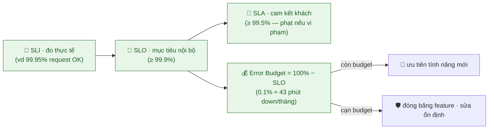
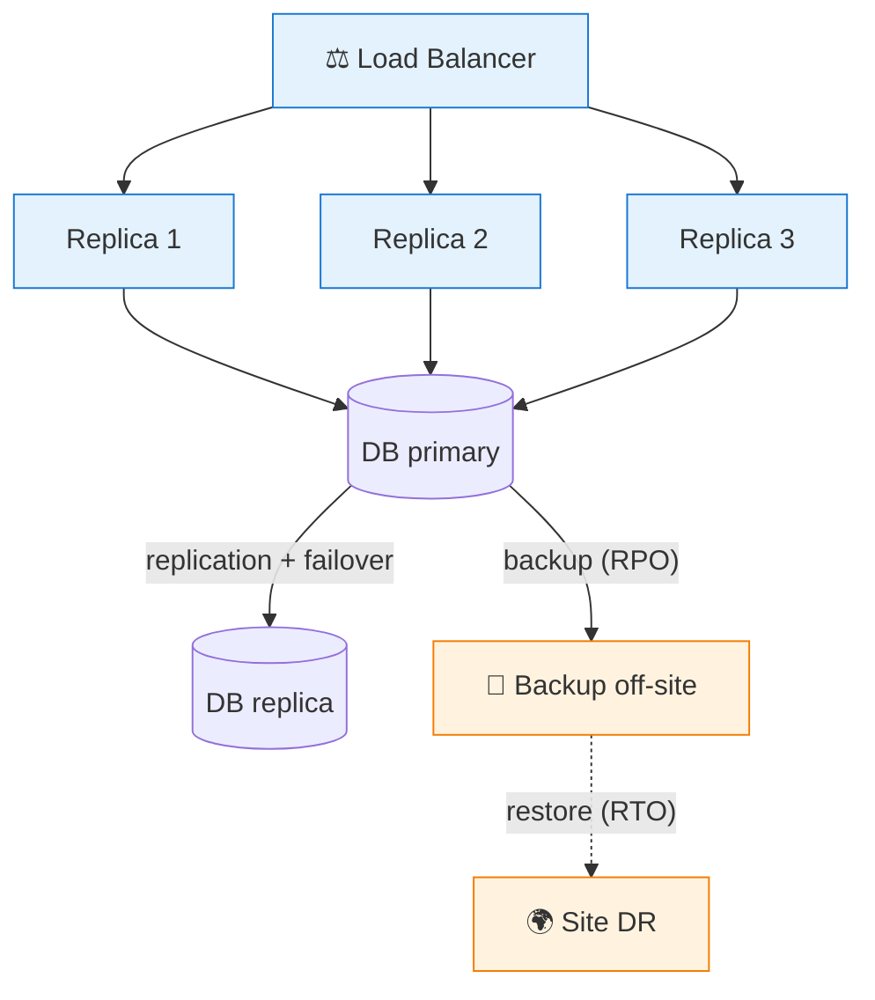
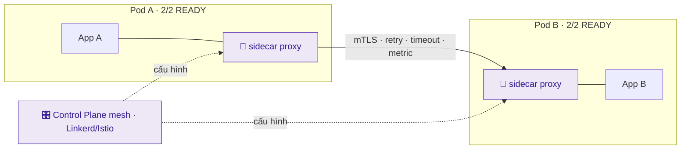
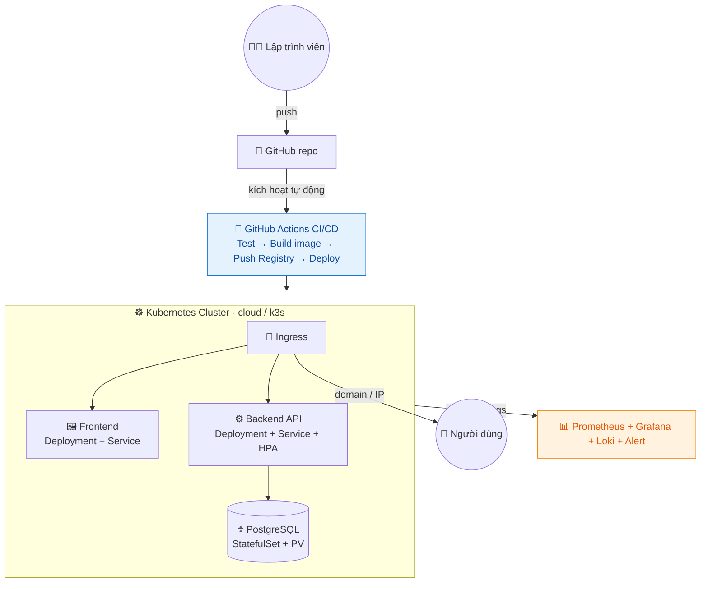

# Giai đoạn 4 — SRE, Chủ đề nâng cao & Dự án Tốt nghiệp

> **Ngày 51–60** · Độ tin cậy, tối ưu, dự án thực chiến và chuẩn bị sự nghiệp.
>
> **Khuôn mỗi ngày:** 📘 Lý thuyết → 🧪 Lab cơ bản → 🚀 Lab nâng cao (best-practice) → 💡 Bổ sung thực tế → 📝 Bài ôn tập.
>
> ✅ Trung lập nền tảng — kiến thức SRE/FinOps/Platform áp dụng cho mọi hệ thống và nhà cung cấp.

---

## Mục lục

| Ngày | Chủ đề |
|------|--------|
| [51](#ngày-51--site-reliability-engineering-sre--nguyên-lý) | Site Reliability Engineering (SRE) — Nguyên lý |
| [52](#ngày-52--high-availability-scaling--disaster-recovery) | High Availability, Scaling & Disaster Recovery |
| [53](#ngày-53--cost-optimization--finops) | Cost Optimization & FinOps |
| [54](#ngày-54--service-mesh--microservices-nâng-cao) | Service Mesh & Microservices nâng cao |
| [55](#ngày-55--platform-engineering--developer-experience) | Platform Engineering & Developer Experience |
| [56](#ngày-56--dự-án-tốt-nghiệp-phần-1-thiết-kế--hạ-tầng) | **Dự án tốt nghiệp — Phần 1: Thiết kế & Hạ tầng** |
| [57](#ngày-57--dự-án-tốt-nghiệp-phần-2-container--cicd) | **Dự án tốt nghiệp — Phần 2: Container & CI/CD** |
| [58](#ngày-58--dự-án-tốt-nghiệp-phần-3-monitoring--reliability) | **Dự án tốt nghiệp — Phần 3: Monitoring & Reliability** |
| [59](#ngày-59--dự-án-tốt-nghiệp-phần-4-tài-liệu-demo--portfolio) | **Dự án tốt nghiệp — Phần 4: Tài liệu, Demo & Portfolio** |
| [60](#ngày-60--tốt-nghiệp--tổng-kết-chứng-chỉ--định-hướng-sự-nghiệp) | **TỐT NGHIỆP — Tổng kết, Chứng chỉ & Định hướng** |
| [📎 Phụ lục](#-phụ-lục-giai-đoạn-4) | Dự án CloudNote · Checklist năng lực · Định hướng nghề |

---

## Ngày 51 — Site Reliability Engineering (SRE) — Nguyên lý

> ⏱️ ~90 phút · Loại: SRE
>
> 🧭 **Bạn đang ở đâu:** Giai đoạn 3 (DevOps stack hiện đại) → **Ngày 51 (SRE — đo độ tin cậy bằng con số)** → Ngày 52 (HA & DR). Đây là chặng cuối: nâng tư duy từ "chạy được" lên "tin cậy ở quy mô lớn, đo được".
>
> ✅ **Chuẩn bị:** đã có app + monitoring (Grafana/Prometheus — Ngày 44–45) để đo SLI thật.

### 📘 Lý thuyết

#### 1. SRE là gì — "DevOps phiên bản Google, đo bằng con số"

Cách Google vận hành hệ thống tin cậy ở quy mô khổng lồ. Thay vì nói chung "phải ổn định", SRE **đo độ tin cậy bằng số** và ra quyết định dựa trên số đó. Câu nói kinh điển: *"SRE implements DevOps"* — DevOps là triết lý, SRE là cách triển khai cụ thể.

#### 2. SLI / SLO / SLA — 3 từ dễ lẫn

| | Là gì | Ví dụ |
|---|---|---|
| **SLI** | Chỉ số **đo thực tế** | "99.95% request thành công tháng này" |
| **SLO** | **Mục tiêu nội bộ** tự đặt | "≥ 99.9%" |
| **SLA** | **Cam kết với khách** (có hậu quả) | "≥ 99.5%, không đạt → hoàn tiền" |

SLO luôn **chặt hơn** SLA (đệm an toàn để không vi phạm cam kết).

#### 3. Error Budget — ý tưởng thiên tài

`Error budget = 100% − SLO`. SLO 99.9% → được "lỗi" 0.1% ≈ **43 phút/tháng**.

| SLO | Down cho phép/tháng |
|---|---|
| 99% | ~7 giờ |
| 99.9% | ~43 phút |
| 99.99% | ~4.3 phút |

Còn budget → thoải mái ra tính năng mới; cạn budget → dừng, tập trung sửa ổn định. Hết cãi cảm tính Dev vs Ops — quyết bằng số. Mỗi "số 9" thêm vào đắt gấp ~10 lần.

#### 4. Toil — kẻ thù của SRE

**Toil** = công việc thủ công, lặp lại, không tạo giá trị lâu dài (restart tay, deploy tay...). Mục tiêu SRE: **tự động hoá để giảm toil**.

#### 5. Postmortem blameless (không đổ lỗi)

Sau sự cố, viết postmortem tập trung vào **hệ thống** ("vì sao 1 lỗi gõ nhầm gây sập?" → thiếu kiểm tra tự động), KHÔNG đổ lỗi cá nhân. Đổ lỗi → người ta giấu sự cố → không học được. Con người luôn mắc lỗi; hệ thống tốt phải chịu được lỗi.

> 🔑 Đừng theo đuổi **100% uptime** — cực đắt và bất khả thi. Error budget thừa nhận "lỗi là bình thường" và biến nó thành công cụ quản lý bằng dữ liệu.

**Sơ đồ — SLI → SLO → SLA & Error Budget:**


### 📖 Hiểu rõ hơn (giải thích cho người mới)

> 📘 ở trên đã liệt kê SLI/SLO/SLA và error budget. Mục này cho bạn **hình dung** để nhớ — không lặp lại bảng.

**Error budget như "hạn mức thẻ tín dụng" cho sự cố:** đầu tháng bạn được cấp một khoản "được phép lỗi" (vd 43 phút downtime). Mỗi lần hệ thống trục trặc là một lần "quẹt thẻ" trừ dần vào hạn mức đó. Còn hạn mức → cứ tự tin tiêu (deploy nhanh, ra tính năng mới). Cạn hạn mức → **khoá thẻ**: dừng tính năng, dồn sức "trả nợ" ổn định. Cái hay là nó biến câu hỏi cảm tính "có nên deploy tiếp không?" thành một con số ai cũng nhìn thấy và không cãi được.

**Vì sao 100% uptime là cái bẫy:** trực giác mách bảo "càng ổn định càng tốt, nhắm tới 100%". Nhưng mỗi "số 9" thêm vào (99% → 99.9% → 99.99%) đắt lên khoảng gấp 10 lần, trong khi người dùng gần như không phân biệt nổi. Quan trọng hơn: nếu mục tiêu là 100% thì bạn sẽ **không bao giờ dám thay đổi gì** — mà không thay đổi thì không có tính năng mới. SRE cố tình chấp nhận "lỗi là bình thường" để mua lại quyền được đi nhanh.

**SLO là "trọng tài" giữa nhanh và bền:** hình dung Dev muốn tống tính năng ra thật nhanh, Ops muốn khoá cứng cho khỏi sập — hai phe vốn cãi nhau triền miên và ai to tiếng hơn thì thắng. SLO + error budget đóng vai trọng tài trung lập: số liệu nói còn budget thì Dev thắng, số liệu nói cạn budget thì Ops thắng. Cảm xúc và chức vụ hết vai trò — chỉ dữ liệu quyết.

### 🧪 Lab cơ bản

1. Định nghĩa SLI/SLO cho app của bạn (vd: 99% request < 300ms, uptime 99.5%).
2. Tính error budget tương ứng và giải thích ý nghĩa.
3. Cấu hình Grafana đo SLI (latency, error rate) của app.
4. Viết 1 postmortem mẫu cho 1 sự cố giả định (nguyên nhân, tác động, hành động khắc phục).
5. Liệt kê các "toil" trong hệ thống của bạn và đề xuất tự động hóa.

### 🚀 Lab nâng cao (best-practice)

> Mục tiêu: biến độ tin cậy thành con số đo được và ra quyết định dựa trên error budget.

1. **Tính error budget cụ thể:**
   - SLO 99.9% uptime/tháng → cho phép down **~43 phút/tháng** (error budget).
   - SLO 99.99% → chỉ **~4.3 phút/tháng**. Mỗi "số 9" thêm vào đắt gấp ~10 lần.
2. **Error budget policy:** còn budget → ưu tiên ra tính năng mới; cạn budget → đóng băng feature, tập trung sửa độ ổn định. Đây là cách SRE cân bằng dev vs ops bằng dữ liệu, không cãi nhau cảm tính.
3. **SLO dựa trên SLI người dùng cảm nhận** (latency request, tỉ lệ thành công), không phải metric máy (CPU%).
4. **Viết postmortem theo template:** timeline → tác động → nguyên nhân gốc → hành động khắc phục (có owner + deadline).

### 💡 Bổ sung thực tế: SLI/SLO/SLA & vì sao blameless

- **Error budget policy phải ký TRƯỚC khi cháy nhà:** viết ra giấy "cạn budget thì đóng băng feature" và cho cả Dev lẫn quản lý đồng thuận từ lúc còn yên bình. Đợi đến khi sự cố mới bàn "có nên dừng deploy không" thì cảm xúc lấn át, chẳng ai chịu ai. Chính sách có sẵn = không phải tranh luận lúc căng thẳng.
- **Đo SLO trên "cửa sổ trượt" 28–30 ngày, đừng theo tháng lịch:** nếu budget reset vào ngày 1 hàng tháng, đội dễ "đốt sạch" budget cuối tháng rồi ngồi chờ mùng 1 làm lại — méo mó hành vi. Cửa sổ trượt phản ánh liên tục trải nghiệm 30 ngày gần nhất.
- **Cảnh báo theo "tốc độ đốt budget" (burn rate), không theo ngưỡng tức thời:** một cú nhảy latency 5 giây rồi tự hồi thì kệ; nhưng nếu đang tiêu budget nhanh gấp chục lần bình thường thì mới đánh thức người trực. Alert theo burn rate giảm hẳn báo động giả so với kiểu "CPU > 80% là hú".
- **Đo SLI ở nơi người dùng đứng:** cùng một request, đo ở backend có thể ra 99.99% nhưng đo ở edge/load balancer (tính cả timeout, lỗi mạng, DNS) lại chỉ 99.5%. Con số "thật" là con số người dùng cảm nhận, không phải con số đẹp nhất bạn tìm được trong hệ thống.
- **Postmortem không có action item = văn tế:** phần giá trị nhất của postmortem là danh sách hành động sửa gốc, mỗi cái có **owner + deadline** và được theo dõi đến khi đóng. Thiếu phần đó thì "blameless" chỉ còn là buổi kể khổ, tháng sau lỗi y hệt lặp lại.
- **SRE vs DevOps (để trả lời phỏng vấn cho gọn):** DevOps là *văn hoá/triết lý* phá rào Dev–Ops; SRE là *cách triển khai cụ thể* của Google bằng SLO, error budget và giảm toil. Một câu: *"SRE implements DevOps."*

### 🧭 Hướng dẫn làm lab & giải nghĩa lệnh (cho người tự học)

**Trình tự nên làm:** định nghĩa SLI/SLO cho app → tính error budget → đo SLI bằng Grafana → viết postmortem mẫu → liệt kê toil.

**Giải nghĩa & cách làm:**
- **SLI** = chọn 1 chỉ số người dùng cảm nhận (vd tỉ lệ request < 300ms). PromQL mẫu: `sum(rate(http_request_duration_bucket{le="0.3"}[5m])) / sum(rate(http_requests_total[5m]))`.
- **SLO** = mục tiêu cho SLI đó (vd ≥ 99%). **Error budget** = `100% − SLO` (99.9% → 0.1% ≈ **43 phút down/tháng**).
- **Postmortem** = tài liệu sự cố: timeline → tác động → nguyên nhân gốc → hành động (có owner + deadline).

**🧪 Thử nghiệm:**
- Tính error budget cho 99% / 99.9% / 99.99% → ra ~7h / ~43ph / ~4ph mỗi tháng. **Bài học:** mỗi "số 9" thêm vào đắt gấp ~10 lần.
- Viết postmortem cho 1 sự cố giả định, tập trung "hệ thống vì sao cho phép lỗi này" thay vì "ai gây ra". **Bài học:** blameless.

⚠️ **Dễ sai:** đặt SLO = 100% → vô nghĩa (cực đắt, vẫn không đạt). Error budget thừa nhận "lỗi là bình thường".

💡 **Hiểu sâu:** SLO chặt hơn SLA (đệm an toàn). Error budget = công cụ ra quyết định bằng **dữ liệu**: còn budget → ra feature; cạn → tập trung ổn định. "SRE implements DevOps."

### 🐛 Gỡ lỗi nhanh (SRE mindset)

| Tình huống | Sai lầm hay gặp | Cách đúng |
|---|---|---|
| Đặt mục tiêu tin cậy | SLO = 100% | Đặt SLO thực tế (99.9%), giữ error budget |
| Sự cố xảy ra | Đổ lỗi người gõ nhầm | Postmortem blameless — sửa hệ thống |
| Đo SLO | Dùng metric máy (CPU%) | Dùng SLI người dùng cảm nhận (latency, tỉ lệ lỗi) |
| Ra tính năng liên tục dù hay lỗi | Bỏ qua error budget | Cạn budget → đóng băng feature, sửa ổn định |
| Việc tay lặp lại nhiều | Chấp nhận "phải thế" | Nhận diện toil → tự động hoá |

### 📝 Bài ôn tập & Demo đối chiếu

**✍️ Tự kiểm tra:**

<details>
<summary>1. Phân biệt SLI, SLO, SLA.</summary>

> SLI = chỉ số đo thực tế. SLO = mục tiêu nội bộ. SLA = cam kết với khách (có hậu quả). SLO chặt hơn SLA.
</details>

<details>
<summary>2. Error budget giúp cân bằng điều gì?</summary>

> Cân bằng tốc độ ra tính năng vs độ ổn định — bằng dữ liệu. Còn budget thì ra feature; cạn thì tập trung sửa.
</details>

<details>
<summary>3. Vì sao postmortem nên blameless?</summary>

> Đổ lỗi cá nhân → người ta giấu sự cố → không học. Tập trung sửa hệ thống để lỗi tương tự không tái diễn.
</details>

<details>
<summary>4. SLO 99.99% cho phép down bao nhiêu mỗi tháng?</summary>

> ~4.3 phút/tháng. (Mỗi "số 9" thêm vào đắt gấp ~10 lần.)
</details>

**🔬 Demo đối chiếu:**

| Demo đối chiếu | Kết quả mong đợi |
|---|---|
| Định nghĩa SLI/SLO | Vd SLO 99.9% uptime, latency < 200ms |
| Tính error budget | Ra số phút down cho phép/tháng |
| Postmortem mẫu | Timeline → tác động → nguyên nhân gốc → hành động |

### 📚 Thuật ngữ Anh–Việt (ngày này)

| Thuật ngữ | Nghĩa |
|---|---|
| **SRE** | Kỹ thuật độ tin cậy hệ thống |
| **SLI / SLO / SLA** | Chỉ số đo / mục tiêu / cam kết |
| **Error budget** | Ngân sách lỗi (100% − SLO) |
| **Toil** | Việc tay lặp lại, cần tự động hoá |
| **Postmortem** | Báo cáo phân tích sự cố |
| **Blameless** | Không đổ lỗi cá nhân |
| **Availability** | Tỉ lệ thời gian hệ thống hoạt động |

### 🎯 Đúc kết Ngày 51

**3 điều phải mang theo:**
1. **SLI đo — SLO nhắm — SLA cam kết:** SLI là số thật, SLO là mục tiêu nội bộ (luôn chặt hơn SLA để có đệm), SLA là lời hứa có ràng buộc với khách. Nhầm 3 cái này là nhầm cả tư duy SRE.
2. **Error budget = 100% − SLO** biến "nên đi nhanh hay giữ ổn định?" thành quyết định bằng dữ liệu: còn budget → ra tính năng, cạn budget → đóng băng và sửa.
3. **Blameless + giảm toil:** sự cố là lỗi của hệ thống chứ không của cá nhân; việc tay lặp lại (toil) phải bị tự động hoá dần, không chấp nhận là "số phận".

> 🧠 **Một câu để nhớ:** đừng theo đuổi 100% uptime — cực đắt và bất khả thi. Error budget thừa nhận "lỗi là bình thường" và biến nó thành công cụ quản lý bằng dữ liệu; và postmortem phải **blameless** (chỉ sửa hệ thống, không đổ lỗi người).

**✅ Tự chấm** *(đánh dấu khi làm được mà không nhìn tài liệu):*
- [ ] Phân biệt rành mạch SLI / SLO / SLA bằng ví dụ của chính mình
- [ ] Tính được error budget cho 99% / 99.9% / 99.99% ra số phút/tháng
- [ ] Giải thích được error budget policy điều phối Dev vs Ops thế nào
- [ ] Chọn được 1 SLI đo từ góc người dùng (không phải CPU%) cho app của mình
- [ ] Viết được 1 postmortem blameless có action item kèm owner + deadline

✅ **Kết quả đạt được:** Hiểu tư duy SRE — đo lường độ tin cậy, error budget, giảm toil, postmortem blameless.

---

## Ngày 52 — High Availability, Scaling & Disaster Recovery

> ⏱️ ~90 phút · Loại: SRE
>
> 🧭 **Bạn đang ở đâu:** Ngày 51 (SRE nguyên lý) → **Ngày 52 (thiết kế hệ thống chịu lỗi: HA, scaling, DR)** → Ngày 53 (FinOps). Triết lý: *"Everything fails, all the time"* — thiết kế giả định mọi thứ SẼ hỏng.
>
> ✅ **Chuẩn bị:** cluster K8s (HPA, multi-replica từ Ngày 41), hiểu backup (Ngày 11).

### 📘 Lý thuyết

#### 1. High Availability (HA) — "không có điểm chết duy nhất"

**SPOF** (Single Point of Failure) = thành phần mà chết là cả hệ thống chết (chỉ 1 server, 1 DB). HA = loại bỏ SPOF bằng **dự phòng**: nhiều bản sao, nhiều node, nhiều vùng. Mất 1, cái khác gánh tiếp.

#### 2. Scaling

| Kiểu | Cách | Ghi chú |
|---|---|---|
| **Vertical** | Máy mạnh hơn (thêm CPU/RAM) | Có trần, phải restart |
| **Horizontal** | Thêm bản sao | K8s giỏi việc này (HPA) — ưu tiên |

**Stateless là chìa khoá** để scale ngang: app không lưu trạng thái cục bộ (session ra Redis/DB) → thêm/bớt pod thoải mái.

#### 3. Database HA

Replication (primary–replica) + **failover tự động** khi primary chết. DB thường là SPOF khó nhất → cần thiết kế kỹ.

#### 4. Disaster Recovery (DR) — RTO & RPO

| | Nhìn về | Quyết định |
|---|---|---|
| **RPO** | Quá khứ: mất tối đa bao nhiêu **dữ liệu** | Tần suất backup |
| **RTO** | Tương lai: khôi phục xong trong **bao lâu** | Kiến trúc phục hồi |

Các mức DR (đắt dần): **backup-restore** (giờ) → **pilot light** → **warm standby** → **multi-site active-active** (~giây).

#### 5. Chaos engineering — chủ động phá để kiểm tra

Chủ động xoá pod/ngắt mạng *khi đang theo dõi* để xem hệ thống có tự phục hồi không. *"Chưa test failover = không có failover"* — đừng đợi sự cố thật.

> 🔑 Triết lý Amazon: *"Everything fails, all the time."* Thiết kế **giả định nó sẽ hỏng** thay vì hy vọng không hỏng. HA không miễn phí — cân bằng với SLO (đừng multi-region cho app nội bộ 10 người).

**Sơ đồ — HA (nhiều replica + DB replication) & DR (backup off-site):**

> Không có SPOF: mất 1 replica/1 node → vẫn phục vụ. RPO = backup bao lâu/lần; RTO = khôi phục mất bao lâu.

### 📖 Hiểu rõ hơn (giải thích cho người mới)

> 📘 ở trên đã liệt kê SPOF, scaling, RTO/RPO, chaos. Mục này cho bạn **hình dung** để nhớ — không lặp lại bảng.

**HA giống chiếc máy bay 4 động cơ:** máy bay chở khách không có *một* động cơ khoẻ nhất, mà có nhiều động cơ để **mất một cái vẫn bay tiếp**. SPOF là thứ ngược lại — một bộ phận mà hỏng là cả chuyến bay rơi (chỉ 1 server, chỉ 1 DB). Làm HA thực chất là đi hỏi từng bộ phận một câu: *"Nếu riêng cái này chết thì sao?"* — chỗ nào câu trả lời là "sập hết" thì chỗ đó cần thêm bản sao. Cứ thế cho đến khi không còn chỗ nào một-mình-quyết-định-sống-chết.

**RTO và RPO là hai câu hỏi ở hai phía của một tai nạn:** vẽ mốc "lúc sập" lên trục thời gian. Nhìn về **quá khứ** — "backup gần nhất cách đây bao lâu, tức mất tối đa bao nhiêu **dữ liệu**?" — đó là RPO, và nó quyết định bạn phải backup dày cỡ nào. Nhìn về **tương lai** — "từ lúc sập đến lúc chạy lại mất bao lâu?" — đó là RTO, và nó quyết định bạn phải đầu tư kiến trúc phục hồi nhanh cỡ nào. Muốn cả hai gần 0 thì rất đắt, nên phải chọn theo giá trị dữ liệu.

**Chaos engineering — tiêm vắc-xin cho hệ thống:** vắc-xin là cố tình đưa một liều mầm bệnh *có kiểm soát* vào cơ thể để nó tập đề kháng trước khi gặp bệnh thật. Chaos cũng vậy: chủ động giết pod, ngắt mạng, làm chậm DB *ngay khi bạn đang ngồi theo dõi* — để phát hiện điểm yếu lúc còn bình tĩnh, thay vì lúc 3 giờ sáng gặp sự cố thật. Câu thần chú: *"chưa test failover = chưa có failover"*.

### 🧪 Lab cơ bản

1. Cấu hình deployment K8s đa replica + HPA cho HA cơ bản.
2. Mô phỏng node/pod chết và quan sát K8s tự phục hồi.
3. Thiết lập backup database tự động và test restore (đo RTO).
4. Thực hành "chaos" đơn giản: xóa ngẫu nhiên 1 pod và xác nhận dịch vụ không gián đoạn.
5. Viết runbook khôi phục sự cố cho hệ thống của bạn.

### 🚀 Lab nâng cao (best-practice)

> Mục tiêu: thiết kế hệ thống chịu lỗi thật và kiểm chứng bằng cách chủ động phá nó.

1. **Loại bỏ SPOF có hệ thống** — hỏi "nếu cái này chết thì sao?" cho từng thành phần: 1 replica → nhiều replica; 1 node → nhiều node; 1 DB → replication.
2. **DR có cấp độ** (chọn theo RTO/RPO và ngân sách):
   | Chiến lược | RTO | Chi phí |
   |---|---|---|
   | Backup & restore | giờ | thấp |
   | Pilot light | chục phút | trung bình |
   | Warm standby | phút | cao |
   | Multi-site active-active | ~giây | rất cao |
3. **Chaos engineering có kiểm soát:** xóa pod ngẫu nhiên, ngắt mạng, làm chậm DB → xác nhận hệ thống tự phục hồi. "Chưa test failover = không có failover."
4. **DR drill định kỳ** — diễn tập khôi phục thật, đo RTO/RPO thực tế, cập nhật runbook.

### 💡 Bổ sung thực tế: RTO vs RPO & "everything fails"

- **Backup KHÔNG phải DR:** backup chỉ là *dữ liệu nằm đâu đó*. DR là cả gói: hạ tầng để bung lại, quy trình từng bước, người biết bấm nút, và — quan trọng nhất — đã **diễn tập** thành công. Rất nhiều nơi "có backup" nhưng đến lúc cháy nhà mới phát hiện thiếu network, thiếu secret, hoặc không ai từng thử restore bao giờ.
- **Quy tắc 3-2-1 cho backup:** giữ **3** bản sao, trên **2** loại phương tiện khác nhau, và **1** bản để **off-site** (khác vùng/khác nhà cung cấp). Backup nằm cùng chỗ với bản gốc thì cháy data center là mất cả hai — coi như không có.
- **"Backup Schrödinger":** một bản backup chưa từng restore thử thì vừa tồn tại vừa không tồn tại — bạn chỉ biết nó hỏng đúng vào lúc cần nó nhất. Vì thế phải **test restore định kỳ** và bấm giờ, đó chính là lúc bạn đo được RTO thật.
- **HA cần số node LẺ cho hệ bỏ phiếu:** etcd, ZooKeeper, DB cluster... dùng quorum (đa số) để bầu chủ. 3 node chịu mất 1, 5 node chịu mất 2. Chia đôi 2 hoặc 4 node dễ gây **split-brain** (hai nửa cùng tưởng mình là chủ) → hỏng dữ liệu. Nhớ: hệ đồng thuận thích số lẻ.
- **HA còn là "hỏng một phần vẫn sống":** ngoài dự phòng, hệ tốt biết **graceful degradation** — mất service gợi ý sản phẩm thì vẫn cho xem/mua hàng, chỉ tắt phần gợi ý. Và **load shedding**: quá tải thì chủ động từ chối bớt request để cứu phần lõi, thay vì sập sạch.

### 🧭 Hướng dẫn làm lab & giải nghĩa lệnh (cho người tự học)

**Trình tự nên làm:** deploy đa replica + HPA → mô phỏng pod/node chết → backup DB + test restore (đo RTO) → chaos xóa pod → viết runbook.

**Giải nghĩa & cách làm:**
- Đa replica + HPA = không SPOF tầng app. `kubectl delete pod <p>` → K8s tạo lại; Service sang pod còn sống → không downtime.
- Backup DB định kỳ → đo **RTO** (restore mất bao lâu) và **RPO** (mất tối đa bao nhiêu dữ liệu).
- "Chaos": xóa pod ngẫu nhiên giữa lúc đang `curl` liên tục → quan sát app có gián đoạn không.

**🧪 Thử nghiệm:**
- Trong khi `while true; do curl app; sleep 1; done`, xóa 1 pod → đếm bao nhiêu request lỗi (lý tưởng: 0). **Bài học:** HA thực sự chịu được mất pod.
- Backup → xóa DB → restore → bấm giờ. **Bài học:** RTO thực tế của bạn là bao nhiêu.

⚠️ **Dễ sai:** "có backup" nhưng chưa từng test restore → đến lúc cần mới biết hỏng. DR drill định kỳ.

💡 **Hiểu sâu:** *"Everything fails, all the time"* (Amazon) — thiết kế giả định mọi thứ SẼ hỏng. RPO nhìn quá khứ (mất bao nhiêu dữ liệu → tần suất backup); RTO nhìn tương lai (phục hồi bao lâu → kiến trúc).

### 🐛 Gỡ lỗi nhanh

| Triệu chứng | Nguyên nhân | Cách sửa |
|---|---|---|
| Mất 1 node → cả app sập | Còn SPOF | Đa replica + đa node; DB replication |
| Scale ngang nhưng session mất | App stateful | Đưa session ra Redis/DB (stateless) |
| DR "có kế hoạch" nhưng thất bại thật | Chưa DR drill | Diễn tập khôi phục định kỳ, đo RTO/RPO thật |
| Failover DB không tự chạy | Chưa cấu hình failover | Dùng managed DB / cấu hình replica + auto-failover |
| Chaos test làm sập thật | Chưa có dự phòng đủ | Sửa SPOF trước; chaos trong môi trường kiểm soát |

### 📝 Bài ôn tập & Demo đối chiếu

**✍️ Tự kiểm tra:**

<details>
<summary>1. Phân biệt RTO và RPO.</summary>

> RPO = mất tối đa bao nhiêu **dữ liệu** (→ tần suất backup). RTO = khôi phục xong trong **bao lâu** (→ kiến trúc phục hồi).
</details>

<details>
<summary>2. SPOF là gì và cách loại bỏ?</summary>

> Single Point of Failure — thành phần chết là cả hệ thống chết. Loại bỏ bằng dự phòng: nhiều replica/node/vùng, DB replication.
</details>

<details>
<summary>3. Chaos engineering kiểm tra điều gì?</summary>

> Khả năng tự phục hồi khi có lỗi (pod chết, mạng đứt) — chủ động phá khi đang theo dõi để phát hiện điểm yếu trước khi sự cố thật xảy ra.
</details>

<details>
<summary>4. Vì sao "stateless" giúp scale?</summary>

> App không lưu trạng thái cục bộ → thêm/bớt bản sao tuỳ ý, pod chết không mất gì. Session để ra Redis/DB.
</details>

**🔬 Demo đối chiếu:**

| Demo đối chiếu | Kết quả mong đợi |
|---|---|
| Đa replica (HA) | Xoá 1 pod, dịch vụ vẫn phục vụ (0 request lỗi) |
| Scaling | Tăng tải → HPA tự mở rộng, không sập |
| DR plan | Viết được RTO/RPO + quy trình khôi phục |

### 📚 Thuật ngữ Anh–Việt (ngày này)

| Thuật ngữ | Nghĩa |
|---|---|
| **HA (High Availability)** | Sẵn sàng cao, không SPOF |
| **SPOF** | Điểm lỗi đơn |
| **Horizontal / Vertical scaling** | Thêm bản sao / máy mạnh hơn |
| **Replication / Failover** | Nhân bản / chuyển đổi khi lỗi |
| **RTO / RPO** | Thời gian phục hồi / dữ liệu mất tối đa |
| **Disaster Recovery** | Khôi phục sau thảm hoạ |
| **Chaos engineering** | Chủ động gây lỗi để kiểm tra |

### 🎯 Đúc kết Ngày 52

**3 điều phải mang theo:**
1. **HA = diệt SPOF bằng dự phòng:** hỏi từng thành phần "nếu riêng cái này chết thì sao?" — chỗ nào "sập hết" thì thêm bản sao/node/vùng. Ưu tiên scale ngang, và điều kiện tiên quyết là app **stateless**.
2. **DR định hình bằng RTO & RPO:** RPO nhìn quá khứ (mất tối đa bao nhiêu dữ liệu → tần suất backup); RTO nhìn tương lai (phục hồi mất bao lâu → kiến trúc). Backup chưa test restore thì coi như chưa có.
3. **Chaos engineering để biết trước điểm yếu:** chủ động phá trong môi trường kiểm soát; "chưa test failover = chưa có failover".

> 🧠 **Một câu để nhớ:** triết lý Amazon — *"Everything fails, all the time"*. Thiết kế **giả định nó sẽ hỏng** thay vì hy vọng nó không hỏng; và HA không miễn phí, phải cân với SLO (đừng multi-region cho app nội bộ 10 người).

**✅ Tự chấm** *(đánh dấu khi làm được mà không nhìn tài liệu):*
- [ ] Chỉ ra được SPOF trong hệ thống của mình và cách loại bỏ
- [ ] Phân biệt RTO vs RPO và nói được mỗi cái quyết định điều gì
- [ ] Giải thích vì sao stateless là điều kiện để scale ngang
- [ ] Kể được 4 mức DR theo thứ tự đắt dần (backup-restore → active-active)
- [ ] Chạy được 1 bài chaos (xoá pod khi đang curl) và đọc kết quả

✅ **Kết quả đạt được:** Thiết kế hệ thống sẵn sàng cao (không SPOF), scale được và có khả năng phục hồi sau thảm hoạ.

---

## Ngày 53 — Cost Optimization & FinOps

> ⏱️ ~60 phút · Loại: Cloud
>
> 🧭 **Bạn đang ở đâu:** Ngày 52 (HA/DR) → **Ngày 53 (FinOps — tối ưu chi phí cloud như một kỹ năng)** → Ngày 54 (Service Mesh). Cloud dễ "vung tay quá trán"; FinOps đưa ý thức chi phí vào kỹ thuật.
>
> ✅ **Chuẩn bị:** tài khoản cloud (Cost Explorer), Terraform (Ngày 29). Cài Infracost nếu muốn ước tính chi phí.

### 📘 Lý thuyết

#### 1. FinOps là gì

Thực hành **đưa ý thức chi phí vào kỹ thuật**: kỹ sư thấy được mình tiêu bao nhiêu và tối ưu. Cloud trả theo lượng dùng → dễ lãng phí (quên tắt máy, mua to hơn cần).

#### 2. Ba mô hình giá — chọn đúng tiết kiệm rất nhiều

| Mô hình | Khi nào | Tiết kiệm |
|---|---|---|
| **On-demand** | Tải thất thường, dev | 0% (đắt nhất) |
| **Reserved / Savings Plan** | Tải ổn định, chạy lâu (DB, baseline) | ~30–70% |
| **Spot** | Job chịu được gián đoạn (batch, CI) | ~70–90% (có thể bị thu hồi) |

#### 3. Các "quả ngọt dễ hái"

- **Right-sizing**: đa số máy mua *to hơn cần*. Đo metric thật (Ngày 44) → hạ size.
- **Tắt môi trường dev ngoài giờ** (18h–8h + cuối tuần) ≈ tiết kiệm ~70% compute.
- **Storage tiering**: chuyển dữ liệu ít dùng sang lớp rẻ hơn.
- **Tagging**: gắn nhãn (`Project`, `Environment`, `Owner`) → biết tiền đi đâu.

#### 4. Bẫy chi phí ẩn

Egress traffic (dữ liệu **ra** internet tốn tiền), NAT Gateway chạy 24/7, volume/snapshot mồ côi, log/metric giữ vô hạn.

#### 5. Công cụ

Cost Explorer (soi chi phí), **Billing Alert** (việc đầu tiên khi tạo tài khoản), **Infracost** (ước tính chi phí Terraform ngay trong PR).

> 🔑 FinOps là **văn hoá, không phải công cụ**: khi dev *thấy* "feature này tốn $500/tháng" (shift-left cost, như shift-left security) họ tự tối ưu. Chi phí là trách nhiệm chung.

### 📖 Hiểu rõ hơn (giải thích cho người mới)

> 📘 ở trên đã liệt kê 3 mô hình giá, quả ngọt dễ hái và bẫy chi phí. Mục này cho bạn **hình dung** để nhớ — không lặp lại bảng.

**Cloud như hoá đơn điện taxi, không phải mua xe:** mua server vật lý là mua đứt một chiếc xe — trả một lần, dùng thoải mái. Cloud thì như đi taxi bật đồng hồ: **đồng hồ chạy từng giây bạn để máy bật**, quên tắt là cứ thế nhảy số. Chính vì thế "vung tay quá trán" trên cloud dễ đến mức đáng sợ — một cái VM to quên tắt cuối tuần cũng đủ tốn tiền vô ích. FinOps đơn giản là **thói quen nhìn đồng hồ taxi** đó ngay khi ra quyết định kỹ thuật.

**Ba mô hình giá giống ba cách thuê nhà:** *on-demand* là thuê phòng khách sạn theo đêm — tiện, đi lúc nào cũng được, nhưng đắt nhất; hợp với tải thất thường và môi trường dev. *Reserved/Savings Plan* là ký hợp đồng thuê 1–3 năm — cam kết dài nên rẻ hơn nhiều; hợp với phần tải chạy đều đặn (DB, baseline). *Spot* là ở nhờ phòng trống của khách sạn giá bèo — rẻ nhất nhưng **chủ nhà đòi lại lúc nào cũng phải trả**; chỉ hợp với việc chịu được gián đoạn (batch, CI, worker).

**"Quả ngọt dễ hái" — tiền để trên bàn không ai nhặt:** đa số máy được mua to hơn nhu cầu thật vì tâm lý "sợ thiếu", trong khi metric cho thấy CPU chỉ dùng 5%. Right-sizing (hạ đúng size dựa trên số đo thật) và tắt môi trường dev ngoài giờ là hai việc gần như không rủi ro mà cắt được rất nhiều tiền. Điều kiện duy nhất: phải **có tag để biết tiền đi đâu** và **có monitoring để biết máy thực sự dùng bao nhiêu**.

### 🧪 Lab cơ bản

1. Phân tích chi phí tài khoản cloud bằng Cost Explorer (hoặc đọc hướng dẫn nếu chưa phát sinh).
2. Tag các tài nguyên Terraform theo project/environment.
3. Cấu hình auto-scaling scale xuống 0/min khi không dùng (môi trường dev).
4. Dùng Infracost ước tính chi phí của cấu hình Terraform trước khi apply.
5. Viết checklist tối ưu chi phí cho hệ thống của bạn.

### 🚀 Lab nâng cao (best-practice)

> Mục tiêu: đưa chi phí vào quy trình kỹ thuật — thấy giá trước khi apply, tự tắt cái không dùng.

1. **Infracost trong PR** — mỗi thay đổi Terraform comment chi phí dự kiến vào PR → đội biết "PR này tốn thêm $X/tháng" trước khi merge.
2. **Tự tắt môi trường dev ngoài giờ** — dev/staging tắt 18h–8h + cuối tuần ≈ tiết kiệm ~70% chi phí compute.
3. **Right-sizing dựa trên metric thật** — dùng dữ liệu monitoring (Ngày 44) để thấy máy dùng 5% CPU → hạ size.
4. **Tagging bắt buộc** (qua policy) — không tag = không biết tiền đi đâu khi có 200 tài nguyên.

### 💡 Bổ sung thực tế: chọn mô hình giá & văn hóa FinOps

- **Nhìn "chi phí trên mỗi đơn vị" chứ không chỉ tổng hoá đơn (unit economics):** hoá đơn tăng chưa chắc xấu — nếu chi phí *trên mỗi request/khách hàng/đơn hàng* đang giảm thì bạn đang mở rộng hiệu quả. FinOps trưởng thành theo dõi "$ / 1000 request" hay "$ / khách hàng hoạt động", vì đó mới là con số nói lên hệ thống có đang béo lên vô ích hay không.
- **Reserved/Savings Plan là cam kết TÀI CHÍNH, không phải nút bấm kỹ thuật:** mua RI/SP là ký nợ 1–3 năm — mua thừa (utilization thấp) thì trả tiền cho thứ không dùng, mua thiếu (coverage thấp) thì vẫn đắt. Cách an toàn: phủ RI/SP cho phần **baseline chắc chắn luôn chạy**, để phần tải nhấp nhô cho on-demand/spot gánh.
- **Egress và traffic cross-AZ là bẫy đắt mà hoá đơn không nói thẳng:** dữ liệu *vào* cloud thường miễn phí nhưng *ra* internet (và cả đi ngang giữa các AZ) thì tính tiền. Một kiến trúc "chatty" giữa các vùng có thể ngốn tiền mạng nhiều hơn cả tiền compute mà không ai để ý.
- **Trên Kubernetes, requests/limits đặt sai = đốt tiền âm thầm:** đặt request quá cao thì scheduler "giữ chỗ" tài nguyên không ai dùng → phải mua thêm node oan. Kết hợp right-sizing pod + cluster autoscaler + node pool spot cho workload chịu gián đoạn là combo tiết kiệm lớn.
- **Showback/chargeback biến FinOps thành văn hoá:** định kỳ gửi cho mỗi team đúng "hoá đơn phần của họ" (nhờ tag). Khi kỹ sư *thấy* "feature này tốn $500/tháng" họ tự tối ưu — giống shift-left security, đây là shift-left cost. Và **billing alert / anomaly alert là việc đầu tiên** làm khi mở tài khoản cloud.

### 🧭 Hướng dẫn làm lab & giải nghĩa lệnh (cho người tự học)

**Trình tự nên làm:** phân tích chi phí (Cost Explorer) → tag tài nguyên Terraform → auto-scale xuống khi rảnh → Infracost ước tính → viết checklist tiết kiệm.

**Giải nghĩa & cách làm:**
- Cost Explorer → lọc theo tag/dịch vụ → tìm tài nguyên tốn nhất.
- Gắn `tags = { Project, Environment, Owner }` vào tài nguyên Terraform → phân bổ chi phí.
- `infracost breakdown --path .` — ước tính chi phí/tháng của cấu hình Terraform **trước khi** apply.

**🧪 Thử nghiệm:**
- Chạy `infracost` trên 1 thay đổi đổi instance type lớn hơn → thấy chênh lệch $/tháng. **Bài học:** thấy giá trước khi merge.
- So sánh chi phí on-demand vs reserved vs spot cho cùng 1 instance. **Bài học:** chọn mô hình giá đúng tiết kiệm 30–90%.

⚠️ **Dễ sai:** bẫy chi phí ẩn — egress traffic, NAT Gateway 24/7, volume/snapshot mồ côi. Soi bằng tagging + Cost Explorer.

💡 **Hiểu sâu:** 3 mô hình giá — on-demand (linh hoạt, đắt), reserved (tải ổn định, −30~70%), spot (job chịu gián đoạn, −70~90%). Right-sizing (dựa metric thật) là "quả ngọt dễ hái".

### 🐛 Gỡ lỗi nhanh

| Triệu chứng | Nguyên nhân | Cách sửa |
|---|---|---|
| Hoá đơn tăng bất ngờ | Egress / NAT / tài nguyên mồ côi | Cost Explorer soi; xoá cái không dùng; Billing Alert |
| Không biết tiền của team nào | Thiếu tag | Bắt buộc tag `Project/Env/Owner` qua policy |
| Máy tốn nhưng dùng ít | Over-provision | Right-sizing dựa metric thật |
| Spot job bị gián đoạn mất việc | Dùng spot cho việc không chịu được gián đoạn | Chỉ spot cho batch/CI; job quan trọng dùng on-demand/reserved |
| Dev environment tốn 24/7 | Không tắt ngoài giờ | Lịch tự tắt/scale-to-zero |

### 📝 Bài ôn tập & Demo đối chiếu

**✍️ Tự kiểm tra:**

<details>
<summary>1. Khi nào dùng spot, khi nào reserved?</summary>

> Spot cho job chịu được gián đoạn (batch, CI, worker) — rẻ 70–90% nhưng bị thu hồi. Reserved cho tải ổn định chạy lâu (DB, baseline) — rẻ 30–70%, cam kết 1–3 năm.
</details>

<details>
<summary>2. Right-sizing là gì?</summary>

> Chọn đúng kích thước tài nguyên dựa trên metric thật, tránh mua to hơn cần (over-provision) — "quả ngọt dễ hái" nhất.
</details>

<details>
<summary>3. Tagging giúp gì cho quản lý chi phí?</summary>

> Gắn nhãn (Project/Env/Owner) để biết chi phí thuộc team/dự án nào → phân bổ, quy trách nhiệm, tối ưu đúng chỗ.
</details>

<details>
<summary>4. Kể vài bẫy chi phí ẩn.</summary>

> Egress traffic ra internet, NAT Gateway 24/7, volume/snapshot mồ côi, log/metric giữ vô hạn.
</details>

**🔬 Demo đối chiếu:**

| Demo đối chiếu | Kết quả mong đợi |
|---|---|
| Phân tích chi phí | Xác định tài nguyên tốn nhất |
| Đề xuất tối ưu | Right-sizing/reserved/spot/tắt idle → % tiết kiệm |
| Gắn tag | Tài nguyên có tag phân bổ chi phí |

### 📚 Thuật ngữ Anh–Việt (ngày này)

| Thuật ngữ | Nghĩa |
|---|---|
| **FinOps** | Tối ưu chi phí cloud như kỹ năng kỹ thuật |
| **On-demand / Reserved / Spot** | 3 mô hình giá |
| **Right-sizing** | Chọn đúng kích thước tài nguyên |
| **Tagging** | Gắn nhãn phân bổ chi phí |
| **Egress** | Lưu lượng ra internet (tốn phí) |
| **Infracost** | Ước tính chi phí Terraform |
| **Billing Alert** | Cảnh báo chi phí |

### 🎯 Đúc kết Ngày 53

**3 điều phải mang theo:**
1. **Chọn đúng mô hình giá:** on-demand (linh hoạt, đắt) cho tải thất thường/dev; reserved/savings plan (−30~70%) cho baseline ổn định; spot (−70~90%) cho job chịu gián đoạn. Chọn sai = trả tiền oan hoặc mất việc giữa chừng.
2. **Right-sizing + tắt idle là "quả ngọt dễ hái":** hạ size theo metric thật và tắt dev ngoài giờ cắt được rất nhiều tiền gần như không rủi ro — miễn là có monitoring và tag để biết.
3. **FinOps là văn hoá, không phải công cụ:** khi kỹ sư *thấy* chi phí do mình tạo ra (showback + billing alert), họ tự tối ưu. Chi phí là trách nhiệm chung.

> 🧠 **Một câu để nhớ:** cloud là đồng hồ taxi chạy từng giây — bẫy chi phí ẩn (egress ra internet, NAT Gateway 24/7, volume/snapshot mồ côi, log giữ vô hạn) âm thầm nhảy số. **Billing alert là việc đầu tiên** khi tạo tài khoản cloud.

**✅ Tự chấm** *(đánh dấu khi làm được mà không nhìn tài liệu):*
- [ ] Nói được khi nào dùng on-demand / reserved / spot
- [ ] Giải thích right-sizing và vì sao cần monitoring để làm đúng
- [ ] Kể được ≥3 bẫy chi phí ẩn và cách soi (tag + Cost Explorer)
- [ ] Dùng Infracost ước tính chênh lệch $/tháng của 1 thay đổi Terraform
- [ ] Thiết lập được billing alert ngay khi mở tài khoản cloud

✅ **Kết quả đạt được:** Tối ưu chi phí cloud (mô hình giá, right-sizing, tagging) — kỹ năng ngày càng quan trọng.

---

## Ngày 54 — Service Mesh & Microservices nâng cao

> ⏱️ ~90 phút · Loại: Kubernetes
>
> 🧭 **Bạn đang ở đâu:** Ngày 53 (FinOps) → **Ngày 54 (microservices & service mesh)** → Ngày 55 (Platform Engineering). Chủ đề nâng cao — quan trọng nhất là biết *khi nào KHÔNG cần* mesh.
>
> ✅ **Chuẩn bị:** cluster K8s. Cài Linkerd (nhẹ hơn Istio) nếu muốn thực hành.

### 📘 Lý thuyết

#### 1. Microservices — chia app lớn thành nhiều dịch vụ nhỏ

Thay vì 1 khối code (monolith), chia thành nhiều service độc lập (user, đơn hàng...). **Lợi:** phát triển/scale riêng từng phần. **Hại:** chúng phải *nói chuyện qua mạng* → sinh vấn đề: mã hoá, retry khi lỗi, theo dõi, định tuyến.

#### 2. Service Mesh — "lớp hạ tầng lo việc giao tiếp"

Thay vì code các xử lý đó vào *từng* service (lặp lại), mesh (Istio, Linkerd) đẩy chúng xuống hạ tầng qua **sidecar**.

#### 3. Sidecar pattern

Tiêm 1 **proxy nhỏ** (Envoy/linkerd-proxy) cạnh mỗi pod. **Mọi** traffic vào/ra app đi qua proxy → proxy tự lo mTLS, retry, đo lường, chia traffic — *app không sửa code*. Pod thành `2/2 READY` (app + sidecar).

#### 4. Tính năng mesh

| Tính năng | Ý nghĩa |
|---|---|
| **Traffic management** | Canary, A/B, chia % traffic |
| **mTLS** | Mã hoá + xác thực service-to-service |
| **Observability** | Metric latency/traffic/error tự động |
| **Resilience** | Retry, timeout, circuit breaker |

**API Gateway** = điểm vào duy nhất từ ngoài (xác thực, rate limiting) — khác mesh (lo giao tiếp *nội bộ*).

#### 5. ⚠️ Khi nào KHÔNG dùng mesh (quan trọng cho người mới)

Mesh thêm **độ phức tạp lớn** (sidecar tốn tài nguyên, khó debug, học mất công). Hệ thống nhỏ (vài service) → **không cần**, dùng thẳng K8s Service + Ingress là đủ. Nhiều team thêm Istio quá sớm rồi khổ.

> 🔑 Chỉ thêm mesh khi "nỗi đau microservices" thực sự xuất hiện (hàng chục service). Bắt đầu bằng **Linkerd** (nhẹ, dễ) trước **Istio** (mạnh, phức tạp).

**Sơ đồ — Sidecar pattern (mọi traffic đi qua proxy):**

> App không cần sửa code — sidecar lo mã hóa, retry, observability. ⚠️ Chỉ thêm mesh khi nỗi đau microservices thực sự xuất hiện.

### 📖 Hiểu rõ hơn (giải thích cho người mới)

> 📘 ở trên đã liệt kê microservices, sidecar, các tính năng mesh và khi nào không dùng. Mục này cho bạn **hình dung** để nhớ — không lặp lại bảng.

**Chia monolith thành microservices giống tách một đại gia đình ra ở riêng:** ở chung một nhà (monolith) thì gọi nhau chỉ cần nói vọng sang phòng — nhanh, đơn giản. Tách ra ở riêng mỗi người một nhà (mỗi service) thì tự do phát triển, sửa nhà ai nấy lo — nhưng giờ muốn nói chuyện phải **gọi điện thoại**: cuộc gọi có thể rớt (retry), có thể bị nghe lén (cần mã hoá), phải biết số của nhau (định tuyến), và muốn biết ai gọi ai thì phải ghi log cuộc gọi (observability). Toàn bộ "nỗi đau" của microservices là nỗi đau của việc **giao tiếp qua mạng** mà trước kia không hề có.

**Service mesh = thuê một tổng đài lo hết mọi cuộc gọi:** thay vì bắt *từng nhà* tự lắp thiết bị mã hoá, tự viết logic gọi lại khi rớt (lặp lại ở mọi service, mỗi nơi một kiểu), mesh đặt cạnh mỗi nhà một **nhân viên tổng đài riêng** (sidecar proxy). Mọi cuộc gọi ra/vào đều đi qua nhân viên này, và họ lo hết mã hoá, gọi lại, ghi sổ, chia hướng — còn "người trong nhà" (app) thì **không phải sửa gì cả**. Đây là lý do pod chuyển thành `2/2 READY`: một container app + một container proxy.

**Nhưng tổng đài cũng tốn lương — đừng thuê khi nhà bạn chỉ có 2 phòng:** thêm mesh là thêm một lớp hạ tầng tốn tài nguyên, khó debug và phải học. Với hệ thống nhỏ vài service, K8s Service + Ingress đã đủ, thêm Istio vào chỉ tổ khổ. Bài học trưởng thành nhất của ngày này không phải "mesh làm được gì" mà là **biết khi nào CHƯA cần mesh** — rất nhiều đội cài Istio quá sớm rồi trả giá.

### 🧪 Lab cơ bản

1. Cài Linkerd (nhẹ hơn Istio) vào cluster minikube.
2. Inject sidecar vào app và xem dashboard mesh (traffic, success rate).
3. Thực hành canary deployment: chia traffic 90/10 giữa 2 version.
4. Bật mTLS giữa các service và xác nhận.
5. Quan sát metric service-to-service trong dashboard mesh.

### 🚀 Lab nâng cao (best-practice)

> Mục tiêu: hiểu mesh giải quyết gì và quan trọng hơn — khi nào KHÔNG dùng.

1. **Canary qua mesh** — đẩy version mới cho 10% traffic, theo dõi success rate/latency, mở rộng dần nếu ổn (rollback tức thì nếu lỗi).
2. **mTLS tự động** — mọi traffic service-to-service mã hóa + xác thực lẫn nhau, không sửa code app (sidecar lo hết).
3. **Retry/timeout/circuit breaker** ở tầng mesh — app không cần tự code resilience.
4. **Quan sát golden signals tự động** — mesh cho metric latency/traffic/error mọi service mà không instrument thủ công.

### 💡 Bổ sung thực tế: sidecar pattern & "đừng dùng mesh khi chưa cần"

- **Sidecar có "thuế" latency và tài nguyên:** mỗi cuộc gọi giờ đi qua **2 proxy** (một ra, một vào) nên cộng thêm chút latency và mỗi pod tốn thêm CPU/RAM cho container proxy. Với hàng nghìn pod, khoản "thuế" này là thật và phải cân nhắc — không có bữa trưa miễn phí.
- **Xu hướng "sidecar-less" đang lên:** để tránh thuế sidecar, có hướng đẩy phần lớn việc xuống nhân kernel bằng **eBPF** (Cilium service mesh) hoặc tách kiến trúc như **Istio ambient mode**. Chưa cần dùng ngay, nhưng biết để không nghĩ "mesh = luôn phải có sidecar mỗi pod".
- **mTLS lo mã hoá + danh tính, KHÔNG tự lo phân quyền:** mesh giúp service A và B mã hoá và biết chắc "đầu kia đúng là ai". Nhưng *"A có được phép gọi B không"* vẫn là **authorization policy** bạn phải khai báo. Bật mTLS rồi tưởng đã bảo mật xong là hiểu nhầm nguy hiểm.
- **Retry mù có thể tự bồi thêm cho sự cố (retry storm):** khi hệ đang quá tải, mọi client cùng retry sẽ nhân đôi/nhân ba tải và làm sập nặng hơn. Cấu hình retry ở mesh phải kèm **giới hạn (retry budget) + timeout + circuit breaker**, không bật retry vô tội vạ.
- **Phân biệt "bắc–nam" và "đông–tây":** API Gateway/Ingress lo traffic *từ ngoài vào* (north–south: auth người dùng, rate limit); service mesh lo traffic *giữa các service bên trong* (east–west). Hai thứ bổ sung nhau, không thay thế nhau — và trong hai mesh phổ biến thì Linkerd nhẹ/dễ (bắt đầu từ đây), Istio mạnh nhưng phức tạp (chỉ khi thật cần).

### 🧭 Hướng dẫn làm lab & giải nghĩa lệnh (cho người tự học)

**Trình tự nên làm:** cài Linkerd → inject sidecar → xem dashboard mesh → canary 90/10 → bật mTLS → quan sát metric.

**Giải nghĩa & cách làm:**
- `linkerd install | kubectl apply -f -` rồi `linkerd inject deploy.yaml | kubectl apply -f -` — tiêm sidecar vào pod. *Kết quả:* pod thành `2/2 READY` (app + proxy).
- Dashboard mesh tự hiện success rate, latency, traffic giữa service.
- Canary: chia traffic 90% v1 / 10% v2, theo dõi rồi tăng dần.

**🧪 Thử nghiệm:**
- Trước/sau khi inject sidecar → `kubectl get pod` thấy READY đổi từ `1/1` → `2/2`. **Bài học:** sidecar là container thêm vào pod.
- Bật mTLS → traffic giữa service được mã hóa mà KHÔNG sửa code app. **Bài học:** mesh đẩy resilience/security xuống hạ tầng.

⚠️ **Dễ sai:** thêm mesh khi hệ thống còn nhỏ (vài service) → phức tạp thừa, tốn tài nguyên, khó debug. Chỉ thêm khi nỗi đau microservices thực sự xuất hiện.

💡 **Hiểu sâu:** sidecar (Envoy/linkerd-proxy) đứng giữa mọi traffic vào/ra pod → lo mTLS, retry, timeout, metric. Linkerd nhẹ (bắt đầu từ đây) vs Istio mạnh nhưng phức tạp.

### 🐛 Gỡ lỗi nhanh

| Triệu chứng | Nguyên nhân | Cách sửa |
|---|---|---|
| Pod không thành `2/2` | Chưa inject sidecar | `linkerd inject` / bật auto-inject namespace |
| Traffic không qua mesh | Namespace chưa được mesh quản | Gắn annotation inject cho namespace/pod |
| Mesh làm hệ thống chậm/khó debug | Thêm mesh khi chưa cần | Cân nhắc bỏ mesh nếu ít service — dùng Service+Ingress |
| mTLS lỗi kết nối | Chỉ 1 phía có sidecar | Đảm bảo cả 2 service đều được inject |
| Canary không chia đúng % | Cấu hình traffic split sai | Kiểm manifest split; xem dashboard mesh |

### 📝 Bài ôn tập & Demo đối chiếu

**✍️ Tự kiểm tra:**

<details>
<summary>1. Service mesh giải quyết vấn đề gì của microservices?</summary>

> Giao tiếp service-to-service: mã hoá (mTLS), retry/timeout, observability, traffic control — đồng nhất cho mọi service mà không sửa code từng cái.
</details>

<details>
<summary>2. Sidecar pattern hoạt động thế nào?</summary>

> Tiêm 1 proxy cạnh mỗi pod; mọi traffic vào/ra đi qua proxy → proxy lo mTLS/retry/metric. Pod thành `2/2 READY`.
</details>

<details>
<summary>3. Khi nào KHÔNG nên dùng service mesh?</summary>

> Khi hệ thống nhỏ (vài service) — mesh thêm phức tạp/tài nguyên/khó debug không đáng. Dùng K8s Service + Ingress là đủ.
</details>

<details>
<summary>4. Linkerd và Istio khác nhau thế nào?</summary>

> Linkerd nhẹ, đơn giản, dễ vận hành (nên bắt đầu). Istio mạnh, nhiều tính năng nhưng phức tạp.
</details>

**🔬 Demo đối chiếu:**

| Demo đối chiếu | Kết quả mong đợi |
|---|---|
| Cài mesh + inject | Pod `2/2 READY` |
| Xem traffic | Dashboard hiện success rate/latency |
| Canary/traffic split | Chia % giữa 2 version đúng cấu hình |

### 📚 Thuật ngữ Anh–Việt (ngày này)

| Thuật ngữ | Nghĩa |
|---|---|
| **Microservices** | Chia app thành nhiều dịch vụ nhỏ |
| **Service Mesh** | Lớp hạ tầng lo giao tiếp service |
| **Sidecar** | Proxy đi kèm mỗi pod |
| **mTLS** | Mã hoá + xác thực 2 chiều |
| **Canary** | Đẩy version mới cho % nhỏ trước |
| **API Gateway** | Cửa vào từ ngoài (auth, rate limit) |
| **Linkerd / Istio** | 2 service mesh phổ biến |

### 🎯 Đúc kết Ngày 54

**3 điều phải mang theo:**
1. **Nỗi đau microservices là nỗi đau giao tiếp qua mạng:** tách service ra thì được tự do phát triển nhưng phải tự lo mã hoá, retry, định tuyến, observability cho từng cuộc gọi.
2. **Mesh đẩy việc đó xuống hạ tầng bằng sidecar:** mỗi pod thêm 1 proxy (`2/2 READY`) lo mTLS/retry/metric/traffic split — app không sửa code. Nhưng sidecar có "thuế" latency + tài nguyên.
3. **Biết khi nào KHÔNG dùng mesh mới là trưởng thành:** hệ nhỏ vài service thì K8s Service + Ingress là đủ; thêm Istio quá sớm chỉ tổ khổ.

> 🧠 **Một câu để nhớ:** chỉ thêm service mesh khi "nỗi đau microservices" thực sự xuất hiện (hàng chục service gọi nhau). Bắt đầu bằng Linkerd (nhẹ, dễ) trước khi nghĩ tới Istio (mạnh, phức tạp).

**✅ Tự chấm** *(đánh dấu khi làm được mà không nhìn tài liệu):*
- [ ] Giải thích sidecar pattern và vì sao pod thành `2/2 READY`
- [ ] Kể được 4 việc mesh làm giúp (mTLS, retry/timeout, observability, traffic split)
- [ ] Nói được ≥2 lý do KHÔNG nên thêm mesh cho hệ nhỏ
- [ ] Phân biệt API Gateway/Ingress (bắc–nam) với service mesh (đông–tây)
- [ ] Biết mTLS lo mã hoá + danh tính nhưng vẫn cần authorization policy riêng

✅ **Kết quả đạt được:** Hiểu microservices & service mesh — và quan trọng nhất, biết khi nào KHÔNG cần mesh.

---

## Ngày 55 — Platform Engineering & Developer Experience

> ⏱️ ~60 phút · Loại: DevOps
>
> 🧭 **Bạn đang ở đâu:** Ngày 54 (Service Mesh) → **Ngày 55 (Platform Engineering — xu hướng mới nhất của DevOps)** → Ngày 56 (bắt đầu dự án tốt nghiệp). Đây là hướng tiến hoá tiếp theo của nghề.
>
> ✅ **Chuẩn bị:** đã trải qua toàn bộ stack DevOps (GĐ1–3) để hiểu "nỗi đau" mà platform giải quyết.

### 📘 Lý thuyết

#### 1. Platform Engineering là gì

Vấn đề: khi "DevOps cho mọi người", mỗi dev phải biết K8s, Terraform, CI/CD... → quá tải, mỗi người làm một kiểu. **Platform Engineering** giải bằng: một đội chuyên xây **nền tảng nội bộ (IDP)** che giấu phức tạp, để dev *tự phục vụ*.

#### 2. Internal Developer Platform (IDP)

Dev tự deploy/tạo tài nguyên mà **không cần hiểu sâu hạ tầng**. Ví dụ portal: **Backstage** (Spotify).

#### 3. Golden Path — "con đường vàng"

Con đường chuẩn, dễ đi nhất, có **rào chắn an toàn** sẵn. Vd: dev tạo service mới = 1 lệnh → tự có Dockerfile chuẩn, CI/CD, monitoring, quét bảo mật. Họ chỉ viết logic nghiệp vụ. (Không phải "cage" — vẫn cho đi đường khác khi cần, chỉ là đường chuẩn dễ nhất.)

#### 4. DORA metrics — thước đo "team DevOps giỏi đến đâu"

| Metric | Đo gì | Nhóm |
|---|---|---|
| **Deployment Frequency** | Deploy bao nhiêu lần/ngày | Tốc độ |
| **Lead Time** | Commit → production mất bao lâu | Tốc độ |
| **Change Failure Rate** | % deploy gây sự cố | Ổn định |
| **MTTR** | Trung bình khôi phục sau sự cố | Ổn định |

Team giỏi đạt **cả tốc độ lẫn ổn định** (không đánh đổi).

#### 5. Self-service

Template dự án, môi trường tự động tạo, CI/CD cấu hình sẵn — giảm gánh nặng nhận thức cho dev.

> 🔑 Tư duy cốt lõi: **coi hạ tầng là sản phẩm, dev nội bộ là khách hàng**. Nền tảng tốt giúp dev đi nhanh mà vẫn an toàn.

### 📖 Hiểu rõ hơn (giải thích cho người mới)

> 📘 ở trên đã liệt kê IDP, golden path, DORA, self-service. Mục này cho bạn **hình dung** để nhớ — không lặp lại bảng.

**Vì sao Platform Engineering ra đời — "DevOps cho mọi người" phản đòn:** phong trào DevOps bảo "dev tự lo luôn cả vận hành đi". Nghe hay, nhưng hệ quả là **mỗi lập trình viên bị bắt phải giỏi K8s + Terraform + CI/CD + bảo mật + monitoring** — quá tải, và mỗi người tự chế mỗi kiểu một khác nên loạn. Platform Engineering là bước điều chỉnh: gom phần khó đó cho **một đội chuyên xây nền tảng nội bộ (IDP)**, để dev quay lại tập trung viết tính năng.

**Golden path như đường cao tốc có sẵn làn và biển báo:** thay vì mỗi dev tự dò đường (tự viết Dockerfile, tự dựng CI, tự cắm monitoring — mỗi người một kiểu), platform team làm sẵn một con đường chuẩn: gõ 1 lệnh tạo service mới là **đã có** Dockerfile chuẩn, pipeline, monitoring, quét bảo mật. Dev chỉ việc lái xe (viết logic nghiệp vụ). Điểm tinh tế: đó là "path" (đường dễ nhất) chứ không phải "cage" (lồng nhốt) — ai cần vẫn được rẽ đường khác, chỉ là làm-đúng đã trở thành làm-dễ-nhất.

**DORA là cái cân sức khoẻ của đội, thắng mọi tranh luận cảm tính:** thay vì cãi nhau "đội mình làm DevOps tốt hay chưa", cứ đo 4 số: *deploy bao lâu một lần*, *commit đến production mất bao lâu* (hai số **tốc độ**), *bao nhiêu % deploy gây sự cố*, *sập rồi khôi phục mất bao lâu* (hai số **ổn định**). Điều phản trực giác mà nghiên cứu DORA chỉ ra: đội giỏi **đạt cả tốc độ lẫn ổn định cùng lúc** — nhanh và bền không phải là đánh đổi, mà đi cùng nhau.

### 🧪 Lab cơ bản

1. Tạo 1 template repo (cookiecutter/template) cho dự án mới có sẵn Dockerfile + CI.
2. Viết tài liệu "golden path" hướng dẫn dev deploy app mới.
3. Tính thử 4 DORA metrics cho dự án của bạn từ lịch sử Git/deploy.
4. Khám phá Backstage qua demo trực tuyến (đọc/xem).
5. Liệt kê cách bạn có thể cải thiện trải nghiệm developer trong hệ thống.

### 🚀 Lab nâng cao (best-practice)

> Mục tiêu: tư duy "hạ tầng như sản phẩm" — dev là khách hàng của bạn.

1. **Template repo golden path** — dev tạo service mới = 1 lệnh, đã có sẵn Dockerfile chuẩn, CI/CD, monitoring, security scan. Họ chỉ viết business logic.
2. **Đo DORA metrics thật** từ Git/deploy:
   | Metric | Đo gì |
   |---|---|
   | Deployment Frequency | deploy bao nhiêu lần/ngày |
   | Lead Time for Changes | commit → production mất bao lâu |
   | Change Failure Rate | % deploy gây sự cố |
   | MTTR | trung bình bao lâu khôi phục sau sự cố |
3. **Self-service có rào chắn** — dev tự làm nhưng trong "golden path" an toàn (policy, scan, review tự động) → vừa nhanh vừa không vỡ.
4. **Đo Developer Experience** — tìm điểm ma sát (chờ build lâu? setup môi trường khó?) và loại bỏ.

### 💡 Bổ sung thực tế: vì sao Platform Engineering nổi lên & DORA

- **"Cognitive load" là từ khoá thật sự (Team Topologies):** vấn đề cốt lõi không phải thiếu công cụ, mà là **một cái đầu người chỉ tải được ngần ấy thứ**. Platform team đóng vai "enabling team" — gánh bớt tải nhận thức về hạ tầng để đội sản phẩm còn chỗ trống mà nghĩ về nghiệp vụ. Đây là nền lý thuyết cho cả trào lưu.
- **Coi platform là SẢN PHẨM, nghĩa là nó có thể... ế:** khác với ra lệnh "toàn công ty phải dùng", platform tốt phải được dev **tự nguyện chọn** vì nó dễ hơn cách cũ. Vì thế chỉ số quan trọng nhất của platform team là **tỉ lệ adoption** (bao nhiêu đội thực sự dùng), không phải số tính năng đã xây. Xây xong không ai dùng = thất bại.
- **Bắt đầu bằng "thinnest viable platform", đừng xây to trước:** cạm bẫy kinh điển là platform team biến mất 1 năm để xây một siêu nền tảng, ra mắt thì lệch nhu cầu. Cách đúng: làm mỏng, giải đúng 1–2 nỗi đau lớn nhất của dev trước (vd tạo service mới, lên staging), rồi mở rộng theo phản hồi.
- **Đo Developer Experience (DevEx) như đo SLO cho dev:** thời gian từ commit đến chạy được ở local? Dựng môi trường mới mất bao lâu? Chờ build/CI bao lâu? Đây là những "điểm ma sát" ăn mòn năng suất âm thầm — đo và cắt chúng chính là công việc hằng ngày của platform team.
- **DORA đọc theo nhóm, đừng chăm chăm 1 số:** đẩy Deployment Frequency lên mà Change Failure Rate cũng tăng vọt thì là làm ẩu, không phải giỏi. Sức mạnh của DORA nằm ở việc soi **cặp tốc độ + ổn định cùng lúc** để lộ ra kiểu tối ưu lệch.

### 🧭 Hướng dẫn làm lab & giải nghĩa lệnh (cho người tự học)

**Trình tự nên làm:** tạo template repo (Dockerfile + CI sẵn) → viết tài liệu golden path → tính 4 DORA metrics từ Git → xem Backstage → liệt kê điểm cải thiện DX.

**Giải nghĩa & cách làm:**
- Template repo (GitHub template / cookiecutter) → dev tạo service mới đã có sẵn Dockerfile chuẩn + CI/CD + monitoring.
- Tính DORA từ lịch sử Git/deploy: Deployment Frequency, Lead Time (commit→prod), Change Failure Rate, MTTR.

**🧪 Thử nghiệm:**
- Đếm số deploy/tuần và thời gian trung bình từ commit đến live của 1 repo bạn có. **Bài học:** đo DORA thật → biết team ở mức nào (elite/high/medium/low).
- Phác thảo "golden path" cho 1 loại service → thấy bạn che giấu được bao nhiêu phức tạp cho dev.

⚠️ **Dễ sai:** "golden path" biến thành "golden cage" (ép buộc). Nó nên là đường **dễ đi nhất**, không cấm đường khác.

💡 **Hiểu sâu:** Platform Engineering giải bài toán "DevOps everywhere" gây quá tải nhận thức — platform team coi **dev là khách hàng**, xây nền tảng tự phục vụ. DORA: 2 chỉ số tốc độ + 2 chỉ số ổn định, team giỏi đạt cả hai.

### 🐛 Gỡ lỗi nhanh (tư duy platform)

| Tình huống | Sai lầm | Cách đúng |
|---|---|---|
| Dev quá tải vì phải biết mọi thứ | Bắt ai cũng thành chuyên gia hạ tầng | Xây golden path tự phục vụ, che phức tạp |
| Golden path bị né tránh | Làm nó thành "cage" cứng nhắc | Làm việc đúng thành việc *dễ nhất*, vẫn cho đường khác |
| Không biết team giỏi hay không | Đo cảm tính | Đo 4 DORA metrics |
| Tối ưu tốc độ nhưng hay sự cố | Bỏ qua ổn định | DORA đo cả tốc độ + ổn định, phải đạt cả hai |
| Platform không ai dùng | Không coi dev là khách hàng | Lắng nghe phản hồi, đo DX, giảm ma sát |

### 📝 Bài ôn tập & Demo đối chiếu

**✍️ Tự kiểm tra:**

<details>
<summary>1. 4 DORA metrics là gì?</summary>

> Deployment Frequency, Lead Time for Changes (tốc độ); Change Failure Rate, MTTR (ổn định).
</details>

<details>
<summary>2. Internal Developer Platform giúp gì cho dev?</summary>

> Cho dev tự phục vụ (deploy, tạo tài nguyên) mà không cần hiểu sâu hạ tầng — giảm quá tải nhận thức, đồng nhất cách làm.
</details>

<details>
<summary>3. "Golden path" nghĩa là gì?</summary>

> Con đường chuẩn, dễ đi nhất, có rào chắn an toàn sẵn (CI/CD, monitoring, scan) — làm việc đúng trở thành việc dễ nhất.
</details>

<details>
<summary>4. Tư duy cốt lõi của Platform Engineering?</summary>

> Coi **hạ tầng là sản phẩm, dev nội bộ là khách hàng** — xây nền tảng giúp dev đi nhanh mà an toàn.
</details>

**🔬 Demo đối chiếu:**

| Demo đối chiếu | Kết quả mong đợi |
|---|---|
| Hiểu DORA | Nêu đúng 4 metric + nhóm tốc độ/ổn định |
| Phác thảo IDP | Mô tả self-service + golden path |
| Đánh giá DX | Chỉ ra điểm ma sát + cách cải thiện |

### 📚 Thuật ngữ Anh–Việt (ngày này)

| Thuật ngữ | Nghĩa |
|---|---|
| **Platform Engineering** | Xây nền tảng nội bộ cho dev tự phục vụ |
| **IDP** | Internal Developer Platform |
| **Golden path** | Con đường chuẩn, an toàn, dễ đi |
| **Self-service** | Dev tự làm không cần đội hạ tầng |
| **DORA metrics** | 4 chỉ số đo hiệu suất DevOps |
| **MTTR** | Thời gian trung bình khôi phục |
| **Developer Experience (DX)** | Trải nghiệm của lập trình viên |

### 🎯 Đúc kết Ngày 55

**3 điều phải mang theo:**
1. **Platform Engineering giảm tải nhận thức:** thay vì bắt mỗi dev thành chuyên gia K8s/Terraform/CI, một đội chuyên xây nền tảng nội bộ (IDP) che giấu phức tạp để dev tự phục vụ.
2. **Golden path là đường dễ nhất, không phải lồng nhốt:** gõ 1 lệnh có sẵn Dockerfile/CI/monitoring/security — làm-đúng trở thành làm-dễ-nhất, nhưng vẫn cho rẽ đường khác khi cần.
3. **DORA đo cả tốc độ (deploy freq, lead time) lẫn ổn định (change failure, MTTR):** đội giỏi đạt cả hai cùng lúc; nhanh và bền không phải đánh đổi.

> 🧠 **Một câu để nhớ:** tư duy cốt lõi — **coi hạ tầng là sản phẩm, dev nội bộ là khách hàng**. Nền tảng tốt là nền tảng dev *tự nguyện chọn* vì nó dễ hơn cách cũ; xây xong không ai dùng là thất bại.

**✅ Tự chấm** *(đánh dấu khi làm được mà không nhìn tài liệu):*
- [ ] Giải thích được bài toán "quá tải nhận thức" mà platform team giải
- [ ] Nêu đúng 4 DORA metrics và phân nhóm tốc độ/ổn định
- [ ] Phân biệt "golden path" với "golden cage"
- [ ] Tính thử 4 DORA metrics từ lịch sử Git/deploy của 1 repo
- [ ] Chỉ ra 1 điểm ma sát DevEx trong hệ thống mình và cách giảm

✅ **Kết quả đạt được:** Nắm xu hướng Platform Engineering và đo hiệu suất bằng DORA metrics.

---

## Ngày 56 — Dự án tốt nghiệp — Phần 1: Thiết kế & Hạ tầng

> ⏱️ ~150 phút · Loại: Capstone
>
> 🧭 **Bạn đang ở đâu:** Ngày 51–55 (SRE + xu hướng) → **Ngày 56 (bắt đầu dự án tốt nghiệp: thiết kế + hạ tầng)** → Ngày 57 (Container & CI/CD). 4 ngày tới bạn ghép TẤT CẢ đã học thành 1 sản phẩm portfolio.
>
> ✅ **Chuẩn bị:** Terraform + tài khoản cloud (hoặc VM cho k3s / Minikube local). Có thể dùng bộ khung [`capstone-cloudnote/`](../capstone-cloudnote/) làm điểm khởi đầu.

### 📘 Lý thuyết

- **Mục tiêu dự án:** xây dựng 1 hệ thống DevOps hoàn chỉnh **end-to-end** để đưa vào portfolio.
- **Phạm vi:** app web nhiều tầng (frontend + backend API + database) chạy trên K8s với CI/CD, IaC, monitoring đầy đủ.
- **Hôm nay tập trung:** thiết kế kiến trúc và dựng hạ tầng bằng IaC.
- **Tài liệu hóa:** mỗi quyết định kiến trúc nên được ghi lại (ADR — Architecture Decision Records).

> 📌 **Đề bài chi tiết "CloudNote"** + tiêu chí hoàn thành nằm ở [Phụ lục B](#phụ-lục-b--đề-bài-dự-án-tốt-nghiệp-cloudnote). Đọc trước khi bắt đầu Phần 1.

### 📖 Hiểu rõ hơn (giải thích cho người mới)

**Dự án tốt nghiệp — vì sao quan trọng nhất cả khóa?**
Đây là sản phẩm "đinh" trong portfolio. Nhà tuyển dụng DevOps tin **1 dự án end-to-end bạn tự làm** hơn mọi dòng "biết Docker, K8s" trong CV. Bạn xây 1 hệ thống hoàn chỉnh: app → CI/CD → K8s → monitoring, tất cả bằng code.

**Hôm nay: thiết kế + dựng hạ tầng (đừng vội code).**
Bắt đầu từ **sơ đồ kiến trúc** (vẽ trước khi làm — biết cần dựng gì), rồi dùng **Terraform** dựng hạ tầng (cluster K8s / VM). Sơ đồ rõ → đỡ làm đi làm lại.

**ADR — "ghi lại vì sao chọn":**
Mỗi quyết định lớn ("vì sao chọn k3s thay vì EKS?", "vì sao Postgres?") ghi vào `/docs/adr/`. **Đây là điểm cộng phỏng vấn lớn** — câu "vì sao bạn chọn cái này?" là kinh điển; có ADR sẵn = bạn đã suy nghĩ thấu đáo.

### 🧪 Lab cơ bản

1. Vẽ sơ đồ kiến trúc tổng thể (draw.io/excalidraw): luồng code → CI → registry → K8s → monitoring.
2. Khởi tạo monorepo: `/app`, `/docker`, `/terraform`, `/k8s` (hoặc `/helm`), `/.github/workflows`, `/docs`.
3. Viết Terraform tạo hạ tầng: cluster K8s (hoặc VM + k3s), networking, registry.
4. Cấu hình remote state cho Terraform.
5. Viết README tổng quan dự án và sơ đồ kiến trúc.

### 🚀 Lab nâng cao (best-practice)

> Mục tiêu: khởi đầu dự án đúng chuẩn — kiến trúc rõ, hạ tầng bằng code, có ghi chép quyết định.

1. **ADR (Architecture Decision Records)** — ghi mỗi quyết định lớn (vì sao chọn k3s thay EKS? vì sao Postgres?) vào `/docs/adr/`. Người phỏng vấn rất thích thấy điều này.
2. **Terraform module + remote state** ngay từ đầu (Ngày 48) — không để "làm sau".
3. **Cấu trúc monorepo rõ ràng** — người lạ nhìn vào hiểu ngay đâu là gì.
4. **README có sơ đồ kiến trúc** — bộ mặt dự án, quyết định ấn tượng đầu tiên.

### 💡 Bổ sung thực tế: chọn phạm vi vừa sức + tiết kiệm chi phí

- **Đừng ôm đồm:** app 3 tầng đơn giản (CloudNote/todo/URL shortener) là **đủ** để thể hiện toàn bộ kỹ năng DevOps. Người phỏng vấn quan tâm **pipeline + hạ tầng + monitoring**, không phải app phức tạp.
- **Tiết kiệm chi phí học:** dùng **k3s trên 1 VM** (hoặc Minikube local) thay vì EKS/GKE (tốn tiền). Vẫn thể hiện đủ kỹ năng K8s. Nếu dùng cloud: nhớ `terraform destroy` sau mỗi buổi.
- **ADR = điểm cộng phỏng vấn:** "vì sao bạn chọn cái này?" là câu hỏi phỏng vấn kinh điển. Có ADR sẵn = bạn đã suy nghĩ thấu đáo, không chọn bừa.
- **Bắt đầu từ sơ đồ:** vẽ kiến trúc trước khi code. Sơ đồ rõ → biết cần dựng gì → đỡ làm lại.

### 🧭 Hướng dẫn làm lab & giải nghĩa lệnh (cho người tự học)

**Trình tự nên làm:** vẽ sơ đồ kiến trúc → khởi tạo monorepo → viết Terraform dựng cluster/VM → remote state → README + ADR.

**Giải nghĩa & cách làm:**
- Vẽ sơ đồ trước (draw.io): luồng code → CI → registry → K8s → monitoring. *Kết quả:* biết cần dựng gì.
- `terraform init && terraform apply` dựng cluster (hoặc k3s trên VM). *Kết quả:* `kubectl get nodes` → Ready.
- Cấu hình `backend "s3"` cho remote state ngay từ đầu.

**🧪 Thử nghiệm:**
- `terraform destroy` rồi `apply` lại → dựng lại toàn bộ hạ tầng trong 1 lệnh. **Bài học:** hạ tầng tái tạo được = IaC thực sự.
- Viết 1 ADR ("vì sao chọn k3s thay EKS?") → tập giải thích quyết định. **Bài học:** đây là câu hỏi phỏng vấn kinh điển.

⚠️ **Dễ sai:** ôm đồm app phức tạp. App 3 tầng đơn giản (CloudNote) là đủ — người phỏng vấn quan tâm pipeline + hạ tầng + monitoring.

💡 **Hiểu sâu:** dùng bộ khung [`capstone-cloudnote/`](../capstone-cloudnote/) làm điểm khởi đầu. ADR (`/docs/adr/`) ghi mỗi quyết định lớn — thể hiện bạn suy nghĩ thấu đáo, không chọn bừa.

### 📝 Bài ôn tập & Demo đối chiếu

**✅ Checklist tự chấm Phần 1:**

<details>
<summary>1. Hạ tầng có được tạo HOÀN TOÀN bằng code (IaC) không?</summary>

> Có: `terraform apply` dựng cluster/VM + networking + registry, không click tay. `destroy` rồi `apply` lại dựng lại được.
</details>

<details>
<summary>2. Sơ đồ kiến trúc đã rõ chưa?</summary>

> Có diagram thể hiện luồng: code → CI → registry → K8s → monitoring; các tầng app + hạ tầng + dữ liệu.
</details>

<details>
<summary>3. ADR đã ghi các quyết định lớn chưa?</summary>

> `/docs/adr/` ghi "vì sao chọn k3s/EKS", "vì sao Postgres"... — chuẩn bị cho câu hỏi phỏng vấn.
</details>

<details>
<summary>4. Vì sao chọn app 3 tầng đơn giản là đủ?</summary>

> Người phỏng vấn quan tâm pipeline + hạ tầng + monitoring, không phải app cầu kỳ. App đơn giản để tập trung thể hiện kỹ năng DevOps.
</details>

**🔬 Demo đối chiếu:**

| Demo đối chiếu | Kết quả mong đợi |
|---|---|
| Sơ đồ kiến trúc | Diagram thể hiện app, hạ tầng, luồng dữ liệu |
| Hạ tầng bằng IaC | `terraform apply` tạo nền tảng, không tay |
| Repo khởi tạo | Cấu trúc rõ ràng + README + ADR |

### 📚 Thuật ngữ Anh–Việt (ngày này)

| Thuật ngữ | Nghĩa |
|---|---|
| **Capstone** | Dự án tốt nghiệp tổng hợp |
| **ADR** | Architecture Decision Record — ghi quyết định kiến trúc |
| **Monorepo** | 1 repo chứa toàn bộ dự án |
| **Remote state** | State Terraform trên backend chung |
| **k3s** | Bản K8s nhẹ (chạy trên VM nhỏ) |
| **Portfolio** | Bộ sản phẩm để xin việc |
| **End-to-end** | Trọn quy trình từ đầu đến cuối |

### 🎯 Đúc kết Ngày 56

**3 điều phải mang theo:**
1. **Vẽ sơ đồ trước khi code:** kiến trúc rõ (code → CI → registry → K8s → monitoring) thì biết cần dựng gì, đỡ làm đi làm lại.
2. **Hạ tầng phải sinh ra hoàn toàn bằng IaC:** `terraform apply` dựng cluster/VM + network + registry, `destroy` rồi `apply` lại dựng lại y nguyên — đó mới là "tái tạo được".
3. **ADR ghi mọi quyết định lớn:** "vì sao k3s thay EKS?", "vì sao Postgres?" — chuẩn bị sẵn cho câu hỏi phỏng vấn kinh điển "vì sao bạn chọn cái này?".

> 🧠 **Một câu để nhớ:** đừng ôm đồm app phức tạp. App 3 tầng đơn giản (CloudNote/todo) là **đủ** — người ta quan tâm pipeline + hạ tầng + monitoring, không phải app cầu kỳ. Có thể dùng sẵn bộ khung [`capstone-cloudnote/`](../capstone-cloudnote/).

**✅ Tự chấm** *(đánh dấu khi làm được mà không nhìn tài liệu):*
- [ ] Vẽ được sơ đồ kiến trúc end-to-end của dự án
- [ ] `terraform apply/destroy/apply` dựng lại toàn bộ hạ tầng không thao tác tay
- [ ] Cấu hình được remote state cho Terraform
- [ ] Viết được ≥1 ADR giải thích một quyết định lớn
- [ ] Khởi tạo monorepo cấu trúc rõ ràng + README có sơ đồ

✅ **Kết quả đạt được:** Khởi động dự án tốt nghiệp — kiến trúc rõ ràng + hạ tầng bằng IaC + ADR.

---

## Ngày 57 — Dự án tốt nghiệp — Phần 2: Container & CI/CD

> ⏱️ ~150 phút · Loại: Capstone
>
> 🧭 **Bạn đang ở đâu:** Ngày 56 (thiết kế + hạ tầng) → **Ngày 57 (đóng gói app + pipeline CI/CD hoàn chỉnh)** → Ngày 58 (Monitoring & Reliability). Đây là phần "ăn điểm" nhất khi phỏng vấn.
>
> ✅ **Chuẩn bị:** hạ tầng từ Ngày 56 chạy được. Ôn Docker multi-stage (Ngày 18) + CI/CD (Ngày 31–35) + DevSecOps (Ngày 49).

### 📘 Lý thuyết

- **Hôm nay:** đóng gói ứng dụng và xây pipeline CI/CD hoàn chỉnh.
- **Yêu cầu CI:** lint → test → quét bảo mật (Trivy) → build image multi-stage → push registry.
- **Yêu cầu CD:** deploy tự động lên K8s (qua kubectl/Helm hoặc GitOps ArgoCD).
- **Bảo mật:** secret qua GitHub Secrets, image scanning, image nhỏ gọn không chạy root.

### 📖 Hiểu rõ hơn (giải thích cho người mới)

**Hôm nay: đóng gói app + dựng pipeline CI/CD hoàn chỉnh.**
Gom kiến thức Giai đoạn 2 (Docker multi-stage) + Giai đoạn 3 (CI/CD, quét bảo mật, GitOps). Mục tiêu: `sửa code → push → tự test → quét → build → deploy lên K8s` mà không động tay.

**Vì sao đây là phần "ăn điểm" nhất khi phỏng vấn:**
Một pipeline chạy được là *bằng chứng sống* bạn hiểu DevOps thực sự. Mỗi stage "kể" 1 năng lực:
- lint/test → bạn quan tâm chất lượng.
- Trivy scan → bạn có tư duy bảo mật (DevSecOps) — thứ nhiều junior thiếu.
- multi-stage build → bạn thạo Docker.
- deploy K8s/ArgoCD → bạn làm được orchestration.

**Mẹo:** test pipeline thật kỹ *trước khi* quay demo — nó phải chạy mượt, không lỗi giữa chừng khi bạn trình bày.

### 🧪 Lab cơ bản

1. Viết Dockerfile multi-stage tối ưu cho từng service.
2. Viết Helm chart (hoặc manifest K8s) cho toàn bộ ứng dụng.
3. Xây pipeline CI: lint, test, Trivy scan, build, push image (tag theo SHA).
4. Xây pipeline CD: tự động deploy lên K8s khi merge vào main (hoặc qua ArgoCD).
5. Test end-to-end: sửa code → push → pipeline tự build → deploy → app cập nhật.

### 🚀 Lab nâng cao (best-practice)

> Mục tiêu: pipeline production-grade — an toàn, truy vết, tự động hoàn toàn.

1. **CI đầy đủ tầng bảo mật** (gộp kiến thức Ngày 49): lint + test + Trivy (image + dependency) + tfsec.
2. **Image chuẩn** (Ngày 18): multi-stage, base nhỏ, `USER` thường, HEALTHCHECK, tag SHA.
3. **CD qua GitOps (ArgoCD)** nếu có thể — đẹp hơn push-based, thể hiện trình độ.
4. **Secret qua Secrets/Environments**, production có approval.

### 💡 Bổ sung thực tế: đây là phần "ăn điểm" nhất của dự án

- **Pipeline tự động là điểm nhấn phỏng vấn:** demo "tôi sửa 1 dòng code → vài phút sau tự lên production" gây ấn tượng mạnh hơn mọi lời nói. Đây là bằng chứng bạn hiểu DevOps thực sự.
- **Mỗi stage kể một năng lực:** lint/test (chất lượng) · scan (bảo mật) · multi-stage build (Docker) · push tag SHA (truy vết) · deploy K8s/GitOps (orchestration). 1 pipeline = trình diễn cả khóa học.
- **Đừng bỏ qua bảo mật trong pipeline** — Trivy scan + secret qua Secrets cho thấy tư duy DevSecOps, thứ nhiều ứng viên junior thiếu.
- **Test end-to-end thật** trước khi quay demo — pipeline phải chạy mượt, không lỗi giữa chừng khi trình bày.

### 🧭 Hướng dẫn làm lab & giải nghĩa lệnh (cho người tự học)

**Trình tự nên làm:** viết Dockerfile multi-stage từng service → Helm chart/manifest → pipeline CI (lint→test→Trivy→build→push SHA) → pipeline CD (deploy K8s/ArgoCD) → test end-to-end.

**Giải nghĩa & cách làm:**
- Gom kiến thức GĐ2 (Docker multi-stage) + GĐ3 (CI/CD, Trivy, GitOps).
- CI: `lint → test → trivy image --exit-code 1 → build (tag=SHA) → push GHCR`. CD: ArgoCD pull hoặc `kubectl set image`.

**🧪 Thử nghiệm:**
- Sửa 1 dòng code → push → bấm giờ đến lúc app live trên K8s. **Bài học:** đo "lead time" thật của pipeline mình.
- Cố đẩy image có lỗ hổng nghiêm trọng → Trivy chặn pipeline (`--exit-code 1`). **Bài học:** shift-left security hoạt động.

⚠️ **Dễ sai:** bỏ qua quét bảo mật để "cho nhanh". Trivy + secret qua Secrets là thứ phân biệt ứng viên có tư duy DevSecOps.

💡 **Hiểu sâu:** đây là phần **ăn điểm nhất** khi phỏng vấn — demo "sửa code → tự lên production" thuyết phục hơn mọi lời nói. Mỗi stage kể 1 năng lực.

### 📝 Bài ôn tập & Demo đối chiếu

**✅ Checklist tự chấm Phần 2:**

<details>
<summary>1. Pipeline chạy hoàn toàn tự động từ commit đến deploy chưa?</summary>

> Sửa code → push → CI (lint/test/scan) → build image (SHA) → CD deploy lên K8s → app cập nhật, không thao tác tay.
</details>

<details>
<summary>2. Image đã quét bảo mật và tối ưu chưa?</summary>

> Multi-stage, base nhỏ, `USER` thường, HEALTHCHECK, tag SHA; có bước Trivy scan chặn CVE nghiêm trọng.
</details>

<details>
<summary>3. Secret được quản lý an toàn chưa?</summary>

> Qua GitHub Secrets/Environments (không hard-code); production có approval.
</details>

<details>
<summary>4. Mỗi stage của pipeline "kể" năng lực gì?</summary>

> lint/test (chất lượng), scan (bảo mật/DevSecOps), multi-stage build (Docker), tag SHA (truy vết), deploy K8s/GitOps (orchestration).
</details>

**🔬 Demo đối chiếu:**

| Demo đối chiếu | Kết quả mong đợi |
|---|---|
| App container hoá | `docker build` + chạy local OK |
| Pipeline CI/CD | push → build/test/deploy, badge xanh |
| App chạy trên K8s | Truy cập URL công khai của dự án |

### 📚 Thuật ngữ Anh–Việt (ngày này)

| Thuật ngữ | Nghĩa |
|---|---|
| **Multi-stage build** | Build image nhiều tầng, tầng cuối nhẹ |
| **Trivy** | Quét lỗ hổng image/dependency |
| **Helm chart** | Gói app K8s |
| **GitOps / ArgoCD** | Deploy pull-based từ Git |
| **Immutable tag (SHA)** | Tag bất biến truy vết |
| **Approval** | Bước duyệt trước khi deploy production |
| **Status badge** | Huy hiệu trạng thái CI |

### 🎯 Đúc kết Ngày 57

**3 điều phải mang theo:**
1. **Pipeline tự động hoàn toàn từ commit đến deploy:** sửa code → push → lint/test/scan → build image (tag SHA) → CD lên K8s, không một thao tác tay nào.
2. **Mỗi stage "kể" một năng lực:** lint/test (chất lượng), Trivy scan + secret an toàn (DevSecOps), multi-stage build (Docker), tag SHA (truy vết), deploy K8s/GitOps (orchestration).
3. **Đừng bỏ bảo mật để "cho nhanh":** quét image + quản secret qua Secrets là thứ phân biệt ứng viên có tư duy DevSecOps với phần còn lại.

> 🧠 **Một câu để nhớ:** demo "tôi sửa 1 dòng code → vài phút sau tự lên production + tự quét bảo mật" gây ấn tượng mạnh hơn mọi lời nói. Đây là phần "ăn điểm" nhất của cả dự án — hãy test thật kỹ trước khi quay.

**✅ Tự chấm** *(đánh dấu khi làm được mà không nhìn tài liệu):*
- [ ] Pipeline chạy end-to-end từ commit đến app cập nhật trên K8s, không tay
- [ ] Image multi-stage, base nhỏ, chạy `USER` thường, tag theo SHA
- [ ] Có bước Trivy chặn được CVE nghiêm trọng (`--exit-code 1`)
- [ ] Secret quản qua GitHub Secrets/Environments, production có approval
- [ ] Nói được mỗi stage của pipeline thể hiện năng lực gì

✅ **Kết quả đạt được:** Dự án có CI/CD đầy đủ — code tự động lên K8s qua pipeline an toàn, có quét bảo mật.

---

## Ngày 58 — Dự án tốt nghiệp — Phần 3: Monitoring & Reliability

> ⏱️ ~150 phút · Loại: Capstone
>
> 🧭 **Bạn đang ở đâu:** Ngày 57 (Container & CI/CD) → **Ngày 58 (thêm "giác quan" + tự lành: monitoring & reliability)** → Ngày 59 (Tài liệu & Portfolio). Đây là thứ phân biệt dự án "chạy được" với "production-ready".
>
> ✅ **Chuẩn bị:** app đã deploy trên K8s (Ngày 57). Ôn Prometheus/Grafana/Loki (Ngày 44–46), probe/HPA (Ngày 41), SLO (Ngày 51).

### 📘 Lý thuyết

- **Hôm nay:** hoàn thiện observability và độ tin cậy cho hệ thống.
- **Monitoring:** Prometheus thu metric, Grafana dashboard, Loki cho log tập trung.
- **Reliability:** health probe, resource limits, HPA, định nghĩa SLO và alert.
- **Tài liệu vận hành:** runbook xử lý sự cố, hướng dẫn rollback.

### 📖 Hiểu rõ hơn (giải thích cho người mới)

**Hôm nay: thêm "giác quan" + "khả năng tự lành" cho hệ thống.**
Đây chính là thứ **phân biệt dự án "chạy được" với dự án "production-ready"**. Nhiều ứng viên dừng ở "app deploy được" — bạn đi xa hơn:
- **Monitoring** (Prometheus + Grafana + Loki): dashboard 4 golden signals + alert.
- **Reliability**: probe (Ngày 41) + resource limits + HPA + định nghĩa SLO (Ngày 51).
- **Runbook**: tài liệu "khi sự cố X thì làm các bước Y" + cách rollback.

**Demo gây ấn tượng mạnh khi phỏng vấn:**
- Xóa 1 pod trước mặt người phỏng vấn → K8s tự tạo lại, app không gián đoạn (self-healing).
- Tăng tải → HPA tự thêm pod (autoscale).
Đây là bằng chứng *sống động* về độ tin cậy, hơn hẳn nói suông.

### 🧪 Lab cơ bản

1. Cài stack giám sát (kube-prometheus-stack + Loki) bằng Helm vào cluster.
2. Tạo dashboard Grafana hiển thị 4 golden signals của ứng dụng.
3. Định nghĩa SLO và cấu hình alert khi vi phạm.
4. Thêm liveness/readiness probe, resource limits và HPA cho các service.
5. Viết runbook xử lý sự cố và hướng dẫn rollback trong `/docs`.

### 🚀 Lab nâng cao (best-practice)

> Mục tiêu: hệ thống "production-ready" — quan sát được, tự phục hồi, có tài liệu vận hành.

1. **Dashboard golden signals** (Ngày 45) cho app của bạn — không phải chỉ CPU/RAM.
2. **SLO + alert dựa trên SLO** (Ngày 51) — alert khi sắp vi phạm cam kết, không phải mọi dao động.
3. **Reliability đầy đủ:** probe đúng (Ngày 41) + resource limits + HPA + PodDisruptionBudget.
4. **Runbook thật** trong `/docs` — từng bước xử lý các sự cố hay gặp + cách rollback. Đây là tài liệu vận hành chuyên nghiệp.

### 💡 Bổ sung thực tế: monitoring + reliability biến dự án thành "production-grade"

- **Đây là thứ phân biệt dự án "chạy được" với dự án "production-ready":** nhiều ứng viên dừng ở "app deploy được". Thêm monitoring + self-healing + SLO + runbook → dự án của bạn ở đẳng cấp khác hẳn.
- **Demo self-healing gây ấn tượng:** xóa 1 pod trước mặt người phỏng vấn → K8s tự tạo lại, app không gián đoạn. Tăng tải → HPA tự scale. Đây là bằng chứng sống động về reliability.
- **Runbook thể hiện tư duy vận hành:** không chỉ "xây xong" mà "biết vận hành + xử lý khi hỏng". Người phỏng vấn senior đánh giá rất cao điều này.
- **Gắn alert với golden signals/SLO** — cho thấy bạn hiểu SRE, không chỉ cắm dashboard cho đẹp.

### 🧭 Hướng dẫn làm lab & giải nghĩa lệnh (cho người tự học)

**Trình tự nên làm:** cài kube-prometheus-stack + Loki (Helm) → dashboard 4 golden signals → định nghĩa SLO + alert → thêm probe/limits/HPA → viết runbook.

**Giải nghĩa & cách làm:**
- `helm install monitoring prometheus-community/kube-prometheus-stack` + Loki. Grafana dashboard cho app (latency/traffic/errors/saturation).
- Thêm liveness/readiness probe + resource limits + HPA (gom Ngày 41). Alert gắn với SLO (Ngày 51).
- Runbook trong `/docs`: từng bước xử lý sự cố + rollback.

**🧪 Thử nghiệm:**
- Xóa 1 pod giữa lúc demo → K8s tự tạo lại, app không gián đoạn. Tăng tải → HPA scale. **Bài học:** demo self-healing gây ấn tượng mạnh.
- Làm app lỗi → alert kích hoạt + dashboard đổi màu. **Bài học:** observability phát hiện sự cố thật.

⚠️ **Dễ sai:** dừng ở "app deploy được". Thiếu monitoring + self-healing + runbook = dự án "chạy được" chứ chưa "production-ready".

💡 **Hiểu sâu:** runbook thể hiện tư duy **vận hành** (không chỉ xây xong mà biết xử lý khi hỏng) — senior đánh giá rất cao. Đây là thứ nâng dự án lên đẳng cấp khác.

### 📝 Bài ôn tập & Demo đối chiếu

**✅ Checklist tự chấm Phần 3:**

<details>
<summary>1. Quan sát được sức khoẻ hệ thống qua dashboard chưa?</summary>

> Grafana dashboard 4 golden signals (latency/traffic/errors/saturation) cho app của bạn, không chỉ CPU/RAM.
</details>

<details>
<summary>2. Alert có kích hoạt khi có vấn đề chưa?</summary>

> Có alert gắn với SLO (không phải mọi dao động), gửi tới kênh thật; đã test kích hoạt bằng cách gây lỗi giả.
</details>

<details>
<summary>3. Hệ thống tự phục hồi khi pod chết chưa?</summary>

> Xoá 1 pod → K8s tự tạo lại, app không gián đoạn (probe + Deployment). Tăng tải → HPA scale.
</details>

<details>
<summary>4. Runbook thể hiện điều gì với người phỏng vấn?</summary>

> Tư duy vận hành — không chỉ "xây xong" mà "biết xử lý khi hỏng + rollback". Senior đánh giá rất cao.
</details>

**🔬 Demo đối chiếu:**

| Demo đối chiếu | Kết quả mong đợi |
|---|---|
| Monitoring | Grafana dashboard cho app |
| Alerting | Cảnh báo test kích hoạt được |
| HA/probe | App tự phục hồi, không downtime khi mất 1 pod |

### 📚 Thuật ngữ Anh–Việt (ngày này)

| Thuật ngữ | Nghĩa |
|---|---|
| **Observability** | Metric + Log + (Trace) |
| **Golden signals** | Latency/Traffic/Errors/Saturation |
| **SLO** | Mục tiêu độ tin cậy |
| **Probe / HPA** | Health check / tự scale |
| **PodDisruptionBudget** | Giới hạn pod tắt cùng lúc khi bảo trì |
| **Runbook** | Tài liệu xử lý sự cố từng bước |
| **Production-ready** | Đủ chuẩn chạy thật |

### 🎯 Đúc kết Ngày 58

**3 điều phải mang theo:**
1. **Đây là ranh giới "chạy được" vs "production-ready":** nhiều ứng viên dừng ở app deploy được; thêm monitoring + self-healing + SLO + runbook mới đưa dự án lên đẳng cấp khác.
2. **Dashboard theo golden signals + alert theo SLO:** đo latency/traffic/errors/saturation của app (không chỉ CPU/RAM), và chỉ báo động khi sắp vi phạm cam kết — không hú mọi dao động.
3. **Reliability đầy đủ + runbook:** probe + resource limits + HPA (+ PodDisruptionBudget) để tự phục hồi, kèm tài liệu "sự cố X → làm bước Y" và cách rollback.

> 🧠 **Một câu để nhớ:** **runbook** thể hiện tư duy *vận hành* — không chỉ "xây xong" mà "biết xử lý khi hỏng". Người phỏng vấn senior đánh giá rất cao điều này; demo xoá 1 pod thấy app tự lành cũng thuyết phục hơn mọi lời nói.

**✅ Tự chấm** *(đánh dấu khi làm được mà không nhìn tài liệu):*
- [ ] Có dashboard Grafana 4 golden signals cho app, không chỉ CPU/RAM
- [ ] Alert gắn với SLO và đã test kích hoạt bằng cách gây lỗi giả
- [ ] Xoá 1 pod → app không gián đoạn; tăng tải → HPA scale
- [ ] Có runbook xử lý sự cố + hướng dẫn rollback trong `/docs`
- [ ] Giải thích được vì sao runbook gây ấn tượng với người phỏng vấn senior

✅ **Kết quả đạt được:** Dự án có observability + reliability đầy đủ (self-healing, SLO, runbook) — chuẩn production.

---

## Ngày 59 — Dự án tốt nghiệp — Phần 4: Tài liệu, Demo & Portfolio

> ⏱️ ~120 phút · Loại: Capstone
>
> 🧭 **Bạn đang ở đâu:** Ngày 58 (Monitoring & Reliability) → **Ngày 59 (biến dự án thành tài sản portfolio)** → Ngày 60 (Tốt nghiệp & định hướng nghề). Làm tốt phần này thì cả công sức 3 phần trước mới "bán" được cho nhà tuyển dụng.
>
> ✅ **Chuẩn bị:** dự án đã hoàn chỉnh (Ngày 56–58). Công cụ quay màn hình để làm video demo.

### 📘 Lý thuyết

- **Hôm nay:** hoàn thiện tài liệu và biến dự án thành tài sản trong portfolio.
- **README chuyên nghiệp:** mô tả, kiến trúc, công nghệ, cách chạy, demo, screenshot.
- **Tài liệu kỹ thuật:** sơ đồ kiến trúc, quyết định thiết kế (ADR), hướng dẫn vận hành.
- **Demo:** video/screenshot quay lại toàn bộ luồng từ code đến deploy đến monitoring.
- **Blog kỹ thuật:** viết bài chia sẻ giúp ghi nhớ và xây dựng thương hiệu cá nhân.

### 📖 Hiểu rõ hơn (giải thích cho người mới)

**Hôm nay: biến công sức kỹ thuật thành tài sản nghề nghiệp.**
Bạn đã xây xong hệ thống — giờ phải làm cho *người khác thấy được giá trị* của nó. Code giỏi mà không ai hiểu = lãng phí.

**3 thứ tạo nên "tài sản portfolio":**
1. **README chuyên nghiệp** = bộ mặt dự án. Kể chuyện: bài toán → sơ đồ kiến trúc → tech stack → cách chạy (1 lệnh) → demo → quyết định thiết kế. Người lạ đọc xong chạy được ngay.
2. **Video demo 3–5 phút** = "vũ khí" phỏng vấn. Quay luồng: sửa code → pipeline chạy → app cập nhật → dashboard. Ai cũng ghi "biết K8s"; video bạn deploy thật = bằng chứng không thể chối cãi.
3. **Blog kỹ thuật** = xây thương hiệu + khắc sâu kiến thức (dạy lại là cách học tốt nhất).

**Đừng quên:** quét secret lần cuối (`gitleaks`) trước khi public — đảm bảo không lộ mật khẩu/key.

### 🧪 Lab cơ bản

1. Hoàn thiện README dự án đầy đủ: mô tả, sơ đồ, tech stack, hướng dẫn chạy, screenshot dashboard.
2. Quay video demo (3–5 phút) toàn bộ luồng: push code → CI/CD → deploy → giám sát.
3. Viết bài blog (~800 chữ) trên viblo.asia hoặc dev.to về dự án và bài học.
4. Dọn dẹp repo: xóa file thừa, kiểm tra `.gitignore`, đảm bảo không lộ secret.
5. Ghim (pin) dự án trên GitHub profile.

### 🚀 Lab nâng cao (best-practice)

> Mục tiêu: biến công sức kỹ thuật thành tài sản nghề nghiệp — người khác (và nhà tuyển dụng) thấy được giá trị.

1. **README kể chuyện rõ ràng:** bài toán → kiến trúc (có sơ đồ) → tech stack → cách chạy (1 lệnh) → demo → quyết định thiết kế. Người lạ đọc xong chạy được ngay.
2. **Video demo 3–5 phút** — show luồng end-to-end: sửa code → pipeline chạy → app cập nhật → dashboard phản ánh. Đây là "vũ khí" phỏng vấn.
3. **Quét secret lần cuối** (gitleaks) trước khi public — đảm bảo không lộ gì.
4. **Blog kỹ thuật** — viết về dự án không chỉ giúp người khác mà còn khắc sâu kiến thức và xây thương hiệu cá nhân.

### 💡 Bổ sung thực tế: GitHub là CV của DevOps

- **Nhà tuyển dụng DevOps xem GitHub trước CV:** code + pipeline + IaC nói lên năng lực thật hơn mọi dòng mô tả. README đẹp + dự án chạy được = ấn tượng mạnh.
- **README quyết định ấn tượng đầu:** repo không README/README sơ sài = bị bỏ qua dù code tốt. Đầu tư README như đầu tư bộ mặt sản phẩm.
- **Video demo vượt qua "nói suông":** ai cũng ghi "biết Kubernetes" trong CV. Video bạn deploy thật + self-healing thật = bằng chứng không thể chối cãi.
- **Blog xây dựng thương hiệu dài hạn:** bài viết kỹ thuật tốt thu hút nhà tuyển dụng, kết nối cộng đồng, và buộc bạn hiểu sâu hơn (dạy lại là cách học tốt nhất).

### 🧭 Hướng dẫn làm lab & giải nghĩa lệnh (cho người tự học)

**Trình tự nên làm:** hoàn thiện README (mô tả/sơ đồ/cách chạy/screenshot) → quay video demo 3–5 phút → viết blog → dọn repo + quét secret → pin lên profile.

**Giải nghĩa & cách làm:**
- README kể chuyện: bài toán → kiến trúc (sơ đồ) → tech stack → cách chạy (1 lệnh) → demo → ADR.
- Video demo: sửa code → pipeline chạy → app cập nhật → dashboard. Đây là "vũ khí" phỏng vấn.
- `gitleaks detect --source .` quét secret lần cuối trước khi public.

**🧪 Thử nghiệm:**
- Nhờ 1 người (hoặc chính bạn trên máy sạch) clone repo + làm theo README → chạy được không? **Bài học:** README tốt = người lạ chạy được ngay.
- `gitleaks detect --source .` → đảm bảo không lộ secret nào. **Bài học:** an toàn trước khi public.

⚠️ **Dễ sai:** repo không README / README sơ sài = bị bỏ qua dù code tốt. README là bộ mặt sản phẩm.

💡 **Hiểu sâu:** với DevOps, **GitHub là CV** — nhà tuyển dụng xem code + pipeline + IaC trước cả CV chữ. Video demo vượt qua "nói suông"; blog xây thương hiệu dài hạn.

### 📝 Bài ôn tập & Demo đối chiếu

**✅ Checklist tự chấm Phần 4:**

<details>
<summary>1. Người lạ đọc README có chạy được dự án không?</summary>

> README kể chuyện: bài toán → kiến trúc (sơ đồ) → tech stack → cách chạy (1 lệnh) → demo → quyết định thiết kế. Người lạ đọc xong chạy được.
</details>

<details>
<summary>2. Video demo thể hiện năng lực gì?</summary>

> Luồng end-to-end: sửa code → pipeline chạy → app cập nhật → dashboard phản ánh + self-healing. Bằng chứng sống, hơn "nói suông".
</details>

<details>
<summary>3. Repo đã sạch & an toàn chưa?</summary>

> Xoá file thừa, `.gitignore` đúng, quét gitleaks lần cuối (không lộ secret), pin dự án lên profile.
</details>

<details>
<summary>4. Vì sao "GitHub là CV" với DevOps?</summary>

> Nhà tuyển dụng xem code + pipeline + IaC trước CV chữ. README đẹp + dự án chạy được = ấn tượng mạnh nhất.
</details>

**🔬 Demo đối chiếu:**

| Demo đối chiếu | Kết quả mong đợi |
|---|---|
| README/tài liệu | Setup, kiến trúc, cách chạy đầy đủ |
| Video demo | Luồng code → deploy → live → monitor |
| Portfolio | Repo công khai, pin lên profile |

### 📚 Thuật ngữ Anh–Việt (ngày này)

| Thuật ngữ | Nghĩa |
|---|---|
| **Portfolio** | Bộ sản phẩm để xin việc |
| **README** | Bộ mặt & hướng dẫn của repo |
| **ADR** | Ghi chép quyết định kiến trúc |
| **Demo** | Video/trình diễn luồng end-to-end |
| **gitleaks** | Quét secret lỡ commit |
| **Technical blog** | Bài viết kỹ thuật xây thương hiệu |
| **Pin (GitHub)** | Ghim dự án nổi bật lên profile |

### 🎯 Đúc kết Ngày 59

**3 điều phải mang theo:**
1. **Code giỏi mà không ai hiểu = lãng phí:** phần cuối này biến công sức kỹ thuật thành *tài sản nghề nghiệp* — người khác phải thấy được giá trị của nó.
2. **README + video demo là bộ mặt và vũ khí:** README kể chuyện (bài toán → kiến trúc → cách chạy 1 lệnh → demo) để người lạ chạy được ngay; video 3–5 phút chứng minh bạn deploy + self-healing thật, vượt xa "nói suông".
3. **An toàn trước khi public:** quét `gitleaks` lần cuối, dọn repo, `.gitignore` đúng, rồi mới pin lên profile.

> 🧠 **Một câu để nhớ:** với DevOps, **GitHub chính là CV** — nhà tuyển dụng xem code + pipeline + IaC trước cả CV chữ. Đầu tư README + demo như đầu tư bộ mặt sản phẩm.

**✅ Tự chấm** *(đánh dấu khi làm được mà không nhìn tài liệu):*
- [ ] Người lạ clone repo + làm theo README là chạy được dự án
- [ ] Có video demo 3–5 phút luồng code → CI/CD → deploy → dashboard
- [ ] Quét `gitleaks` sạch, repo không còn file thừa/secret
- [ ] Viết được 1 bài blog kỹ thuật về dự án và bài học
- [ ] Đã pin dự án lên GitHub profile

✅ **Kết quả đạt được:** Dự án tốt nghiệp hoàn chỉnh, tài liệu hoá kỹ — sẵn sàng đưa vào CV.

---

## Ngày 60 — TỐT NGHIỆP — Tổng kết, Chứng chỉ & Định hướng Sự nghiệp

> ⏱️ ~120 phút · Loại: Milestone
>
> 🧭 **Bạn đang ở đâu:** Ngày 1 (`pwd`/`ls`) → ... → **Ngày 60 (nhìn lại cả hành trình + định hướng nghề)** 🎓. Đây là vạch đích của 60 ngày — và vạch xuất phát của sự nghiệp DevOps.
>
> ✅ **Chuẩn bị:** dự án capstone hoàn chỉnh (Ngày 56–59). Sẵn sàng nhìn lại + lập kế hoạch 90 ngày tiếp theo.

### 📘 Lý thuyết

- **Nhìn lại hành trình 60 ngày:** Linux/SysOps → Git → Docker → Cloud → IaC → CI/CD → K8s → Monitoring → SRE → Capstone.
- **Bức tranh kiến trúc DevOps đầy đủ:** Code → CI (test/scan) → Build image → Registry → GitOps/CD → K8s → Monitor → Alert → cải tiến.
- **Chứng chỉ nhập môn:** Linux Foundation LFCA, AWS Certified Cloud Practitioner (CLF-C02).
- **Chứng chỉ trung cấp (3–6 tháng tới):** AWS Solutions Architect Associate, CKA (Certified Kubernetes Administrator), Terraform Associate.
- **Định hướng nghề:** DevOps Engineer, SRE, Cloud Engineer, Platform Engineer.
- **Học suốt đời:** theo dõi CNCF landscape, đọc blog kỹ thuật, đóng góp mã nguồn mở.
- **Cộng đồng:** DevOps VN (Facebook), r/devops (Reddit), CNCF Slack, Discord DevOps.

### 📖 Hiểu rõ hơn (giải thích cho người mới)

**Tốt nghiệp — nhìn lại cả hành trình.**
Bạn đã đi từ `pwd`/`ls` (Ngày 2) đến vận hành cả hệ thống DevOps tự động (Ngày 50). Bức tranh tổng: `Code → CI (test/scan) → Build → Registry → CD/GitOps → K8s → Monitor → cải tiến`. Đây là vòng đời mà mọi công ty công nghệ đang chạy.

**Chứng chỉ — lộ trình hợp lý (không học bừa):**
- **Nhập môn (giờ):** Linux Foundation LFCA, AWS Cloud Practitioner — dễ đạt, chứng minh nền tảng.
- **Trung cấp (3–6 tháng):** AWS Solutions Architect Associate, **CKA** (Certified Kubernetes Administrator), Terraform Associate — có giá trị tuyển dụng thật.

**Sự thật về chứng chỉ vs portfolio:**
Chứng chỉ **mở cửa CV** (qua vòng lọc hồ sơ), nhưng **dự án thực chiến** mới thuyết phục khi phỏng vấn. Cần **cả hai**, không thay thế nhau.

**Học không bao giờ dừng:**
CNCF Landscape có hàng trăm công cụ — đừng học hết, hiểu **danh mục** (CI/CD, observability, mesh, security...) + 1 đại diện tiêu biểu mỗi nhóm. Theo dõi cộng đồng, đọc blog, đóng góp open-source.

### 🧪 Lab cơ bản

1. Hoàn thiện GitHub portfolio: tối thiểu 5 repo (`sysops-foundation`, `docker-fullstack`, `cicd-pipeline`, `k8s-deploy`, `capstone`).
2. Cập nhật CV/LinkedIn: liệt kê kỹ năng và dự án với từ khóa rõ ràng.
3. Vẽ sơ đồ kiến trúc tổng thể tất cả những gì đã xây dựng trong 60 ngày.
4. Chọn và đăng ký 1 chứng chỉ (LFCA hoặc AWS CCP), lập kế hoạch ôn thi.
5. Tham gia 1 cộng đồng DevOps và đặt câu hỏi/chia sẻ dự án đầu tiên.

### 🚀 Lab nâng cao (best-practice)

> Mục tiêu: chuyển từ "học xong" sang "sẵn sàng đi làm và phát triển dài hạn".

1. **Hoàn thành [Bảng kiểm năng lực 17 kỹ năng](#phụ-lục-c--bảng-kiểm-năng-lực-tốt-nghiệp)** — tự đánh dấu cái nào tự làm được không cần tra cứu. Phần chưa vững → học lại.
2. **Lập kế hoạch 90 ngày tiếp theo:** 1 chứng chỉ + 1 chủ đề chuyên sâu (xem [Phụ lục D](#phụ-lục-d--định-hướng-nghề--90-ngày-tiếp-theo)).
3. **Xác định vị trí mục tiêu** (DevOps/SRE/Cloud/Platform) và khoảng cách kỹ năng cần lấp.
4. **Bắt đầu hiện diện cộng đồng** — đặt câu hỏi, chia sẻ dự án, viết blog → cơ hội nghề tự tìm đến.

### 💡 Bổ sung thực tế: học không bao giờ dừng + chọn chứng chỉ đúng

- **Lộ trình chứng chỉ hợp lý:**
  | Giai đoạn | Chứng chỉ | Mục đích |
  |---|---|---|
  | Nhập môn (giờ) | LFCA / AWS CCP | chứng minh nền tảng, dễ đạt |
  | Trung cấp (3–6 tháng) | AWS SAA · CKA · Terraform Associate | có giá trị tuyển dụng thật |
  | Chuyên sâu | CKS (security) · AWS DevOps Pro | nâng cao |
- **Chứng chỉ không thay portfolio:** chứng chỉ mở cửa CV, nhưng **dự án thực chiến** mới thuyết phục khi phỏng vấn. Cả hai bổ trợ nhau.
- **CNCF Landscape là bản đồ ngành:** hàng trăm công cụ cloud-native. Đừng học hết — hiểu **danh mục** (CI/CD, observability, service mesh, security...) và đại diện tiêu biểu mỗi nhóm.
- **"Consistency beats intensity":** 90 phút mỗi ngày đều đặn thắng học dồn rồi bỏ. Kỹ năng DevOps là tích lũy — duy trì nhịp học sau khi "tốt nghiệp" mới là thứ tạo khác biệt dài hạn.

### 🧭 Hướng dẫn làm lab & giải nghĩa lệnh (cho người tự học)

**Trình tự nên làm:** hoàn thiện portfolio 5 repo → cập nhật CV/LinkedIn → vẽ sơ đồ tổng → đăng ký 1 chứng chỉ → tham gia cộng đồng.

**Giải nghĩa & cách làm:**
- Pin 5 repo lên GitHub profile (sysops-foundation, docker-fullstack, cicd-pipeline, k8s-deploy, capstone).
- Hoàn thành [bảng kiểm 17 năng lực](#phụ-lục-c--bảng-kiểm-năng-lực-tốt-nghiệp) — tự đánh dấu cái nào **tự làm được không cần tra cứu**.

**🧪 Thử nghiệm:**
- Tự dựng lại 1 thứ bất kỳ (vd deploy app lên K8s) từ con số 0, **không nhìn tài liệu**. **Bài học:** đây mới là thước đo thật, không phải tick checklist.
- Đặt 1 câu hỏi hoặc chia sẻ dự án trên 1 cộng đồng (r/devops, DevOps VN). **Bài học:** hiện diện cộng đồng → cơ hội tự tìm đến.

⚠️ **Dễ sai:** coi chứng chỉ là đủ. Chứng chỉ mở cửa CV, nhưng **dự án thực chiến** mới thuyết phục khi phỏng vấn.

💡 **Hiểu sâu:** *"Consistency beats intensity"* — duy trì nhịp học sau "tốt nghiệp" mới tạo khác biệt. CNCF Landscape: hiểu **danh mục** (CI/CD, observability, mesh...) + đại diện tiêu biểu, đừng học hết.

### 📝 Bài ôn tập & Demo đối chiếu

**✍️ Tự kiểm tra (tổng kết cả hành trình):**

<details>
<summary>1. Vẽ lại bức tranh DevOps end-to-end (không nhìn tài liệu).</summary>

> Code → CI (test/scan) → Build image → Registry → CD/GitOps → K8s (probe/HPA) → Monitor (metric/log + alert) → phát hiện vấn đề → cải tiến → lặp lại.
</details>

<details>
<summary>2. Chứng chỉ và portfolio — cái nào quan trọng hơn?</summary>

> Cần **cả hai**: chứng chỉ mở cửa CV (qua vòng lọc), portfolio/dự án thực chiến thuyết phục khi phỏng vấn. Không thay thế nhau.
</details>

<details>
<summary>3. Lộ trình chứng chỉ hợp lý?</summary>

> Nhập môn: LFCA / AWS CCP. Trung cấp (3–6 tháng): AWS SAA, CKA, Terraform Associate. Chuyên sâu: CKS, AWS DevOps Pro.
</details>

<details>
<summary>4. Câu "thần chú" để phát triển dài hạn?</summary>

> *"Consistency beats intensity"* — học đều mỗi ngày thắng học dồn rồi bỏ. Kỹ năng DevOps là tích luỹ; duy trì nhịp học sau tốt nghiệp mới tạo khác biệt.
</details>

**🔬 Demo đối chiếu:**

| Demo đối chiếu | Kết quả mong đợi |
|---|---|
| Checklist 17 kỹ năng | Tự đánh dấu phần lớn mục |
| Dự án tốt nghiệp | Link repo + demo sẵn sàng đưa vào CV |
| Kế hoạch chứng chỉ | Chọn LFCA/AWS CCP/CKA + mốc thời gian |

### 📚 Thuật ngữ Anh–Việt (ngày này)

| Thuật ngữ | Nghĩa |
|---|---|
| **LFCA / AWS CCP** | Chứng chỉ nhập môn Linux / Cloud |
| **CKA** | Certified Kubernetes Administrator |
| **Terraform Associate** | Chứng chỉ IaC Terraform |
| **CNCF Landscape** | Bản đồ công cụ cloud-native |
| **SRE / Platform Engineer** | Các hướng nghề tiến hoá của DevOps |
| **DORA** | 4 chỉ số đo hiệu suất DevOps |
| **Consistency beats intensity** | Học đều thắng học dồn |

### 🎯 Đúc kết Ngày 60 — Tổng kết cả hành trình 60 ngày

**3 điều phải mang theo cho cả chặng đường phía trước:**
1. **Bạn đã đi trọn vòng đời DevOps end-to-end:** Linux/SysOps → Git → Docker → Cloud → IaC → CI/CD → K8s → Monitoring → SRE → Capstone. Bức tranh `Code → CI (test/scan) → Build → Registry → CD/GitOps → K8s (probe/HPA) → Monitor → Alert → cải tiến` giờ là thứ bạn dựng lại được, không chỉ đọc hiểu.
2. **Chứng chỉ + portfolio, không phải chọn một:** chứng chỉ (LFCA/AWS CCP → SAA/CKA/Terraform Associate) mở cửa CV qua vòng lọc; dự án thực chiến mới thuyết phục khi phỏng vấn. Với DevOps, GitHub là CV.
3. **Học là tích luỹ, không phải nước rút:** CNCF Landscape mênh mông — hiểu **danh mục** + một đại diện mỗi nhóm là đủ để không lạc, phần còn lại học theo nhu cầu công việc.

> 🧠 **Một câu để nhớ:** *"Consistency beats intensity"* — học đều mỗi ngày thắng học dồn rồi bỏ. Kỹ năng DevOps là **tích luỹ**; duy trì nhịp học sau "tốt nghiệp" mới là thứ tạo khác biệt dài hạn. 🎓

**✅ Chốt năng lực tốt nghiệp** *(đánh dấu khi tự làm được, không nhìn tài liệu — chi tiết ở [Bảng kiểm 17 kỹ năng](#phụ-lục-c--bảng-kiểm-năng-lực-tốt-nghiệp)):*
- [ ] Vẽ lại bức tranh DevOps end-to-end và giải thích từng chặng
- [ ] Dựng lại được 1 thứ bất kỳ (vd deploy app lên K8s) từ số 0, không nhìn tài liệu
- [ ] Portfolio ≥5 repo đã pin, có dự án capstone chạy được + video demo
- [ ] CV/LinkedIn cập nhật với kỹ năng và dự án, từ khoá rõ ràng
- [ ] Đã chọn + đăng ký 1 chứng chỉ và có kế hoạch 90 ngày tiếp theo
- [ ] Đã hiện diện ở ít nhất 1 cộng đồng DevOps (hỏi/chia sẻ dự án)

✅ **Kết quả đạt được — TỐT NGHIỆP! 🎓** Bạn đã có nền tảng SysOps + DevOps vững chắc, portfolio thực chiến và lộ trình phát triển tiếp theo.

---

# 📎 Phụ lục Giai đoạn 4

## Phụ lục A — Cheat Sheet tổng hợp theo Giai đoạn

> In riêng phần này dán cạnh bàn làm việc. Mục tiêu: nhìn lệnh là nhớ công dụng, gõ không cần tra.

```text
# ───── GĐ1: LINUX & BASH ─────
ls -la / pwd / cd              # liệt kê / vị trí / chuyển thư mục
cp -r / mv / rm -rf            # sao chép / di chuyển / xóa đệ quy (cẩn thận!)
chmod 755 / chown user:grp     # đổi quyền / đổi chủ sở hữu
ps aux | grep / kill -9 PID    # tìm / buộc dừng tiến trình
systemctl status|start|enable  # xem / chạy / tự khởi động dịch vụ
journalctl -u <svc> -f         # theo dõi log dịch vụ
tar -czf f.tar.gz dir/         # nén thư mục để backup
crontab -e                     # lập lịch chạy script
tmux new -s work               # phiên không chết khi SSH rớt

# ───── GĐ1: MẠNG, SSH & BẢO MẬT ─────
ip a / ss -tlnp / ping         # IP / cổng đang mở / kiểm tra kết nối
ssh-keygen -t ed25519          # tạo cặp khóa SSH
ssh-copy-id user@host          # cài khóa công khai lên server
scp file user@host:~/          # copy file qua SSH
sudo ufw allow 22,80,443 ; sudo ufw enable    # firewall

# ───── GĐ2: GIT & GITHUB ─────
git init / clone <url>         # khởi tạo / sao chép repo
git add . / commit -m ""       # staging / lưu phiên bản
git push / pull                # đẩy lên / kéo về remote
git switch -c <branch>         # tạo & chuyển nhánh
git merge / rebase             # hợp nhất / sắp xếp lịch sử
git tag v1.0.0                 # đánh dấu phiên bản

# ───── GĐ2: DOCKER & COMPOSE ─────
docker build -t app .          # build image từ Dockerfile
docker run -d -p 80:80 app     # chạy container nền, ánh xạ cổng
docker ps / images / logs      # xem container / image / log
docker exec -it <id> sh        # vào trong container
docker compose up -d / down    # chạy / tắt nhiều container
docker system prune -a         # dọn rác (đĩa đầy)

# ───── GĐ2: CLOUD & TERRAFORM ─────
terraform init / plan / apply  # khởi tạo / xem trước / tạo hạ tầng
terraform destroy              # hủy hạ tầng (tránh tốn phí)
terraform fmt / validate       # format / kiểm cú pháp
ssh -i key.pem ubuntu@<ip>     # vào VM (key chmod 400)

# ───── GĐ3: KUBERNETES & HELM ─────
kubectl get pods|svc|deploy    # xem tài nguyên
kubectl apply -f file.yaml     # tạo/cập nhật từ manifest
kubectl describe pod <name>    # chi tiết & events
kubectl logs -f <pod>          # log real-time
kubectl exec -it <pod> -- sh   # vào trong pod
kubectl scale --replicas=3     # tăng/giảm bản sao
kubectl rollout undo deploy/<d># rollback
helm install / upgrade / rollback

# ───── GĐ3: CI/CD, MONITORING & ANSIBLE ─────
.github/workflows/*.yml        # định nghĩa pipeline (on/jobs/steps)
rate(http_requests_total[5m])  # PromQL: request/s
ansible all -m ping            # kiểm tra kết nối host
ansible-playbook site.yml      # chạy playbook cấu hình hàng loạt

# ───── GĐ4: SRE ─────
# SLI (đo) → SLO (mục tiêu) → SLA (cam kết); error budget = 100% - SLO
# RPO (mất dữ liệu tối đa) | RTO (thời gian phục hồi)
# DORA: deploy frequency, lead time, change failure rate, MTTR
```

## Phụ lục B — Đề bài Dự án Tốt nghiệp: "CloudNote"

> **Mục tiêu:** tự tay xây một hệ thống web hoàn chỉnh, chạy thật, có CI/CD tự động, điều phối bằng Kubernetes, giám sát đầy đủ và viết bằng Infrastructure as Code. Đây là sản phẩm "đinh" để đưa vào CV và trình bày khi phỏng vấn.

### 1. Đề bài — "CloudNote": ứng dụng ghi chú đa người dùng

Xây ứng dụng web ghi chú (tạo/sửa/xóa note, đăng nhập) gồm 3 thành phần: frontend, backend API, database. Toàn bộ hệ thống phải tự động hóa từ lúc đẩy code đến lúc chạy trên cloud, có giám sát và khả năng tự phục hồi.

**Gợi ý stack (chọn ngôn ngữ bạn quen):**
- **Frontend:** React / Vue / hoặc HTML tĩnh đơn giản — gọi API backend.
- **Backend:** Node.js (Express) / Python (Flask, FastAPI) — REST API cho note.
- **Database:** PostgreSQL hoặc MySQL — lưu user và note.
- *Có thể thay CloudNote bằng app bạn thích (blog, todo, URL shortener) — miễn đủ 3 tầng.*

### 2. Kiến trúc tổng thể (vẽ sơ đồ này vào README)



### 3. Các bước thực hiện (5 phần — khoảng 5–7 ngày, khớp Ngày 56–59)

**PHẦN 1 — Ứng dụng & Container hóa**
- [ ] Viết app 3 tầng chạy được ở local (frontend gọi backend, backend đọc/ghi DB).
- [ ] Viết Dockerfile cho frontend và backend (multi-stage để image nhỏ).
- [ ] Viết `docker-compose.yml` chạy cả 3 service ở local bằng 1 lệnh.
- [ ] Kiểm tra: `docker compose up` → mở trình duyệt, tạo được 1 note và lưu vào DB.

**PHẦN 2 — Hạ tầng bằng IaC (Terraform)**
- [ ] Dùng Terraform tạo cluster K8s trên cloud (EKS/GKE) hoặc k3s trên 1 VM để tiết kiệm.
- [ ] Tách module rõ ràng (network, cluster), lưu state ở remote backend (S3).
- [ ] Kiểm tra: `terraform apply` dựng xong hạ tầng, `kubectl get nodes` thấy Ready.

**PHẦN 3 — CI/CD tự động (GitHub Actions)**
- [ ] Pipeline CI: mỗi push tự chạy test + lint, build image, push lên registry tag theo commit.
- [ ] Pipeline CD: tự động cập nhật manifest K8s và deploy phiên bản mới (hoặc qua ArgoCD GitOps).
- [ ] Dùng GitHub Secrets cho mọi thông tin nhạy cảm (không hard-code).
- [ ] Kiểm tra: sửa 1 dòng code → push → vài phút sau phiên bản mới tự lên cloud.

**PHẦN 4 — Triển khai K8s & độ tin cậy**
- [ ] Viết manifest: Deployment + Service cho frontend/backend, StatefulSet + PVC cho DB.
- [ ] Cấu hình ConfigMap/Secret cho biến môi trường và mật khẩu DB.
- [ ] Thêm liveness/readiness probe, resource limits, và HPA cho backend.
- [ ] Expose qua Ingress để truy cập bằng domain/IP công khai.
- [ ] Kiểm tra: xóa 1 pod → tự tạo lại; tăng tải → số pod tự tăng; app không gián đoạn.

**PHẦN 5 — Giám sát, Tài liệu & Demo**
- [ ] Cài Prometheus + Grafana (qua Helm), tạo dashboard CPU/RAM/request và 4 golden signals.
- [ ] Gom log tập trung bằng Loki; tạo 1 alert (vd CPU>80% hoặc app down).
- [ ] Viết README đầy đủ: mô tả, sơ đồ kiến trúc, cách cài đặt, screenshot, quyết định thiết kế.
- [ ] Quay video demo 3–5 phút: push code → pipeline chạy → app cập nhật → xem dashboard.
- [ ] Pin repo lên GitHub profile để đưa vào CV.

### 4. Tiêu chí HOÀN THÀNH (tự chấm — đủ hết là xuất sắc)

| Tiêu chí | Đạt? |
|---|---|
| Ứng dụng 3 tầng chạy thật, truy cập được qua Internet bằng domain/IP | ☐ |
| Mỗi lần push code, hệ thống tự test → build → deploy mà KHÔNG thao tác tay | ☐ |
| App chạy trên Kubernetes, tự phục hồi khi pod chết, tự scale khi tải cao | ☐ |
| Toàn bộ hạ tầng tạo bằng Terraform (code), dựng lại từ đầu trong 1 lệnh | ☐ |
| Có dashboard Grafana theo dõi sức khỏe hệ thống real-time + ít nhất 1 alert | ☐ |
| Không có secret nào nằm trong code; tất cả qua Secrets/Secret manager | ☐ |
| README hoàn chỉnh + video demo + repo công khai trên GitHub | ☐ |

### 5. Thử thách nâng cao (làm thêm để nổi bật)

- Triển khai **Blue/Green** hoặc **Canary** deployment để cập nhật không downtime.
- Thêm **GitOps với ArgoCD**: cluster tự đồng bộ đúng theo Git.
- Cấu hình **HTTPS tự động** bằng cert-manager + Let's Encrypt.
- Thiết lập **backup tự động** cho database và thử kịch bản khôi phục (DR drill).
- **Quét bảo mật image** (Trivy) ngay trong pipeline, chặn deploy nếu có lỗ hổng nghiêm trọng.

> Khi hoàn thành đề án này, bạn đã đi qua trọn vẹn vòng đời DevOps thực tế — đủ năng lực ứng tuyển vị trí **Junior DevOps/SysOps Engineer**.

## Phụ lục C — Bảng kiểm Năng lực Tốt nghiệp

> Tự đánh dấu ☑ khi bạn có thể **TỰ LÀM** được mà không cần tra cứu. Đây là thước đo bạn đã sẵn sàng cho công việc SysOps/DevOps thực tế.

| # | Kỹ năng | Đạt? |
|---|---|---|
| 1 | Cài đặt & điều hướng Linux, quản lý file/process/user/quyền | ☐ |
| 2 | Viết script Bash tự động hóa + cron job | ☐ |
| 3 | Cấu hình mạng cơ bản, SSH key, tường lửa UFW, hardening | ☐ |
| 4 | Quản lý log, backup/restore, giám sát tài nguyên | ☐ |
| 5 | Sử dụng Git/GitHub: branch, merge, rebase, PR, tag | ☐ |
| 6 | Đóng gói app bằng Docker, viết Dockerfile tối ưu multi-stage | ☐ |
| 7 | Chạy multi-container bằng Docker Compose | ☐ |
| 8 | Tạo & quản lý server cloud (VM), deploy app thật | ☐ |
| 9 | Viết Infrastructure as Code bằng Terraform (module, remote state) | ☐ |
| 10 | Cấu hình server hàng loạt bằng Ansible | ☐ |
| 11 | Xây pipeline CI/CD end-to-end với GitHub Actions | ☐ |
| 12 | Triển khai & scale ứng dụng trên Kubernetes | ☐ |
| 13 | Đóng gói app K8s bằng Helm, triển khai GitOps với ArgoCD | ☐ |
| 14 | Giám sát hệ thống: Prometheus, Grafana, Loki | ☐ |
| 15 | Tích hợp bảo mật DevSecOps (Trivy, RBAC, NetworkPolicy) | ☐ |
| 16 | Áp dụng tư duy SRE: SLI/SLO, error budget, HA/DR | ☐ |
| 17 | Hoàn thành dự án tốt nghiệp end-to-end trong portfolio | ☐ |

## Phụ lục D — Định hướng nghề & 90 ngày tiếp theo

**Công cụ & Môi trường học**
- Môi trường: WSL2 (Windows) hoặc Ubuntu VM/VirtualBox. Không học trên Windows native vì lệnh khác Linux.
- Cloud miễn phí: AWS Free Tier (12 tháng) hoặc Oracle Cloud Free Tier (2 VM vĩnh viễn).
- Editor: VS Code + extension Remote-SSH để chỉnh sửa code trên server từ máy bạn.
- K8s local: Minikube, kind hoặc k3s — không cần cluster trả phí để học.

**Cách học hiệu quả**
- **Không copy-paste:** gõ tay từng lệnh và đoạn code. Tay làm thì não mới nhớ.
- **Phân tích lỗi:** đọc kỹ thông báo lỗi trước khi Google. Lỗi là người thầy tốt nhất của DevOps.
- **Ghi chép:** dùng Notion/Obsidian/file `.md` ghi lại mọi lệnh/khái niệm mới.
- **Không bỏ qua:** ngày nào chưa hiểu, học lại trước khi đi tiếp. Kiến thức tích lũy.
- **Học theo dự án:** luôn áp dụng vào 1 ứng dụng thật để hiểu "tại sao", không chỉ "làm thế nào".

**Portfolio & Xin việc**
- **GitHub là CV:** đẩy mọi thứ lên GitHub. Nhà tuyển dụng DevOps xem GitHub của bạn đầu tiên.
- **README quan trọng:** mỗi repo cần README đầy đủ — mô tả, cách cài, sơ đồ kiến trúc, screenshot.
- **Blog kỹ thuật:** viết bài trên viblo.asia hoặc dev.to giúp nhớ lâu và xây thương hiệu cá nhân.
- **Dự án tốt nghiệp:** là "vũ khí" mạnh nhất khi phỏng vấn — hãy kể được toàn bộ kiến trúc và quyết định thiết kế.

**Chứng chỉ & Lộ trình 90 ngày tiếp theo**
- **Nhập môn:** Linux Foundation LFCA, AWS Certified Cloud Practitioner (CLF-C02).
- **Trung cấp:** AWS Solutions Architect Associate (SAA-C03), CKA (Certified Kubernetes Administrator), HashiCorp Terraform Associate.
- **Chuyên sâu tiếp theo:** Helm advanced, ArgoCD/GitOps, Service Mesh (Istio), Observability nâng cao, Platform Engineering.
- **Cộng đồng:** DevOps VN (Facebook), r/devops (Reddit), CNCF Slack, Discord DevOps — đặt câu hỏi và chia sẻ dự án.

---

> 🎓 **Chúc mừng bạn hoàn thành hành trình 60 ngày!**
>
> *"Consistency beats intensity"* — Kiên trì mỗi ngày 90 phút, sau 60 ngày bạn sẽ khác biệt.
>
> Bạn không chỉ học xong một khóa — bạn đã có **nền tảng vững**, **portfolio thực chiến**, và quan trọng nhất là **tư duy DevOps**: mọi thứ là code, tự động hóa được, đo lường được, và luôn cải tiến. Chặng đường tiếp theo là của bạn. 🚀
