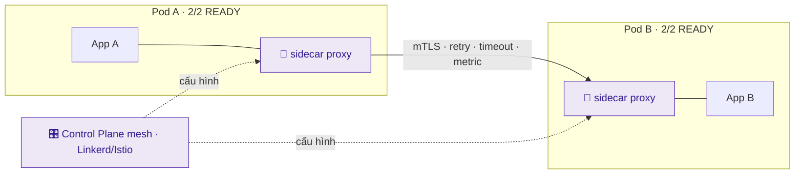
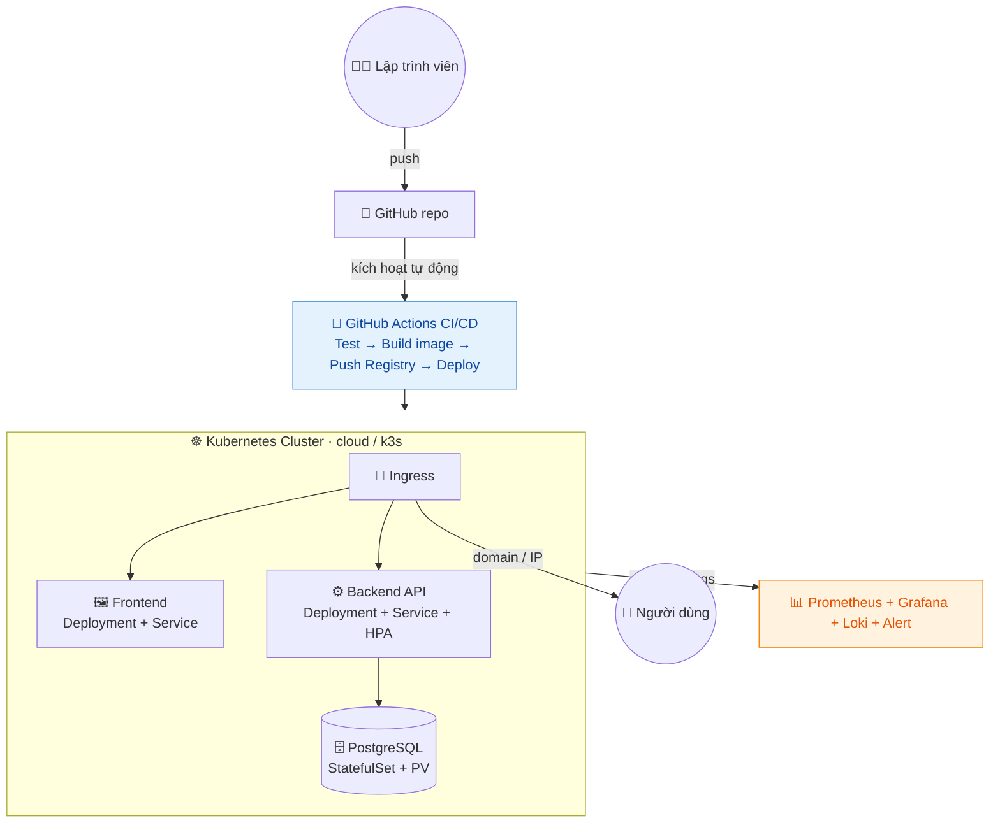

# Giai đoạn 4 — SRE, Chủ đề nâng cao & Dự án Tốt nghiệp

> **Ngày 51–60** · Độ tin cậy, tối ưu, dự án thực chiến và chuẩn bị sự nghiệp.
>
> **Khuôn mỗi ngày:** 📘 Lý thuyết → 🧪 Lab cơ bản → 🚀 Lab nâng cao (best-practice) → 💡 Bổ sung thực tế → 📝 Bài ôn tập.
>
> ✅ Trung lập nền tảng — kiến thức SRE/FinOps/Platform áp dụng cho mọi hệ thống và nhà cung cấp.

---

## Mục lục

| Ngày | Chủ đề |
|------|--------|
| [51](#ngày-51--site-reliability-engineering-sre--nguyên-lý) | Site Reliability Engineering (SRE) — Nguyên lý |
| [52](#ngày-52--high-availability-scaling--disaster-recovery) | High Availability, Scaling & Disaster Recovery |
| [53](#ngày-53--cost-optimization--finops) | Cost Optimization & FinOps |
| [54](#ngày-54--service-mesh--microservices-nâng-cao) | Service Mesh & Microservices nâng cao |
| [55](#ngày-55--platform-engineering--developer-experience) | Platform Engineering & Developer Experience |
| [56](#ngày-56--dự-án-tốt-nghiệp-phần-1-thiết-kế--hạ-tầng) | **Dự án tốt nghiệp — Phần 1: Thiết kế & Hạ tầng** |
| [57](#ngày-57--dự-án-tốt-nghiệp-phần-2-container--cicd) | **Dự án tốt nghiệp — Phần 2: Container & CI/CD** |
| [58](#ngày-58--dự-án-tốt-nghiệp-phần-3-monitoring--reliability) | **Dự án tốt nghiệp — Phần 3: Monitoring & Reliability** |
| [59](#ngày-59--dự-án-tốt-nghiệp-phần-4-tài-liệu-demo--portfolio) | **Dự án tốt nghiệp — Phần 4: Tài liệu, Demo & Portfolio** |
| [60](#ngày-60--tốt-nghiệp--tổng-kết-chứng-chỉ--định-hướng-sự-nghiệp) | **TỐT NGHIỆP — Tổng kết, Chứng chỉ & Định hướng** |
| [📎 Phụ lục](#-phụ-lục-giai-đoạn-4) | Dự án CloudNote · Checklist năng lực · Định hướng nghề |

---

## Ngày 51 — Site Reliability Engineering (SRE) — Nguyên lý

> ⏱️ ~90 phút · Loại: SRE
>
> 🧭 **Bạn đang ở đâu:** Giai đoạn 3 (dựng được hệ thống hiện đại) → **Ngày 51 (đo độ tin cậy bằng con số, và dùng con số đó để ra quyết định)** → Ngày 52 (HA & DR). Chặng cuối nâng bạn từ *"hệ thống chạy được"* lên *"hệ thống tin cậy tới mức đo được, và biết khi nào được phép mạo hiểm"*.
>
> ✅ **Chuẩn bị:** stack giám sát từ Ngày 44–46 (`cd ~/lab44-prometheus && docker compose start`).
>
> 🎁 **Cuối ngày bạn có gì:** SLO thật chạy trên Prometheus, một **ngân sách lỗi** tính bằng con số, cảnh báo theo **tốc độ tiêu ngân sách** — và bạn sẽ **tự gây sự cố để nhìn ngân sách bị đốt trước mắt**.

### 📘 Lý thuyết

#### 1. Câu hỏi mà DevOps không trả lời được

Giai đoạn 3 đã cho bạn công cụ. Nhưng vài câu hỏi rất thực tế vẫn treo đó:

- *"Hệ thống có đủ tin cậy chưa?"* — Dựa vào đâu để nói **đủ**?
- *"Tuần này nên làm tính năng mới hay đi vá hạ tầng?"* — Ai quyết, dựa trên gì?
- *"Có nên đánh thức người trực lúc 3 giờ sáng vì việc này không?"* — Ranh giới ở đâu?

Trả lời bằng cảm tính thì mỗi người một ý, và người nói to nhất thắng. **SRE là cách trả lời ba câu đó bằng con số** — để tranh luận dựa trên dữ liệu chứ không dựa trên cảm giác.

#### 2. Sự thật khó chịu: 100% là mục tiêu sai

Nghe phản trực giác, nhưng đây là nền tảng của SRE:

- Từ 99% lên 99,9%: khó và tốn.
- Từ 99,9% lên 99,99%: **tốn gấp nhiều lần** (cần dự phòng đa vùng, tự động chuyển đổi, đội trực 24/7).
- Lên 100%: **bất khả thi** — và kể cả gần đạt, người dùng cũng không cảm nhận được, vì mạng của họ, điện thoại của họ đã kém tin cậy hơn thế.

Xem thử "chín số chín" quy ra thời gian chết cho phép:

| Mức | Chết mỗi tháng | Chết mỗi năm | Thực tế cần gì |
|---|---|---|---|
| 99% | 7,2 giờ | 3,65 ngày | Một máy chủ chăm sóc tử tế |
| **99,9%** | **43 phút** | **8,76 giờ** | Dự phòng cơ bản, có giám sát — *đích hợp lý cho đa số* |
| 99,99% | 4,3 phút | 52 phút | Nhiều vùng, tự chuyển đổi, trực 24/7 |
| 99,999% | 26 giây | 5,26 phút | Đội lớn, chi phí rất cao |

> 🔑 **Câu hỏi đúng không phải "làm sao đạt 100%?"** mà là *"mức không hoàn hảo nào thì người dùng vẫn hài lòng, và ta trả nổi?"*

#### 3. SLI, SLO, SLA — ba chữ hay bị lẫn

| Chữ | Là gì | Ví dụ |
|---|---|---|
| **SLI** (Indicator) | **Con số đo được** | "99,95% request trả về trong dưới 300ms" |
| **SLO** (Objective) | **Mục tiêu nội bộ** bạn tự đặt cho SLI | "SLI phải ≥ 99,9% trong 30 ngày" |
| **SLA** (Agreement) | **Cam kết với khách hàng**, vi phạm là đền tiền | "Dưới 99,5% thì hoàn 10% phí" |

Quan hệ giữa chúng luôn là: **SLA < SLO < thực tế**. Đặt SLO chặt hơn SLA để khi bắt đầu trượt SLO, bạn còn thời gian xoay xở trước khi phải đền tiền.

#### 4. Ngân sách lỗi — ý tưởng hay nhất của SRE

Nếu SLO là 99,9%, thì **0,1% còn lại là ngân sách bạn được phép tiêu**:

```text
  SLO 99,9% trong 30 ngày
  → ngân sách lỗi = 0,1% × 30 ngày = 43 phút 12 giây chết/tháng
```

Con số này biến cuộc tranh cãi muôn thuở giữa đội phát triển và đội vận hành thành một phép tính:

| Tình trạng ngân sách | Quyết định |
|---|---|
| **Còn nhiều** | Phát hành thoải mái, thử nghiệm, chấp nhận rủi ro |
| **Sắp hết** | Đóng băng tính năng mới, tập trung vào độ ổn định |
| **Đã cạn** | **Dừng phát hành**, chỉ sửa lỗi cho tới khi hồi lại |

> 🔑 **Vì sao đây là ý tưởng hay:** đội phát triển muốn đi nhanh, đội vận hành muốn ổn định — trước đây hai bên cãi nhau bằng quan điểm. Giờ cả hai nhìn **cùng một con số**, và con số đó tự quyết định. Không ai phải thắng ai.

#### 5. Tốc độ đốt ngân sách — cách cảnh báo thông minh

Cảnh báo kiểu cũ: *"tỉ lệ lỗi > 1%"* → bắn liên tục vì mọi dao động nhỏ.

Cảnh báo theo **burn rate** hỏi một câu thông minh hơn: *"với tốc độ này, bao lâu nữa thì cạn sạch ngân sách tháng?"*

```text
  burn rate = (tỉ lệ lỗi hiện tại) / (tỉ lệ lỗi cho phép)
```

| Burn rate | Nghĩa là | Ứng xử |
|---|---|---|
| 1 | Tiêu đúng nhịp, hết đúng cuối tháng | Bình thường |
| 2 | Cạn sau nửa tháng | Để ý |
| **14,4** | **Cạn sau ~2 ngày** | **Gọi người dậy ngay** |

Và mẹo quan trọng: **kiểm tra trên hai khung thời gian cùng lúc** (ví dụ 5 phút *và* 1 giờ). Khung ngắn để phát hiện nhanh, khung dài để loại nhiễu. Cả hai cùng vượt ngưỡng mới báo động — nhờ vậy một cú giật 30 giây không đánh thức ai.

#### 6. Toil — công việc lặp đi lặp lại không sinh giá trị

**Toil** là việc thủ công, lặp lại, làm xong không để lại gì lâu dài: khởi động lại dịch vụ bằng tay mỗi sáng, xoá log đầy ổ, cấp quyền từng người.

Google đặt ra nguyên tắc: **toil không được vượt quá 50% thời gian của SRE**; phần còn lại phải dành cho việc tự động hoá chính những toil đó. Không có ranh giới này, đội vận hành sẽ bị việc vặt nuốt chửng và hệ thống mãi không khá lên.

#### 7. Mổ xẻ sự cố không đổ lỗi

Sau mỗi sự cố, viết **postmortem** trả lời: chuyện gì xảy ra, ảnh hưởng ai, vì sao, và làm gì để không tái diễn — **không nêu tên để quy trách nhiệm**.

Lý do rất thực dụng: nếu người ta sợ bị đổ lỗi, họ sẽ giấu sai sót, và bạn mất luôn cơ hội học. Câu hỏi đúng không phải *"ai làm sai?"* mà là **"hệ thống nào đã cho phép sai sót đó gây hậu quả?"**. Nếu một cú gõ nhầm làm sập production thì vấn đề nằm ở chỗ thiếu rào chắn, không nằm ở ngón tay.

### 🧪 LAB — Đo SLO thật và nhìn ngân sách bị đốt

> Ta thêm **blackbox exporter** vào stack cũ để đo "từ bên ngoài nhìn vào, dịch vụ có sống không" — đúng cách đo SLI khả dụng ngoài đời.

**Những gì thêm vào `lab44-prometheus/`:**

```text
lab44-prometheus/
├── docker-compose.yml          # SỬA — thêm blackbox + app-demo
├── prometheus.yml              # SỬA — thêm job probe + nạp file SLO
├── blackbox.yml                # THÊM
└── slo.rules.yml               # THÊM — recording rules + burn rate alert
```

#### File 1 — thêm 2 service vào `docker-compose.yml`

```yaml
  blackbox:
    image: prom/blackbox-exporter:v0.25.0
    container_name: blackbox
    restart: unless-stopped
    ports:
      - "9115:9115"
    volumes:
      - ./blackbox.yml:/etc/blackbox_exporter/config.yml:ro

  app-demo:
    image: nginx:1.27-alpine
    container_name: app-demo
    restart: unless-stopped
    ports:
      - "8200:80"
    command:
      - /bin/sh
      - -c
      - echo "<h1>Dịch vụ đang phục vụ</h1>" > /usr/share/nginx/html/index.html
        && nginx -g 'daemon off;'
```

#### File 2 — `blackbox.yml`

```yaml
modules:
  http_2xx:
    prober: http
    timeout: 5s
    http:
      valid_http_versions: ["HTTP/1.1", "HTTP/2.0"]
      valid_status_codes: [200]      # chỉ 200 mới tính là thành công
      method: GET
      preferred_ip_protocol: ip4
```

#### File 3 — thêm vào `prometheus.yml`

Thêm `slo.rules.yml` vào mục `rule_files:`:

```yaml
rule_files:
  - /etc/prometheus/alert.rules.yml
  - /etc/prometheus/slo.rules.yml
```

Và thêm job probe vào cuối `scrape_configs:`:

```yaml
  # Đo dịch vụ TỪ BÊN NGOÀI nhìn vào — đây mới là góc nhìn của người dùng
  - job_name: 'do-suc-khoe-dich-vu'
    scrape_interval: 10s
    metrics_path: /probe
    params:
      module: [http_2xx]
    static_configs:
      - targets:
          - http://app-demo:80          # địa chỉ cần đo
    relabel_configs:
      - source_labels: [__address__]
        target_label: __param_target
      - source_labels: [__param_target]
        target_label: instance
      - target_label: __address__
        replacement: blackbox:9115      # gửi yêu cầu đo tới blackbox exporter
```

Nhớ mount thêm file rule trong phần `volumes:` của service `prometheus`:

```yaml
      - ./slo.rules.yml:/etc/prometheus/slo.rules.yml:ro
```

#### File 4 — `slo.rules.yml`

```yaml
groups:
  # ---------- Recording rules: tính sẵn SLI cho nhẹ dashboard ----------
  - name: slo-tinh-san
    interval: 15s
    rules:
      # SLI khả dụng trên các khung thời gian khác nhau
      - record: sli:kha_dung:ratio5m
        expr: avg_over_time(probe_success{job="do-suc-khoe-dich-vu"}[5m])

      - record: sli:kha_dung:ratio30m
        expr: avg_over_time(probe_success{job="do-suc-khoe-dich-vu"}[30m])

      - record: sli:kha_dung:ratio1h
        expr: avg_over_time(probe_success{job="do-suc-khoe-dich-vu"}[1h])

      # Mục tiêu SLO — khai thành metric để dashboard tham chiếu
      - record: slo:muc_tieu
        expr: vector(0.99)                  # SLO = 99%

      # Tốc độ đốt ngân sách = tỉ lệ lỗi hiện tại / tỉ lệ lỗi cho phép
      - record: slo:burn_rate5m
        expr: (1 - sli:kha_dung:ratio5m) / (1 - 0.99)

      - record: slo:burn_rate1h
        expr: (1 - sli:kha_dung:ratio1h) / (1 - 0.99)

      # Phần trăm ngân sách lỗi CÒN LẠI (tính trên khung 1 giờ cho lab)
      - record: slo:ngan_sach_con_lai_phan_tram
        expr: clamp_min((1 - (1 - sli:kha_dung:ratio1h) / (1 - 0.99)) * 100, 0)

  # ---------- Cảnh báo theo tốc độ đốt, kiểm tra 2 khung ----------
  - name: slo-canh-bao
    rules:
      # Đốt rất nhanh: cạn ngân sách trong khoảng 2 ngày -> gọi người dậy
      - alert: DotNganSachRatNhanh
        expr: slo:burn_rate5m > 14.4 and slo:burn_rate1h > 14.4
        for: 2m
        labels:
          severity: critical
          muc_do: goi-nguoi-day
        annotations:
          tom_tat: "Đốt ngân sách lỗi cực nhanh"
          chi_tiet: "Tốc độ gấp {{ $value | printf \"%.1f\" }} lần cho phép — cạn ngân sách trong ~2 ngày."

      # Đốt nhanh vừa: ghi vé, xử lý trong giờ hành chính
      - alert: DotNganSachNhanh
        expr: slo:burn_rate1h > 6 and slo:burn_rate1h < 14.4
        for: 15m
        labels:
          severity: warning
          muc_do: ghi-ve
        annotations:
          tom_tat: "Đốt ngân sách nhanh hơn bình thường"
          chi_tiet: "Xem xét trong giờ làm việc, chưa cần đánh thức ai."
```

> 📌 **Lưu ý về khung thời gian:** SLO thật dùng khung **30 ngày**. Lab dùng khung **1 giờ** để bạn thấy kết quả ngay trong buổi học. Công thức hoàn toàn giống nhau — chỉ đổi con số trong ngoặc vuông.

### 🧭 Hướng dẫn làm LAB — step by step

#### Bước 1 — Thêm 2 service và khởi động

```bash
cd ~/lab44-prometheus
# tạo blackbox.yml, slo.rules.yml
# sửa docker-compose.yml (thêm blackbox + app-demo)
# sửa prometheus.yml (thêm rule_files + job probe + mount slo.rules.yml)
docker compose up -d
docker compose ps | grep -E "blackbox|app-demo"
```

**Bạn sẽ thấy:**
```text
app-demo    Up 8 seconds   0.0.0.0:8200->80/tcp
blackbox    Up 8 seconds   0.0.0.0:9115->9115/tcp
```

✅ **Checkpoint:** cả hai container `Up`.

Kiểm tra phép đo hoạt động:
```bash
curl -s "localhost:9115/probe?target=http://app-demo:80&module=http_2xx" | grep -E "^probe_success|^probe_duration"
```

**Bạn sẽ thấy:**
```text
probe_success 1
probe_duration_seconds 0.002
```

✅ **Checkpoint:** `probe_success 1` — dịch vụ đang khoẻ theo góc nhìn bên ngoài.

💡 **Vì sao đo từ bên ngoài mới đúng:** `up` của Ngày 44 chỉ nói *"Prometheus scrape được target"*. Còn `probe_success` nói *"một client bên ngoài gọi vào và nhận được 200"* — đúng trải nghiệm của người dùng thật. **SLI phải đo thứ người dùng cảm nhận**, không phải thứ tiện đo.

#### Bước 2 — Xác nhận các recording rule đã được nạp

```bash
docker compose exec prometheus promtool check rules /etc/prometheus/slo.rules.yml
curl -s localhost:9090/api/v1/rules | grep -o '"name":"[^"]*"' | sort -u | head
```

**Bạn sẽ thấy:**
```text
SUCCESS: 8 rules found

"name":"DotNganSachNhanh"
"name":"DotNganSachRatNhanh"
"name":"sli:kha_dung:ratio1h"
"name":"sli:kha_dung:ratio5m"
...
```

✅ **Checkpoint:** đủ 8 luật, không lỗi cú pháp.

⚠️ **Nếu báo `no rule files found`:** thiếu mount hoặc quên thêm vào `rule_files`. Kiểm tra: `docker compose exec prometheus ls /etc/prometheus/`.

#### Bước 3 — Đọc SLI đầu tiên

Chờ khoảng 2 phút để có đủ dữ liệu, rồi vào **http://localhost:9090** và chạy:

```promql
sli:kha_dung:ratio5m
```

**Bạn sẽ thấy:**
```text
sli:kha_dung:ratio5m{instance="http://app-demo:80", job="do-suc-khoe-dich-vu"}   1
```

`1` nghĩa là **100% phép đo thành công** — hoàn hảo, vì chưa có gì hỏng.

Xem tốc độ đốt và ngân sách còn lại:
```promql
slo:burn_rate5m
slo:ngan_sach_con_lai_phan_tram
```

**Bạn sẽ thấy:** `0` và `100`.

✅ **Checkpoint:** burn rate bằng 0, ngân sách còn 100%.

💡 Đọc lại cho quen: burn rate `0` nghĩa là **đang không tiêu đồng nào** trong ngân sách lỗi. Còn nguyên 100% để dành cho lúc thật sự cần.

#### Bước 4 — Tự tính ngân sách lỗi bằng tay

Trước khi để máy tính, hãy tự tính một lần — nó giúp con số trở nên có nghĩa:

| SLO | Ngân sách lỗi | Chết cho phép mỗi tháng (30 ngày) |
|---|---|---|
| 99% | 1% | 30 × 24 × 60 × 0,01 = **432 phút** ≈ 7,2 giờ |
| 99,9% | 0,1% | 30 × 24 × 60 × 0,001 = **43,2 phút** |
| 99,95% | 0,05% | **21,6 phút** |

```bash
python3 -c "
for slo in [99, 99.9, 99.95, 99.99]:
    phut = 30*24*60 * (1 - slo/100)
    print(f'SLO {slo}%  ->  chết cho phép {phut:7.1f} phút/tháng')
"
```

**Bạn sẽ thấy:**
```text
SLO 99%    ->  chết cho phép   432.0 phút/tháng
SLO 99.9%  ->  chết cho phép    43.2 phút/tháng
SLO 99.95% ->  chết cho phép    21.6 phút/tháng
SLO 99.99% ->  chết cho phép     4.3 phút/tháng
```

✅ **Checkpoint:** hiểu rằng thêm một chữ số 9 nghĩa là **giảm 10 lần** thời gian chết cho phép.

💡 Nhìn con số này là hiểu vì sao "cứ đặt 99,99% cho chắc" là quyết định tốn kém: chỉ còn **4 phút** mỗi tháng — không đủ cho một lần khởi động lại thủ công, nghĩa là mọi thứ buộc phải tự động và có dự phòng.

#### Bước 5 — Gây sự cố và nhìn ngân sách bị đốt

Đây là phần đáng giá nhất hôm nay.

```bash
docker compose stop app-demo
```

Mở tab **Graph** của Prometheus, theo dõi 3 truy vấn (chờ 1–2 phút cho số liệu ngấm):

```promql
sli:kha_dung:ratio5m
slo:burn_rate5m
slo:ngan_sach_con_lai_phan_tram
```

**Bạn sẽ thấy diễn biến:**

| Sau khoảng | SLI 5m | Burn rate | Ngân sách còn |
|---|---|---|---|
| 30 giây | 0,90 | 10 | 90% |
| 1 phút | 0,80 | 20 | 80% |
| 2 phút | 0,60 | 40 | 60% |
| 5 phút | **0,00** | **100** | **0%** |

✅ **Checkpoint:** thấy ngân sách tụt dần **theo thời gian chết**, không phải tụt một nhát.

Xem cảnh báo:
```bash
curl -s localhost:9090/api/v1/alerts | grep -o '"alertname":"[^"]*","[^"]*"\|"state":"[^"]*"' | head
```

Hoặc mở tab **Alerts** trên giao diện: `DotNganSachRatNhanh` chuyển **PENDING** rồi **FIRING** sau 2 phút.

💡 **Đây là điều SLO làm được mà cảnh báo thường không làm được:** thay vì báo "dịch vụ chết" (bạn đã biết rồi), nó trả lời câu hỏi có ích hơn nhiều — *"chuyện này nghiêm trọng đến mức nào so với mức chịu đựng cả tháng?"*. Chết 30 giây thì không sao; chết 30 phút là đã tiêu hơn nửa ngân sách tháng của SLO 99,9%.

Hồi phục:
```bash
docker compose start app-demo
```

Chờ vài phút và xem SLI leo lên lại — đây chính là ý nghĩa "cửa sổ trượt": lỗi cũ dần rơi ra khỏi khung tính.

#### Bước 6 — Thêm panel ngân sách lỗi vào Grafana

Thêm vào mảng `panels` trong `grafana/provisioning/dashboards/he-thong.json` (nhớ thêm dấu phẩy sau panel trước đó):

```json
    {
      "type": "gauge",
      "title": "Ngân sách lỗi còn lại (%)",
      "gridPos": { "h": 8, "w": 6, "x": 0, "y": 16 },
      "targets": [{ "expr": "slo:ngan_sach_con_lai_phan_tram", "refId": "A" }],
      "fieldConfig": {
        "defaults": {
          "unit": "percent",
          "min": 0,
          "max": 100,
          "thresholds": {
            "mode": "absolute",
            "steps": [
              { "color": "red", "value": null },
              { "color": "orange", "value": 25 },
              { "color": "green", "value": 50 }
            ]
          }
        }
      }
    },
    {
      "type": "timeseries",
      "title": "Tốc độ đốt ngân sách (1 = đúng nhịp)",
      "gridPos": { "h": 8, "w": 18, "x": 6, "y": 16 },
      "targets": [
        { "expr": "slo:burn_rate5m", "legendFormat": "5 phút", "refId": "A" },
        { "expr": "slo:burn_rate1h", "legendFormat": "1 giờ", "refId": "B" }
      ],
      "fieldConfig": { "defaults": { "min": 0 } }
    }
```

Chờ 30 giây (provider tự quét lại) rồi mở dashboard.

✅ **Checkpoint:** hai panel mới hiện ra, kim đồng hồ xanh khi hệ thống khoẻ.

💡 **Đây là màn hình mà một đội SRE thật sự nhìn hằng ngày.** Không phải "CPU bao nhiêu phần trăm", mà là *"ta còn bao nhiêu quyền được phép sai trong tháng này?"* — con số đó quyết định tuần này đội được phép phát hành hay phải đi vá.

#### Bước 7 — Tập viết postmortem

Sự cố ở Bước 5 là do bạn tạo ra. Hãy viết lại nó theo đúng khuôn dùng ở công ty:

```bash
mkdir -p ~/lab51-sre && cat > ~/lab51-sre/postmortem-01.md <<'EOF'
# Postmortem: app-demo ngừng phục vụ

## Tóm tắt
Dịch vụ app-demo không phản hồi trong 5 phút, tiêu hết 100% ngân sách lỗi
của khung 1 giờ (SLO 99%).

## Ảnh hưởng
- Thời gian: 5 phút
- Người dùng bị ảnh hưởng: 100% lượt truy cập trong khoảng đó
- Ngân sách lỗi tiêu tốn: toàn bộ khung 1 giờ

## Dòng thời gian
- 10:00 — container app-demo bị dừng (thao tác chủ động trong lab)
- 10:00:30 — probe_success chuyển 0, SLI bắt đầu tụt
- 10:02 — cảnh báo DotNganSachRatNhanh chuyển FIRING
- 10:05 — khởi động lại dịch vụ
- 10:10 — SLI hồi phục

## Nguyên nhân gốc
Dịch vụ chỉ có MỘT bản duy nhất, không có dự phòng. Một container dừng là
toàn bộ dịch vụ ngừng.

## Vì sao phát hiện được
Cảnh báo theo tốc độ đốt ngân sách, kiểm tra trên 2 khung thời gian.

## Hành động khắc phục (kèm người chịu trách nhiệm và hạn)
1. Chạy tối thiểu 2 bản sao có cân bằng tải — (Ngày 52)
2. Thêm probe cho cả đường dẫn /health, không chỉ trang chủ
3. Viết runbook: các bước xử lý khi dịch vụ không phản hồi

## Điều làm tốt
- Phát hiện tự động trong 2 phút, không cần ai báo
- Ngân sách lỗi cho biết ngay mức nghiêm trọng

## KHÔNG ghi trong tài liệu này
Tên người gây ra sự cố. Câu hỏi là "hệ thống nào đã cho phép một thao tác
đơn lẻ gây gián đoạn toàn bộ?", không phải "ai đã gõ lệnh đó?".
EOF

cat ~/lab51-sre/postmortem-01.md | head -12
```

✅ **Checkpoint:** có một postmortem hoàn chỉnh, không nêu tên ai.

💡 Để ý mục cuối. Trong lab này bạn **biết chính xác** ai gây ra sự cố — là bạn. Nhưng tài liệu vẫn không ghi điều đó, vì thông tin hữu ích nằm ở chỗ khác: **hệ thống chỉ có một bản sao duy nhất**. Đó mới là thứ cần sửa.

#### Bước 8 — Dọn dẹp

```bash
cd ~/lab44-prometheus
docker compose stop
```

💡 Giữ nguyên stack — Ngày 52 sẽ dùng lại để kiểm chứng hiệu quả của việc chạy nhiều bản sao.

### 💡 Đi làm mới thấm (sách cơ bản hay bỏ quên)

- **SLI phải đo thứ người dùng cảm nhận được.** "CPU dưới 80%" không phải SLI — người dùng không quan tâm CPU. "Tỉ lệ request thành công", "p95 độ trễ", "tỉ lệ đặt hàng hoàn tất" mới là thứ họ cảm nhận. Đo sai chỉ số thì SLO đẹp mà khách vẫn bỏ đi.
- **Đặt SLO dựa trên dữ liệu quá khứ, đừng bốc số.** Cách làm đúng: đo thực tế 30 ngày, thấy đang đạt 99,7%, thì đặt SLO 99,5% (hơi thấp hơn hiện trạng). Đặt 99,99% khi hệ thống mới đạt 99% chỉ tạo ra một mục tiêu ai cũng biết là không thể và rồi ai cũng bơ đi.
- **Ngân sách lỗi chỉ có giá trị nếu nó thật sự chặn được phát hành.** Nhiều nơi dựng dashboard SLO rất đẹp rồi vẫn phát hành bất chấp khi ngân sách cạn. Khi đó nó chỉ là đồ trang trí. Sức mạnh của ý tưởng này nằm ở chỗ **cả tổ chức đồng ý tuân theo con số**.
- **Cảnh báo phải gắn với SLO, không gắn với triệu chứng.** Cảnh báo "CPU 90%" đánh thức người ta dù người dùng không hề bị ảnh hưởng. Cảnh báo theo tốc độ đốt ngân sách chỉ đánh thức khi **người dùng thật sự đang chịu thiệt**. Đây là cách giảm mạnh số lần bị gọi dậy vô ích.
- **Không phải mọi dịch vụ đều cần cùng một SLO.** Trang thanh toán và trang "Giới thiệu" không thể chung một mức. Đặt SLO cao cho luồng sinh ra tiền, thấp hơn cho phần phụ — nguồn lực là hữu hạn, hãy tiêu vào chỗ đáng.
- **Postmortem không đổ lỗi không có nghĩa là không có trách nhiệm.** Nó vẫn có người chịu trách nhiệm cho từng hành động khắc phục và có hạn chót. Điều nó bỏ đi chỉ là việc **quy lỗi cho cá nhân** — thứ chỉ khiến người ta giấu sai sót.

### 🎯 Đúc kết Ngày 51

**3 điều phải mang theo:**

1. **100% là mục tiêu sai.** Câu hỏi đúng là "mức không hoàn hảo nào người dùng vẫn hài lòng và ta trả nổi?" — rồi biến câu trả lời thành SLO.
2. **Ngân sách lỗi biến tranh cãi thành phép tính.** Còn ngân sách thì cứ phát hành; cạn rồi thì dừng lại mà vá. Không ai phải thắng ai.
3. **Cảnh báo theo tốc độ đốt, kiểm tra trên hai khung thời gian.** Phát hiện nhanh mà không bị đánh thức vì những cú giật vô hại.

> 🧠 **Một câu để nhớ:** SRE không hỏi *"hệ thống có chết không?"* — nó hỏi **"ta còn được phép chết bao nhiêu phút nữa trong tháng này?"**.

**✅ Tự chấm** *(đánh dấu khi làm được mà không nhìn tài liệu):*

- [ ] Phân biệt SLI, SLO, SLA và nói rõ vì sao SLA phải lỏng hơn SLO
- [ ] Tính được ngân sách lỗi theo phút từ một mức SLO bất kỳ
- [ ] Giải thích vì sao 100% là mục tiêu sai
- [ ] Viết recording rule tính SLI và burn rate trong Prometheus
- [ ] Giải thích vì sao cảnh báo burn rate dùng hai khung thời gian
- [ ] Gây sự cố và đọc được ngân sách bị tiêu bao nhiêu
- [ ] Nói được toil là gì và vì sao giới hạn ở 50%
- [ ] Viết postmortem không đổ lỗi và giải thích vì sao phải như vậy

✅ **Kết quả đạt được:** Một SLO chạy thật với ngân sách lỗi đo được và cảnh báo theo tốc độ đốt — bạn đã có ngôn ngữ con số để trả lời câu hỏi "hệ thống đã đủ tin cậy chưa?".

---

## Ngày 52 — High Availability, Scaling & Disaster Recovery

> ⏱️ ~90 phút · Loại: SRE
>
> 🧭 **Bạn đang ở đâu:** Ngày 51 (đo độ tin cậy bằng SLO) → **Ngày 52 (thiết kế để không mất độ tin cậy, và cứu được khi mất thật)** → Ngày 53 (chi phí). Hôm qua postmortem của bạn chỉ ra nguyên nhân gốc: *"dịch vụ chỉ có một bản duy nhất"*. Hôm nay sửa đúng chỗ đó.
>
> ✅ **Chuẩn bị:** stack Ngày 44–51 (`cd ~/lab44-prometheus && docker compose start`), có Docker Compose.
>
> 🎁 **Cuối ngày bạn có gì:** một dịch vụ **sống sót khi bạn giết từng bản một** (đo được bằng chính SLI hôm qua), cộng một quy trình sao lưu–khôi phục database mà bạn **đã tự bấm giờ**.

### 📘 Lý thuyết

#### 1. Ba khái niệm hay bị gộp làm một

| | Câu hỏi nó trả lời | Ví dụ |
|---|---|---|
| **HA** (High Availability) | *"Một thành phần chết thì dịch vụ có tiếp tục không?"* | 3 bản sao, chết 1 vẫn còn 2 |
| **Scaling** | *"Đông khách hơn thì có phục vụ nổi không?"* | Tự thêm bản sao khi tải cao (Ngày 41) |
| **DR** (Disaster Recovery) | *"Mất sạch thì bao lâu dựng lại được, và mất bao nhiêu dữ liệu?"* | Khôi phục từ bản sao lưu |

Ba thứ khác nhau và **không thay thế nhau**. Có HA không có nghĩa là có DR: bạn chạy 5 bản sao cùng một cụm, ai đó gõ nhầm lệnh xoá cả cụm, hoặc dữ liệu bị hỏng — cả 5 bản sao cùng chết. HA chống **hỏng hóc**, DR chống **thảm hoạ**.

#### 2. Điểm chết đơn lẻ — thứ phải đi tìm có chủ đích

**Single Point of Failure (SPOF)** là bất kỳ thành phần nào mà nó chết là cả hệ thống chết.

Cách tìm rất đơn giản: với từng thành phần, hỏi *"cái này chết thì sao?"*

| Thành phần | Chết thì sao | Có phải SPOF? |
|---|---|---|
| 1 trong 3 app | Còn 2 cái phục vụ | Không |
| Bộ cân bằng tải duy nhất | **Không ai vào được** | **Có** |
| Database chính duy nhất | **Không đọc ghi được gì** | **Có** |
| Một trong nhiều node | Pod dời sang node khác | Không |

> 🔑 Loại bỏ SPOF **luôn tốn tiền** (phải nhân đôi thứ gì đó). Vì vậy quyết định đúng không phải "diệt sạch SPOF", mà là **"SPOF nào đáng tiền để loại bỏ?"** — và câu trả lời đến từ SLO của Ngày 51.

#### 3. RTO và RPO — hai con số của kế hoạch thảm hoạ

```text
       ← RPO →            THẢM HOẠ            ← RTO →
   ────────┬──────────────────┼──────────────────┬────────
      sao lưu cuối        hệ thống chết      chạy lại được
      
   RPO = mất tối đa bao nhiêu DỮ LIỆU (tính bằng thời gian)
   RTO = mất tối đa bao nhiêu THỜI GIAN để khôi phục
```

| | Nghĩa | Muốn nhỏ hơn thì phải |
|---|---|---|
| **RPO** | Chấp nhận mất dữ liệu bao nhiêu lâu | Sao lưu dày hơn, hoặc nhân bản liên tục |
| **RTO** | Chấp nhận chết bao lâu | Tự động hoá khôi phục, dựng sẵn hệ thống chờ |

Ví dụ thực tế: *"RPO 1 giờ, RTO 4 giờ"* nghĩa là chấp nhận mất tối đa 1 giờ dữ liệu và hệ thống chết tối đa 4 giờ. Hai con số này **quyết định toàn bộ thiết kế và chi phí** — RPO bằng 0 đòi hỏi nhân bản đồng bộ, đắt hơn sao lưu theo giờ rất nhiều lần.

#### 4. Bốn chiến lược DR, đắt dần

| Chiến lược | Cách làm | RTO điển hình | Chi phí |
|---|---|---|---|
| **Backup & Restore** | Chỉ có bản sao lưu, có sự cố mới dựng lại | Nhiều giờ đến vài ngày | Thấp nhất |
| **Pilot Light** | Giữ sẵn phần lõi (database nhân bản), phần còn lại dựng khi cần | Vài chục phút | Thấp |
| **Warm Standby** | Bản thu nhỏ chạy sẵn, có sự cố thì phóng to | Vài phút | Trung bình |
| **Multi-Site Active** | Nhiều vùng cùng phục vụ | Gần như tức thì | Cao nhất |

#### 5. Quy tắc 3-2-1 cho sao lưu

> **3** bản sao dữ liệu · **2** loại phương tiện khác nhau · **1** bản ở nơi khác về mặt địa lý

Và điều quan trọng nhất về sao lưu:

> ⚠️ **Bản sao lưu chưa từng được khôi phục thử thì không phải bản sao lưu — nó chỉ là một file bạn hy vọng là dùng được.**

Vô số tổ chức đã phát hiện ra điều này theo cách đau đớn nhất: sao lưu chạy đều hàng đêm suốt hai năm, đến lúc cần thì file rỗng, hoặc thiếu bảng, hoặc không có mật khẩu giải mã. **Phải diễn tập khôi phục định kỳ.**

#### 6. Mở rộng theo chiều dọc và chiều ngang

| | **Dọc** (scale up) | **Ngang** (scale out) |
|---|---|---|
| Cách làm | Máy to hơn (nhiều CPU/RAM hơn) | Thêm nhiều máy |
| Giới hạn | Có trần vật lý, và phải khởi động lại | Gần như không trần |
| Giúp HA không | **Không** — vẫn là một máy, vẫn là SPOF | **Có** |
| Hợp với | Database truyền thống | App không trạng thái |

> 🔑 Đây là lý do nguyên tắc **stateless** (không giữ trạng thái trong bộ nhớ ứng dụng) quan trọng đến vậy: app không trạng thái thì nhân bản thoải mái; app giữ phiên đăng nhập trong RAM thì thêm bản sao là người dùng bị đăng xuất ngẫu nhiên.

### 🧪 LAB — Từ một bản duy nhất tới cụm chịu lỗi

**Thư mục mới:**

```text
lab52-ha/
├── docker-compose.yml       # 3 app + 1 load balancer + postgres
├── nginx-lb.conf            # cấu hình cân bằng tải + kiểm tra sức khoẻ
└── sao-luu/                 # nơi chứa bản sao lưu database
```

#### File 1 — `nginx-lb.conf`

```nginx
upstream cum_ung_dung {
    least_conn;                                    # gửi tới bản đang rảnh nhất

    # max_fails: trượt 2 lần thì tạm loại khỏi cụm
    # fail_timeout: loại trong 10 giây rồi thử lại
    server app1:80 max_fails=2 fail_timeout=10s;
    server app2:80 max_fails=2 fail_timeout=10s;
    server app3:80 max_fails=2 fail_timeout=10s;
}

server {
    listen 80;

    location / {
        proxy_pass http://cum_ung_dung;
        proxy_set_header Host $host;
        proxy_set_header X-Real-IP $remote_addr;

        # Bản này chết -> TỰ ĐỘNG thử bản tiếp theo, người dùng không thấy lỗi
        proxy_next_upstream error timeout http_502 http_503 http_504;
        proxy_connect_timeout 2s;
        proxy_read_timeout 5s;
    }

    # Điểm để giám sát đo sức khoẻ của chính bộ cân bằng tải
    location /health {
        access_log off;
        return 200 "load balancer ok\n";
    }
}
```

#### File 2 — `docker-compose.yml`

```yaml
services:
  # ---- Ba bản sao của ứng dụng ----
  app1:
    image: nginx:1.27-alpine
    container_name: ha-app1
    restart: unless-stopped
    command: ["/bin/sh","-c","echo '<h1>Phục vụ bởi app1</h1>' > /usr/share/nginx/html/index.html && nginx -g 'daemon off;'"]

  app2:
    image: nginx:1.27-alpine
    container_name: ha-app2
    restart: unless-stopped
    command: ["/bin/sh","-c","echo '<h1>Phục vụ bởi app2</h1>' > /usr/share/nginx/html/index.html && nginx -g 'daemon off;'"]

  app3:
    image: nginx:1.27-alpine
    container_name: ha-app3
    restart: unless-stopped
    command: ["/bin/sh","-c","echo '<h1>Phục vụ bởi app3</h1>' > /usr/share/nginx/html/index.html && nginx -g 'daemon off;'"]

  # ---- Bộ cân bằng tải (LƯU Ý: đây vẫn là một SPOF) ----
  lb:
    image: nginx:1.27-alpine
    container_name: ha-lb
    restart: unless-stopped
    ports:
      - "8300:80"
    volumes:
      - ./nginx-lb.conf:/etc/nginx/conf.d/default.conf:ro
    depends_on:
      - app1
      - app2
      - app3

  # ---- Database để thực hành sao lưu & khôi phục ----
  db:
    image: postgres:16-alpine
    container_name: ha-db
    restart: unless-stopped
    environment:
      POSTGRES_PASSWORD: matkhau123
      POSTGRES_DB: cuahang
    ports:
      - "5433:5432"
    volumes:
      - db-data:/var/lib/postgresql/data
      - ./sao-luu:/sao-luu            # thư mục chung để xuất/nhập bản sao lưu
    healthcheck:
      test: ["CMD-SHELL", "pg_isready -U postgres"]
      interval: 10s
      timeout: 3s
      retries: 3

volumes:
  db-data:
```

### 🧭 Hướng dẫn làm LAB — step by step

#### Bước 1 — Dựng cụm và xác nhận cân bằng tải

```bash
mkdir -p ~/lab52-ha/sao-luu && cd ~/lab52-ha
# tạo nginx-lb.conf và docker-compose.yml theo phần LAB
docker compose up -d
sleep 5

for i in 1 2 3 4 5 6; do curl -s localhost:8300 | grep -o "app[0-9]"; done
```

**Bạn sẽ thấy:**
```text
app1
app2
app3
app1
app2
app3
```

✅ **Checkpoint:** yêu cầu được chia đều cho cả 3 bản.

#### Bước 2 — Giết từng bản và đo xem người dùng có bị ảnh hưởng không

Đây là phép thử HA thật sự. Mở **hai terminal**.

**Terminal 1** — mô phỏng người dùng liên tục truy cập, đếm thành công/thất bại:

```bash
cd ~/lab52-ha
thanh_cong=0; that_bai=0
for i in $(seq 1 120); do
  if curl -fs --max-time 2 localhost:8300 > /dev/null 2>&1; then
    thanh_cong=$((thanh_cong+1)); printf "."
  else
    that_bai=$((that_bai+1)); printf "X"
  fi
  sleep 0.5
done
echo ""
echo "Thành công: $thanh_cong | Thất bại: $that_bai"
echo "Tỉ lệ khả dụng: $(python3 -c "print(f'{$thanh_cong/($thanh_cong+$that_bai)*100:.2f}%')")"
```

**Terminal 2** — trong lúc đó, lần lượt giết các bản:

```bash
sleep 10 && docker stop ha-app1
sleep 15 && docker stop ha-app2
sleep 15 && docker start ha-app1 ha-app2
```

**Bạn sẽ thấy ở Terminal 1:**
```text
....................X...........................X...................................
Thành công: 118 | Thất bại: 2
Tỉ lệ khả dụng: 98.33%
```

✅ **Checkpoint:** giết 2 trong 3 bản mà **hầu như không mất yêu cầu nào** — chỉ vài cái trượt đúng khoảnh khắc chuyển tiếp.

💡 **Hãy so với hôm qua:** Ngày 51 bạn dừng dịch vụ một bản và khả dụng rơi thẳng về **0%**. Hôm nay giết 2 trong 3 bản mà vẫn giữ trên 98%. Đó chính là chênh lệch giữa *có HA* và *không có HA* — và nó đo được bằng con số, không phải bằng cảm giác.

💡 Vài yêu cầu bị trượt là do nginx cần một nhịp để nhận ra bản đó đã chết (`max_fails=2`). Muốn con số này nhỏ hơn thì kiểm tra sức khoẻ chủ động và dày hơn — nhưng đổi lại tốn tài nguyên hơn. Mọi thứ đều có giá.

#### Bước 3 — Tìm SPOF còn sót lại

Cụm app đã chịu lỗi. Nhưng còn gì chưa?

```bash
docker stop ha-lb
curl -fs --max-time 3 localhost:8300 || echo "❌ KHÔNG VÀO ĐƯỢC — dù cả 3 app vẫn sống"
docker ps --filter "name=ha-app" --format "{{.Names}}: {{.Status}}"
```

**Bạn sẽ thấy:**
```text
❌ KHÔNG VÀO ĐƯỢC — dù cả 3 app vẫn sống
ha-app1: Up 2 minutes
ha-app2: Up 2 minutes
ha-app3: Up 5 minutes
```

✅ **Checkpoint:** nhận ra **bộ cân bằng tải chính là SPOF còn lại**.

```bash
docker start ha-lb
```

💡 **Bài học rất quan trọng:** làm HA cho tầng ứng dụng mà quên tầng đứng trước nó thì chỉ là **dời điểm chết đi một bước**. Ngoài đời, người ta giải bằng: hai bộ cân bằng tải chia sẻ một IP trôi nổi (keepalived), hoặc dùng bộ cân bằng tải của nhà cung cấp cloud (họ tự lo HA bên trong), hoặc DNS trỏ nhiều bản ghi.

Hãy tập thói quen đi tìm SPOF: với **mỗi** thành phần trong sơ đồ, hỏi *"cái này chết thì sao?"*. Danh sách của lab hôm nay: ✅ app (đã xử lý) · ❌ load balancer · ❌ database · ❌ toàn bộ máy chủ này.

#### Bước 4 — Tạo dữ liệu và sao lưu

```bash
docker exec ha-db psql -U postgres -d cuahang -c "
CREATE TABLE don_hang (
  id serial PRIMARY KEY,
  khach text NOT NULL,
  so_tien numeric NOT NULL,
  tao_luc timestamptz DEFAULT now()
);
INSERT INTO don_hang (khach, so_tien) VALUES
  ('Chị An', 250000), ('Anh Bình', 480000), ('Chị Cúc', 120000);
"
docker exec ha-db psql -U postgres -d cuahang -c "SELECT count(*) FROM don_hang;"
```

**Bạn sẽ thấy:**
```text
 count
-------
     3
```

Sao lưu:

```bash
docker exec ha-db pg_dump -U postgres -d cuahang -F c -f /sao-luu/cuahang-$(date +%Y%m%d-%H%M).dump
ls -lh sao-luu/
```

**Bạn sẽ thấy:**
```text
-rw-r--r-- 1 ... 4.2K ... cuahang-20260923-1430.dump
```

✅ **Checkpoint:** có file `.dump` trong thư mục `sao-luu/`.

💡 `-F c` là định dạng nén riêng của PostgreSQL — nhỏ hơn và cho phép **khôi phục chọn lọc** từng bảng, không phải khôi phục tất cả hoặc không gì cả.

#### Bước 5 — Thảm hoạ, và bấm giờ khôi phục

Đây là bài tập quan trọng nhất. **Bấm giờ thật** — vì đó chính là RTO của bạn.

```bash
# Ghi thời điểm bắt đầu
BAT_DAU=$(date +%s)

# THẢM HOẠ: xoá sạch dữ liệu
docker exec ha-db psql -U postgres -d cuahang -c "DROP TABLE don_hang;"
docker exec ha-db psql -U postgres -d cuahang -c "SELECT count(*) FROM don_hang;" 2>&1 | tail -2
```

**Bạn sẽ thấy:**
```text
ERROR:  relation "don_hang" does not exist
```

Khôi phục:

```bash
BAN_SAO=$(ls -t sao-luu/*.dump | head -1)
echo "Khôi phục từ: $BAN_SAO"

docker exec ha-db pg_restore -U postgres -d cuahang --clean --if-exists \
  "/sao-luu/$(basename $BAN_SAO)"

docker exec ha-db psql -U postgres -d cuahang -c "SELECT * FROM don_hang;"

KET_THUC=$(date +%s)
echo ""
echo "⏱️  RTO thực đo: $((KET_THUC - BAT_DAU)) giây"
```

**Bạn sẽ thấy:**
```text
 id |  khach   | so_tien
----+----------+---------
  1 | Chị An   |  250000
  2 | Anh Bình |  480000
  3 | Chị Cúc  |  120000

⏱️  RTO thực đo: 23 giây
```

✅ **Checkpoint:** dữ liệu trở lại đầy đủ, và bạn có **một con số RTO thật** — không phải ước đoán.

💡 **Đây là điều mà đọc sách không cho bạn được.** Bây giờ nếu ai hỏi *"mất bao lâu để khôi phục?"*, bạn trả lời được bằng con số đã tự đo. Với database 500 GB thì con số đó sẽ là hàng giờ — và chính vì vậy **phải đo trước khi cần**, không phải lúc đang cháy.

#### Bước 6 — Đo RPO: bạn mất bao nhiêu dữ liệu?

```bash
# Thêm đơn hàng SAU khi đã sao lưu
docker exec ha-db psql -U postgres -d cuahang -c "
INSERT INTO don_hang (khach, so_tien) VALUES ('Anh Dũng', 990000);"
docker exec ha-db psql -U postgres -d cuahang -c "SELECT count(*) FROM don_hang;"   # 4

# Thảm hoạ lần hai
docker exec ha-db psql -U postgres -d cuahang -c "DROP TABLE don_hang;"

# Khôi phục từ bản sao lưu CŨ
docker exec ha-db pg_restore -U postgres -d cuahang --clean --if-exists \
  "/sao-luu/$(basename $BAN_SAO)"
docker exec ha-db psql -U postgres -d cuahang -c "SELECT count(*) FROM don_hang;"
```

**Bạn sẽ thấy:**
```text
 count
-------
     3        ← MẤT đơn hàng của Anh Dũng
```

✅ **Checkpoint:** thấy tận mắt ý nghĩa của RPO — **mọi thứ xảy ra sau lần sao lưu cuối đều mất**.

💡 **Quy đổi ra thực tế:** sao lưu mỗi 24 giờ nghĩa là RPO = 24 giờ, tức có thể mất **một ngày đơn hàng**. Muốn RPO còn 5 phút thì cần nhân bản liên tục (WAL streaming) hoặc bản sao chờ sẵn — đắt hơn nhiều. Đây chính là lúc bạn phải hỏi doanh nghiệp: *"mất một ngày dữ liệu thì thiệt hại bao nhiêu?"*, rồi so với chi phí hạ RPO. **Đó là một quyết định kinh doanh, không phải quyết định kỹ thuật.**

#### Bước 7 — Tự động hoá sao lưu và tự động kiểm chứng

Sao lưu thủ công là thứ chắc chắn sẽ bị quên. Viết script làm cả hai việc: sao lưu **và** kiểm tra bản sao lưu có dùng được không.

```bash
cat > ~/lab52-ha/sao-luu-tu-dong.sh <<'EOF'
#!/usr/bin/env bash
set -euo pipefail

THU_MUC="$HOME/lab52-ha/sao-luu"
GIU_LAI=7                                  # giữ 7 bản gần nhất
TEN="cuahang-$(date +%Y%m%d-%H%M%S).dump"

echo "[1/4] Đang sao lưu..."
docker exec ha-db pg_dump -U postgres -d cuahang -F c -f "/sao-luu/$TEN"

echo "[2/4] Kiểm tra bản sao lưu đọc được..."
if docker exec ha-db pg_restore --list "/sao-luu/$TEN" > /dev/null 2>&1; then
  echo "      ✅ Bản sao lưu hợp lệ"
else
  echo "      ❌ BẢN SAO LƯU HỎNG — cần xử lý ngay"
  exit 1
fi

echo "[3/4] Xoá bản cũ, chỉ giữ $GIU_LAI bản gần nhất..."
cd "$THU_MUC"
ls -t cuahang-*.dump 2>/dev/null | tail -n +$((GIU_LAI+1)) | xargs -r rm -v

echo "[4/4] Xong. Hiện có:"
ls -lh "$THU_MUC"/cuahang-*.dump | tail -5
EOF

chmod +x ~/lab52-ha/sao-luu-tu-dong.sh
~/lab52-ha/sao-luu-tu-dong.sh
```

**Bạn sẽ thấy:**
```text
[1/4] Đang sao lưu...
[2/4] Kiểm tra bản sao lưu đọc được...
      ✅ Bản sao lưu hợp lệ
[3/4] Xoá bản cũ, chỉ giữ 7 bản gần nhất...
[4/4] Xong. Hiện có:
-rw-r--r-- 1 ... 4.2K ... cuahang-20260923-143500.dump
```

✅ **Checkpoint:** script chạy trọn và **tự kiểm chứng** bản sao lưu.

Đặt lịch chạy hằng ngày (Ngày 6):
```bash
(crontab -l 2>/dev/null; echo "0 2 * * * $HOME/lab52-ha/sao-luu-tu-dong.sh >> $HOME/lab52-ha/sao-luu.log 2>&1") | crontab -
crontab -l | tail -2
```

💡 **Bước `[2/4]` là thứ phân biệt sao lưu thật với sao lưu giả.** Chạy `pg_dump` thành công **không** chứng minh file dùng được. Nhiều tổ chức chỉ phát hiện điều này vào đúng ngày thảm hoạ. Nâng cao hơn nữa: định kỳ khôi phục vào một database tạm và đếm số bản ghi.

#### Bước 8 — Dọn dẹp

```bash
cd ~/lab52-ha
docker compose down -v
crontab -l | grep -v "sao-luu-tu-dong.sh" | crontab -    # gỡ lịch vừa đặt
```

### 💡 Đi làm mới thấm (sách cơ bản hay bỏ quên)

- **Bản sao lưu chưa từng khôi phục thử là bản sao lưu không tồn tại.** Hãy đặt lịch **diễn tập khôi phục** (hằng quý là hợp lý), có bấm giờ và ghi biên bản. Ngày bạn cần nó là ngày tệ nhất để phát hiện nó hỏng.
- **Sao lưu phải nằm ở tài khoản/vùng khác.** Mã độc tống tiền ngày nay tìm và xoá bản sao lưu trước, rồi mới mã hoá dữ liệu. Bản sao lưu cùng tài khoản, cùng quyền truy cập thì cùng chết. Đây là ý nghĩa thật của chữ "1 bản ở nơi khác" trong quy tắc 3-2-1.
- **HA trong cùng một vùng không cứu được khi cả vùng sập.** Ba bản sao trong cùng một trung tâm dữ liệu vẫn chết chung khi mất điện toàn khu. Đây là khác biệt giữa **availability zone** và **region** — và cũng là lý do cấu hình đa vùng đắt hơn hẳn.
- **Chuyển đổi dự phòng phải tự động, hoặc coi như không có.** "Có sự cố thì gọi anh A dậy đổi DNS" không phải HA — đó là một quy trình thủ công với RTO tính bằng giờ. Và anh A có thể đang đi nghỉ.
- **Hãy diễn tập bằng cách chủ động phá.** Netflix nổi tiếng với Chaos Monkey — công cụ **ngẫu nhiên giết máy chủ trong giờ làm việc**. Nghe điên rồ, nhưng logic rất vững: nếu hệ thống chịu được hỏng hóc lúc mọi người còn tỉnh táo và sẵn sàng, nó sẽ chịu được lúc 3 giờ sáng. Bước 2 hôm nay chính là một phiên bản thu nhỏ của ý tưởng đó.
- **RTO/RPO là quyết định của doanh nghiệp, không phải của kỹ sư.** Việc của bạn là đưa ra bảng chi phí: *"RPO 24 giờ tốn X, RPO 5 phút tốn 10X"*. Người chịu trách nhiệm kinh doanh chọn. Kỹ sư tự quyết thay họ thì hoặc là tiêu quá nhiều tiền, hoặc là bảo vệ quá ít.

### 🎯 Đúc kết Ngày 52

**3 điều phải mang theo:**

1. **HA, Scaling và DR là ba việc khác nhau.** Nhiều bản sao chống hỏng hóc; sao lưu chống thảm hoạ. Có cái này không miễn trừ cái kia.
2. **Đi tìm SPOF một cách có hệ thống:** với từng thành phần, hỏi *"cái này chết thì sao?"* — và nhớ rằng làm HA cho tầng này mà quên tầng trước chỉ là dời điểm chết.
3. **RTO và RPO phải được đo, không được đoán.** Bấm giờ một lần khôi phục thật, rồi mới biết mình đang hứa hẹn điều gì.

> 🧠 **Một câu để nhớ:** không ai cần bản sao lưu cả — **người ta cần một lần khôi phục thành công**. Hai thứ đó chỉ giống nhau nếu bạn đã thử.

**✅ Tự chấm** *(đánh dấu khi làm được mà không nhìn tài liệu):*

- [ ] Phân biệt HA, Scaling, DR và cho ví dụ tình huống mà HA không cứu được
- [ ] Tìm SPOF trong một sơ đồ và đề xuất cách loại bỏ
- [ ] Giải thích RTO và RPO bằng hình vẽ dòng thời gian
- [ ] Dựng cân bằng tải nhiều bản sao và đo tỉ lệ khả dụng khi giết bớt bản
- [ ] Sao lưu, gây thảm hoạ, khôi phục và **bấm giờ ra RTO thật**
- [ ] Chứng minh bằng thực nghiệm dữ liệu sau lần sao lưu cuối sẽ mất
- [ ] Viết script sao lưu có bước tự kiểm chứng bản sao lưu
- [ ] Nói được vì sao sao lưu phải nằm ở tài khoản/vùng khác

✅ **Kết quả đạt được:** Một dịch vụ sống sót khi mất từng thành phần (đo được bằng SLI), và một quy trình sao lưu–khôi phục đã được bạn tự tay kiểm chứng kèm con số RTO/RPO thật.

---

## Ngày 53 — Cost Optimization & FinOps

> ⏱️ ~90 phút · Loại: FinOps
>
> 🧭 **Bạn đang ở đâu:** Ngày 52 (thiết kế chịu lỗi) → **Ngày 53 (làm điều đó mà không phá sản)** → Ngày 54 (service mesh). Mọi thứ hai ngày qua — thêm bản sao, thêm vùng, sao lưu dày hơn — đều **tốn tiền**. Hôm nay học cách nói chuyện về khoản tiền đó bằng dữ liệu.
>
> ✅ **Chuẩn bị:** stack giám sát (`cd ~/lab44-prometheus && docker compose start`) và Python 3.
>
> 🎁 **Cuối ngày bạn có gì:** một báo cáo **đo lãng phí thật trên chính hệ thống của bạn** — biết mỗi thành phần xin bao nhiêu tài nguyên, thực dùng bao nhiêu, và quy ra tiền mỗi tháng.

### 📘 Lý thuyết

#### 1. Vì sao hoá đơn cloud luôn vượt dự kiến

Trung tâm dữ liệu truyền thống: mua máy một lần, dùng mấy năm. Chi phí **cố định và nhìn thấy được**.

Cloud thì ngược lại — và đó chính là cái bẫy:

| Đặc điểm cloud | Hệ quả |
|---|---|
| Tạo tài nguyên trong 5 giây | Ai cũng tạo được, không ai xoá |
| Trả theo giờ | Tài nguyên quên tắt vẫn tính tiền 24/7 |
| Hoá đơn về sau một tháng | Biết mình tiêu quá thì đã tiêu xong rồi |
| Kỹ sư không thấy giá | Xin 16 GB RAM "cho chắc" vì nó miễn phí *với họ* |

**FinOps** là cách sửa cái vòng này: đưa thông tin chi phí **đến tận tay người ra quyết định kỹ thuật**, ngay lúc họ quyết định.

#### 2. Ba nguồn lãng phí lớn nhất

| Nguồn | Biểu hiện | Thường chiếm |
|---|---|---|
| **Xin quá nhiều** (over-provisioning) | Xin 4 CPU, dùng 0,2 CPU | Lớn nhất |
| **Tài nguyên mồ côi** | Ổ đĩa không gắn với ai, IP tĩnh không dùng, snapshot cũ | Rất khó phát hiện |
| **Chạy khi không cần** | Môi trường dev chạy cả đêm, cả cuối tuần | Dễ sửa nhất |

> 🔑 Điểm chung của cả ba: **không ai cố ý lãng phí**. Nó xảy ra vì không ai nhìn thấy. Đó là lý do bước đầu tiên của FinOps luôn là **đo và hiển thị**, chưa phải cắt giảm.

#### 3. Chu trình FinOps

```text
   ĐO LƯỜNG  ──>  TỐI ƯU  ──>  VẬN HÀNH
   (nhìn thấy)   (cắt lãng phí)  (giữ kỷ luật)
        ▲                            │
        └────────────────────────────┘
```

1. **Đo lường** — gắn thẻ mọi thứ, biết tiền đi đâu. *Không đo được thì không tối ưu được.*
2. **Tối ưu** — điều chỉnh đúng kích cỡ, tắt thứ không dùng, mua gói cam kết.
3. **Vận hành** — đặt ngân sách, cảnh báo, biến chi phí thành một chỉ số theo dõi thường xuyên.

#### 4. Điều chỉnh đúng kích cỡ — nhớ lại Ngày 41

Bạn đã học `requests` và `limits`. Giờ nhìn chúng dưới góc độ tiền:

```text
  requests = phần bạn ĐẶT CHỖ  →  phần bạn TRẢ TIỀN (dù có dùng hay không)
  thực dùng = phần bạn THẬT SỰ dùng
  
  lãng phí = requests - thực dùng
```

Ví dụ rất thực tế: pod xin `requests: 2000m` CPU, thực dùng trung bình `150m`. Bạn đang trả tiền cho 1850m **không bao giờ được dùng** — và tệ hơn, Scheduler tưởng node đã hết chỗ nên không xếp thêm pod nào vào, khiến bạn phải mua thêm node.

> ⚠️ **Nhưng đừng cắt quá tay.** Xin sát quá thì pod bị OOMKilled hoặc bị bóp CPU lúc cao điểm. Quy tắc thực dụng: **requests ≈ mức dùng ở phân vị 95, cộng thêm 20–30% dự phòng**.

#### 5. Ba cách mua, ba mức giá

| Cách mua | Giảm giá | Đánh đổi | Hợp với |
|---|---|---|---|
| **Theo yêu cầu** (on-demand) | 0% | Không ràng buộc | Tải bất thường, môi trường thử |
| **Cam kết dài hạn** | 30–70% | Cam kết 1–3 năm | **Phần tải nền luôn chạy** |
| **Dư thừa** (spot) | 60–90% | **Có thể bị thu hồi bất cứ lúc nào** | Xử lý theo lô, CI, việc chịu được gián đoạn |

Chiến lược phổ biến: **phần tải nền dùng cam kết dài hạn + phần tăng đột biến dùng theo yêu cầu + việc chịu gián đoạn được dùng spot**.

#### 6. Gắn thẻ — nền móng của mọi việc còn lại

Không gắn thẻ thì hoá đơn chỉ là một con số tổng, và câu hỏi *"đội nào tiêu nhiều nhất?"* không có câu trả lời.

Bộ thẻ tối thiểu nên bắt buộc:

```text
moi_truong = dev | staging | production
doi        = tên đội sở hữu
du_an      = tên dự án
chu_so_huu = ai chịu trách nhiệm
```

Nhiều tổ chức đi xa hơn: **chính sách tự động từ chối tạo tài nguyên không có thẻ**. Nghe khắt khe, nhưng đó là cách duy nhất giữ dữ liệu chi phí sạch.

### 🧪 LAB — Đo lãng phí thật trên hệ thống của bạn

> Không cần tài khoản cloud. Ta đo tài nguyên **thực dùng** từ Prometheus, so với phần **đã đặt chỗ**, rồi quy ra tiền theo một bảng giá mẫu.

**Thư mục mới:**

```text
lab53-finops/
├── bang-gia.json           # bảng giá tham khảo
├── tinh-lang-phi.py        # so sánh đặt chỗ vs thực dùng -> ra tiền
└── tim-rac.sh              # tìm tài nguyên mồ côi
```

#### File 1 — `bang-gia.json`

```json
{
  "ghi_chu": "Giá tham khảo theo mặt bằng chung cloud, dùng để ước lượng. Thay bằng giá thật của nhà cung cấp bạn dùng.",
  "don_vi_tien": "USD",
  "gia": {
    "cpu_moi_core_moi_gio": 0.031,
    "ram_moi_gb_moi_gio": 0.004,
    "dia_ssd_moi_gb_moi_thang": 0.10,
    "ip_tinh_khong_dung_moi_gio": 0.005,
    "luu_luong_ra_moi_gb": 0.09,
    "load_balancer_moi_gio": 0.025,
    "snapshot_moi_gb_moi_thang": 0.05
  },
  "giam_gia": {
    "cam_ket_1_nam": 0.40,
    "cam_ket_3_nam": 0.60,
    "spot": 0.80
  }
}
```

#### File 2 — `tinh-lang-phi.py`

```python
#!/usr/bin/env python3
"""So sánh tài nguyên ĐẶT CHỖ với tài nguyên THỰC DÙNG, quy ra tiền."""

import json
import urllib.request
import urllib.parse
import pathlib

PROMETHEUS = "http://localhost:9090"
GIO_MOI_THANG = 730

gia = json.loads(pathlib.Path("bang-gia.json").read_text(encoding="utf-8"))["gia"]


def hoi_prometheus(truy_van):
    url = f"{PROMETHEUS}/api/v1/query?" + urllib.parse.urlencode({"query": truy_van})
    with urllib.request.urlopen(url, timeout=10) as r:
        return json.load(r)["data"]["result"]


def tien_moi_thang(cpu_core, ram_gb):
    return (cpu_core * gia["cpu_moi_core_moi_gio"]
            + ram_gb * gia["ram_moi_gb_moi_gio"]) * GIO_MOI_THANG


# ---- Thực dùng: lấy từ cAdvisor (Ngày 45) ----
cpu_thuc = {r["metric"].get("name", "?"): float(r["value"][1])
            for r in hoi_prometheus(
                'sum by (name) (rate(container_cpu_usage_seconds_total{name!=""}[5m]))')}

ram_thuc = {r["metric"].get("name", "?"): float(r["value"][1]) / (1024 ** 3)
            for r in hoi_prometheus(
                'sum by (name) (container_memory_working_set_bytes{name!=""})')}

# ---- Đặt chỗ: giả định mức người ta HAY xin cho một dịch vụ nhỏ ----
DAT_CHO_CPU = 1.0     # 1 core
DAT_CHO_RAM = 2.0     # 2 GB

print(f"{'Container':<22} {'CPU dùng':>10} {'RAM dùng':>10} "
      f"{'Tiền thực':>11} {'Tiền đặt chỗ':>13} {'Lãng phí':>10}")
print("-" * 82)

tong_thuc = tong_dat = 0.0
for ten in sorted(set(cpu_thuc) | set(ram_thuc)):
    c, m = cpu_thuc.get(ten, 0.0), ram_thuc.get(ten, 0.0)
    t_thuc = tien_moi_thang(c, m)
    t_dat = tien_moi_thang(DAT_CHO_CPU, DAT_CHO_RAM)
    tong_thuc += t_thuc
    tong_dat += t_dat
    print(f"{ten[:22]:<22} {c:>9.3f}c {m:>9.3f}G "
          f"${t_thuc:>10.2f} ${t_dat:>12.2f} ${t_dat - t_thuc:>9.2f}")

print("-" * 82)
print(f"{'TỔNG':<22} {'':>10} {'':>10} ${tong_thuc:>10.2f} ${tong_dat:>12.2f} "
      f"${tong_dat - tong_thuc:>9.2f}")

if tong_dat > 0:
    ty_le = (tong_dat - tong_thuc) / tong_dat * 100
    print(f"\n💸 Lãng phí: {ty_le:.1f}% ngân sách — ${tong_dat - tong_thuc:.2f}/tháng "
          f"(${(tong_dat - tong_thuc) * 12:.2f}/năm)")

# ---- Gợi ý mức đặt chỗ hợp lý ----
print("\n📐 Gợi ý điều chỉnh (thực dùng + 30% dự phòng):")
for ten in sorted(cpu_thuc):
    c = cpu_thuc.get(ten, 0.0) * 1.3
    m = ram_thuc.get(ten, 0.0) * 1.3
    print(f"  {ten[:22]:<22} requests: cpu={max(c, 0.01):.3f}  memory={max(m, 0.032):.3f}Gi")
```

#### File 3 — `tim-rac.sh`

```bash
#!/usr/bin/env bash
# Tìm tài nguyên mồ côi — thứ vẫn tính tiền mà không ai dùng
set -uo pipefail

echo "════════════════════════════════════════════════════"
echo "  TÌM TÀI NGUYÊN MỒ CÔI"
echo "════════════════════════════════════════════════════"

echo ""
echo "▸ Volume không gắn với container nào:"
docker volume ls -qf dangling=true | while read -r v; do
  kich_thuoc=$(docker run --rm -v "$v":/v alpine:3.21 du -sh /v 2>/dev/null | cut -f1)
  echo "   - $v  (${kich_thuoc:-?})"
done
SO_VOL=$(docker volume ls -qf dangling=true | wc -l)
echo "   => $SO_VOL volume mồ côi"

echo ""
echo "▸ Image không được container nào dùng:"
docker images -qf dangling=true | wc -l | xargs echo "   =>" "image lơ lửng"
echo "   Tổng dung lượng có thể thu hồi:"
docker system df --format "   {{.Type}}: {{.Reclaimable}}" 2>/dev/null

echo ""
echo "▸ Container đã dừng (vẫn chiếm đĩa):"
docker ps -aq --filter "status=exited" | wc -l | xargs echo "   =>" "container đã thoát"

echo ""
echo "▸ Container KHÔNG có nhãn chủ sở hữu (không quy được trách nhiệm chi phí):"
docker ps --format '{{.Names}}' | while read -r c; do
  nhan=$(docker inspect "$c" --format '{{index .Config.Labels "chu_so_huu"}}' 2>/dev/null)
  [ -z "$nhan" ] || [ "$nhan" = "<no value>" ] && echo "   - $c"
done

echo ""
echo "════════════════════════════════════════════════════"
echo "Dọn dẹp (XEM KỸ danh sách trên trước khi chạy):"
echo "  docker system prune -af --volumes"
echo "════════════════════════════════════════════════════"
```

### 🧭 Hướng dẫn làm LAB — step by step

#### Bước 1 — Chuẩn bị

```bash
mkdir -p ~/lab53-finops && cd ~/lab53-finops
# tạo 3 file theo phần LAB
chmod +x tim-rac.sh

# đảm bảo stack giám sát đang chạy (cần cAdvisor từ Ngày 45)
cd ~/lab44-prometheus && docker compose start && cd ~/lab53-finops
curl -s "localhost:9090/api/v1/query?query=up" | head -c 80; echo
```

✅ **Checkpoint:** Prometheus trả về JSON.

⚠️ Nếu thiếu cAdvisor, script sẽ không có dữ liệu container. Kiểm tra: `docker ps | grep cadvisor`.

#### Bước 2 — Đo lãng phí thật

```bash
python3 tinh-lang-phi.py
```

**Bạn sẽ thấy:**
```text
Container                CPU dùng   RAM dùng   Tiền thực  Tiền đặt chỗ   Lãng phí
----------------------------------------------------------------------------------
alertmanager                0.001c     0.021G       $0.09        $28.55      $28.46
blackbox                    0.001c     0.011G       $0.06        $28.55      $28.49
cadvisor                    0.042c     0.062G       $1.13        $28.55      $27.42
grafana                     0.008c     0.118G       $0.53        $28.55      $28.02
loki                        0.011c     0.093G       $0.52        $28.55      $28.03
node-exporter               0.002c     0.014G       $0.09        $28.55      $28.46
prometheus                  0.024c     0.187G       $1.09        $28.55      $27.46
promtail                    0.004c     0.041G       $0.21        $28.55      $28.34
----------------------------------------------------------------------------------
TỔNG                                                 $3.72       $228.40     $224.68

💸 Lãng phí: 98.4% ngân sách — $224.68/tháng ($2696.16/năm)

📐 Gợi ý điều chỉnh (thực dùng + 30% dự phòng):
  alertmanager           requests: cpu=0.010  memory=0.027Gi
  prometheus             requests: cpu=0.031  memory=0.243Gi
  ...
```

✅ **Checkpoint:** thấy bảng so sánh và con số lãng phí.

💡 **Con số 98% nghe phóng đại, nhưng đây chính là điều xảy ra ngoài đời.** Không ai ngồi đo trước khi khai `requests` — người ta chọn "1 CPU, 2 GB" vì nghe hợp lý. Nhân với 200 dịch vụ trong một công ty, đó là khoản tiền rất lớn trả cho tài nguyên không bao giờ được dùng.

💡 Chú ý phần **gợi ý điều chỉnh** ở cuối — đó là dữ liệu bạn mang vào cuộc họp. Thay vì nói *"tôi nghĩ chúng ta đang lãng phí"*, bạn nói *"prometheus xin 1 core, dùng 0,024 core; đề xuất hạ xuống 0,031"*. Rất khác nhau.

#### Bước 3 — Thấy độ nhạy của việc chọn kích cỡ

```bash
python3 -c "
gio = 730
gia_cpu, gia_ram = 0.031, 0.004

print(f\"{'Cấu hình':<20} {'Mỗi tháng':>12} {'Mỗi năm':>12} {'x50 dịch vụ/năm':>18}\")
print('-'*66)
for ten, cpu, ram in [
    ('0.1 CPU / 128Mi',  0.1,  0.125),
    ('0.25 CPU / 256Mi', 0.25, 0.25),
    ('0.5 CPU / 512Mi',  0.5,  0.5),
    ('1 CPU / 2Gi',      1.0,  2.0),
    ('2 CPU / 4Gi',      2.0,  4.0),
    ('4 CPU / 8Gi',      4.0,  8.0),
]:
    t = (cpu*gia_cpu + ram*gia_ram) * gio
    print(f'{ten:<20} \${t:>11.2f} \${t*12:>11.2f} \${t*12*50:>17,.0f}')
"
```

**Bạn sẽ thấy:**
```text
Cấu hình                Mỗi tháng      Mỗi năm    x50 dịch vụ/năm
------------------------------------------------------------------
0.1 CPU / 128Mi             $2.63       $31.54              $1,577
0.25 CPU / 256Mi            $6.39       $76.65              $3,833
0.5 CPU / 512Mi            $12.78      $153.31              $7,665
1 CPU / 2Gi                $28.55      $342.61             $17,131
2 CPU / 4Gi                $57.11      $685.22             $34,261
4 CPU / 8Gi               $114.22    $1,370.45             $68,522
```

✅ **Checkpoint:** thấy rõ chi phí tăng tuyến tính theo kích cỡ.

💡 **Cột cuối là thứ đáng nhìn nhất.** Chênh lệch giữa "0,25 CPU" và "1 CPU" cho một dịch vụ chỉ là 22 đô la một tháng — nghe không đáng bận tâm. Nhân với 50 dịch vụ và 12 tháng: **hơn 13.000 đô la một năm**, cho phần tài nguyên không ai dùng. FinOps không phải chuyện keo kiệt từng đồng, mà là chuyện **nhân lên theo quy mô**.

#### Bước 4 — Đi tìm rác

```bash
cd ~/lab53-finops
./tim-rac.sh
```

**Bạn sẽ thấy:**
```text
▸ Volume không gắn với container nào:
   - 8f3a2c9d7e1b...  (124M)
   - a1b2c3d4e5f6...  (2.1G)
   => 2 volume mồ côi

▸ Image không được container nào dùng:
   => 7 image lơ lửng
   Tổng dung lượng có thể thu hồi:
   Images: 3.2GB (41%)
   Containers: 0B (0%)
   Local Volumes: 2.2GB (78%)

▸ Container KHÔNG có nhãn chủ sở hữu:
   - grafana
   - prometheus
   ...
```

✅ **Checkpoint:** thấy dung lượng có thể thu hồi.

Quy ra tiền:
```bash
python3 -c "
gb = 5.4        # thay bằng con số Reclaimable ở trên
gia = 0.10
print(f'{gb} GB rác x \${gia}/GB/tháng = \${gb*gia:.2f}/tháng = \${gb*gia*12:.2f}/năm')
print('Nhân với 30 máy chủ:', f'\${gb*gia*12*30:,.2f}/năm')
"
```

💡 **Rác trên cloud tệ hơn nhiều so với trên máy bạn.** Ổ đĩa mồ côi sau khi xoá VM, snapshot từ hai năm trước, IP tĩnh không gắn với gì — tất cả vẫn **tính tiền đều đặn hằng tháng** và không ai nhận ra, vì chúng không nằm trong bất kỳ dashboard nào. Đây là lý do cần rà soát định kỳ, tốt nhất là tự động.

#### Bước 5 — Gắn thẻ để quy được trách nhiệm chi phí

Bước `tim-rac.sh` vừa chỉ ra các container không có nhãn chủ sở hữu. Hãy sửa:

```bash
cd ~/lab44-prometheus
```

Thêm nhãn vào từng service trong `docker-compose.yml`, ví dụ với `prometheus`:

```yaml
    labels:
      moi_truong: "lab"
      doi: "nen-tang"
      du_an: "giam-sat"
      chu_so_huu: "hoc-vien"
```

```bash
docker compose up -d
docker ps --format '{{.Names}}' | while read c; do
  echo "$c -> $(docker inspect $c --format '{{index .Config.Labels "chu_so_huu"}}')"
done
```

**Bạn sẽ thấy:**
```text
prometheus -> hoc-vien
grafana -> <no value>
```

✅ **Checkpoint:** phân biệt được thứ đã gắn thẻ và chưa.

💡 **Vì sao gắn thẻ là bước đầu tiên của FinOps:** không có thẻ, hoá đơn chỉ là *"tháng này hết 12.000 đô la"* — không ai biết phải cắt ở đâu. Có thẻ, nó thành *"đội A tiêu 7.000, đội B tiêu 5.000; riêng môi trường dev của đội A là 3.000"* — và cuộc trò chuyện lập tức có hướng.

#### Bước 6 — Tính tiền cho việc tắt môi trường ngoài giờ

Đây là cách tối ưu dễ nhất và hiệu quả nhất, thường bị bỏ qua:

```bash
python3 -c "
gio_thang = 730
gio_lam_viec = 9 * 22    # 9 tiếng x 22 ngày làm việc
chi_phi_dev_thang = 800  # giả định môi trường dev tốn 800/tháng

tiet_kiem = chi_phi_dev_thang * (1 - gio_lam_viec/gio_thang)
print(f'Chạy 24/7:              \${chi_phi_dev_thang:.2f}/tháng')
print(f'Chỉ chạy giờ làm việc:  \${chi_phi_dev_thang - tiet_kiem:.2f}/tháng')
print(f'Tiết kiệm:              \${tiet_kiem:.2f}/tháng ({tiet_kiem/chi_phi_dev_thang*100:.0f}%)')
print(f'Mỗi năm:                \${tiet_kiem*12:,.2f}')
"
```

**Bạn sẽ thấy:**
```text
Chạy 24/7:              $800.00/tháng
Chỉ chạy giờ làm việc:  $217.00/tháng
Tiết kiệm:              $583.00/tháng (73%)
Mỗi năm:                $6,996.00
```

✅ **Checkpoint:** thấy rằng chỉ riêng việc tắt ngoài giờ đã tiết kiệm **hơn 70%** cho môi trường không phải production.

💡 **Đây là tối ưu dễ nhất trong mọi tối ưu:** một cronjob tắt lúc 19h, bật lúc 7h30 các ngày làm việc. Không cần đổi kiến trúc, không rủi ro, không ai phải làm gì thêm. Nhưng rất nhiều nơi chưa làm — vì **không ai nhìn thấy khoản đó**.

#### Bước 7 — Đưa chi phí lên dashboard

Chi phí chỉ được kiểm soát khi nó được nhìn thấy hằng ngày, như CPU hay RAM. Thêm panel vào `grafana/provisioning/dashboards/he-thong.json`:

```json
    {
      "type": "timeseries",
      "title": "Chi phí ước tính theo container (USD/tháng)",
      "gridPos": { "h": 8, "w": 24, "x": 0, "y": 24 },
      "targets": [
        {
          "expr": "sum by (name) (rate(container_cpu_usage_seconds_total{name!=\"\"}[5m])) * 0.031 * 730",
          "legendFormat": "{{name}} - CPU",
          "refId": "A"
        },
        {
          "expr": "sum by (name) (container_memory_working_set_bytes{name!=\"\"}) / 1073741824 * 0.004 * 730",
          "legendFormat": "{{name}} - RAM",
          "refId": "B"
        }
      ],
      "fieldConfig": { "defaults": { "unit": "currencyUSD" } }
    }
```

Chờ 30 giây rồi mở dashboard.

✅ **Checkpoint:** thấy chi phí ước tính theo từng container, cập nhật liên tục.

💡 **Đây chính là tinh thần cốt lõi của FinOps:** đưa con số tiền vào đúng màn hình mà kỹ sư nhìn hằng ngày. Khi người viết `requests: 4` **nhìn thấy ngay** dòng đó tốn 114 đô la một tháng, hành vi thay đổi mà không cần ai phải nhắc nhở.

#### Bước 8 — Dọn dẹp

```bash
docker system df          # xem còn bao nhiêu có thể thu hồi
# docker system prune -af --volumes    # XEM KỸ trước khi chạy: xoá hết volume không dùng
```

⚠️ Lệnh `prune --volumes` **xoá vĩnh viễn** mọi volume không gắn với container đang chạy. Nếu bạn còn muốn giữ dữ liệu Prometheus/Grafana thì đừng chạy nó.

### 💡 Đi làm mới thấm (sách cơ bản hay bỏ quên)

- **Chi phí phải hiện ra lúc viết code, không phải lúc nhận hoá đơn.** `infracost` là công cụ ước tính chi phí **ngay trên Pull Request Terraform**: *"thay đổi này làm tăng 340 đô la/tháng"*. Người review thấy con số đó **trước khi** duyệt — khác hẳn phát hiện sau một tháng.
- **Đừng tối ưu chi phí xuống dưới ngưỡng SLO.** Cắt từ 3 bản sao xuống 1 thì rẻ hơn thật, nhưng bạn vừa phá vỡ HA của Ngày 52. Hai mục tiêu này luôn kéo ngược nhau — và **SLO là bên phải thắng**. Tiết kiệm được 200 đô la rồi mất một khách hàng lớn là một vụ làm ăn tệ.
- **Cam kết dài hạn chỉ dành cho phần tải nền đã ổn định.** Mua cam kết 3 năm rồi 6 tháng sau đổi kiến trúc là mất tiền oan. Nguyên tắc an toàn: chỉ cam kết cho phần tải **chắc chắn vẫn còn đó sau một năm**, phần còn lại để linh hoạt.
- **Spot rất rẻ nhưng chỉ dùng cho việc chịu gián đoạn được.** Runner CI, xử lý theo lô, huấn luyện mô hình — rất hợp. Database production — tuyệt đối không. Máy có thể bị thu hồi với thông báo trước chỉ vài chục giây.
- **Chi phí truyền dữ liệu là khoản gây bất ngờ nhiều nhất.** Dữ liệu đi vào thường miễn phí, đi ra thì tính tiền, và **giữa các vùng cũng tính tiền**. Một kiến trúc đặt ứng dụng ở vùng này, database ở vùng kia, có thể đẻ ra hoá đơn truyền dữ liệu lớn hơn cả tiền máy chủ.
- **Cảnh báo ngân sách phải đặt theo tốc độ tiêu, không phải theo tổng.** Cảnh báo "đã tiêu 80% ngân sách tháng" bắn vào ngày 28 thì vô dụng. Cảnh báo *"tốc độ hiện tại sẽ vượt ngân sách trước cuối tháng"* mới kịp hành động — **đúng tư duy burn rate của Ngày 51**, áp cho tiền thay vì cho độ tin cậy.

### 🎯 Đúc kết Ngày 53

**3 điều phải mang theo:**

1. **Không đo được thì không tối ưu được.** Gắn thẻ và hiển thị chi phí là bước đầu tiên, trước mọi việc cắt giảm.
2. **Lãng phí lớn nhất là xin quá nhiều tài nguyên** — và nó vô hình cho tới khi bạn so đặt chỗ với thực dùng. Điều chỉnh về mức phân vị 95 cộng 30% dự phòng.
3. **Chi phí và độ tin cậy luôn kéo ngược nhau.** SLO là trọng tài: tối ưu tới sát ngưỡng SLO, không vượt qua.

> 🧠 **Một câu để nhớ:** không ai cố ý lãng phí tiền cloud — **người ta chỉ không nhìn thấy nó**. Việc của FinOps là làm cho nó hiện ra.

**✅ Tự chấm** *(đánh dấu khi làm được mà không nhìn tài liệu):*

- [ ] Kể 3 nguồn lãng phí lớn nhất và cách phát hiện từng cái
- [ ] Đo tài nguyên thực dùng và so với mức đặt chỗ
- [ ] Đề xuất mức `requests` hợp lý dựa trên dữ liệu, không phải cảm tính
- [ ] Tìm tài nguyên mồ côi và quy ra tiền
- [ ] Giải thích on-demand vs cam kết dài hạn vs spot và khi nào dùng cái nào
- [ ] Nói rõ vì sao gắn thẻ là nền móng của FinOps
- [ ] Tính khoản tiết kiệm khi tắt môi trường dev ngoài giờ
- [ ] Giải thích vì sao không được tối ưu chi phí xuống dưới ngưỡng SLO

✅ **Kết quả đạt được:** Một báo cáo lãng phí dựa trên số đo thật của chính hệ thống bạn, kèm đề xuất điều chỉnh cụ thể và chi phí hiển thị ngay trên dashboard vận hành.

---

## Ngày 54 — Service Mesh & Microservices nâng cao

> ⏱️ ~90 phút · Loại: Kubernetes
>
> 🧭 **Bạn đang ở đâu:** Ngày 53 (FinOps) → **Ngày 54 (microservices & service mesh)** → Ngày 55 (Platform Engineering). Chủ đề nâng cao — quan trọng nhất là biết *khi nào KHÔNG cần* mesh.
>
> ✅ **Chuẩn bị:** cluster K8s. Cài Linkerd (nhẹ hơn Istio) nếu muốn thực hành.

### 📘 Lý thuyết

#### 1. Microservices — chia app lớn thành nhiều dịch vụ nhỏ

Thay vì 1 khối code (monolith), chia thành nhiều service độc lập (user, đơn hàng...). **Lợi:** phát triển/scale riêng từng phần. **Hại:** chúng phải *nói chuyện qua mạng* → sinh vấn đề: mã hoá, retry khi lỗi, theo dõi, định tuyến.

#### 2. Service Mesh — "lớp hạ tầng lo việc giao tiếp"

Thay vì code các xử lý đó vào *từng* service (lặp lại), mesh (Istio, Linkerd) đẩy chúng xuống hạ tầng qua **sidecar**.

#### 3. Sidecar pattern

Tiêm 1 **proxy nhỏ** (Envoy/linkerd-proxy) cạnh mỗi pod. **Mọi** traffic vào/ra app đi qua proxy → proxy tự lo mTLS, retry, đo lường, chia traffic — *app không sửa code*. Pod thành `2/2 READY` (app + sidecar).

#### 4. Tính năng mesh

| Tính năng | Ý nghĩa |
|---|---|
| **Traffic management** | Canary, A/B, chia % traffic |
| **mTLS** | Mã hoá + xác thực service-to-service |
| **Observability** | Metric latency/traffic/error tự động |
| **Resilience** | Retry, timeout, circuit breaker |

**API Gateway** = điểm vào duy nhất từ ngoài (xác thực, rate limiting) — khác mesh (lo giao tiếp *nội bộ*).

#### 5. ⚠️ Khi nào KHÔNG dùng mesh (quan trọng cho người mới)

Mesh thêm **độ phức tạp lớn** (sidecar tốn tài nguyên, khó debug, học mất công). Hệ thống nhỏ (vài service) → **không cần**, dùng thẳng K8s Service + Ingress là đủ. Nhiều team thêm Istio quá sớm rồi khổ.

> 🔑 Chỉ thêm mesh khi "nỗi đau microservices" thực sự xuất hiện (hàng chục service). Bắt đầu bằng **Linkerd** (nhẹ, dễ) trước **Istio** (mạnh, phức tạp).

**Sơ đồ — Sidecar pattern (mọi traffic đi qua proxy):**

> App không cần sửa code — sidecar lo mã hóa, retry, observability. ⚠️ Chỉ thêm mesh khi nỗi đau microservices thực sự xuất hiện.

### 📖 Hiểu rõ hơn (giải thích cho người mới)

> 📘 ở trên đã liệt kê microservices, sidecar, các tính năng mesh và khi nào không dùng. Mục này cho bạn **hình dung** để nhớ — không lặp lại bảng.

**Chia monolith thành microservices giống tách một đại gia đình ra ở riêng:** ở chung một nhà (monolith) thì gọi nhau chỉ cần nói vọng sang phòng — nhanh, đơn giản. Tách ra ở riêng mỗi người một nhà (mỗi service) thì tự do phát triển, sửa nhà ai nấy lo — nhưng giờ muốn nói chuyện phải **gọi điện thoại**: cuộc gọi có thể rớt (retry), có thể bị nghe lén (cần mã hoá), phải biết số của nhau (định tuyến), và muốn biết ai gọi ai thì phải ghi log cuộc gọi (observability). Toàn bộ "nỗi đau" của microservices là nỗi đau của việc **giao tiếp qua mạng** mà trước kia không hề có.

**Service mesh = thuê một tổng đài lo hết mọi cuộc gọi:** thay vì bắt *từng nhà* tự lắp thiết bị mã hoá, tự viết logic gọi lại khi rớt (lặp lại ở mọi service, mỗi nơi một kiểu), mesh đặt cạnh mỗi nhà một **nhân viên tổng đài riêng** (sidecar proxy). Mọi cuộc gọi ra/vào đều đi qua nhân viên này, và họ lo hết mã hoá, gọi lại, ghi sổ, chia hướng — còn "người trong nhà" (app) thì **không phải sửa gì cả**. Đây là lý do pod chuyển thành `2/2 READY`: một container app + một container proxy.

**Nhưng tổng đài cũng tốn lương — đừng thuê khi nhà bạn chỉ có 2 phòng:** thêm mesh là thêm một lớp hạ tầng tốn tài nguyên, khó debug và phải học. Với hệ thống nhỏ vài service, K8s Service + Ingress đã đủ, thêm Istio vào chỉ tổ khổ. Bài học trưởng thành nhất của ngày này không phải "mesh làm được gì" mà là **biết khi nào CHƯA cần mesh** — rất nhiều đội cài Istio quá sớm rồi trả giá.

### 🧪 Lab cơ bản

1. Cài Linkerd (nhẹ hơn Istio) vào cluster minikube.
2. Inject sidecar vào app và xem dashboard mesh (traffic, success rate).
3. Thực hành canary deployment: chia traffic 90/10 giữa 2 version.
4. Bật mTLS giữa các service và xác nhận.
5. Quan sát metric service-to-service trong dashboard mesh.

### 🚀 Lab nâng cao (best-practice)

> Mục tiêu: hiểu mesh giải quyết gì và quan trọng hơn — khi nào KHÔNG dùng.

1. **Canary qua mesh** — đẩy version mới cho 10% traffic, theo dõi success rate/latency, mở rộng dần nếu ổn (rollback tức thì nếu lỗi).
2. **mTLS tự động** — mọi traffic service-to-service mã hóa + xác thực lẫn nhau, không sửa code app (sidecar lo hết).
3. **Retry/timeout/circuit breaker** ở tầng mesh — app không cần tự code resilience.
4. **Quan sát golden signals tự động** — mesh cho metric latency/traffic/error mọi service mà không instrument thủ công.

### 💡 Bổ sung thực tế: sidecar pattern & "đừng dùng mesh khi chưa cần"

- **Sidecar có "thuế" latency và tài nguyên:** mỗi cuộc gọi giờ đi qua **2 proxy** (một ra, một vào) nên cộng thêm chút latency và mỗi pod tốn thêm CPU/RAM cho container proxy. Với hàng nghìn pod, khoản "thuế" này là thật và phải cân nhắc — không có bữa trưa miễn phí.
- **Xu hướng "sidecar-less" đang lên:** để tránh thuế sidecar, có hướng đẩy phần lớn việc xuống nhân kernel bằng **eBPF** (Cilium service mesh) hoặc tách kiến trúc như **Istio ambient mode**. Chưa cần dùng ngay, nhưng biết để không nghĩ "mesh = luôn phải có sidecar mỗi pod".
- **mTLS lo mã hoá + danh tính, KHÔNG tự lo phân quyền:** mesh giúp service A và B mã hoá và biết chắc "đầu kia đúng là ai". Nhưng *"A có được phép gọi B không"* vẫn là **authorization policy** bạn phải khai báo. Bật mTLS rồi tưởng đã bảo mật xong là hiểu nhầm nguy hiểm.
- **Retry mù có thể tự bồi thêm cho sự cố (retry storm):** khi hệ đang quá tải, mọi client cùng retry sẽ nhân đôi/nhân ba tải và làm sập nặng hơn. Cấu hình retry ở mesh phải kèm **giới hạn (retry budget) + timeout + circuit breaker**, không bật retry vô tội vạ.
- **Phân biệt "bắc–nam" và "đông–tây":** API Gateway/Ingress lo traffic *từ ngoài vào* (north–south: auth người dùng, rate limit); service mesh lo traffic *giữa các service bên trong* (east–west). Hai thứ bổ sung nhau, không thay thế nhau — và trong hai mesh phổ biến thì Linkerd nhẹ/dễ (bắt đầu từ đây), Istio mạnh nhưng phức tạp (chỉ khi thật cần).

### 🧭 Hướng dẫn làm lab & giải nghĩa lệnh (cho người tự học)

**Trình tự nên làm:** cài Linkerd → inject sidecar → xem dashboard mesh → canary 90/10 → bật mTLS → quan sát metric.

**Giải nghĩa & cách làm:**
- `linkerd install | kubectl apply -f -` rồi `linkerd inject deploy.yaml | kubectl apply -f -` — tiêm sidecar vào pod. *Kết quả:* pod thành `2/2 READY` (app + proxy).
- Dashboard mesh tự hiện success rate, latency, traffic giữa service.
- Canary: chia traffic 90% v1 / 10% v2, theo dõi rồi tăng dần.

**🧪 Thử nghiệm:**
- Trước/sau khi inject sidecar → `kubectl get pod` thấy READY đổi từ `1/1` → `2/2`. **Bài học:** sidecar là container thêm vào pod.
- Bật mTLS → traffic giữa service được mã hóa mà KHÔNG sửa code app. **Bài học:** mesh đẩy resilience/security xuống hạ tầng.

⚠️ **Dễ sai:** thêm mesh khi hệ thống còn nhỏ (vài service) → phức tạp thừa, tốn tài nguyên, khó debug. Chỉ thêm khi nỗi đau microservices thực sự xuất hiện.

💡 **Hiểu sâu:** sidecar (Envoy/linkerd-proxy) đứng giữa mọi traffic vào/ra pod → lo mTLS, retry, timeout, metric. Linkerd nhẹ (bắt đầu từ đây) vs Istio mạnh nhưng phức tạp.

### 🐛 Gỡ lỗi nhanh

| Triệu chứng | Nguyên nhân | Cách sửa |
|---|---|---|
| Pod không thành `2/2` | Chưa inject sidecar | `linkerd inject` / bật auto-inject namespace |
| Traffic không qua mesh | Namespace chưa được mesh quản | Gắn annotation inject cho namespace/pod |
| Mesh làm hệ thống chậm/khó debug | Thêm mesh khi chưa cần | Cân nhắc bỏ mesh nếu ít service — dùng Service+Ingress |
| mTLS lỗi kết nối | Chỉ 1 phía có sidecar | Đảm bảo cả 2 service đều được inject |
| Canary không chia đúng % | Cấu hình traffic split sai | Kiểm manifest split; xem dashboard mesh |

### 📝 Bài ôn tập & Demo đối chiếu

**✍️ Tự kiểm tra:**

<details>
<summary>1. Service mesh giải quyết vấn đề gì của microservices?</summary>

> Giao tiếp service-to-service: mã hoá (mTLS), retry/timeout, observability, traffic control — đồng nhất cho mọi service mà không sửa code từng cái.
</details>

<details>
<summary>2. Sidecar pattern hoạt động thế nào?</summary>

> Tiêm 1 proxy cạnh mỗi pod; mọi traffic vào/ra đi qua proxy → proxy lo mTLS/retry/metric. Pod thành `2/2 READY`.
</details>

<details>
<summary>3. Khi nào KHÔNG nên dùng service mesh?</summary>

> Khi hệ thống nhỏ (vài service) — mesh thêm phức tạp/tài nguyên/khó debug không đáng. Dùng K8s Service + Ingress là đủ.
</details>

<details>
<summary>4. Linkerd và Istio khác nhau thế nào?</summary>

> Linkerd nhẹ, đơn giản, dễ vận hành (nên bắt đầu). Istio mạnh, nhiều tính năng nhưng phức tạp.
</details>

**🔬 Demo đối chiếu:**

| Demo đối chiếu | Kết quả mong đợi |
|---|---|
| Cài mesh + inject | Pod `2/2 READY` |
| Xem traffic | Dashboard hiện success rate/latency |
| Canary/traffic split | Chia % giữa 2 version đúng cấu hình |

### 📚 Thuật ngữ Anh–Việt (ngày này)

| Thuật ngữ | Nghĩa |
|---|---|
| **Microservices** | Chia app thành nhiều dịch vụ nhỏ |
| **Service Mesh** | Lớp hạ tầng lo giao tiếp service |
| **Sidecar** | Proxy đi kèm mỗi pod |
| **mTLS** | Mã hoá + xác thực 2 chiều |
| **Canary** | Đẩy version mới cho % nhỏ trước |
| **API Gateway** | Cửa vào từ ngoài (auth, rate limit) |
| **Linkerd / Istio** | 2 service mesh phổ biến |

### 🎯 Đúc kết Ngày 54

**3 điều phải mang theo:**
1. **Nỗi đau microservices là nỗi đau giao tiếp qua mạng:** tách service ra thì được tự do phát triển nhưng phải tự lo mã hoá, retry, định tuyến, observability cho từng cuộc gọi.
2. **Mesh đẩy việc đó xuống hạ tầng bằng sidecar:** mỗi pod thêm 1 proxy (`2/2 READY`) lo mTLS/retry/metric/traffic split — app không sửa code. Nhưng sidecar có "thuế" latency + tài nguyên.
3. **Biết khi nào KHÔNG dùng mesh mới là trưởng thành:** hệ nhỏ vài service thì K8s Service + Ingress là đủ; thêm Istio quá sớm chỉ tổ khổ.

> 🧠 **Một câu để nhớ:** chỉ thêm service mesh khi "nỗi đau microservices" thực sự xuất hiện (hàng chục service gọi nhau). Bắt đầu bằng Linkerd (nhẹ, dễ) trước khi nghĩ tới Istio (mạnh, phức tạp).

**✅ Tự chấm** *(đánh dấu khi làm được mà không nhìn tài liệu):*
- [ ] Giải thích sidecar pattern và vì sao pod thành `2/2 READY`
- [ ] Kể được 4 việc mesh làm giúp (mTLS, retry/timeout, observability, traffic split)
- [ ] Nói được ≥2 lý do KHÔNG nên thêm mesh cho hệ nhỏ
- [ ] Phân biệt API Gateway/Ingress (bắc–nam) với service mesh (đông–tây)
- [ ] Biết mTLS lo mã hoá + danh tính nhưng vẫn cần authorization policy riêng

✅ **Kết quả đạt được:** Hiểu microservices & service mesh — và quan trọng nhất, biết khi nào KHÔNG cần mesh.

---

## Ngày 55 — Platform Engineering & Developer Experience

> ⏱️ ~60 phút · Loại: DevOps
>
> 🧭 **Bạn đang ở đâu:** Ngày 54 (Service Mesh) → **Ngày 55 (Platform Engineering — xu hướng mới nhất của DevOps)** → Ngày 56 (bắt đầu dự án tốt nghiệp). Đây là hướng tiến hoá tiếp theo của nghề.
>
> ✅ **Chuẩn bị:** đã trải qua toàn bộ stack DevOps (GĐ1–3) để hiểu "nỗi đau" mà platform giải quyết.

### 📘 Lý thuyết

#### 1. Platform Engineering là gì

Vấn đề: khi "DevOps cho mọi người", mỗi dev phải biết K8s, Terraform, CI/CD... → quá tải, mỗi người làm một kiểu. **Platform Engineering** giải bằng: một đội chuyên xây **nền tảng nội bộ (IDP)** che giấu phức tạp, để dev *tự phục vụ*.

#### 2. Internal Developer Platform (IDP)

Dev tự deploy/tạo tài nguyên mà **không cần hiểu sâu hạ tầng**. Ví dụ portal: **Backstage** (Spotify).

#### 3. Golden Path — "con đường vàng"

Con đường chuẩn, dễ đi nhất, có **rào chắn an toàn** sẵn. Vd: dev tạo service mới = 1 lệnh → tự có Dockerfile chuẩn, CI/CD, monitoring, quét bảo mật. Họ chỉ viết logic nghiệp vụ. (Không phải "cage" — vẫn cho đi đường khác khi cần, chỉ là đường chuẩn dễ nhất.)

#### 4. DORA metrics — thước đo "team DevOps giỏi đến đâu"

| Metric | Đo gì | Nhóm |
|---|---|---|
| **Deployment Frequency** | Deploy bao nhiêu lần/ngày | Tốc độ |
| **Lead Time** | Commit → production mất bao lâu | Tốc độ |
| **Change Failure Rate** | % deploy gây sự cố | Ổn định |
| **MTTR** | Trung bình khôi phục sau sự cố | Ổn định |

Team giỏi đạt **cả tốc độ lẫn ổn định** (không đánh đổi).

#### 5. Self-service

Template dự án, môi trường tự động tạo, CI/CD cấu hình sẵn — giảm gánh nặng nhận thức cho dev.

> 🔑 Tư duy cốt lõi: **coi hạ tầng là sản phẩm, dev nội bộ là khách hàng**. Nền tảng tốt giúp dev đi nhanh mà vẫn an toàn.

### 📖 Hiểu rõ hơn (giải thích cho người mới)

> 📘 ở trên đã liệt kê IDP, golden path, DORA, self-service. Mục này cho bạn **hình dung** để nhớ — không lặp lại bảng.

**Vì sao Platform Engineering ra đời — "DevOps cho mọi người" phản đòn:** phong trào DevOps bảo "dev tự lo luôn cả vận hành đi". Nghe hay, nhưng hệ quả là **mỗi lập trình viên bị bắt phải giỏi K8s + Terraform + CI/CD + bảo mật + monitoring** — quá tải, và mỗi người tự chế mỗi kiểu một khác nên loạn. Platform Engineering là bước điều chỉnh: gom phần khó đó cho **một đội chuyên xây nền tảng nội bộ (IDP)**, để dev quay lại tập trung viết tính năng.

**Golden path như đường cao tốc có sẵn làn và biển báo:** thay vì mỗi dev tự dò đường (tự viết Dockerfile, tự dựng CI, tự cắm monitoring — mỗi người một kiểu), platform team làm sẵn một con đường chuẩn: gõ 1 lệnh tạo service mới là **đã có** Dockerfile chuẩn, pipeline, monitoring, quét bảo mật. Dev chỉ việc lái xe (viết logic nghiệp vụ). Điểm tinh tế: đó là "path" (đường dễ nhất) chứ không phải "cage" (lồng nhốt) — ai cần vẫn được rẽ đường khác, chỉ là làm-đúng đã trở thành làm-dễ-nhất.

**DORA là cái cân sức khoẻ của đội, thắng mọi tranh luận cảm tính:** thay vì cãi nhau "đội mình làm DevOps tốt hay chưa", cứ đo 4 số: *deploy bao lâu một lần*, *commit đến production mất bao lâu* (hai số **tốc độ**), *bao nhiêu % deploy gây sự cố*, *sập rồi khôi phục mất bao lâu* (hai số **ổn định**). Điều phản trực giác mà nghiên cứu DORA chỉ ra: đội giỏi **đạt cả tốc độ lẫn ổn định cùng lúc** — nhanh và bền không phải là đánh đổi, mà đi cùng nhau.

### 🧪 Lab cơ bản

1. Tạo 1 template repo (cookiecutter/template) cho dự án mới có sẵn Dockerfile + CI.
2. Viết tài liệu "golden path" hướng dẫn dev deploy app mới.
3. Tính thử 4 DORA metrics cho dự án của bạn từ lịch sử Git/deploy.
4. Khám phá Backstage qua demo trực tuyến (đọc/xem).
5. Liệt kê cách bạn có thể cải thiện trải nghiệm developer trong hệ thống.

### 🚀 Lab nâng cao (best-practice)

> Mục tiêu: tư duy "hạ tầng như sản phẩm" — dev là khách hàng của bạn.

1. **Template repo golden path** — dev tạo service mới = 1 lệnh, đã có sẵn Dockerfile chuẩn, CI/CD, monitoring, security scan. Họ chỉ viết business logic.
2. **Đo DORA metrics thật** từ Git/deploy:
   | Metric | Đo gì |
   |---|---|
   | Deployment Frequency | deploy bao nhiêu lần/ngày |
   | Lead Time for Changes | commit → production mất bao lâu |
   | Change Failure Rate | % deploy gây sự cố |
   | MTTR | trung bình bao lâu khôi phục sau sự cố |
3. **Self-service có rào chắn** — dev tự làm nhưng trong "golden path" an toàn (policy, scan, review tự động) → vừa nhanh vừa không vỡ.
4. **Đo Developer Experience** — tìm điểm ma sát (chờ build lâu? setup môi trường khó?) và loại bỏ.

### 💡 Bổ sung thực tế: vì sao Platform Engineering nổi lên & DORA

- **"Cognitive load" là từ khoá thật sự (Team Topologies):** vấn đề cốt lõi không phải thiếu công cụ, mà là **một cái đầu người chỉ tải được ngần ấy thứ**. Platform team đóng vai "enabling team" — gánh bớt tải nhận thức về hạ tầng để đội sản phẩm còn chỗ trống mà nghĩ về nghiệp vụ. Đây là nền lý thuyết cho cả trào lưu.
- **Coi platform là SẢN PHẨM, nghĩa là nó có thể... ế:** khác với ra lệnh "toàn công ty phải dùng", platform tốt phải được dev **tự nguyện chọn** vì nó dễ hơn cách cũ. Vì thế chỉ số quan trọng nhất của platform team là **tỉ lệ adoption** (bao nhiêu đội thực sự dùng), không phải số tính năng đã xây. Xây xong không ai dùng = thất bại.
- **Bắt đầu bằng "thinnest viable platform", đừng xây to trước:** cạm bẫy kinh điển là platform team biến mất 1 năm để xây một siêu nền tảng, ra mắt thì lệch nhu cầu. Cách đúng: làm mỏng, giải đúng 1–2 nỗi đau lớn nhất của dev trước (vd tạo service mới, lên staging), rồi mở rộng theo phản hồi.
- **Đo Developer Experience (DevEx) như đo SLO cho dev:** thời gian từ commit đến chạy được ở local? Dựng môi trường mới mất bao lâu? Chờ build/CI bao lâu? Đây là những "điểm ma sát" ăn mòn năng suất âm thầm — đo và cắt chúng chính là công việc hằng ngày của platform team.
- **DORA đọc theo nhóm, đừng chăm chăm 1 số:** đẩy Deployment Frequency lên mà Change Failure Rate cũng tăng vọt thì là làm ẩu, không phải giỏi. Sức mạnh của DORA nằm ở việc soi **cặp tốc độ + ổn định cùng lúc** để lộ ra kiểu tối ưu lệch.

### 🧭 Hướng dẫn làm lab & giải nghĩa lệnh (cho người tự học)

**Trình tự nên làm:** tạo template repo (Dockerfile + CI sẵn) → viết tài liệu golden path → tính 4 DORA metrics từ Git → xem Backstage → liệt kê điểm cải thiện DX.

**Giải nghĩa & cách làm:**
- Template repo (GitHub template / cookiecutter) → dev tạo service mới đã có sẵn Dockerfile chuẩn + CI/CD + monitoring.
- Tính DORA từ lịch sử Git/deploy: Deployment Frequency, Lead Time (commit→prod), Change Failure Rate, MTTR.

**🧪 Thử nghiệm:**
- Đếm số deploy/tuần và thời gian trung bình từ commit đến live của 1 repo bạn có. **Bài học:** đo DORA thật → biết team ở mức nào (elite/high/medium/low).
- Phác thảo "golden path" cho 1 loại service → thấy bạn che giấu được bao nhiêu phức tạp cho dev.

⚠️ **Dễ sai:** "golden path" biến thành "golden cage" (ép buộc). Nó nên là đường **dễ đi nhất**, không cấm đường khác.

💡 **Hiểu sâu:** Platform Engineering giải bài toán "DevOps everywhere" gây quá tải nhận thức — platform team coi **dev là khách hàng**, xây nền tảng tự phục vụ. DORA: 2 chỉ số tốc độ + 2 chỉ số ổn định, team giỏi đạt cả hai.

### 🐛 Gỡ lỗi nhanh (tư duy platform)

| Tình huống | Sai lầm | Cách đúng |
|---|---|---|
| Dev quá tải vì phải biết mọi thứ | Bắt ai cũng thành chuyên gia hạ tầng | Xây golden path tự phục vụ, che phức tạp |
| Golden path bị né tránh | Làm nó thành "cage" cứng nhắc | Làm việc đúng thành việc *dễ nhất*, vẫn cho đường khác |
| Không biết team giỏi hay không | Đo cảm tính | Đo 4 DORA metrics |
| Tối ưu tốc độ nhưng hay sự cố | Bỏ qua ổn định | DORA đo cả tốc độ + ổn định, phải đạt cả hai |
| Platform không ai dùng | Không coi dev là khách hàng | Lắng nghe phản hồi, đo DX, giảm ma sát |

### 📝 Bài ôn tập & Demo đối chiếu

**✍️ Tự kiểm tra:**

<details>
<summary>1. 4 DORA metrics là gì?</summary>

> Deployment Frequency, Lead Time for Changes (tốc độ); Change Failure Rate, MTTR (ổn định).
</details>

<details>
<summary>2. Internal Developer Platform giúp gì cho dev?</summary>

> Cho dev tự phục vụ (deploy, tạo tài nguyên) mà không cần hiểu sâu hạ tầng — giảm quá tải nhận thức, đồng nhất cách làm.
</details>

<details>
<summary>3. "Golden path" nghĩa là gì?</summary>

> Con đường chuẩn, dễ đi nhất, có rào chắn an toàn sẵn (CI/CD, monitoring, scan) — làm việc đúng trở thành việc dễ nhất.
</details>

<details>
<summary>4. Tư duy cốt lõi của Platform Engineering?</summary>

> Coi **hạ tầng là sản phẩm, dev nội bộ là khách hàng** — xây nền tảng giúp dev đi nhanh mà an toàn.
</details>

**🔬 Demo đối chiếu:**

| Demo đối chiếu | Kết quả mong đợi |
|---|---|
| Hiểu DORA | Nêu đúng 4 metric + nhóm tốc độ/ổn định |
| Phác thảo IDP | Mô tả self-service + golden path |
| Đánh giá DX | Chỉ ra điểm ma sát + cách cải thiện |

### 📚 Thuật ngữ Anh–Việt (ngày này)

| Thuật ngữ | Nghĩa |
|---|---|
| **Platform Engineering** | Xây nền tảng nội bộ cho dev tự phục vụ |
| **IDP** | Internal Developer Platform |
| **Golden path** | Con đường chuẩn, an toàn, dễ đi |
| **Self-service** | Dev tự làm không cần đội hạ tầng |
| **DORA metrics** | 4 chỉ số đo hiệu suất DevOps |
| **MTTR** | Thời gian trung bình khôi phục |
| **Developer Experience (DX)** | Trải nghiệm của lập trình viên |

### 🎯 Đúc kết Ngày 55

**3 điều phải mang theo:**
1. **Platform Engineering giảm tải nhận thức:** thay vì bắt mỗi dev thành chuyên gia K8s/Terraform/CI, một đội chuyên xây nền tảng nội bộ (IDP) che giấu phức tạp để dev tự phục vụ.
2. **Golden path là đường dễ nhất, không phải lồng nhốt:** gõ 1 lệnh có sẵn Dockerfile/CI/monitoring/security — làm-đúng trở thành làm-dễ-nhất, nhưng vẫn cho rẽ đường khác khi cần.
3. **DORA đo cả tốc độ (deploy freq, lead time) lẫn ổn định (change failure, MTTR):** đội giỏi đạt cả hai cùng lúc; nhanh và bền không phải đánh đổi.

> 🧠 **Một câu để nhớ:** tư duy cốt lõi — **coi hạ tầng là sản phẩm, dev nội bộ là khách hàng**. Nền tảng tốt là nền tảng dev *tự nguyện chọn* vì nó dễ hơn cách cũ; xây xong không ai dùng là thất bại.

**✅ Tự chấm** *(đánh dấu khi làm được mà không nhìn tài liệu):*
- [ ] Giải thích được bài toán "quá tải nhận thức" mà platform team giải
- [ ] Nêu đúng 4 DORA metrics và phân nhóm tốc độ/ổn định
- [ ] Phân biệt "golden path" với "golden cage"
- [ ] Tính thử 4 DORA metrics từ lịch sử Git/deploy của 1 repo
- [ ] Chỉ ra 1 điểm ma sát DevEx trong hệ thống mình và cách giảm

✅ **Kết quả đạt được:** Nắm xu hướng Platform Engineering và đo hiệu suất bằng DORA metrics.

---

## Ngày 56 — Dự án tốt nghiệp — Phần 1: Thiết kế & Hạ tầng

> ⏱️ ~150 phút · Loại: Capstone
>
> 🧭 **Bạn đang ở đâu:** Ngày 51–55 (SRE + xu hướng) → **Ngày 56 (bắt đầu dự án tốt nghiệp: thiết kế + hạ tầng)** → Ngày 57 (Container & CI/CD). 4 ngày tới bạn ghép TẤT CẢ đã học thành 1 sản phẩm portfolio.
>
> ✅ **Chuẩn bị:** Terraform + tài khoản cloud (hoặc VM cho k3s / Minikube local). Có thể dùng bộ khung [`capstone-cloudnote/`](../capstone-cloudnote/) làm điểm khởi đầu.

### 📘 Lý thuyết

- **Mục tiêu dự án:** xây dựng 1 hệ thống DevOps hoàn chỉnh **end-to-end** để đưa vào portfolio.
- **Phạm vi:** app web nhiều tầng (frontend + backend API + database) chạy trên K8s với CI/CD, IaC, monitoring đầy đủ.
- **Hôm nay tập trung:** thiết kế kiến trúc và dựng hạ tầng bằng IaC.
- **Tài liệu hóa:** mỗi quyết định kiến trúc nên được ghi lại (ADR — Architecture Decision Records).

> 📌 **Đề bài chi tiết "CloudNote"** + tiêu chí hoàn thành nằm ở [Phụ lục B](#phụ-lục-b--đề-bài-dự-án-tốt-nghiệp-cloudnote). Đọc trước khi bắt đầu Phần 1.

### 📖 Hiểu rõ hơn (giải thích cho người mới)

**Dự án tốt nghiệp — vì sao quan trọng nhất cả khóa?**
Đây là sản phẩm "đinh" trong portfolio. Nhà tuyển dụng DevOps tin **1 dự án end-to-end bạn tự làm** hơn mọi dòng "biết Docker, K8s" trong CV. Bạn xây 1 hệ thống hoàn chỉnh: app → CI/CD → K8s → monitoring, tất cả bằng code.

**Hôm nay: thiết kế + dựng hạ tầng (đừng vội code).**
Bắt đầu từ **sơ đồ kiến trúc** (vẽ trước khi làm — biết cần dựng gì), rồi dùng **Terraform** dựng hạ tầng (cluster K8s / VM). Sơ đồ rõ → đỡ làm đi làm lại.

**ADR — "ghi lại vì sao chọn":**
Mỗi quyết định lớn ("vì sao chọn k3s thay vì EKS?", "vì sao Postgres?") ghi vào `/docs/adr/`. **Đây là điểm cộng phỏng vấn lớn** — câu "vì sao bạn chọn cái này?" là kinh điển; có ADR sẵn = bạn đã suy nghĩ thấu đáo.

### 🧪 Lab cơ bản

1. Vẽ sơ đồ kiến trúc tổng thể (draw.io/excalidraw): luồng code → CI → registry → K8s → monitoring.
2. Khởi tạo monorepo: `/app`, `/docker`, `/terraform`, `/k8s` (hoặc `/helm`), `/.github/workflows`, `/docs`.
3. Viết Terraform tạo hạ tầng: cluster K8s (hoặc VM + k3s), networking, registry.
4. Cấu hình remote state cho Terraform.
5. Viết README tổng quan dự án và sơ đồ kiến trúc.

### 🚀 Lab nâng cao (best-practice)

> Mục tiêu: khởi đầu dự án đúng chuẩn — kiến trúc rõ, hạ tầng bằng code, có ghi chép quyết định.

1. **ADR (Architecture Decision Records)** — ghi mỗi quyết định lớn (vì sao chọn k3s thay EKS? vì sao Postgres?) vào `/docs/adr/`. Người phỏng vấn rất thích thấy điều này.
2. **Terraform module + remote state** ngay từ đầu (Ngày 48) — không để "làm sau".
3. **Cấu trúc monorepo rõ ràng** — người lạ nhìn vào hiểu ngay đâu là gì.
4. **README có sơ đồ kiến trúc** — bộ mặt dự án, quyết định ấn tượng đầu tiên.

### 💡 Bổ sung thực tế: chọn phạm vi vừa sức + tiết kiệm chi phí

- **Đừng ôm đồm:** app 3 tầng đơn giản (CloudNote/todo/URL shortener) là **đủ** để thể hiện toàn bộ kỹ năng DevOps. Người phỏng vấn quan tâm **pipeline + hạ tầng + monitoring**, không phải app phức tạp.
- **Tiết kiệm chi phí học:** dùng **k3s trên 1 VM** (hoặc Minikube local) thay vì EKS/GKE (tốn tiền). Vẫn thể hiện đủ kỹ năng K8s. Nếu dùng cloud: nhớ `terraform destroy` sau mỗi buổi.
- **ADR = điểm cộng phỏng vấn:** "vì sao bạn chọn cái này?" là câu hỏi phỏng vấn kinh điển. Có ADR sẵn = bạn đã suy nghĩ thấu đáo, không chọn bừa.
- **Bắt đầu từ sơ đồ:** vẽ kiến trúc trước khi code. Sơ đồ rõ → biết cần dựng gì → đỡ làm lại.

### 🧭 Hướng dẫn làm lab & giải nghĩa lệnh (cho người tự học)

**Trình tự nên làm:** vẽ sơ đồ kiến trúc → khởi tạo monorepo → viết Terraform dựng cluster/VM → remote state → README + ADR.

**Giải nghĩa & cách làm:**
- Vẽ sơ đồ trước (draw.io): luồng code → CI → registry → K8s → monitoring. *Kết quả:* biết cần dựng gì.
- `terraform init && terraform apply` dựng cluster (hoặc k3s trên VM). *Kết quả:* `kubectl get nodes` → Ready.
- Cấu hình `backend "s3"` cho remote state ngay từ đầu.

**🧪 Thử nghiệm:**
- `terraform destroy` rồi `apply` lại → dựng lại toàn bộ hạ tầng trong 1 lệnh. **Bài học:** hạ tầng tái tạo được = IaC thực sự.
- Viết 1 ADR ("vì sao chọn k3s thay EKS?") → tập giải thích quyết định. **Bài học:** đây là câu hỏi phỏng vấn kinh điển.

⚠️ **Dễ sai:** ôm đồm app phức tạp. App 3 tầng đơn giản (CloudNote) là đủ — người phỏng vấn quan tâm pipeline + hạ tầng + monitoring.

💡 **Hiểu sâu:** dùng bộ khung [`capstone-cloudnote/`](../capstone-cloudnote/) làm điểm khởi đầu. ADR (`/docs/adr/`) ghi mỗi quyết định lớn — thể hiện bạn suy nghĩ thấu đáo, không chọn bừa.

### 📝 Bài ôn tập & Demo đối chiếu

**✅ Checklist tự chấm Phần 1:**

<details>
<summary>1. Hạ tầng có được tạo HOÀN TOÀN bằng code (IaC) không?</summary>

> Có: `terraform apply` dựng cluster/VM + networking + registry, không click tay. `destroy` rồi `apply` lại dựng lại được.
</details>

<details>
<summary>2. Sơ đồ kiến trúc đã rõ chưa?</summary>

> Có diagram thể hiện luồng: code → CI → registry → K8s → monitoring; các tầng app + hạ tầng + dữ liệu.
</details>

<details>
<summary>3. ADR đã ghi các quyết định lớn chưa?</summary>

> `/docs/adr/` ghi "vì sao chọn k3s/EKS", "vì sao Postgres"... — chuẩn bị cho câu hỏi phỏng vấn.
</details>

<details>
<summary>4. Vì sao chọn app 3 tầng đơn giản là đủ?</summary>

> Người phỏng vấn quan tâm pipeline + hạ tầng + monitoring, không phải app cầu kỳ. App đơn giản để tập trung thể hiện kỹ năng DevOps.
</details>

**🔬 Demo đối chiếu:**

| Demo đối chiếu | Kết quả mong đợi |
|---|---|
| Sơ đồ kiến trúc | Diagram thể hiện app, hạ tầng, luồng dữ liệu |
| Hạ tầng bằng IaC | `terraform apply` tạo nền tảng, không tay |
| Repo khởi tạo | Cấu trúc rõ ràng + README + ADR |

### 📚 Thuật ngữ Anh–Việt (ngày này)

| Thuật ngữ | Nghĩa |
|---|---|
| **Capstone** | Dự án tốt nghiệp tổng hợp |
| **ADR** | Architecture Decision Record — ghi quyết định kiến trúc |
| **Monorepo** | 1 repo chứa toàn bộ dự án |
| **Remote state** | State Terraform trên backend chung |
| **k3s** | Bản K8s nhẹ (chạy trên VM nhỏ) |
| **Portfolio** | Bộ sản phẩm để xin việc |
| **End-to-end** | Trọn quy trình từ đầu đến cuối |

### 🎯 Đúc kết Ngày 56

**3 điều phải mang theo:**
1. **Vẽ sơ đồ trước khi code:** kiến trúc rõ (code → CI → registry → K8s → monitoring) thì biết cần dựng gì, đỡ làm đi làm lại.
2. **Hạ tầng phải sinh ra hoàn toàn bằng IaC:** `terraform apply` dựng cluster/VM + network + registry, `destroy` rồi `apply` lại dựng lại y nguyên — đó mới là "tái tạo được".
3. **ADR ghi mọi quyết định lớn:** "vì sao k3s thay EKS?", "vì sao Postgres?" — chuẩn bị sẵn cho câu hỏi phỏng vấn kinh điển "vì sao bạn chọn cái này?".

> 🧠 **Một câu để nhớ:** đừng ôm đồm app phức tạp. App 3 tầng đơn giản (CloudNote/todo) là **đủ** — người ta quan tâm pipeline + hạ tầng + monitoring, không phải app cầu kỳ. Có thể dùng sẵn bộ khung [`capstone-cloudnote/`](../capstone-cloudnote/).

**✅ Tự chấm** *(đánh dấu khi làm được mà không nhìn tài liệu):*
- [ ] Vẽ được sơ đồ kiến trúc end-to-end của dự án
- [ ] `terraform apply/destroy/apply` dựng lại toàn bộ hạ tầng không thao tác tay
- [ ] Cấu hình được remote state cho Terraform
- [ ] Viết được ≥1 ADR giải thích một quyết định lớn
- [ ] Khởi tạo monorepo cấu trúc rõ ràng + README có sơ đồ

✅ **Kết quả đạt được:** Khởi động dự án tốt nghiệp — kiến trúc rõ ràng + hạ tầng bằng IaC + ADR.

---

## Ngày 57 — Dự án tốt nghiệp — Phần 2: Container & CI/CD

> ⏱️ ~150 phút · Loại: Capstone
>
> 🧭 **Bạn đang ở đâu:** Ngày 56 (thiết kế + hạ tầng) → **Ngày 57 (đóng gói app + pipeline CI/CD hoàn chỉnh)** → Ngày 58 (Monitoring & Reliability). Đây là phần "ăn điểm" nhất khi phỏng vấn.
>
> ✅ **Chuẩn bị:** hạ tầng từ Ngày 56 chạy được. Ôn Docker multi-stage (Ngày 18) + CI/CD (Ngày 31–35) + DevSecOps (Ngày 49).

### 📘 Lý thuyết

- **Hôm nay:** đóng gói ứng dụng và xây pipeline CI/CD hoàn chỉnh.
- **Yêu cầu CI:** lint → test → quét bảo mật (Trivy) → build image multi-stage → push registry.
- **Yêu cầu CD:** deploy tự động lên K8s (qua kubectl/Helm hoặc GitOps ArgoCD).
- **Bảo mật:** secret qua GitHub Secrets, image scanning, image nhỏ gọn không chạy root.

### 📖 Hiểu rõ hơn (giải thích cho người mới)

**Hôm nay: đóng gói app + dựng pipeline CI/CD hoàn chỉnh.**
Gom kiến thức Giai đoạn 2 (Docker multi-stage) + Giai đoạn 3 (CI/CD, quét bảo mật, GitOps). Mục tiêu: `sửa code → push → tự test → quét → build → deploy lên K8s` mà không động tay.

**Vì sao đây là phần "ăn điểm" nhất khi phỏng vấn:**
Một pipeline chạy được là *bằng chứng sống* bạn hiểu DevOps thực sự. Mỗi stage "kể" 1 năng lực:
- lint/test → bạn quan tâm chất lượng.
- Trivy scan → bạn có tư duy bảo mật (DevSecOps) — thứ nhiều junior thiếu.
- multi-stage build → bạn thạo Docker.
- deploy K8s/ArgoCD → bạn làm được orchestration.

**Mẹo:** test pipeline thật kỹ *trước khi* quay demo — nó phải chạy mượt, không lỗi giữa chừng khi bạn trình bày.

### 🧪 Lab cơ bản

1. Viết Dockerfile multi-stage tối ưu cho từng service.
2. Viết Helm chart (hoặc manifest K8s) cho toàn bộ ứng dụng.
3. Xây pipeline CI: lint, test, Trivy scan, build, push image (tag theo SHA).
4. Xây pipeline CD: tự động deploy lên K8s khi merge vào main (hoặc qua ArgoCD).
5. Test end-to-end: sửa code → push → pipeline tự build → deploy → app cập nhật.

### 🚀 Lab nâng cao (best-practice)

> Mục tiêu: pipeline production-grade — an toàn, truy vết, tự động hoàn toàn.

1. **CI đầy đủ tầng bảo mật** (gộp kiến thức Ngày 49): lint + test + Trivy (image + dependency) + tfsec.
2. **Image chuẩn** (Ngày 18): multi-stage, base nhỏ, `USER` thường, HEALTHCHECK, tag SHA.
3. **CD qua GitOps (ArgoCD)** nếu có thể — đẹp hơn push-based, thể hiện trình độ.
4. **Secret qua Secrets/Environments**, production có approval.

### 💡 Bổ sung thực tế: đây là phần "ăn điểm" nhất của dự án

- **Pipeline tự động là điểm nhấn phỏng vấn:** demo "tôi sửa 1 dòng code → vài phút sau tự lên production" gây ấn tượng mạnh hơn mọi lời nói. Đây là bằng chứng bạn hiểu DevOps thực sự.
- **Mỗi stage kể một năng lực:** lint/test (chất lượng) · scan (bảo mật) · multi-stage build (Docker) · push tag SHA (truy vết) · deploy K8s/GitOps (orchestration). 1 pipeline = trình diễn cả khóa học.
- **Đừng bỏ qua bảo mật trong pipeline** — Trivy scan + secret qua Secrets cho thấy tư duy DevSecOps, thứ nhiều ứng viên junior thiếu.
- **Test end-to-end thật** trước khi quay demo — pipeline phải chạy mượt, không lỗi giữa chừng khi trình bày.

### 🧭 Hướng dẫn làm lab & giải nghĩa lệnh (cho người tự học)

**Trình tự nên làm:** viết Dockerfile multi-stage từng service → Helm chart/manifest → pipeline CI (lint→test→Trivy→build→push SHA) → pipeline CD (deploy K8s/ArgoCD) → test end-to-end.

**Giải nghĩa & cách làm:**
- Gom kiến thức GĐ2 (Docker multi-stage) + GĐ3 (CI/CD, Trivy, GitOps).
- CI: `lint → test → trivy image --exit-code 1 → build (tag=SHA) → push GHCR`. CD: ArgoCD pull hoặc `kubectl set image`.

**🧪 Thử nghiệm:**
- Sửa 1 dòng code → push → bấm giờ đến lúc app live trên K8s. **Bài học:** đo "lead time" thật của pipeline mình.
- Cố đẩy image có lỗ hổng nghiêm trọng → Trivy chặn pipeline (`--exit-code 1`). **Bài học:** shift-left security hoạt động.

⚠️ **Dễ sai:** bỏ qua quét bảo mật để "cho nhanh". Trivy + secret qua Secrets là thứ phân biệt ứng viên có tư duy DevSecOps.

💡 **Hiểu sâu:** đây là phần **ăn điểm nhất** khi phỏng vấn — demo "sửa code → tự lên production" thuyết phục hơn mọi lời nói. Mỗi stage kể 1 năng lực.

### 📝 Bài ôn tập & Demo đối chiếu

**✅ Checklist tự chấm Phần 2:**

<details>
<summary>1. Pipeline chạy hoàn toàn tự động từ commit đến deploy chưa?</summary>

> Sửa code → push → CI (lint/test/scan) → build image (SHA) → CD deploy lên K8s → app cập nhật, không thao tác tay.
</details>

<details>
<summary>2. Image đã quét bảo mật và tối ưu chưa?</summary>

> Multi-stage, base nhỏ, `USER` thường, HEALTHCHECK, tag SHA; có bước Trivy scan chặn CVE nghiêm trọng.
</details>

<details>
<summary>3. Secret được quản lý an toàn chưa?</summary>

> Qua GitHub Secrets/Environments (không hard-code); production có approval.
</details>

<details>
<summary>4. Mỗi stage của pipeline "kể" năng lực gì?</summary>

> lint/test (chất lượng), scan (bảo mật/DevSecOps), multi-stage build (Docker), tag SHA (truy vết), deploy K8s/GitOps (orchestration).
</details>

**🔬 Demo đối chiếu:**

| Demo đối chiếu | Kết quả mong đợi |
|---|---|
| App container hoá | `docker build` + chạy local OK |
| Pipeline CI/CD | push → build/test/deploy, badge xanh |
| App chạy trên K8s | Truy cập URL công khai của dự án |

### 📚 Thuật ngữ Anh–Việt (ngày này)

| Thuật ngữ | Nghĩa |
|---|---|
| **Multi-stage build** | Build image nhiều tầng, tầng cuối nhẹ |
| **Trivy** | Quét lỗ hổng image/dependency |
| **Helm chart** | Gói app K8s |
| **GitOps / ArgoCD** | Deploy pull-based từ Git |
| **Immutable tag (SHA)** | Tag bất biến truy vết |
| **Approval** | Bước duyệt trước khi deploy production |
| **Status badge** | Huy hiệu trạng thái CI |

### 🎯 Đúc kết Ngày 57

**3 điều phải mang theo:**
1. **Pipeline tự động hoàn toàn từ commit đến deploy:** sửa code → push → lint/test/scan → build image (tag SHA) → CD lên K8s, không một thao tác tay nào.
2. **Mỗi stage "kể" một năng lực:** lint/test (chất lượng), Trivy scan + secret an toàn (DevSecOps), multi-stage build (Docker), tag SHA (truy vết), deploy K8s/GitOps (orchestration).
3. **Đừng bỏ bảo mật để "cho nhanh":** quét image + quản secret qua Secrets là thứ phân biệt ứng viên có tư duy DevSecOps với phần còn lại.

> 🧠 **Một câu để nhớ:** demo "tôi sửa 1 dòng code → vài phút sau tự lên production + tự quét bảo mật" gây ấn tượng mạnh hơn mọi lời nói. Đây là phần "ăn điểm" nhất của cả dự án — hãy test thật kỹ trước khi quay.

**✅ Tự chấm** *(đánh dấu khi làm được mà không nhìn tài liệu):*
- [ ] Pipeline chạy end-to-end từ commit đến app cập nhật trên K8s, không tay
- [ ] Image multi-stage, base nhỏ, chạy `USER` thường, tag theo SHA
- [ ] Có bước Trivy chặn được CVE nghiêm trọng (`--exit-code 1`)
- [ ] Secret quản qua GitHub Secrets/Environments, production có approval
- [ ] Nói được mỗi stage của pipeline thể hiện năng lực gì

✅ **Kết quả đạt được:** Dự án có CI/CD đầy đủ — code tự động lên K8s qua pipeline an toàn, có quét bảo mật.

---

## Ngày 58 — Dự án tốt nghiệp — Phần 3: Monitoring & Reliability

> ⏱️ ~150 phút · Loại: Capstone
>
> 🧭 **Bạn đang ở đâu:** Ngày 57 (Container & CI/CD) → **Ngày 58 (thêm "giác quan" + tự lành: monitoring & reliability)** → Ngày 59 (Tài liệu & Portfolio). Đây là thứ phân biệt dự án "chạy được" với "production-ready".
>
> ✅ **Chuẩn bị:** app đã deploy trên K8s (Ngày 57). Ôn Prometheus/Grafana/Loki (Ngày 44–46), probe/HPA (Ngày 41), SLO (Ngày 51).

### 📘 Lý thuyết

- **Hôm nay:** hoàn thiện observability và độ tin cậy cho hệ thống.
- **Monitoring:** Prometheus thu metric, Grafana dashboard, Loki cho log tập trung.
- **Reliability:** health probe, resource limits, HPA, định nghĩa SLO và alert.
- **Tài liệu vận hành:** runbook xử lý sự cố, hướng dẫn rollback.

### 📖 Hiểu rõ hơn (giải thích cho người mới)

**Hôm nay: thêm "giác quan" + "khả năng tự lành" cho hệ thống.**
Đây chính là thứ **phân biệt dự án "chạy được" với dự án "production-ready"**. Nhiều ứng viên dừng ở "app deploy được" — bạn đi xa hơn:
- **Monitoring** (Prometheus + Grafana + Loki): dashboard 4 golden signals + alert.
- **Reliability**: probe (Ngày 41) + resource limits + HPA + định nghĩa SLO (Ngày 51).
- **Runbook**: tài liệu "khi sự cố X thì làm các bước Y" + cách rollback.

**Demo gây ấn tượng mạnh khi phỏng vấn:**
- Xóa 1 pod trước mặt người phỏng vấn → K8s tự tạo lại, app không gián đoạn (self-healing).
- Tăng tải → HPA tự thêm pod (autoscale).
Đây là bằng chứng *sống động* về độ tin cậy, hơn hẳn nói suông.

### 🧪 Lab cơ bản

1. Cài stack giám sát (kube-prometheus-stack + Loki) bằng Helm vào cluster.
2. Tạo dashboard Grafana hiển thị 4 golden signals của ứng dụng.
3. Định nghĩa SLO và cấu hình alert khi vi phạm.
4. Thêm liveness/readiness probe, resource limits và HPA cho các service.
5. Viết runbook xử lý sự cố và hướng dẫn rollback trong `/docs`.

### 🚀 Lab nâng cao (best-practice)

> Mục tiêu: hệ thống "production-ready" — quan sát được, tự phục hồi, có tài liệu vận hành.

1. **Dashboard golden signals** (Ngày 45) cho app của bạn — không phải chỉ CPU/RAM.
2. **SLO + alert dựa trên SLO** (Ngày 51) — alert khi sắp vi phạm cam kết, không phải mọi dao động.
3. **Reliability đầy đủ:** probe đúng (Ngày 41) + resource limits + HPA + PodDisruptionBudget.
4. **Runbook thật** trong `/docs` — từng bước xử lý các sự cố hay gặp + cách rollback. Đây là tài liệu vận hành chuyên nghiệp.

### 💡 Bổ sung thực tế: monitoring + reliability biến dự án thành "production-grade"

- **Đây là thứ phân biệt dự án "chạy được" với dự án "production-ready":** nhiều ứng viên dừng ở "app deploy được". Thêm monitoring + self-healing + SLO + runbook → dự án của bạn ở đẳng cấp khác hẳn.
- **Demo self-healing gây ấn tượng:** xóa 1 pod trước mặt người phỏng vấn → K8s tự tạo lại, app không gián đoạn. Tăng tải → HPA tự scale. Đây là bằng chứng sống động về reliability.
- **Runbook thể hiện tư duy vận hành:** không chỉ "xây xong" mà "biết vận hành + xử lý khi hỏng". Người phỏng vấn senior đánh giá rất cao điều này.
- **Gắn alert với golden signals/SLO** — cho thấy bạn hiểu SRE, không chỉ cắm dashboard cho đẹp.

### 🧭 Hướng dẫn làm lab & giải nghĩa lệnh (cho người tự học)

**Trình tự nên làm:** cài kube-prometheus-stack + Loki (Helm) → dashboard 4 golden signals → định nghĩa SLO + alert → thêm probe/limits/HPA → viết runbook.

**Giải nghĩa & cách làm:**
- `helm install monitoring prometheus-community/kube-prometheus-stack` + Loki. Grafana dashboard cho app (latency/traffic/errors/saturation).
- Thêm liveness/readiness probe + resource limits + HPA (gom Ngày 41). Alert gắn với SLO (Ngày 51).
- Runbook trong `/docs`: từng bước xử lý sự cố + rollback.

**🧪 Thử nghiệm:**
- Xóa 1 pod giữa lúc demo → K8s tự tạo lại, app không gián đoạn. Tăng tải → HPA scale. **Bài học:** demo self-healing gây ấn tượng mạnh.
- Làm app lỗi → alert kích hoạt + dashboard đổi màu. **Bài học:** observability phát hiện sự cố thật.

⚠️ **Dễ sai:** dừng ở "app deploy được". Thiếu monitoring + self-healing + runbook = dự án "chạy được" chứ chưa "production-ready".

💡 **Hiểu sâu:** runbook thể hiện tư duy **vận hành** (không chỉ xây xong mà biết xử lý khi hỏng) — senior đánh giá rất cao. Đây là thứ nâng dự án lên đẳng cấp khác.

### 📝 Bài ôn tập & Demo đối chiếu

**✅ Checklist tự chấm Phần 3:**

<details>
<summary>1. Quan sát được sức khoẻ hệ thống qua dashboard chưa?</summary>

> Grafana dashboard 4 golden signals (latency/traffic/errors/saturation) cho app của bạn, không chỉ CPU/RAM.
</details>

<details>
<summary>2. Alert có kích hoạt khi có vấn đề chưa?</summary>

> Có alert gắn với SLO (không phải mọi dao động), gửi tới kênh thật; đã test kích hoạt bằng cách gây lỗi giả.
</details>

<details>
<summary>3. Hệ thống tự phục hồi khi pod chết chưa?</summary>

> Xoá 1 pod → K8s tự tạo lại, app không gián đoạn (probe + Deployment). Tăng tải → HPA scale.
</details>

<details>
<summary>4. Runbook thể hiện điều gì với người phỏng vấn?</summary>

> Tư duy vận hành — không chỉ "xây xong" mà "biết xử lý khi hỏng + rollback". Senior đánh giá rất cao.
</details>

**🔬 Demo đối chiếu:**

| Demo đối chiếu | Kết quả mong đợi |
|---|---|
| Monitoring | Grafana dashboard cho app |
| Alerting | Cảnh báo test kích hoạt được |
| HA/probe | App tự phục hồi, không downtime khi mất 1 pod |

### 📚 Thuật ngữ Anh–Việt (ngày này)

| Thuật ngữ | Nghĩa |
|---|---|
| **Observability** | Metric + Log + (Trace) |
| **Golden signals** | Latency/Traffic/Errors/Saturation |
| **SLO** | Mục tiêu độ tin cậy |
| **Probe / HPA** | Health check / tự scale |
| **PodDisruptionBudget** | Giới hạn pod tắt cùng lúc khi bảo trì |
| **Runbook** | Tài liệu xử lý sự cố từng bước |
| **Production-ready** | Đủ chuẩn chạy thật |

### 🎯 Đúc kết Ngày 58

**3 điều phải mang theo:**
1. **Đây là ranh giới "chạy được" vs "production-ready":** nhiều ứng viên dừng ở app deploy được; thêm monitoring + self-healing + SLO + runbook mới đưa dự án lên đẳng cấp khác.
2. **Dashboard theo golden signals + alert theo SLO:** đo latency/traffic/errors/saturation của app (không chỉ CPU/RAM), và chỉ báo động khi sắp vi phạm cam kết — không hú mọi dao động.
3. **Reliability đầy đủ + runbook:** probe + resource limits + HPA (+ PodDisruptionBudget) để tự phục hồi, kèm tài liệu "sự cố X → làm bước Y" và cách rollback.

> 🧠 **Một câu để nhớ:** **runbook** thể hiện tư duy *vận hành* — không chỉ "xây xong" mà "biết xử lý khi hỏng". Người phỏng vấn senior đánh giá rất cao điều này; demo xoá 1 pod thấy app tự lành cũng thuyết phục hơn mọi lời nói.

**✅ Tự chấm** *(đánh dấu khi làm được mà không nhìn tài liệu):*
- [ ] Có dashboard Grafana 4 golden signals cho app, không chỉ CPU/RAM
- [ ] Alert gắn với SLO và đã test kích hoạt bằng cách gây lỗi giả
- [ ] Xoá 1 pod → app không gián đoạn; tăng tải → HPA scale
- [ ] Có runbook xử lý sự cố + hướng dẫn rollback trong `/docs`
- [ ] Giải thích được vì sao runbook gây ấn tượng với người phỏng vấn senior

✅ **Kết quả đạt được:** Dự án có observability + reliability đầy đủ (self-healing, SLO, runbook) — chuẩn production.

---

## Ngày 59 — Dự án tốt nghiệp — Phần 4: Tài liệu, Demo & Portfolio

> ⏱️ ~120 phút · Loại: Capstone
>
> 🧭 **Bạn đang ở đâu:** Ngày 58 (Monitoring & Reliability) → **Ngày 59 (biến dự án thành tài sản portfolio)** → Ngày 60 (Tốt nghiệp & định hướng nghề). Làm tốt phần này thì cả công sức 3 phần trước mới "bán" được cho nhà tuyển dụng.
>
> ✅ **Chuẩn bị:** dự án đã hoàn chỉnh (Ngày 56–58). Công cụ quay màn hình để làm video demo.

### 📘 Lý thuyết

- **Hôm nay:** hoàn thiện tài liệu và biến dự án thành tài sản trong portfolio.
- **README chuyên nghiệp:** mô tả, kiến trúc, công nghệ, cách chạy, demo, screenshot.
- **Tài liệu kỹ thuật:** sơ đồ kiến trúc, quyết định thiết kế (ADR), hướng dẫn vận hành.
- **Demo:** video/screenshot quay lại toàn bộ luồng từ code đến deploy đến monitoring.
- **Blog kỹ thuật:** viết bài chia sẻ giúp ghi nhớ và xây dựng thương hiệu cá nhân.

### 📖 Hiểu rõ hơn (giải thích cho người mới)

**Hôm nay: biến công sức kỹ thuật thành tài sản nghề nghiệp.**
Bạn đã xây xong hệ thống — giờ phải làm cho *người khác thấy được giá trị* của nó. Code giỏi mà không ai hiểu = lãng phí.

**3 thứ tạo nên "tài sản portfolio":**
1. **README chuyên nghiệp** = bộ mặt dự án. Kể chuyện: bài toán → sơ đồ kiến trúc → tech stack → cách chạy (1 lệnh) → demo → quyết định thiết kế. Người lạ đọc xong chạy được ngay.
2. **Video demo 3–5 phút** = "vũ khí" phỏng vấn. Quay luồng: sửa code → pipeline chạy → app cập nhật → dashboard. Ai cũng ghi "biết K8s"; video bạn deploy thật = bằng chứng không thể chối cãi.
3. **Blog kỹ thuật** = xây thương hiệu + khắc sâu kiến thức (dạy lại là cách học tốt nhất).

**Đừng quên:** quét secret lần cuối (`gitleaks`) trước khi public — đảm bảo không lộ mật khẩu/key.

### 🧪 Lab cơ bản

1. Hoàn thiện README dự án đầy đủ: mô tả, sơ đồ, tech stack, hướng dẫn chạy, screenshot dashboard.
2. Quay video demo (3–5 phút) toàn bộ luồng: push code → CI/CD → deploy → giám sát.
3. Viết bài blog (~800 chữ) trên viblo.asia hoặc dev.to về dự án và bài học.
4. Dọn dẹp repo: xóa file thừa, kiểm tra `.gitignore`, đảm bảo không lộ secret.
5. Ghim (pin) dự án trên GitHub profile.

### 🚀 Lab nâng cao (best-practice)

> Mục tiêu: biến công sức kỹ thuật thành tài sản nghề nghiệp — người khác (và nhà tuyển dụng) thấy được giá trị.

1. **README kể chuyện rõ ràng:** bài toán → kiến trúc (có sơ đồ) → tech stack → cách chạy (1 lệnh) → demo → quyết định thiết kế. Người lạ đọc xong chạy được ngay.
2. **Video demo 3–5 phút** — show luồng end-to-end: sửa code → pipeline chạy → app cập nhật → dashboard phản ánh. Đây là "vũ khí" phỏng vấn.
3. **Quét secret lần cuối** (gitleaks) trước khi public — đảm bảo không lộ gì.
4. **Blog kỹ thuật** — viết về dự án không chỉ giúp người khác mà còn khắc sâu kiến thức và xây thương hiệu cá nhân.

### 💡 Bổ sung thực tế: GitHub là CV của DevOps

- **Nhà tuyển dụng DevOps xem GitHub trước CV:** code + pipeline + IaC nói lên năng lực thật hơn mọi dòng mô tả. README đẹp + dự án chạy được = ấn tượng mạnh.
- **README quyết định ấn tượng đầu:** repo không README/README sơ sài = bị bỏ qua dù code tốt. Đầu tư README như đầu tư bộ mặt sản phẩm.
- **Video demo vượt qua "nói suông":** ai cũng ghi "biết Kubernetes" trong CV. Video bạn deploy thật + self-healing thật = bằng chứng không thể chối cãi.
- **Blog xây dựng thương hiệu dài hạn:** bài viết kỹ thuật tốt thu hút nhà tuyển dụng, kết nối cộng đồng, và buộc bạn hiểu sâu hơn (dạy lại là cách học tốt nhất).

### 🧭 Hướng dẫn làm lab & giải nghĩa lệnh (cho người tự học)

**Trình tự nên làm:** hoàn thiện README (mô tả/sơ đồ/cách chạy/screenshot) → quay video demo 3–5 phút → viết blog → dọn repo + quét secret → pin lên profile.

**Giải nghĩa & cách làm:**
- README kể chuyện: bài toán → kiến trúc (sơ đồ) → tech stack → cách chạy (1 lệnh) → demo → ADR.
- Video demo: sửa code → pipeline chạy → app cập nhật → dashboard. Đây là "vũ khí" phỏng vấn.
- `gitleaks detect --source .` quét secret lần cuối trước khi public.

**🧪 Thử nghiệm:**
- Nhờ 1 người (hoặc chính bạn trên máy sạch) clone repo + làm theo README → chạy được không? **Bài học:** README tốt = người lạ chạy được ngay.
- `gitleaks detect --source .` → đảm bảo không lộ secret nào. **Bài học:** an toàn trước khi public.

⚠️ **Dễ sai:** repo không README / README sơ sài = bị bỏ qua dù code tốt. README là bộ mặt sản phẩm.

💡 **Hiểu sâu:** với DevOps, **GitHub là CV** — nhà tuyển dụng xem code + pipeline + IaC trước cả CV chữ. Video demo vượt qua "nói suông"; blog xây thương hiệu dài hạn.

### 📝 Bài ôn tập & Demo đối chiếu

**✅ Checklist tự chấm Phần 4:**

<details>
<summary>1. Người lạ đọc README có chạy được dự án không?</summary>

> README kể chuyện: bài toán → kiến trúc (sơ đồ) → tech stack → cách chạy (1 lệnh) → demo → quyết định thiết kế. Người lạ đọc xong chạy được.
</details>

<details>
<summary>2. Video demo thể hiện năng lực gì?</summary>

> Luồng end-to-end: sửa code → pipeline chạy → app cập nhật → dashboard phản ánh + self-healing. Bằng chứng sống, hơn "nói suông".
</details>

<details>
<summary>3. Repo đã sạch & an toàn chưa?</summary>

> Xoá file thừa, `.gitignore` đúng, quét gitleaks lần cuối (không lộ secret), pin dự án lên profile.
</details>

<details>
<summary>4. Vì sao "GitHub là CV" với DevOps?</summary>

> Nhà tuyển dụng xem code + pipeline + IaC trước CV chữ. README đẹp + dự án chạy được = ấn tượng mạnh nhất.
</details>

**🔬 Demo đối chiếu:**

| Demo đối chiếu | Kết quả mong đợi |
|---|---|
| README/tài liệu | Setup, kiến trúc, cách chạy đầy đủ |
| Video demo | Luồng code → deploy → live → monitor |
| Portfolio | Repo công khai, pin lên profile |

### 📚 Thuật ngữ Anh–Việt (ngày này)

| Thuật ngữ | Nghĩa |
|---|---|
| **Portfolio** | Bộ sản phẩm để xin việc |
| **README** | Bộ mặt & hướng dẫn của repo |
| **ADR** | Ghi chép quyết định kiến trúc |
| **Demo** | Video/trình diễn luồng end-to-end |
| **gitleaks** | Quét secret lỡ commit |
| **Technical blog** | Bài viết kỹ thuật xây thương hiệu |
| **Pin (GitHub)** | Ghim dự án nổi bật lên profile |

### 🎯 Đúc kết Ngày 59

**3 điều phải mang theo:**
1. **Code giỏi mà không ai hiểu = lãng phí:** phần cuối này biến công sức kỹ thuật thành *tài sản nghề nghiệp* — người khác phải thấy được giá trị của nó.
2. **README + video demo là bộ mặt và vũ khí:** README kể chuyện (bài toán → kiến trúc → cách chạy 1 lệnh → demo) để người lạ chạy được ngay; video 3–5 phút chứng minh bạn deploy + self-healing thật, vượt xa "nói suông".
3. **An toàn trước khi public:** quét `gitleaks` lần cuối, dọn repo, `.gitignore` đúng, rồi mới pin lên profile.

> 🧠 **Một câu để nhớ:** với DevOps, **GitHub chính là CV** — nhà tuyển dụng xem code + pipeline + IaC trước cả CV chữ. Đầu tư README + demo như đầu tư bộ mặt sản phẩm.

**✅ Tự chấm** *(đánh dấu khi làm được mà không nhìn tài liệu):*
- [ ] Người lạ clone repo + làm theo README là chạy được dự án
- [ ] Có video demo 3–5 phút luồng code → CI/CD → deploy → dashboard
- [ ] Quét `gitleaks` sạch, repo không còn file thừa/secret
- [ ] Viết được 1 bài blog kỹ thuật về dự án và bài học
- [ ] Đã pin dự án lên GitHub profile

✅ **Kết quả đạt được:** Dự án tốt nghiệp hoàn chỉnh, tài liệu hoá kỹ — sẵn sàng đưa vào CV.

---

## Ngày 60 — TỐT NGHIỆP — Tổng kết, Chứng chỉ & Định hướng Sự nghiệp

> ⏱️ ~120 phút · Loại: Milestone
>
> 🧭 **Bạn đang ở đâu:** Ngày 1 (`pwd`/`ls`) → ... → **Ngày 60 (nhìn lại cả hành trình + định hướng nghề)** 🎓. Đây là vạch đích của 60 ngày — và vạch xuất phát của sự nghiệp DevOps.
>
> ✅ **Chuẩn bị:** dự án capstone hoàn chỉnh (Ngày 56–59). Sẵn sàng nhìn lại + lập kế hoạch 90 ngày tiếp theo.

### 📘 Lý thuyết

- **Nhìn lại hành trình 60 ngày:** Linux/SysOps → Git → Docker → Cloud → IaC → CI/CD → K8s → Monitoring → SRE → Capstone.
- **Bức tranh kiến trúc DevOps đầy đủ:** Code → CI (test/scan) → Build image → Registry → GitOps/CD → K8s → Monitor → Alert → cải tiến.
- **Chứng chỉ nhập môn:** Linux Foundation LFCA, AWS Certified Cloud Practitioner (CLF-C02).
- **Chứng chỉ trung cấp (3–6 tháng tới):** AWS Solutions Architect Associate, CKA (Certified Kubernetes Administrator), Terraform Associate.
- **Định hướng nghề:** DevOps Engineer, SRE, Cloud Engineer, Platform Engineer.
- **Học suốt đời:** theo dõi CNCF landscape, đọc blog kỹ thuật, đóng góp mã nguồn mở.
- **Cộng đồng:** DevOps VN (Facebook), r/devops (Reddit), CNCF Slack, Discord DevOps.

### 📖 Hiểu rõ hơn (giải thích cho người mới)

**Tốt nghiệp — nhìn lại cả hành trình.**
Bạn đã đi từ `pwd`/`ls` (Ngày 2) đến vận hành cả hệ thống DevOps tự động (Ngày 50). Bức tranh tổng: `Code → CI (test/scan) → Build → Registry → CD/GitOps → K8s → Monitor → cải tiến`. Đây là vòng đời mà mọi công ty công nghệ đang chạy.

**Chứng chỉ — lộ trình hợp lý (không học bừa):**
- **Nhập môn (giờ):** Linux Foundation LFCA, AWS Cloud Practitioner — dễ đạt, chứng minh nền tảng.
- **Trung cấp (3–6 tháng):** AWS Solutions Architect Associate, **CKA** (Certified Kubernetes Administrator), Terraform Associate — có giá trị tuyển dụng thật.

**Sự thật về chứng chỉ vs portfolio:**
Chứng chỉ **mở cửa CV** (qua vòng lọc hồ sơ), nhưng **dự án thực chiến** mới thuyết phục khi phỏng vấn. Cần **cả hai**, không thay thế nhau.

**Học không bao giờ dừng:**
CNCF Landscape có hàng trăm công cụ — đừng học hết, hiểu **danh mục** (CI/CD, observability, mesh, security...) + 1 đại diện tiêu biểu mỗi nhóm. Theo dõi cộng đồng, đọc blog, đóng góp open-source.

### 🧪 Lab cơ bản

1. Hoàn thiện GitHub portfolio: tối thiểu 5 repo (`sysops-foundation`, `docker-fullstack`, `cicd-pipeline`, `k8s-deploy`, `capstone`).
2. Cập nhật CV/LinkedIn: liệt kê kỹ năng và dự án với từ khóa rõ ràng.
3. Vẽ sơ đồ kiến trúc tổng thể tất cả những gì đã xây dựng trong 60 ngày.
4. Chọn và đăng ký 1 chứng chỉ (LFCA hoặc AWS CCP), lập kế hoạch ôn thi.
5. Tham gia 1 cộng đồng DevOps và đặt câu hỏi/chia sẻ dự án đầu tiên.

### 🚀 Lab nâng cao (best-practice)

> Mục tiêu: chuyển từ "học xong" sang "sẵn sàng đi làm và phát triển dài hạn".

1. **Hoàn thành [Bảng kiểm năng lực 17 kỹ năng](#phụ-lục-c--bảng-kiểm-năng-lực-tốt-nghiệp)** — tự đánh dấu cái nào tự làm được không cần tra cứu. Phần chưa vững → học lại.
2. **Lập kế hoạch 90 ngày tiếp theo:** 1 chứng chỉ + 1 chủ đề chuyên sâu (xem [Phụ lục D](#phụ-lục-d--định-hướng-nghề--90-ngày-tiếp-theo)).
3. **Xác định vị trí mục tiêu** (DevOps/SRE/Cloud/Platform) và khoảng cách kỹ năng cần lấp.
4. **Bắt đầu hiện diện cộng đồng** — đặt câu hỏi, chia sẻ dự án, viết blog → cơ hội nghề tự tìm đến.

### 💡 Bổ sung thực tế: học không bao giờ dừng + chọn chứng chỉ đúng

- **Lộ trình chứng chỉ hợp lý:**
  | Giai đoạn | Chứng chỉ | Mục đích |
  |---|---|---|
  | Nhập môn (giờ) | LFCA / AWS CCP | chứng minh nền tảng, dễ đạt |
  | Trung cấp (3–6 tháng) | AWS SAA · CKA · Terraform Associate | có giá trị tuyển dụng thật |
  | Chuyên sâu | CKS (security) · AWS DevOps Pro | nâng cao |
- **Chứng chỉ không thay portfolio:** chứng chỉ mở cửa CV, nhưng **dự án thực chiến** mới thuyết phục khi phỏng vấn. Cả hai bổ trợ nhau.
- **CNCF Landscape là bản đồ ngành:** hàng trăm công cụ cloud-native. Đừng học hết — hiểu **danh mục** (CI/CD, observability, service mesh, security...) và đại diện tiêu biểu mỗi nhóm.
- **"Consistency beats intensity":** 90 phút mỗi ngày đều đặn thắng học dồn rồi bỏ. Kỹ năng DevOps là tích lũy — duy trì nhịp học sau khi "tốt nghiệp" mới là thứ tạo khác biệt dài hạn.

### 🧭 Hướng dẫn làm lab & giải nghĩa lệnh (cho người tự học)

**Trình tự nên làm:** hoàn thiện portfolio 5 repo → cập nhật CV/LinkedIn → vẽ sơ đồ tổng → đăng ký 1 chứng chỉ → tham gia cộng đồng.

**Giải nghĩa & cách làm:**
- Pin 5 repo lên GitHub profile (sysops-foundation, docker-fullstack, cicd-pipeline, k8s-deploy, capstone).
- Hoàn thành [bảng kiểm 17 năng lực](#phụ-lục-c--bảng-kiểm-năng-lực-tốt-nghiệp) — tự đánh dấu cái nào **tự làm được không cần tra cứu**.

**🧪 Thử nghiệm:**
- Tự dựng lại 1 thứ bất kỳ (vd deploy app lên K8s) từ con số 0, **không nhìn tài liệu**. **Bài học:** đây mới là thước đo thật, không phải tick checklist.
- Đặt 1 câu hỏi hoặc chia sẻ dự án trên 1 cộng đồng (r/devops, DevOps VN). **Bài học:** hiện diện cộng đồng → cơ hội tự tìm đến.

⚠️ **Dễ sai:** coi chứng chỉ là đủ. Chứng chỉ mở cửa CV, nhưng **dự án thực chiến** mới thuyết phục khi phỏng vấn.

💡 **Hiểu sâu:** *"Consistency beats intensity"* — duy trì nhịp học sau "tốt nghiệp" mới tạo khác biệt. CNCF Landscape: hiểu **danh mục** (CI/CD, observability, mesh...) + đại diện tiêu biểu, đừng học hết.

### 📝 Bài ôn tập & Demo đối chiếu

**✍️ Tự kiểm tra (tổng kết cả hành trình):**

<details>
<summary>1. Vẽ lại bức tranh DevOps end-to-end (không nhìn tài liệu).</summary>

> Code → CI (test/scan) → Build image → Registry → CD/GitOps → K8s (probe/HPA) → Monitor (metric/log + alert) → phát hiện vấn đề → cải tiến → lặp lại.
</details>

<details>
<summary>2. Chứng chỉ và portfolio — cái nào quan trọng hơn?</summary>

> Cần **cả hai**: chứng chỉ mở cửa CV (qua vòng lọc), portfolio/dự án thực chiến thuyết phục khi phỏng vấn. Không thay thế nhau.
</details>

<details>
<summary>3. Lộ trình chứng chỉ hợp lý?</summary>

> Nhập môn: LFCA / AWS CCP. Trung cấp (3–6 tháng): AWS SAA, CKA, Terraform Associate. Chuyên sâu: CKS, AWS DevOps Pro.
</details>

<details>
<summary>4. Câu "thần chú" để phát triển dài hạn?</summary>

> *"Consistency beats intensity"* — học đều mỗi ngày thắng học dồn rồi bỏ. Kỹ năng DevOps là tích luỹ; duy trì nhịp học sau tốt nghiệp mới tạo khác biệt.
</details>

**🔬 Demo đối chiếu:**

| Demo đối chiếu | Kết quả mong đợi |
|---|---|
| Checklist 17 kỹ năng | Tự đánh dấu phần lớn mục |
| Dự án tốt nghiệp | Link repo + demo sẵn sàng đưa vào CV |
| Kế hoạch chứng chỉ | Chọn LFCA/AWS CCP/CKA + mốc thời gian |

### 📚 Thuật ngữ Anh–Việt (ngày này)

| Thuật ngữ | Nghĩa |
|---|---|
| **LFCA / AWS CCP** | Chứng chỉ nhập môn Linux / Cloud |
| **CKA** | Certified Kubernetes Administrator |
| **Terraform Associate** | Chứng chỉ IaC Terraform |
| **CNCF Landscape** | Bản đồ công cụ cloud-native |
| **SRE / Platform Engineer** | Các hướng nghề tiến hoá của DevOps |
| **DORA** | 4 chỉ số đo hiệu suất DevOps |
| **Consistency beats intensity** | Học đều thắng học dồn |

### 🎯 Đúc kết Ngày 60 — Tổng kết cả hành trình 60 ngày

**3 điều phải mang theo cho cả chặng đường phía trước:**
1. **Bạn đã đi trọn vòng đời DevOps end-to-end:** Linux/SysOps → Git → Docker → Cloud → IaC → CI/CD → K8s → Monitoring → SRE → Capstone. Bức tranh `Code → CI (test/scan) → Build → Registry → CD/GitOps → K8s (probe/HPA) → Monitor → Alert → cải tiến` giờ là thứ bạn dựng lại được, không chỉ đọc hiểu.
2. **Chứng chỉ + portfolio, không phải chọn một:** chứng chỉ (LFCA/AWS CCP → SAA/CKA/Terraform Associate) mở cửa CV qua vòng lọc; dự án thực chiến mới thuyết phục khi phỏng vấn. Với DevOps, GitHub là CV.
3. **Học là tích luỹ, không phải nước rút:** CNCF Landscape mênh mông — hiểu **danh mục** + một đại diện mỗi nhóm là đủ để không lạc, phần còn lại học theo nhu cầu công việc.

> 🧠 **Một câu để nhớ:** *"Consistency beats intensity"* — học đều mỗi ngày thắng học dồn rồi bỏ. Kỹ năng DevOps là **tích luỹ**; duy trì nhịp học sau "tốt nghiệp" mới là thứ tạo khác biệt dài hạn. 🎓

**✅ Chốt năng lực tốt nghiệp** *(đánh dấu khi tự làm được, không nhìn tài liệu — chi tiết ở [Bảng kiểm 17 kỹ năng](#phụ-lục-c--bảng-kiểm-năng-lực-tốt-nghiệp)):*
- [ ] Vẽ lại bức tranh DevOps end-to-end và giải thích từng chặng
- [ ] Dựng lại được 1 thứ bất kỳ (vd deploy app lên K8s) từ số 0, không nhìn tài liệu
- [ ] Portfolio ≥5 repo đã pin, có dự án capstone chạy được + video demo
- [ ] CV/LinkedIn cập nhật với kỹ năng và dự án, từ khoá rõ ràng
- [ ] Đã chọn + đăng ký 1 chứng chỉ và có kế hoạch 90 ngày tiếp theo
- [ ] Đã hiện diện ở ít nhất 1 cộng đồng DevOps (hỏi/chia sẻ dự án)

✅ **Kết quả đạt được — TỐT NGHIỆP! 🎓** Bạn đã có nền tảng SysOps + DevOps vững chắc, portfolio thực chiến và lộ trình phát triển tiếp theo.

---

# 📎 Phụ lục Giai đoạn 4

## Phụ lục A — Cheat Sheet tổng hợp theo Giai đoạn

> In riêng phần này dán cạnh bàn làm việc. Mục tiêu: nhìn lệnh là nhớ công dụng, gõ không cần tra.

```text
# ───── GĐ1: LINUX & BASH ─────
ls -la / pwd / cd              # liệt kê / vị trí / chuyển thư mục
cp -r / mv / rm -rf            # sao chép / di chuyển / xóa đệ quy (cẩn thận!)
chmod 755 / chown user:grp     # đổi quyền / đổi chủ sở hữu
ps aux | grep / kill -9 PID    # tìm / buộc dừng tiến trình
systemctl status|start|enable  # xem / chạy / tự khởi động dịch vụ
journalctl -u <svc> -f         # theo dõi log dịch vụ
tar -czf f.tar.gz dir/         # nén thư mục để backup
crontab -e                     # lập lịch chạy script
tmux new -s work               # phiên không chết khi SSH rớt

# ───── GĐ1: MẠNG, SSH & BẢO MẬT ─────
ip a / ss -tlnp / ping         # IP / cổng đang mở / kiểm tra kết nối
ssh-keygen -t ed25519          # tạo cặp khóa SSH
ssh-copy-id user@host          # cài khóa công khai lên server
scp file user@host:~/          # copy file qua SSH
sudo ufw allow 22,80,443 ; sudo ufw enable    # firewall

# ───── GĐ2: GIT & GITHUB ─────
git init / clone <url>         # khởi tạo / sao chép repo
git add . / commit -m ""       # staging / lưu phiên bản
git push / pull                # đẩy lên / kéo về remote
git switch -c <branch>         # tạo & chuyển nhánh
git merge / rebase             # hợp nhất / sắp xếp lịch sử
git tag v1.0.0                 # đánh dấu phiên bản

# ───── GĐ2: DOCKER & COMPOSE ─────
docker build -t app .          # build image từ Dockerfile
docker run -d -p 80:80 app     # chạy container nền, ánh xạ cổng
docker ps / images / logs      # xem container / image / log
docker exec -it <id> sh        # vào trong container
docker compose up -d / down    # chạy / tắt nhiều container
docker system prune -a         # dọn rác (đĩa đầy)

# ───── GĐ2: CLOUD & TERRAFORM ─────
terraform init / plan / apply  # khởi tạo / xem trước / tạo hạ tầng
terraform destroy              # hủy hạ tầng (tránh tốn phí)
terraform fmt / validate       # format / kiểm cú pháp
ssh -i key.pem ubuntu@<ip>     # vào VM (key chmod 400)

# ───── GĐ3: KUBERNETES & HELM ─────
kubectl get pods|svc|deploy    # xem tài nguyên
kubectl apply -f file.yaml     # tạo/cập nhật từ manifest
kubectl describe pod <name>    # chi tiết & events
kubectl logs -f <pod>          # log real-time
kubectl exec -it <pod> -- sh   # vào trong pod
kubectl scale --replicas=3     # tăng/giảm bản sao
kubectl rollout undo deploy/<d># rollback
helm install / upgrade / rollback

# ───── GĐ3: CI/CD, MONITORING & ANSIBLE ─────
.github/workflows/*.yml        # định nghĩa pipeline (on/jobs/steps)
rate(http_requests_total[5m])  # PromQL: request/s
ansible all -m ping            # kiểm tra kết nối host
ansible-playbook site.yml      # chạy playbook cấu hình hàng loạt

# ───── GĐ4: SRE ─────
# SLI (đo) → SLO (mục tiêu) → SLA (cam kết); error budget = 100% - SLO
# RPO (mất dữ liệu tối đa) | RTO (thời gian phục hồi)
# DORA: deploy frequency, lead time, change failure rate, MTTR
```

## Phụ lục B — Đề bài Dự án Tốt nghiệp: "CloudNote"

> **Mục tiêu:** tự tay xây một hệ thống web hoàn chỉnh, chạy thật, có CI/CD tự động, điều phối bằng Kubernetes, giám sát đầy đủ và viết bằng Infrastructure as Code. Đây là sản phẩm "đinh" để đưa vào CV và trình bày khi phỏng vấn.

### 1. Đề bài — "CloudNote": ứng dụng ghi chú đa người dùng

Xây ứng dụng web ghi chú (tạo/sửa/xóa note, đăng nhập) gồm 3 thành phần: frontend, backend API, database. Toàn bộ hệ thống phải tự động hóa từ lúc đẩy code đến lúc chạy trên cloud, có giám sát và khả năng tự phục hồi.

**Gợi ý stack (chọn ngôn ngữ bạn quen):**
- **Frontend:** React / Vue / hoặc HTML tĩnh đơn giản — gọi API backend.
- **Backend:** Node.js (Express) / Python (Flask, FastAPI) — REST API cho note.
- **Database:** PostgreSQL hoặc MySQL — lưu user và note.
- *Có thể thay CloudNote bằng app bạn thích (blog, todo, URL shortener) — miễn đủ 3 tầng.*

### 2. Kiến trúc tổng thể (vẽ sơ đồ này vào README)



### 3. Các bước thực hiện (5 phần — khoảng 5–7 ngày, khớp Ngày 56–59)

**PHẦN 1 — Ứng dụng & Container hóa**
- [ ] Viết app 3 tầng chạy được ở local (frontend gọi backend, backend đọc/ghi DB).
- [ ] Viết Dockerfile cho frontend và backend (multi-stage để image nhỏ).
- [ ] Viết `docker-compose.yml` chạy cả 3 service ở local bằng 1 lệnh.
- [ ] Kiểm tra: `docker compose up` → mở trình duyệt, tạo được 1 note và lưu vào DB.

**PHẦN 2 — Hạ tầng bằng IaC (Terraform)**
- [ ] Dùng Terraform tạo cluster K8s trên cloud (EKS/GKE) hoặc k3s trên 1 VM để tiết kiệm.
- [ ] Tách module rõ ràng (network, cluster), lưu state ở remote backend (S3).
- [ ] Kiểm tra: `terraform apply` dựng xong hạ tầng, `kubectl get nodes` thấy Ready.

**PHẦN 3 — CI/CD tự động (GitHub Actions)**
- [ ] Pipeline CI: mỗi push tự chạy test + lint, build image, push lên registry tag theo commit.
- [ ] Pipeline CD: tự động cập nhật manifest K8s và deploy phiên bản mới (hoặc qua ArgoCD GitOps).
- [ ] Dùng GitHub Secrets cho mọi thông tin nhạy cảm (không hard-code).
- [ ] Kiểm tra: sửa 1 dòng code → push → vài phút sau phiên bản mới tự lên cloud.

**PHẦN 4 — Triển khai K8s & độ tin cậy**
- [ ] Viết manifest: Deployment + Service cho frontend/backend, StatefulSet + PVC cho DB.
- [ ] Cấu hình ConfigMap/Secret cho biến môi trường và mật khẩu DB.
- [ ] Thêm liveness/readiness probe, resource limits, và HPA cho backend.
- [ ] Expose qua Ingress để truy cập bằng domain/IP công khai.
- [ ] Kiểm tra: xóa 1 pod → tự tạo lại; tăng tải → số pod tự tăng; app không gián đoạn.

**PHẦN 5 — Giám sát, Tài liệu & Demo**
- [ ] Cài Prometheus + Grafana (qua Helm), tạo dashboard CPU/RAM/request và 4 golden signals.
- [ ] Gom log tập trung bằng Loki; tạo 1 alert (vd CPU>80% hoặc app down).
- [ ] Viết README đầy đủ: mô tả, sơ đồ kiến trúc, cách cài đặt, screenshot, quyết định thiết kế.
- [ ] Quay video demo 3–5 phút: push code → pipeline chạy → app cập nhật → xem dashboard.
- [ ] Pin repo lên GitHub profile để đưa vào CV.

### 4. Tiêu chí HOÀN THÀNH (tự chấm — đủ hết là xuất sắc)

| Tiêu chí | Đạt? |
|---|---|
| Ứng dụng 3 tầng chạy thật, truy cập được qua Internet bằng domain/IP | ☐ |
| Mỗi lần push code, hệ thống tự test → build → deploy mà KHÔNG thao tác tay | ☐ |
| App chạy trên Kubernetes, tự phục hồi khi pod chết, tự scale khi tải cao | ☐ |
| Toàn bộ hạ tầng tạo bằng Terraform (code), dựng lại từ đầu trong 1 lệnh | ☐ |
| Có dashboard Grafana theo dõi sức khỏe hệ thống real-time + ít nhất 1 alert | ☐ |
| Không có secret nào nằm trong code; tất cả qua Secrets/Secret manager | ☐ |
| README hoàn chỉnh + video demo + repo công khai trên GitHub | ☐ |

### 5. Thử thách nâng cao (làm thêm để nổi bật)

- Triển khai **Blue/Green** hoặc **Canary** deployment để cập nhật không downtime.
- Thêm **GitOps với ArgoCD**: cluster tự đồng bộ đúng theo Git.
- Cấu hình **HTTPS tự động** bằng cert-manager + Let's Encrypt.
- Thiết lập **backup tự động** cho database và thử kịch bản khôi phục (DR drill).
- **Quét bảo mật image** (Trivy) ngay trong pipeline, chặn deploy nếu có lỗ hổng nghiêm trọng.

> Khi hoàn thành đề án này, bạn đã đi qua trọn vẹn vòng đời DevOps thực tế — đủ năng lực ứng tuyển vị trí **Junior DevOps/SysOps Engineer**.

## Phụ lục C — Bảng kiểm Năng lực Tốt nghiệp

> Tự đánh dấu ☑ khi bạn có thể **TỰ LÀM** được mà không cần tra cứu. Đây là thước đo bạn đã sẵn sàng cho công việc SysOps/DevOps thực tế.

| # | Kỹ năng | Đạt? |
|---|---|---|
| 1 | Cài đặt & điều hướng Linux, quản lý file/process/user/quyền | ☐ |
| 2 | Viết script Bash tự động hóa + cron job | ☐ |
| 3 | Cấu hình mạng cơ bản, SSH key, tường lửa UFW, hardening | ☐ |
| 4 | Quản lý log, backup/restore, giám sát tài nguyên | ☐ |
| 5 | Sử dụng Git/GitHub: branch, merge, rebase, PR, tag | ☐ |
| 6 | Đóng gói app bằng Docker, viết Dockerfile tối ưu multi-stage | ☐ |
| 7 | Chạy multi-container bằng Docker Compose | ☐ |
| 8 | Tạo & quản lý server cloud (VM), deploy app thật | ☐ |
| 9 | Viết Infrastructure as Code bằng Terraform (module, remote state) | ☐ |
| 10 | Cấu hình server hàng loạt bằng Ansible | ☐ |
| 11 | Xây pipeline CI/CD end-to-end với GitHub Actions | ☐ |
| 12 | Triển khai & scale ứng dụng trên Kubernetes | ☐ |
| 13 | Đóng gói app K8s bằng Helm, triển khai GitOps với ArgoCD | ☐ |
| 14 | Giám sát hệ thống: Prometheus, Grafana, Loki | ☐ |
| 15 | Tích hợp bảo mật DevSecOps (Trivy, RBAC, NetworkPolicy) | ☐ |
| 16 | Áp dụng tư duy SRE: SLI/SLO, error budget, HA/DR | ☐ |
| 17 | Hoàn thành dự án tốt nghiệp end-to-end trong portfolio | ☐ |

## Phụ lục D — Định hướng nghề & 90 ngày tiếp theo

**Công cụ & Môi trường học**
- Môi trường: WSL2 (Windows) hoặc Ubuntu VM/VirtualBox. Không học trên Windows native vì lệnh khác Linux.
- Cloud miễn phí: AWS Free Tier (12 tháng) hoặc Oracle Cloud Free Tier (2 VM vĩnh viễn).
- Editor: VS Code + extension Remote-SSH để chỉnh sửa code trên server từ máy bạn.
- K8s local: Minikube, kind hoặc k3s — không cần cluster trả phí để học.

**Cách học hiệu quả**
- **Không copy-paste:** gõ tay từng lệnh và đoạn code. Tay làm thì não mới nhớ.
- **Phân tích lỗi:** đọc kỹ thông báo lỗi trước khi Google. Lỗi là người thầy tốt nhất của DevOps.
- **Ghi chép:** dùng Notion/Obsidian/file `.md` ghi lại mọi lệnh/khái niệm mới.
- **Không bỏ qua:** ngày nào chưa hiểu, học lại trước khi đi tiếp. Kiến thức tích lũy.
- **Học theo dự án:** luôn áp dụng vào 1 ứng dụng thật để hiểu "tại sao", không chỉ "làm thế nào".

**Portfolio & Xin việc**
- **GitHub là CV:** đẩy mọi thứ lên GitHub. Nhà tuyển dụng DevOps xem GitHub của bạn đầu tiên.
- **README quan trọng:** mỗi repo cần README đầy đủ — mô tả, cách cài, sơ đồ kiến trúc, screenshot.
- **Blog kỹ thuật:** viết bài trên viblo.asia hoặc dev.to giúp nhớ lâu và xây thương hiệu cá nhân.
- **Dự án tốt nghiệp:** là "vũ khí" mạnh nhất khi phỏng vấn — hãy kể được toàn bộ kiến trúc và quyết định thiết kế.

**Chứng chỉ & Lộ trình 90 ngày tiếp theo**
- **Nhập môn:** Linux Foundation LFCA, AWS Certified Cloud Practitioner (CLF-C02).
- **Trung cấp:** AWS Solutions Architect Associate (SAA-C03), CKA (Certified Kubernetes Administrator), HashiCorp Terraform Associate.
- **Chuyên sâu tiếp theo:** Helm advanced, ArgoCD/GitOps, Service Mesh (Istio), Observability nâng cao, Platform Engineering.
- **Cộng đồng:** DevOps VN (Facebook), r/devops (Reddit), CNCF Slack, Discord DevOps — đặt câu hỏi và chia sẻ dự án.

---

> 🎓 **Chúc mừng bạn hoàn thành hành trình 60 ngày!**
>
> *"Consistency beats intensity"* — Kiên trì mỗi ngày 90 phút, sau 60 ngày bạn sẽ khác biệt.
>
> Bạn không chỉ học xong một khóa — bạn đã có **nền tảng vững**, **portfolio thực chiến**, và quan trọng nhất là **tư duy DevOps**: mọi thứ là code, tự động hóa được, đo lường được, và luôn cải tiến. Chặng đường tiếp theo là của bạn. 🚀
