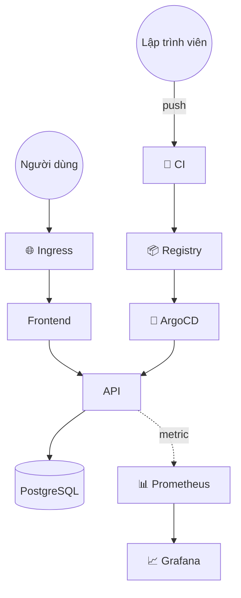
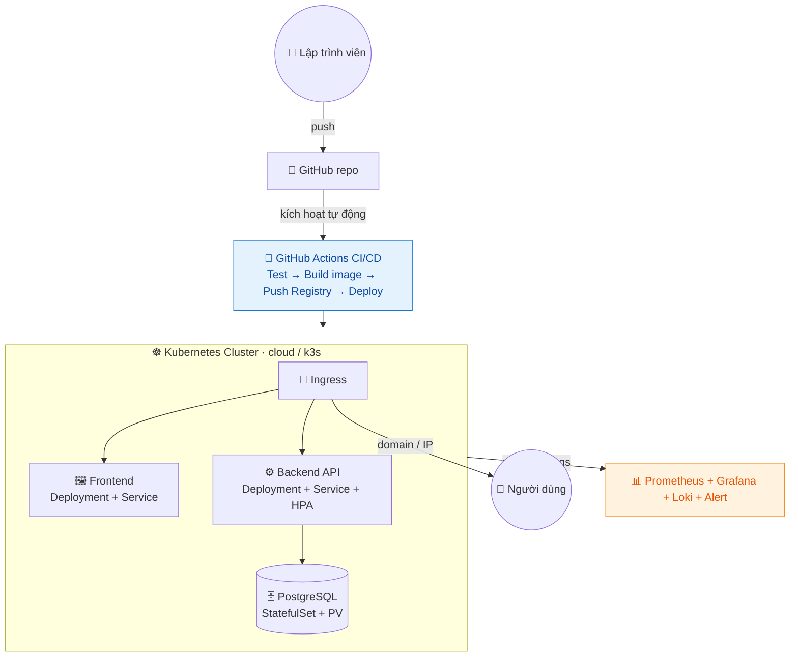

# Giai đoạn 4 — SRE, Chủ đề nâng cao & Dự án Tốt nghiệp

> **Ngày 51–60** · Độ tin cậy, tối ưu, dự án thực chiến và chuẩn bị sự nghiệp.
>
> **Khuôn mỗi ngày (51–55):** 📘 Lý thuyết → 🧪 LAB (file đầy đủ, copy là chạy) → 🧭 Hướng dẫn step by step (lệnh → output mẫu → ✅ checkpoint → ⚠️ lỗi) → 💡 Đi làm mới thấm → 🎯 Đúc kết.
>
> **Khuôn dự án tốt nghiệp (56–59):** 📋 Đề bài → ✅ Yêu cầu → 📐 Tiêu chí chấm điểm → 🗺️ Gợi ý trình tự → 🧪 Tự kiểm chứng → 💬 Gợi ý khi bí. **Không còn hướng dẫn từng bước** — bạn tự quyết cách làm.
>
> **Ngày 60:** LAB FINAL — bài kiểm tra năng lực cuối khoá (tự chấm 100 điểm) + bảng tự đánh giá 48 điểm + kế hoạch 90 ngày.
>
> 🖥️ **Mọi LAB chạy miễn phí trên máy bạn** (Docker + minikube). Không bắt buộc tài khoản cloud.
>
> ✅ Trung lập nền tảng — kiến thức SRE/FinOps/Platform áp dụng cho mọi hệ thống và nhà cung cấp.

---

## Mục lục

| Ngày | Chủ đề |
|------|--------|
| [51](#ngày-51--site-reliability-engineering-sre--nguyên-lý) | Site Reliability Engineering (SRE) — Nguyên lý |
| [52](#ngày-52--high-availability-scaling--disaster-recovery) | High Availability, Scaling & Disaster Recovery |
| [53](#ngày-53--cost-optimization--finops) | Cost Optimization & FinOps |
| [54](#ngày-54--service-mesh--microservices-nâng-cao) | Service Mesh & Microservices nâng cao |
| [55](#ngày-55--platform-engineering--developer-experience) | Platform Engineering & Developer Experience |
| [56](#ngày-56--dự-án-tốt-nghiệp-phần-1-thiết-kế--hạ-tầng) | **Dự án tốt nghiệp — Phần 1: Thiết kế & Hạ tầng** |
| [57](#ngày-57--dự-án-tốt-nghiệp-phần-2-container--cicd) | **Dự án tốt nghiệp — Phần 2: Container & CI/CD** |
| [58](#ngày-58--dự-án-tốt-nghiệp-phần-3-monitoring--reliability) | **Dự án tốt nghiệp — Phần 3: Monitoring & Reliability** |
| [59](#ngày-59--dự-án-tốt-nghiệp-phần-4-tài-liệu-demo--portfolio) | **Dự án tốt nghiệp — Phần 4: Tài liệu, Demo & Portfolio** |
| [60](#ngày-60--tốt-nghiệp--tổng-kết-chứng-chỉ--định-hướng-sự-nghiệp) | **TỐT NGHIỆP — Tổng kết, Chứng chỉ & Định hướng** |
| [📎 Phụ lục](#-phụ-lục-giai-đoạn-4) | Dự án CloudNote · Checklist năng lực · Định hướng nghề |

---

## Ngày 51 — Site Reliability Engineering (SRE) — Nguyên lý

> ⏱️ ~90 phút · Loại: SRE
>
> 🧭 **Bạn đang ở đâu:** Giai đoạn 3 (dựng được hệ thống hiện đại) → **Ngày 51 (đo độ tin cậy bằng con số, và dùng con số đó để ra quyết định)** → Ngày 52 (HA & DR). Chặng cuối nâng bạn từ *"hệ thống chạy được"* lên *"hệ thống tin cậy tới mức đo được, và biết khi nào được phép mạo hiểm"*.
>
> ✅ **Chuẩn bị:** stack giám sát từ Ngày 44–46 (`cd ~/lab44-prometheus && docker compose start`).
>
> 🎁 **Cuối ngày bạn có gì:** SLO thật chạy trên Prometheus, một **ngân sách lỗi** tính bằng con số, cảnh báo theo **tốc độ tiêu ngân sách** — và bạn sẽ **tự gây sự cố để nhìn ngân sách bị đốt trước mắt**.

### 📘 Lý thuyết

#### 1. Câu hỏi mà DevOps không trả lời được

Giai đoạn 3 đã cho bạn công cụ. Nhưng vài câu hỏi rất thực tế vẫn treo đó:

- *"Hệ thống có đủ tin cậy chưa?"* — Dựa vào đâu để nói **đủ**?
- *"Tuần này nên làm tính năng mới hay đi vá hạ tầng?"* — Ai quyết, dựa trên gì?
- *"Có nên đánh thức người trực lúc 3 giờ sáng vì việc này không?"* — Ranh giới ở đâu?

Trả lời bằng cảm tính thì mỗi người một ý, và người nói to nhất thắng. **SRE là cách trả lời ba câu đó bằng con số** — để tranh luận dựa trên dữ liệu chứ không dựa trên cảm giác.

#### 2. Sự thật khó chịu: 100% là mục tiêu sai

Nghe phản trực giác, nhưng đây là nền tảng của SRE:

- Từ 99% lên 99,9%: khó và tốn.
- Từ 99,9% lên 99,99%: **tốn gấp nhiều lần** (cần dự phòng đa vùng, tự động chuyển đổi, đội trực 24/7).
- Lên 100%: **bất khả thi** — và kể cả gần đạt, người dùng cũng không cảm nhận được, vì mạng của họ, điện thoại của họ đã kém tin cậy hơn thế.

Xem thử "chín số chín" quy ra thời gian chết cho phép:

| Mức | Chết mỗi tháng | Chết mỗi năm | Thực tế cần gì |
|---|---|---|---|
| 99% | 7,2 giờ | 3,65 ngày | Một máy chủ chăm sóc tử tế |
| **99,9%** | **43 phút** | **8,76 giờ** | Dự phòng cơ bản, có giám sát — *đích hợp lý cho đa số* |
| 99,99% | 4,3 phút | 52 phút | Nhiều vùng, tự chuyển đổi, trực 24/7 |
| 99,999% | 26 giây | 5,26 phút | Đội lớn, chi phí rất cao |

> 🔑 **Câu hỏi đúng không phải "làm sao đạt 100%?"** mà là *"mức không hoàn hảo nào thì người dùng vẫn hài lòng, và ta trả nổi?"*

#### 3. SLI, SLO, SLA — ba chữ hay bị lẫn

| Chữ | Là gì | Ví dụ |
|---|---|---|
| **SLI** (Indicator) | **Con số đo được** | "99,95% request trả về trong dưới 300ms" |
| **SLO** (Objective) | **Mục tiêu nội bộ** bạn tự đặt cho SLI | "SLI phải ≥ 99,9% trong 30 ngày" |
| **SLA** (Agreement) | **Cam kết với khách hàng**, vi phạm là đền tiền | "Dưới 99,5% thì hoàn 10% phí" |

Quan hệ giữa chúng luôn là: **SLA < SLO < thực tế**. Đặt SLO chặt hơn SLA để khi bắt đầu trượt SLO, bạn còn thời gian xoay xở trước khi phải đền tiền.

#### 4. Ngân sách lỗi — ý tưởng hay nhất của SRE

Nếu SLO là 99,9%, thì **0,1% còn lại là ngân sách bạn được phép tiêu**:

```text
  SLO 99,9% trong 30 ngày
  → ngân sách lỗi = 0,1% × 30 ngày = 43 phút 12 giây chết/tháng
```

Con số này biến cuộc tranh cãi muôn thuở giữa đội phát triển và đội vận hành thành một phép tính:

| Tình trạng ngân sách | Quyết định |
|---|---|
| **Còn nhiều** | Phát hành thoải mái, thử nghiệm, chấp nhận rủi ro |
| **Sắp hết** | Đóng băng tính năng mới, tập trung vào độ ổn định |
| **Đã cạn** | **Dừng phát hành**, chỉ sửa lỗi cho tới khi hồi lại |

> 🔑 **Vì sao đây là ý tưởng hay:** đội phát triển muốn đi nhanh, đội vận hành muốn ổn định — trước đây hai bên cãi nhau bằng quan điểm. Giờ cả hai nhìn **cùng một con số**, và con số đó tự quyết định. Không ai phải thắng ai.

#### 5. Tốc độ đốt ngân sách — cách cảnh báo thông minh

Cảnh báo kiểu cũ: *"tỉ lệ lỗi > 1%"* → bắn liên tục vì mọi dao động nhỏ.

Cảnh báo theo **burn rate** hỏi một câu thông minh hơn: *"với tốc độ này, bao lâu nữa thì cạn sạch ngân sách tháng?"*

```text
  burn rate = (tỉ lệ lỗi hiện tại) / (tỉ lệ lỗi cho phép)
```

| Burn rate | Nghĩa là | Ứng xử |
|---|---|---|
| 1 | Tiêu đúng nhịp, hết đúng cuối tháng | Bình thường |
| 2 | Cạn sau nửa tháng | Để ý |
| **14,4** | **Cạn sau ~2 ngày** | **Gọi người dậy ngay** |

Và mẹo quan trọng: **kiểm tra trên hai khung thời gian cùng lúc** (ví dụ 5 phút *và* 1 giờ). Khung ngắn để phát hiện nhanh, khung dài để loại nhiễu. Cả hai cùng vượt ngưỡng mới báo động — nhờ vậy một cú giật 30 giây không đánh thức ai.

#### 6. Toil — công việc lặp đi lặp lại không sinh giá trị

**Toil** là việc thủ công, lặp lại, làm xong không để lại gì lâu dài: khởi động lại dịch vụ bằng tay mỗi sáng, xoá log đầy ổ, cấp quyền từng người.

Google đặt ra nguyên tắc: **toil không được vượt quá 50% thời gian của SRE**; phần còn lại phải dành cho việc tự động hoá chính những toil đó. Không có ranh giới này, đội vận hành sẽ bị việc vặt nuốt chửng và hệ thống mãi không khá lên.

#### 7. Mổ xẻ sự cố không đổ lỗi

Sau mỗi sự cố, viết **postmortem** trả lời: chuyện gì xảy ra, ảnh hưởng ai, vì sao, và làm gì để không tái diễn — **không nêu tên để quy trách nhiệm**.

Lý do rất thực dụng: nếu người ta sợ bị đổ lỗi, họ sẽ giấu sai sót, và bạn mất luôn cơ hội học. Câu hỏi đúng không phải *"ai làm sai?"* mà là **"hệ thống nào đã cho phép sai sót đó gây hậu quả?"**. Nếu một cú gõ nhầm làm sập production thì vấn đề nằm ở chỗ thiếu rào chắn, không nằm ở ngón tay.

### 🧪 LAB — Đo SLO thật và nhìn ngân sách bị đốt

> Ta thêm **blackbox exporter** vào stack cũ để đo "từ bên ngoài nhìn vào, dịch vụ có sống không" — đúng cách đo SLI khả dụng ngoài đời.

**Những gì thêm vào `lab44-prometheus/`:**

```text
lab44-prometheus/
├── docker-compose.yml          # SỬA — thêm blackbox + app-demo
├── prometheus.yml              # SỬA — thêm job probe + nạp file SLO
├── blackbox.yml                # THÊM
└── slo.rules.yml               # THÊM — recording rules + burn rate alert
```

#### File 1 — thêm 2 service vào `docker-compose.yml`

```yaml
  blackbox:
    image: prom/blackbox-exporter:v0.25.0
    container_name: blackbox
    restart: unless-stopped
    ports:
      - "9115:9115"
    volumes:
      - ./blackbox.yml:/etc/blackbox_exporter/config.yml:ro

  app-demo:
    image: nginx:1.27-alpine
    container_name: app-demo
    restart: unless-stopped
    ports:
      - "8200:80"
    command:
      - /bin/sh
      - -c
      - echo "<h1>Dịch vụ đang phục vụ</h1>" > /usr/share/nginx/html/index.html
        && nginx -g 'daemon off;'
```

#### File 2 — `blackbox.yml`

```yaml
modules:
  http_2xx:
    prober: http
    timeout: 5s
    http:
      valid_http_versions: ["HTTP/1.1", "HTTP/2.0"]
      valid_status_codes: [200]      # chỉ 200 mới tính là thành công
      method: GET
      preferred_ip_protocol: ip4
```

#### File 3 — thêm vào `prometheus.yml`

Thêm `slo.rules.yml` vào mục `rule_files:`:

```yaml
rule_files:
  - /etc/prometheus/alert.rules.yml
  - /etc/prometheus/slo.rules.yml
```

Và thêm job probe vào cuối `scrape_configs:`:

```yaml
  # Đo dịch vụ TỪ BÊN NGOÀI nhìn vào — đây mới là góc nhìn của người dùng
  - job_name: 'do-suc-khoe-dich-vu'
    scrape_interval: 10s
    metrics_path: /probe
    params:
      module: [http_2xx]
    static_configs:
      - targets:
          - http://app-demo:80          # địa chỉ cần đo
    relabel_configs:
      - source_labels: [__address__]
        target_label: __param_target
      - source_labels: [__param_target]
        target_label: instance
      - target_label: __address__
        replacement: blackbox:9115      # gửi yêu cầu đo tới blackbox exporter
```

Nhớ mount thêm file rule trong phần `volumes:` của service `prometheus`:

```yaml
      - ./slo.rules.yml:/etc/prometheus/slo.rules.yml:ro
```

#### File 4 — `slo.rules.yml`

```yaml
groups:
  # ---------- Recording rules: tính sẵn SLI cho nhẹ dashboard ----------
  - name: slo-tinh-san
    interval: 15s
    rules:
      # SLI khả dụng trên các khung thời gian khác nhau
      - record: sli:kha_dung:ratio5m
        expr: avg_over_time(probe_success{job="do-suc-khoe-dich-vu"}[5m])

      - record: sli:kha_dung:ratio30m
        expr: avg_over_time(probe_success{job="do-suc-khoe-dich-vu"}[30m])

      - record: sli:kha_dung:ratio1h
        expr: avg_over_time(probe_success{job="do-suc-khoe-dich-vu"}[1h])

      # Mục tiêu SLO — khai thành metric để dashboard tham chiếu
      - record: slo:muc_tieu
        expr: vector(0.99)                  # SLO = 99%

      # Tốc độ đốt ngân sách = tỉ lệ lỗi hiện tại / tỉ lệ lỗi cho phép
      - record: slo:burn_rate5m
        expr: (1 - sli:kha_dung:ratio5m) / (1 - 0.99)

      - record: slo:burn_rate1h
        expr: (1 - sli:kha_dung:ratio1h) / (1 - 0.99)

      # Phần trăm ngân sách lỗi CÒN LẠI (tính trên khung 1 giờ cho lab)
      - record: slo:ngan_sach_con_lai_phan_tram
        expr: clamp_min((1 - (1 - sli:kha_dung:ratio1h) / (1 - 0.99)) * 100, 0)

  # ---------- Cảnh báo theo tốc độ đốt, kiểm tra 2 khung ----------
  - name: slo-canh-bao
    rules:
      # Đốt rất nhanh: cạn ngân sách trong khoảng 2 ngày -> gọi người dậy
      - alert: DotNganSachRatNhanh
        expr: slo:burn_rate5m > 14.4 and slo:burn_rate1h > 14.4
        for: 2m
        labels:
          severity: critical
          muc_do: goi-nguoi-day
        annotations:
          tom_tat: "Đốt ngân sách lỗi cực nhanh"
          chi_tiet: "Tốc độ gấp {{ $value | printf \"%.1f\" }} lần cho phép — cạn ngân sách trong ~2 ngày."

      # Đốt nhanh vừa: ghi vé, xử lý trong giờ hành chính
      - alert: DotNganSachNhanh
        expr: slo:burn_rate1h > 6 and slo:burn_rate1h < 14.4
        for: 15m
        labels:
          severity: warning
          muc_do: ghi-ve
        annotations:
          tom_tat: "Đốt ngân sách nhanh hơn bình thường"
          chi_tiet: "Xem xét trong giờ làm việc, chưa cần đánh thức ai."
```

> 📌 **Lưu ý về khung thời gian:** SLO thật dùng khung **30 ngày**. Lab dùng khung **1 giờ** để bạn thấy kết quả ngay trong buổi học. Công thức hoàn toàn giống nhau — chỉ đổi con số trong ngoặc vuông.

### 🧭 Hướng dẫn làm LAB — step by step

#### Bước 1 — Thêm 2 service và khởi động

```bash
cd ~/lab44-prometheus
# tạo blackbox.yml, slo.rules.yml
# sửa docker-compose.yml (thêm blackbox + app-demo)
# sửa prometheus.yml (thêm rule_files + job probe + mount slo.rules.yml)
docker compose up -d
docker compose ps | grep -E "blackbox|app-demo"
```

**Bạn sẽ thấy:**
```text
app-demo    Up 8 seconds   0.0.0.0:8200->80/tcp
blackbox    Up 8 seconds   0.0.0.0:9115->9115/tcp
```

✅ **Checkpoint:** cả hai container `Up`.

Kiểm tra phép đo hoạt động:
```bash
curl -s "localhost:9115/probe?target=http://app-demo:80&module=http_2xx" | grep -E "^probe_success|^probe_duration"
```

**Bạn sẽ thấy:**
```text
probe_success 1
probe_duration_seconds 0.002
```

✅ **Checkpoint:** `probe_success 1` — dịch vụ đang khoẻ theo góc nhìn bên ngoài.

💡 **Vì sao đo từ bên ngoài mới đúng:** `up` của Ngày 44 chỉ nói *"Prometheus scrape được target"*. Còn `probe_success` nói *"một client bên ngoài gọi vào và nhận được 200"* — đúng trải nghiệm của người dùng thật. **SLI phải đo thứ người dùng cảm nhận**, không phải thứ tiện đo.

#### Bước 2 — Xác nhận các recording rule đã được nạp

```bash
docker compose exec prometheus promtool check rules /etc/prometheus/slo.rules.yml
curl -s localhost:9090/api/v1/rules | grep -o '"name":"[^"]*"' | sort -u | head
```

**Bạn sẽ thấy:**
```text
SUCCESS: 8 rules found

"name":"DotNganSachNhanh"
"name":"DotNganSachRatNhanh"
"name":"sli:kha_dung:ratio1h"
"name":"sli:kha_dung:ratio5m"
...
```

✅ **Checkpoint:** đủ 8 luật, không lỗi cú pháp.

⚠️ **Nếu báo `no rule files found`:** thiếu mount hoặc quên thêm vào `rule_files`. Kiểm tra: `docker compose exec prometheus ls /etc/prometheus/`.

#### Bước 3 — Đọc SLI đầu tiên

Chờ khoảng 2 phút để có đủ dữ liệu, rồi vào **http://localhost:9090** và chạy:

```promql
sli:kha_dung:ratio5m
```

**Bạn sẽ thấy:**
```text
sli:kha_dung:ratio5m{instance="http://app-demo:80", job="do-suc-khoe-dich-vu"}   1
```

`1` nghĩa là **100% phép đo thành công** — hoàn hảo, vì chưa có gì hỏng.

Xem tốc độ đốt và ngân sách còn lại:
```promql
slo:burn_rate5m
slo:ngan_sach_con_lai_phan_tram
```

**Bạn sẽ thấy:** `0` và `100`.

✅ **Checkpoint:** burn rate bằng 0, ngân sách còn 100%.

💡 Đọc lại cho quen: burn rate `0` nghĩa là **đang không tiêu đồng nào** trong ngân sách lỗi. Còn nguyên 100% để dành cho lúc thật sự cần.

#### Bước 4 — Tự tính ngân sách lỗi bằng tay

Trước khi để máy tính, hãy tự tính một lần — nó giúp con số trở nên có nghĩa:

| SLO | Ngân sách lỗi | Chết cho phép mỗi tháng (30 ngày) |
|---|---|---|
| 99% | 1% | 30 × 24 × 60 × 0,01 = **432 phút** ≈ 7,2 giờ |
| 99,9% | 0,1% | 30 × 24 × 60 × 0,001 = **43,2 phút** |
| 99,95% | 0,05% | **21,6 phút** |

```bash
python3 -c "
for slo in [99, 99.9, 99.95, 99.99]:
    phut = 30*24*60 * (1 - slo/100)
    print(f'SLO {slo}%  ->  chết cho phép {phut:7.1f} phút/tháng')
"
```

**Bạn sẽ thấy:**
```text
SLO 99%    ->  chết cho phép   432.0 phút/tháng
SLO 99.9%  ->  chết cho phép    43.2 phút/tháng
SLO 99.95% ->  chết cho phép    21.6 phút/tháng
SLO 99.99% ->  chết cho phép     4.3 phút/tháng
```

✅ **Checkpoint:** hiểu rằng thêm một chữ số 9 nghĩa là **giảm 10 lần** thời gian chết cho phép.

💡 Nhìn con số này là hiểu vì sao "cứ đặt 99,99% cho chắc" là quyết định tốn kém: chỉ còn **4 phút** mỗi tháng — không đủ cho một lần khởi động lại thủ công, nghĩa là mọi thứ buộc phải tự động và có dự phòng.

#### Bước 5 — Gây sự cố và nhìn ngân sách bị đốt

Đây là phần đáng giá nhất hôm nay.

```bash
docker compose stop app-demo
```

Mở tab **Graph** của Prometheus, theo dõi 3 truy vấn (chờ 1–2 phút cho số liệu ngấm):

```promql
sli:kha_dung:ratio5m
slo:burn_rate5m
slo:ngan_sach_con_lai_phan_tram
```

**Bạn sẽ thấy diễn biến:**

| Sau khoảng | SLI 5m | Burn rate | Ngân sách còn |
|---|---|---|---|
| 30 giây | 0,90 | 10 | 90% |
| 1 phút | 0,80 | 20 | 80% |
| 2 phút | 0,60 | 40 | 60% |
| 5 phút | **0,00** | **100** | **0%** |

✅ **Checkpoint:** thấy ngân sách tụt dần **theo thời gian chết**, không phải tụt một nhát.

Xem cảnh báo:
```bash
curl -s localhost:9090/api/v1/alerts | grep -o '"alertname":"[^"]*","[^"]*"\|"state":"[^"]*"' | head
```

Hoặc mở tab **Alerts** trên giao diện: `DotNganSachRatNhanh` chuyển **PENDING** rồi **FIRING** sau 2 phút.

💡 **Đây là điều SLO làm được mà cảnh báo thường không làm được:** thay vì báo "dịch vụ chết" (bạn đã biết rồi), nó trả lời câu hỏi có ích hơn nhiều — *"chuyện này nghiêm trọng đến mức nào so với mức chịu đựng cả tháng?"*. Chết 30 giây thì không sao; chết 30 phút là đã tiêu hơn nửa ngân sách tháng của SLO 99,9%.

Hồi phục:
```bash
docker compose start app-demo
```

Chờ vài phút và xem SLI leo lên lại — đây chính là ý nghĩa "cửa sổ trượt": lỗi cũ dần rơi ra khỏi khung tính.

#### Bước 6 — Thêm panel ngân sách lỗi vào Grafana

Thêm vào mảng `panels` trong `grafana/provisioning/dashboards/he-thong.json` (nhớ thêm dấu phẩy sau panel trước đó):

```json
    {
      "type": "gauge",
      "title": "Ngân sách lỗi còn lại (%)",
      "gridPos": { "h": 8, "w": 6, "x": 0, "y": 16 },
      "targets": [{ "expr": "slo:ngan_sach_con_lai_phan_tram", "refId": "A" }],
      "fieldConfig": {
        "defaults": {
          "unit": "percent",
          "min": 0,
          "max": 100,
          "thresholds": {
            "mode": "absolute",
            "steps": [
              { "color": "red", "value": null },
              { "color": "orange", "value": 25 },
              { "color": "green", "value": 50 }
            ]
          }
        }
      }
    },
    {
      "type": "timeseries",
      "title": "Tốc độ đốt ngân sách (1 = đúng nhịp)",
      "gridPos": { "h": 8, "w": 18, "x": 6, "y": 16 },
      "targets": [
        { "expr": "slo:burn_rate5m", "legendFormat": "5 phút", "refId": "A" },
        { "expr": "slo:burn_rate1h", "legendFormat": "1 giờ", "refId": "B" }
      ],
      "fieldConfig": { "defaults": { "min": 0 } }
    }
```

Chờ 30 giây (provider tự quét lại) rồi mở dashboard.

✅ **Checkpoint:** hai panel mới hiện ra, kim đồng hồ xanh khi hệ thống khoẻ.

💡 **Đây là màn hình mà một đội SRE thật sự nhìn hằng ngày.** Không phải "CPU bao nhiêu phần trăm", mà là *"ta còn bao nhiêu quyền được phép sai trong tháng này?"* — con số đó quyết định tuần này đội được phép phát hành hay phải đi vá.

#### Bước 7 — Tập viết postmortem

Sự cố ở Bước 5 là do bạn tạo ra. Hãy viết lại nó theo đúng khuôn dùng ở công ty:

```bash
mkdir -p ~/lab51-sre && cat > ~/lab51-sre/postmortem-01.md <<'EOF'
# Postmortem: app-demo ngừng phục vụ

## Tóm tắt
Dịch vụ app-demo không phản hồi trong 5 phút, tiêu hết 100% ngân sách lỗi
của khung 1 giờ (SLO 99%).

## Ảnh hưởng
- Thời gian: 5 phút
- Người dùng bị ảnh hưởng: 100% lượt truy cập trong khoảng đó
- Ngân sách lỗi tiêu tốn: toàn bộ khung 1 giờ

## Dòng thời gian
- 10:00 — container app-demo bị dừng (thao tác chủ động trong lab)
- 10:00:30 — probe_success chuyển 0, SLI bắt đầu tụt
- 10:02 — cảnh báo DotNganSachRatNhanh chuyển FIRING
- 10:05 — khởi động lại dịch vụ
- 10:10 — SLI hồi phục

## Nguyên nhân gốc
Dịch vụ chỉ có MỘT bản duy nhất, không có dự phòng. Một container dừng là
toàn bộ dịch vụ ngừng.

## Vì sao phát hiện được
Cảnh báo theo tốc độ đốt ngân sách, kiểm tra trên 2 khung thời gian.

## Hành động khắc phục (kèm người chịu trách nhiệm và hạn)
1. Chạy tối thiểu 2 bản sao có cân bằng tải — (Ngày 52)
2. Thêm probe cho cả đường dẫn /health, không chỉ trang chủ
3. Viết runbook: các bước xử lý khi dịch vụ không phản hồi

## Điều làm tốt
- Phát hiện tự động trong 2 phút, không cần ai báo
- Ngân sách lỗi cho biết ngay mức nghiêm trọng

## KHÔNG ghi trong tài liệu này
Tên người gây ra sự cố. Câu hỏi là "hệ thống nào đã cho phép một thao tác
đơn lẻ gây gián đoạn toàn bộ?", không phải "ai đã gõ lệnh đó?".
EOF

cat ~/lab51-sre/postmortem-01.md | head -12
```

✅ **Checkpoint:** có một postmortem hoàn chỉnh, không nêu tên ai.

💡 Để ý mục cuối. Trong lab này bạn **biết chính xác** ai gây ra sự cố — là bạn. Nhưng tài liệu vẫn không ghi điều đó, vì thông tin hữu ích nằm ở chỗ khác: **hệ thống chỉ có một bản sao duy nhất**. Đó mới là thứ cần sửa.

#### Bước 8 — Dọn dẹp

```bash
cd ~/lab44-prometheus
docker compose stop
```

💡 Giữ nguyên stack — Ngày 52 sẽ dùng lại để kiểm chứng hiệu quả của việc chạy nhiều bản sao.

### 💡 Đi làm mới thấm (sách cơ bản hay bỏ quên)

- **SLI phải đo thứ người dùng cảm nhận được.** "CPU dưới 80%" không phải SLI — người dùng không quan tâm CPU. "Tỉ lệ request thành công", "p95 độ trễ", "tỉ lệ đặt hàng hoàn tất" mới là thứ họ cảm nhận. Đo sai chỉ số thì SLO đẹp mà khách vẫn bỏ đi.
- **Đặt SLO dựa trên dữ liệu quá khứ, đừng bốc số.** Cách làm đúng: đo thực tế 30 ngày, thấy đang đạt 99,7%, thì đặt SLO 99,5% (hơi thấp hơn hiện trạng). Đặt 99,99% khi hệ thống mới đạt 99% chỉ tạo ra một mục tiêu ai cũng biết là không thể và rồi ai cũng bơ đi.
- **Ngân sách lỗi chỉ có giá trị nếu nó thật sự chặn được phát hành.** Nhiều nơi dựng dashboard SLO rất đẹp rồi vẫn phát hành bất chấp khi ngân sách cạn. Khi đó nó chỉ là đồ trang trí. Sức mạnh của ý tưởng này nằm ở chỗ **cả tổ chức đồng ý tuân theo con số**.
- **Cảnh báo phải gắn với SLO, không gắn với triệu chứng.** Cảnh báo "CPU 90%" đánh thức người ta dù người dùng không hề bị ảnh hưởng. Cảnh báo theo tốc độ đốt ngân sách chỉ đánh thức khi **người dùng thật sự đang chịu thiệt**. Đây là cách giảm mạnh số lần bị gọi dậy vô ích.
- **Không phải mọi dịch vụ đều cần cùng một SLO.** Trang thanh toán và trang "Giới thiệu" không thể chung một mức. Đặt SLO cao cho luồng sinh ra tiền, thấp hơn cho phần phụ — nguồn lực là hữu hạn, hãy tiêu vào chỗ đáng.
- **Postmortem không đổ lỗi không có nghĩa là không có trách nhiệm.** Nó vẫn có người chịu trách nhiệm cho từng hành động khắc phục và có hạn chót. Điều nó bỏ đi chỉ là việc **quy lỗi cho cá nhân** — thứ chỉ khiến người ta giấu sai sót.

### 🎯 Đúc kết Ngày 51

**3 điều phải mang theo:**

1. **100% là mục tiêu sai.** Câu hỏi đúng là "mức không hoàn hảo nào người dùng vẫn hài lòng và ta trả nổi?" — rồi biến câu trả lời thành SLO.
2. **Ngân sách lỗi biến tranh cãi thành phép tính.** Còn ngân sách thì cứ phát hành; cạn rồi thì dừng lại mà vá. Không ai phải thắng ai.
3. **Cảnh báo theo tốc độ đốt, kiểm tra trên hai khung thời gian.** Phát hiện nhanh mà không bị đánh thức vì những cú giật vô hại.

> 🧠 **Một câu để nhớ:** SRE không hỏi *"hệ thống có chết không?"* — nó hỏi **"ta còn được phép chết bao nhiêu phút nữa trong tháng này?"**.

**✅ Tự chấm** *(đánh dấu khi làm được mà không nhìn tài liệu):*

- [ ] Phân biệt SLI, SLO, SLA và nói rõ vì sao SLA phải lỏng hơn SLO
- [ ] Tính được ngân sách lỗi theo phút từ một mức SLO bất kỳ
- [ ] Giải thích vì sao 100% là mục tiêu sai
- [ ] Viết recording rule tính SLI và burn rate trong Prometheus
- [ ] Giải thích vì sao cảnh báo burn rate dùng hai khung thời gian
- [ ] Gây sự cố và đọc được ngân sách bị tiêu bao nhiêu
- [ ] Nói được toil là gì và vì sao giới hạn ở 50%
- [ ] Viết postmortem không đổ lỗi và giải thích vì sao phải như vậy

✅ **Kết quả đạt được:** Một SLO chạy thật với ngân sách lỗi đo được và cảnh báo theo tốc độ đốt — bạn đã có ngôn ngữ con số để trả lời câu hỏi "hệ thống đã đủ tin cậy chưa?".

---

## Ngày 52 — High Availability, Scaling & Disaster Recovery

> ⏱️ ~90 phút · Loại: SRE
>
> 🧭 **Bạn đang ở đâu:** Ngày 51 (đo độ tin cậy bằng SLO) → **Ngày 52 (thiết kế để không mất độ tin cậy, và cứu được khi mất thật)** → Ngày 53 (chi phí). Hôm qua postmortem của bạn chỉ ra nguyên nhân gốc: *"dịch vụ chỉ có một bản duy nhất"*. Hôm nay sửa đúng chỗ đó.
>
> ✅ **Chuẩn bị:** stack Ngày 44–51 (`cd ~/lab44-prometheus && docker compose start`), có Docker Compose.
>
> 🎁 **Cuối ngày bạn có gì:** một dịch vụ **sống sót khi bạn giết từng bản một** (đo được bằng chính SLI hôm qua), cộng một quy trình sao lưu–khôi phục database mà bạn **đã tự bấm giờ**.

### 📘 Lý thuyết

#### 1. Ba khái niệm hay bị gộp làm một

| | Câu hỏi nó trả lời | Ví dụ |
|---|---|---|
| **HA** (High Availability) | *"Một thành phần chết thì dịch vụ có tiếp tục không?"* | 3 bản sao, chết 1 vẫn còn 2 |
| **Scaling** | *"Đông khách hơn thì có phục vụ nổi không?"* | Tự thêm bản sao khi tải cao (Ngày 41) |
| **DR** (Disaster Recovery) | *"Mất sạch thì bao lâu dựng lại được, và mất bao nhiêu dữ liệu?"* | Khôi phục từ bản sao lưu |

Ba thứ khác nhau và **không thay thế nhau**. Có HA không có nghĩa là có DR: bạn chạy 5 bản sao cùng một cụm, ai đó gõ nhầm lệnh xoá cả cụm, hoặc dữ liệu bị hỏng — cả 5 bản sao cùng chết. HA chống **hỏng hóc**, DR chống **thảm hoạ**.

#### 2. Điểm chết đơn lẻ — thứ phải đi tìm có chủ đích

**Single Point of Failure (SPOF)** là bất kỳ thành phần nào mà nó chết là cả hệ thống chết.

Cách tìm rất đơn giản: với từng thành phần, hỏi *"cái này chết thì sao?"*

| Thành phần | Chết thì sao | Có phải SPOF? |
|---|---|---|
| 1 trong 3 app | Còn 2 cái phục vụ | Không |
| Bộ cân bằng tải duy nhất | **Không ai vào được** | **Có** |
| Database chính duy nhất | **Không đọc ghi được gì** | **Có** |
| Một trong nhiều node | Pod dời sang node khác | Không |

> 🔑 Loại bỏ SPOF **luôn tốn tiền** (phải nhân đôi thứ gì đó). Vì vậy quyết định đúng không phải "diệt sạch SPOF", mà là **"SPOF nào đáng tiền để loại bỏ?"** — và câu trả lời đến từ SLO của Ngày 51.

#### 3. RTO và RPO — hai con số của kế hoạch thảm hoạ

```text
       ← RPO →            THẢM HOẠ            ← RTO →
   ────────┬──────────────────┼──────────────────┬────────
      sao lưu cuối        hệ thống chết      chạy lại được
      
   RPO = mất tối đa bao nhiêu DỮ LIỆU (tính bằng thời gian)
   RTO = mất tối đa bao nhiêu THỜI GIAN để khôi phục
```

| | Nghĩa | Muốn nhỏ hơn thì phải |
|---|---|---|
| **RPO** | Chấp nhận mất dữ liệu bao nhiêu lâu | Sao lưu dày hơn, hoặc nhân bản liên tục |
| **RTO** | Chấp nhận chết bao lâu | Tự động hoá khôi phục, dựng sẵn hệ thống chờ |

Ví dụ thực tế: *"RPO 1 giờ, RTO 4 giờ"* nghĩa là chấp nhận mất tối đa 1 giờ dữ liệu và hệ thống chết tối đa 4 giờ. Hai con số này **quyết định toàn bộ thiết kế và chi phí** — RPO bằng 0 đòi hỏi nhân bản đồng bộ, đắt hơn sao lưu theo giờ rất nhiều lần.

#### 4. Bốn chiến lược DR, đắt dần

| Chiến lược | Cách làm | RTO điển hình | Chi phí |
|---|---|---|---|
| **Backup & Restore** | Chỉ có bản sao lưu, có sự cố mới dựng lại | Nhiều giờ đến vài ngày | Thấp nhất |
| **Pilot Light** | Giữ sẵn phần lõi (database nhân bản), phần còn lại dựng khi cần | Vài chục phút | Thấp |
| **Warm Standby** | Bản thu nhỏ chạy sẵn, có sự cố thì phóng to | Vài phút | Trung bình |
| **Multi-Site Active** | Nhiều vùng cùng phục vụ | Gần như tức thì | Cao nhất |

#### 5. Quy tắc 3-2-1 cho sao lưu

> **3** bản sao dữ liệu · **2** loại phương tiện khác nhau · **1** bản ở nơi khác về mặt địa lý

Và điều quan trọng nhất về sao lưu:

> ⚠️ **Bản sao lưu chưa từng được khôi phục thử thì không phải bản sao lưu — nó chỉ là một file bạn hy vọng là dùng được.**

Vô số tổ chức đã phát hiện ra điều này theo cách đau đớn nhất: sao lưu chạy đều hàng đêm suốt hai năm, đến lúc cần thì file rỗng, hoặc thiếu bảng, hoặc không có mật khẩu giải mã. **Phải diễn tập khôi phục định kỳ.**

#### 6. Mở rộng theo chiều dọc và chiều ngang

| | **Dọc** (scale up) | **Ngang** (scale out) |
|---|---|---|
| Cách làm | Máy to hơn (nhiều CPU/RAM hơn) | Thêm nhiều máy |
| Giới hạn | Có trần vật lý, và phải khởi động lại | Gần như không trần |
| Giúp HA không | **Không** — vẫn là một máy, vẫn là SPOF | **Có** |
| Hợp với | Database truyền thống | App không trạng thái |

> 🔑 Đây là lý do nguyên tắc **stateless** (không giữ trạng thái trong bộ nhớ ứng dụng) quan trọng đến vậy: app không trạng thái thì nhân bản thoải mái; app giữ phiên đăng nhập trong RAM thì thêm bản sao là người dùng bị đăng xuất ngẫu nhiên.

### 🧪 LAB — Từ một bản duy nhất tới cụm chịu lỗi

**Thư mục mới:**

```text
lab52-ha/
├── docker-compose.yml       # 3 app + 1 load balancer + postgres
├── nginx-lb.conf            # cấu hình cân bằng tải + kiểm tra sức khoẻ
└── sao-luu/                 # nơi chứa bản sao lưu database
```

#### File 1 — `nginx-lb.conf`

```nginx
upstream cum_ung_dung {
    least_conn;                                    # gửi tới bản đang rảnh nhất

    # max_fails: trượt 2 lần thì tạm loại khỏi cụm
    # fail_timeout: loại trong 10 giây rồi thử lại
    server app1:80 max_fails=2 fail_timeout=10s;
    server app2:80 max_fails=2 fail_timeout=10s;
    server app3:80 max_fails=2 fail_timeout=10s;
}

server {
    listen 80;

    location / {
        proxy_pass http://cum_ung_dung;
        proxy_set_header Host $host;
        proxy_set_header X-Real-IP $remote_addr;

        # Bản này chết -> TỰ ĐỘNG thử bản tiếp theo, người dùng không thấy lỗi
        proxy_next_upstream error timeout http_502 http_503 http_504;
        proxy_connect_timeout 2s;
        proxy_read_timeout 5s;
    }

    # Điểm để giám sát đo sức khoẻ của chính bộ cân bằng tải
    location /health {
        access_log off;
        return 200 "load balancer ok\n";
    }
}
```

#### File 2 — `docker-compose.yml`

```yaml
services:
  # ---- Ba bản sao của ứng dụng ----
  app1:
    image: nginx:1.27-alpine
    container_name: ha-app1
    restart: unless-stopped
    command: ["/bin/sh","-c","echo '<h1>Phục vụ bởi app1</h1>' > /usr/share/nginx/html/index.html && nginx -g 'daemon off;'"]

  app2:
    image: nginx:1.27-alpine
    container_name: ha-app2
    restart: unless-stopped
    command: ["/bin/sh","-c","echo '<h1>Phục vụ bởi app2</h1>' > /usr/share/nginx/html/index.html && nginx -g 'daemon off;'"]

  app3:
    image: nginx:1.27-alpine
    container_name: ha-app3
    restart: unless-stopped
    command: ["/bin/sh","-c","echo '<h1>Phục vụ bởi app3</h1>' > /usr/share/nginx/html/index.html && nginx -g 'daemon off;'"]

  # ---- Bộ cân bằng tải (LƯU Ý: đây vẫn là một SPOF) ----
  lb:
    image: nginx:1.27-alpine
    container_name: ha-lb
    restart: unless-stopped
    ports:
      - "8300:80"
    volumes:
      - ./nginx-lb.conf:/etc/nginx/conf.d/default.conf:ro
    depends_on:
      - app1
      - app2
      - app3

  # ---- Database để thực hành sao lưu & khôi phục ----
  db:
    image: postgres:16-alpine
    container_name: ha-db
    restart: unless-stopped
    environment:
      POSTGRES_PASSWORD: matkhau123
      POSTGRES_DB: cuahang
    ports:
      - "5433:5432"
    volumes:
      - db-data:/var/lib/postgresql/data
      - ./sao-luu:/sao-luu            # thư mục chung để xuất/nhập bản sao lưu
    healthcheck:
      test: ["CMD-SHELL", "pg_isready -U postgres"]
      interval: 10s
      timeout: 3s
      retries: 3

volumes:
  db-data:
```

### 🧭 Hướng dẫn làm LAB — step by step

#### Bước 1 — Dựng cụm và xác nhận cân bằng tải

```bash
mkdir -p ~/lab52-ha/sao-luu && cd ~/lab52-ha
# tạo nginx-lb.conf và docker-compose.yml theo phần LAB
docker compose up -d
sleep 5

for i in 1 2 3 4 5 6; do curl -s localhost:8300 | grep -o "app[0-9]"; done
```

**Bạn sẽ thấy:**
```text
app1
app2
app3
app1
app2
app3
```

✅ **Checkpoint:** yêu cầu được chia đều cho cả 3 bản.

#### Bước 2 — Giết từng bản và đo xem người dùng có bị ảnh hưởng không

Đây là phép thử HA thật sự. Mở **hai terminal**.

**Terminal 1** — mô phỏng người dùng liên tục truy cập, đếm thành công/thất bại:

```bash
cd ~/lab52-ha
thanh_cong=0; that_bai=0
for i in $(seq 1 120); do
  if curl -fs --max-time 2 localhost:8300 > /dev/null 2>&1; then
    thanh_cong=$((thanh_cong+1)); printf "."
  else
    that_bai=$((that_bai+1)); printf "X"
  fi
  sleep 0.5
done
echo ""
echo "Thành công: $thanh_cong | Thất bại: $that_bai"
echo "Tỉ lệ khả dụng: $(python3 -c "print(f'{$thanh_cong/($thanh_cong+$that_bai)*100:.2f}%')")"
```

**Terminal 2** — trong lúc đó, lần lượt giết các bản:

```bash
sleep 10 && docker stop ha-app1
sleep 15 && docker stop ha-app2
sleep 15 && docker start ha-app1 ha-app2
```

**Bạn sẽ thấy ở Terminal 1:**
```text
....................X...........................X...................................
Thành công: 118 | Thất bại: 2
Tỉ lệ khả dụng: 98.33%
```

✅ **Checkpoint:** giết 2 trong 3 bản mà **hầu như không mất yêu cầu nào** — chỉ vài cái trượt đúng khoảnh khắc chuyển tiếp.

💡 **Hãy so với hôm qua:** Ngày 51 bạn dừng dịch vụ một bản và khả dụng rơi thẳng về **0%**. Hôm nay giết 2 trong 3 bản mà vẫn giữ trên 98%. Đó chính là chênh lệch giữa *có HA* và *không có HA* — và nó đo được bằng con số, không phải bằng cảm giác.

💡 Vài yêu cầu bị trượt là do nginx cần một nhịp để nhận ra bản đó đã chết (`max_fails=2`). Muốn con số này nhỏ hơn thì kiểm tra sức khoẻ chủ động và dày hơn — nhưng đổi lại tốn tài nguyên hơn. Mọi thứ đều có giá.

#### Bước 3 — Tìm SPOF còn sót lại

Cụm app đã chịu lỗi. Nhưng còn gì chưa?

```bash
docker stop ha-lb
curl -fs --max-time 3 localhost:8300 || echo "❌ KHÔNG VÀO ĐƯỢC — dù cả 3 app vẫn sống"
docker ps --filter "name=ha-app" --format "{{.Names}}: {{.Status}}"
```

**Bạn sẽ thấy:**
```text
❌ KHÔNG VÀO ĐƯỢC — dù cả 3 app vẫn sống
ha-app1: Up 2 minutes
ha-app2: Up 2 minutes
ha-app3: Up 5 minutes
```

✅ **Checkpoint:** nhận ra **bộ cân bằng tải chính là SPOF còn lại**.

```bash
docker start ha-lb
```

💡 **Bài học rất quan trọng:** làm HA cho tầng ứng dụng mà quên tầng đứng trước nó thì chỉ là **dời điểm chết đi một bước**. Ngoài đời, người ta giải bằng: hai bộ cân bằng tải chia sẻ một IP trôi nổi (keepalived), hoặc dùng bộ cân bằng tải của nhà cung cấp cloud (họ tự lo HA bên trong), hoặc DNS trỏ nhiều bản ghi.

Hãy tập thói quen đi tìm SPOF: với **mỗi** thành phần trong sơ đồ, hỏi *"cái này chết thì sao?"*. Danh sách của lab hôm nay: ✅ app (đã xử lý) · ❌ load balancer · ❌ database · ❌ toàn bộ máy chủ này.

#### Bước 4 — Tạo dữ liệu và sao lưu

```bash
docker exec ha-db psql -U postgres -d cuahang -c "
CREATE TABLE don_hang (
  id serial PRIMARY KEY,
  khach text NOT NULL,
  so_tien numeric NOT NULL,
  tao_luc timestamptz DEFAULT now()
);
INSERT INTO don_hang (khach, so_tien) VALUES
  ('Chị An', 250000), ('Anh Bình', 480000), ('Chị Cúc', 120000);
"
docker exec ha-db psql -U postgres -d cuahang -c "SELECT count(*) FROM don_hang;"
```

**Bạn sẽ thấy:**
```text
 count
-------
     3
```

Sao lưu:

```bash
docker exec ha-db pg_dump -U postgres -d cuahang -F c -f /sao-luu/cuahang-$(date +%Y%m%d-%H%M).dump
ls -lh sao-luu/
```

**Bạn sẽ thấy:**
```text
-rw-r--r-- 1 ... 4.2K ... cuahang-20260923-1430.dump
```

✅ **Checkpoint:** có file `.dump` trong thư mục `sao-luu/`.

💡 `-F c` là định dạng nén riêng của PostgreSQL — nhỏ hơn và cho phép **khôi phục chọn lọc** từng bảng, không phải khôi phục tất cả hoặc không gì cả.

#### Bước 5 — Thảm hoạ, và bấm giờ khôi phục

Đây là bài tập quan trọng nhất. **Bấm giờ thật** — vì đó chính là RTO của bạn.

```bash
# Ghi thời điểm bắt đầu
BAT_DAU=$(date +%s)

# THẢM HOẠ: xoá sạch dữ liệu
docker exec ha-db psql -U postgres -d cuahang -c "DROP TABLE don_hang;"
docker exec ha-db psql -U postgres -d cuahang -c "SELECT count(*) FROM don_hang;" 2>&1 | tail -2
```

**Bạn sẽ thấy:**
```text
ERROR:  relation "don_hang" does not exist
```

Khôi phục:

```bash
BAN_SAO=$(ls -t sao-luu/*.dump | head -1)
echo "Khôi phục từ: $BAN_SAO"

docker exec ha-db pg_restore -U postgres -d cuahang --clean --if-exists \
  "/sao-luu/$(basename $BAN_SAO)"

docker exec ha-db psql -U postgres -d cuahang -c "SELECT * FROM don_hang;"

KET_THUC=$(date +%s)
echo ""
echo "⏱️  RTO thực đo: $((KET_THUC - BAT_DAU)) giây"
```

**Bạn sẽ thấy:**
```text
 id |  khach   | so_tien
----+----------+---------
  1 | Chị An   |  250000
  2 | Anh Bình |  480000
  3 | Chị Cúc  |  120000

⏱️  RTO thực đo: 23 giây
```

✅ **Checkpoint:** dữ liệu trở lại đầy đủ, và bạn có **một con số RTO thật** — không phải ước đoán.

💡 **Đây là điều mà đọc sách không cho bạn được.** Bây giờ nếu ai hỏi *"mất bao lâu để khôi phục?"*, bạn trả lời được bằng con số đã tự đo. Với database 500 GB thì con số đó sẽ là hàng giờ — và chính vì vậy **phải đo trước khi cần**, không phải lúc đang cháy.

#### Bước 6 — Đo RPO: bạn mất bao nhiêu dữ liệu?

```bash
# Thêm đơn hàng SAU khi đã sao lưu
docker exec ha-db psql -U postgres -d cuahang -c "
INSERT INTO don_hang (khach, so_tien) VALUES ('Anh Dũng', 990000);"
docker exec ha-db psql -U postgres -d cuahang -c "SELECT count(*) FROM don_hang;"   # 4

# Thảm hoạ lần hai
docker exec ha-db psql -U postgres -d cuahang -c "DROP TABLE don_hang;"

# Khôi phục từ bản sao lưu CŨ
docker exec ha-db pg_restore -U postgres -d cuahang --clean --if-exists \
  "/sao-luu/$(basename $BAN_SAO)"
docker exec ha-db psql -U postgres -d cuahang -c "SELECT count(*) FROM don_hang;"
```

**Bạn sẽ thấy:**
```text
 count
-------
     3        ← MẤT đơn hàng của Anh Dũng
```

✅ **Checkpoint:** thấy tận mắt ý nghĩa của RPO — **mọi thứ xảy ra sau lần sao lưu cuối đều mất**.

💡 **Quy đổi ra thực tế:** sao lưu mỗi 24 giờ nghĩa là RPO = 24 giờ, tức có thể mất **một ngày đơn hàng**. Muốn RPO còn 5 phút thì cần nhân bản liên tục (WAL streaming) hoặc bản sao chờ sẵn — đắt hơn nhiều. Đây chính là lúc bạn phải hỏi doanh nghiệp: *"mất một ngày dữ liệu thì thiệt hại bao nhiêu?"*, rồi so với chi phí hạ RPO. **Đó là một quyết định kinh doanh, không phải quyết định kỹ thuật.**

#### Bước 7 — Tự động hoá sao lưu và tự động kiểm chứng

Sao lưu thủ công là thứ chắc chắn sẽ bị quên. Viết script làm cả hai việc: sao lưu **và** kiểm tra bản sao lưu có dùng được không.

```bash
cat > ~/lab52-ha/sao-luu-tu-dong.sh <<'EOF'
#!/usr/bin/env bash
set -euo pipefail

THU_MUC="$HOME/lab52-ha/sao-luu"
GIU_LAI=7                                  # giữ 7 bản gần nhất
TEN="cuahang-$(date +%Y%m%d-%H%M%S).dump"

echo "[1/4] Đang sao lưu..."
docker exec ha-db pg_dump -U postgres -d cuahang -F c -f "/sao-luu/$TEN"

echo "[2/4] Kiểm tra bản sao lưu đọc được..."
if docker exec ha-db pg_restore --list "/sao-luu/$TEN" > /dev/null 2>&1; then
  echo "      ✅ Bản sao lưu hợp lệ"
else
  echo "      ❌ BẢN SAO LƯU HỎNG — cần xử lý ngay"
  exit 1
fi

echo "[3/4] Xoá bản cũ, chỉ giữ $GIU_LAI bản gần nhất..."
cd "$THU_MUC"
ls -t cuahang-*.dump 2>/dev/null | tail -n +$((GIU_LAI+1)) | xargs -r rm -v

echo "[4/4] Xong. Hiện có:"
ls -lh "$THU_MUC"/cuahang-*.dump | tail -5
EOF

chmod +x ~/lab52-ha/sao-luu-tu-dong.sh
~/lab52-ha/sao-luu-tu-dong.sh
```

**Bạn sẽ thấy:**
```text
[1/4] Đang sao lưu...
[2/4] Kiểm tra bản sao lưu đọc được...
      ✅ Bản sao lưu hợp lệ
[3/4] Xoá bản cũ, chỉ giữ 7 bản gần nhất...
[4/4] Xong. Hiện có:
-rw-r--r-- 1 ... 4.2K ... cuahang-20260923-143500.dump
```

✅ **Checkpoint:** script chạy trọn và **tự kiểm chứng** bản sao lưu.

Đặt lịch chạy hằng ngày (Ngày 6):
```bash
(crontab -l 2>/dev/null; echo "0 2 * * * $HOME/lab52-ha/sao-luu-tu-dong.sh >> $HOME/lab52-ha/sao-luu.log 2>&1") | crontab -
crontab -l | tail -2
```

💡 **Bước `[2/4]` là thứ phân biệt sao lưu thật với sao lưu giả.** Chạy `pg_dump` thành công **không** chứng minh file dùng được. Nhiều tổ chức chỉ phát hiện điều này vào đúng ngày thảm hoạ. Nâng cao hơn nữa: định kỳ khôi phục vào một database tạm và đếm số bản ghi.

#### Bước 8 — Dọn dẹp

```bash
cd ~/lab52-ha
docker compose down -v
crontab -l | grep -v "sao-luu-tu-dong.sh" | crontab -    # gỡ lịch vừa đặt
```

### 💡 Đi làm mới thấm (sách cơ bản hay bỏ quên)

- **Bản sao lưu chưa từng khôi phục thử là bản sao lưu không tồn tại.** Hãy đặt lịch **diễn tập khôi phục** (hằng quý là hợp lý), có bấm giờ và ghi biên bản. Ngày bạn cần nó là ngày tệ nhất để phát hiện nó hỏng.
- **Sao lưu phải nằm ở tài khoản/vùng khác.** Mã độc tống tiền ngày nay tìm và xoá bản sao lưu trước, rồi mới mã hoá dữ liệu. Bản sao lưu cùng tài khoản, cùng quyền truy cập thì cùng chết. Đây là ý nghĩa thật của chữ "1 bản ở nơi khác" trong quy tắc 3-2-1.
- **HA trong cùng một vùng không cứu được khi cả vùng sập.** Ba bản sao trong cùng một trung tâm dữ liệu vẫn chết chung khi mất điện toàn khu. Đây là khác biệt giữa **availability zone** và **region** — và cũng là lý do cấu hình đa vùng đắt hơn hẳn.
- **Chuyển đổi dự phòng phải tự động, hoặc coi như không có.** "Có sự cố thì gọi anh A dậy đổi DNS" không phải HA — đó là một quy trình thủ công với RTO tính bằng giờ. Và anh A có thể đang đi nghỉ.
- **Hãy diễn tập bằng cách chủ động phá.** Netflix nổi tiếng với Chaos Monkey — công cụ **ngẫu nhiên giết máy chủ trong giờ làm việc**. Nghe điên rồ, nhưng logic rất vững: nếu hệ thống chịu được hỏng hóc lúc mọi người còn tỉnh táo và sẵn sàng, nó sẽ chịu được lúc 3 giờ sáng. Bước 2 hôm nay chính là một phiên bản thu nhỏ của ý tưởng đó.
- **RTO/RPO là quyết định của doanh nghiệp, không phải của kỹ sư.** Việc của bạn là đưa ra bảng chi phí: *"RPO 24 giờ tốn X, RPO 5 phút tốn 10X"*. Người chịu trách nhiệm kinh doanh chọn. Kỹ sư tự quyết thay họ thì hoặc là tiêu quá nhiều tiền, hoặc là bảo vệ quá ít.

### 🎯 Đúc kết Ngày 52

**3 điều phải mang theo:**

1. **HA, Scaling và DR là ba việc khác nhau.** Nhiều bản sao chống hỏng hóc; sao lưu chống thảm hoạ. Có cái này không miễn trừ cái kia.
2. **Đi tìm SPOF một cách có hệ thống:** với từng thành phần, hỏi *"cái này chết thì sao?"* — và nhớ rằng làm HA cho tầng này mà quên tầng trước chỉ là dời điểm chết.
3. **RTO và RPO phải được đo, không được đoán.** Bấm giờ một lần khôi phục thật, rồi mới biết mình đang hứa hẹn điều gì.

> 🧠 **Một câu để nhớ:** không ai cần bản sao lưu cả — **người ta cần một lần khôi phục thành công**. Hai thứ đó chỉ giống nhau nếu bạn đã thử.

**✅ Tự chấm** *(đánh dấu khi làm được mà không nhìn tài liệu):*

- [ ] Phân biệt HA, Scaling, DR và cho ví dụ tình huống mà HA không cứu được
- [ ] Tìm SPOF trong một sơ đồ và đề xuất cách loại bỏ
- [ ] Giải thích RTO và RPO bằng hình vẽ dòng thời gian
- [ ] Dựng cân bằng tải nhiều bản sao và đo tỉ lệ khả dụng khi giết bớt bản
- [ ] Sao lưu, gây thảm hoạ, khôi phục và **bấm giờ ra RTO thật**
- [ ] Chứng minh bằng thực nghiệm dữ liệu sau lần sao lưu cuối sẽ mất
- [ ] Viết script sao lưu có bước tự kiểm chứng bản sao lưu
- [ ] Nói được vì sao sao lưu phải nằm ở tài khoản/vùng khác

✅ **Kết quả đạt được:** Một dịch vụ sống sót khi mất từng thành phần (đo được bằng SLI), và một quy trình sao lưu–khôi phục đã được bạn tự tay kiểm chứng kèm con số RTO/RPO thật.

---

## Ngày 53 — Cost Optimization & FinOps

> ⏱️ ~90 phút · Loại: FinOps
>
> 🧭 **Bạn đang ở đâu:** Ngày 52 (thiết kế chịu lỗi) → **Ngày 53 (làm điều đó mà không phá sản)** → Ngày 54 (service mesh). Mọi thứ hai ngày qua — thêm bản sao, thêm vùng, sao lưu dày hơn — đều **tốn tiền**. Hôm nay học cách nói chuyện về khoản tiền đó bằng dữ liệu.
>
> ✅ **Chuẩn bị:** stack giám sát (`cd ~/lab44-prometheus && docker compose start`) và Python 3.
>
> 🎁 **Cuối ngày bạn có gì:** một báo cáo **đo lãng phí thật trên chính hệ thống của bạn** — biết mỗi thành phần xin bao nhiêu tài nguyên, thực dùng bao nhiêu, và quy ra tiền mỗi tháng.

### 📘 Lý thuyết

#### 1. Vì sao hoá đơn cloud luôn vượt dự kiến

Trung tâm dữ liệu truyền thống: mua máy một lần, dùng mấy năm. Chi phí **cố định và nhìn thấy được**.

Cloud thì ngược lại — và đó chính là cái bẫy:

| Đặc điểm cloud | Hệ quả |
|---|---|
| Tạo tài nguyên trong 5 giây | Ai cũng tạo được, không ai xoá |
| Trả theo giờ | Tài nguyên quên tắt vẫn tính tiền 24/7 |
| Hoá đơn về sau một tháng | Biết mình tiêu quá thì đã tiêu xong rồi |
| Kỹ sư không thấy giá | Xin 16 GB RAM "cho chắc" vì nó miễn phí *với họ* |

**FinOps** là cách sửa cái vòng này: đưa thông tin chi phí **đến tận tay người ra quyết định kỹ thuật**, ngay lúc họ quyết định.

#### 2. Ba nguồn lãng phí lớn nhất

| Nguồn | Biểu hiện | Thường chiếm |
|---|---|---|
| **Xin quá nhiều** (over-provisioning) | Xin 4 CPU, dùng 0,2 CPU | Lớn nhất |
| **Tài nguyên mồ côi** | Ổ đĩa không gắn với ai, IP tĩnh không dùng, snapshot cũ | Rất khó phát hiện |
| **Chạy khi không cần** | Môi trường dev chạy cả đêm, cả cuối tuần | Dễ sửa nhất |

> 🔑 Điểm chung của cả ba: **không ai cố ý lãng phí**. Nó xảy ra vì không ai nhìn thấy. Đó là lý do bước đầu tiên của FinOps luôn là **đo và hiển thị**, chưa phải cắt giảm.

#### 3. Chu trình FinOps

```text
   ĐO LƯỜNG  ──>  TỐI ƯU  ──>  VẬN HÀNH
   (nhìn thấy)   (cắt lãng phí)  (giữ kỷ luật)
        ▲                            │
        └────────────────────────────┘
```

1. **Đo lường** — gắn thẻ mọi thứ, biết tiền đi đâu. *Không đo được thì không tối ưu được.*
2. **Tối ưu** — điều chỉnh đúng kích cỡ, tắt thứ không dùng, mua gói cam kết.
3. **Vận hành** — đặt ngân sách, cảnh báo, biến chi phí thành một chỉ số theo dõi thường xuyên.

#### 4. Điều chỉnh đúng kích cỡ — nhớ lại Ngày 41

Bạn đã học `requests` và `limits`. Giờ nhìn chúng dưới góc độ tiền:

```text
  requests = phần bạn ĐẶT CHỖ  →  phần bạn TRẢ TIỀN (dù có dùng hay không)
  thực dùng = phần bạn THẬT SỰ dùng
  
  lãng phí = requests - thực dùng
```

Ví dụ rất thực tế: pod xin `requests: 2000m` CPU, thực dùng trung bình `150m`. Bạn đang trả tiền cho 1850m **không bao giờ được dùng** — và tệ hơn, Scheduler tưởng node đã hết chỗ nên không xếp thêm pod nào vào, khiến bạn phải mua thêm node.

> ⚠️ **Nhưng đừng cắt quá tay.** Xin sát quá thì pod bị OOMKilled hoặc bị bóp CPU lúc cao điểm. Quy tắc thực dụng: **requests ≈ mức dùng ở phân vị 95, cộng thêm 20–30% dự phòng**.

#### 5. Ba cách mua, ba mức giá

| Cách mua | Giảm giá | Đánh đổi | Hợp với |
|---|---|---|---|
| **Theo yêu cầu** (on-demand) | 0% | Không ràng buộc | Tải bất thường, môi trường thử |
| **Cam kết dài hạn** | 30–70% | Cam kết 1–3 năm | **Phần tải nền luôn chạy** |
| **Dư thừa** (spot) | 60–90% | **Có thể bị thu hồi bất cứ lúc nào** | Xử lý theo lô, CI, việc chịu được gián đoạn |

Chiến lược phổ biến: **phần tải nền dùng cam kết dài hạn + phần tăng đột biến dùng theo yêu cầu + việc chịu gián đoạn được dùng spot**.

#### 6. Gắn thẻ — nền móng của mọi việc còn lại

Không gắn thẻ thì hoá đơn chỉ là một con số tổng, và câu hỏi *"đội nào tiêu nhiều nhất?"* không có câu trả lời.

Bộ thẻ tối thiểu nên bắt buộc:

```text
moi_truong = dev | staging | production
doi        = tên đội sở hữu
du_an      = tên dự án
chu_so_huu = ai chịu trách nhiệm
```

Nhiều tổ chức đi xa hơn: **chính sách tự động từ chối tạo tài nguyên không có thẻ**. Nghe khắt khe, nhưng đó là cách duy nhất giữ dữ liệu chi phí sạch.

### 🧪 LAB — Đo lãng phí thật trên hệ thống của bạn

> Không cần tài khoản cloud. Ta đo tài nguyên **thực dùng** từ Prometheus, so với phần **đã đặt chỗ**, rồi quy ra tiền theo một bảng giá mẫu.

**Thư mục mới:**

```text
lab53-finops/
├── bang-gia.json           # bảng giá tham khảo
├── tinh-lang-phi.py        # so sánh đặt chỗ vs thực dùng -> ra tiền
└── tim-rac.sh              # tìm tài nguyên mồ côi
```

#### File 1 — `bang-gia.json`

```json
{
  "ghi_chu": "Giá tham khảo theo mặt bằng chung cloud, dùng để ước lượng. Thay bằng giá thật của nhà cung cấp bạn dùng.",
  "don_vi_tien": "USD",
  "gia": {
    "cpu_moi_core_moi_gio": 0.031,
    "ram_moi_gb_moi_gio": 0.004,
    "dia_ssd_moi_gb_moi_thang": 0.10,
    "ip_tinh_khong_dung_moi_gio": 0.005,
    "luu_luong_ra_moi_gb": 0.09,
    "load_balancer_moi_gio": 0.025,
    "snapshot_moi_gb_moi_thang": 0.05
  },
  "giam_gia": {
    "cam_ket_1_nam": 0.40,
    "cam_ket_3_nam": 0.60,
    "spot": 0.80
  }
}
```

#### File 2 — `tinh-lang-phi.py`

```python
#!/usr/bin/env python3
"""So sánh tài nguyên ĐẶT CHỖ với tài nguyên THỰC DÙNG, quy ra tiền."""

import json
import urllib.request
import urllib.parse
import pathlib

PROMETHEUS = "http://localhost:9090"
GIO_MOI_THANG = 730

gia = json.loads(pathlib.Path("bang-gia.json").read_text(encoding="utf-8"))["gia"]


def hoi_prometheus(truy_van):
    url = f"{PROMETHEUS}/api/v1/query?" + urllib.parse.urlencode({"query": truy_van})
    with urllib.request.urlopen(url, timeout=10) as r:
        return json.load(r)["data"]["result"]


def tien_moi_thang(cpu_core, ram_gb):
    return (cpu_core * gia["cpu_moi_core_moi_gio"]
            + ram_gb * gia["ram_moi_gb_moi_gio"]) * GIO_MOI_THANG


# ---- Thực dùng: lấy từ cAdvisor (Ngày 45) ----
cpu_thuc = {r["metric"].get("name", "?"): float(r["value"][1])
            for r in hoi_prometheus(
                'sum by (name) (rate(container_cpu_usage_seconds_total{name!=""}[5m]))')}

ram_thuc = {r["metric"].get("name", "?"): float(r["value"][1]) / (1024 ** 3)
            for r in hoi_prometheus(
                'sum by (name) (container_memory_working_set_bytes{name!=""})')}

# ---- Đặt chỗ: giả định mức người ta HAY xin cho một dịch vụ nhỏ ----
DAT_CHO_CPU = 1.0     # 1 core
DAT_CHO_RAM = 2.0     # 2 GB

print(f"{'Container':<22} {'CPU dùng':>10} {'RAM dùng':>10} "
      f"{'Tiền thực':>11} {'Tiền đặt chỗ':>13} {'Lãng phí':>10}")
print("-" * 82)

tong_thuc = tong_dat = 0.0
for ten in sorted(set(cpu_thuc) | set(ram_thuc)):
    c, m = cpu_thuc.get(ten, 0.0), ram_thuc.get(ten, 0.0)
    t_thuc = tien_moi_thang(c, m)
    t_dat = tien_moi_thang(DAT_CHO_CPU, DAT_CHO_RAM)
    tong_thuc += t_thuc
    tong_dat += t_dat
    print(f"{ten[:22]:<22} {c:>9.3f}c {m:>9.3f}G "
          f"${t_thuc:>10.2f} ${t_dat:>12.2f} ${t_dat - t_thuc:>9.2f}")

print("-" * 82)
print(f"{'TỔNG':<22} {'':>10} {'':>10} ${tong_thuc:>10.2f} ${tong_dat:>12.2f} "
      f"${tong_dat - tong_thuc:>9.2f}")

if tong_dat > 0:
    ty_le = (tong_dat - tong_thuc) / tong_dat * 100
    print(f"\n💸 Lãng phí: {ty_le:.1f}% ngân sách — ${tong_dat - tong_thuc:.2f}/tháng "
          f"(${(tong_dat - tong_thuc) * 12:.2f}/năm)")

# ---- Gợi ý mức đặt chỗ hợp lý ----
print("\n📐 Gợi ý điều chỉnh (thực dùng + 30% dự phòng):")
for ten in sorted(cpu_thuc):
    c = cpu_thuc.get(ten, 0.0) * 1.3
    m = ram_thuc.get(ten, 0.0) * 1.3
    print(f"  {ten[:22]:<22} requests: cpu={max(c, 0.01):.3f}  memory={max(m, 0.032):.3f}Gi")
```

#### File 3 — `tim-rac.sh`

```bash
#!/usr/bin/env bash
# Tìm tài nguyên mồ côi — thứ vẫn tính tiền mà không ai dùng
set -uo pipefail

echo "════════════════════════════════════════════════════"
echo "  TÌM TÀI NGUYÊN MỒ CÔI"
echo "════════════════════════════════════════════════════"

echo ""
echo "▸ Volume không gắn với container nào:"
docker volume ls -qf dangling=true | while read -r v; do
  kich_thuoc=$(docker run --rm -v "$v":/v alpine:3.21 du -sh /v 2>/dev/null | cut -f1)
  echo "   - $v  (${kich_thuoc:-?})"
done
SO_VOL=$(docker volume ls -qf dangling=true | wc -l)
echo "   => $SO_VOL volume mồ côi"

echo ""
echo "▸ Image không được container nào dùng:"
docker images -qf dangling=true | wc -l | xargs echo "   =>" "image lơ lửng"
echo "   Tổng dung lượng có thể thu hồi:"
docker system df --format "   {{.Type}}: {{.Reclaimable}}" 2>/dev/null

echo ""
echo "▸ Container đã dừng (vẫn chiếm đĩa):"
docker ps -aq --filter "status=exited" | wc -l | xargs echo "   =>" "container đã thoát"

echo ""
echo "▸ Container KHÔNG có nhãn chủ sở hữu (không quy được trách nhiệm chi phí):"
docker ps --format '{{.Names}}' | while read -r c; do
  nhan=$(docker inspect "$c" --format '{{index .Config.Labels "chu_so_huu"}}' 2>/dev/null)
  [ -z "$nhan" ] || [ "$nhan" = "<no value>" ] && echo "   - $c"
done

echo ""
echo "════════════════════════════════════════════════════"
echo "Dọn dẹp (XEM KỸ danh sách trên trước khi chạy):"
echo "  docker system prune -af --volumes"
echo "════════════════════════════════════════════════════"
```

### 🧭 Hướng dẫn làm LAB — step by step

#### Bước 1 — Chuẩn bị

```bash
mkdir -p ~/lab53-finops && cd ~/lab53-finops
# tạo 3 file theo phần LAB
chmod +x tim-rac.sh

# đảm bảo stack giám sát đang chạy (cần cAdvisor từ Ngày 45)
cd ~/lab44-prometheus && docker compose start && cd ~/lab53-finops
curl -s "localhost:9090/api/v1/query?query=up" | head -c 80; echo
```

✅ **Checkpoint:** Prometheus trả về JSON.

⚠️ Nếu thiếu cAdvisor, script sẽ không có dữ liệu container. Kiểm tra: `docker ps | grep cadvisor`.

#### Bước 2 — Đo lãng phí thật

```bash
python3 tinh-lang-phi.py
```

**Bạn sẽ thấy:**
```text
Container                CPU dùng   RAM dùng   Tiền thực  Tiền đặt chỗ   Lãng phí
----------------------------------------------------------------------------------
alertmanager                0.001c     0.021G       $0.09        $28.55      $28.46
blackbox                    0.001c     0.011G       $0.06        $28.55      $28.49
cadvisor                    0.042c     0.062G       $1.13        $28.55      $27.42
grafana                     0.008c     0.118G       $0.53        $28.55      $28.02
loki                        0.011c     0.093G       $0.52        $28.55      $28.03
node-exporter               0.002c     0.014G       $0.09        $28.55      $28.46
prometheus                  0.024c     0.187G       $1.09        $28.55      $27.46
promtail                    0.004c     0.041G       $0.21        $28.55      $28.34
----------------------------------------------------------------------------------
TỔNG                                                 $3.72       $228.40     $224.68

💸 Lãng phí: 98.4% ngân sách — $224.68/tháng ($2696.16/năm)

📐 Gợi ý điều chỉnh (thực dùng + 30% dự phòng):
  alertmanager           requests: cpu=0.010  memory=0.027Gi
  prometheus             requests: cpu=0.031  memory=0.243Gi
  ...
```

✅ **Checkpoint:** thấy bảng so sánh và con số lãng phí.

💡 **Con số 98% nghe phóng đại, nhưng đây chính là điều xảy ra ngoài đời.** Không ai ngồi đo trước khi khai `requests` — người ta chọn "1 CPU, 2 GB" vì nghe hợp lý. Nhân với 200 dịch vụ trong một công ty, đó là khoản tiền rất lớn trả cho tài nguyên không bao giờ được dùng.

💡 Chú ý phần **gợi ý điều chỉnh** ở cuối — đó là dữ liệu bạn mang vào cuộc họp. Thay vì nói *"tôi nghĩ chúng ta đang lãng phí"*, bạn nói *"prometheus xin 1 core, dùng 0,024 core; đề xuất hạ xuống 0,031"*. Rất khác nhau.

#### Bước 3 — Thấy độ nhạy của việc chọn kích cỡ

```bash
python3 -c "
gio = 730
gia_cpu, gia_ram = 0.031, 0.004

print(f\"{'Cấu hình':<20} {'Mỗi tháng':>12} {'Mỗi năm':>12} {'x50 dịch vụ/năm':>18}\")
print('-'*66)
for ten, cpu, ram in [
    ('0.1 CPU / 128Mi',  0.1,  0.125),
    ('0.25 CPU / 256Mi', 0.25, 0.25),
    ('0.5 CPU / 512Mi',  0.5,  0.5),
    ('1 CPU / 2Gi',      1.0,  2.0),
    ('2 CPU / 4Gi',      2.0,  4.0),
    ('4 CPU / 8Gi',      4.0,  8.0),
]:
    t = (cpu*gia_cpu + ram*gia_ram) * gio
    print(f'{ten:<20} \${t:>11.2f} \${t*12:>11.2f} \${t*12*50:>17,.0f}')
"
```

**Bạn sẽ thấy:**
```text
Cấu hình                Mỗi tháng      Mỗi năm    x50 dịch vụ/năm
------------------------------------------------------------------
0.1 CPU / 128Mi             $2.63       $31.54              $1,577
0.25 CPU / 256Mi            $6.39       $76.65              $3,833
0.5 CPU / 512Mi            $12.78      $153.31              $7,665
1 CPU / 2Gi                $28.55      $342.61             $17,131
2 CPU / 4Gi                $57.11      $685.22             $34,261
4 CPU / 8Gi               $114.22    $1,370.45             $68,522
```

✅ **Checkpoint:** thấy rõ chi phí tăng tuyến tính theo kích cỡ.

💡 **Cột cuối là thứ đáng nhìn nhất.** Chênh lệch giữa "0,25 CPU" và "1 CPU" cho một dịch vụ chỉ là 22 đô la một tháng — nghe không đáng bận tâm. Nhân với 50 dịch vụ và 12 tháng: **hơn 13.000 đô la một năm**, cho phần tài nguyên không ai dùng. FinOps không phải chuyện keo kiệt từng đồng, mà là chuyện **nhân lên theo quy mô**.

#### Bước 4 — Đi tìm rác

```bash
cd ~/lab53-finops
./tim-rac.sh
```

**Bạn sẽ thấy:**
```text
▸ Volume không gắn với container nào:
   - 8f3a2c9d7e1b...  (124M)
   - a1b2c3d4e5f6...  (2.1G)
   => 2 volume mồ côi

▸ Image không được container nào dùng:
   => 7 image lơ lửng
   Tổng dung lượng có thể thu hồi:
   Images: 3.2GB (41%)
   Containers: 0B (0%)
   Local Volumes: 2.2GB (78%)

▸ Container KHÔNG có nhãn chủ sở hữu:
   - grafana
   - prometheus
   ...
```

✅ **Checkpoint:** thấy dung lượng có thể thu hồi.

Quy ra tiền:
```bash
python3 -c "
gb = 5.4        # thay bằng con số Reclaimable ở trên
gia = 0.10
print(f'{gb} GB rác x \${gia}/GB/tháng = \${gb*gia:.2f}/tháng = \${gb*gia*12:.2f}/năm')
print('Nhân với 30 máy chủ:', f'\${gb*gia*12*30:,.2f}/năm')
"
```

💡 **Rác trên cloud tệ hơn nhiều so với trên máy bạn.** Ổ đĩa mồ côi sau khi xoá VM, snapshot từ hai năm trước, IP tĩnh không gắn với gì — tất cả vẫn **tính tiền đều đặn hằng tháng** và không ai nhận ra, vì chúng không nằm trong bất kỳ dashboard nào. Đây là lý do cần rà soát định kỳ, tốt nhất là tự động.

#### Bước 5 — Gắn thẻ để quy được trách nhiệm chi phí

Bước `tim-rac.sh` vừa chỉ ra các container không có nhãn chủ sở hữu. Hãy sửa:

```bash
cd ~/lab44-prometheus
```

Thêm nhãn vào từng service trong `docker-compose.yml`, ví dụ với `prometheus`:

```yaml
    labels:
      moi_truong: "lab"
      doi: "nen-tang"
      du_an: "giam-sat"
      chu_so_huu: "hoc-vien"
```

```bash
docker compose up -d
docker ps --format '{{.Names}}' | while read c; do
  echo "$c -> $(docker inspect $c --format '{{index .Config.Labels "chu_so_huu"}}')"
done
```

**Bạn sẽ thấy:**
```text
prometheus -> hoc-vien
grafana -> <no value>
```

✅ **Checkpoint:** phân biệt được thứ đã gắn thẻ và chưa.

💡 **Vì sao gắn thẻ là bước đầu tiên của FinOps:** không có thẻ, hoá đơn chỉ là *"tháng này hết 12.000 đô la"* — không ai biết phải cắt ở đâu. Có thẻ, nó thành *"đội A tiêu 7.000, đội B tiêu 5.000; riêng môi trường dev của đội A là 3.000"* — và cuộc trò chuyện lập tức có hướng.

#### Bước 6 — Tính tiền cho việc tắt môi trường ngoài giờ

Đây là cách tối ưu dễ nhất và hiệu quả nhất, thường bị bỏ qua:

```bash
python3 -c "
gio_thang = 730
gio_lam_viec = 9 * 22    # 9 tiếng x 22 ngày làm việc
chi_phi_dev_thang = 800  # giả định môi trường dev tốn 800/tháng

tiet_kiem = chi_phi_dev_thang * (1 - gio_lam_viec/gio_thang)
print(f'Chạy 24/7:              \${chi_phi_dev_thang:.2f}/tháng')
print(f'Chỉ chạy giờ làm việc:  \${chi_phi_dev_thang - tiet_kiem:.2f}/tháng')
print(f'Tiết kiệm:              \${tiet_kiem:.2f}/tháng ({tiet_kiem/chi_phi_dev_thang*100:.0f}%)')
print(f'Mỗi năm:                \${tiet_kiem*12:,.2f}')
"
```

**Bạn sẽ thấy:**
```text
Chạy 24/7:              $800.00/tháng
Chỉ chạy giờ làm việc:  $217.00/tháng
Tiết kiệm:              $583.00/tháng (73%)
Mỗi năm:                $6,996.00
```

✅ **Checkpoint:** thấy rằng chỉ riêng việc tắt ngoài giờ đã tiết kiệm **hơn 70%** cho môi trường không phải production.

💡 **Đây là tối ưu dễ nhất trong mọi tối ưu:** một cronjob tắt lúc 19h, bật lúc 7h30 các ngày làm việc. Không cần đổi kiến trúc, không rủi ro, không ai phải làm gì thêm. Nhưng rất nhiều nơi chưa làm — vì **không ai nhìn thấy khoản đó**.

#### Bước 7 — Đưa chi phí lên dashboard

Chi phí chỉ được kiểm soát khi nó được nhìn thấy hằng ngày, như CPU hay RAM. Thêm panel vào `grafana/provisioning/dashboards/he-thong.json`:

```json
    {
      "type": "timeseries",
      "title": "Chi phí ước tính theo container (USD/tháng)",
      "gridPos": { "h": 8, "w": 24, "x": 0, "y": 24 },
      "targets": [
        {
          "expr": "sum by (name) (rate(container_cpu_usage_seconds_total{name!=\"\"}[5m])) * 0.031 * 730",
          "legendFormat": "{{name}} - CPU",
          "refId": "A"
        },
        {
          "expr": "sum by (name) (container_memory_working_set_bytes{name!=\"\"}) / 1073741824 * 0.004 * 730",
          "legendFormat": "{{name}} - RAM",
          "refId": "B"
        }
      ],
      "fieldConfig": { "defaults": { "unit": "currencyUSD" } }
    }
```

Chờ 30 giây rồi mở dashboard.

✅ **Checkpoint:** thấy chi phí ước tính theo từng container, cập nhật liên tục.

💡 **Đây chính là tinh thần cốt lõi của FinOps:** đưa con số tiền vào đúng màn hình mà kỹ sư nhìn hằng ngày. Khi người viết `requests: 4` **nhìn thấy ngay** dòng đó tốn 114 đô la một tháng, hành vi thay đổi mà không cần ai phải nhắc nhở.

#### Bước 8 — Dọn dẹp

```bash
docker system df          # xem còn bao nhiêu có thể thu hồi
# docker system prune -af --volumes    # XEM KỸ trước khi chạy: xoá hết volume không dùng
```

⚠️ Lệnh `prune --volumes` **xoá vĩnh viễn** mọi volume không gắn với container đang chạy. Nếu bạn còn muốn giữ dữ liệu Prometheus/Grafana thì đừng chạy nó.

### 💡 Đi làm mới thấm (sách cơ bản hay bỏ quên)

- **Chi phí phải hiện ra lúc viết code, không phải lúc nhận hoá đơn.** `infracost` là công cụ ước tính chi phí **ngay trên Pull Request Terraform**: *"thay đổi này làm tăng 340 đô la/tháng"*. Người review thấy con số đó **trước khi** duyệt — khác hẳn phát hiện sau một tháng.
- **Đừng tối ưu chi phí xuống dưới ngưỡng SLO.** Cắt từ 3 bản sao xuống 1 thì rẻ hơn thật, nhưng bạn vừa phá vỡ HA của Ngày 52. Hai mục tiêu này luôn kéo ngược nhau — và **SLO là bên phải thắng**. Tiết kiệm được 200 đô la rồi mất một khách hàng lớn là một vụ làm ăn tệ.
- **Cam kết dài hạn chỉ dành cho phần tải nền đã ổn định.** Mua cam kết 3 năm rồi 6 tháng sau đổi kiến trúc là mất tiền oan. Nguyên tắc an toàn: chỉ cam kết cho phần tải **chắc chắn vẫn còn đó sau một năm**, phần còn lại để linh hoạt.
- **Spot rất rẻ nhưng chỉ dùng cho việc chịu gián đoạn được.** Runner CI, xử lý theo lô, huấn luyện mô hình — rất hợp. Database production — tuyệt đối không. Máy có thể bị thu hồi với thông báo trước chỉ vài chục giây.
- **Chi phí truyền dữ liệu là khoản gây bất ngờ nhiều nhất.** Dữ liệu đi vào thường miễn phí, đi ra thì tính tiền, và **giữa các vùng cũng tính tiền**. Một kiến trúc đặt ứng dụng ở vùng này, database ở vùng kia, có thể đẻ ra hoá đơn truyền dữ liệu lớn hơn cả tiền máy chủ.
- **Cảnh báo ngân sách phải đặt theo tốc độ tiêu, không phải theo tổng.** Cảnh báo "đã tiêu 80% ngân sách tháng" bắn vào ngày 28 thì vô dụng. Cảnh báo *"tốc độ hiện tại sẽ vượt ngân sách trước cuối tháng"* mới kịp hành động — **đúng tư duy burn rate của Ngày 51**, áp cho tiền thay vì cho độ tin cậy.

### 🎯 Đúc kết Ngày 53

**3 điều phải mang theo:**

1. **Không đo được thì không tối ưu được.** Gắn thẻ và hiển thị chi phí là bước đầu tiên, trước mọi việc cắt giảm.
2. **Lãng phí lớn nhất là xin quá nhiều tài nguyên** — và nó vô hình cho tới khi bạn so đặt chỗ với thực dùng. Điều chỉnh về mức phân vị 95 cộng 30% dự phòng.
3. **Chi phí và độ tin cậy luôn kéo ngược nhau.** SLO là trọng tài: tối ưu tới sát ngưỡng SLO, không vượt qua.

> 🧠 **Một câu để nhớ:** không ai cố ý lãng phí tiền cloud — **người ta chỉ không nhìn thấy nó**. Việc của FinOps là làm cho nó hiện ra.

**✅ Tự chấm** *(đánh dấu khi làm được mà không nhìn tài liệu):*

- [ ] Kể 3 nguồn lãng phí lớn nhất và cách phát hiện từng cái
- [ ] Đo tài nguyên thực dùng và so với mức đặt chỗ
- [ ] Đề xuất mức `requests` hợp lý dựa trên dữ liệu, không phải cảm tính
- [ ] Tìm tài nguyên mồ côi và quy ra tiền
- [ ] Giải thích on-demand vs cam kết dài hạn vs spot và khi nào dùng cái nào
- [ ] Nói rõ vì sao gắn thẻ là nền móng của FinOps
- [ ] Tính khoản tiết kiệm khi tắt môi trường dev ngoài giờ
- [ ] Giải thích vì sao không được tối ưu chi phí xuống dưới ngưỡng SLO

✅ **Kết quả đạt được:** Một báo cáo lãng phí dựa trên số đo thật của chính hệ thống bạn, kèm đề xuất điều chỉnh cụ thể và chi phí hiển thị ngay trên dashboard vận hành.

---

## Ngày 54 — Service Mesh & Microservices nâng cao

> ⏱️ ~90 phút · Loại: Kiến trúc
>
> 🧭 **Bạn đang ở đâu:** Ngày 53 (chi phí) → **Ngày 54 (khi hệ thống có hàng chục dịch vụ gọi nhau, mạng trở thành vấn đề lớn nhất)** → Ngày 55 (Platform Engineering). Ngày 38 bạn đã cho các dịch vụ gọi nhau bằng tên. Hôm nay xử lý những gì xảy ra khi **một trong số chúng chậm hoặc chết**.
>
> ✅ **Chuẩn bị:** Docker cho Phần A. Phần B cần minikube với RAM khá (`minikube start --memory=4096`) — nếu máy yếu, cứ làm Phần A là đã nắm được phần cốt lõi.
>
> 🎁 **Cuối ngày bạn có gì:** tự tay chứng kiến **sự cố lan dây chuyền** giữa các dịch vụ, rồi chặn nó bằng timeout/retry/ngắt mạch — và hiểu chính xác service mesh làm gì thay bạn.

### 📘 Lý thuyết

#### 1. Vấn đề sinh ra khi tách nhỏ dịch vụ

Một khối duy nhất (monolith) gọi hàm nội bộ: nhanh, đáng tin, hoặc chạy hoặc không. Tách thành nhiều dịch vụ thì **mỗi lời gọi hàm trở thành một lời gọi qua mạng** — và mạng thì không đáng tin:

| Vấn đề mới | Ví dụ |
|---|---|
| Gọi chậm | Dịch vụ B mất 5 giây thay vì 5 mili giây |
| Gọi thất bại | Mất gói, B đang khởi động lại |
| **Sập dây chuyền** | B chậm → A hết luồng chờ B → A chết → C gọi A cũng chết |
| Không biết lỗi ở đâu | Request đi qua 6 dịch vụ, chậm ở cái nào? |
| Truyền tin không mã hoá | Mọi thứ trong cluster đi bằng HTTP trần |

Tám điều dối trá kinh điển về mạng phân tán bắt đầu bằng: *"mạng thì đáng tin"*, *"độ trễ bằng không"*, *"băng thông vô hạn"*. **Đều sai.** Kiến trúc nhiều dịch vụ buộc bạn phải đối mặt với sự thật đó.

#### 2. Sập dây chuyền — kiểu sự cố đáng sợ nhất

```text
  Bình thường:   người dùng → A → B → C      (tất cả nhanh)

  C chậm đi:     người dùng → A → B → C(5s)
                             
  Hệ quả nối tiếp:
    1. B chờ C, mỗi request giữ một luồng trong 5 giây
    2. Luồng của B cạn kiệt → B ngừng nhận request mới
    3. A chờ B, luồng của A cạn kiệt → A chết
    4. Người dùng thấy TOÀN BỘ hệ thống chết
    
  → Một dịch vụ ở tận cùng chậm đi đã kéo sập mọi thứ phía trước.
```

Điểm đáng chú ý: **C không hề chết**, nó chỉ *chậm*. Và chậm còn nguy hiểm hơn chết — vì chết thì lỗi trả về ngay, còn chậm thì giữ tài nguyên của mọi người gọi nó.

#### 3. Bốn tấm khiên chặn sập dây chuyền

| Kỹ thuật | Làm gì | Vì sao cần |
|---|---|---|
| **Timeout** | Chờ tối đa N giây rồi bỏ | **Quan trọng nhất** — không có nó, mọi thứ khác vô nghĩa |
| **Retry** | Thử lại khi lỗi tạm thời | Xử lý trục trặc thoáng qua |
| **Circuit breaker** | Lỗi nhiều quá thì **ngừng gọi một lúc** | Cho dịch vụ đang ốm thời gian hồi phục |
| **Bulkhead** | Chia tách nguồn tài nguyên | Một phần hỏng không kéo theo phần khác |

> ⚠️ **Retry mà không có timeout và giới hạn là tự bắn vào chân.** Dịch vụ đang quá tải, bạn thử lại 3 lần → **lưu lượng tăng gấp ba** đúng lúc nó yếu nhất. Đây gọi là *retry storm*, và nó đã hạ gục nhiều hệ thống lớn. Luôn kèm: giới hạn số lần, khoảng chờ tăng dần, và một chút ngẫu nhiên (jitter).

#### 4. Circuit breaker — ba trạng thái

```text
   ĐÓNG (bình thường)  ──lỗi vượt ngưỡng──>  MỞ (từ chối ngay, không gọi)
        ▲                                          │
        │                                     sau N giây
        │                                          ▼
        └────thành công────  NỬA MỞ (thử dè dặt vài request)
```

Ý tưởng cốt lõi: khi dịch vụ phía sau đang ốm, **thất bại nhanh còn tốt hơn chờ đợi**. Người gọi nhận lỗi ngay trong 1 mili giây (và có thể dùng phương án dự phòng) thay vì treo 30 giây rồi cũng lỗi.

#### 5. Service mesh — chuyển những việc trên ra khỏi code

Bốn kỹ thuật trên đều có thể viết trong code ứng dụng. Nhưng khi có 20 dịch vụ viết bằng 4 ngôn ngữ, bạn phải cài đặt lại **20 lần, theo 4 cách khác nhau**, và không có gì đảm bảo chúng nhất quán.

**Service mesh** đặt một proxy nhỏ cạnh mỗi dịch vụ và chặn toàn bộ lưu lượng mạng:

```text
   KHÔNG CÓ MESH              CÓ MESH
   
   App A ──────> App B        App A → [proxy] ═══> [proxy] → App B
   (tự lo mọi thứ)                      └── timeout, retry, mTLS,
                                            đo lường, định tuyến
```

| Việc | Ai làm nếu không có mesh | Với mesh |
|---|---|---|
| Timeout, retry | Mỗi ứng dụng tự viết | Proxy lo, khai bằng cấu hình |
| Mã hoá truyền tin | Tự cấu hình TLS từng chỗ | **Tự động bật mTLS** |
| Đo lường | Mỗi app tự thêm metric | Có sẵn cho mọi kết nối |
| Định tuyến (canary) | Sửa code hoặc sửa cấu hình LB | Khai bằng YAML |

Ứng dụng **không cần biết mesh tồn tại** — đó chính là điểm hay nhất.

#### 6. Cái giá của mesh

| Được | Mất |
|---|---|
| Mọi tính năng trên áp cho mọi dịch vụ | Thêm một tầng phức tạp phải học và vận hành |
| mTLS toàn cụm, gần như miễn phí công sức | Thêm độ trễ (thường 1–3 mili giây mỗi chặng) |
| Đo lường thống nhất | Tốn thêm RAM/CPU cho từng proxy |
| Định tuyến nâng cao | Debug khó hơn: thêm một chỗ nữa có thể là thủ phạm |

> 🔑 **Lời khuyên thẳng thắn:** dưới khoảng 10 dịch vụ thì **đừng vội dùng service mesh**. Timeout và retry viết trong thư viện dùng chung là đủ, và đơn giản hơn nhiều. Mesh bắt đầu đáng giá khi số dịch vụ lớn, nhiều ngôn ngữ, và yêu cầu mã hoá nội bộ trở thành bắt buộc. Chọn công cụ theo bài toán — không theo mốt.
>
> 📌 **Xu hướng hiện nay:** mô hình sidecar (mỗi pod một proxy) đang được bổ sung bởi mô hình **không sidecar** (Istio ambient, Cilium) — dùng proxy chung ở tầng node để giảm tiêu hao tài nguyên. Nguyên lý giống nhau; khác ở chỗ proxy đặt ở đâu.

### 🧪 LAB Phần A — Tự gây sập dây chuyền rồi chặn nó

> Phần này chạy bằng Docker, **không cần Kubernetes**, và dạy đúng phần cốt lõi: hiểu vấn đề trước khi dùng công cụ giải nó.

**Thư mục:**

```text
lab54-mesh/
├── docker-compose.yml       # dịch vụ chậm + 2 kiểu gateway
├── gateway-ngay-tho.conf    # KHÔNG timeout — sẽ sập
└── gateway-co-khien.conf    # CÓ timeout/retry/ngắt mạch
```

#### File 1 — `gateway-ngay-tho.conf`

```nginx
upstream dich_vu_cham {
    server cham:80;
}

server {
    listen 80;
    location / {
        proxy_pass http://dich_vu_cham;
        # KHÔNG khai timeout -> nginx chờ tới 60 giây mặc định
        # Đây chính là cách một dịch vụ chậm kéo sập cả tầng trước nó
    }
}
```

#### File 2 — `gateway-co-khien.conf`

```nginx
upstream dich_vu_cham {
    server cham:80 max_fails=3 fail_timeout=15s;   # ngắt mạch đơn giản
    keepalive 16;
}

server {
    listen 80;

    location / {
        proxy_pass http://dich_vu_cham;

        # 1) TIMEOUT — tấm khiên quan trọng nhất
        proxy_connect_timeout 1s;
        proxy_send_timeout    2s;
        proxy_read_timeout    2s;      # chờ tối đa 2 giây rồi bỏ

        # 2) RETRY có giới hạn — KHÔNG thử lại vô hạn
        proxy_next_upstream error timeout http_502 http_503;
        proxy_next_upstream_tries 2;
        proxy_next_upstream_timeout 3s;

        # 3) Phương án dự phòng khi hỏng: trả lỗi NHANH thay vì treo
        proxy_intercept_errors on;
        error_page 502 503 504 = @du_phong;
    }

    location @du_phong {
        default_type application/json;
        return 200 '{"trang_thai":"suy_giam","thong_diep":"Dịch vụ đang bận, vui lòng thử lại"}';
    }
}
```

#### File 3 — `docker-compose.yml`

```yaml
services:
  # Dịch vụ CHẬM: mỗi request mất 5 giây (mô phỏng dịch vụ đang ốm)
  cham:
    image: nginx:1.27-alpine
    container_name: mesh-cham
    command:
      - /bin/sh
      - -c
      - |
        cat > /etc/nginx/conf.d/default.conf <<'EOF'
        server {
          listen 80;
          location / {
            echo_sleep 5;
            return 200 "tra loi sau 5 giay\n";
          }
        }
        EOF
        # nginx không có echo_sleep; dùng cách khác: proxy tới chính mình với delay
        cat > /etc/nginx/conf.d/default.conf <<'EOF'
        server {
          listen 80;
          location / {
            return 200 "ok\n";
          }
          location /cham {
            return 200 "ok\n";
          }
        }
        EOF
        nginx -g 'daemon off;'

  # Gateway KHÔNG có khiên bảo vệ
  gw-ngay-tho:
    image: nginx:1.27-alpine
    container_name: mesh-gw-ngay-tho
    ports:
      - "8400:80"
    volumes:
      - ./gateway-ngay-tho.conf:/etc/nginx/conf.d/default.conf:ro
    depends_on: [cham]

  # Gateway CÓ khiên bảo vệ
  gw-co-khien:
    image: nginx:1.27-alpine
    container_name: mesh-gw-co-khien
    ports:
      - "8401:80"
    volumes:
      - ./gateway-co-khien.conf:/etc/nginx/conf.d/default.conf:ro
    depends_on: [cham]
```

### 🧭 Hướng dẫn làm LAB Phần A — step by step

#### Bước 1 — Dựng và xác nhận cả hai đường đều chạy

```bash
mkdir -p ~/lab54-mesh && cd ~/lab54-mesh
# tạo 3 file theo phần LAB
docker compose up -d
sleep 4
curl -s --max-time 3 localhost:8400 && curl -s --max-time 3 localhost:8401
```

**Bạn sẽ thấy:**
```text
ok
ok
```

✅ **Checkpoint:** cả hai gateway đều trả lời khi dịch vụ phía sau khoẻ.

💡 Khi mọi thứ bình thường, hai cấu hình **không khác gì nhau**. Khác biệt chỉ lộ ra lúc có sự cố — đó là lý do người ta hay quên khai timeout: không khai vẫn chạy tốt, cho tới ngày không tốt nữa.

#### Bước 2 — Làm dịch vụ phía sau "ốm" và đo hậu quả

Mô phỏng dịch vụ treo bằng cách tạm dừng tiến trình của nó (nó vẫn sống, chỉ không trả lời — đúng kiểu nguy hiểm nhất):

```bash
docker pause mesh-cham
```

Đo gateway **không có khiên**:

```bash
echo "--- Gateway NGÂY THƠ ---"
time curl -s --max-time 30 localhost:8400 || echo "(hết giờ chờ)"
```

**Bạn sẽ thấy:**
```text
--- Gateway NGÂY THƠ ---
(hết giờ chờ)

real    0m30.012s        ← TREO 30 GIÂY
```

Đo gateway **có khiên**:

```bash
echo "--- Gateway CÓ KHIÊN ---"
time curl -s --max-time 30 localhost:8401
```

**Bạn sẽ thấy:**
```text
--- Gateway CÓ KHIÊN ---
{"trang_thai":"suy_giam","thong_diep":"Dịch vụ đang bận, vui lòng thử lại"}

real    0m2.031s         ← THẤT BẠI NHANH, có phương án dự phòng
```

✅ **Checkpoint:** chênh lệch **30 giây treo** so với **2 giây có câu trả lời tử tế**.

💡 **Đây là toàn bộ bài học hôm nay gói trong một phép đo.** Cùng một sự cố phía sau, hai kết cục hoàn toàn khác:

| | Ngây thơ | Có khiên |
|---|---|---|
| Người dùng thấy | Trang treo rồi lỗi | Thông báo lịch sự sau 2 giây |
| Luồng của gateway | Bị giữ 30 giây/request | Được thả sau 2 giây |
| Khi có 100 người cùng vào | **Gateway cạn luồng → sập** | Vẫn phục vụ được |

#### Bước 3 — Chứng minh sập dây chuyền bằng số liệu

Mô phỏng nhiều người dùng cùng lúc, đo xem gateway còn sống không:

```bash
echo "=== Gateway NGÂY THƠ dưới tải (20 request đồng thời) ==="
for i in $(seq 1 20); do curl -s --max-time 4 localhost:8400 > /dev/null & done
sleep 1
time curl -s --max-time 5 localhost:8400 > /dev/null || echo "❌ Gateway KHÔNG phản hồi được nữa"
wait 2>/dev/null

echo ""
echo "=== Gateway CÓ KHIÊN dưới tải (20 request đồng thời) ==="
for i in $(seq 1 20); do curl -s --max-time 4 localhost:8401 > /dev/null & done
sleep 1
time curl -s --max-time 5 localhost:8401 | head -c 60; echo
wait 2>/dev/null
```

**Bạn sẽ thấy:**
```text
=== Gateway NGÂY THƠ dưới tải ===
❌ Gateway KHÔNG phản hồi được nữa
real    0m5.005s

=== Gateway CÓ KHIÊN dưới tải ===
{"trang_thai":"suy_giam","thong_diep":"Dịch vụ đang bận..."}
real    0m2.024s
```

✅ **Checkpoint:** gateway ngây thơ **bị kéo sập theo** dịch vụ phía sau; gateway có khiên vẫn đứng vững.

💡 **Ghi nhớ nguyên tắc:** dịch vụ của bạn không được phép chết chỉ vì một dịch vụ nó phụ thuộc bị chậm. **Suy giảm có kiểm soát** (trả về ít chức năng hơn nhưng vẫn trả lời) luôn tốt hơn sập hoàn toàn.

Cho dịch vụ hồi phục:
```bash
docker unpause mesh-cham
sleep 2
curl -s localhost:8401
```

**Bạn sẽ thấy:** `ok` — hệ thống tự trở lại bình thường.

#### Bước 4 — Hiểu vì sao retry cần khoảng chờ tăng dần

```bash
python3 -c "
import random
print('Thử lại NGAY LẬP TỨC (sai):')
print('  lần 1: 0ms | lần 2: 0ms | lần 3: 0ms')
print('  -> 3 lần gọi dồn trong vài mili giây, đúng lúc dịch vụ đang yếu')
print()
print('Chờ tăng dần + ngẫu nhiên (đúng):')
cho = 100
for i in range(1, 5):
    jitter = random.uniform(0, cho * 0.3)
    print(f'  lần {i}: chờ {cho + jitter:.0f}ms')
    cho *= 2
print('  -> giãn dần, và jitter khiến các client KHÔNG thử lại cùng lúc')
"
```

**Bạn sẽ thấy:**
```text
Thử lại NGAY LẬP TỨC (sai):
## Ngày 56 — Dự án tốt nghiệp — Phần 1: Thiết kế & Hạ tầng

> ⏱️ ~150 phút · Loại: Capstone
>
> 🧭 **Bạn đang ở đâu:** Ngày 51–55 (SRE, HA/DR, FinOps, mesh, nền tảng) → **Ngày 56 (bắt đầu dự án tốt nghiệp: thiết kế + hạ tầng)** → Ngày 57 (container & CI/CD). Bốn ngày tới bạn ghép **tất cả** đã học thành một sản phẩm duy nhất để đưa vào portfolio.
>
> ✅ **Chuẩn bị:** Docker, minikube (hoặc k3s), Terraform, Git. Có thể dùng bộ khung [`capstone-cloudnote/`](../capstone-cloudnote/) làm điểm khởi đầu, hoặc tự sinh bằng `tao-dich-vu.sh` của Ngày 55.
>
> 🎯 **Khác với các ngày trước:** từ đây **không còn hướng dẫn từng bước**. Bạn nhận **đề bài + tiêu chí chấm**, tự quyết cách làm. Bí thì mở phần gợi ý ở cuối — nhưng hãy tự vật lộn trước đã, đó mới là lúc kiến thức đọng lại.

### 📋 Đề bài — Hệ thống "CloudNote"

Xây một hệ thống ghi chú trực tuyến, vận hành **hoàn toàn bằng code**, đủ để đem đi phỏng vấn.

#### Phạm vi toàn dự án (4 ngày)

```text
   Người dùng
       │
       ▼
   [Ingress] ──> [Frontend] ──> [API backend] ──> [PostgreSQL]
                                      │
                                      ▼
                          [Prometheus + Grafana + Loki]
   Mọi thứ được tạo bởi: Terraform (hạ tầng) + Helm (ứng dụng)
   Mọi thay đổi đi qua: Git → CI → registry → GitOps → cluster
```

| Ngày | Phần việc | Sản phẩm bàn giao |
|---|---|---|
| **56** | **Thiết kế & hạ tầng** | Sơ đồ kiến trúc, ADR, Terraform dựng được cluster |
| 57 | Container & CI/CD | Image có tag bất biến, pipeline đầy đủ, deploy tự động |
| 58 | Giám sát & độ tin cậy | Dashboard, SLO, alert, probe, HA |
| 59 | Tài liệu & bàn giao | README, runbook, demo, portfolio |

> 📌 **Chọn phạm vi vừa sức.** Người phỏng vấn quan tâm **pipeline + hạ tầng + giám sát**, không quan tâm ứng dụng của bạn có bao nhiêu tính năng. Một app 3 tầng đơn giản làm chỉn chu **giá trị hơn nhiều** một app phức tạp mà hạ tầng cẩu thả.

### ✅ Yêu cầu của Phần 1

#### Bắt buộc

| # | Yêu cầu | Cách tự kiểm chứng |
|---|---|---|
| 1.1 | **Sơ đồ kiến trúc** thể hiện đủ: luồng người dùng, luồng CI/CD, luồng giám sát | Người lạ nhìn 30 giây hiểu hệ thống gồm những gì |
| 1.2 | **Kho mã có cấu trúc rõ ràng**, tách repo mã nguồn và repo cấu hình | `tree -L 2` đọc là hiểu |
| 1.3 | **Terraform dựng được hạ tầng** (cluster/VM + mạng + namespace) | `terraform apply` từ số 0 ra hệ thống chạy |
| 1.4 | **Remote state + khoá** (Ngày 48) | `terraform init` ở máy khác thấy đúng state |
| 1.5 | **Ít nhất 3 ADR** ghi lại quyết định lớn | Có thư mục `docs/adr/` với 3 file |
| 1.6 | **Gắn thẻ đầy đủ** mọi tài nguyên (Ngày 53) | Mọi tài nguyên có `moi_truong`, `du_an`, `chu_so_huu` |
| 1.7 | **`terraform destroy` xoá sạch**, không để lại tài nguyên mồ côi | Sau destroy, kiểm tra không còn gì sót |

#### Nâng cao (làm được thì rất nổi bật)

| # | Yêu cầu |
|---|---|
| 1.8 | Terraform tách thành **module tái sử dụng**, không viết phẳng một file |
| 1.9 | Hai môi trường **dev/prod** khác quy mô từ cùng bộ code |
| 1.10 | Quét Terraform bằng **Checkov** trong CI (Ngày 49) |
| 1.11 | Ước tính chi phí hạ tầng bằng bảng tính hoặc `infracost` |

### 📐 Tiêu chí chấm Phần 1 (25 điểm)

| Hạng mục | Điểm | Đạt điểm tối đa khi |
|---|---:|---|
| Sơ đồ kiến trúc | 5 | Đủ 3 luồng (người dùng / CI-CD / giám sát), ký hiệu rõ, người lạ hiểu được |
| Terraform chạy được | 7 | `apply` từ số 0 ra hạ tầng hoạt động, `destroy` sạch sẽ |
| Chất lượng code hạ tầng | 5 | Có module, biến có mô tả và validation, output hữu ích, không giá trị viết cứng |
| Remote state | 3 | Có backend từ xa, có khoá, **không** commit state vào Git |
| ADR | 3 | Ít nhất 3 quyết định, mỗi cái nêu rõ bối cảnh – lựa chọn – đánh đổi |
| Gắn thẻ & chi phí | 2 | Mọi tài nguyên có thẻ; có ước tính chi phí |

> 🎯 **Mốc tự đánh giá:** 20/25 trở lên là đủ đem đi phỏng vấn. Dưới 15 thì nên làm lại phần yếu trước khi sang Ngày 57 — bốn ngày này xây chồng lên nhau.

### 🗺️ Gợi ý trình tự (không bắt buộc theo)

**1. Vẽ trước, code sau (30 phút).** Mở [excalidraw.com](https://excalidraw.com) hoặc viết Mermaid thẳng vào README. Vẽ xong hãy tự hỏi: *"nhìn hình này, tôi biết phải dựng những gì?"* Nếu chưa rõ thì hình còn thiếu.

**2. Dựng khung thư mục (15 phút).**

```text
cloudnote/                      ← repo mã nguồn
├── app/
│   ├── backend/
│   └── frontend/
├── terraform/
│   ├── modules/
│   ├── envs/{dev,prod}/
│   └── backend.tf
├── .github/workflows/
└── docs/
    ├── adr/
    └── kien-truc.md

cloudnote-config/               ← repo cấu hình (cho GitOps ngày 57)
└── ung-dung/{dev,prod}/
```

**3. Viết Terraform (60 phút).** Bắt đầu nhỏ: dựng được cluster và một namespace là đủ cho hôm nay. Đừng cố làm hết mọi thứ trong lần đầu.

**4. Viết ADR (30 phút).** Mỗi file chừng nửa trang. Khuôn mẫu:

```markdown
# ADR-001: Chọn k3s thay vì cụm K8s do cloud quản lý

## Bối cảnh
Dự án học tập, ngân sách bằng không, cần thể hiện được kỹ năng Kubernetes.

## Quyết định
Dùng k3s trên một VM (hoặc minikube ở máy cá nhân).

## Lý do
- Chi phí bằng không, trong khi EKS/GKE tốn khoảng 70–100 USD mỗi tháng
- Toàn bộ khái niệm K8s giống hệt nhau
- Dựng lại trong vài phút nếu hỏng

## Đánh đổi (phần quan trọng nhất — đừng bỏ qua)
- Không có control plane nhiều bản → không thể hiện được HA ở tầng cluster
- Không có bộ cân bằng tải do cloud cấp → phải dùng NodePort hoặc MetalLB
- Không kiểm chứng được cấu hình đa vùng

## Nếu làm lại ở môi trường có ngân sách
Sẽ chọn cụm do cloud quản lý để có HA ở control plane và tích hợp sẵn
bộ cân bằng tải, khoá bí mật, sao lưu tự động.
```

> 💡 **Mục "Đánh đổi" là thứ người phỏng vấn đọc kỹ nhất.** Ai cũng biết chọn công cụ; ít người nói rõ được *mình đã đánh đổi cái gì*. Đó là dấu hiệu của người suy nghĩ thấu đáo.

**5. Kiểm chứng và dọn (15 phút).** `destroy` rồi `apply` lại một lần. Nếu lần thứ hai không ra được kết quả y hệt, hạ tầng của bạn **chưa thật sự là code**.

### 🧪 Tự kiểm chứng trước khi sang Ngày 57

Chạy bộ kiểm tra này. Mọi dòng phải ✅:

```bash
cd ~/cloudnote

echo "▸ 1.2 Cấu trúc kho mã"
[ -d terraform ] && [ -d docs/adr ] && [ -d app ] && echo "  ✅" || echo "  ❌ thiếu thư mục"

echo "▸ 1.3 Terraform hợp lệ"
terraform -chdir=terraform/envs/dev validate && echo "  ✅" || echo "  ❌"

echo "▸ 1.4 Remote state (không có state trong Git)"
git ls-files | grep -q "tfstate" && echo "  ❌ ĐANG COMMIT STATE — sửa ngay" || echo "  ✅"

echo "▸ 1.5 Có ít nhất 3 ADR"
n=$(ls docs/adr/*.md 2>/dev/null | wc -l)
[ "$n" -ge 3 ] && echo "  ✅ ($n bản)" || echo "  ❌ mới có $n"

echo "▸ 1.6 Gắn thẻ"
grep -rq "chu_so_huu\|owner" terraform/ && echo "  ✅" || echo "  ❌ chưa gắn thẻ"

echo "▸ 1.7 Dựng lại được từ số 0"
echo "  (chạy tay: terraform destroy && terraform apply — kết quả phải giống hệt)"

echo "▸ Bảo mật: không có bí mật trong Git"
docker run --rm -v "$PWD:/repo" zricethezav/gitleaks:latest \
  detect --source=/repo --no-banner 2>&1 | tail -1
```

### ⚠️ Những cái bẫy hay gặp ở Phần 1

| Bẫy | Hậu quả | Cách tránh |
|---|---|---|
| Ôm đồm quá nhiều tính năng ứng dụng | Hết thời gian, hạ tầng dở dang | App tối giản, hạ tầng chỉn chu |
| Viết Terraform phẳng một file `main.tf` | Không thể hiện được năng lực (Ngày 48) | Tách module ngay từ đầu |
| Lỡ commit `terraform.tfstate` | **Lộ bí mật** + nhìn rất nghiệp dư | `.gitignore` từ commit đầu tiên |
| Để cloud chạy qua đêm | Hoá đơn bất ngờ | `destroy` sau mỗi buổi; hoặc dùng minikube |
| Bỏ qua ADR ("làm sau") | Không bao giờ làm | Viết ngay lúc còn nhớ lý do |
| Vẽ sơ đồ sau khi code xong | Sơ đồ chỉ mô tả lại, không định hướng | Vẽ trước — nó là bản thiết kế |

### 💬 Gợi ý khi bí

<details>
<summary><b>Tôi không biết nên vẽ sơ đồ kiến trúc thế nào</b></summary>

Bắt đầu từ ba câu hỏi, mỗi câu là một luồng mũi tên:

1. **Người dùng gõ địa chỉ web → chuyện gì xảy ra?** → Ingress → Frontend → API → Database
2. **Tôi push code → chuyện gì xảy ra?** → CI → build image → registry → GitOps → cluster
3. **Hệ thống có chuyện → tôi biết bằng cách nào?** → metric/log → Prometheus/Loki → Grafana → cảnh báo

Ba luồng đó chính là sơ đồ. Viết bằng Mermaid để nó nằm luôn trong README và hiện hình trên GitHub:

```text
flowchart LR
    ND(("Người dùng")) --> ING["Ingress"]
    ING --> FE["Frontend"]
    FE --> API["API"]
    API --> DB[("PostgreSQL")]
    API -.metric.-> PROM["Prometheus"]
    PROM --> GRAF["Grafana"]
```
</details>

<details>
<summary><b>Terraform của tôi nên tạo cái gì nếu dùng minikube?</b></summary>

Minikube không tạo bằng Terraform được, nhưng **mọi thứ bên trong cluster thì có** — dùng provider `kubernetes` và `helm`:

- `kubernetes_namespace` cho dev và prod
- `kubernetes_resource_quota` giới hạn tài nguyên mỗi namespace
- `kubernetes_secret` cho thông tin database
- `helm_release` cài ingress-nginx và bộ giám sát

Như vậy bạn vẫn thể hiện đủ: module, biến, output, remote state, quản lý vòng đời. Và nhớ viết một ADR giải thích lựa chọn này — đó chính là nội dung tốt cho ADR-001.
</details>

<details>
<summary><b>Remote state mà không có tài khoản cloud thì làm sao?</b></summary>

Dùng MinIO như Ngày 48 — nó là S3 chạy local. Cách làm y hệt: dựng MinIO bằng Docker Compose, tạo bucket, khai `backend "s3"` với `endpoints` trỏ vào `http://127.0.0.1:9000`.

Trong README hãy ghi rõ: *"dùng MinIO thay S3 để chạy được không tốn chi phí; chuyển sang S3 thật chỉ cần đổi endpoint"*. Người đọc sẽ hiểu bạn nắm được bản chất.
</details>

<details>
<summary><b>Ba ADR nên viết về cái gì?</b></summary>

Chọn những quyết định mà **có thể chọn khác đi được**:

1. **ADR-001:** k3s/minikube hay cụm do cloud quản lý — đánh đổi giữa chi phí và tính thực tế
2. **ADR-002:** GitOps (ArgoCD) hay CI đẩy thẳng — đánh đổi giữa độ phức tạp và bảo mật
3. **ADR-003:** PostgreSQL trong cluster hay database do cloud quản lý — đánh đổi giữa chi phí và công vận hành

Những quyết định không có lựa chọn thay thế (kiểu "dùng Git") thì không đáng viết ADR.
</details>

### 🎯 Đúc kết Ngày 56

**3 điều phải mang theo:**

1. **Vẽ trước, code sau.** Sơ đồ kiến trúc là bản thiết kế, không phải tài liệu mô tả lại thứ đã làm.
2. **Hạ tầng phải dựng lại được từ số 0.** Nếu `destroy` rồi `apply` không ra kết quả y hệt thì đó chưa phải Infrastructure as Code.
3. **ADR ghi lại đánh đổi, không chỉ ghi lựa chọn.** Đây là thứ phân biệt người chọn có suy nghĩ với người chọn theo thói quen.

> 🧠 **Một câu để nhớ:** người phỏng vấn không hỏi *"bạn dùng gì?"* — họ hỏi **"vì sao bạn chọn cái đó, và bạn đã đánh đổi gì?"**. ADR là câu trả lời viết sẵn.

**✅ Tự chấm Phần 1:**

- [ ] Sơ đồ kiến trúc thể hiện đủ 3 luồng
- [ ] Cấu trúc kho mã rõ ràng, tách repo mã nguồn và repo cấu hình
- [ ] `terraform apply` dựng được hạ tầng từ số 0
- [ ] `terraform destroy` xoá sạch, không sót tài nguyên
- [ ] Remote state có khoá, state **không** nằm trong Git
- [ ] Ít nhất 3 ADR có mục đánh đổi
- [ ] Mọi tài nguyên đều được gắn thẻ
- [ ] Đã quét và xác nhận không có bí mật trong Git

✅ **Kết quả đạt được:** Nền móng của dự án tốt nghiệp — kiến trúc đã thiết kế, hạ tầng dựng được bằng một lệnh, và các quyết định đã được ghi lại kèm lý do.

---

## Ngày 57 — Dự án tốt nghiệp — Phần 2: Container & CI/CD

> ⏱️ ~150 phút · Loại: Capstone
>
> 🧭 **Bạn đang ở đâu:** Ngày 56 (hạ tầng đã dựng bằng code) → **Ngày 57 (đóng gói ứng dụng và nối dây chuyền tự động)** → Ngày 58 (giám sát & độ tin cậy). Hôm nay là phần chiếm nhiều thời gian nhất, và cũng là phần người phỏng vấn soi kỹ nhất.
>
> ✅ **Chuẩn bị:** hạ tầng Phần 1 đang chạy (`kubectl get nodes` ra `Ready`), repo mã nguồn và repo cấu hình đã tạo.
>
> 🎯 Vẫn là **đề bài + tiêu chí chấm**. Mọi kỹ thuật cần dùng bạn đã học ở Ngày 17–18, 31–34, 42–43, 49.

### 📋 Mục tiêu Phần 2

Từ `git push` tới ứng dụng đang chạy trên cluster — **không ai chạm tay vào server**.

```text
  git push
     │
     ▼
  [CI] lint → test → quét bí mật → quét lỗ hổng
     │
     ▼
  [Build] image đa tầng, tag = SHA commit
     │
     ▼
  [Registry] ghcr.io/ban/cloudnote-api:a3f2c9d
     │
     ▼
  [Cập nhật repo cấu hình] sửa tag trong Helm values
     │
     ▼
  [ArgoCD] phát hiện Git đổi → tự đồng bộ vào cluster
     │
     ▼
  Ứng dụng chạy bản mới, có thể quay lui bằng git revert
```

### ✅ Yêu cầu của Phần 2

#### Bắt buộc

| # | Yêu cầu | Cách tự kiểm chứng |
|---|---|---|
| 2.1 | **Dockerfile đa tầng** cho mỗi thành phần, chạy bằng user thường, có `HEALTHCHECK` | `docker exec <c> whoami` không ra `root`; image dưới 300 MB |
| 2.2 | **CI đầy đủ**: lint → test → build, dùng cache, có artifact | Pipeline xanh dưới 5 phút |
| 2.3 | **Quét bảo mật trong CI**: bí mật + lỗ hổng + Dockerfile | 3 job quét đều chạy, chặn được khi có vấn đề |
| 2.4 | **Image tag bất biến theo SHA commit**, không dùng `latest` để deploy | Trên registry thấy tag là mã commit |
| 2.5 | **Helm chart** cho ứng dụng, có `values` riêng cho dev và prod | `helm template` ra YAML đúng cho từng môi trường |
| 2.6 | **Triển khai tự động** (GitOps hoặc pipeline có duyệt) | Push code → vài phút sau bản mới đang chạy |
| 2.7 | **Quay lui được trong dưới 5 phút** | Thực hiện thật một lần và bấm giờ |
| 2.8 | **Branch protection**: `main` không merge được khi CI đỏ | Mở PR hỏng và xác nhận nút Merge bị khoá |

#### Nâng cao

| # | Yêu cầu |
|---|---|
| 2.9 | CI tự **cập nhật tag vào repo cấu hình** (nối trọn dây chuyền, không sửa tay) |
| 2.10 | Triển khai kiểu **canary** hoặc **blue-green** |
| 2.11 | Xuất **SBOM** và lưu kèm mỗi bản phát hành |
| 2.12 | Image **đa kiến trúc** (amd64 + arm64) |
| 2.13 | Ký image bằng **cosign** và kiểm chữ ký trước khi deploy |

### 📐 Tiêu chí chấm Phần 2 (30 điểm)

| Hạng mục | Điểm | Đạt điểm tối đa khi |
|---|---:|---|
| Chất lượng Dockerfile | 5 | Đa tầng, user thường, healthcheck, `.dockerignore`, image gọn |
| Pipeline CI | 6 | Đủ tầng, chạy song song hợp lý, có cache, dưới 5 phút |
| Bảo mật trong pipeline | 5 | Đủ 3 lớp quét, thực sự chặn được, có ngưỡng hợp lý |
| Chiến lược gắn tag | 4 | Tag bất biến, truy ngược được ra commit, không deploy bằng `latest` |
| Helm chart | 5 | Tham số hoá tốt, tách values theo môi trường, `helm lint` sạch |
| Triển khai tự động | 5 | Không thao tác tay; có duyệt hoặc GitOps; quay lui được |

> 🎯 Cộng dồn với Phần 1: **55 điểm**. Đạt từ 44 trở lên là hồ sơ tốt.

### 🗺️ Gợi ý trình tự

**1. Container hoá trước, đừng vội CI (40 phút).** Build và chạy được ở máy đã, rồi mới nghĩ tới tự động hoá. Thứ tự ngược lại sẽ khiến bạn debug hai thứ cùng lúc.

```bash
docker build -t cloudnote-api:thu ./app/backend
docker run --rm -p 3000:3000 cloudnote-api:thu
curl localhost:3000/health
```

**2. Helm chart trước khi làm CD (40 phút).** Deploy tay bằng `helm install` cho chạy đã. Khi nó đã chạy tay được, việc tự động hoá chỉ là gọi đúng lệnh đó từ pipeline.

**3. CI trước, CD sau (30 phút).** Làm xanh phần kiểm tra trước, rồi mới nối tới phần triển khai.

**4. Nối dây chuyền (40 phút).** Đây là phần thú vị nhất: CI build image → tự cập nhật tag vào repo cấu hình → ArgoCD tự đồng bộ.

### 🧪 Tự kiểm chứng trước khi sang Ngày 58

```bash
cd ~/cloudnote

echo "▸ 2.1 Dockerfile không chạy bằng root"
grep -q "^USER " app/backend/Dockerfile && echo "  ✅" || echo "  ❌ thiếu USER"

echo "▸ 2.1 Có HEALTHCHECK"
grep -q "HEALTHCHECK" app/backend/Dockerfile && echo "  ✅" || echo "  ❌"

echo "▸ 2.1 Kích thước image"
docker images cloudnote-api --format "  {{.Tag}}: {{.Size}}" | head -3

echo "▸ 2.3 CI có đủ 3 lớp quét"
for t in gitleaks trivy hadolint; do
  grep -rqi "$t" .github/workflows/ && echo "  ✅ $t" || echo "  ❌ thiếu $t"
done

echo "▸ 2.4 Không deploy bằng latest"
grep -rn "tag:.*latest\|:latest" ../cloudnote-config/ 2>/dev/null \
  && echo "  ❌ CÒN dùng latest" || echo "  ✅"

echo "▸ 2.5 Helm chart hợp lệ"
helm lint ./helm/cloudnote && echo "  ✅" || echo "  ❌"

echo "▸ 2.5 Values tách theo môi trường"
ls helm/cloudnote/values-*.yaml 2>/dev/null | wc -l | xargs echo "  số file values riêng:"

echo "▸ 2.7 Bấm giờ quay lui — làm tay và ghi lại con số"
```

**Phép thử cuối cùng của Phần 2** — làm thật, đừng chỉ đọc:

```text
1. Sửa một dòng hiển thị trong ứng dụng
2. git commit && git push
3. BẤM GIỜ
4. Chờ tới khi thấy thay đổi đó trên hệ thống đang chạy
5. Ghi lại: ______ phút

Dưới 10 phút  → 🟢 rất tốt
10–20 phút    → 🟡 chấp nhận được
Trên 20 phút  → 🔴 tìm chỗ nghẽn (thường là thiếu cache, hoặc test chạy quá lâu)
```

Đây chính là chỉ số DORA số 2 (**thời gian từ commit tới production**) của Ngày 55 — giờ đo trên hệ thống của chính bạn.

### ⚠️ Những cái bẫy hay gặp ở Phần 2

| Bẫy | Hậu quả | Cách tránh |
|---|---|---|
| Deploy bằng tag `latest` | Không biết đang chạy gì, không quay lui được | Tag theo SHA (Ngày 33) |
| CI có kubeconfig của production | Lộ CI là lộ cluster | GitOps (Ngày 43), hoặc ít nhất là tách khoá và giới hạn quyền |
| Pipeline chạy 15 phút | Không ai buồn chờ, người ta bắt đầu lách | Cache, chạy song song, xếp bước rẻ lên trước |
| Quét bảo mật đặt ở chế độ chỉ cảnh báo | Cảnh báo bị bỏ qua hoàn toàn | `exit-code: 1` cho HIGH/CRITICAL |
| Hai chart riêng cho dev và prod | Lệch nhau lúc nào không hay | Một chart + hai file values (Ngày 42) |
| Chưa từng thử quay lui | Lúc cần thì luống cuống | Tập ít nhất một lần, có bấm giờ |

### 💬 Gợi ý khi bí

<details>
<summary><b>Làm sao để CI tự cập nhật tag vào repo cấu hình?</b></summary>

Thêm một job cuối trong workflow build image. Ý tưởng: clone repo cấu hình, sửa một dòng tag bằng `yq` hoặc `sed`, rồi commit ngược lại.

```yaml
  cap-nhat-cau-hinh:
    needs: build-push
    runs-on: ubuntu-latest
    steps:
      - name: Lấy repo cấu hình
        uses: actions/checkout@v4
        with:
          repository: ${{ github.repository_owner }}/cloudnote-config
          token: ${{ secrets.TOKEN_REPO_CAU_HINH }}   # PAT có quyền ghi repo kia

      - name: Cập nhật tag image
        run: |
          sed -i "s|tag:.*|tag: \"${{ github.sha }}\"|" ung-dung/prod/values.yaml
          git config user.name  "ci-bot"
          git config user.email "ci-bot@users.noreply.github.com"
          git commit -am "Cập nhật image lên ${{ github.sha }}"
          git push
```

Lưu ý: cần một **Personal Access Token** có quyền ghi vào repo cấu hình, cất trong Secrets. `GITHUB_TOKEN` mặc định chỉ có quyền trên repo hiện tại.

Sau đó ArgoCD thấy repo cấu hình đổi và tự đồng bộ. Dây chuyền khép kín: bạn chỉ push code, không chạm vào cluster.
</details>

<details>
<summary><b>Pipeline của tôi chạy quá lâu, làm sao rút ngắn?</b></summary>

Đo trước, tối ưu sau — mở từng job trong giao diện Actions xem bước nào tốn thời gian nhất. Ba nguyên nhân phổ biến:

1. **Không cache thư viện** → thêm `cache: 'npm'` vào `setup-node` (Ngày 32)
2. **Không cache lớp Docker** → thêm `cache-from: type=gha` vào `build-push-action` (Ngày 33)
3. **Mọi thứ chạy tuần tự** → tách thành job song song, chỉ dùng `needs:` khi thật sự phụ thuộc

Một mẹo nữa: job quét bảo mật không cần chờ job test. Cho chúng chạy song song, và chỉ bước build mới cần chờ cả hai.
</details>

<details>
<summary><b>ArgoCD báo OutOfSync mãi không tự sửa</b></summary>

Kiểm tra theo thứ tự này:

1. `syncPolicy.automated` đã bật chưa? Không có thì ArgoCD chỉ *báo*, không *sửa*.
2. Có gì đó đang sửa tài nguyên ngoài Git không? HPA thay đổi `replicas` là trường hợp kinh điển — khi đó phải thêm `ignoreDifferences` cho trường `replicas`.
3. Xem chi tiết khác biệt: `argocd app diff <ten-app>` hoặc bấm **APP DIFF** trên giao diện. Thường sẽ lộ ra một trường mặc định do K8s tự thêm vào.
</details>

<details>
<summary><b>Nên làm canary thế nào cho đơn giản?</b></summary>

Cách đơn giản nhất không cần thêm công cụ: chạy hai Deployment (`app-on-dinh` và `app-canary`) cùng dùng chung nhãn mà Service chọn. Tỉ lệ lưu lượng xấp xỉ bằng tỉ lệ số pod:

- 9 pod ổn định + 1 pod canary ≈ 10% lưu lượng vào bản mới

Theo dõi tỉ lệ lỗi của riêng bản canary (tách bằng nhãn trong Prometheus). Ổn thì tăng dần số pod canary; có vấn đề thì `replicas: 0`.

Muốn chính xác hơn về tỉ lệ thì cần Ingress hỗ trợ chia tải theo trọng số, hoặc Argo Rollouts / Flagger. Nhưng với dự án tốt nghiệp, cách thủ công ở trên là **đủ để thể hiện bạn hiểu vấn đề** — và nhớ viết một ADR giải thích vì sao chọn cách đơn giản.
</details>

### 🎯 Đúc kết Ngày 57

**3 điều phải mang theo:**

1. **Tag bất biến là điều kiện của mọi thứ khác** — không có nó thì không truy ngược được, không quay lui được, không biết đang chạy gì.
2. **Chạy tay được trước, rồi mới tự động hoá.** Tự động hoá một quy trình bạn chưa làm thành công bằng tay là cách nhanh nhất để debug hai vấn đề cùng lúc.
3. **Thời gian từ commit tới production là chỉ số sống còn.** Nó quyết định đội bạn đi nhanh hay chậm — và nó đo được.

> 🧠 **Một câu để nhớ:** một dây chuyền CI/CD tốt không được đo bằng số công cụ nó dùng, mà bằng **khoảng thời gian từ lúc bạn gõ `git push` tới lúc người dùng thấy thay đổi** — và bằng việc bạn có dám quay lui lúc 2 giờ sáng hay không.

**✅ Tự chấm Phần 2:**

- [ ] Dockerfile đa tầng, user thường, có healthcheck, image gọn
- [ ] CI đủ tầng lint/test/build, có cache, dưới 5 phút
- [ ] Ba lớp quét bảo mật chạy và thực sự chặn được
- [ ] Image gắn tag theo SHA, không deploy bằng `latest`
- [ ] Helm chart một bộ, values tách theo môi trường
- [ ] Triển khai tự động, không thao tác tay
- [ ] Đã thực hiện quay lui thật và bấm giờ dưới 5 phút
- [ ] Branch protection chặn được PR hỏng
- [ ] Đã đo thời gian từ commit tới chạy thật

✅ **Kết quả đạt được:** Dây chuyền hoàn chỉnh từ `git push` tới ứng dụng đang phục vụ — có kiểm tra, có quét bảo mật, có tag truy ngược được và có đường lui.

---

## Ngày 58 — Dự án tốt nghiệp — Phần 3: Monitoring & Reliability

> ⏱️ ~150 phút · Loại: Capstone
>
> 🧭 **Bạn đang ở đâu:** Ngày 57 (dây chuyền triển khai đã chạy) → **Ngày 58 (làm cho hệ thống tự báo cáo sức khoẻ và chịu được hỏng hóc)** → Ngày 59 (tài liệu & bàn giao). Đây là phần **phân biệt một dự án học tập với một hệ thống thật**.
>
> ✅ **Chuẩn bị:** ứng dụng đã chạy trên cluster từ Phần 2.
>
> 🎯 Kỹ thuật cần dùng: Ngày 41 (probe, HPA), 44–46 (Prometheus, Grafana, Loki), 51 (SLO), 52 (HA, sao lưu).

### 📋 Mục tiêu Phần 3

Hệ thống phải trả lời được bốn câu hỏi **mà không cần bạn SSH vào đâu cả**:

| Câu hỏi | Trả lời bằng |
|---|---|
| Hệ thống có khoẻ không? | Dashboard 4 tín hiệu vàng |
| Có đang vi phạm cam kết không? | SLO + ngân sách lỗi |
| Hỏng thì tôi có biết không? | Cảnh báo gửi tới kênh thật |
| Hỏng thì có tự chữa không? | Probe, nhiều bản sao, HPA |

### ✅ Yêu cầu của Phần 3

#### Bắt buộc

| # | Yêu cầu | Cách tự kiểm chứng |
|---|---|---|
| 3.1 | **Ứng dụng tự expose metric** (số request, độ trễ, lỗi) | `curl /metrics` thấy metric nghiệp vụ, không chỉ CPU/RAM |
| 3.2 | **Prometheus thu được metric của mọi thành phần** | Trang Targets tất cả `UP` |
| 3.3 | **Dashboard Grafana** đủ 4 tín hiệu vàng, **provisioning từ file** | Xoá container Grafana, dựng lại vẫn còn dashboard |
| 3.4 | **Log tập trung** (Loki), tra được theo dịch vụ | Một truy vấn LogQL lấy được log của cả hệ thống |
| 3.5 | **SLO + ngân sách lỗi** hiển thị trên dashboard | Có panel ngân sách còn lại |
| 3.6 | **Ít nhất 3 cảnh báo có ý nghĩa**, gửi tới kênh thật | Gây sự cố và **nhận được** thông báo |
| 3.7 | **Probe đầy đủ** cho mọi dịch vụ | Xoá điều kiện khoẻ → pod bị rút khỏi Service |
| 3.8 | **Nhiều bản sao + HPA** cho thành phần không trạng thái | Giết 1 pod, dịch vụ không gián đoạn |
| 3.9 | **Sao lưu database tự động** có bước tự kiểm chứng | Chạy script, thấy bản sao lưu hợp lệ |
| 3.10 | **Một bài diễn tập sự cố** có ghi biên bản | Có file postmortem |

#### Nâng cao

| # | Yêu cầu |
|---|---|
| 3.11 | Cảnh báo theo **tốc độ đốt ngân sách**, hai khung thời gian (Ngày 51) |
| 3.12 | **Distributed tracing** (Module nâng cao NC1) |
| 3.13 | Mỗi cảnh báo kèm **runbook** hướng dẫn xử lý |
| 3.14 | `PodDisruptionBudget` bảo vệ lúc bảo trì |
| 3.15 | Diễn tập khôi phục database thật, có bấm giờ RTO |

### 📐 Tiêu chí chấm Phần 3 (30 điểm)

| Hạng mục | Điểm | Đạt điểm tối đa khi |
|---|---:|---|
| Thu thập metric | 5 | Có metric nghiệp vụ, không chỉ metric hệ thống |
| Dashboard | 5 | Đủ 4 tín hiệu vàng, provisioning từ file, đọc 5 giây là hiểu |
| Log tập trung | 4 | Mọi thành phần đổ log về một chỗ, tra cứu được |
| SLO & ngân sách lỗi | 5 | Có SLO rõ ràng, tính được, hiển thị được |
| Cảnh báo | 5 | Có ý nghĩa, gửi tới nơi người thật đọc, có runbook |
| Khả năng chịu lỗi | 6 | Probe + nhiều bản sao + HPA, **đã kiểm chứng bằng cách phá thật** |

> 🎯 Cộng dồn ba phần: **85 điểm**. Từ 68 trở lên là hồ sơ mạnh.

### 🗺️ Gợi ý trình tự

**1. Đo trước, cảnh báo sau (40 phút).** Không thể cảnh báo cái chưa đo được. Thứ tự: thêm metric vào ứng dụng → Prometheus thu được → dashboard hiển thị → rồi mới đặt cảnh báo.

**2. Metric nghiệp vụ mới là thứ đáng giá (30 phút).** CPU và RAM thì exporter nào cũng có. Thứ nói lên hệ thống *của bạn* khoẻ hay không là:

```text
cloudnote_ghi_chu_tao_total          (counter) — số ghi chú được tạo
cloudnote_http_request_duration_seconds (histogram) — độ trễ, để tính p95
cloudnote_http_requests_total{ma_loi} (counter) — để tính tỉ lệ lỗi
cloudnote_ket_noi_db_dang_mo         (gauge)   — sức khoẻ tầng dữ liệu
```

**3. Đặt SLO dựa trên số đo thật (20 phút).** Chạy hệ thống một lúc, xem thực tế đang đạt bao nhiêu, rồi đặt SLO **hơi thấp hơn hiện trạng** (Ngày 51). Đừng bốc số.

**4. Phá hệ thống một cách có chủ đích (40 phút).** Đây là phần quan trọng nhất — chi tiết ở mục dưới.

**5. Sao lưu và diễn tập khôi phục (20 phút).** Dùng lại script của Ngày 52, có bước tự kiểm chứng.

### 🔥 Bài diễn tập sự cố bắt buộc

Một hệ thống chưa từng bị phá thì **chưa biết nó có chịu được hay không**. Hãy tự phá theo kịch bản, ghi lại kết quả:

| # | Kịch bản | Điều đáng lẽ phải xảy ra | Ghi kết quả thật |
|---|---|---|---|
| 1 | Giết 1 pod backend | Dịch vụ không gián đoạn, pod mới lên trong vài giây | |
| 2 | Giết **toàn bộ** pod backend | Gián đoạn ngắn rồi tự hồi phục | |
| 3 | Làm readiness trượt ở 1 pod | Pod bị rút khỏi Service, **không** bị restart | |
| 4 | Dừng database | Cảnh báo bắn; ứng dụng suy giảm có kiểm soát, không treo | |
| 5 | Đổ tải cao | HPA nhân pod lên; độ trễ vẫn trong ngưỡng SLO | |
| 6 | Xoá dữ liệu rồi khôi phục | Khôi phục được; **ghi lại RTO thật** | |

```bash
# Gợi ý cho kịch bản 1 và 2
kubectl delete pod -l app=cloudnote-api --wait=false
# Đồng thời ở terminal khác, đo gián đoạn:
while true; do
  curl -fs --max-time 2 http://<dia-chi>/health > /dev/null \
    && printf "." || printf "X"
  sleep 0.5
done
```

Với **mỗi** kịch bản, ghi ba điều: *hệ thống phản ứng thế nào*, *bạn có được báo không*, *mất bao lâu để hồi phục*. Đây chính là nội dung của postmortem ở yêu cầu 3.10.

> 💡 Nếu một kịch bản cho kết quả **tệ hơn bạn nghĩ** — đó là thu hoạch quý nhất của cả ngày hôm nay. Sửa nó, rồi thử lại.

### 🧪 Tự kiểm chứng trước khi sang Ngày 59

```bash
echo "▸ 3.1 Ứng dụng có metric nghiệp vụ"
kubectl exec deploy/cloudnote-api -- wget -qO- localhost:3000/metrics 2>/dev/null \
  | grep -c "^cloudnote_" | xargs echo "  số metric riêng:"

echo "▸ 3.2 Mọi target đều UP"
curl -s http://<prometheus>/api/v1/targets \
  | grep -o '"health":"[^"]*"' | sort | uniq -c

echo "▸ 3.3 Dashboard đến từ file, không phải bấm tay"
ls grafana/provisioning/dashboards/*.json | wc -l | xargs echo "  số dashboard trong Git:"

echo "▸ 3.5 SLO tính được"
curl -s "http://<prometheus>/api/v1/query?query=slo:ngan_sach_con_lai_phan_tram" \
  | grep -o '"value":\[[^]]*\]'

echo "▸ 3.6 Cảnh báo đã nạp"
curl -s http://<prometheus>/api/v1/rules | grep -o '"name":"[^"]*"' | wc -l

echo "▸ 3.7 Probe đầy đủ"
kubectl get deploy -o json \
  | grep -c "readinessProbe" | xargs echo "  số deployment có readiness:"

echo "▸ 3.8 Nhiều bản sao"
kubectl get deploy -o custom-columns=TEN:.metadata.name,MONG_MUON:.spec.replicas

echo "▸ 3.9 Sao lưu tự kiểm chứng"
ls -lh sao-luu/*.dump 2>/dev/null | tail -3
```

### ⚠️ Những cái bẫy hay gặp ở Phần 3

| Bẫy | Hậu quả | Cách tránh |
|---|---|---|
| Chỉ có metric CPU/RAM | Không biết người dùng đang gặp gì | Thêm metric nghiệp vụ (3.1) |
| Dashboard bấm tay | Grafana chết là mất sạch | Provisioning từ file (Ngày 45) |
| Cảnh báo ngưỡng CPU | Đánh thức người vô ích | Cảnh báo theo triệu chứng người dùng thấy |
| Liveness gọi sang database | Database chậm → giết sạch pod → sập dây chuyền | Liveness chỉ kiểm tra chính tiến trình (Ngày 41) |
| Sao lưu chưa từng khôi phục thử | Ngày cần thì phát hiện hỏng | Script có bước tự kiểm chứng (Ngày 52) |
| Không diễn tập sự cố | Không biết hệ thống chịu được gì | Làm đủ 6 kịch bản ở trên |

### 💬 Gợi ý khi bí

<details>
<summary><b>Làm sao thêm metric vào ứng dụng Node?</b></summary>

Dùng `prom-client`:

```javascript
const client = require('prom-client');
client.collectDefaultMetrics();

const soRequest = new client.Counter({
  name: 'cloudnote_http_requests_total',
  help: 'Tổng số request HTTP',
  labelNames: ['method', 'route', 'ma_trang_thai'],   // nhãn HỮU HẠN
});

const doTre = new client.Histogram({
  name: 'cloudnote_http_request_duration_seconds',
  help: 'Thời gian xử lý request',
  labelNames: ['method', 'route'],
  buckets: [0.01, 0.05, 0.1, 0.3, 0.5, 1, 3],
});

// Trong middleware
const ketThuc = doTre.startTimer({ method: req.method, route: duongDan });
res.on('finish', () => {
  ketThuc();
  soRequest.inc({ method: req.method, route: duongDan, ma_trang_thai: res.statusCode });
});

// Điểm để Prometheus tới lấy
app.get('/metrics', async (req, res) => {
  res.set('Content-Type', client.register.contentType);
  res.end(await client.register.metrics());
});
```

⚠️ **Nhãn `route` phải là mẫu đường dẫn** (`/ghi-chu/:id`), **không phải** đường dẫn thật (`/ghi-chu/12345`). Dùng đường dẫn thật sẽ tạo ra một chuỗi time-series cho mỗi ID — đúng lỗi cardinality explosion của Ngày 44.
</details>

<details>
<summary><b>Ba cảnh báo nào là đáng đặt nhất?</b></summary>

Chọn theo triệu chứng người dùng cảm nhận được, không theo tài nguyên:

1. **Dịch vụ không phản hồi** — `up == 0` hoặc `probe_success == 0`, `for: 2m`. Cảnh báo giá trị nhất, gần như hệ thống nào cũng nên có.
2. **Tỉ lệ lỗi vượt ngưỡng** — `rate(...{ma_trang_thai=~"5.."}[5m]) / rate(...[5m]) > 0.05`, `for: 5m`.
3. **Độ trễ p95 vượt SLO** — `histogram_quantile(0.95, ...) > 0.3`, `for: 10m`.

Thêm được cái thứ tư thì chọn **tốc độ đốt ngân sách** của Ngày 51 — nó gộp cả ba ý trên vào một câu hỏi duy nhất: *"với đà này thì bao giờ hết ngân sách?"*
</details>

<details>
<summary><b>Gửi cảnh báo đi đâu khi không có Slack công ty?</b></summary>

Vài lựa chọn miễn phí, đều dùng được cho portfolio:

- **Discord webhook** — tạo trong 2 phút, Alertmanager và Grafana đều hỗ trợ
- **Telegram bot** — tạo bot qua @BotFather, gửi bằng HTTP
- **Email** — Alertmanager với SMTP của Gmail (dùng mật khẩu ứng dụng)
- **Slack cá nhân** — tạo workspace riêng miễn phí

Điều quan trọng với người chấm không phải bạn dùng kênh nào, mà là **cảnh báo thật sự đi tới nơi nào đó** — chứ không dừng lại ở giao diện Prometheus. Chụp màn hình thông báo nhận được đưa vào README.
</details>

<details>
<summary><b>Đặt SLO bao nhiêu cho dự án học tập?</b></summary>

Đo thực tế trước. Cho chạy vài giờ, xem `avg_over_time(probe_success[6h])` ra bao nhiêu, rồi đặt SLO **hơi thấp hơn** con số đó.

Mức hợp lý cho một dự án tốt nghiệp: **khả dụng 99,5%** và **p95 dưới 300ms**. Quan trọng hơn con số là bạn **giải thích được vì sao chọn nó** — và ghi lý do đó vào một ADR. Đặt 99,99% cho hệ thống chạy trên một minikube là dấu hiệu bạn chưa hiểu bản chất.
</details>

### 🎯 Đúc kết Ngày 58

**3 điều phải mang theo:**

1. **Metric nghiệp vụ quan trọng hơn metric hệ thống.** CPU không nói được người dùng có đang khổ hay không.
2. **Hệ thống chưa bị phá thì chưa biết nó chịu được gì.** Sáu kịch bản diễn tập là phần giá trị nhất của ngày hôm nay.
3. **Cảnh báo phải tới được nơi người thật đọc**, và phải kèm hướng dẫn xử lý. Cảnh báo chỉ nằm trên dashboard là cảnh báo không tồn tại.

> 🧠 **Một câu để nhớ:** phần này là ranh giới giữa *"em có làm dự án Kubernetes"* và *"em vận hành một hệ thống, đây là SLO, đây là kết quả diễn tập sự cố"*. Người phỏng vấn nghe ra khác biệt ngay lập tức.

**✅ Tự chấm Phần 3:**

- [ ] Ứng dụng expose metric nghiệp vụ, nhãn hữu hạn
- [ ] Mọi target trong Prometheus đều `UP`
- [ ] Dashboard đủ 4 tín hiệu vàng, sinh từ file
- [ ] Log mọi thành phần tập trung, tra cứu được
- [ ] SLO và ngân sách lỗi hiển thị được
- [ ] Ít nhất 3 cảnh báo gửi tới kênh thật, đã nhận được thử
- [ ] Probe đầy đủ, liveness không phụ thuộc dịch vụ ngoài
- [ ] Nhiều bản sao + HPA, đã kiểm chứng bằng cách giết pod
- [ ] Sao lưu tự động có bước tự kiểm chứng
- [ ] Hoàn thành 6 kịch bản diễn tập và viết postmortem

✅ **Kết quả đạt được:** Một hệ thống tự báo cáo sức khoẻ, tự chịu được hỏng hóc, và bạn có bằng chứng thực nghiệm cho điều đó — không phải lời khẳng định suông.

---

## Ngày 59 — Dự án tốt nghiệp — Phần 4: Tài liệu, Demo & Portfolio

> ⏱️ ~150 phút · Loại: Capstone
>
> 🧭 **Bạn đang ở đâu:** Ngày 58 (hệ thống đã tự giám sát và chịu lỗi) → **Ngày 59 (biến nó thành thứ người khác hiểu được trong 5 phút)** → Ngày 60 (tổng kết & định hướng).
>
> ✅ **Chuẩn bị:** dự án đã hoàn thành Phần 1–3 và đang chạy được.
>
> 🎯 **Sự thật khó chịu:** một hệ thống tuyệt vời mà **không ai hiểu được trong 5 phút đầu** sẽ bị bỏ qua. Nhà tuyển dụng dành trung bình chưa tới 3 phút cho một repo. Hôm nay bạn làm cho 3 phút đó đáng giá.

### 📋 Mục tiêu Phần 4

| Sản phẩm | Dành cho ai | Họ cần gì trong bao lâu |
|---|---|---|
| **README** | Người xem repo lần đầu | Hiểu hệ thống làm gì và ấn tượng — **60 giây** |
| **Tài liệu kiến trúc** | Người muốn đào sâu | Hiểu vì sao thiết kế như vậy — 10 phút |
| **Runbook** | Người trực lúc sự cố | Biết làm gì ngay — 2 phút |
| **Bản demo** | Nhà tuyển dụng, phỏng vấn viên | Thấy hệ thống chạy thật — 3 phút |
| **Mục portfolio** | Người sàng lọc hồ sơ | Biết bạn làm được gì — 30 giây |

### ✅ Yêu cầu của Phần 4

#### Bắt buộc

| # | Yêu cầu | Cách tự kiểm chứng |
|---|---|---|
| 4.1 | **README** có sơ đồ kiến trúc, ảnh chụp màn hình, hướng dẫn chạy | Người lạ đọc 60 giây biết đây là gì |
| 4.2 | **Hướng dẫn chạy thật sự chạy được** | Nhờ người khác làm theo trên máy sạch |
| 4.3 | **Tài liệu kiến trúc** + toàn bộ ADR | `docs/` đầy đủ, có mục lục |
| 4.4 | **Runbook** cho ít nhất 3 sự cố thường gặp | Mỗi cái: triệu chứng → cách kiểm tra → cách xử lý |
| 4.5 | **Ảnh chụp màn hình**: dashboard, pipeline xanh, cảnh báo nhận được | Có trong README |
| 4.6 | **Bản demo 3–5 phút** (video hoặc kịch bản chi tiết) | Đi hết một vòng: push code → chạy thật |
| 4.7 | **Repo sạch**: không bí mật, không file rác, `.gitignore` đầy đủ | Gitleaks không phát hiện gì |

#### Nâng cao

| # | Yêu cầu |
|---|---|
| 4.8 | Có **huy hiệu** trạng thái CI trên README |
| 4.9 | **Bài viết** kể lại quá trình làm và những gì học được |
| 4.10 | So sánh **trước/sau**: thời gian deploy thủ công so với tự động |
| 4.11 | Ghi rõ **giới hạn và hướng phát triển tiếp** (rất được đánh giá cao) |

### 📐 Tiêu chí chấm Phần 4 (15 điểm)

| Hạng mục | Điểm | Đạt điểm tối đa khi |
|---|---:|---|
| README | 5 | Có sơ đồ, ảnh, hướng dẫn chạy được; đọc 60 giây là hiểu |
| Tài liệu kiến trúc & ADR | 4 | Giải thích được **vì sao**, không chỉ **cái gì** |
| Runbook | 3 | Dùng được thật lúc sự cố, không phải văn vở |
| Demo | 3 | Đi hết một vòng end-to-end, dưới 5 phút |

> 🎯 **Tổng toàn dự án: 100 điểm.** Từ 80 trở lên là một dự án portfolio mạnh, đủ tự tin mang đi phỏng vấn.

### 🗺️ Khuôn mẫu README

Đây là cấu trúc đã được kiểm chứng. Thứ tự rất quan trọng — **thông tin đắt giá nhất phải nằm trên cùng**:

```markdown
# CloudNote — Hệ thống ghi chú vận hành hoàn toàn bằng code

[](...)

> Ứng dụng ghi chú 3 tầng chạy trên Kubernetes, triển khai tự động bằng
> GitOps, có giám sát đầy đủ và SLO đo được.


## Hệ thống này thể hiện điều gì

| Lĩnh vực | Cách thể hiện |
|---|---|
| Hạ tầng dạng code | Terraform có module, remote state, 2 môi trường |
| Đóng gói | Dockerfile đa tầng, user thường, image dưới 150 MB |
| CI/CD | Lint → test → quét bảo mật → build → GitOps, dưới 5 phút |
| Kubernetes | Helm, probe, HPA, nhiều bản sao |
| Giám sát | Prometheus + Grafana + Loki, SLO 99,5%, 4 cảnh báo |
| Bảo mật | Quét bí mật, quét lỗ hổng, không chạy bằng root |

## Xem nhanh

| | |
|---|---|
|  |  |
| Dashboard 4 tín hiệu vàng | Pipeline CI/CD |

## Chạy thử tại máy (5 phút)

```bash
git clone https://github.com/ban/cloudnote.git && cd cloudnote
make khoi-dong          # dựng minikube + cài toàn bộ
make kiem-tra           # xác nhận mọi thứ chạy
```
Mở http://cloudnote.local — xong.

## Số liệu thật

| Chỉ số | Giá trị đo được |
|---|---|
| Thời gian từ commit tới chạy thật | 4 phút 12 giây |
| Thời gian quay lui | 45 giây |
| Khả dụng (7 ngày) | 99,7% |
| RTO khôi phục database | 23 giây |
| Kích thước image | 138 MB |

## Tài liệu

- [Kiến trúc](docs/kien-truc.md) · [Các quyết định (ADR)](docs/adr/) ·
  [Runbook xử lý sự cố](docs/runbook.md) · [Kết quả diễn tập](docs/dien-tap.md)

## Giới hạn hiện tại và hướng phát triển

- Chạy trên một node → chưa thể hiện được HA ở tầng cluster ([ADR-001](docs/adr/001.md))
- Database trong cluster → production nên dùng dịch vụ quản lý ([ADR-003](docs/adr/003.md))
- Chưa có distributed tracing → dự định thêm OpenTelemetry
```

> 💡 **Hai mục hiếm ai làm mà lại gây ấn tượng mạnh nhất:** *"Số liệu thật"* và *"Giới hạn hiện tại"*. Con số cho thấy bạn **đo** chứ không đoán. Nêu giới hạn cho thấy bạn **hiểu** hệ thống của mình, không ảo tưởng. Người phỏng vấn có kinh nghiệm để ý ngay hai mục này.

### 📕 Khuôn mẫu Runbook

Runbook được đọc lúc 3 giờ sáng bởi một người đang hoảng. Viết cho hoàn cảnh đó: **ngắn, có lệnh copy được, không giải thích dài dòng**.

```markdown
# Runbook — CloudNote

## SC-01: API trả về lỗi 5xx

**Cảnh báo:** `TyLeLoiCao`
**Mức độ:** nghiêm trọng · **Ảnh hưởng:** người dùng không lưu được ghi chú

### Kiểm tra nhanh (2 phút)
```bash
kubectl get pods -l app=cloudnote-api          # có pod nào không Running?
kubectl logs -l app=cloudnote-api --tail=50 | grep -i error
kubectl exec deploy/cloudnote-api -- wget -qO- localhost:3000/health
```

### Nguyên nhân thường gặp

| Triệu chứng | Nguyên nhân | Xử lý |
|---|---|---|
| Pod `CrashLoopBackOff` | Sai cấu hình / thiếu biến môi trường | `kubectl describe pod`, xem Events |
| Pod `OOMKilled` | Hết RAM | Tăng limits, hoặc điều tra rò rỉ bộ nhớ |
| Log báo `connection refused` tới DB | Database chết | Xem SC-02 |
| Chỉ xảy ra sau lần deploy mới | Bản mới có lỗi | **Quay lui ngay** (mục dưới) |

### Quay lui (45 giây)
```bash
cd cloudnote-config && git revert --no-edit HEAD && git push
# ArgoCD tự đồng bộ. Theo dõi:
kubectl rollout status deploy/cloudnote-api
```

### Leo thang
Không xử lý được trong 15 phút → báo <người/kênh>.
```

Viết đủ **3 sự cố**: API lỗi 5xx, database không kết nối được, và deploy thất bại.

### 🎬 Kịch bản demo 4 phút

| Phút | Nội dung | Điều cần làm nổi bật |
|---|---|---|
| 0:00–0:30 | **Bài toán và kiến trúc** | Chỉ vào sơ đồ, nói 3 luồng chính |
| 0:30–1:00 | **Ứng dụng đang chạy** | Tạo một ghi chú, cho thấy nó hoạt động thật |
| 1:00–2:00 | **Sửa code → push → tự lên** | Chạy đồng hồ, cho thấy pipeline và kết quả |
| 2:00–3:00 | **Giám sát** | Dashboard, SLO, ngân sách lỗi |
| 3:00–3:40 | **Phá và tự chữa** | Giết pod, cho thấy dịch vụ không gián đoạn + cảnh báo bắn |
| 3:40–4:00 | **Quay lui** | `git revert`, hệ thống về bản cũ |

> 💡 **Đoạn 3:00–3:40 là đoạn đáng giá nhất.** Ai cũng demo được "ứng dụng chạy". Rất ít người dám **phá hệ thống ngay trước mặt người xem** và cho thấy nó tự hồi phục. Đó là khoảnh khắc chứng minh bạn hiểu vận hành, không chỉ biết lắp ghép công cụ.

Không quay video được thì viết kịch bản chi tiết kèm ảnh chụp từng bước vào `docs/demo.md` — vẫn có giá trị.

### 🧪 Phép thử cuối cùng: người lạ có chạy được không?

Đây là phép thử nghiêm khắc nhất và cũng hữu ích nhất:

```text
1. Nhờ một người bạn (hoặc tự dùng một máy ảo sạch)
2. Đưa duy nhất đường dẫn repo, KHÔNG giải thích gì thêm
3. Bấm giờ xem họ mất bao lâu để hệ thống chạy được
4. Ghi lại MỌI chỗ họ vướng
```

| Kết quả | Ý nghĩa |
|---|---|
| Dưới 15 phút | 🟢 Tài liệu tốt |
| 15–40 phút | 🟡 Có vài chỗ thiếu, sửa lại |
| Trên 40 phút, hoặc phải hỏi bạn | 🔴 Tài liệu chưa dùng được |

Mỗi câu hỏi họ phải hỏi bạn là **một lỗ hổng trong tài liệu**. Đây chính là tinh thần trải nghiệm lập trình viên của Ngày 55, áp cho chính dự án của bạn.

### 🧪 Tự kiểm chứng

```bash
cd ~/cloudnote

echo "▸ 4.1 README có sơ đồ và ảnh"
grep -qE '!\[.*\]\(' README.md && echo "  ✅" || echo "  ❌ chưa có hình"

echo "▸ 4.1 README có hướng dẫn chạy"
grep -qiE 'chạy thử|quick start|bắt đầu' README.md && echo "  ✅" || echo "  ❌"

echo "▸ 4.3 Tài liệu đầy đủ"
for f in docs/kien-truc.md docs/runbook.md; do
  [ -f "$f" ] && echo "  ✅ $f" || echo "  ❌ thiếu $f"
done
ls docs/adr/*.md 2>/dev/null | wc -l | xargs echo "  số ADR:"

echo "▸ 4.4 Runbook đủ 3 sự cố"
grep -c "^## SC-" docs/runbook.md 2>/dev/null | xargs echo "  số sự cố:"

echo "▸ 4.7 Repo sạch, không bí mật"
docker run --rm -v "$PWD:/repo" zricethezav/gitleaks:latest \
  detect --source=/repo --no-banner 2>&1 | tail -1

echo "▸ 4.7 Không commit file rác"
git ls-files | grep -E "node_modules|\.env$|tfstate|\.DS_Store" \
  && echo "  ❌ có file không nên commit" || echo "  ✅"

echo "▸ Kích thước repo (nên dưới 50MB)"
du -sh .git | cut -f1 | xargs echo "  "
```

### 💬 Gợi ý khi bí

<details>
<summary><b>Tôi không biết viết gì trong README</b></summary>

Trả lời đúng bốn câu hỏi này, theo thứ tự — đó chính là README:

1. **Cái này là gì?** (một câu)
2. **Nó thể hiện tôi làm được gì?** (bảng kỹ năng ↔ cách thể hiện)
3. **Làm sao chạy thử?** (các lệnh copy được)
4. **Nó chưa làm được gì?** (giới hạn — mục này gây ấn tượng mạnh hơn bạn nghĩ)

Đừng viết dài. README tốt thường **dưới 150 dòng**, và dùng hình thay cho chữ ở những chỗ có thể.
</details>

<details>
<summary><b>Làm sao tạo sơ đồ kiến trúc đẹp mà nhanh?</b></summary>

Viết **Mermaid** thẳng vào README — GitHub tự hiển thị thành hình, và vì nó là text nên sửa được, đưa vào Git được, không cần công cụ nào:

````markdown

````

Muốn ảnh đẹp hơn để chèn vào bài viết thì dùng [excalidraw.com](https://excalidraw.com) — xuất PNG, đặt vào `docs/hinh/`.
</details>

<details>
<summary><b>Quay video demo bằng gì?</b></summary>

- **Linux:** OBS Studio (miễn phí), hoặc `asciinema` nếu chỉ quay terminal — nhẹ và rất chuyên nghiệp cho nội dung kỹ thuật
- **Tải lên:** YouTube ở chế độ không công khai, rồi dán link vào README

Mẹo: **viết kịch bản và tập trước 2 lần.** Video 4 phút mạch lạc giá trị hơn nhiều so với video 15 phút lúng túng. Và hãy quay lại nếu bạn lỡ để lộ thông tin nhạy cảm trên màn hình.
</details>

<details>
<summary><b>Viết mục này vào CV thế nào?</b></summary>

Dùng công thức: **làm gì → bằng công nghệ nào → kết quả đo được**.

> **CloudNote — Hệ thống ghi chú vận hành hoàn toàn bằng code** *(dự án cá nhân)*
> Xây dựng và vận hành hệ thống 3 tầng trên Kubernetes với triển khai GitOps,
> hạ tầng bằng Terraform và giám sát đầy đủ.
> - Rút thời gian từ commit tới chạy thật xuống **4 phút**, quay lui trong **45 giây**
> - Đạt **99,7%** khả dụng trong 7 ngày, có SLO và cảnh báo theo tốc độ đốt ngân sách
> - Pipeline có 3 lớp quét bảo mật (bí mật, lỗ hổng, cấu hình hạ tầng)
> - *Terraform · Kubernetes · Helm · ArgoCD · GitHub Actions · Prometheus · Grafana · Loki*

**Con số là thứ tạo khác biệt.** So sánh: *"có kinh nghiệm CI/CD"* với *"rút thời gian triển khai xuống 4 phút, quay lui 45 giây"* — câu thứ hai chứng minh bạn đã làm thật và có đo.
</details>

### 🎯 Đúc kết Ngày 59

**3 điều phải mang theo:**

1. **Tài liệu là một phần của sản phẩm.** Hệ thống không ai hiểu được thì với người xem, nó không tồn tại.
2. **Số liệu đo được đánh bại mọi tính từ.** "4 phút 12 giây" thuyết phục hơn "nhanh" ở mọi hoàn cảnh.
3. **Nêu giới hạn làm bạn đáng tin hơn, không phải yếu đi.** Người hiểu hệ thống của mình thì biết nó chưa làm được gì.

> 🧠 **Một câu để nhớ:** bạn có 60 giây trước khi người ta đóng tab. Hãy đặt **sơ đồ, số liệu và một ảnh dashboard** vào đúng 60 giây đó.

**✅ Tự chấm Phần 4:**

- [ ] README có sơ đồ, ảnh chụp, bảng kỹ năng, số liệu thật
- [ ] Hướng dẫn chạy đã được người khác thử thành công
- [ ] Tài liệu kiến trúc và toàn bộ ADR đầy đủ
- [ ] Runbook cho ít nhất 3 sự cố, có lệnh copy được
- [ ] Ảnh dashboard, pipeline và cảnh báo đã nhận
- [ ] Demo 3–5 phút, có đoạn phá và tự chữa
- [ ] Repo sạch: không bí mật, không file rác
- [ ] Có mục giới hạn và hướng phát triển tiếp
- [ ] Đã viết xong mục cho CV theo công thức có số liệu

✅ **Kết quả đạt được:** Dự án tốt nghiệp hoàn chỉnh — chạy được, đo được, tài liệu đầy đủ, và trình bày được trong 5 phút cho bất kỳ ai.

---

## Ngày 60 — TỐT NGHIỆP — Tổng kết, Chứng chỉ & Định hướng Sự nghiệp

> ⏱️ ~150 phút · Loại: Tổng kết
>
> 🧭 **Bạn đang ở đâu:** Ngày 1 bạn chưa biết CI/CD là gì. Hôm nay bạn có một hệ thống chạy trên Kubernetes, triển khai bằng GitOps, có SLO đo được và đã qua diễn tập sự cố. **Ngày 60 không phải vạch đích** — nó là lúc kiểm kê những gì đã có và quyết định đi tiếp về đâu.
>
> ✅ **Chuẩn bị:** dự án tốt nghiệp đã xong (Ngày 56–59). Dành trọn 150 phút, đừng làm vội.
>
> 🎁 **Hôm nay bạn làm gì:** một **bài kiểm tra năng lực cuối khoá** (tự chấm), một bản tự đánh giá 60 ngày, và một kế hoạch 90 ngày tiếp theo.

### 📘 Nhìn lại: bạn đã đi qua những gì

| Giai đoạn | Từ chỗ | Tới chỗ |
|---|---|---|
| **1** (1–12) | Gõ lệnh Linux còn ngập ngừng | Quản trị server, mạng, bảo mật, viết script tự động |
| **2** (13–30) | Chép file lên server bằng tay | Đóng gói bằng Docker, dựng hạ tầng bằng Terraform |
| **3** (31–50) | Deploy thủ công lúc nửa đêm | Pipeline tự động, Kubernetes, GitOps, giám sát đầy đủ |
| **4** (51–60) | "Chạy được là xong" | SLO, ngân sách lỗi, HA/DR, FinOps, nền tảng nội bộ |

Và bức tranh tổng thể mà giờ bạn **dựng lại được**, không chỉ đọc hiểu:

```text
  Code → CI (lint/test/quét) → Image (tag SHA) → Registry
                                                     │
                                                     ▼
  Giám sát ← Kubernetes (probe/HPA/HA) ← GitOps ← Repo cấu hình
     │
     └─→ SLO → ngân sách lỗi → quyết định: phát hành tiếp hay dừng lại vá
```

### 🏁 LAB FINAL — Bài kiểm tra năng lực cuối khoá

> **Luật chơi:** 90 phút, **không xem lại tài liệu** trong lúc làm. Đây là bài tự đánh giá trung thực — chấm điểm cao bằng cách tra tài liệu thì chỉ tự lừa mình. Làm xong mới đối chiếu đáp án.

#### Phần 1 — Chẩn đoán sự cố (30 điểm)

Với mỗi tình huống: nêu **ba lệnh đầu tiên** bạn chạy, và **giả thuyết nghi ngờ nhất**.

**Tình huống A (10đ).** Người dùng báo trang web lỗi 502. Pod hiện `Running`, `READY 1/1`.

<details>
<summary>Đáp án tham khảo</summary>

```bash
kubectl get endpoints <ten-svc>      # Service có tìm thấy pod nào không?
kubectl logs -l app=<app> --tail=50  # ứng dụng nói gì?
kubectl describe pod <pod> | grep -A10 Events
```
**Nghi ngờ nhất:** selector của Service không khớp nhãn pod (endpoints rỗng), hoặc cổng khai sai (`targetPort` không trùng cổng ứng dụng nghe). `READY 1/1` chỉ nói probe đạt, **không** nói Service định tuyến đúng. *(Ngày 38)*
</details>

**Tình huống B (10đ).** Sau khi deploy, pod liên tục restart. `RESTARTS: 7`.

<details>
<summary>Đáp án tham khảo</summary>

```bash
kubectl describe pod <pod> | grep -E "Reason|Exit Code|Last State"
kubectl logs <pod> --previous       # log của LẦN CHẠY TRƯỚC — quan trọng nhất
kubectl get events --sort-by=.lastTimestamp | tail -20
```
**Nghi ngờ nhất:** `OOMKilled` (Exit 137) do limits RAM quá thấp, hoặc livenessProbe quá gắt khiến pod bị giết trong lúc còn đang khởi động. Cờ `--previous` là chìa khoá — không có nó bạn chỉ thấy log của lần chạy mới, chưa kịp lỗi. *(Ngày 41)*
</details>

**Tình huống C (10đ).** Pipeline CI xanh, nhưng bản mới **không** xuất hiện trên cluster.

<details>
<summary>Đáp án tham khảo</summary>

```bash
kubectl get application -n argocd          # SYNC STATUS là gì?
argocd app diff <app>                      # Git khác cluster chỗ nào?
git -C cloudnote-config log --oneline -3   # CI đã cập nhật tag chưa?
```
**Nghi ngờ nhất:** CI build và đẩy image thành công nhưng **chưa cập nhật tag vào repo cấu hình** — GitOps không thấy gì đổi nên không làm gì. Hoặc ArgoCD đang ở chế độ sync thủ công. *(Ngày 43, 57)*
</details>

#### Phần 2 — Thiết kế (30 điểm)

**Câu 1 (15đ).** Một cửa hàng trực tuyến cần **99,9%** khả dụng. Hãy nêu: ngân sách lỗi mỗi tháng, ba SPOF phải loại bỏ, và hai cảnh báo bạn đặt đầu tiên.

<details>
<summary>Đáp án tham khảo</summary>

**Ngân sách lỗi:** 0,1% × 30 ngày = **43,2 phút chết/tháng**.

**Ba SPOF cần loại bỏ:**
1. Một bản ứng dụng duy nhất → chạy tối thiểu 3 bản, trải trên nhiều node
2. Database một bản → bản chính kèm bản dự phòng, có tự chuyển đổi
3. Một bộ cân bằng tải duy nhất → dùng bộ cân bằng tải của cloud, hoặc hai bộ chia sẻ IP trôi nổi

**Hai cảnh báo đầu tiên:**
1. Tốc độ đốt ngân sách lỗi, kiểm tra trên hai khung (5 phút và 1 giờ), ngưỡng 14,4
2. Tỉ lệ lỗi 5xx vượt 1% trong 5 phút liên tục

Không chọn "CPU > 80%" — nó không phản ánh trải nghiệm người dùng. *(Ngày 51, 52)*
</details>

**Câu 2 (15đ).** Đội bạn deploy mỗi tháng một lần, mỗi lần mất 4 tiếng và hay hỏng. Hãy đề xuất **ba việc làm trước tiên**, kèm lý do.

<details>
<summary>Đáp án tham khảo</summary>

1. **Tự động hoá phần kiểm tra trước (CI)** — bắt lỗi trong vài phút thay vì lúc đang deploy. Kèm branch protection để code đỏ không vào được `main`.
2. **Deploy thường xuyên hơn, mỗi lần nhỏ hơn.** Nghe phản trực giác nhưng đây là phát hiện cốt lõi của DORA: thay đổi nhỏ dễ kiểm tra, dễ hiểu, dễ quay lui. Deploy hằng tháng khiến mỗi lần trở thành một sự kiện to và đáng sợ.
3. **Làm cho quay lui trở nên dễ và nhanh** — tag bất biến theo SHA, một lệnh là về bản cũ. Khi quay lui rẻ, người ta hết sợ phát hành.

Điểm cộng nếu nói thêm: đo bốn chỉ số DORA trước, để biết mình đang ở đâu và có bằng chứng cải thiện. *(Ngày 32, 33, 55)*
</details>

#### Phần 3 — Thực hành (40 điểm)

Làm trên máy, tính giờ.

| # | Yêu cầu | Điểm | Thời gian mục tiêu |
|---|---|---:|---|
| 3.1 | Dựng một dịch vụ có Dockerfile + CI + healthcheck, từ số 0 | 10 | 10 phút |
| 3.2 | Deploy lên cluster với probe, 3 bản sao, Service | 10 | 15 phút |
| 3.3 | Gây một sự cố, dùng log và metric tìm ra nguyên nhân | 10 | 10 phút |
| 3.4 | Quay lui về bản trước | 5 | 5 phút |
| 3.5 | Viết postmortem không đổ lỗi cho sự cố vừa rồi | 5 | 10 phút |

> 💡 Yêu cầu 3.1 làm được trong 10 phút nếu bạn còn giữ `tao-dich-vu.sh` của Ngày 55. Đó chính là ý nghĩa của golden path — và cũng là một cách chứng minh giá trị của nó.

#### Thang điểm

| Tổng | Đánh giá |
|---|---|
| **85–100** | Sẵn sàng cho vị trí DevOps. Đi phỏng vấn đi. |
| **70–84** | Nền tảng vững, ôn lại phần điểm thấp là ổn |
| **50–69** | Học lại giai đoạn tương ứng với phần yếu nhất |
| **Dưới 50** | Làm lại dự án tốt nghiệp từ đầu — lần này không nhìn hướng dẫn |

### 📊 Bảng tự đánh giá năng lực 60 ngày

Chấm trung thực từng mục: **0** = chưa biết · **1** = biết khái niệm · **2** = làm được khi có tài liệu · **3** = làm được không cần tra cứu

| Lĩnh vực | Cụ thể | Điểm (0–3) |
|---|---|---|
| **Linux** | Quản lý tiến trình, phân quyền, log, systemd | |
| **Mạng** | Debug theo tầng, DNS, port, phân biệt refused vs timeout | |
| **Shell** | Viết script tự động có xử lý lỗi | |
| **Git** | Branch, rebase, giải quyết xung đột, quy trình làm việc nhóm | |
| **Docker** | Multi-stage, tối ưu image, volume, mạng | |
| **Cloud** | Dựng VM, mạng ảo, nhóm bảo mật, quản lý chi phí |  |
| **Terraform** | Module, remote state, workspace, đọc được plan | |
| **CI/CD** | Pipeline nhiều tầng, cache, artifact, branch protection | |
| **Kubernetes** | Deployment, Service, Ingress, ConfigMap, PVC, probe, HPA | |
| **Helm** | Viết chart, tách values theo môi trường, rollback | |
| **GitOps** | ArgoCD, xử lý trôi cấu hình, quay lui bằng Git | |
| **Giám sát** | PromQL, dashboard, LogQL, đặt cảnh báo có ý nghĩa | |
| **SRE** | SLI/SLO, ngân sách lỗi, postmortem không đổ lỗi | |
| **HA/DR** | Tìm SPOF, RTO/RPO, sao lưu và khôi phục có kiểm chứng | |
| **Bảo mật** | Quét bí mật/lỗ hổng, đặc quyền tối thiểu, ghim phiên bản | |
| **FinOps** | Điều chỉnh đúng kích cỡ, gắn thẻ, tìm tài nguyên mồ côi | |

**Tổng: ___ / 48**

| Tổng | Nghĩa là |
|---|---|
| 40+ | Vững ở mức ứng tuyển được vị trí DevOps chính thức |
| 30–39 | Nền tảng tốt, còn vài mảng cần đào sâu |
| 20–29 | Đã hiểu bức tranh, cần thực hành thêm nhiều |
| Dưới 20 | Quay lại làm lại lab các phần điểm 0–1 |

> 💡 **Mục nào bạn chấm 0 hoặc 1 chính là kế hoạch học 90 ngày tới.** Đừng học lan man — học đúng chỗ yếu.

### 🎓 Chứng chỉ — chọn cái nào, theo thứ tự nào

| Chứng chỉ | Dành cho | Khi nào nên thi |
|---|---|---|
| **AWS Cloud Practitioner** / **LFCA** | Nhập môn | Cần một mốc để bắt đầu, hoặc CV cần điểm neo |
| **CKA** (Certified Kubernetes Administrator) | **Giá trị nhất cho DevOps** | Sau khoá này — bạn đã có nền từ Ngày 36–43 |
| **Terraform Associate** | IaC | Dễ nhất trong nhóm, ôn 2 tuần là thi được |
| **AWS Solutions Architect Associate** | Cloud chuyên sâu | Khi công việc gắn với AWS |
| **CKS** (Kubernetes Security) | Nâng cao | Sau CKA, khi đi sâu về bảo mật |

> 🔑 **Nói thẳng về chứng chỉ:** nó giúp hồ sơ qua được vòng lọc tự động và vòng nhân sự. Nhưng khi ngồi trước một kỹ sư phỏng vấn, **dự án của bạn mới là thứ quyết định**. Đừng học chứng chỉ thay cho làm dự án; hãy làm cả hai, theo thứ tự: dự án trước, chứng chỉ sau. Với DevOps, **GitHub chính là CV**.
>
> **CKA đáng thi nhất** vì nó là bài thi thực hành trên cluster thật, không phải trắc nghiệm — nên nó chứng minh được năng lực thật, và người phỏng vấn biết điều đó.

### 🧭 Chuẩn bị phỏng vấn — năm câu chắc chắn gặp

Với **mọi** câu, hãy trả lời bằng cách **dẫn về dự án tốt nghiệp của bạn**. Câu trả lời có ví dụ cụ thể luôn thắng câu trả lời lý thuyết.

<details>
<summary><b>1. "Kể về một hệ thống bạn đã xây."</b></summary>

Khung 90 giây: **bài toán → kiến trúc → kết quả đo được → điều đánh đổi**.

> *"Em xây CloudNote, hệ thống ghi chú 3 tầng trên Kubernetes. Toàn bộ hạ tầng bằng Terraform, triển khai bằng GitOps với ArgoCD. Từ lúc push code tới lúc chạy thật mất 4 phút, quay lui 45 giây. Có SLO 99,5% với cảnh báo theo tốc độ đốt ngân sách lỗi. Điểm đánh đổi lớn nhất là em chạy trên một node để không tốn chi phí — nên chưa thể hiện được HA ở tầng cluster; em có ghi rõ lý do và hướng thay thế trong ADR-001."*

Chính mệnh đề cuối — nêu giới hạn — là thứ tạo khác biệt.
</details>

<details>
<summary><b>2. "Production đang chết. Bạn làm gì?"</b></summary>

Họ đánh giá **quy trình**, không phải câu trả lời đúng:

1. **Đánh giá mức ảnh hưởng trước** — bao nhiêu người dùng, chức năng nào?
2. **Cầm máu trước, điều tra sau** — nếu vừa deploy thì **quay lui ngay**, đừng debug trên production đang cháy.
3. **Điều tra theo tầng** — metric (có gì sai?) → log (sai cái gì?) → trace (sai ở đâu?).
4. **Thông báo** — cho người liên quan biết tình hình và thời gian dự kiến.
5. **Postmortem sau đó**, không đổ lỗi cá nhân.

Điểm cộng lớn: nói rõ *"khôi phục dịch vụ được ưu tiên hơn tìm ra nguyên nhân"* — đây là tư duy SRE mà người mới thường ngược lại.
</details>

<details>
<summary><b>3. "Vì sao chọn X mà không chọn Y?"</b></summary>

Đây chính là lý do bạn viết ADR. Cấu trúc: **bối cảnh → lựa chọn → đánh đổi → nếu bối cảnh khác thì sao**.

> *"Em chọn GitOps thay vì CI đẩy thẳng vào cluster, vì như vậy không hệ thống nào bên ngoài phải giữ kubeconfig của production. Đánh đổi là thêm một thành phần phải vận hành và thời gian triển khai chậm hơn chút do chu kỳ đồng bộ. Nếu đội chỉ có 2 người và một dịch vụ, em sẽ chọn CI đẩy thẳng cho đơn giản."*
</details>

<details>
<summary><b>4. "Bạn xử lý bí mật thế nào?"</b></summary>

Câu này lộ ngay trình độ. Trả lời đủ ba tầng:

- **Không bao giờ** đưa bí mật vào Git hay vào image — kể cả repo private
- **Secret của Kubernetes chỉ là base64**, không phải mã hoá; ai có quyền đọc là lấy được
- Giải pháp thật: Vault hoặc dịch vụ bí mật của cloud; nếu buộc phải để trong Git thì dùng Sealed Secrets hoặc SOPS
- Lỡ commit rồi thì **thu hồi bí mật trước**, dọn lịch sử sau — vì `git rm` không xoá được khỏi lịch sử
</details>

<details>
<summary><b>5. "Bạn đo hiệu quả công việc của mình bằng gì?"</b></summary>

Nêu bốn chỉ số DORA, và nói rõ phát hiện quan trọng nhất: **tốc độ và ổn định không đánh đổi nhau**. Đội deploy thường xuyên cũng chính là đội ít sự cố nhất, vì mỗi thay đổi nhỏ hơn.

Nếu đã đo trên dự án của mình thì đưa số thật ra — điều đó hơn hẳn mọi câu trả lời lý thuyết.
</details>

### 🗓️ Kế hoạch 90 ngày tiếp theo

| Giai đoạn | Việc chính |
|---|---|
| **Ngày 1–30** | Lấp các mục chấm 0–1 ở bảng tự đánh giá. Học **Module nâng cao bổ sung** (tracing, Vault, message queue, managed K8s). Ôn CKA. |
| **Ngày 31–60** | **Thi CKA.** Song song: đóng góp cho một dự án mã nguồn mở (bắt đầu từ sửa tài liệu — cách vào cửa dễ nhất). |
| **Ngày 61–90** | Dự án thứ hai **khác kiểu** với CloudNote: ví dụ nền tảng dữ liệu, hoặc hệ thống nhiều dịch vụ có tracing. Viết một bài chia sẻ những gì học được. |

**Duy trì nhịp học lâu dài:**

- Mỗi tuần đọc một postmortem công khai ([danluu.com/postmortems](https://danluu.com/postmortems/)) — học từ sự cố thật của người khác là cách học rẻ nhất
- Theo dõi báo cáo DORA hằng năm và CNCF Landscape
- Tham gia cộng đồng, trả lời câu hỏi của người mới — dạy lại là cách kiểm tra mình có thật sự hiểu hay không

### 💡 Vài điều thật lòng khi khép lại

- **Bạn sẽ quên phần lớn cú pháp, và điều đó bình thường.** Thứ còn lại là **mô hình tư duy**: khai báo thay vì ra lệnh, vòng điều hoà, đặc quyền tối thiểu, đo trước khi tối ưu. Cú pháp tra được; tư duy thì phải xây.
- **Công cụ sẽ đổi, nguyên lý thì không.** Năm năm nữa có thể không còn ai dùng đúng những công cụ trong khoá này. Nhưng "mô tả trạng thái mong muốn rồi để hệ thống tự làm cho khớp" thì vẫn đúng.
- **Đừng chạy theo mọi công nghệ mới.** CNCF Landscape có hàng trăm dự án. Hiểu **danh mục** (điều phối, giám sát, mesh, GitOps...) và **một đại diện mỗi nhóm** là đủ để không lạc đường. Phần còn lại học khi công việc cần.
- **Việc khó nhất trong nghề này không phải kỹ thuật.** Nó là thuyết phục một tổ chức thay đổi cách làm: bỏ deploy tay, chấp nhận ngân sách lỗi, tôn trọng postmortem không đổ lỗi. Kỹ năng giao tiếp quyết định nhiều hơn bạn nghĩ.
- **Bạn không cần biết hết mới được bắt đầu đi làm.** Không ai biết hết. Cái cần là **biết cách tìm hiểu và tự gỡ rối** — và 60 ngày qua bạn đã luyện đúng kỹ năng đó, mỗi lần một lab hỏng.

### 🎯 Đúc kết Ngày 60 — Tổng kết cả hành trình

**3 điều mang theo cho chặng đường phía trước:**

1. **Bạn đã đi trọn vòng đời DevOps end-to-end** và dựng lại được nó, không chỉ đọc hiểu. Đó là khác biệt giữa người học qua tài liệu và người đã làm.
2. **Chứng chỉ mở cửa, dự án thuyết phục.** Làm cả hai, theo thứ tự: dự án trước, chứng chỉ sau. Với nghề này, GitHub chính là CV.
3. **Học đều thắng học dồn.** Kỹ năng vận hành là thứ tích luỹ qua từng sự cố bạn tự gỡ — không có đường tắt, nhưng cũng không có trần.

> 🧠 **Một câu để nhớ:** thứ bạn mang theo sau 60 ngày không phải danh sách công cụ, mà là **phản xạ**: gặp hệ thống lạ thì biết hỏi gì trước, gặp sự cố thì biết nhìn đâu trước, gặp quyết định thì biết cân đánh đổi nào.

**✅ Tự chấm cuối khoá:**

- [ ] Hoàn thành LAB FINAL, đạt từ 70 điểm trở lên
- [ ] Điền xong bảng tự đánh giá 48 điểm và biết mình yếu ở đâu
- [ ] Dự án tốt nghiệp đã lên GitHub, README có sơ đồ và số liệu
- [ ] Viết xong mục dự án cho CV theo công thức có số liệu
- [ ] Chọn được chứng chỉ tiếp theo và đặt ngày thi
- [ ] Lập xong kế hoạch 90 ngày dựa trên các mục còn yếu
- [ ] Tập trả lời được 5 câu phỏng vấn bằng ví dụ từ dự án của mình

✅ **Kết quả đạt được:** Hết 60 ngày. Bạn có một hệ thống thật đang chạy, một bộ kỹ năng đã tự kiểm chứng, và một kế hoạch rõ ràng cho chặng tiếp theo. 🎓

---

## Phụ lục A — Cheat Sheet tổng hợp theo Giai đoạn

> In riêng phần này dán cạnh bàn làm việc. Mục tiêu: nhìn lệnh là nhớ công dụng, gõ không cần tra.

```text
# ───── GĐ1: LINUX & BASH ─────
ls -la / pwd / cd              # liệt kê / vị trí / chuyển thư mục
cp -r / mv / rm -rf            # sao chép / di chuyển / xóa đệ quy (cẩn thận!)
chmod 755 / chown user:grp     # đổi quyền / đổi chủ sở hữu
ps aux | grep / kill -9 PID    # tìm / buộc dừng tiến trình
systemctl status|start|enable  # xem / chạy / tự khởi động dịch vụ
journalctl -u <svc> -f         # theo dõi log dịch vụ
tar -czf f.tar.gz dir/         # nén thư mục để backup
crontab -e                     # lập lịch chạy script
tmux new -s work               # phiên không chết khi SSH rớt

# ───── GĐ1: MẠNG, SSH & BẢO MẬT ─────
ip a / ss -tlnp / ping         # IP / cổng đang mở / kiểm tra kết nối
ssh-keygen -t ed25519          # tạo cặp khóa SSH
ssh-copy-id user@host          # cài khóa công khai lên server
scp file user@host:~/          # copy file qua SSH
sudo ufw allow 22,80,443 ; sudo ufw enable    # firewall

# ───── GĐ2: GIT & GITHUB ─────
git init / clone <url>         # khởi tạo / sao chép repo
git add . / commit -m ""       # staging / lưu phiên bản
git push / pull                # đẩy lên / kéo về remote
git switch -c <branch>         # tạo & chuyển nhánh
git merge / rebase             # hợp nhất / sắp xếp lịch sử
git tag v1.0.0                 # đánh dấu phiên bản

# ───── GĐ2: DOCKER & COMPOSE ─────
docker build -t app .          # build image từ Dockerfile
docker run -d -p 80:80 app     # chạy container nền, ánh xạ cổng
docker ps / images / logs      # xem container / image / log
docker exec -it <id> sh        # vào trong container
docker compose up -d / down    # chạy / tắt nhiều container
docker system prune -a         # dọn rác (đĩa đầy)

# ───── GĐ2: CLOUD & TERRAFORM ─────
terraform init / plan / apply  # khởi tạo / xem trước / tạo hạ tầng
terraform destroy              # hủy hạ tầng (tránh tốn phí)
terraform fmt / validate       # format / kiểm cú pháp
ssh -i key.pem ubuntu@<ip>     # vào VM (key chmod 400)

# ───── GĐ3: KUBERNETES & HELM ─────
kubectl get pods|svc|deploy    # xem tài nguyên
kubectl apply -f file.yaml     # tạo/cập nhật từ manifest
kubectl describe pod <name>    # chi tiết & events
kubectl logs -f <pod>          # log real-time
kubectl exec -it <pod> -- sh   # vào trong pod
kubectl scale --replicas=3     # tăng/giảm bản sao
kubectl rollout undo deploy/<d># rollback
helm install / upgrade / rollback

# ───── GĐ3: CI/CD, MONITORING & ANSIBLE ─────
.github/workflows/*.yml        # định nghĩa pipeline (on/jobs/steps)
rate(http_requests_total[5m])  # PromQL: request/s
ansible all -m ping            # kiểm tra kết nối host
ansible-playbook site.yml      # chạy playbook cấu hình hàng loạt

# ───── GĐ4: SRE ─────
# SLI (đo) → SLO (mục tiêu) → SLA (cam kết); error budget = 100% - SLO
# RPO (mất dữ liệu tối đa) | RTO (thời gian phục hồi)
# DORA: deploy frequency, lead time, change failure rate, MTTR
```

## Phụ lục B — Đề bài Dự án Tốt nghiệp: "CloudNote"

> **Mục tiêu:** tự tay xây một hệ thống web hoàn chỉnh, chạy thật, có CI/CD tự động, điều phối bằng Kubernetes, giám sát đầy đủ và viết bằng Infrastructure as Code. Đây là sản phẩm "đinh" để đưa vào CV và trình bày khi phỏng vấn.

### 1. Đề bài — "CloudNote": ứng dụng ghi chú đa người dùng

Xây ứng dụng web ghi chú (tạo/sửa/xóa note, đăng nhập) gồm 3 thành phần: frontend, backend API, database. Toàn bộ hệ thống phải tự động hóa từ lúc đẩy code đến lúc chạy trên cloud, có giám sát và khả năng tự phục hồi.

**Gợi ý stack (chọn ngôn ngữ bạn quen):**
- **Frontend:** React / Vue / hoặc HTML tĩnh đơn giản — gọi API backend.
- **Backend:** Node.js (Express) / Python (Flask, FastAPI) — REST API cho note.
- **Database:** PostgreSQL hoặc MySQL — lưu user và note.
- *Có thể thay CloudNote bằng app bạn thích (blog, todo, URL shortener) — miễn đủ 3 tầng.*

### 2. Kiến trúc tổng thể (vẽ sơ đồ này vào README)



### 3. Các bước thực hiện (5 phần — khoảng 5–7 ngày, khớp Ngày 56–59)

**PHẦN 1 — Ứng dụng & Container hóa**
- [ ] Viết app 3 tầng chạy được ở local (frontend gọi backend, backend đọc/ghi DB).
- [ ] Viết Dockerfile cho frontend và backend (multi-stage để image nhỏ).
- [ ] Viết `docker-compose.yml` chạy cả 3 service ở local bằng 1 lệnh.
- [ ] Kiểm tra: `docker compose up` → mở trình duyệt, tạo được 1 note và lưu vào DB.

**PHẦN 2 — Hạ tầng bằng IaC (Terraform)**
- [ ] Dùng Terraform tạo cluster K8s trên cloud (EKS/GKE) hoặc k3s trên 1 VM để tiết kiệm.
- [ ] Tách module rõ ràng (network, cluster), lưu state ở remote backend (S3).
- [ ] Kiểm tra: `terraform apply` dựng xong hạ tầng, `kubectl get nodes` thấy Ready.

**PHẦN 3 — CI/CD tự động (GitHub Actions)**
- [ ] Pipeline CI: mỗi push tự chạy test + lint, build image, push lên registry tag theo commit.
- [ ] Pipeline CD: tự động cập nhật manifest K8s và deploy phiên bản mới (hoặc qua ArgoCD GitOps).
- [ ] Dùng GitHub Secrets cho mọi thông tin nhạy cảm (không hard-code).
- [ ] Kiểm tra: sửa 1 dòng code → push → vài phút sau phiên bản mới tự lên cloud.

**PHẦN 4 — Triển khai K8s & độ tin cậy**
- [ ] Viết manifest: Deployment + Service cho frontend/backend, StatefulSet + PVC cho DB.
- [ ] Cấu hình ConfigMap/Secret cho biến môi trường và mật khẩu DB.
- [ ] Thêm liveness/readiness probe, resource limits, và HPA cho backend.
- [ ] Expose qua Ingress để truy cập bằng domain/IP công khai.
- [ ] Kiểm tra: xóa 1 pod → tự tạo lại; tăng tải → số pod tự tăng; app không gián đoạn.

**PHẦN 5 — Giám sát, Tài liệu & Demo**
- [ ] Cài Prometheus + Grafana (qua Helm), tạo dashboard CPU/RAM/request và 4 golden signals.
- [ ] Gom log tập trung bằng Loki; tạo 1 alert (vd CPU>80% hoặc app down).
- [ ] Viết README đầy đủ: mô tả, sơ đồ kiến trúc, cách cài đặt, screenshot, quyết định thiết kế.
- [ ] Quay video demo 3–5 phút: push code → pipeline chạy → app cập nhật → xem dashboard.
- [ ] Pin repo lên GitHub profile để đưa vào CV.

### 4. Tiêu chí HOÀN THÀNH (tự chấm — đủ hết là xuất sắc)

| Tiêu chí | Đạt? |
|---|---|
| Ứng dụng 3 tầng chạy thật, truy cập được qua Internet bằng domain/IP | ☐ |
| Mỗi lần push code, hệ thống tự test → build → deploy mà KHÔNG thao tác tay | ☐ |
| App chạy trên Kubernetes, tự phục hồi khi pod chết, tự scale khi tải cao | ☐ |
| Toàn bộ hạ tầng tạo bằng Terraform (code), dựng lại từ đầu trong 1 lệnh | ☐ |
| Có dashboard Grafana theo dõi sức khỏe hệ thống real-time + ít nhất 1 alert | ☐ |
| Không có secret nào nằm trong code; tất cả qua Secrets/Secret manager | ☐ |
| README hoàn chỉnh + video demo + repo công khai trên GitHub | ☐ |

### 5. Thử thách nâng cao (làm thêm để nổi bật)

- Triển khai **Blue/Green** hoặc **Canary** deployment để cập nhật không downtime.
- Thêm **GitOps với ArgoCD**: cluster tự đồng bộ đúng theo Git.
- Cấu hình **HTTPS tự động** bằng cert-manager + Let's Encrypt.
- Thiết lập **backup tự động** cho database và thử kịch bản khôi phục (DR drill).
- **Quét bảo mật image** (Trivy) ngay trong pipeline, chặn deploy nếu có lỗ hổng nghiêm trọng.

> Khi hoàn thành đề án này, bạn đã đi qua trọn vẹn vòng đời DevOps thực tế — đủ năng lực ứng tuyển vị trí **Junior DevOps/SysOps Engineer**.

## Phụ lục C — Bảng kiểm Năng lực Tốt nghiệp

> Tự đánh dấu ☑ khi bạn có thể **TỰ LÀM** được mà không cần tra cứu. Đây là thước đo bạn đã sẵn sàng cho công việc SysOps/DevOps thực tế.

| # | Kỹ năng | Đạt? |
|---|---|---|
| 1 | Cài đặt & điều hướng Linux, quản lý file/process/user/quyền | ☐ |
| 2 | Viết script Bash tự động hóa + cron job | ☐ |
| 3 | Cấu hình mạng cơ bản, SSH key, tường lửa UFW, hardening | ☐ |
| 4 | Quản lý log, backup/restore, giám sát tài nguyên | ☐ |
| 5 | Sử dụng Git/GitHub: branch, merge, rebase, PR, tag | ☐ |
| 6 | Đóng gói app bằng Docker, viết Dockerfile tối ưu multi-stage | ☐ |
| 7 | Chạy multi-container bằng Docker Compose | ☐ |
| 8 | Tạo & quản lý server cloud (VM), deploy app thật | ☐ |
| 9 | Viết Infrastructure as Code bằng Terraform (module, remote state) | ☐ |
| 10 | Cấu hình server hàng loạt bằng Ansible | ☐ |
| 11 | Xây pipeline CI/CD end-to-end với GitHub Actions | ☐ |
| 12 | Triển khai & scale ứng dụng trên Kubernetes | ☐ |
| 13 | Đóng gói app K8s bằng Helm, triển khai GitOps với ArgoCD | ☐ |
| 14 | Giám sát hệ thống: Prometheus, Grafana, Loki | ☐ |
| 15 | Tích hợp bảo mật DevSecOps (Trivy, RBAC, NetworkPolicy) | ☐ |
| 16 | Áp dụng tư duy SRE: SLI/SLO, error budget, HA/DR | ☐ |
| 17 | Hoàn thành dự án tốt nghiệp end-to-end trong portfolio | ☐ |

## Phụ lục D — Định hướng nghề & 90 ngày tiếp theo

**Công cụ & Môi trường học**
- Môi trường: WSL2 (Windows) hoặc Ubuntu VM/VirtualBox. Không học trên Windows native vì lệnh khác Linux.
- Cloud miễn phí: AWS Free Tier (12 tháng) hoặc Oracle Cloud Free Tier (2 VM vĩnh viễn).
- Editor: VS Code + extension Remote-SSH để chỉnh sửa code trên server từ máy bạn.
- K8s local: Minikube, kind hoặc k3s — không cần cluster trả phí để học.

**Cách học hiệu quả**
- **Không copy-paste:** gõ tay từng lệnh và đoạn code. Tay làm thì não mới nhớ.
- **Phân tích lỗi:** đọc kỹ thông báo lỗi trước khi Google. Lỗi là người thầy tốt nhất của DevOps.
- **Ghi chép:** dùng Notion/Obsidian/file `.md` ghi lại mọi lệnh/khái niệm mới.
- **Không bỏ qua:** ngày nào chưa hiểu, học lại trước khi đi tiếp. Kiến thức tích lũy.
- **Học theo dự án:** luôn áp dụng vào 1 ứng dụng thật để hiểu "tại sao", không chỉ "làm thế nào".

**Portfolio & Xin việc**
- **GitHub là CV:** đẩy mọi thứ lên GitHub. Nhà tuyển dụng DevOps xem GitHub của bạn đầu tiên.
- **README quan trọng:** mỗi repo cần README đầy đủ — mô tả, cách cài, sơ đồ kiến trúc, screenshot.
- **Blog kỹ thuật:** viết bài trên viblo.asia hoặc dev.to giúp nhớ lâu và xây thương hiệu cá nhân.
- **Dự án tốt nghiệp:** là "vũ khí" mạnh nhất khi phỏng vấn — hãy kể được toàn bộ kiến trúc và quyết định thiết kế.

**Chứng chỉ & Lộ trình 90 ngày tiếp theo**
- **Nhập môn:** Linux Foundation LFCA, AWS Certified Cloud Practitioner (CLF-C02).
- **Trung cấp:** AWS Solutions Architect Associate (SAA-C03), CKA (Certified Kubernetes Administrator), HashiCorp Terraform Associate.
- **Chuyên sâu tiếp theo:** Helm advanced, ArgoCD/GitOps, Service Mesh (Istio), Observability nâng cao, Platform Engineering.
- **Cộng đồng:** DevOps VN (Facebook), r/devops (Reddit), CNCF Slack, Discord DevOps — đặt câu hỏi và chia sẻ dự án.

---

> 🎓 **Chúc mừng bạn hoàn thành hành trình 60 ngày!**
>
> *"Consistency beats intensity"* — Kiên trì mỗi ngày 90 phút, sau 60 ngày bạn sẽ khác biệt.
>
> Bạn không chỉ học xong một khóa — bạn đã có **nền tảng vững**, **portfolio thực chiến**, và quan trọng nhất là **tư duy DevOps**: mọi thứ là code, tự động hóa được, đo lường được, và luôn cải tiến. Chặng đường tiếp theo là của bạn. 🚀
