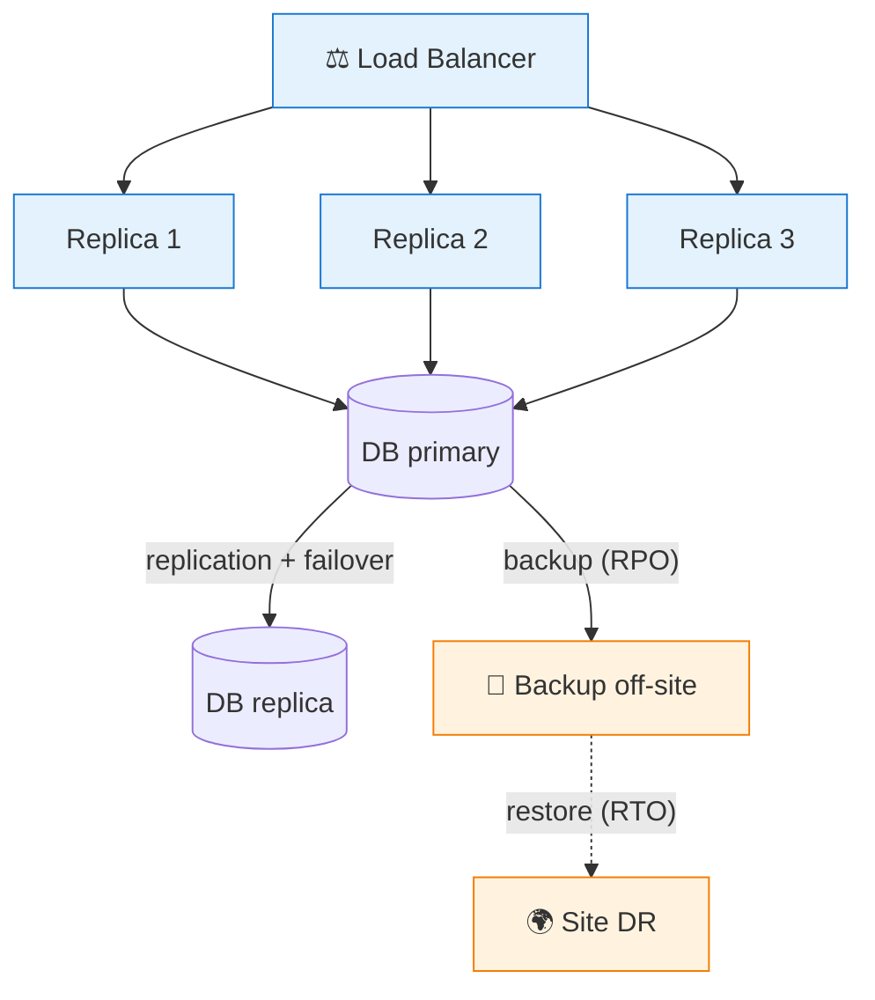
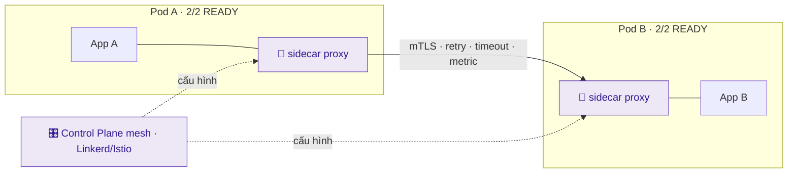
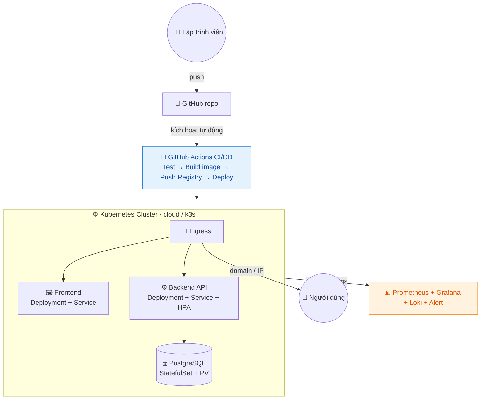

# Giai đoạn 4 — SRE, Chủ đề nâng cao & Dự án Tốt nghiệp

> **Ngày 51–60** · Độ tin cậy, tối ưu, dự án thực chiến và chuẩn bị sự nghiệp.
>
> **Khuôn mỗi ngày:** 📘 Lý thuyết → 🧪 Lab cơ bản → 🚀 Lab nâng cao (best-practice) → 💡 Bổ sung thực tế → 📝 Bài ôn tập.
>
> ✅ Trung lập nền tảng — kiến thức SRE/FinOps/Platform áp dụng cho mọi hệ thống và nhà cung cấp.

---

## Mục lục

| Ngày | Chủ đề |
|------|--------|
| [51](#ngày-51--site-reliability-engineering-sre--nguyên-lý) | Site Reliability Engineering (SRE) — Nguyên lý |
| [52](#ngày-52--high-availability-scaling--disaster-recovery) | High Availability, Scaling & Disaster Recovery |
| [53](#ngày-53--cost-optimization--finops) | Cost Optimization & FinOps |
| [54](#ngày-54--service-mesh--microservices-nâng-cao) | Service Mesh & Microservices nâng cao |
| [55](#ngày-55--platform-engineering--developer-experience) | Platform Engineering & Developer Experience |
| [56](#ngày-56--dự-án-tốt-nghiệp-phần-1-thiết-kế--hạ-tầng) | **Dự án tốt nghiệp — Phần 1: Thiết kế & Hạ tầng** |
| [57](#ngày-57--dự-án-tốt-nghiệp-phần-2-container--cicd) | **Dự án tốt nghiệp — Phần 2: Container & CI/CD** |
| [58](#ngày-58--dự-án-tốt-nghiệp-phần-3-monitoring--reliability) | **Dự án tốt nghiệp — Phần 3: Monitoring & Reliability** |
| [59](#ngày-59--dự-án-tốt-nghiệp-phần-4-tài-liệu-demo--portfolio) | **Dự án tốt nghiệp — Phần 4: Tài liệu, Demo & Portfolio** |
| [60](#ngày-60--tốt-nghiệp--tổng-kết-chứng-chỉ--định-hướng-sự-nghiệp) | **TỐT NGHIỆP — Tổng kết, Chứng chỉ & Định hướng** |
| [📎 Phụ lục](#-phụ-lục-giai-đoạn-4) | Dự án CloudNote · Checklist năng lực · Định hướng nghề |

---

## Ngày 51 — Site Reliability Engineering (SRE) — Nguyên lý

> ⏱️ ~90 phút · Loại: SRE

### 📘 Lý thuyết

- **SRE:** áp dụng tư duy kỹ thuật phần mềm vào vận hành để hệ thống tin cậy ở quy mô lớn (Google khởi xướng).
- **SLI (Service Level Indicator):** chỉ số đo lường (độ trễ, tỉ lệ lỗi, availability).
- **SLO (Service Level Objective):** mục tiêu cho SLI (vd 99.9% uptime).
- **SLA (Service Level Agreement):** cam kết với khách hàng (có hậu quả nếu vi phạm).
- **Error budget:** phần "được phép lỗi" (100% − SLO); cân bằng giữa tốc độ phát hành và ổn định.
- **Toil:** công việc thủ công lặp lại — mục tiêu SRE là tự động hóa để giảm toil.
- **Postmortem không đổ lỗi (blameless):** học từ sự cố, tập trung vào hệ thống thay vì con người.

**Sơ đồ — SLI → SLO → SLA & Error Budget:**

```mermaid
flowchart LR
    SLI["📏 SLI · đo thực tế<br/>(vd 99.95% request OK)"] --> SLO["🎯 SLO · mục tiêu nội bộ<br/>(≥ 99.9%)"]
    SLO --> SLA["📜 SLA · cam kết khách<br/>(≥ 99.5% — phạt nếu vi phạm)"]
    SLO --> EB["💰 Error Budget = 100% − SLO<br/>(0.1% ≈ 43 phút down/tháng)"]
    EB -->|"còn budget"| FEAT["🚀 ưu tiên tính năng mới"]
    EB -->|"cạn budget"| STAB["🛡️ đóng băng feature · sửa ổn định"]
    classDef k fill:#e8f5e9,stroke:#2e7d32,color:#1b5e20;
    class SLI,SLO,SLA,EB k;
```


### 🧪 Lab cơ bản

1. Định nghĩa SLI/SLO cho app của bạn (vd: 99% request < 300ms, uptime 99.5%).
2. Tính error budget tương ứng và giải thích ý nghĩa.
3. Cấu hình Grafana đo SLI (latency, error rate) của app.
4. Viết 1 postmortem mẫu cho 1 sự cố giả định (nguyên nhân, tác động, hành động khắc phục).
5. Liệt kê các "toil" trong hệ thống của bạn và đề xuất tự động hóa.

### 🚀 Lab nâng cao (best-practice)

> Mục tiêu: biến độ tin cậy thành con số đo được và ra quyết định dựa trên error budget.

1. **Tính error budget cụ thể:**
   - SLO 99.9% uptime/tháng → cho phép down **~43 phút/tháng** (error budget).
   - SLO 99.99% → chỉ **~4.3 phút/tháng**. Mỗi "số 9" thêm vào đắt gấp ~10 lần.
2. **Error budget policy:** còn budget → ưu tiên ra tính năng mới; cạn budget → đóng băng feature, tập trung sửa độ ổn định. Đây là cách SRE cân bằng dev vs ops bằng dữ liệu, không cãi nhau cảm tính.
3. **SLO dựa trên SLI người dùng cảm nhận** (latency request, tỉ lệ thành công), không phải metric máy (CPU%).
4. **Viết postmortem theo template:** timeline → tác động → nguyên nhân gốc → hành động khắc phục (có owner + deadline).

### 💡 Bổ sung thực tế: SLI/SLO/SLA & vì sao blameless

- **3 chữ viết tắt dễ lẫn:**
  | | Là gì | Ví dụ |
  |---|---|---|
  | **SLI** | chỉ số đo thực tế | "99.95% request thành công tháng này" |
  | **SLO** | mục tiêu nội bộ | "≥ 99.9% request thành công" |
  | **SLA** | cam kết có ràng buộc với khách | "≥ 99.5%, nếu thấp hơn → hoàn tiền" |
  - SLO luôn **chặt hơn** SLA (đệm an toàn để không bao giờ vi phạm cam kết).
- **100% là sai mục tiêu:** theo đuổi 100% uptime là vô nghĩa (cực kỳ đắt, vẫn không đạt). Error budget thừa nhận "lỗi là bình thường" và biến nó thành ngân sách để cân bằng tốc độ vs ổn định.
- **Vì sao postmortem blameless:** đổ lỗi cá nhân → người ta giấu sự cố → không học được gì → lặp lại. Tập trung vào **hệ thống** ("vì sao 1 lỗi gõ nhầm gây sập production?" → vì thiếu kiểm tra tự động) → sửa gốc rễ. Con người luôn sẽ mắc lỗi; hệ thống tốt phải chịu được lỗi.
- **SRE vs DevOps:** DevOps là *văn hóa/triết lý* (phá rào Dev-Ops); SRE là *cách triển khai cụ thể* của Google với SLO, error budget, giảm toil. "SRE implements DevOps."

### 📝 Bài ôn tập & Demo đối chiếu

- **Bài ôn:** phân biệt SLI, SLO, SLA.
- Error budget giúp cân bằng điều gì?
- Vì sao postmortem nên "blameless"?

| Demo đối chiếu | Kết quả mong đợi |
|---|---|
| Định nghĩa SLI/SLO | Vd: SLO 99.9% uptime, latency < 200ms |
| Tính error budget | Ra % ngân sách lỗi còn lại trong tháng |
| Phân biệt SRE vs DevOps | Giải thích rõ ràng, có ví dụ |

✅ **Kết quả đạt được:** Hiểu tư duy SRE: đo lường độ tin cậy, error budget, giảm toil.

---

## Ngày 52 — High Availability, Scaling & Disaster Recovery

> ⏱️ ~90 phút · Loại: SRE

### 📘 Lý thuyết

- **High Availability (HA):** loại bỏ điểm lỗi đơn (SPOF), dự phòng đa vùng/đa node.
- **Load balancing:** phân phối traffic; sticky session vs stateless.
- **Scaling:** vertical (mạnh hơn) vs horizontal (nhiều hơn); auto-scaling theo tải.
- **Database HA:** replication (master-replica), failover tự động.
- **Disaster Recovery (DR):** RTO (thời gian phục hồi), RPO (mất dữ liệu tối đa chấp nhận).
- **Chiến lược DR:** backup-restore, pilot light, warm standby, multi-site.
- **Chaos engineering:** chủ động gây lỗi để kiểm tra khả năng chịu lỗi.

**Sơ đồ — HA (nhiều replica + DB replication) & DR (backup off-site):**

> Không có SPOF: mất 1 replica/1 node → vẫn phục vụ. RPO = backup bao lâu/lần; RTO = khôi phục mất bao lâu.

### 🧪 Lab cơ bản

1. Cấu hình deployment K8s đa replica + HPA cho HA cơ bản.
2. Mô phỏng node/pod chết và quan sát K8s tự phục hồi.
3. Thiết lập backup database tự động và test restore (đo RTO).
4. Thực hành "chaos" đơn giản: xóa ngẫu nhiên 1 pod và xác nhận dịch vụ không gián đoạn.
5. Viết runbook khôi phục sự cố cho hệ thống của bạn.

### 🚀 Lab nâng cao (best-practice)

> Mục tiêu: thiết kế hệ thống chịu lỗi thật và kiểm chứng bằng cách chủ động phá nó.

1. **Loại bỏ SPOF có hệ thống** — hỏi "nếu cái này chết thì sao?" cho từng thành phần: 1 replica → nhiều replica; 1 node → nhiều node; 1 DB → replication.
2. **DR có cấp độ** (chọn theo RTO/RPO và ngân sách):
   | Chiến lược | RTO | Chi phí |
   |---|---|---|
   | Backup & restore | giờ | thấp |
   | Pilot light | chục phút | trung bình |
   | Warm standby | phút | cao |
   | Multi-site active-active | ~giây | rất cao |
3. **Chaos engineering có kiểm soát:** xóa pod ngẫu nhiên, ngắt mạng, làm chậm DB → xác nhận hệ thống tự phục hồi. "Chưa test failover = không có failover."
4. **DR drill định kỳ** — diễn tập khôi phục thật, đo RTO/RPO thực tế, cập nhật runbook.

### 💡 Bổ sung thực tế: RTO vs RPO & "everything fails"

- **RTO vs RPO (vẽ trên trục thời gian sự cố):**
  - **RPO** = nhìn về **quá khứ**: mất tối đa bao nhiêu **dữ liệu**? (backup mỗi 1h → RPO 1h). Quyết định **tần suất backup**.
  - **RTO** = nhìn về **tương lai**: khôi phục xong trong bao lâu? Quyết định **kiến trúc phục hồi** (snapshot nhanh vs restore archive chậm).
- **Triết lý cốt lõi của Amazon:** *"Everything fails, all the time."* Thiết kế giả định mọi thứ **sẽ** hỏng → dự phòng, tự phục hồi, không có SPOF. Đây là khác biệt giữa hệ thống "may mắn chưa sập" và hệ thống "thiết kế để chịu sập".
- **HA không miễn phí:** mỗi tầng dự phòng = thêm chi phí + phức tạp. Cân bằng với SLO — đừng xây multi-region cho app nội bộ 10 người dùng.
- **Stateless là chìa khóa scale:** app không lưu trạng thái cục bộ (session ra Redis/DB) → scale ngang thoải mái, pod chết không mất gì. Đây là lý do "cattle not pets" (Ngày 28).

### 📝 Bài ôn tập & Demo đối chiếu

- **Bài ôn:** phân biệt RTO và RPO.
- SPOF là gì và cách loại bỏ?
- Chaos engineering kiểm tra điều gì?

| Demo đối chiếu | Kết quả mong đợi |
|---|---|
| Triển khai nhiều bản sao (HA) | Tắt 1 instance, dịch vụ vẫn phục vụ |
| Kiểm thử scaling | Tăng tải → hệ thống tự mở rộng, không sập |
| Lập kế hoạch DR | Viết được RTO/RPO và quy trình khôi phục |

✅ **Kết quả đạt được:** Thiết kế hệ thống có sẵn sàng cao, có khả năng phục hồi sau thảm họa.

---

## Ngày 53 — Cost Optimization & FinOps

> ⏱️ ~60 phút · Loại: Cloud

### 📘 Lý thuyết

- **FinOps:** quản lý và tối ưu chi phí cloud như một thực hành kỹ thuật.
- **Mô hình giá:** on-demand, reserved instance, spot instance (rẻ nhưng có thể bị thu hồi).
- **Right-sizing:** chọn đúng kích thước tài nguyên, tránh over-provisioning.
- **Auto-scaling tiết kiệm:** scale xuống khi tải thấp; tắt môi trường dev ngoài giờ.
- **Storage tiering:** chuyển dữ liệu ít dùng sang lớp lưu trữ rẻ hơn.
- **Tagging tài nguyên:** gắn nhãn để theo dõi chi phí theo team/project.
- **Công cụ:** Cost Explorer, billing alert, Infracost (ước tính chi phí Terraform).

### 🧪 Lab cơ bản

1. Phân tích chi phí tài khoản cloud bằng Cost Explorer (hoặc đọc hướng dẫn nếu chưa phát sinh).
2. Tag các tài nguyên Terraform theo project/environment.
3. Cấu hình auto-scaling scale xuống 0/min khi không dùng (môi trường dev).
4. Dùng Infracost ước tính chi phí của cấu hình Terraform trước khi apply.
5. Viết checklist tối ưu chi phí cho hệ thống của bạn.

### 🚀 Lab nâng cao (best-practice)

> Mục tiêu: đưa chi phí vào quy trình kỹ thuật — thấy giá trước khi apply, tự tắt cái không dùng.

1. **Infracost trong PR** — mỗi thay đổi Terraform comment chi phí dự kiến vào PR → đội biết "PR này tốn thêm $X/tháng" trước khi merge.
2. **Tự tắt môi trường dev ngoài giờ** — dev/staging tắt 18h–8h + cuối tuần ≈ tiết kiệm ~70% chi phí compute.
3. **Right-sizing dựa trên metric thật** — dùng dữ liệu monitoring (Ngày 44) để thấy máy dùng 5% CPU → hạ size.
4. **Tagging bắt buộc** (qua policy) — không tag = không biết tiền đi đâu khi có 200 tài nguyên.

### 💡 Bổ sung thực tế: chọn mô hình giá & văn hóa FinOps

- **3 mô hình giá — chọn đúng tiết kiệm rất nhiều:**
  | Mô hình | Khi nào | Tiết kiệm |
  |---|---|---|
  | **On-demand** | tải thất thường, ngắn hạn, dev | 0% (đắt nhất) |
  | **Reserved/Savings Plan** | tải ổn định, chạy lâu dài (DB, baseline) | ~30–70% |
  | **Spot** | job chịu được gián đoạn (batch, CI, worker) | ~70–90% |
- **Right-sizing là "quả ngọt dễ hái":** đa số hệ thống over-provision (mua to vì sợ). Đo thật → hạ size → tiết kiệm ngay mà không ảnh hưởng. Nhưng cần monitoring để biết.
- **Bẫy chi phí ẩn:** egress traffic (dữ liệu ra internet), NAT Gateway 24/7, volume/snapshot mồ côi, log/metric giữ vô hạn. → tagging + Cost Explorer để soi.
- **FinOps là văn hóa, không phải công cụ:** kỹ sư cần **thấy** chi phí do mình tạo ra (shift-left cost, như shift-left security). Khi dev biết "feature này tốn $500/tháng" họ tự tối ưu. Chi phí là trách nhiệm chung.

### 📝 Bài ôn tập & Demo đối chiếu

- **Bài ôn:** khi nào nên dùng spot instance, khi nào reserved?
- Right-sizing là gì?
- Tagging giúp gì cho việc quản lý chi phí?

| Demo đối chiếu | Kết quả mong đợi |
|---|---|
| Phân tích chi phí cloud | Xác định được tài nguyên tốn kém nhất |
| Đề xuất tối ưu | Vd: right-sizing, reserved/spot, tắt idle → ước tính % tiết kiệm |
| Gắn tag chi phí | Tài nguyên có tag phân bổ chi phí |

✅ **Kết quả đạt được:** Tối ưu chi phí cloud — kỹ năng ngày càng quan trọng cho DevOps.

---

## Ngày 54 — Service Mesh & Microservices nâng cao

> ⏱️ ~90 phút · Loại: Kubernetes

### 📘 Lý thuyết

- **Microservices:** chia app thành nhiều dịch vụ nhỏ độc lập (vs monolith).
- **Thách thức:** giao tiếp, khám phá dịch vụ, bảo mật, quan sát giữa hàng chục service.
- **Service Mesh:** lớp hạ tầng xử lý giao tiếp service-to-service (Istio, Linkerd).
- **Sidecar pattern:** proxy đi kèm mỗi pod xử lý traffic.
- **Tính năng mesh:** traffic management (canary, A/B), mTLS, observability, retry/timeout.
- **API Gateway:** điểm vào duy nhất, xác thực, rate limiting.
- **Khi nào KHÔNG cần mesh:** hệ thống nhỏ thì mesh là phức tạp thừa.

**Sơ đồ — Sidecar pattern (mọi traffic đi qua proxy):**

> App không cần sửa code — sidecar lo mã hóa, retry, observability. ⚠️ Chỉ thêm mesh khi nỗi đau microservices thực sự xuất hiện.

### 🧪 Lab cơ bản

1. Cài Linkerd (nhẹ hơn Istio) vào cluster minikube.
2. Inject sidecar vào app và xem dashboard mesh (traffic, success rate).
3. Thực hành canary deployment: chia traffic 90/10 giữa 2 version.
4. Bật mTLS giữa các service và xác nhận.
5. Quan sát metric service-to-service trong dashboard mesh.

### 🚀 Lab nâng cao (best-practice)

> Mục tiêu: hiểu mesh giải quyết gì và quan trọng hơn — khi nào KHÔNG dùng.

1. **Canary qua mesh** — đẩy version mới cho 10% traffic, theo dõi success rate/latency, mở rộng dần nếu ổn (rollback tức thì nếu lỗi).
2. **mTLS tự động** — mọi traffic service-to-service mã hóa + xác thực lẫn nhau, không sửa code app (sidecar lo hết).
3. **Retry/timeout/circuit breaker** ở tầng mesh — app không cần tự code resilience.
4. **Quan sát golden signals tự động** — mesh cho metric latency/traffic/error mọi service mà không instrument thủ công.

### 💡 Bổ sung thực tế: sidecar pattern & "đừng dùng mesh khi chưa cần"

- **Sidecar pattern hoạt động thế nào:** mỗi pod được tiêm thêm 1 container proxy (Envoy/linkerd-proxy). **Mọi** traffic vào/ra app đi qua proxy này → proxy lo mTLS, retry, metric, routing — app không biết gì. Pod thành `2/2 READY` (app + sidecar).
- **Mesh giải quyết bài toán của microservices:** khi có 30 service gọi nhau, bạn cần mã hóa + retry + observability + traffic control **đồng nhất** cho tất cả. Tự code vào từng service = ác mộng. Mesh đẩy việc đó xuống hạ tầng.
- **⚠️ Cảnh báo quan trọng — khi nào KHÔNG dùng mesh:** mesh thêm **độ phức tạp lớn** (sidecar tốn tài nguyên, khó debug, học mất công). Hệ thống nhỏ (vài service) → **không cần** mesh, dùng thẳng K8s Service + Ingress. Nhiều team thêm Istio quá sớm rồi khổ. Quy tắc: chỉ thêm mesh khi nỗi đau microservices thực sự xuất hiện.
- **Linkerd vs Istio:** Linkerd nhẹ, đơn giản, dễ vận hành — bắt đầu từ đây. Istio mạnh, nhiều tính năng, nhưng phức tạp — chỉ khi cần.

### 📝 Bài ôn tập & Demo đối chiếu

- **Bài ôn:** service mesh giải quyết vấn đề gì của microservices?
- Sidecar pattern hoạt động thế nào?
- Khi nào KHÔNG nên dùng service mesh?

| Demo đối chiếu | Kết quả mong đợi |
|---|---|
| Cài service mesh | Sidecar được tiêm vào pod (2/2 READY) |
| Xem traffic giữa service | Đồ thị/metric luồng request hiển thị |
| Thử canary/traffic split | Chia % traffic giữa 2 phiên bản đúng cấu hình |

✅ **Kết quả đạt được:** Hiểu và vận hành microservices nâng cao với service mesh.

---

## Ngày 55 — Platform Engineering & Developer Experience

> ⏱️ ~60 phút · Loại: DevOps

### 📘 Lý thuyết

- **Platform Engineering:** xu hướng mới — xây "nền tảng nội bộ" (IDP) cho dev tự phục vụ.
- **Internal Developer Platform (IDP):** dev tự deploy mà không cần hiểu sâu hạ tầng.
- **Golden path:** con đường chuẩn, có rào chắn an toàn để dev đi nhanh.
- **Self-service:** template dự án, môi trường tự động, CI/CD cấu hình sẵn.
- **Backstage (Spotify):** portal developer phổ biến.
- **DORA metrics:** 4 chỉ số đo hiệu suất DevOps (deployment frequency, lead time, change failure rate, MTTR).
- **Mục tiêu:** giảm gánh nặng nhận thức cho dev, tăng tốc giao hàng an toàn.

### 🧪 Lab cơ bản

1. Tạo 1 template repo (cookiecutter/template) cho dự án mới có sẵn Dockerfile + CI.
2. Viết tài liệu "golden path" hướng dẫn dev deploy app mới.
3. Tính thử 4 DORA metrics cho dự án của bạn từ lịch sử Git/deploy.
4. Khám phá Backstage qua demo trực tuyến (đọc/xem).
5. Liệt kê cách bạn có thể cải thiện trải nghiệm developer trong hệ thống.

### 🚀 Lab nâng cao (best-practice)

> Mục tiêu: tư duy "hạ tầng như sản phẩm" — dev là khách hàng của bạn.

1. **Template repo golden path** — dev tạo service mới = 1 lệnh, đã có sẵn Dockerfile chuẩn, CI/CD, monitoring, security scan. Họ chỉ viết business logic.
2. **Đo DORA metrics thật** từ Git/deploy:
   | Metric | Đo gì |
   |---|---|
   | Deployment Frequency | deploy bao nhiêu lần/ngày |
   | Lead Time for Changes | commit → production mất bao lâu |
   | Change Failure Rate | % deploy gây sự cố |
   | MTTR | trung bình bao lâu khôi phục sau sự cố |
3. **Self-service có rào chắn** — dev tự làm nhưng trong "golden path" an toàn (policy, scan, review tự động) → vừa nhanh vừa không vỡ.
4. **Đo Developer Experience** — tìm điểm ma sát (chờ build lâu? setup môi trường khó?) và loại bỏ.

### 💡 Bổ sung thực tế: vì sao Platform Engineering nổi lên & DORA

- **Bài toán Platform Engineering giải:** "DevOps everywhere" khiến mỗi dev phải biết K8s, Terraform, CI/CD... → quá tải nhận thức. Platform team xây **nền tảng nội bộ** che giấu phức tạp đó → dev tập trung viết app, tự deploy qua golden path mà không cần là chuyên gia hạ tầng.
- **DORA metrics — thước đo "team DevOps tốt đến đâu":**
  - **Elite team:** deploy nhiều lần/ngày, lead time < 1h, change failure < 15%, MTTR < 1h.
  - 2 metric đầu đo **tốc độ**, 2 metric sau đo **độ ổn định** — team giỏi đạt **cả hai** (không đánh đổi).
- **"Golden path" không phải "golden cage":** đường chuẩn dễ đi nhất, nhưng không cấm đi đường khác khi cần. Mục tiêu: làm việc đúng trở thành việc dễ nhất.
- **Hạ tầng là sản phẩm:** platform team coi dev nội bộ là **khách hàng**, lắng nghe phản hồi, đo sự hài lòng. Đây là bước trưởng thành tiếp theo của DevOps.

### 📝 Bài ôn tập & Demo đối chiếu

- **Bài ôn:** 4 DORA metrics là gì?
- Internal Developer Platform giúp gì cho dev?
- "Golden path" nghĩa là gì?

| Demo đối chiếu | Kết quả mong đợi |
|---|---|
| Hiểu chỉ số DORA | Nêu đúng 4: deploy frequency, lead time, MTTR, change fail rate |
| Phác thảo internal platform | Mô tả self-service cho dev (golden path) |
| Đánh giá Developer Experience | Chỉ ra điểm ma sát và cách cải thiện |

✅ **Kết quả đạt được:** Nắm xu hướng Platform Engineering và đo hiệu suất bằng DORA.

---

## Ngày 56 — Dự án tốt nghiệp — Phần 1: Thiết kế & Hạ tầng

> ⏱️ ~150 phút · Loại: Capstone

### 📘 Lý thuyết

- **Mục tiêu dự án:** xây dựng 1 hệ thống DevOps hoàn chỉnh **end-to-end** để đưa vào portfolio.
- **Phạm vi:** app web nhiều tầng (frontend + backend API + database) chạy trên K8s với CI/CD, IaC, monitoring đầy đủ.
- **Hôm nay tập trung:** thiết kế kiến trúc và dựng hạ tầng bằng IaC.
- **Tài liệu hóa:** mỗi quyết định kiến trúc nên được ghi lại (ADR — Architecture Decision Records).

> 📌 **Đề bài chi tiết "CloudNote"** + tiêu chí hoàn thành nằm ở [Phụ lục B](#phụ-lục-b--đề-bài-dự-án-tốt-nghiệp-cloudnote). Đọc trước khi bắt đầu Phần 1.

### 🧪 Lab cơ bản

1. Vẽ sơ đồ kiến trúc tổng thể (draw.io/excalidraw): luồng code → CI → registry → K8s → monitoring.
2. Khởi tạo monorepo: `/app`, `/docker`, `/terraform`, `/k8s` (hoặc `/helm`), `/.github/workflows`, `/docs`.
3. Viết Terraform tạo hạ tầng: cluster K8s (hoặc VM + k3s), networking, registry.
4. Cấu hình remote state cho Terraform.
5. Viết README tổng quan dự án và sơ đồ kiến trúc.

### 🚀 Lab nâng cao (best-practice)

> Mục tiêu: khởi đầu dự án đúng chuẩn — kiến trúc rõ, hạ tầng bằng code, có ghi chép quyết định.

1. **ADR (Architecture Decision Records)** — ghi mỗi quyết định lớn (vì sao chọn k3s thay EKS? vì sao Postgres?) vào `/docs/adr/`. Người phỏng vấn rất thích thấy điều này.
2. **Terraform module + remote state** ngay từ đầu (Ngày 48) — không để "làm sau".
3. **Cấu trúc monorepo rõ ràng** — người lạ nhìn vào hiểu ngay đâu là gì.
4. **README có sơ đồ kiến trúc** — bộ mặt dự án, quyết định ấn tượng đầu tiên.

### 💡 Bổ sung thực tế: chọn phạm vi vừa sức + tiết kiệm chi phí

- **Đừng ôm đồm:** app 3 tầng đơn giản (CloudNote/todo/URL shortener) là **đủ** để thể hiện toàn bộ kỹ năng DevOps. Người phỏng vấn quan tâm **pipeline + hạ tầng + monitoring**, không phải app phức tạp.
- **Tiết kiệm chi phí học:** dùng **k3s trên 1 VM** (hoặc Minikube local) thay vì EKS/GKE (tốn tiền). Vẫn thể hiện đủ kỹ năng K8s. Nếu dùng cloud: nhớ `terraform destroy` sau mỗi buổi.
- **ADR = điểm cộng phỏng vấn:** "vì sao bạn chọn cái này?" là câu hỏi phỏng vấn kinh điển. Có ADR sẵn = bạn đã suy nghĩ thấu đáo, không chọn bừa.
- **Bắt đầu từ sơ đồ:** vẽ kiến trúc trước khi code. Sơ đồ rõ → biết cần dựng gì → đỡ làm lại.

### 📝 Bài ôn tập & Demo đối chiếu

- Hạ tầng có được tạo hoàn toàn bằng code (IaC) không?
- Sơ đồ kiến trúc đã rõ ràng và đầy đủ chưa?
- Cấu trúc repo có chuyên nghiệp, dễ hiểu không?

| Demo đối chiếu | Kết quả mong đợi |
|---|---|
| Có sơ đồ kiến trúc dự án | Diagram thể hiện app, hạ tầng, luồng dữ liệu |
| Hạ tầng dựng bằng IaC | `terraform apply` tạo nền tảng, không thao tác tay |
| Repo dự án khởi tạo | Cấu trúc thư mục rõ ràng + README ban đầu |

✅ **Kết quả đạt được:** Khởi động dự án tốt nghiệp: kiến trúc rõ ràng + hạ tầng bằng IaC.

---

## Ngày 57 — Dự án tốt nghiệp — Phần 2: Container & CI/CD

> ⏱️ ~150 phút · Loại: Capstone

### 📘 Lý thuyết

- **Hôm nay:** đóng gói ứng dụng và xây pipeline CI/CD hoàn chỉnh.
- **Yêu cầu CI:** lint → test → quét bảo mật (Trivy) → build image multi-stage → push registry.
- **Yêu cầu CD:** deploy tự động lên K8s (qua kubectl/Helm hoặc GitOps ArgoCD).
- **Bảo mật:** secret qua GitHub Secrets, image scanning, image nhỏ gọn không chạy root.

### 🧪 Lab cơ bản

1. Viết Dockerfile multi-stage tối ưu cho từng service.
2. Viết Helm chart (hoặc manifest K8s) cho toàn bộ ứng dụng.
3. Xây pipeline CI: lint, test, Trivy scan, build, push image (tag theo SHA).
4. Xây pipeline CD: tự động deploy lên K8s khi merge vào main (hoặc qua ArgoCD).
5. Test end-to-end: sửa code → push → pipeline tự build → deploy → app cập nhật.

### 🚀 Lab nâng cao (best-practice)

> Mục tiêu: pipeline production-grade — an toàn, truy vết, tự động hoàn toàn.

1. **CI đầy đủ tầng bảo mật** (gộp kiến thức Ngày 49): lint + test + Trivy (image + dependency) + tfsec.
2. **Image chuẩn** (Ngày 18): multi-stage, base nhỏ, `USER` thường, HEALTHCHECK, tag SHA.
3. **CD qua GitOps (ArgoCD)** nếu có thể — đẹp hơn push-based, thể hiện trình độ.
4. **Secret qua Secrets/Environments**, production có approval.

### 💡 Bổ sung thực tế: đây là phần "ăn điểm" nhất của dự án

- **Pipeline tự động là điểm nhấn phỏng vấn:** demo "tôi sửa 1 dòng code → vài phút sau tự lên production" gây ấn tượng mạnh hơn mọi lời nói. Đây là bằng chứng bạn hiểu DevOps thực sự.
- **Mỗi stage kể một năng lực:** lint/test (chất lượng) · scan (bảo mật) · multi-stage build (Docker) · push tag SHA (truy vết) · deploy K8s/GitOps (orchestration). 1 pipeline = trình diễn cả khóa học.
- **Đừng bỏ qua bảo mật trong pipeline** — Trivy scan + secret qua Secrets cho thấy tư duy DevSecOps, thứ nhiều ứng viên junior thiếu.
- **Test end-to-end thật** trước khi quay demo — pipeline phải chạy mượt, không lỗi giữa chừng khi trình bày.

### 📝 Bài ôn tập & Demo đối chiếu

- Pipeline chạy hoàn toàn tự động từ commit đến deploy chưa?
- Image đã được quét bảo mật và tối ưu kích thước chưa?
- Secret có được quản lý an toàn không?

| Demo đối chiếu | Kết quả mong đợi |
|---|---|
| App được container hóa | `docker build` + chạy local thành công |
| Pipeline CI/CD hoạt động | push → tự build, test, deploy, badge xanh |
| App chạy trên K8s/cloud | Truy cập được URL công khai của dự án |

✅ **Kết quả đạt được:** Dự án có CI/CD đầy đủ: code tự động lên K8s qua pipeline an toàn.

---

## Ngày 58 — Dự án tốt nghiệp — Phần 3: Monitoring & Reliability

> ⏱️ ~150 phút · Loại: Capstone

### 📘 Lý thuyết

- **Hôm nay:** hoàn thiện observability và độ tin cậy cho hệ thống.
- **Monitoring:** Prometheus thu metric, Grafana dashboard, Loki cho log tập trung.
- **Reliability:** health probe, resource limits, HPA, định nghĩa SLO và alert.
- **Tài liệu vận hành:** runbook xử lý sự cố, hướng dẫn rollback.

### 🧪 Lab cơ bản

1. Cài stack giám sát (kube-prometheus-stack + Loki) bằng Helm vào cluster.
2. Tạo dashboard Grafana hiển thị 4 golden signals của ứng dụng.
3. Định nghĩa SLO và cấu hình alert khi vi phạm.
4. Thêm liveness/readiness probe, resource limits và HPA cho các service.
5. Viết runbook xử lý sự cố và hướng dẫn rollback trong `/docs`.

### 🚀 Lab nâng cao (best-practice)

> Mục tiêu: hệ thống "production-ready" — quan sát được, tự phục hồi, có tài liệu vận hành.

1. **Dashboard golden signals** (Ngày 45) cho app của bạn — không phải chỉ CPU/RAM.
2. **SLO + alert dựa trên SLO** (Ngày 51) — alert khi sắp vi phạm cam kết, không phải mọi dao động.
3. **Reliability đầy đủ:** probe đúng (Ngày 41) + resource limits + HPA + PodDisruptionBudget.
4. **Runbook thật** trong `/docs` — từng bước xử lý các sự cố hay gặp + cách rollback. Đây là tài liệu vận hành chuyên nghiệp.

### 💡 Bổ sung thực tế: monitoring + reliability biến dự án thành "production-grade"

- **Đây là thứ phân biệt dự án "chạy được" với dự án "production-ready":** nhiều ứng viên dừng ở "app deploy được". Thêm monitoring + self-healing + SLO + runbook → dự án của bạn ở đẳng cấp khác hẳn.
- **Demo self-healing gây ấn tượng:** xóa 1 pod trước mặt người phỏng vấn → K8s tự tạo lại, app không gián đoạn. Tăng tải → HPA tự scale. Đây là bằng chứng sống động về reliability.
- **Runbook thể hiện tư duy vận hành:** không chỉ "xây xong" mà "biết vận hành + xử lý khi hỏng". Người phỏng vấn senior đánh giá rất cao điều này.
- **Gắn alert với golden signals/SLO** — cho thấy bạn hiểu SRE, không chỉ cắm dashboard cho đẹp.

### 📝 Bài ôn tập & Demo đối chiếu

- Bạn có thể quan sát sức khỏe hệ thống qua dashboard không?
- Alert có kích hoạt khi có vấn đề không?
- Hệ thống tự phục hồi khi pod chết chưa?

| Demo đối chiếu | Kết quả mong đợi |
|---|---|
| Có monitoring cho dự án | Grafana dashboard cho app của bạn |
| Có alerting | Tạo cảnh báo (vd CPU>80%) và test kích hoạt |
| Cấu hình HA/probe | App tự phục hồi, không downtime khi 1 pod chết |

✅ **Kết quả đạt được:** Dự án có observability và reliability đầy đủ — chuẩn production.

---

## Ngày 59 — Dự án tốt nghiệp — Phần 4: Tài liệu, Demo & Portfolio

> ⏱️ ~120 phút · Loại: Capstone

### 📘 Lý thuyết

- **Hôm nay:** hoàn thiện tài liệu và biến dự án thành tài sản trong portfolio.
- **README chuyên nghiệp:** mô tả, kiến trúc, công nghệ, cách chạy, demo, screenshot.
- **Tài liệu kỹ thuật:** sơ đồ kiến trúc, quyết định thiết kế (ADR), hướng dẫn vận hành.
- **Demo:** video/screenshot quay lại toàn bộ luồng từ code đến deploy đến monitoring.
- **Blog kỹ thuật:** viết bài chia sẻ giúp ghi nhớ và xây dựng thương hiệu cá nhân.

### 🧪 Lab cơ bản

1. Hoàn thiện README dự án đầy đủ: mô tả, sơ đồ, tech stack, hướng dẫn chạy, screenshot dashboard.
2. Quay video demo (3–5 phút) toàn bộ luồng: push code → CI/CD → deploy → giám sát.
3. Viết bài blog (~800 chữ) trên viblo.asia hoặc dev.to về dự án và bài học.
4. Dọn dẹp repo: xóa file thừa, kiểm tra `.gitignore`, đảm bảo không lộ secret.
5. Ghim (pin) dự án trên GitHub profile.

### 🚀 Lab nâng cao (best-practice)

> Mục tiêu: biến công sức kỹ thuật thành tài sản nghề nghiệp — người khác (và nhà tuyển dụng) thấy được giá trị.

1. **README kể chuyện rõ ràng:** bài toán → kiến trúc (có sơ đồ) → tech stack → cách chạy (1 lệnh) → demo → quyết định thiết kế. Người lạ đọc xong chạy được ngay.
2. **Video demo 3–5 phút** — show luồng end-to-end: sửa code → pipeline chạy → app cập nhật → dashboard phản ánh. Đây là "vũ khí" phỏng vấn.
3. **Quét secret lần cuối** (gitleaks) trước khi public — đảm bảo không lộ gì.
4. **Blog kỹ thuật** — viết về dự án không chỉ giúp người khác mà còn khắc sâu kiến thức và xây thương hiệu cá nhân.

### 💡 Bổ sung thực tế: GitHub là CV của DevOps

- **Nhà tuyển dụng DevOps xem GitHub trước CV:** code + pipeline + IaC nói lên năng lực thật hơn mọi dòng mô tả. README đẹp + dự án chạy được = ấn tượng mạnh.
- **README quyết định ấn tượng đầu:** repo không README/README sơ sài = bị bỏ qua dù code tốt. Đầu tư README như đầu tư bộ mặt sản phẩm.
- **Video demo vượt qua "nói suông":** ai cũng ghi "biết Kubernetes" trong CV. Video bạn deploy thật + self-healing thật = bằng chứng không thể chối cãi.
- **Blog xây dựng thương hiệu dài hạn:** bài viết kỹ thuật tốt thu hút nhà tuyển dụng, kết nối cộng đồng, và buộc bạn hiểu sâu hơn (dạy lại là cách học tốt nhất).

### 📝 Bài ôn tập & Demo đối chiếu

- Người lạ đọc README có hiểu và chạy được dự án không?
- Demo có thể hiện rõ năng lực DevOps của bạn chưa?
- Repo đã sạch và chuyên nghiệp chưa?

| Demo đối chiếu | Kết quả mong đợi |
|---|---|
| README/tài liệu hoàn chỉnh | Có hướng dẫn setup, kiến trúc, cách chạy |
| Quay/diễn demo dự án | Trình bày được luồng: code → deploy → live → monitor |
| Dự án nằm trên portfolio | GitHub repo công khai, pin lên profile |

✅ **Kết quả đạt được:** Dự án tốt nghiệp hoàn chỉnh, được tài liệu hóa kỹ — sẵn sàng đưa vào CV.

---

## Ngày 60 — TỐT NGHIỆP — Tổng kết, Chứng chỉ & Định hướng Sự nghiệp

> ⏱️ ~120 phút · Loại: Milestone

### 📘 Lý thuyết

- **Nhìn lại hành trình 60 ngày:** Linux/SysOps → Git → Docker → Cloud → IaC → CI/CD → K8s → Monitoring → SRE → Capstone.
- **Bức tranh kiến trúc DevOps đầy đủ:** Code → CI (test/scan) → Build image → Registry → GitOps/CD → K8s → Monitor → Alert → cải tiến.
- **Chứng chỉ nhập môn:** Linux Foundation LFCA, AWS Certified Cloud Practitioner (CLF-C02).
- **Chứng chỉ trung cấp (3–6 tháng tới):** AWS Solutions Architect Associate, CKA (Certified Kubernetes Administrator), Terraform Associate.
- **Định hướng nghề:** DevOps Engineer, SRE, Cloud Engineer, Platform Engineer.
- **Học suốt đời:** theo dõi CNCF landscape, đọc blog kỹ thuật, đóng góp mã nguồn mở.
- **Cộng đồng:** DevOps VN (Facebook), r/devops (Reddit), CNCF Slack, Discord DevOps.

### 🧪 Lab cơ bản

1. Hoàn thiện GitHub portfolio: tối thiểu 5 repo (`sysops-foundation`, `docker-fullstack`, `cicd-pipeline`, `k8s-deploy`, `capstone`).
2. Cập nhật CV/LinkedIn: liệt kê kỹ năng và dự án với từ khóa rõ ràng.
3. Vẽ sơ đồ kiến trúc tổng thể tất cả những gì đã xây dựng trong 60 ngày.
4. Chọn và đăng ký 1 chứng chỉ (LFCA hoặc AWS CCP), lập kế hoạch ôn thi.
5. Tham gia 1 cộng đồng DevOps và đặt câu hỏi/chia sẻ dự án đầu tiên.

### 🚀 Lab nâng cao (best-practice)

> Mục tiêu: chuyển từ "học xong" sang "sẵn sàng đi làm và phát triển dài hạn".

1. **Hoàn thành [Bảng kiểm năng lực 17 kỹ năng](#phụ-lục-c--bảng-kiểm-năng-lực-tốt-nghiệp)** — tự đánh dấu cái nào tự làm được không cần tra cứu. Phần chưa vững → học lại.
2. **Lập kế hoạch 90 ngày tiếp theo:** 1 chứng chỉ + 1 chủ đề chuyên sâu (xem [Phụ lục D](#phụ-lục-d--định-hướng-nghề--90-ngày-tiếp-theo)).
3. **Xác định vị trí mục tiêu** (DevOps/SRE/Cloud/Platform) và khoảng cách kỹ năng cần lấp.
4. **Bắt đầu hiện diện cộng đồng** — đặt câu hỏi, chia sẻ dự án, viết blog → cơ hội nghề tự tìm đến.

### 💡 Bổ sung thực tế: học không bao giờ dừng + chọn chứng chỉ đúng

- **Lộ trình chứng chỉ hợp lý:**
  | Giai đoạn | Chứng chỉ | Mục đích |
  |---|---|---|
  | Nhập môn (giờ) | LFCA / AWS CCP | chứng minh nền tảng, dễ đạt |
  | Trung cấp (3–6 tháng) | AWS SAA · CKA · Terraform Associate | có giá trị tuyển dụng thật |
  | Chuyên sâu | CKS (security) · AWS DevOps Pro | nâng cao |
- **Chứng chỉ không thay portfolio:** chứng chỉ mở cửa CV, nhưng **dự án thực chiến** mới thuyết phục khi phỏng vấn. Cả hai bổ trợ nhau.
- **CNCF Landscape là bản đồ ngành:** hàng trăm công cụ cloud-native. Đừng học hết — hiểu **danh mục** (CI/CD, observability, service mesh, security...) và đại diện tiêu biểu mỗi nhóm.
- **"Consistency beats intensity":** 90 phút mỗi ngày đều đặn thắng học dồn rồi bỏ. Kỹ năng DevOps là tích lũy — duy trì nhịp học sau khi "tốt nghiệp" mới là thứ tạo khác biệt dài hạn.

### 📝 Bài ôn tập & Demo đối chiếu

- Tự đánh giá toàn diện theo [bảng kiểm năng lực](#phụ-lục-c--bảng-kiểm-năng-lực-tốt-nghiệp).
- Lập kế hoạch học 90 ngày tiếp theo: chứng chỉ + chủ đề chuyên sâu.
- Xác định vị trí công việc mục tiêu và khoảng cách kỹ năng cần lấp.

| Demo đối chiếu | Kết quả mong đợi |
|---|---|
| Hoàn thành checklist 17 kỹ năng | Tự đánh dấu phần lớn các mục |
| Có dự án tốt nghiệp | Link repo + demo sẵn sàng đưa vào CV |
| Lên kế hoạch chứng chỉ | Chọn được LFCA/AWS CCP/CKA và mốc thời gian |

✅ **Kết quả đạt được — TỐT NGHIỆP! 🎓** Bạn đã có nền tảng SysOps + DevOps vững chắc, portfolio thực chiến và lộ trình phát triển tiếp theo.

---

# 📎 Phụ lục Giai đoạn 4

## Phụ lục A — Cheat Sheet tổng hợp theo Giai đoạn

> In riêng phần này dán cạnh bàn làm việc. Mục tiêu: nhìn lệnh là nhớ công dụng, gõ không cần tra.

```text
# ───── GĐ1: LINUX & BASH ─────
ls -la / pwd / cd              # liệt kê / vị trí / chuyển thư mục
cp -r / mv / rm -rf            # sao chép / di chuyển / xóa đệ quy (cẩn thận!)
chmod 755 / chown user:grp     # đổi quyền / đổi chủ sở hữu
ps aux | grep / kill -9 PID    # tìm / buộc dừng tiến trình
systemctl status|start|enable  # xem / chạy / tự khởi động dịch vụ
journalctl -u <svc> -f         # theo dõi log dịch vụ
tar -czf f.tar.gz dir/         # nén thư mục để backup
crontab -e                     # lập lịch chạy script
tmux new -s work               # phiên không chết khi SSH rớt

# ───── GĐ1: MẠNG, SSH & BẢO MẬT ─────
ip a / ss -tlnp / ping         # IP / cổng đang mở / kiểm tra kết nối
ssh-keygen -t ed25519          # tạo cặp khóa SSH
ssh-copy-id user@host          # cài khóa công khai lên server
scp file user@host:~/          # copy file qua SSH
sudo ufw allow 22,80,443 ; sudo ufw enable    # firewall

# ───── GĐ2: GIT & GITHUB ─────
git init / clone <url>         # khởi tạo / sao chép repo
git add . / commit -m ""       # staging / lưu phiên bản
git push / pull                # đẩy lên / kéo về remote
git switch -c <branch>         # tạo & chuyển nhánh
git merge / rebase             # hợp nhất / sắp xếp lịch sử
git tag v1.0.0                 # đánh dấu phiên bản

# ───── GĐ2: DOCKER & COMPOSE ─────
docker build -t app .          # build image từ Dockerfile
docker run -d -p 80:80 app     # chạy container nền, ánh xạ cổng
docker ps / images / logs      # xem container / image / log
docker exec -it <id> sh        # vào trong container
docker compose up -d / down    # chạy / tắt nhiều container
docker system prune -a         # dọn rác (đĩa đầy)

# ───── GĐ2: CLOUD & TERRAFORM ─────
terraform init / plan / apply  # khởi tạo / xem trước / tạo hạ tầng
terraform destroy              # hủy hạ tầng (tránh tốn phí)
terraform fmt / validate       # format / kiểm cú pháp
ssh -i key.pem ubuntu@<ip>     # vào VM (key chmod 400)

# ───── GĐ3: KUBERNETES & HELM ─────
kubectl get pods|svc|deploy    # xem tài nguyên
kubectl apply -f file.yaml     # tạo/cập nhật từ manifest
kubectl describe pod <name>    # chi tiết & events
kubectl logs -f <pod>          # log real-time
kubectl exec -it <pod> -- sh   # vào trong pod
kubectl scale --replicas=3     # tăng/giảm bản sao
kubectl rollout undo deploy/<d># rollback
helm install / upgrade / rollback

# ───── GĐ3: CI/CD, MONITORING & ANSIBLE ─────
.github/workflows/*.yml        # định nghĩa pipeline (on/jobs/steps)
rate(http_requests_total[5m])  # PromQL: request/s
ansible all -m ping            # kiểm tra kết nối host
ansible-playbook site.yml      # chạy playbook cấu hình hàng loạt

# ───── GĐ4: SRE ─────
# SLI (đo) → SLO (mục tiêu) → SLA (cam kết); error budget = 100% - SLO
# RPO (mất dữ liệu tối đa) | RTO (thời gian phục hồi)
# DORA: deploy frequency, lead time, change failure rate, MTTR
```

## Phụ lục B — Đề bài Dự án Tốt nghiệp: "CloudNote"

> **Mục tiêu:** tự tay xây một hệ thống web hoàn chỉnh, chạy thật, có CI/CD tự động, điều phối bằng Kubernetes, giám sát đầy đủ và viết bằng Infrastructure as Code. Đây là sản phẩm "đinh" để đưa vào CV và trình bày khi phỏng vấn.

### 1. Đề bài — "CloudNote": ứng dụng ghi chú đa người dùng

Xây ứng dụng web ghi chú (tạo/sửa/xóa note, đăng nhập) gồm 3 thành phần: frontend, backend API, database. Toàn bộ hệ thống phải tự động hóa từ lúc đẩy code đến lúc chạy trên cloud, có giám sát và khả năng tự phục hồi.

**Gợi ý stack (chọn ngôn ngữ bạn quen):**
- **Frontend:** React / Vue / hoặc HTML tĩnh đơn giản — gọi API backend.
- **Backend:** Node.js (Express) / Python (Flask, FastAPI) — REST API cho note.
- **Database:** PostgreSQL hoặc MySQL — lưu user và note.
- *Có thể thay CloudNote bằng app bạn thích (blog, todo, URL shortener) — miễn đủ 3 tầng.*

### 2. Kiến trúc tổng thể (vẽ sơ đồ này vào README)



### 3. Các bước thực hiện (5 phần — khoảng 5–7 ngày, khớp Ngày 56–59)

**PHẦN 1 — Ứng dụng & Container hóa**
- [ ] Viết app 3 tầng chạy được ở local (frontend gọi backend, backend đọc/ghi DB).
- [ ] Viết Dockerfile cho frontend và backend (multi-stage để image nhỏ).
- [ ] Viết `docker-compose.yml` chạy cả 3 service ở local bằng 1 lệnh.
- [ ] Kiểm tra: `docker compose up` → mở trình duyệt, tạo được 1 note và lưu vào DB.

**PHẦN 2 — Hạ tầng bằng IaC (Terraform)**
- [ ] Dùng Terraform tạo cluster K8s trên cloud (EKS/GKE) hoặc k3s trên 1 VM để tiết kiệm.
- [ ] Tách module rõ ràng (network, cluster), lưu state ở remote backend (S3).
- [ ] Kiểm tra: `terraform apply` dựng xong hạ tầng, `kubectl get nodes` thấy Ready.

**PHẦN 3 — CI/CD tự động (GitHub Actions)**
- [ ] Pipeline CI: mỗi push tự chạy test + lint, build image, push lên registry tag theo commit.
- [ ] Pipeline CD: tự động cập nhật manifest K8s và deploy phiên bản mới (hoặc qua ArgoCD GitOps).
- [ ] Dùng GitHub Secrets cho mọi thông tin nhạy cảm (không hard-code).
- [ ] Kiểm tra: sửa 1 dòng code → push → vài phút sau phiên bản mới tự lên cloud.

**PHẦN 4 — Triển khai K8s & độ tin cậy**
- [ ] Viết manifest: Deployment + Service cho frontend/backend, StatefulSet + PVC cho DB.
- [ ] Cấu hình ConfigMap/Secret cho biến môi trường và mật khẩu DB.
- [ ] Thêm liveness/readiness probe, resource limits, và HPA cho backend.
- [ ] Expose qua Ingress để truy cập bằng domain/IP công khai.
- [ ] Kiểm tra: xóa 1 pod → tự tạo lại; tăng tải → số pod tự tăng; app không gián đoạn.

**PHẦN 5 — Giám sát, Tài liệu & Demo**
- [ ] Cài Prometheus + Grafana (qua Helm), tạo dashboard CPU/RAM/request và 4 golden signals.
- [ ] Gom log tập trung bằng Loki; tạo 1 alert (vd CPU>80% hoặc app down).
- [ ] Viết README đầy đủ: mô tả, sơ đồ kiến trúc, cách cài đặt, screenshot, quyết định thiết kế.
- [ ] Quay video demo 3–5 phút: push code → pipeline chạy → app cập nhật → xem dashboard.
- [ ] Pin repo lên GitHub profile để đưa vào CV.

### 4. Tiêu chí HOÀN THÀNH (tự chấm — đủ hết là xuất sắc)

| Tiêu chí | Đạt? |
|---|---|
| Ứng dụng 3 tầng chạy thật, truy cập được qua Internet bằng domain/IP | ☐ |
| Mỗi lần push code, hệ thống tự test → build → deploy mà KHÔNG thao tác tay | ☐ |
| App chạy trên Kubernetes, tự phục hồi khi pod chết, tự scale khi tải cao | ☐ |
| Toàn bộ hạ tầng tạo bằng Terraform (code), dựng lại từ đầu trong 1 lệnh | ☐ |
| Có dashboard Grafana theo dõi sức khỏe hệ thống real-time + ít nhất 1 alert | ☐ |
| Không có secret nào nằm trong code; tất cả qua Secrets/Secret manager | ☐ |
| README hoàn chỉnh + video demo + repo công khai trên GitHub | ☐ |

### 5. Thử thách nâng cao (làm thêm để nổi bật)

- Triển khai **Blue/Green** hoặc **Canary** deployment để cập nhật không downtime.
- Thêm **GitOps với ArgoCD**: cluster tự đồng bộ đúng theo Git.
- Cấu hình **HTTPS tự động** bằng cert-manager + Let's Encrypt.
- Thiết lập **backup tự động** cho database và thử kịch bản khôi phục (DR drill).
- **Quét bảo mật image** (Trivy) ngay trong pipeline, chặn deploy nếu có lỗ hổng nghiêm trọng.

> Khi hoàn thành đề án này, bạn đã đi qua trọn vẹn vòng đời DevOps thực tế — đủ năng lực ứng tuyển vị trí **Junior DevOps/SysOps Engineer**.

## Phụ lục C — Bảng kiểm Năng lực Tốt nghiệp

> Tự đánh dấu ☑ khi bạn có thể **TỰ LÀM** được mà không cần tra cứu. Đây là thước đo bạn đã sẵn sàng cho công việc SysOps/DevOps thực tế.

| # | Kỹ năng | Đạt? |
|---|---|---|
| 1 | Cài đặt & điều hướng Linux, quản lý file/process/user/quyền | ☐ |
| 2 | Viết script Bash tự động hóa + cron job | ☐ |
| 3 | Cấu hình mạng cơ bản, SSH key, tường lửa UFW, hardening | ☐ |
| 4 | Quản lý log, backup/restore, giám sát tài nguyên | ☐ |
| 5 | Sử dụng Git/GitHub: branch, merge, rebase, PR, tag | ☐ |
| 6 | Đóng gói app bằng Docker, viết Dockerfile tối ưu multi-stage | ☐ |
| 7 | Chạy multi-container bằng Docker Compose | ☐ |
| 8 | Tạo & quản lý server cloud (VM), deploy app thật | ☐ |
| 9 | Viết Infrastructure as Code bằng Terraform (module, remote state) | ☐ |
| 10 | Cấu hình server hàng loạt bằng Ansible | ☐ |
| 11 | Xây pipeline CI/CD end-to-end với GitHub Actions | ☐ |
| 12 | Triển khai & scale ứng dụng trên Kubernetes | ☐ |
| 13 | Đóng gói app K8s bằng Helm, triển khai GitOps với ArgoCD | ☐ |
| 14 | Giám sát hệ thống: Prometheus, Grafana, Loki | ☐ |
| 15 | Tích hợp bảo mật DevSecOps (Trivy, RBAC, NetworkPolicy) | ☐ |
| 16 | Áp dụng tư duy SRE: SLI/SLO, error budget, HA/DR | ☐ |
| 17 | Hoàn thành dự án tốt nghiệp end-to-end trong portfolio | ☐ |

## Phụ lục D — Định hướng nghề & 90 ngày tiếp theo

**Công cụ & Môi trường học**
- Môi trường: WSL2 (Windows) hoặc Ubuntu VM/VirtualBox. Không học trên Windows native vì lệnh khác Linux.
- Cloud miễn phí: AWS Free Tier (12 tháng) hoặc Oracle Cloud Free Tier (2 VM vĩnh viễn).
- Editor: VS Code + extension Remote-SSH để chỉnh sửa code trên server từ máy bạn.
- K8s local: Minikube, kind hoặc k3s — không cần cluster trả phí để học.

**Cách học hiệu quả**
- **Không copy-paste:** gõ tay từng lệnh và đoạn code. Tay làm thì não mới nhớ.
- **Phân tích lỗi:** đọc kỹ thông báo lỗi trước khi Google. Lỗi là người thầy tốt nhất của DevOps.
- **Ghi chép:** dùng Notion/Obsidian/file `.md` ghi lại mọi lệnh/khái niệm mới.
- **Không bỏ qua:** ngày nào chưa hiểu, học lại trước khi đi tiếp. Kiến thức tích lũy.
- **Học theo dự án:** luôn áp dụng vào 1 ứng dụng thật để hiểu "tại sao", không chỉ "làm thế nào".

**Portfolio & Xin việc**
- **GitHub là CV:** đẩy mọi thứ lên GitHub. Nhà tuyển dụng DevOps xem GitHub của bạn đầu tiên.
- **README quan trọng:** mỗi repo cần README đầy đủ — mô tả, cách cài, sơ đồ kiến trúc, screenshot.
- **Blog kỹ thuật:** viết bài trên viblo.asia hoặc dev.to giúp nhớ lâu và xây thương hiệu cá nhân.
- **Dự án tốt nghiệp:** là "vũ khí" mạnh nhất khi phỏng vấn — hãy kể được toàn bộ kiến trúc và quyết định thiết kế.

**Chứng chỉ & Lộ trình 90 ngày tiếp theo**
- **Nhập môn:** Linux Foundation LFCA, AWS Certified Cloud Practitioner (CLF-C02).
- **Trung cấp:** AWS Solutions Architect Associate (SAA-C03), CKA (Certified Kubernetes Administrator), HashiCorp Terraform Associate.
- **Chuyên sâu tiếp theo:** Helm advanced, ArgoCD/GitOps, Service Mesh (Istio), Observability nâng cao, Platform Engineering.
- **Cộng đồng:** DevOps VN (Facebook), r/devops (Reddit), CNCF Slack, Discord DevOps — đặt câu hỏi và chia sẻ dự án.

---

> 🎓 **Chúc mừng bạn hoàn thành hành trình 60 ngày!**
>
> *"Consistency beats intensity"* — Kiên trì mỗi ngày 90 phút, sau 60 ngày bạn sẽ khác biệt.
>
> Bạn không chỉ học xong một khóa — bạn đã có **nền tảng vững**, **portfolio thực chiến**, và quan trọng nhất là **tư duy DevOps**: mọi thứ là code, tự động hóa được, đo lường được, và luôn cải tiến. Chặng đường tiếp theo là của bạn. 🚀
