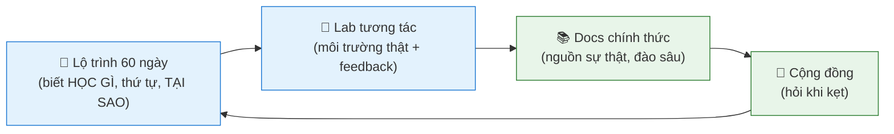

# 📚 Tài liệu tham khảo chính thức & Cách học hiệu quả

> Tài liệu 60 ngày là **lộ trình + giải thích**. Để học đúng và sâu, luôn đối chiếu với **docs chính thức** (nguồn sự thật, cập nhật nhất) và luyện trên **nền tảng lab tương tác** (có môi trường thật + feedback).
>
> ⚠️ Lệnh và cú pháp công cụ **thay đổi theo thời gian** — khi thấy khác với tài liệu này, **docs chính thức luôn đúng hơn**.

---

## 🎯 Cách dùng tài liệu này để học "OK" thật sự

Một tài liệu text (kể cả tài liệu này) **không đủ** để học DevOps. Hãy kết hợp 4 thứ:

1. **Dùng lộ trình 60 ngày** làm khung — học ngày nào theo thứ tự nào.
2. **GÕ TAY làm lab** trên môi trường thật (WSL2/VM/cloud free tier) — *đọc không phải là học, làm mới là học.*
3. **Đối chiếu docs chính thức** khi muốn hiểu sâu hoặc lệnh không chạy.
4. **Hỏi cộng đồng** khi kẹt > 30 phút (đừng vật lộn 1 mình cả buổi).

> Quy tắc vàng: **mỗi ngày phải có ít nhất 1 thứ bạn TỰ TAY làm được**, không chỉ đọc hiểu.

---

## 🗺️ Roadmap tham chiếu (để biết mình đang ở đâu)

- **roadmap.sh — DevOps Roadmap** (chuẩn ngành, interactive): https://roadmap.sh/devops
- **milanm/DevOps-Roadmap** (GitHub, kèm tài nguyên): https://github.com/milanm/DevOps-Roadmap
- **CNCF Cloud Native Landscape** (bản đồ công cụ cloud-native): https://landscape.cncf.io/

---

## 🧪 Nền tảng LAB tương tác (quan trọng nhất — có môi trường thật + feedback)

| Nền tảng | Dùng cho | Link |
|---|---|---|
| **Killercoda** | lab K8s/Linux/Docker trên trình duyệt, miễn phí | https://killercoda.com/ |
| **KodeKloud** | khóa DevOps + lab thực hành (có free) | https://kodekloud.com/ |
| **Play with Docker** | sandbox Docker 4h miễn phí | https://labs.play-with-docker.com/ |
| **Play with Kubernetes** | sandbox K8s miễn phí | https://labs.play-with-k8s.com/ |
| **Katacoda-style / Instruqt** | lab tương tác nhiều chủ đề | (tìm theo công cụ cụ thể) |
| **freeCodeCamp** | video + bài học miễn phí | https://www.freecodecamp.org/ |

> 💡 **Khuyến nghị:** học khái niệm ở lộ trình 60 ngày → thực hành K8s/Docker trên **Killercoda** (không cần cài đặt) → khi quen thì dựng môi trường riêng (Minikube/k3s) để làm chủ.

---

## 📖 Docs chính thức theo từng Giai đoạn

### Giai đoạn 1 — Linux, Bash, Mạng, SSH, Bảo mật
- **Linux (Ubuntu) Server Guide:** https://ubuntu.com/server/docs
- **GNU Bash Manual:** https://www.gnu.org/software/bash/manual/
- **ShellCheck (linter cho script):** https://www.shellcheck.net/
- **systemd / systemctl:** https://www.freedesktop.org/software/systemd/man/latest/
- **OpenSSH:** https://www.openssh.com/manual.html
- **UFW (Ubuntu firewall):** https://help.ubuntu.com/community/UFW
- **Fail2ban:** https://github.com/fail2ban/fail2ban/wiki

### Giai đoạn 2 — Git, Docker, Cloud, Terraform
- **Pro Git book (miễn phí, có tiếng Việt):** https://git-scm.com/book/vi/v2
- **Git docs:** https://git-scm.com/doc
- **GitHub Docs:** https://docs.github.com/
- **Docker Docs:** https://docs.docker.com/
- **Dockerfile best practices:** https://docs.docker.com/build/building/best-practices/
- **Docker Compose:** https://docs.docker.com/compose/
- **Nginx Docs:** https://nginx.org/en/docs/
- **PostgreSQL / MySQL Docs:** https://www.postgresql.org/docs/ · https://dev.mysql.com/doc/
- **Terraform Docs:** https://developer.hashicorp.com/terraform/docs
- **AWS Docs:** https://docs.aws.amazon.com/ · **AWS Free Tier:** https://aws.amazon.com/free/
- **YAML spec:** https://yaml.org/spec/ · **jq:** https://jqlang.github.io/jq/

### Giai đoạn 3 — CI/CD, Kubernetes, Monitoring, Ansible
- **GitHub Actions Docs:** https://docs.github.com/actions
- **Kubernetes Docs (có tiếng Việt một phần):** https://kubernetes.io/docs/home/
- **kubectl Cheat Sheet (chính thức):** https://kubernetes.io/docs/reference/kubectl/cheatsheet/
- **Minikube:** https://minikube.sigs.k8s.io/docs/ · **kind:** https://kind.sigs.k8s.io/ · **k3s:** https://docs.k3s.io/
- **Helm Docs:** https://helm.sh/docs/
- **Argo CD Docs:** https://argo-cd.readthedocs.io/
- **Prometheus Docs:** https://prometheus.io/docs/ · **PromQL:** https://prometheus.io/docs/prometheus/latest/querying/basics/
- **Grafana Docs:** https://grafana.com/docs/ · **Loki:** https://grafana.com/docs/loki/latest/
- **Ansible Docs:** https://docs.ansible.com/
- **Trivy (quét bảo mật):** https://trivy.dev/ · **tfsec:** https://aquasecurity.github.io/tfsec/

### Giai đoạn 4 — SRE, HA/DR, FinOps, Service Mesh
- **Google SRE Books (miễn phí, kinh điển):** https://sre.google/books/
- **The Twelve-Factor App:** https://12factor.net/
- **Linkerd:** https://linkerd.io/docs/ · **Istio:** https://istio.io/latest/docs/
- **FinOps Foundation:** https://www.finops.org/
- **DORA / State of DevOps:** https://dora.dev/
- **Backstage (Platform Engineering):** https://backstage.io/docs/

### Module bổ sung — Python cho DevOps
- **Python docs:** https://docs.python.org/3/ · **Real Python (hướng dẫn chất lượng):** https://realpython.com/
- **boto3 (AWS SDK Python):** https://boto3.amazonaws.com/v1/documentation/api/latest/index.html
- **requests (HTTP):** https://requests.readthedocs.io/ · **PyYAML:** https://pyyaml.org/wiki/PyYAMLDocumentation

---

## 💬 Diễn đàn & Cộng đồng (hỏi khi kẹt)

| Cộng đồng | Dùng cho | Link |
|---|---|---|
| **r/devops** (Reddit) | hỏi đáp, xu hướng, kinh nghiệm | https://www.reddit.com/r/devops/ |
| **DevOps VN** (Facebook) | cộng đồng Việt, hỏi tiếng Việt | (tìm "DevOps VN" trên Facebook) |
| **CNCF Slack** | hỏi về K8s/cloud-native trực tiếp | https://slack.cncf.io/ |
| **Stack Overflow** | lỗi cụ thể, câu hỏi kỹ thuật | https://stackoverflow.com/ |
| **Viblo** (VN) | bài viết kỹ thuật tiếng Việt | https://viblo.asia/ |
| **dev.to** | blog kỹ thuật quốc tế | https://dev.to/ |
| **Kubernetes Slack** | hỏi K8s | https://kubernetes.slack.com/ |

> 💡 **Cách hỏi để được giúp nhanh:** nêu rõ (1) bạn muốn làm gì, (2) đã thử gì, (3) lỗi chính xác (copy nguyên văn), (4) môi trường (OS, version). Đừng chỉ hỏi "sao không chạy?".

---

## 🎓 Chứng chỉ (xác thực năng lực)

- **Linux Foundation LFCA / LFCS:** https://training.linuxfoundation.org/
- **AWS Certified Cloud Practitioner → Solutions Architect Associate:** https://aws.amazon.com/certification/
- **CKA / CKAD / CKS (Kubernetes):** https://www.cncf.io/training/certification/
- **HashiCorp Terraform Associate:** https://developer.hashicorp.com/certifications/infrastructure-automation

---

## ✅ Checklist tự kiểm: bạn đang học ĐÚNG cách chưa?

- [ ] Tôi **gõ tay** lệnh, không copy-paste.
- [ ] Tôi có **môi trường thật** để thực hành (WSL2/VM/cloud/Killercoda).
- [ ] Khi lệnh không chạy, tôi **đọc kỹ lỗi** trước khi Google.
- [ ] Tôi **đối chiếu docs chính thức** khi nghi ngờ, không chỉ tin 1 nguồn.
- [ ] Mỗi ngày tôi **tự làm được ít nhất 1 thứ**, không chỉ đọc.
- [ ] Tôi **đẩy sản phẩm lên GitHub** để tích lũy portfolio.
- [ ] Khi kẹt > 30 phút, tôi **hỏi cộng đồng** thay vì bỏ cuộc.

> *"Consistency beats intensity"* — và *"đọc 10 trang không bằng làm 1 lab".*
