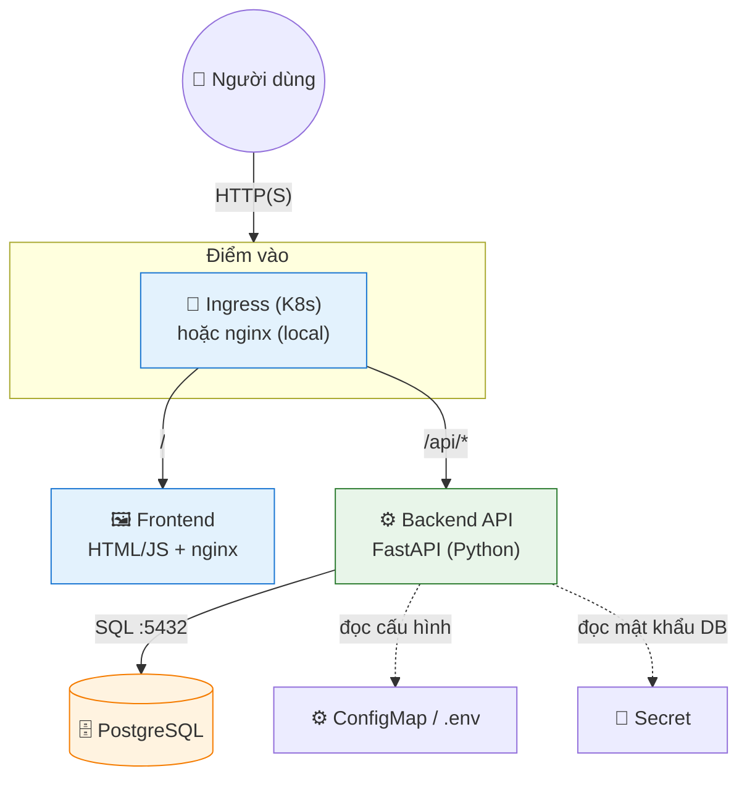
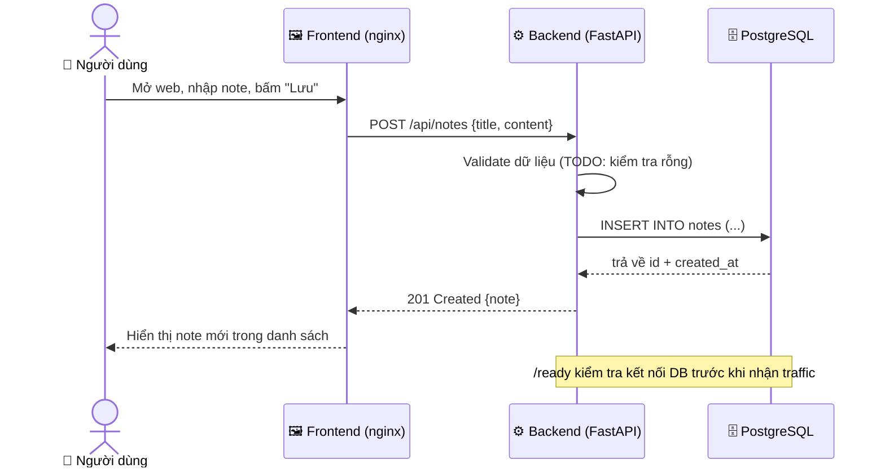
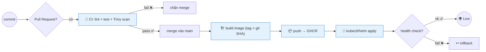
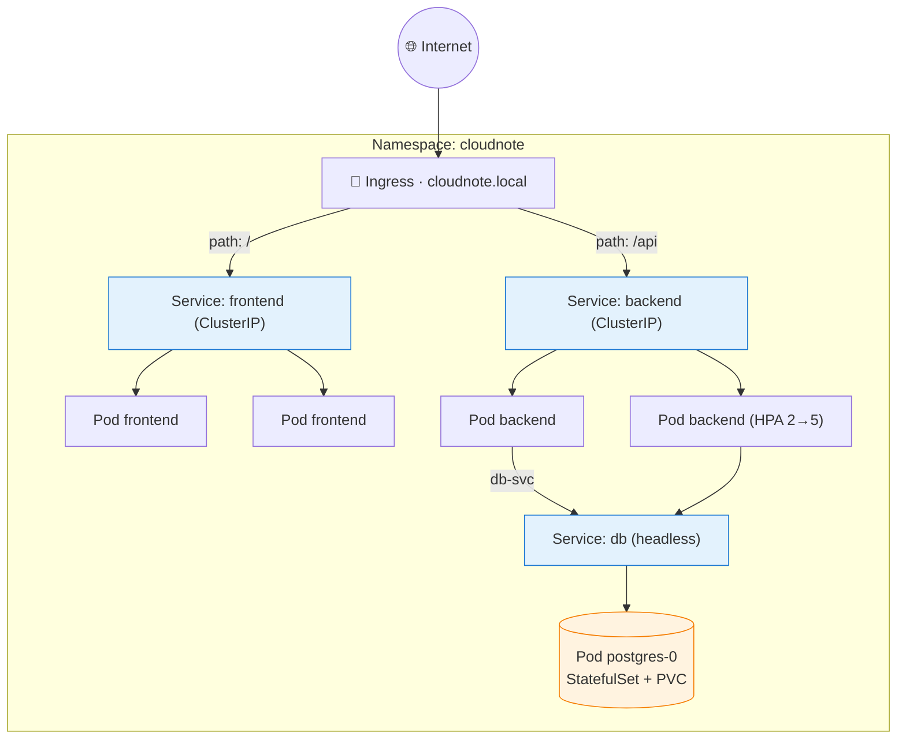
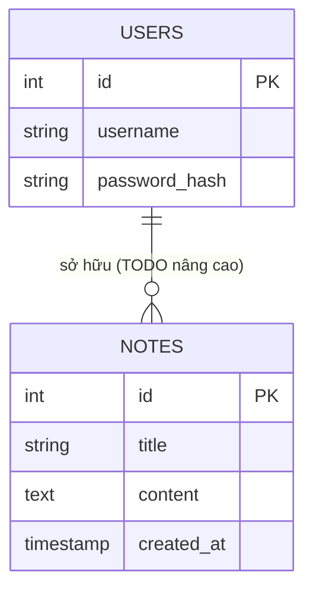

# 📐 CloudNote — Kiến trúc chi tiết & Quyết định thiết kế

Tài liệu này mô tả kiến trúc, luồng dữ liệu, và các quyết định thiết kế (ADR) của CloudNote. Vẽ lại các sơ đồ này vào portfolio/CV của bạn.

---

## 1. Sơ đồ thành phần (Component diagram)

## 2. Luồng một request "tạo note" (Sequence)

## 3. Luồng CI/CD (từ commit đến production)

## 4. Topology trên Kubernetes

## 5. Mô hình dữ liệu (ERD đơn giản)

> Bộ khung khởi đầu chỉ có bảng `notes`. Bảng `users` + quan hệ là **thử thách nâng cao** (thêm đăng nhập đa người dùng).

---

## 6. Quyết định thiết kế (ADR — Architecture Decision Records)

> ADR ghi lại "vì sao chọn cái này" — câu hỏi phỏng vấn kinh điển. Mỗi quyết định: bối cảnh → lựa chọn → lý do → đánh đổi.

### ADR-001: FastAPI cho backend
- **Bối cảnh:** cần REST API nhẹ, dễ học, gắn với module Python.
- **Quyết định:** FastAPI.
- **Lý do:** nhanh, tự sinh docs (`/docs`), type hint sẵn, cộng đồng lớn.
- **Đánh đổi:** nếu team quen Node/Go thì có thể chọn Express/Gin — kiến trúc không đổi.

### ADR-002: PostgreSQL thay vì NoSQL
- **Lý do:** dữ liệu note có cấu trúc + quan hệ (user→note), cần ACID. Postgres là mặc định an toàn.
- **Đánh đổi:** nếu cần cache/session tốc độ cao → thêm Redis (không thay Postgres).

### ADR-003: nginx frontend kiêm reverse proxy `/api` (ở local)
- **Lý do:** tránh lỗi CORS, 1 origin duy nhất; ở K8s thì Ingress đảm nhiệm routing.
- **Đánh đổi:** local và K8s định tuyến hơi khác nhau — đã tách rõ trong tài liệu.

### ADR-004: Kubernetes thay vì chỉ Docker Compose ở production
- **Lý do:** cần self-healing, auto-scale (HPA), rolling update không downtime — Compose không có.
- **Đánh đổi:** phức tạp hơn; với app nhỏ/nội bộ thì Compose + 1 VM là đủ (đừng over-engineer).

### ADR-005: Backend Postgres dùng StatefulSet + PVC
- **Lý do:** database là stateful, cần danh tính + storage ổn định; Deployment sẽ mất dữ liệu.
- **Đánh đổi:** vận hành DB trên K8s khó hơn managed DB (RDS/Cloud SQL) — cân nhắc cho production thật.

### ADR-006: Tag image theo git SHA, không dùng `latest`
- **Lý do:** truy vết chính xác phiên bản đang chạy, rollback đúng.
- **Đánh đổi:** không có, đây là best practice nên theo.

---

## 7. Bảo mật (Security checklist)

- [ ] Mật khẩu DB qua **Secret/biến môi trường**, không hard-code.
- [ ] Image quét **Trivy** trong CI, chặn nếu có lỗ hổng nghiêm trọng.
- [ ] Container chạy **non-root** (`USER` trong Dockerfile).
- [ ] Backend dùng **least privilege** với DB (user riêng, không superuser).
- [ ] DB **không expose** ra ngoài (chỉ network nội bộ / ClusterIP).
- [ ] (Nâng cao) NetworkPolicy: chỉ backend được nói chuyện với DB.
- [ ] `.env` và Secret thật nằm trong `.gitignore`, không commit.

## 8. Độ tin cậy (Reliability)

- **Liveness probe** `/health` — pod treo → K8s restart.
- **Readiness probe** `/ready` — chỉ nhận traffic khi DB sẵn sàng.
- **Resource requests/limits** — tránh 1 pod ngốn hết tài nguyên node.
- **HPA** — backend tự scale 2→5 theo CPU.
- **SLO gợi ý:** 99% request < 300ms, uptime 99.5% → error budget ~3.6h/tháng.
