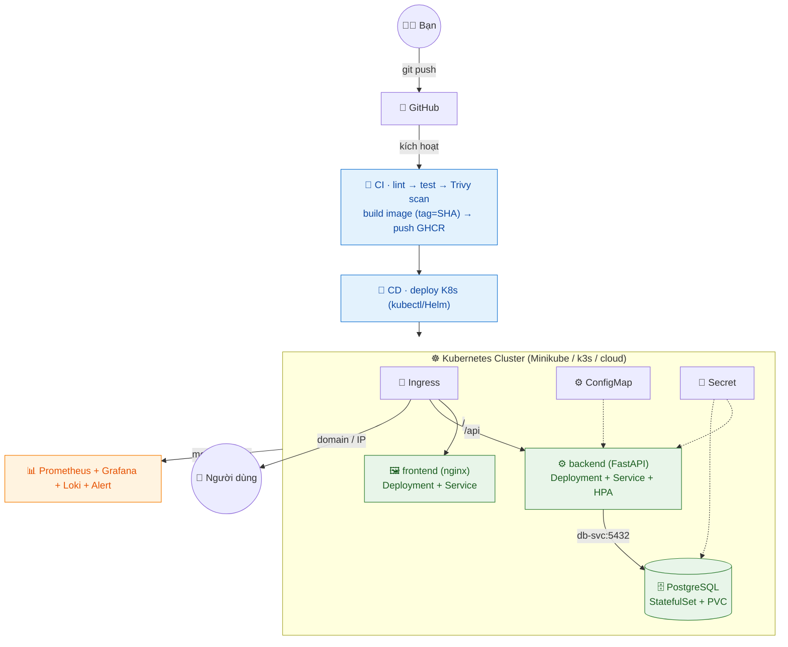
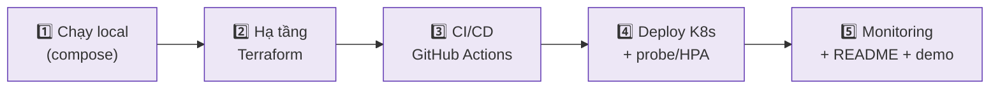

# 📝 CloudNote — Dự án Tốt nghiệp DevOps (Bộ khung code)

> Ứng dụng ghi chú 3 tầng (**frontend + backend API + database**) — bộ khung sẵn sàng để bạn **tự hoàn thiện** thành dự án tốt nghiệp end-to-end: Docker → CI/CD → Kubernetes → Monitoring → IaC.
>
> 🎯 Đây là **bộ khung học tập**: phần hạ tầng/pipeline đã dựng sẵn để bạn chạy được ngay; phần logic ứng dụng để các `# TODO` cho bạn tự code (học bằng cách làm).

---

## 🏗️ Kiến trúc tổng thể



## 🧱 Tech stack

| Tầng | Công nghệ | Vì sao |
|---|---|---|
| Frontend | HTML + JS thuần + nginx | đơn giản, không cần build phức tạp; nginx làm reverse proxy `/api` |
| Backend | Python **FastAPI** | gắn với [Module Python](../Module-Python-cho-DevOps.md); REST API nhanh, có `/docs` tự sinh |
| Database | **PostgreSQL** | quan hệ, ACID, chuẩn production |
| Đóng gói | Docker (multi-stage) + Compose | image nhỏ, chạy local 1 lệnh |
| Hạ tầng | Terraform | tạo VM/cluster bằng code |
| Điều phối | Kubernetes (+ Ingress, HPA, probe) | self-healing, auto-scale |
| CI/CD | GitHub Actions | test → scan → build → deploy tự động |
| Giám sát | Prometheus + Grafana + Loki | metrics + log + alert |

> 📐 Sơ đồ chi tiết từng tầng + luồng dữ liệu + quyết định thiết kế (ADR): xem [`ARCHITECTURE.md`](./ARCHITECTURE.md).

---

## 📂 Cấu trúc thư mục

```
capstone-cloudnote/
├── README.md                 # file này
├── ARCHITECTURE.md           # sơ đồ chi tiết + luồng + ADR
├── docker-compose.yml        # chạy cả 3 tầng ở local bằng 1 lệnh
├── .env.example              # mẫu biến môi trường (copy thành .env)
├── .gitignore
├── backend/                  # API FastAPI
│   ├── Dockerfile            # multi-stage, non-root, healthcheck
│   ├── .dockerignore
│   ├── requirements.txt
│   └── app/
│       ├── main.py           # API: /health /ready /api/notes (có TODO)
│       └── db.py             # kết nối + khởi tạo schema Postgres
├── frontend/                 # giao diện tĩnh + nginx reverse proxy
│   ├── Dockerfile
│   ├── nginx.conf
│   └── index.html
├── k8s/                      # manifest Kubernetes
│   ├── 00-namespace-config.yaml
│   ├── 10-postgres.yaml      # StatefulSet + PVC + Service
│   ├── 20-backend.yaml       # Deployment + Service + HPA + probe
│   ├── 30-frontend.yaml      # Deployment + Service
│   └── 40-ingress.yaml
├── terraform/                # hạ tầng bằng code (skeleton)
│   ├── main.tf
│   ├── variables.tf
│   ├── outputs.tf
│   └── backend.tf            # remote state
├── monitoring/
│   └── README.md             # cài Prometheus/Grafana/Loki bằng Helm
└── .github/workflows/
    ├── ci.yml                # lint + test + Trivy + build
    └── cd.yml                # build + push GHCR + deploy
```

---

## 🚀 Chạy thử ở LOCAL (bắt đầu từ đây)

```bash
cd capstone-cloudnote
cp .env.example .env                  # rồi sửa mật khẩu trong .env
docker compose up -d --build
# Mở: http://localhost:8080  (frontend, tự gọi /api → backend)
# API docs:  http://localhost:8080/api/docs   (FastAPI Swagger)
docker compose logs -f                # xem log
docker compose down                   # tắt (thêm -v để xóa cả dữ liệu)
```

**Kiểm tra nhanh:**
```bash
curl http://localhost:8080/api/health         # {"status":"ok"}
curl http://localhost:8080/api/notes          # [] lúc đầu
curl -X POST http://localhost:8080/api/notes -H 'Content-Type: application/json' \
     -d '{"title":"Note đầu tiên","content":"Hello CloudNote"}'
```

---

## ✅ Lộ trình hoàn thiện (5 phần — khớp Ngày 56–59)



- [ ] **Phần 1 — Chạy local:** `docker compose up`, tạo/xem note. Hoàn thành các `# TODO` trong `backend/app/main.py` (thêm DELETE, validate).
- [ ] **Phần 2 — Hạ tầng:** điền `terraform/`, `terraform apply` dựng VM/cluster, remote state.
- [ ] **Phần 3 — CI/CD:** bật `.github/workflows/`, push code → tự build + scan + push image.
- [ ] **Phần 4 — K8s:** `kubectl apply -f k8s/`, thêm probe/HPA, test self-healing (xóa pod) + autoscale.
- [ ] **Phần 5 — Monitoring:** cài stack theo `monitoring/README.md`, dashboard + 1 alert, viết demo.

> 📋 Tiêu chí hoàn thành đầy đủ: xem [Giai đoạn 4 — Phụ lục B](../Giai-doan-4-SRE-Capstone.md#phụ-lục-b--đề-bài-dự-án-tốt-nghiệp-cloudnote).

## 🧗 Thử thách nâng cao (làm để nổi bật)
- Thêm **đăng nhập user** (JWT) — biến note thành đa người dùng thật.
- **HTTPS tự động** bằng cert-manager + Let's Encrypt.
- **Blue/Green hoặc Canary** deploy.
- **GitOps** với ArgoCD thay vì deploy push.
- **Backup tự động** Postgres + thử restore (DR drill).

---

> 💡 **Cách dùng bộ khung này:** đừng copy-paste vô thức. Đọc code, hiểu vì sao, **gõ lại** các phần `# TODO`, và khi kẹt thì tra [Tài liệu tham khảo](../Tai-lieu-tham-khao.md). Mục tiêu là bạn **kể được toàn bộ kiến trúc + quyết định thiết kế** khi phỏng vấn.
