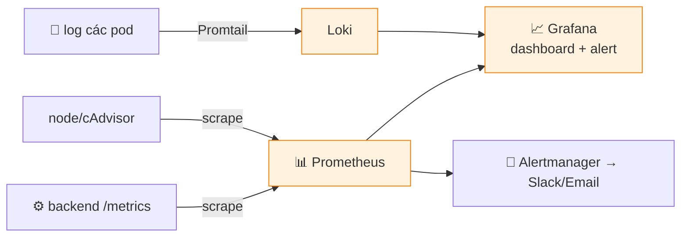

# 📊 Monitoring cho CloudNote (Phần 5)

Cài stack giám sát bằng Helm, tạo dashboard + alert. Đây là phần biến dự án "chạy được" thành **production-ready**.

## Luồng giám sát



## 1. Cài Prometheus + Grafana (kube-prometheus-stack)

```bash
helm repo add prometheus-community https://prometheus-community.github.io/helm-charts
helm repo update
helm install monitoring prometheus-community/kube-prometheus-stack -n monitoring --create-namespace

# Mở Grafana (mật khẩu admin mặc định: prom-operator)
kubectl -n monitoring port-forward svc/monitoring-grafana 3000:80
# → http://localhost:3000  (user: admin)
```

## 2. Cài Loki (log tập trung)

```bash
helm repo add grafana https://grafana.github.io/helm-charts
helm install loki grafana/loki-stack -n monitoring \
  --set promtail.enabled=true
# Trong Grafana: Add data source → Loki → http://loki:3100
```

## 3. Dashboard — 4 Golden Signals

Tạo dashboard cho app của bạn với 4 panel cốt lõi:
- **Latency:** p95/p99 thời gian phản hồi request.
- **Traffic:** số request/giây.
- **Errors:** tỉ lệ request lỗi (5xx).
- **Saturation:** CPU/RAM/disk %.

> Import nhanh dashboard có sẵn: **Node Exporter Full** (ID `1860`) cho metric hệ thống.

## 4. Để backend expose metric

```python
# 🔧 TODO trong backend: pip install prometheus-fastapi-instrumentator
from prometheus_fastapi_instrumentator import Instrumentator
Instrumentator().instrument(app).expose(app, endpoint="/metrics")
```
Rồi tạo `ServiceMonitor` (CRD của kube-prometheus-stack) trỏ tới Service `backend` để Prometheus tự scrape.

## 5. Alert mẫu (PrometheusRule)

```yaml
apiVersion: monitoring.coreos.com/v1
kind: PrometheusRule
metadata:
  name: cloudnote-alerts
  namespace: monitoring
  labels: { release: monitoring }
spec:
  groups:
    - name: cloudnote
      rules:
        - alert: BackendDown
          expr: up{job="cloudnote-backend"} == 0
          for: 1m
          labels: { severity: critical }
          annotations:
            summary: "Backend CloudNote DOWN"
        - alert: HighErrorRate
          expr: sum(rate(http_requests_total{status=~"5.."}[5m])) > 0.05
          for: 5m
          labels: { severity: warning }
          annotations:
            summary: "Tỉ lệ lỗi 5xx cao (> 5%)"
```

> 💡 Alert nên gắn với **SLO** (vd 99% request OK) chứ không phải mọi dao động nhỏ — tránh "alert fatigue".

## ✅ Checklist Phần 5
- [ ] Prometheus scrape được backend (`up == 1`).
- [ ] Grafana dashboard hiển thị 4 golden signals.
- [ ] Loki gom được log các pod.
- [ ] Ít nhất 1 alert hoạt động (test bằng cách tắt backend).
- [ ] Định nghĩa SLO + error budget trong tài liệu.
