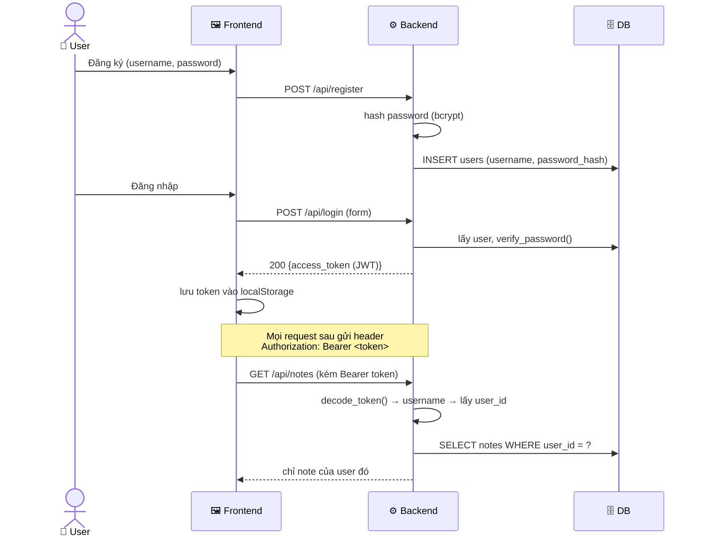

# ✅ Lời giải mẫu cho các `# TODO`

> ⚠️ **Hãy TỰ LÀM trước, rồi mới đối chiếu.** Đọc lời giải mà chưa tự vật lộn = không học được gì. Đây là bản tham khảo "chuẩn", không phải cách duy nhất.

Thư mục này chứa phiên bản **đầy đủ** của CloudNote — đã giải hết TODO trong bộ khung:

| TODO trong khung | Lời giải ở đây |
|---|---|
| `DELETE /api/notes/{id}` | `backend/main.py` → `delete_note()` |
| `PUT /api/notes/{id}` | `backend/main.py` → `update_note()` |
| `GET /metrics` cho Prometheus | `backend/main.py` (Instrumentator) + `k8s/servicemonitor.yaml` |
| Đăng nhập user (JWT) | `backend/auth.py` + bảng `users` trong `backend/db.py` |
| Nút xóa/sửa + login ở frontend | `frontend/index.html` |
| Viết test | `backend/tests/test_api.py` |

## Cách áp dụng vào bộ khung

```bash
# So sánh file của bạn với lời giải:
diff capstone-cloudnote/backend/app/main.py capstone-cloudnote/solutions/backend/main.py

# Hoặc thay thẳng (sau khi đã tự làm + hiểu):
cp solutions/backend/app/main.py     backend/app/main.py
cp solutions/backend/app/db.py       backend/app/db.py
cp solutions/backend/app/auth.py     backend/app/auth.py     # file MỚI
cp solutions/backend/requirements.txt backend/requirements.txt
cp solutions/frontend/index.html     frontend/index.html
docker compose up -d --build

# Lưu ý: bản đầy đủ YÊU CẦU đăng nhập. Test nhanh bằng API docs: http://localhost:8080/api/docs
#   1) POST /api/register  2) POST /api/login (lấy token)  3) Authorize 🔒  4) gọi /api/notes
```

---

## 🔐 Luồng xác thực JWT (giải thích sơ đồ)



**Ý tưởng cốt lõi:**
- **Không bao giờ lưu mật khẩu plaintext** — chỉ lưu `password_hash` (bcrypt, có salt).
- **JWT** = "vé thông hành" có chữ ký + hạn dùng; backend verify chữ ký mà không cần truy DB session.
- **Notes gắn `user_id`** → mỗi người chỉ thấy note của mình (đa người dùng thật).
- **`JWT_SECRET` qua biến môi trường** (Secret ở K8s), KHÔNG hard-code.

---

## 📊 Bật `/metrics` cho Prometheus

1. Thêm `prometheus-fastapi-instrumentator` vào requirements (đã có trong `solutions/backend/requirements.txt`).
2. Trong `main.py`: `Instrumentator().instrument(app).expose(app)` → tự sinh `/metrics`.
3. Đặt tên port `http` cho Service backend (trong `k8s/20-backend.yaml`):
   ```yaml
   ports:
     - name: http      # ← thêm name để ServiceMonitor tham chiếu
       port: 8000
       targetPort: 8000
   ```
4. Apply `solutions/k8s/servicemonitor.yaml` → Prometheus tự scrape.
5. Trong Grafana, query thử: `rate(http_requests_total[5m])`.

---

## 🧪 Chạy test

```bash
cd capstone-cloudnote/solutions/backend
pip install -r requirements.txt
pytest -v
```
Test ở đây **mock DB** (không cần Postgres thật) — kiểm tra tầng API + validation + auth. Đây là **unit test** đúng cách: nhanh, không phụ thuộc hạ tầng.

> 💡 Bài tập tiếp theo: thêm **integration test** chạy thật với Postgres (dùng `testcontainers` hoặc docker compose trong CI).
